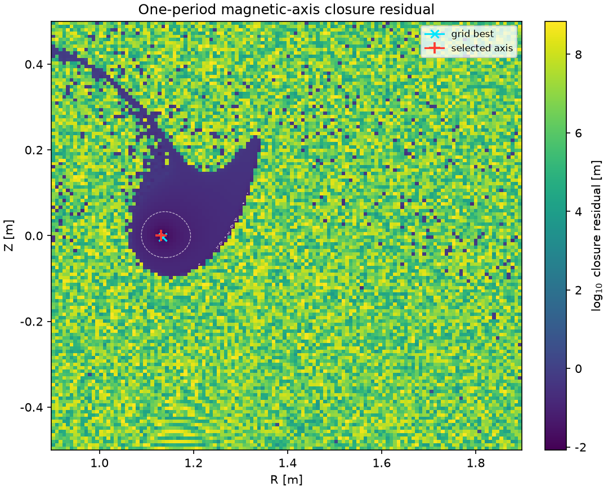
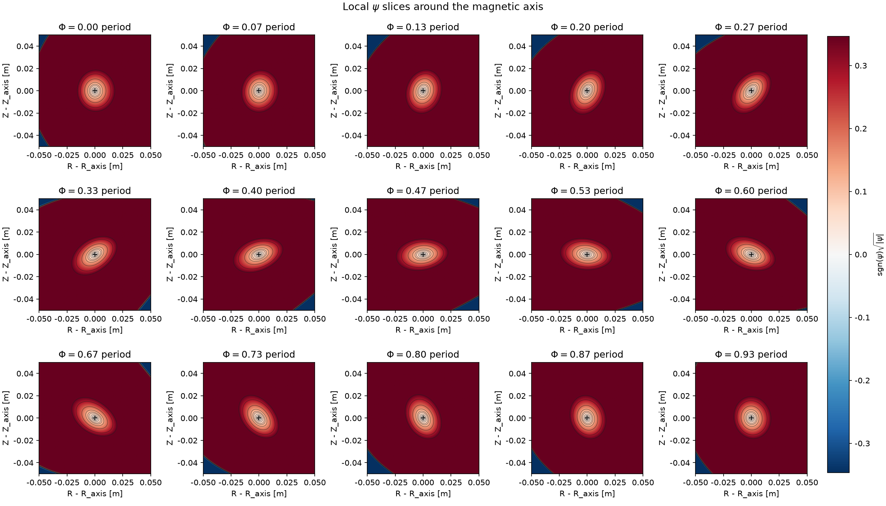

# Local Surface Evaluator

从线圈到局部磁面的一站式快速评估器。输入线圈 Fourier 系数、电流和 `nfp`，程序会自动搜索磁轴、拟合局部 $\psi$、筛选候选等 $\psi$ 面，并把最大可信候选面接入 Simsopt 的 Boozer surface / QS error 评估。

重点特性：

- **从线圈到磁面**：输出磁轴、$\psi$ 模型、候选磁面、$\iota$、volume、$G$ 和 QA/QH/QP QS error。
- **连续品质分数**：默认输出 `quality_score`，把磁轴、$\psi$、磁面筛选、Boozer/QS 和线圈工程项压缩为 0-100 的可解释分数。
- **Boozer 初值自动估计**：如果没有提供推荐 `initial_iota`，程序会从 $\psi_0$ 筛选阶段已有的一周期磁力线端点中便宜估计 $\iota$，避免默认 `-2` 把 Boozer LS 带入慢分支。
- **GPU 加速主链路**：磁力线追踪、$\psi$ 拟合、$\psi_0$ 筛选和等值面提取已接入 CUDA 后端；单个常规样本在 RTX 5090 级别 GPU 上约 3 秒量级完成评估。
- **快速失败而不是卡住**：对找不到磁轴、局部 $\psi$ 质量差、没有可信候选磁面或 Boozer 阶段失败的样本，返回结构化失败原因、最好残差和细粒度计时。
- **诊断图可选导出**：显式加参数后，可以额外导出高分辨率磁轴 residual heatmap 和细粒度 $\psi$ 截面图；默认不导图，避免影响批量测速。

当前实现用于快速筛选和诊断，不替代高精度平衡求解或长时间磁面验证。

## 安装

```bash
python -m pip install -e .
```

完整 Boozer/QS 评估需要 `simsopt`。GPU 后端需要先编译 `gpu_backend` 下的 CUDA/C++ 库；没有 GPU 后端时，可以使用 CPU 路径或只运行不依赖 GPU 的后处理工具。

## 最小运行示例

不加额外参数即可跑默认 `examples/01.json`，并得到主流程测速和最终结果：

```bash
python -m stellarator_eval.cli
```

典型输出：

```text
summary: runs/01_raw/summary.json
axis residual: 1.7e-08, has_axis=True
quality score: 92.4, status=surface
best surface: psi=0.12, iota=-2.90768, volume=0.00615026, G=7.63113
```

完整计时在 `runs/01_raw/summary.json` 的 `timing` 和 `total_time_s` 字段中。例如：

```bash
python - <<'PY'
import json
with open("runs/01_raw/summary.json", encoding="utf-8") as f:
    s = json.load(f)
print("total_time_s =", s["total_time_s"])
print("timing =", s["timing"])
PY
```

在 RTX 5090 级别 GPU 上，当前默认主链路通常是 3 秒量级；具体数值会随 GPU、CUDA、Simsopt 版本和候选面数量变化。

## 导出诊断图

默认命令不会画图。需要诊断磁轴搜索 landscape 和 $\psi$ 截面时，显式加参数：

```bash
python -m stellarator_eval.cli \
  --export-axis-heatmap \
  --axis-heatmap-grid 512 \
  --export-psi-slices \
  --psi-slice-grid 321 \
  --psi-slice-phi-count 21
```

这会在 `runs/01_raw/` 中额外生成：

- `axis_residual_heatmap.png`：第一步找磁轴时，一周期闭合 residual 的高分辨率热力图。
- `psi_slices.png`：沿一个场周期的局部 $\psi$ 截面图，颜色使用 signed-sqrt 缩放以保留小 $\psi$ 区域的可见性。

示例 residual heatmap：



示例 $\psi$ 截面图：



## 常用显式运行

`01` 示例：

```bash
python -m stellarator_eval.cli \
  --case-file examples/01.json --key raw \
  --output-dir runs/01_raw \
  --a 0.05 \
  --initial-iota -2.0
```

`debug` 示例更极端，建议先用较小半径：

```bash
python -m stellarator_eval.cli \
  --case-file examples/debug.json --key raw \
  --output-dir runs/debug_raw \
  --a 0.02 \
  --initial-iota -4.0 \
  --levels 0.001,0.002,0.004,0.008,0.012
```

默认会把 `OMP_NUM_THREADS`、`OPENBLAS_NUM_THREADS`、`MKL_NUM_THREADS`、`NUMEXPR_NUM_THREADS` 设为 `1`。这是有意的：当前很多小批量磁场计算在多线程下会被同步开销拖慢。

默认还会启用 `auto_initial_iota`：当 Boozer 初值仍是默认 `-2` 时，程序会用 field-line screen 中估计出的 `iota_estimate` 替代它；如果你显式传入其它 `--initial-iota`，则不会覆盖。需要强制使用 `-2` 或其它配置值时，可加：

```bash
python -m stellarator_eval.cli --disable-auto-iota
```

## Python API

```python
from stellarator_eval import EvalConfig, evaluate_case_file

cfg = EvalConfig()
cfg.psi.a = 0.05
cfg.psi.poly_degree = 10
cfg.psi.m_tor = 12
cfg.diagnostics.export_axis_heatmap = True
cfg.diagnostics.export_psi_slices = True

result = evaluate_case_file(
    "examples/01.json",
    key="raw",
    config=cfg,
    output_dir="runs/01_raw",
)
```

也可以直接传线圈，并只取压缩后的品质分数：

```python
from stellarator_eval import evaluate_coil_quality

out = evaluate_coil_quality(
    coil_coefficients,
    currents,
    nfp=8,
    output_dir="runs/my_coils",
)
print(out["score"], out["status"])
```

`coil_coefficients` 可以是 `{"x": x, "y": y, "z": z}`，也可以是形状为 `(n_base_coils, 3, n_coeff)` 的数组。扁平输入格式按每根基础线圈组织：

```text
x[0:33], y[0:33], z[0:33], current
```

因此线圈部分总长度为 `n_base_coils * 100`，`nfp` 作为额外参数传入。

如果你的优化器更方便输出一个 packed vector，也可以把 `nfp` 放在最后一位：

```python
from stellarator_eval import evaluate_coil_quality

# packed = [coil_0_x/y/z/current, coil_1_x/y/z/current, ..., nfp]
out = evaluate_coil_quality(packed, output_dir="runs/my_packed_coils")
score = out["score"]
components = out["quality_score"]["components"]
```

## 输出

每次运行会在 `output-dir` 中生成：

- `summary.json`：完整结构化结果。
- `axis_data.npz`：磁轴采样、轴点和闭合残差。
- `psi_model.npz`：$\psi$ 模数、系数和磁轴数据。
- `level_*/boozer_surface.npz`：候选 Boozer surface 的自由度、$\iota$、$G$ 等。

常用字段：

- `axis.has_axis`
- `axis.best_residual`
- `axis.topology_class`
- `axis.topology_ellipse_aspect`
- `psi.fit_info`
- `surface_screen.levels`
- `best_surface.iota`
- `best_surface.volume`
- `best_surface.G`
- `best_surface.qs_error_QA_1_0`
- `best_surface.qs_error_QH_1_1`
- `best_surface.qs_error_QP_0_1`
- `quality_score.score`
- `quality_score.components`
- `quality_score.details`
- `diagnostics`
- `timing`

`axis.best_residual` 是一周期追踪后的最好闭合距离；即使 `has_axis=false`，这个值仍会输出，用于判断是“接近但未达阈值”还是“完全没有可用闭合点”。

`quality_score.score` 是 0-100 分，经验解释如下：

| score | 含义 |
| ---: | --- |
| `90-100` | 高质量候选，通常全流程成功且 QS/工程项较好。 |
| `80-90` | 可用候选，但 QS、volume、iota 或线圈工程项至少一项不顶尖。 |
| `65-80` | 边缘但有诊断价值，可能是较弱 surface 或较好的 no_surface。 |
| `45-65` | 明显有问题，但通常仍有磁轴或局部 $\psi$ 结构信息。 |
| `25-45` | 较差，常见于弱闭合、差磁面或扰动后退化样本。 |
| `0-25` | 基本不可用，通常找不到可靠磁轴。 |
 
该分数不是黑盒拟合模型，而是多个软阈值分量的加权平均。六个主分量为 `axis`、`psi`、`surface`、`boozer`、`physics`、`coil`，其中 `coil` 包含长度、曲率、线圈间距、线圈到轴距离、高阶模能量和电流尺度等工程项。

## QUASR 批量评估

QUASR 数据集不随仓库发布。运行批量评估时显式传入数据位置，或设置环境变量：

```bash
export QUASR_ROOT=/path/to/quasr/data
export QUASR_METADATA=/path/to/quasr/metadata.csv
```

示例：

```bash
python scripts/eval_quasr.py \
  --quasr-root "$QUASR_ROOT" \
  --metadata "$QUASR_METADATA" \
  --sample-size 128 \
  --sample-seed 20260705 \
  --helicity 1 \
  --output-dir runs/quasr_qh128 \
  --gpu-device 0 \
  --psi-n-r 80 --psi-n-z 80 --psi-n-phi 80 \
  --qs-sdim 16
```

批量输出包括 `batch_summary.json`、`batch_summary.csv`、每个样本的 `summary.json`，以及导出的失败样本 JSON。导出的失败样本默认写入本地 `examples/`，但 `examples/debug_*.json` 已被 `.gitignore` 忽略。

## 文档

- [计算流程](docs/计算流程.md)
- [性能报告](docs/性能报告.md)
