# 从线圈到 QH 评分与潜空间优化：方法与实验

**版本日期：** 2026-08-10
**适用实现：** 原生 score ABI 10；QH 目标 $(M,N)=(1,N_{\rm FP})$

当前生产默认使用 $48^3$ 的 $\psi$ 拟合网格、三次 $\iota(\rho^2)$ 和 mode 2 严格磁轴续接。第 6 节中明确标为 ABI-9 的分布、landscape 与早期 Adam 实验是历史证据，其绝对分数不能和当前 ABI-10 直接比较。

## 摘要

本文给出一条从 Fourier 线圈参数到体准螺旋对称（QH）评分的稳定计算链，以及建立在该评分器上的生成模型和潜空间优化方法。快速主线的所有大规模数值步骤均由 C++/CUDA 实现，核心求解只包含定长磁力线追踪、线性最小二乘和固定规模归约，不使用收敛时间不可控的高维非线性优化。另一条完整评估支线复用同一套磁轴、局部磁面不变量和磁通标定结果，通过 $\alpha+\nu$ 构造近 Boozer 初值，再交给 Simsopt LS/Newton 与 DESC 作独立物理验收。

实验表明：直接从训练后的 flow-matching 模型采样仍不能稳定产生高质量 QH 尾部，但该可逆流将原始 Fourier 参数空间重参数化为更易搜索的潜空间。当前生产配置采用两个正交中心差分方向估计梯度，并以 $\beta_1=0.7$ 的 Adam 更新，可以在固定条件下将随机候选提升到 85--93 分；独立完整评估确认高原生分数对应嵌套磁面、小面 QS error 和可被 DESC 显著降低的力残差。

## 1. 问题定义与总体流程

每个基本线圈是一个 100 维 token：三个方向各 33 个实 Fourier 系数，再加一个电流。输入还包括场周期数 $N_{\rm FP}$ 和基本线圈数 $n_c$。其余线圈由恒星器对称和场周期旋转生成。

共享前端与两条后端支线为：

$$
\text{coils}
\rightarrow \boldsymbol B
\rightarrow \text{axis}
\rightarrow s
\rightarrow \psi(s)
\rightarrow (\alpha,\iota)
\begin{cases}
\rightarrow \text{volume QS}\rightarrow \text{score},\\
\rightarrow \nu\rightarrow \text{Simsopt LS/Newton}\rightarrow \text{DESC}.
\end{cases}
$$

这里 $s$ 只是围绕磁轴拟合的无量纲局部磁面标签，$\psi$ 才是通过真实磁通积分标定后的物理环向磁通。把两者混为一谈会直接破坏体积权重、$\rho$ 与 QS 公式。

快速评分器的目标是高吞吐、定长运行和大致正确排序，不代替最终平衡求解；完整支线的目标是验证高分线圈是否确实存在足够大的嵌套磁面，并给出可供 DESC 使用的低残差初值。

## 2. 原生 C++/CUDA 评分器

### 2.1 磁场与线圈工程量

线圈曲线离散为 256 段，Biot--Savart 场、空间梯度及批量点场值由 CUDA 内核计算。评分器同时计算长度、曲率、线圈间距、线圈到磁轴距离、高阶模能量和电流尺度等工程量。工程分量是软评分，不单独决定可行性；磁轴、磁面和磁通阶段失败会返回结构化状态并快速终止。

### 2.2 批量追踪寻找磁轴

在一个场周期的 $R$--$Z$ 截面上建立 $48\times48$ 候选网格，对每个点并行计算 Poincare 映射

$$
P(R,Z)=\bigl(R(2\pi/N_{\rm FP}),Z(2\pi/N_{\rm FP})\bigr).
$$

候选固定点满足

$$
F(q)=P(q)-q=0,
$$

随后使用有限差分 $2\times2$ Jacobian 和最多 6 次阻尼 Newton 作批量精修。只有椭圆固定点才可作为磁轴：若 $J_P$ 是 Poincare 映射 Jacobian，则使用

$$
\frac{|\operatorname{tr}J_P|}{\sqrt{\det J_P}}<2
$$

判定椭圆拓扑。拓扑 margin 只参与质量排序，不再被错误地当作“磁轴是否存在”的硬阈值。若首轮无可靠候选且 $N_{\rm FP}\le7$，启用固定大小的 $64\times64$ fallback 网格；这仍是有上界的 GPU 批处理，不引入长尾迭代。最终沿磁轴采样 240 点，并用周期 Hermite 插值得到 $R_0(\phi)$、$Z_0(\phi)$ 及导数。

### 2.3 局部不变量 $s$ 的定义与拟合

定义轴相对归一化坐标

$$
X=\frac{R-R_0(\phi)}{a},\qquad
Y=\frac{Z-Z_0(\phi)}{a},
$$

其中评分主线默认 $a=0.05\,\mathrm m$。拟合函数写成

$$
s(X,Y,\phi)=X^2+
\sum_{a'+b'=2}^{d}\sum_{m=0}^{M}
\left[
c^{c}_{a'b'm}X^{a'}Y^{b'}\cos(mN_{\rm FP}\phi)
+c^{s}_{a'b'm}X^{a'}Y^{b'}\sin(mN_{\rm FP}\phi)
\right].
$$

基函数选择规则如下：总多项式次数为 $2\le a'+b'\le d$；每个总次数包含全部 $X^{a'}Y^{b'}$；环向模数为 $0\le m\le M$；$m=0$ 只保留余弦常数项；显式排除已固定系数为 1 的 $X^2$ 常数模。默认 $d=10$、$M=12$。不包含常数项和一次项，因此轴附近 $s=O(r^2)$，且避免平移自由度与磁轴定义重复。

理想磁面标签满足

$$
\boldsymbol B\cdot\nabla s=0.
$$

由于 $s$ 对系数线性，对每个采样点有

$$
\sum_k c_k\,\boldsymbol B_i\cdot\nabla\Phi_k
=-\boldsymbol B_i\cdot\nabla X^2.
$$

评分器在轴周围圆盘内对 $R,Z$ 作均匀 Cartesian 网格采样，并在一个场周期内均匀采样 $\phi$；当前生产默认采用 $48\times48\times48$ 网格。CUDA 生成场值和设计矩阵，cuSOLVER 以 FP32 QR 求带 $10^{-6}$ 谱正则的线性最小二乘。另用 4000 个面积均匀随机点验证

$$
\epsilon_s=
\frac{\boldsymbol B\cdot\nabla s}{|\boldsymbol B|\,|\nabla s|},
$$

并记录 $L^2$、均值与 P95。这里追求的是足够准确、可嵌套的局部不变量，不声称 $s$ 已经是物理磁通。

### 2.4 连续的可用磁面范围估计

快速 score 在固定径向水平上从磁轴沿极角射线求根，并把所有角点一起在 GPU 上追踪一个场周期。对第 $j$ 层的角点，使用无量纲法向漂移

$$
d_{jk}=\frac{|s(Px_{jk})-s_j|}
{|\nabla s(Px_{jk})|\,\bar r_j}
$$

构造平滑尾部风险，再经 logistic 映射得到该层置信度。为避免近轴数值误差把所有外层一起否决，对置信度执行按径向区间加权的单调回归。置信度曲线下的面积给出连续边界提议；随后只进行固定 6 次磁通可逆性二分，得到有上界的最终边界。当前生产预算是一个周期、每层 128 个极角点、每周期 400 个追踪步，不再在 score 内运行 16 周期长追踪。

该边界不是严格最大磁面。表面尺寸分量在有效逆纵横比

$$
\epsilon_a=\frac{a_{\rm eff}}{R_{\rm major}}
$$

达到 0.03 后饱和，防止仅靠继续增大磁面刷分；最终候选的最大可行面仍由完整评估支线独立搜索。

### 2.5 从 $s$ 标定物理磁通 $\psi$

在 11 个嵌套 $s$ 水平、8 个环向截面上，使用 256 个极角点和 24 点径向 Gauss--Legendre 积分计算环向磁通。采用每弧度磁通约定

$$
\psi(s)=\frac{\Phi_t(s)}{2\pi},
$$

并拟合零截距四阶多项式

$$
\psi(s)=\sum_{k=1}^{4}a_k s^k.
$$

接受条件同时约束截面间相对标准差、边界射线残差以及 $\psi'(s)$ 在所用区间内单调且不变号。之后定义

$$
\rho=\sqrt{\frac{\psi(s)}{\psi(s_{\rm edge})}},\qquad
\nabla\psi=\psi'(s)\nabla s.
$$

这一步把几何标签转换为 QS 微分公式所需的物理量。

### 2.6 $\alpha$ 与 $\iota$ 的联合线性拟合

在柱坐标几何角 $(\theta,\phi)$ 下定义直线场线角

$$
\alpha=\theta+\lambda(\rho,\theta,\phi)-\iota(\rho)\phi,
$$

并施加

$$
\boldsymbol B\cdot\nabla\alpha=0.
$$

$\lambda$ 采用 Zernike--Fourier 基底

$$
\lambda=
\sum_{l,m,n,\sigma}c_{lmn}^{\sigma}
R_l^m(\rho)T_\sigma(m\theta-nN_{\rm FP}\phi),
$$

其中 $l=m,m+2,\ldots,L$，$m\le\min(L,M)$；$m=0$ 时 $n=1,\ldots,N$，$m>0$ 时 $n=-N,\ldots,N$；$T_\sigma$ 包含正弦和余弦实基，常数 gauge 被删除。评分主线取 $L=M=N=12$，并以

$$
\iota(\rho)=\sum_{p=0}^{P}\iota_p\rho^{2p}
$$

展开；当前快速 score 与完整评估均使用 $P=3$。历史常数 $\iota$ 结果只保留为旧实验记录，不能与当前分数直接比较。

将法向于 $s$ 的数值误差从 $\boldsymbol B$ 中投影掉后，方程对 $c_{lmn}^{\sigma}$ 与 $\iota_p$ 同时线性：

$$
B^\theta_i+
\sum_k c_k\,\boldsymbol B_i\cdot\nabla\Phi_k
-\sum_p\iota_p\rho_i^{2p}B_i^\phi=0.
$$

体点按等面积径向分布和均匀角度在 GPU 上生成并压紧有效点。默认生成 100000 点，其中 30000 点参与联合拟合；权重为径向 bin 均衡因子与相对磁场因子的乘积，列再做尺度归一化，最后由 FP32 cuSOLVER QR 求解。该过程一次得到全体积的 $\lambda$ 展开和 $\iota$，没有先猜 $\iota$ 再非线性迭代的问题。

### 2.7 体微分 QS 指标

快速 score 不需要显式求 $\nu$，也不需要构造每个 Boozer 面。给定 $\psi$、$\iota$、$\boldsymbol B$ 和 $\nabla\boldsymbol B$，定义

$$
A=(\boldsymbol B\times\nabla\psi)\cdot\nabla|\boldsymbol B|,
\qquad
C=\boldsymbol B\cdot\nabla|\boldsymbol B|,
$$

$$
f_C=(M\iota-N)A-MGC.
$$

当前坐标角以弧度计，且 $\psi=\Phi_t/(2\pi)$，因此真空场的协变电流函数必须使用

$$
G=\frac{\mu_0I_{\rm link}}{2\pi}
=2\times10^{-7}\,2N_{\rm FP}\sum_k|I_k|,
$$

符号取自边界环向磁通。当前 ABI 10 继承并保持了该 $2\pi$ 约定和全局电流反号约定。报告值统一除以 helicity 向量长度：

$$
E_{M,N}=\frac{1}{\sqrt{M^2+N^2}}
\sqrt{\frac{\sum_i w_i\left(f_{C,i}/|\boldsymbol B_i|^3\right)^2}
{\sum_iw_i}}.
$$

QH、QA、QP 分别取 $(1,N_{\rm FP})$、$(1,0)$、$(0,N_{\rm FP})$。除全体积 RMS 外还计算外层径向 bin 的 edge RMS。体积权重来自柱坐标 Jacobian、径向射线和采样密度的组合，而不是有效点数量本身，因此减少有效点不能直接降低 QS error。

具体地，每条 $(\theta,\phi)$ 射线的边界半径记为 $r_b$，径向点按 $r^2$ 均匀采样，即

$$
r=r_b\sqrt{\rho_{\min}^2+(1-\rho_{\min}^2)u},
\qquad u\sim U(0,1).
$$

径向 Jacobian 已被该采样分布吸收，剩余 Monte Carlo 体积权重为

$$
w_i=R_i r_{b,i}^2.
$$

因此不同磁面形状通过真实柱坐标体积测度进入统计；有效点只要未达到固定预算下限就直接失败，达到预算后则分层压紧到固定 100000 点，而不会因保留点少得到更小的 RMS。

### 2.8 总分构成与防退化设计

各分量先映射到 $[0,1]$。误差型量使用

$$
q_\downarrow(x;s,p)=\frac{1}{1+(x/s)^p},
$$

尺寸型量在阈值内使用 smoothstep，达到饱和值后不再增加。轴、$s$、surface、coordinate、volume-QS、$\iota$ 和 coil 的权重分别为

$$
(10,10,10,10,42,10,8).
$$

QH 额外使用三类防退化机制：

1. $\iota$ 分量按 $\min|\iota|/1$ 的平方增长，并在总分外再乘一个带 0.1 探索下限的 $\iota$ gate，压制 $\iota\simeq0$ 的圆线圈退化解。
2. 体 QS 分量同时乘尺寸和 $\iota$ 因子，但尺寸达到逆纵横比 0.03 后饱和。
3. 以

$$
h=\frac{\min(E_{\rm QA},E_{\rm QP})}
{E_{\rm QH}+\min(E_{\rm QA},E_{\rm QP})}
$$

衡量 QH 相对竞争优势，并在总分外施加 helicity gate，防止一个三个对称性误差都大的样本仅靠绝对尺度取得高分。

令七个归一化分量为 $q_k$、对应权重为 $w_k$，则门控前分数为

$$
S_0=100\frac{\sum_k w_k q_k}{\sum_k w_k}.
$$

记 $q_\iota$ 为上述 $\iota$ 分量，$h$ 为 QH 相对优势，并定义

$$
u=\operatorname{clip}_{[0,1]}\!\left(\frac{h-0.1}{0.2}\right),
\qquad
v=\operatorname{clip}_{[0,1]}\!\left(\frac{h}{0.3}\right),
$$

$$
q_h=0.2v+0.8u^2(3-2u).
$$

最终 QH 分数是

$$
S=S_0\,[0.1+0.9q_\iota]\,[0.1+0.9q_h].
$$

两个 0.1 下限只为失败区保留可搜索信号；当 $|\iota|\to0$ 或 QH 不优于 QA/QP 时，样本不可能依靠大磁面与好线圈工程项取得接近 100 的分数。

失败样本不会进入完整 QS 计算，但仍得到与已完成阶段相符的低分和状态标签，例如 `no_axis`、`no_surface`、`flux_rejected`、`drift_rejected`。该设计保证固定计算上界，也保留优化早期所需的探索梯度。

## 3. 完整评估支线：$\alpha+\nu$ 到 DESC

快速 score 使用固定 $a=0.05$ 和定长 surface screen；完整评估不能复用某个历史样本的固定 $a$ 或 $s$。它先为当前线圈比较多个 $a$，选择验证残差良好的 $s$ 源，再从内向外延续多个候选水平。磁面的最终存在性判据是标准 Simsopt LS/Newton 与独立 $97\times97$ 密网格验证，不是初始 $s$ 猜测误差单独过某个阈值。

在候选面上以更密 GPU ray 点重新拟合 $\alpha$，取 $L=12$、$M=12$、$N=16$ 和三阶 $\iota(\rho^2)$。随后求解环向修正 $\nu$。对固定磁面，$\nu$ 满足磁微分方程

$$
D\nu=(\partial_\phi+\iota\partial_\theta)\nu=g(\theta,\phi).
$$

展开为 $\cos 2\pi(m\theta-nN_{\rm FP}\phi)$ 与正弦模后，每个非共振模直接除以

$$
2\pi(m\iota-nN_{\rm FP}),
$$

并对近共振分母正则化。$\alpha$ 修正场线角，$\nu$ 修正环向参数化；二者都不应把物理磁面变成另一张自交曲面。它们的作用是把由 $s$ 给出的嵌套面转换为接近 Boozer 坐标的低残差初值，显著提高后续 Simsopt 和 DESC 的鲁棒性。

标准交付固定包含 Poincare 验证、白底彩色 $|B|$ 等高线、全装置线圈与最大接受磁面 HTML、面 QA/QH/QP error，以及 DESC 的边界、Boozer 模、Boozer $|B|$、QA/QH/QP 和 $\iota$ 等全部成功图。具体入口和禁止回退规则见[精简线圈评估流程](精简线圈评估流程.md)。

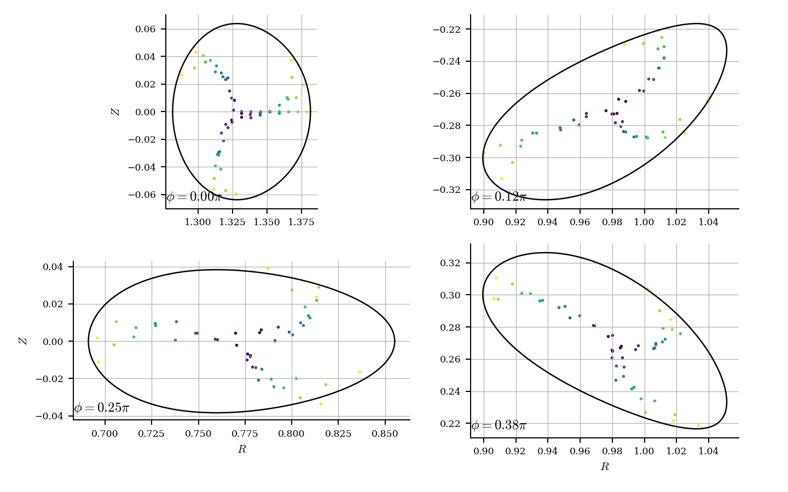

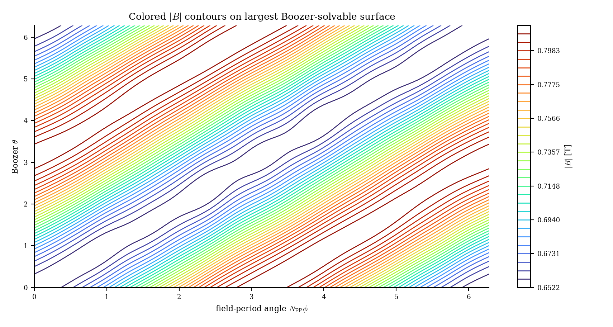

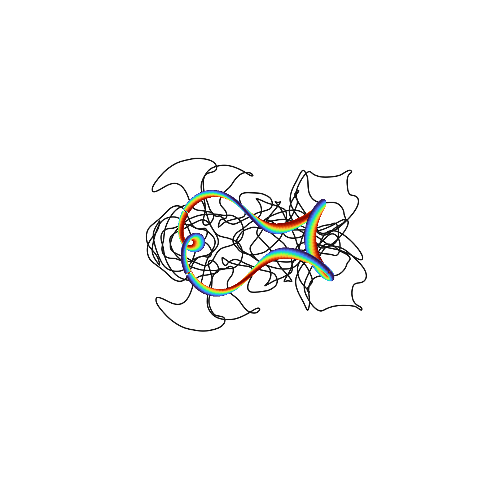

## 4. Flow matching 重参数化

### 4.1 归一化、目标与模型

训练集为全部 170755 个 QUASR QH 样本，覆盖 $N_{\rm FP}=2\ldots8$ 和 1--5 个基本线圈。每个 $(N_{\rm FP},n_c)$ 条件先把电流 $L^1$ 范数标定到该组中位数，并把最大绝对电流的符号规范为正；几何 99 维和电流随后逐维标准化并裁剪到 $[-8,8]$。逐维标准化只用于改善输入分布，不决定物理损失权重。

训练采用 rectified flow。对真实标准化样本 $x$ 和高斯噪声 $z$，构造

$$
x_t=(1-t)z+tx,\qquad v^*=x-z,
$$

并拟合 $v_\theta(x_t,t,N_{\rm FP})$。几何损失按照 Fourier Parseval 等式恢复原始曲线的积分 $L^2$ 意义。常数系数权重为 1，非零正弦/余弦系数权重为 $1/2$，再乘原始尺度的方差；最终几何项由 95% 物理权重和 5% 标准化相对误差组成，电流维权重为 1。

模型有 30333540 个参数：8 层、宽度 512、8 头、SwiGLU hidden 1408。每个线圈是一个 token；模型使用无 RoPE、无因果 mask 的全连接多头注意力，RMSNorm、PreNorm 和 SwiGLU。没有位置编码使模型对基本线圈排列等变。时间用正弦嵌入加 MLP，$N_{\rm FP}$ 用 learned embedding 注入每个 block；$n_c$ 由 token 数和 mask 表达。

### 4.2 ODE 与可逆性

训练后定义常微分方程

$$
\frac{dx_t}{dt}=v_\theta(x_t,t,N_{\rm FP}),
\qquad F(z)=x_1.
$$

对局部 Lipschitz 的速度场，ODE 流映射是可逆的；同一个模型把积分区间从 $1\to0$ 即得到 $F^{-1}$。优化和高精度诊断统一使用 FP32 RK4-256。可逆性不是额外训练的编码器性质，而是 ODE 流本身的性质；数值误差通过真实线圈反向再正向的闭环误差独立验证。

物理损失主模型使用 4 张 RTX 5090、全局 batch 32768，在恒定学习率 $3\times10^{-4}$ 下训练 30000 步，累计约 47.2 分钟。验证物理 loss 在 30000 步附近达到最低；继续训练出现验证回升，因此该 checkpoint 不是人为过早截断。

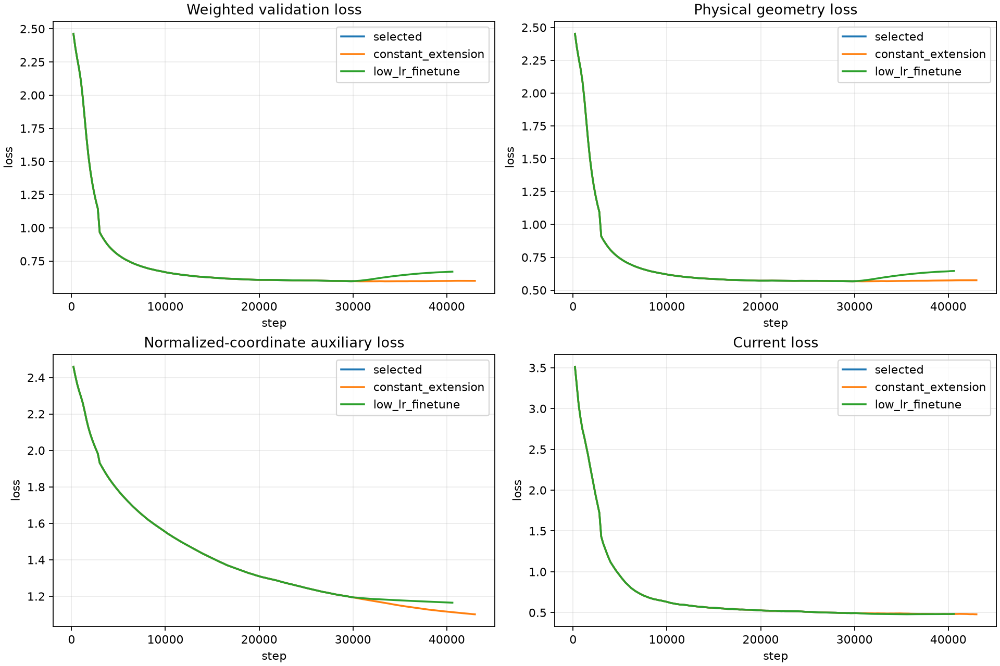

## 5. 潜空间 SPSA 型梯度与 Adam

### 5.1 梯度估计

在固定 $(N_{\rm FP},n_c)$ 下优化潜变量 $z\in\mathbb R^D$，目标为原生评分

$$
J(z)=S(F(z)).
$$

每一步随机生成 $K=4$ 个两两正交方向 $u_j$，令每个方向的 RMS 为 1，即 $\|u_j\|_2=\sqrt D$。用反向差分

$$
\Delta_j=J(z+cu_j)-J(z-cu_j),
$$

构造

$$
\widehat g=\frac{1}{K}\sum_{j=1}^K
\frac{\Delta_j}{2c}u_j.
$$

对随机各向同性正交子空间，该估计在期望上保持正确尺度；相较单对 SPSA，多个正交方向降低方向重复和方差。当前正式设置为 $c=0.005$ 和两个方向，即每步 4 个 score 端点；端点在分配到的 score GPU 上并行计算。四方向中心差分仍作为更高成本的质量选项保留。

### 5.2 Adam 与鲁棒接受规则

采用最大化形式的标准 Adam：

$$
m_t=\beta_1m_{t-1}+(1-\beta_1)\widehat g_t,
$$

$$
v_t=\beta_2v_{t-1}+(1-\beta_2)\widehat g_t^2,
$$

$$
z_{t+1}=z_t+\eta
\frac{\widehat m_t}{\sqrt{\widehat v_t}+\epsilon}.
$$

默认设置为 $\eta=0.01$、$(\beta_1,\beta_2)=(0.7,0.999)$。固定起点的 600 步对照中，$\beta_1=0.5,0.7,0.9$ 的最优分分别为 92.1826、92.3826 和 92.3661；因此选择 0.7，在抑制偶发坏方向长期污染的同时保留适度的一阶动量积累。这个结论来自单起点对照，0.9 与 0.7 很接近，但没有证据继续使用质量更低的 0.5 作为生产默认值。

评分器包含拓扑切换和离散候选选择，不能假设处处光滑。实现采用以下保守规则：任一反向差分端点失败则整步跳过；方向差值使用同一步 robust winsorization；更新后的中心若失败，依次尝试 $0.5,0.25,0.125$ 倍步长；若都失败，回滚参数和两个 Adam 动量。

此外，当前默认使用跨步时间尺度 guard。它只统计最近 20 个已接受步的梯度 RMS 和实际更新 RMS，以 median/MAD 和历史中位数 8 倍中的较大者作为自适应上限。超过上限的候选在中心解码前即被拒绝，且不增加 Adam step、不污染 $m_t,v_t$。该规则没有固定绝对梯度阈值，因此不会把优化后期正常缩小或不同条件下正常放大的梯度误判为异常。它源于两线圈实验第 185 步的实际脏梯度诊断：梯度 RMS 突升到 337.1，并把分数从局部最优拉低 1.07 分；因同一步四方向差值均为有限且合法状态，旧的单步规则无法识别。

## 6. 实验

### 6.1 历史 ABI-9 分数分布与区分度

从独立 QUASR QH 测试集无放回抽取 1024 例，并按完全相同的 $(N_{\rm FP},n_c)$ 序列生成 1024 个随机 flow 样本。四卡正式作业使用同一 ABI-9 库；全部 GPU 在计时前连续三次空闲，结束后无残留进程。

| 数据源 | `ok` 比例 | 全样本均值 | 中位数 | 最大值 | score $\ge80$ |
|---|---:|---:|---:|---:|---:|
| QUASR QH | 56.93% | 48.019 | 75.520 | 95.262 | 443/1024 |
| 随机 flow | 45.41% | 24.087 | 0.372 | 87.362 | 17/1024 |

在 `ok` 样本中，QH error 每 helicity 的中位数分别为 0.002545 和 0.04918。QUASR 在 score $\ge80$ 区间富集 26.1 倍，说明修正后分数具有明确区分梯度；同时随机 flow 仍有少量高分尾部，适合作为优化起点。

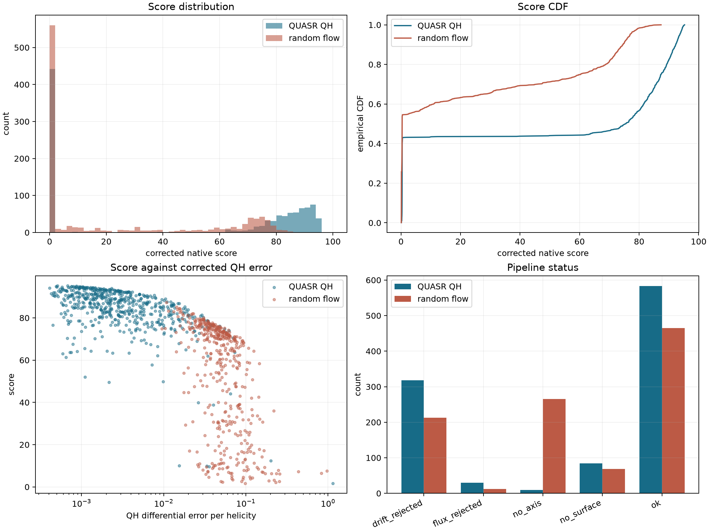

2050 个样本由 8 个评分 worker 分摊到 4 卡，评分墙钟为 2600.8 秒，吞吐 0.7882 样本/秒；1024 个随机样本的 flow 解码只占 17.0 秒。当前优化吞吐的主要瓶颈是原生物理 score，而不是 flow ODE。

以本章后续 score-93.166 样本的一次代表性调用为例，原生总墙钟为 7.236 秒。分阶段剖面如下：

| 阶段 | 墙钟 |
|---|---:|
| 线圈工程量与场对象创建 | 0.0236 s |
| 磁轴候选搜索与轴追踪 | 2.1698 s |
| $s$ 点生成、FP32 QR 与独立验证 | 0.4360 s |
| 初筛、长周期 surface continuation 与磁通标定 | 约 4.52 s |
| 体点、体场、$\alpha/\iota$ 装配与 QR、QS 归约 | 0.0673 s |

`flux_s` 从长周期候选循环开始计时，与累计的 `surface_screen_s` 包含同一段追踪，因此原始 timing 字段存在有意嵌套，不能逐列相加。剖面说明当前主要成本是磁轴与磁面追踪；100000 点体场、2269 列 $\alpha/\iota$ 线性拟合和 QS 归约并不是瓶颈。

### 6.2 Flow 直接生成的局限

物理损失模型相较旧模型显著改善整体几何与原生 score 分布，但第一代直接生成仍不能稳定进入 QUASR 的高质量 QH 尾部。换言之，flow 学会了可行线圈分布和跨 Fourier 阶的相关结构，却没有以足够精度复现决定高 QH score 的窄子流形。因此本文不把它作为“一次采样即得到优质线圈”的生成器，而把它作为可逆的搜索空间预条件器。

### 6.3 修正后 landscape 实验

本节只接受使用 ABI-9 $G/(2\pi)$ 与统一 per-helicity 归一化重跑的结果。旧的电流符号修正版 landscape 仍使用了过大的 $G$，其绝对分数、QH/QA 竞争关系和盆地宽度均标记为 superseded，不能支持本文结论。修正版实验固定三个 QUASR 参考样本、每例四个方向、31 个对称步长点，并比较

$$
F(z_*+au),\qquad
x_*+aJ_F(z_*)u,\qquad
x_*+av,
$$

其中 $v$ 是匹配一阶物理位移尺度的原参数空间随机方向。正式作业 `31233` 使用 3 个 QUASR
QH 参考点、每例 4 个方向和每条路径 31 个对称步长点，共形成 1128 个逻辑点、1095 个去重
后的原生评分。运行固定了 corrected ABI-9 库与 30k physical-loss checkpoint 的 SHA-256，
并使用 FP32 RK4-256。

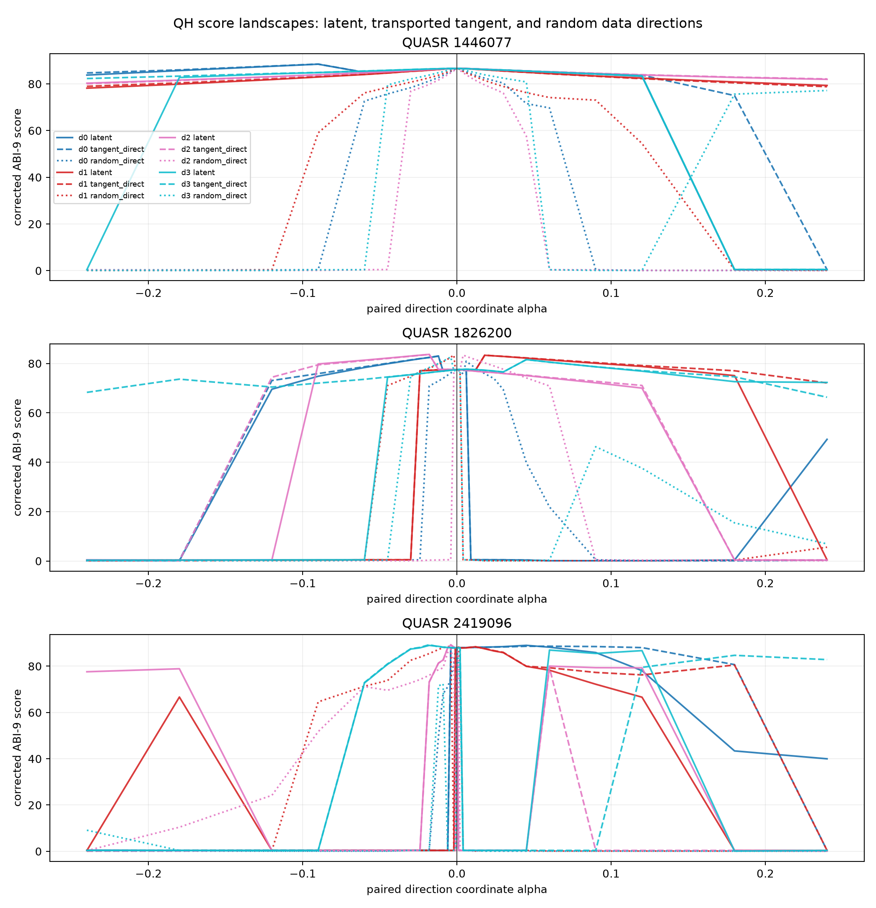

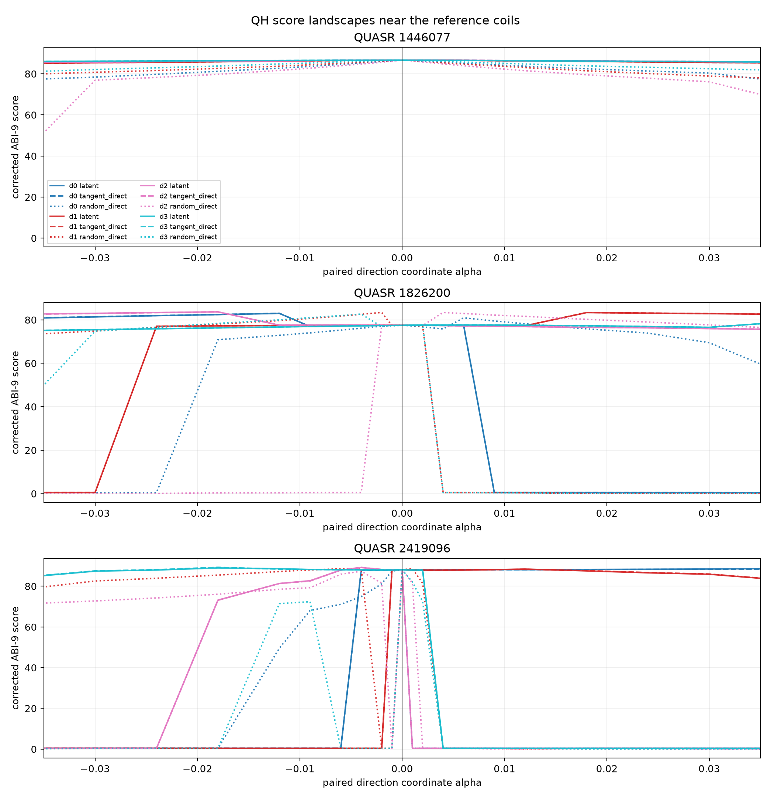

逐样本、逐方向配对后，latent 相对 random direct 的下降 5/10 分宽度比中位数为
8.630/6.522；以真实线圈位置 RMS 位移衡量仍为 3.427/2.584，四项均为 12/12 个方向由
latent 更宽。非均匀网格二阶导 RMS 比中位数为 0.257，11/12 个方向更平滑；完整扫描中的
`status=ok` 比例为 74.73%，而 random direct 为 52.69%。

相对同一 flow Jacobian 切线，下降 5 分坐标宽度和物理半径比只有 0.951 和 0.973，二阶导
RMS 比为 1.0005，说明 latent 路径与其一阶物理切线近似等价。256 步反向--正向线圈位置
闭环 RMS 为 $2.26\times10^{-8}$--$4.57\times10^{-8}\,\mathrm m$，三个参考点的 QH error
重建差均小于 $10^{-8}$。因此 flow 的优化优势来自学到的多线圈、Fourier 模态和电流相关
方向，而不是坐标单位、ODE 误差或旧 score bug。完整配对统计与证据边界见
[landscape 专项报告](../reports/qh_flow_landscape_report.md)。

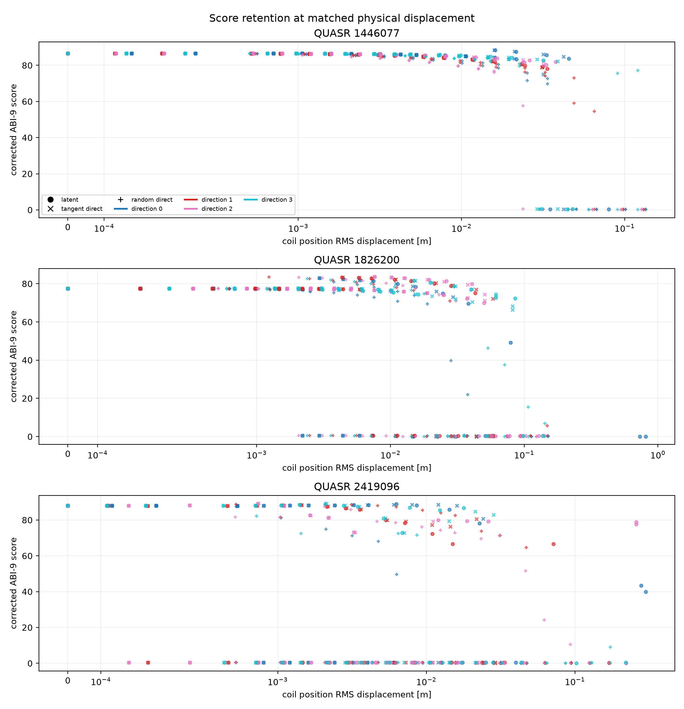

### 6.4 三线圈、四场周期优化

在 $N_{\rm FP}=4,n_c=3$ 条件下，从一个固定潜空间起点运行 200 步，ABI-9 score 从 85.883 提升到 93.166，最佳点位于第 197 步；全部 200 步均完成。最佳分量为 axis 97.910、$s/\psi$ 98.532、surface 97.874、coordinate 89.436、volume-QS 94.202、$\iota$ 100、coil 65.318。拟合 $\iota=1.6463$，QH/QA/QP 每 helicity error 为 0.002300/0.115880/0.028995。

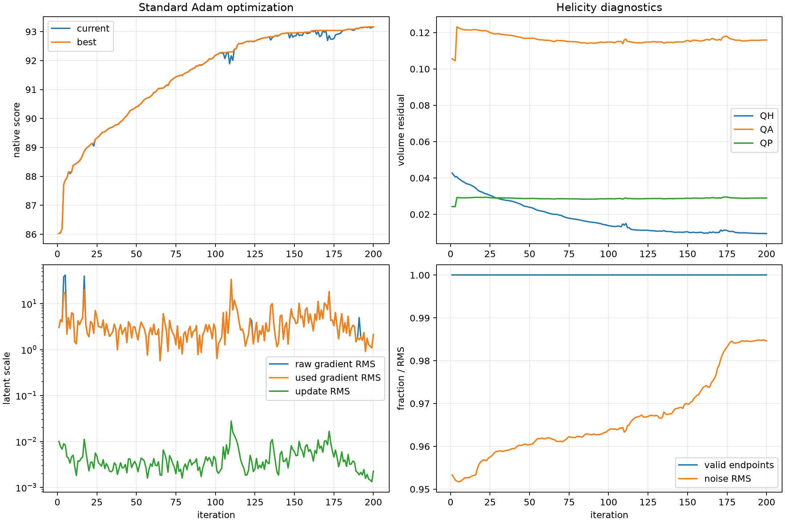

完整评估独立选择 $s=0.49$，得到体积 $0.06399\,\mathrm m^3$、$\iota=1.6878$、密网格相对残差 $2.65\times10^{-5}$、法向场 P95 $4.30\times10^{-5}$，面 QH error 为 $6.52\times10^{-6}$。DESC 在 50 次迭代上限内保持嵌套，并把归一化力残差均值降到 0.00233。该结果证明优化不是只利用快速 score 的数值漏洞。

### 6.5 两线圈、四场周期优化

采用“128 个 IID 潜变量先评分，取最高者，再运行 200 步”的统一协议。$N_{\rm FP}=4,n_c=2$ 的起点为 78.842，旧时间 guard 版本在第 184 步达到 85.773。最佳 coil 分量为 72.799，比三线圈解高 7.48 分；QH error 为 0.013675，约为三线圈解的 5.95 倍，展示了工程简单性与 QH 精度之间的真实折中。

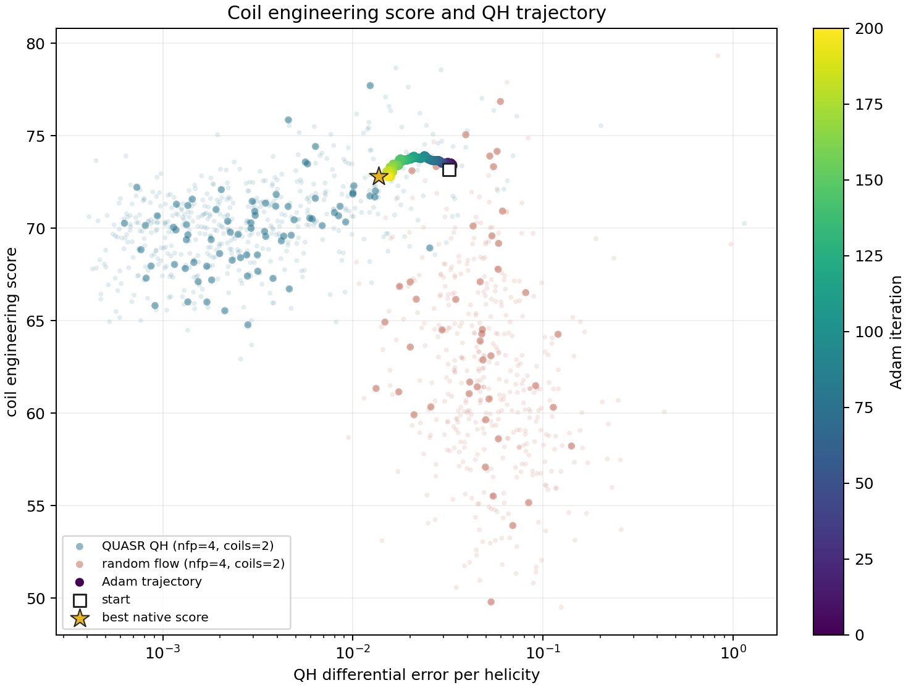

其完整评估选择样本特定的 $a=0.08$ 和 $s=0.49$，体积为 $0.06714\,\mathrm m^3$，面 QH error 为 $4.66\times10^{-5}$；DESC 最终归一化力均值为 0.00396。第 185 步暴露的脏梯度促成了当前跨步自适应 guard；因而本例的物理解有效，但第 185 步后的旧优化轨迹不再代表当前默认优化器行为。

### 6.6 两线圈、六场周期优化

采用与上一节完全相同的 128 起点、200 步、$\eta=0.01$、$c=0.005$、四方向和 RK4-256 设置，仅把条件改为 $N_{\rm FP}=6,n_c=2$，并启用时间尺度 guard。128 个候选中 38 个为 `ok`，最佳起点复评分为 74.436。Adam 在第 200 步达到 83.469，QH error 每 helicity 从 0.03812 降至 0.01028，$|\iota|$ 保持在 2.08；volume-QS 分量从 55.83 升到 78.78，coil 分量从 58.52 升到 60.09。相比四周期两线圈解，本例 QH 略好，但 coil、surface 和 coordinate 更差，因此总分低 2.30。

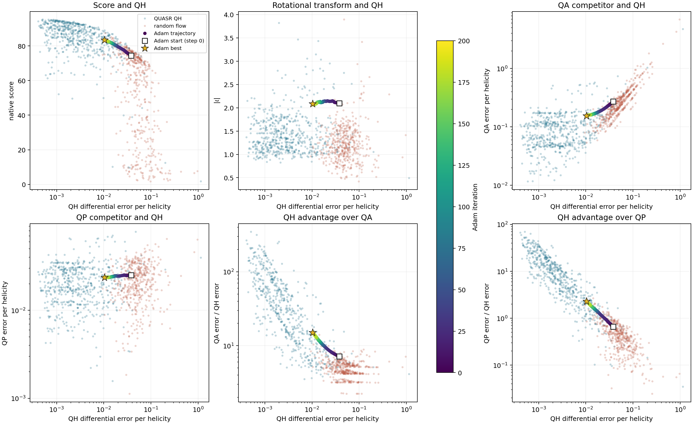

该轨迹还在第 167 步在线触发一次时间尺度 guard：梯度 RMS 182.67 超过滚动上限 18.46，拟议更新 RMS 0.0547 超过上限 0.0333，整步在中心解码前被拒绝且不污染动量。其余 199 次更新正常应用，最终点仍为全程最佳，证明修复没有把正常优化冻结。本例尚未运行完整 $\alpha+\nu$/Simsopt/DESC，因而只作为快速 score 与优化器证据。

## 7. 未来方向摘要

后续研究集中在三个互补方向。第一，现有 proxy 分类器能以 ROC-AUC 0.934 区分逆追踪 QUASR 潜变量与高斯先验，但与真 score 基本零相关；连续回归器测试 Pearson 约 0.40，却不能识别真实高分尾部。因此 proxy 只有在使用当前 ABI-10 多任务标签、按高分分层训练和以 top-$k$ 真 score 富集验收后才值得重做。

第二，Reflow 可以训练二级条件流 $F_2$ 拟合 $F_1^{-1}(x_{\rm QUASR})$，最终以 $F_1\circ F_2$ 生成。分类 AUC 证明当前逆潜分布确实偏离高斯，而 RK4 闭环误差已足够小；它是成本最低、证据最直接的下一项生成实验，但仍只保证更像 QUASR，不直接保证超过 QUASR 的高分尾部。

第三，评分器可返回局部近似梯度。axis 候选与最大面选择难以全局反传，且在高分区通常已饱和；coil 工程项容易求导但不是主要瓶颈；最有价值的是固定可行分支后对 volume-QS 及 $\alpha/\iota$ 线性最小二乘求 VJP，再通过可微 flow ODE 回传到潜空间。该近似梯度只负责提出方向，真实 ABI-10 score 继续负责接受和拓扑门控。详细推导、风险和分阶段验收方案见[后续研究方向可行性分析](../reports/qh_future_directions_feasibility.md)。

## 8. 结论、限制与复现入口

当前主线得到三个层次明确的结论：

1. 从线圈到体 QH score 的主链已经由定长追踪、GPU 线性最小二乘和 CUDA 归约实现，避免了高维 LS/Newton 的运行时长尾。
2. $s\to\psi\to(\alpha,\iota)$ 足以直接计算体微分 QS；$\nu$ 仅在需要显式近 Boozer 面并进入 Simsopt/DESC 时求解。
3. flow matching 的直接生成质量不足，但其可逆重参数化对潜空间优化有实用价值；当前两方向中心差分加 $\beta_1=0.7$ 的 Adam 已产生经完整物理支线验收的高分 QH 解。

仍需保留的限制是：快速 score 的固定 $a$ 与有界筛面只适合排序，不能代替逐样本最大可行面搜索；评分函数含拓扑和候选选择分支，不是全局光滑函数；当前 ABI-10 默认值之前的 volume-QS、landscape、proxy 标签和优化分数均不可与当前分数直接比较。

主要实现入口如下：

- 原生评分器：`gpu_backend/src/score_pipeline.cu`
- flow 模型与 ODE：`flow_matching/model.py`、`flow_matching/flow.py`
- 标准潜空间 Adam：`scripts/optimize_flow_prior_standard_adam.py`
- landscape：`scripts/qh_flow_landscape.py`、`scripts/slurm_qh_flow_landscape.sh`
- 完整评估固定入口：`evaluation/full_physical/`
- 完整评估规范：[精简线圈评估流程](精简线圈评估流程.md)

未来方向的分项可行性与优先级见[后续研究方向可行性分析](../reports/qh_future_directions_feasibility.md)。
