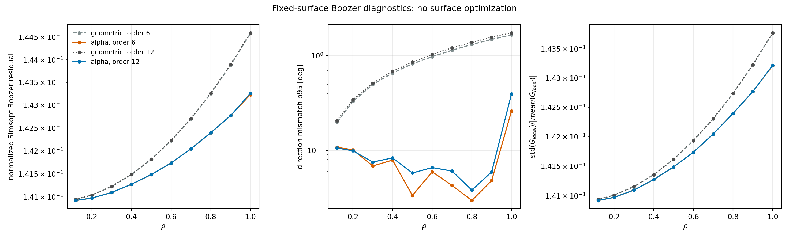
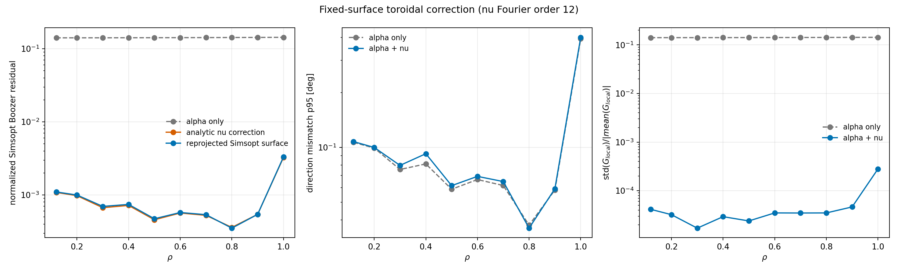
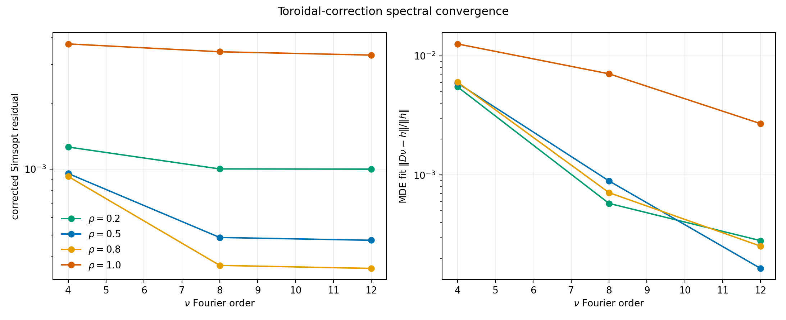

# 稠密线性最小二乘 Clebsch $\alpha$ 初值实验报告

日期：2026-07-10

对象：`cem_qh03`，外层拟合不变量取 $s_{\mathrm{edge}}=0.16$

## 1. 先给结论

### 1.1 已经确认成功的部分

1. **真实环向磁通标定是稳定且几乎线性的。**
   由多个环向截面对 $B_\phi$ 积分得到

   $$
   |\Phi_T(s_{\mathrm{edge}})|=1.385027\times10^{-3}\ {\rm Wb}.
   $$

   与已有 Boozer 曲面直接积分的磁通幅值只差 $0.265\%$。不同环向截面之间的
   最大相对标准差为 $1.61\times10^{-4}$。

2. **十万级点云上的普通线性最小二乘可以稳定求出 $\alpha$。**
   正式实验使用 120,000 个均匀训练点和 60,000 个独立验证点，主求解器是单卡
   FP64 GPU QR。没有使用非线性优化、迭代初值、凸约束或谱正则。

3. **求出的 $\lambda$ 确实把磁力线拉直。**
   八个场周期、三层磁面、每层四条磁力线的平均直线残差从约
   $0.218\ {\rm rad}$ 降到 $0.01154\ {\rm rad}$，改善 18.9 倍。

4. **无约束 LS 没有造成坐标折叠。**
   最终模型在独立验证点上的

   $$
   \min\left(1+\partial_\theta\lambda\right)=0.382>0,
   $$

   未发现不可逆点。因此当前没有证据说明必须改用带不等式约束的凸优化。

5. **用直场线角重新参数化后，R/Z 可以继续用线性谱投影稳定得到。**
   测试的 DESC `LMN=6,8,10,12` 四档体几何全部嵌套，$\sqrt g$ 全域单符号。

### 1.2 还没有解决的部分

1. 最终 $\alpha$ 对线圈磁场的独立验证相对残差仍为 $5.79\%$，远高于由
   $\boldsymbol B\cdot\nabla\psi\neq0$ 导致的理论法向下限
   $3.52\times10^{-5}$。剩余误差主要集中在 $\rho<0.2$ 的近轴区域。

2. 直场线 R/Z 初值虽然嵌套，但尚未足够接近 DESC 的力平衡解。
   `LMN=6` 的初始归一化力均值为 0.754，仍不是小残差平衡。

3. 直接调用 DESC solve 仍然物理发散。优化器报告 `xtol` 成功，但解变成非嵌套，
   目标和力残差大幅上升。

### 1.3 本轮最重要的新发现

已有 Boozer 曲面文件记录

$$
\iota_{\mathrm{file}}=-0.486970.
$$

但从该曲面上的点出发，直接追踪 32 个场周期得到

$$
\iota_{\mathrm{trace}}=-0.565327\pm0.000261.
$$

稠密 alpha LS 得到

$$
\iota_{\alpha}=-0.565228.
$$

alpha 与独立长场线追踪符合到约 $10^{-4}$，旧 Boozer 文件中的 iota 则与真实
绕转率明显不符。这是旧 Boozer 链路中独立于 DESC 的接口或参数化问题，必须单独
修正。

---

## 2. 实验前存档和运行约束

实验前已将原有 DESC 初值研究完整存档为 Git 提交：

```text
d5e8e5a Archive DESC volume initial guess investigation
```

本轮远端实验固定使用一张 RTX 5090；OpenMP、OpenBLAS、MKL 和 NumExpr 均限制为
最多 16 线程。所有任务均以前台进程运行。结束后检查结果为：无本任务残留进程，
僵尸进程数为 0。

## 3. 准确计算流程

### 3.1 从拟合不变量 s 标定物理磁通

原模型给出无量纲近似不变量 $s(R,Z,\phi)$，其等值面几何已经通过嵌套性和
Poincare 检查，但 $s$ 本身不是物理磁通。

在固定环向截面 $\phi=\phi_j$ 上，对 $s=s_k$ 内部区域积分：

$$
\Phi_T(s_k,\phi_j)
=\int_{D(s_k,\phi_j)}B_\phi(R,Z,\phi_j)\,dR\,dZ.
$$

实验使用 8 个均匀环向截面、256 个极向角和 24 点 Gauss-Legendre 径向积分。
然后定义

$$
\psi_T(s)=\frac{\langle\Phi_T(s,\phi_j)\rangle_j}{2\pi},
$$

并用无常数项四次多项式做小规模线性拟合：

$$
\psi_T(s)=\sum_{k=1}^{4}a_k s^k.
$$

标定结果如下：

- 边界 $\psi_T=2.204339\times10^{-4}\ {\rm Wb/rad}$；
- 边界 $|\Phi_T|=1.385027\times10^{-3}\ {\rm Wb}$；
- 多项式对积分数据的相对 RMS 为 $1.41\times10^{-8}$；
- 与 PCHIP 标定曲线的相对 L2 差为 $1.26\times10^{-6}$；
- $d\psi_T/ds$ 始终同号，标定严格单调。


有向磁通的正负取决于曲面和极向角方向。标定积分与 Simsopt 曲面积分的**幅值**
相差 0.265%，DESC 接口处使用 Simsopt 曲面的方向符号。

### 3.2 alpha 的拓扑形式

采用顺时针几何极向角

$$
\theta=-\operatorname{atan2}(Z-Z_a(\phi),R-R_a(\phi)),
$$

使 $\nabla\psi_T\times\nabla\theta$ 的环向方向与线圈磁场一致。Clebsch 势写为

$$
\alpha=\theta+\lambda(\rho,\theta,\phi)-\iota(\rho)\phi,
\qquad
\rho=\sqrt{\frac{\psi_T}{\psi_{T,\mathrm{edge}}}}.
$$

磁场目标为

$$
\boldsymbol B
=\nabla\psi_T\times\nabla\alpha.
$$

周期部分使用实 Fourier-Zernike 展开：

$$
\lambda
=\sum_{lmn}c^{(c)}_{lmn}\mathcal R_l^m(\rho)
\cos(m\theta-nN_{\rm FP}\phi)
+\sum_{lmn}c^{(s)}_{lmn}\mathcal R_l^m(\rho)
\sin(m\theta-nN_{\rm FP}\phi).
$$

这里的 $\mathcal R_l^m(\rho)$ 是**标准 Zernike 径向多项式**，不是物理柱坐标中的
大半径 $R$。为避免与物理坐标 $R$ 混淆，本报告用花体 $\mathcal R$ 表示它；代码中
对应 `zernike_radial(rho, l, m)`。其显式定义为

$$
\mathcal R_l^m(\rho)
=\sum_{k=0}^{(l-m)/2}
(-1)^k
\frac{(l-k)!}
{k!\left(\frac{l+m}{2}-k\right)!\left(\frac{l-m}{2}-k\right)!}
\rho^{l-2k},
$$

其中只保留

$$
l\ge m\ge0,
\qquad
l-m\ \text{为偶数}
$$

的模式；不满足条件时该径向模式不存在。这里 $l$ 是径向阶数，$m$ 是极向 Fourier
模数，$n$ 是环向 Fourier 模数。例如

$$
\mathcal R_1^1(\rho)=\rho,
\qquad
\mathcal R_2^0(\rho)=2\rho^2-1,
\qquad
\mathcal R_3^1(\rho)=3\rho^3-2\rho.
$$

这种选择使 $m>0$ 的模式在磁轴附近至少按 $\rho^m$ 消失，从而满足极坐标轴附近的
正则性；不同允许的 $l$ 则描述同一极向模数 $m$ 下不同的径向变化。

纯磁通函数 $m=n=0$ 被删除，以固定 gauge。iota 使用

$$
\iota(\rho)=\sum_k b_k\rho^{2k}.
$$

由于 $\rho$ 是 $\psi_T$ 的函数，所有径向导数项与 $\nabla\psi_T$ 平行，
在叉乘中严格消失。因此未知系数只线性地进入

$$
\boldsymbol B
=\boldsymbol C_\theta
+\sum_j c_j
\left(
\partial_\theta f_j\,\boldsymbol C_\theta
+\partial_\phi f_j\,\boldsymbol C_\phi
\right)
-\sum_k b_k\rho^{2k}\boldsymbol C_\phi,
$$

其中

$$
\boldsymbol C_\theta=\nabla\psi_T\times\nabla\theta,
\qquad
\boldsymbol C_\phi=\nabla\psi_T\times\nabla\phi.
$$

这就是本轮 GPU QR 的完整线性方程，没有隐藏的非线性步骤。

### 3.3 点云和验证集

取点方式与 s 拟合保持同一原则：在磁轴附近的物理 $(R-R_a,Z-Z_a,\phi)$ 空间中
建立均匀笛卡尔格点，再筛选

$$
\rho_{\min}\le\rho\le1.
$$

正式参数为：

| 数据集 | 点数 | 生成方式 |
|---|---:|---|
| 训练集 | 120,000 | $144\times144\times96$ 平移均匀格点内筛选 |
| 验证集 | 60,000 | 不同平移量的 $145\times145\times97$ 格点内筛选 |

两者没有共享格点。每个物理点提供 $B_R,B_\phi,B_Z$ 三行，因此最高阶系统有
360,000 行。

### 3.4 GPU QR

主实验使用 FP64 `torch.linalg.lstsq(..., driver="gels")`。只做列范数归一化，不加
ridge。最高阶 $L=12,M=12,N=16$ 含 3001 个未知量，GPU QR 时间约 18.9 s。

## 4. alpha 阶数扫描

| 阶数 | 列数 | 训练相对 L2 | 验证相对 L2 | 验证最小 $1+\lambda_\theta$ | 折叠比例 |
|---|---:|---:|---:|---:|---:|
| $L4,M4,N4$ | 136 | 0.14342 | 0.14380 | 0.302 | 0 |
| $L6,M6,N6$ | 364 | 0.10643 | 0.10671 | 0.238 | 0 |
| $L8,M8,N8$ | 764 | 0.08393 | 0.08407 | 0.365 | 0 |
| $L10,M10,N12$ | 1648 | 0.06874 | 0.06888 | 0.278 | 0 |
| $L12,M12,N16$ | 3001 | 0.05769 | 0.05793 | 0.382 | 0 |


训练和验证误差始终接近，说明没有观察到统计过拟合。残差随阶数单调下降，但到
$L12,M12,N16$ 尚未完全谱收敛。

将环向阶数单独提高到 $N=24$ 并没有改善结果；对应验证误差为 0.0690。因此当前
主误差不是简单的环向带宽不足。

### 4.1 residual 来自哪里

最终模型的分量相对误差为：

| 分量 | 相对 L2 |
|---|---:|
| $B_R$ | 0.0600 |
| $B_\phi$ | 0.0590 |
| $B_Z$ | 0.0478 |

径向分箱结果为：

| rho 区间 | 相对 L2 |
|---|---:|
| 0.0-0.2 | 0.2426 |
| 0.2-0.4 | 0.0787 |
| 0.4-0.6 | 0.0321 |
| 0.6-0.8 | 0.0191 |
| 0.8-1.0 | 0.0208 |

由 $\boldsymbol B\cdot\nabla\psi_T\neq0$ 形成的不可消除法向下限只有
$3.52\times10^{-5}$。所以 5.79% 主 residual **不是 psi 法向误差造成的**，而是
近轴坐标/基底和均匀体积采样对小体积内层的分辨率不足。

### 4.2 为什么最终选择常数 iota

允许四次 $\iota(\rho)$ 时，总磁场 residual 几乎不变，但内层 iota 出现没有
独立场线支持的摆动。原因是均匀体积采样中内层点数按面积减小，而 iota 主要由
较小的极向场分量约束。

改成常数 iota 后得到

$$
\iota=-0.5652282747.
$$

总磁场 residual 不变，但八周期场线直线残差从变 iota 版本的 0.0392 rad 进一步
下降到 0.01154 rad。因此常数版本是当前更可信的初值。

## 5. 磁力线是否真的变直

下图使用真实 Biot-Savart 场重新追踪，并未使用 LS 训练行生成轨迹。左图为原始几何
角，右图为

$$
\vartheta=\theta+\lambda.
$$

黑色虚线是斜率 $\iota=-0.565228$ 的直线。


十二条线的统计为：

- 原始平均直线 residual：约 0.218 rad；
- 修正后平均直线 residual：0.01154 rad；
- 改善倍数：18.9；
- $\rho=0.3$ 修正后约 0.018-0.020 rad；
- $\rho=0.9$ 修正后约 0.0052-0.0059 rad。

坐标可逆性图如下。在 $\phi=0$ 截面上没有零线或负值区域。


## 6. iota 的独立长轨迹核验

从已有 Boozer 边界曲面上的 8 个点出发，追踪 32 个场周期。对未展开的顺时针几何
角做长时间线性回归，周期性角畸变在斜率中被平均掉，得到

$$
\iota_{\mathrm{trace}}=-0.5653270532,
\qquad
\sigma_{\mathrm{lines}}=2.61\times10^{-4}.
$$

对比：

| 来源 | iota |
|---|---:|
| alpha 稠密 LS | -0.565228 |
| 32 周期真实场线 | -0.565327 |
| 旧单周期 screen | -0.598348，线间标准差 0.200836 |
| Boozer 文件 | -0.486970 |

32 周期后，终点到原 Boozer 截面曲线的平均最近距离为 0.224 mm，最大为 0.455 mm。
相对于约 21 mm 的平均小半径，曲面仍在同一磁面邻域，但不是数值上完全无漂移。

结论是：alpha 的 iota 与真实长轨迹一致；旧 Boozer 文件的 iota 不能继续作为真值。

## 7. alpha 之后的 R/Z 线性投影

对每个由 $s$ 等值面提取的物理点，先计算

$$
\vartheta=\theta+\lambda,
$$

再把 $(\rho,\vartheta,\phi;R,Z)$ 送入 DESC Fourier-Zernike 基底。R 和 Z 分别用
GPU QR 线性拟合，DESC 初始 $\lambda$ 直接设为零。

正式 RZ 数据包括 21 个内部径向层，每层 $37\times37$ 个角点，另有独立边界和
磁轴数据。四个分辨率结果为：

| DESC 分辨率 | R RMS [m] | Z RMS [m] | 边界 RMS [m] | 是否嵌套 | 初始力均值 | 初始力 p95 |
|---|---:|---:|---:|---|---:|---:|
| LMN=6 | 1.625e-4 | 1.867e-4 | 2.519e-4 | 是 | 0.754 | 2.115 |
| LMN=8 | 1.519e-4 | 1.762e-4 | 2.154e-4 | 是 | 0.809 | 3.001 |
| LMN=10 | 1.369e-4 | 1.552e-4 | 2.031e-4 | 是 | 0.944 | 2.605 |
| LMN=12 | 1.333e-4 | 1.491e-4 | 1.966e-4 | 是 | 1.034 | 2.839 |

所有档位的 $\sqrt g$ 都保持单符号。最低几何 RMS 在 `LMN=12`，但最低力 residual
在 `LMN=6`。高阶更精确地拟合线圈磁面几何，却放大了 DESC 力导数中的高频误差，
因此 DESC 初值不能只按几何 RMS 选阶。

修复 `eq.save()` 坐标翻转副作用后的截面对比如下。实线是 psi 目标，虚线是
`LMN=6` 的 DESC 谱投影，两者基本重合。


## 8. DESC solve 结果

选择初始力最小的 `LMN=6`，固定同步后的边界，运行最多 50 次迭代的 DESC solve。
优化器在 10 次迭代后因 `xtol` 停止并报告 success，但实际结果为：

| 指标 | 初始 | solve 后 |
|---|---:|---:|
| 是否嵌套 | 是 | 否 |
| 归一化力均值 | 0.754 | $7.85\times10^5$ |
| 归一化力 p95 | 2.115 | 552.0 |
| 归一化力最大值 | 12.59 | $2.94\times10^9$ |
| 优化目标 | 约 $2.49\times10^3$ | $1.00\times10^{14}$ |

因此这次 solve 是明确的物理发散，不能因为 optimizer success 而接受。

## 9. 对原设想的最终判断

原设想可以拆成三句话：

1. 标定物理 psi；
2. 用十万级均匀点和一次线性 LS 得到 alpha、iota、lambda；
3. 之后稳定得到 DESC 需要的内容。

本轮结论是：

- 第 1 步已经走通；
- 第 2 步已经走通，而且普通无约束 QR 当前比凸约束更合适；
- 第 3 步中的坐标和 R/Z 谱投影已经走通；
- 第 3 步中的最终 DESC 力平衡还没有走通。

这不是 alpha 路线失败。相反，alpha 已经解决了此前最病态的“短场线点云同时拟合
每条线截距、lambda 和 iota”问题，并暴露了旧 Boozer iota 不正确这一独立问题。

另一方面，alpha 不能凭空消除所有物理和表示误差。对精确的无电流线圈真空场，若
存在精确嵌套磁面，则理论上应存在 $p=0,\boldsymbol J=0$ 的真空平衡。因此当前
DESC 发散不应解释成“该线圈理论上没有平衡”，而应解释为以下近似尚未闭合：

1. Boozer 曲面和 iota 链路存在已确认的不一致；
2. alpha 在近轴区仍有较大表示误差；
3. 边界和 psi 仍是近似磁面，长轨迹存在约 0.2-0.5 mm 漂移；
4. 把线圈场的直场线坐标交给 DESC，并不自动使 DESC 自身由边界、磁通和 profile
   生成的初始磁场等于线圈磁场；
5. 高阶 R/Z 虽然几何更准，但导数误差会恶化初始力。

## 10. 下一步优先级

### 优先级 1：修复和审计旧 Boozer iota

这是本轮发现的确定性矛盾。应直接检查 BoozerSurface 的角变量尺度、NFP 因子、旧版
API 兼容分支和 iota 自由变量写回过程。修复后用 32 周期追踪作为强制回归测试。

难度：中等。问题已被稳定复现，验证标准清楚。

### 优先级 2：保持线性 QR，专门加强近轴 alpha

不应先上凸优化，因为当前没有折叠。更合适的线性改进是：

1. 对 $\rho<0.2$ 分层补点或增加径向权重；
2. 保持总点数十万级，但避免均匀体积采样让内层占比过低；
3. 使用更严格的轴正则 Fourier-Zernike 组合；
4. 暂时固定长轨迹确认的常数 iota，只拟合 lambda；
5. 分别监控三分量和各 rho 分箱 residual。

这些改动仍然是单次线性 GPU QR。

难度：低到中等。

### 优先级 3：在进入 solve 前比较 DESC B 与线圈 B

目前只比较了 R/Z 和 DESC force。下一步应在同一物理点上明确计算：

$$
\boldsymbol B_{\mathrm{coil}},
\qquad
\boldsymbol B_{\alpha},
\qquad
\boldsymbol B_{\mathrm{DESC,initial}}.
$$

逐层区分误差到底在 alpha、R/Z 投影，还是 DESC 根据 profile 重建磁场的接口处。
若 $\boldsymbol B_{\alpha}$ 好而 $\boldsymbol B_{\mathrm{DESC,initial}}$ 差，则应调整
DESC 的 iota/current formulation 或初始 profile，而不是继续堆 R/Z 阶数。

难度：中等，需要仔细核对 DESC 0.16.0 的磁场输出和坐标约定。

### 优先级 4：最后才考虑约束或 continuation

只有当近轴加权导致

$$
1+\partial_\theta\lambda\le0
$$

时，才有必要引入线性不等式约束的凸二次规划。DESC solve 则应采用低阶、限步长、
拒绝目标上升的 continuation，而不能再次接受 `xtol success` 作为物理成功。

## 11. 代码和原始结果

主要新增实现：

- `stellarator_eval/alpha_clebsch.py`
- `scripts/alpha_clebsch_ls_experiment.py`
- `scripts/desc_alpha_rz_projection_experiment.py`
- `scripts/diagnose_boozer_iota_fieldline.py`
- `tests/test_alpha_clebsch.py`

本报告资产目录同时保留：

- `alpha_summary.json`
- `boozer_iota_long_trace.json`
- `rz_projection_summary.json`
- `desc_solve_summary.json`

测试结果：alpha 新测试与相关既有回归测试合计 9 项全部通过。

## 12. 补充实验：固定磁面直接评估 Simsopt Boozer residual

### 12.1 这个诊断是否合理

这个诊断合理，但需要区分“直场线坐标”和“完整 Boozer 坐标”。对于当前真空线圈场
且无等离子体环向电流的例子，Simsopt 使用的 Boozer 曲面残差为

$$
\boldsymbol r_B
=G\boldsymbol B
-B^2\left(\boldsymbol x_\phi+\iota\boldsymbol x_\theta\right).
$$

令

$$
\boldsymbol t
=\boldsymbol x_\phi+\iota\boldsymbol x_\theta.
$$

完整 Boozer 条件同时要求：

1. $\boldsymbol t$ 与 $\boldsymbol B$ 平行，即磁力线在坐标中是直线；
2. 沿场参数速度满足

   $$
   \boldsymbol t=\frac{G}{B^2}\boldsymbol B;
   $$

3. 同一磁面上的 $G$ 是常数。

当前 alpha 拟合直接解决的是第 1 条。由于仍把几何环向角 $\phi$ 当作环向坐标，
第 2、3 条并不会自动满足。因此“经过 lambda 后方向 residual 应很小”是正确的，
但“完整 Simsopt Boozer residual 也必然很小”还缺少一个环向坐标修正。

### 12.2 实验流程

该实验严格冻结磁面，不调用 Simsopt 的 Boozer LS、Newton 或任何曲面优化：

1. 取 $\rho=0.12,0.2,\ldots,1.0$ 共 10 个 $s$ 等值面；
2. 每个面先由当前 psi 模型直接提取 $49\times49$ 个物理点；
3. 分别使用未修正的顺时针几何角和

   $$
   \vartheta=\theta+\lambda
   $$

   对同一个几何磁面重新参数化；
4. 只做 `SurfaceXYZTensorFourier` 的有限阶谱投影，测试曲面阶数 6 和 12；
5. 在与投影格点错开的独立角网格上计算 residual；
6. 曲面系数和 alpha 拟合给出的 $\iota$ 都保持冻结，只对标量 $G$ 做线性最小二乘；
7. 另对 $\iota,G$ 做一次两列线性最小二乘，作为该固定曲面能达到的辅助下界，
   但不把重新拟合的 $\iota$ 当作物理结果，也不用于主图和主表。

第 6、7 步都不是曲面优化。固定 $\iota$ 时，$G$ 的最优值是一列线性最小二乘；
辅助下界所用方程

$$
G\boldsymbol B-\iota B^2\boldsymbol x_\theta
=B^2\boldsymbol x_\phi
$$

对 $G$ 和 $\iota$ 是一个只有两列的线性最小二乘问题。辅助下界与固定 $\iota$
结果只相差约 $10^{-5}$ 到 $5\times10^{-4}$，不影响下面的物理判断。

为去除磁场量纲，图中完整 residual 定义为

$$
\epsilon_B
=\frac{
\left\|\boldsymbol r_B/|B|\right\|_2
}{
|G|\sqrt{N}
}.
$$

同时单独报告：

- $\boldsymbol t$ 与 $\boldsymbol B$ 的方向夹角 p95；
- 局部速度量

  $$
  G_{\rm local}=\boldsymbol B\cdot\boldsymbol t
  $$

  的相对标准差。

### 12.3 径向扫描结果



12 阶曲面的代表数据如下：

| rho | 几何角方向 p95 | alpha 方向 p95 | alpha 完整 residual | alpha 的 $\operatorname{std}(G_{\rm local})/|\langle G_{\rm local}\rangle|$ |
|---:|---:|---:|---:|---:|
| 0.12 | 0.206 deg | 0.106 deg | 0.14093 | 0.14092 |
| 0.30 | 0.512 deg | 0.075 deg | 0.14110 | 0.14110 |
| 0.50 | 0.856 deg | 0.058 deg | 0.14149 | 0.14149 |
| 0.80 | 1.382 deg | 0.038 deg | 0.14240 | 0.14240 |
| 1.00 | 1.744 deg | 0.395 deg | 0.14326 | 0.14322 |

这里可以看到：

1. alpha 对直场线方向的修正非常有效。除最外层受有限阶曲面投影影响外，方向
   p95 基本在 $0.04^\circ$ 到 $0.1^\circ$；
2. 未修正几何角的方向误差随半径增长，外层达到约 $1.7^\circ$；
3. 完整 Boozer residual 只从几何参数化的约 14.1%-14.4% 降到
   alpha 参数化的约 14.1%-14.3%；
4. 完整 residual 几乎等于 $G_{\rm local}$ 的相对起伏，说明剩余误差由 Boozer
   环向角速度主导，而不是磁力线仍然不直；
5. alpha 面上的法向场角正弦 p95 约为
   $1.7\times10^{-4}$ 到 $7.5\times10^{-4}$，说明这些面仍是良好的近似磁面。

### 12.4 是否出现预期的“内高外低”

没有在**完整 Boozer residual** 上出现内高外低。完整 residual 从内向外略微增加，
原因是所有半径都共同受到约 14% 的环向速度误差控制。

这与第 4.1 节的体点结果并不矛盾。第 4.1 节测量的是

$$
\nabla\psi_T\times\nabla\alpha
$$

对完整磁场矢量大小和方向的三维重构，其中近轴归一化、采样占比和坐标奇点会造成
明显的内层误差；本节测量的是每个固定曲面上场线切向方向以及 Boozer 参数速度。
两者不是同一个 residual。

因此原判断应修正为：

- 若画三维 Clebsch 磁场重构 residual，确实内高外低；
- 若画磁力线方向误差，alpha 后各层都已经很低；
- 若画完整 Simsopt Boozer residual，则当前由未修正的环向角主导，不呈内高外低。

### 12.5 与旧 Simsopt 优化曲面的对照

旧 `boozer_surface.npz` 在独立于 Newton 配点的网格上得到：

$$
\epsilon_B=1.24\times10^{-3},
$$

方向 p95 约 $0.090^\circ$，$G_{\rm local}$ 相对标准差约
$8.80\times10^{-4}$。单看这些数字，它已经接近完整 Boozer 参数化。

但它不是目标 $s=0.16$ 外层面的有效参考。把该曲面的 66,049 个物理点代回当前
$s(R,Z,\phi)$ 后得到

$$
\langle s\rangle=0.03234,
\qquad
s_{\max}=0.03398,
$$

而不是文件标记的 $s=0.16$。由

$$
d_s\simeq\frac{|s-s_{\rm edge}|}{|\nabla s|}
$$

估计的法向距离均值为 17.1 mm，p95 为 22.6 mm。该曲面的环向拓扑绕数仍为
1，带符号体积也仍为 $0.006024\,\mathrm{m}^3$。因此按当前拟合的 $s$ 模型判断，
旧优化在“固定体积”约束下跳到了另一个几何分支，而不是简单发生多重环向绕行。

这解释了此前三个同时出现的异常：

1. Newton 配点 residual 极小；
2. 文件 iota 与长场线 iota 不一致；
3. DESC 使用该边界时行为异常。

因此不能用旧优化 Boozer 曲面来否定当前 alpha 面，也不能把其
$\iota=-0.486970$ 当作目标外层面的真值。

### 12.6 当前离完整 Boozer 坐标还有多远

可以用两句话概括：

1. **离直场线坐标已经很近：**方向误差通常只有 $0.04^\circ$ 到 $0.1^\circ$；
2. **离完整 Boozer 坐标还差一个约 14% 的环向速度修正：**当前
   $G_{\rm local}$ 在磁面上还不是常数。

这个缺口不要求退回 Simsopt 做自由曲面非线性优化。可以引入一个周期环向修正
$\nu$：

$$
\phi_B=\phi+\nu,
\qquad
\theta_B=\vartheta+\iota\nu.
$$

这样

$$
\theta_B-\iota\phi_B
=\vartheta-\iota\phi
=\alpha,
$$

所以已经求好的场线标签 alpha 完全不变。令

$$
D=\partial_\phi+\iota\partial_\vartheta,
$$

则新环向角沿场的变化率为 $1+D\nu$，而新的切向量为

$$
\boldsymbol t_B
=\frac{\boldsymbol t}{1+D\nu}.
$$

要求 $\boldsymbol B\cdot\boldsymbol t_B=G$，得到

$$
D\nu
=\frac{G_{\rm local}}{G}-1.
$$

这是一条沿已拉直磁力线方向的**线性磁微分方程**。因此最自然的下一步不是对磁面
做非线性 Boozer 优化，而是在每个固定 $s$ 面上继续用稠密线性最小二乘求 $\nu$，
再用 $(\theta_B,\phi_B)$ 重新评估 Simsopt residual。若该步成功，约 14% 的主导速度
误差应显著下降，同时保留当前 alpha 已经获得的直场线性质。

本节新增可复现实验：

- `scripts/diagnose_alpha_boozer_residual.py`
- `scripts/diagnose_saved_boozer_psi_distance.py`
- `alpha_clebsch_experiment/alpha_boozer_residual_summary.json`
- `alpha_clebsch_experiment/saved_boozer_psi_distance.json`

## 13. 环向坐标修正及修正后的 Simsopt residual

### 13.1 实验目标和配置

本节实现第 12.6 节提出的周期环向修正 $\nu$。实验继续使用上一节完全相同的
常数旋转变换拟合：

$$
\iota=-0.5652282746569637.
$$

磁面几何保持冻结，不调用 Simsopt Boozer LS、Newton 或任何曲面自由度优化。
对每个 $\rho$ 的计算流程为：

1. 从 $s=s_{\rm edge}\rho^2$ 提取物理磁面；
2. 使用已有 $\lambda$ 得到直场线角 $\vartheta=\theta+\lambda$；
3. 把该固定磁面投影为 12 阶 `SurfaceXYZTensorFourier`；
4. 在 $65\times67$ 均匀网格上求 $\nu$；
5. 反解坐标映射，把同一个物理磁面改写为 $(\phi_B,\theta_B)$ 参数化；
6. 再投影为 12 阶 Simsopt 曲面；
7. 在错开的 $57\times59$ 独立网格上计算
   `boozer_surface_residual`。

扫描了 $\nu$ 的 Fourier 阶数 4、8 和 12，并以 12 阶作为主结果。整个过程只改变
磁面的参数化，不主动移动磁面。

### 13.2 线性最小二乘的具体形式

首先在每个固定磁面上定义

$$
G_{\rm local}
=\boldsymbol B\cdot
\left(\boldsymbol x_\phi+\iota\boldsymbol x_\vartheta\right),
\qquad
G=\langle G_{\rm local}\rangle,
$$

以及

$$
h=\frac{G_{\rm local}}{G}-1.
$$

这个选择保证 $\langle h\rangle=0$，满足周期磁微分方程的兼容条件。需要求解

$$
D\nu=h,
\qquad
D=\partial_\phi+\iota\partial_\vartheta.
$$

代码内部使用与 Simsopt 一致的“圈数”坐标

$$
\hat\phi=\frac{\phi}{2\pi},
\qquad
\hat\vartheta=\frac{\vartheta}{2\pi},
\qquad
\hat\nu=\frac{\nu}{2\pi}.
$$

展开为

$$
\hat\nu
=\sum_{m,n}
\left[
a_{mn}\cos 2\pi(m\hat\vartheta-nN_{\rm fp}\hat\phi)
+b_{mn}\sin 2\pi(m\hat\vartheta-nN_{\rm fp}\hat\phi)
\right].
$$

在归一化坐标中令

$$
\hat D
=\partial_{\hat\phi}
+\iota\partial_{\hat\vartheta}.
$$

因为 $D\nu=\hat D\hat\nu$，方程本身不变。每个模在 $\hat D$ 下只乘以常数

$$
k_{mn}=2\pi(m\iota-nN_{\rm fp})
$$

并在正弦和余弦之间互换。因此在完整均匀周期网格上，Fourier 投影就是该线性
最小二乘问题的正交闭式解，不需要非线性迭代。本次 4、8、12 阶扫描没有跳过任何
共振模，也没有使用正则化。

### 13.3 坐标映射和独立验证

求得 $\nu$ 后定义

$$
\phi_B=\phi+\nu,
\qquad
\theta_B=\vartheta+\iota\nu.
$$

这严格保持

$$
\theta_B-\iota\phi_B
=\vartheta-\iota\phi
=\alpha.
$$

为了在规则的 $(\phi_B,\theta_B)$ 网格上重新采样同一个磁面，代码利用 alpha 不变性，
对每个目标点只需求解一维方程

$$
F(\hat\phi)
=\hat\phi
+\hat\nu(\hat\alpha+\iota\hat\phi,\hat\phi)
-\hat\phi_B
=0.
$$

其导数正是

$$
F'(\hat\phi)=1+D\nu.
$$

所有磁面的映射均保持可逆：

$$
0.7435
\le 1+D\nu
\le 1.2054.
$$

一维 Newton 的最大反解残差为 $5.6\times10^{-17}$ 圈。$\nu$ 的最大绝对幅度从
内层约 $4.00^\circ$ 平滑增加到边界约 $5.02^\circ$，不是一个接近折叠的大变换。

本节同时计算两个修正后 residual：

解析修正直接使用

$$
\boldsymbol t_B
=\frac{\boldsymbol t}{1+D\nu}
$$

计算 residual。Simsopt 修正则完成坐标反解和 12 阶曲面重投影后，直接调用
`boozer_surface_residual`。

两者若一致，说明 residual 的下降不是手工公式与 Simsopt 接口定义不一致造成的。

### 13.4 径向扫描结果



12 阶 $\nu$ 的代表结果如下：

| $\rho$ | alpha-only residual | alpha+$\nu$ Simsopt residual | 降低倍数 | 修正后方向 p95 | 修正后 $G_{\rm local}$ 相对标准差 |
|---:|---:|---:|---:|---:|---:|
| 0.12 | 0.14093 | 0.001100 | 128 | $0.1075^\circ$ | $4.13\times10^{-5}$ |
| 0.20 | 0.14098 | 0.000999 | 141 | $0.0998^\circ$ | $3.21\times10^{-5}$ |
| 0.30 | 0.14110 | 0.000698 | 202 | $0.0796^\circ$ | $1.70\times10^{-5}$ |
| 0.50 | 0.14149 | 0.000473 | 299 | $0.0616^\circ$ | $2.39\times10^{-5}$ |
| 0.80 | 0.14240 | 0.000352 | 404 | $0.0360^\circ$ | $3.49\times10^{-5}$ |
| 1.00 | 0.14326 | 0.003311 | 43 | $0.4015^\circ$ | $2.80\times10^{-4}$ |

主要结论为：

1. 对 $0.12\le\rho\le0.9$，完整 Simsopt residual 从约 14.1%-14.3% 降到
   0.035%-0.110%，降低 128-404 倍；
2. 边界 $\rho=1$ 也从 14.33% 降到 0.331%，降低约 43 倍；
3. 对 $\rho\le0.9$，$G_{\rm local}$ 的相对起伏已从约 14% 降到
   $1.7\times10^{-5}$ 至 $4.6\times10^{-5}$；
4. 解析修正与重新投影后的 Simsopt residual 通常只相差 $10^{-5}$ 到
   $3\times10^{-5}$，边界也只相差约 $5\times10^{-5}$，说明坐标反解和 Simsopt
   接口是自洽的；
5. 重投影 RMS 在 $\rho\le0.9$ 时约为 $0.7$-2.1 微米，边界为 13.4 微米。

### 13.5 谱阶数扫描



$\nu$ 从 4 阶升到 8 阶时有明显收益，8 阶升到 12 阶后完整 residual 已接近平台。
例如在 $\rho=0.5$：

| $\nu$ 阶数 | $\|D\nu-h\|/\|h\|$ | Simsopt residual |
|---:|---:|---:|
| 4 | $5.92\times10^{-3}$ | $9.54\times10^{-4}$ |
| 8 | $8.91\times10^{-4}$ | $4.87\times10^{-4}$ |
| 12 | $1.64\times10^{-4}$ | $4.73\times10^{-4}$ |

继续降低磁微分方程拟合误差已经不能同比降低完整 residual，因为此时主导项已不再是
$G_{\rm local}$ 的速度起伏，而是 alpha 坐标原有的场线方向误差。

### 13.6 物理结论和剩余问题

第 12.6 节提出的判断得到验证：此前约 14% 的完整 Simsopt residual 确实主要缺少
一个环向 Boozer 坐标修正，而不是磁面几何本身离 Boozer 面很远。$\nu$ 是稳定的
线性问题，求解后中间大部分磁面已经达到 $10^{-4}$ 到 $10^{-3}$ 量级的完整
Boozer residual。

纯环向修正不会改变场线方向，只会改变沿场参数速度。因此修正后 residual 的下限
由 alpha-only 的方向误差决定。边界 $\rho=1$ 的 residual 明显高于内层，正对应其
方向 p95 约 $0.40^\circ$ 的既有尖峰；此时 $G_{\rm local}$ 起伏已经只有
$2.8\times10^{-4}$，继续增加 $\nu$ 阶数不能解决该问题。下一步若要进一步降低
边界 residual，应改进最外层的 $\lambda$/alpha 表示或 R/Z 谱投影，而不是继续调整
环向速度方程。

与旧 Simsopt 优化面相比，本方法没有移动磁面，也没有固定体积下的分支跳转风险。
因此当前结果可以概括为：**目标 $s$ 分支上的直场线坐标已经基本补全为 Boozer
坐标；内层和中层误差已很小，最外层仍受 alpha 方向拟合误差限制。**

本节新增实现和原始结果：

- `stellarator_eval/toroidal_correction.py`
- `scripts/diagnose_alpha_toroidal_correction.py`
- `tests/test_toroidal_correction.py`
- `alpha_clebsch_experiment/alpha_toroidal_correction_summary.json`
- `alpha_clebsch_experiment/toroidal_correction_vs_rho.png`
- `alpha_clebsch_experiment/toroidal_correction_order_scan.png`
