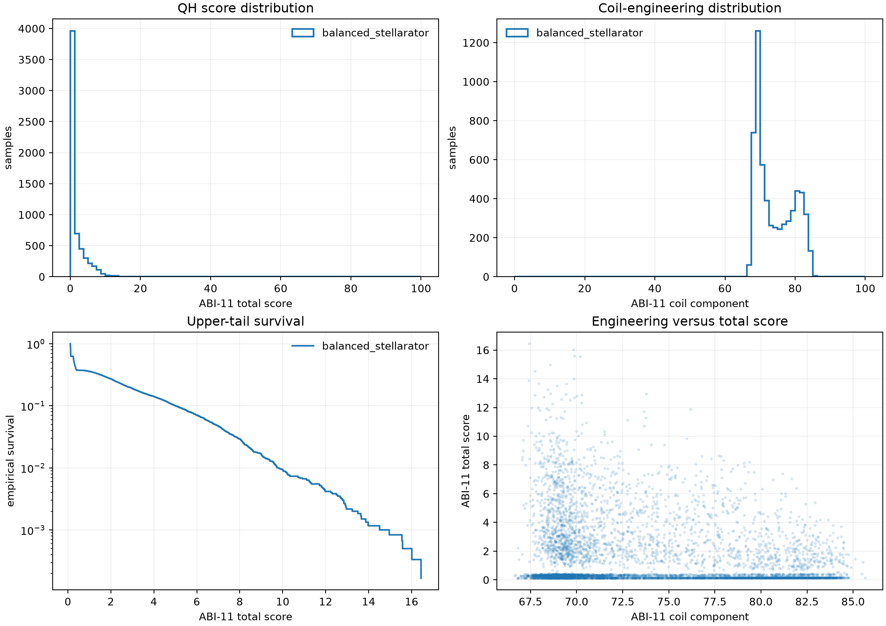
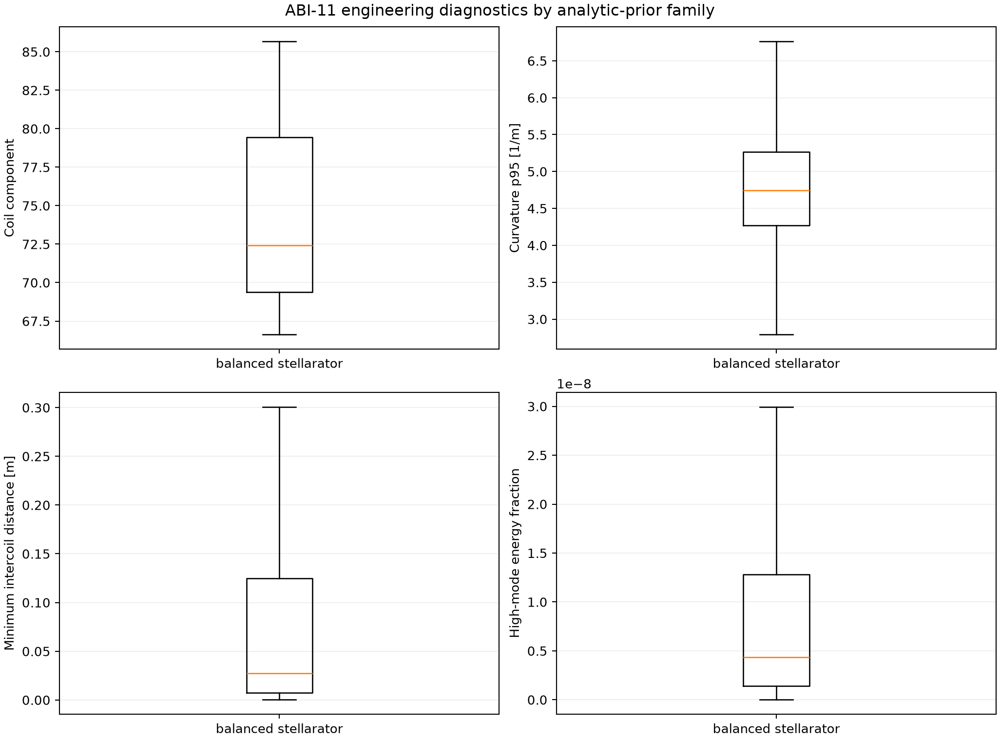

# Balanced stellarator v2 初始先验评分结果

日期：2026-09-01

协议：`qh-axis-surface-contour-balanced-score-abi11-v2`

状态：6000 个样本全部完成；原生 ABI-11 评分，无 Adam 优化

## 结论

`balanced_stellarator` v2 先验稳定生成了低高阶模能量、曲率受控的线圈，线圈工程分量中位数为 72.411，22.12% 的样本达到 80。6000 个样本的最高总分为 16.439，56 个样本达到 10，20 分及以上的样本数为 0。该批次没有观测到 QH 高分收敛域起点。

批次的主要几何风险是线圈间距。全体样本最小线圈间距中位数为 27.27 mm，p10 为 4.04 mm；`nc=4` 条件的中位数进一步降至 9.88 mm。后续先验需要把线圈间距直接纳入构造约束，并按 `nfp` 和 `nc` 调整物理形状分布。

## 协议与完整性

| 项目 | 值 |
| --- | --- |
| 先验家族 | `balanced_stellarator` |
| 条件 | 26 个 `(nfp,nc)`；`nc<=4`，显式排除 `nc=5` |
| 样本数 | 6000；每条件 230 或 231 |
| 评分器 | 原生 ABI-11 |
| 评分库 SHA-256 | `1c6c78b0dee662233215a56dbdc1e50b8ed29f2d0eee9ae8c4ff7d0403b895ed` |
| 评分代码 | `1dcfd18` |
| GPU 作业 | P107 `51614`（4 卡）；Students `51615`（2 卡） |
| 单分片耗时 | 4610.81--4734.92 s（76.8--78.9 min） |
| 评分错误 | 0 |
| 优化 | 无 |
| 完整物理评估 | 无 |

构造轴用于生成绕组面，内层曲面用于几何参考。两者均未经过磁轴或磁面求解。报告中的总分属于原生筛选分数，不能替代 Boozer、Poincare 或 DESC 验收。

初始分析作业 `51616` 在代表样本选择阶段引用了 v1 家族名。该作业在失败前已经写出的 6000 样本汇总、条件表和两张统计图保持有效。提交 `5cbb97a` 修复了家族发现逻辑，CPU 作业 `51627` 基于相同的 6000 行生成了代表样本清单和两个 HTML。纠错记录见 `CORR-20260901-48`。

交付审查还发现窄屏下的 Three.js 固定相机距离会裁切线圈边缘。代表样本生成器现按横向和纵向视场角拟合包围球；两个 HTML 已通过 1280x720 与 390x844 渲染、画布像素和控制台检查。该交付层修复记录为 `CORR-20260901-49`，未改动线圈坐标或评分结果。

## 总体分布

| 指标 | 结果 |
| --- | ---: |
| `ok` | 2250 / 6000（37.50%） |
| `no_axis` | 2232 / 6000（37.20%） |
| `no_surface` | 906 / 6000（15.10%） |
| `drift_rejected` | 597 / 6000（9.95%） |
| `flux_rejected` | 15 / 6000（0.25%） |
| 总分中位数 / p90 / p99 / 最大值 | 0.291 / 5.002 / 9.736 / 16.439 |
| 总分 `>=10` | 56 / 6000（0.933%） |
| 总分 `>=20` / `>=50` | 0 / 0 |
| 线圈分量中位数 / p90 / 最大值 | 72.411 / 82.063 / 85.660 |
| 线圈分量 `>=80` | 1327 / 6000（22.12%） |

线圈分量较高的样本仍大量集中在低总分区。线圈平滑性只解决了起点设计的一部分，QH 体性质、轴搜索和曲面可解性仍然限制总分。

## 工程诊断

| 指标 | p10 | 中位数 | p90 | 最大值 |
| --- | ---: | ---: | ---: | ---: |
| 平均线圈长度（m） | 1.835 | 2.134 | 2.495 | 2.811 |
| 曲率 p95（1/m） | 3.906 | 4.743 | 5.776 | 8.448 |
| 最大曲率（1/m） | 4.330 | 5.590 | 7.451 | 15.389 |
| 最小线圈间距（m） | 0.0040 | 0.0273 | 0.2532 | 0.5684 |
| 最小轴距离（m） | 0.528 | 0.635 | 0.766 | 0.881 |
| 高阶模能量占比 | 4.72e-10 | 4.34e-9 | 3.09e-8 | 2.53e-7 |

极低的高阶模能量占比验证了低阶平滑构造。最小线圈间距分布跨越两个数量级，说明等值线层级和形变相位还需要显式的间距控制。

## 按基础线圈数分层

| `nc` | 数量 | `ok` 比例 | 总分中位数 | 总分最大值 | `>=10` 数量 | 线圈分量中位数 | 最小间距中位数 |
| ---: | ---: | ---: | ---: | ---: | ---: | ---: | ---: |
| 1 | 1155 | 74.55% | 2.071 | 12.934 | 3 | 77.257 | 68.95 mm |
| 2 | 1617 | 35.93% | 0.300 | 16.439 | 15 | 73.442 | 35.58 mm |
| 3 | 1617 | 26.28% | 0.264 | 15.578 | 19 | 70.801 | 15.93 mm |
| 4 | 1611 | 23.77% | 0.254 | 14.960 | 19 | 69.721 | 9.88 mm |

`nc` 增加时，原生评分成功率、线圈分量和线圈间距同步下降。`nc=3/4` 提供了更多超过 10 分的长尾样本，同时带来更密集的线圈布局。

## 按场周期观察

`nfp=2` 的三个条件几乎全部无法得到有效评分，`ok` 比例为 0.43%--1.73%，最高总分为 0.521。`nfp=8` 的四个条件具有本批次最稳定的评分成功率：

| 条件 | `ok` 比例 | 总分中位数 | 总分最大值 | 线圈分量中位数 |
| --- | ---: | ---: | ---: | ---: |
| `nfp=8,nc=1` | 77.92% | 4.209 | 12.934 | 72.511 |
| `nfp=8,nc=2` | 61.47% | 2.217 | 15.548 | 69.896 |
| `nfp=8,nc=3` | 60.17% | 2.587 | 13.236 | 69.204 |
| `nfp=8,nc=4` | 53.91% | 2.060 | 14.960 | 68.793 |

最高总分来自 `nfp=7,nc=2`。`nfp=6--8` 的成功率和高分长尾均优于较低场周期，提示轴振幅、截面调制和电流标度需要按场周期单独校准。完整的 26 条件表见 [condition_summary.csv](assets/axis_surface_prior_balanced_v2_20260901/condition_summary.csv)。

## 代表样本

### 最高总分：case 00400

- 条件：`nfp=7,nc=2`
- 总分：16.439267
- 线圈分量：67.444987
- 最小线圈间距：3.66 mm
- 曲率 p95 / 最大曲率：5.627 / 8.730 1/m
- 高阶模能量占比：6.50e-10

| 原生分量 | 值 |
| --- | ---: |
| axis | 97.0796 |
| psi | 99.8111 |
| surface | 98.4868 |
| coordinate | 91.4275 |
| volume_qs | 20.0174 |
| iota | 22.6204 |
| coil | 67.4450 |

该样本的轴、通量和曲面筛选分量较高，体 QH 与 iota 分量仍然很低；3.66 mm 的线圈间距也会限制后续工程优化。

[打开最高总分线圈 HTML](assets/axis_surface_prior_balanced_v2_20260901/coils_balanced_stellarator_top_score_case_00400.html)

### 典型工程样本：case 01200

- 条件：`nfp=8,nc=1`
- 总分：3.984725
- 线圈分量：72.417535
- 最小线圈间距：20.84 mm
- 曲率 p95 / 最大曲率：3.952 / 4.060 1/m
- 高阶模能量占比：1.06e-9

[打开典型工程线圈 HTML](assets/axis_surface_prior_balanced_v2_20260901/coils_balanced_stellarator_median_engineering_case_01200.html)

## 后续判断

`balanced_stellarator` v2 可以作为不依赖 QUASR 的结构化低复杂度基线。6000 样本没有提供 QH 高分域丰度证据，直接扩大同分布采样的收益有限。下一版先验应优先加入三项改变：

1. 在等值线选择和曲线拟合阶段施加明确的最小线圈间距约束。
2. 按 `nfp` 与 `nc` 分别标定轴振幅、截面调制幅度和电流分配。
3. 用低成本物理代理约束参考轴与绕组面，使更多样本进入可求轴、可求曲面的区域，同时保留形态多样性。

本批次没有运行 Adam，因此结果只回答初始分布的原生评分和工程分布。是否存在可由 16 分附近起点优化进入高分段的少量尾部样本，需要独立的小规模优化实验确认。

## 证据文件

- [总体汇总 JSON](assets/axis_surface_prior_balanced_v2_20260901/summary.json)
- [条件汇总 CSV](assets/axis_surface_prior_balanced_v2_20260901/condition_summary.csv)
- [协议 JSON](assets/axis_surface_prior_balanced_v2_20260901/protocol.json)
- [运行清单](assets/axis_surface_prior_balanced_v2_20260901/runtime_manifest.json)
- [代表样本清单](assets/axis_surface_prior_balanced_v2_20260901/representative_samples.json)
- [代表样本详细指标](assets/axis_surface_prior_balanced_v2_20260901/representative_metrics.json)
- [分析修复清单](assets/axis_surface_prior_balanced_v2_20260901/analysis_repair_manifest.json)

远端冻结结果目录：`/home/scc/pb24511935/local_surface_evaluator_runs/axis_surface_prior_balanced_v2_20260901_1dcfd18`
