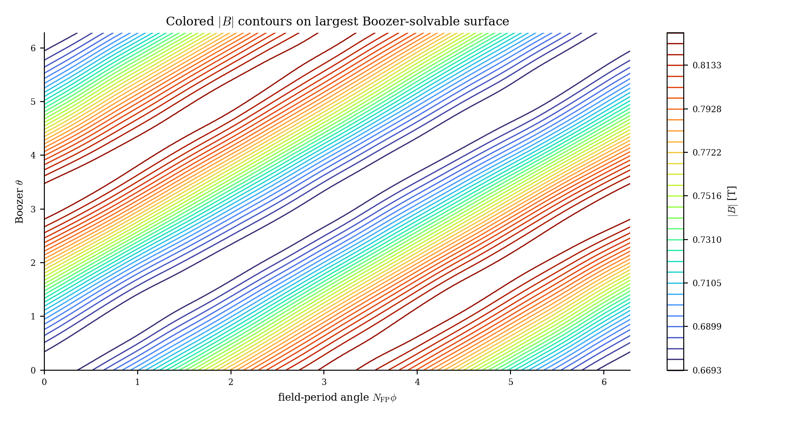
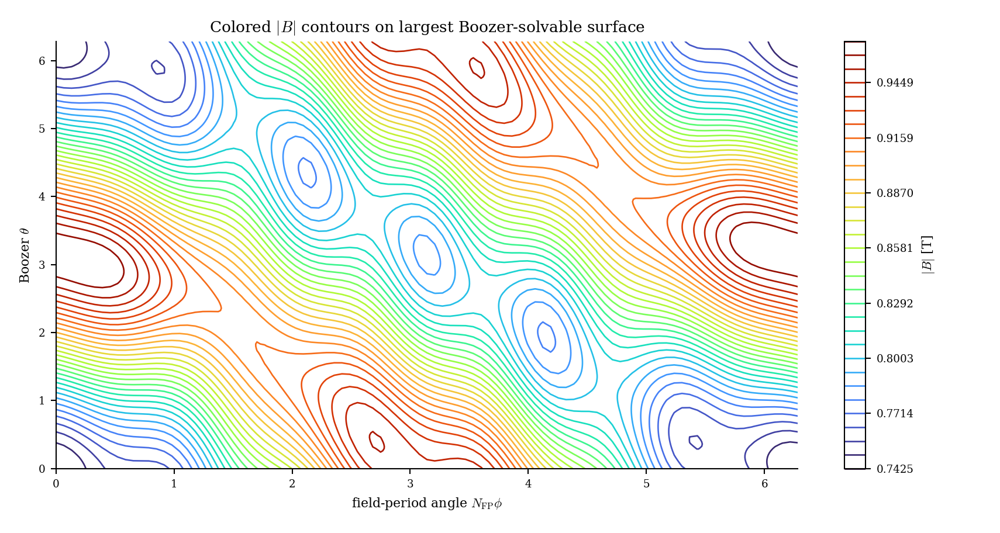
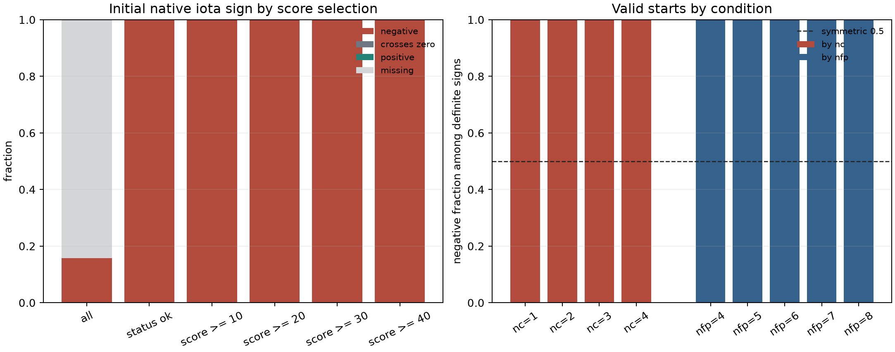
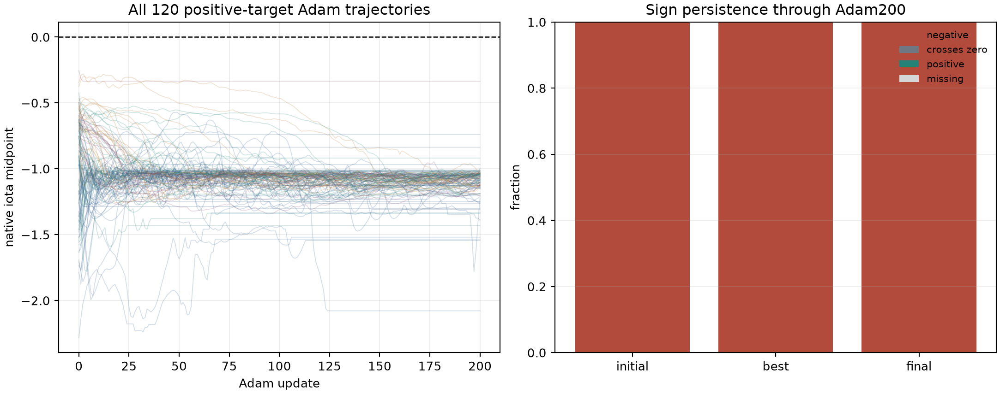
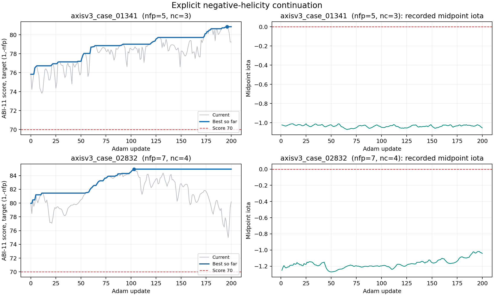
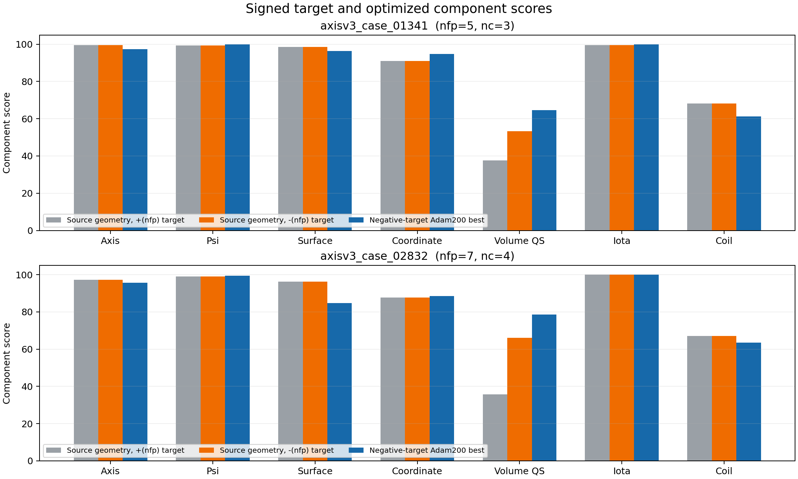

# 解析先验手性审计与负手性 Adam200 实验报告

| 元数据 | 值 |
|---|---|
| 日期 | 2026-09-02 |
| 分支 | `codex/axis-surface-prior` |
| 群体与镜像审计代码 | `2dadc49c0fa74c12a4d26474ec914789b6423964` |
| 负手性续跑代码 | `729e592dfd7227d60d00fee68f63841bede65e1d` |
| 评分器 | 原生 ABI-11，SHA-256 `1c6c78b0dee662233215a56dbdc1e50b8ed29f2d0eee9ae8c4ff7d0403b895ed` |

> **因果归因更正（2026-09-02）**
>
> - 已确认：compact-flexible v3 生成的有效线圈全部落在负 iota 分支。
> - 已排除：绘图坐标变化、评分器随机选择磁轴方向、整体电流方向。
> - 待确认：构造参考轴、绕组面螺旋形状、等值线标量场各自贡献了多少偏置。
>
> 先前版本把标量场直接写成根因，证据不足。当前首要嫌疑是参考轴的主导第一谐波
> 固定在一个镜像类。标量场仍是候选因素，需要独立翻转后再评分。详见
> `CORR-20260902-69`。

## 结论

Compact-flexible v3 共生成 3600 个源样本。原生评分器在其中 569 个样本上找到可用
磁轴和有限 iota；这 569 个 iota 全部为负。冻结的正手性目标 Adam200 批次包含
120 条轨迹，所有已保存的初始点、中间点、最佳点和终点也都保持负 iota。该统计
确认了最终线圈分布具有单边手性。

手性来源尚未完成分量级隔离。生成器依次构造参考轴、绕组面和等值线线圈，这三步
都包含方向约定。v2/v3 参考轴的主导第一谐波只采样一个镜像类，是当前首要嫌疑。
绕组面形状和等值线标量场也采用固定符号的螺旋项，可能继续传递或改变该偏置。
最终 iota 由所有线圈产生的 Biot-Savart 磁场决定，标量场波矢本身不直接等同于
iota 符号。

两条代表性端点在独立轴搜索口径下切换到匹配的负手性目标后，总分分别从
`69.6841` 升至 `76.2026`、从 `68.3992` 升至 `81.1498`。随后执行显式负手性
Adam200，`axisv3_case_01341` 达到 `80.8523`，`axisv3_case_02832` 达到
`84.9308`。两条轨迹都突破了 70 分。

两条代表性样本在匹配负手性目标下获得明显更高的 QS 分量和总分，说明手性目标
不匹配是 60--70 分平台的重要来源。先前报告中的 `8.56%` 和 `12.78%` 仅保留为
冻结正手性目标下的分数阈值统计，不能用于估计与旧 QUASR/Flow 同手性的 QH
收敛域丰度。几何、线圈工程、运行时间、Poincare 和 DESC 结果仍按各自原始口径
有效。

## 生成流程与两个不同的“轴”

解析先验和评分器使用两个含义不同的轴：

| 名称 | 来源 | 用途 | 是否直接进入评分器 |
|---|---|---|---|
| 构造参考轴 | 解析先验随机生成 | 放置绕组面并定义局部截面框架 | 否 |
| 物理磁轴 | 评分器从最终线圈的磁场中搜索 | 拟合磁面坐标并计算 iota、QS 等量 | 是 |

完整的数据流为：

`构造参考轴 -> 绕组面 -> 标量场等值线 -> 最终线圈与电流 -> 磁场 -> 物理磁轴与 iota`

构造参考轴只通过后续生成的线圈间接影响评分。原生评分器从最终线圈重新计算磁场，
随后独立寻找物理磁轴；评分器不会读取先验保存的构造参考轴。

### 评分器如何确定方向

原生评分器先在一个横截面的 `(R,Z)` 平面搜索单场周期映射的椭圆不动点，再把该点
沿几何圆柱角 `phi` 从 `0` 积分到 `2*pi/nfp`。因此，磁轴位置来自不动点搜索，
磁轴参数方向统一由递增的 `phi` 定义。评分器没有在同一条轴的两个遍历方向之间
随机选择。

场线方程为

`dR/dphi = R*B_R/B_phi`，`dZ/dphi = R*B_Z/B_phi`。

整体反转所有线圈电流会同时反转 `B_R`、`B_phi` 和 `B_Z`，两个比值保持不变。
因此，全局电流方向不会翻转场线轨道或 iota。该约定也用于旧 QUASR/Flow 样本，
所以新旧样本之间的 iota 符号差异不能由评分器轴方向解释。

## `|B|` 图的坐标约定

完整评估绘图函数 `save_periodic_colored_contours` 使用以下固定约定：

- 横轴从 0 增加到 `2*pi`，标注为 field-period angle `NFP phi`；
- 纵轴从 0 增加到 `2*pi`，标注为 Boozer `theta`；
- 数组通过 `closed.T` 与上述坐标对应；
- 两个坐标轴均保持递增方向。

因此，正斜率条纹对应 `theta - zeta = const`，负斜率条纹对应
`theta + zeta = const`，其中 `zeta=NFP*phi`。下面三幅图使用同一绘图函数和同一
坐标方向。旧 QUASR/Flow 参考样本呈正斜率，两个解析先验端点呈负斜率；方向变化
来自磁场分支手性。

| 旧 QUASR/Flow 参考，正手性 | `axisv3_case_01341`，负手性 | `axisv3_case_02832`，负手性 |
|---|---|---|
|  |  |  |

## 群体手性统计

群体审计直接读取 compact-flexible v3 的 3600 条 ABI-11 源评分记录和 120 条冻结
Adam200 轨迹。有限 iota 只存在于 569 条 `status=ok` 记录中，其余状态为
`no_axis` 1982 条、`no_surface` 760 条、`drift_rejected` 267 条和
`flux_rejected` 22 条。

| 样本集合 | 有确定符号 | 负 iota | 正 iota | 跨越 0 |
|---|---:|---:|---:|---:|
| 源样本 `status=ok` | 569 | 569 | 0 | 0 |
| 源样本 score >= 10 | 147 | 147 | 0 | 0 |
| 源样本 score >= 20 | 57 | 57 | 0 | 0 |
| 源样本 score >= 30 | 23 | 23 | 0 | 0 |
| 源样本 score >= 40 | 7 | 7 | 0 | 0 |
| 冻结 Adam200 初始点 | 120 | 120 | 0 | 0 |
| 冻结 Adam200 最佳点 | 120 | 120 | 0 | 0 |
| 冻结 Adam200 终点 | 120 | 120 | 0 | 0 |

569 个有效源样本的 iota 中位数为 `-0.8480`，范围为 `[-2.2816,-0.2546]`。
按 `nc=1,2,3,4` 分组以及按 `nfp=4,5,6,7,8` 分组后，每个非空组仍为 100%
负 iota。对独立等概率正负符号的描述性二项检验给出
`log10(p)=-170.985`。该结果直接确定生成器输出分布存在单边偏置，不区分生成器
内部各手性来源的相对贡献。

冻结的正手性目标 Adam200 批次中，120 条轨迹都属于 `all_negative` 模式。97 条
最佳分数达到 50 的轨迹和 96 条最佳分数达到 60 的轨迹也全部为负 iota。优化器
在 200 步局部更新内持续停留在同一连通手性域。

## 生成器中需要分开的三个因素

[`flow_matching/axis_surface_prior_v2.py`](../flow_matching/axis_surface_prior_v2.py)
包含三个尚未独立改变过的手性因素：

| 因素 | v2/v3 的写法 | 已知含义 | 当前证据强度 |
|---|---|---|---|
| 构造参考轴 | `R=1+a*cos(nfp*phi)+...`，`Z=b*sin(nfp*phi)+...`，主导 `a>0,b>0` | 第一谐波只覆盖一个镜像类 | 首要嫌疑，尚未单独翻转评分 |
| 绕组面形状 | 三角项 `2*theta-nfp*phi+phase`，起伏项 `theta-nfp*phi+phase/2` | 截面形状沿环向按固定方向传播 | 与参考轴耦合，贡献未测 |
| 等值线标量场 | `m*theta-field_mode*nfp*phi+phase`，所有 `field_mode>0` | 决定绕组面上选出的线圈曲线 | 与前两项耦合，贡献未测 |

参考轴的第一谐波最值得先查。空间反射 `z -> -z` 会把 `b` 变成 `-b`；普通三维
旋转无法完成这一变换。v1 给第一谐波的相干增量分别随机正负，最终系数可以覆盖
两个符号；v2/v3 的“协调轴”修改把两个第一谐波系数都固定为正。该修改发生在线圈
生成的第一步，并且绕组面局部框架随后沿这条参考轴建立，因此轴的单边性能够传递到
最终线圈。

标量场确实控制线圈。固定 `field_mode` 的符号会选择不同绕法，所以标量场可能改变
最终磁场手性。现有 569 个样本都同时使用了同一种参考轴约定、绕组面约定和标量场
约定；群体统计无法判断三者中哪一个起主导作用，也无法证明单独翻转标量场一定翻转
iota。

电流符号属于另一类约定。生成器用 `current_a=copysign(...,link)` 统一链接电流的
方向；前一节的场线方程说明该全局符号不决定 iota。

## 同一几何的双手性评分

双手性审计对两条保存端点执行独立轴搜索，并分别使用 `(M,N)=(1,+nfp)` 与
`(1,-nfp)` 评分。切换目标只改变有符号 QH 相关项；轴、psi、曲面、坐标、iota
和线圈工程分量在同一次独立评估中保持一致。

| 样本 | nfp/nc | 独立 `+nfp` 总分 | 独立 `-nfp` 总分 | `+nfp` 体 QS | `-nfp` 体 QS | 线圈工程 |
|---|---:|---:|---:|---:|---:|---:|
| `axisv3_case_01341` | 5/3 | 69.6841 | 76.2026 | 37.6037 | 53.1991 | 68.2045 |
| `axisv3_case_02832` | 7/4 | 68.3992 | 81.1498 | 35.7253 | 66.0838 | 67.1397 |

冻结正手性续跑保存的分数分别为 `68.8804` 和 `67.2446`。冻结续跑使用优化器
轴延续口径，表中的双手性重算使用历史无关的独立轴搜索。两个正手性列分别服务于
各自的评估模式，数值差异来自轴搜索与延续路径。

### 镜像对照

审计还对每条几何执行 `y` 反射、`z` 反射和绕 `x` 轴旋转 `pi`。空间反射交换
目标手性，正旋转保留目标手性。

| 样本 | 原几何 `-nfp` 与 y 镜像 `+nfp` 差值 | 原几何 `-nfp` 与 z 镜像 `+nfp` 差值 | 正旋转同目标差值 |
|---|---:|---:|---:|
| `axisv3_case_01341` | 0.18780 | 0.19859 | 0.01076 |
| `axisv3_case_02832` | 0.00683 | 0.00685 | 0.0000154 |

所有镜像对照的线圈工程分量严格相同。B 的总分对称性达到约 `7e-3`，A 的残差约
`0.2`，主要落在轴搜索相关的 psi、坐标和体 QS 数值路径。镜像交换手性的结论在
两条样本上成立；A 同时给出了该离散轴搜索口径下的数值容差尺度。

## 显式负手性 Adam200

注册实验协议为
`qh-axis-surface-compact-v3-top2-negative-hand-continue-adam200-64d-abi11-v1`。
每条样本使用一张 P107 GPU 并行运行。优化设置如下：

| 项目 | 设置 |
|---|---|
| 参数空间 | 保存端点的精确、未裁剪标准化线圈系数 |
| Flow 调用 | 0 |
| 目标 | `(M,N)=(1,-nfp)` |
| 更新 | Adam 200 步 |
| 梯度估计 | 每步 64 个新鲜随机正交方向，中心差分 |
| `h` / 学习率 | `0.0025` / `0.01` |
| beta | `(0.7,0.999)` |
| 原生评分 | ABI-11，psi grid 48 |

| 样本 | 目标 | 初始分 | 最佳分 | 最佳步 | 增益 | 终点分 | 最佳步 iota | 用时 |
|---|---|---:|---:|---:|---:|---:|---:|---:|
| `axisv3_case_01341` | `(1,-5)` | 75.8320 | **80.8523** | 196 | +5.0203 | 79.2414 | -1.02436 | 957.0 s |
| `axisv3_case_02832` | `(1,-7)` | 79.9665 | **84.9308** | 103 | +4.9643 | 80.1964 | -1.18906 | 1518.1 s |

两条 worker 状态均为 `complete`，各完成 200 次更新。A 的最佳体 QS 分量为
`64.5883`，线圈工程分量为 `61.2179`；B 的对应值为 `78.6028` 和
`63.6072`。两条轨迹的负手性目标从起点即超过 70，Adam200 又分别取得约 5 分
增益。

分量图把三种口径分开显示：保存源几何的独立 `+nfp` 评分、同一源几何的独立
`-nfp` 评分、负手性 Adam200 最佳点。目标切换首先提高体 QS 分量；后续优化继续
提高体 QS 和部分几何分量，同时允许线圈工程分量发生权衡。

## 结论边界与后续设计

本次审计保留以下结论：

- v2/v3 源样本数量、状态、运行时间和线圈工程统计；
- 两条已完整评估端点的曲面几何、Poincare、线圈工程和 DESC 结果；
- 所有 ABI-11 总分作为其清单所写有符号目标下的冻结数值；
- compact-flexible v3 在负手性目标下存在可超过 80 的可优化样本。

以下解释保持撤回状态：

- 将固定正手性目标下的 8.56% 与 12.78% 直接称为解析先验 QH 丰度；
- 将 v2/v3 与旧 QUASR/Flow 的正手性 QH 簇直接比较；
- 把 60--70 平台完全归因于 QS 本身或线圈工程限制。

下一步执行 `2x2x2` 正交消融。对同一组随机幅值和相位，分别翻转参考轴第一谐波、
绕组面螺旋项和等值线标量场，共生成八个版本。每个版本只做原生评分并记录合法率、
iota 符号和有符号 QS 分量。若翻转某一因素后 iota 符号在其他两项取值下都随之
翻转，该因素具有稳定主效应；若符号只在特定组合下变化，则偏置来自交互作用。
整体电流反号作为 iota 应保持不变的对照，最终线圈精确镜像作为 iota 应翻转的
对照。确认作用后，下一版解析先验再把
`chirality_sign in {-1,+1}` 作为显式生成参数，并同步作用于参考轴、绕组面、等值线、
目标元数据和评分目标。首个回归组还应包含严格镜像配对、50/50 手性抽样、按手性
分层的合法率和 score 分布，以及镜像前后线圈工程不变量。该改动仍处于设计阶段，
项目默认协议继续使用
`qh-flow-screen32-adam200-64d-abi11-v1`。

## 证据与复现

- 群体审计作业：`52580`；镜像与双手性评分作业：`52581`。
- 负手性 smoke 作业：`52565`；两样本并行正式作业：`52566`。
- 负手性运行根目录：
  `/home/scc/pb24511935/local_surface_evaluator_runs/axis_surface_prior_v3_negative_hand_continue_20260902_729e592`。
- 群体统计：
  [`population/summary.json`](assets/axis_surface_prior_handedness_audit_20260902/population/summary.json)。
- 镜像评分：
  [`signed_mirror_scores.json`](assets/axis_surface_prior_handedness_audit_20260902/signed_mirror/signed_mirror_scores.json)。
- 负手性结果汇总：
  [`negative_hand_results.json`](assets/axis_surface_prior_handedness_audit_20260902/negative_adam200/analysis/negative_hand_results.json)。
- 负手性逐步历史：
  `assets/axis_surface_prior_handedness_audit_20260902/negative_adam200/trajectories/*/optimization/history.jsonl`。
- 冻结评分库 SHA-256：
  `1c6c78b0dee662233215a56dbdc1e50b8ed29f2d0eee9ae8c4ff7d0403b895ed`。
- 冻结 checkpoint SHA-256：
  `39a3293a459e248a0d1ec062607a1a467128b14d8ca973aadd82e113532ab99f`。
