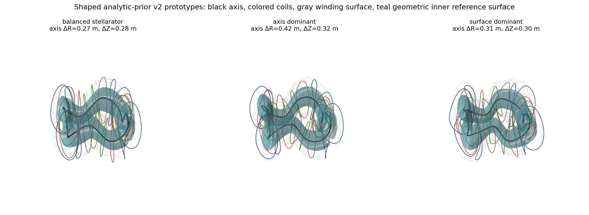

# 轴-曲面-等值线先验 v2：几何审核稿

| 项目 | 状态 |
| --- | --- |
| 日期 | 2026-09-01（Asia/Shanghai） |
| 分支 | `codex/axis-surface-prior` |
| v1 状态 | `invalidated`；953 条部分评分不进入丰度结论 |
| v2 状态 | `geometry_only_awaiting_user_acceptance` |
| GPU 作业 | 无活动作业；视觉认可前禁止批量评分 |

## 审核目标

v2 原型同时展示构造参考轴、几何内层参考面、绕组面和完整对称线圈组。构造参考轴具有可见的场周期弯曲；内外曲面的截面尺寸、伸长、方向和三角形变随环向位置变化；线圈继承整体三维形变并保持低阶光滑。

青色面是用于定义先验形态的几何内层参考面。当前原型尚未计算磁场、磁轴或磁面，也没有 ABI-11 分数。

图例：黑线为构造参考轴，彩色线为三组基础线圈及其完整对称展开，灰色网格为绕组面，青色面为几何内层参考面。

## 三种候选

| 候选 | 轴径向摆幅 ΔR (m) | 轴垂直摆幅 ΔZ (m) | 绕组面平均截面半径摆幅 (m) | 交互视图 |
| --- | ---: | ---: | ---: | --- |
| 1. `balanced_stellarator` | 0.273 | 0.280 | 0.092 | [打开 HTML](assets/axis_surface_prior_v2_prototypes_20260901/prototype_1_balanced_stellarator.html) |
| 2. `axis_dominant` | 0.419 | 0.319 | 0.076 | [打开 HTML](assets/axis_surface_prior_v2_prototypes_20260901/prototype_2_axis_dominant.html) |
| 3. `surface_dominant` | 0.313 | 0.300 | 0.151 | [打开 HTML](assets/axis_surface_prior_v2_prototypes_20260901/prototype_3_surface_dominant.html) |

候选 1 在轴弯曲与截面变化之间取中等幅度。候选 2 强调轴的径向弯曲。候选 3 保留明显轴弯曲，并加强截面尺寸、伸长、旋转和三角形变。

## 几何门禁

三个候选均使用 `nfp=4, nc=3`，仅用于同条件形态比较。

| 指标 | 范围 |
| --- | ---: |
| 构造轴链接数 | 1.0013 至 1.0024 |
| 标量坐标单调下界 | 0.597 至 0.714 |
| order-16 线圈拟合 RMS 最大值 | `2.45e-6 m` |
| order-16 线圈拟合点误差最大值 | `8.23e-6 m` |

这些门禁只确认几何闭合、链接、参数化单调性和 Fourier 表达精度。磁面存在性、QH 丰度和线圈工程分量将在形态获得认可后另行评估。
