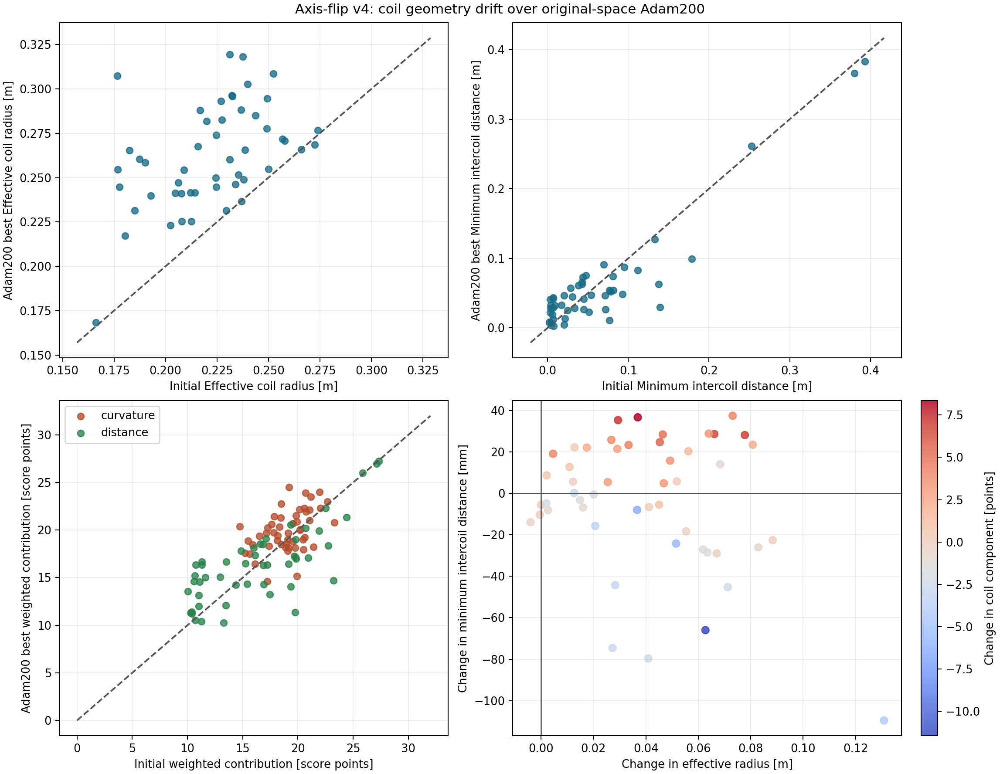
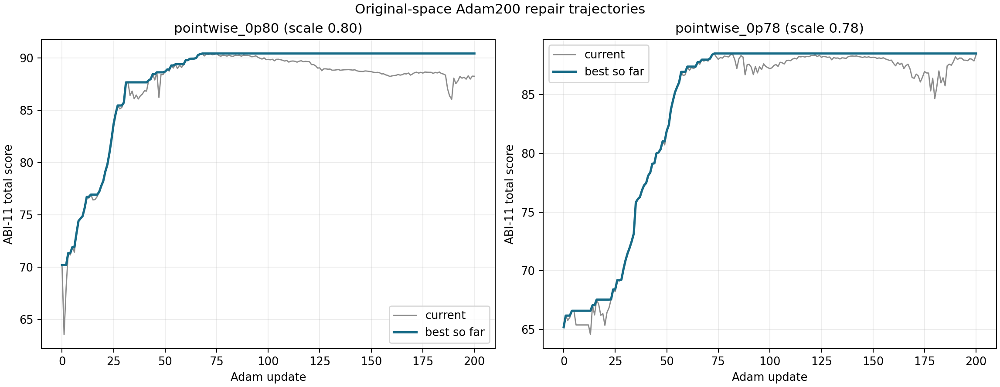
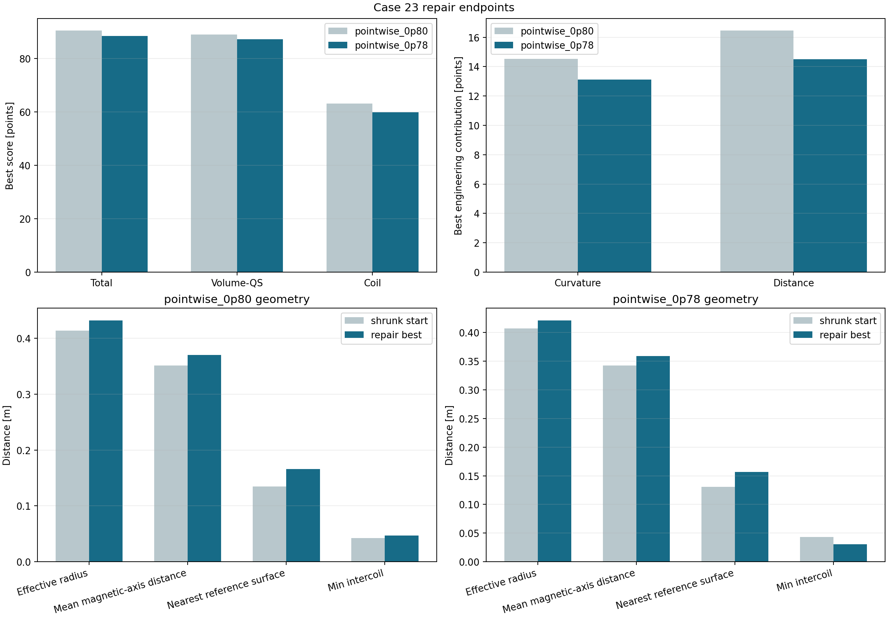
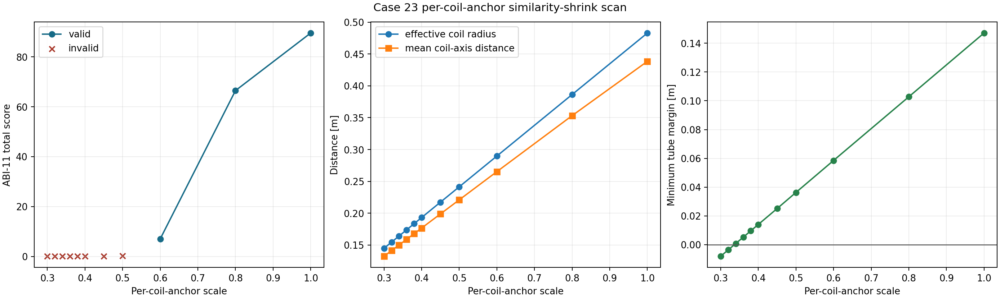
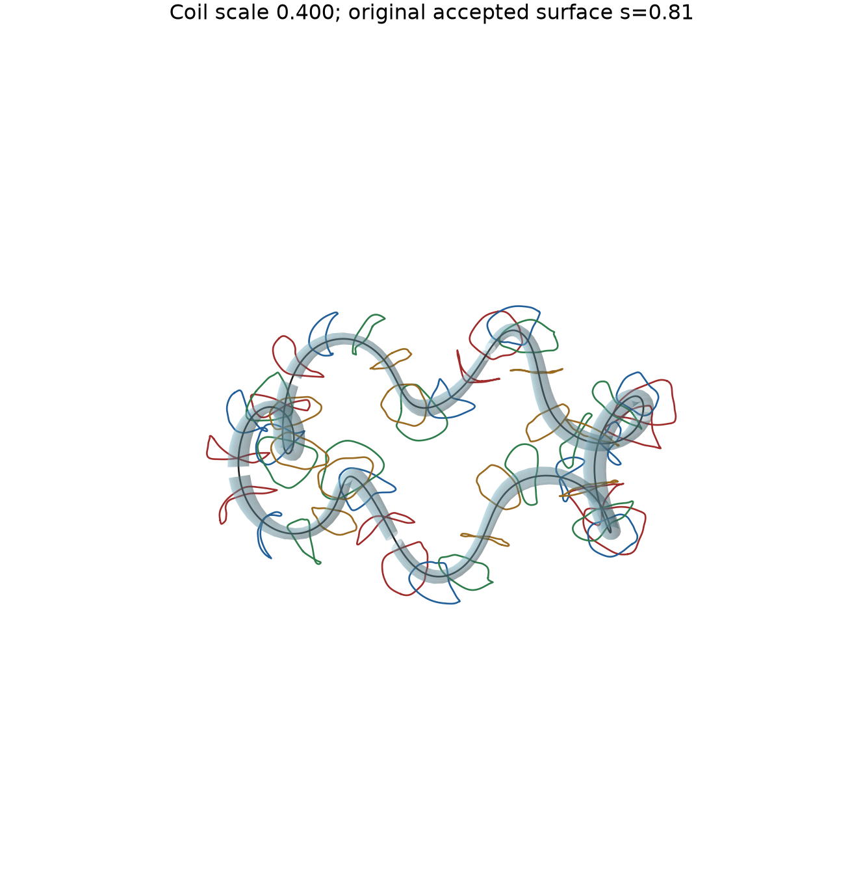
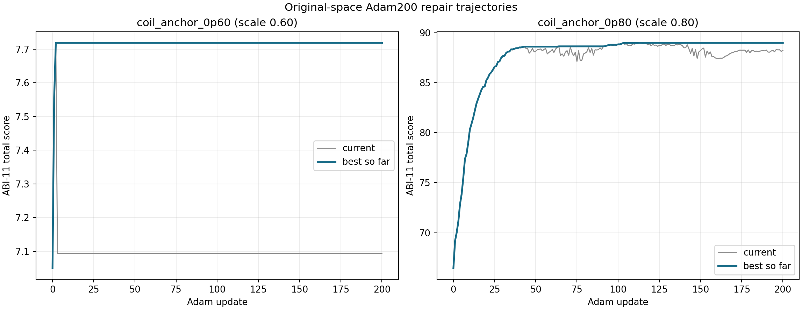
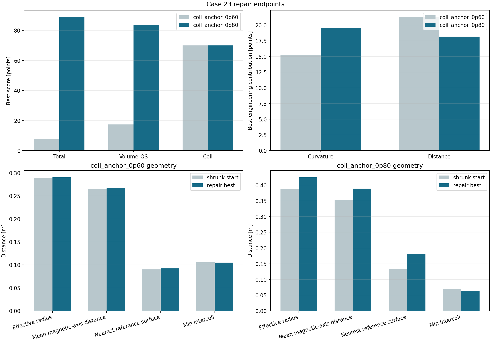
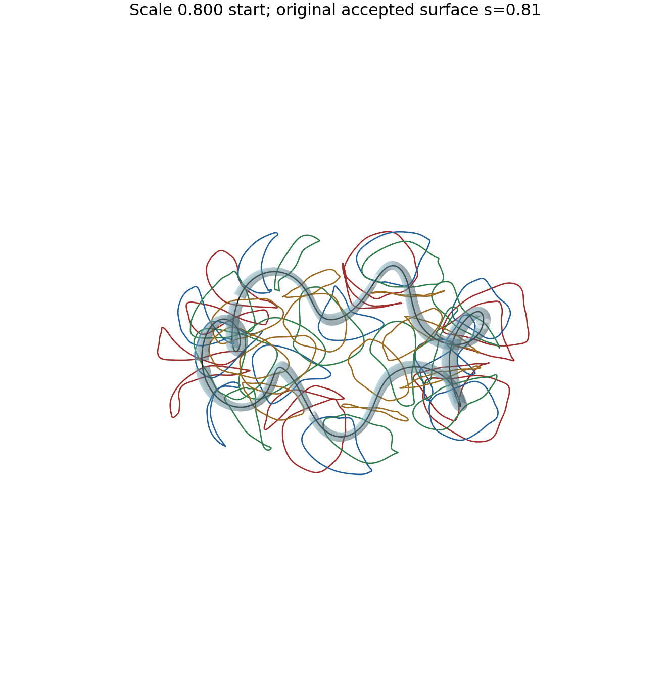
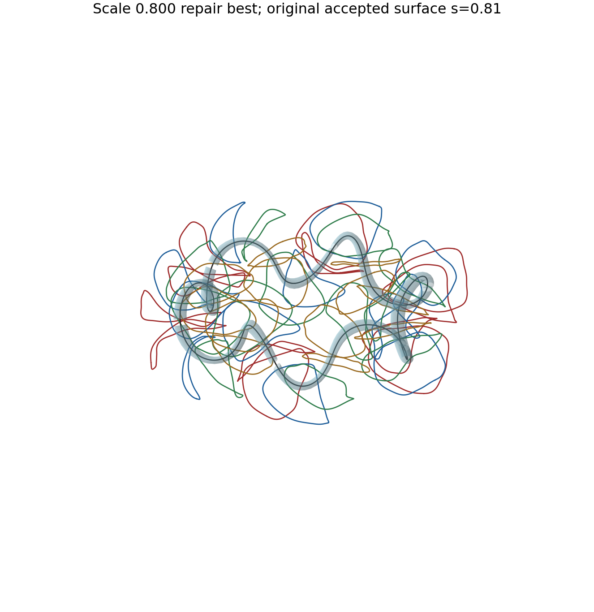

# Case 23 线圈尺度漂移与贴近磁面缩放实验

- 日期：2026-09-03
- 状态：注册探索实验
- 源位形：`axisflip_case_0000023`，`nfp=6`，`nc=4`
- 源端点：原空间 Adam2000 第 1985 步最优点，ABI-11 分数 `89.553487`
- 固定几何参考：源端点完整评估接受的 `s=0.81` 磁面，体积 `0.102164 m^3`

## 结论摘要

- 50 条原空间 Adam200 轨迹中有 48 条线圈半径增大，配对中位增量为 `38.94 mm`。半径增量与曲率贡献增量的相关系数为 `+0.529`，与距离贡献增量的相关系数为 `-0.297`。
- 形状保持缩放把每条线圈围绕一个固定磁轴锚点整体缩小。`scale=0.80` 将有效半径从 `0.4829 m` 降至 `0.3863 m`，同时把线圈工程分从 `66.1021` 提高到 `69.0738`；其体 QS 分降至 `39.7922`，所以主要代价来自磁场质量。
- `scale=0.80` 经 Adam200 修复到 `88.9862`。修复过程把半径增加 `38.84 mm`，最小线圈间距减少 `5.79 mm`，曲率贡献增加 `1.7581`，距离贡献减少 `0.5172`。线圈工程分仍增加 `0.8982`，体 QS 分增加 `43.9856`。
- `scale=0.60` 是扫描中最小的 ABI-11 合法起点，有效半径 `0.2898 m`。Adam200 只接受前三次更新，最佳分停在 `7.7187`；从第 4 次迭代起的 197 次中心提案全部触发磁通拒绝。
- 约 `0.2 m` 的目标尺度对应 `scale=0.40`，其有效半径为 `0.1932 m`、相对固定参考面的最小管余量为 `14.1 mm`，但该线圈组已经失去可用磁轴。单纯缩放无法把 case 23 推到该尺度并保留原 QH 磁场拓扑。

## 研究问题

本实验回答两个问题：

1. compact-flexible axis-flip v4 随机起点经过原空间 Adam200 后，线圈尺度、曲率收益和距离收益如何变化。
2. 源端点的线圈向磁轴缩小后，ABI-11 分数保留到什么程度；原空间 Adam200 能否修复评分，同时保持更紧凑的几何。

完整评估得到的 `s=0.81` 磁面在缩放和修复阶段只承担固定几何参考作用。每个新线圈组对应的真实磁面需要单独重算。

## 指标定义

有效线圈半径定义为四条 base coil 平均长度除以 `2*pi`。该定义直接对应 ABI-11 线圈工程分量中的平均长度指标。

ABI-11 线圈工程分量按七项加权。本文重点拆出：

```text
曲率贡献 = 20*q_down(curvature_p95; 10, 1.3)
          + 12*q_down(curvature_max; 35, 1.2)

距离贡献 = 20*q_up(min_intercoil; 0.08, 1.1)
          + 12*q_up(min_cylindrical_axis; 0.20, 1.2)
```

`min_cylindrical_axis` 是线圈到圆柱坐标对称轴的最小距离。磁轴距离和参考磁面距离由本实验单独计算，不进入 ABI-11 距离贡献。

## 50 条原空间 Adam200 的总体漂移

样本集包含 axis-flip v4 的 50 条完整原空间 Adam200 轨迹。每条轨迹比较初始合法点与 best-so-far 点。

| 指标 | 初始中位数 | Adam200 最优点中位数 | 配对变化中位数 | 增加/降低 |
| --- | ---: | ---: | ---: | ---: |
| 有效线圈半径 | 0.22580 m | 0.26038 m | +0.03894 m | 48 / 2 |
| 最小线圈间距 | 0.04264 m | 0.04286 m | -0.000117 m | 25 / 25 |
| 圆柱轴最小距离 | 0.73874 m | 0.66026 m | -0.08044 m | 7 / 43 |
| 曲率加权贡献 | 19.1371 | 19.7160 | +1.0176 | 33 / 17 |
| 距离加权贡献 | 16.3416 | 16.3601 | -0.1015 | 24 / 26 |
| 线圈工程分量 | 69.3725 | 69.1066 | -0.0405 | 24 / 26 |



半径增长具有高度一致性：50 条轨迹中 48 条变大。最小线圈间距的总体中位变化接近零，个体变化范围很宽；半径变化与最小间距变化的相关系数为 `-0.267`。曲率贡献与半径变化的相关系数为 `+0.529`，距离贡献与半径变化的相关系数为 `-0.2969`。这组关联表明，Adam200 中的尺度增长经常伴随曲率收益，同时伴随距离收益走弱。

按 `nc` 分组后，线圈数对间距响应有明显影响：

| nc | 轨迹数 | 半径变化中位数 | 最小线圈间距变化中位数 | 曲率贡献变化中位数 | 距离贡献变化中位数 |
| ---: | ---: | ---: | ---: | ---: | ---: |
| 1 | 8 | +28.70 mm | -12.06 mm | +0.821 | -0.115 |
| 2 | 12 | +64.42 mm | -11.89 mm | +2.076 | -1.534 |
| 3 | 17 | +45.34 mm | +12.79 mm | +0.948 | +1.937 |
| 4 | 13 | +25.50 mm | +0.21 mm | -0.417 | -0.131 |

`nc=1/2` 组呈现清晰的间距恶化中位数；`nc=4` 组的间距中位变化接近零，13 条中仍有 6 条变差。总体数据支持“优化经常把线圈做大”的观察。曲率项提供了最强的统计关联，距离总贡献没有呈现推动总体半径增长的正向中位收益。

机器可读数据：[配对明细 CSV](assets/axisflip_case23_coil_shrink_20260903/population/coil_growth_pairs.csv)；[汇总 JSON](assets/axisflip_case23_coil_shrink_20260903/population/coil_growth_summary.json)。

## 初始逐点缩放误实现：诊断记录

初始误实现对每个线圈采样点独立寻找最近磁轴点，并执行

```text
p_scaled = a_nearest(p) + scale * (p - a_nearest(p))
```

缩放后的点云重新拟合为原 order-16 Fourier 线圈，电流保持不变。扫描结果显示了一个尖锐的有效性边界：

| scale | 状态 | ABI-11 总分 | 体 QS | 线圈工程 | 有效半径 | 最小参考面管余量 | Fourier 回拟合最大误差 |
| ---: | --- | ---: | ---: | ---: | ---: | ---: | ---: |
| 1.00 | ok | 89.5486 | 86.1086 | 66.1021 | 0.4829 m | 0.1471 m | <3e-15 m |
| 0.80 | ok | 70.1861 | 61.1740 | 60.1724 | 0.4136 m | 0.1031 m | 0.0814 m |
| 0.78 | ok | 65.1987 | 55.0940 | 59.7306 | 0.4073 m | 0.0987 m | 0.0895 m |
| 0.76 | flux_rejected | 0.3306 | 4.0000 | 59.0038 | 0.4012 m | 0.0943 m | 0.0977 m |
| 0.65 | no_axis | 0.1010 | 4.0000 | 56.8722 | 0.3693 m | 0.0701 m | 0.1425 m |
| 0.35 | no_axis | 0.0938 | 4.0000 | 50.1927 | 0.3016 m | 0.0040 m | 0.2646 m |
| 0.30 | no_axis | 0.0926 | 4.0000 | 49.0718 | 0.2937 m | -0.0070 m | 0.2849 m |

`scale=0.35` 在固定参考面的局部管包络外仅剩约 `4 mm`，达到贴近参考面的几何目标，同时失去可用磁轴。`scale=0.30` 已进入局部管包络。逐点最近轴映射还产生了显著的 Fourier 回拟合误差和高频扭曲，因此它保留为诊断方法。

可交互查看：[scale=0.80](assets/axisflip_case23_coil_shrink_20260903/scans/coarse/visuals/scale_0p800.html)；[scale=0.78](assets/axisflip_case23_coil_shrink_20260903/scans/refine/visuals/scale_0p780.html)；[scale=0.35](assets/axisflip_case23_coil_shrink_20260903/scans/coarse/visuals/scale_0p350.html)。

两条误实现起点的 Adam200 仅用于诊断优化器的尺度响应：

| 起点 | 初始分数 | 最好分数（步） | 体 QS 变化 | 线圈分量变化 | 有效半径变化 | 最小线圈间距变化 |
| --- | ---: | ---: | ---: | ---: | ---: | ---: |
| pointwise 0.80 | 70.1861 | 90.4360（68） | +27.7607 | +2.9549 | +18.57 mm | +4.13 mm |
| pointwise 0.78 | 65.1987 | 88.4910（73） | +32.0786 | +0.1302 | +14.02 mm | -12.89 mm |

两条轨迹都在修复分数时重新增大线圈。`pointwise 0.78` 的曲率贡献增加 `1.9302` 分，距离贡献降低 `1.6755` 分；该终点同时出现明显的最小线圈间距恶化。





交互几何：[pointwise 0.80 起点](assets/axisflip_case23_coil_shrink_20260903/analysis_pointwise/pointwise_0p80_start.html)；[pointwise 0.80 修复最优点](assets/axisflip_case23_coil_shrink_20260903/analysis_pointwise/pointwise_0p80_repair_best.html)；[pointwise 0.78 起点](assets/axisflip_case23_coil_shrink_20260903/analysis_pointwise/pointwise_0p78_start.html)；[pointwise 0.78 修复最优点](assets/axisflip_case23_coil_shrink_20260903/analysis_pointwise/pointwise_0p78_repair_best.html)。

## 形状保持的单线圈磁轴锚点缩放

主实验为每条 base coil 选择一个固定锚点：该线圈几何中心最近的已验证磁轴点。整条线圈围绕这个锚点做一次相似缩放：

```text
p_scaled = a_coil + scale * (p - a_coil)
```

这一映射严格保持线圈形状和 order-16 Fourier 表示，线圈长度与有效半径按 `scale` 成比例变化。几何预检给出 `scale=0.40` 的有效半径约 `0.1932 m`、最小参考面管余量约 `14.1 mm`，与约 `0.2 m` 的目标尺度一致。

| scale | 状态 | ABI-11 总分 | 体 QS | 线圈工程 | 有效半径 | 最小参考面管余量 | Fourier 回拟合最大误差 |
| ---: | --- | ---: | ---: | ---: | ---: | ---: | ---: |
| 1.00 | ok | 89.5486 | 86.1086 | 66.1021 | 0.4829 m | 0.1471 m | <3e-15 m |
| 0.80 | ok | 66.4708 | 39.7922 | 69.0738 | 0.3863 m | 0.1028 m | <3e-15 m |
| 0.60 | ok | 7.0502 | 14.4162 | 69.7284 | 0.2898 m | 0.0585 m | <3e-15 m |
| 0.50 | flux_rejected | 0.2631 | 4.0000 | 69.3737 | 0.2415 m | 0.0363 m | <2e-15 m |
| 0.45 | no_axis | 0.1143 | 4.0000 | 69.0268 | 0.2173 m | 0.0251 m | <3e-15 m |
| 0.40 | no_axis | 0.1138 | 4.0000 | 68.5629 | 0.1932 m | 0.0141 m | <3e-15 m |
| 0.34 | no_axis | 0.1130 | 4.0000 | 67.8460 | 0.1642 m | 0.00083 m | <2e-15 m |
| 0.32 | no_axis | 0.1127 | 4.0000 | 67.5671 | 0.1545 m | -0.00359 m | <4e-15 m |

相似缩放消除了额外高频震荡。ABI-11 有效性边界仍限制了可直接进入标准 Adam 的紧凑程度：`scale=0.60` 是本轮扫描中最小的有效点，`scale=0.50` 已被磁通门拒绝。Adam200 因而选择 `scale=0.60` 与 `0.80` 并行修复。





缩放本身对工程分量的影响可拆成三组：

| scale | 曲率贡献 | 距离贡献 | 长度贡献 | 最小线圈间距 | 线圈工程分 |
| ---: | ---: | ---: | ---: | ---: | ---: |
| 1.00 | 19.9162 | 14.3769 | 12.2112 | 0.03370 m | 66.1021 |
| 0.80 | 17.7689 | 18.6673 | 13.0397 | 0.07010 m | 69.0738 |
| 0.60 | 14.9260 | 21.3128 | 13.8918 | 0.10523 m | 69.7284 |

缩小线圈降低了曲率收益，同时提高了线圈间距、圆柱轴距离和长度收益。`scale=0.80/0.60` 的线圈工程总分都高于源端点，因此工程目标在缩放起点处允许更紧凑的几何。总分下降集中在体 QS 分和相关物理分量。

形状交互视图：[scale=0.80](assets/axisflip_case23_coil_shrink_20260903/scans/coil_anchor/visuals/scale_0p800.html)；[scale=0.60](assets/axisflip_case23_coil_shrink_20260903/scans/coil_anchor/visuals/scale_0p600.html)；[scale=0.40，约 0.2 m](assets/axisflip_case23_coil_shrink_20260903/scans/coil_anchor/visuals/scale_0p400.html)。

## 形状保持缩放后的 Adam200 修复

两个有效起点在 Students 的两张 GPU 上并行运行，分别对应作业 `53223` 和 `53224`。两条轨迹都完成 200 次梯度估计；`scale=0.60` 只有 3 次中心更新被接受，`scale=0.80` 完成 200 次 Adam 更新。

| 起点 | 最佳分（步） | 体 QS：起点 -> 最佳 | 线圈分：起点 -> 最佳 | 曲率贡献变化 | 距离贡献变化 | 半径变化 | 最小间距变化 |
| --- | ---: | ---: | ---: | ---: | ---: | ---: | ---: |
| coil-anchor 0.60 | 7.7187（2） | 14.4162 -> 17.4566 | 69.7284 -> 70.0368 | +0.3478 | -0.0247 | +0.85 mm | -0.17 mm |
| coil-anchor 0.80 | 88.9862（113） | 39.7922 -> 83.7778 | 69.0738 -> 69.9720 | +1.7581 | -0.5172 | +38.84 mm | -5.79 mm |









`scale=0.80` 的总分恢复主要来自体 QS 分增加 `43.9856`。工程项内部同时发生了两类变化：曲率降低带来 `+1.7581` 分，线圈增长使长度贡献减少 `0.3373` 分、距离贡献减少 `0.5172` 分；其余工程项合计减少约 `0.3426` 分。曲率收益覆盖这些代价后，线圈工程分净增 `0.8982`。

`scale=0.80` 轨迹给出了半径回增机制的直接个例证据：整体评分在恢复体 QS 的同时允许线圈重新变大，曲率项对变大后的工程净收益有主要贡献。总体 50 条轨迹的相关性提供群体层面的同方向证据。本实验数据仍无法把半径增长完全归因于单一工程项，因为体 QS 恢复对优化方向的影响更强。

修复后的 `scale=0.80` 有效半径为 `0.4252 m`，仍比源端点小 `57.7 mm`；最小线圈间距为 `0.06431 m`，仍比源端点的 `0.03370 m` 大。相对紧凑性保留了一部分，但线圈到固定参考面的最近距离从 `0.1342 m` 回升到 `0.1803 m`，已经接近源端点的 `0.1784 m`。

交互几何：[scale=0.80 起点](assets/axisflip_case23_coil_shrink_20260903/analysis_coil_anchor/coil_anchor_0p80_start.html)；[scale=0.80 修复最优点](assets/axisflip_case23_coil_shrink_20260903/analysis_coil_anchor/coil_anchor_0p80_repair_best.html)；[scale=0.60 起点](assets/axisflip_case23_coil_shrink_20260903/analysis_coil_anchor/coil_anchor_0p60_start.html)；[scale=0.60 修复最优点](assets/axisflip_case23_coil_shrink_20260903/analysis_coil_anchor/coil_anchor_0p60_repair_best.html)。机器可读结果：[修复指标 CSV](assets/axisflip_case23_coil_shrink_20260903/analysis_coil_anchor/repair_metrics.csv)；[完整汇总 JSON](assets/axisflip_case23_coil_shrink_20260903/analysis_coil_anchor/results_summary.json)。

## 协议与可复现性

- 逐点诊断协议：`qh-axisflip-v4-case23-axis-centered-coil-shrink-adam200-64d-abi11-v1`。
- 形状保持协议：`qh-axisflip-v4-case23-coil-anchor-shrink-adam200-64d-abi11-v1`。
- 评分器：ABI-11，SHA-256 `1c6c78b0dee662233215a56dbdc1e50b8ed29f2d0eee9ae8c4ff7d0403b895ed`。
- 修复优化：原空间 exact-unclipped Adam200，64 个新鲜正交中心差分方向，`h=0.0025`，`lr=0.01`，beta `(0.7,0.999)`。
- 源 best SHA-256：`3893410789bdf7988415aa3e28b2f7f70703872c0d8027b077d4f3af861041b1`。
- 参考面 SHA-256：`44228e865adaa84ac02aa71ad3459e46f2dc310af31731cb090466e66750693e`。
- 固定锚点扫描作业：`53217`；固定锚点修复作业：`53223`（scale 0.60）与 `53224`（scale 0.80）。
- 形状保持实现与运行提交：`ffa7fdf0ee13025bb1419dad0c346fbaeededa0f`。

本实验属于几何和原生评分探索。QH 默认协议仍为 `qh-flow-screen32-adam200-64d-abi11-v1`。
