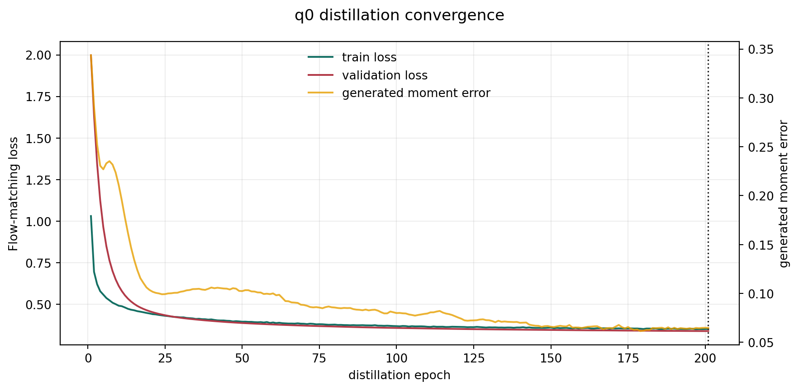
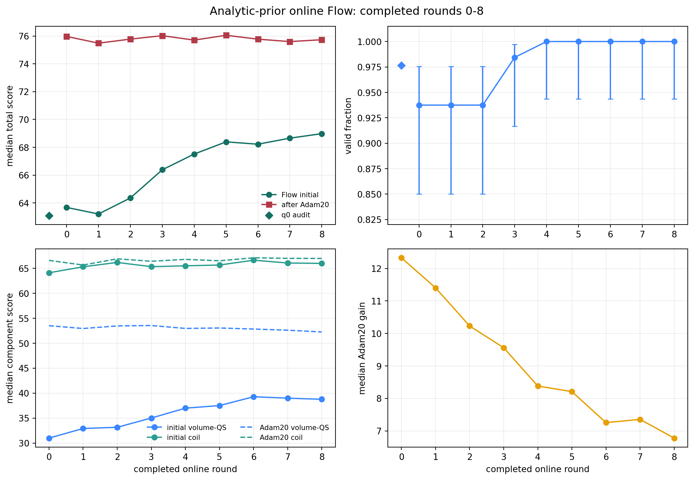
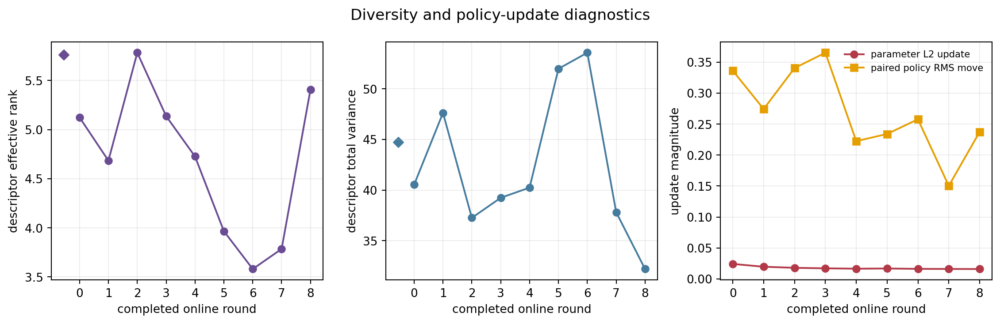

# 解析先验 Flow 蒸馏与在线 Adam20 加权训练：第 0--8 轮验收

日期：2026-09-03

分支：`codex/axis-surface-prior`

实验协议：`qh-axisflip-prior-distilled-online-adam20-rwcfm-abi11-v1`

固定条件：`nfp=8, nc=3`

验收边界：完整第 0--8 轮，共 576 个在线样本；第 9 轮仍在执行，未进入本报告统计。
运行状态：P107 四卡作业 `52977` 在验收后继续执行。

## 结论

前九个完整轮次已经出现明确富集信号。各轮 Flow 生成样本的初始总分中位数从第 0 轮
的 `63.6751` 升至第 8 轮的 `68.9784`，提高 `5.3033` 分；初始分数达到 70 的数量
从 `4/64` 升至 `22/64`。合法率从前三轮的 `60/64` 提升到第 4--8 轮的
`64/64`。线性拟合给出初始总分每轮 `+0.7886`、合法率每轮 `+0.00964`。

体 QS 初始中位数提高 `7.7766` 分，coil 初始中位数提高 `1.8787` 分，说明总分富集
主要来自体 QS，同时没有以系统性破坏线圈工程为代价。Adam20 后的分数中位数稳定在
`75.49--76.05`，而中位优化增益从 `12.3296` 降至 `6.7780`；这表明 Flow 已经把
一部分 Adam20 可获得的提升前移到初值。

第 0--8 轮没有灾难性模式塌缩：九轮的近重复率均为 0，第 8 轮描述符有效秩比第 0 轮
高 `5.6%`。描述符总方差同期下降 `20.6%`，第 5--7 轮有效秩一度下降，属于需要继续
监控的温和收缩信号。现有证据支持让作业继续运行。

## 整个流程怎样工作

### 1. 一次性合成教师数据

教师集由已经通过形态审查的 compact-flexible v4 解析先验生成，固定
`nfp=8,nc=3` 和正手性构造。P107 的 16 个 CPU 核生成 80,000 条，Students 的
24 个 CPU 核生成 120,000 条，总计 200,000 条并存盘；两部分吞吐分别为
`33.40` 和 `42.00` 样本/秒。数据按确定性规则分为 90% 训练、5% 验证和 5% 测试。
后续 Flow 训练直接读取该不可变数据集，在线轮次不再重复调用解析生成器。

每个样本含三条基础线圈的 Fourier 几何与三个相对电流。教师先验的三条电流相等；
Flow 仍学习电流通道，因为 Adam20 可以改变三条线圈之间的相对电流。归一化器固定
总电流 L1 范数与主符号，保留可学习的相对分配。

### 2. 把解析先验蒸馏成 q0 Flow

模型沿用项目中的 `CoilFlowTransformer`：5,761,380 个参数，宽度 256、6 层、8 个
注意力头、前馈隐藏维度 704。网络没有位置编码，对线圈 token 采用共享自注意力；
训练时再随机打乱完整线圈 token，显式消除数据文件中固定轮廓顺序的影响。

蒸馏采用 conditional flow matching。对教师样本 `x1` 与高斯噪声 `x0` 随机取时间
`t`，网络学习把 `x_t=(1-t)x0+t*x1` 沿速度 `x1-x0` 推向教师分布。训练终止由两个
条件共同决定：验证损失进入平台期，生成分布的矩统计也稳定。5000 epoch 只承担失控
保护；本次在 epoch 201、全局 step 35376 收敛，最佳验证损失为 `0.340072`，最后三次
生成矩误差为 `0.06473, 0.06483, 0.06473`。

蒸馏完成后，独立抽取 128 个教师样本和 128 个 q0 Flow 样本，用 ABI-11 做门控审核：

| 来源 | 合法 | 总分中位数 | 合法样本总分中位数 | 体 QS 中位数 | coil 中位数 | 有效秩 | 总方差 | 近重复率 |
|---|---:|---:|---:|---:|---:|---:|---:|---:|
| 教师 | 121/128 | 62.3131 | 63.2085 | 30.9052 | 65.3419 | 6.3787 | 46.2235 | 0 |
| q0 Flow | 125/128 | 63.0881 | 63.1802 | 30.2424 | 65.1079 | 5.7621 | 44.7396 | 0 |

q0 的合法率、总分、两个核心分量和方差均贴近教师；有效秩比值为 `0.9033`，高于
协议门槛 `0.5`。q0 Flow 样本中，每个样本相对等电流的最大偏差中位数为 `1.30%`，
p95 为 `2.48%`，最大值 `2.98%`，没有负电流。

### 3. 一轮在线更新

每轮执行下面四个阶段：

1. EMA Flow 在四张 GPU 上各生成 16 个样本，合计 64 个。
2. ABI-11 先评估初值。合法样本立即执行 20 步直接数据空间 Adam；每步使用 64 个新
   正交中心差分方向，`h=0.0025`、学习率 `0.01`、beta `(0.7,0.999)`。目标取
   step 0--20 中分数最高的状态。非法样本保留原状态，奖励权重固定为 `0.05`。
3. 合法样本按本轮分数排序，把奖励权重限制在 `[1,2]`。并列分数获得相同权重，防止
   排序顺序制造虚假偏好。改进样本进入容量 512 的 FIFO 回放池。
4. 四张 GPU 共同执行 250 个 DDP 更新。每个 batch 的 Flow loss 由 85% 更新前策略
   无权锚定、10% 本轮改进目标与回放池的奖励加权项、5% 原始教师锚定组成。模型
   原始权重与 AdamW 状态跨轮延续，EMA 权重负责下一轮采样。

85% 更新前策略锚定给单轮更新留出缓冲，5% 教师锚定限制长期漂移，回放池降低只追逐
最近少数高分样本的风险。每轮同时记录固定噪声经过更新前后的配对位移、模型参数变化、
描述符有效秩、总方差、最近邻距离和近重复率。

## 第 0--8 轮结果

| 轮次 | 合法 | 初始分中位数 | 初始 >=70 | 初始体 QS | 初始 coil | Adam20 中位数 | 中位增益 | Adam20 >=80 | 有效秩 | 总方差 |
|---:|---:|---:|---:|---:|---:|---:|---:|---:|---:|---:|
| 0 | 60/64 | 63.6751 | 4 | 30.9881 | 64.1127 | 75.9714 | 12.3296 | 0 | 5.1242 | 40.5306 |
| 1 | 60/64 | 63.2020 | 4 | 32.9135 | 65.3126 | 75.4859 | 11.4046 | 0 | 4.6842 | 47.6283 |
| 2 | 60/64 | 64.3540 | 12 | 33.1546 | 66.1819 | 75.7778 | 10.2316 | 1 | 5.7832 | 37.2571 |
| 3 | 63/64 | 66.3809 | 8 | 35.0090 | 65.3332 | 76.0248 | 9.5598 | 1 | 5.1372 | 39.2374 |
| 4 | 64/64 | 67.5129 | 15 | 36.9864 | 65.5066 | 75.7064 | 8.3814 | 1 | 4.7266 | 40.2438 |
| 5 | 64/64 | 68.3890 | 16 | 37.5067 | 65.6623 | 76.0528 | 8.2091 | 0 | 3.9657 | 51.9902 |
| 6 | 64/64 | 68.2211 | 20 | 39.2722 | 66.6358 | 75.7732 | 7.2546 | 0 | 3.5804 | 53.5773 |
| 7 | 64/64 | 68.6558 | 20 | 38.9882 | 66.0708 | 75.5994 | 7.3541 | 0 | 3.7850 | 37.8076 |
| 8 | 64/64 | **68.9784** | **22** | 38.7647 | 65.9914 | 75.7327 | 6.7780 | 1 | 5.4089 | 32.1973 |

九轮共评估 576 个样本，其中 563 个合法。Adam20 后达到 70 的数量依次为
`59,60,59,62,64,63,64,63,64`；20 步后的上限基本稳定，富集主要体现在初始分布
向该上限移动。

### 体 QS 与 coil 的联合表现

563 个合法样本的 Adam20 联合变化为：350 个体 QS 与 coil 同时提高，212 个体 QS
提高且 coil 降低，1 个体 QS 降低且 coil 提高，0 个两者同时降低。体 QS 是 Adam20
最稳定的改善方向；coil 在大多数样本中保持或改善，也存在约 `37.7%` 的样本用一部分
coil 分量换取更高体 QS。

从 Flow 初始分布看，第 0 到第 8 轮的体 QS 中位数增加 `7.7766`，coil 中位数增加
`1.8787`。这组联合变化支持 Flow 学到了兼顾两个分量的起点富集。

### 多样性与更新幅度

第 0--8 轮采样策略的描述符有效秩在 `3.5804--5.7832` 之间，第 8 轮为 `5.4089`；九轮近重复率
均为 0。总方差从 `40.5306` 降至 `32.1973`，提示分布正在收紧。第 8 轮相对参数更新
L2 为 `0.01605`，固定噪声配对样本的归一化 RMS 位移为 `0.2374`，更新仍具有实际
幅度。电流分配的样本内最大偏差中位数从第 0 轮 `1.37%` 增至第 8 轮 `2.31%`，
第 8 轮 p95 为 `5.18%`、最大值 `9.38%`，全部电流保持同号。

继续运行时重点观察三项风险：初始分数与合法率是否持续改善，有效秩和总方差是否继续
同步下降，近重复率是否从 0 上升。出现多轮分数停滞并伴随多样性持续恶化时，才构成
停止或调整锚定比例的明确负面信号。本次九轮切片尚未满足这一条件。

## 证据与复现

- [冻结实验规范](assets/axisflip_prior_online_rl_20260903/protocol.json)
- [教师数据清单](assets/axisflip_prior_online_rl_20260903/teacher_dataset_manifest.json)
- [RL 运行清单](assets/axisflip_prior_online_rl_20260903/manifest.json)
- [q0 蒸馏收敛记录](assets/axisflip_prior_online_rl_20260903/distillation_convergence.json)
- [q0 ABI-11 审核汇总](assets/axisflip_prior_online_rl_20260903/q0_audit_summary.json)
- [第 8 轮后进度快照](assets/axisflip_prior_online_rl_20260903/progress_snapshot_after_round_008.json)
- [报告派生统计](assets/axisflip_prior_online_rl_20260903/report_metrics.json)

本报告只解释完整第 0--8 轮。运行中的第 9 轮及后续轮次将在新的完整轮次落盘后另行
验收。该实验保持 `registered-experimental` 状态，不改变项目 QH 默认协议
`qh-flow-screen32-adam200-64d-abi11-v1`。
