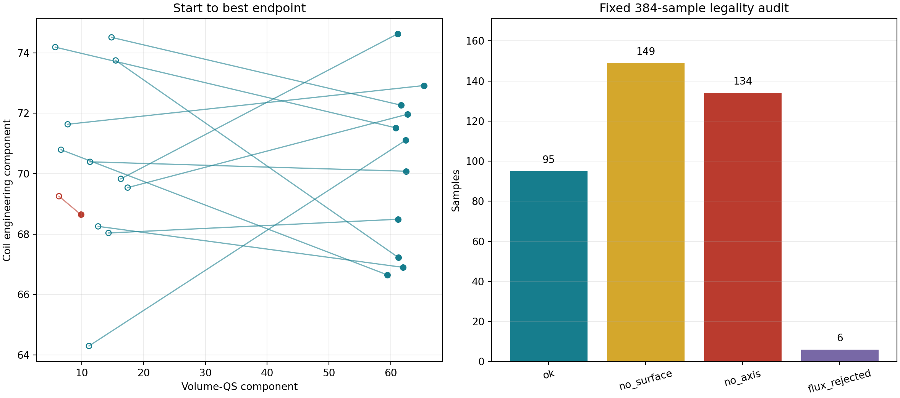
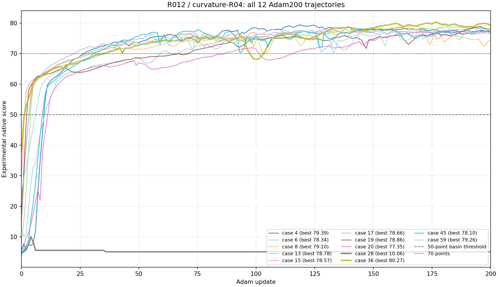
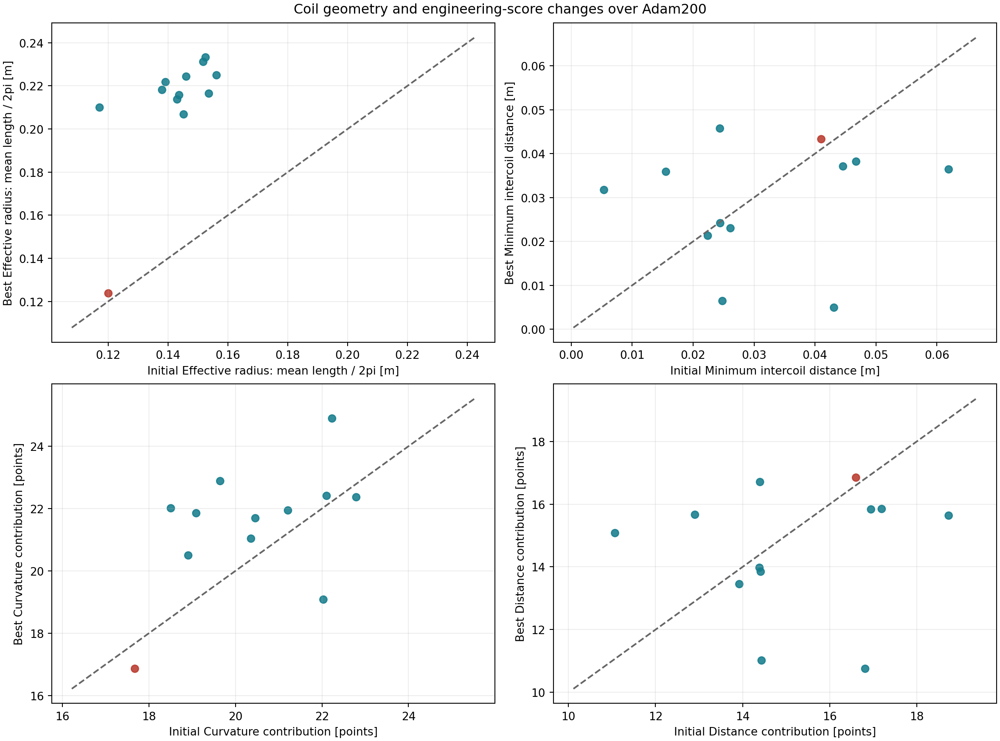

# 12 cm 线圈先验与 4 cm 曲率尺度实验报告

日期：2026-09-03

协议：`qh-axis-surface-contour-compact-flexible-axisflip-r012-curvature-r04-adam200-64d-abi11-v1`

代码：`70a1102829da50d9054d929d1cd7073780909268`

状态：`registered-experimental`，不改变 QH 默认协议

## 结论

固定 `nfp=8,n_coils=3` 的 384 个先验样本中有 95 个通过 ABI-11 合法性检查，
合法率为 **24.74%**，Wilson 95% 区间为 **20.69%--29.29%**。六个并行 worker
各取最早出现的两个合法样本进入 Adam200，共完成 12 条轨迹；其中 **11/12 达到
70 分**，最佳分为 **80.2724**。这 12 个起点的初始分最高只有 37.9934，说明 11
条成功轨迹确实从低分起点进入了高分收敛域。

Adam200 的主要收益来自体 QS。体 QS 分量的配对增益中位数为 **+48.0524**，12/12
均提高；coil 分量的配对变化中位数为 **-0.4595**，5 条提高、7 条下降。本批次没有
观察到扩大后普遍获得 coil 总分；几何尺度仍显著增长：平均周长等效半径在 12/12
条轨迹中增加，配对增量中位数为 **7.51 cm**，端点中位数从 14.45 cm 增至
21.73 cm。优化器仍可能为体 QS 主目标扩大线圈。

## 实验设置

| 项目 | 设置 |
|---|---|
| 条件 | `nfp=8,n_coils=3` |
| 先验 | compact-flexible axis-flip；绕组面小半径中心 `0.12 m`，逐样本范围 `0.108--0.132 m` |
| 表示 | 解析先验先映射到 exact-unclipped 标准化数据坐标，再重建、筛选和优化同一几何 |
| 评分器 | ABI-11 接口的实验构建，SHA-256 `7b21e66329a23f18ef3cfab408d0a21410acea3c8d10d8b2463ccee7f5a3969f` |
| 曲率 p95 | 特征尺度 `25 m^-1`，对应半径 `0.04 m`；默认 ABI-11 为 `10 m^-1` |
| 最大曲率 | 保持 `35 m^-1`，对应半径约 `0.0286 m` |
| 合法性样本 | 六个 worker 各固定 64 个，共 384 个；分母不随成功发现提前停止 |
| Adam | 原空间 200 步，64 个每步重新生成的正交中心差分方向，`h=0.0025`，`lr=0.01`，beta `(0.7,0.999)` |
| 并行 | P107 四张 GPU 加 Students 两张 GPU，六个单卡 worker 同时运行 |

实验构建只改动曲率 p95 的尺度。最大曲率保护和其余 ABI-11 评分项保持冻结提交
`70a1102` 的设置。项目默认 ABI-11 库及其 `10 m^-1` 曲率 p95 尺度未改动，因此本文
分数只属于本实验目标。

## 合法率

384 个预先承诺的样本全部完成评分，状态分布如下：

| 状态 | 数量 | 占比 |
|---|---:|---:|
| `ok` | 95 | 24.74% |
| `no_surface` | 149 | 38.80% |
| `no_axis` | 134 | 34.90% |
| `flux_rejected` | 6 | 1.56% |

95 个合法样本的 iota 全部为正，参考轴手性修正持续有效。合法率的固定分母独立于
Adam 成功数，可直接解释为该固定条件与实验评分器下的先验合法丰度。

## Adam200 可优化性

12 条轨迹全部完成 200 步，没有计算失败或不完整轨迹。初始总分中位数为 12.8037，
最佳总分中位数为 78.7184，配对增益中位数为 63.6236。11 条成功轨迹都达到 50、
60 和 70；条件成功率为 91.67%，Wilson 95% 区间为 64.61%--98.51%。12 条样本给出
粗略的条件成功率估计，该区间仍较宽。

`axisflip_r012_case_0000028` 是唯一未进入高分域的样本。它在第 4 步达到 10.0615，
随后维持在约 5 分；体 QS 只增加 3.5360。其余 11 条轨迹的最佳分位于
77.3543--80.2724。

| 样本 | 初始分 | 最佳分 | 最佳步 | 体 QS：初始 -> 最佳 | coil：初始 -> 最佳 | 等效半径 m：初始 -> 最佳 |
|---|---:|---:|---:|---:|---:|---:|
| `axisflip_r012_case_0000036` | 37.993 | **80.272** | 177 | 17.439 -> 62.683 | 69.539 -> 71.967 | 0.145 -> 0.207 |
| `axisflip_r012_case_0000004` | 5.684 | 79.395 | 119 | 7.742 -> 65.329 | 71.636 -> 72.918 | 0.143 -> 0.214 |
| `axisflip_r012_case_0000059` | 24.215 | 79.263 | 181 | 15.503 -> 61.220 | 73.749 -> 67.224 | 0.139 -> 0.222 |
| `axisflip_r012_case_0000008` | 22.966 | 79.105 | 162 | 14.830 -> 61.674 | 74.512 -> 72.265 | 0.146 -> 0.224 |
| `axisflip_r012_case_0000019` | 17.241 | 78.856 | 195 | 12.674 -> 61.934 | 68.256 -> 66.901 | 0.152 -> 0.231 |
| `axisflip_r012_case_0000013` | 7.812 | 78.781 | 185 | 11.186 -> 62.376 | 64.298 -> 71.107 | 0.153 -> 0.233 |
| `axisflip_r012_case_0000017` | 12.901 | 78.656 | 193 | 14.348 -> 61.155 | 68.038 -> 68.492 | 0.154 -> 0.216 |
| `axisflip_r012_case_0000015` | 29.387 | 78.570 | 161 | 16.342 -> 61.093 | 69.830 -> 74.630 | 0.156 -> 0.225 |
| `axisflip_r012_case_0000006` | 12.709 | 78.338 | 196 | 11.354 -> 62.424 | 70.393 -> 70.082 | 0.144 -> 0.216 |
| `axisflip_r012_case_0000045` | 4.043 | 78.095 | 146 | 6.669 -> 59.435 | 70.793 -> 66.650 | 0.138 -> 0.218 |
| `axisflip_r012_case_0000020` | 3.856 | 77.354 | 199 | 5.738 -> 60.808 | 74.188 -> 71.517 | 0.117 -> 0.210 |
| `axisflip_r012_case_0000028` | 5.189 | 10.061 | 4 | 6.334 -> 9.870 | 69.255 -> 68.647 | 0.120 -> 0.124 |

## 体 QS 与 coil 的联合变化

12/12 条轨迹的体 QS 均提高。5 条轨迹的体 QS 与 coil 同时提高，7 条轨迹的体 QS
提高且 coil 下降。体 QS 最佳端点中位数为 61.4471；coil 最佳端点中位数为
70.5946。总分的高成功率由体 QS 大幅改善支撑，coil 分量在约 70 分附近波动。

这一联合结果说明实验曲率尺度没有把总体优化收益转移到工程分量。11 条高分轨迹中
仍有多个样本以少量 coil 损失换取约 45--58 点体 QS 增益。

## 线圈尺度、曲率与距离

先验参数的小半径在选中的 12 条轨迹中位数为 12.62 cm；实际绕组截面平均半径中位数
为 12.82 cm。非圆形起伏使平均周长除以 `2*pi` 得到的等效半径中位数为 14.45 cm。
Adam200 最佳端点的等效半径中位数为 21.73 cm，12/12 均扩大，配对增量范围为
0.37--9.28 cm。

曲率 p95 中位数从 `15.523 m^-1` 降至 `12.651 m^-1`，10/12 条下降；曲率两项合计
贡献的配对增益中位数为 `+0.979`。最大曲率在 6 条中下降、6 条中上升，保留的
`35 m^-1` 项继续约束局部尖角。距离两项合计贡献的配对变化中位数为 `-0.520`；
最小线圈间距在 8/12 条轨迹中下降，配对变化中位数为 `-2.11 mm`。

coil 分量的另外三项由平均长度、高模能量和最大电流组成，其合计贡献在 12/12 条
轨迹中下降，配对变化中位数为 `-0.660`。曲率改善只抵消了部分长度和距离损失，
因此 coil 总分没有随尺度增长而普遍提高。

这组结果给出两个独立判断：

1. `25 m^-1` 的 p95 尺度显著削弱了工程总分推动半径增长的证据，coil 配对中位数
   实际略降。
2. Adam200 仍把 11 个成功样本扩大到约 21--23 cm 的等效半径，体 QS 目标本身或
   目标间耦合仍偏好更大的最终几何。下一版若要求最终线圈继续保持约 12 cm，需要
   直接约束周长/等效半径或加入目标半径带，仅调整曲率尺度不足以实现该要求。

## 运行与统计边界

六卡并行作业为 `53296`（P107 四卡数组）和 `53297`（Students 两卡数组），分析作业
为 `53298`。六个 worker 的中位墙钟时间为 49.36 分钟，最长为 61.67 分钟；单条
Adam200 的中位墙钟时间为 22.48 分钟。固定审计 384/384、Adam200 12/12、worker
6/6 均完整落盘。

Adam 样本是每个 worker 最早出现的两个合法样本，选择过程不按初始分排序。12 个
样本支持条件可优化性的先导估计；全先验高分丰度仍需要扩大 Adam 样本量。本文覆盖
实验原生 score，Boozer、Poincare 和 DESC 完整物理评估不在本次范围内。

## 机器证据

- [冻结协议](assets/axisflip_r012_curvature_r04_20260903/protocol.json)
- [运行清单](assets/axisflip_r012_curvature_r04_20260903/runtime_manifest.json)
- [实验评分库清单](assets/axisflip_r012_curvature_r04_20260903/score_library_manifest.json)
- [分析汇总](assets/axisflip_r012_curvature_r04_20260903/analysis/summary.json)
- [384 条筛选记录](assets/axisflip_r012_curvature_r04_20260903/analysis/screening.csv)
- [12 条轨迹汇总](assets/axisflip_r012_curvature_r04_20260903/analysis/trajectories.csv)
- [报告派生统计](assets/axisflip_r012_curvature_r04_20260903/report_metrics.json)
- [逐轨迹工程指标](assets/axisflip_r012_curvature_r04_20260903/trajectory_metrics.csv)

每条轨迹目录保留起点、200 步历史、最佳点、最终摘要、优化器清单和状态文件，可由
分析汇总与 12 条轨迹 CSV 中的 `trajectory_id` 定位。
