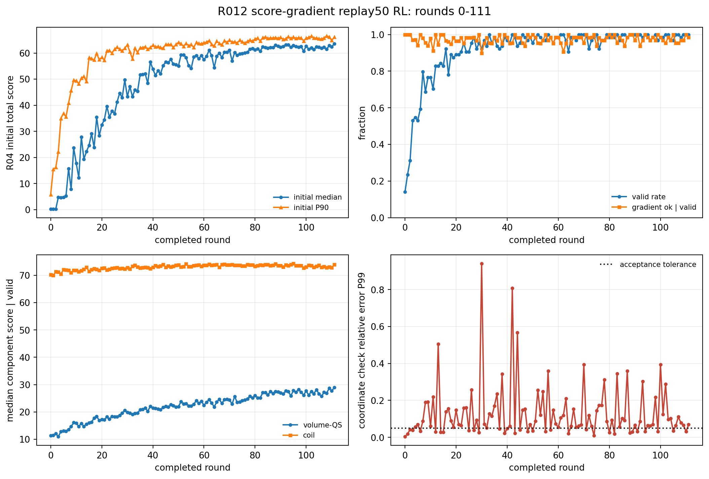
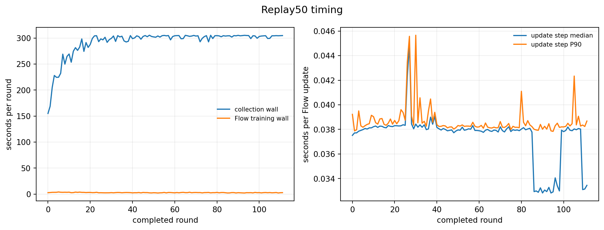
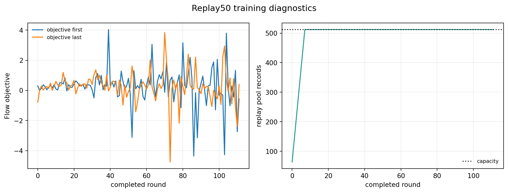

# R012 score-gradient replay50 RL：第 0--111 轮阶段报告

- 报告日期：2026-09-05（Asia/Shanghai）
- 作业：`54046`，状态：`RUNNING`，不会因本次报告停止
- 协议：`qh-axisflip-r012-score-gradient-replay50-rl-r04-abi11-v1`
- 固定条件：`nfp=8,n_coils=3`；评分器为 ABI-11 R04，曲率 p95 特征尺度 `25 m^-1`
- Flow：R04 q0 蒸馏 checkpoint，256 宽、6 层、8 头、5,761,380 参数

## 当前结论

已完整落盘第 0--111 轮，共 `7168` 个起点。累计合法率为 `91.95%`，Wilson 95% 区间 `91.30%--92.56%`；第 0 轮为 `14.06%`，第 111 轮为 `100.00%`。前五轮与后五轮平均合法率为 `35.31% -> 99.69%`，初始总分中位数为 `2.050 -> 62.492`，P90 为 `18.905 -> 65.879`。

这是 score-gradient 策略自身的阶段证据。它显示合法起点比例和初始分布已经明显富集；是否优于 P107 轨迹回放策略，应在相同轮数或相同评分预算下比较，不能仅用不同作业已经运行的轮数直接比较。

## 方法和口径

每轮从当前 Flow 生成 64 个中心样本，由两个 student GPU 各处理 32 个。合法中心执行一次与 Adam 单步完全相同的 ABI-11 R04 64 方向中心差分梯度查询；非法中心不计算梯度。每条记录包含中心、固定 64 方向梯度及合法标记，写入容量 512 的 FIFO 回放池。每轮从回放池均匀有放回抽取与原始 batch 相同大小的记录，执行 50 个 Flow 优化更新；loss 保持 `L_valid + 0.05 L_invalid + beta mean(g_flow^T grad_x ell)`，固定 `beta=0.006021959241`。训练没有引入运输目标、`rho` 或额外的 rollout 目标。

每个有效中心的坐标一致性检查阈值为 `5e-2`。本阶段梯度通过率按有效中心计，累计为 `97.33%`；最新轮为 `98.44%`。最新轮坐标检查 P99 为 `0.0694`。

## 逐轮结果

下表列出等间隔完整轮次；[完整机器统计](assets/axisflip_r012_score_gradient_replay50_rl_20260905_interim/report_metrics_through_0111.json) 保存全部 112 轮。

| 轮次 | 合法 | 初始中位数 | 初始 P90 | 合法样本 QS 中位数 | 合法样本 coil 中位数 | 梯度通过率 | 采集耗时(s) | Flow更新耗时(s) |
|---:|---:|---:|---:|---:|---:|---:|---:|---:|
| 0 | 9/64 | 0.254 | 5.820 | 11.306 | 70.270 | 100.00% | 155.1 | 2.84 |
| 12 | 53/64 | 27.829 | 50.362 | 15.808 | 71.705 | 100.00% | 274.6 | 3.04 |
| 24 | 58/64 | 37.812 | 59.935 | 18.404 | 72.575 | 98.28% | 293.1 | 2.68 |
| 37 | 59/64 | 52.012 | 62.437 | 21.442 | 72.957 | 100.00% | 292.4 | 3.17 |
| 49 | 63/64 | 55.561 | 63.280 | 21.836 | 73.640 | 98.41% | 303.1 | 2.38 |
| 61 | 64/64 | 58.771 | 64.197 | 23.559 | 73.696 | 95.31% | 304.7 | 3.09 |
| 74 | 63/64 | 59.649 | 64.922 | 23.657 | 73.713 | 100.00% | 302.8 | 3.02 |
| 86 | 64/64 | 62.122 | 65.801 | 27.487 | 73.531 | 93.75% | 304.3 | 2.40 |
| 98 | 64/64 | 62.558 | 65.797 | 27.243 | 73.513 | 96.88% | 304.1 | 3.34 |
| 111 | 64/64 | 63.491 | 66.073 | 28.907 | 73.941 | 98.44% | 304.7 | 2.91 |

## 计算耗时

最新轮采集耗时 `304.7 s`，其中单点初始评分中位数 `4.23 s`、有效样本梯度中位数 `5.27 s`；Flow 50 次更新耗时 `2.91 s`，单次更新中位数/P90 为 `0.0334/0.0387 s`。到达 512 条回放记录后，训练耗时基本稳定，主要时间仍在中心评分和 64 方向梯度查询。

## 分量和退化诊断

最新轮合法起点体 QS 中位数为 `28.907`，coil 中位数为 `73.941`，二者样本相关系数为 `0.067`。当前总分变化主要由体 QS 分量承担；coil 已处在较高且较窄的区间，不能把总分中位数提高简单解释为 coil 改善。回放池在第 8 轮左右达到容量上限并保持 512 条记录，未观察到训练记录数量异常增长。

每轮目标函数的首末值和回放池大小见下图。目标函数下降本身只说明 Flow 拟合该轮 loss 的变化，必须结合合法率、分数分位数和梯度一致性判断策略是否有效。

## 阶段判断

截至第 111 轮，score-gradient replay50 作业运行稳定：两个 GPU rank 持续完成采集，梯度一致性通过率保持高位，Flow 更新耗时约数秒/轮。已观测到合法率和初始分布的显著改善；目前没有仅凭这些摘要判定灾难性模式坍缩的证据，但仍需在后续轮次检查分布多样性与独立 holdout。作业 `54046` 保持运行，本报告不发送停止信号。

## 机器证据

- [协议](assets/axisflip_r012_score_gradient_replay50_rl_20260905_interim/protocol.json)
- [manifest](assets/axisflip_r012_score_gradient_replay50_rl_20260905_interim/manifest.json)
- [进度快照](assets/axisflip_r012_score_gradient_replay50_rl_20260905_interim/progress.json)
- [第 0--111 轮派生统计](assets/axisflip_r012_score_gradient_replay50_rl_20260905_interim/report_metrics_through_0111.json)

远端 run root：`/home/scc/pb24511935/local_surface_evaluator_runs/axisflip_r012_score_gradient_replay50_rl_20260905_a9ead14`。
