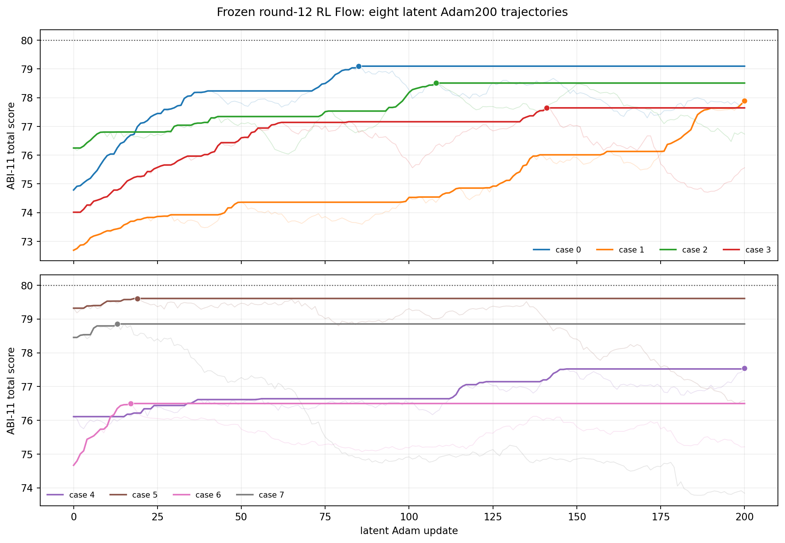
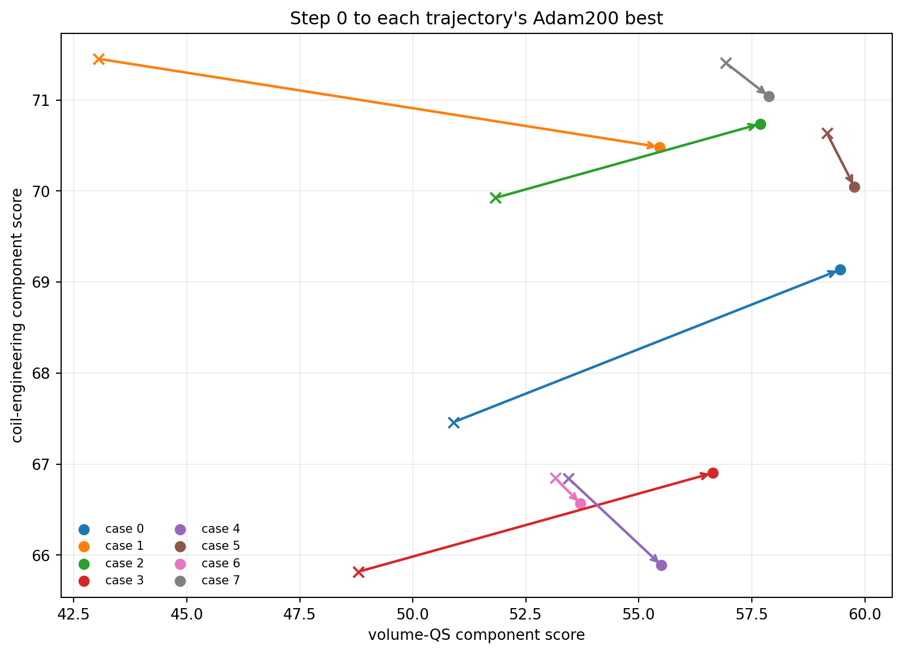

# 冻结第 12 轮 RL Flow 的潜空间 Adam200 验收

日期：2026-09-03

分支：`codex/axis-surface-prior`

实验协议：`qh-axisflip-rl-round12-flow-screen32-adam200-64d-abi11-v1`

固定条件：`nfp=8, nc=3`

执行：Students 数组 `53049`，两个单卡 worker 并行，每个 worker 依次运行 4 条轨迹。

## 结论

8 条轨迹全部完成 200 次潜空间 Adam 更新，状态均为 `ok`。每条轨迹先生成并评分
32 个冻结 RL Flow 样本，再选择最高合法样本进入优化。共 256 个候选，其中 255 个
通过 ABI-11 初始评分。进入 Adam 的 8 个初值总分中位数为 `75.4482`，Adam200
最佳分中位数为 `78.2001`，中位提升为 `2.0454`；最高结果是 case 5 的
`79.6088`。4/8 条轨迹达到 78，0/8 达到 80。

潜空间优化在这批高起点上仍能稳定改善体 QS：8/8 条轨迹的最佳点体 QS 分量均高于
step 0，中位提高 `3.9610`。coil 分量在 3 条轨迹中提高、5 条轨迹中下降，中位变化
为 `-0.3234`。本批潜空间 Adam 的主要收益来自体 QS，部分轨迹用小幅 coil 下降换取
更大的体 QS 提升。

这 8 条轨迹尚未展示突破 80 分的能力。case 5、6、7 分别在 step 19、17、13 取得
最佳值，之后的中心分数回落；case 1 和 case 4 在 step 200 取得最佳值。后续扩大样本
时应继续保存运行最佳点，并把“早期摸高后回落”和“到末步仍上升”分开统计。

## 协议与完整性

冻结策略为在线 RL 运行的 `round_012.pt` EMA 检查点，对应完成 source round 11 后的
原子快照。检查点训练 step 为 `36616`，SHA-256 为
`1ffbd6329a23feb060aa2b279e96ef89d71ff5fd45e01fdaa0de768e08537b72`。
代码提交为 `8f5d57ac6030aa6cb21c36ec805eb240496a7a01`，native ABI-11 评分库
SHA-256 为
`1c6c78b0dee662233215a56dbdc1e50b8ed29f2d0eee9ae8c4ff7d0403b895ed`。

每条轨迹使用 64 个新正交中心差分方向、`h=0.005`、学习率 `0.02`、beta
`(0.7,0.999)` 和 FP32 RK4-128 流水线解码。验收门如下：

| 检查项 | 结果 |
|---|---:|
| worker 完成 | 2/2 |
| 轨迹完成 | 8/8 |
| 每条轨迹完成 200 步 | 8/8 |
| 梯度端点评分为 `ok` | 204800/204800 |
| 中心更新接受 | 1600/1600 |
| 流水线缓存命中 | 1592 次 |
| 浪费的流水线端点 | 0 |
| screen 与优化器 step 0 最大分差 | 0.080502，低于 0.1 门限 |
| worker 标准错误日志 | 两个均为 0 字节 |

两个 worker 都写出了结束汇总和 GPU postflight 文件，worker 用时分别为
`6499.36 s` 和 `6499.43 s`，即约 1 小时 48 分 19 秒。单条 Adam200 优化耗时范围
为 `1427.37--1519.22 s`。数组在验收时已离开活动队列；运行目录、结束汇总、空错误
日志和 postflight 文件共同构成闭合证据。

## 八条轨迹

表中的“初始分”采用优化器 step 0 的严格轴延续复评分。“QS/coil 最佳”取各轨迹
总分最佳点的两个分量。

| case | screen 合法 | screen 选优 | 初始分 | 最佳分 | 最佳步 | 末步分 | 体 QS 初始→最佳 | coil 初始→最佳 |
|---:|---:|---:|---:|---:|---:|---:|---:|---:|
| 0 | 32/32 | 74.7067 | 74.7872 | 79.0965 | 85 | 77.6496 | 50.9003→59.4526 | 67.4611→69.1359 |
| 1 | 32/32 | 72.6710 | 72.6901 | 77.8914 | 200 | 77.8914 | 43.0519→55.4607 | 71.4522→70.4836 |
| 2 | 32/32 | 76.2050 | 76.2480 | 78.5089 | 108 | 76.7338 | 51.8267→57.6887 | 69.9250→70.7386 |
| 3 | 32/32 | 73.9809 | 74.0134 | 77.6446 | 141 | 75.5604 | 48.7962→56.6357 | 65.8184→66.9033 |
| 4 | 32/32 | 76.0903 | 76.1091 | 77.5409 | 200 | 77.5409 | 53.4413→55.5013 | 66.8450→65.8881 |
| 5 | 31/32 | 79.3275 | 79.3217 | **79.6088** | 19 | 76.5824 | 59.1586→59.7707 | 70.6367→70.0442 |
| 6 | 32/32 | 74.6715 | 74.6674 | 76.4973 | 17 | 75.2155 | 53.1503→53.7086 | 66.8461→66.5668 |
| 7 | 32/32 | 78.4199 | 78.4550 | 78.8542 | 13 | 73.8426 | 56.9238→57.8765 | 71.4075→71.0400 |

case 0、1、2、3 的运行最佳分在较长区间内继续抬升；case 5、6、7 的总分最佳点集中
在前 20 步。末步分低于运行最佳分的现象来自中心轨迹的后续移动，报告与后续样本选择
均采用已保存的最佳点。

## 体 QS 与 coil 的联合变化

联合变化计数为：3 条体 QS 与 coil 同时提高，5 条体 QS 提高且 coil 下降，另外两类
均为 0。初始体 QS 中位数 `52.4885` 提高到 `57.1622`；初始 coil 中位数
`68.6931` 提高到 `69.5901`。这里的“中位数前后变化”和“逐样本差值中位数”是两种
统计量；逐样本 coil 差值中位数为 `-0.3234`，所以联合图更准确地反映多数轨迹的小幅
coil 代价。

最佳点的 native `qs_global_error` 范围为 `0.2619--0.3448`，iota 全部保持正值；
两项均来自 ABI-11 原生筛选器。完整磁面与 MHD 性质需要另行执行固定物理评估流程。

## 统计口径与下一步

初始分布的统计单位是每组 32 个 Flow 样本的最高合法值。在线 RL 报告中的每轮 64 个
未筛选样本用于衡量策略本身的丰度，两种统计口径各自保留。

本批 8 条轨迹足以确认 round-12 RL Flow 可以接入项目稳定的潜空间 64D Adam200
实现，并能继续提高体 QS。样本量仍不足以判断 RL Flow 相对 QUASR Flow 的胜率，也
不足以估计突破 80 分的概率。更强的对照需要固定相同的潜噪声种子，分别使用 RL 与
QUASR 检查点运行成对 screen32/Adam200。

## 证据

- [冻结实验规范](assets/axisflip_rl_round12_latent_adam200_20260903/protocol.json)
- [worker 0 汇总](assets/axisflip_rl_round12_latent_adam200_20260903/worker_00/summary.json)
- [worker 1 汇总](assets/axisflip_rl_round12_latent_adam200_20260903/worker_01/summary.json)
- [逐 case 派生统计](assets/axisflip_rl_round12_latent_adam200_20260903/report_metrics.json)
- [逐步轨迹表](assets/axisflip_rl_round12_latent_adam200_20260903/trajectories.csv)
- [Students 数组任务日志](assets/axisflip_rl_round12_latent_adam200_20260903/scheduler/rlflow-lat64-53049_0.out)

远端冻结运行目录：
`/home/scc/pb24511935/local_surface_evaluator_runs/axisflip_rl_round12_latent_adam200_20260903_v2_8f5d57a`。
