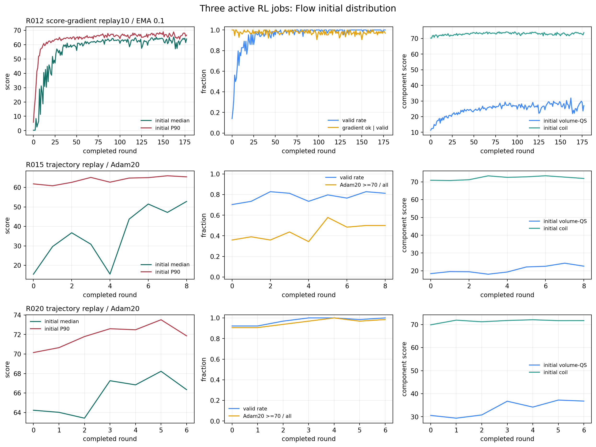
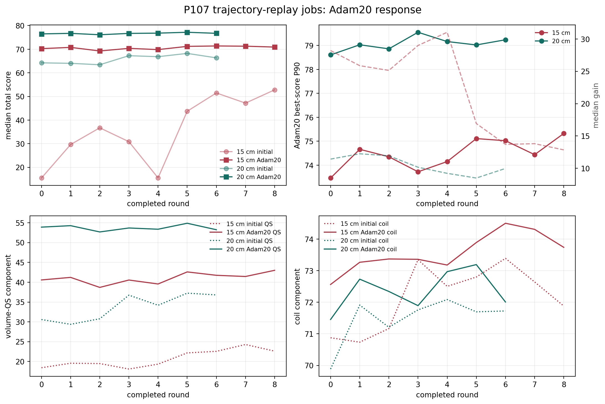
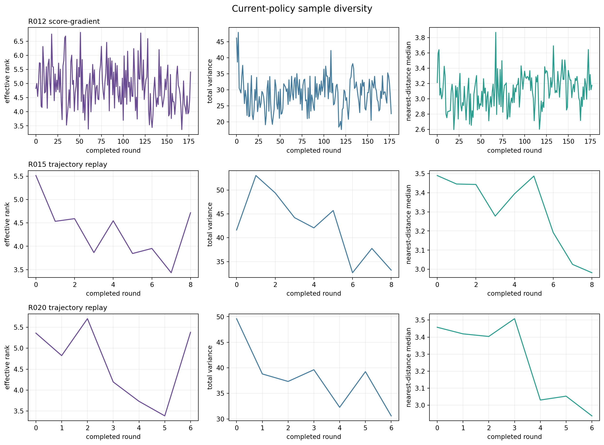
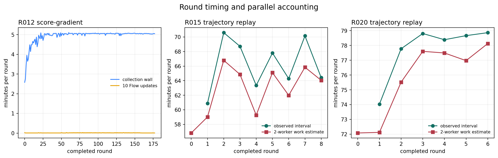

# 三组解析先验 RL 作业阶段验收

- 验收时间：2026-09-06 10:47（Asia/Shanghai）
- 状态口径：三个作业均保持运行，本次只读验收，没有发送停止信号
- 数据边界：student 采用完整轮次 0--177；15 cm 采用 0--8；20 cm 采用 0--6
- 固定条件：`nfp=8`、`n_coils=3`，评分器均为 ABI-11 R04 变体，曲率 P95 特征尺度 `25 m^-1`（特征半径 `4 cm`）

## 阶段结论

1. student 的 12 cm score-gradient 策略已经产生明确富集。前 10 轮到后 10 轮，合法率均值由 `51.56%` 升到 `99.69%`，Flow 初始总分中位数由 `9.431` 升到 `62.927`，P90 由 `37.768` 升到 `66.525`。约第 40 轮后进入平台区，当前仍未把初始 P90 推进 70 分段。
2. P107 的 15 cm 轨迹回放策略正在修复一个较弱的 q0。前三轮到后三轮，初始总分中位数均值由 `27.279` 升到 `50.492`；Adam20 最佳分中位数只由 `70.094` 升到 `71.188`，累计没有 80 分样本。Flow 起点改善明确，Adam20 终点分布尚未同步上移。
3. 20 cm 的 q0 本身已经很强。q0 独立审计的 Flow 合法率为 `98.44%`、总分中位数为 `62.490`。前三轮到后三轮，初始总分中位数均值由 `63.893` 升到 `67.137`，Adam20 最佳分中位数由 `76.439` 升到 `76.904`。累计 `427/448` 个样本经 Adam20 达到 70 分，`22/448` 达到 80 分。
4. 三组都没有出现近重复样本，阈值 `1e-4` 下的最大近重复率均为零。15 cm 和 20 cm 的描述符总方差与最近邻距离都在下降，说明分布正在收缩；有效秩没有持续跌向 1，当前属于需要继续监控的集中趋势，尚无灾难性模式坍缩证据。
5. score-gradient 平均约 `4.95 min/轮`，轨迹回放平均约 `66.27 min/轮`（15 cm）和 `77.76 min/轮`（20 cm）。这符合计算结构：前者每个合法中心只查询一次 64 方向梯度，后者每个合法中心执行 20 个同规格 Adam 梯度步骤。不同半径的 q0 质量差异很大，当前结果不能直接用于判定两种 RL loss 谁更优。

## 作业与协议

| 作业 | 资源 | 先验半径 | RL 数据 | 回放与更新 | 快照完整轮次 | 验收状态 |
|---|---|---:|---|---|---:|---|
| `54423` | Students，2×RTX5090，24 CPU | 12 cm | 每轮 64 个中心；合法中心查询一次 64 方向中心差分梯度 | 512 条中心记录；10 次更新；EMA 插值 `0.1` | 178 | RUNNING，stderr 0 行 |
| `55183` | P107，2×RTX5090，8 CPU | 15 cm | 每轮 64 个中心；合法中心运行 Adam20，保存 0--20 步 | 512 条 rollout；250 次更新；`tau=7.5`、`epsilon=0.01` | 9 | RUNNING，stderr 0 行 |
| `55185` | P107，2×RTX5090，8 CPU | 20 cm | 每轮 64 个中心；合法中心运行 Adam20，保存 0--20 步 | 512 条 rollout；250 次更新；`tau=7.5`、`epsilon=0.01` | 7 | RUNNING，stderr 0 行 |

15 cm 和 20 cm 的 q0 均由各自 200,000 条新先验数据重新蒸馏。15 cm 在 epoch 142、49,984 step 收敛，最佳验证 loss `0.30714`；20 cm 在 epoch 169、59,488 step 收敛，最佳验证 loss `0.33761`。两个 q0 的独立 teacher/Flow 审计均通过。

| q0 Flow 独立审计 | 合法率 | 全体总分中位数 | 合法样本总分中位数 | QS 中位数 | coil 中位数 |
|---|---:|---:|---:|---:|---:|
| 15 cm | 60.94% | 13.122 | 40.762 | 19.240 | 70.522 |
| 20 cm | 98.44% | 62.490 | 62.605 | 30.346 | 70.095 |

这个基线差异说明半径改变同时改变了问题难度。20 cm 作业的高合法率和高分起点主要来自更强的先验/q0，不能全部归因于在线 RL。

## 12 cm Score-Gradient

完整 178 轮共生成 `11,392` 个中心，累计合法 `10,808` 个，累计合法率 `94.87%`，Wilson 95% 区间为 `94.45%--95.26%`。后 10 轮的合法率均值已经达到 `99.69%`，最新完整轮次为 `64/64`。

| 轮次 | 合法数 | 初始中位数 | 初始 P90 | QS 中位数 | coil 中位数 | 梯度通过率 | 有效秩 |
|---:|---:|---:|---:|---:|---:|---:|---:|
| 0 | 9/64 | 0.254 | 5.820 | 11.306 | 70.270 | 100.00% | 4.829 |
| 4 | 32/64 | 2.502 | 41.458 | 15.025 | 70.738 | 100.00% | 5.739 |
| 9 | 50/64 | 31.226 | 57.401 | 17.562 | 71.635 | 98.00% | 5.654 |
| 19 | 61/64 | 43.793 | 62.509 | 19.416 | 72.099 | 98.36% | 5.607 |
| 39 | 64/64 | 61.077 | 64.987 | 24.728 | 72.722 | 95.31% | 4.139 |
| 79 | 64/64 | 62.565 | 66.716 | 27.361 | 74.266 | 98.44% | 5.041 |
| 119 | 64/64 | 63.217 | 66.550 | 27.176 | 73.755 | 98.44% | 5.154 |
| 159 | 63/64 | 62.955 | 65.867 | 27.547 | 72.409 | 98.41% | 3.907 |
| 177 | 64/64 | 64.026 | 66.675 | 27.007 | 73.714 | 96.88% | 5.411 |

前 10 轮到后 10 轮，合法样本 QS 中位数的轮均值由 `14.451` 升到 `26.893`，coil 由 `71.337` 升到 `73.287`。总分提升主要来自可求解比例和 QS 分量，coil 保持在低 70 分段并有小幅改善。后 10 轮 QS/coil 样本相关系数均值为 `+0.176`，此阶段没有明显的 QS/coil 对冲。

64 方向梯度的一致性门共检查 `10,808` 个合法中心，通过 `10,542` 个，通过率 `97.54%`。相对误差中位数为 `0.00207`；`266` 个中心超过 `0.05` 阈值。它们仍保留普通合法 Flow loss，但其 score-gradient 运输项被乘零，因此不会把不可信梯度写入更新。少量大误差使全局 P99 达到 `0.1287`，这项比例目前稳定但应继续监控。

## 15 cm 轨迹回放

完整 9 轮共 `576` 个起点，累计合法 `449` 个，合法率 `77.95%`，Wilson 95% 区间 `74.39%--81.15%`。前三轮与后三轮的主要量如下。

| 指标 | 前三轮均值 | 后三轮均值 |
|---|---:|---:|
| 合法率 | 75.52% | 80.21% |
| 初始总分中位数 | 27.279 | 50.492 |
| 初始总分 P90 | 61.764 | 65.487 |
| 初始 QS / coil 中位数 | 19.160 / 70.926 | 23.158 / 72.638 |
| Adam20 最佳分中位数 | 70.094 | 71.188 |
| Adam20 最佳分 P90 | 74.159 | 74.929 |
| Adam20 QS / coil 中位数 | 40.170 / 73.067 | 42.074 / 74.184 |
| Adam20 中位增益 | 26.412 | 13.453 |

累计 `442/576` 个起点经 Adam20 达到 50 分，`253/576` 达到 70 分；按合法样本计分别为 `98.44%` 和 `56.35%`。没有样本达到 80 分。最新轮初始中位数 `52.807`、Adam20 最佳分中位数 `70.910`。初值变好后中位增益自然缩小，但 Adam20 P90 仍在 75 左右，当前未看到终点分布突破平台。

最新轮初始 QS/coil 相关系数为 `-0.303`，Adam20 后为 `-0.322`；后三轮均值分别为 `-0.280/-0.275`。较好的 QS 与 coil 工程分之间已经出现温和负相关，后续不能只看总分中位数。

## 20 cm 轨迹回放

完整 7 轮共 `448` 个起点，累计合法 `435` 个，合法率 `97.10%`，Wilson 95% 区间 `95.10%--98.30%`。

| 指标 | 前三轮均值 | 后三轮均值 |
|---|---:|---:|
| 合法率 | 93.75% | 99.48% |
| 初始总分中位数 | 63.893 | 67.137 |
| 初始总分 P90 | 70.864 | 72.620 |
| 初始 QS / coil 中位数 | 30.255 / 71.002 | 36.081 / 71.836 |
| Adam20 最佳分中位数 | 76.439 | 76.904 |
| Adam20 最佳分 P90 | 78.831 | 79.141 |
| Adam20 QS / coil 中位数 | 53.628 / 72.177 | 53.841 / 72.724 |
| Adam20 中位增益 | 11.869 | 9.231 |

累计所有合法样本都在 Adam20 后达到 50 分，`427/435` 达到 70 分，`22/435` 达到 80 分。按全部起点计，70 分和 80 分丰度分别为 `95.31%` 和 `4.91%`。初始 QS 的提升没有继续传递到 Adam20 后的 QS 中位数，说明 20 步局部优化目前把不同起点推到相近终点域。

最新轮初始 QS/coil 相关系数为 `-0.242`，Adam20 后为 `-0.360`；后三轮均值分别为 `-0.292/-0.234`。这里同样存在温和对冲，需要联合观察两个分量。

## 多样性

描述符采用对线圈排列不敏感的几何/电流统计。有效秩表示协方差覆盖的有效方向数，总方差表示总体散布尺度，最近邻距离表示单轮内样本的典型间隔。

| 作业 | q0/第 0 轮有效秩 | 最新有效秩 | q0/第 0 轮总方差 | 最新总方差 | q0/第 0 轮最近邻中位数 | 最新值 | 最大近重复率 |
|---|---:|---:|---:|---:|---:|---:|---:|
| 12 cm score-gradient | 4.829 | 5.411 | 46.195 | 22.526 | 3.213 | 3.177 | 0 |
| 15 cm trajectory（q0 audit → round 8） | 5.198 | 4.718 | 42.975 | 33.227 | 3.506 | 2.982 | 0 |
| 20 cm trajectory（q0 audit → round 6） | 5.512 | 5.380 | 44.367 | 30.604 | 3.584 | 2.938 | 0 |

12 cm 的有效秩和最近邻间隔保持稳定，但总体方差约减半，表现为围绕多个方向的尺度收缩。15 cm 与 20 cm 的最近邻距离约下降 15%--18%，总方差下降 23%--31%。当前没有复制少数固定样本的迹象，但三组都在富集过程中收窄；继续运行时应同时看有效秩、最近邻距离和跨轮 holdout，而不能只看近重复率。

## 时间与算力

| 作业 | 平均轮耗时 | 最新完整轮 | Flow 训练耗时 | 主要成本 |
|---|---:|---:|---:|---|
| 12 cm score-gradient | 4.95 min | 5.06 min | 平均 0.67 s，最新 0.39 s / 10 update | 初始评分与一次 64D 梯度查询 |
| 15 cm trajectory | 66.27 min | 64.42 min | 平均 65.6 s，最新 69.5 s / 250 update | 合法样本 Adam20 |
| 20 cm trajectory | 77.76 min | 78.87 min | 平均 79.2 s，最新 83.6 s / 250 update | 更高合法率使几乎所有样本都运行 Adam20 |

P107 的 `score_gpu_s + adam20_gpu_s` 是两名 worker 的累计计算量。图中的 `2-worker work estimate` 先除以 2，再加 DDP 训练墙钟；它与相邻完整轮结束时间的实测间隔接近，说明两卡收集并行正常，没有串行化迹象。

## 当前判断

- 12 cm score-gradient 已证明能用较低计算成本快速富集合法、约 60--67 分的初始样本；它在第 40 轮后大致平台，是否能进入更高分域仍缺少证据。
- 15 cm 轨迹回放对弱 q0 的改善明显，当前主要提升的是起点，Adam20 后的分布变化较小。
- 20 cm 先验在本评分器下显著优于 15 cm 先验，并已提供约 5% 的 Adam20 后 80 分丰度；在线轮次对强 q0 的边际提升有限。
- 三个作业均运行正常并继续计算。后续阶段验收应优先观察 P107 的 Adam20 P90/80 分丰度是否上移，以及三组总方差和最近邻距离是否继续下降。

## 机器证据

- [完整派生统计、协议与 manifest 快照](assets/axisflip_three_rl_stage_acceptance_20260906/report_metrics.json)
- student run root：`/home/scc/pb24511935/local_surface_evaluator_runs/axisflip_r012_score_gradient_replay10_ema10_rl_20260905_fba88ec`
- 15 cm run root：`/home/scc/pb24511935/local_surface_evaluator_runs/axisflip_r015_trajectory_rl_20260906_d8c16a7e`
- 20 cm run root：`/home/scc/pb24511935/local_surface_evaluator_runs/axisflip_r020_trajectory_rl_20260906_d8c16a7e`
- 本次原始只读快照：`/home/scc/pb24511935/rl-stage-snapshot-20260906-2g1LqH.tar`

报告生成脚本：`scripts/render_three_rl_stage_acceptance.py`。
