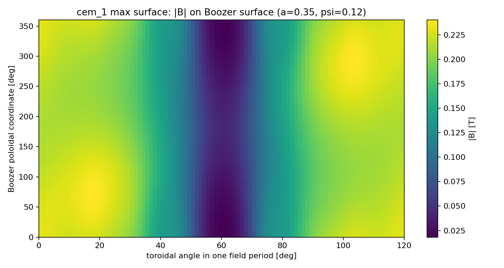
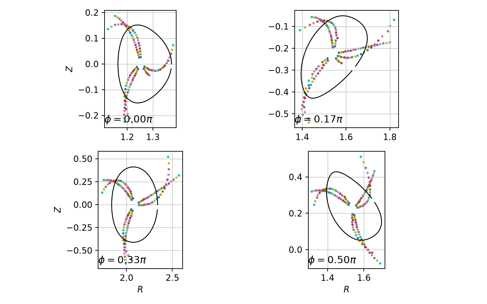
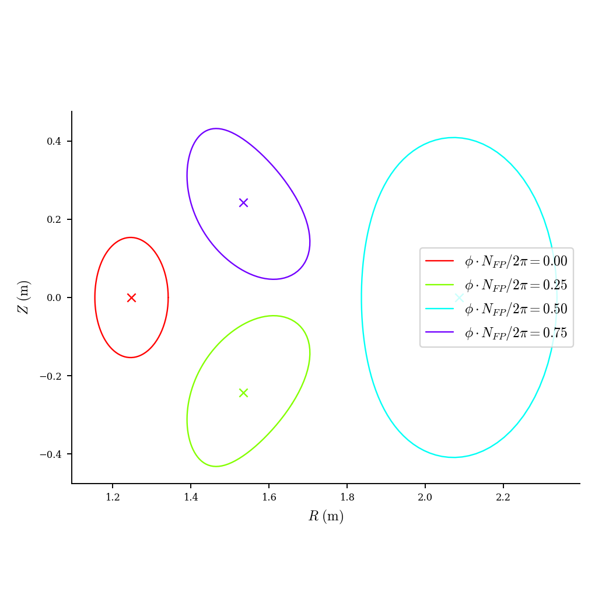
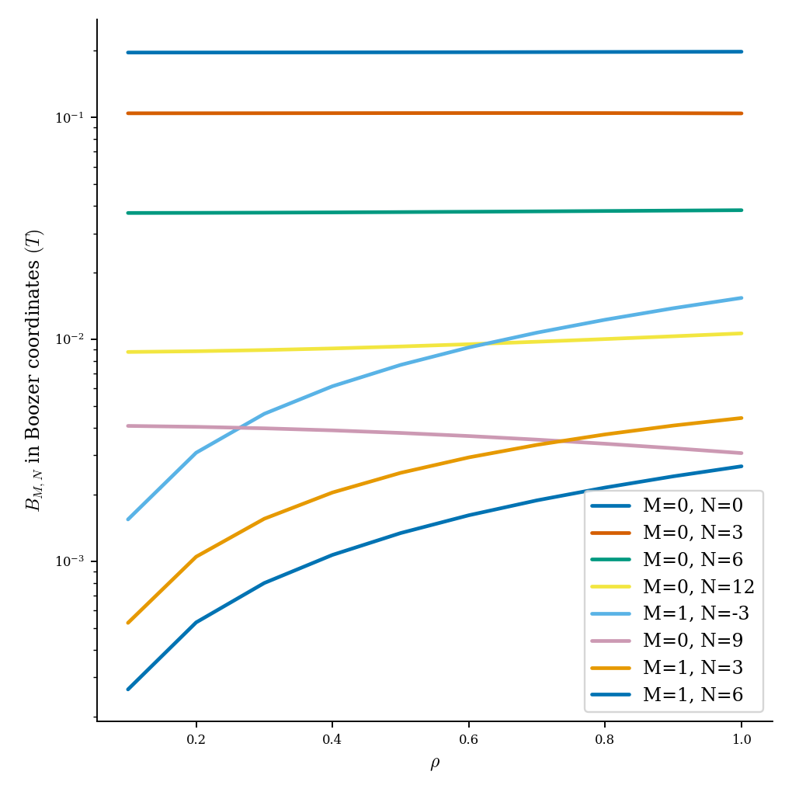
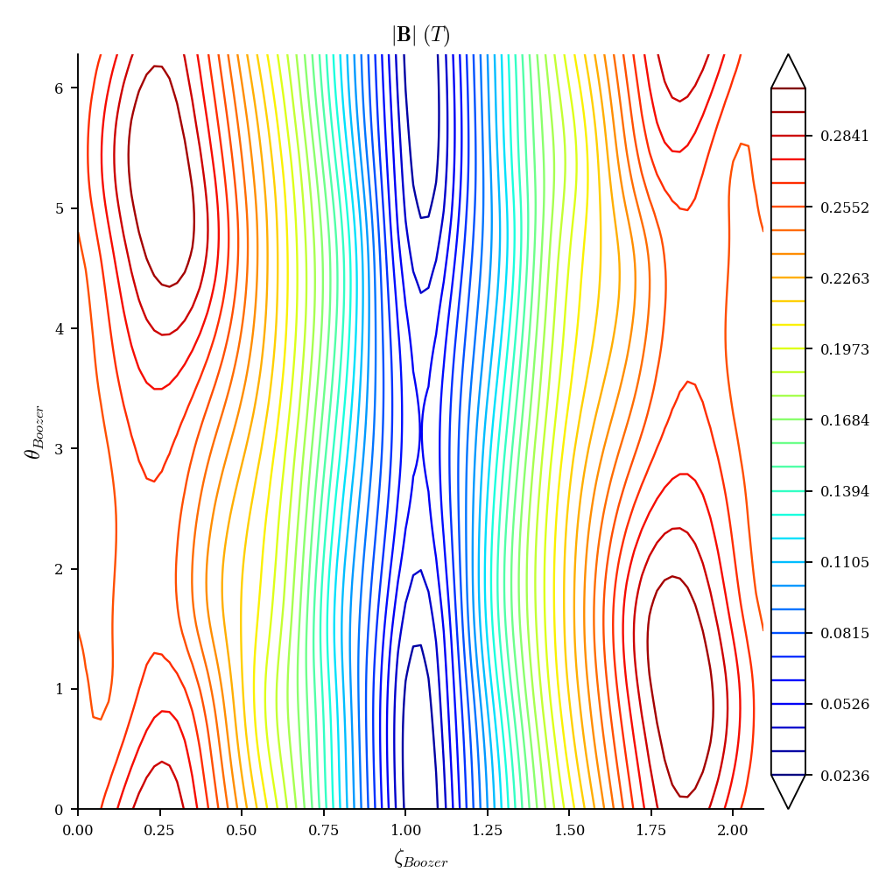
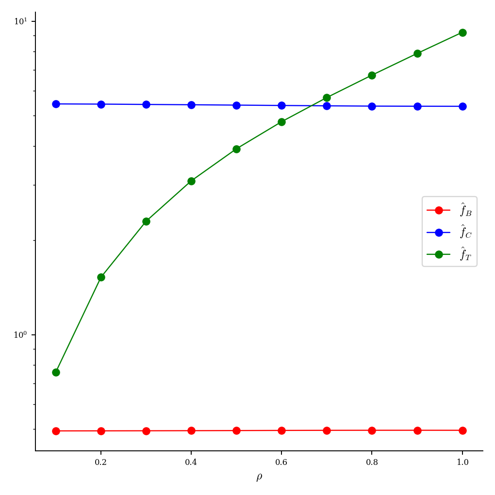
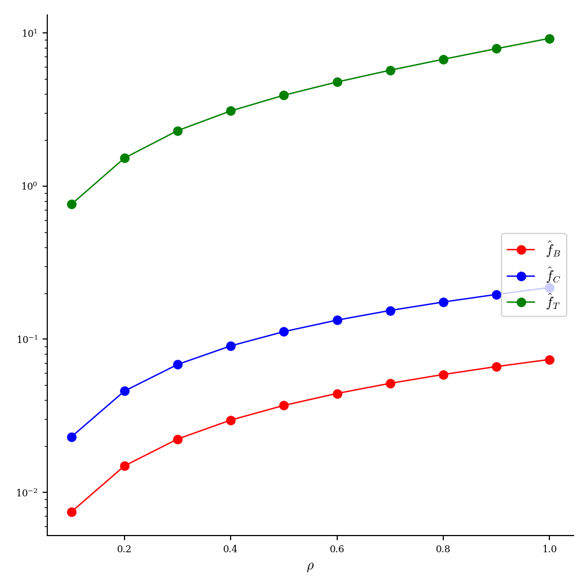
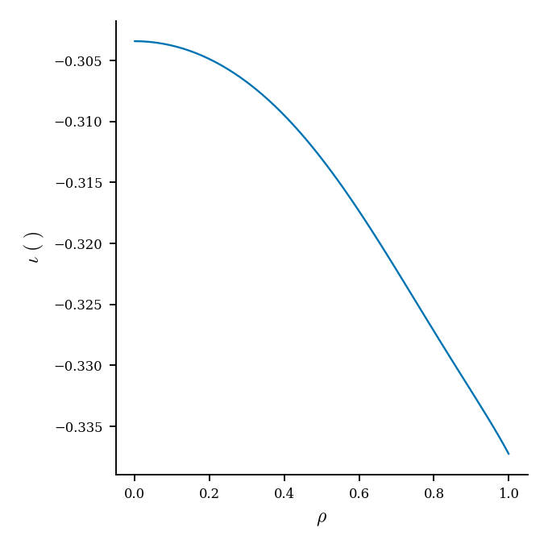

# cem_1.json 完整评估报告

生成日期：2026-07-08

输入文件：`examples/cem_1.json`

说明：`cem_1.json` 不是之前的 `cem1.json`。该文件内置历史分数为 `94.0997184983`，本报告使用当前 evaluator 重新评估。

## 1. 默认评估

| 指标 | 数值 |
| --- | ---: |
| current evaluator score | `92.9223136959` |
| status | `surface` |
| axis residual | `4.5113226725e-09` |
| axis topology | `elliptic` |
| $\psi$ validation angle p95 | `1.0345909784e-04` |
| $\psi$ validation angle L2 | `8.3992280265e-06` |
| 默认最大 $\psi$ level | `0.16` |
| 默认 volume | `0.0373882004` |
| 默认 $\iota$ | `0.3365639820` |
| 默认 $G$ | `1.3437714039` |
| 默认 QS error QA | `0.5748863373` |
| 默认 QS error QH | `0.5438462182` |
| 默认 QS error QP | `1.1111054157e-04` |
| 默认总耗时 | `2.0913891960 s` |

## 2. 扩展 $a$ 和 $\psi$

使用 Boozer LS/Newton 成功作为最大磁面判据，并沿前一层的 $\iota$ 做连续初值。快速扫描结果显示该样本能支持很大的磁面：

| $a$ | 最大接受 $\psi$ | volume | $\iota$ | QS error QP |
| ---: | ---: | ---: | ---: | ---: |
| `0.05` | `0.44` | `0.0603816242` | `0.3369404729` | `1.7725494088e-04` |
| `0.08` | `0.52` | `0.1619973843` | `0.3385983805` | `4.7370733799e-04` |
| `0.12` | `0.64` | `0.3850434807` | `0.3422025002` | `0.0011163041` |
| `0.16` | `0.52` | `0.6453949169` | `0.3463455004` | `0.0018523282` |
| `0.20` | `0.30` | `0.8334717421` | `0.3492931667` | `0.0023746639` |
| `0.25` | `0.16` | `0.9488150943` | `0.3510813538` | `0.0026911355` |
| `0.30` | `0.12` | `1.1110735381` | `0.3535709487` | `0.0031313808` |
| `0.35` | `0.12` | `1.5281783812` | `0.3598265925` | `0.0042367832` |
| `0.40` | `0.04` | `0.6419963531` | `0.3462918801` | `0.0018428174` |
| `0.50` | `0.01` | `0.2450087319` | `0.3399454357` | `7.1416462408e-04` |
| `0.60` | none | none | none | none |

最大接受面选为：

| 指标 | 数值 |
| --- | ---: |
| $a$ | `0.35` |
| $\psi$ level | `0.12` |
| volume | `1.5281783812` |
| $\iota$ | `0.3598265925` |
| $G$ | `1.3414081229` |
| QS error QA | `0.6024355894` |
| QS error QH | `0.5008092436` |
| QS error QP | `0.0042367832` |
| $|B|_\min$ | `0.0182153884 T` |
| $|B|_\mathrm{mean}$ | `0.1644246119 T` |
| $|B|_\max$ | `0.2400664304 T` |

交互式图：

- [全装置线圈+磁面 HTML，修正版](assets/coils_surface_fixed.html)
- [Boozer 面 $|B|$ HTML](assets/boozer_b.html)

## 3. $|B|$ 图

## 4. Poincare 磁力线复核

这个环节来自 `tmp.py` 的功能：从最大 Boozer 可解面内部选取 20 条初始线，在 4 个 toroidal 截面上追踪 Poincare 点，并叠加候选磁面边界。它不替代 Boozer/DESC 求解，只作为对“这个最大面附近是否真的有较好磁面结构”的直接诊断。

本例使用最大接受面 `a=0.35, psi=0.12`。20 条场线在停止盒内的截面命中数约为 `19-25`，明显少于 `cem_3`；图中也可以看到外层场线点与候选边界的对应关系较弱。这说明该最大面虽然能通过 Boozer LS/Newton 和 DESC 求解，但外层保持性/鲁棒性一般，应把它视为偏外层的诊断性最大面，而不是非常干净的嵌套磁面边界。

## 5. DESC 复核

DESC 使用最大 Boozer 面作为边界，输入 `PHIEDGE = -1.0491764182e-02`。压力和等离子体电流均设为零；DESC 内部平衡分辨率使用 `L=8, M=8, N=8`。

DESC 求解成功，但残差不如 CEM2 干净：

| DESC 指标 | 数值 |
| --- | ---: |
| setup time | `14.4480657978 s` |
| solve time | `29.8141509816 s` |
| solve status | `success` |
| 终止条件 | `ftol condition satisfied` |
| maximum normalized force error | `1.007e-02` |
| average normalized force error | `3.080e-04` |

因此，DESC 图可以作为复核和诊断；但如果要把 DESC 结果作为最终高精度物理结论，建议后续再做分辨率收敛测试和更严格的 DESC 求解设置。

## 6. 结论

- `cem_1.json` 的磁轴和局部 $\psi$ 拟合质量很好，默认评估 score 为 `92.92`。
- 它可以找到比此前 CEM2 大得多的 Boozer 可解磁面，当前最大接受面为 `a=0.35, psi=0.12, volume=1.528`。
- 该大面上的 QP QS error 为 `0.00424`，明显高于默认小面的 `1.11e-04`；也就是说大面存在，但 QP 对称性在外层退化。
- Poincare 复核显示外层最大面附近的场线保持性不如 `cem_3` 干净，和 DESC 最大 force error 约 `1e-2` 的判断一致。
- DESC 能成功求解，但最大归一化 force error 约 `1e-2`，只能算中等质量复核，不如 CEM2 的 DESC 结果干净。
