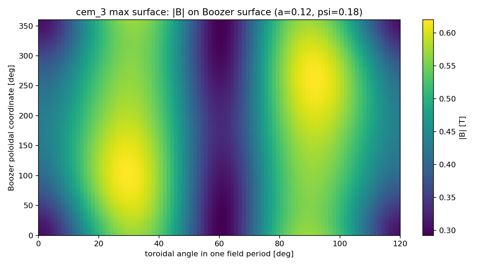
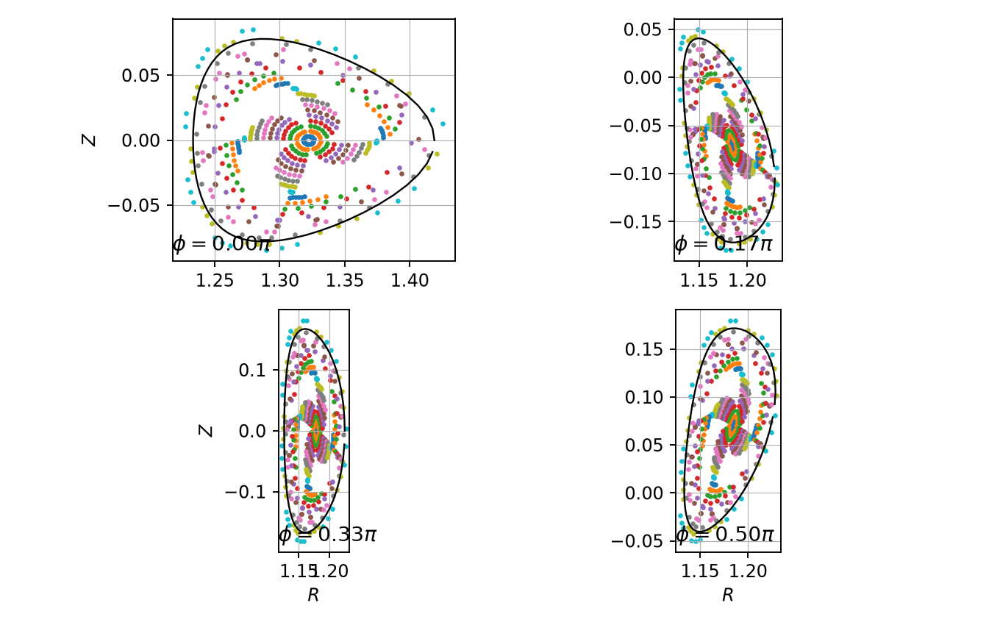
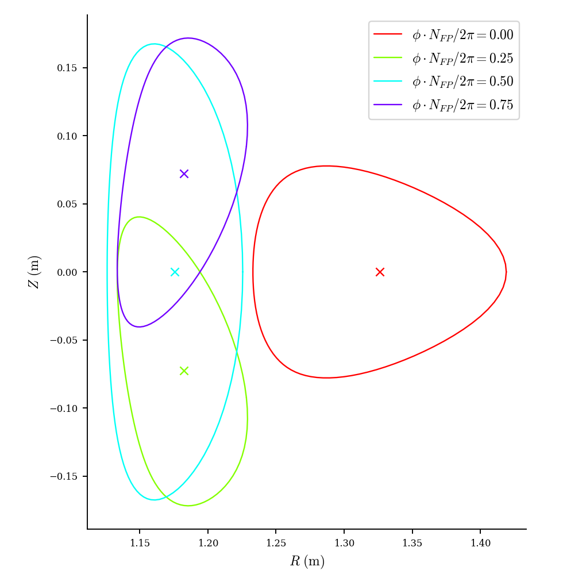
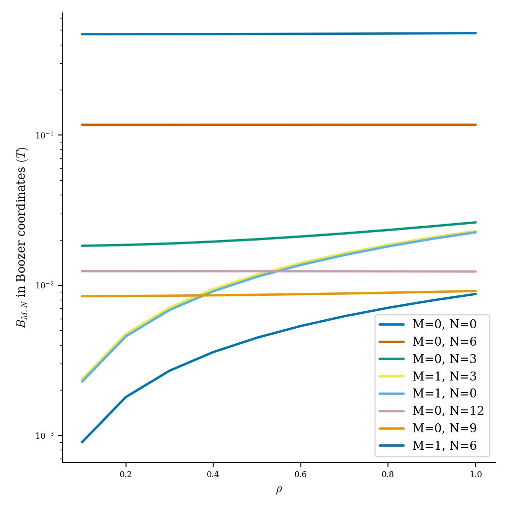
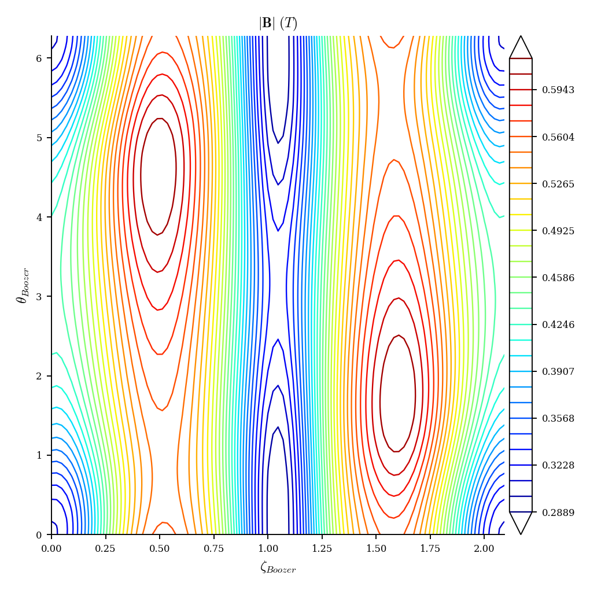
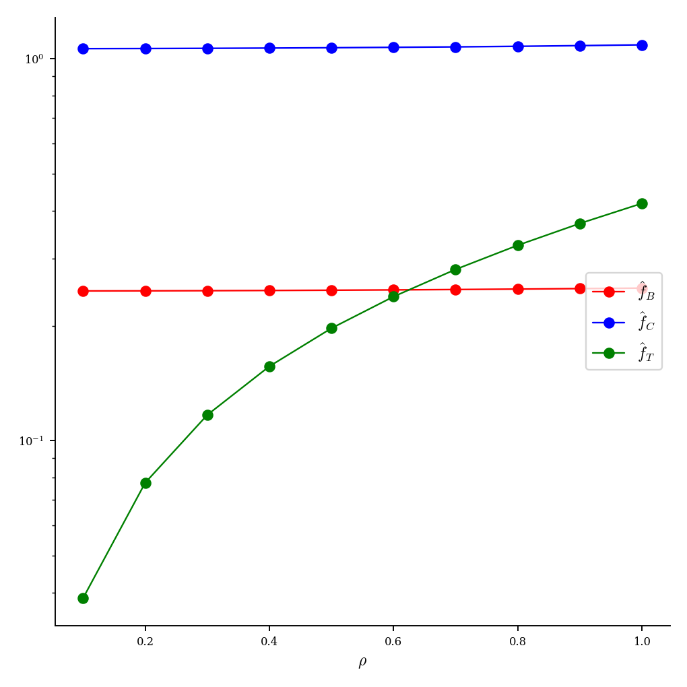
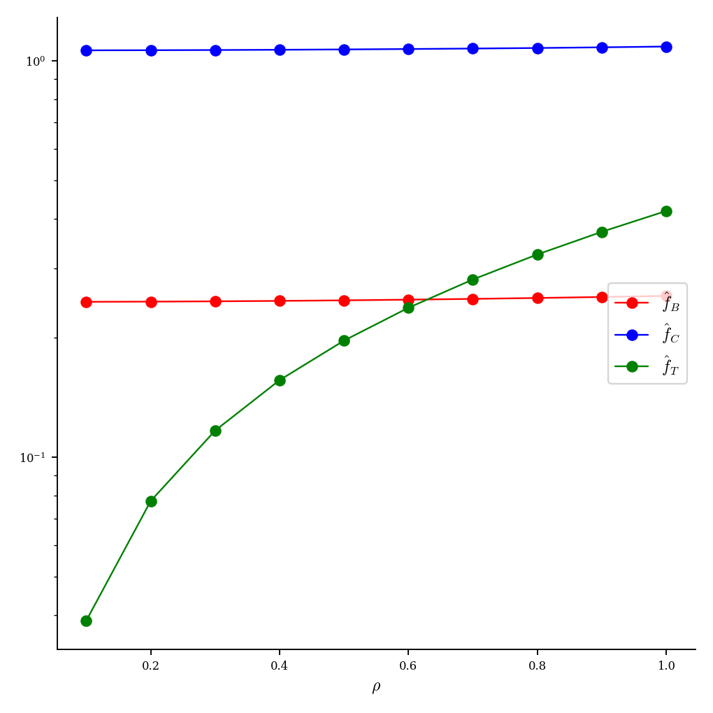
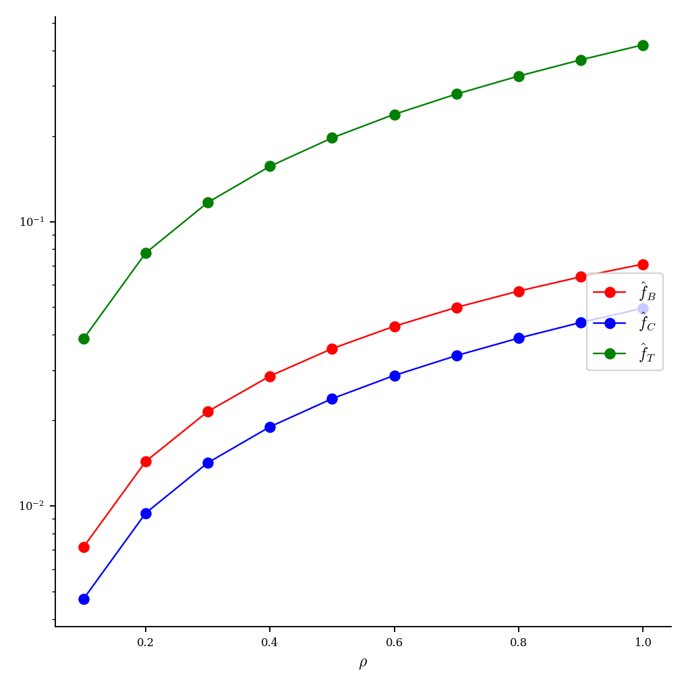
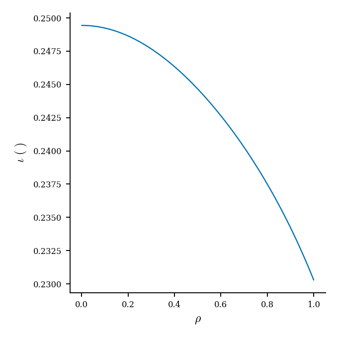

# cem_3.json 完整评估报告

生成日期：2026-07-08

输入文件：`examples/cem_3.json`

说明：该文件内置历史分数为 `93.1570666576`，`qs_type = QP`。本报告使用当前 evaluator 重新评估。

## 1. 默认评估

| 指标 | 数值 |
| --- | ---: |
| current evaluator score | `92.4130923898` |
| status | `surface` |
| axis residual | `3.6525496820e-09` |
| axis topology | `elliptic` |
| $\psi$ validation angle p95 | `6.2570719424e-05` |
| $\psi$ validation angle L2 | `2.1780071480e-05` |
| 默认最大 $\psi$ level | `0.16` |
| 默认 volume | `0.0208310268` |
| 默认 $\iota$ | `-0.0859656931` |
| 默认 $G$ | `3.5462874868` |
| 默认 QS error QA | `0.0390496629` |
| 默认 QS error QH | `0.0387669471` |
| 默认 QS error QP | `1.3444047408e-04` |
| 默认总耗时 | `2.2040521652 s` |

## 2. 扩展 $a$ 和 $\psi$

使用 Boozer LS/Newton 成功作为最大磁面判据。粗扫和边界细扫表明，最大体积位于 $a=0.12,\ \psi=0.18$ 附近；继续增大 $a$ 后可接受 $\psi$ level 下降，体积不再增加。

| $a$ | 最大接受 $\psi$ | volume | $\iota$ | QS error QP |
| ---: | ---: | ---: | ---: | ---: |
| `0.05` | `0.24` | `0.0297698496` | `-0.2527807146` | `5.7609142206e-04` |
| `0.08` | `0.24` | `0.0776200517` | `-0.2417700152` | `0.0014930733` |
| `0.09` | `0.24` | `0.0990812780` | `-0.2366770437` | `0.0019010302` |
| `0.10` | `0.24` | `0.1235110153` | `-0.2307419868` | `0.0023627639` |
| `0.11` | `0.20` | `0.1298690596` | `-0.2291708348` | `0.0024825011` |
| `0.12` | `0.18` | `0.1428729501` | `-0.2259202789` | `0.0027268481` |
| `0.13` | `0.14` | `0.1328209306` | `-0.2284374194` | `0.0025380319` |
| `0.14` | `0.12` | `0.1328619091` | `-0.2284272200` | `0.0025388026` |
| `0.15` | `0.10` | `0.1267344035` | `-0.2299468899` | `0.0024234901` |
| `0.20` | `0.04` | `0.0887285594` | `-0.2391470775` | `0.0017043838` |
| `0.25` | none | none | none | none |
| `0.30` | none | none | none | none |

最大接受面选为：

| 指标 | 数值 |
| --- | ---: |
| $a$ | `0.12` |
| $\psi$ level | `0.18` |
| volume | `0.1428729501` |
| $\iota$ | `-0.2259202789` |
| $G$ | `3.5462719953` |
| QS error QA | `0.0426203858` |
| QS error QH | `0.0415505112` |
| QS error QP | `0.0027268481` |
| $|B|_\min$ | `0.2922515942 T` |
| $|B|_\mathrm{mean}$ | `0.4780597341 T` |
| $|B|_\max$ | `0.6199375871 T` |

交互式图：

- [全装置线圈+磁面 HTML](assets/coils_surface.html)
- [Boozer 面 $|B|$ HTML](assets/boozer_b.html)

## 3. $|B|$ 图

## 4. Poincare 磁力线复核

这个环节来自 `tmp.py` 的功能：从最大 Boozer 可解面内部选取 20 条初始线，在 4 个 toroidal 截面上追踪 Poincare 点，并叠加候选磁面边界。它用于直观看最大面附近的场线截面结构，作为 Boozer/DESC 之外的直接复核。

本例使用最大接受面 `a=0.12, psi=0.18`。20 条场线在停止盒内的截面命中数约为 `95-99`，比 `cem_1` 稳定得多；图中内部点云能持续给出多截面的 Poincare 结构。外层点仍然不是完美贴合边界，因此它仍是诊断图而非严格证明；但结合 DESC 最大 force error `3.383e-05`，这个最大面的可信度明显高于 `cem_1`。

## 5. DESC 复核

DESC 使用最大 Boozer 面作为边界，输入 `PHIEDGE = -8.0355970113e-03`。压力和等离子体电流均设为零；DESC 内部平衡分辨率使用 `L=8, M=8, N=8`。

DESC 求解成功，且 force residual 较干净：

| DESC 指标 | 数值 |
| --- | ---: |
| setup time | `14.1216256171 s` |
| solve time | `25.8875980247 s` |
| solve status | `success` |
| 终止条件 | `ftol condition satisfied` |
| maximum normalized force error | `3.383e-05` |
| average normalized force error | `1.599e-06` |

## 6. 结论

- `cem_3.json` 的磁轴和局部 $\psi$ 拟合质量很好，默认评估 score 为 `92.41`。
- 默认小面上 QP QS error 很低，为 `1.34e-04`。
- 扩展后最大 Boozer 可解面为 `a=0.12, psi=0.18, volume=0.14287`，但 QP QS error 增大到 `0.00273`。
- Poincare 复核和 DESC 结果一致：最大面附近仍有可辨认的截面结构，且 DESC 最大归一化 force error 约 `3.38e-05`，复核质量明显好于 `cem_1`，可作为较可信的完整评估样本。
