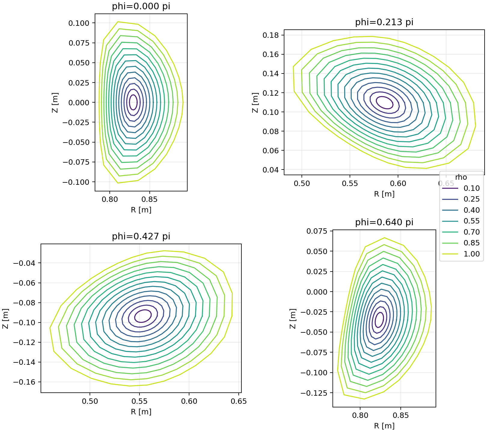
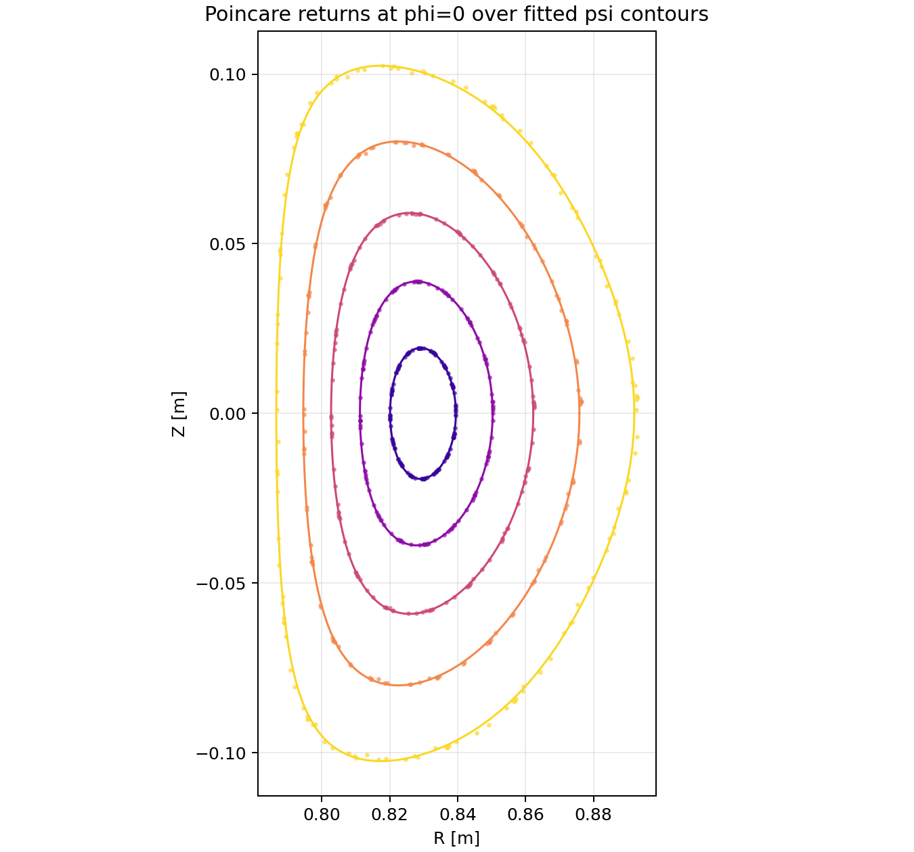
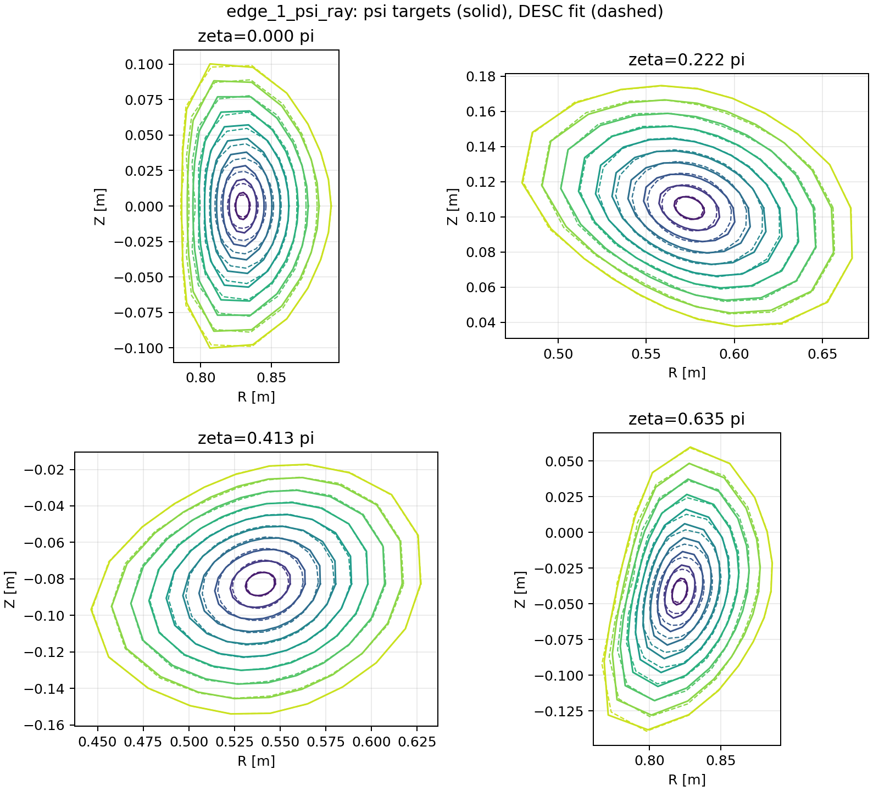
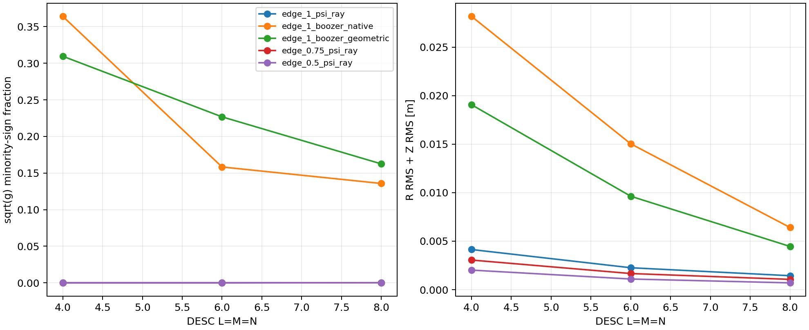

# cem_qh03 的 psi / RZ 嵌套性诊断与修正

日期：2026-07-10

## 1. 结论摘要

本轮可以把问题分成三个层次：

1. **cem_qh03 的 `psi=0.3` 层族本身是良好的星形嵌套层族。**
   13 个径向层上，射线根严格递增，最小相邻半径间隔为
   `2.98e-3 m`，`dpsi/dr` 最小值为 `0.614`，没有非正值。
   修正 RK4 后的 Poincare 回归点也贴合等 psi 线，没有看到支持
   “磁岛导致 RZ 根本不存在”的证据。

2. **原先 RZ 非嵌套的主因不是模数不足，而是坐标标签不一致。**
   内层点使用相对磁轴的几何射线角，边界点却使用 Simsopt/Boozer
   surface 的原生角。把它们作为同一个 DESC `theta` 联合拟合，会迫使
   体坐标扭曲和折叠。完整半径统一使用 psi-ray 参数化后，DESC 4 阶和
   6 阶 RZ 均严格 nested；混用 Boozer 边界时错号比例仍为 16%--36%。

3. **RZ 已能修好，但完整 DESC solve 尚未物理跑通。**
   `l_ridge=1` 可得到 RZ nested、且在 DESC 默认检查网格上 L 也 nested 的
   RZL 初值，phase RMS 为 `0.0734 rad`；但后续密网格检查仍发现
   `2.94e-4` 的局部 PEST 变号。把固定边界同步为拟合体的 `rho=1` DESC
   surface 后，optimizer cost 从约 `2.5e8` 降到 `2.53e3`，但直接 solve
   最终仍使 Jacobian 过零。因此下一步应做受限 trust-region / continuation，
   不能把 DESC 返回的 `xtol success` 当作物理成功。

## 2. 本轮修正的代码问题

| 问题 | 影响 | 修正 |
|---|---|---|
| phase beta 矩阵使用 NumPy 高级索引时选中了子矩阵，而非逐行单元素 | phase RMS 被人为抬高，beta 连接错误 | 改为配对索引 `A_beta[np.arange(...), beta_ids]` |
| `rk4_period_samples` 的 Z 更新漏掉 `+k4z` | Poincare 漂移和所有 trace-based R/Z/L 数据严重错误 | 移入核心 `axis.py`，补齐四阶项并加解析单元测试 |
| 磁轴位置和磁轴导数分别线性插值 | `psi_and_gradient` 的解析梯度不是标量 psi 的实际梯度 | 改为周期 cubic Hermite，同时返回值和一致导数；GPU 拟合核同步修改 |
| 磁轴导数由非周期 `np.gradient` 得到 | 周期接缝导数误差明显 | 直接用场线 ODE `R BR/Bphi`、`R BZ/Bphi` 计算 |
| `lambda_weight` 一度传给错误接口，并未正确作用于 phase rows | 外部联合脚本直接报 `TypeError` 或权重无效 | 只传给 `fieldline_phase_constraint_data` |
| 内层几何 theta 与 Boozer-native 边界 theta 混合 | RZ 体坐标折叠 | 默认改成同一 psi-ray 坐标生成体和边界 |
| Simsopt surface 经 VMEC 文件读回 DESC 后参数标签改变 | RZ body 与 DESC fixed boundary 同物异参，solve 第一步强制重参数化并折叠 | LS 后设置 `eq.surface = eq.get_surface_at(rho=1)` |

相关实现：

- `stellarator_eval/axis.py`
- `stellarator_eval/psi.py`
- `stellarator_eval/desc_joint_ls.py`
- `scripts/desc_external_rzl_data_ls_experiment.py`
- `scripts/diagnose_desc_rz_nesting.py`
- `gpu_backend/src/coil_field.cu`

聚焦测试共 6 个，覆盖 beta 行连接、合成 L/beta/iota 恢复、周期 Hermite
值/导数一致性、psi 的 `partial_phi` 有限差分，以及带采样 RK4 的四阶 Z 更新。

## 3. 当前准确计算流程

### 3.1 psi 层

1. 从线圈 JSON 构造 Biot-Savart 场，并读取已保存磁轴。
2. 用磁轴中心坐标
   `X=(R-R_axis(phi))/a`、`Y=(Z-Z_axis(phi))/a` 表示多项式 psi。
3. psi 拟合目标是采样体积内的 `B dot grad(psi) ~= 0`，固定二次基准项，
   对其余多项式/环向 Fourier 系数做 ridge 最小二乘。
4. 给定 `rho_DESC`，取 `psi_level=psi_edge*rho_DESC^2`。
5. 在每个 `(theta_geo, phi)` 射线上用 Newton 解
   `psi(r,theta_geo,phi)=psi_level`，得到 R、Z。
6. 检查根残差、`dpsi/dr`、相邻层半径差、`B dot grad(psi)`，并从
   `phi=0` 初值做多周期 Poincare 回归。

在星形射线表示下，如果每条射线上 `dpsi/dr>0`，且不同 level 的根保持
严格顺序，则这些 level set 在该表示中必然嵌套。cem_qh03 满足这两个条件。

### 3.2 R/Z 线性拟合

DESC 使用 Zernike-Fourier 体基：

```text
R(rho,theta,zeta) = A_R(rho,theta,zeta) c_R
Z(rho,theta,zeta) = A_Z(rho,theta,zeta) c_Z
```

矩阵行来自内层 psi 点、边界点和磁轴点，分别加权；谱正则按径向、极向、
环向 mode number 增长。当前正确流程要求三类点使用同一套
`(rho,theta,zeta)` 定义。

拟合后不能继续保留从 Simsopt/VMEC 读回的旧参数化边界。当前代码从 RZ
体系数直接提取 `rho=1` 的 DESC surface，作为后续 fixed boundary。

### 3.3 L / iota 线性拟合

沿每条场线使用

```text
theta + lambda(rho,theta,zeta) = beta_line + zeta * iota(rho)
```

未知量是 `L_lmn`、每条线的截距 `beta_line` 和
`iota(rho)=iota_0+iota_2*rho^2+iota_4*rho^4`。这是线性 LS，但
`1 + partial(lambda)/partial(theta) > 0` 是非线性不等式，当前矩阵并未直接
约束它。无正则拟合因此可能有很小 phase residual，却破坏 PEST Jacobian。

### 3.4 DESC 判据

RZ 几何嵌套主要看 `sqrt(g)` 是否变号；DESC `eq.is_nested()` 实际检查
`sqrt(g)_PEST` 的全体符号一致性，因而还受 L 影响。solve 后同时检查：

- `nested_after_solve`；
- `sqrt(g)` / `sqrt(g)_PEST` 错号比例；
- force 分布的 p95、最大值和奇异尖峰；
- optimizer 状态。

只有 optimizer success、但 Jacobian 变号，不算跑通。

## 4. psi 诊断结果



`psi_edge=0.3` 的主要数值：

| 指标 | 结果 |
|---|---:|
| 射线根最大绝对残差 | `9.08e-13` |
| 相邻层最小半径间隔 | `2.98e-3 m` |
| 相邻层非正间隔比例 | `0` |
| 全层最小 `dpsi/dr` | `0.614` |
| `dpsi/dr<=0` 比例 | `0` |
| `partial_phi psi` 有限差分最大误差 | `2.01e-6` |
| 最大 layer 的 `B-grad(psi)` angle p95 | `2.19e-4` |
| 所有 layer 的最大 angle | `3.98e-4` |



16 周期的等效法向距离漂移 p95 从内到外约为：

| rho | 距离漂移 p95 |
|---:|---:|
| 0.2 | `2.87e-5 m` |
| 0.4 | `9.21e-5 m` |
| 0.6 | `2.27e-4 m` |
| 0.8 | `5.02e-4 m` |
| 1.0 | `1.05e-3 m` |

边缘 psi 只是近似不变量，误差比内层大，但 Poincare 点仍形成闭合、平滑、
与拟合等值线贴合的层。结合已有 Boozer surface 在 `psi=0.3` 成功收敛，
当前没有证据把失败归因于线圈产生的大磁岛或混沌区。

## 5. RZ 诊断结果



实线是 psi-ray 目标，虚线是 DESC 6 阶体谱。主要结果：

| DESC 阶数 | 边界/内层参数化 | R RMS + Z RMS | `sqrt(g)` 少数符号比例 | nested |
|---:|---|---:|---:|---|
| 4 | psi-ray / psi-ray | `4.14e-3 m` | `0` | 是 |
| 6 | psi-ray / psi-ray | `2.26e-3 m` | `0` | 是 |
| 8 | psi-ray / psi-ray | `1.44e-3 m` | `2.94e-4` | 否，极小局部振铃 |
| 4 | psi-ray / Boozer native | `2.82e-2 m` | `0.364` | 否 |
| 6 | psi-ray / Boozer native | `1.50e-2 m` | `0.158` | 否 |
| 8 | psi-ray / Boozer native | `6.41e-3 m` | `0.136` | 否 |
| 6 | psi-ray / Boozer geometric | `9.63e-3 m` | `0.227` | 否 |



这说明：

- DESC 的 R/Z 基底足以表示该体积；4--6 阶已经能严格 nested。
- 更高阶能降低点误差，但可能带来极小边缘谱振铃，不能只追求 RMS。
- Boozer boundary 即使重新按几何角排序，也与内部 psi 层族不够一致；边界
  高权重会把冲突传播到整个体积。
- 原先“RZ 初始就非嵌套”主要是数据坐标不一致，不是理论上不存在 RZ。

## 6. L / iota 和 DESC solve

修正 RK4 和 beta 索引后，完整半径、6 阶 phase LS 得到：

- 无强 L 正则：phase RMS `0.0633 rad`，但完整 L non-nested；
- L 从 0 缩放时，约在 scale `0.5` 开始失去 nested；
- theta target 仅取负号会把 iota 从约 `+0.60` 翻成 `-0.60`，但不改善
  phase RMS 或 nested，说明不能用单独翻 target 代替一致坐标变换；
- `l_ridge=1`：phase RMS `0.0734 rad`，默认网格判为 nested，但密网格仍有
  `2.94e-4` 的 `theta_PEST_t<=0`，force p95 `4.22`；
- `l_ridge=100`：phase RMS 退化到 `0.150`，属于过度平滑。

因此 `l_ridge=1` 是当前线性阶段较好的近似，但还不是具有安全裕量的最终解。

DESC 直接 solve 对比：

| 初值/边界处理 | optimizer cost | solve 后 nested | 最终 force p95 | 结论 |
|---|---:|---|---:|---|
| 6 阶，`lambda=0`，旧边界标签 | `1.44e7` | 否 | `228` | 发散 |
| 6 阶，`l_ridge=1`，旧边界标签 | `2.50e8` | 否 | `18.1` | 发散 |
| 4 阶，`l_ridge=1`，旧边界标签 | `1.04e6` | 否 | `138` | 发散 |
| 6 阶，`l_ridge=1`，边界同步到 volume | `2.53e3` | 否 | `0.343` | 大幅改善，但仍有 Jacobian 过零 |

最后一行说明边界参数化修正确实命中了主要数值问题，但无约束 solve 的步长仍会
穿过嵌套性边界。平均/最大 force 被少量 Jacobian 奇异点放大，不能只看 p95。

## 7. cem_1 / cem_3 回归边界

旧的 cem_1/cem_3 DESC 稳定产物仍存在，且本轮没有修改 DESC 源码。用新
psi-ray RZ 方法在它们的默认最外层做 6 阶烟测时：

| case | psi 相邻射线层逆序比例 | RZ `sqrt(g)` 少数符号比例 |
|---|---:|---:|
| cem_1 | `1.15e-2` | `5.12e-3` |
| cem_3 | `2.67e-3` | `1.28e-4` |

所以新方法在这两个默认边缘并非严格 nested，不能声称替代了原有稳定链路。
它们此前跑通的是 DESC boundary-default 路径。若要统一迁移，应降低 psi edge
或对 radial monotonicity 做显式筛选，而不是把 qh03 的参数直接复用。

## 8. 下一步建议与难度

### 优先级 1：受限 DESC continuation（中等难度）

从接近 nested 的 `l_ridge=1` 初值开始，或先提高正则/加入硬约束使其在密网格
上严格 nested，再使用 DESC 的 proximal optimizer，显式
设置较小的 `initial_trust_ratio` / `max_trust_radius`，每一小步后检查
`sqrt(g)_PEST`。一旦变号就拒绝该步并缩小 trust radius。先在 4 阶求稳，再
做 4->6 的分辨率 continuation。

### 优先级 2：给 L 拟合加入坐标单调性约束（中高难度）

当前 ridge 只惩罚系数大小，不能保证
`1+partial(lambda)/partial(theta)>epsilon`。建议改成带线性导数不等式的
quadratic program，或用 barrier/hinge 做小规模非线性修正。目标是在 phase
RMS 约 0.07 的同时留出 Jacobian margin，而不只是刚好 nested。

### 优先级 3：给 iota 加物理先验并重做 phase gauge（中等难度）

用已成功 Boozer surface 的 iota 作为软先验，统一 theta 方向后再拟合；延长
场线采样到多个 field period，检查 beta gauge 和 unwrap 是否导致当前
`|iota|~0.60` 与 Boozer `|iota|~0.406` 的差异。

### 优先级 4：用修正后的 Hermite 轴重新拟合 psi（中等计算量）

本轮读取的是旧 psi 系数，再用新的一致梯度进行验证。为彻底消除训练/验证定义
差异，应重新跑一次 full-GPU psi fit，并比较系数、Poincare 漂移和最大可用层。

### 近轴缩面（低难度，当前不是首选）

qh03 的完整 psi-ray RZ 在 4/6 阶已经 nested，因此不需要为解决 RZ 问题缩面。
如果受限 DESC continuation 仍失败，可先用 `edge_scale=0.5`；该范围在 4/6/8
阶全部严格 nested，适合作为 continuation 起点，再逐步放大到完整边界。

## 9. 产物与环境

结构化诊断数据位于：

- `reports/assets/desc_rz_nesting_cem_qh03/summary.json`
- `reports/assets/desc_rz_nesting_cem_qh03/desc_external_synced_solve_summary.json`
- `reports/assets/desc_rz_nesting_cem_qh03/desc_external_phase_sign_summary.json`
- `reports/assets/desc_rz_nesting_cem_qh03/desc_external_lridge_1_summary.json`

远端环境为 Python 3.11.13、DESC 0.16.0、CUDA 12.8；GPU 后端单独构建在项目
目录的 `gpu_backend/build_codex`。所有实验限制在一张 GPU、CPU 0--15，结束时
已检查无遗留 Python/CMake/NVCC 实验进程。

## 10. 对当前状态的直白解释

### 10.1 对“现在做到哪一步”的校正

可以把当前结果概括为：

1. **RZ 理论上应当存在嵌套解。** cem_qh03 的 `psi=0.3` 层族本身按
   射线根检查是嵌套的，所以不存在“输入点云本身必然无法表示成嵌套 RZ”
   的理论矛盾。
2. **此前主要的 RZ 非嵌套确实来自代码和接口问题，并已修正。** 最关键的
   是内层与边界 theta 定义不一致，以及 Simsopt/VMEC/DESC 往返后固定边界
   参数标签改变。统一 psi-ray 坐标并把 DESC fixed boundary 同步到拟合体的
   `rho=1` 后，4 阶和 6 阶 RZ 都能保持嵌套。
3. **L/iota 不是“随便拟合后也能保持嵌套”。** 无强正则的最小 phase
   residual 解会使 PEST Jacobian 变号。使用 `l_ridge=1` 等额外平滑后，
   phase RMS 从 `0.0633` 稍增到 `0.0734 rad`，默认网格判为嵌套，但密网格
   仍发现极少量变号；`l_ridge=100` 才在该密网格上严格保持正裕量。
4. **DESC solve 仍然物理失败。** 优化器不是数值意义上的 NaN 崩溃，而是
   报告 `xtol success` 后走到了更低力残差、但 Jacobian 已变号的解。对本
   项目而言这仍应记为发散/失败，不能记为 DESC 跑通。

所以，如果原理解中的“L 和 iota 也能保持不嵌套”是字面意思，那么无正则
版本确实如此；如果想表达“也能保持嵌套”，则必须加上“使用足够的 L 正则后”
这个条件。

### 10.2 当前拟合初值与 DESC 真解还差什么

这个距离不能只用一个 RMS 描述，因为当前拟合和 DESC solve 解的是不同层级
的问题。

| 层级 | 当前进 DESC 前做到的事 | DESC 真正要求的事 | 当前差距 |
|---|---|---|---|
| 磁面几何 | 用外部线圈场的近似不变量 psi 生成嵌套 RZ 层 | DESC 自身磁场的磁通面也必须与这些 RZ 层一致 | R/Z 数据 RMS 各约 `1.1--1.2 mm`；边缘 Poincare 法向漂移 p95 约 `1.05 mm` |
| 曲面坐标 | 用 field-line phase LS 拟合 `lambda` | `theta+lambda` 必须是 DESC 平衡磁场的单值直线场角，并保持坐标可逆 | phase RMS `0.0734 rad`，只是近似；目前靠正则避免坐标折叠，没有显式 Jacobian margin |
| iota | 同外部线圈场轨迹一起拟合出辅助 `iota(rho)` | fixed-current DESC 中 iota 是平衡输出，必须与 Ampere 定律、边界和磁通自洽 | 拟合值约 `+0.60`，与 Boozer 参考的符号/幅度尚未对齐；而且该 iota 没有写成 DESC profile |
| 固定边界 | 已改为拟合体自身的 `rho=1` DESC surface | fixed-boundary objective 与体边界必须完全同参 | 这一项已基本修复；修复使 optimizer cost 改善约 5 个数量级 |
| 力平衡 | 没有直接进入线性 LS 目标 | 真空问题仍要求 `J x B = 0`，且 `div B=0`、Ampere 定律、给定总磁通和 current profile 同时成立 | 初始 normalized force p95 仍为 `4.22`，说明尚不在可靠的平衡解邻域 |
| 拓扑安全裕量 | 默认网格只检查 Jacobian 是否同号 | solve 的整个迭代路径都不能穿过 `sqrt(g)=0` | `l_ridge=1` 在密网格仍有 `2.94e-4` 局部变号，尚无可靠 margin |

当前线性拟合实际主要满足的是：

```text
R_DESC(rho,theta,zeta) ~= R_psi_points
Z_DESC(rho,theta,zeta) ~= Z_psi_points
theta + lambda ~= beta_line + zeta * iota(rho)
```

它没有直接满足：

```text
B_DESC dot grad(rho) = 0
J_DESC x B_DESC = grad(p)
1 + partial(lambda)/partial(theta) >= delta > 0
sqrt(g) has a finite safety margin from zero
```

这里尤其要区分 `B_ext` 和 `B_DESC`：点云与 phase 数据来自外部线圈的
Biot-Savart 场 `B_ext`，而 DESC solve 重建的是由几何、总磁通、压力和电流
profile 自洽决定的 `B_DESC`。在真空、边界恰为精确磁面时，两者原则上应能
描述同一个内部真空场；但当前 psi、谱截断、lambda 和边界都有毫米/角度级
误差，这些误差组合后仍足以把直接 Newton/trust-region 步推出嵌套区域。

### 10.3 能否在进入 DESC solve 前继续修复

**可以明显继续改善，但仅靠当前无约束线性 LS 不可能保证得到完整 DESC
平衡。** 后者需要解非线性力平衡；如果在外部把所有 DESC 方程都满足，实质上
就是重新实现一次 DESC solve。

进入正式 solve 前，最值得增加一个“受约束预处理阶段”：

1. **给 L 加硬单调约束。** 在采样网格上要求
   `1 + partial(lambda)/partial(theta) >= delta`。这个约束对 `L_lmn` 是线性的，
   可以把当前普通最小二乘改成 quadratic programming；比只调 `l_ridge`
   更直接，也能控制 PEST Jacobian margin。
2. **给 iota 加 Boozer 软先验并统一方向。** 先完整修正 theta 方向、beta gauge
   和多周期 unwrap，再把已成功 Boozer surface 的 iota 作为软约束。不能只把
   theta target 取负号，因为那没有同步变换 R/Z 节点和 basis。
3. **在谱拟合后重新最小化磁面残差。** 当前 RZ LS 只拟合点的位置。应在拟合
   后直接评价 `B_ext dot grad(rho)`，并对 R/Z 系数做 sequential linearization，
   同时加 `sqrt(g)` barrier。这样优化的是“这些谱曲面是否真为磁面”，而不只是
   “是否经过点云”。
4. **优先使用多层、角度对齐的 Boozer surface 家族。** 目前只有边缘 Boozer
   surface，内层来自 psi-ray。若对多个 rho 做连续 Boozer surface solve，并沿
   rho 对齐同一场线角，再联合拟合 R/Z/L，会比把一种边界角和另一种内层角拼接
   更接近 DESC 所需坐标。这是物理上最干净、但计算量较大的方案。
5. **预先留出 Jacobian 裕量。** 不应只接受 `is_nested=True`，还应约束
   `min(abs(sqrt(g)_PEST))` 相对典型值不太小。当前 solve 能降低大部分 force，
   却在少数点形成奇异尖峰，正说明“刚好不变号”不够。
6. **再进入受限 DESC continuation。** 从 4 阶、较小 trust radius 开始，按
   `L scale -> resolution -> edge radius` 逐级 continuation，每步检查 Jacobian；
   不能直接让默认 solve 一步跨向低残差但折叠的区域。

其中第 1、2 项可以在现有联合 LS 框架上直接扩展，难度中等；第 3 项需要
R/Z Jacobian 的线性化，难度中高；第 4 项计算量最大，但最可能从根本上缩短
初值到 DESC 真解的距离。

最准确的当前状态是：**几何 RZ 问题已经基本解决，坐标 L 得到了可用但仍粗糙
的嵌套近似；离 DESC 真解主要还差自洽力平衡、正确的 iota/坐标 gauge，以及
足够的 Jacobian 安全裕量。**

## 11. lambda / iota 的存在唯一性与当前拟合目标

### 11.1 理论上是否一定存在且唯一

对于本项目想处理的“性质良好的嵌套磁面”，答案是：**在补全必要前提和
gauge 后，基本是对的；但不是仅凭任意给定的 psi、B、R、Z 就无条件成立。**

需要满足：

1. `rho=rho(psi)` 的每个 level set 是光滑、互不相交的环面；
2. `B dot grad(rho)=0`，即 B 严格切于这些环面；
3. 选定的环向角 `zeta` 沿场线单调，即 `B dot grad(zeta)` 不过零；
4. 环面上的场线流能被光滑地共轭到刚性转动。对良好的 irrational KAM
   磁面通常成立；靠近有理共振、岛链或小除数问题时，光滑性可能变差；
5. 固定 theta、zeta 的方向和周期约定，并给 lambda 选定 gauge，例如
   `<lambda>_(theta,zeta)=0`。

定义沿场线、以 zeta 为“时间”的算子

```text
D = (B dot grad) / (B dot grad(zeta)) = d/dzeta | field line
```

直线场条件是

```text
D(theta + lambda) = iota(rho)
```

等价于

```text
D lambda = iota(rho) - D theta.
```

沿第 j 条场线积分就是

```text
theta(zeta) + lambda(rho, theta(zeta), zeta)
    = beta_j + iota(rho) * zeta.
```

其中 `iota(rho)` 是该环面场线流的 rotation number。固定角度方向后，它是
唯一的；反转 theta 或做整数线性角变换会改变其符号/表示。

lambda 的唯一性还需要说明：

- 在 irrational、遍历的良好磁面上，齐次方程 `D f=0` 的光滑解通常只剩
  flux function；选定零均值 gauge 后 lambda 唯一。
- 在 rational surface 上，齐次解可以依赖场线标签，且存在共振可解性条件，
  因此不能无条件声称唯一。
- 每条场线的 `beta_j` 是直线场角的初始相位，不是新的物理自由度；它在离散
  拟合中用来消去不同种子线的角度原点。

对 cem_qh03，嵌套 psi 层、平滑 Poincare 图和成功的边缘 Boozer surface 都
支持“所需的 lambda/iota 应当存在”。但当前 psi 只是近似不变量，而不是严格
满足 `B dot grad(psi)=0` 的解析磁通，因此在现有离散数据上只能期待近似解，
不能期待 residual 精确为零。

### 11.2 当前代码到底拟合什么

当前实验使用 9 个 rho 层。每层从 `zeta=0` 的 psi level curve 取 16 条种子
场线，在一个 field period 内用 RK4 追踪，并保存 17 个 zeta 点，共
`9*16*17=2448` 条 phase rows。

每个采样点定义：

```text
theta_node = mod(atan2(Z-Z_axis, R-R_axis), 2*pi)
theta_target = unwrap(theta_raw along the traced line)
```

未知量为：

```text
lambda(rho,theta,zeta) = A_L c_L
iota(rho) = a0 + a2*rho^2 + a4*rho^4
beta_j = each seed field line's intercept
```

实际最小化的 phase residual 是

```text
r_q = theta_unwrapped_q
    + A_L(rho_q,theta_q,zeta_q) c_L
    - beta_[line(q)]
    - zeta_q * (a0 + a2*rho_q^2 + a4*rho_q^4).
```

再加上：

- 每个 rho 层的 beta 平均值 gauge；
- L、beta、iota 的谱 ridge；
- DESC 6 阶 `L_basis` 的周期性和 stellarator symmetry。

所以，**主方程的物理目标是对的**：它正是在拟合
`theta_PEST=theta+lambda` 为直线场角，也与 DESC 对 L 的定义一致。这个步骤
确实应该比 `lambda=0` 更接近 DESC 所需的坐标初值。

但当前拟合得到的 iota 只是该线性系统中的辅助 rotation number。当前 DESC
构造采用 fixed-current 真空 formulation，iota 应由平衡解输出，所以代码只把
`L_lmn` 写入 DESC，没有把拟合 iota 同时指定为 profile。它目前用于确定 L、
判断符号和检查物理一致性，不能把“拟合出了 iota”理解成“DESC 已接受该 iota”。

### 11.3 为什么目标正确，无约束 LS 仍得到坏坐标

如果数据来自精确磁面、角度 convention 完全一致、基底完备且采样充分，那么
无约束 LS 应该自然恢复光滑、可逆的 lambda，不需要额外约束。现在需要约束，
说明离散问题并不满足这些理想条件。

主要原因是：

1. **rho 标签并不严格沿场线不变。** 每条线追踪时始终被标为种子层的固定
   rho，但边缘 16 周期 Poincare 法向漂移 p95 已约 `1.05 mm`。因此同一条
   数据线不完全位于一个精确 torus 上，不存在严格满足所有 rows 的单值
   `lambda(rho,theta,zeta)`。
2. **有限谱截断。** 当前只用 6 阶 L basis 和三项 iota polynomial。真实
   conjugacy 可能需要更高角向模和更灵活的径向依赖。R/Z 位置容易拟合并不
   意味着 lambda 的导数也容易拟合。
3. **只追踪一个 field period。** beta、iota 斜率和低阶 lambda 在短区间内
   存在相关性；多周期 rotation number 会更稳定，也更容易发现 unwrap 错误。
4. **角度符号尚未完全统一。** 当前几何 theta 与 Simsopt Boozer theta 的方向
   约定不同。仅把 target 取负会翻转拟合 iota，却没有同步变换 R/Z nodes 和
   DESC basis，因此不是合法的整体坐标变换。
5. **L2 phase residual 不控制导数和可逆性。** LS 只关心角度值误差。它可以用
   少量高斜率谱振荡降低总体 residual，即使局部
   `1+partial(lambda)/partial(theta)<=0`，从而折叠 PEST 坐标。

最后一点已有直接数值证据：

| L 正则 | phase RMS | `min(theta_PEST_t)` | 密网格非正比例 |
|---:|---:|---:|---:|
| 近似无正则 | `0.0633 rad` | `-2.264` | `1.62e-2` |
| `l_ridge=1e-2` | `0.0633 rad` | `-2.161` | `1.45e-2` |
| `l_ridge=1` | `0.0734 rad` | `-0.0730` | `2.94e-4` |
| `l_ridge=100` | `0.150 rad` | `+0.902` | `0` |

因此当前问题不是“phase 根本拟合不动”。`0.063 rad` 约为 3.6 度，值残差并不
大；真正的问题是最小值解用局部不可逆的 lambda 换取了较小的平均残差。
普通 ridge 只能间接抑制这种行为，并在 phase 精度和坐标可逆性之间产生明显
折中。

### 11.4 更符合理论的下一版做法

在进入 DESC solve 前，下一版应按以下顺序修正：

1. 对每个 rho 先用多周期 Poincare return map 稳定估计 rotation number，
   而不是让一个 field period 的联合 LS 同时自由决定 iota。
2. 统一 geometric theta、DESC theta 和 Boozer theta 的方向后，用 Boozer iota
   作为软先验，检查 rotation number 是否一致。
3. 把 phase LS 改成 quadratic program，硬约束密网格上的
   `1+partial(lambda)/partial(theta)>=delta`，例如先取 `delta=0.1`。
4. 在独立、更密网格和多周期轨迹上验证 phase residual、rotation number 和
   `theta_PEST_t`，不能再只依赖 DESC 默认 `is_nested()` 网格。
5. 若 residual 仍受 rho 漂移限制，则不能继续靠增大 L basis；应先用多层
   Boozer surface 或直接优化 `B_ext dot grad(rho)`，构造更接近精确不变量的
   rho 层族。

这条路线仍然是在做当前分支原定的事情：**从外部磁场恢复一套接近 DESC
PEST/straight-field-line 坐标的 R、Z、lambda 和辅助 iota 初值。** 目标没有
换，但下一版需要从“无约束平均最小残差”提高到“满足可逆性和独立物理验证的
受约束拟合”。

## 12. 关于 iota、alpha、lambda 阶数和采样的进一步分析

本节按新的报告约定书写：物理量和公式使用 LaTeX，不再用行内代码块表示
数学公式；反引号只保留给实际代码变量名或文件名。

### 12.1 当前 iota 是否不准，并进一步拖坏了 lambda

**这是很可能的重要原因，但需要更准确地描述：当前 iota 不是一个预先固定的
错误输入，而是和 lambda、每条场线的截距一起在一个较短的数据窗口中联合
拟合，因此三者存在较强相关性。**

当前 phase 方程为

$$
\theta_q
+\lambda(\rho_q,\theta_q,\zeta_q)
-\beta_{j(q)}
-\iota(\rho_q)\zeta_q
=r_q.
$$

如果 iota 偏差为 $\Delta\iota$，周期函数 lambda 理论上不能在无限长轨迹上
吸收世俗项 $\Delta\iota\,\zeta$。但当前每条线只采一个 field period，有限阶
lambda 和自由的 $\beta_j$ 可以在这个短区间内近似吸收该斜率误差，代价是产生
较大的局部导数和谱振荡。这会让 phase RMS 看起来不大，但
$1+\partial_\theta\lambda$ 局部变为负值。

现有三个 iota 结果并不一致：

1. 一周期几何角端点估计在 $\psi=0.3$ 为约 $-0.588$，但不同种子线的标准差
   约 $0.203$，本身不是高精度估计。
2. 当前 joint phase LS 给出几何/DESC theta convention 下约 $+0.60$ 的低剪切
   profile。
3. 已收敛的边缘 Boozer surface 给出 $\iota=-0.405667$。

符号差异中包含 geometric theta、DESC theta 和 Simsopt Boozer theta 的方向
约定，不能直接相减。但即使忽略符号，一周期端点估计的大标准差和 joint LS
过平的径向 profile 都说明：**先独立、长时间地估计 rotation number，再拟合
lambda，比当前一次性联合拟合更可靠。**

建议对每个磁面使用 Poincare return map 的 lift $F_\rho$。若一个 field period
为 $T=2\pi/N_{\mathrm{FP}}$，则 rotation number 可由

$$
\iota_{\mathrm{geo}}(\rho)
=\lim_{K\to\infty}
\frac{F_\rho^K(\theta_0)-\theta_0}{K T}
$$

估计。应使用多个 $\theta_0$，分别取 $K=8,16,32,64,128$ 检查收敛，再把结果
与 Boozer surface 的 iota 按同一角度 convention 比较。只有 rotation number
先稳定，lambda 拟合才不需要替 iota 偏差承担世俗项。

### 12.2 根据 B、R、Z、psi 直接拟合 alpha 是否可行

**可行，而且比当前沿场线 phase 点拟合更贴近讲义模块 4 的推导。建议把它作为
下一版主路线。**

给定体坐标映射

$$
\boldsymbol{x}(\rho,\theta,\zeta)
=\bigl(R(\rho,\theta,\zeta),\phi=\zeta,
Z(\rho,\theta,\zeta)\bigr),
$$

可由 R、Z 的导数得到协变基
$\boldsymbol e_\rho,\boldsymbol e_\theta,\boldsymbol e_\zeta$ 和 Jacobian

$$
\sqrt g
=\boldsymbol e_\rho\cdot
\left(\boldsymbol e_\theta\times\boldsymbol e_\zeta\right).
$$

再由给定的外部磁场计算逆变分量

$$
B^\rho
=\frac{\boldsymbol B\cdot
(\boldsymbol e_\theta\times\boldsymbol e_\zeta)}{\sqrt g},
$$

$$
B^\theta
=\frac{\boldsymbol B\cdot
(\boldsymbol e_\zeta\times\boldsymbol e_\rho)}{\sqrt g},
\qquad
B^\zeta
=\frac{\boldsymbol B\cdot
(\boldsymbol e_\rho\times\boldsymbol e_\theta)}{\sqrt g}.
$$

按讲义定义

$$
\alpha(\rho,\theta,\zeta)
=\theta+\lambda(\rho,\theta,\zeta)-\iota(\rho)\zeta.
$$

最直接的局部目标是

$$
\boldsymbol B\cdot\nabla\alpha=0.
$$

展开后为

$$
B^\rho
\left(
\partial_\rho\lambda-\iota'(\rho)\zeta
\right)
+B^\theta
\left(1+\partial_\theta\lambda\right)
+B^\zeta
\left(\partial_\zeta\lambda-\iota(\rho)\right)
=0.
$$

在 $B^\rho\simeq0$ 的良好磁面上，它化为

$$
\frac{B^\theta}{B^\zeta}
\left(1+\partial_\theta\lambda\right)
+\partial_\zeta\lambda
-\iota(\rho)
=0.
$$

将 lambda 展开在 DESC 的 `L_basis`，将 iota 展开成径向多项式后，这仍然是对
$L_{lmn}$ 和 iota 系数的**线性最小二乘问题**。它有几个明显优点：

- 不再需要为每条场线引入 $\beta_j$；
- 不需要角度 unwrap；
- 不需要逐条追踪场线，可在任意密度的规则体网格上直接采样；
- 直接拟合局部方向导数，更容易发现 lambda 导数过大；
- 可直接加入 $1+\partial_\theta\lambda\ge\delta$ 的线性不等式。

还可以使用更强的 Clebsch 分量关系。若 $\Psi_T(\rho)$ 是物理环向磁通，则

$$
\boldsymbol B
=\nabla\Psi_T\times\nabla\alpha.
$$

记 $F(\rho)=d\Psi_T/d\rho$，有

$$
\sqrt g B^\theta
=-F(\rho)\,\partial_\zeta\alpha,
\qquad
\sqrt g B^\zeta
=F(\rho)\,\partial_\theta\alpha.
$$

利用 lambda 的双周期性，角平均直接给出

$$
F(\rho)
=\left\langle\sqrt g B^\zeta\right\rangle_{\theta,\zeta},
$$

$$
\iota(\rho)
=\frac{
\left\langle\sqrt g B^\theta\right\rangle_{\theta,\zeta}
}{
\left\langle\sqrt g B^\zeta\right\rangle_{\theta,\zeta}
}.
$$

随后 lambda 的两个导数目标为

$$
\partial_\theta\lambda
=\frac{\sqrt g B^\zeta}{F(\rho)}-1,
$$

$$
\partial_\zeta\lambda
=\iota(\rho)-\frac{\sqrt g B^\theta}{F(\rho)}.
$$

这允许直接做 derivative least squares，并用

$$
\partial_\zeta\partial_\theta\lambda
=\partial_\theta\partial_\zeta\lambda
$$

的兼容性误差诊断 RZ/psi 是否足够自洽。

这里有一个重要前提：当前拟合 psi 是无量纲近似不变量，不是物理环向磁通。
但上式中的 $F(\rho)$ 可以由
$\langle\sqrt g B^\zeta\rangle$ 自行确定；若要直接使用
$\boldsymbol B=\nabla\psi\times\nabla\alpha$ 的绝对形式，则必须先把拟合 psi
标定成物理 $\Psi_T(\rho)$。

本轮已经在现有 6 阶 RZ 上做了一个不改代码的 Clebsch 面平均探针，得到

$$
\iota_\alpha(\rho)\approx0.52\ \text{到}\ 0.60
$$

的几何坐标 profile。它与 joint LS 的 $+0.60$ 同量级，但内层低约 $0.08$，
说明 joint LS 的径向 profile 过平。与此同时，这些 RZ 谱面上的外部场法向角
p95 约为 $0.4\%$ 到 $1.0\%$，明显大于原始 psi level set 上的误差。这说明
alpha 路线可行，但也会直接暴露出：**RZ 仅拟合位置还不够，拟合后的谱面切向性
需要进一步修复。**

### 12.3 lambda 阶数是否不够

**可能，但目前证据更具体地指向径向阶数和径向采样，而不是极向/环向阶数整体
都不够。**

当前 6 阶 DESC equilibrium 中的 mode 数为：

| 系数块 | mode 数 |
|---|---:|
| R | 184 |
| Z | 180 |
| lambda | 180 |

检查当前 lambda 系数的谱尾能量：

| 拟合 | 最高径向阶 $l=6$ 能量比例 | 最高 $|m|$ 能量比例 | 最高 $|n|$ 能量比例 |
|---|---:|---:|---:|
| 无强正则 | $29.6\%$ | $8.19\times10^{-4}$ | $2.62\times10^{-4}$ |
| $l\_\mathrm{ridge}=1$ | $9.06\%$ | $7.05\times10^{-5}$ | $3.18\times10^{-4}$ |
| $l\_\mathrm{ridge}=100$ | $0.22\%$ | $8.10\times10^{-6}$ | $1.45\times10^{-4}$ |

无强正则时大量能量堆在最高径向阶，说明以下两种情况至少有一种存在：

1. 真实 lambda 的径向变化需要 $L>6$；
2. 只有 9 个 rho 层且 iota/profile 不准，导致最高径向 mode 在吸收采样误差。

相反，最高极向和环向 mode 的能量很小，目前没有强证据说明 $M=N=6$ 是主要
瓶颈。直接同时提高 $L,M,N$，可能只是给无约束 LS 更多制造局部高导数振铃的
自由度。

正确的阶数实验应为：

1. 先固定独立估计的 iota，并改用均匀体积采样和 alpha derivative 目标；
2. 分开扫描 $L=4,6,8,10$ 和 $M=N=4,6,8,10$；
3. 比较训练/独立验证 residual、谱尾能量、
   $\min(1+\partial_\theta\lambda)$ 和多周期直线度；
4. 只有验证 residual 随阶数下降、谱尾也衰减时，才能说阶数提高是有效的。

### 12.4 当前点数和采样密度是否有问题

**有问题。当前行数在代数上足够超定，但相对于 ψ 拟合明显偏少，而且径向分布
不适合控制外层和导数。**

当前数据规模为：

| 拟合 | 数据行 | 主要未知量 | 近似数据/未知量比例 |
|---|---:|---:|---:|
| psi | 389,760 | 1,574 | 248 |
| R | 4,170 | 184 | 22.7 |
| Z | 4,170 | 180 | 23.2 |
| phase | 2,448 | 180 个 L + 144 个 beta + 3 个 iota | 7.5 |

因此“几千点一定不够”不能仅凭数量下结论：对于 180 个低阶谱系数，4,000 行
本来可以足够。但 phase 问题还要可靠控制导数、极值、unwrap、iota 和 nuisance
beta，7.5 倍过定远不如 psi 拟合稳健；更重要的是这些点并非规则均匀网格。

当前 9 个 rho 层由

$$
\rho_j\in[0.12,0.88]
$$

等间距生成，每层使用相同的角向点数。若 rho 近似小半径，则物理截面积元近似
为

$$
dA\propto\rho\,d\rho\,d\theta.
$$

所以相同层点数会使单位物理面积点密度近似按 $1/\rho$ 增长：内层过密、外层
过稀。并且 phase 数据完全没有覆盖 $\rho>0.88$，恰好缺少最容易出现 lambda
导数问题的边缘区域。

下一版建议：

1. 令 $s=\rho^2$，在 $s$ 上均匀取径向层，即

   $$
   \rho_j=\sqrt{s_j},
   $$

   从而近似等面积采样；更严格时按 $|\sqrt g|$ 使用体积 quadrature 权重。
2. alpha derivative 拟合使用规则 Eulerian tensor grid，而不是只采场线轨迹。
   第一轮可用 $N_\rho\times N_\theta\times N_\zeta=25\times32\times32$，
   约 25,600 点；收敛验证使用 $33\times48\times48$，约 76,000 点。
3. 训练网格和验证网格错开半个网格步长；最终再用至少
   $48\times64\times64$ 的独立网格检查导数极值和 Jacobian margin。
4. 轴附近单独施加正则性/轴条件，不靠大量物理上几乎重复的角向点提高权重。
5. R/Z 拟合也使用相同体积权重，并在目标中加入
   $\boldsymbol B\cdot\nabla\rho$，避免位置 RMS 很小但拟合后法向误差放大。

### 12.5 四个怀疑的优先级判断

综合理论、现有系数和数值探针，当前优先级为：

1. **iota 的独立估计与角度 convention：高优先级。** 当前一周期估计方差大，
   joint LS 的径向 profile 又过平；错误斜率会被 lambda 在短窗口内吸收。
2. **改为 alpha/Clebsch 的稠密局部拟合：最高优先级。** 物理目标正确，且能
   同时解决 beta/unwrap、稀疏轨迹采样和导数不可控三个问题。
3. **采样数量与分布：高优先级。** 当前 phase 只有 2,448 行且外层欠采样，
   应提高到数万级、按体积均匀并使用独立验证网格。
4. **lambda 阶数：中优先级。** 先增加径向层和修正 iota，再判断是否提高
   $L$；目前没有证据支持盲目提高 $M,N$。

建议下一次实现不再继续扩展当前 fieldline-intercept LS，而是新增一个独立的
alpha derivative fitter：先由面平均估计 iota，再在均匀体积网格上拟合 lambda，
同时硬约束 $1+\partial_\theta\lambda\ge\delta$。旧 phase LS 保留为交叉验证，
两种方法的 iota、lambda 和多周期直线度应相互一致后，再进入 DESC。
