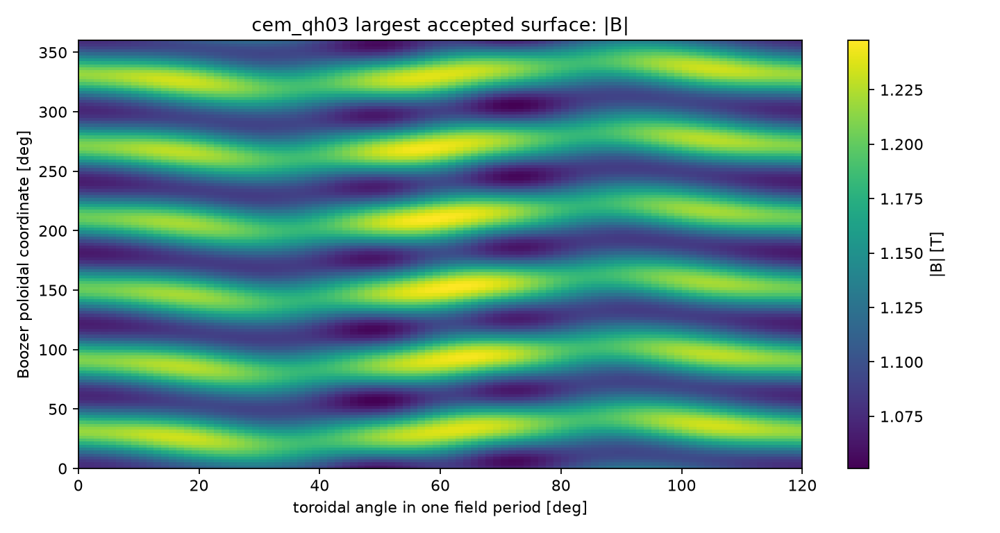
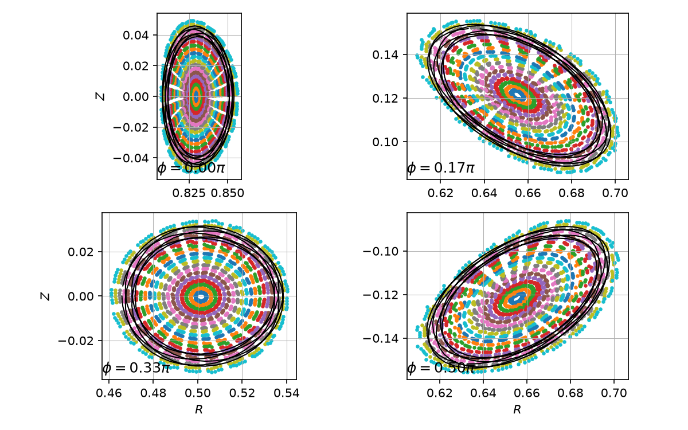
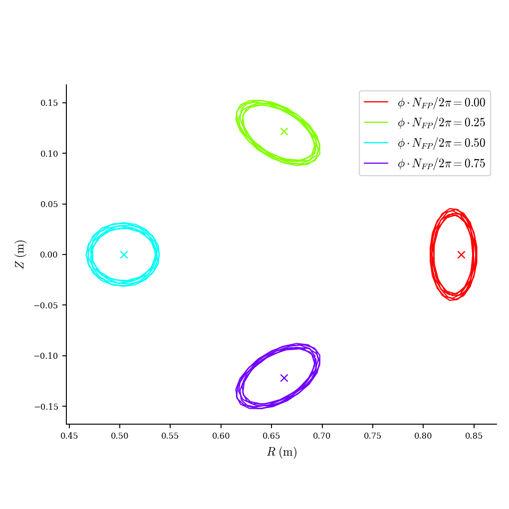
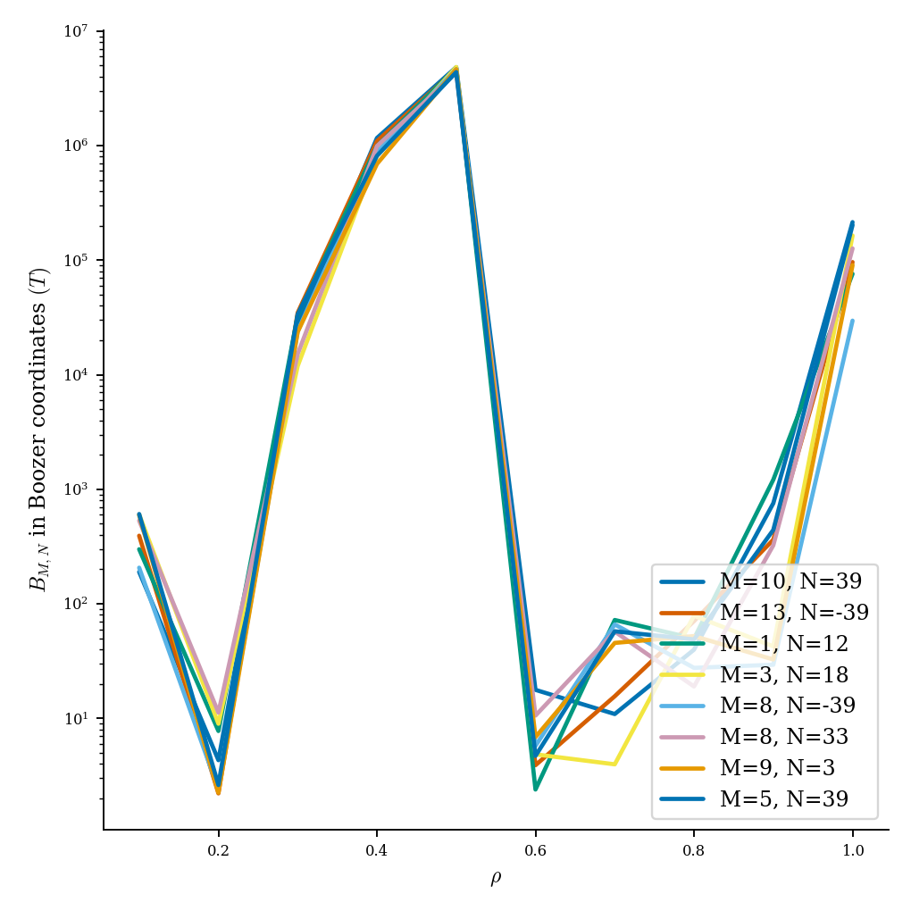
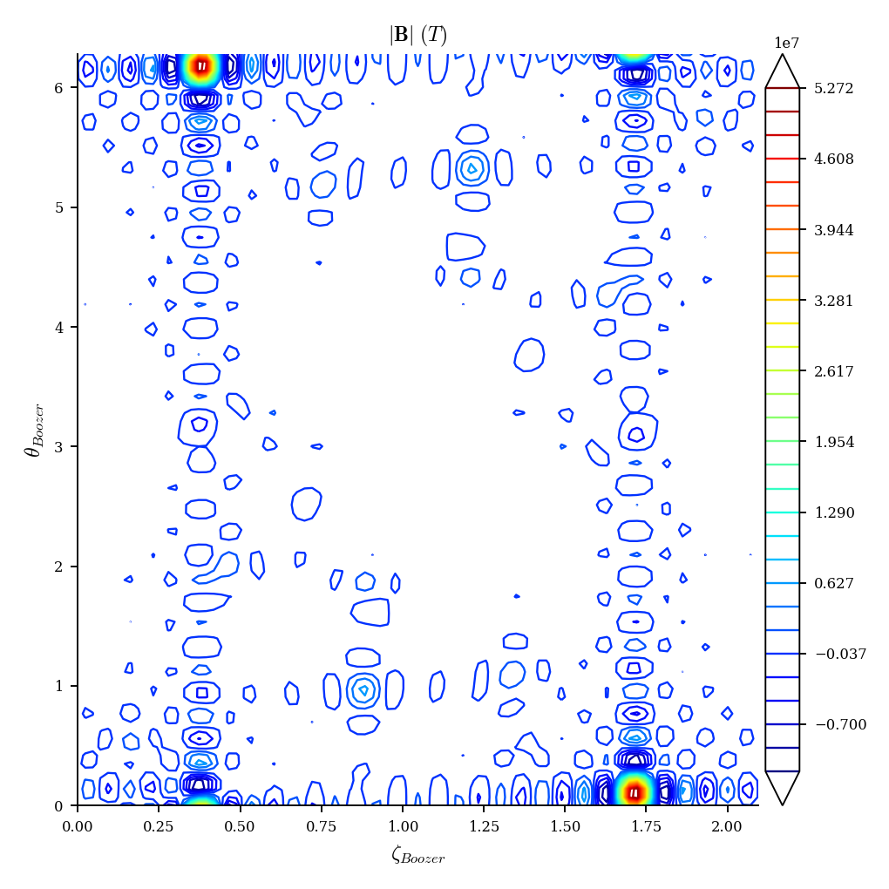
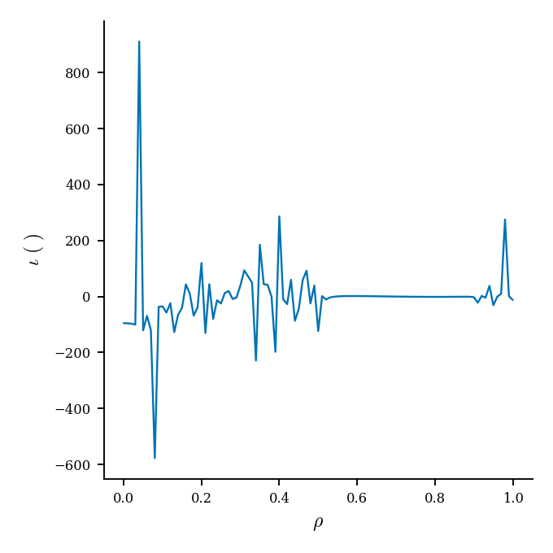
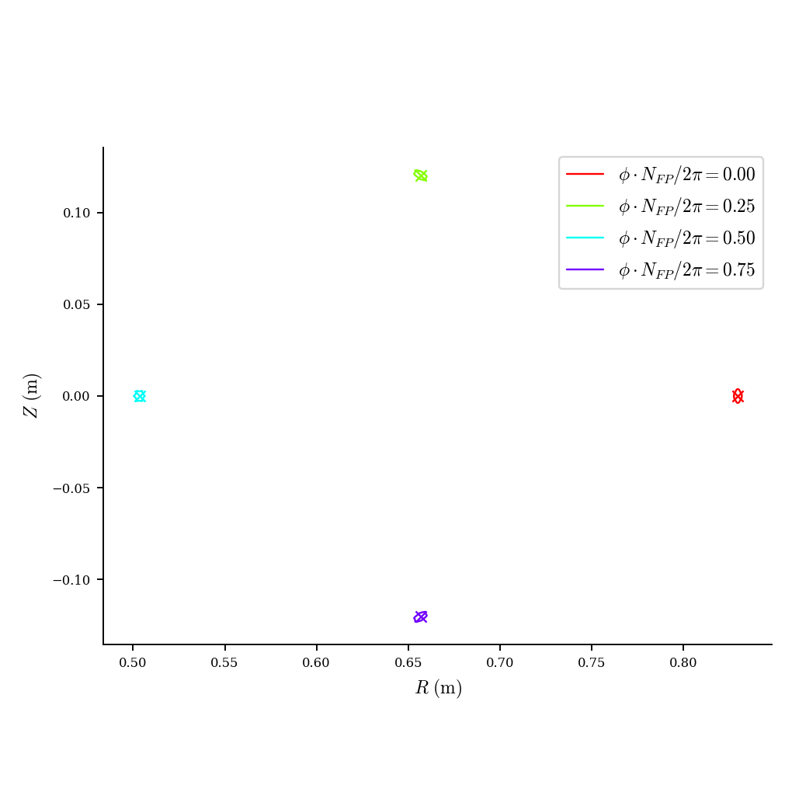
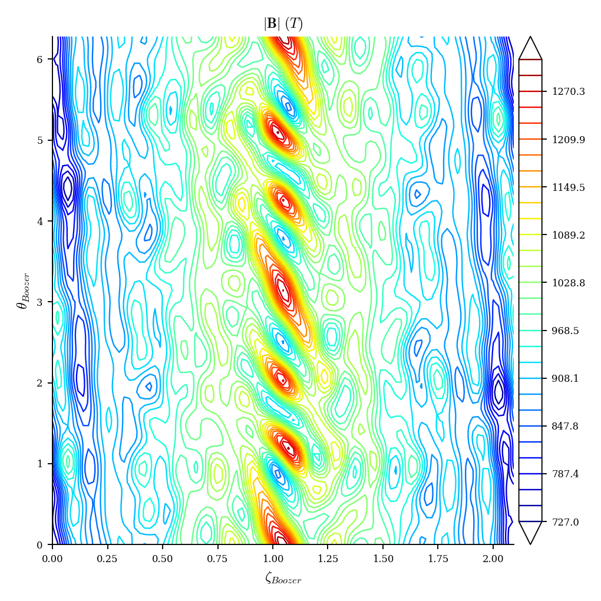
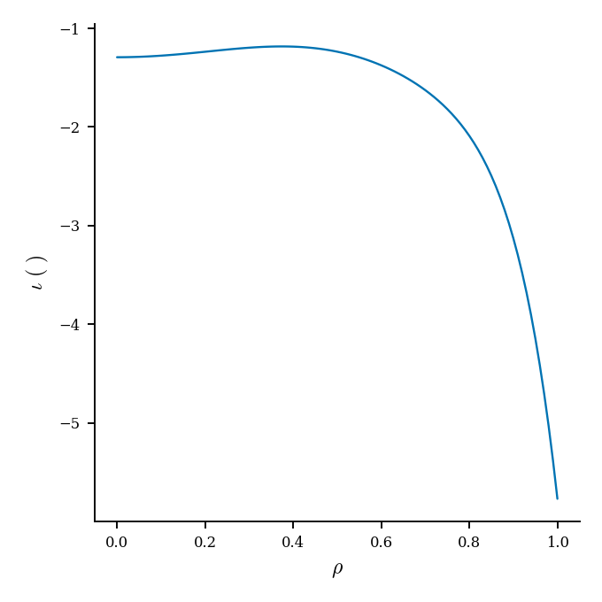

# cem_qh03 完整评估报告

## 结论

- 默认 score 评估成功：`score=88.75`，状态为 `surface`。
- 最大连续分支磁面取 `a=0.12, psi=0.3`，而不是 raw volume 最大的 `a=0.16`。
- 最大可信磁面指标：
  - `iota=-0.4056672245`
  - `G=5.7118109257`
  - `volume=0.0751231141`
  - QS error: QA `7.12e-4`，QH `1.83e-3`，QP `1.85e-3`
- `a=0.16` 虽然给出 `volume=0.16237`，但 `iota` 从上一层约 `-0.406` 跳到 `+0.569`，判定为 Boozer 分支跳跃，不作为最大可信磁面。
- Poincare 图已修正角度定义：`compute_fieldlines` 使用物理弧度，`Surface.cross_section` 使用除以 `2*pi` 的归一化柱坐标角。
- DESC 对最大连续分支面仍不可信：加入磁轴初值后 residual 明显下降，但最终 normalized force 仍偏大。

## 默认评估

| 项 | 值 |
|---|---:|
| status | `surface` |
| score | `88.7470357896325` |
| axis residual | `5.4842696192812885e-09` |
| axis topology | `elliptic` |
| psi angle p95 | `5.3237549534313195e-05` |
| psi angle l2 | `2.1680152826427676e-05` |
| 默认最佳 psi | `0.16` |
| 默认最佳 iota | `-0.4869701879853522` |
| 默认最佳 volume | `0.00602395262033687` |
| 默认耗时 | `2.808506779372692 s` |

## 扩大磁面

| a | psi angle p95 | ok levels | best psi | iota | volume | QH QS | branch | time s |
|---:|---:|---:|---:|---:|---:|---:|---|---:|
| 0.05 | 5.3237549534313195e-05 | 14 | 0.44 | -0.48707506092781744 | 0.01696224616227465 | 0.0005083015220425938 | accepted | 2.5715502658858895 |
| 0.08 | 6.0037433156062066e-05 | 13 | 0.36 | -0.4872661577910208 | 0.03693490480695952 | 0.0010468705746418275 | accepted | 2.5730390017852187 |
| 0.12 | 0.0001778261870740325 | 13 | 0.3 | -0.40566722452684184 | 0.07512311407074286 | 0.0018272347778679335 | accepted | 4.336115708574653 |
| 0.16 | 0.0010642082790703806 | 12 | 0.3 | 0.5687677148760383 | 0.16237301680007177 | 0.009480200223265027 | rejected: iota branch jump | 2.5691695492714643 |
| 0.20 | 0.005406140790615405 | 6 | 0.04 | 0.5654986080837258 | 0.02621632569283172 | 0.001385110038999614 | rejected: iota branch jump | 2.532452235929668 |
| 0.25 | 0.052701186263628484 | 1 | 0.002 | 0.565433300468812 | 0.0022148132595260833 | 0.0001646085438940439 | rejected: iota branch jump | 2.3640911811962724 |
| 0.30 | 0.1377301999991668 | 1 | 0.002 | 0.5654334883119034 | 0.0027412690918213233 | 0.0001908891905447266 | rejected: iota branch jump | 2.3486015452072024 |
| 0.35 | 0.2978843657182099 | 1 | 0.002 | 0.5654340684354832 | 0.0038734067289024113 | 0.000247416958330699 | rejected: iota branch jump | 2.3662670170888305 |

## 直接图

`|B|` 范围：`1.0510400481 - 1.2476184601 T`，平均 `1.1458578423 T`。

- [|B| heatmap HTML](assets/bmod_heatmap.html)
- [线圈和磁面 3D HTML](assets/coils_surface_3d.html)

Poincare 图说明：

- 彩色点是从磁面内部多条初始线追踪得到的截面点。
- 黑线是同一物理柱坐标角下的候选 Boozer 面截面。
- 本次已修正角度单位：`phi_cross_section = phi_physical / (2*pi)`。
- 目前点云和边界在四个截面上基本对应；外侧点越过黑线说明初始线包含略超出边界的外层采样，主要用于检验附近嵌套结构。

## DESC

### 原始 DESC 输入

最初 DESC 输入只给边界，没有显式给磁轴初值。DESC 能完成优化，但出现明显警告：

- non-nested surfaces
- left-handed coordinate
- 最终 normalized force 平均约 `1.09e5`，最大约 `9.03e8`

这说明该 DESC equilibrium 不可信。

### 加入磁轴初值后的对照

我用 evaluator 找到的磁轴拟合了 DESC/VMEC 形式的轴：

$$
R_{\mathrm{axis}}(\phi)=\sum_k R_k \cos(k\,nfp\,\phi),
$$

$$
Z_{\mathrm{axis}}(\phi)=\sum_k Z_k \sin(k\,nfp\,\phi).
$$

8 阶拟合残差约为：

- `R rms = 1.39e-7 m`
- `Z rms = 2.34e-7 m`

把 `RAXIS_CC/ZAXIS_CS` 写入 DESC input 后再直接用 `Equilibrium.from_input_file` 求解，结果改善明显：

| DESC 配置 | avg normalized force | max normalized force | 结论 |
|---|---:|---:|---|
| 原始边界输入 | `1.09e5` | `9.03e8` | 不可信 |
| 加入磁轴初值 | `5.86e2` | `2.92e4` | 明显改善，但仍不可信 |

所以 DESC 的问题确实包含“初值不够好”，但不是只给磁轴就能解决。后续更合理的方向是给 DESC 一个更好的体坐标初值，例如从多层嵌套 Boozer/psi 面生成 volume initial guess，而不是只给最外层边界。

### DESC 图

原始 DESC：

加入磁轴初值的 DESC 对照：

## 文件

- [summary.json](../../runs/cem_qh03_full_eval_20260709/sweep_summary.json)
- [默认评估 summary](../../runs/cem_qh03_full_eval_20260709/default_score/summary.json)
- [最大可信磁面 boozer_surface.npz](../../runs/cem_qh03_full_eval_20260709/a_0p12/level_0p3/boozer_surface.npz)
- [DESC summary](assets/desc/desc_summary.json)
- [DESC axis-init summary](assets/desc_axis_init/desc_axis_summary.json)
- [DESC input.check](assets/desc/input.check)
- [DESC input_axis.check](assets/desc/input_axis.check)
