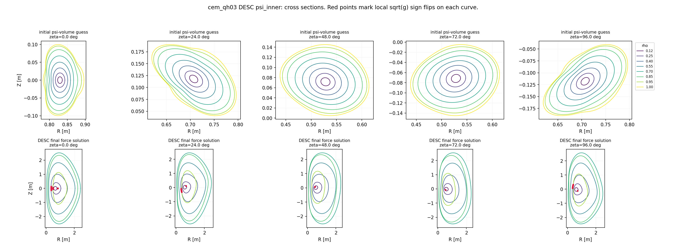
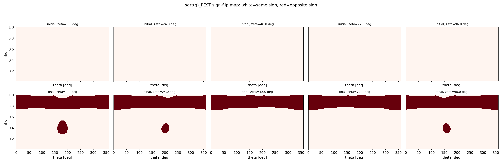
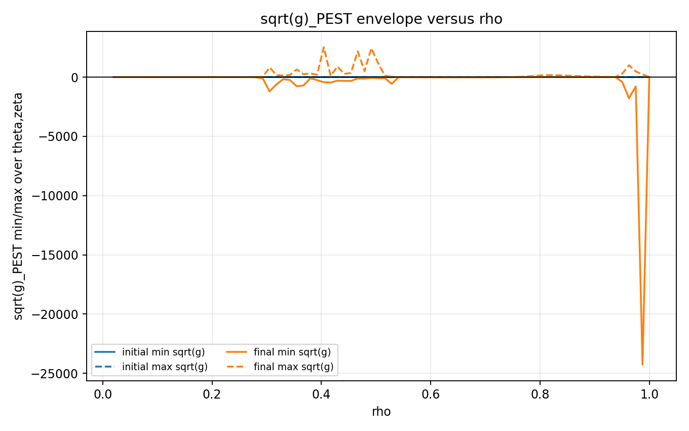
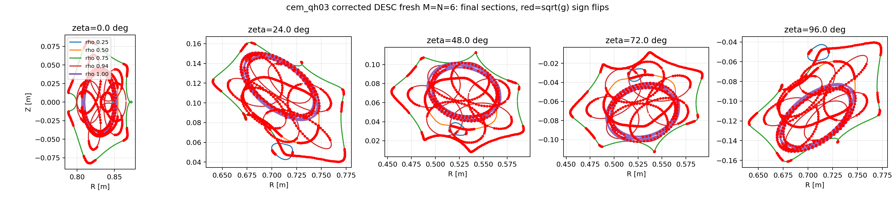

# DESC 多层 $\psi$ 体初值探索报告

## 1. 目标

这次实验的目标是：在 evaluator 已经找到尽量大的 Boozer 可解磁面之后，研究下一步传给 DESC 求解 fixed-boundary equilibrium 时，能否利用 evaluator 已有的 $\psi$ 拟合结果，给 DESC 一个比“只给最外层边界”更好的体坐标初值。

实验分支：`desc-psi-volume-initial-guess`

新增脚本：

```bash
scripts/desc_psi_volume_initial_guess_experiment.py
```

核心输入：

- evaluator 输出目录：`summary.json`、`axis_data.npz`、`psi_model.npz`
- 最大接受面：`level_*/boozer_surface.npz`
- 原始线圈 JSON：用于重建 Biot-Savart 场并计算 toroidal flux

核心输出：

- `boundary_input.check`：从最大 Boozer 面转出的 DESC/VMEC 边界输入
- 每个变体的 `summary.json`
- 每个变体的 `equilibrium.h5`
- 汇总文件：`reports/desc_psi_volume_initial_guess/*.json`

## 2. 这次具体做了什么

### 2.1 固定边界

最大磁面仍然使用 evaluator 找到的 Boozer 可解面，而不是直接使用原始 $\psi=\psi_0$ 等值面。原因是：

- Boozer 面已经通过 Simsopt 的 LS/Newton 修正，几何上更接近磁面；
- 后续 DESC 是 fixed-boundary equilibrium，边界应当尽量可信；
- $\psi$ 更适合作为体内初值，而不是直接替代最终边界。

具体步骤：

1. 读取 `boozer_surface.npz` 中的 `dofs`。
2. 重建 `SurfaceXYZTensorFourier(mpol=6, ntor=6, stellsym=True)`。
3. 调用 Simsopt 的 `to_RZFourier()` 转成 `SurfaceRZFourier`。
4. 写出 VMEC 风格 `&INDATA`，包含 `RBC/ZBS`、`NFP`、`MPOL/NTOR`、`PHIEDGE` 等。
5. DESC 侧用 `FourierRZToroidalSurface.from_input_file(...)` 读入边界。

### 2.2 Toroidal flux

`PHIEDGE` 不再任意指定，而是用实际线圈场计算：

```python
psi = ToroidalFlux(surface, biotsavart).J()
```

本次 `cem_qh03` 最大面得到：

$$
\Phi_{\mathrm{edge}} = -1.7250604750\times 10^{-2}\ \mathrm{Wb}
$$

### 2.3 磁轴初值

从 evaluator 的 `axis_data.npz` 读取一周期磁轴轨道，然后拟合为 DESC 的 `FourierRZCurve`：

$$
R_{\mathrm{axis}}(\phi) = \sum_{k=0}^{K} R_k \cos(k\,nfp\,\phi)
$$

$$
Z_{\mathrm{axis}}(\phi) = \sum_{k=1}^{K} Z_k \sin(k\,nfp\,\phi)
$$

本次使用 `K=8`。对 `cem_qh03` 的拟合误差：

| 项 | 数值 |
|---|---:|
| R RMS | $1.39\times 10^{-7}$ m |
| Z RMS | $2.34\times 10^{-7}$ m |
| R max | $2.37\times 10^{-7}$ m |
| Z max | $4.51\times 10^{-7}$ m |

说明磁轴拟合本身不是瓶颈。

### 2.4 多层 $\psi$ 点云

对于最大边界对应的 $\psi_{\mathrm{edge}}$，取若干 DESC 径向标签：

$$
\rho_j \in [0.12, 0.94]
$$

然后令：

$$
\psi_j = \rho_j^2 \psi_{\mathrm{edge}}
$$

在每个 $\rho_j$ 层上，对网格点 $(\theta,\phi)$ 解一维方程：

$$
\psi(R_{\mathrm{axis}}(\phi)+r\cos\theta,\ Z_{\mathrm{axis}}(\phi)+r\sin\theta,\ \phi)=\psi_j
$$

得到点云：

$$
(\rho_j,\theta,\zeta)\mapsto (R,Z)
$$

然后传给 DESC：

```python
eq.set_initial_guess(nodes, R, Z, lambda_values, ensure_nested=...)
```

其中第一版设置：

$$
\lambda=0
$$

也就是说，这次只测试“几何体面初值”，还没有给 DESC 提供更好的角坐标修正。

### 2.5 GPU 算法细节

多层 $\psi$ 点云提取复用了已有 GPU kernel：`surface_points_from_level_gpu`。

GPU 侧做的事情：

1. 把 $\psi$ 展开系数、模式指数、磁轴数组复制到 GPU。
2. 每个 $(\phi_i,\theta_j)$ 网格点独立求一个半径 $r_{ij}$。
3. 初始半径来自二次项近似：

$$
r \approx a\sqrt{\psi/q_2(\theta,\phi)}
$$

4. 每个点做阻尼 Newton 迭代：

$$
r \leftarrow r-\frac{\psi(r,\theta,\phi)-\psi_j}{\partial\psi/\partial r}
$$

5. 半径被限制在：

$$
0<r\leq a
$$

6. 输出 `xyz` 和 `radius`。

这一步完全不调用 `.B()`，也不追踪磁力线；只是批量求 $\psi$ 等值面。因此它非常快。

本次 `cem_qh03` 设置：

| 参数 | 数值 |
|---|---:|
| 层数 | 8 |
| 每层网格 | $17\times 17$ |
| 总点数 | 2312 |
| GPU 总耗时 | 0.122 s |
| 单层 GPU kernel 时间 | 约 0.00045 s |

当前 GPU 耗时主要不是 kernel 本身，而是 Python/ctypes 调用、系数准备、库调用固定开销。若未来一次性批量传入所有层，而不是每层一次调用，还可以继续压低。

## 3. 测试变体

对 `cem_qh03` 的最大连续分支面测试了 5 种初值：

| 变体 | 内容 |
|---|---|
| `boundary_default` | 只给 DESC 最大边界；DESC 自己从边界缩放到轴 |
| `axis_default` | 给最大边界 + evaluator 磁轴 |
| `psi_inner` | 给最大边界 + 磁轴 + 内部 $\psi$ 层点云，`ensure_nested=False` |
| `psi_inner_refine` | 同上，但 `set_initial_guess(..., ensure_nested=True)` |
| `psi_inner_boundary` | 内部 $\psi$ 层 + 外层 Boozer 边界点，`ensure_nested=True` |

DESC 设置：

| 参数 | 数值 |
|---|---:|
| L | 5 |
| M | 5 |
| N | 6 |
| pressure | 0 |
| current | 0 |
| solve | `eq.solve()` 默认 force objective |

注意：当前 DESC 环境中的 JAX 没有 CUDA-enabled jaxlib，因此 DESC solve 本身跑在 CPU 上。GPU 只用于 evaluator 侧的 $\psi$ 点云提取。

## 4. `cem_qh03` 结果

输入磁面：

| 项 | 数值 |
|---|---:|
| $a$ | 0.12 |
| $\psi_{\mathrm{edge}}$ | 0.3 |
| Simsopt/Boozer iota | -0.405667 |
| Simsopt/Boozer G | 5.711811 |
| toroidal flux | $-1.72506\times 10^{-2}$ Wb |

### 4.1 效果对比

这里优先看 DESC optimizer 的 `cost` 和 `fun` 统计；这是 DESC solve 本身的目标口径。脚本中额外的 `eq.compute('|F|_normalized')` 会受网格和坐标奇异性影响，只作为诊断，不作为主要判断。

| 变体 | nested after init | nested after solve | solve time | optimizer cost | mean |fun| | p95 |fun| | max |fun| | 结论 |
|---|---:|---:|---:|---:|---:|---:|---:|---|
| boundary_default | 否 | 否 | 13.13 s | $1.41\times10^{16}$ | $1.49\times10^5$ | $2.06\times10^4$ | $1.61\times10^8$ | 失败 |
| axis_default | 否 | 否 | 1.95 s | $2.95\times10^{21}$ | $7.39\times10^7$ | $2.08\times10^6$ | $7.19\times10^{10}$ | 更差 |
| psi_inner | 是 | 否 | 3.78 s | $4.76\times10^{-6}$ | $4.96\times10^{-5}$ | $1.45\times10^{-4}$ | $3.85\times10^{-4}$ | 最好 |
| psi_inner_refine | 是 | 否 | 4.61 s | $3.79\times10^5$ | $7.22$ | $30.2$ | $449$ | 被 GoodCoordinates 预修正破坏 |
| psi_inner_boundary | 否 | 否 | 2.17 s | $8.11\times10^{16}$ | $7.10\times10^5$ | $5.52\times10^5$ | $3.11\times10^8$ | 失败 |

结论：

- 对 `cem_qh03` 这个硬例子，`psi_inner` 明显有效，DESC objective 从 $10^{16}$ 量级降到 $10^{-6}$ 量级。
- 单独加入磁轴不够，甚至更差；这说明问题主要不是“轴的位置”，而是 DESC 内部体坐标初值太差。
- 不应该把外层 Boozer 边界点和内部几何 $\psi$ 角坐标混在同一个点云拟合里；这会把两套参数化硬拼起来，结果很差。
- DESC 的 `ensure_nested=True` 预修正这次反而破坏了最好的 $\psi$ 初值。当前更合理的是先不让 GoodCoordinates 改，直接用 force solve 试。
- 尽管 `psi_inner` force objective 很好，`eq.is_nested()` 仍然在 solve 后返回 false。因此这还不能直接作为最终生产流程，需要继续检查坐标嵌套性、手性和 DESC 图。

### 4.2 耗时

`cem_qh03` 总耗时约 76.0 s，其中包括 5 个 DESC 变体。

公共预处理：

| 步骤 | 耗时 |
|---|---:|
| field build | 0.003 s |
| Simsopt surface reconstruct | 0.001 s |
| toroidal flux | 0.026 s |
| write boundary input | 4.07 s |
| DESC surface from input | 4.38 s |
| axis curve fit | 0.267 s |
| psi model load | 0.002 s |
| GPU $\psi$ volume points | 0.122 s |

各变体：

| 变体 | DESC construct | set initial guess | solve | final force compute |
|---|---:|---:|---:|---:|
| boundary_default | 17.83 s | 0.00 s | 13.13 s | 0.64 s |
| axis_default | 1.15 s | 0.00 s | 1.95 s | 0.64 s |
| psi_inner | 0.15 s | 1.74 s | 3.78 s | 0.65 s |
| psi_inner_refine | 0.17 s | 0.13 s | 4.61 s | 0.65 s |
| psi_inner_boundary | 0.18 s | 8.30 s | 2.17 s | 0.64 s |

解释：

- `boundary_default` 的 construct 时间特别长，主要包含第一次 DESC/JAX 构造和编译/预处理开销；后续变体已经热启动，所以不能简单把它和后续 construct 逐项比较。
- `write boundary input` 约 4 s 偏长，主要来自 Simsopt `to_RZFourier()` 的边界重采样和 least-squares fit，以及 Python 层写入。
- `DESC surface from input` 约 4.4 s，也包含 DESC input 转换和首次相关 import/初始化开销。
- 真正的 GPU $\psi$ 点云提取只需 0.12 s，不是瓶颈。
- 当前瓶颈仍然是 DESC 侧构造、JAX 编译/预处理和 solve。

## 5. `cem_3` sanity check

为了确认多层 $\psi$ 初值不是无条件更好，我又对一个默认 DESC 已经很干净的样本 `cem_3` 做了对照。

### 5.1 默认边界初值

`cem_3` 的默认边界初值已经很好：

| 项 | 数值 |
|---|---:|
| optimizer cost | $1.69\times10^{-6}$ |
| mean |fun| | $3.22\times10^{-5}$ |
| max |fun| | $1.97\times10^{-4}$ |
| nested after solve | 是 |

### 5.2 直接加入多层 $\psi$ 初值

同样使用 $\rho\in[0.12,0.94]$ 的多层 $\psi$ 点云后，结果变坏：

| 变体 | optimizer cost | mean |fun| | max |fun| | nested after solve |
|---|---:|---:|---:|---:|
| psi_inner | $5.75\times10^{12}$ | $3.78\times10^3$ | $2.79\times10^6$ | 否 |

检查点云发现外层 $\psi$ 面半径碰到了 `max_radius=a` 的截断：

| $\rho$ | radius_max |
|---:|---:|
| 0.823 | 0.12 |
| 0.940 | 0.12 |

这说明该 $\psi$ 模型在这个边界附近已经不能可靠提供外层体面。把这些点喂给 DESC 会比默认初值更差。

我又测试了只取到 $\rho=0.70$ 的内层版本，仍然不如默认：

| 变体 | optimizer cost | mean |fun| | max |fun| | nested after solve |
|---|---:|---:|---:|---:|
| psi_inner, $\rho_{\max}=0.70$ | $3.67\times10^4$ | 1.78 | 115 | 否 |

结论：多层 $\psi$ 初值不是默认替代方案；它更像是“默认 DESC 初值失败时的救援策略”。在默认边界初值已经干净、且 $\psi$ 点云与 DESC 边界参数化不一致时，强行加入 $\psi$ 体点云会破坏结果。

## 6. 当前判断

### 6.1 已经确认有效的部分

- 用 $\psi$ 构造多层体点云可以显著改善某些硬边界的 DESC force objective。
- GPU 提取多层 $\psi$ 点云非常快，当前 2312 点仅 0.12 s。
- 磁轴拟合很准，耗时小，不是瓶颈。
- 直接给 DESC 外层边界 + toroidal flux 的流程已经稳定。

### 6.2 还没有完全扣上的部分

- `psi_inner` 在 `cem_qh03` 上 force objective 很好，但 `eq.is_nested()` 仍为 false。这意味着它还不能作为最终可信 DESC equilibrium 直接发布。
- $\psi$ 点云的几何角 $\theta$ 和 Boozer/Simsopt 边界面的 $\theta$ 参数化不一致。把外层边界点和内部 $\psi$ 点云一起拟合时尤其容易坏。
- DESC 的 `ensure_nested=True` GoodCoordinates 预修正不一定帮忙；本次对最好的 `psi_inner` 反而明显变差。
- 对默认已经干净的样本，$\psi$ 体点云可能是负收益。

## 7. 建议的下一步

### 7.1 作为生产策略

建议暂时不要把多层 $\psi$ 初值设为默认。更合理的顺序是：

1. 先跑 `boundary_default` 或“边界 + 合理磁轴”的常规 DESC。
2. 如果 DESC objective 已经小，且 nested 检查通过，则不使用 $\psi$ 点云。
3. 如果常规 DESC objective 很差，再启用 `psi_inner` 救援。
4. `psi_inner` 成功后还必须检查：
   - `eq.is_nested()`
   - DESC boundary plot
   - Boozer $|B|$ contour
   - force residual 分布
   - 是否有 left-handed coordinate warning

### 7.2 点云过滤

构造 $\psi$ 层时必须增加过滤：

- 若某层 `radius_max` 接近 `max_radius=a`，说明该层发生截断，应丢弃；
- 若某层 1D Newton 未收敛或半径分布异常，应丢弃；
- 只把未截断、形状合理的内部层交给 DESC；
- 不要默认加入 $\rho=1$ 外层 Boozer 边界点，除非解决了参数化一致性问题。

### 7.3 参数化改进

真正更稳的方案不是“几何角 $\theta$ 的 $\psi$ 点云”，而是：

1. 用多条磁力线或 Boozer 面构造近似 straight-field-line 角；
2. 把每层 $\psi$ 面重新参数化到与外层 Boozer 边界一致的 $\theta$；
3. 再拟合 DESC 的 `R_lmn/Z_lmn`；
4. 后续可考虑提供非零 `lambda` 初值。

这比当前实验复杂，但能解决“内部层和边界参数化不一致”的根本问题。

### 7.4 性能优化方向

当前主要瓶颈不在 GPU $\psi$ 提取，而在 DESC/转换侧：

| 瓶颈 | 当前表现 | 可优化方向 |
|---|---:|---|
| Simsopt surface -> RZ input | 约 4.1 s | 缓存 RZFourier；直接从 dofs 投影到 RZ，避免高密度重采样 |
| DESC input parse/import | 约 4.3 s | 使用 Python API 直接构造 `FourierRZToroidalSurface`，减少 input file 往返 |
| DESC construct/JAX warmup | 首次约 8-18 s | 同进程批处理多个变体，提前 warmup；避免反复启动 Python |
| DESC solve | 2-15 s | continuation；更好初值；安装 CUDA-enabled jaxlib 后再评估 GPU 加速 |
| $\psi$ 点云 GPU 提取 | 0.12 s | 已很快；可批量多层一次 kernel 调用进一步压低 |

需要注意：当前 DESC 环境提示没有 CUDA-enabled jaxlib，所以 DESC 自身没有使用 GPU。后续若要评估 DESC GPU 加速，应单独配置 JAX CUDA 环境，并重新测 DESC construct/solve。

## 8. 结论

这次探索说明，多层 $\psi$ 体初值确实有价值，但不能无条件替代 DESC 默认初值。

对 `cem_qh03` 这类默认 DESC 很差的硬边界，`psi_inner` 把 optimizer cost 从 $10^{16}$ 量级降到 $10^{-6}$ 量级，说明 $\psi$ 提供的体几何信息非常有用。

但对 `cem_3` 这种默认边界初值已经干净的样本，$\psi$ 点云会破坏结果，尤其当外层 $\psi$ 面发生半径截断或参数化与边界不一致时。

因此，下一步应该把它作为“DESC 失败后的救援分支”，并加入严格的点云质量筛选和 nested/plot 复核；不要直接并入默认主流程。

## 9. 追加诊断：`cem_qh03` 的 nested 失败来自哪里

针对 `cem_qh03` 的 `psi_inner` 结果，我重新构造了完全相同的初值，并分别在 DESC solve 前后检查 `sqrt(g)_PEST` 的符号。

结论很明确：

- 初值本身确实是 nested，不是代码把非嵌套初值误报为嵌套。
- `eq.solve()` 之后，force objective 被压到很小，但体坐标 Jacobian 出现大面积变号。
- 因此问题不是“初值坏”，而是“无 nested 约束的 force solve 把一个嵌套初值推进到了非嵌套/折叠的体坐标”。

### 9.1 初值的 nested 检查

初值来自：

```python
eq.set_initial_guess(nodes, R, Z, lambda=0, ensure_nested=False)
```

在多个网格上检查 `sqrt(g)_PEST`：

| 网格 | 节点数 | 正号点 | 负号点 | is_nested |
|---|---:|---:|---:|---|
| QuadratureGrid(5,5,6) | 429 | 0 | 429 | True |
| QuadratureGrid(8,8,8) | 1445 | 0 | 1445 | True |
| QuadratureGrid(12,12,12) | 4375 | 0 | 4375 | True |
| LinearGrid(16,16,16), axis=False | 9537 | 0 | 9537 | True |

初值的 `sqrt(g)_PEST` 全部为负，符号一致。负号本身不是问题；DESC 只要求符号一致。也就是说，初值确实给出了一个没有折叠的体坐标映射。

### 9.2 最终解的 nested 检查

DESC solve 后，同样检查 `sqrt(g)_PEST`：

| 网格 | 节点数 | 正号点 | 负号点 | is_nested |
|---|---:|---:|---:|---|
| QuadratureGrid(5,5,6) | 429 | 143 | 286 | False |
| QuadratureGrid(8,8,8) | 1445 | 574 | 871 | False |
| QuadratureGrid(12,12,12) | 4375 | 1276 | 3099 | False |
| LinearGrid(16,16,16), axis=False | 9537 | 2348 | 7189 | False |

变号首先集中在外层。例如默认 `QuadratureGrid(5,5,6)` 上，所有变号点都在外层 $\rho\simeq0.911$：

| $\rho$ | 变号点 / 总点 | sqrt(g) 范围 |
|---:|---:|---:|
| 0.911 | 143 / 143 | $0.723$ 到 $40.857$ |

更密网格上还能看到变号向内层扩展：

| $\rho$ | 变号点 / 总点 |
|---:|---:|
| 0.305 | 6 / 289 |
| 0.802 | 289 / 289 |
| 0.960 | 279 / 289 |

这说明最终体坐标在外层发生了明显翻折，不是一个局部数值噪声。

### 9.3 为什么 force 很小但 nested 不通过

DESC 的默认 `eq.solve(objective="force")` 主要最小化 force balance residual，并固定边界、profile、gauge 等约束。它没有把 `is_nested()` 或 `sqrt(g)_PEST` 不变号作为硬约束。

所以它可以找到一个在优化 collocation 点上 force residual 很小的谱系数解，但这个解对应的体坐标映射已经折叠。

`cem_qh03/psi_inner` 的 DESC optimizer 指标确实非常小：

| 指标 | 数值 |
|---|---:|
| optimizer cost | $4.760\times10^{-6}$ |
| mean $|fun|$ | $4.964\times10^{-5}$ |
| p95 $|fun|$ | $1.451\times10^{-4}$ |
| max $|fun|$ | $3.851\times10^{-4}$ |

DESC solve 输出表中的 force 量级也很小：

| 指标 | 初始 | 最终 |
|---|---:|---:|
| Average normalized force | $9.343\times10^{-1}$ | $3.772\times10^{-5}$ |
| Maximum normalized force | $2.301\times10^{2}$ | $2.678\times10^{-4}$ |
| Average absolute force | $8.003\times10^{4}$ N | $3.231$ N |
| Maximum absolute force | $1.971\times10^{7}$ N | $22.94$ N |

但由于最终 `sqrt(g)_PEST` 已经变号，这个 force 小的结果不能直接解释为可信的嵌套 fixed-boundary equilibrium。更准确地说，它是“force objective 很小的非嵌套 DESC 解”。

### 9.4 直接判断

这次不是 $\psi$ 初值不嵌套，也不是 `is_nested()` 口径误用。准确定位是：

1. $\psi$ 多层初值构造成功，并且在密网格上 nested。
2. DESC force solve 在没有 nested 约束的情况下，把体坐标推到非嵌套。
3. force objective 很小只说明优化方程在其 collocation/权重口径下被满足；它不保证坐标映射合法。

后续如果要让这个方向继续走，需要把 nested/GoodCoordinates 作为 solve 过程中的约束或 continuation 策略，而不是只在初始化时检查一次。
## 10. DESC 最终解到底是什么

这次对 `cem_qh03` 的 `psi_inner` DESC 结果又做了一组几何诊断，重点不是再看 optimizer cost，而是直接检查 DESC 谱表示给出的体坐标映射
$(\rho,\theta,\zeta)\mapsto(R,Z,\phi)$ 是否仍然是合法的嵌套通量坐标。

相关图：

- 初值和 DESC 最终解的截面对比：
- `sqrt(g)_PEST` 符号翻转区域：
- `sqrt(g)_PEST` 随 $\rho$ 的最小/最大包络：

### 10.1 不是磁岛

目前没有证据说明 DESC 解出了磁岛。原因是：

1. DESC 的这个 fixed-boundary equilibrium 表示本身是嵌套通量坐标谱表示，不是带 separatrix、O 点、X 点的磁岛拓扑表示。
2. 我检查的是 DESC 坐标 Jacobian，即 `sqrt(g)_PEST`。它变号意味着体坐标映射局部翻折/取向反转，而不是自动等价于磁岛。
3. 在抽样的固定 $\zeta$ 截面上，初值和最终解的等 $\rho$ 曲线都没有检测到二维曲线自交；最终解的问题主要表现为局部 Jacobian 变号。

所以更准确的说法是：DESC optimizer 找到了一个 force objective 很小、但体坐标映射已经非嵌套/局部翻折的谱系数解。它不是可信的嵌套磁面平衡，也不能直接解释成“磁岛解”。

### 10.2 初值本来是嵌套的

重新构造完全相同的 `psi_inner` 初值后，在多种网格上检查 `sqrt(g)_PEST`，初值的符号始终一致：

| 网格 | 正号点 | 负号点 | `is_nested` |
|---|---:|---:|---|
| `QuadratureGrid(5,5,6)` | 0 | 429 | True |
| `QuadratureGrid(8,8,8)` | 0 | 1445 | True |
| `QuadratureGrid(12,12,12)` | 0 | 4375 | True |
| `LinearGrid(16,16,16), axis=False` | 0 | 9537 | True |

负号本身不是问题；DESC 只要求符号一致。这个结果说明：问题不是我们给 DESC 的 $\psi$ 体初值一开始就不嵌套。

### 10.3 DESC solve 后发生了什么

DESC solve 后，`sqrt(g)_PEST` 出现大量变号：

| 网格 | 正号点 | 负号点 | `is_nested` |
|---|---:|---:|---|
| `QuadratureGrid(5,5,6)` | 143 | 286 | False |
| `QuadratureGrid(8,8,8)` | 574 | 871 | False |
| `QuadratureGrid(12,12,12)` | 1276 | 3099 | False |
| `LinearGrid(16,16,16), axis=False` | 2348 | 7189 | False |

在更细的扫描上，首次出现符号翻转的半径约为 $\rho=0.293$。外层问题最严重，特别是 $\rho\gtrsim0.8$ 的区域；`sqrt(g)` 包络图里最终解的 `sqrt(g)_PEST` 已经出现非常大的正负尖峰。这说明最终体坐标不只是有一点数值噪声，而是发生了明显的局部翻折。

截面对比图也能看出一个很强的警告：初值截面仍在原始小磁面尺度内，而 DESC 最终 force solution 被拉到了米级尺度的大形变区域。虽然若干等 $\rho$ 曲线在二维截面里看起来还是闭合曲线，但这不代表三维体坐标映射合法；`sqrt(g)_PEST` 变号已经足以判定它不是有效嵌套平衡。

### 10.4 为什么 force 小但结果仍不可用

`psi_inner` 变体的 DESC optimizer 指标确实很小：

| 指标 | 数值 |
|---|---:|
| optimizer cost | $4.760\times10^{-6}$ |
| mean $|fun|$ | $4.964\times10^{-5}$ |
| p95 $|fun|$ | $1.451\times10^{-4}$ |
| max $|fun|$ | $3.851\times10^{-4}$ |

但 `eq.solve(objective="force")` 并没有把 `sqrt(g)_PEST` 不变号作为硬约束。也就是说，它可以在优化点上把 force residual 压得很小，同时把体坐标推到非嵌套状态。这里的失败类型应归类为：

> force objective 收敛，但 DESC 体坐标映射非嵌套，因此不是物理可信的 fixed-boundary equilibrium。

后续如果继续用 DESC 做最终评估，需要额外加入 nested/GoodCoordinates 约束、continuation 或更保守的边界/初值策略；不能只看 optimizer cost。

## 11. 更正：上一组 `cem_qh03` DESC 图存在接入错误

进一步检查后，上一节中 `desc_initial_final_cross_sections.png` 对应的 `cem_qh03/psi_inner` 结果不能作为物理结论。问题不在于 DESC 真的把一个固定边界平衡解成了米级大磁面，而在于我们的 DESC 接入流程有两个实现错误：

1. `desc.equilibrium.Equilibrium(surface=...)` 会原地修改传入的 `surface` 对象；
2. 原实验把同一个 `desc_surface` 对象复用于多个 variant。第一个 `boundary_default` variant 用较低分辨率构造 Equilibrium，导致共享 surface 被截断/重参数化，后面的 `psi_inner` 实际拿到的是已经被污染的边界。

这个错误解释了之前图中“初始面和最终面尺度差很多”的异常。那不是可信的物理现象，也不应解释为磁岛。

重新用 fresh surface、只跑 `psi_inner`、并使用 `L=M=N=6` 后，固定边界在 $\zeta=0$ 保持在正常尺度：

| 层 | $R$ 范围 | $Z$ 范围 |
|---|---:|---:|
| $\rho=1$ fixed boundary | $0.80675$ 到 $0.85319$ m | $-0.04569$ 到 $0.04569$ m |

修正后的最终截面图如下：



这张图显示：尺度异常消失了，但最终解仍然不是可信平衡。内部若干 $\rho$ 层相互穿插，并且红点标出的 `sqrt(g)_PEST` 符号翻转很多。对应 DESC 结果为：

| 指标 | 数值 |
|---|---:|
| optimizer cost | $3.842\times10^7$ |
| `nested_after_point_guess` | True |
| `nested_after_solve` | False |
| `desc_solve_time_s` | $23.78$ s |

因此修正后的判断应改为：

> 之前“小 force cost 但非嵌套”的结论来自污染边界，不可信。修正边界后，DESC 没有找到好的 force balance；最终仍非嵌套，但这是一个高残差/坏解，而不是一个 force 很小的奇异物理解。

后续代码层面需要修复：

- 每个 DESC variant 都必须使用独立 fresh/deep-copied surface；
- DESC 分辨率必须不低于输入边界 surface 的实际 `M/N`；
- 每次构造 Equilibrium 后立即检查 `eq.surface` 与输入 boundary 的几何误差；
- DESC 报告中必须同时给出 boundary 保真误差、force residual 和 `sqrt(g)_PEST` 嵌套性，三者缺一不可。
