# 跳过 $s$、直接拟合 $\alpha/\iota$ 的快速评分可行性

日期：2026-08-11  
分支：`codex/direct-alpha-fast-score`  
范围：本报告只做理论与现有实现审计，不修改 score，也不运行数值实验。

## 结论先说

这个想法有一部分是成立的，而且确实值得做一个小规模原型：把

$$
\alpha(X,Y,\phi)
=\theta+\lambda(X,Y,\phi)-\iota(X,Y,\phi)\phi
$$

代入

$$
\boldsymbol B\cdot\nabla\alpha=0,
\qquad
\boldsymbol B\cdot\nabla\iota=0,
$$

只要 $\lambda$ 和 $\iota$ 都用线性基底展开，两个方程可以合并成一次固定规模的线性最小二乘。它不需要 Newton，也没有未知迭代次数。从数值形式上说，这条路符合项目追求的“GPU、固定预算、无长尾”。

但原始设想不能直接作为当前体 QS score 的完整替代，原因不是实现细节，而是少了一个物理量：**现有微分 QS 指标显式需要物理磁通梯度 $\nabla\psi$，而 $\alpha$ 和 $\iota$ 的直场线方程本身通常不能稳定、唯一地给出它。**

更具体地说：

| 判断 | 结论 |
|---|---|
| 一次联合线性 LS 能否拟合 $\lambda$ 和空间函数 $\iota$ | 能 |
| $\boldsymbol B\cdot\nabla\iota=0$ 能否自动把 $\iota$ 变成好的径向坐标 | 不能；常数就是精确零残差解 |
| 加大该方程权重能否解决问题 | 不能；反而更鼓励 $\iota$ 退化为常数 |
| $\alpha$ 和 $\iota$ 能否在某些样本上恢复磁面与物理磁通 | 能，但要求 $\iota(\psi)$ 单调且磁剪切不能太小 |
| 拟合残差能否直接等价于“最大有效磁面大小” | 不能；必须至少做径向分层和独立点验证 |
| 完全不拟合任何径向不变量还能否计算当前已验证的 $f_C$ | 不能 |
| 能否先做成便宜的快速代理 | 可以，而且这是最合理的第一步定位 |

因此我建议把第一版定义为**直接不变量代理 score**，而不是立即声称它给出了与当前相同的“物理体 QS”。只有当额外的 Clebsch 闭合、单调性和物理磁通恢复都通过时，才计算并输出当前定义的 $f_C$。

## 联合最小二乘实际在解什么

先在磁轴附近建立轴随动坐标 $(X,Y,\phi)$，令

$$
\theta=\operatorname{atan2}(Y,X).
$$

展开

$$
\lambda=\sum_j c_j f_j(X,Y,\phi),
\qquad
\iota=\sum_k d_k g_k(X,Y,\phi).
$$

对 $\alpha$ 正确求导后有

$$
\nabla\alpha
=\nabla\theta+\nabla\lambda
-\iota\nabla\phi
-\phi\nabla\iota.
$$

所以两个逐点残差是

$$
r_\alpha
=\boldsymbol B\cdot\nabla\theta
+\sum_j c_j\boldsymbol B\cdot\nabla f_j
-\sum_k d_k
\left[
g_k\boldsymbol B\cdot\nabla\phi
+\phi\boldsymbol B\cdot\nabla g_k
\right],
$$

$$
r_\iota
=\sum_k d_k\boldsymbol B\cdot\nabla g_k.
$$

$r_\alpha$ 和 $r_\iota$ 都对未知系数 $c_j,d_k$ 线性，因此可以一次求解

$$
\min_{c,d}
\left\|W_\alpha r_\alpha\right\|_2^2
+\eta\left\|W_\iota r_\iota\right\|_2^2
+\gamma_\lambda\left\|L_\lambda c\right\|_2^2
+\gamma_\iota\left\|L_\iota d\right\|_2^2.
$$

这里有三个容易写错的点：

1. 不能漏掉 $-\phi\boldsymbol B\cdot\nabla\iota$。只有在 $\boldsymbol B\cdot\nabla\iota=0$ 被精确满足时，它才不影响沿场方程；数值拟合时提前删掉会让两个残差不自洽。
2. $\lambda$ 必须是角向周期函数；$\alpha$ 本身允许含 $-\iota\phi$ 的世俗项。
3. 在 $\phi$ 的周期切口两侧，$\nabla\alpha$ 相差一个与 $\nabla\iota$ 平行的量。若 $r_\iota=0$，这不改变沿场不变量，也不改变 $\nabla\iota\times\nabla\alpha$；若只有近似成立，训练结果会依赖切口位置，因此需要成对周期样本或显式的切口一致性诊断。

当前实现的 $\alpha/\iota$ 拟合并不是这个问题。它已经拥有可信的 $s$ 和 $\rho$，拟合的是

$$
\alpha=\theta+\lambda(\rho,\theta,\phi)-\iota(\rho)\phi,
$$

并先从 $\boldsymbol B$ 中扣除相对 $s$ 面的法向小量，再拟合切向场。生产默认的 $\iota$ 是 $u=\rho^2=\psi/\psi_{\rm edge}$ 的三次多项式。对应实现见 [score_pipeline.cu](../gpu_backend/src/score_pipeline.cu)，物理与评分定义见 [GPU 原生体 QS 报告](gpu_native_volume_qs_score_report.md)。讲义也明确把 $\iota$ 写成 $\iota(\psi)$，而不是把它预先当作任意三维标量，见 [模块 4](../../../讲义/模块4-坐标系与周期性工具.md)。

## 为什么 $\iota$ 通常不能替代 $s$

### 常数退化不是调权重能修好的

方程

$$
\boldsymbol B\cdot\nabla\iota=0
$$

只说 $\iota$ 沿磁力线不变。任意常数都严格满足它。因此这条方程没有提供“从轴向外递增”的信息，也没有固定 $\iota$ 的横向尺度。

$r_\alpha$ 会利用极向推进率确定 $\iota$ 的平均值，所以联合问题不一定得到 $\iota=0$；但 $r_\iota$ 对常数部分完全没有约束。把 $r_\iota$ 权重 $\eta$ 调得更大，只会更强地压制 $\iota$ 的空间变化。若真实磁剪切本来就小，数值结果会自然靠近

$$
\iota(X,Y,\phi)\approx\iota_0,
$$

此时 $\alpha$ 仍可能拟合得很好，但 $\nabla\iota\approx0$，所以 $\iota$ 完全不能区分不同磁面。

这里要区分两个概念：

- 作为旋转变换，近常数的 $\iota$ 可以完全合理；
- 作为径向坐标，近常数的 $\iota$ 是退化的。

不能为了让算法可逆而奖励更大的 $|\nabla\iota|$，因为那等于人为奖励磁剪切，会改变原本的物理目标。

现有 69 个样本的生产三次 $\iota(\psi)$ 标定中，$\iota_{\max}-\iota_{\min}$ 的中位数为约 $0.302$，说明“所有样本都低剪切”并不成立；但这个分布有明显样本依赖，尤其不能据此保证优化后高分 QH 位形的 $\iota(\psi)$ 单调。第一项实验应直接检查每个样本的 $d\iota/d\psi$ 是否变号、最小绝对值和条件数，而不是先假定可逆。

### 两个不变量必须彼此独立

局部 Clebsch 表示需要两个独立的场线不变量：

$$
\boldsymbol B=\nabla\psi\times\nabla\alpha.
$$

磁力线是两个不变量等值面的交线。相关的几何论述可见 [Guiding-centre Lagrangian and quasi-symmetry](https://www.cambridge.org/core/journals/journal-of-plasma-physics/article/guidingcentre-lagrangian-and-quasisymmetry/83EF94257C74E7919D01CB0DF8C019A2)。只得到 $\alpha$，并不能得到一族嵌套磁面；还必须有第二个单值、横向梯度不为零的不变量。

若希望用 $\iota$ 充当第二个不变量，至少要满足

$$
\left|\nabla\iota\times\nabla\alpha\right|>0
$$

且 $\iota$ 的等值面闭合、嵌套、在目标体积内不出现径向折返。低剪切、$\iota(\psi)$ 极值和有理面附近的非唯一性都会破坏这个条件。普通最小二乘的训练 residual 很小，并不自动证明这些全局性质。

### “最后再标定”只有在可逆时才成立

在理想情况下，如果拟合出的确实是物理旋转变换，并且

$$
\frac{d\iota}{d\psi}\neq0,
$$

那么可以反过来写 $\psi=\psi(\iota)$，并令

$$
F(\iota)=\frac{d\psi}{d\iota},
\qquad
\nabla\psi=F(\iota)\nabla\iota.
$$

此时还可以增加第二次、仍然是线性的拟合：

$$
\boldsymbol B
\approx
F(\iota)\,
\nabla\iota\times\nabla\alpha.
$$

若 $F$ 只用 $\iota$ 的低阶基底展开，这一步可恢复物理磁通尺度，再积分得到 $\psi(\iota)$。这就是原始想法真正闭合的版本。

它的限制也很清楚：当 $d\iota/d\psi$ 很小时，$\nabla\iota$ 很小，而 $F=d\psi/d\iota$ 很大。两个量的乘积也许仍有限，但最小二乘会非常病态；当 $\iota(\psi)$ 不单调时，单值的 $F(\iota)$ 根本不存在。因此“最后再标定”不是普适的免费后处理，而是一条需要先验收可逆性的条件分支。

## 为什么当前体 QS 不能只靠 $\alpha$ 和 $\iota$

当前代码计算的是指定 helicity $(M,N)$ 的 two-term 微分 QS 残差。真空场中 $I=0$，其核心形式为

$$
A=(\boldsymbol B\times\nabla\psi)\cdot\nabla B,
\qquad
C=\boldsymbol B\cdot\nabla B,
$$

$$
f_C=(M\iota-N)A-MGC.
$$

代码中明确使用

$$
\nabla\psi
=\frac{d\psi}{ds}\nabla s.
$$

这可在 [score_pipeline.cu](../gpu_backend/src/score_pipeline.cu) 的 `compute_qs_metric_kernel` 直接核对。two-term 形式本身也明确包含 $\nabla\psi$，见论文 [Measures of quasisymmetry for stellarators](https://www.cambridge.org/core/journals/journal-of-plasma-physics/article/measures-of-quasisymmetry-for-stellarators/01B9DFE86A23964F331E0E0615B4E7A2)。

任意把 $\psi$ 换成一个未标定的标签 $\chi=g(\psi)$ 会令第一项乘上 $g'(\psi)$，而 $MGC$ 不会同比例变化。因此它不是简单的坐标重命名。只有恢复了正确的物理磁通尺度，才能与当前已交叉验证的 $f_C$ 保持同一含义。

这也符合 QS 的理论结构：严格 QS 本身蕴含单值磁通函数的存在，而不是只需要一个角向场线标签。必要充分条件中显式出现 $\boldsymbol B\times\boldsymbol u=\nabla\psi$，见 [Necessary and Sufficient Conditions for Quasisymmetry](https://arxiv.org/abs/2004.11431)。

所以新路径有两种诚实的输出：

1. 没有恢复 $\nabla\psi$ 时，只输出“直场线/全局不变量代理”，不能把它命名为当前的体 QS error；
2. 通过 $F(\iota)$ 闭合验收后，才使用 $\nabla\psi=F\nabla\iota$ 计算同一定义的 $f_C$。

## 残差能否自然代表有效磁面大小

“外部磁面越坏，整个体积里的拟合 residual 越大”这个直觉有价值，但直接取一个全局平均 residual 不够。它至少混合了五件事：

- 真正的磁岛或混沌；
- 预先选取的几何采样管有多大；
- 基底阶数够不够；
- 轴附近与外层点数如何加权；
- $|\boldsymbol B|$、$|\nabla\alpha|$、$|\nabla\iota|$ 的尺度。

因此同一个磁场只要更换采样管半径或基底阶数，就可能得到显著不同的 residual。反过来，足够灵活的局部基底能在没有全局嵌套面的区域拟合出很小的局部沿场误差；常数 $\iota$ 更是天然零 residual。于是“残差小”等价于“存在大磁面”并不成立。

更合理的连续版本不需要离散搜索最大面，但仍要保留几何径向位置 $r$。在固定的轴随动采样管中，先在独立验证点上计算无量纲残差，例如

$$
e_\alpha
=\frac{|\boldsymbol B\cdot\nabla\alpha|}
{|\boldsymbol B|\,|\nabla\alpha|+\epsilon},
$$

$$
e_\iota
=\frac{|\boldsymbol B\cdot\nabla\iota|}
{|\boldsymbol B|\,|\nabla\iota|+\epsilon}.
$$

再按几何半径分层得到 $e(r)$，定义平滑可信度

$$
p(r)=\sigma\!\left(\frac{\tau-e(r)}{T}\right),
$$

最后计算

$$
V_{\rm eff}
=\int_{V_{\rm tube}}p(r)\,dV.
$$

这能把原来的“13 个候选层中选一个”改成连续有效体积，避免离散跳变，也不需要追求严格最大面。但它仍不是无条件的磁面体积：$r$ 是几何半径，不是磁通坐标，$V_{\rm eff}$ 必须用现有可信面结果标定。

还必须加两类防作弊门：

- **非退化门**：检查 $\nabla\iota\times\nabla\alpha$ 的有效秩、$\iota$ 等值面的闭合与径向顺序；常数 $\iota$ 不能靠零 residual 得高分。
- **独立点门**：训练点和验证点必须分开；有效体积只能由验证 residual 形成，不能由训练 residual 形成。

若不做这两项，新 score 最容易学到的不是“大而好的嵌套磁面”，而是“用平滑低阶函数在固定采样管里把沿场导数平均压低”。

## 值得实际尝试的版本

我建议下一步先实现一个明确可失败的原型，而不是直接替换生产 score：

```text
已有磁轴初值
  -> 建立固定、轴随动的几何采样管
  -> 一次联合线性 LS 拟合 lambda(X,Y,phi) 与 iota(X,Y,phi)
  -> 在独立点计算 r_alpha、r_iota 和径向可信度
  -> 检查 iota 是否非退化、等值面是否有序
      -> 不通过：只输出低置信度代理分，不计算物理体 QS
      -> 通过：线性拟合 F(iota)，恢复 grad(psi)=F grad(iota)
          -> 检查 B ~= F grad(iota) x grad(alpha)
          -> 通过后计算当前定义的 f_C
```

第一版不做最大磁面搜索，也不做长周期追踪。它的目的不是证明新方法必然正确，而是回答三个可量化问题：

1. 在多少 QH 样本上，$\iota$ 确实能作为非退化、单调的径向标签？
2. 直接拟合 residual 与当前可信磁面大小、当前 $f_C$ 的排序关系有多强？
3. 假高分率是否足够低，能否安全用作优化 score 或至少作为廉价前筛？

建议验收表如下：

| 项目 | 与什么比较 | 通过标准的性质 |
|---|---|---|
| $\iota$ 数值 | 当前 $\iota(\psi)$、长场线相位推进 | 均值、径向趋势和符号一致 |
| 径向可逆性 | 当前 $s/\psi$ 层 | $\iota$ 等值面闭合、有序，$d\iota/d\psi$ 不反号 |
| Clebsch 闭合 | 独立体点上的 $\boldsymbol B$ | $\boldsymbol B-F\nabla\iota\times\nabla\alpha$ 残差受控 |
| 有效体积 | 当前连续磁面大小与完整 Poincare | 高分段排序近似保持，尤其不能出现小面假高分 |
| QS | 当前物理 $f_C$ 与完整面 QS | 高分段相关和 top-k 重合，而不只看全体相关 |
| 鲁棒性 | QUASR 好样本、随机样本、优化轨迹点 | 失败返回有限低分，无异常长尾 |
| 速度 | 同一张空闲 RTX 5090、同一轴初值 | 报告 P50/P95 和各阶段，不只报单样本最好值 |

有一个便宜但很关键的前置判定：先复用已有结果统计 $d\iota/d\psi$ 的变号率和最小绝对值。如果大量目标 QH 样本在所需体积内接近零剪切或不单调，那么“用 $\iota$ 代替 $s$”应在写 CUDA 之前停止；这不是调基底或调权重能修复的问题。

## 速度上可能省多少

生产主线在“已有磁轴初值、严格续接”的 69 样本统计中，单次 score 的 P50 约为 $0.55$--$0.67\ \mathrm{s}$，随磁轴核验模式略有差异。grid-48 基线的主要阶段是：

| 当前阶段 | P50 |
|---|---:|
| 磁轴链路 | 删除 FP64 复核后约 $140\ \mathrm{ms}$ |
| $s/\psi$ 拟合与独立验证 | 约 $143\ \mathrm{ms}$ |
| 连续磁面筛选 | 约 $119\ \mathrm{ms}$ |
| $\alpha/\iota$ 拟合 | 约 $85\ \mathrm{ms}$ |
| 磁通标定 | 约 $38\ \mathrm{ms}$ |

直接路线理论上可删除当前 $s/\psi$、连续磁面筛选和磁通标定的大约 $300\ \mathrm{ms}$，所以值得探索。但不能据此直接预言新 score 只剩 $0.25\ \mathrm{s}$：

- 当前 $\iota$ 只有 4 个径向系数；新方案若给 $\iota(X,Y,\phi)$ 使用与 $\lambda$ 相近的三维基底，QR 列数可能接近翻倍；高瘦 QR 的主成本近似随列数平方增长，求解时间可能接近四倍。
- 若再拟合 $F(\iota)$，会增加一次较小的线性问题和独立闭合验证。
- 磁轴与线圈准备仍然保留，约 $160\ \mathrm{ms}$ 的下界不会消失。

因此要获得实际加速，$\iota$ 必须使用明显更小、带物理约束的低阶基底，或者利用块结构消元；不能简单复制 $\lambda$ 的 2268 列基底。速度目标应以完整原型的单卡 P50/P95 决定，而不是以“删除了三个阶段”决定。

## 最终判断

原始提议里最有价值的部分，是用一次联合线性问题同时寻找直场线标签和另一个沿场不变量，并用连续 residual 代替离散最大面搜索。这有机会得到更平滑、更便宜的优化目标。

原始提议里不成立的部分，是默认把物理旋转变换 $\iota$ 同时当成普适径向坐标，并认为联合 LS residual 会自然给出磁面大小和现有体 QS。这个等价关系只在 $\iota(\psi)$ 单调、剪切不退化、Clebsch 闭合成立时存在；这些条件对 QH 不能预设为真。

所以这条路线**值得做原型，但必须按条件分支命名和验收**：

- 未恢复物理磁通时，它是“直接不变量代理 score”；
- 成功恢复 $F(\iota)$ 并通过独立闭合后，它才是“跳过原 $s$ 拟合的物理体 QS score”；
- 若低剪切导致 $\iota$ 退化，则必须承认这条路线不适用于该样本，而不能靠更高权重、更多基底或奖励 $|\nabla\iota|$ 强行修成径向坐标。

如果最终需要一个对低剪切也普适的版本，就必须另求一个非退化径向不变量 $\chi$，再拟合 $\iota(\chi)$。它可以采用比当前 $s$ 更快的算法，也可以避免离散磁面搜索，但从物理角色上说，$\chi$ 仍然就是一个新的 $s$；这部分信息不能被 $\alpha$ 单独消掉。

---

## 方案转向：优质中心附近的超快全维差分梯度

本节记录 2026-08-11 的方向调整。上一节的“用空间 $\iota$ 代替 $s$”不适合作为通用体 QS 主线，因此不再优先实施。新的目标不是推导正式 score 的解析梯度，也不是让一个简化 score 在整个数据分布上复现正式 score，而是：

> 已知当前中心是一个性质较好的可行解，只在它的很小邻域内构造一个极便宜、确定、光滑的局部 score；用 600 个中心差分端点一次性估计 300 维潜空间梯度；每次真正更新后仍由正式 score 验收。

记正式 score 为 $S(x)$，中心为 $x_0$，中心完整计算留下的缓存为 $C_0$。新对象写成

$$
\widetilde S(x;C_0).
$$

$\widetilde S$ 不是一个全局统一评分函数：中心改变后，$C_0$ 也要重建。我们只要求在信赖邻域内

$$
\nabla \widetilde S(x_0;C_0)
$$

与

$$
\nabla S(x_0)
$$

方向接近，不要求两者数值相等，也不要求 $\widetilde S(x)=S(x)$。

### 关键判断

这个方向**可行，而且比继续补解析梯度更值得尝试**。原因有三点：

1. 300 维中心差分需要 600 个端点，单独逐个运行当前约 $0.55$--$0.67\ \mathrm{s}$ 的 score 需要约 5--7 分钟；但 600 个端点之间存在大量可共享内容，逐个调用并不是这个问题的合理实现。
2. 中心处的磁轴分支、$s$ 模式、所选磁面 level、射线编号、体点拓扑和两个 QR 的因子都已知。强局部假设允许固定离散分支，只计算连续的小修正。
3. 目标只是梯度方向。训练 residual、独立验证、P95、拓扑复核和精确 QR 中为“给出可信绝对 score”服务的部分，可以大幅压缩或删除。

但需要避免一个已经有数据证明的错误：**不能把磁轴、$s$ 和体点全部冻结，只批量重算固定点上的 QS。** 历史 step 120 上有

| 局部目标 | 同一方向的 score 斜率 |
|---|---:|
| 固定几何并重拟合 $\alpha/\iota$ 的 G3 | $+15.59$ |
| 全部重算的正式 score | $-8.23$ |

在 step 89 和 step 100 上也观察到 G3 与正式 score 负相关；固定磁轴但重算后续几何的 G4 在较早的 step 50 也明显反向。详细证据见 [黑箱梯度报告](qh_blackbox_gradient_exploration_report.md)。这说明：

- 600 个方向可以消除随机 SPSA 的方向方差；
- 但它不能消除局部 score 本身的系统性偏差；
- 若局部 score 仍等价于旧 G3，那么得到的是“很精确的错误梯度”。

因此最低可用版本必须包含磁轴、$s$ 和采样点的便宜连续响应。应冻结的是**分支和离散选择**，而不是所有几何量的数值。

### 中心完整计算要留下什么

每个中心先运行一次正式 score。除了已有输出，还要保留一个只在当前信赖邻域有效的 GPU cache：

| 中心缓存 | 后续用途 |
|---|---|
| 磁轴固定点 $(R_0,Z_0)$、Poincare Jacobian $J_0$、240 个轴样本 | 为所有端点做一阶轴修正，不再搜轴 |
| $s$ 系数、列缩放、Householder QR 反射子和上三角 $R_s$ | 用同一个中心因子批量更新 600 组 $s$ 系数 |
| 当前所选 level、各射线根、$\partial s/\partial r$、有效点索引 | 固定磁面分支并用一步 Newton 移动边界/体点 |
| 磁通标定系数和固定截面求积点 | 用小型多右端项问题更新物理磁通尺度 |
| $\alpha/\iota$ 系数、列缩放、QR 因子 $R_\alpha$ | 批量更新 600 组 $\alpha/\iota$ |
| 一组固定的分层训练/评估点及公共权重 | 保证正负端点使用完全相同的数值噪声 |
| 当前 score 各平滑分量所处区间 | 固定 clip、gate 和候选分支，避免端点切换公式 |

这个 cache 不能跨很远的优化步复用。每接受一个新中心，就用新中心的正式 score 重建一次。正式 score 的约 $0.55\ \mathrm{s}$ 成本因此是每个完整梯度的一次固定开销，而不是 600 次。

### 600 个端点的实际计算流程

对三根线圈、每根 100 维的常用例子，潜空间维度为 $D=300$。构造

$$
z_j^+=z_0+h_j e_j,
\qquad
z_j^-=z_0-h_j e_j,
\qquad j=1,\ldots,300,
$$

再计算

$$
g_j
=
\frac{
\widetilde S(F(z_j^+);C_0)
-\widetilde S(F(z_j^-);C_0)
}{2h_j}.
$$

这里 $F$ 是固定步数的 flow 解码。整条快速路径应按下面顺序实现。

**1. 一次批量 flow 解码。**
把 600 个 latent 组成一个大 batch，用 FP32、RK4-64 解码。已有实验中，单卡一次解码 1600 个 RK4-64 探针为 $1.81\ \mathrm{s}$；因此 600 个样本的 flow 不是主要障碍，合理预期约为 1 秒量级，但仍要实测 batch=64/128/256/600 的吞吐和显存。正负端点必须放在相同批形状中，不能一边 batch=1、一边 batch=300。

生产优化和已有优化器状态使用 RK4-128。RK4-64 在这里定义的是一个新的、自洽的局部代理映射，不能把同一份 RK4-128 latent 状态静默改成 RK4-64 后继续优化。第一轮标定有两种合法做法：继续用 RK4-128 保持中心严格一致；或者把中心的物理线圈用 RK4-64 重新反演得到新的 latent 中心，再在 RK4-64 映射下构造全部差分端点。二者应以重建误差和局部梯度余弦决定，而不是把跨离散步数的差异错误地归因于 score。

不需要 flow VJP，也不保存反向传播激活。这里仅做普通推理，彻底绕开先前解析梯度路线。

**2. 批量离散线圈和工程量。**
当前每个 query 都单独 `sgpu_create_field`。新接口应把线圈系数布局成 `[query, coil, coefficient]`，一次 kernel 生成所有查询的线段和电流，并批量计算长度、曲率、间距、高模能量等工程分量。Python 只能发起一次调用，不能循环 600 次。

**3. 用中心 Jacobian 做一次轴预测，再追踪一次输出轴曲线。**
不能完全冻结轴。对第 $q$ 个端点，在中心固定点上只追踪一条线得到一周期映射 $P_q(u_0)$，然后用中心已经保存的 $2\times2$ Jacobian 做

$$
J_0=
\left.
\frac{\partial\left[P_0(u)-u\right]}{\partial u}
\right|_{u=u_0}.
$$

这里 $J_0$ 是固定点 residual $P_0(u)-u$ 的 Jacobian，不是裸映射 $P_0$ 的 Jacobian。于是

$$
u_q
=u_0-J_0^{-1}\left[P_q(u_0)-u_0\right].
$$

再从 $u_q$ 追踪一次，同时得到闭合 residual 和轴曲线采样。所有 query 同时追踪；不做全局网格、不做四条有限差分 Jacobian、不做椭圆拓扑线、不做 FP64 复核、不做线搜索。

这相当于每个 query 固定两条场线，而不是当前 Newton、拓扑和轴采样的多批重复。积分步数可从 960 开始比较 480/256，只以最终梯度方向而非轴的机器精度验收。若轴位移或第二次闭合 residual 超过中心标定的阈值，整组梯度作废并减小 $h$；绝不回退到别的磁轴分支。

**4. 不重新分解 $s$ 的大矩阵，只做一到两次中心预条件修正。**
设包含 ridge 行的中心问题为

$$
x_0=\arg\min_x\|A_0x-b_0\|_2^2,
$$

中心 Householder QR 已给出

$$
A_0=Q_0R_0.
$$

对端点 $q$，先在较小的固定点集上计算当前残差

$$
r_q=b_q-A_qx_0.
$$

最便宜且保持中心不动的一阶修正来自最小二乘一阶最优条件：

$$
d_q
=A_q^Tr_q-A_0^T(b_0-A_0x_0),
$$

$$
R_0^TR_0\,\delta x_q=d_q,
\qquad
x_q=x_0+\delta x_q.
$$

$R_0$ 不是由不稳定的 FP32 normal equations 分解得到的，而是中心完整计算的 Householder QR 因子。600 个 $d_q$ 拼成一个矩阵后，只需两次多右端项 TRSM；NVIDIA 的 [cuBLAS 文档](https://docs.nvidia.com/cuda/cublas/index.html) 原生支持一个三角矩阵和多个右端项。$A_qx_0$ 与 $A_q^Tr_q$ 用矩阵自由 CUDA kernel 计算，不为每个 query 存一份完整 $A_q$。

不过，上式仍以 $R_0^TR_0$ 表示响应，条件数会平方；使用 Householder 得到 $R_0$ 只避免了重新形成和分解每个 $A_q^TA_q$，并不自动消除病态放大。开发标定时必须把它与下一段的 `ormqr + trsm` 路线比较。如果两者在系数、物理 residual 或梯度方向上出现显著差异，即使前者更快，也应采用后者或增加稳定化，而不能把差异当成可忽略的代理误差。

若一次修正与精确端点 QR 差距仍大，可以固定做第二次：在 $x_q$ 上重算残差，再使用同一个 $R_0$ 修正。迭代次数只能是预先规定的 1 或 2，不以 residual 开放式循环。

另一个更保守但稍贵的版本，是把所有端点残差拼成多右端项矩阵，直接用中心 `ormqr` 计算 $Q_0^TD$，再用 TRSM 回代。[cuSOLVER](https://docs.nvidia.com/cuda/cusolver/index.html) 提供 `geqrf/ormqr`，[cuBLAS](https://docs.nvidia.com/cuda/cublas/index.html) 提供多右端项 `trsm`；组合起来即可复用中心 QR 做这类修正。两种方案应比较端点系数、物理 residual、梯度余弦和墙钟，而不是凭名称选择。

这个思路同时用于 $s$ 和后面的 $\alpha/\iota$。当前 $s$ 约有 1574 列，$\alpha/\iota$ 约有 2272 列；逐端点重做 QR 是 600 倍成本，复用中心因子则把主要计算改成高吞吐的矩阵乘与多右端项三角求解。

**5. 固定磁面 level，但用一步公式移动射线根和体点。**
“$s$ 假定不变”应解释为：中心选择的 level、射线编号、有效点拓扑和径向顺序不变；不能解释为 $s$ 系数完全不变。

中心射线根 $r_0$ 满足

$$
s_0(r_0,\theta,\phi)=s_{\rm edge}.
$$

端点只做一步

$$
r_q
=r_0-
\frac{s_q(r_0,\theta,\phi)-s_{\rm edge}}
{\partial_rs_0(r_0,\theta,\phi)}.
$$

然后按中心保存的径向比例移动内部体点。这样不需要逐端点射线求根，也不需要 13 层乘 128 条线的一周期磁面追踪，却保留了磁面随线圈变化的一阶位移。若分母太小、根越过相邻射线顺序或位移超过信赖半径，梯度直接判无效。

磁面分量不再使用一周期漂移 P95。可用已经计算的

$$
\frac{|\boldsymbol B\cdot\nabla s|}
{|\boldsymbol B|\,|\nabla s|}
$$

在中心边界点上的 RMS 作为便宜的局部屏障，并从移动后的射线根更新尺寸。它不能替代正式磁面判定，但足以阻止局部梯度立刻把面推坏；更新后的中心仍由正式 score 检查。

**6. 磁通尺度只做固定拓扑的小问题。**
完全冻结中心磁通标定会污染 $f_C$ 中 $\nabla\psi$ 与 $G$ 的相对尺度，尤其当 latent 扰动改变电流时。建议保留少量中心截面求积点，在移动后的几何上批量评估 $\boldsymbol B$，然后把 600 组右端项一起送入同一个低阶多项式 LS。这里矩阵只有约 $11\times4$，没有必要做候选尝试或二分。

第一版也可以暂时冻结磁通映射，用它测速度下界；但若梯度方向明显偏差，磁通响应应是优先补回项之一，而不是继续增加 $\alpha$ 阶数。

**7. 在同一批移动体点上更新 $\alpha/\iota$ 和 QS。**
使用与 $s$ 相同的中心 QR 预条件修正，不为每个 query 运行 $32272\times2272$ QR。QS 点数不必维持正式 score 的 10 万点；梯度原型可从固定、分层的 8192 或 16384 点开始，并确保每一对正负端点使用完全相同的点、权重和归约顺序。

在这些点上批量计算 FP32 的 $\boldsymbol B+\nabla\boldsymbol B$、更新后的 $\alpha/\iota$ residual 和 $f_C$。不做独立验证，不做排序 P95，不做动态点数补充。体 QS、QA/QP 竞争项、$\iota$ 和 coil 分量保留，因为它们是高分附近真正有梯度的主体。

### 哪些步骤删除、冻结或近似更新

| 正式 score 步骤 | 局部梯度版处理 | 理由 |
|---|---|---|
| 全局磁轴搜索 | 删除 | 已知中心分支，禁止换轴 |
| 轴 Newton 的 query Jacobian 与线搜索 | 用中心 $J_0$ 做一次预测 | 捕获一阶轴移动，不追求独立收敛 |
| 椭圆拓扑、FP64、五线验证 | 删除 | 正式中心和更新后中心负责验收 |
| $s$ 独立 4000 点验证 | 删除 | 只影响绝对可信度，不值得乘 600 |
| 每个端点的 $s$ QR | 中心 QR 加 1--2 次批量修正 | 保留主要连续响应 |
| 13 层磁面追踪和连续选择 | level/索引冻结，射线根一步移动 | 去掉最大追踪成本和离散跳变 |
| 磁通多次尝试与二分 | 固定求积拓扑的小型多 RHS LS | 保留物理尺度响应 |
| 每个端点的 $\alpha/\iota$ QR | 中心 QR 加 1--2 次批量修正 | 避免约 80 ms 乘 600 |
| 10 万 QS 点 | 固定分层 sketch | 梯度只需方向，且正负共享误差 |
| P95、max/min、硬 gate | 删除或固定中心活跃分支 | 减少非光滑和排序成本 |
| 线圈工程量 | 精确批量重算 | 便宜且导数有意义 |
| 更新后中心正式 score | 保留 | 防止局部代理越出信赖域 |

这里最重要的边界是：验证可以删，搜索可以删，离散选择可以冻结；**磁轴位置、$s$ 系数和体点位置的连续响应不能全部删。**

### 真正的 CUDA 批量化，而不是 600 次循环

现有 `sgpu_score_coils_g2_frozen_batch`、`g3_frozen_batch` 和 `g4_fixed_branch_batch` 都在 C++ 中写了逐 query 的 `for` 循环。它们只减少了 Python 调度，并没有把候选维度放进 CUDA kernel，因此不能作为本方案的性能基础。

新接口应该是一个中心 cache 加一个连续 query batch：

```text
center cache + [query, coil, coefficient]
  -> batched coil discretization
  -> batched axis traces
  -> batched matrix-free s residual/normal-product
  -> multi-RHS triangular solves
  -> batched moving points and flux RHS
  -> batched B + grad(B)
  -> batched alpha residual/normal-product
  -> multi-RHS triangular solves
  -> batched QS reduction
  -> 600 local scores
```

对于单卡 32 GB 显存，中心 $s$ QR 因子约 0.5 GB，$\alpha$ QR 因子约 0.3 GB；即便保留 600 列的 $s$ 和 $\alpha$ RHS，也分别约 0.20 GB 和 0.08 GB。线性代数本身能放入显存。真正需要分块的是 600 组体点上的 $\boldsymbol B+\nabla\boldsymbol B$，建议固定 query chunk 为 64/128，并让正负端点始终位于同一 chunk。

多卡时按坐标对拆分：4 卡每卡 75 对，6 卡每卡 50 对。每卡复制中心 cache，独立返回对应 $g_j$；不在端点之间做通信。flow 可以在一张卡上解码完再分发，也可以每卡用相同固定 batch 形状解码自己的坐标，最终由实测决定。

### 差分步长不能沿用随机方向的数值而不检查

旧 SPSA 的方向通常同时扰动 300 个坐标；单坐标 $e_j$ 只扰动一维。即使写成相同的 $h=0.005$，两者在 latent 的总位移和解码后线圈位移也不同。因此不应机械复用旧 $h$。

建议先批量解码 $h=0.0025,0.005,0.01,0.02$ 的少量坐标，记录每个坐标引起的线圈曲线 RMS。可以使用统一 $h$，也可以按 flow 的局部敏感度给每个坐标设置 $h_j$，使物理曲线位移落在同一数量级。无论哪种方式都要满足：

- 正负端点仍在中心轴分支和固定磁面分支内；
- 端点 score 差明显高于 FP32 flow 与 GPU 归约噪声；
- $h/2,h,2h$ 三档梯度的余弦稳定；
- 不能小到让差分主要放大局部 score 的数值误差。

中心差分仍应作为第一版默认值。它需要 600 个端点，但有 $O(h^2)$ 截断误差；先前四方向单边差分在约 50 步后系统性落后中心差分，当前没有理由为了从 600 砍到 300 而先牺牲方向质量。

### 如何证明“比较准”

因为 $\widetilde S$ 不要求还原 $S$，不能再用 score 值的绝对误差作为主要标准。真正的验收量应是梯度方向。

开发阶段选取至少三个已知高质量中心，覆盖“刚进入高分区、继续上升、平台附近”三个阶段。对每个中心做：

1. 用当前方案得到 300 维 $g_{\rm fast}$；
2. 开发阶段一次性支付 600 个正式 score 端点，得到同一步长的 $g_{\rm full}$；
3. 比较
   $$
   \cos(g_{\rm fast},g_{\rm full}),
   $$
   top 坐标符号一致率，以及去掉整体比例后的相对误差；
4. 再取 32--64 个随机方向，比较 $g_{\rm fast}\cdot v$ 与正式 score 中心差分的符号、Pearson 和 Spearman；
5. 沿 $g_{\rm fast}$ 的归一化方向测试多个小步长，最终只看正式 score 是否上升。

全维正式参考只在开发标定时运行，不进入稳定优化。建议把以下标准作为第一轮止损线，而不是事后挑最好结果：

- 目标：三个中心的梯度余弦均达到约 0.8 以上；
- 最低可继续：均为正且不低于约 0.5，同时小步正式 score 大多数上升；
- 任一中心稳定负相关：立即停止该近似层级，优先补磁轴、$s$/点移动或磁通响应，不靠调 Adam 掩盖；
- 若加入一项响应后余弦没有提高，则删除该项，避免重新长成完整 score。

这里的 0.5/0.8 是工程筛选门，不是物理定理。最终仍要画“方向精度对墙钟”的 Pareto 曲线，用数据决定采用一层还是两层 LS 修正、8192 还是 16384 点、256 还是 480 轴步数。

### 速度预期和真正的瓶颈

当前逐个完整评分的 600 端点基线约为

$$
600\times(0.55\text{--}0.67)\ \mathrm{s}
\approx330\text{--}400\ \mathrm{s/GPU}.
$$

这是按中心点具有精确轴初值时外推的乐观下界；离开中心后，若每个端点重新搜索、验证或修正磁轴，实际串行成本只会更高。因此它用于说明“逐端点正式评分不可行”，不作为新批量接口的测速基准。

新路径的成本结构完全不同：

| 项目 | 初步判断 |
|---|---|
| 中心正式 score 与 cache | 约 $0.55$--$0.67\ \mathrm{s}$，每个梯度一次 |
| 600 个 RK4-64 flow 解码 | 根据 1600 探针 $1.81\ \mathrm{s}$ 的记录，预计约 1 秒量级 |
| 600 组轴预测与轴采样 | 真批量后预计为亚秒到低个位秒，需实测 |
| 两套 LS 的中心预条件修正 | 以 GEMM/归约和多 RHS TRSM 为主，不应再是 $600\times80\ \mathrm{ms}$ |
| 600 组 sketch 点的场与场梯度 | 最可能成为新瓶颈；成本与点数近似线性 |
| QS 和 score 归约 | 相对场计算应较小 |

第一版合理的止损目标是：**单卡完整 300 维梯度低于 10 秒，4--6 卡低于 3--5 秒，并且方向余弦达到最低门槛。** 若经过真正批量化仍需几十秒，或只有把点数降到使梯度失真才能进入 10 秒，就不值得替代当前两方向中心差分。

更激进的目标是单卡 2--5 秒。它并非毫无依据：flow 的 600 样本推理约 1 秒量级；删除逐端点 QR 后，剩下主要是约千万级 query-point 场计算和少量多右端项线性代数。但在实现前不能把它写成承诺，尤其批量不同线圈场的 Biot--Savart kernel 尚无实测吞吐。

若 QR 修正仍慢，可以按风险从低到高继续压缩：

1. 固定相同的分层 row sketch，把 $s$ 的 8 万行压到 8k--16k，把 $\alpha$ 的 3 万行压到 8k--16k；
2. 保留 FP32 QR 得到的中心 $R$，但用 TF32 GEMM 计算 $A_q^Tr_q$，再以 FP32/FP64 累加关键归约；
3. 一次修正替代两次；
4. 仅在方向余弦验证通过后，尝试中心 Gram/Cholesky 或随机 sketch；不能因为它快就沿用生产 $s$ 中已经证明不稳的普通 FP32 normal equations。

### 推荐实施顺序

这条路线不应一次写完所有近似。按下面顺序才能知道速度和方向改善来自哪里：

1. **批量基础设施。** 先实现 batch coil、batch field 和 batch flow 的纯吞吐 benchmark，确认没有 query 循环；不接优化器。
2. **历史 G3 复现。** 用真正批量接口复现“固定全部几何”的 600 维梯度，作为最低成本和已知偏差基线，不把它当候选结论。
3. **补轴响应。** 加中心 Jacobian 轴预测，检查相对 G3 的余弦是否改善。若没有，先查实现，不继续叠功能。
4. **补 $s$ 与点移动。** 加中心 QR 修正和一步射线移动。这应是最关键的质量跃升。
5. **补磁通和 $\alpha$ 修正。** 分别做消融，找到方向精度与成本的最小组合。
6. **点数、轴步数和一次/两次修正矩阵。** 只在已得到正相关梯度后扫参。
7. **短程优化。** 固定高质量中心跑 20--50 步；每个提议中心都用正式 score 验收，拒绝后缩小信赖半径并清空不再适用的局部 cache。

这项探索真正要回答的不是“能否构造另一个看起来合理的 score”，而是：

$$
\text{能否用一次中心完整计算}
+\text{一次 600 端点 GPU batch}
$$

$$
\text{在几秒内得到一个与正式 score 梯度稳定同向的 300 维向量。}
$$

若答案是肯定的，它会把当前“每步只看两个随机方向”改成“每步看到完整潜空间方向”，即使单步稍贵，也可能显著缩短高分尾部的优化步数。若补完轴和 $s$/点移动后仍与正式梯度低相关，那么问题不是验证太多或 QR 太慢，而是当前 score 在该尺度下没有足够稳定的局部梯度；此时应停止，而不是继续删除物理响应来追求更低延迟。

## 实际探索结果：全维“快速总分梯度”没有通过验收

本节记录 2026-08-11 的实际 CUDA 实验。先说最终结论：

1. **把当前快速评分粗化后，用 600 个坐标端点直接估计 300 维“总 score 梯度”，这条路线没有通过。** 在完整 300 维比较中，最好代理与正式总分差分的余弦只有 $0.237$，另一个步长甚至为负。
2. **失败不等于所有物理信息都丢了。** 16k 点代理得到的体 QS 梯度与 100k 点正式体 QS 梯度余弦达到 $0.886$--$0.908$；线圈工程分量完全一致。坏掉的主要是磁轴、$\psi$、磁面和坐标质量等前端分量。
3. **正式总分本身在坐标级小扰动下也没有稳定的全维差分梯度。** 同一中心用 $h=0.005$ 和 $h=0.01$ 得到的两份正式 300 维梯度，余弦只有 $0.209$。因此不能把其中一份当作精确真值，再要求快速代理逼近它。
4. 这次只增加了实验脚本，没有改生产 ABI、生产 score 或默认 Adam 路径。当前生产方法仍是两随机方向中心差分。

换句话说，实验回答了前文最后提出的问题：**目前不能在几秒内得到一个与正式总 score 的“全维梯度”稳定同向的向量，因为这个尺度下的正式全维梯度本身不稳定。**

### 实际算了什么

代码位于 `codex/direct-alpha-fast-score`。正式评分使用当前 ABI-10 源码编译出的库，SHA-256 为

```text
4abaec6f8bec9cd48258d375b81f46baf6c97487ea4781fe55ad917024718426
```

flow 使用固定 FP32 RK4-128 和既有 QH checkpoint，SHA-256 为

```text
39a3293a459e248a0d1ec062607a1a467128b14d8ca973aadd82e113532ab99f
```

测试中心取自当前 cubic-iota 200-step Adam 轨迹：step50、step120 和 step200。它们都是 $N_{\mathrm{FP}}=4$、三根基线圈，因此 latent 维数为

$$
d=100\times 3=300.
$$

实验分两层：

- Slurm 作业 `36448`：三个中心，各取 32 个固定随机正交方向，比较 $h=0.0025,0.005,0.01$。
- Slurm 作业 `36458`：在 step120 中心上取全部 300 个坐标方向，比较 $h=0.005,0.01$，即两套各 600 个正负端点。

每个端点都先由 flow 批量解码。正式参考重新计算当前完整 score。代理版本仍跟踪查询线圈自己的磁轴、重新拟合 $\psi$ 和 $\alpha/\iota$，但减少轴迭代、验证点、磁面追踪分辨率和体采样点数。主要候选为：

| 名称 | 轴和磁面 | 线性求解 | 体点数 | 作用 |
|---|---|---:|---:|---|
| `axis_qr16k` | 查询点自己更新 | FP32 Householder QR | 16384 | 最终进入全维验证的代理 |
| `axis_qr8k` | 查询点自己更新 | FP32 Householder QR | 8192 | 检查进一步减点是否可行 |
| `axis_ne16k/8k` | 查询点自己更新 | FP32 法方程 | 16k/8k | 不稳定对照 |
| `fixed_qr16k/8k` | 固定中心轴和磁面分支 | FP32 Householder QR | 16k/8k | 最便宜但响应不完整的对照 |

烟测发现并修正了两个实验实现问题：

- 连续磁面置信度不能只给一个径向采样层。该量是从轴到外层的置信度积分；只给目标外层会使有效层天然小于唯一采样层，从而错误返回 `no_surface`。正式 score 从未使用这个错误配置。
- 8k 点 FP32 法方程在 $\alpha$ 矩阵上 Cholesky 失败。该候选被明确否决并作为失败对照保存，没有静默回退到 CPU 或伪造结果。

### 32 个随机方向：只能作为初筛，不能替代全维验证

在 $h=0.01$ 时，`axis_qr16k` 在 step50、step120、step200 的方向余弦分别为

$$
0.502,\qquad 0.667,\qquad 0.630,
$$

三者平均为 $0.600$，平均符号一致率为 $70.8\%$。这刚好超过前文设定的最低初筛线，因此继续做了完整 300 维验证。

但这个结果并不稳健：$h=0.005$ 时三个中心的余弦变为

$$
-0.221,\qquad 0.527,\qquad 0.736.
$$

固定轴版本也没有跨阶段稳定性。例如 `fixed_qr16k` 在 $h=0.005$ 的 step50 余弦为 $0.808$，到 step120 却变成 $-0.356$。这与过去 G3/G4 的结论一致：冻结全部几何响应可能在某个点偶然很好，但不能成为通用梯度。

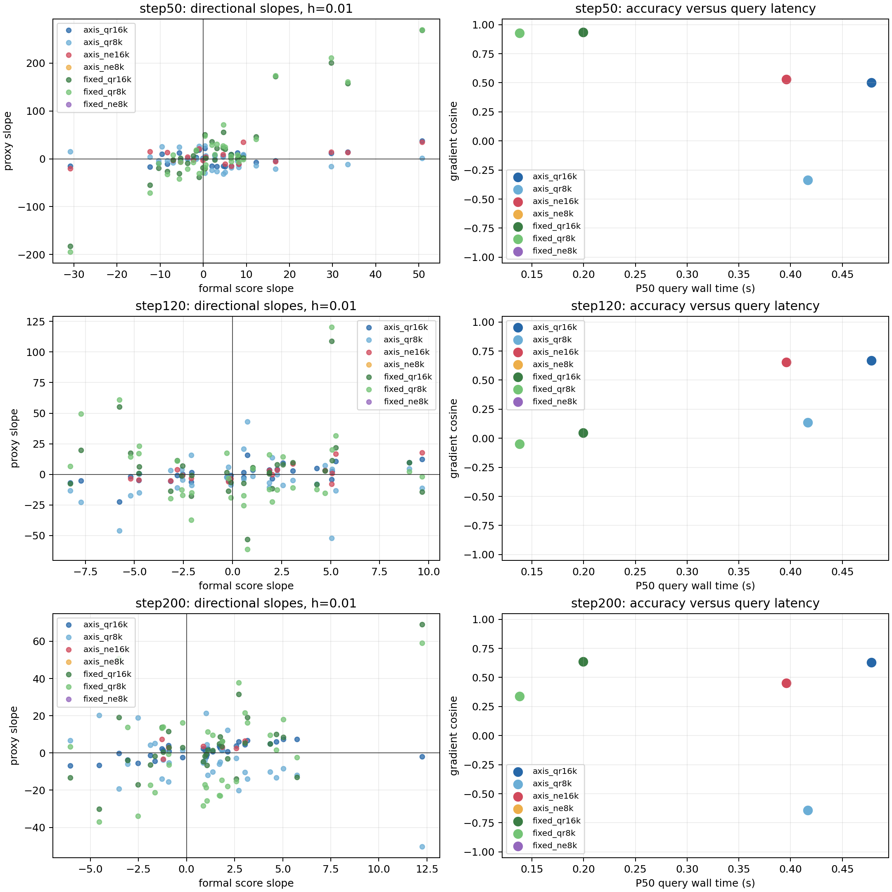

正式 score 自己的跨步长一致性也很弱：

| 中心 | $\cos(g_{0.0025},g_{0.005})$ | $\cos(g_{0.0025},g_{0.01})$ | $\cos(g_{0.005},g_{0.01})$ |
|---|---:|---:|---:|
| step50 | 0.517 | 0.416 | 0.876 |
| step120 | 0.285 | 0.372 | 0.675 |
| step200 | 0.013 | 0.046 | 0.671 |

因此 $h=0.0025$ 已明显进入毛刺或数值误差主导区；全维实验只保留后两个步长。

### 完整 300 维验证：总分方向失败

step120 的全维结果如下：

| 步长 | 正式与 `axis_qr16k` 总分梯度余弦 | 坐标符号一致率 | 代理/正式梯度范数比 |
|---:|---:|---:|---:|
| $0.005$ | 0.237 | 51.3% | 1.120 |
| $0.01$ | -0.072 | 53.0% | 1.124 |

符号一致率接近随机，且 $h=0.01$ 已经反向。这否定了“32 个随机方向结果尚可，所以完整梯度也会尚可”的推断。低维随机投影掩盖了大量彼此抵消的坐标误差。

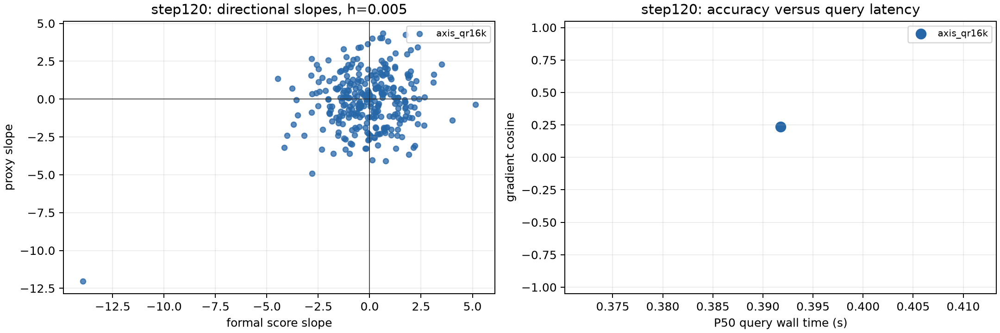

更重要的是，两份**正式**全维总分梯度之间也只有

$$
\cos\left(g^{\mathrm{formal}}_{0.005},g^{\mathrm{formal}}_{0.01}\right)=0.209.
$$

所以这不是简单的“代理少算了一点，因此精度差”。当前总 score 包含多种饱和函数、置信度积分、分支判断和离散约简；逐坐标扰动很小的时候，这些数值响应足以压过平滑物理项。此时不存在经过步长检验的唯一全维参考方向。

### 分量拆开后，体 QS 实际上拟合得很好

下图把正式与代理的七个分量分别做 300 维余弦比较。

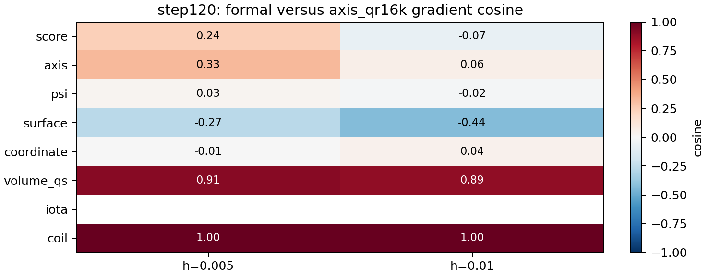

具体数值为：

| 分量 | $h=0.005$ 余弦 | $h=0.01$ 余弦 | $h=0.005$ 范数比 | $h=0.01$ 范数比 |
|---|---:|---:|---:|---:|
| axis | 0.327 | 0.056 | 1.269 | 1.415 |
| $\psi$ | 0.026 | -0.016 | 44.53 | 22.97 |
| surface | -0.266 | -0.436 | 0.089 | 0.047 |
| coordinate | -0.007 | 0.039 | 0.923 | 1.063 |
| volume QS | **0.908** | **0.886** | 0.908 | 0.870 |
| iota | 两边均饱和、梯度为零 | 两边均饱和、梯度为零 | - | - |
| coil | **1.000** | **1.000** | 1.000 | 1.000 |

这个表说明：

- 16384 个固定体点足以给出很好的体 QS 局部方向；没有必要为了体 QS 本身恢复到 10 万点。
- 线圈工程量是解析几何约简，代理和正式路径完全一致。
- $\psi$ 代理的局部导数被放大约 23--45 倍，是总分梯度污染的重要来源。
- surface 和 coordinate 的局部方向基本不可用；简单地冻结磁面或降低追踪分辨率不能修复。

不过，不能据此声称“只用 QS+coil 就会提升原总分”。直接把代理 QS 与 coil 按原权重组合后，它与正式总分梯度的余弦为 $0.025$ 和 $-0.132$。甚至使用**正式** QS+coil 分量构造的理论上限也只有 $-0.071$ 和 $-0.323$。这再次说明当前坐标级正式总分梯度主要受其它分量和门控的非平滑响应支配。

### 实测时间花在哪里

全维作业一次性解码 1201 个物理线圈样本，FP32 RK4-128 用时

$$
5.13\ \mathrm{s},
$$

即平均每个样本约 $4.27\ \mathrm{ms}$。flow 明确不是瓶颈。

四个评分分片各处理 300--301 个候选，墙钟为 601--625 秒。每个候选仍是一次独立 C++/CUDA 调用；这不是最终设想中的 query 维度 CUDA batch。单候选中位时间为：

| 路径 | P50 | P95 |
|---|---:|---:|
| 正式 score | 1.608 s | 1.651 s |
| `axis_qr16k` | 0.392 s | 0.404 s |

`axis_qr16k` 的主要阶段为：

| 阶段 | P50 | 占 0.392 s 的约数 |
|---|---:|---:|
| 轴查找/细化 | 0.124 s | 32% |
| $\alpha$ QR 求解 | 0.063 s | 16% |
| $\psi$ QR 求解 | 0.050 s | 13% |
| 磁面置信度 | 0.040 s | 10% |
| 线圈工程量 | 0.032 s | 8% |
| $\alpha$ 矩阵构建 | 0.024 s | 6% |
| 体 QS 约简 | 0.024 s | 6% |

如果只算一个步长的 600 个代理端点，当前四卡逐候选实现的直接外推约为

$$
\frac{600\times0.392}{4}+3\approx62\ \mathrm{s}.
$$

真正把 query 维度写进 CUDA kernel 后，轴追踪、线圈工程量、矩阵构建和多个 QR 可以减少调度与初始化开销，理论上仍有明显优化空间；但要进入 10 秒，还需要在四卡当前外推上再快约 6 倍。**由于梯度质量已经失败，现在不值得先投入大量工程去实现这个 batch。**

### 这条探索应如何收尾

本轮得到的可靠结论不是“快速 score 完全没用”，而是：

- **作为旧总 score 的全维梯度代理：失败。** 不接入 Adam，不改生产默认值。
- **作为体 QS 的全维梯度代理：成功。** 16k 点已经达到约 0.9 的方向余弦，值得作为下一条方法的基础。
- **作为旧总 score 的替代目标：尚未成立。** QS+coil 与旧总分梯度并不同向，若采用它，必须明确承认优化目标发生了变化，并用正式中心 score 做信赖域验收。

若继续，最有价值的方向不是把代理变回完整 score，而是定义一个专门用于高分邻域的平滑局部目标：保留体 QS 与工程量，对轴分支、$\psi$ 残差和磁面可行性只设置平滑屏障；每次更新后的中心仍运行正式 score 决定接受或回退。这样可以利用已经验证的体 QS 梯度，同时避开当前正式 score 在坐标尺度上的毛刺。该方向需要单独设计和验收，不能在本报告里冒充已经完成。

原始证据保存在 `reports/assets/local_score_gradient_exploration_20260811/`：包含候选清单、逐实验汇总、分量汇总、作业 stdout/stderr、四卡运行前后 GPU 状态和全部引用图片。两个正式作业 stderr 均为空；四张 GPU 在运行前后均为 0% 利用率、2 MiB 显存占用，没有遗留计算进程。

## 重要纠偏：原密度、热启动的迭代 $s$ 拟合尚未测试

这里需要直接更正前一节的表述：**没有做过你要求的那项核心实验。** 已运行的 `axis_qr16k/8k` 只是减少了 $s$ 拟合和后续评估使用的点数，并且在每个扰动端点仍从头执行 FP32 Householder QR。它既没有保留当前正式 score 的原始点密度，也没有把中心点已经求得的 $s$ 系数作为迭代求解初值。

因此，前一节的数据只能否定已经测试的“降采样后仍从头 QR”代理，以及固定几何的负对照；**不能否定“原点密度 + 中心解热启动 + 少量迭代”的路线。** 前文“目前不能得到稳定的快速全维梯度”的结论范围过宽，应缩小为：当前实现过的这些代理没有通过总 score 梯度验收。

### 已经做的和真正需要做的并不是一件事

| 项目 | 已完成实验 | 本来应优先测试的方案 |
|---|---|---|
| $s$ 的采样点 | 从当前 grid-48 原密度继续减少 | 保留正式端点求解的 grid-48 原密度和相同采样分布 |
| 端点线性求解 | 每个端点重新做完整 QR | 从中心系数 $c_0$ 出发，只求很小的端点修正量 |
| 是否利用“端点离中心很近” | 仅把中心磁轴作为查询提示 | 同时复用中心 $s$ 解和线性系统信息 |
| 磁轴 | moving 版本重新求，fixed 版本完全冻结 | 从中心磁轴继续追踪和细化，但绝不固定磁轴 |
| $s$ 的表达式 | moving 版本重新拟合，fixed 版本完全冻结 | 基底不变，但端点系数必须重新求解，绝不固定 $s(\boldsymbol x)$ |
| 磁面 | moving 版本重新选择，fixed 版本冻结分支 | 只固定中心选出的标量 $s_0$，端点磁面由新的 $s_q(\boldsymbol x)=s_0$ 决定 |

这里最后一项尤其重要。设中心点拟合出 $s_c(\boldsymbol x)$，并选中最大可用层的标签 $s_0$。扰动端点 $q$ 必须重新得到 $s_q(\boldsymbol x)$，随后使用的磁面是

$$
\mathcal S_q(s_0)=\{\boldsymbol x:s_q(\boldsymbol x)=s_0\}.
$$

固定 $s_0$ 只是在局部优化中避免重复执行“最大磁面选择”；它不固定磁面形状，更不固定 $s$ 的系数。随着线圈、磁轴和 $s_q$ 改变，$\mathcal S_q(s_0)$ 必须自然移动。早期实验已经表明，固定磁轴或固定 $s$ 表达式会漏掉关键响应；本轮 `fixed_qr*` 只能看作再次确认这一点的负对照，不能被写成候选主方案。

### 原密度热启动应该怎样实现

中心点的正式拟合给出

$$
c_0=\arg\min_c\left\|A_0c-b_0\right\|_2^2+\lambda\left\|Lc\right\|_2^2.
$$

扰动端点 $q$ 的线圈和磁轴略有变化，对应的矩阵变为 $A_q$。不再从头 QR，而是令

$$
c_q=c_0+\delta c_q,
$$

并在**与正式求解相同的全部行**上求小修正

$$
\delta c_q
=\arg\min_{\delta c}
\left\|A_q\delta c-\left(b_q-A_qc_0\right)\right\|_2^2
+\lambda\left\|L(c_0+\delta c)\right\|_2^2.
$$

最直接的第一版应使用 LSQR、LSMR 或 CGLS 这类只需要 $A_qv$ 和 $A_q^Tu$ 的迭代法，令 $\delta c=0$ 为初值。不能直接回到已经证明数值不稳的普通 FP32 法方程。若只靠热启动仍收敛太慢，可以复用中心 QR 的 $R_0$ 做右预条件：

$$
\delta c=R_0^{-1}y,
\qquad
\min_y\left\|A_qR_0^{-1}y-r_q\right\|_2,
\qquad
r_q=b_q-A_qc_0.
$$

这个方案的物理点数没有减少，每次迭代仍需遍历完整矩阵行；预期加速来自“端点很近，修正很小，只需少量 Krylov 迭代”，而不是牺牲采样密度。适合 GPU 的实现方式是把许多扰动端点作为 batch，同时执行矩阵作用、转置矩阵作用和归约。迭代数必须固定上限，例如分别测 2、4、8、16 步，避免出现不可接受的长尾。

这条路线可行但尚未被数据证明。关键风险是：虽然 $c_0$ 接近 $c_q$，线性系统仍可能病态，少量迭代未必足以恢复对 score 导数敏感的小量。它必须用物理残差和同端点正式 QR 共同验收，不能只比较系数距离。

### 步长和对照关系需要重新说清楚

前一轮使用了两类方向，其 $h$ 含义不同：

- 完整 300 维实验使用坐标方向 $e_j$，端点为 $z\pm he_j$。这里只改变一个归一化 latent 坐标，使用了 $h=0.005$ 和 $h=0.01$。
- 32 方向实验先把正交随机向量乘以 $\sqrt d$，使每个方向的分量 RMS 为 1、二范数为 $\sqrt d$，端点为 $z\pm hv$。这里的 $h$ 是每维 RMS 扰动，使用了 $0.0025,0.005,0.01$。

所以，随机方向的 $h=0.005$ 和坐标方向的 $h=0.005$ 具有不同的总 latent 位移，不能直接横向比较。

完整 300 维表中的代理与正式值在每一行其实使用了**相同的坐标方向、相同的端点和相同的 $h$**：$h=0.005$ 的 `axis_qr16k` 对同为 $0.005$ 的正式 QR，$h=0.01$ 也同理。这两项固定步长比较本身有效，但它们比较的不是现在要求的原密度热启动算法。

不合理之处在于，前文又把 $h=0.005$ 和 $h=0.01$ 的两份正式结果互相比，并用较低余弦支持“正式全维梯度本身不稳定，因而这条路线不值得继续”的宽泛判断。跨步长结果只能说明有限差分方向对尺度敏感，不能替代固定步长下的算法对照，更不能用来否定尚未实现的热启动方法。这一推论在此撤回。

下一轮应锁定同一中心、同一方向集合和同一个 $h$。第一轮建议直接固定生产扰动尺度 $h=0.005$；若另外测试 $h=0.01$，应把它作为一组独立实验，不混入前者的主结论。对每个相同端点同时计算：

1. 当前原密度、从头 Householder QR 的正式结果；
2. 当前原密度、由中心 $c_0$ 热启动的限步迭代结果；
3. 两者得到的 score 差商、分量差商和 $s$ 物理残差。

主要验收量应为固定 $h$ 下的全维梯度余弦、坐标符号一致率、梯度范数比，以及

$$
\frac{|\boldsymbol B\cdot\nabla s|}
{|\boldsymbol B|\,|\nabla s|}
$$

在独立稠密点上的分位数。还要记录迭代 2/4/8/16 步的耗时和失败率。只有在同端点上方向接近正式 QR、物理残差可控并且总耗时显著下降，才能继续把 $\alpha/\iota$ 也改成相同的热启动形式，并进一步做 600 个端点的真 GPU batch。

因此当前准确状态是：**固定磁轴、固定 $s$ 表达式和降采样 QR 已经不再考虑；只固定中心选出的 $s_0$，同时让磁轴、$s_q$ 和磁面随端点变化。原密度、中心解热启动的迭代 $s$ 拟合是尚未执行、且现在最应优先执行的实验。**

## 原密度热启动实验：线性方程能加速，但还不能替代正式总分

这一节补上了上一节真正缺失的实验。先说结论：

- **原密度热启动本身是可行的。** 在完整 grid-48 方程上，复用中心 QR 的上三角因子后，只需 4 次定长迭代就能很接近端点从头 QR 的 $s/\psi$ 解。
- **但它还不能作为正式总 score 的全维差分器。** 在 300 个 latent 坐标、600 个完全相同的 $h=0.005$ 端点上，最好版本的总分梯度余弦只有 $0.724$。
- **单独替换 $s/\psi$ QR 的端到端提速也很有限。** $s/\psi$ 阶段快了 $4.65$ 倍，但完整端点评分只快了 $1.077$ 倍，因为后续 $\alpha/\iota$、场评估和体 QS 仍然要完整计算。
- 因此本轮不修改生产 ABI、不替换正式 score，也不接入 Adam。实验代码保留为后续批量求解研究的依据。

### 这次准确地算了什么

测试中心仍是 $N_{\mathrm{FP}}=4$、三根基线圈的 step120 样本，latent 维数为

$$
d=3\times100=300.
$$

对每个坐标方向 $e_j$ 使用同一个固定步长

$$
z_{j,\pm}=z_0\pm0.005e_j.
$$

本节没有再把 $h=0.005$ 和其它步长混在一起解释。每个端点均走两条对照路径：

1. **端点 QR：** 重新寻找和细化端点磁轴，重新构建完整 grid-48 方程，从头做 FP32 Householder QR，随后重新标定 $\psi$、选择磁面、拟合 $\alpha/\iota$ 并计算体 QS 和正式总分。
2. **热启动 PCGLS：** 磁轴、完整矩阵、$s_q(\boldsymbol x)$、磁面和全部后续物理量仍随端点重新计算；唯一替换的是 $s/\psi$ 的线性求解器。它从中心解开始，用中心 QR 因子预条件并执行固定次数的 PCGLS。

也就是说，本实验**没有固定磁轴，也没有固定 $s(\boldsymbol x)$**。当前完整 score 接口甚至重新做了磁面选择，没有固定中心标量 $s_0$；相对于“局部优化时只固定 $s_0$”的设想，这是更严格的完整响应对照。

四卡作业 `36505` 完成了 600 个端点。每卡恰好处理 150 个端点；端点 QR、PCGLS2 和 PCGLS4 共 1800 次完整评分全部返回 `ok`。运行前后四张 RTX 5090 均为 0% 利用率和 2 MiB 显存占用，作业清理检查没有发现遗留 GPU 进程或僵尸进程。

### 为什么普通热启动 CGLS 还不够

中心解记为 $c_0$，端点要求解 $c_q=c_0+\delta c_q$。第一版直接从 $\delta c_q=0$ 出发做 CGLS。它很快降低了训练方程残差：

| CGLS 迭代数 | 求解 P50 | 最坏训练残差 / 端点 QR | 最大缩放系数误差 |
|---:|---:|---:|---:|
| 2 | 1.95 ms | 1.038 | $6.08\times10^{-4}$ |
| 8 | 5.84 ms | 1.011 | $5.69\times10^{-4}$ |
| 32 | 21.39 ms | 1.0019 | $5.00\times10^{-4}$ |
| 64 | 42.15 ms | 1.0012 | $4.48\times10^{-4}$ |

这里的“训练残差”是矩阵方程上的 $\|A c-b\|/\|b\|$，不是独立物理点上的

$$
\frac{|\boldsymbol B\cdot\nabla\psi|}
{|\boldsymbol B|\,|\nabla\psi|}.
$$

普通 CGLS 能很快拟合强方向，却很慢才恢复病态系统中的弱系数方向。后续 coordinate 分量恰好会放大这些弱方向，因此“训练残差已经接近 QR”还不足以验收。

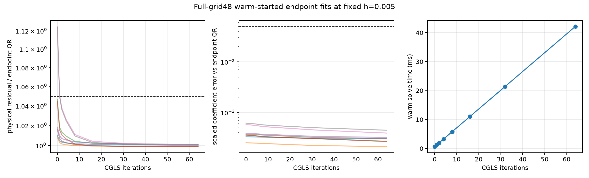

### 复用中心 QR 的预条件方法

中心点对列缩放后的矩阵做

$$
B_0=A_0D_0^{-1}=Q_0R_0.
$$

端点使用自己的列缩放 $D_q$，但保留中心的 $R_0$。右预条件器写成

$$
P_q^{-1}=D_qD_0^{-1}R_0^{-1}.
$$

每次 PCGLS 迭代仍然使用端点的完整矩阵作用 $A_qv$ 和 $A_q^Tu$，所以端点的 $s_q$ 确实会变化；$R_0$ 只负责把中心附近的病态尺度拉平。中心 QR 只做一次，其因子在局部差分批次内摊销。

这个方法在矩阵层面明显成功：

| PCGLS 迭代数 | 求解 P50 | 最坏训练残差 / 端点 QR | 最大缩放系数误差 |
|---:|---:|---:|---:|
| 2 | 2.35 ms | 0.999993 | $1.21\times10^{-3}$ |
| 4 | 3.96 ms | 1.000015 | $2.56\times10^{-5}$ |
| 8 | 7.18 ms | 1.000036 | $1.12\times10^{-4}$ |
| 16 | 13.61 ms | 1.00121 | $8.79\times10^{-3}$ |

4 次迭代是明确的最佳停止点。继续迭代反而出现 FP32 半收敛：强方向已经收敛后，舍入误差逐渐污染弱方向；32 次以后会直接发散。因此该方法必须是定长少步迭代，不能设置一个很大的迭代上限等待残差自行停止。

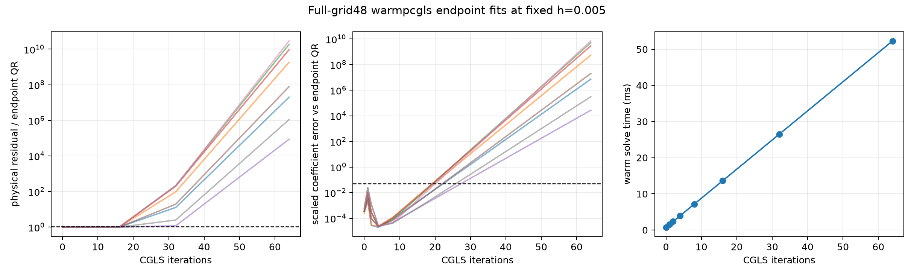

实现过程中还发现并修复过一个预条件顺序错误：最初版本在应用 $R_0^{-T}$ 之前就把原始 $A_q^Tr$ 复制成搜索方向，导致积分后的完整 score 变差。作业 `36500` 因此作废，不作为任何数值证据；本文所有 PCGLS 结果都来自修正后的实现。

### 四方向结果为什么不能当结论

修正后先用 4 个坐标方向烟测。PCGLS2 的总分梯度余弦达到 $0.916$，四个方向符号全部正确，看起来很好；PCGLS4 反而只有 $0.479$。这再次说明四方向样本方差太大，无法选择算法或停止点。

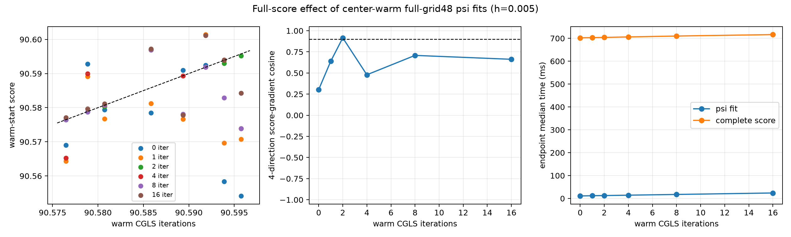

所以最终判断只采用下面的完整 300 维结果。

### 固定 $h=0.005$ 的完整 300 维结果

| 方法 | 总分梯度余弦 | 范数比 | 符号一致率 | 梯度相对误差 | 端点 score RMSE | 最大端点误差 |
|---|---:|---:|---:|---:|---:|---:|
| PCGLS2 | 0.640 | 0.929 | 74.0% | 0.821 | 0.0108 | 0.0800 |
| PCGLS4 | **0.724** | **0.972** | **74.7%** | **0.733** | **0.00853** | **0.0223** |

PCGLS4 明显优于之前的降采样代理，但仍没有达到可替代正式 score 全维差分的精度。尤其是 $0.733$ 的相对梯度误差意味着“范数碰巧接近”不能掩盖方向中仍有很大的正交误差。

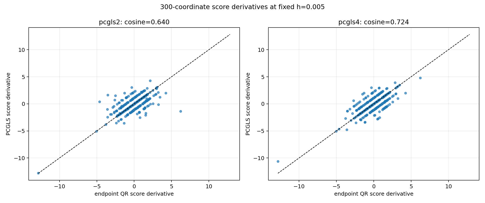

分量拆开后，问题定位得很明确：

| 分量 | PCGLS2 余弦 | PCGLS4 余弦 | PCGLS4 范数比 | PCGLS4 相对误差 |
|---|---:|---:|---:|---:|
| axis | 1.000 | 1.000 | 1.000 | 0 |
| $\psi$ | 0.767 | 0.958 | 1.003 | 0.292 |
| surface | 0.662 | 1.000 | 1.000 | $1.63\times10^{-4}$ |
| coordinate | 0.094 | **0.099** | 1.023 | **1.358** |
| volume QS | 0.966 | 0.998 | 1.000 | 0.0606 |
| iota | 饱和，梯度为零 | 饱和，梯度为零 | - | - |
| coil | 1.000 | 1.000 | 1.000 | 0 |

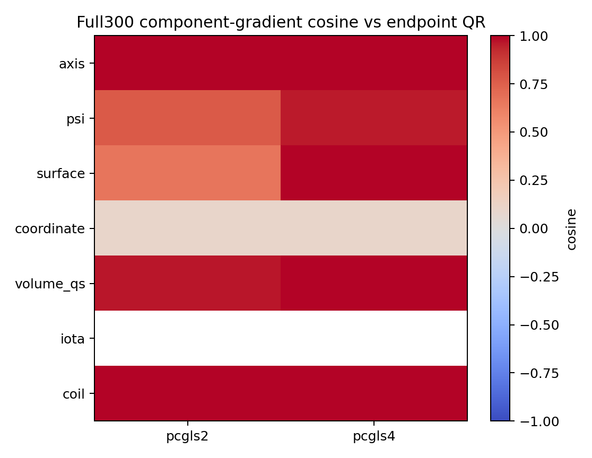

$\psi$、surface 和体 QS 都已经恢复得很好，真正未通过的是 coordinate。该分量不仅看 $\alpha$ 的整体拟合残差，还混合了磁通截面一致性、边界残差和 $\boldsymbol B\cdot\nabla\alpha$ 的归一化残差。端点 score 的绝对误差只有百分之几分，但中心差分使用的分母是 $2h=0.01$；正负端点间很小且不相关的偏差会被放大成明显的导数误差。PCGLS4 的 coordinate 梯度范数与 QR 几乎一样，却近乎正交，这正是总分余弦停在 $0.724$ 的主要原因。

这不是磁轴分支切换造成的：axis 分量逐端点完全一致，全部端点也通过严格 continuation。它也不是固定 $s$ 或固定磁面造成的，因为两者均随端点重算。

### 实际提速和上限

单端点中位时间为：

| 路径 | $s/\psi$ 阶段 P50 | 完整 score P50 |
|---|---:|---:|
| 端点 QR | 66.62 ms | 745.06 ms |
| PCGLS2 | 12.74 ms | 688.67 ms |
| PCGLS4 | 14.33 ms | 691.70 ms |

PCGLS4 对 $s/\psi$ 阶段是

$$
\frac{66.62}{14.33}=4.65
$$

倍加速，但完整 score 只有

$$
\frac{745.06}{691.70}=1.077
$$

倍。即便把整个 $s/\psi$ 阶段降到零，保持其它阶段不变，理论上限也只有

$$
\frac{745.06}{745.06-66.62}=1.098.
$$

因此“复用中心 $s$ 解、去掉每端点 QR”已经被证明是一个真实但局部的优化，**它不是把 600 端点全维差分从分钟级压到秒级的主杠杆**。要达到那个目标，还必须把端点之间目前串行的磁轴 continuation、场计算、$\alpha/\iota$ 和体 QS 真正改成 query-batch GPU 路径；但在总分梯度质量尚未通过前，不值得先投入这项较大的工程改造。

### 本轮最终判断

1. 上一节提出的核心遗漏已经补测：完整 grid-48、中心解热启动、端点动态磁轴和动态 $s_q$ 均已实现并验证。
2. 中心 QR 预条件的 4 步 PCGLS 是矩阵层面的成功算法，可在局部批次中复用；无预条件 CGLS 和长迭代 PCGLS 均不推荐。
3. 作为正式总 score 的全维差分近似，PCGLS4 仍未通过，主要障碍是 coordinate 导数，而不是 $\psi$、surface 或体 QS。
4. 单独替换这一个 QR 的端到端收益只有约 7.7%，不足以支持修改生产主线。
5. 生产 ABI、默认 grid-48 QR、正式 score 和两方向 SPSA-Adam 全部保持不变。实验实现保留在 `codex/direct-alpha-fast-score`，原始数据与图位于 `reports/assets/local_psi_warm_start_20260811/`。

## coordinate 分量能否忽略

先给直接结论：

- **不能把 coordinate 从生产 score 中删除。** 它在跨样本筛选时并未饱和，而且确实排斥磁通标定或直场线坐标质量差的样本。
- **warm 并没有把 coordinate 算成异常低分。** PCGLS4 与端点 QR 的 coordinate 数值都在约 89.4 分，点值非常接近。
- **可以在 warm 全维差分代理中忽略 coordinate 的端点导数。** 去掉它后，PCGLS4 与“同样去掉 coordinate 的端点 QR”之间的 300 维梯度余弦达到 $0.99990$。正式中心和提议中心仍应使用包含 coordinate 的完整 score 验收，所以这不等于修改最终优化目标。

### coordinate 实际在检查什么

它不是 QS error，也不声称已经得到精确 Boozer 坐标。它检查的是：后续体 QS 所依赖的 $\psi$ 与 $\alpha/\iota$ 是否可信。

当前实现为

$$
C_{\rm coordinate}
=0.35C_{\rm flux}+0.35C_{B_n}+0.20C_\alpha+0.10.
$$

各项含义为：

- $C_{\rm flux}$：不同环向截面的磁通一致性，以及磁通边界拟合残差；
- $C_{B_n}$：磁场相对拟合 $s$ 磁面的法向分量，即由 $\boldsymbol B\cdot\nabla s$ 构造的归一化残差；代码字段名虽然是 `alpha_normal_B_relative_l2`，实际计算发生在 $\alpha$ 矩阵组装前；
- $C_\alpha$：$\alpha/\iota$ 联合线性最小二乘的相对残差；
- 最后的 $0.10$ 是成功到达 $\alpha$ 阶段后的固定保底项，不是另一次求解。

其中

$$
C_{\rm flux}
=0.75q\!\left(\sigma_\Phi;0.01\right)
+0.25q\!\left(r_{\Phi,\partial};2\times10^{-6}\right),
$$

$$
C_{B_n}=q\!\left(r_{B_n};10^{-4}\right),
\qquad
C_\alpha=q\!\left(r_\alpha;0.25\right),
$$

且这里使用的软降分函数为

$$
q(r;s)=\frac{1}{1+r/s}.
$$

如果流程未到达 $\alpha$ 阶段，coordinate 不是继续使用上述公式，而是退化为 8 分的缺失值。因此它也承担“不能拿一个没有可靠坐标的样本去解释体 QS”的屏障作用。

### 它在正常样本中并未普遍饱和

使用当前 cubic-iota 标定集中的 69 个独立 QUASR 样本，每个样本只保留第一次重复，coordinate 分布为：

| 样本范围 | 数量 | 最小值 | P10 | P50 | P90 | 最大值 |
|---|---:|---:|---:|---:|---:|---:|
| 全部 `ok` 样本 | 69 | 60.26 | 71.03 | 82.48 | 89.84 | 90.63 |
| 总分 $\ge80$ | 39 | 69.54 | 76.08 | 88.09 | 89.91 | 90.63 |
| 总分 $\ge85$ | 26 | 75.39 | 80.85 | 88.78 | 89.98 | 90.63 |

coordinate 与总分的 Pearson 相关系数为 $0.485$。它不是唯一主导项，但也不是“所有正常样本都接近 100 分”的常数。按当前 10% 权重，一个 60 分和一个 90 分的 coordinate 会直接造成约 3 分的总分差异；全局删除会打开真实的作弊空间。

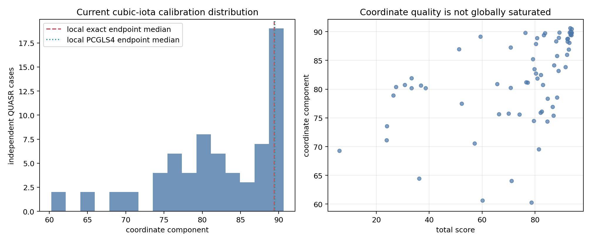

当前 step120 中心附近已经属于 coordinate 较好的区域。600 个端点的分布为：

| 求解器 | P05 | P50 | P95 | 相对端点 QR 的 RMSE | 最大绝对误差 |
|---|---:|---:|---:|---:|---:|
| 端点 QR | 89.366 | 89.416 | 89.513 | - | - |
| PCGLS4 | 89.365 | 89.476 | 89.515 | 0.0853 | 0.2228 |

所以“warm 把这一项打成不正常的低分”并没有发生。PCGLS4 的中位数甚至略高于 QR。问题只在于：有限差分除以 $2h=0.01$ 后，约 $0.1$ 分的端点误差足以形成约 10 的导数误差。

### 它对当前局部梯度并不小

在 $h=0.005$ 的 300 维端点 QR 结果中：

$$
\|g_{\rm full}\|_2=28.996,
$$

而 coordinate 按 10% 权重进入总分后的梯度贡献范数为

$$
\|g_{\rm coordinate}\|_2=15.643,
$$

即总梯度范数的 54%。去掉 coordinate 后的正式梯度与完整正式梯度之间为

$$
\cos(g_{\rm full},g_{\rm no\ coordinate})=0.8439,
$$

相对差为 $0.537$。因此不能用“权重只有 10%”推出“梯度贡献可以忽略”；一个分量的数值变化快时，小权重仍然可能产生大梯度。

另一方面，这个 coordinate 导数本身高度依赖有限差分尺度。此前同一中心的端点 QR 在 $h=0.005$ 和 $h=0.01$ 下，coordinate 梯度余弦只有 $0.056$。这不能证明其中一套一定错误，因为不同步长定义的是不同尺度的响应；但它说明 coordinate 不是当前邻域中稳定的线性局部量，不适合要求 warm 迭代器以 $10^{-4}$ 级端点精度恢复其完整 300 维导数。

### 消融后的结果

下表区分了“完整目标”和“双方都去掉 coordinate 的匹配目标”：

| warm 方法 | 对完整端点 QR 的余弦 | 去 coordinate 后对匹配 QR 目标的余弦 | 去 coordinate 后范数比 | 去 coordinate 后相对误差 |
|---|---:|---:|---:|---:|
| PCGLS2 | 0.640 | 0.9333 | 0.9578 | 0.3599 |
| PCGLS4 | 0.724 | **0.99990** | **0.9978** | **0.0143** |

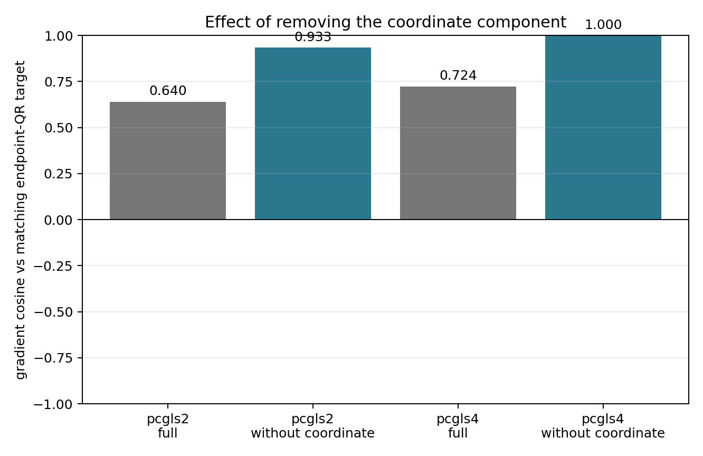

这说明上一节的 PCGLS4 并不是整体失败：除 coordinate 外，它已经几乎精确恢复了端点 QR 的差分方向。PCGLS4 去掉 coordinate 后与**原完整**正式梯度的余弦仍有 $0.8430$；这与正式 score 自己去掉 coordinate 后的 $0.8439$ 基本相同。剩余差距来自有意忽略 coordinate，而不是 warm 的其它误差。

### 应该怎样使用这个结论

合理方案不是改生产权重，而是把“评分”和“产生更新方向”分开：

1. 中心点仍运行当前完整正式 score，保留 coordinate 及其 10% 权重。
2. 600 个 warm 端点构造全维方向时，把 coordinate 固定为中心值，等价于不使用它的端点差商；其它六个分量照常变化。
3. 提议的新中心再次运行完整正式 score。只有包括 coordinate 在内的总分改善且全部物理门控通过，才接受更新。
4. 若 coordinate 低于中心太多或跌破预设软阈值，直接拒绝并缩小信赖半径。这样即使代理方向暂时不优化 coordinate，也不能通过牺牲坐标可信度作弊。

在当前高分、QH 门控饱和为 1 的邻域里，“固定 coordinate 为中心值”和“把 coordinate 权重临时设为 0 后重新归一化”只相差一个正常数，不改变方向。前者更容易解释：**coordinate 仍属于正式目标，只是不相信它由 warm 端点给出的微分。**

这项消融本身不减少计算时间，因为体 QS 仍需要拟合 $\alpha/\iota$；它解决的是方向精度，不是吞吐瓶颈。是否值得继续实现真正的 600-query CUDA batch，应通过一轮使用上述代理方向、正式 score 验收的短程优化来决定。

## 固定梯度目标与当前耗时

后续这条全维差分探索固定采用以下规则：

$$
S_{\rm grad}
=G\frac{\sum_{k\ne {\rm coordinate}}w_k C_k}
{\sum_{k\ne {\rm coordinate}}w_k},
$$

其中 $G$ 是正式 score 原有的乘性门控。coordinate 不参与端点差商，但正式中心分数和提议点验收仍使用包含 coordinate 的完整 $S_{\rm formal}$。实现已集中到 `scripts/score_gradient_proxy.py`；端点评估记录同时保存 `score` 与 `gradient_proxy_score`，避免以后把代理方向误当成正式分数。

这里的“不考虑 coordinate”只改变最后的标量组合，**不会减少端点评分耗时**。$\alpha/\iota$ 和体 QS 仍必须计算；磁通、$\boldsymbol B\cdot\nabla s$ 等诊断也大多已经由其它正式阶段产生。

### 一轮 300 维梯度现在需要多久

一轮中心差分包含 300 个方向、600 个端点。作业 `36505` 不是一轮梯度计时：它连续计算了端点 QR、PCGLS2 和 PCGLS4 三套梯度，共 1800 次端点评分，因此四个分片的总墙钟为 $317.9$--$329.7\ \mathrm{s}$。

固定采用 PCGLS4 后，各卡 150 个端点的端点评分累计时间为：

| GPU 分片 | PCGLS4 端点累计时间 |
|---:|---:|
| 0 | 106.52 s |
| 1 | 104.22 s |
| 2 | 103.12 s |
| 3 | 102.51 s |

全局墙钟由最慢卡决定。再加每卡一次中心 score/QR 捕获和少量调度开销，**当前 4 卡的一轮 PCGLS4 全维梯度评分约为 107--108 秒**。flow 曾一次性解码 1201 个 RK4-128 样本用时 $5.13\ \mathrm{s}$；固定单一 $h$ 后只需中心加 600 端点，因此保守计入约 3--5 秒。当前端到端应按

$$
T_{300\rm D}\approx110\text{--}113\ \mathrm{s}
$$

理解，即约 1.8--1.9 分钟。这是由同一作业的逐端点计时推得的当前值；尚未单独提交“只跑 PCGLS4”的隔离计时作业。

### 当前并行度

- 申请 4 张 RTX 5090，启动 4 个独立进程，每个进程绑定一张卡。
- 按方向编号取模分片，每卡 75 个方向、150 个端点；同一方向的正负端点留在同一张卡。
- **端点级有效并行度只有 4。** 每张卡内部的 150 个 query 仍在 C++ `for` 循环里串行调用完整 score。
- 单个 score 内部的场计算、矩阵构建、QR 和归约使用单卡 CUDA 数据并行；这不等于 150 个候选之间实现了 GPU batch。
- flow 对全部端点做一次批量解码，吞吐已经足够，约占总墙钟的 3%--5%。瓶颈仍是 600 个 score query 没有合并成 query 维度的 CUDA batch。

因此目前不是“600 路 GPU 并行”，而是“4 卡各自串行 150 个端点”。若后续实施真正的 query-batch CUDA，首先要优化的是磁轴 continuation、场计算、$\alpha/\iota$ 和体 QS 的候选维批处理；coordinate 消融只解决方向可靠性，不提供这部分加速。

## 单卡 600-query 全链路批量化方案

本节按新的明确目标讨论：**只使用一张 RTX 5090，一次接收全部 600 个差分端点，并让每个大耗时阶段都把 query 维度放进 CUDA 网格。** 这里的“600 个点”指 600 个线圈端点，不是每个位形内部的物理采样点。

### 什么才算真正实现了 600-query batch

合格的接口应当类似

```text
center cache + endpoint[600, n_coils, 100]
    -> proxy_score[600]
```

并满足：

- Python 只调用一次，C++ 也不允许写 `for (query=0; query<600; ++query) score(query)`；
- CUDA kernel 的网格至少包含 `(query, physical_point)` 或 `(query, trajectory)` 两个维度；
- PCGLS 的 4 次迭代仍然具有顺序，但每一次迭代都同时推进 600 个 query；
- 轴和磁面追踪的时间步仍然具有顺序，但每个时间步同时推进全部 query 和全部轨道；
- 候选失败只修改 `active[query]` 掩码，不触发单独 fallback、重新搜索或 CPU 路径；
- 正负端点使用相同 kernel、相同物理点顺序和相同归约树，尽量让数值误差在中心差分中抵消。

GPU 的线程块必然分波次执行，不可能让全部线程在同一个时钟周期驻留。这里要求的是**一个逻辑 batch、一个设备任务图、没有逐 query 主机循环**，而不是不符合硬件含义的“所有运算物理同时发生”。

### 总体数据流

建议建立一个只对当前中心有效的 `GradientBatchContext`：

```text
正式中心 score
  -> 中心磁轴与严格分支
  -> 中心 s/psi 系数与 QR 预条件器
  -> 中心磁面 level s0、射线拓扑和体点模板
  -> 中心 alpha/iota 系数与 QR 预条件器

600 latent endpoints
  -> batch flow decode
  -> batch coils/field representation
  -> batch strict-axis continuation
  -> batch full-density s/psi PCGLS4
  -> batch psi validation
  -> batch surface roots/trace at fixed center level s0
  -> batch flux calibration and volume points
  -> batch alpha/iota PCGLS4
  -> batch B, grad(B), volume-QS reductions
  -> coordinate-omitted proxy score[600]
  -> 300-D centered gradient
```

任何一次正式中心更新都会使这个 cache 失效。新中心必须先运行一次完整正式 score，再构建下一轮 cache；不能跨中心复用旧磁轴、旧 QR 或旧体点。

### 各阶段的并行性

| 阶段 | 600-query 实现 | 可并行性 | 主要风险 |
|---|---|---|---|
| Flow RK4-128 | 输入直接使用 `[600,n_coils,100]`，一次前向解码 | 已经是成熟的 batch；token 数很小，主要沿 batch 并行 | 当前约 3--5 s，可能成为批量 score 完成后的最大单项 |
| 线圈离散化与工程量 | 一次 kernel 生成 `[query,coil,segment]`，长度、曲率和距离做 segmented reduction | 高；不同 query 和线圈完全独立 | 当前工程量部分仍含 CPU 实现，必须迁到 CUDA，不能只批量 field creation |
| 场数据结构 | 用一组 SoA 数组保存 600 组线段和电流，不创建 600 个独立 field 对象 | 高；后续所有场 kernel 共用该布局 | 需要修改底层场接口，避免每次 `sgpu_create_field` 的分配和同步 |
| 严格磁轴 continuation | 所有 query 从中心轴提示出发，批量执行映射、Newton 修正和拓扑轨道；固定最大轮数并用 active mask | 中高；轨道之间独立，积分步内顺序但 query/轨道维度充分并行 | 不得切换磁轴分支；任一端点越过 hint 距离或失败时标记无效，不运行全局搜索和 FP64 fallback |
| $s/\psi$ 点与 PCGLS4 | full grid-48 行不变；矩阵自由计算 $A_qv$ 和 $A_q^Tr$，中心 $R_0$ 作为共享预条件器，600 列一起 TRSM | 高，但不能显式存 600 个稠密矩阵 | basis 生成和转置归约需要专门 kernel；必须复现当前动态 $s_q$，不能固定 $s$ 系数 |
| $\psi$ 独立验证 | 固定同一组验证点，批量计算 $\boldsymbol B\cdot\nabla\psi$ 并做每-query reduction | 高 | 不能因为 coordinate 被忽略就删掉 psi 分量需要的验证 |
| 磁面根与 surface | 固定中心选出的标量 level $s_0$，但用每个 query 的 $s_q$ 重新求射线根并追踪该面 | 中高；射线和 query 独立，根迭代/轨迹时间步顺序 | 只能固定 level 和拓扑，不能固定几何磁面；根越序或漂移过大直接使该端点无效 |
| 磁通标定 | 固定截面和求积拓扑，600 组场值一起计算；每 query 的低阶多项式拟合用 batched 小矩阵或显式闭式解 | 高 | 不能冻结磁通尺度，否则电流和几何扰动会污染 QS 尺度 |
| 体点生成 | 根据各 query 的移动后射线根生成 `[query,point]`，无需逐 query 分配 | 高 | 点数很大，必须预分配并避免重复坐标变换 |
| $\alpha/\iota$ PCGLS4 | 与 $s$ 相同：矩阵自由 $A_qv/A_q^Tr$，共享中心 QR 预条件器，系数和 RHS 使用多右端项布局 | 高 | coordinate 导数虽删除，$\alpha/\iota$ 解仍是体 QS 的必要输入，不能跳过 |
| $\boldsymbol B+\nabla\boldsymbol B$ 与体 QS | CUDA 网格覆盖 `(query,volume_point)`；场、QS 表达式和 partial reduction 尽量融合 | 很高，但计算量最大 | 不能为 600 组保存所有中间张量后再处理；应流式归约，预计成为 score batch 的主要算术瓶颈 |
| 分量和门控 | 每 query 一个小 reduction，最后组合不含 coordinate 的 `gradient_proxy_score` | 极高且可忽略 | 正式中心/提议验收仍必须包含 coordinate |

磁轴、PCGLS 和轨迹积分并不是“完全没有串行部分”：Newton 轮次、Krylov 轮次和积分时间步之间存在数据依赖。关键是每个顺序步骤都同时处理 600 个 query，从而把目前单候选严重不足的 GPU 占用率填满。

### 两个最小二乘不能使用 600 份稠密矩阵

当前 grid-48 的 $s$ 问题约有 82176 个物理行和 1574 列。若把 600 个 FP32 矩阵全部显式保存，容量约为

$$
82176\times1574\times600\times4\ \mathrm{bytes}
\approx310\ \mathrm{GB}.
$$

$\alpha/\iota$ 问题约为 $32272\times2272$，同样做法约需

$$
32272\times2272\times600\times4\ \mathrm{bytes}
\approx176\ \mathrm{GB}.
$$

因此“调用 600 次 batched dense QR”在 32 GB 显存上不可行，计算量也没有必要。可行结构是：

1. 中心只做一次 Householder QR，保留小得多的 $R_0$；
2. 端点的 basis 行在矩阵自由 kernel 中按需生成；
3. 600 组残差可以整体保存：$s$ 约 197 MB，$\alpha$ 约 77 MB；
4. 600 组系数只需数 MB；
5. 每次 PCGLS 的多右端项三角求解使用一个共享 $R_0$ 和 600 列 RHS，而不是 600 次独立 TRSM。

也就是说，query 维度必须进入 $A_qv$、$A_q^Tr$ 和 reduction kernel；仅把 600 个 RHS 交给 cuBLAS、而矩阵作用仍在 C++ 中逐 query 循环，不算完成。

### 体点阶段如何在 32 GB 内保持 600-query 并行

正式体 QS 若每个端点使用 10 万点，共有 6000 万个 query-point。单独保存坐标仍可接受，但若同时长期保存 $\boldsymbol B$ 的 3 个分量和 $\nabla\boldsymbol B$ 的 9 个分量，仅这部分就约为

$$
600\times100000\times12\times4
=2.88\ \mathrm{GB}.
$$

它没有超过 32 GB，但继续叠加 basis、轨迹和求解临时量会带来不必要的显存流量。更合理的是：

- kernel 网格始终覆盖全部 600 个 query；
- 物理点按固定 tile 处理，GPU 调度线程块时自然分波次；
- 场和场梯度计算后立即形成 $\alpha$ 方程作用或 QS partial sum；
- 只保留每个 query 的系数、残差和少量 partial reduction，不落盘完整中间场张量；
- 正负端点的 tile 顺序固定，保证差分可重复。

这种“空间点流式、query 维度完整”满足单次 600-query batch；它不同于在主机端把 query 切成 600 个调用。

### surface 阶段应有两个模式

为了不把算法近似和并行实现错误混在一起，开发时保留两个模式：

1. **等价性模式：** 对 600 个 query 同时评估当前全部候选 level 和一周期轨迹，目标是与逐端点当前代码数值一致。它较慢，但用于证明 batch kernel 没写错。
2. **局部梯度模式：** 只固定中心已经选中的标量 $s_0$，每个端点仍用自己的 $s_q$ 重新求根、移动面并计算漂移和尺寸。它删除离散选面和多 level 成本，同时不会犯“固定整个磁面”的旧错误。

局部梯度模式的提议点仍由完整正式 score 重新选面和验收。若固定 $s_0$ 后的梯度与等价性模式明显不同，应缩小差分步长或回到多 level batch，不能把差异归因于 CUDA 精度。

### 预期时间与加速幅度

当前 PCGLS4 端点 P50 为 $0.692\ \mathrm{s}$。单卡逐个执行 600 个端点约为

$$
600\times0.692\approx415\ \mathrm{s},
$$

再加 flow 后约 7 分钟。$s/\psi$ 只占每端点约 14 ms，因此仅批量 PCGLS 而保留其它阶段逐 query 调用，不可能得到大提速。

对真正单卡 batch，建议使用分级目标，而不是预先承诺一个过于乐观的数字：

| 版本 | 600-query score batch，不含 flow | 加 RK4-128 flow 后 | 相对当前单卡逐端点评分 |
|---|---:|---:|---:|
| 首个正确版本 | 12--20 s | 15--25 s | 约 17--28 倍 |
| 完成 kernel 融合和固定-$s_0$ 后 | 5--10 s | 8--15 s | 约 28--52 倍 |
| 激进目标 | 3--5 s | 6--10 s | 约 42--69 倍 |

这些是工程预算，不是已经测得的结果。预期最终瓶颈将从 QR 变成两类：

1. flow 的 RK4-128 推理；
2. 轴/磁面轨迹和体点上的 Biot--Savart $\boldsymbol B+\nabla\boldsymbol B$。

QR 在新结构中只对中心执行一次；端点侧是固定 4 步矩阵自由 PCGLS 和共享预条件器，不应继续占据主要墙钟。忽略 coordinate 也只减少少量 residual 归约，不会改变上述时间主项。

### 正确性验收必须分两层

**第一层验证批量实现本身。** 对同一批端点，比较“逐 query 串行运行同一算法”和“单次 600-query batch”：

- 每个端点的状态和磁轴分支必须相同；
- $s/\psi$、$\alpha/\iota$ 系数与物理 residual 必须在 FP32 可解释范围内；
- coordinate-omitted 300 维梯度余弦目标应至少为 $0.999$；
- batch 不得出现候选数相关的数值漂移或长尾 fallback。

**第二层验证局部代理目标。** 再与当前端点 QR 的 coordinate-omitted 正式参考比较。现有 PCGLS4 已达到 $0.99990$，因此真正 batch 不应以“代理本来就不精确”为理由接受明显更低的结果。固定 $s_0$ 等进一步近似要单独消融，并在多个优化阶段中心上验证方向；不能只看一个高分中心。

### 推荐实现顺序

1. 先写统一的 `[query,...]` field 数据布局和 batch Biot--Savart benchmark；这是轴、验证、磁面和 QS 的共同底座。
2. 把严格 axis-hint continuation 改成单次 batch，保留当前分支门控，不做近似轴公式。
3. 实现 full-density $s/\psi$ matrix-free PCGLS4 和共享 $R_0$ 多 RHS 预条件。
4. 实现等价性 surface batch，确认数值一致后再加固定-$s_0$ 快速模式。
5. 批量磁通、体点、$\alpha/\iota$ PCGLS4 和融合 QS reduction。
6. 最后用 CUDA Graph 或 persistent kernels 合并固定迭代和轨迹 kernel，减少 RK4/追踪中的 launch 开销。
7. 达到数值门槛后，再接一轮“全维梯度产生方向、完整正式 score 验收”的短程优化；在此之前不改生产优化器。

这条路线的最大风险不是算法无法并行，而是工程量：现有 field、追踪和 score 接口都以单 query 对象为边界，需要把底层数据布局改为 query-first。物理上各端点彼此独立，除共享中心预条件器外没有跨 query 依赖，因此不存在阻止 600-query 单卡批量化的理论障碍。

## 单卡 600 端点批量梯度：实现与实测结果

上一节描述的方案已经实现。新增的实验接口不是在 Python 中循环调用 600 次 score，而是把 600 组线圈作为一个 query-first 数据集交给 C++/CUDA：磁场、磁轴续接、$s/\psi$、固定标量面标签 $s_0$ 下的动态磁面、磁通标定、$\alpha/\iota$ 和体 QS 都在 query 维度上批量执行。两个大最小二乘不再做 600 次 QR；中心只生成一次 QR 预条件器，端点采用完整点密度、固定 4 步的矩阵自由 PCGLS。

这里仍然严格区分两个目标：

- **梯度代理：** 每个端点都有自己的磁轴、$s_q$、$\psi_q$、磁面几何、$\alpha_q/\iota_q$ 和 QS；只固定中心选出的标量面标签 $s_0$，并按此前结论忽略 coordinate 和离散“重新选最大磁面”两个分量的导数。
- **正式目标：** 每次 Adam 更新后的中心仍运行完整 native score，重新选择磁面并包含 coordinate；磁轴只能从上一个正式中心严格续接。代理不能自行接受一个中心。

因此这不是把磁面或 $s$ 的表达式冻结。固定的是“在中心上选中了哪个 $s_0$”，而每个端点对应的物理面仍随线圈变化。

### 梯度精度

P107 job `36533` 在一张空闲 RTX 5090 上一次处理 600 个端点，即 300 维潜变量的全部中心差分。每个端点使用 grid-48 的 $s/\psi$ 拟合、完整 10 万体点、三次 $\iota(\psi/\psi_{\rm edge})$ 和 QH 目标。结果为：

- 600/600 个端点状态为 `ok`；
- 磁轴续接残差 P50/P95/max 为 $4.20\times10^{-9}$、$1.45\times10^{-8}$、$8.39\times10^{-8}$；
- 四个抽查 query 的 batch 磁场相对 RMS 误差为 $6.35\times10^{-8}$ 至 $2.21\times10^{-7}$，轨迹和磁轴样本与单 query 路径一致；
- PCGLS4 的 $\psi$ 训练残差相对逐 query QR 的比例为 $0.999992$ 至 $1.000025$；
- 相对于**同一个固定-$s_0$ 梯度目标**，300 维方向余弦为 **0.992846**。

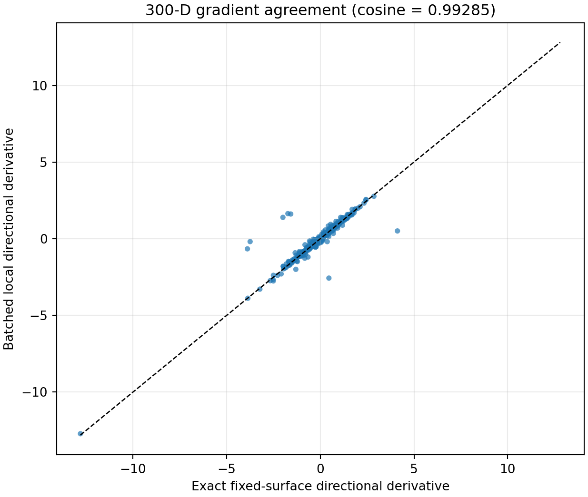

若拿它和“每个端点重新离散选择最大磁面”的另一个目标比较，余弦只有 0.916711。这个数字不是 CUDA 误差：两边目标函数本来不同。离散选面在局部差分里会产生跳变，本实验正是有意固定中心的 $s_0$，再由更新后的正式中心重新选面验收。

### 时间

最终局部配置在 64 个面角点上运行；正式中心仍使用 128 点。64 点正是上述 0.992846 精度验收使用的配置。将局部配置误设为 128 点不会改变三步短跑的梯度和 score，但会让 surface 阶段从约 2.42 秒增至 4.85 秒，因此已拆成两个独立参数。

稳定态一轮 300 维梯度的主要时间如下：

| 阶段 | 600 端点墙钟 |
|---|---:|
| RK4-128 flow 批量解码 | 1.99--2.06 s |
| 中心正式 score/QR 捕获 | 0.51--0.53 s |
| 600 磁轴严格续接与轴采样 | 1.11 s |
| grid-48 $s/\psi$ PCGLS4 | 1.33 s |
| 固定-$s_0$ 面、磁通、体点、$\alpha/\iota$、QS | 7.83--7.87 s |
| 更新后正式中心的 flow 解码与 score | 2.03 s |
| **完整 Adam 单步** | **14.91--14.99 s** |

其中局部 score 内部的 7.85 秒又可分为：surface 2.42 秒、磁通 2.52 秒、体点 0.84 秒、$\alpha/\iota$ 1.84 秒、QS 0.22 秒。瓶颈已经不再是 QR，而是动态磁面和磁通所需的轨迹/场计算。

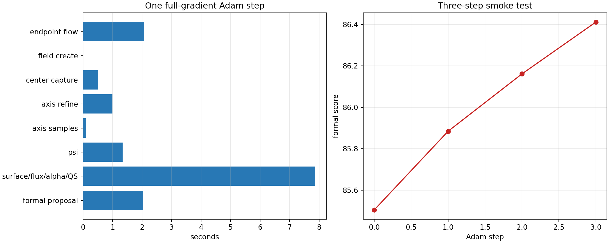

旧的四卡实现是每卡串行处理 150 个端点，一轮约 107--108 秒；新实现用一张 score GPU 完成同一批端点，连同另一张卡上的 flow 和正式提议验收也只需约 14.95 秒。这个比较约为 7.2 倍端到端加速；若与单卡逐端点约 415 秒比较，局部 score 批量化本身约快 53 倍。

### Adam 短跑

实验入口为 `scripts/optimize_flow_prior_local_full_gradient_adam.py`，生产 SPSA 入口没有修改。使用历史 `start_10`、$h=0.005$、学习率 0.01、$\beta=(0.7,0.999)$、FP32 RK4-128：

| step | 正式 score | 梯度 RMS | 更新 RMS | 端点/中心状态 |
|---:|---:|---:|---:|---|
| 0 | 85.50454 | -- | -- | `ok` |
| 1 | 85.88441 | 1.2593 | 0.01000 | 600/600 `ok`，正式中心 `ok` |
| 2 | 86.16139 | 0.9688 | 0.00726 | 600/600 `ok`，正式中心 `ok` |
| 3 | 86.41151 | 1.0940 | 0.00629 | 600/600 `ok`，正式中心 `ok` |

三步均接受完整更新，没有回退、无效端点或磁轴分支切换。这个结果只证明新方向可以稳定启动，不能代替长程摸高。长任务 job `36541` 已从同一个原始起点和零 Adam 动量启动，最多 2000 步，内部墙钟上限 27300 秒；最终效果需等待作业完成后验收。

机器可读证据位于 `reports/assets/local_query_batch_gradient_20260812/`。实验 score 库 SHA-256 为 `7834a88d5437ba9910c78bb0eb5483efc71134579624ee2cc74100297a5799a3`；短跑前后两张 RTX 5090 均为 0% 利用率、2 MiB 显存占用，没有遗留进程。

## 长程优化验收：已有 1739 步全部有效

本节取代上一节末尾“job `36541` 仍在运行”的状态。收到“有多少验收多少、剩下的不跑”的要求时，任务已经在内部墙钟上限处自然结束，因此没有再启动、续跑或补算任何数值任务。实际完成 1739 步，未达到原定的 2000 步；以下结论只覆盖已经存在的 1739 步。

### 先看程序有没有稳定跑完

验收结论是：**已有数据完整，程序没有在中途悄悄失效。**

| 项目 | 结果 |
|---|---:|
| 停止原因 | `max_wall_s`，正常触发内部 27300 s 上限 |
| 完成 Adam 步数 | 1739 |
| 总墙钟 | 27289.59 s，即 7 h 34 min 49.6 s |
| 平均每步 | 15.352 s |
| 单步 P50 / P95 / 最大值 | 15.151 / 16.682 / 18.072 s |
| 迭代编号 | 从 1 到 1739 连续，无缺口 |
| 局部梯度端点 | 每步 600/600 `ok`，共 1,043,400 个有效端点评分 |
| 更新后的正式中心 | 1739/1739 `ok` 且全部接受完整更新 |
| 回退、时间序列离群梯度或离群更新 | 均为 0 |
| stderr | 0 字节 |
| 任务结束后的两张 GPU | 均为 0% 利用率、2 MiB 显存占用 |

`history.jsonl`、`summary.json`、`best.json` 和 `state_latest.npz` 之间的步数、最佳分数与最佳步编号全部一致。换言之，本次没有“日志看似完成但最佳样本或恢复状态没有写全”的问题。

### 优化最终得到了什么

正式 native score 从 85.50454 提升到最佳值 **93.63042**，提升 8.12589 分；最佳值出现在第 1710 步。第 1739 步的当前值为 93.43038，低于历史最佳，因此最终候选应取 `best.json`，而不是最后一步状态。

最佳值不是单个毛刺：第 1689、1709、1710 步分别达到 93.60838、93.61792、93.63042；共有 378 个当前中心超过 93.5，最后 100 步当前 score 的中位数为 93.5480。末段仍在缓慢刷新最佳值，但按用户要求不再续跑。

| 正式 score 分量 | 起点 | 最佳点 | 变化 |
|---|---:|---:|---:|
| axis | 97.4246 | 95.2891 | -2.1355 |
| $\psi$ | 97.5504 | 99.3126 | +1.7622 |
| surface | 78.9410 | 81.8198 | +2.8788 |
| coordinate | 86.3642 | 90.1875 | +3.8234 |
| volume QS | 80.8751 | 98.7869 | +17.9118 |
| $\iota$ | 100.0000 | 100.0000 | 0 |
| coil | 68.8622 | 68.4879 | -0.3744 |

主要收益确实来自 QH，而不是退化成低旋转变换的大圆线圈：

- 体 QH residual 从 0.0438439 降到 0.00154270，降低 **28.42 倍**；
- 最佳点的 QA/QH/QP residual 分别为 0.113684、0.00154270、0.0284207，QH 明显最低；
- 最佳点的 $\iota$ 范围为 1.26483--1.40652，不是 $\iota\approx0$ 的作弊解；
- 一周期磁面相对漂移 P95 为 $3.336\times10^{-4}$；选中的面标签为 0.39450，反长宽比为 0.03206。

这些量说明 native score 内部的 QH、$\psi$、坐标和磁面诊断是共同改善的；axis 与 coil 分量略有退让，但没有抵消主要物理收益。

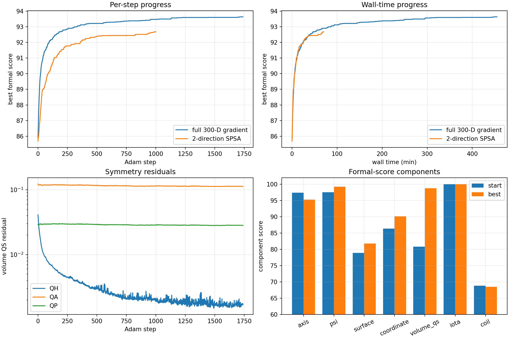

### 和当前两方向 SPSA 的比较

对照采用同一个 `start_10`、当前三次 $\iota$ 和连续磁面 score 下的 1000 步两方向中心差分 SPSA 结果。两个任务的初始正式分数只差约 0.011，但实验库并非逐位相同构建，所以这一对照适合判断实际优化趋势，不应被描述为严格的二进制复现。

| Adam 步数 | 全 300 维批量梯度最佳值 | 两方向 SPSA 最佳值 | 差值 |
|---:|---:|---:|---:|
| 50 | 91.1891 | 89.0546 | +2.1345 |
| 100 | 92.0712 | 90.1589 | +1.9124 |
| 200 | 92.7035 | 91.5279 | +1.1756 |
| 500 | 93.2119 | 92.3878 | +0.8241 |
| 1000 | 93.4712 | 92.6818 | +0.7894 |

全维梯度每步约 15.35 s，SPSA 每步约 4.06 s，因此只按“步数”比较不够。按墙钟时间比较：

- 约 14 分钟时全维梯度暂时低 0.145 分；
- 约 35 分钟时两者几乎相同，全维梯度低 0.024 分；
- 约 52.5 分钟时全维梯度高 0.262 分；
- 约 70 分钟时全维梯度高 0.220 分；
- 达到 92.5 分，全维梯度需要 40.3 分钟，SPSA 需要 57.8 分钟；
- 全维梯度在 86.9 分钟达到 93 分，并最终达到 93.6304；该 SPSA 对照的 1000 步没有达到 93 分。

因此结论不是“全维梯度每一步便宜”，而是：**它每步贵约 3.78 倍，但每一步的信息量明显更高；越进入高分区，时间到目标分数的优势越清楚。** 这证明单卡 600-query 批量化产生的全维方向具有实际优化价值，不只是方向余弦好看。

### 本次验收边界

本次验收通过的是“批量局部梯度 + 正式 native score 验收”的优化链路：稳定性、吞吐和摸高能力均成立。它尚未替代生产 SPSA 默认入口，也没有自动证明最佳线圈存在通过 Simsopt LS/Newton 和 DESC 的大磁面；后者属于完整物理评估，本轮按“剩下的不跑”没有追加。

机器可读汇总为 `reports/assets/local_query_batch_gradient_20260812/long_start10_36541/acceptance_summary.json`。关键 SHA-256 为：`best.json` 为 `9daff76f3c6145e4d0737f0f281dca810c3357d5020e204765f3d29f12606974`，`history.jsonl` 为 `3ff485720a7b410b0b8c20ccdd1ebc91d232a78503d08780fa1aa34d4a699c8a`，`state_latest.npz` 为 `1a6de6898753e847467d8a70da8dfa2ee9ecb2454c7ae8a308e3c0bfe1d02e95`。

## 有了批量差分之后，优化器还能怎样改进

本节回答三个具体问题：全维 Adam 能否增大学习率，BFGS 能否利用全维梯度更快收敛，以及是否能用 32 或 64 个随机方向代替 300 个坐标方向。所有实验都从同一个 `start_10` 潜变量或其已记录的全维 Adam 锚点出发，使用相同的 FP32 RK4-128 flow、$h=0.005$ 中心差分、三次 $\iota$、严格磁轴续接和正式 native score 验收。实验 score 库 SHA-256 仍为 `7834a88d5437ba9910c78bb0eb5483efc71134579624ee2cc74100297a5799a3`。

先给结论：

1. **全维 Adam 的原学习率 0.01 确实偏保守。** 100 步内，0.03 最快；但提高到 0.05 已经出现严重回撤，不能继续盲目增大。
2. **本次全维 BFGS 失败。** 代码的符号、曲率更新和磁轴续接均已复核，失败不是 `no_axis` 或实现全局反号，而是局部二次模型给出的方向长期不能提高正式 score。
3. **64 个随机正交方向是当前最有价值的改进。** 它把单步从约 15.35 s 降到 6.4--6.5 s；配合学习率 0.02，300 步达到 93.29798，约 33 分钟，优于本轮所有其它配置。
4. **32 个方向更快，但方差偏大。** 约 5.15 s/步，300 步达到 92.99537；它适合更便宜的前期搜索，但本次摸高不如 64 个方向。

这些结论目前来自一个固定起点和每种配置一个随机种子。它们足以筛掉 BFGS 和学习率 0.05，也足以把 `K=64, lr=0.02` 作为下一轮首选，但还不足以替换生产主线默认值。

### 随机方向梯度具体是什么

在 $d=300$ 维潜空间中，每一步随机生成 $K$ 个两两正交、且满足 $\|u_j\|_2=\sqrt d$ 的方向。梯度估计为

$$
\hat g_K = \frac{1}{K}\sum_{j=1}^{K}
\frac{S(x+h u_j)-S(x-h u_j)}{2h}u_j.
$$

这里的 $\sqrt d$ 归一化不是任意放缩：对随机正交子空间有 $\mathbb E[\hat g_K]=\nabla S$。因此 $K<d$ 时得到的是无偏但有方差的估计，而不是只优化某个固定低维子空间。每一步都会重新抽方向，所有 32/64 方向实验都维持了严格的中心差分。

### 先提高全维 Adam 学习率

第一组保持完整 300 维坐标梯度，每个学习率跑 100 步。每一步仍使用 600 个局部 score 端点，因此墙钟时间基本相同。

| 学习率 | 100 步最佳 score | 最佳步 | 到 92 的时间 | 到 92.5 的时间 | score 下降步比例 |
|---:|---:|---:|---:|---:|---:|
| 0.01 | 92.07125 | 97 | 24.41 min | 未达到 | 27% |
| 0.02 | 92.69609 | 98 | 10.50 min | 22.62 min | 30% |
| 0.03 | **92.82536** | 100 | **9.64 min** | **15.74 min** | 32% |
| 0.05 | 92.43414 | 75 | 11.43 min | 未达到 | 42% |

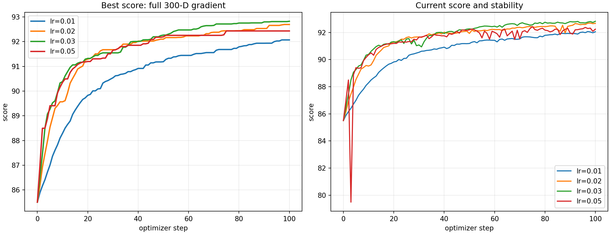

从图中可见，0.02 和 0.03 都明显快于 0.01；0.05 在最早几步发生一次很大的 score 下跌，后段波动也更大。这里的下降中心仍是有效样本，所以不是磁轴失败，而是 Adam 更新太激进。因而全维方法若继续使用，0.02--0.03 比 0.01 合理；0.05 不应作为默认值。

### 32/64 个方向能否用更短单步换来更快收敛

第二组把每步的差分端点从 600 减到 64 或 128。为了把学习率和方向数的影响拆开，先跑了 $K=32/64,\ \eta=0.01$，再用同一方向随机种子配对测试 $K=32,\ \eta=0.02$ 和 $K=64,\ \eta=0.02/0.03$。每条均跑 300 步。

| 梯度配置 | 学习率 | 端点/步 | 平均单步 | 300 步最佳 score | 最佳步 | 到 93 的时间 |
|---|---:|---:|---:|---:|---:|---:|
| 全 300 维 | 0.01 | 600 | 15.35 s | 92.93066 | 297 | 300 步内未达到 |
| $K=32$ | 0.01 | 64 | **5.09 s** | 92.76986 | 294 | 未达到 |
| $K=64$ | 0.01 | 128 | 6.42 s | 93.06438 | 273 | 27.10 min |
| $K=32$ | 0.02 | 64 | 5.15 s | 92.99537 | 300 | 未达到 |
| $K=64$ | 0.02 | 128 | 6.51 s | **93.29798** | 285 | **17.07 min** |
| $K=64$ | 0.03 | 128 | 6.40 s | 93.07501 | 231 | 24.55 min |

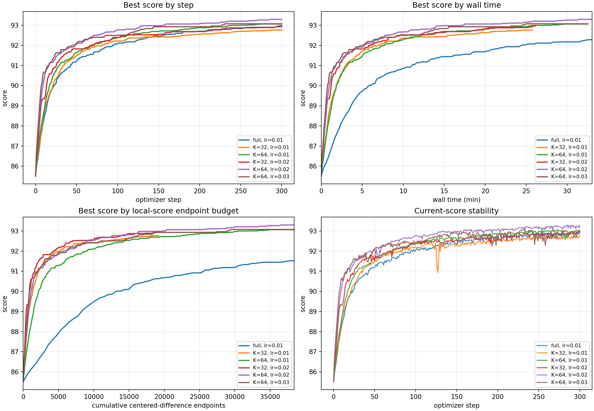

图的四个子图分别按步数、墙钟时间、局部差分端点数和当前 score 展示结果。这里有两个容易混淆的预算口径：

- 在共同墙钟 1500 s 处，`K=64, lr=0.02` 为 **93.15505**，全维 `lr=0.01` 只有 92.02821。
- 在共同 19200 个端点处，`K=32, lr=0.02` 为 92.99537，`K=64, lr=0.02` 为 92.98064，两者相近；全维方法只有 90.63189。

端点预算不能直接等同于时间预算。端点 batch 越大，GPU 吞吐越高；同时每一步都必须支付约 2 s 的中心 flow 解码与正式 score 验收固定成本。因此端点从 600 降到 128 后，端到端单步只缩短约 2.36 倍，而不是 4.69 倍。即便如此，64 方向仍在相同墙钟下显著领先。

`K=32` 与 `K=64` 的区别也很清楚。32 方向最便宜，在相同端点预算下甚至略占优；但其梯度方差更高，当前 score 波动更明显，300 步的上限低于 64 方向。学习率 0.03 又把这种波动放大，最终落后于 0.02。当前最合理的折中因此是 **64 个方向、学习率 0.02**。

### 为什么 BFGS 没有获得二阶优势

BFGS 使用完整 300 维中心差分梯度，在全维 Adam 的第 100 步和第 1250 步各取一个锚点，分别运行 40 轮。对最大化问题，代码等价于最小化 $-S$：曲率差使用 $y=g_{\rm old}-g_{\rm new}$，搜索方向使用 $H g$。单元测试覆盖了正定二次型、负曲率阻尼和磁轴提示继承；正式实验的每一步也都是 600/600 端点 `ok`。

实现审计确实发现并修过一处早期 smoke bug：如果一次新候选被拒绝，已经消费过的上一对 $(s,y)$ 会随其它候选状态一起回滚，下一轮可能被重复用于更新。正式实验前已经改为“曲率对只消费一次，拒绝新候选不撤销已经完成的 Hessian 更新”。同时，锚点 JSON 中记录的正式 native 结果现在会把磁轴作为严格续接提示传入，禁止 BFGS 从锚点重新做无提示分支选择。下表只使用这两个修复后的正式 run，旧 smoke 不参与结论。

| 锚点 | 初始 score | BFGS 最佳 | 提升 | 接受更新 | 正式候选调用 | 同墙钟原 Adam 提升 |
|---|---:|---:|---:|---:|---:|---:|
| 全维 Adam step 100 | 92.05463 | 92.10157 | +0.04694 | 3/40 | 155 | **+0.42295** |
| 全维 Adam step 1250 | 93.53169 | 93.56840 | +0.03672 | 2/40 | 159 | **+0.04696** |

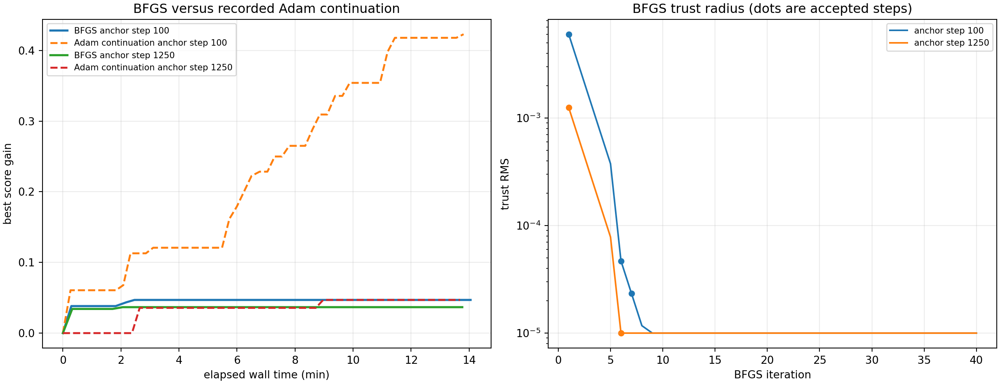

BFGS 在两个锚点上分别只有 7.5% 和 5% 的更新被正式 score 接受。由于每次失败会尝试 1、1/2、1/4、1/8 四个步长，平均单步反而增至 20.72 s 和 20.45 s。信赖半径很快压到下限 $10^{-5}$，逆 Hessian 条件数最高达到 $1.55\times10^6$ 和 $7.41\times10^5$，之后长期没有新进展。

这说明问题不是“BFGS 还没积累够曲率”。当前局部梯度故意忽略 coordinate 与离散最大磁面重选的导数，而正式中心 score 包含它们；再叠加有限差分噪声和不断变化的磁面几何，跨步累积的二次模型不够可信。Adam 只需要当前方向大体相关，BFGS 却依赖梯度差精确反映曲率，因此对这类目标更脆弱。继续单纯延长本版全维 BFGS 没有意义。

### 当前建议

- **实验分支首选：** `gradient-mode=random-orthogonal`、`K=64`、$h=0.005$、Adam $\eta=0.02$、$\beta_1=0.7$、$\beta_2=0.999$。
- **更便宜的前期筛选：** 可用 `K=32, lr=0.02`，但在接近 93 时切到 64 方向或全维梯度更稳妥。
- **不采用：** 学习率 0.05；当前全维 BFGS；把 32 方向的单步速度直接解释为摸高能力。
- **生产状态不变：** 原两方向中心差分 SPSA 仍是主线默认值。本节没有完成跨起点/跨随机种子的复验，也没有对 93.29798 样本做完整 Simsopt/DESC 评估，因此不在本轮替换生产配置或宣布新的物理最优。

机器可读汇总、完整历史和三张图位于 `reports/assets/local_gradient_optimizer_sweep_20260812/`。三条组合实验 Slurm job `36605/36606/36607` 均完整运行 300 步，所有中心和差分端点状态为 `ok`，stderr 为 0；六张分配到的 RTX 5090 在任务前后均为 0% 利用率、2 MiB 显存占用，未遗留优化进程。

## 单卡流水线的 200 步典型案例与完整物理评估

本节回答两个问题：能否把每步的 128 个差分端点和更新后中心的 flow 解码合并提速；只用一张 RTX 5090 跑 200 步后，得到的高分线圈是否通过独立磁面与 DESC 检查。

### 流水线到底做了什么

同一步内不能一开始就同时解码 128 个差分端点和更新后中心，因为中心更新依赖前者的 score。实现采用跨步流水线：第 $t$ 步正式中心通过后，立刻生成第 $t+1$ 步的 64 个正交方向，把新中心和对应 128 个正负端点组成一个 129 样本 batch，一次完成 FP32 RK4-128 flow 解码。下一步直接复用这 128 个端点，只评估本地 score、更新 Adam，再进入下一个 129 样本 batch。

因此它不是两张卡上两个串行阶段的伪并行，也不是两个有依赖 kernel 的并发执行，而是把跨迭代的两次 Transformer ODE 调用合成一次大 batch。匹配的单卡短跑中，无流水线平均为 $7.105$ s/step，流水线稳态两步为 $5.565/5.476$ s，单独得到 $1.287\times$ 加速；旧的两卡串行角色拆分平均为 $6.514$ s/step，仍慢于新的单卡路径。

### 200 步优化结果

正式作业只分配一张 RTX 5090，flow 和 native score 都在逻辑设备 0 上运行。配置为 64 个新鲜随机正交方向、128 个中心差分端点、$h=0.005$、Adam 学习率 0.02、$\beta=(0.7,0.999)$、FP32 RK4-128。200 次中心更新全部接受，预取缓存命中率 100%，没有因回退而浪费端点。

| 指标 | 结果 |
|---|---:|
| 初始在线 score | 85.50454 |
| 最终在线 score | 93.03198 |
| 最佳在线 score | **93.09607（step 197）** |
| 200 步总墙钟 | 1147.79 s（19.13 min） |
| 平均单步 | 5.497 s |
| 稳态单步 P50 / P95 / P99 | 5.463 / 5.878 / 6.854 s |
| 接受率 / 缓存命中率 | 100% / 100% |

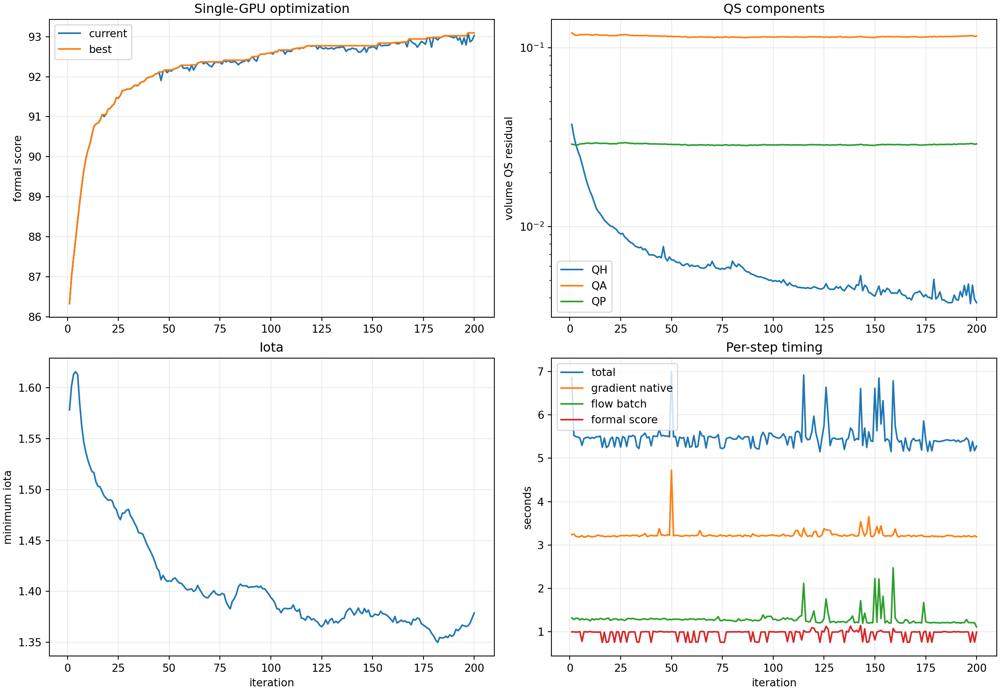

稳态单步的主要部分如下。`flow pipeline` 已经同时包含新中心和下一步 128 个端点的批解码。

| 阶段 | P50 | P95 | 单步平均占比 |
|---|---:|---:|---:|
| 129 样本 flow pipeline | 1.273 s | 1.426 s | 23.5% |
| 128 端点本地 native score | 1.723 s | 1.768 s | 31.6% |
| 更新后中心正式 native score | 0.991 s | 1.027 s | 17.2% |
| 端点磁轴 continuation | 0.573 s | 0.573 s | 10.4% |
| 端点 $\psi$ 更新 | 0.293 s | 0.307 s | 5.4% |

本次在线 score 使用严格磁轴 continuation 和局部连续面，适合优化，但不应替代独立验收。对相同 `best.json` 重新执行无历史、全局磁轴/磁面搜索后，独立 score 为 **94.62019**，七个分量如下。

| 分量 | 在线 continuation | 独立全局复评 |
|---|---:|---:|
| axis | 95.552 | 95.389 |
| $\psi$ | 98.953 | 98.953 |
| surface | 82.589 | **97.563** |
| coordinate | 90.217 | 90.182 |
| volume QS | 97.414 | 97.525 |
| iota | 100.000 | 100.000 |
| coil | 68.139 | 68.139 |

两者差异几乎全部来自 surface：独立搜索找到一周期漂移 P95 为 $2.44\times10^{-4}$、完整漂移 P95 为 $7.46\times10^{-4}$ 的稳定面；在线 continuation 为保证分支连续性，沿用的局部面漂移 P95 为 $3.27\times10^{-2}$。因此独立复评并没有推翻优化结果，而是说明在线目标对该终点偏保守。后续报告高质量候选时必须区分“在线 continuation score”和“独立全局 score”。

### 从 $\psi$ 到最大已测可行面

源 $\psi$ 对 $a=0.04,0.05,0.06,0.08$ 并行拟合。选择覆盖最大的 $a=0.08$；它在 4000 个独立验证点上的归一化角残差 mean/P95/L2 为 $1.71\times10^{-5}/5.29\times10^{-5}/1.53\times10^{-5}$，仍是小量。随后并行测试 $s=0.24,0.36,0.49,0.64$：前三个都通过标准 Simsopt LS/Newton 和独立密网格验证，体积按 $0.03227,0.04905,0.06660\ \mathrm{m}^3$ 单调增大；$s=0.64$ 的 GPU-ray 只提供 170732 个有效点，小于固定预算 180000，因此作为邻近外侧失败，不回退到慢 CPU Cartesian 路径。

最终选择 $a=0.08,s=0.49$：

| 量 | 结果 |
|---|---:|
| 体积 | $0.066596\ \mathrm{m}^3$ |
| $\iota$ | 1.46030 |
| 标准 LS/Newton 最终相对 L2 | $1.392\times10^{-5}$ |
| 法向场 P95 | $1.979\times10^{-5}$ |
| 面 QA / QH / QP error | $4.745\times10^{-3}$ / **$1.246\times10^{-6}$** / $4.814\times10^{-3}$ |
| $|B|$ 范围 | 0.6822--0.8393 T |

这里需要准确区分初值与最终解。alpha 使用 12/12/16 阶、12 万训练点和 6 万验证点，单次 FP32 GPU `gels` 拟合只用 1.72 s，但完整采样和诊断共 108.3 s；其验证相对 L2 为 0.101，不能单独宣称已经得到高精度 Boozer 面。$\nu$ 三个半径的完整处理共 85.1 s，在外面把 Simsopt 初始相对 L2 降到 0.0152。标准 LS 用 7.08 s、Newton 用 0.33 s，最终再降到 $1.39\times10^{-5}$。也就是说，本链路给出稳定且处于正确盆地的初值，最后机器精度附近的面仍来自标准求解。

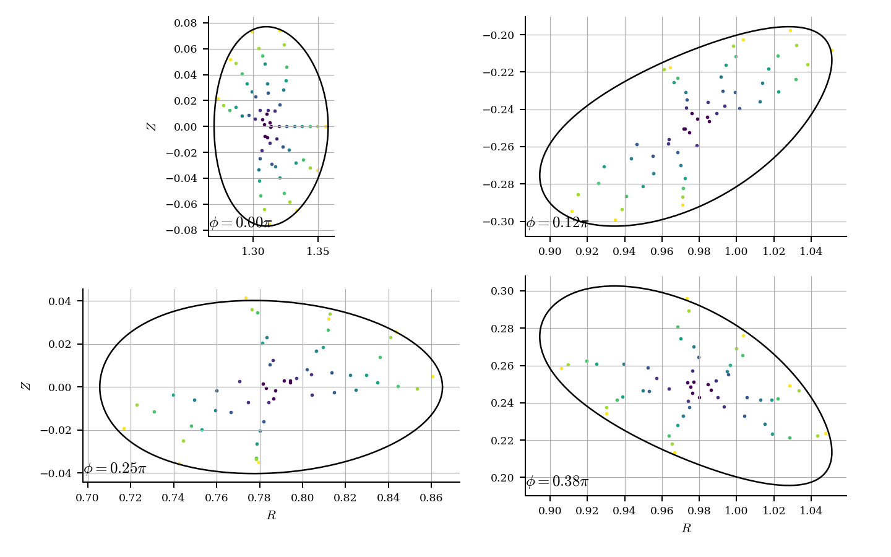

八条场线在四个截面都得到 29 个命中点，形成连续嵌套轨迹，没有分支跳转或自交。

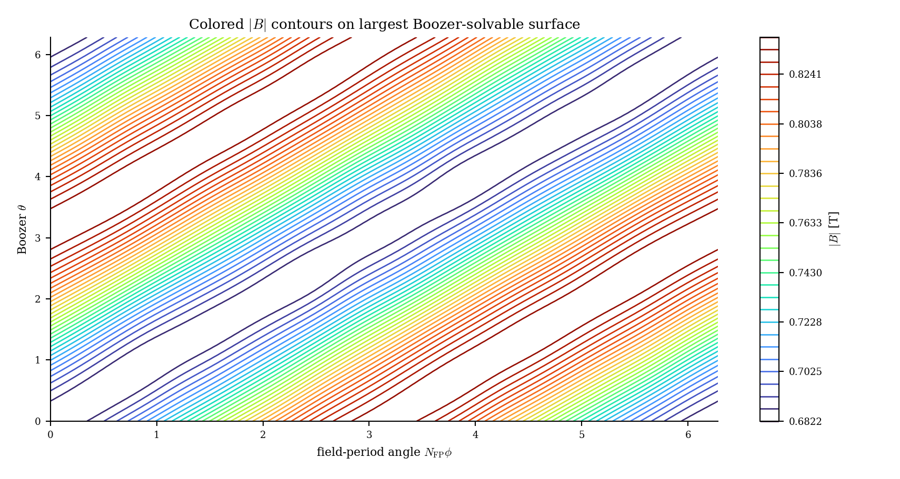

彩色等高线接近斜直线，直接显示 QH 结构；对应交互版本见 [boozer_b.html](assets/local_gradient_single_gpu_200_full_eval_20260812/full/assets/boozer_b.html)。

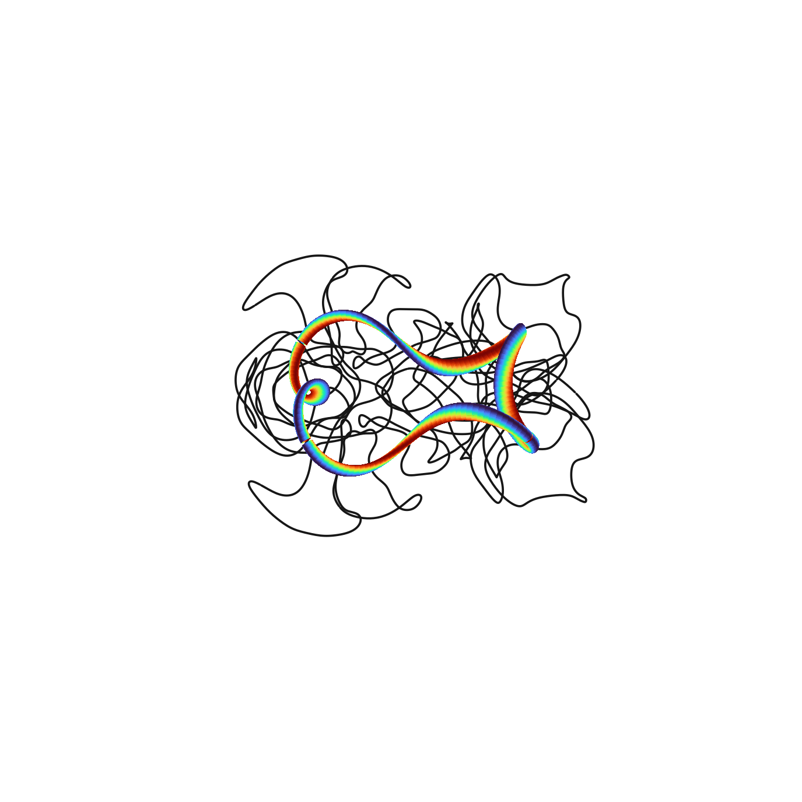

交互式全装置视图见 [coils_surface.html](assets/local_gradient_single_gpu_200_full_eval_20260812/full/assets/coils_surface.html)。

### DESC 结果

DESC 使用 CPU-P107，输入和最终状态都保持嵌套。求解在 50 步上限停止，因此 `optimizer_success=false`，不能报告为严格收敛；但目标平方和从 $1.637\times10^3$ 降到 $4.393\times10^{-4}$，归一化力 mean/P95/max 从 $1.135/1.786/3.581$ 降到 $1.092\times10^{-3}/2.476\times10^{-3}/8.439\times10^{-3}$，边界误差保持约 $10^{-18}$ m。物理上这是有效且嵌套的显著改进，但仍保留“达到迭代上限”的限制。


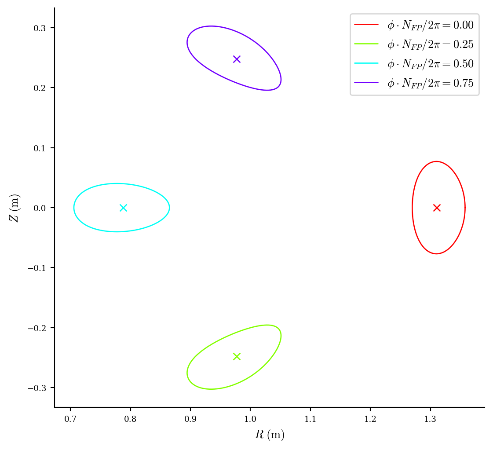

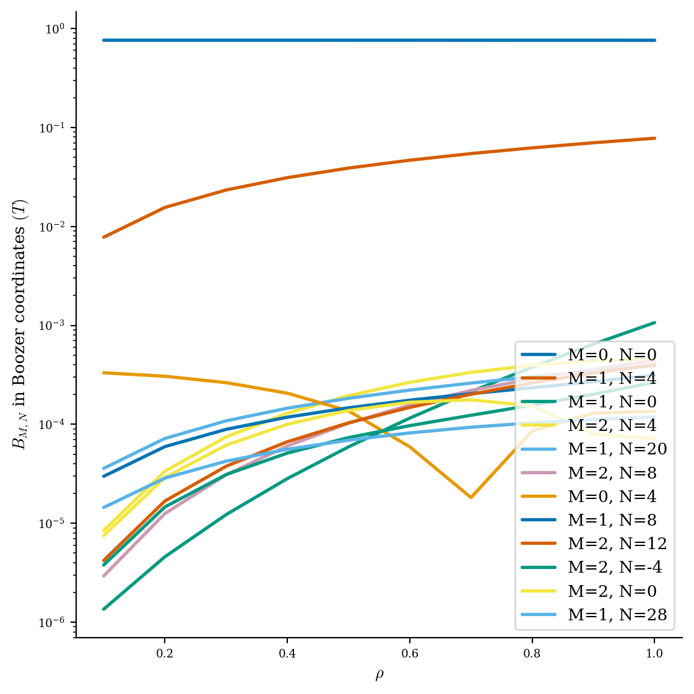

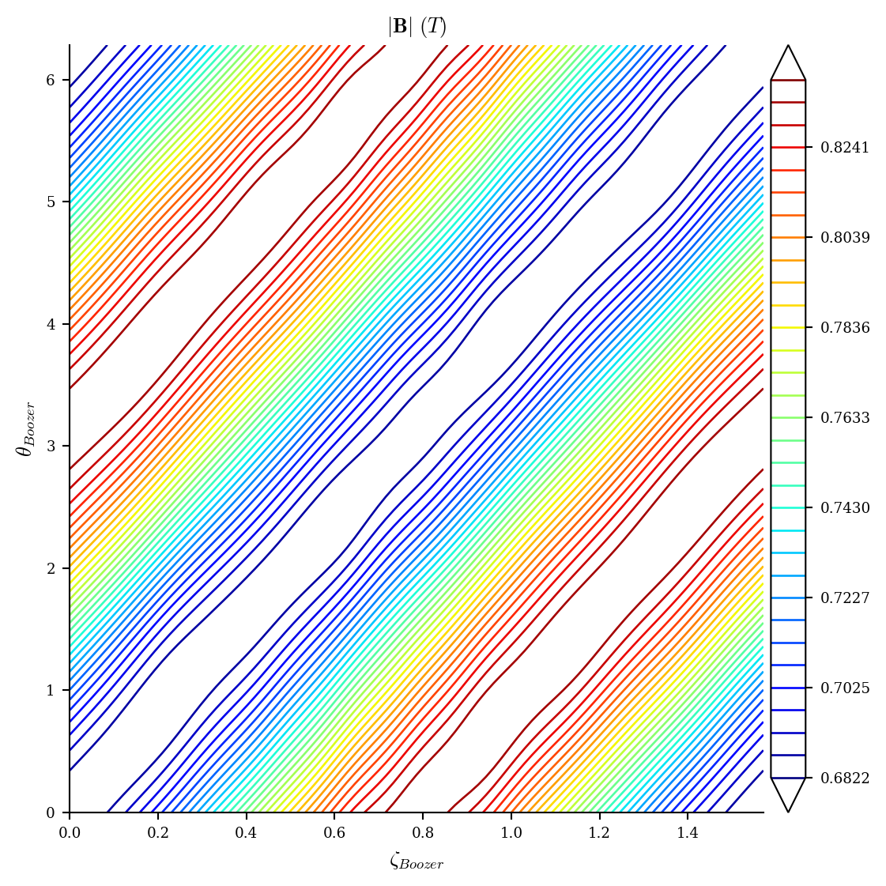

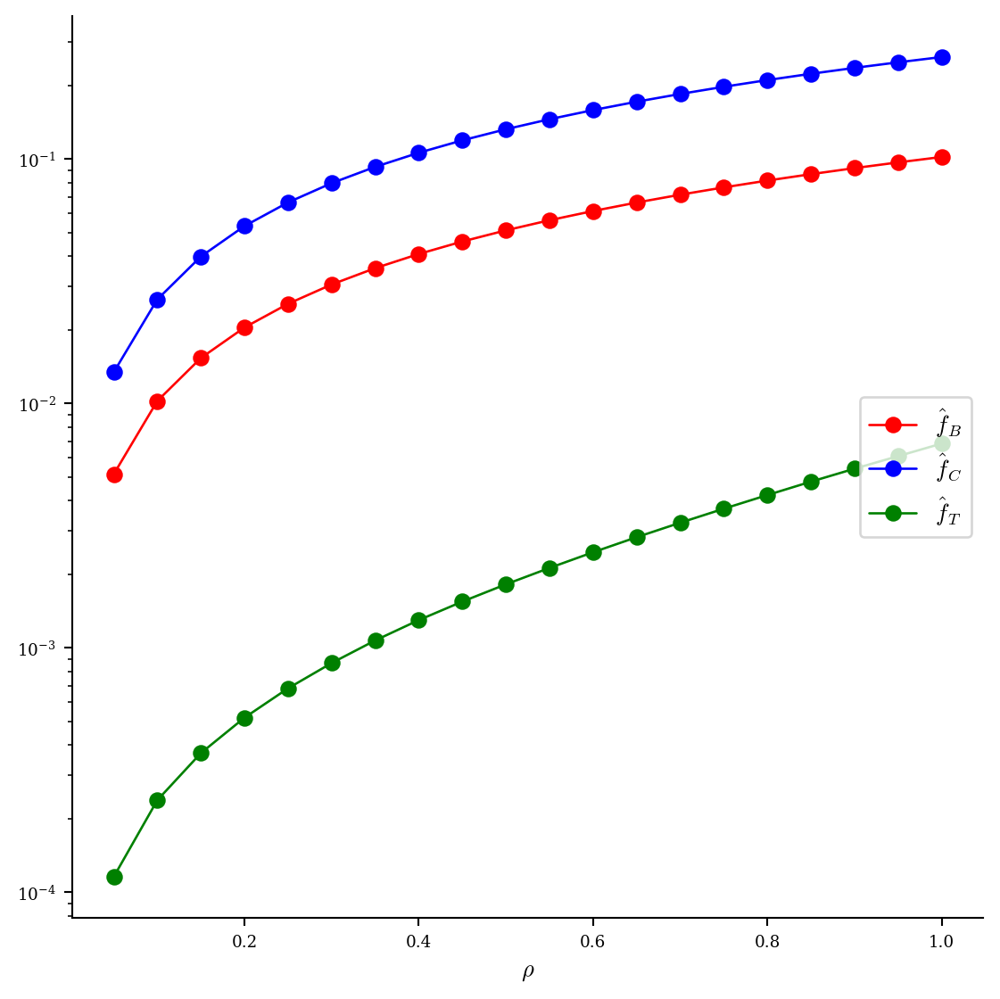

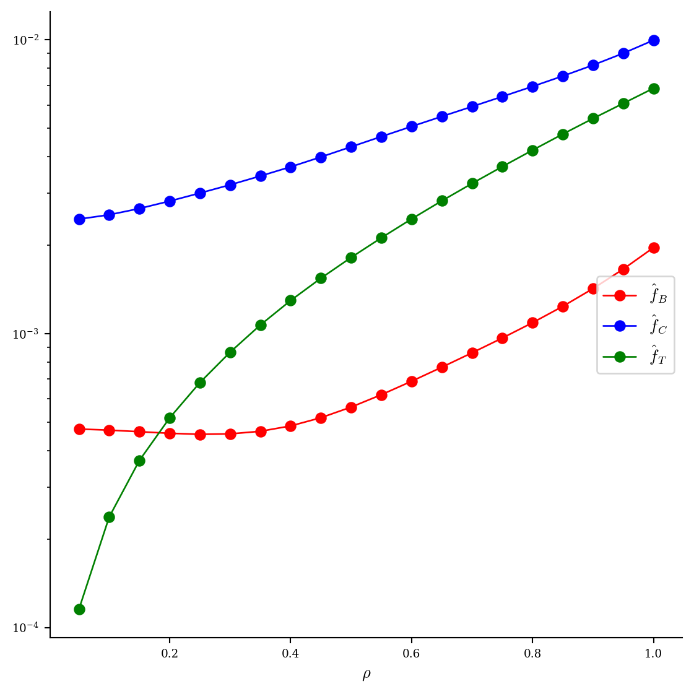

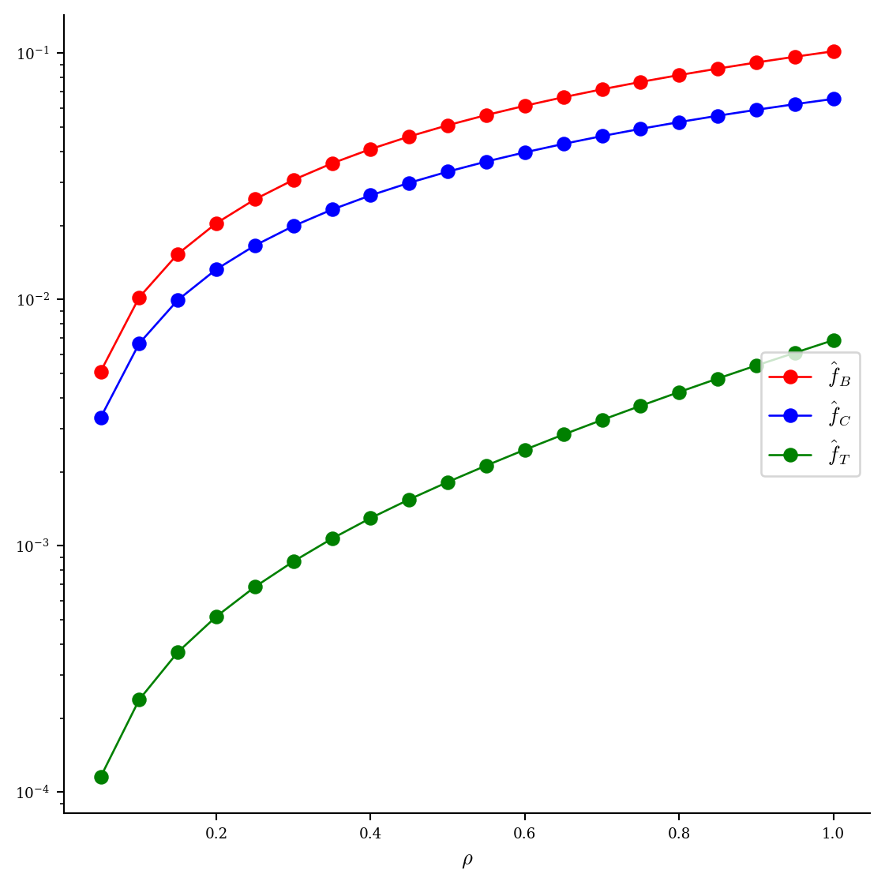

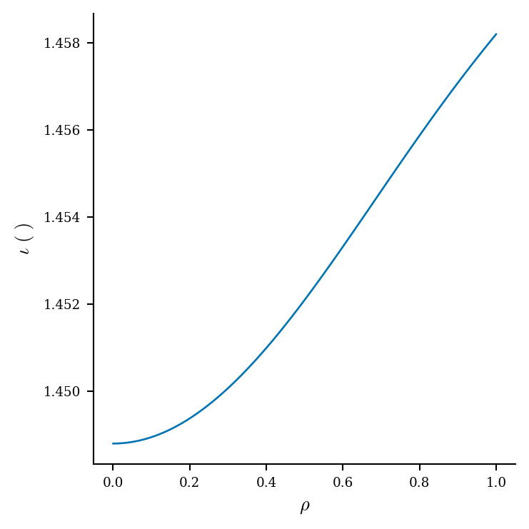

完整机器可读结果见 `reports/assets/local_gradient_single_gpu_200_20260812/acceptance_summary.json`、`reports/assets/local_gradient_single_gpu_200_full_eval_20260812/native_score_recheck.json`、`selection.json`、`full/full_summary.json` 和 `full/desc/summary.json`。最佳输入 SHA-256 为 `820d7828d3e369e49254f9385c833c06dbbc53c88f4e280ad68359569b104b83`；独立 score 结果 SHA-256 为 `0fb9f94380b7ccd4043275aff756517f5a4ad5d07c66d543f6dda4641bdb46b4`。
