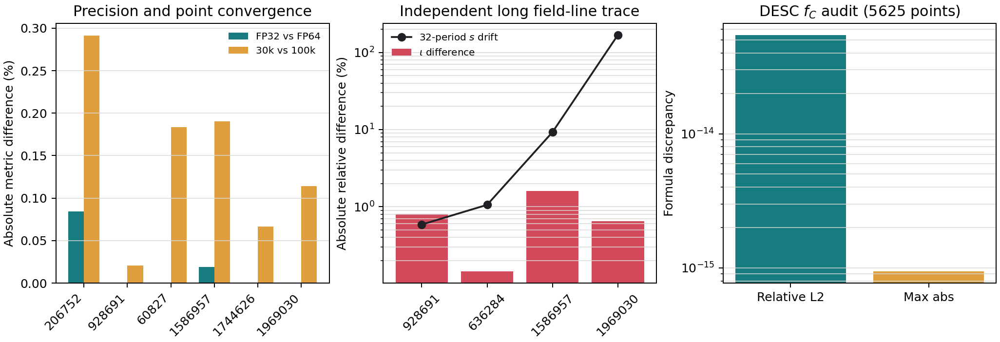
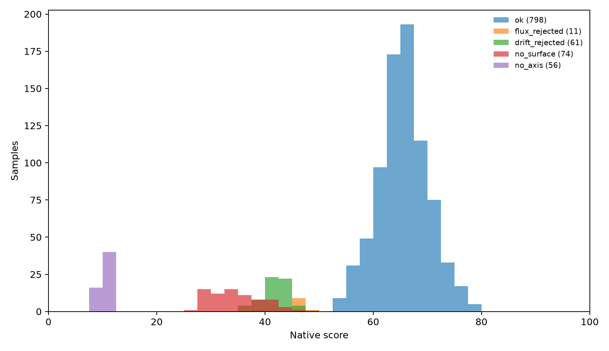
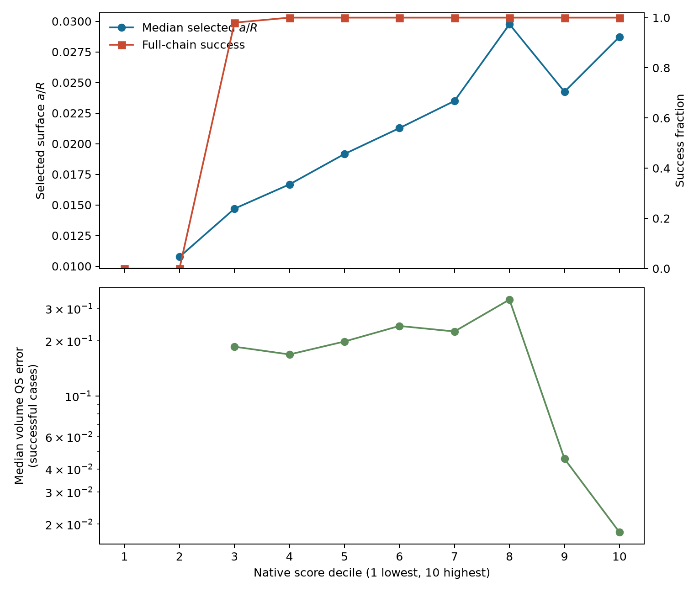
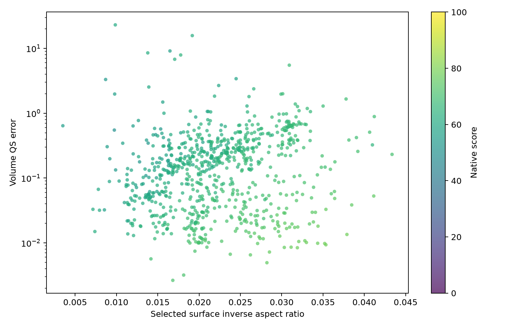
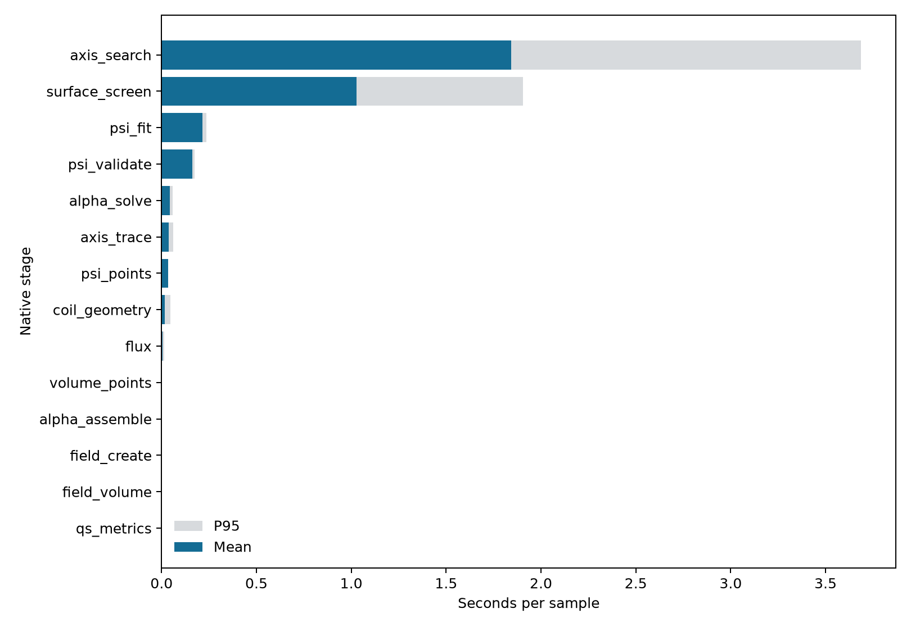

# GPU 原生线圈到体 QS score：实现与 2000 样本验证报告

更新日期：2026-07-27  
代码分支：`gpu-native-score`  
生产接口：C ABI v2，`sgpu_score_coils(...)`

## 1. 结论先行

本分支已经跑通了下面这条生产链路：

$$
\text{线圈 Fourier 系数、电流、}N_{\rm FP}
\longrightarrow
\text{磁轴}
\longrightarrow
s(R,Z,\phi)
\longrightarrow
\text{较大可靠磁面}
\longrightarrow
\psi_T(s),\ \iota
\longrightarrow
\text{体 QS error}
\longrightarrow
\text{score}.
$$

生产数值计算全部位于一个 C++/CUDA 动态库内。Python 只解析 JSON、传递连续数组并读取 C 结构体结果，不参与磁场、拟合、磁面或评分计算，也不依赖 PyTorch、Simsopt、DESC 或 JAX。

| 项目 | 最终结果 |
| --- | --- |
| 大型求解 | 两次固定规模 GPU 线性 QR；没有大型非线性优化或开放式迭代 |
| 独立验证集 | QUASR QA 500 + QH 500，与校准集不重叠 |
| 全链路成功 | 798/1000，即 79.8% |
| 有限 score | 1000/1000；没有 CUDA、ABI、OOM 或内部错误 |
| 单样本墙钟 | 均值 3.393 s，P95 5.214 s，最大 7.547 s |
| 10 s 目标 | 1000/1000 小于 10 s |
| 4 卡批量吞吐 | 1.137 组线圈/s，均摊 0.879 s/组 |
| 最优并发 | 每张 GPU 1 个持久 worker，共 4 个 worker |
| 分数区分度 | P90-P10 为 35.57 分；最大 1 分宽区间占 8.4% |
| 高分防作弊检查 | 前 20 名全部全链路成功，最小 $a/R=0.0282$，最大体 QS error 为 0.0528 |

因此，**“最终版本从线圈到 score 稳定小于 10 秒”已经在独立 1000 样本上达到**。目前主要耗时不在 QS kernel 或 QR，而在磁轴搜索和候选磁面的一周期追踪。

## 2. score 实际评价什么

这个 score 不是“只按一个小磁面的 QS error 排序”，也不是 DESC 平衡残差。它试图回答：

1. 线圈是否产生可信的椭圆磁轴和一族可追踪磁面；
2. 是否存在一个不太小、磁通一致且能稳定构造直场线信息的体积；
3. 该体积内指定 helicity 的微分 QS error 是否较小；
4. 线圈长度、曲率、间距、电流和谱复杂度是否基本可用。

QA 使用 $(M,N)=(1,0)$，QH 使用 $(M,N)=(1,N_{\rm FP})$。目标 helicity 由调用者显式给出，不会自动挑选对输入最有利的模式。

输出不仅有总分，还保留六个分量、物理原始量、失败阶段和 16 项耗时。纯 QS 排序应读取 `volume_qs` 分量和 `qs_global_error`，不能只保留总分。

## 3. 准确计算流程

### 3.1 线圈离散与工程量

每条基线圈用 256 个解析 Fourier 采样段离散，并按 stellarator symmetry 展开完整线圈。C++ 同时计算长度、曲率、线圈间距、高模能量和电流指标。Biot--Savart 场由 CUDA 分段内核计算。

该阶段没有 Python 物理代码。工程量的低维归约在 C++ 主机端完成，平均耗时仅 0.016 s。

### 3.2 磁轴

在 $\phi=0$ 的 Poincare 周期映射上搜索固定点：

- 初始网格为 $48\times48$；
- 最多保留 16 个候选；
- 每个候选固定 6 步 Newton；
- 场值主体为 FP32，轨道状态与最终验证为 FP64；
- 只接受闭合残差小于 $10^{-7}$ 且拓扑为椭圆型的固定点；
- 成功后用 960 步追踪一个场周期并输出 240 个轴点。

常规搜索失败时，$N_{\rm FP}\leq7$ 才启用 $64\times64$、最多 48 个候选、固定 6 步的回退。校准集中 3 个触发回退的 $N_{\rm FP}=8$ 样本没有一个被旧回退救回，因此最终跳过这类昂贵回退。定向回归中三者仍全部为 `no_axis`，耗时降为 2.58、5.71、4.66 s。

### 3.3 拟合近似磁通标签 $s$

采用与稳定版一致的结构：

$$
s(X,Y,\phi)
=X^2+
\sum_k c_k X^{a_k}Y^{b_k}
T_k(m_kN_{\rm FP}\phi),
$$

其中 $X=(R-R_{\rm axis})/a$、$Y=(Z-Z_{\rm axis})/a$，$a=0.05$，总多项式阶数为 10，环向阶数为 12，共 1574 个未知系数。拟合目标来自

$$
\boldsymbol B\cdot\nabla s\approx0.
$$

$80\times80$ 横截面规则网格裁成圆盘，再取 80 个环向截面，共 389440 个均匀训练点。设计矩阵、场评估和带谱正则的 FP32 cuSOLVER QR 均在 GPU 上完成；另用 4000 个独立移位点检查角度 residual。

生产默认使用 QR，不使用 normal equations。六样本审计表明，$s$ 的 normal equations 可令总分变化 2.337 分、$\iota$ 变化 0.035，不能视为可忽略的提速近似。

### 3.4 较大磁面筛选

候选标签固定为

$$
s_e\in\{0.001,0.002,0.004,0.008,0.02,0.04,0.08,
0.16,0.25,0.36,0.49,0.64,0.81\}.
$$

每层在 $\phi=0$ 解 256 条射线边界，单条射线最多 20 步有界一维 Newton。所有层批量追踪一个场周期，要求绝对漂移和相对漂移同时通过门槛；再对最大的至多 6 个严格候选用 FP64 重追踪验证。这里寻找的是“较大且可靠”的离散候选，不做连续最大化。

下游按面积从大到小尝试候选。若最大的面不能通过物理磁通标定，则向内回退；最多只尝试已通过严格追踪的 6 层，因此运行时间有上界。

### 3.5 将 $s$ 标定为物理环向磁通

对每个候选面使用 11 个径向层、8 个环向截面、256 个极向角和 24 点 Gauss--Legendre 径向积分，计算各截面的环向磁通。随后用一个 $11\times4$ 的 FP64 C++ QR 拟合

$$
\psi_T(s)=\sum_{p=1}^{4}a_p s^p,
\qquad
F(s)=\frac{d\psi_T}{ds}.
$$

必须同时满足：边界解 residual、不同环向截面的磁通相对标准差和 $F(s)$ 不变号。该步骤把无量纲标签 $s$ 变成后续 $\nabla\psi_T=F(s)\nabla s$ 所需的物理尺度。

### 3.6 在真实磁面体积内取点

最终积分域不是固定小圆柱。CUDA 先求所选外层面的射线边界，再在

$$
\rho_{\min}=0.08\leq
\rho=\sqrt{\frac{\psi_T(s)}{\psi_{T,e}}}\leq1
$$

内生成约 12.5 万个确定性候选点，用 $s\leq s_e$ 过滤并由 CUB 压紧为最多 10 万点。径向按 $r^2$ 均匀，$\theta$、$\phi$ 均匀，归约权重包含柱坐标 Jacobian 的 $R$ 因子，因此最后统计对应所选磁面内部的物理体积，而不是包围圆柱。

### 3.7 线性拟合 $\lambda$ 与 $\iota$

定义

$$
\alpha=\theta+\lambda(\rho,\theta,\phi)-\iota(\rho)\phi,
$$

并从磁场中扣除相对 $s$ 面的小法向分量，得到切向场 $\boldsymbol B_t$。线性目标为

$$
\min_{\lambda,\iota}
\left\|
W\boldsymbol B_t\cdot\nabla
\left(\theta+\lambda-\iota\phi\right)
\right\|_2^2
+\gamma\|x\|_2^2.
$$

$W$ 同时做径向分箱均衡和 $1/B$ 归一化。$\lambda$ 使用完整 Fourier--Zernike 展开：

$$
\lambda=
\sum_{lmn}
c^{c}_{lmn}R_l^m(\rho)\cos(m\theta-nN_{\rm FP}\phi)
+c^{s}_{lmn}R_l^m(\rho)\sin(m\theta-nN_{\rm FP}\phi).
$$

这里的 $R_l^m(\rho)$ 是 **Zernike 径向多项式**，不是柱坐标大半径 $R$。径向、极向和环向阶数均为 12，共 2268 个周期模式；当前 $\iota$ 取常数，因此总列数为 2269。使用 3 万个径向均衡点、列归一化、$10^{-7}$ 岭正则和 FP32 cuSOLVER QR。

生产 QS 只需要拟合出的 $\iota$；$\lambda$ 是保证 $\iota$ 来自全体积直场线条件的辅助函数。当前不需要拟合全空间 Boozer 环向修正 $\nu$。

### 3.8 体微分 QS error

同一批 10 万体点上，一个融合 CUDA kernel 同时复用 $\boldsymbol B$、解析 $\nabla\boldsymbol B$、$\nabla s$ 和 $F(s)$。令

$$
A=(\boldsymbol B\times\nabla\psi_T)\cdot\nabla B,
\qquad
C=\boldsymbol B\cdot\nabla B,
$$

真空区域取 $I=0$，按完整线圈链接电流计算 $G$，并计算

$$
f_C=(M\iota-N)A-MGC.
$$

最终主指标和边缘指标为

$$
\epsilon_{C,V}
=\left[
\frac{\sum_p w_p(f_{C,p}/B_p^3)^2}{\sum_p w_p}
\right]^{1/2},
$$

$$
\epsilon_{C,e}
=\left[
\frac{\sum_{\rho_p\ \text{位于最外径向 bin}}w_p(f_{C,p}/B_p^3)^2}
{\sum_{\rho_p\ \text{位于最外径向 bin}}w_p}
\right]^{1/2}.
$$

点值主体为 FP32，全局平方和为 FP64。没有有限差分磁场，也没有逐点 Python 循环。

## 4. score 公式与防作弊设计

对越小越好的量使用

$$
q_{\downarrow}(x;s,p)=\frac{1}{1+(x/s)^p},
$$

对越大越好的量使用

$$
q_{\uparrow}(x;s,p)=\frac{1}{1+(s/x)^p}.
$$

下式中的六个 $C$ 分量均已缩放到 0 至 100 分。

总分为

$$
S=0.18C_{\rm axis}+0.18C_s+0.18C_{\rm surface}
+0.14C_{\rm coordinate}+0.20C_{\rm volume\,QS}+0.12C_{\rm coil}.
$$

| 分量 | 主要内容 | 目的 |
| --- | --- | --- |
| `axis` | 固定点闭合、椭圆拓扑、椭圆长短轴比 | 拒绝没有可信磁轴的线圈 |
| `psi` | 独立点角度 P95、相对 $L_2$、训练 residual | 检查 $s$ 是否近似磁通函数 |
| `surface` | $a/R$、长期漂移、通过层数 | 奖励较大且成族的磁面 |
| `coordinate` | 截面磁通一致性、边界 residual、法向场、$\alpha$ LS residual | 检查物理磁通与直场线信息可信度 |
| `volume_qs` | 体 QS、边缘 QS、$a/R$ 饱和因子 | 避免用很小近轴体积骗取低 QS error |
| `coil` | 长度、曲率、间距、轴距、高模能量、电流 | 保留基本工程可用性 |

体 QS 分量明确乘以尺寸因子：

$$
C_{\rm volume\,QS}
=\left[0.8q_\downarrow(\epsilon_{C,V};0.05,0.9)
+0.2q_\downarrow(\epsilon_{C,e};0.07,0.9)\right]
\left[0.35+0.65q_\uparrow(a/R;0.04,2)\right].
$$

因此，一个极小磁面即使局部 QS 很好，也不能得到很高的 `volume_qs` 或总分。反过来，只有大面但 QS 很差也会被 QS 因子压低。

失败样本仍返回有限分数。未到达 $\alpha$ 阶段时 `coordinate` 使用 8 分的缺失值，未到达 QS 阶段时 `volume_qs` 使用 4 分；已经得到的上游物理量和 `coil` 分量照常计分。理论上所有 residual 趋零、磁面足够大且线圈工程量理想时，$S\to100$；100 不是数据集百分位，也没有人为硬上限。

## 5. 正确性与精度交叉验证

### 5.1 数值内核

| 检查 | 结果 |
| --- | --- |
| CUDA FP64 对 CPU 256 段 $\boldsymbol B$ | 相对误差 $2.79\times10^{-15}$ |
| CUDA FP64 对 CPU 256 段 $\nabla\boldsymbol B$ | 相对误差 $2.87\times10^{-15}$ |
| CUDA FP32 对 CUDA FP64 $\boldsymbol B$ | 相对误差 $1.73\times10^{-7}$ |
| CUDA FP32 对 CUDA FP64 $\nabla\boldsymbol B$ | 相对误差 $3.95\times10^{-7}$ |
| 本实现 $f_C$ 对 DESC，5625 点 | 相对 $L_2=5.46\times10^{-14}$ |
| FP32 对完整 FP64 后端，3 QA + 3 QH | 四个样本变化 $<2\times10^{-7}$；另两个为 0.019% 和 0.084% |
| 3 万对 10 万 QS 点，6 样本 | 主指标最大变化 0.291% |
| LS $\iota$ 对 32 周期相位回归，3 个稳定样本 | 相差 0.15% 至 1.60% |

### 5.2 求解器选择

在同一组 6 个样本上交叉组合 QR 与 normal equations：

- $\alpha$ 的 normal equations 与 QR 几乎一致，$\iota$ 差异小于约 $4\times10^{-6}$；
- $s$ 的 normal equations 可令总分变化 2.337 分、$\iota$ 变化 0.035；
- 因此 $s$ 和 $\alpha$ 的生产默认都使用直接 QR，宁可支付约 0.27 s 的两个 QR，也不把条件数平方。

### 5.3 软件与部署检查

- 本地 24 项测试全部通过；
- C ABI 因配置结构新增字段提升为 v2，并在加载时同时检查 ABI 版本与结构体大小；
- CUDA 13 构建目标为原生 `sm_120`，避免旧 PTX 在第一次运行时 JIT 17 至 25 秒；
- `libstdc++` 和 `libgcc` 静态链接，避免服务器 Conda 运行时 ABI 冲突；
- 禁用 CUDA cache 的冷启动烟测为 4.812 s；最终 ABI v2 烟测为 4.890 s，score 为 78.2993。

## 6. QUASR 2000 样本结果

校准集和独立验证集各包含 QA 500、QH 500，按 QUASR metadata QS error 的对数范围分层抽样。metadata 只用于抽样和事后检查，未进入评分公式。

### 6.1 覆盖率与失败分类

| 数据集 | `ok` | `no_axis` | `no_surface` | `drift_rejected` | `flux_rejected` | 内部错误 |
| --- | ---: | ---: | ---: | ---: | ---: | ---: |
| 校准 1000 | 800 | 64 | 72 | 50 | 14 | 0 |
| 独立验证 1000 | 798 | 56 | 74 | 61 | 11 | 0 |

验证集 QA 成功 441/500，QH 成功 357/500。历史稳定版在另一批随机 1000 样本上是 `surface=801`、`no_surface=134`、`no_axis=65`，即成功率 80.1%、无轴率 6.5%。新链路的 79.8% 和 5.6% 与该量级一致，没有出现原生重写导致的明显覆盖率下降。

所有 2000 个样本都得到有限 score。验证集不同失败状态的中位分严格有序：

$$
10.24\ (\text{no axis})
<34.54\ (\text{no surface})
<42.08\ (\text{drift})
<46.73\ (\text{flux})
<65.49\ (\text{ok}).
$$

### 6.2 分数梯度

| 指标 | 校准集 | 独立验证集 | 判断 |
| --- | ---: | ---: | --- |
| score P10 | 34.58 | 35.33 |  |
| score 中位数 | 64.15 | 64.07 | 两批稳定 |
| score P90 | 71.57 | 70.89 |  |
| P90-P10 | 36.99 | 35.57 | 大于预设 25 分 |
| 最大 1 分宽区间占比 | 8.1% | 8.4% | 小于预设 10% |
| P90-P10 大于 15 的分量数 | 4 | 4 | `psi/surface/coordinate/volume_qs` |

按最终 score 分成十分位后，最低两个十分位没有全链路成功样本；第三十分位成功率 98%，其后均为 100%。所选面的中位 $a/R$ 从低分区约 0.0108 总体升到最高分区 0.0287。体 QS 在中间分区不是严格单调，因为总分允许“更大但 QS 稍差”和“更小但 QS 稍好”之间作物理权衡；最高两个十分位的中位体 QS error 则明显降到 0.0455 和 0.0181。

### 6.3 相关性与“score 越大越好”的边界

| Spearman 相关 | 校准集 | 独立验证集 |
| --- | ---: | ---: |
| `volume_qs` 对 $-\log_{10}\epsilon_{C,V}$ | 0.984 | 0.985 |
| 总分对 $-\log_{10}\epsilon_{C,V}$，仅成功样本 | 0.391 | 0.398 |
| 总分对所选面 $a/R$，仅成功样本 | 0.719 | 0.697 |
| `volume_qs` 对 $-\log_{10}$ QUASR metadata QS | 0.483 | 0.463 |
| 总分对 $-\log_{10}$ QUASR metadata QS，全部样本 | 0.020 | 0.020 |

这说明 QS 子分量本身具有很强且稳定的 QS 梯度，总分确实同时在奖励较大磁面。总分对 native QS 的独立验证相关为 0.398，比设计草案的 0.4 门槛低 0.002，严格说没有通过该条预设阈值；但它与磁面尺寸的相关为 0.697，符合“较大的可用磁面更有价值”的目标。

总分与 QUASR metadata 的相关很弱，不能声称复现了数据集原评分。原因是 QUASR metadata 主要描述参考平衡或单面 QS，而本 score 同时评价真空场中的自动可用体积、微分体 QS、磁面大小和线圈工程量。若任务只想优化 QS，应使用 `volume_qs`，而不是去掉尺寸项后仍称其为综合 score。

### 6.4 高分作弊审计

独立验证集前 20 名满足：

- 20/20 为 `ok`；
- 最小所选面 $a/R=0.0282$，没有微小近轴面；
- 最大 $\epsilon_{C,V}=0.0528$；
- 最小 `volume_qs` 分量为 34.16；
- 没有失败样本进入高分区。

目前未观察到“极小磁面但 score 很高”或“下游失败但 score 很高”的明显漏洞。这个结论是 2000 个分层样本上的经验审计，不是对所有可能线圈参数的数学证明。

原始统计可在 [验证集 summary](assets/gpu_native_score/validation/summary.json)、[验证集逐样本 CSV](assets/gpu_native_score/validation/rows.csv) 和 [校准集 summary](assets/gpu_native_score/calibration/summary.json) 中复核。

## 7. 性能结果

正式评测使用 Slurm 独立分配的 4 张 NVIDIA RTX 5090。启动快照中四卡利用率均为 0、显存均为 2 MiB；脚本若发现分配卡上已有计算进程会立即以错误退出。每张卡运行一个持久 Python 壳进程，所有物理计算进入同一个 C++/CUDA 黑箱。

### 7.1 每阶段耗时

下表来自最终独立 1000 样本。下游失败时未执行阶段记为 0，因此“均值”是整批摊销值；P95 更适合观察一个阶段实际运行时的上界。

| 阶段 | 具体算法 | 均值/s | P95/s | 最大/s |
| --- | --- | ---: | ---: | ---: |
| 创建磁场对象 | C++ 离散段上传与 CUDA handle | 0.0018 | 0.0027 | 0.0065 |
| 线圈工程量 | C++ 256 点/线圈几何审计 | 0.0164 | 0.0474 | 0.2345 |
| 磁轴搜索 | GPU 周期映射 + 固定步候选修正 | 1.8421 | 3.6861 | 6.6369 |
| 磁轴采样 | GPU 混合精度追踪 240 点 | 0.0364 | 0.0604 | 0.1246 |
| $s$ 点生成 | C++ 规则圆盘坐标生成 | 0.0333 | 0.0358 | 0.0374 |
| $s$ 拟合 | GPU FP32 cuSOLVER QR，389440 行、1574 列 | 0.2147 | 0.2360 | 0.2724 |
| $s$ 独立验证 | 4000 点 GPU 场 + C++ 归约 | 0.1620 | 0.1734 | 0.1800 |
| 磁面筛选 | 13 层 GPU 周期追踪 + 至多 6 层 FP64 验证 | 1.0279 | 1.9065 | 2.7769 |
| 物理磁通标定 | 约 54 万 GPU 场点/候选 + $11\times4$ C++ QR | 0.0056 | 0.0149 | 0.0257 |
| 体点构造 | CUDA 射线、过滤和 CUB 压紧 | 0.0018 | 0.0023 | 0.0291 |
| 体点 $\boldsymbol B+\nabla\boldsymbol B$ | 融合解析 CUDA kernel | 0.00065 | 0.00144 | 0.00225 |
| $\alpha$ 矩阵组装 | CUDA Fourier--Zernike 设计矩阵 | 0.00178 | 0.00225 | 0.00447 |
| $\alpha/\iota$ 求解 | GPU FP32 QR，32269 行、2269 列 | 0.0445 | 0.0578 | 0.0651 |
| 体 QS 与归约 | 10 万点 CUDA + FP64 累加 | 0.00045 | 0.00064 | 0.00077 |
| score 组装 | C++ 固定公式 | $2.16\times10^{-7}$ | $2.94\times10^{-7}$ | $1.21\times10^{-6}$ |
| **端到端** | **线圈到 score** | **3.392** | **5.214** | **7.547** |

磁轴搜索约占平均总时间 54%，磁面筛选约占 30%；两个大型 QR 合计约 0.26 s，体 QS kernel 本身不到 1 ms。继续优化时应优先处理周期追踪，而不是降低 QS 点数或把 QR 换回 normal equations。

### 7.2 单卡并发实验

在相同的 24 个分层样本上，每张 GPU 同时运行不同数量的黑箱进程：

| 每卡进程数 | 总吞吐/样本每秒 | 平均单调用/s |
| ---: | ---: | ---: |
| 1 | 0.2140 | 4.672 |
| 2 | 0.2162 | 8.408 |
| 3 | 0.2217 | 13.351 |
| 4 | 0.2201 | 15.902 |

多进程只让单调用时间近似线性变慢，吞吐的 1% 至 4% 波动来自 24 样本静态负载不均，不能证明 GPU 内核有可利用的并发空洞。因此生产选择 **每卡 1 个 worker**，而不是沿用旧 score 的每卡 2 个。

### 7.3 四卡正式吞吐

最终验证作业四个 worker 各处理 250 个样本：

- 作业墙钟 879.163 s；
- 总吞吐 1.13745 组/s；
- 均摊 0.87916 s/组线圈；
- 四个 worker 墙钟分别为 867.53、872.06、840.06、828.73 s；
- 作业退出码 0，四个输出文件均为 250 行；
- 作业结束后四卡显存均回到 2 MiB，Slurm 中没有遗留本项目作业。

## 8. 本轮修正的代码问题

1. 修正了把 $\iota$ 多项式系数的最小/最大值误当作 $\iota(\rho)$ 范围的问题；现在在 $\rho^2$ 上显式评估 257 点。
2. 修正了结果结构中未显式初始化诊断字段导致的未定义值风险。
3. 将 $s$ 和 $\alpha$ 的生产求解器统一为直接 QR，并保留 normal equations 仅作开发对照。
4. 改为 CUDA 13 原生 `sm_120` 构建，消除首次 PTX JIT 长尾。
5. 静态链接 C++ 运行时，消除服务器 Conda `libstdc++` 版本冲突。
6. 对磁轴失败回退设置固定预算和 $N_{\rm FP}$ 上限，消除 12 至 15 s 的无收益长尾。
7. ABI 提升到 v2，并在 C++ 与 Python 两端检查结构尺寸。
8. 补齐最终 score 组装计时、失败状态有限分数和批量高分审计。

## 9. 当前边界与建议

### 9.1 已经可以依赖的部分

- C ABI 黑箱从线圈直接返回有限 score、分量、原始诊断和耗时；
- 大型求解只有固定规模线性 QR，不调用 DESC、Boozer LS--Newton 或非线性优化器；
- 在最终硬件和空闲卡上，独立 1000 样本全部小于 10 s；
- QS 子分量、磁面尺寸和失败阶段均有明确区分梯度；
- 校准与验证分布一致，未发现明显过拟合或基础设施失败。

### 9.2 仍需保留的限制

1. 这是**体微分 QS 评分器**，不是完整 Boozer 坐标生成器，也不是 MHD 平衡求解器。
2. 当前 $\iota(\rho)$ 默认是常数。对强磁剪切构型应开放低阶 $\rho^2$ 多项式，但仍须保持固定列数 QR，并重新做独立验证。
3. QUASR `mean_iota` 与本真空体积 $\iota$ 的验证集中位绝对差为 0.071、P90 为 0.249。两者不是同一平衡或同一径向平均，不能直接当作算法误差；但这说明不能拿 metadata $\iota$ 给当前结果作精确背书。
4. 总分与 native QS 的相关 0.398 略低于设计阈值 0.4，中间 score 分区的 QS 也不严格单调。当前总分更接近“尺寸、QS、坐标可信度和工程量的折中”，不是纯 QS 标量。
5. 跳过 $N_{\rm FP}>7$ 的轴回退依据是校准样本中没有救回案例。它降低长尾，但理论上可能把极少数需要更密网格的高场周期磁轴判为 `no_axis`。
6. 100 分是理论渐近值。当前 QUASR 两批样本最高约 78 分，尚未用人工构造的理想线圈验证 90 至 100 区间的实际可达性。

### 9.3 下一步最有价值的改进

1. 将多个候选线圈的磁轴周期映射合并成批量 kernel，减少小 kernel 调度并提高轴搜索吞吐；这是当前最大的性能空间。
2. 对磁面追踪做同样的跨样本批处理或图捕获；单样本内再开多个进程已经证明无收益。
3. 在一小批强剪切样本上比较常数、一次和二次 $\iota(\rho^2)$，只在独立验证确实改善 $f_C$ 与长追踪一致性时提升默认阶数。
4. 若后续目标变成“纯 QS 优化”，直接使用 `volume_qs` 子分量；不要为了提高 metadata 相关而破坏综合 score 对磁面尺寸和工程量的约束。

## 10. 交付物

- C/CUDA 主实现：[score_pipeline.cu](../gpu_backend/src/score_pipeline.cu)
- CUDA 场、追踪和 $s$ QR：[coil_field.cu](../gpu_backend/src/coil_field.cu)
- C ABI：[coil_field.h](../gpu_backend/include/coil_field.h)
- Python 黑箱封装：[stellarator_gpu.py](../gpu_backend/python/stellarator_gpu.py)
- 1000 样本批处理：[batch_native_score.py](../scripts/batch_native_score.py)
- 4 卡正式作业：[slurm_native_score_1000.sh](../scripts/slurm_native_score_1000.sh)
- 批量分析器：[analyze_native_score_batch.py](../scripts/analyze_native_score_batch.py)
- 独立验证原始统计：[summary.json](assets/gpu_native_score/validation/summary.json)
