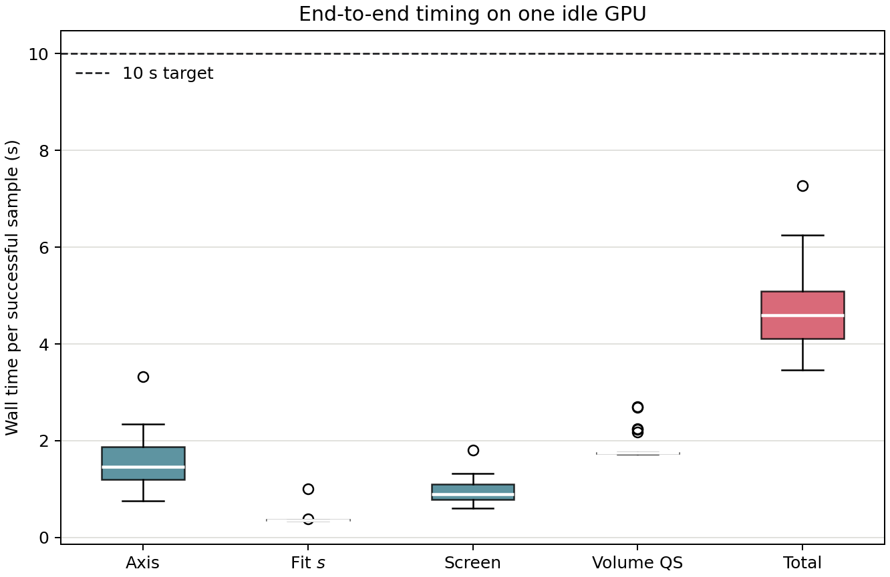
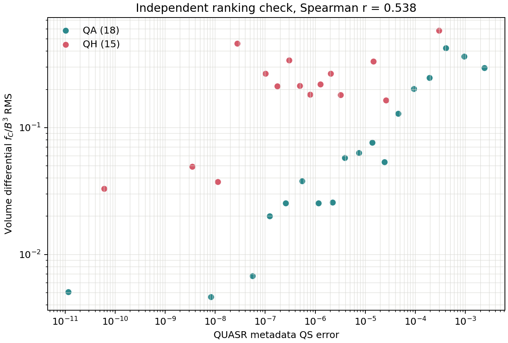

# 从拟合磁通面到 GPU 体积 QS：算法、验证与性能报告

更新日期：2026-07-26

工作分支：`gpu-volume-qs`

## 1. 先看结论

本次没有重做已经验证的“线圈到磁轴到拟合不变量 $s$”稳定路线，而是在其后新增了一个固定预算的体积 QS 后端。新增部分不调用 Boozer 曲面非线性 Newton，也不调用 DESC；唯一的大型求解是 GPU 上的线性最小二乘 QR，因此不会出现迭代次数不可预测或发散后迟迟不退出的问题。

当前链路为：

$$
\text{coils}
\rightarrow \text{axis}
\rightarrow s(R,Z,\phi)
\rightarrow \psi(s)
\rightarrow \{\iota,\lambda\}_{\rm LS}
\rightarrow \nabla B
\rightarrow \epsilon_{\rm QS}^{\rm volume}.
$$

最终默认配置使用 10 万个体点计算 QS，用其中均匀抽取的 3 万点拟合 $\alpha$，Fourier-Zernike 阶数为 12，主体采用 FP32。开发阶段分别用连续线圈场、CPU 分段场、CUDA FP64、DESC 的 $f_C$ 实现、FP64 QR、点数收敛和长磁力线追踪交叉验证。

最终空闲单卡结果：40 个 QUASR 分层样本中 33 个通过全部物理质量门槛；对成功样本，线圈到体积 QS 的平均耗时为 4.71 s，P95 为 5.96 s，最大值为 7.28 s，全部低于 10 s。

这里的“稳定”是指每一步预算固定、失败有质量门槛且会快速返回，不表示任意线圈都必然存在可接受的磁轴和嵌套磁面。无法通过稳定版上游或新增物理质量门槛的样本会明确返回失败，不会强行给出没有物理可信度的 QS 数字。

## 2. 这次新增了什么

1. 新增解析 Biot-Savart CUDA 内核，一次遍历线圈段同时计算 $\mathbf B$ 和 $\nabla\mathbf B$。另有 FP32 纯 $\mathbf B$ 内核供磁通标定使用，避免计算后丢弃梯度。
2. 将拟合不变量 $s$ 标定为有物理量纲的环向磁通 $\psi$，并对边界闭合、不同环向截面的一致性和单调性做质量检查。
3. 在物理体积内作确定性的均匀笛卡尔采样，用线性 QR 同时拟合 $\lambda$ 的谱系数和 $\iota$。
4. 实现与 DESC 定义逐点一致的微分 $f_C$，并在一个场周期内计算体积加权 RMS 及径向分箱。
5. 增加线圈到体积 QS 的独立 CLI、QUASR 分层批处理、失败摘要、资源错误中止和验证绘图脚本。

## 3. 准确计算流程

### 3.1 稳定版上游：线圈到 $s$

这部分沿用主流程，不改变算法和默认参数。

**磁场离散。** 每条基线圈用 256 段离散，并按场周期和 stellarator symmetry 展开完整线圈组。

**磁轴。** 在 $\phi=0$ 的 Poincare 映射上寻找固定点。先在二维网格批量追踪一个场周期，再对候选点作有界 Newton 修正和 FP64 验证；只接受满足拓扑条件的椭圆固定点，随后生成 240 点磁轴。

**拟合不变量。** 在以磁轴为中心的截面圆盘中均匀采点，以 Cartesian polynomial 和环向 Fourier 基展开 $s(R,Z,\phi)$，最小化

$$
\mathbf B\cdot\nabla s \simeq 0.
$$

默认多项式总阶数为 10，环向阶数为 12，训练网格为 $80^3$，即约 51.2 万点。设计矩阵、磁场采样和 QR 都在 GPU 上完成，使用轻微谱正则。

**嵌套面筛选。** 对预设的十个 $s$ 候选层同时追踪 256 条磁力线一个场周期。稳定版原门槛检查闭合与截面漂移；体积 QS 入口再要求相对终点漂移不超过 5%，并从通过者中由外向内尝试。

### 3.2 将 $s$ 标定为真实环向磁通 $\psi$

$s$ 只是在磁力线上近似不变的无量纲标签，其整体尺度不能直接进入 $f_C$。对每个候选外层 $s_e$，在 11 个径向层、8 个环向截面、256 个极角上解出 $s(R,Z,\phi)=s_j$ 的边界半径，再用 24 点 Gauss-Legendre 径向积分计算

$$
\psi(s_j,\phi_k)
=\frac{1}{2\pi}
\int_{A(s_j,\phi_k)} \mathbf B\cdot\mathbf e_\phi\,dR\,dZ.
$$

对环向截面取平均后，以强制通过原点的四次多项式拟合 $\psi(s)$。之后有

$$
\nabla\psi=\frac{d\psi}{ds}\nabla s,
\qquad
\rho=\sqrt{\frac{\psi}{\psi_e}}.
$$

候选层必须同时满足：解出的边界残差不超过 $10^{-9}$，边缘磁通的截面相对标准差不超过 2%，以及 $d\psi/ds$ 在拟合区间内不变号。若外层失败，确定性地退到下一个较小候选层。

### 3.3 体积点云

在一个场周期的紧致柱坐标包围盒中生成平移过的均匀笛卡尔格点，保留

$$
\rho_{\min}\leq\rho\leq 1,
$$

并按固定索引均匀抽取 10 万点。包围盒半径由刚标定的最外磁面最大半径乘 1.02 得到，不再使用容易截断不同构型的固定经验半径。柱坐标中的体积积分使用 Jacobian 权重 $R$；一个场周期上的加权平均等于完整装置上的平均。

### 3.4 线性最小二乘求 $\alpha$ 与 $\iota$

采用直磁力线角的形式

$$
\alpha=\theta-\iota(\rho)\phi+\lambda(\rho,\theta,\phi),
$$

其中

$$
\lambda
=\sum_k c_k Z_{l_k}^{m_k}(\rho)
\begin{cases}
\cos(m_k\theta-n_kN_{\rm fp}\phi),\\
\sin(m_k\theta-n_kN_{\rm fp}\phi).
\end{cases}
$$

这里 $Z_l^m$ 是圆盘上的 Zernike 径向多项式，不是几何坐标 $R$。默认 $l,m,n$ 的截断阶数均为 12，$\iota$ 在体积内先取常数。由于 $\lambda$ 和 $\iota$ 只以系数线性出现，直磁力线条件

$$
\mathbf B_t\cdot\nabla\alpha=0
$$

给出一个线性最小二乘问题：

$$
\min_{\{c_k\},\iota}
\left\|
W\left[
(1+\lambda_\theta)B_t^\theta
+(\lambda_\phi-\iota)B_t^\phi
\right]
\right\|_2^2
+\eta\|x\|_2^2.
$$

$\mathbf B_t$ 是扣除相对拟合面法向分量后的切向磁场，避免 $s$ 的小量法向误差直接偏置 $\iota$；$W$ 同时做径向分箱平衡和 $1/B$ 归一化。矩阵列先按范数缩放，再以 GPU FP32 `gels` QR 求解。生产 QS 公式只需要拟合出的 $\iota$；$\lambda$ 是保证该 $\iota$ 来自全体积直磁力线条件的辅助未知量。

### 3.5 一次计算 $\mathbf B$ 与 $\nabla\mathbf B$

对 10 万个 QS 点只启动一次融合 CUDA 内核。每个 warp 负责一个空间点，线圈段分块装入 shared memory；解析求导避免有限差分的 6 次重复磁场计算及步长误差。令 $B=|\mathbf B|$，则

$$
\nabla B=\frac{(\nabla\mathbf B)^T\mathbf B}{B}.
$$

磁通标定只需 $\mathbf B$，使用单独的 FP32 纯磁场内核，不计算 $\nabla\mathbf B$。

### 3.6 体积微分 QS 指标

对指定对称模式 $(M,N)$，实现的局部残差与 DESC 一致：

$$
f_C
=(M\iota-N)(\mathbf B\times\nabla\psi)\cdot\nabla B
-(MG+NI)\mathbf B\cdot\nabla B.
$$

本项目当前评估真空场，因此 $I=0$。$G$ 根据完整对称展开的线圈电流计算，并已用既有 Boozer/DESC 数据核对符号和尺度。最终主指标为

$$
\epsilon_{\rm QS}^{\rm volume}
=\left[
\frac{\int_\Omega (f_C/B^3)^2\,dV}
{\int_\Omega dV}
\right]^{1/2},
$$

同时输出未归一化 $f_C$、95% 分位数和十个 $\rho$ 分箱。QA 使用 $(M,N)=(1,0)$；QH 使用数据集约定的 $(1,N_{\rm fp})$。

## 4. 空闲单卡性能

计时硬件为 Slurm 独占分配的一张 NVIDIA RTX 5090。启动快照显示 GPU 利用率为 0、显存占用为 2 MiB、没有其他计算进程；`CUDA_VISIBLE_DEVICES` 只暴露这一张卡。作业申请 16 个 CPU 核，但稳定版实际使用 `omp_threads=1`；这是项目已经验证过的小批量磁场计算最优设置。批处理前的一次性 CUDA 线性代数预热耗时 2.64 s，不计入单样本生产耗时。交叉验证也不计入生产耗时。

第一次复测被分配到 `anode02`，预检发现 NVML 的驱动与用户态库版本不匹配，因而在正式计算前立即退出；最终计时在排除该故障节点后的 `anode03` 上完成。该次失败没有进入任何性能或成功率统计。

| 阶段 | 算法 | 均值 / s | 中位数 / s | P95 / s | 最大值 / s |
|---|---|---:|---:|---:|---:|
| 磁轴 | GPU 固定点搜索与验证 | 1.535 | 1.462 | 2.323 | 3.331 |
| 拟合 $s$ | 约 51.2 万点 GPU QR | 0.378 | 0.359 | 0.374 | 1.005 |
| 磁面筛选 | GPU 批量一周期追踪 | 0.945 | 0.895 | 1.315 | 1.806 |
| 新增体积 QS 后端 | 标定、点云、LS、$f_C$ | 1.843 | 1.746 | 2.421 | 2.706 |
| 全链路 | 线圈到体积 QS | 4.707 | 4.589 | 5.959 | 7.278 |

新增后端内部：

| 子步骤 | 均值 / s | 中位数 / s | P95 / s | 最大值 / s |
|---|---:|---:|---:|---:|
| 磁通标定 | 0.514 | 0.427 | 1.095 | 1.394 |
| 体点生成与坐标评估 | 0.877 | 0.870 | 0.877 | 1.103 |
| 融合 $\mathbf B+\nabla\mathbf B$ | 0.0029 | 0.0025 | 0.0036 | 0.0116 |
| $\alpha/\iota$ LS 全部 | 0.296 | 0.290 | 0.295 | 0.459 |
| 其中 QR | 0.0590 | 0.0587 | 0.0588 | 0.0676 |
| QS 指标与径向归约 | 0.144 | 0.145 | 0.156 | 0.158 |

## 5. 正确性与精度交叉验证

### 5.1 磁场和解析梯度

在独立空间点上完成四路比较：Simsopt 连续 Fourier 线圈、CPU 256 段解析 Biot-Savart、CUDA FP64、CUDA FP32。已有审计中，CUDA FP64 相对 CPU 分段场的 $\mathbf B$ 和 $\nabla\mathbf B$ 误差分别为 $2.79\times10^{-15}$ 和 $2.87\times10^{-15}$；FP32 相对 FP64 分别为 $1.73\times10^{-7}$ 和 $3.95\times10^{-7}$。FP64 的 $\nabla\cdot\mathbf B$ 约为 $2.0\times10^{-15}$，FP32 约为 $1.0\times10^{-6}$ 的绝对量级。

### 5.2 $f_C$ 公式对 DESC

在 DESC 的 precise-QH 平衡上取 5625 点，将本实现使用的物理向量公式与 DESC 内部 `f_C` 逐点比较：相对 $L_2$ 差异为 $5.46\times10^{-14}$，最大绝对差为 $9.44\times10^{-16}\ \mathrm T^3$。这验证了 $(M,N)$、$\iota$、$G$、叉乘方向和归一化前残差的接口约定。

### 5.3 FP32 对 FP64

抽取 3 个 QA 和 3 个 QH 样本，将新增后端完整重跑为 FP64。六个样本中四个主 QS 指标的相对变化小于 $2\times10^{-7}$；两个绝对 QS 很小的样本相对变化分别约 0.019% 和 0.084%。因此默认 FP32 的指标误差显著小于样本间差异。

### 5.4 点数收敛

同一组 6 个样本比较 3 万与 10 万 QS 点，主指标最大相对变化为 0.291%，其余均低于 0.20%。$\iota$ 对点集更敏感，变化约为 0.2% 到 1.7%，因此最终保留 10 万 QS 点，并以其中 3 万个径向均衡点做 QR。

### 5.5 独立长磁力线追踪

对 4 个样本追踪 32 个场周期、8 条磁力线。三个保持磁面的样本中，LS $\iota$ 与相位回归 $\iota$ 相差 0.15% 到 1.60%。样本 1969030 虽然 $\iota$ 只差 0.65%，但 32 周期后 $s$ 的 P95 相对漂移达到 169%，说明“拟合出一个数值接近的 $\iota$”不足以证明磁面可靠；因此新增 5% 的入口漂移门槛会拒绝该样本。

## 6. QUASR 批量验证

从 QUASR 中分别对 QA、QH 按元数据 QS error 的对数排序分层抽取 20 个样本，共 40 个，覆盖从优到差的宽动态范围。最终严格门槛通过 33/40，即 82.5%；QA 为 18/20，QH 为 15/20。失败样本中，3 个没有找到稳定椭圆磁轴，2 个在稳定版磁面筛选阶段已经没有可接受层，1 个被新增的长期漂移门槛拒绝，1 个未通过截面磁通一致性门槛。没有 CUDA OOM、设备忙或非确定性迭代超时。

本次覆盖率没有异常偏低。当前项目稳定版此前在旧服务器上评测过 1000 个随机 QUASR-like 样本，结果为 `surface=801`、`no_surface=134`、`no_axis=65`，即完整稳定版成功率 80.1%、无轴率 6.5%。本次分层样本的最终成功率 82.5%、无轴率 7.5%，与历史量级一致。两批的抽样方式和最终后端不同，不能把 1.6 个百分点的差别解释为算法提升，但可以排除新体积 QS 后端导致明显成功率退化。对本次 35 个已经通过稳定版轴与磁面筛选的样本，新增严格门槛再拒绝 2 个，后端通过率为 94.3%；通过新增漂移入口的 34 个样本中，线性 QS 后端成功 33 个，即 97.1%。

对成功样本，本体积微分指标与数据集元数据在对数尺度上的 Spearman 相关系数为 0.538，Pearson 相关系数为 0.617。两者不应数值相等：本报告计算的是线圈真空场、自动选择体积、微分 $f_C/B^3$ RMS；元数据来自数据集自己的平衡或曲面 QS 定义。这里的交叉验证目标是排序具有显著同向信息，而不是复现同一个数字。

失败会分到物理含义明确的类别：找不到稳定椭圆磁轴、拟合 $s$ 后没有通过追踪的嵌套层、长期漂移门槛失败、或环向磁通在不同截面上不一致。CUDA OOM 或设备忙不计为样本失败，批处理会立即中止整批评测。

## 7. 当前边界与下一步

1. 这是可靠的体积微分 QS 评估器，不是完整 Boozer 坐标构造器。计算 $f_C$ 只需要 $\psi$、$\iota$、$\mathbf B$、$\nabla B$、$G$ 和 $I$，不需要显式拟合全空间 $\nu$，也不需要生成每个 Boozer 面的 $R/Z$ Fourier 系数。
2. 当前默认令 $\iota(\rho)$ 为常数。对剪切明显的构型，可以把 $\iota$ 展开为低阶 $\rho^2$ 多项式；问题仍是线性 LS，但需要重新做过拟合与点数收敛审计。
3. $\alpha$ 方程的相对残差通常不是机器精度，因为输入的 $s$ 本身只是近似磁通函数，且有限阶 $\lambda$ 不能表示全部细节。法向磁场比例、长期漂移和磁通截面一致性比单看训练残差更能判断结果是否可用。
4. 端到端耗时的主要部分仍来自稳定版磁轴和磁面追踪。按照任务边界，本次没有改写这些上游算法；新增体积后端已经是固定次数的密集 GPU 计算和一次 QR。

## 8. 使用与产物

单样本入口为 `scripts/eval_volume_qs.py`，QUASR 分层批处理为 `scripts/batch_volume_qs_quasr.py`，验证图与统计入口为 `scripts/plot_volume_qs_validation.py`。每个成功样本保存磁轴、$s$ 模型和完整摘要；每个早期失败样本也保存 `summary.json`。批处理摘要与 GPU 启动前状态单独保存，便于区分算法失败和资源争用。

主要机器可读验证产物位于 `reports/assets/gpu_volume_qs/validation_statistics.json` 和 `runs/volume_qs_validation/`。本地测试覆盖解析梯度、$\nabla\cdot\mathbf B$、$s$ 的张量化求值、磁通标定、磁通多项式导数和直接 $f_C$ 公式。
