# 原生 GPU score 的 CEM 黑箱优化验证

## 1. 结论先行

本轮任务完成了两件事：

1. 原生 C++/CUDA score 已合并到 `main`，旧的“磁轴、$psi$、Simsopt Boozer
   LS/Newton、DESC”路径没有被覆盖；
2. 在新分支上从随机 PCA latent 出发，用固定预算 CEM 分别优化 QA 和 QH score，
   再把最高分 QH 样本交给旧路径和 DESC 做独立复核。

主要结论如下。

- **score 可以作为黑箱优化目标。** QH 从随机起点 `10.005` 提升到 `71.325`，
  QA 从 `9.977` 提升到 `69.822`。QH 已超过 QUASR 独立 1000 样本的 P90
  `70.89`，但尚未超过数据集最大值 `78.02`。
- **高分样本不是伪解。** 旧路径在多个尺度上都找到 Boozer LS/Newton 可解面；
  Poincare 图显示 16 条场线形成连续嵌套层。体积 $0.0752\,\mathrm{m}^3$ 的中等大面上
  Simsopt QH error 为 `1.25%`，最大计算可解面体积 $0.1231\,\mathrm{m}^3$，QH error
  为 `4.78%`。
- **DESC 给出了正面的补充验证。** 固定最大边界求解后初态和末态均为 nested；
  最终归一化 force 的 mean、p95、max 分别为 $2.04\times10^{-4}$、
  $5.75\times10^{-4}$、$3.89\times10^{-3}$。优化器因达到 50 次上限而未返回
  `success`，因此应表述为“低残差、嵌套、但未按停止条件正式收敛”。
- **不能把结果解释成已经得到极佳 QH。** 原生 score 的 `volume_qs` 分量只有
  `3.45/100`；旧路径中 QA/QH/QP 三种误差处于相近量级，DESC 的 QH 图也只显示
  中等对称性。当前实验验证的是“总 score 能优化出真实且总体较好的位形”，尚未严格
  证明 QH 标签具有很强的目标特异性。

因此，对本次问题最准确的回答是：**CEM 能有效优化当前 score，且高分随机样本确实
对应较大嵌套磁面和小到中等的 QS error；但 score 的下一轮改进应增强大体积 QS 分量
和 QA/QH/QP 之间的区分力。**

## 2. 分支与主线状态

合并前的稳定主线为 `c5ac4d8`。原生 GPU score 分支以非 fast-forward 方式合并到
`main`，合并提交为：

```text
7f8db81 Merge native GPU score pipeline
```

核对结果：

- `stellarator_eval/pipeline.py`、`stellarator_eval/surface.py`、
  `stellarator_eval/cli.py` 相对合并前稳定主线没有变化；
- 原生 score 以新增 C++/CUDA backend、脚本和独立接口进入主线；
- 旧磁面、Simsopt Boozer 和 DESC 路径仍可直接运行，本报告的全面复核正是调用该路径；
- CEM 实验在独立分支 `score-cem-validation` 上进行；
- 当前测试为 `31 passed`。

这满足“合并新 score，但不覆盖旧 LS/Newton 和 DESC 路径”的要求。

## 3. CEM 实验设计

### 3.1 搜索空间

搜索使用旧 `coil` 项目已经训练好的 whitened PCA 表示：

- 一个 base coil；
- `nfp=3`；
- 每根 base coil 使用 64 维 latent；
- latent 逐维限制在 $[-3,3]$；
- PCA 文件和原生动态库均记录 SHA-256，结果可追溯。

线圈电流的 $L_1$ 总量固定为随机中心的值。QH 实验固定为约
$2.048\times10^5\,\mathrm{A}$，QA 实验固定为约 $2.825\times10^5\,\mathrm{A}$。
这样可以防止优化器仅通过整体缩放电流来抬高 score。

### 3.2 固定预算 CEM

两组实验参数一致：

| 参数 | 数值 |
| --- | ---: |
| population | 32 |
| elite | 8 |
| generation | 8 |
| 每个目标总评估数 | 256 |
| 初始标准差 | 0.35 |
| 平滑系数 | 0.55 |

每代从对角高斯分布采样，选择最高分的 elite。若平滑系数为 $\eta$，更新为

$$
\boldsymbol\mu_{t+1}
=(1-\eta)\boldsymbol\mu_t+\eta\,\overline{\boldsymbol z}_{E},
$$

$$
\boldsymbol\sigma_{t+1}
=(1-\eta)\boldsymbol\sigma_t+\eta\,\operatorname{std}(\boldsymbol z_E).
$$

CEM 的代数和种群数固定，所以优化过程有确定的最大工作量。每个候选通过一个持久化
原生 C++/CUDA worker 评分；Python 只负责采样、PCA 解码和进程通信，不参与 score
内部数值计算。

### 3.3 评分链路

原生 score 对每个候选依次执行：

1. 线圈几何与工程约束；
2. 磁轴候选搜索、拓扑筛选和磁轴追踪；
3. 稳定版同类的密集均匀点云 $psi$ 线性 QR 拟合；
4. 多个 $psi$ level 的快速磁面筛选；
5. 磁通标定；
6. 10 万体点上的 Clebsch $\alpha$ 线性最小二乘；
7. 体 QS 统计和总 score 聚合。

这条评分链路没有大参数量 LS/Newton 或 DESC solve。CEM 本身虽然逐代更新，但每次
score 的耗时稳定、失败状态显式，且总评估次数固定。

## 4. CEM 优化结果

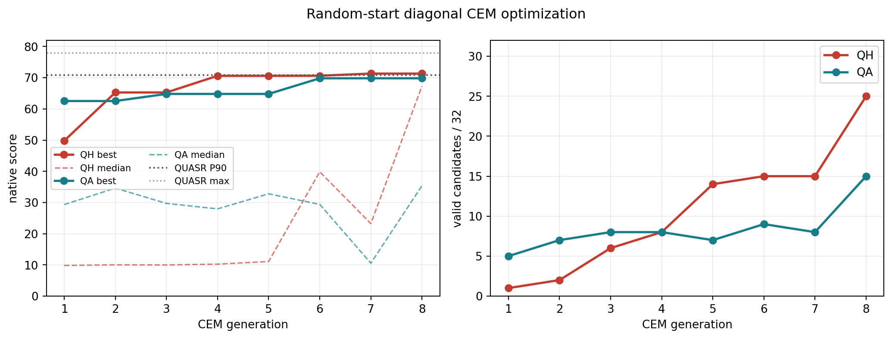

| 指标 | QH | QA |
| --- | ---: | ---: |
| 随机起点 score | 10.005 | 9.977 |
| 最优 score | **71.325** | **69.822** |
| 最优代数 | 7 | 6 |
| 第 8 代有效样本 | 25/32 | 15/32 |
| 8 代总耗时 | 519.43 s | 504.83 s |
| 平均每次评估 | 2.029 s | 1.972 s |

两组任务各用一张空闲 RTX 5090 并行运行，因此实际等待时间约 9 分钟，而不是两者
相加的 17 分钟。开发阶段的 GPU preflight 确认分配到的 GPU 在启动时利用率为零，
没有其他计算进程污染计时。

与 QUASR 独立 1000 样本基准比较：

| QUASR 指标 | score |
| --- | ---: |
| P10 | 35.33 |
| median | 64.07 |
| P90 | 70.89 |
| max | 78.02 |

QH 最优样本超过 P90，QA 最优样本位于 median 与 P90 之间。QUASR 参考集全链路成功率
为 798/1000；本轮 CEM 的第 8 代有效率分别达到 78.1% 和 46.9%，说明分布已经从大量
`no_axis` 随机样本移动到稳定可评分区域。

QH 最优样本的原生 score 分解为：

| 分量 | 分数 |
| --- | ---: |
| axis | 95.25 |
| psi | 99.84 |
| surface | 83.13 |
| coordinate | 90.20 |
| volume_qs | **3.45** |
| coil | 66.06 |

这张表很重要。总分提升主要来自磁轴、$psi$、磁面存在性和坐标质量；体 QS 分量仍低。
因此总分没有被“没有磁面”的样本欺骗，但存在另一种偏好：优化器可以先把容易改善的
几何与坐标项做到很好，而不必同步得到非常纯的目标 QS。

最优样本的关键原生诊断为：

| 诊断 | 数值 |
| --- | ---: |
| 磁轴 residual | $2.33\times10^{-8}$ |
| $psi$ angle p95 | $9.16\times10^{-6}$ |
| 原生选择面体积 | $0.01226\,\mathrm{m}^3$ |
| 原生选择面 $a/R$ | 0.0725 |
| $alpha$ 法向磁场相对残差 | $5.09\times10^{-6}$ |
| 原生 $\iota$ | 0.2905 |
| 线圈平均长度 | 5.287 m |
| 线圈曲率 p95 / max | 8.85 / 13.82 $\mathrm{m}^{-1}$ |
| 最小线圈间距 | 0.0761 m |
| 最小线圈到轴距离 | 0.3186 m |

## 5. 旧路径独立复核

### 5.1 扫描结果

旧稳定路径重新拟合 $psi$，扫描

$$
a\in\{0.05,0.08,0.12,0.16,0.20\}\,\mathrm{m},
$$

并对每个 $a$ 最多选择 6 个候选进入 Simsopt Boozer LS/Newton。结果如下：

| $a$ [m] | 最大成功 $\psi$ level | 体积 [$\mathrm{m}^3$] | Simsopt QA | Simsopt QH | Simsopt QP |
| ---: | ---: | ---: | ---: | ---: | ---: |
| 0.05 | 0.30 | 0.01020 | 0.683% | 0.690% | 0.048% |
| 0.08 | 0.36 | 0.03183 | 0.706% | 0.810% | 0.152% |
| 0.12 | 0.36 | 0.07524 | 1.048% | **1.250%** | 0.540% |
| 0.16 | 0.30 | **0.12308** | 3.481% | **4.784%** | 3.672% |
| 0.20 | 0.004 | 0.00205 | 0.662% | 0.650% | 0.010% |

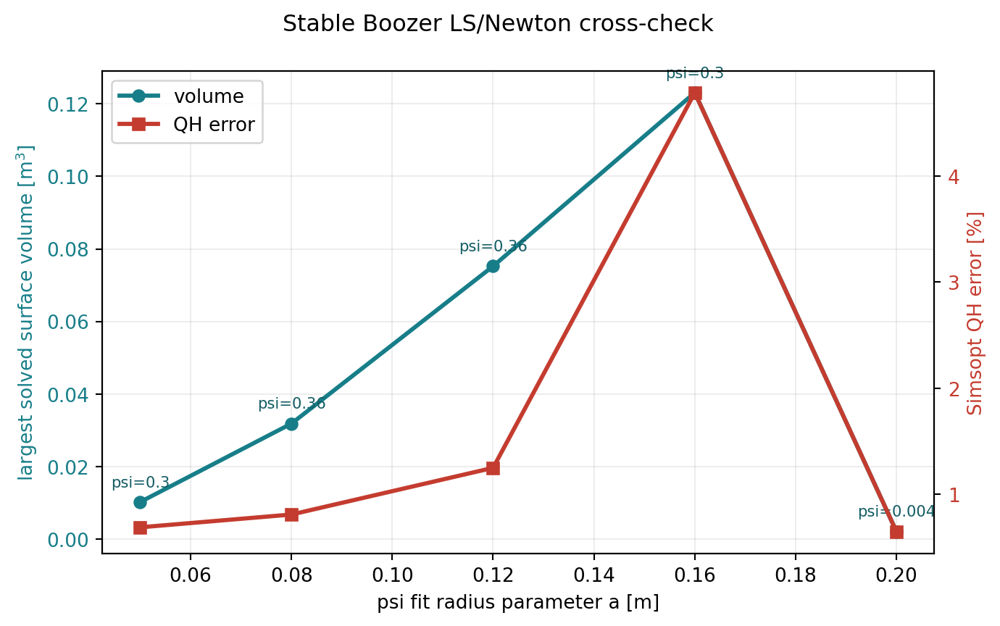

$a=0.20$ 时 $psi$ 拟合范围过大，筛选退回极小面，不应解释为位形突然变好。
$a=0.12$ 是本次扫描中“体积较大且 QH 仍约 1%”的较好折中；$a=0.16$ 是最大
计算可解面，用于最严格的可视化和 DESC 检查。

各个独立 $a$ 拟合得到的 Simsopt $\iota$ 在 $-0.548$ 到 $+0.451$ 之间跳变，不构成
连续的物理 $\iota(\rho)$ profile。这说明独立 Boozer LS 仍存在分支或角度规范差异。
因此本报告用 Poincare 和 DESC $\iota$ 做交叉验证，不把该列作为最终物理结论。

### 5.2 三维几何和磁场强度

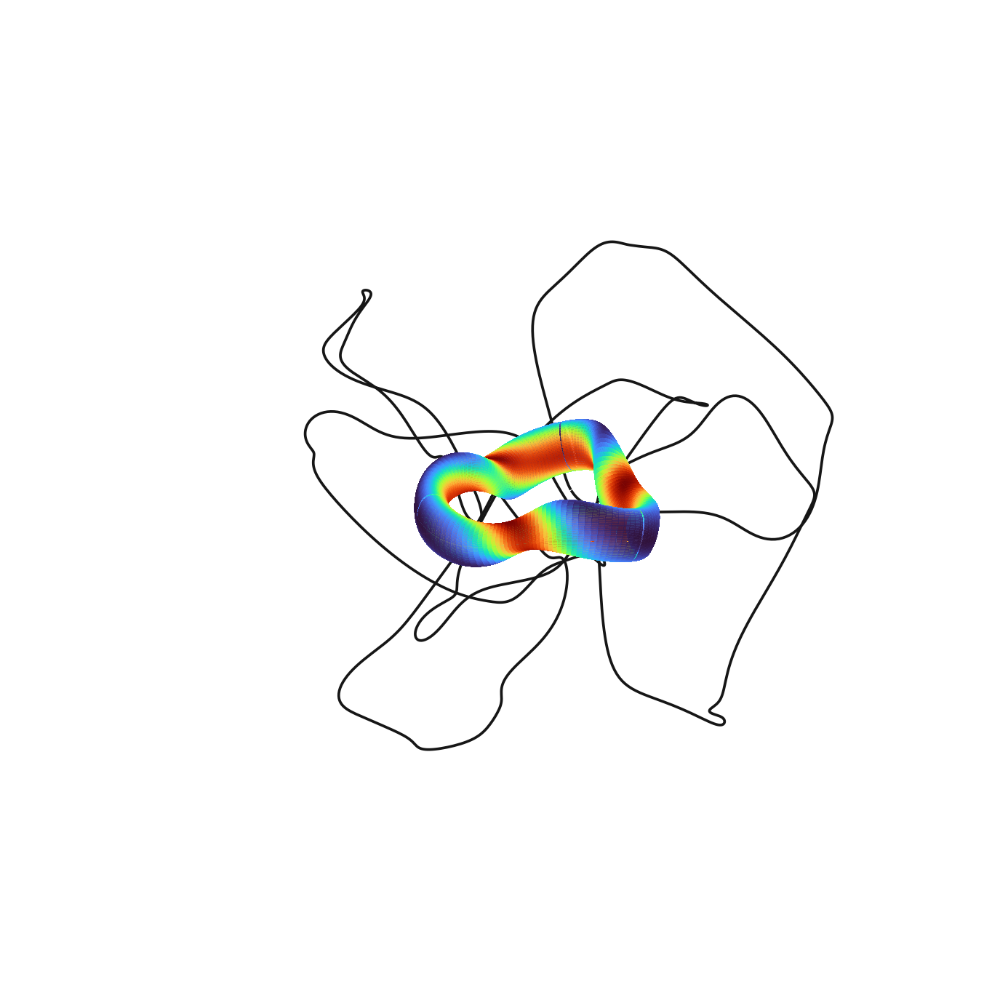

[打开可旋转的三维线圈与最大磁面](assets/native_score_cem_validation/coils_surface.html)

最大面上的外部线圈场为：

$$
|B|_{\min}=0.3050\,\mathrm{T},\qquad
\langle|B|\rangle=0.4558\,\mathrm{T},\qquad
|B|_{\max}=0.6108\,\mathrm{T}.
$$

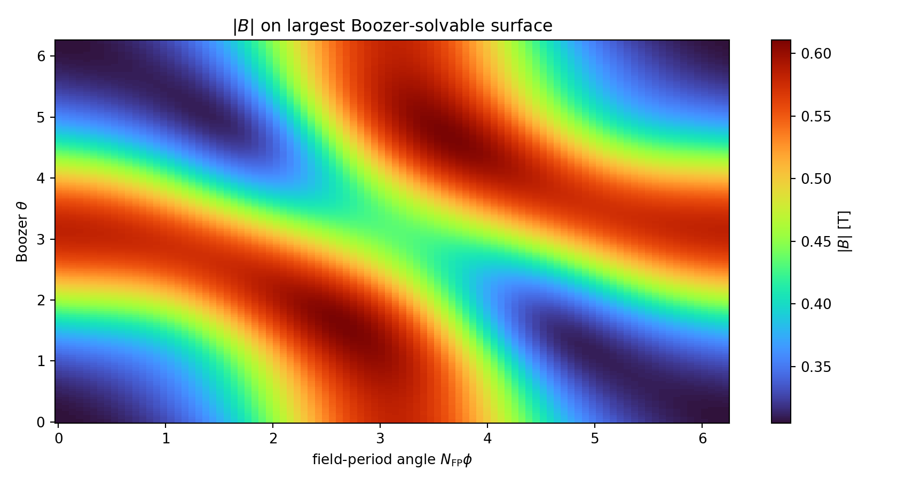

[打开 Boozer 磁场强度 HTML](assets/native_score_cem_validation/boozer_b.html)

热力图存在清晰的螺旋斜带，但不是单一完美 QH 模式。这与 Simsopt QH error
`4.78%`、原生 `volume_qs=3.45/100` 的判断一致。

### 5.3 Poincare

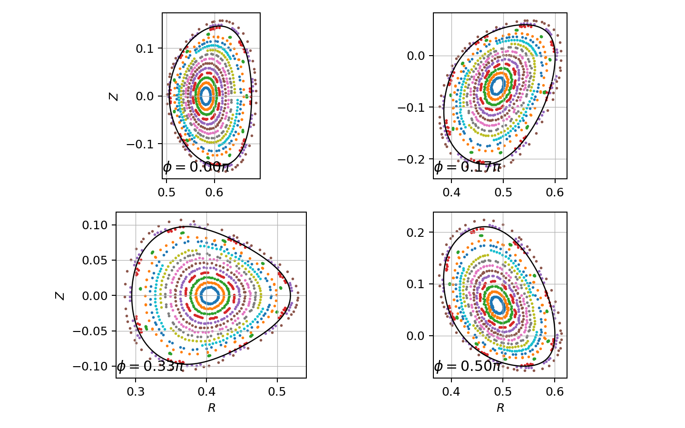

16 条初始线在四个环向截面上分别得到约 223--259 个交点。内层到外层形成连续闭合
曲线，没有出现“score 很高但根本不存在磁面”的作弊样本。最外层点相对黑色候选边界
有少量外溢，所以 $a=0.16$ 面更适合作为偏激进的最大面诊断，而不是保守生产边界。

## 6. DESC 补充验证

DESC 使用最大 Boozer 面作为固定边界，参数为：

| 参数 | 数值 |
| --- | ---: |
| `NFP` | 3 |
| 边界谱阶数 | $M=N=6$ |
| 平衡分辨率 | $L=M=N=8$ |
| 环向磁通 | $-0.0153735\,\mathrm{Wb}$ |
| pressure/current | 0 / 0 |
| 最大迭代 | 50 |

输入曲面为左手坐标，DESC 自动翻转极向角。初态和末态均通过 nested 检查。

| DESC 指标 | 初态 | 末态 |
| --- | ---: | ---: |
| normalized force mean | 1.034 | $2.04\times10^{-4}$ |
| normalized force p95 | 2.438 | $5.75\times10^{-4}$ |
| normalized force max | 6.812 | $3.89\times10^{-3}$ |

优化器运行 50 代、56 次函数评估，最终 cost 为 $9.95\times10^{-9}$，optimality 为
$7.75\times10^{-7}$。停止原因是达到迭代上限，而不是 NaN、非嵌套或坐标折叠。

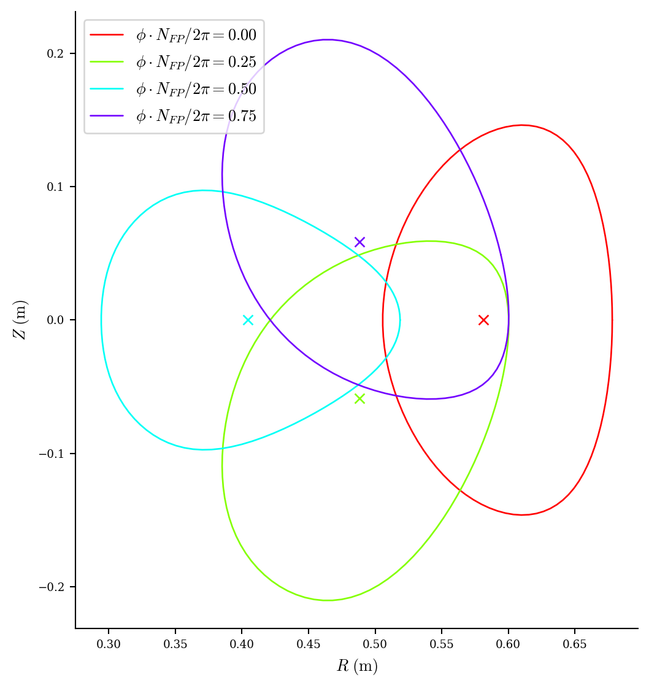

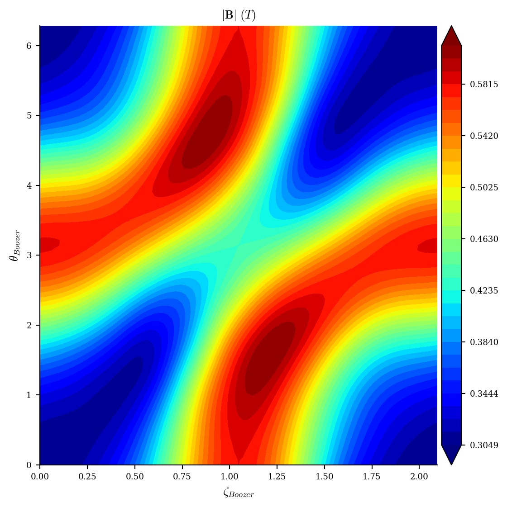

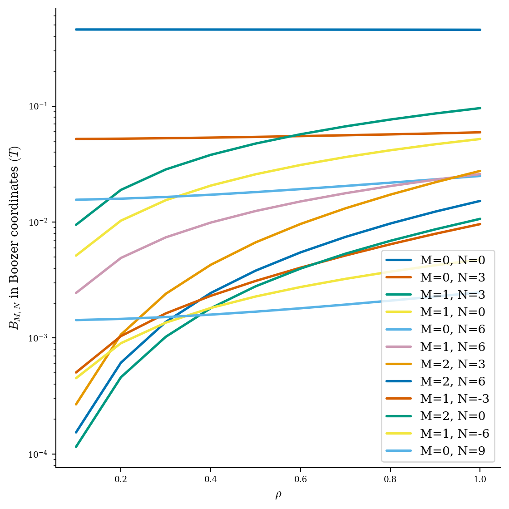

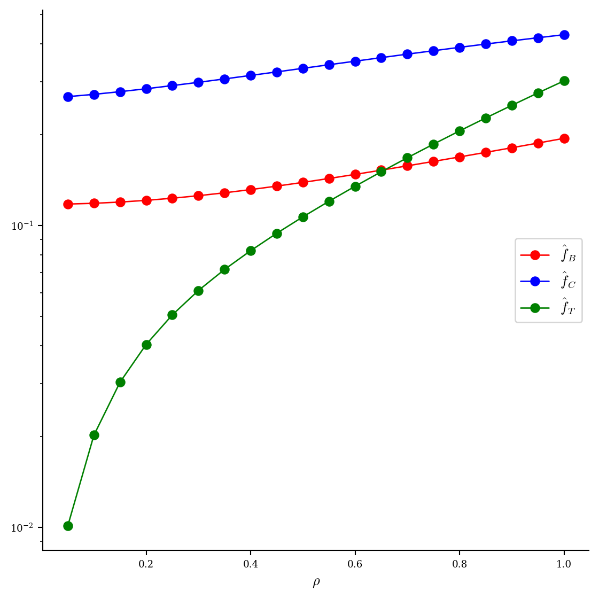

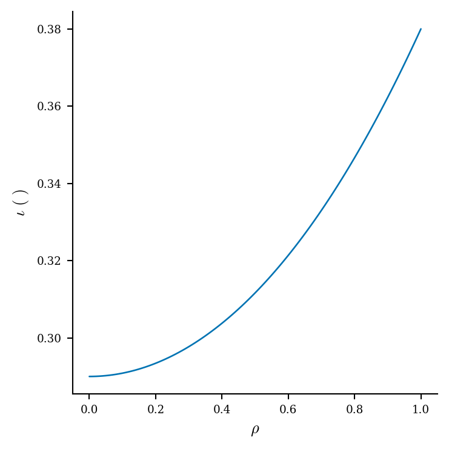

DESC 的 $\iota$ 从轴附近约 0.29 平滑增加到边界约 0.38，比独立磁面 LS 给出的跳变值
更适合作为整体 profile 参考。DESC QH 指标随半径变差，边界并非高精度 QH，这再次
说明本轮高总分主要证明“磁面和总体质量好”，不能证明目标特异性已经充分优化。

## 7. 耗时

### 7.1 原生 score

QH 最优样本的一次原生评分耗时 `2.150 s`：

| 阶段 | 时间 [s] |
| --- | ---: |
| 磁轴搜索 | 0.895 |
| 磁轴追踪 | 0.019 |
| $psi$ 点生成 | 0.031 |
| $psi$ QR 拟合 | 0.220 |
| $psi$ 验证 | 0.171 |
| 磁面筛选 | 0.746 |
| 磁通标定 | 0.003 |
| $\alpha$ 矩阵装配 | 0.002 |
| $\alpha$ QR 求解 | 0.055 |
| QS 统计 | $4.36\times10^{-4}$ |

当前小型 CEM 脚本在单 GPU 上顺序评分 32 个候选，所以均摊约 2 秒/样本。先前 1000
样本正式评测使用 4 张 RTX 5090 和每卡最优并行设置，端到端吞吐为
`0.879 s/sample`；本轮小实验没有为吞吐重写 CEM 调度器。

### 7.2 旧路径和 DESC

| 任务 | 时间 |
| --- | ---: |
| 五组 $a$ 的稳定旧路径数值计算总和 | 18.14 s |
| 单组 $a$ 总时间范围 | 2.36--5.20 s |
| Poincare 16 条线 | 约 9 s |
| DESC initial force | 6.34 s |
| DESC solve | 141.84 s |
| DESC 最终图 | 约 38.3 s |
| 复用扫描后的最终绘图 + DESC 作业 | 232.62 s |

DESC 0.16 使用独立 CPU JAX 环境，未使用 RTX 5090。它是离线补充验证，不属于目标
的原生快速 score 路径，也不应计入线圈到 score 的生产耗时。

## 8. 开发中修正的问题

1. 完整评估最初依赖环境中未声明的 Plotly，导致旧路径扫描成功后在绘图阶段退出。
   现已改为静态 Matplotlib PNG，以及数据内嵌的 Three.js 交互 HTML；Python 端不再
   依赖 Plotly。
2. 评估脚本现在会复用已经完成的 `a` 扫描，绘图或 DESC 失败后无需重新计算旧路径。
3. 新服务器的稳定版虚拟环境没有 DESC，而且 JAX/Scipy 版本与 DESC 0.16 不兼容。
   已建立独立环境，通过 SHA-256 核对的离线 wheelhouse 安装，不修改稳定 score 环境。
4. Slurm `sbatch --test-only` 曾错误预估 P107 要等待一天；真实探针和后续 P107 作业
   均在提交当秒启动。后续以真实 pending reason 为准，不再依据该失真预估等待。

## 9. 最终判断与下一步

### 已经证明

- 当前 score 具有可优化梯度，不只是 QUASR 样本上的离线排序指标；
- CEM 能从几乎全失败的随机邻域移动到大多数样本可稳定评分的区域；
- 随机优化得到的高分样本有真实嵌套磁面，而非依靠固定小圆柱或无磁面区域作弊；
- 中等大面 QS error 约 1%，最大面约 3%--5%；
- 最大边界可以得到 nested、低 force residual 的 DESC equilibrium。

### 尚未证明

- 单次 QA/QH 随机起点不足以证明大范围优化鲁棒性；
- QH 目标没有表现出很强的 QA/QH/QP 分离，不能据此宣称得到高纯度 QH；
- 最大面独立 Boozer $\iota$ 存在分支跳变，严格的连续面分支追踪仍需改进；
- DESC 达到最大迭代数，虽然结果低残差且 nested，但没有满足优化器正式成功条件。

### 最有价值的后续改进

1. 提高大体积 `volume_qs` 在 65--80 分区间的影响，避免 axis/psi/coordinate 高分掩盖
   目标 QS 较弱；
2. 在 score 中加入目标 helicity 相对非目标 helicity 的 margin，而不只看绝对 QS；
3. 用连续 $\psi$ level continuation 约束旧 Boozer 分支，消除独立 $a$ 扫描的 $\iota$
   跳变；
4. 将 CEM population 分发到 4 GPU、每卡复用已验证的最优并行度，缩短优化墙钟时间。

本轮目标是验证有效性而非全面扫参。以这个标准看，实验已经成功；更严格的结论应在
改进目标特异性后，用多个随机起点重复。

## 10. 产物

- [QH CEM 原始汇总](assets/native_score_cem_validation/raw/cem_qh_summary.json)
- [QA CEM 原始汇总](assets/native_score_cem_validation/raw/cem_qa_summary.json)
- [全面评估汇总](assets/native_score_cem_validation/raw/full_summary.json)
- [QUASR 1000 样本参考](assets/native_score_cem_validation/raw/quasr_1000_reference.json)
- [DESC 输入](assets/native_score_cem_validation/desc/input.check)
- [DESC equilibrium](assets/native_score_cem_validation/desc/equilibrium.h5)
- [DESC 原始汇总](assets/native_score_cem_validation/desc/summary.json)

## 11. 后续修正：三周期 HTML 拓扑

原交互 HTML 的磁面只含一个场周期。绘图代码先把这个周期首尾闭合，再复制旋转三份，
所以每个周期都被错误地封成独立曲面；视觉上表现为每一周期的首尾被强行连接，而不是
三个周期依次连接成完整装置。

现实现先在 Python 端把一个周期旋转拼接为完整三周期顶点，再对完整环向网格只做一次
周期闭合。实际产物包含 55296 个顶点和 110592 个三角形。索引级回归检查结果为：

- 三个相邻场周期的交界边全部存在；
- 三个旧的“单周期首尾封口边”全部不存在；
- 第三周期末端只与第一周期起点连接；
- 无头浏览器实际渲染非空，显示为一张连续的三周期闭合曲面。

[打开修正后的线圈与磁面 HTML](assets/native_score_cem_validation/coils_surface.html)

## 12. 微分 QS 分量的缩放复核

### 12.1 必须修正的 helicity 尺度

当前微分目标满足

$$
f_C(kM,kN)=k f_C(M,N).
$$

因此直接用同一软阈值比较 QA 的 $(M,N)=(1,0)$ 和 QH 的 $(1,N_{\mathrm{fp}})$，会仅因
helicity 向量更长而系统性压低 QH。现评分保持原始诊断量不变，只把软阈值改为

$$
h=\sqrt{M^2+N^2},\qquad
s_{\mathrm{global}}=0.05h,\qquad
s_{\mathrm{edge}}=0.07h.
$$

1000 个 QUASR 验证样本中有 798 个完整成功。修正前后的 `volume_qs` 分量如下：

| 模式 | 样本数 | 修正前 P10 / 中位数 / P90 | 修正后 P10 / 中位数 / P90 |
| --- | ---: | ---: | ---: |
| QA | 441 | 7.78 / 25.84 / 39.08 | 7.78 / 25.84 / 39.08 |
| QH | 357 | 4.81 / 9.05 / 17.72 | 15.53 / 22.37 / 29.25 |

QA 不受影响；QH 不再因为 $N_{\mathrm{fp}}$ 的纯代数尺度被额外惩罚。旧 CEM 保存的 QH
候选中，QS 分量的中位数从 1.28 重标为 3.49，最大值从 5.40 重标为 13.60；原全面
评估候选用新二进制重算后为 9.12。这仍明显低于 QUASR QH 中位数 22.37，说明 CEM
候选确实不够 QH，而不是仅仅被错误尺度压低。

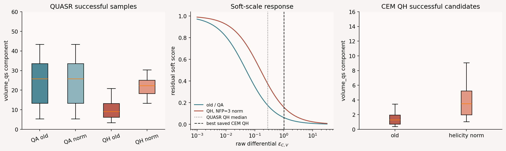

### 12.2 是否还应继续放宽阈值

结论是暂不继续放宽。微分 QS 与 QUASR 元数据中的旧面 QS 不是同一归一化：两者比值的
$\log_{10}$ 中位数为 4.65，不能共用数值阈值。当前 helicity 归一化后，QUASR 好样本和
CEM 差样本已有明确梯度；继续增大阈值只会把真实较差的 CEM 样本抬高，削弱区分度。

当前 CEM 总分约 72 而 QS 分量只有 9--14，暴露的是总目标中其他高分项可以补偿 QS，
不是 QS 软阈值过严。若下一轮优化仍忽略 QS，合理改法是提高该分量的总权重、设置最低
QS 门槛，或加入目标 helicity 相对非目标 helicity 的 margin，而不是继续放大软阈值。

[缩放审计原始 JSON](assets/native_score_cem_validation/qs_score_scale_audit.json)

## 13. 微分 QS 是否会被形状或点数“作弊”

### 13.1 先区分原始量和最终分量

原始 `qs_global_error` 是在选定物理体积上计算的微分 QS RMS。最终 `volume_qs` 分量为

$$
S_{\mathrm{volume\_qs}}
=100\,S_{\mathrm{residual}}
\left(0.35+0.65S_{\mathrm{size}}\right).
$$

所以最终分量本来就不是“纯 QS”，而是“较大有效体积上的 QS”。磁面尺寸影响最终分量
是设计目标，不是采样泄漏。需要防止的是点数变化、无效点丢弃或错误体积权重影响
$S_{\mathrm{residual}}$。

### 13.2 找到并修正的体积权重 bug

采样在每条星形射线上对 $u=\rho^2$、$\theta$、$\phi$ 均匀。令边界半径为
$r_b(\theta,\phi)$，柱坐标体积元给出

$$
dV=R\,r\,dr\,d\theta\,d\phi
=\frac{1}{2}R\,r_b^2\,du\,d\theta\,d\phi.
$$

因此每点物理体积权重应满足

$$
w_i\propto R_i r_{b,i}^2.
$$

旧实现只用了 $R_i$，漏掉 $r_{b,i}^2$，使不同形状磁面的隐式角向权重不正确。该 bug
已经在 C++/CUDA 和 CPU 参考实现中同时修正。修正前后 798 个共同成功样本的原始 QS
秩相关为 0.99915；相对变化中位数为 0.27%，P10/P90 为 $-7.12\%/+5.80\%$。这说明
旧结果的大体排序没有崩坏，但新结果才是严格的物理体积平均。

### 13.3 点数与有效点审计

定义加权有效样本比例

$$
\eta_{\mathrm{ESS}}
=\frac{\left(\sum_i w_i\right)^2}{N\sum_i w_i^2}.
$$

则有效点数为 $N_{\mathrm{eff}}=N\eta_{\mathrm{ESS}}$。修正后的 1000 样本结果为：

| 指标 | 最小值 | P10 | 中位数 | P90 | 最大值 |
| --- | ---: | ---: | ---: | ---: | ---: |
| 实际 QS 点数 | 100000 | 100000 | 100000 | 100000 | 100000 |
| 候选有效比例 | 0.99870 | 1.00000 | 1.00000 | 1.00000 | 1.00000 |
| $\eta_{\mathrm{ESS}}$ | 0.1085 | 0.3578 | 0.6114 | 0.8036 | 0.9423 |
| $N_{\mathrm{eff}}$ | 10847 | 35783 | 61140 | 80363 | 94230 |

所有成功样本都使用相同的 10 万点，因此不存在“少算点反而得高分”的通道。总分前 20
的有效比例全部为 1，最低 $\eta_{\mathrm{ESS}}=0.729$；QS 分量前 20 的有效比例也全部
为 1，最低 $\eta_{\mathrm{ESS}}=0.596$。高分样本没有依赖权重集中。

代码进一步收紧为：只有可用点足以填满固定预算，且候选有效比例至少 95% 时才允许
进入 QS 评分。这样优化器不能通过主动制造无效区域来丢弃最多 40% 的坏点。ESS 保留为
诊断量而不直接扣分，因为它描述物理体积权重的集中程度，盲目惩罚会把合法磁面形状
当作作弊。

### 13.4 最终分量主要由什么决定

在 QA、QH 内分别统计后：

| 相关量 | QA Spearman | QH Spearman |
| --- | ---: | ---: |
| `volume_qs` 与 $-\log_{10}$ 原始微分 QS | 0.956 | 0.937 |
| `volume_qs` 与残差软分数 | 0.956 | 0.939 |
| `volume_qs` 与磁面尺寸因子 | 0.223 | -0.490 |
| `volume_qs` 与 $\eta_{\mathrm{ESS}}$ | 0.153 | -0.557 |
| 原始微分 QS 与 QUASR 旧面 QS | 0.874 | 0.531 |

因此在各自模式内，最终分量首先由微分 QS 残差决定，不是由点数决定。QH 中 ESS 与
分量存在中等相关，但这是数据集中磁面形状、场梯度和真实 QS 品质共同变化造成的协方差；
ESS 不直接进入评分公式。更重要的是，最低 ESS 样本的加密复核没有显示数值漂移。

最后一行也给出必要限制：这个微分体积指标与旧的单面 Boozer/Fourier QS 有一致排序，
但并不等价，尤其 QH 只有中等相关。原因包括体积平均与单面指标的目标不同、选取磁面
不同，以及当前 $\alpha/\iota$ 仍是有限阶拟合。因此可以说它主要反映“当前定义下的
体微分 QS”，不能把它直接宣称为旧 `qs_error` 的高精度替代值。

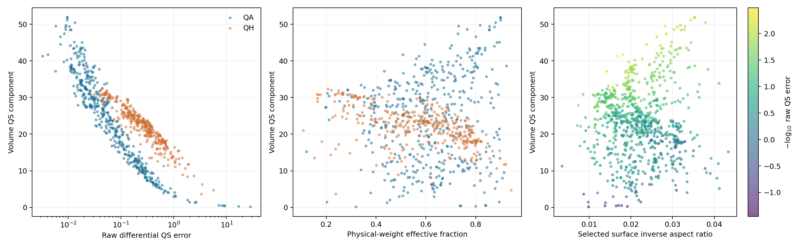

### 13.5 5 万、10 万、20 万点收敛复核

选择 QA/QH 中最低 ESS 样本和最高 QS 分量样本各一个，共 4 个极端样本，在同一原生
C++/CUDA 黑箱上分别使用 5 万、10 万和 20 万点。12 次评估全部成功。

以 20 万点为参考，10 万点的原始 QS 最大相对变化为 1.38%，QS 分量最大绝对变化仅
0.114 分。两个最低 ESS 样本的原始 QS 相对变化分别为 0.020% 和 0.020%。即使最坏的
1.38% 出现在非常低误差的高分 QA 样本上，也只改变最终 QS 分量 0.22%。默认 10 万点
已经足够稳定，没有必要把生产成本翻倍。

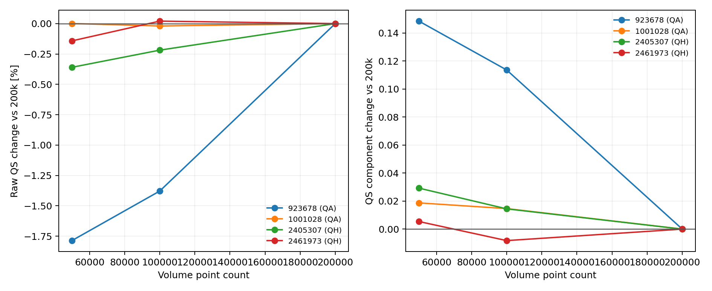

[采样审计原始 JSON](assets/native_score_cem_validation/qs_sampling_audit.json)

## 14. 修正后 1000 样本速度与最终结论

修正后的完整验证仍有 798/1000 个样本成功，与修正前完全一致。4 张空闲 RTX 5090
并行时总墙钟为 882.43 秒，均摊 0.882 秒/样本。单样本内部计时均值为 3.42 秒，最大
7.75 秒，100% 小于 10 秒。开始预检时四张卡均为 0% 利用率、2 MiB 显存。

最终判断如下：

1. 原始微分 QS 确实主要反映选定物理体积上的微分 QS 误差，但不是旧单面 QS 数值的
   同义词；QH 上需要保留这项口径差异。
2. 原实现存在真实的形状权重 bug，现已用 $Rr_b^2$ 修正；旧排序大致有效，但新结果
   才有正确物理体积含义。
3. 当前成功评分固定使用 10 万点，并新增 95% 有效率门槛，点数与无效区域作弊通道
   已被关闭。
4. helicity 归一化是必要修正；当前不应继续放宽 QS 软阈值。若优化仍产出“总分高但
   QS 一般”的样本，应修改分量权重或目标特异性，而不是把差 QS 样本的分数整体抬高。
5. 修正后的 HTML、统计脚本、CPU/CUDA 实现和单测均已更新。最终原生库 smoke 返回
   `ok`，使用 100000 点且有效率为 1。

- [修正后 1000 样本汇总](assets/native_score_cem_validation/corrected_validation/summary.json)
- [修正后逐样本数据](assets/native_score_cem_validation/corrected_validation/rows.csv)

## 15. 长时单种子 CEM 最终验收

本节是 2026-07-27 完成的追加验收。第 1--10 节记录的是早期 8 代小实验；本节使用
同一个 QH 随机种子继续到 96 代，并对最终最高分样本重新运行完整旧路径。若数值与前文
不同，以本节为准。

### 15.1 结论先行

1. **当前 score 确实可用于黑箱优化。** 单个随机 QH 种子从 10.005 提升到
   **78.935**，超过修正后 QUASR-1000 参考集最大值 78.021；最佳值到第 94 代仍在更新，
   因此原来的 8 代实验明显没有走到极限。
2. **最高分不是无磁面或少算点得到的伪解。** 原生评分使用完整 10 万体点，有效率为 1，
   体积权重有效样本比例为 0.984。旧路径找到体积从 $0.0184$ 到
   $0.1940\,\mathrm{m}^3$ 的一系列 Boozer LS/Newton 可解面；Poincare 截面保持连续嵌套。
3. **它是“有很大好磁面”的线圈，但不是“很纯的 QH”线圈。** 最高分样本的原生
   `volume_qs` 只有 23.27，原始微分 QH 残差为 0.528。旧路径在所有扫描尺度上都给出
   QA error 小于 QH error；最大面上 QA/QH/QP 分别为 2.28%/7.07%/7.05%。
4. **DESC 给出正面的平衡验证。** 最大边界的初态和末态均 nested，最终归一化 force
   mean/p95/max 为 $4.28\times10^{-5}$、$1.32\times10^{-4}$、
   $9.26\times10^{-4}$。求解达到 50 次迭代上限，故准确表述仍是“低残差、嵌套，
   但未按优化器停止条件正式收敛”。
5. **最终验收暴露的主要缺口是目标特异性，而不是稳定性。** 当前 score 能找到总体实用、
   磁面很大的线圈，但 QH 优化可以通过尺寸、坐标和其他高分项补偿中等 QH 品质。

因此，本轮单种子极限实验验证了 score 对“总体好线圈”的优化价值，也明确否定了更强的
说法：不能因为目标标签是 QH、总分接近 79，就声称已经优化出高纯度 QH。

## 16. 长时优化配置、速度与收敛

### 16.1 固定预算

| 参数 | 数值 |
| --- | ---: |
| 目标 | QH，$N_{\mathrm{FP}}=3$ |
| 随机种子 | 2026072801 |
| generation | 96 |
| population / elite | 160 / 40 |
| 总候选数 | 15360 |
| 初始标准差 / 平滑系数 | 0.35 / 0.55 |
| GPU | 4 张 RTX 5090 |
| worker | 每卡 2 个，共 8 个 |

作业 `28086` 正常退出，Slurm 墙钟为 2:07:32，CEM 内部墙钟为 7649.49 秒。四张卡
开始时均为 0% 利用率、2 MiB 显存，因此计时没有受到其他 GPU 任务污染。吞吐均摊为

$$
\frac{7649.49\ \mathrm{s}}{15360}=0.4980\ \mathrm{s/candidate}.
$$

最高分候选在每卡双 worker 竞争资源时，单次原生内部计时为 4.068 秒；两者不矛盾：
前者是 4 卡 8 worker 的生产吞吐，后者是单个候选在并发环境中的自身延迟。

### 16.2 收敛过程

| 代数 | 历史最优 | 当代中位数 | 成功数 / 160 | 平均 $\sigma$ |
| ---: | ---: | ---: | ---: | ---: |
| 1 | 69.161 | 9.826 | 4 | 0.3466 |
| 8 | 74.064 | 63.428 | 102 | 0.3137 |
| 16 | 76.171 | 71.798 | 155 | 0.2690 |
| 32 | 77.849 | 75.248 | 154 | 0.1977 |
| 48 | 78.478 | 76.323 | 159 | 0.1488 |
| 64 | 78.583 | 77.032 | 155 | 0.1131 |
| 80 | 78.849 | 77.944 | 152 | 0.0834 |
| 94 | **78.935** | 78.297 | 138 | 0.0621 |
| 96 | **78.935** | 78.405 | 147 | 0.0612 |

8 代后又提高 4.871 分，说明早期实验确实太短；48 代后只再提高 0.457 分，说明后半程
已进入明显的边际收益递减区。最佳值仍在第 94 代刷新，所以本次预算适合作为“单种子走到
较深”的探索，但还不能声称严格收敛到全局最优。

15360 个候选的最终状态为：13751 个 `ok`、1529 个 `no_axis`、47 个
`drift_rejected`、32 个 `no_surface`、1 个 `flux_rejected`。总成功率为 89.52%，
相比第 1 代的 2.5%，CEM 已清楚地把分布移动到稳定可评分区域。

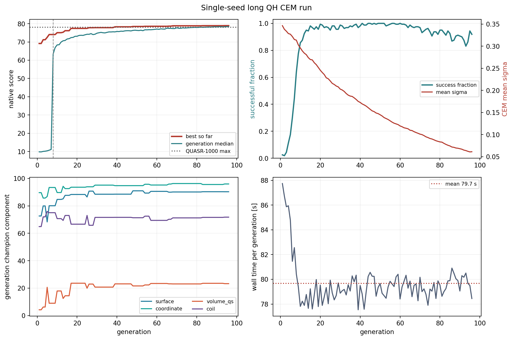

## 17. 分数到底优化了什么

### 17.1 最高总分样本

| 分量 | 分数 |
| --- | ---: |
| axis | 99.898 |
| psi | 99.966 |
| surface | 90.308 |
| coordinate | 95.979 |
| volume_qs | **23.272** |
| coil | 71.772 |
| 总分 | **78.935** |

关键原生诊断为：

| 诊断 | 数值 |
| --- | ---: |
| 原始全体积 QH 残差 | 0.5276 |
| 边缘 QH 残差 | 0.7114 |
| 原生选择面体积 | $0.018355\,\mathrm{m}^3$ |
| 原生选择面 $a/R$ | 0.1042 |
| $\alpha$ 法向场相对残差 | $3.24\times10^{-6}$ |
| 原生 $\iota$ | 0.06881 |
| 体点有效比例 | 1.0000 |
| 体积权重 $\eta_{\mathrm{ESS}}$ | 0.9837 |

修正后 QUASR QH 成功样本的 `volume_qs` 中位数和 P90 分别为 22.37 和 29.25。
因此 23.27 只是略高于中位数，并不支持“极佳 QH”；总分超过参考集最大值主要来自
极好的轴、$psi$、坐标质量，以及显著更大的有效磁面。

### 17.2 全候选 Pareto 审计

| 候选 | 总分 | `volume_qs` | 原始 QH | $a/R$ |
| --- | ---: | ---: | ---: | ---: |
| 最高总分 | **78.935** | 23.272 | 0.5276 | **0.1042** |
| 最高 `volume_qs` | 77.064 | **25.778** | 0.4189 | 0.0809 |
| $a/R\ge0.06$ 中最低原始 QH | 76.773 | 25.377 | **0.3933** | 0.0652 |
| 全部样本中最低原始 QH | 58.648 | 15.280 | **0.2369** | 0.0051 |

最低原始 QH 的样本只有极小磁面，按“较大磁面才有价值”的要求不应得高分；这一点说明
尺寸因子正在发挥预期作用。另一方面，最高总分没有选择较大磁面中 QH 最好的候选，说明
总目标仍允许尺寸和其他分量补偿 QH。这里不是采样点数作弊：最高总分样本使用完整 10 万点，
有效比例为 1，且 ESS 很高。这是当前目标函数真实表达出的工程权衡。

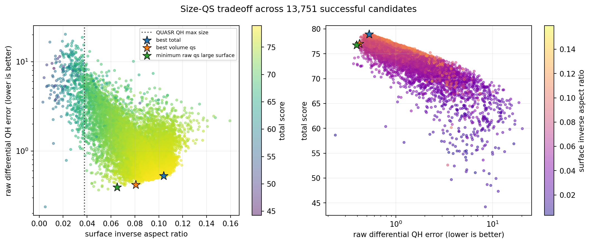

## 18. 旧稳定路径独立验收

### 18.1 验收脚本 bug 与修正

第一次完整验收作业 `28113` 在 $a=0.05,0.08$ 成功后，后续三个尺度出现
`Path.cwd()` 的 `FileNotFoundError`。这不是磁面失败：第三方 Boozer 调用后进程工作目录
出现了已失效状态，而验收脚本中的 GPU 动态库相对路径仍隐式依赖当前目录。现有证据足以
定位这个路径状态 bug，但不把工作目录变化进一步归因到某个未经隔离验证的第三方函数。

修正包含两层：

1. case、输出目录和 GPU 动态库在程序启动时全部解析为绝对路径；
2. 每个尺度开始和结束都恢复到仓库根目录，隔离第三方调用留下的工作目录状态。

修正后作业 `28117` 复用前两个尺度并补跑后三个尺度，五组全部成功，最终状态为
`completed`。本地完整回归为 `34 passed`。因此第一次作业中关于 $a\ge0.12$ 的失败
不能作物理解读，下面只使用修正后的最终结果。

### 18.2 五尺度磁面扫描

| $a$ [m] | 最大成功 $\psi$ level | 体积 [$\mathrm{m}^3$] | $\iota$ | QA | QH | QP |
| ---: | ---: | ---: | ---: | ---: | ---: | ---: |
| 0.05 | 0.81 | 0.01835 | -0.06995 | 0.189% | 0.683% | 0.689% |
| 0.08 | 0.64 | 0.03777 | -0.07192 | 0.395% | 1.402% | 1.413% |
| 0.12 | 0.64 | 0.08907 | -0.07728 | 0.969% | 3.285% | 3.300% |
| 0.16 | 0.49 | 0.13476 | -0.08222 | 1.518% | 4.943% | 4.951% |
| 0.20 | 0.36 | **0.19403** | -0.08882 | 2.281% | **7.068%** | 7.053% |

原生 score 选择的体积为 $0.0183552\,\mathrm{m}^3$；旧路径在 $a=0.05$、
$\psi=0.81$ 得到 $0.0183547\,\mathrm{m}^3$，相对差仅 0.0024%。对应 Boozer LS
残差为 $3.46\times10^{-15}$。这是一项很强的交叉验证：原生快速磁面选择不是虚假的
几何壳，而是旧 Boozer 方程也能精确求解的真实面。

最大扫描面体积是原生选择面的 10.57 倍，Boozer LS 残差仍为
$4.74\times10^{-15}$。所以该线圈确实支持很大的嵌套区域。不过误差随尺寸单调变差，
而 QA 始终明显优于 QH；这正是“总体实用但目标 QH 不纯”的定量证据。

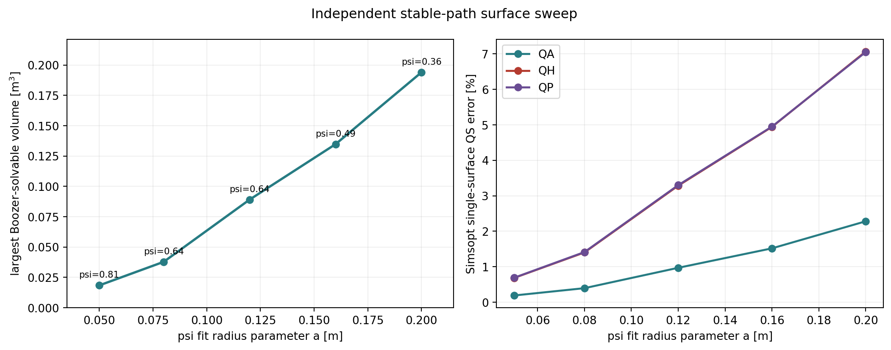

### 18.3 几何、Poincare 与 $|B|$

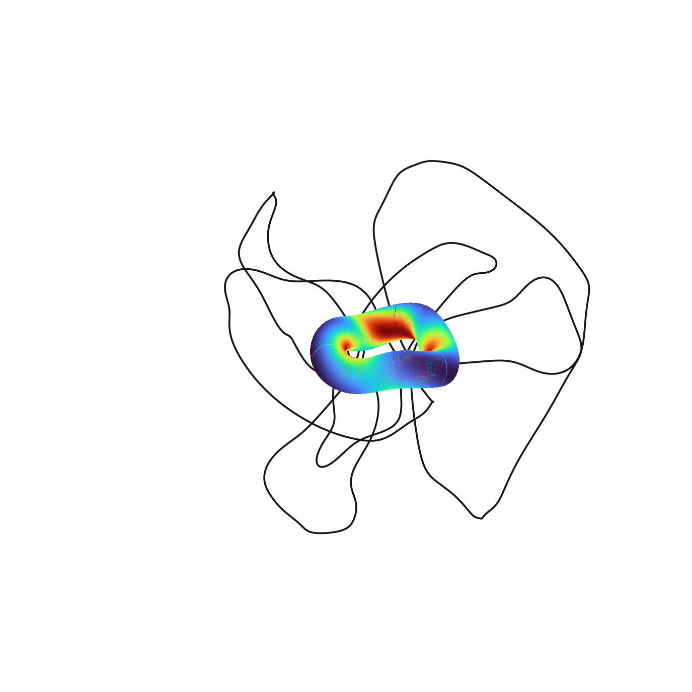

[打开可旋转的三维线圈与最大面](assets/native_score_cem_validation/long_qh_cem/full_eval/coils_surface.html)

最大面上的线圈真空场满足

$$
|B|_{\min}=0.3405\,\mathrm{T},\qquad
\langle|B|\rangle=0.5496\,\mathrm{T},\qquad
|B|_{\max}=0.8642\,\mathrm{T}.
$$

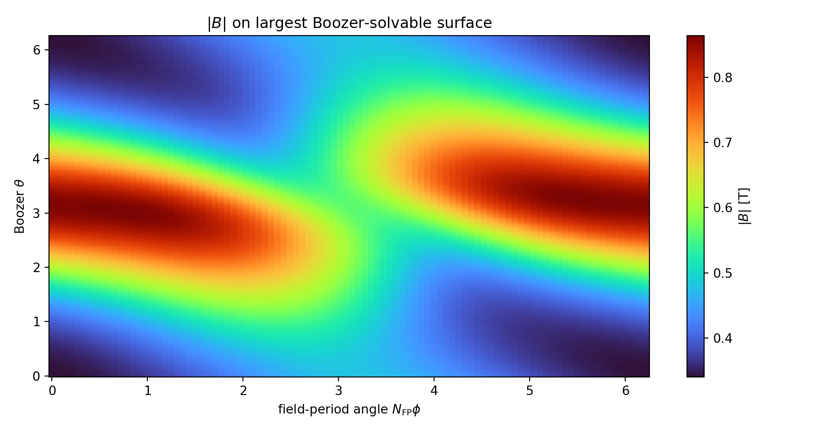

[打开最大面 $|B|$ 交互图](assets/native_score_cem_validation/long_qh_cem/full_eval/boozer_b.html)

$|B|$ 主带更接近横向起伏，而不是干净、单一的 QH 斜带。该视觉判断与 QA error 低于
QH error 一致。

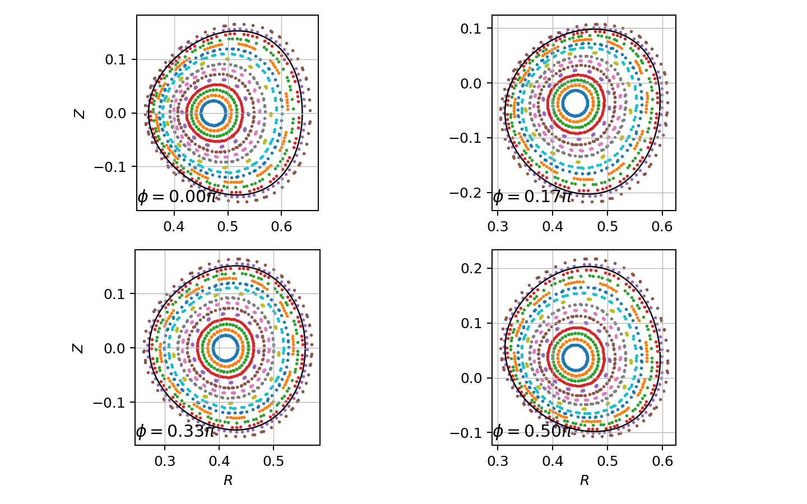

16 条场线在四个截面各留下约 303--371 个交点，形成由内到外的连续闭合层，没有看到
明显磁岛链或整体破裂。最外层散点略超出黑色拟合边界，且交点数向外下降，因此
$a=0.20$ 应理解为“本次扫描中可解的激进大面”，不是已经证明的严格最大保守边界。

## 19. DESC 最大边界复核

DESC 使用 $a=0.20$ 的最大 Boozer 面作为固定边界，边界谱阶数为 $M=N=6$，平衡分辨率
为 $L=M=N=8$，环向磁通为 $-0.03398\,\mathrm{Wb}$，pressure/current 均为零。

| DESC 指标 | 初态 | 末态 |
| --- | ---: | ---: |
| nested | true | true |
| normalized force mean | 1.536 | $4.28\times10^{-5}$ |
| normalized force p95 | 3.261 | $1.32\times10^{-4}$ |
| normalized force max | 5.473 | $9.26\times10^{-4}$ |

求解进行了 50 次迭代、62 次函数评估，用时 148.35 秒；最终 cost 为
$3.32\times10^{-10}$，optimality 为 $1.11\times10^{-6}$。停止原因是达到最大迭代数，
不是 NaN、非嵌套或坐标折叠。DESC 的 $\iota$ 从轴附近约 0.068 平滑增加到边界约
0.089，与原生内部 $\iota=0.0688$ 及旧面拟合的绝对值连续一致；旧路径的负号来自
表面手性约定。

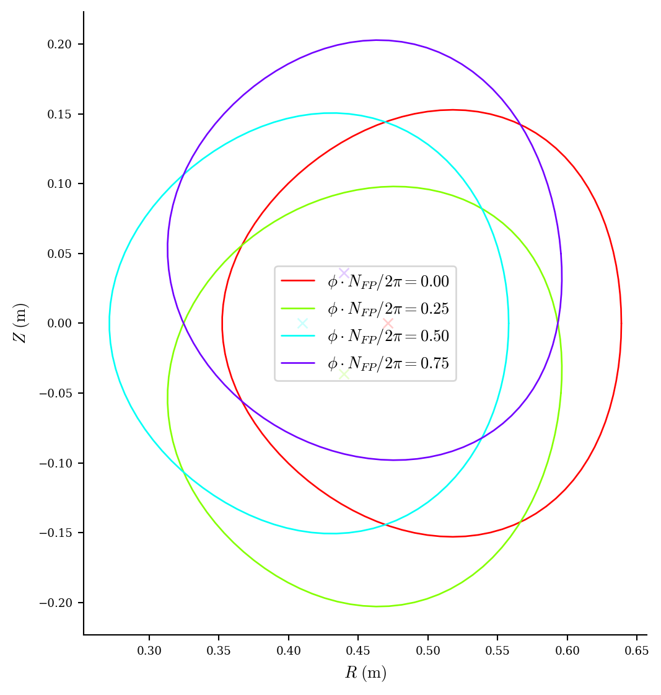

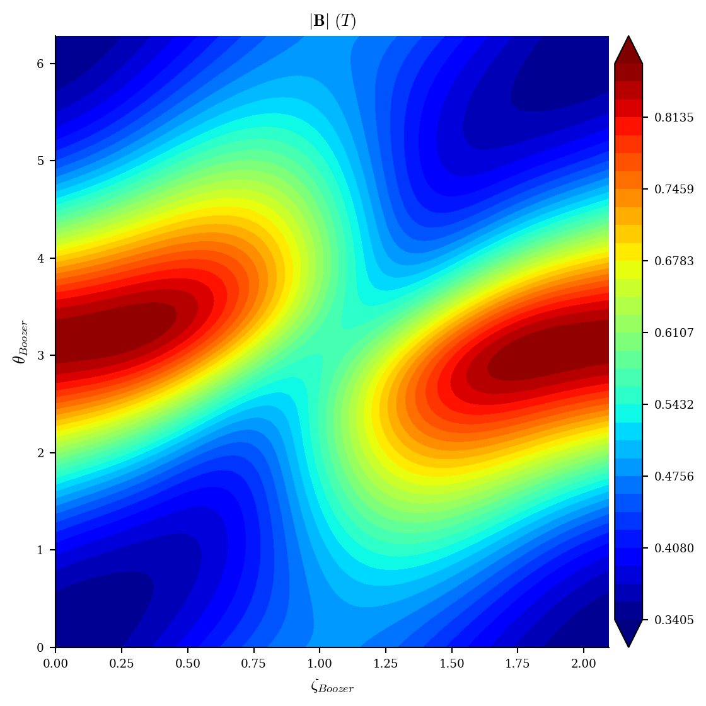

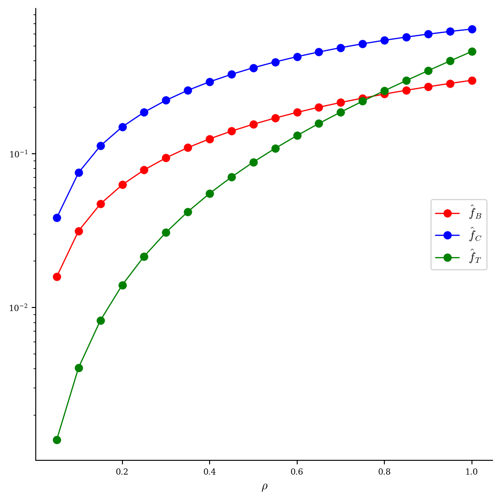

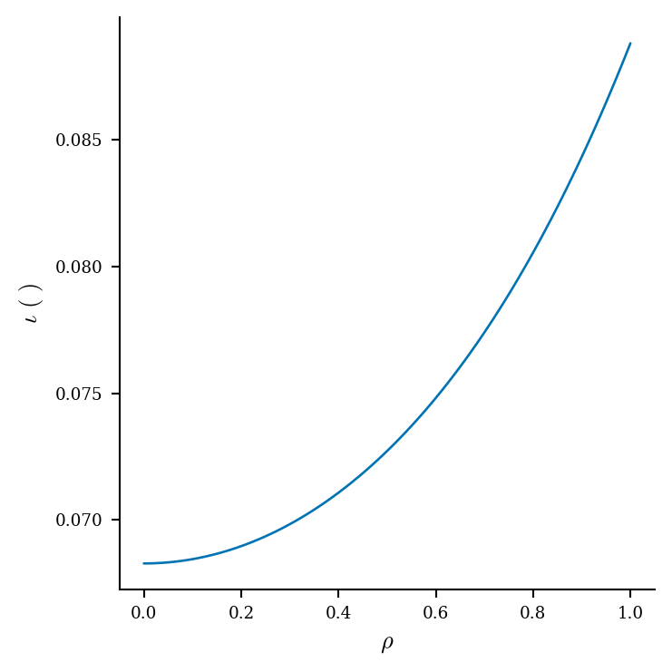

需要区分两个结论：旧 Boozer/Poincare 证明线圈真空场具有大嵌套磁面；DESC 证明同一
大边界可以支撑低 force residual 的 MHD 平衡。DESC 本身不是对线圈法向场的替代验证，
两条交叉验证同时成立才构成这里的完整证据。

## 20. 最终耗时与资源验收

| 阶段 | 实测墙钟 |
| --- | ---: |
| 96 代、15360 候选、4 卡 CEM | 7649.49 s |
| 4 卡 8 worker 均摊原生 score | 0.498 s/候选 |
| 最高分候选自身原生 score | 4.068 s |
| 五尺度旧路径数值扫描，按逐尺度计时合计 | 约 22.6 s |
| DESC solve | 148.35 s |
| 修正后复用两尺度的完整验收作业 | 252 s |
| 估计从零运行完整旧路径、绘图和 DESC | 约 4.4 min |

这里 2 小时是 CEM 主动评估 15360 个线圈的总优化预算，不是单个线圈的评分长尾。
单个原生 score 仍稳定低于 10 秒；4 卡批量评分均摊约 0.5 秒/线圈。旧 LS/Newton、
Poincare、绘图和 DESC 只用于离线验收，不进入生产 score。

作业 `28086`、`28113`、`28117` 均以退出码 0 完成。最终验收卡启动和结束时都是
0% 利用率、2 MiB 显存；任务结束后 `squeue` 为空，没有遗留本任务的 Slurm 作业或
计算进程。登录节点存在三个 2026-06-12 至 2026-06-16 由既有 VS Code 进程持有的
历史 zombie shell，与本次任务无关，未擅自终止。

## 21. 最终判断与下一步

### 21.1 本轮是否验收通过

按“验证当前 score 是否真的能用于优化，并用旧磁面和 DESC 路径排除伪解”的原始目标，
本轮**通过**：优化稳定、吞吐明确、高分样本有很大嵌套磁面，且 DESC 可得到嵌套低残差
平衡。

按“QH score 越高就越接近高纯度 QH”的更强目标，本轮**只部分通过**：总体排序包含
真实 QH 信息，但最高总分主要选择了磁面尺寸和总体质量，目标 helicity 的区分仍不够强。

### 21.2 最值得做的改进

下一轮不应再放宽 QH 软阈值。更直接的办法是保留当前尺寸奖励，同时加入目标 helicity
相对非目标 helicity 的 margin 或门槛。例如令单面或体积指标的误差为
$e_{\mathrm{QA}}$、$e_{\mathrm{QH}}$、$e_{\mathrm{QP}}$，可增加

$$
\Delta_{\mathrm{QH}}
=\log\frac{\min(e_{\mathrm{QA}},e_{\mathrm{QP}})+\epsilon}
{e_{\mathrm{QH}}+\epsilon}.
$$

只有 $\Delta_{\mathrm{QH}}>0$ 时，目标 QH 才确实优于竞争模式。它可以作为额外分量，
也可以作为 `volume_qs` 获得高分的软门槛。这样仍允许“大面上的中等 QH”胜过“无价值的
极小纯 QH”，但不能再让明显更像 QA 的线圈仅靠其他分量拿到接近 QH 最优的总分。

## 22. 长时验收产物

- [长时 CEM 审计 JSON](assets/native_score_cem_validation/long_qh_cem/long_cem_audit.json)
- [最高分线圈输入与原生诊断](assets/native_score_cem_validation/long_qh_cem/best_case.json)
- [完整旧路径与 DESC 审计 JSON](assets/native_score_cem_validation/long_qh_cem/full_evaluation_audit.json)
- [DESC 输入](assets/native_score_cem_validation/long_qh_cem/full_eval/desc/input.check)
- [DESC equilibrium](assets/native_score_cem_validation/long_qh_cem/full_eval/desc/equilibrium.h5)

## 23. 低 $\iota$ 退化修正与三随机种子最终验收

本节记录 2026-07-28 完成的最终验收。它覆盖前文第 15--22 节之后对 score 的修正、
QUASR 经验标定、三个随机种子的长时 CEM，以及最高分样本的旧稳定路径和 DESC 复核。
若本节与前文关于旧 score 的结论冲突，以本节为准。

### 23.1 结论先行

1. **低 $\iota$ 圆环退化已经被 score 排除。** 原先得分 78.935、
   $|\iota|=0.06881$ 的退化样本，在最终公式下只得 **5.275**。三个新 CEM 最优样本的
   $|\iota|$ 分别为 0.926、1.131、0.997，没有再次回到 $\iota\simeq0$。
2. **三个随机种子都没有优化出高质量 QH。** 最高分只有 **48.472**，低于 QUASR QH
   成功样本的 P10 56.862；对应原生微分 QH 残差为 4.149，`volume_qs` 分量只有
   4.347/100。score 没有把它误报成高分，但 CEM 没找到 $|\iota|\gtrsim1$ 与低 QH
   残差同时成立的区域。
3. **旧路径证明该线圈有有限真空磁面，但目标 helicity 错了。** 最大连续可接受面体积为
   $0.01482\,\mathrm{m}^3$，旧 Boozer 解为 $|\iota|=0.9407$；该面 QH error 为
   0.531%，而 QP error 只有 0.0139%。$|B|$ 热图也呈环向竖直带，不是 QH 斜带。
4. **DESC 验收失败。** 初态和末态都非嵌套；末态归一化 force mean 仍为
   $1.34\times10^{10}$。DESC 返回的 `xtol` 只表示步长停滞，不能解释成物理收敛。

因此，本轮最准确的判定是：**反低 $\iota$ 作弊修正通过；从零 CEM 优化高质量 QH
失败；最高分样本的真空磁面检查部分通过，但目标 QH 与 DESC 检查失败。**

## 24. 最终 score 的准确形式

### 24.1 磁面尺寸饱和

令原生路径选中磁面的逆纵横比为 $a/R$，定义

$$
x=\operatorname{clip}\!\left(\frac{a/R}{0.03},0,1\right),
\qquad
q_{\mathrm{size}}=x^2(3-2x).
$$

当 $a/R\ge0.03$ 时，$q_{\mathrm{size}}=1$，更大的磁面不再增加尺寸分数。这个因子同时
用于 `surface` 分量和体 QS 的尺寸修正，因此旧样本的 $a/R=0.104$ 不再能靠继续增大磁面
获得额外奖励。

### 24.2 QH 的 $\iota$ 分量与总分门控

对体积采样范围内的旋转变换取保守值

$$
\iota_*=\min_{\rho}\left|\iota(\rho)\right|,
$$

若拟合区间跨过零，则令 $\iota_*=0$。QH 的 $\iota$ 质量为

$$
q_{\iota}
=\operatorname{clip}\!\left(\frac{\iota_*}{1.0},0,1\right)^2.
$$

这保证 $|\iota|<1$ 时连续受罚，且越接近零惩罚越强。QA/QP 不使用该门控。

原始体 QS 质量由全体积和边缘残差组成：

$$
q_{\mathrm{res}}=0.8q_{\mathrm{global}}+0.2q_{\mathrm{edge}},
$$

QH 的体 QS 分量再乘

$$
F_{\mathrm{size}}=0.65+0.35q_{\mathrm{size}},
\qquad
F_{\iota}=0.5+0.5q_{\iota}.
$$

七个分量的权重依次为

$$
(w_{\mathrm{axis}},w_{\psi},w_{\mathrm{surface}},w_{\mathrm{coord}},
w_{\mathrm{QS}},w_{\iota},w_{\mathrm{coil}})
=(10,10,10,10,42,10,8).
$$

加权分数 $S_0$ 计算完后，QH 总分还要经过

$$
S=S_0\left(0.1+0.9q_{\iota}\right).
$$

所以低 $\iota$ 不只是少拿 10 分的独立分量，而会压低整个分数。保留 0.1 的底是为了
让 CEM 在不可行区仍有连续排序信号，而不是把所有低 $\iota$ 样本压成完全相同的零分。

### 24.3 QUASR 的经验标定

这里没有依赖“QH 理论上必须 $\iota>1$”的强证明，而是直接检查 QUASR：

| 数据子集 | 数量 | $|\iota|<1$ | P05 | 中位数 | 基线圈数 |
| --- | ---: | ---: | ---: | ---: | --- |
| 全部 QH | 3834 | 114 | 1.1 | 1.5 | 1--5 |
| QH，$N_{\mathrm{FP}}=3$ | 987 | 6 | 1.1 | 1.4 | 2--5 |
| 上一行中 metadata QS 最好 10% | 98 | 仅最小值 0.9 | 1.1 | 1.3 | 3--5 |

在 $N_{\mathrm{FP}}=3$ 的高质量 QH 子集中没有 1 或 2 基线圈样本；3、4、5 基线圈分别
有 11、42、45 个。本轮使用 3 基线圈，是数据支持的最低复杂度，而不是继续使用已经
证明不足的单基线圈参数化。

## 25. QUASR 与退化样本交叉验证

在 1000 个既有原生评测样本中，有 357 个 QH 样本同时具有可用的旧、新诊断。对这些
样本按最终公式重放，结果如下：

| Spearman 相关 | 旧 score | 最终 score |
| --- | ---: | ---: |
| 与 metadata QS quality | 0.077 | **0.420** |
| 与原生微分 QS quality | -0.481 | **0.179** |
| 与磁面尺寸 | 0.875 | **0.340** |

最终 QH score 的 P10、中位数、最大值分别为 56.862、66.834、74.006。前 20 名的最小
$|\iota|$ 为 1.066，原生微分 QS 残差中位数为 0.147。低 $\iota$ 退化样本从 78.935
降为 5.275，在 357 个成功 QH 样本中的百分位为 0。

最终 ABI 还做了两次原生 C++/CUDA 精确 smoke：退化样本得到 5.27536；QUASR 样本
1551144 得到 58.83082。两者与离线标量重放逐项一致，说明上述变化不是 Python 侧重新
定义了 score，而是已经进入生产原生接口。

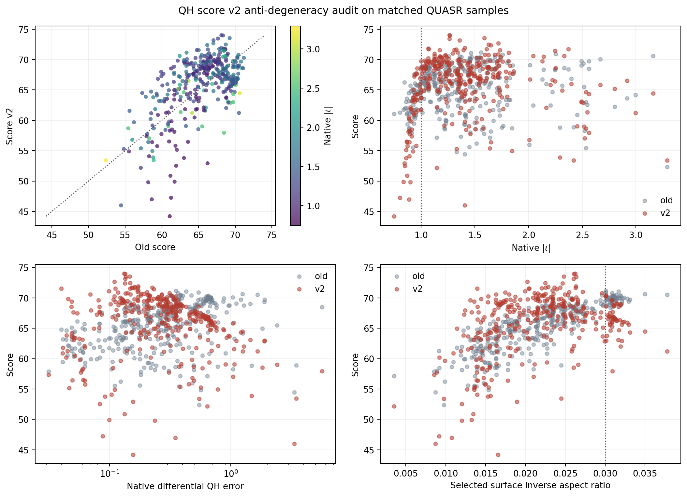

## 26. 三随机种子 CEM

### 26.1 固定配置与吞吐

每个种子都使用 3 基线圈、192 维 PCA latent、96 代、每代 128 个候选、32 个 elite，
以及 4 张空闲 RTX 5090，每卡一个原生 score worker。单个种子评估 12288 个候选。

| 作业 | 随机种子 | 墙钟 | 均摊墙钟/候选 | `ok` / 12288 |
| --- | ---: | ---: | ---: | ---: |
| 28270 | 2026072801 | 10573.32 s | 0.860 s | 7156 |
| 28276 | 2026072802 | 10269.38 s | 0.836 s | 6589 |
| 28277 | 2026072803 | 10454.82 s | 0.851 s | 6637 |

三个作业均以退出码 0 完成，无超时、worker 崩溃或 Python 异常。总计评估 36864 个
候选，CEM 内部墙钟合计 31297.52 秒，即 8 小时 41 分 38 秒；总体均摊为
$0.849\,\mathrm{s/candidate}$。每个作业的四张卡在启动时都是 0% 利用率、2 MiB 显存。

### 26.2 三个最优样本

| 作业 | 最优代 | score | $|\iota_*|$ | 原生 QH 残差 | $a/R$ | 体积 [$\mathrm{m}^3$] | `volume_qs` |
| --- | ---: | ---: | ---: | ---: | ---: | ---: | ---: |
| 28270 | 96 | 41.329 | 0.926 | 5.700 | 0.01697 | 0.00233 | 3.247 |
| 28276 | 63 | 46.991 | 1.131 | 104.045 | 0.06992 | 0.00088 | 0.305 |
| 28277 | 96 | **48.472** | 0.997 | **4.149** | 0.01443 | 0.00394 | **4.347** |

三个结果都远低于 QUASR QH 的 P10 56.862，因而最终 score 没有把它们伪装成高质量
样本。第二个种子说明单独达到 $|\iota|>1$ 并不够：它的 QH 残差恶化到 104，总分仍只
有 46.99。

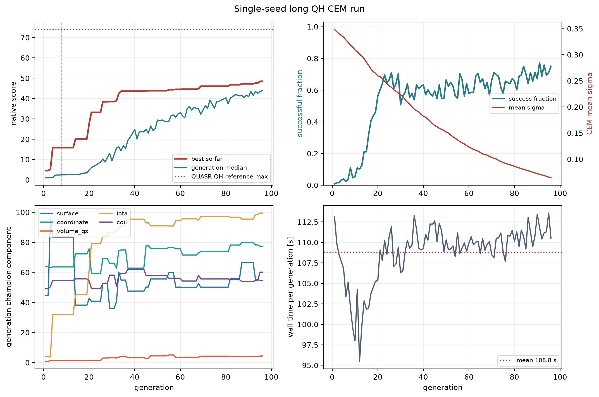

第三个种子的 6637 个成功候选还显示出清晰的不可兼得关系：全体中最低原生 QH 残差为
1.121，但该样本只有 $|\iota|=0.189$；最高总分样本把 $|\iota|$ 提到 0.997 后，QH
残差反而为 4.149。没有候选同时接近 QUASR 的 $|\iota|$ 和 QH 残差范围。

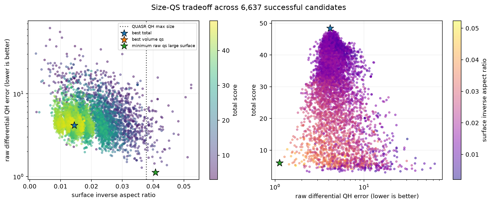

这说明当前失败首先是**搜索没有进入联合可行域**，而不是低 $\iota$ 样本仍能骗到高分。
不过，若希望中等分数也更严格代表 QH，仍应增加目标 helicity 相对竞争 helicity 的门控。

## 27. 最高分样本的旧稳定路径复核

### 27.1 磁面扫描

选择作业 28277 的最高分样本，独立运行旧的磁轴、$\psi$、Simsopt Boozer LS/Newton
和场线检查。结果为：

| $a$ [m] | 最大成功 $\psi$ level | 体积 [$\mathrm{m}^3$] | $\iota$ | QA | QH | QP |
| ---: | ---: | ---: | ---: | ---: | ---: | ---: |
| 0.05 | 0.02 | 0.00265 | 0.8508 | 0.520% | 0.516% | **0.0062%** |
| 0.08 | 0.02 | 0.00671 | 0.9404 | 0.522% | 0.523% | **0.0063%** |
| 0.12 | 0.02 | **0.01482** | 0.9407 | 0.530% | 0.531% | **0.0139%** |
| 0.16 | 0.001 | 0.00127 | -1.2826 | 0.604% | 0.604% | 0.0963% |
| 0.20 | 无 | 无 | 无 | 无 | 无 | 无 |

$a=0.16$ 时体积突然缩小一个数量级且 $\iota$ 变号，应视为分支跳转，不是更大的连续
磁面。因此本次最大接受面取 $a=0.12$。其 Boozer LS 残差为
$2.31\times10^{-14}$，Newton 在 0 次迭代即接受同一解。

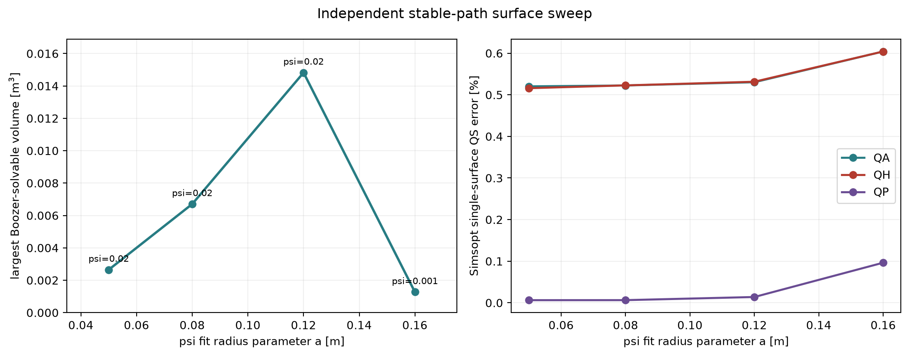

### 27.2 目标 helicity 判断

在全部三个连续面上，QP error 都比 QH error 小约 40--83 倍。最大面上的真空场强为

$$
|B|_{\min}=0.4805\,\mathrm{T},\qquad
\langle|B|\rangle=0.5629\,\mathrm{T},\qquad
|B|_{\max}=0.6235\,\mathrm{T}.
$$

$|B|$ 热图以环向竖直带为主；如果是目标 QH，应看到明显的单一斜向螺旋带。因此数值和
图像都判定该候选更接近 QP，而不是 QH。

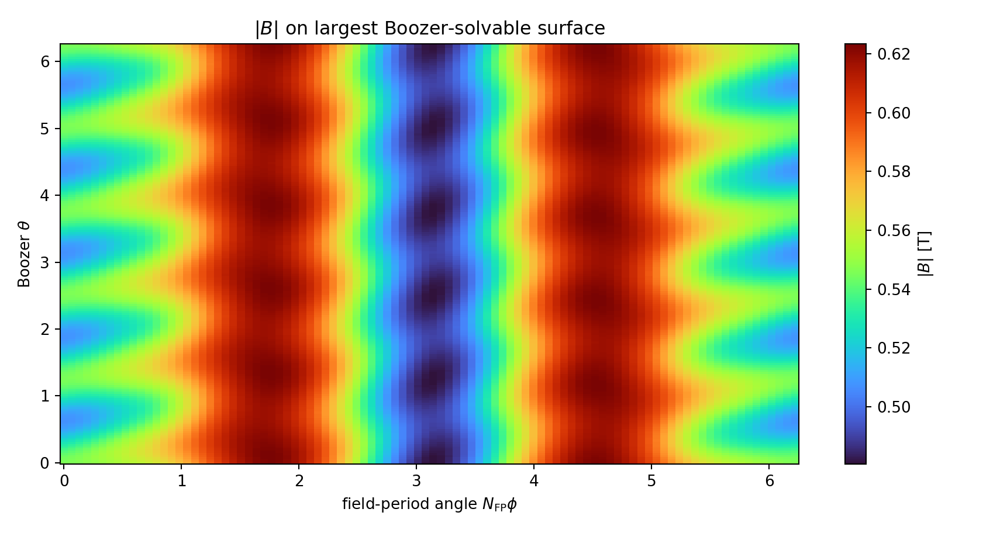

Poincare 图中的场线仍停留在有限截面区域内，说明该候选不是“完全无磁面”。但每条线只
留下 111 个交点，外层点云较宽，且稳定扫描只能延伸到较小体积；这里最多能得出“存在
有限真空约束区”，不能声称具有 QUASR 高质量样本那样的大而干净的嵌套区域。

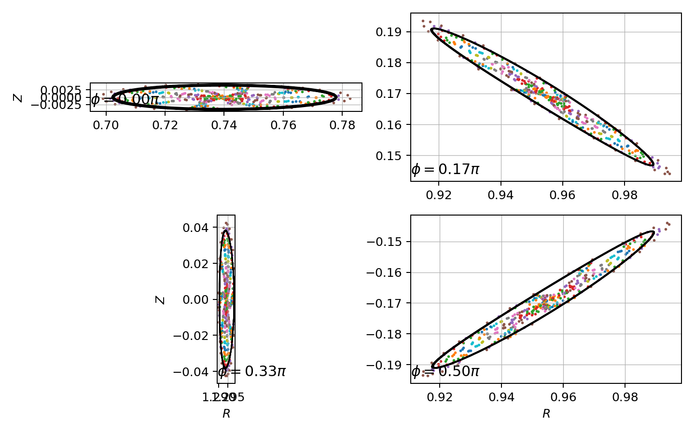

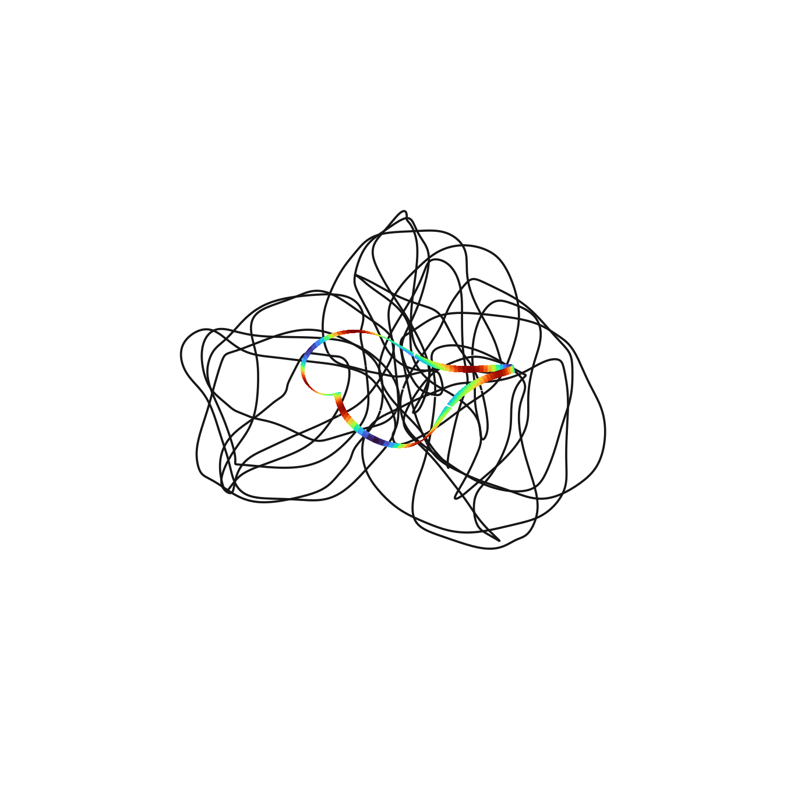

[打开可旋转的完整三维线圈与磁面](assets/native_score_cem_validation/score_v2_three_seed/full_eval/assets/coils_surface.html)

## 28. DESC 验收失败

DESC 使用 $a=0.12$ 的最大连续 Boozer 面作为固定边界，$M=N=6$，平衡分辨率
$L=M=N=8$，真空 pressure/current 均为零。结果如下：

| DESC 指标 | 初态 | 末态 |
| --- | ---: | ---: |
| nested | **false** | **false** |
| normalized force mean | $4.45\times10^{16}$ | $1.34\times10^{10}$ |
| normalized force p95 | $4.01\times10^4$ | $2.37\times10^4$ |
| normalized force max | $4.25\times10^{20}$ | $1.23\times10^{14}$ |

求解用时 59.96 秒，在第 7 次迭代因 `xtol` 停止；cost 为
$5.90\times10^{30}$，optimality 为 $7.28\times10^{14}$。虽然 DESC API 的
`optimizer_success` 为 true，但这只表示停止条件被触发。非嵌套、巨大 force residual
和发散的 $\iota(\rho)$ 同时存在，所以物理验收明确失败。

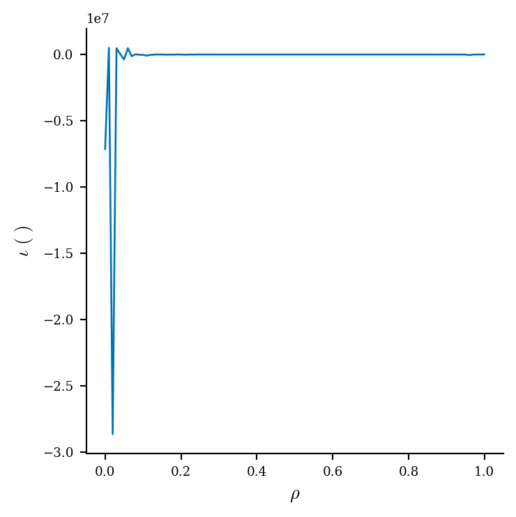

这里不能反推真空 Boozer 面必然不存在：Poincare 和旧 Boozer 路径仍给出有限约束区。
更准确的说法是，该强扭曲小边界没有给 DESC 的标准体初值提供良好坐标，后续平衡求解也
没有修复它。按照本项目的验收标准，这已经足够判定候选不实用，无需继续手工救 DESC。

调度层面有两次可复现的环境配置错误：作业 28335 使用默认 `coil/.venv`，在导入 DESC
时退出；作业 28336 指向不完整的旧环境，在激活阶段退出。最终作业 28337 使用已验证的
DESC Python 3.12 环境，复用前两次已完成的磁面扫描，并以退出码 0 在 3 分 52 秒内完成
上述 DESC 计算和绘图。这两次包装错误没有改变任何物理数值，也没有遗留计算进程。

## 29. 最终判断与下一步

### 29.1 三层验收结论

| 验收对象 | 结论 | 原因 |
| --- | --- | --- |
| score 的低 $\iota$ 反作弊 | **通过** | 旧退化样本从 78.935 降至 5.275，新最优均远离零 $\iota$ |
| score 是否把坏样本报成高分 | **本轮通过** | 三个最优仅 41--48 分，明显低于 QUASR QH 分布 |
| 从零 CEM 是否得到高质量 QH | **失败** | 没有样本同时具有 $|\iota|\gtrsim1$ 与低微分 QH 残差 |
| 旧路径目标 QH | **失败** | 最大面 QP error 比 QH error 小约 38 倍 |
| DESC | **失败** | 初末态均非嵌套且 force residual 巨大 |

### 29.2 最可能有效的后续改进

第一优先级是加入**目标 helicity margin**。令同一体积上的三种误差为
$e_{\mathrm{QA}}$、$e_{\mathrm{QH}}$、$e_{\mathrm{QP}}$，定义

$$
\Delta_{\mathrm{QH}}
=\log\frac{\min(e_{\mathrm{QA}},e_{\mathrm{QP}})+\epsilon}
{e_{\mathrm{QH}}+\epsilon}.
$$

只有 $\Delta_{\mathrm{QH}}>0$ 才说明 QH 真正优于竞争模式。应把它作为 `volume_qs`
或总分的软门控，而不是再提高磁面尺寸、坐标或工程分量。

第二优先级是区分**评分设计**和**搜索策略**。最终 score 已正确地把本轮结果压在 50 分
以下；继续改 score 不会自动让随机 CEM 找到 192 维空间中极窄的高质量 QH 区域。更合理
的下一次优化应使用 4--5 基线圈，并用 QUASR 高质量 QH 样本建立混合初始分布，或采用
“先磁面与 $\iota$、再 QH 纯度”的分阶段 CEM。开发验证仍可从随机重启交叉检查，但不应
要求单个完全随机高维高斯同时承担可行域发现和精细 QH 优化。

第三优先级是增加一个廉价的磁面实用性检查，例如少量截面的场线持续性或几何 Jacobian
下界。它不能替代离线 DESC，但可以在进入高分区前排除只支持很小、强扭曲约束区的样本。

## 30. 本轮验收产物

- [第三个种子的压缩 CEM 审计](assets/native_score_cem_validation/score_v2_three_seed/long_cem_audit.json)
- [最高分线圈与原生诊断](assets/native_score_cem_validation/score_v2_three_seed/best_case.json)
- [旧路径与 DESC 脱敏审计](assets/native_score_cem_validation/score_v2_three_seed/full_evaluation_audit.json)
- [Boozer $|B|$ 交互图](assets/native_score_cem_validation/score_v2_three_seed/full_eval/assets/boozer_b.html)
- [DESC 输入](assets/native_score_cem_validation/score_v2_three_seed/full_eval/desc/input.check)
- [失败的 DESC equilibrium，供复现诊断](assets/native_score_cem_validation/score_v2_three_seed/full_eval/desc/equilibrium.h5)
