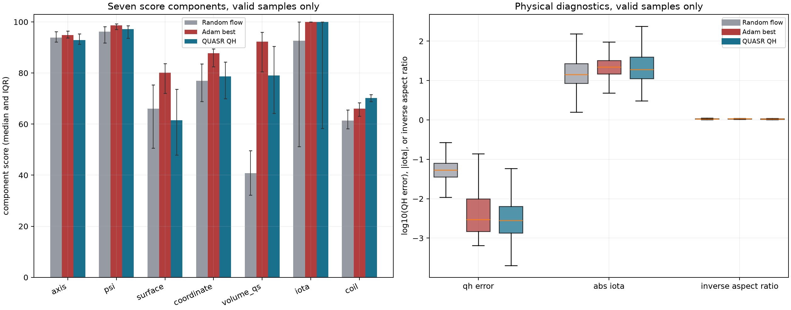

# QH 筛选加 Adam 轨迹数据集首批验收

日期：2026-08-13

代码分支：`codex/trajectory-dataset-pilot`

数据生成提交：`3f08333`
当前 score：ABI 10，动态库 SHA-256 `7834a88d5437ba9910c78bb0eb5483efc71134579624ee2cc74100297a5799a3`

## 先说结论

这次 21 小时试产成功。六个单卡数据流都按时间预算正常停止，没有失败条目或半成品，共得到 **309 条完整轨迹**、占用约 **16.9 GiB**。每条轨迹都包含 32 个随机候选和完整 200 步 Adam 数据。

每条先从 32 个随机 flow 样本中选最高分，起点 score 中位数为 **75.996**；200 步后的 best 经无磁轴历史的独立全局重评分，中位数达到 **90.214**。309 条中：

- 157 条，即 **50.8%**，达到 `score >= 90`；
- 71 条，即 **23.0%**，达到 `score >= 92`；
- 最高分为 **93.521**；
- 308/309 个 best 可被全局评分独立复现，唯一失败的是一个低分样本，不影响高分尾部。

作为同版评分器下的参照，随机无放回抽取的 1024 个 QUASR QH 原样本中，`score >= 90` 和 `score >= 92` 的比例分别为 **12.9%** 和 **7.0%**。当前流程确实把分布大量推向了高分段，但没有超过 QUASR 的最优尾部：QUASR 样本最高 **94.349**，本批最高 **93.521**。

## 到底收集了什么

一“条”数据的流程为：

1. 按 flow 训练集中的 QUASR QH 联合经验分布抽取一个 $(N_{\rm FP},N_{\rm coils})$ 条件；
2. 在该条件下生成并全局评分 32 个独立 flow 潜变量；
3. 选择最高的有效候选作为起点；
4. 运行 200 步 Adam。每步用 64 个正交随机方向、128 个中心差分端点估计梯度；
5. 保存候选、中心、方向、端点、score 分量、梯度、Adam 状态、更新时间和完整来源信息。

| 数据类型 | 数量 | 正确用途 |
|---|---:|---|
| 完整轨迹 | 309 | 一次筛选加 200 步优化的基本单位 |
| 全局随机候选 | 9,888 | 随机 flow 分布、起点筛选、proxy 对照 |
| 32 选 1 起点 | 309 | 筛选器效果和优化起点 |
| Adam 更新步 | 61,800 | 学习优化动力学、蒸馏 Adam、RL |
| 中心状态（含初始点） | 62,109 | 逐步正式 score 轨迹 |
| 梯度估计向量 | 61,800 | 当前局部方向估计 |
| 正交随机方向 | 3,955,200 | 局部差分观测 |
| 局部端点评分 | 7,910,400 | 局部方向导数和排序，不是独立全局样本 |
| best 的无历史重评分 | 309 | 检查高分是否依赖磁轴延续历史 |
| QUASR 无历史对照 | 1,024 | 当前 ABI 10 的真实数据集基准 |

最后一项使用测试集、固定随机种子 `20260813`、无放回抽样。随机候选、best 重评分和 QUASR 对照均使用同一个 ABI 10 动态库、三次 $\iota(\psi)$ 和无历史全局磁轴搜索。

需要特别强调：791 万个局部端点使用中心点给出的强提示，并省略了 `coordinate` 分量的局部梯度。它们很适合学习局部方向或优化动力学，但不能冒充 791 万个可独立全局评分的完整线圈样本。

## 分数分布

下表把拒绝样本保留在总体统计中。否则随机样本的可行率会被隐藏。

| 样本组 | 数量 | `ok` 率 | P10 | P50 | P90 | P95 | 最大值 |
|---|---:|---:|---:|---:|---:|---:|---:|
| 随机 flow 候选 | 9,888 | 61.0% | 0.103 | 9.847 | 70.746 | 74.147 | 86.627 |
| 每条 32 选 1 起点 | 309 | 100% | 65.339 | 75.996 | 81.055 | 82.699 | 86.627 |
| Adam best，在线延续 | 309 | 100% | 69.683 | 90.263 | 92.665 | 92.916 | 93.527 |
| Adam best，全局重评分 | 309 | 99.7% | 69.631 | 90.214 | 92.669 | 92.908 | 93.521 |
| QUASR QH 原样本 | 1,024 | 84.3% | 0.342 | 66.696 | 91.023 | 92.522 | 94.349 |

| 样本组 | `>=80` | `>=85` | `>=90` | `>=92` | `>=94` |
|---|---:|---:|---:|---:|---:|
| 随机 flow 候选 | 0.52% | 0.05% | 0 | 0 | 0 |
| 32 选 1 起点 | 14.6% | 1.62% | 0 | 0 | 0 |
| Adam best，全局重评分 | 82.8% | 74.4% | 50.8% | 23.0% | 0 |
| QUASR QH 原样本 | 36.0% | 26.4% | 12.9% | 7.03% | 0.49% |

QUASR 对照是从测试集均匀抽样，而轨迹条件来自训练集联合先验，两者条件频率的总变差距离为 0.112。按轨迹条件重新加权 QUASR 后，中位数从 66.696 变为 68.206，`score >= 90` 从 12.89% 变为 12.93%，结论没有改变。

这组数据展示的不是“Adam 在所有分位都支配 QUASR”。更准确地说，Adam 把大量样本压进 90--93 分的窄高分带，因此 P50--P95 明显提高；但 QUASR 仍有更强的最优尾部，P99 为 93.700，最高 94.349。

## 优化过程

以每条 32 选 1 的全局分数为基准：

| 指标 | 数值 |
|---|---:|
| 在线 best 增益均值 / 中位数 | 12.222 / 12.414 |
| 独立重评分 best 增益均值 / 中位数 | 12.157 / 12.416 |
| 独立重评分后仍有正增益 | 96.4% |
| best 步数中位数 | 187 |
| best 出现在最后 10 步 | 43.7% |
| best 出现在最后 25 步 | 57.6% |
| best 出现在最后 50 步 | 64.1% |

因此 200 步很适合作为固定长度的中程优化轨迹，却不能解释为“多数轨迹已经收敛”。score 中位数在前几十步上升最快，之后仍缓慢提高；大量 best 紧贴 200 步预算边界。

在线磁轴延续没有制造虚假的高分尾部。在线 best 与无历史全局重评分的 Pearson/Spearman 相关系数为 **0.9988/0.99988**。对于在线 `score >= 90` 的 157 条：

- 全部 157 条在无历史评分下仍为 `ok`；
- 全局分数相对在线分数的中位差为 `-0.0109`；
- 差值范围为 `-0.1482` 到 `+0.0607`。

唯一全局失败样本在线分数只有 14.68，属于低质量尾部。另有 10 条全局增益略小于零，多数在第 0 步就是 best，说明这些起点没有进入有效优化盆地，而不是高分结果失真。

## 分量和物理量

以下均只统计 `status=ok` 样本的中位数。

| 指标 | 随机 flow | 32 选 1 | Adam best 全局评分 | QUASR QH |
|---|---:|---:|---:|---:|
| axis | 93.89 | 95.90 | 94.88 | 92.90 |
| psi | 96.14 | 97.48 | 98.68 | 97.14 |
| surface | 66.05 | 77.96 | 80.14 | 61.53 |
| coordinate | 76.92 | 84.02 | 87.72 | 78.67 |
| volume QS | 40.82 | 60.29 | 92.33 | 79.03 |
| iota | 92.60 | 100.00 | 100.00 | 100.00 |
| coil | 61.36 | 63.62 | 66.03 | 70.19 |
| 体 QH error | $5.33\times10^{-2}$ | $3.23\times10^{-2}$ | $2.98\times10^{-3}$ | $2.83\times10^{-3}$ |
| $|\iota|$ | 1.155 | 1.306 | 1.343 | 1.279 |
| 逆长宽比 | 0.02565 | 0.03146 | 0.03141 | 0.02376 |

Adam 把起点的体 QH error 中位数降低约 10.8 倍，并同时提高 surface、coordinate 和 volume-QS 分量。Adam best 的绝对体 QH error 中位数与 QUASR 高质量样本已相近；其 volume-QS 分量更高还来自更强的 QH 相对竞争优势和更大的有效区域。

代价也很明确：Adam best 的 coil 工程分量中位数为 66.03，低于 QUASR 的 70.19。当前 score 没有让线圈工程项完全失效，但优化仍倾向于牺牲一部分工程质量换取磁面和 QH。后续若用这批数据训练生成器，不能只检查总分，必须保留七个分量作为监督或筛选字段。

## 条件差异

轨迹条件与 QUASR QH 训练集联合先验一致。309 条的经验分布相对精确先验的总变差距离为 0.0888；多项分布模拟中约 80% 的 309 次抽样会得到不小于该值的波动，因此没有发现种子或并行流造成的条件偏置。

| $N_{\rm FP}$ | 条数 | 起点 P50 | best P50 | `best>=90` | 每条耗时 P50 |
|---:|---:|---:|---:|---:|---:|
| 2 | 21 | 24.41 | 32.72 | 0% | 37.4 min |
| 3 | 81 | 72.37 | 85.89 | 21.0% | 21.1 min |
| 4 | 94 | 78.22 | 91.96 | 81.9% | 20.3 min |
| 5 | 84 | 78.10 | 90.70 | 61.9% | 21.4 min |
| 6 | 13 | 70.38 | 88.85 | 38.5% | 24.9 min |
| 7 | 13 | 74.29 | 86.30 | 46.2% | 22.6 min |
| 8 | 3 | 76.46 | 86.45 | 0% | 22.3 min |

| 基线线圈数 | 条数 | 起点 P50 | best P50 | `best>=90` | 每条耗时 P50 |
|---:|---:|---:|---:|---:|---:|
| 1 | 4 | 46.23 | 79.71 | 0% | 16.7 min |
| 2 | 83 | 75.85 | 89.97 | 49.4% | 18.1 min |
| 3 | 100 | 77.05 | 91.24 | 65.0% | 21.4 min |
| 4 | 83 | 76.49 | 89.17 | 47.0% | 23.4 min |
| 5 | 39 | 72.24 | 83.41 | 30.8% | 27.6 min |

这里的强结论是当前流程在 $N_{\rm FP}=4,5$ 上最容易稳定得到高分，且五线圈样本明显更贵。不能把“3 根线圈最好”解释为线圈数量的因果消融，因为 $N_{\rm FP}$、线圈数和数据集难度是联合变化的；一根线圈和 $N_{\rm FP}=8$ 的样本数也不足以比较。

## 时间和存储

六卡实际并行运行约 20.9 小时，总计消耗 123.4 GPU 小时，产出速度为 **355.3 条/天**。单条的 GPU 占用时间等于该卡的墙钟时间：

| 阶段 | 均值 | P50 | P95 |
|---|---:|---:|---:|
| 32 候选生成和全局筛选 | 119.7 s | 117.6 s | 162.8 s |
| 200 步 Adam | 1,316.8 s | 1,166.3 s | 2,323.5 s |
| 完整一条 | 1,436.5 s | 1,295.6 s | 2,447.3 s |
| 单个 Adam step | 6.45 s | 5.65 s | 11.98 s |

step 内部的主要 P50 时间为：局部梯度流水线 3.15 s，其中局部 score 1.69 s；下一批 flow 解码 1.28 s；更新后中心正式 score 0.97 s。不同线圈数造成主要的长尾，而不是单个偶发失控进程。

数据总大小为 18.139 GB，即 16.89 GiB，平均每条 56.0 MiB。其中压缩后的 `training_trace.npz` 占 17.602 GB，约 **97.0%**；筛选数据仅 43.8 MB。若后续连续运行十天，按当前速度预计约 3,550 条、约 194 GiB。要显著减少空间，应优先压缩或分层保存端点 token/方向，而不是删掉筛选候选或 JSON 元数据。

## 验收判断

本批数据达到试产目标：格式完整、来源可追踪、六流无失败、高分可以无历史复现、实际产能约 355 条/天，且与 QUASR 的当前 score 对照显示 Adam 明显提升高分命中率。

同时有三个边界必须保留：

1. 200 步多数尚未严格收敛，因此数据集是优化轨迹集，不是局部最优解集合。
2. 791 万个局部端点不是完整独立 score 样本，训练时必须按轨迹、中心和方向保持分组。
3. 高总分伴随较弱的 coil 分量；后续生成或策略训练必须监控分量分布，不能只优化总分。

六个原始作业的 stderr 均为空，原始及验收评分作业均已退出；原六张 RTX 5090 的 postflight 全部为 2 MiB、0% 利用率，Slurm 队列中没有本项目残留作业。

## 产物

- 远端完整数据：`~/local_surface_evaluator_data/qh_screen32_adam200_v1_pilot_20260813/`
- 汇总 JSON：[summary.json](assets/qh_adam_trajectory_dataset_pilot_20260813/summary.json)
- 所有用于作图的正式 score 行：[score_records.csv](assets/qh_adam_trajectory_dataset_pilot_20260813/score_records.csv)
- 每条轨迹摘要：[trajectory_summary.csv](assets/qh_adam_trajectory_dataset_pilot_20260813/trajectory_summary.csv)
- 条件频率：[condition_counts.csv](assets/qh_adam_trajectory_dataset_pilot_20260813/condition_counts.csv)
- 数据格式说明：[qh_adam_trajectory_dataset.md](../docs/qh_adam_trajectory_dataset.md)

分析与独立重评分已固化为 `scripts/score_qh_trajectory_acceptance_shard.py`、`scripts/analyze_qh_adam_trajectory_acceptance.py` 及对应的两个 Slurm 入口。
