# QH 原生评分器局部物理梯度探索报告

**日期：** 2026-08-04

**分支：** `qh-blackbox-gradient`

**目标：** 在不改变生产 ABI-9 score 路径的前提下，判断局部物理 VJP 能否替代或增强潜空间随机方向差分，并量化其正确性、适用边界与成本。

## 1. 结论摘要

本次实现了三个彼此独立、显式启用的累计梯度入口：

1. G1：线圈工程分量的分段解析梯度；
2. G2：冻结磁轴、$s/\psi$、所选磁面、体点、权重和拟合 $\iota$ 后，体 QS 对磁场的局部 VJP；
3. G3：在 G1+G2 上加入 $\alpha/\iota$ 增广 QR 最小二乘的隐式 VJP。

普通 `sgpu_score_coils` 没有增加梯度缓存、反传或新 ABI 字段。最终实验库与固定生产库在普通入口、G1、G2 和 G3 入口返回的总分及七个分量均在 $2.85\times10^{-14}$ 内一致。

G3 开发过程中发现了一个重要的建模边界，而不是 QR 反传代码错误：$B\cdot\nabla s$ 法向残差在冻结 $\psi$/磁面时的偏导会在基准法向场接近零时被放大，但真实 score 会重新拟合 $\psi$ 并移动磁面，后者提供主要抵消。该项若单独加入，会把梯度 RMS 从 $22.75$ 放大到 $396.65$，且四方向初筛余弦从 $0.568$ 反转为 $-0.137$。因此最终 G3 只保留能够自洽闭合的 $\alpha$ LS 残差与 $\iota\to$ QS 依赖，把法向场残差和 $\psi$/磁面移动作为不可拆分的 G4 组合留待后续。

最终 G3b 的累计梯度 RMS 为 $23.11$，与 G2 的 $22.75$ 同阶；原生反传只需约 $0.1685\ \mathrm{s}$。正式 200 方向结果表明，G2 在四个优化阶段的余弦为 $0.418$--$0.863$，G3b 为 $0.455$--$0.866$，均明显优于四方向随机差分的约 $0.13$。G3b 只在两个中等相关性中心带来约 $0.03$--$0.06$ 的余弦增益，在两个高相关性中心几乎不变。因此当前最有工程价值的是 G2；G3b 数值正确但边际收益有限。

这一结果尚不支持直接替换现有 SPSA+Adam。瓶颈不在原生 CUDA 梯度，而在 FP32 RK4-256 flow VJP：一次完整潜空间 G3b 方向需要约 $18$--$20\ \mathrm{s}$，与现有四方向 Adam 步的实测墙钟相当。实验梯度继续保持 opt-in，不合并进普通 score 路径。

## 2. 问题定义与可微边界

线圈物理参数记为 $x$，flow 潜变量记为 $z$，解码器为 $x=F(z)$。希望构造的不是跨越所有离散分支的“全局精确梯度”，而是当前可行分支上的连续局部代理

$$
g_x\approx \frac{\partial \widetilde S}{\partial x},
\qquad
g_z=J_F(z)^Tg_x.
$$

真实 ABI-9 score 仍负责候选验收、回滚和分支切换。以下事件不强行穿透梯度：

- 磁轴候选出现、消失、排序和椭圆拓扑切换；
- 最大可行 surface level 切换；
- `ok/no_axis/no_surface/drift_rejected/flux_rejected` 状态切换；
- 体点 compact、径向 bin、P95/max/min 活跃索引和最近点对切换；
- score clip、饱和点和 helicity 竞争项切换。

因此报告同时给出 same-branch 指标和全方向可行率。存在持久断崖的方向被视为活动约束，不被伪装成零梯度。

## 3. 梯度计算流程

### 3.1 G1：线圈工程梯度

Fourier 线圈 $\boldsymbol r(t;c)$ 对系数线性。G1 对长度、曲率、高模能量、电流幅值、线圈间距和轴距使用当前活跃样本的分段解析导数，例如

$$
L=\int |\boldsymbol r'(t)|\,dt,
\qquad
\kappa=\frac{|\boldsymbol r'\times\boldsymbol r''|}{|\boldsymbol r'|^3}.
$$

G1 还完整穿过线圈分量在总加权分数中的 QH $\iota$ gate 与 helicity gate。24 个物理方向中心差分的中位/P95 相对误差为 $4.36\times10^{-9}/3.60\times10^{-8}$。

### 3.2 G2：固定几何前端的体 QS VJP

在当前 axis、$\psi$、体点、体积权重和 $\iota$ 固定时，点级目标 residual 为

$$
r_{M,N}=
\frac{(M\iota-N)A-MGC}{|\boldsymbol B|^3},
$$

$$
A=(\boldsymbol B\times\nabla\psi)\cdot\nabla|\boldsymbol B|,
\qquad
C=\boldsymbol B\cdot\nabla|\boldsymbol B|.
$$

实现首先将 QH、QA、QP、edge QH、helicity advantage 和最终 score gate 的伴随归约到 $\boldsymbol B$、$\nabla\boldsymbol B$ 与 $G$。随后 CUDA segment VJP 反传离散 Biot--Savart 场，再解析映射到每根基本线圈的 $x/y/z$ Fourier 系数与电流。

$G$ 使用评分器现有约定

$$
G=\frac{\mu_0 I_{\rm link}}{2\pi},
$$

其对电流绝对值、总场周期数和有符号 toroidal flux 的导数与生产前向保持一致。

点级 QS VJP 和 segment Biot--Savart VJP 均由独立 PyTorch autograd 双精度测试交叉验证。G2 不微分 axis、$\psi$、flux 标定、射线根或体点位置。

### 3.3 G3：$\alpha/\iota$ 最小二乘隐式 VJP

评分器的线性拟合写成列缩放并带 ridge 的问题

$$
y^*=\arg\min_y
\left\|My-b\right\|_2^2+\lambda\|y\|_2^2,
\qquad
x_j=\frac{y_j}{s_j},
$$

其中 $s_j=\|A_{:j}\|_2$，$M_{:j}=A_{:j}/s_j$。前向使用 FP32 增广 QR。反向复用 QR 中的上三角因子 $R$，通过

$$
(R^TR)\,\eta=\bar y
$$

的两次三角求解得到伴随，不显式形成病态的 $A^TA$，也不构造完整 Jacobian。随后将设计矩阵、右端、列缩放、径向权重归一化、$B^\theta/B^\phi$ 和拟合 $\iota$ 的伴随映射回磁场，再复用 G2 的 CUDA Biot--Savart/Fourier VJP。

独立测试覆盖：

- 带列缩放和 ridge 的最小二乘解及相对 residual VJP；
- 径向权重 $\sqrt{n}\,w/\|w\|$ 的归一化 VJP；
- 切向投影、$B^\theta/B^\phi$ 和法向场相对范数对 $\boldsymbol B$ 的 VJP；
- FP32 RK4-256 flow 解码器的分块 activation-checkpoint VJP。

共 8 项本地独立测试通过。

## 4. 法向场项的失败诊断

最初的 G3 同时加入 $\alpha$ residual、$\iota$ 和法向场残差。step-200 样本上的分量隔离结果如下。

| 隔离目标 | G3 新增梯度 RMS | 8 方向完整分量余弦 | 解释 |
|---|---:|---:|---|
| G3 当时覆盖的 coordinate 项 | 3893.87 | -0.015 | 几乎完全由法向场项主导，并非 coordinate 的全部依赖 |
| 仅 $\alpha$ LS residual | 11.94 | -0.162 | 幅度较小；完整 coordinate 仍包含未微分 flux/几何 |
| 仅法向场 residual | 3882.84 | -0.017 | 固定磁面偏导巨大且不代表重拟合后的真实方向 |
| $\iota\to$ volume-QS | 0.0732 | 与 G2 基本相同 | 该点 $\iota$ 间接修正很小 |

该现象的数学原因是

$$
e_n=\sqrt{
\frac{\sum_i |\operatorname{proj}_{\nabla s_i}\boldsymbol B_i|^2}
{\sum_i|\boldsymbol B_i|^2}
}.
$$

当 $e_n\approx0$ 时，固定 $\nabla s$ 的范数导数包含 $1/e_n$。但 score 的 $s/\psi$ 正是从同一个磁场重新拟合；对物理上良好的扰动，$\nabla s$ 和采样磁面随 $\boldsymbol B$ 移动，使 $B\cdot\nabla s$ 继续保持小量。只微分前者而冻结后者，会产生数值上正确、物理代理上错误的巨大偏导。

因此 commit `2f446f7` 将整个法向场项推迟到 G4，而不是裁剪、缩放或隐藏它。修正后四方向初筛中 G2/G3b 余弦为 $0.568/0.558$，梯度 RMS 为 $22.75/23.11$。这说明爆炸已消失，也说明当前 $\alpha/\iota$ 隐式依赖未表现出明显新增收益。

## 5. 前向一致性与性能

最终实验库由 CUDA 13.0、`sm_120` Release 构建，SHA-256 为 `fdf142aa...`。固定生产库 SHA-256 为 `40dca742...`。

| 路径 | 中位墙钟 | 相对实验普通前向 | 说明 |
|---|---:|---:|---|
| 固定生产普通前向 | 5.0702 s | - | 独立共享库 |
| 实验库普通前向 | 5.0646 s | 基准 | 不建立梯度 cache |
| G1 | 约 5.11 s | 约 +1% | 主要是前向，工程 VJP 很小 |
| G1+G2 | 5.1585 s | +1.85% | reverse 约 0.09 s |
| G1+G2+G3b | 5.2165 s | +3.00% | reverse 0.1685 s |

G3b 反向的 point/field/Fourier-map 计时分别累计在约 $0.02$、$0.06$ 和 $0.04\ \mathrm{s}$ 量级。普通前向开启梯度代码前后的测量开销低于 $0.1\%$；生产入口没有为了梯度回退 CPU 或新增无界迭代。

作业 `31731` 结束后 GPU 为 2 MiB、0% utilization，且没有 compute process。所有开发验证作业均为 Slurm 作业，没有在登录节点执行编译、CUDA 计算或批量数值处理。

## 6. 正式参考协议

正式黑箱参考使用四个来自真实随机起点 Adam 轨迹的中心，而不是 QUASR 反追踪近最优点：

- nfp6 step 0、200、400；
- nfp4 step 50。

每个中心冻结一个 $d=200$ 的 RMS 正交方向基，使用 RK4-256 解码，并在

$$
h\in\{0.01,\ 0.005,\ 0.0025,\ 0.00125\}
$$

上计算全部正反端点，共 6404 次完整 ABI-9 score。方向只有在两端均为 `ok` 且 branch fingerprint 与中心一致时才进入 same-branch 梯度。相邻尺度使用

$$
C_i(h)=
\frac{|D_i(h)-D_i(h/2)|}
{\max(|D_i(h)|,|D_i(h/2)|,10^{-8})}
$$

诊断有限尺度不一致，$C_i>0.5$ 记为未收敛。若安全方向不是 100%，只报告 $P_{\rm safe}g$；不会把一个越界方向导致的整块 NaN 当成“没有参考梯度”。

随机 $K$ 对照使用

$$
\widehat g_K=\frac1K\sum_{k=1}^K D_k u_k,
\qquad K\in\{1,2,4,8,16,32,64\}.
$$

本轮后处理从同一个冻结的 200 方向正交基重复无放回子采样，报告 1000 次重采样的均值、标准差和 P10/P50/P90。它衡量“同一已评分正交基内，使用多少方向能达到相同余弦”，不冒充尚未额外评分的独立随机方向块。

## 7. 正式跨阶段结果

### 7.1 参考数据完整性

四卡作业 `31640` 在 `02:21:23` 内完成全部 6404 次 score，累计单卡 score 时间为 $31413.1\ \mathrm{s}$，单例均值/P95 为 $4.905/5.213\ \mathrm{s}$。四个中心在 $h=0.005$ 下均有 200/200 个 same-branch 方向；除 step-200 的 $h=0.01$ 有一个方向切换 fingerprint 外，其余尺度也均为 200/200。四张卡的 postflight 都是 2 MiB、0% utilization，没有遗留进程。

| 中心 | 轨迹记录分数 | 当前库重评 | $h=0.005$ same-branch |
|---|---:|---:|---:|
| nfp6 step 0 | 74.4358 | 74.4193 | 200/200 |
| nfp6 step 200 | 83.4689 | 83.4772 | 200/200 |
| nfp6 step 400 | 86.1233 | 86.0980 | 200/200 |
| nfp4 step 50 | 80.6125 | 80.6087 | 200/200 |

不同尺度的参考梯度并未随 $h$ 单调收敛。以相邻尺度梯度余弦计，step 0 的 $0.01/0.005$ 为 $0.913$，step 400 为 $0.950$；但 step 200 的 $0.005/0.0025$ 只有 $0.387$。进一步减小到 $0.00125$ 往往更差，说明微小尺度会放大 score 毛刺和离散前端噪声。$h=0.005$ 既接近已有 Adam 的实际更新尺度，又保持全方向可行，因此它是本报告的主参考，不把最小 $h$ 错当成“最精确”。

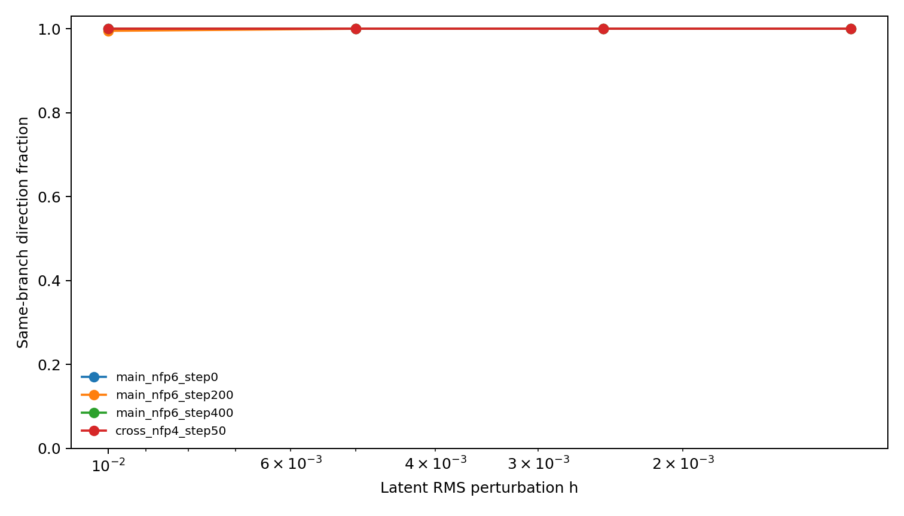

### 7.2 梯度方向质量

下表全部使用 $h=0.005$、200 个 same-branch 方向。`标定 RMS` 是允许一个最优标量校准后的相对 RMS 误差；越小越好。`等效 K` 是在同一冻结正交方向库内重复无放回子采样得到，不等同于额外独立执行了 K 方向实验。

| 中心 | 方法 | 余弦 | Pearson | Spearman | 符号一致 | top 1/4 命中 | 标定 RMS | 等效随机 K |
|---|---|---:|---:|---:|---:|---:|---:|---:|
| nfp6 step 0 | G1 | 0.147 | 0.147 | 0.160 | 56.5% | 32% | 0.989 | 8 |
|  | G2 | 0.854 | 0.855 | 0.821 | 79.5% | 78% | 0.520 | $>64$ |
|  | G3b | 0.854 | 0.855 | 0.823 | 79.5% | 78% | 0.520 | $>64$ |
| nfp6 step 200 | G1 | 0.036 | 0.037 | 0.072 | 55.0% | 32% | 0.999 | 1 |
|  | G2 | 0.425 | 0.425 | 0.433 | 61.5% | 52% | 0.905 | 64 |
|  | G3b | 0.455 | 0.455 | 0.469 | 63.5% | 50% | 0.890 | 64 |
| nfp6 step 400 | G1 | 0.277 | 0.277 | 0.252 | 58.0% | 40% | 0.961 | 32 |
|  | G2 | 0.863 | 0.865 | 0.848 | 82.5% | 78% | 0.505 | $>64$ |
|  | G3b | 0.866 | 0.868 | 0.852 | 83.0% | 78% | 0.499 | $>64$ |
| nfp4 step 50 | G1 | 0.065 | 0.064 | 0.047 | 53.0% | 26% | 0.998 | 2 |
|  | G2 | 0.418 | 0.418 | 0.410 | 68.0% | 42% | 0.909 | 64 |
|  | G3b | 0.479 | 0.479 | 0.468 | 71.0% | 44% | 0.878 | 64 |

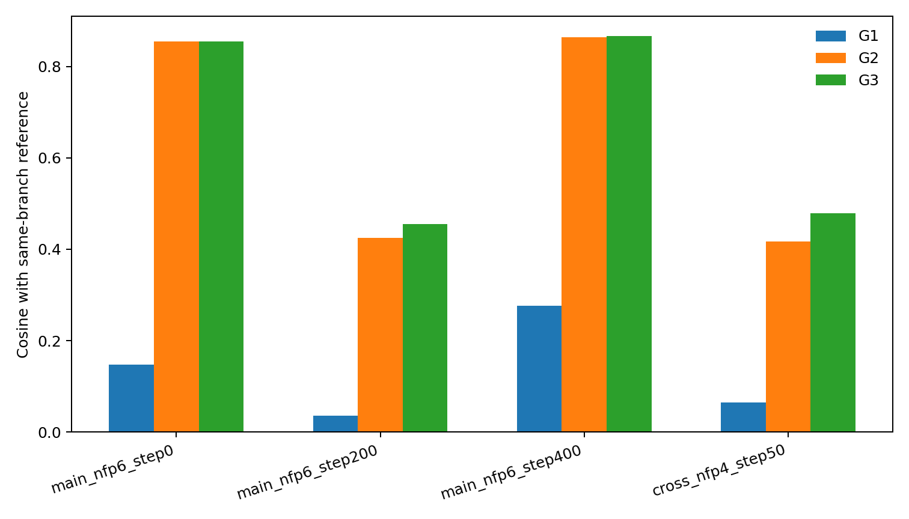

G1 单独几乎不能解释完整 score；它不是错误，而是工程项只占当前目标的一小部分。G2 是本轮的主要有效增量，在早期和成熟 nfp6 点达到约 $0.86$ 余弦，在更难的 step-200 与跨 nfp4 点仍保持 $0.42$ 左右。G3b 对 step-200 和 nfp4 分别提高 $0.030$ 和 $0.061$，但对另两个点提高不足 $0.004$。因此不能用单个中心宣称 G3 显著优于 G2。

四个中心的预测-观测散点如下。图中的直线只表示线性校准，不参与余弦计算。

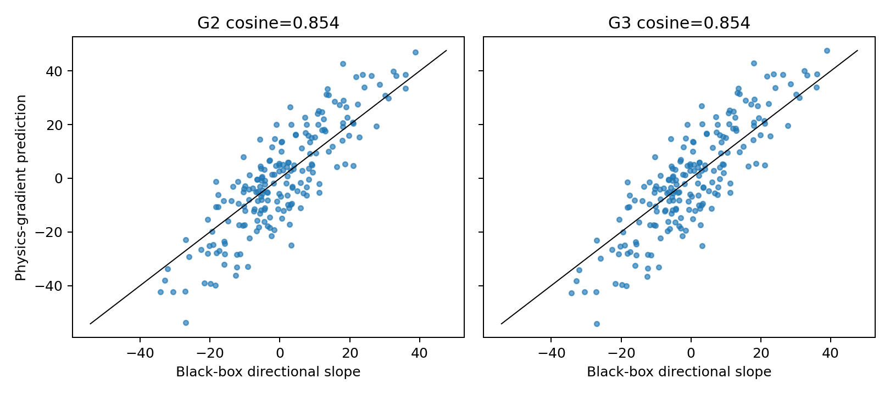

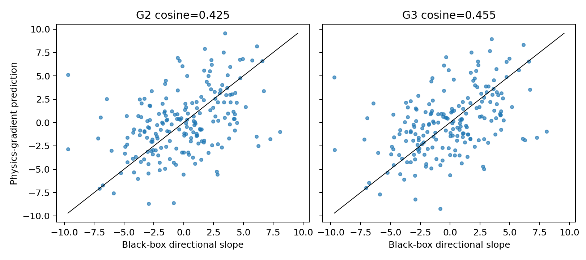

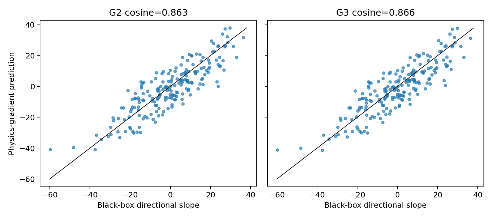

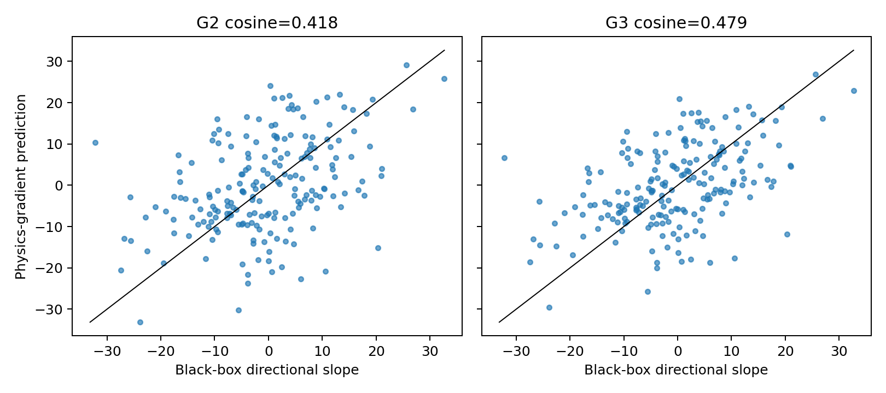

### 7.3 与随机方向估计的比较

随机 K 对照在四个中心高度一致：K=1、2、4、8、16、32、64 的平均余弦约为 $0.055$、$0.087$、$0.132$、$0.193$、$0.278$、$0.398$、$0.565$。K=4 的标准差约 $0.046$--$0.051$，所以单次四方向初筛出现正负摆动是正常现象，不能作为梯度正确性的主要证据。

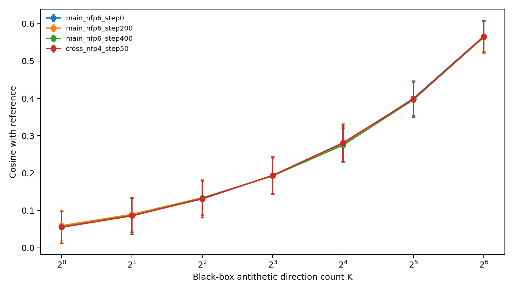

G2/G3b 在四个中心都超过 K=4 很多：两个 nfp6 中心甚至超过 K=64，另外两个约等效 K=64。按黑箱调用数，K=64 需要 128 个正反端点评分；物理 VJP 只需要一个 score 前向和一次反传。这证明物理梯度含有高价值方向信息，但不自动等价于更短墙钟，因为 flow 反传成本不可忽略。

### 7.4 完整墙钟

四个 latent VJP 作业均使用单张空闲 RTX 5090，重新解码中心与参考 token 的相对 $L^2$ 误差为 $4.8\times10^{-14}$--$1.13\times10^{-7}$，说明 RK4-256 解码一致性足够。

| 中心 | 原生 G3b 前向 | 原生 reverse | flow 解码 | flow backward | 单方向合计 |
|---|---:|---:|---:|---:|---:|
| nfp6 step 0 | 5.078 s | 0.155 s | 5.123 s | 9.475 s | 19.831 s |
| nfp6 step 200 | 5.152 s | 0.148 s | 4.745 s | 8.899 s | 18.944 s |
| nfp6 step 400 | 5.171 s | 0.147 s | 4.662 s | 8.517 s | 18.497 s |
| nfp4 step 50 | 4.152 s | 0.123 s | 4.534 s | 8.617 s | 17.425 s |

这里的“单方向合计”包括为得到当前 score 和物理 cache 所需的原生前向、原生 reverse，以及 flow 的一次前向解码和一次 VJP。它与当前四卡 K=4 Adam 步的约 $17$--$20\ \mathrm{s}$ 处于同一量级。原生 reverse 只占不到 $1\%$；若要获得明确加速，应优先减少 flow VJP 的 RK4 重算/检查点成本，而不是继续微优化 CUDA score reverse。

### 7.5 真实 score 提案验收

作业 `31754` 对 G2/G3b 正反方向在 RMS 步长 $0.0025/0.005/0.01$ 上完成 48 个真实 score。全部候选都是 `status=ok`；24 个方法-尺度对中，正梯度端点的 score 全部高于对应负端点。这是比参考余弦更直接的方向性证据。

| 中心 | 方法 | $+0.0025$ | $+0.005$ | $+0.01$ | 同尺度负方向 |
|---|---|---:|---:|---:|---|
| nfp6 step 0 | G2 | +0.561 | +1.006 | +1.609 | 全部下降 |
|  | G3b | +0.590 | +1.025 | +1.622 | 全部下降 |
| nfp6 step 200 | G2 | +0.015 | -0.047 | -0.385 | 全部更低 |
|  | G3b | +0.013 | -0.044 | -0.340 | 全部更低 |
| nfp6 step 400 | G2 | -0.198 | -1.443 | -4.376 | 全部更低 |
|  | G3b | -0.327 | -1.426 | -4.394 | 全部更低 |
| nfp4 step 50 | G2 | +0.103 | +0.066 | -0.790 | 全部更低 |
|  | G3b | +0.113 | +0.152 | -0.826 | 全部更低 |

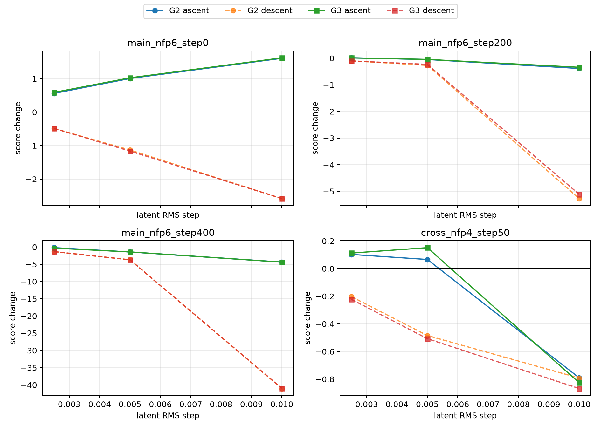

表中数值是相对中心的 score 变化。“正方向高于负方向”和“正方向高于中心”必须区分：前者 24/24 成立，后者只有 12/24。step 0 有宽阔上升区；step 200 和 nfp4 需要回溯；step 400 在最小已测步长两侧都下降，但正端仍显著优于负端。这符合一个具有正确一阶方向、但中心附近负曲率很强或已经接近局部峰值的目标，不构成梯度符号错误。

$h=0.01$ 时 step-200、step-400 的负端以及 nfp4 的正端发生 branch fingerprint 切换，尽管状态仍为 `ok`。因此 $0.01$ 不应作为统一信赖半径。作业累计 score 时间为 $247.1\ \mathrm{s}$，双卡实际评分阶段约为其一半；RK4-256 批量解码全部 48 个候选共 $11.70\ \mathrm{s}$。两张卡 postflight 均为 2 MiB、0% utilization。

作业 `31758` 使用相同协议追加 $0.0003125/0.000625/0.00125$ 三个回溯尺度。48 个候选全部 `status=ok` 且保持 center fingerprint，24/24 个正方向仍优于其负方向；23/24 个正端点高于中心。

| 中心 | 方法 | $+0.0003125$ | $+0.000625$ | $+0.00125$ |
|---|---|---:|---:|---:|
| nfp6 step 0 | G2 | +0.057 | +0.090 | +0.240 |
|  | G3b | +0.077 | +0.110 | +0.333 |
| nfp6 step 200 | G2 | +0.010 | -0.015 | +0.027 |
|  | G3b | +0.020 | +0.015 | +0.004 |
| nfp6 step 400 | G2 | +0.057 | +0.043 | +0.080 |
|  | G3b | +0.039 | +0.096 | +0.053 |
| nfp4 step 50 | G2 | +0.012 | +0.017 | +0.040 |
|  | G3b | +0.027 | +0.035 | +0.079 |

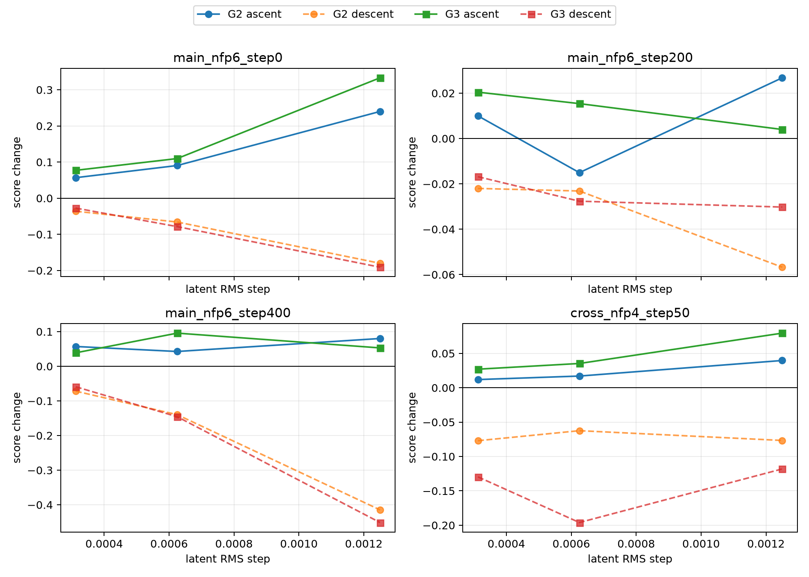

step-400 的上升被完整恢复，最佳观测增益约为 $+0.096$；第一轮两侧下降确实是步长越过局部峰顶，而不是梯度方向失效。唯一负增益是 step-200 的 G2 在 $0.000625$ 处为 $-0.015$，但同一方向在相邻的 $0.0003125$ 和 $0.00125$ 分别为 $+0.010$ 和 $+0.027$，更像 score 的有限尺度毛刺而非稳定反向区间。

两轮提案共同给出以下优化协议证据：不能设置统一固定步长；应从与当前阶段相称的 trust radius 开始，用真实 ABI-9 score 接受，不增分就按二分尺度回溯。早期 step 0 可安全采用 $0.01$ 并获得 $+1.62$，成熟 step 400 则需回到约 $10^{-3}$。G3b 在部分点比 G2 好，但没有一致胜出，仍不足以抵消其额外实现复杂度。作业 `31758` 累计 score 时间为 $237.45\ \mathrm{s}$，双卡总墙钟 `00:03:09`；两张卡 postflight 均为 2 MiB、0% utilization。

## 8. 当前工程结论

- G1、G2、G3b 都是独立 opt-in API；正常 score 路径保持原速度和结果。
- G1、点级 QS、Biot--Savart、QR、权重和 flow VJP 已分别通过独立数值测试，且所有梯度入口的前向结果与固定生产库在 $2.85\times10^{-14}$ 内一致。
- G2 已通过跨阶段 200 方向门槛，方向信息显著优于当前 K=4 随机估计；G3b 也通过，但相对 G2 的增益较小。
- 固定前端法向场梯度不能单独使用；它必须与 $s/\psi$、射线根和磁面移动共同微分。没有这组 G4 依赖时，不能把 frozen-geometry 法向残差重新打开。
- 当前纯 VJP 没有稳定的墙钟优势，主要因为 flow backward，而不是原生 score reverse。因此不提交纯 VJP 长跑，也不把实验梯度合并到生产 score 主线。
- 两轮提案已确认 G2/G3b 正方向在 48/48 个 antithetic 对中排序正确，并可通过回溯在 47/48 个测试步上超过中心。下一步可做“G2 作为方向先验、ABI-9 负责接受与二分回溯”的混合短跑；G3b 暂不作为默认，因为其边际方向收益不稳定。
- 若目标是相对四方向 Adam 获得明确墙钟加速，优先优化 flow VJP 的重算成本；若目标是继续提高方向余弦，则优先补齐 G4 的 $s/\psi$/磁面移动整体依赖。两者是不同瓶颈，不应混为一项优化。

## 9. 潜空间 VJP 的含义与性能解释

### 9.1 它具体计算什么

flow 将潜变量 $z$ 解码成物理线圈参数 $x$：

$$
x=F_\theta(z;N_{\mathrm{FP}}).
$$

原生 CUDA score 的 G2/G3b 先在物理参数空间给出一个 cotangent：

$$
g_x=\frac{\partial \widetilde S}{\partial x}.
$$

优化实际需要的是潜空间方向

$$
g_z
=J_F(z)^T g_x
=\frac{\partial}{\partial z}
\left\langle g_x,F_\theta(z)\right\rangle.
$$

这就是 vector--Jacobian product，简称 VJP。实现没有形成 $J_F$ 这个完整 Jacobian，而是把标量

$$
L(z)=\left\langle g_x,F_\theta(z)\right\rangle
$$

交给 PyTorch，从物理输出反传到 $z$。反传还包含训练集标准化的逆变换、总绝对电流归一化和主导电流取正的 gauge 变换，因此得到的确实是当前优化变量约定下的潜空间梯度。模型参数全部设置为 `requires_grad=False`，不会计算或保存 3033 万参数的权重梯度；只计算输入 $z$ 的梯度。

这里的 $g_x$ 是 G2/G3b 定义的连续物理代理梯度，不是穿透磁轴搜索、$s/\psi$ 重拟合和所有离散分支的“完整 score 精确梯度”。完整 ABI-9 score 仍负责接受、拒绝和回溯。

### 9.2 当前实现到底执行了多少网络调用

当前 checkpoint 是 8 层、宽度 512、8 头、SwiGLU hidden 1408 的非因果 Transformer，共 30,333,540 个参数。nfp6/nc2 实验一次只输入一个样本和两个 coil token，即张量的有效 batch-token 乘积只有 2。

解码求解 flow ODE：

$$
\frac{dx}{dt}=v_\theta(x,t,N_{\mathrm{FP}}),
\qquad t:0\to1.
$$

当前使用 256 个 RK4 步。每个 RK4 步顺序计算 $k_1,k_2,k_3,k_4$，因此一次单样本解码调用速度场网络

$$
256\times4=1024
$$

次。ODE 步之间有状态依赖，同一步的四个 stage 也彼此依赖，不能沿时间维并行。

可微实现把每 8 个 ODE 步包成一个 activation-checkpoint chunk，共

$$
256/8=32
$$

个 chunk。前向时只保存 chunk 边界而不保存全部 Transformer 激活。反向遍历每个 chunk 时，PyTorch 先重算该 chunk 的前向，再对重算图做 VJP。因此反向阶段包含：

1. 再执行一遍全部 1024 次速度场前向；
2. 对这 1024 次调用逐次传播激活梯度；
3. 不计算模型权重梯度，只计算状态和最终潜变量梯度。

`checkpoint_steps=8` 主要控制激活显存和 checkpoint 调度粒度，并不会减少总 ODE 网络调用。现有实现还会在每次速度场调用中创建很小的时间张量。所有计时前后都执行了 `torch.cuda.synchronize()`，所以不是异步 CUDA 导致的虚高。

### 9.3 为什么单样本这么慢，但以前批量正向很快

你的判断是对的：这条路径主要受串行调用和 GPU 吃不满限制，不是 5090 算力不足。

每次网络调用只有 1 个样本、2 个 token。线性层虽然有 $512\times1536$、$512\times2816$ 等权重，但 GEMM 的 $M$ 维只有 2；attention 的序列长度也只有 2。这类运算远小于 5090 擅长的大矩阵，主要成本变成：

- 数以万计的小 kernel launch；
- 1024 次严格串行的模型调用；
- 反向 checkpoint 导致的完整前向重算；
- 每次小 GEMM 读取权重但只有两个 token 复用，算术强度很低。

因此必须区分“批量吞吐”和“单样本延迟”：

| 场景 | batch 形态 | 观测时间 | 含义 |
|---|---:|---:|---|
| 正式 latent VJP 的 flow 前向 | 1 个样本、2 个 token | 4.53--5.12 s | 1024 次极小且串行的模型调用 |
| 正式 latent VJP 的 flow backward | 同一个样本 | 8.52--9.47 s | checkpoint 重算加输入 VJP |
| 提案作业批量解码 | 每组 12 个样本 | 48 个候选共 11.70 s | 平均约 0.244 s/样本，GPU 利用明显改善 |
| 旧随机池批量解码 | 4096 个潜变量 | 共 38.34 s | 平均约 9.36 ms/样本，体现的是吞吐而非单例延迟 |

所以“正向明显比 score 快”对应的是批量解码经验；本报告 VJP 表中的 4.5--5.1 s 是 batch=1 的延迟。二者并不矛盾。当前 backward/forward 比约为 $1.7$--$1.9$，考虑 backward 中先重算一次完整前向，这个比例并不异常。异常之处是整个前向本身以 batch=1 串行执行 1024 次小模型，GPU 利用率很低。

报告第 7.4 节的 $17.4$--$19.8\ \mathrm{s}$ 还不是“flow backward 单项耗时”，而是

$$
t_{\mathrm{step}}
=t_{\mathrm{native\ forward}}
+t_{\mathrm{native\ reverse}}
+t_{\mathrm{flow\ forward}}
+t_{\mathrm{flow\ backward}}.
$$

其中原生 reverse 只有 $0.12$--$0.16\ \mathrm{s}$；flow backward 是 $8.5$--$9.5\ \mathrm{s}$。在真正集成的优化器中，可微 flow 前向可以同时提供交给 native score 的物理线圈，不需要额外再做一次 no-grad flow 解码，但仍必须按上述顺序等待 native 返回 $g_x$ 后才能启动 flow backward。

### 9.4 优化优先级

当前最合理的优化顺序如下。

1. **先验证更少的 ODE 网络调用。** 分别比较 RK4-64、RK4-128 与 RK4-256 的物理输出、潜空间 VJP 余弦和真实提案增益。若 RK4-128 可接受，flow 前向和反向主体理论上都近似减半。这是最直接的乘法级改进，不能只按 token 重建误差判断，必须验证梯度方向和 score 接受率。
2. **为单样本增加无 checkpoint 模式。** 当前无论 chunk 取 8、16 还是 32，反向都会重算整条 ODE。单样本、两个 token 可能有足够显存保留全部激活；若实测显存允许，去掉 checkpoint 可省掉反向中的一次完整前向，预期是数秒级而不是百分之几的收益。这个结论需要显存和墙钟 benchmark，尚未实测。
3. **把 VJP 扩展成同条件批处理。** 当前代码显式拒绝 batch 大于 1。对多个随机起点或多个并行优化轨迹，可以按相同 $(N_{\mathrm{FP}},n_c)$ 分组后一次做 batched VJP，显著提高总吞吐。它不能降低单条轨迹的 ODE 串行深度，但适合本项目本来就需要的多起点搜索。
4. **减少 launch 开销。** 在数值步数确定后，再评估 CUDA Graph、`torch.compile` 和把 RK4/time tensor 构造编译进静态图。这里的收益来自减少大量小 kernel 的 Python/launch 开销，而不是 attention 算法本身。
5. **最后才考虑新积分/新模型。** Heun、离散 adjoint、连续 adjoint或 reflow/distillation 都可能减少网络函数评估，但会改变精度或训练对象，必须重新做 RK4-256 同级的正反追踪、VJP 余弦和真实 score 提案验证，不能只看速度。

因此当前的准确判断不是“反传天然很慢”，而是“现有高精度单样本实现用了 1024 次串行小 Transformer 调用，并为省显存在 backward 中重算这 1024 次前向”。这条路径有明确优化空间，尤其是减少 RK4 网络调用、取消单样本 checkpoint 和批量多起点 VJP。

## 10. Flow VJP 精度与速度优化

本节落实第 9.4 节的前三项低风险优化。实验仍使用同一个 FP32 flow checkpoint、同一个 G2 物理余切定义和同一个 ABI-9 原生评分器；普通 score 路径没有改动。四个验证中心覆盖 nfp6 优化的 step 0、200、400，以及 nfp4 的 step 50。所有计时均在作业分配后连续检查为空闲的 RTX 5090 上完成。

### 10.1 验收协议

RK4-256 仍作为已验证参考。对每个候选步数 $N$，依次比较：

1. 解码后的三维线圈位置与 RK4-256 的 RMS 偏差；
2. 当前线圈的 G2 score、七个 score 分量、状态和 branch fingerprint；
3. 固定 RK4-256 物理余切 $g_x^{256}$ 时的 flow VJP；
4. 在候选线圈上重新计算 $g_x^N$ 后的端到端潜梯度。

位置误差不除以整个线圈尺度，而除以正式参考库中 latent RMS 步长 $h=0.00125$ 所造成的物理位置扰动：

$$
r_x(N)=
\frac{\operatorname{RMS}\!\left[x_N-x_{256}\right]}
{\operatorname{median}\operatorname{RMS}\!\left[x(z\pm0.00125d)-x(z)\right]}.
$$

严格通过条件为 $r_x\leq 0.01$、score 绝对误差不超过 $0.02$、任一 score 分量误差不超过 $0.02$、状态与 branch 完全一致、固定余切和端到端 VJP 余弦均不低于 $0.995$，并且固定余切 VJP 相对 $L^2$ 误差不超过 $2\%$。这个门槛比只看重建相对误差严格得多，因为当前 score 对几十纳米级的重解码差异也可产生约 $10^{-2}$ 分的变化。

### 10.2 RK4 步数扫描

作业 `31791` 扫描 32/64/128/256 步，作业 `31809` 进一步扫描 160/192/224/256 步。表中均取四个中心的最差值。

| RK4 步数 | $r_x$ | score 最大误差 | 分量最大误差 | 固定余切最小余弦 | 端到端最小余弦 | 严格通过 |
|---:|---:|---:|---:|---:|---:|---|
| 32 | 1.370 | 0.0336 | 0.2997 | 0.999922 | 0.997879 | 否 |
| 64 | 0.675 | 0.0139 | 0.1942 | 0.999974 | 0.995649 | 否 |
| 128 | 0.184 | 0.0212 | 0.1145 | 0.999998 | 0.999281 | 否 |
| 160 | 0.664 | 0.0169 | 0.1221 | 0.999991 | 0.998417 | 否 |
| 192 | 0.223 | 0.00943 | 0.1174 | 0.999999 | 0.999828 | 否 |
| 224 | 0.514 | 0.0807 | 0.7646 | 0.999977 | 0.995496 | 否 |
| 256 | 0 | 0 | 0 | 1 | 1 | 是 |

误差并不随步数单调下降：四个中心都表现为 RK4-192 比 RK4-224 更接近 RK4-256。当前是 FP32 学习速度场，不处于可依赖简单 $N^{-4}$ 外推的渐近区间；时间嵌入、离散采样与浮点舍入共同使误差随步数振荡。因此不能根据 128 和 256 两点猜测 224 必然合格，也不应在没有同级验收时把步数降到 192。严格结论是继续使用 RK4-256。

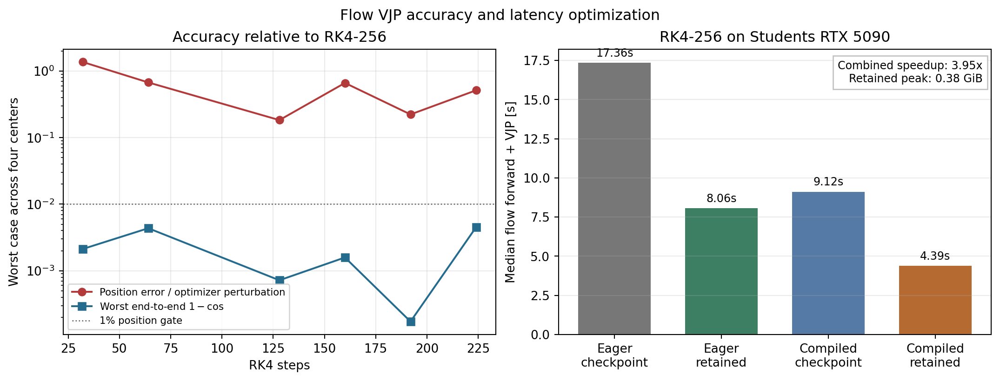

### 10.3 保留激活而不 checkpoint

原实现每 8 个 ODE step 做一次 activation checkpoint。它把峰值激活显存压得很低，但 backward 必须重算全部 1024 次网络前向。新实现保留完全相同的 RK4 运算顺序，只增加 `use_checkpoint=False` 路径。独立线性场单测证明两种路径的输出和 VJP 逐位一致，四个真实中心的 checkpoint/retained VJP 相对误差也为 0。

Students 同分区、同型号硬件的 RK4-256 结果如下：

| eager 模式 | flow 前向 + VJP 中位数 | P95 | 最大增量峰值显存 |
|---|---:|---:|---:|
| 每 8 步 checkpoint | 17.36 s | 18.37 s | 0.046 GiB |
| 保留全部激活 | 8.06 s | 8.82 s | 0.497 GiB |

按逐中心速度比取中位数，保留激活加速 $2.22\times$。另一轮 Students 作业 `31791` 得到 14.18 s 对 6.71 s，速度比同样约 $2.1\times$，说明结论不依赖单次墙钟波动。约 0.5 GiB 的增量显存远低于当前空闲 5090 的容量，所以对当前强制 batch 1、两线圈 token 的 VJP，checkpoint 是明显不合适的时间换空间。`decode_physical_vjp()` 现默认保留激活；底层通用积分器仍保留 checkpoint 默认值，批量扩展前不能把单样本显存结论机械外推。

### 10.4 `torch.compile` 与 launch 开销

一次性 profiler 在 RK4-256 retained 路径中记录了 299,583 个 CUDA event 和 2,854,825 个 profiler event。插桩后的算子 self-device 时间总和约 1.77 s，self-CPU 时间总和约 9.71 s，而插桩墙钟达到 31.61 s。由于 profiler 本身显著扰动时序，这些量不能与未插桩墙钟直接相减；但它们和 top operator 中大量小 `mm`、small-N GEMV、attention kernel 一致，足以确认该路径主要受细碎 launch 和框架调度限制，而非 5090 浮点吞吐饱和。逐 event 聚合本身又额外消耗约五分钟 CPU 时间，因此只保留为一次性诊断，不进入常规评估。

第一版 compile 尝试暴露了两个真实工程问题：模型在每次 `forward()` 内用 GPU `torch.any` 检查 `nfp`，既形成重复同步又阻止 full-graph 编译；`reduce-overhead` 模式自动启用 CUDAGraph，又会覆盖连续 RK4 调用仍需使用的静态输出。最终实现保持公开 `forward()` 的安全检查，但积分器只在入口校验一次 $N_{\mathrm{FP}}$，随后调用相同数学主体；compile 使用不启用 CUDAGraph 的默认 Inductor 模式，且没有启用 TF32。

同一 Students 配置下的结果为：

| RK4-256 模式 | flow 前向 + VJP 中位数 | P95 | 最大增量峰值显存 |
|---|---:|---:|---:|
| eager + checkpoint | 17.36 s | 18.37 s | 0.046 GiB |
| eager + retained | 8.06 s | 8.82 s | 0.497 GiB |
| compiled + checkpoint | 9.12 s | 9.29 s | 0.012 GiB |
| compiled + retained | 4.39 s | 4.64 s | 0.380 GiB |

compile 相对 eager retained 再加速 $1.84\times$；相对原 eager checkpoint 的组合加速为 $3.95\times$。compiled 与 eager 潜梯度的最小余弦为 $0.9999999996$，最大相对 $L^2$ 误差为 $3.0\times10^{-5}$；两者重解码相对正式 RK4-256 中心的位置 RMS 都在 $6\times10^{-8}\,\mathrm{m}$ 内。compiled/eager score 最大差为 0.0186，处于既定 score 容差内；最大单分量差为 0.171，反映当前 score 对极小重解码差异的敏感性。方向优化所需的梯度精度是充分的，但 compile 会改变 FP32 kernel 融合和运算顺序，不能声称 bitwise 等价。

compile 有一次性图编译成本：包含两波四中心完整 benchmark 的 compiled 作业墙钟为 2 分 27 秒，eager 对照为 2 分 07 秒，尽管 steady-state 单次 VJP 明显更快。因此它适合多步优化或多次 VJP，不适合只求一次梯度。接口 `compile_flow_transformer()` 与验证脚本的 `--compile-flow-model` 均保持显式 opt-in。

最终公共 helper 回归作业 `31836` 完成于 2 分 00 秒。它相对先前 benchmark 私有包装器的四中心潜梯度逐位相同，score 与分量差异仅为 $10^{-14}$ 量级；compiled retained 中位数为 4.38 s，与上表 4.39 s 一致。两张卡在 postflight 均为 2 MiB 显存占用和 0% 利用率。

### 10.5 最终选择

按“结果必须能与 RK4-256 直接互换”的严格标准，单轨迹 flow VJP 配置是 FP32 RK4-256、保留全部激活；需要反复求梯度时再启用 `compile_flow_transformer()`。这在不降低 RK4-256 互换精度的前提下把 steady-state flow 前向加 VJP 从约 17.36 s 降到 8.06 s，重复优化场景可进一步降到 4.39 s。原生 G2 前向约 4--5 s、reverse 仅约 0.1--0.2 s，因此 compiled retained 后完整物理 VJP 步的主要成本重新回到 native score 前向，flow 不再是原先约 13--15 s 的绝对瓶颈。

尚未处理的是多起点 batch VJP。此前批量解码已经证明吞吐量远好于 batch 1；后续若同时优化多个相同 $(N_{\mathrm{FP}},n_c)$ 的起点，应按条件分组扩展 VJP batch。第 11 节进一步区分了“逼近 RK4-256”与“较低步数映射自身可逆且优化自洽”，并据此修正了实际优化所需的步数判断。

## 11. 按同步长重建误差重新判断 RK4 步数

### 11.1 两个问题不应混为一谈

用户指出的逻辑成立。令 $F_N$ 表示使用 $N$ 个 RK4 步从 $t=0$ 积分到 $t=1$ 得到的离散 flow 映射，令 $B_N$ 表示用相同步数从 $t=1$ 反向积分到 $t=0$。若一次优化始终使用同一个 $N$，它实际优化的是

$$
S_N(z)=S\!\left(F_N(z)\right),
$$

而不是 $S_{256}(z)$。因此 $F_N(z)$ 与 $F_{256}(z)$ 的差异首先说明两者定义了不同的离散参数化和不同的优化任务，不能直接解释为 $S_N$ 的梯度错误。第 10.2 节的跨步长门槛回答的是“能否把某个 $N$ 的 latent、物理输出和 score 当作 RK4-256 的可互换近似”，它对复现旧结果有意义，但用它断言“优化必须使用 256 步”确实过严。

当前 VJP 还提供了比重建误差更直接的机制保证：`decode_physical_vjp()` 对组成 $F_N$ 的实际 RK4 计算图直接做自动微分，得到

$$
g_z=J_{F_N}(z)^Tg_x.
$$

它不先用 $B_N$ 回到某个近邻点再求导，因此不会因为正反积分闭环误差而把“邻点的梯度嫁接到当前点”。保留激活与 checkpoint 的梯度已逐位一致，compiled/eager 的最小余弦也达到 $0.9999999996$。同步长重建误差主要检验的是：当真实样本通过 $B_N$ 反追踪到 latent，或 latent 需要正反往返时，是否仍对应同一个局部位置。

重建误差也不是连续 ODE 精度的充分条件。一个偏离连续流但正反近似互逆的离散映射仍可有很小闭环误差。不过本项目把 flow 当作物理 score 的搜索参数化，候选线圈最终由真实 CUDA score 直接验收；在这个用途下，只要 $F_N$ 自身稳定、闭环误差远小于优化尺度，并且全程不混用别的步数，就没有必要要求它逐点等于 $F_{256}$。

### 11.2 当前四中心的同步长闭环实验

作业 `31850` 在四个既有优化中心上分别计算

$$
z'=B_N\!\left(F_N(z)\right),
\qquad
x'=F_N\!\left(B_N(x)\right).
$$

这里 $x$ 是各中心正式保存的物理线圈经过同一 normalizer 得到的数据空间表示。潜空间误差除以本轮真实梯度实验使用的探针 RMS $h=0.00125$。物理闭环误差的分母也没有复用 RK4-256 数据，而是对每个 $N$ 单独批量解码同一组 200 个正交方向的 $F_N(z\pm hd)$，用相同离散映射下的线圈曲线 RMS 位移作为尺度。下表取四个中心的最坏值。

| RK4 步数 | 潜空间闭环 RMS | 占 $h$ 比例 | 数据空间闭环 RMS | 线圈曲线闭环 RMS | 占实际探针位移比例 |
|---:|---:|---:|---:|---:|---:|
| 16 | $1.3642\times10^{-2}$ | $1091\%$ | $4.2082\times10^{-4}$ | $903.8\,\mu\mathrm m$ | $169.8\%$ |
| 32 | $1.1558\times10^{-3}$ | $92.5\%$ | $3.2904\times10^{-5}$ | $74.64\,\mu\mathrm m$ | $14.0\%$ |
| 64 | $1.8890\times10^{-5}$ | $1.51\%$ | $6.7693\times10^{-7}$ | $1.137\,\mu\mathrm m$ | $0.2140\%$ |
| 128 | $4.0815\times10^{-6}$ | $0.327\%$ | $2.9442\times10^{-7}$ | $0.301\,\mu\mathrm m$ | $0.0566\%$ |
| 256 | $1.3703\times10^{-6}$ | $0.110\%$ | $1.0814\times10^{-7}$ | $0.0514\,\mu\mathrm m$ | $0.0182\%$ |

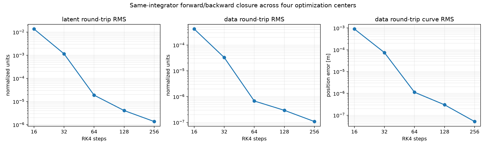

历史的三组真实 QUASR QH 样本给出了独立交叉验证：$x\to B_N(x)\to F_N(B_N(x))$ 的最坏线圈曲线 RMS 在 32、64、128、256 步时分别为 $33.3$、$2.01$、$0.113$、$0.0457\,\mu\mathrm m$。它和当前四个优化中心具有相同的数量级转折，即 32 到 64 步之间误差下降最显著。

本次表中的墙钟不应当作单次 VJP 延迟：脚本把四个中心组成 batch，并对每个步数执行两组正反闭环，共四次 ODE 积分。对应 16/32/64/128/256 步闭环墙钟为 0.58/1.15/2.35/4.77/8.97 s；额外 1600 个同步长物理探针的批量解码分别为 0.56/0.91/1.81/3.63/7.28 s。作业总墙钟为 67 s，单张 RTX 5090 的前后检查均为 2 MiB 显存占用、0% 利用率。

### 11.3 判断与使用规则

RK4-16 和 RK4-32 不应使用。尤其 RK4-32 的潜空间闭环误差已达到一次梯度探针的 $92.5\%$，物理闭环也达到探针位移的 $14.0\%$；若先反追踪再优化，它确实可能把样本放到明显不同的局部位置。

RK4-64 已达到本项目当前梯度用途所需的自洽精度。其最坏潜空间闭环只占探针 RMS 的 $1.51\%$，物理闭环只占实际探针位移的 $0.214\%$。这两项都远小于 G2 只是近似 score 梯度、ABI-9 仍需真实接受/回溯所带来的误差尺度。先前的跨步长实验还显示 RK4-64 相对 RK4-256 的固定余切 VJP 最小余弦为 $0.999974$，端到端最小余弦为 $0.995649$；这些数不再作为必须逼近 256 的硬门槛，但为“64 步不会产生方向性灾难”提供了额外旁证。

RK4-128 是反追踪和需要更保守闭环时的安全配置。它把潜空间闭环压到探针 RMS 的 $0.327\%$，物理闭环压到 $0.0566\%$，而成本仍约为 256 步的一半。RK4-256 只在需要复现旧 artifact、与既有 RK4-256 latent 直接互换，或专门研究连续 ODE 离散误差时保留为参考。

因此修正后的建议是：自洽的多步潜空间优化优先使用 FP32 RK4-64；从物理样本反追踪 latent 并希望保留更大安全余量时使用 RK4-128；同一条轨迹的反追踪、优化、保存和最终解码必须记录并保持相同的 `rk4_steps`。不能先用 RK4-256 反追踪、再用 RK4-64 优化，或把 RK4-64 的 latent 在最终阶段无说明地改用 RK4-256 解码，因为那才是真正切换了优化任务。最终候选仍应对 $F_N(z)$ 产生的物理线圈直接运行正式 CUDA score，必要时再做完整磁面与 DESC 评估。

## 12. 同起点物理梯度 Adam 扫参验收

### 12.1 实验协议与有效性边界

本轮把第 11 节选出的 RK4 步数 `{64, 128, 256}` 与学习率 `{0.003, 0.01, 0.03, 0.05, 0.1}` 做了 $3\times5$ 组合。15 个作业均从同一个原始 `start_10` latent 和零 Adam 动量开始；float32 latent SHA-256 均为 `bf3c7b5...1c4700ad`。新方法每步用固定前沿 G2 物理近似梯度，经保留激活的 flow VJP 得到潜梯度；记录的候选分数仍由 ABI-9 C++/CUDA 正式评分器重新计算，不是梯度近似值。

这是一轮**部分验收**：3 个作业跑满 200 步，12 个作业中途失败。本节不会把失败作业写成完成实验，也不会补交作业。失败前保存的每一步仍包含独立计算的正式 score，因此其历史峰值可以用于短程趋势和超参数比较；失败后的 200 步终值、收敛性和鲁棒性则没有数据支持。

完整逐步轨迹保存在本地 `reports/assets/qh_physical_gradient_adam_start10_sweep_20260804/`，远端原始目录为 `runs/qh_physical_gradient_adam_start10_sweep_20260804/`。聚合数据见 [acceptance summary](assets/qh_physical_gradient_adam_start10_sweep_20260804/acceptance_summary.json) 和 [run table](assets/qh_physical_gradient_adam_start10_sweep_20260804/acceptance_runs.csv)。

### 12.2 作业终态与统一失败原因

表中 `C200` 表示完整跑满 200 步；`F<n>` 表示 Slurm 失败前保存了 $n$ 个优化步。单元格给出“历史最高 score@步数；终态”。

| RK4 步数 | $\eta=0.003$ | $\eta=0.01$ | $\eta=0.03$ | $\eta=0.05$ | $\eta=0.1$ |
|---:|---:|---:|---:|---:|---:|
| 64 | 90.627@89; C200 | 90.645@28; F70 | 89.739@11; F20 | 90.416@11; F20 | 88.770@1; F16 |
| 128 | 90.645@86; C200 | 90.691@27; F71 | 89.676@4; F38 | 90.212@4; F20 | 88.824@1; F9 |
| 256 | 90.646@84; C200 | **90.693@26; F69** | 89.704@4; F36 | 90.315@11; F20 | 88.831@1; F8 |

12 个失败作业具有完全相同的异常：G2 Python 包装层要求完整 score 必须处于 `ok` 状态。当候选是一个可合法返回分数、但状态为 `no_axis`、`no_surface` 等非 OK 候选时，包装层直接抛出 `GpuError`，优化器因而没有机会执行原本的有限回溯 `[0.5,0.25,0.125]`。这不是 12 种彼此独立的数值崩溃，而是同一个接口契约错误。

本地提交 `41b0a1d` 已在源码层修正契约：合法非 OK score 返回 code 0、保留 `SgpuScoreResult`、把梯度清零并令梯度状态保持非 OK，供调用方回溯；真正的后端错误仍抛异常。本地回归测试为 `11/11`。按照本次“只验收、不重跑”的要求，该提交**没有同步到远端、没有重新编译，也没有参与本节任何数值结果**，因此这里只记录已定位和已修源码，不能称为远端验证完成。

所有 15 个 postflight 快照均只剩 2 MiB 显存占用，GPU 利用率为 0% 或 2%；验收时没有遗留活动作业或僵尸 GPU 进程。

### 12.3 超参数与短程提升

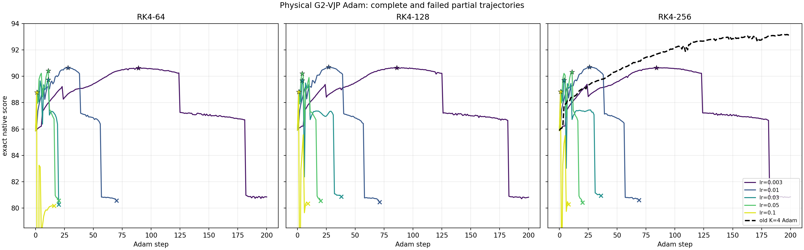

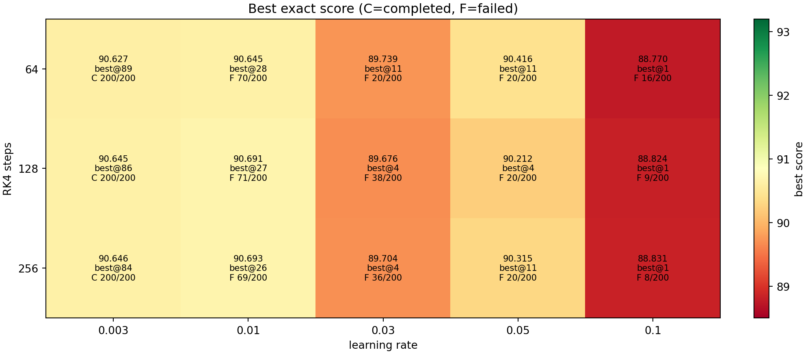

三个 RK4 离散映射的初始 score 分别为 85.861、85.911 和 85.876；这是不同离散映射定义不同物理输出的预期差异。固定学习率后，三种 RK4 步数的历史峰值非常接近，差异远小于学习率造成的差异。对本起点，$\eta=0.01$ 的短程结果最好，三种步数均在第 26 至 28 步达到约 90.65 至 90.69；$\eta=0.003$ 需要约 84 至 89 步达到相同量级；$\eta=0.1$ 在第 1 步后就开始明显退化。

因此，RK4-64 在这轮真实优化里不仅闭环自洽，而且能以最低成本达到和 128、256 几乎相同的短程峰值。当前没有证据支持为这类自洽优化继续支付 RK4-256 的额外成本。但这轮也没有证明 $\eta=0.01$ 能稳定跑满 200 步，因为对应三组均被接口 bug 中断。

### 12.4 完整 200 步轨迹暴露的机制问题

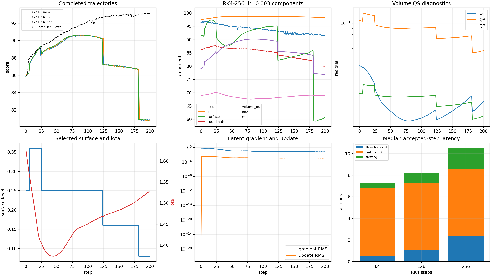

三个 $\eta=0.003$ 作业都表现出同一模式：先从约 85.9 提升到约 90.64，随后持续回撤到约 80.85。峰值之后的损失为 9.78 至 9.82 分。更关键的是，最佳点都位于 `surface_level=0.25`，末点都退化到 `surface_level=0.08`；离散磁面层级在约第 125 步发生第一次峰后下降。这个一致性表明，长程退化不是单个 RK4 步数的偶然噪声。

原因在 G2 的定义边界。它对已经选择的 axis、$\psi$ 拟合和 surface branch 求一个固定前沿的物理近似梯度，没有微分“线圈变化后重新找轴、重新拟合 $\psi$、重新选择较大磁面”这整条离散依赖。短程内 branch 不变时，这个方向确实有用，约 26 至 89 步即可获得 4.7 至 4.8 分提升；跨过 branch 边界后，它不再是完整 score 的可信下降方向。

当前优化器只有合法性回溯，没有“新 score 不得显著差于当前 score”的接受门，也没有基于实际增益与预测增益之比的信赖域。因此即使接口修复后不再异常退出，也只会让非 OK 候选进入回溯；它不会阻止合法但明显降分的连续更新，更不会修复三条完整轨迹中已经观测到的系统性峰后漂移。

这给出的工程结论是：G2 可以作为快速局部方向先验，但不能直接替代完整 score 的接受机制。下一版若继续这条路线，最低限度应在每步已经计算正式 score 的前提下加入 best-state 保留和有界的实际 score 接受条件；更进一步才是把缺失的 axis、$\psi$ 和 surface 依赖纳入 G4，或采用能处理 branch 切换的信赖域。仅修复包装层异常并不足以解决长期优化问题。

### 12.5 与旧四方向 SPSA-Adam 的结果和速度比较

| 方法 | 历史最高 score | 最后 score | 平均每步 | 作业/记录总时长 |
|---|---:|---:|---:|---:|
| G2 + VJP, RK4-64, $\eta=0.003$ | 90.627@89 | 80.848 | 7.24 s | 24.8 min |
| G2 + VJP, RK4-128, $\eta=0.003$ | 90.645@86 | 80.829 | 8.09 s | 29.3 min |
| G2 + VJP, RK4-256, $\eta=0.003$ | 90.646@84 | 80.858 | 10.65 s | 38.0 min |
| G2 + VJP, RK4-256, $\eta=0.01$，部分轨迹 | 90.693@26 | 80.615@69 | 10.29 s | 13.5 min 后失败 |
| 旧四方向 SPSA-Adam, RK4-256 | **93.166@197** | 93.160 | 26.65 s | 89.4 min |

三个完整 G2 作业相对旧方法的单步加速分别为 $3.68\times$、$3.30\times$ 和 $2.50\times$。但最高新结果仍比旧结果低 2.473 分，而且旧方法在 200 步末尾保持峰值，新方法完整轨迹则没有保持。

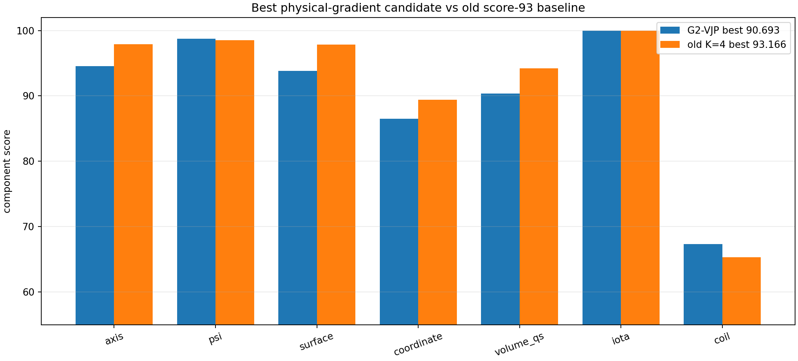

新方法最高点相对旧 score-93 点把线圈工程分量提高了 2.002 分，$\psi$ 分量提高了 0.192 分；但 axis、surface、coordinate 和 volume-QS 分量分别低 3.343、4.047、2.933 和 3.857 分。这与固定前沿近似梯度的机制限制一致：它能快速调整连续物理量，却没有可靠维护完整磁面分支和全流程质量。

### 12.6 验收结论

1. 本轮 15 组扫参只完成 3 组，12 组因同一个 G2 非 OK 状态接口 bug 中断；不能宣称完成了完整 $3\times5$ 的 200 步比较。
2. 部分轨迹的正式 score 证明 G2 + flow VJP 具有真实的短程优化价值。对本起点，RK4-64 足够，$\eta=0.01$ 在约 27 步达到最高 90.693；但尚未超过旧四方向方法的 93.166。
3. 三条完整轨迹一致证明：没有完整 score 接受条件时，固定前沿 G2 在 branch 改变后会把已得到的提升全部丢失。当前核心限制不只是失败接口，而是梯度目标与完整 score 依赖不一致。
4. 因为最高新候选低于已经做过完整物理评估的旧 score-93 候选，且用户明确要求不提交新作业，本次没有追加磁面、$|B|$ 或 DESC 完整评估，也没有补跑任何失败组合。
5. 本地接口修复可供后续继续实验，但在远端重新编译和最小回归之前仍属于未验证改动；本节所有结论均基于旧实验库 SHA-256 `fdf142...0f8d4`。

## 13. 长程确定性反向的复查与对策

### 13.1 对第 12 节解释的修正

第 12 节把长程退化主要归因于 surface branch 改变，这个解释不完整。用户指出，不同学习率的轨迹几乎只是沿横轴缩放，而且小动量配置下在峰值后出现几十步平滑下降；这种现象不能由一次脏梯度或后续 branch 跳变解释。重新检查逐步 latent、梯度和正式 score 后，确认系统性反向在 `surface_level` 仍固定为 `0.25` 时就已经发生。后面的 level 跳变只是进一步放大损失，不是反向的起点。

令学习率为 $\eta$、步数为 $k$，定义离散优化时间 $\tau=\eta k$。低学习率的两条轨迹在 $\tau$ 下高度对齐：

| RK4 步数 | score 峰值 $\tau$，$\eta=0.003/0.01$ | 首次 surface 降级 $\tau$，$\eta=0.003/0.01$ | 降级前 score 曲线 RMSE |
|---:|---:|---:|---:|
| 64 | 0.267 / 0.280 | 0.375 / 0.390 | 0.132 |
| 128 | 0.258 / 0.270 | 0.378 / 0.400 | 0.124 |
| 256 | 0.252 / 0.260 | 0.372 / 0.390 | 0.117 |

这说明 $\eta=0.003$ 与 $0.01$ 基本沿同一个确定性向量场运动，学习率主要改变穿过该路径的速度。$\eta=0.03$ 已经足够大，出现了明显离散跳跃，不能再按简单时间缩放解释。

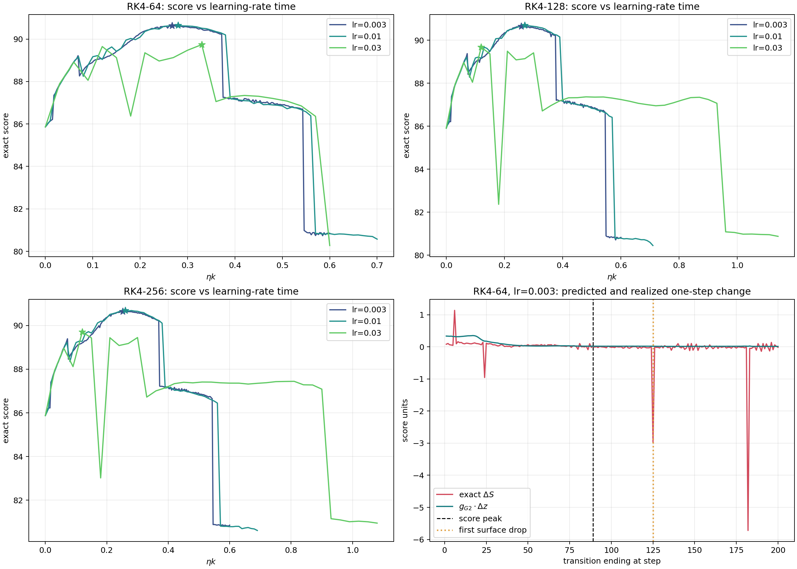

### 13.2 保存梯度与真实增量的逐步核对

对从状态 $z_k$ 到 $z_{k+1}$ 的实际 Adam 位移

$$
\Delta z_k=z_{k+1}-z_k,
$$

使用状态 $k$ 保存的 G2 潜梯度 $g_k^{\mathrm{G2}}$ 计算代理预测

$$
\Delta \widetilde S_k=
g_k^{\mathrm{G2}}\cdot\Delta z_k,
$$

并与候选上独立重算的 ABI-9 正式增量

$$
\Delta S_k=S(z_{k+1})-S(z_k)
$$

比较。下表只统计 score 峰值之后、首次 surface level 变化之前的连续区间。

| RK4 步数 | 区间长度 | $\Delta\widetilde S_k>0$ | 其中真实降分 | 累计代理预测 | 累计真实变化 | 相邻梯度余弦中位数 | 梯度 RMS 范围 |
|---:|---:|---:|---:|---:|---:|---:|---:|
| 64 | 35 | 35/35 | 25/35 | +0.694 | -0.380 | 0.983 | 0.082--0.089 |
| 128 | 39 | 39/39 | 30/39 | +0.767 | -0.426 | 0.988 | 0.084--0.089 |
| 256 | 39 | 39/39 | 30/39 | +0.773 | -0.422 | 0.986 | 0.082--0.089 |

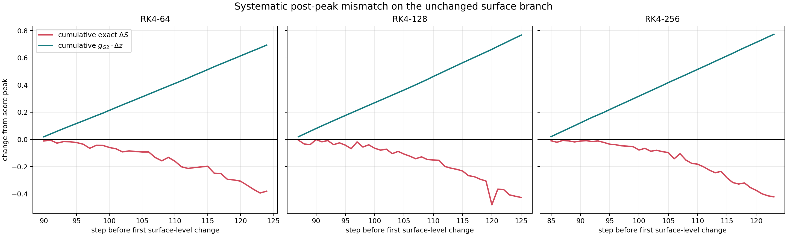

这组证据排除了两种解释：

1. 不是单个脏梯度污染动量。该区间的相邻梯度方向接近重合，RMS 也没有数量级尖峰；$\beta_1=0.5$ 即使遇到一次异常，其影响也会快速衰减。
2. 不是 surface branch 跳变后才失效。表中所有状态都还在同一个 `surface_level=0.25` 分支上。

峰值到首次 branch 变化前的分量变化如下。三个 RK4 离散映射再次给出相同结论。

| 分量 | RK4-64 | RK4-128 | RK4-256 |
|---|---:|---:|---:|
| axis | -1.030 | -1.170 | -1.227 |
| $\psi$ | -0.040 | -0.041 | -0.042 |
| surface | +1.472 | +1.524 | +1.502 |
| coordinate | -1.078 | -1.139 | -1.172 |
| volume-QS | -0.794 | -0.856 | -0.888 |
| iota | 0 | 0 | 0 |
| coil | +0.267 | +0.199 | +0.569 |

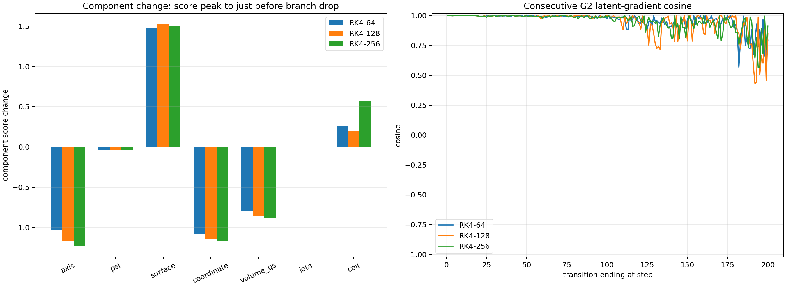

这段轨迹的 iota gate 和 helicity gate 都已经饱和为 1，因此总分就是七个分量按 `10/10/10/10/42/10/8` 加权后的值。surface 和 coil 的改善不能抵消 axis、coordinate，尤其是 42% 权重 volume-QS 的下降。RK4-64 的 QH residual 同期从 `0.01434` 平滑恶化到 `0.01737`，所以并非 volume-QS 的尺寸因子造成假下降，而是重拟合后的 QS residual 本身在恶化。

### 13.3 代码审计：没有发现全局负号错误，但存在确定的协议错误

代码层没有发现一个能解释“全程符号写反”的算术 bug：

- 优化器明确执行 `current_noise + full_update`，与返回的上升梯度约定一致；
- `q_down` 的导数为负、`q_up` 的导数为正，score 组合中的符号和权重一致；
- 点级 QS VJP、segment Biot--Savart VJP、线圈 Fourier 映射和 flow VJP 已有独立中心差分或 autograd 测试；
- 同一个方向在早期确实把 score 从约 85.9 提高到 90.6。若存在全局负号错误，不可能先稳定上升再穿过峰值。

但存在一个明确的**优化协议实现错误**。第 2、7.5 和 8 节规定 G2 只是方向先验，正式 ABI-9 score 必须负责接受、拒绝与回溯；实际优化器的 manifest 却明确记录：

```text
acceptance = first status=ok candidate; no score monotonicity gate
```

代码只检查 `candidate.valid`，完全没有比较 `candidate.score` 与 `current.score`。因此只要候选仍有轴、有磁面并能算出 G2，它就会被接受，即使正式 score 已连续下降。后面的状态回溯只处理非 OK 候选，不处理合法但降分的候选。这不是梯度公式本身的负号 bug，却是把近似梯度用于优化时违反既定接口契约的真实代码问题。

### 13.4 系统性偏差来自哪里

把完整评分依赖写成

$$
S=S\bigl(x,y^*(x)\bigr),
$$

其中 $x$ 是线圈参数，$y^*(x)$ 包括重新搜索的磁轴、$\psi$ 系数、flux 标定、射线根、体点位置、体积权重、$\alpha/\iota$ 解和所选 surface。真实总导数为

$$
\frac{dS}{dx}
=
\left.\frac{\partial S}{\partial x}\right|_{y^*}
+
\frac{\partial S}{\partial y^*}
\frac{dy^*}{dx}.
$$

当前 G2 只覆盖第一项中的两部分：线圈工程分量，以及固定 $\psi$、固定体点、固定权重和固定 $\iota$ 时 QS residual 对 $B$、$\nabla B$ 与 $G$ 的直接偏导。以下依赖没有进入 G2：

| 依赖 | G2 状态 | 对当前反向的相关性 |
|---|---|---|
| axis、$\psi$、surface、coordinate 四个分量 | 完全缺失 | 三个分量在峰后同分支区间持续下降 |
| $\alpha/\iota$ 重拟合对 QS 的链式项 | 缺失，G3 才部分加入 | 可能改变 QH residual 的真实方向 |
| $\psi$、flux 标定、射线根、$\nabla s$、体点和权重随线圈移动 | 缺失，属于 G4 | 即使 surface level 不变也连续变化，是当前首要嫌疑 |
| volume-QS 的 size factor 对表面几何的导数 | 缺失 | 当前尺寸在改善，不是本次主导损失 |
| 最大可行 surface 的离散选择 | 不可微 | 解释后续约 3 分阶跃，但解释不了此前 35--39 步平滑下降 |

因此从“固定前沿代理”的定义看，G2 局部偏导可以是数值正确的；但从“完整 score 的优化梯度”看，它在峰后已经是系统性错误方向。两种说法并不矛盾。此前固定中心的方向测试只证明若干点上 G2 与完整有限尺度方向存在正相关，没有证明这项相关性沿整条新轨迹始终保持，更没有授权无条件接受 200 次更新。

### 13.5 G3 定向探针

为了检查 $\alpha/\iota$ 隐式项是否足以修正反向，P107 作业 `31938/31937/31939` 分别在 RK4-64、$\eta=0.003$ 轨迹的 step 89、100、120 上，沿归一化 G2、累计 G3 和实际 Adam 切向做了三个尺度的正式 antithetic score：

$$
h\in\{3.125\times10^{-4},\ 6.25\times10^{-4},\ 1.25\times10^{-3}\}.
$$

全部 54 个端点都为 `status=ok` 且保持同一 branch fingerprint。三个中心的 G2/G3 潜梯度余弦分别为 `0.9845/0.9869/0.9893`，说明 G3 只做了很小修正，没有形成新的纠偏方向。

| 中心 | 方向 | G2/G3 对该方向的预测斜率 | 三个尺度的正式中心差分斜率 |
|---:|---|---:|---:|
| step 89 | G2 | +26.02 / +25.31 | +13.72, -6.92, -6.28 |
|  | G3 | +25.61 / +25.71 | -9.97, -11.65, -5.75 |
|  | Adam | +16.28 / +15.91 | +59.08, -16.23, +9.66 |
| step 100 | G2 | +26.15 / +25.29 | -0.80, -18.42, -11.55 |
|  | G3 | +25.81 / +25.63 | +5.25, +4.10, -9.47 |
|  | Adam | +16.30 / +15.88 | +12.05, +32.14, -18.19 |
| step 120 | G2 | +26.21 / +25.18 | -0.65, -8.07, -25.44 |
|  | G3 | +25.93 / +25.45 | -39.40, +13.67, -8.55 |
|  | Adam | +16.82 / +16.29 | **-10.16, -8.23, -3.90** |

小尺度 score 有有限分辨率和毛刺，不能把每个单点斜率当作精确微分；例如 probe 中同一中心重解码/重评分与保存值最多相差约 0.020。但 step 100 的 G2 方向和 step 120 的实际 Adam 方向在三个尺度上均与正预测相反，且所有端点保持同一 branch，这与长轨迹统计相互印证。结论是：G3 不足以修复当前偏差，后续若追求物理总导数，应优先进入 $\psi$/flux/射线根/体点移动这一组 G4 依赖。

三个作业分别用时 2:55、2:58 和 2:06；候选批量 flow 解码只需约 0.66--0.69 s，18 个正式 score 串行累计约 93--110 s。所有 postflight 都是 2 MiB 显存、0% utilization，没有遗留进程。原始结果位于 `reports/assets/qh_physical_gradient_bias_probe_20260804/`。

### 13.6 对策分析

#### 13.6.1 仅加入随机法向噪声

若在 G2 方向上直接加入零均值法向噪声 $\xi_\perp$，则

$$
\mathbb E[g_{\mathrm{G2}}+\sigma\xi_\perp]=g_{\mathrm{G2}}.
$$

它不会消除确定性偏差，只会增加方差。在高维潜空间中，大部分噪声还会消耗步长而没有一阶收益。因此不建议把“无选择的随机噪声”作为主要修复。只有生成多个带噪候选并用正式 score 选择最好者时，它才变成有效的随机搜索；在相同 score 预算下，正反方向差分能提取符号和斜率，通常比单边噪声更有信息量。

#### 13.6.2 正式 score 接受门和信赖域

这是必须先修的最低成本措施。对 Adam 提案 $p_k$，定义

$$
\rho_k=
\frac{S(z_k+p_k)-S(z_k)}
{g_k^{\mathrm{G2}}\cdot p_k}.
$$

若分母为正但 $\rho_k<0$，当前证据表明应拒绝，而不是因为状态仍为 OK 就更新 Adam 动量。候选降分时缩小信赖半径；连续多个尺度都不增分时停止沿 G2 前进并触发替代梯度。best-state 必须始终保留，长轨迹结束时返回 best，而不是返回最后状态。

第一候选本来就会计算正式 score，所以加入接受比较没有额外 score 成本。困难在于 score 存在约 $10^{-2}$ 量级的有限分辨率，不能对 $10^{-3}$ 级波动做机械严格单调判决。可在运行开始用少量同点重复评分标定 $\sigma_S$，只接受超过统计容差的增益；模糊区间保持当前点并缩小半径。更长期应减少 score 内非确定归约和极小输入差异的放大，使接受门本身更稳定。

#### 13.6.3 沿当前提案做 antithetic 核验

只测试 $S(z+h u)$ 不能区分负曲率、噪声和符号错误。更稳妥的是同时计算

$$
D_u(h)=\frac{S(z+hu)-S(z-hu)}{2h}.
$$

其中 $u$ 首先取归一化的 Adam/G2 提案方向。若 $D_u(h)$ 与预测同号且最佳端点超过中心，则接受；若反号，可以选择另一端或把该方向从动量中剔除；若多个尺度都没有超过中心，则说明沿该方向已经没有可用步长，应进入随机子空间或 SPSA，而不是无限二分。step 120 的结果说明这种检查能直接识别当前系统性反向。

候选集合可采用

$$
\{z,\ z\pm hu,\ z\pm h u/2,\ z\pm h u/4\},
$$

一次批量解码后并行评分，再选满足状态、分支和正式 score 条件的最好候选。它比只沿正方向回溯更能处理“梯度整体反向”的情况。

#### 13.6.4 随机方向不是简单相加，而是做子空间校正

若增加 $K$ 个与当前方向正交的随机单位方向 $u_i$，用 antithetic score 得到真实有限尺度斜率 $d_i$，一个比 `G2 + 随机 SPSA` 更可控的组合是

$$
g_{\mathrm{hybrid}}
=g_{\mathrm{G2}}
+\sum_{i=0}^{K}
\left(d_i-u_i^Tg_{\mathrm{G2}}\right)u_i,
$$

其中 $u_0$ 强制取当前 G2/Adam 提案方向。该式在已采样子空间内用正式 score 斜率精确替换 G2 的投影，在未采样的高维补空间内保留 G2 提供的低方差信息。它不会像简单加权那样重复计算同一投影，也不需要预先猜测 G2 与 SPSA 的相对尺度。

建议从 $K=1$ 或 2 个随机法向开始，并在信赖比变差或提案被拒绝时触发，而不是每一步固定支付成本。每次选择新的正交方向，长期会逐步覆盖遗漏子空间。若希望与旧 K=4 SPSA 做同预算比较，可使用 $u_0+3$ 个随机法向，共 8 个正反端点评分；这与旧方法调用数相同，但在剩余约 296 维中仍保留 G2 先验。

#### 13.6.5 SPSA 回退与动量处理

当 G2 提案在多个尺度上均未通过，最可靠的短期回退仍是已经验证过的 K=4 antithetic SPSA。它不必每步执行，只在 G2 信赖失败时触发。切换到 SPSA 或子空间校正后，应重置或显著衰减一阶动量；虽然 $\beta_1=0.5$ 会快速遗忘，但显式清理可以避免把已确认有偏的历史方向继续带入新阶段。降低 $\beta_1$、降低学习率或使用学习率衰减本身不能修复本问题，时间缩放实验已经证明它们只会更慢地沿同一错误路径前进。

#### 13.6.6 完整 G4

根本方案仍是补齐平滑分支上的总导数。G3 探针已经表明单独加入 $\alpha/\iota$ 不够，优先级应放在：

1. $\psi$ 线性最小二乘与 flux 标定的隐式 VJP；
2. 射线根和固定 surface branch 上体点位置的隐式导数；
3. $\nabla s$、$\rho$、体积权重和采样坐标移动对 QS residual 的链式项；
4. 最后再处理磁轴连续固定点分支的导数。

这些连续项可以通过线性伴随和隐函数公式实现，不要求引入无界非线性优化；但工程复杂度明显高于子空间差分。最大 surface 的离散切换仍不能靠普通梯度穿透，必须继续由正式 score 信赖域处理。

### 13.7 推荐实施顺序

| 优先级 | 方法 | 能否阻止当前退化 | 能否提供遗漏方向 | 额外成本 | 判断 |
|---:|---|---|---|---|---|
| 1 | 正式 score 接受门、best 保留、信赖半径 | 是 | 否 | 首个候选近乎零额外成本 | 必须先修 |
| 2 | 当前方向的多尺度 antithetic 核验 | 是 | 只能翻转/缩放当前方向 | 2--6 个 score，可批量并行 | 最直接 |
| 3 | $u_0+K$ 随机正交方向的投影校正 | 是 | 是，低秩 | $2(K+1)$ 个 score，按需触发 | 推荐短期主实验 |
| 4 | K=4 SPSA 回退 | 是 | 是，噪声较大 | 8 个 score | 已验证的安全后备 |
| 5 | 无选择随机法向噪声 | 否 | 期望为零 | 低但浪费步长 | 不推荐 |
| 6 | G4 总导数 | 是 | 是，物理上最完整 | 实现难度高，运行增量可较小 | 长期根本方案 |

最终结论是：当前现象不是脏梯度，也不是简单的全局符号错误。G2 作为固定前沿偏导在局部数值上可以正确，但它在这条轨迹峰值后与完整 score 总导数系统性反向；优化器又错误地省略了原设计要求的正式 score 接受门，才把这种偏差连续积累了几十步。短期应先恢复“G2 只提案、ABI-9 决策”的契约，并用 antithetic 子空间校正而不是裸加随机噪声；长期再补 G4。

## 14. 同盆地三层闭环复核：反向究竟发生在哪一步

本节回应一个更严格的问题：峰后几十步的平滑下降不能只用“G2 近似不完整”概括。必须分别检查 G2/G3 推导、CUDA 参数映射、flow VJP 和完整 score 重算，指出符号在哪一层翻转。

### 14.1 先更正一项旧证据的适用范围

第 7 节旧的 200 方向高成本参考并没有覆盖当前反向轨迹。旧参考的中心是：

- nfp=6,n_coils=2 的 step 0、200、400；
- 另一个 nfp=4,n_coils=2 的 step 50。

当前发生反向的是 nfp=4,n_coils=3 的 start_10 轨迹。因此，旧参考只能说明 G2/G3 在那些旧位型上与完整梯度相关，不能证明当前三线圈盆地的 step 89--120 也具有相同余弦。把两者视为“同一盆地不同阶段”是不正确的，后文全部改用当前轨迹的 step 50、89、100、120。

### 14.2 三个不同的标量目标

令 $z$ 为潜变量，$x=F_{64}(z)$ 为 FP32 RK4-64 flow 解码后的线圈参数。完整评分可以写成

$$
S(x)=\widehat S\bigl(x,y^*(x)\bigr),
$$

其中 $y^*(x)$ 包含磁轴、$\psi$、所选磁面、flux 标定、体点、$\nabla s$、体积权重以及 $\alpha/\iota$ 的线性最小二乘解。

为逐层隔离，新增两个只用于诊断的精确标量：

1. $\widetilde S_2$ 固定中心的 $\psi$、体点、$\nabla s$、权重和 $\alpha/\iota$，仅在这些固定点重新计算查询线圈的 $B$、$\nabla B$、$G$ 与线圈工程分量。其中心导数应严格等于累计 G1+G2。
2. $\widetilde S_3$ 仍固定几何前端，但对每个查询线圈重新执行生产 FP32 QR，求新的 $\alpha/\iota$；同时只开放 G3 明确定义的 coordinate-alpha residual，冻结必须与几何移动共同处理的 normal-$B$ 项。其中心导数应严格等于累计 G1+G2+G3。
3. $S$ 是 ABI-9 正式 score，每次重新寻找磁轴、拟合 $\psi$、筛磁面、标定 flux、生成体点并拟合 $\alpha/\iota$。

对任意潜空间方向 $u$，分别比较

$$
D_u\widetilde S_j(h)=
\frac{\widetilde S_j(F_{64}(z+hu))-\widetilde S_j(F_{64}(z-hu))}{2h}
$$

与原生物理梯度经过 flow VJP 后的预测。这样可以区分“原生梯度不对”和“flow 把正确物理梯度传播错了”。

### 14.3 G2、G3 与 flow VJP 都没有在峰后翻号

四个中心各使用 32 个随机正交方向；下表报告最小潜变量 RMS 尺度 $h=3.125\times10^{-4}$ 的余弦。所有中心重构误差都在数微分辨率内，且所有命名方向的正负端点保持同一 branch fingerprint。

| step | 轨迹位置 | $\widetilde S_2$ FD / 原生 G2 | $\widetilde S_3$ FD / 原生 G3 | 物理 secant / flow VJP | 实际 Adam 方向上的 $\widetilde S_2$ / $\widetilde S_3$ 斜率 |
|---:|---|---:|---:|---:|---:|
| 50 | 上升段 | 1.000000 | 0.999999 | $>0.999995$ | +22.03 / +23.36 |
| 89 | score 峰值 | 1.000000 | 0.999999 | $>0.999995$ | +16.28 / +15.91 |
| 100 | 峰后 | 0.999513 | 0.999545 | $>0.999995$ | +16.30 / +15.89 |
| 120 | 峰后 | 0.996023 | 0.995813 | $>0.999995$ | +16.43 / +15.91 |

step 120 的 8 方向独立烟测在四个尺度上也得到 G3 FD/物理梯度余弦 0.9972--0.9983。较大方向数下余弦略降，主要来自 FP32 QR 与固定点归约的有限分辨率，但完全没有接近零或变负。

因此可以排除：

- Adam 更新号写反；
- Fourier 系数/电流参数映射号写反；
- G2 直接 QS VJP 对其定义的冻结标量求错方向；
- G3 的 $\alpha/\iota$ QR 隐式 VJP 求错方向；
- flow VJP 把物理梯度连接到错误潜变量位置或发生符号反转。

这里的结论不是“G2/G3 等于完整梯度”，而是“G2/G3 正确求出了各自冻结目标的导数”。

### 14.4 step 120：同一个 QS 分量在重建几何后翻号

在实际 Adam 方向上取 $h=6.25\times10^{-4}$，得到：

| 计算层次 | score 斜率 | volume-QS 分量斜率 | 目标 QH 误差斜率 | $\iota$ 斜率 |
|---|---:|---:|---:|---:|
| G2：固定几何与 $\alpha/\iota$ | +16.12 | +38.04 | -0.02079 | 固定 |
| G3：固定几何，重拟合 $\alpha/\iota$ | +15.59 | +39.25 | -0.02143 | +0.6036 |
| 正式 score：全部重算 | **-8.23** | **-28.44** | **+0.02340** | +0.6001 |

三个尺度下，正式 volume-QS 斜率分别为 -28.46/-28.44/-28.47，目标 QH 误差斜率分别为 +0.02343/+0.02340/+0.02342。这种一致性排除了单点毛刺和差分步长偶然性。

该表给出两个关键判断：

1. $\alpha/\iota$ 重拟合不是反号来源。G3 中 $\iota$ 的变化与完整重算几乎一致，但固定几何下 QH 误差仍在下降；
2. 反号发生在重新拟合 $\psi$ 并重建磁面坐标、$\nabla s$、flux derivative、体点和权重之后。它不是“G2 关注的 volume-QS 在升、其它分量把总分拖低”，而是 **volume-QS 自己从上升翻成下降**。

磁面尺寸也不是罪因。正式 score 中 size factor 的导数为正；去掉这一正向补偿后，QS residual 对应的分量斜率约为 -44.15，比最终 -28.44 更差。

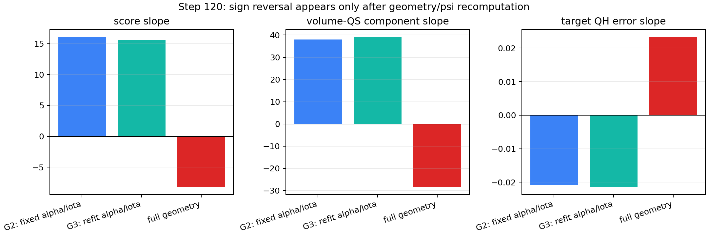

### 14.5 完整 score 的分量账目

同一 $h=6.25\times10^{-4}$ 下，正式 score 各分量沿实际 Adam 方向的斜率为：

| 分量 | 原始分量斜率 | 按 score 权重后的贡献 |
|---|---:|---:|
| axis | +65.18 | +6.52 |
| psi | -3.41 | -0.34 |
| surface | +12.94 | +1.29 |
| coordinate | -39.11 | -3.91 |
| volume-QS | -28.44 | -11.94 |
| iota | 0 | 0 |
| coil | +1.86 | +0.15 |
| 合计 | - | **-8.23** |

axis、surface 和 coil 实际上在补偿退化。主导负项是移动几何下的 volume-QS，其次才是 coordinate。把问题归因于“G2 未覆盖 axis 等其它分量”并不准确；核心是缺少下面的物质导数：

$$
\frac{dS}{dx}
=
\left.\frac{\partial \widehat S}{\partial x}\right|_{y^*}
+
\frac{\partial \widehat S}{\partial y^*}
\frac{dy^*}{dx}.
$$

G3 已验证第一项及固定几何下 $\alpha/\iota$ 的隐式响应；当前符号翻转由第二项中 $\psi$/flux/磁面坐标与权重的响应主导。若把 G2/G3 称作“完整 score 梯度”，这属于推导范围错误；若把它们称作“固定前端方向先验”，实现本身是正确的。

### 14.6 同盆地 300 维完整参考：峰后全空间余弦确实变负

P107 四卡作业 `32001` 对当前 nfp=4、n_coils=3 轨迹的 step 50、89、100、120 分别构造 300 维随机正交完备基，并在潜变量 RMS 尺度 $h=0.005$ 和 $h=0.0025$ 上对每个方向做正反 ABI-9 正式 score。总计 4804 次完整评分，单样本评分均值/P95 为 $5.909/6.194\ \mathrm{s}$。四张 RTX 5090 在作业前后均为 2 MiB、0% 利用率，没有遗留 GPU 进程。

$h=0.0025$ 时四个中心均为 300/300 个方向与中心保持相同 branch fingerprint，因此可以由完备正交基直接重构有限尺度完整梯度。结果如下：

| step | 位置 | 完整梯度/G2 余弦 | 完整梯度/G3 余弦 | 完整 score 沿 Adam 方向斜率 | G2/G3 预测斜率 |
|---:|---|---:|---:|---:|---:|
| 50 | 上升段 | +0.052 | +0.238 | **+37.60** | +22.02 / +23.35 |
| 89 | score 峰值附近 | -0.118 | -0.110 | **-4.95** | +16.28 / +15.91 |
| 100 | 峰后 | -0.180 | -0.160 | **-20.99** | +16.30 / +15.88 |
| 120 | 峰后 | -0.305 | -0.272 | **-24.60** | +16.82 / +16.29 |

这给出了用户所要求的全空间证据：不是只有某一条偶然的 Adam 方向出问题。G2/G3 与完整有限尺度梯度的余弦从上升段的正值，经过峰值附近的近零，进入峰后稳定负值；与此同时，G2 与 G3 彼此余弦从 step 89 起一直高于 0.984，说明加入 G3 并没有改变错误方向的主体。

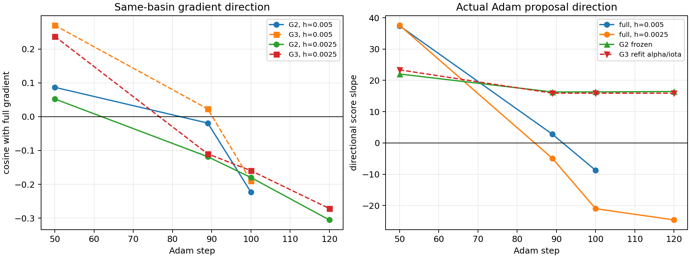

该参考仍有必须说明的尺度限制。$h=0.005$ 时 step 50/89/100 的 300 个方向全部保持同分支，step 120 只有 298/300，因此不为 step 120 强行补齐完整梯度。两个尺度的完整梯度余弦在 step 50 为 0.961，但在 step 89/100 只有 0.200/0.235，表明峰值附近的正式 score 在全空间具有明显有限尺度效应，不能把 $h=0.0025$ 称为无噪声的无穷小梯度。不过符号结论不依赖这一夸大：

- step 100 在两个完整尺度上的 G2/G3 余弦均为负，完整 score 沿 Adam 方向斜率分别为 $-20.99/-8.75$；
- step 120 在更小的三个直接尺度 $h=0.0003125/0.000625/0.00125$ 上，沿实际 Adam 方向的正式 score 斜率为 $-10.16/-8.23/-3.90$，volume-QS 斜率稳定为约 $-28.46$；
- 同一批小尺度的冻结 G2/G3 目标斜率一直约为 $+16$。

因此，全维参考适合证明偏差并非局限在一个方向；多尺度实际提案探针则更严格地证明优化使用的那条方向在峰后确实系统性反向。

### 14.7 G2 覆盖的 QS 并非仍在改善

在 $h=0.0025$ 的完整参考中，把七个正式 score 分量的方向导数乘以各自权重，可得到如下账目：

| step | axis | psi | surface | coordinate | volume-QS | coil | 合计 |
|---:|---:|---:|---:|---:|---:|---:|---:|
| 50 | -2.97 | +0.43 | +16.38 | -0.64 | **+26.51** | -2.11 | **+37.60** |
| 89 | -6.35 | -0.08 | +5.37 | -3.44 | **-1.99** | +1.56 | **-4.95** |
| 100 | -16.11 | -0.35 | +5.18 | -3.32 | **-8.41** | +2.02 | **-20.99** |
| 120 | -10.86 | -0.30 | +1.18 | -2.92 | **-11.97** | +0.28 | **-24.60** |

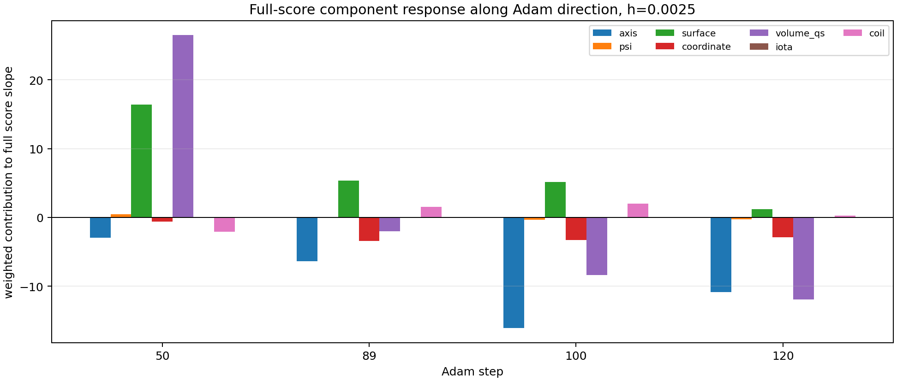

这直接排除了“G2 关注到的 QS 分量上升，只是未关注的其它分量下降更多”这一解释。上升段 step 50 的正式 volume-QS 确实强烈上升；到 step 89 已转为轻微下降，step 100/120 则成为主导负项之一。step 120 的三层隔离进一步证明：固定几何时，同一 QS residual 沿该方向改善；重建 $\psi$/flux/体点几何后，它才恶化。缺失的不是一个与 QS 无关的小权重分量，而是 QS 对移动坐标和积分域的主要链式项。

### 14.8 最终代码与推导判定

本轮没有发现以下实现错误：

1. **没有 Adam 全局反号。** step 50 的同一实现显著上升，且实际更新与保存梯度点积始终为正。
2. **没有 G2 点级 QS、Biot--Savart 或 Fourier/current 参数映射反号。** 原生 G2 与其精确定义的冻结标量在四个阶段均闭合。
3. **没有 G3 的 FP32 QR 隐式 VJP 反号。** 固定几何、逐查询重拟合 $\alpha/\iota$ 的精确标量与原生 G3 闭合；其 $\iota$ 响应还与完整重算一致。
4. **没有 flow VJP 接错点或传反。** 物理空间 secant 与潜空间 VJP 在所有阶段余弦均高于 0.999995。

确认存在两个不同层次的问题：

1. **推导/方法范围错误。** G2/G3 计算的是冻结前端标量的偏导，却在长程优化中被当成正式 score 的总导数。缺失项

   $$
   \frac{\partial \widehat S}{\partial y^*}\frac{dy^*}{dx}
   $$

   包含 $s/\psi$ 拟合、flux 标定、等值面根、$\nabla s$、体点位置和积分权重的耦合响应；当前盆地中它从峰值附近开始超过固定前端偏导，并使完整梯度方向反转。
2. **优化器协议实现错误。** `optimize_qh_physical_gradient_adam.py` 接受第一个 `status=ok` 的候选，不检查正式 score 是否提升。于是代理梯度即使连续与正式目标反向，也会被无条件累计几十步。这违背了早期已经写明的“G2 只提案、ABI-9 负责接受”的接口契约。

早期 200 方向实验与本轮并不矛盾。旧实验来自 nfp=6,n_coils=2 和另一个 nfp=4,n_coils=2 盆地；梯度相关性是局部性质，不能跨盆地外推。当前三线圈盆地甚至在 step 50 的全空间 G2 余弦也只有 0.052，但 Adam 预条件后的实际方向仍有 $+37.60$ 的正式斜率。这说明“短程能优化”本身不能证明代理梯度在全空间准确。

### 14.9 对策优先级

| 优先级 | 对策 | 能解决什么 | 代价与限制 |
|---:|---|---|---|
| 1 | 恢复正式 score 接受门、有限回溯和 best-state 保留 | 立即阻止几十步稳定降分 | 候选正式 score 本来已经计算，几乎不增加成本；只能防退化，不能修正方向 |
| 2 | 沿代理提案做正反 antithetic 核验 | 直接判断当前 G2 方向的正式斜率 | 每步多一次正式 score；若斜率非正则拒绝或回退 SPSA |
| 3 | 在提案方向和少量随机正交方向上做低秩控制变量校正 | 用正式 score 修正 G2 的局部系统偏差 | 可复用 K=4 级别黑箱预算；比完全放弃物理梯度更有信息密度 |
| 4 | 补全耦合 G4 物质导数 | 从根本上逼近正式 score 总导数 | 实现难；必须联立 $s/\psi$/flux/移动点和权重，不能只打开固定面的 normal-$B$ 项 |

不建议给 G2 直接叠加未筛选的零均值法向噪声。它只增加探索方差，不改变有偏梯度的期望方向，因而不能解释或修复本轮这种持续几十步的系统反向。随机方向只有在实际评分后用于校正、接受或回退时才有明确作用。

## 15. G4 补全的理论可行性与工程难度

### 15.1 结论先行

**G4 在理论上可行，但准确说法是：正式 score 在固定计算分支的正则邻域内几乎处处可微，G4 可以补全该分支内的总导数；完整 score 在全局上不是处处可微，也不存在一个能够穿过所有候选切换和硬判据的普通梯度。**

这里的“固定正则分支”要求以下离散状态保持不变：

1. 磁轴候选及其排序不变；
2. 被选中的 $s_{\mathrm{edge}}$ 和 flux 标定候选不变；
3. 所有射线根都是单根，且 Newton 结果没有撞到搜索区间端点；
4. 体点有效掩码、压缩后的索引和分层抽样索引不变；
5. max、min、分位数及各个硬阈值的活跃分支不变；
6. $s/\psi$ 与 $\alpha/\iota$ 的增广最小二乘矩阵保持满秩且条件数可控。

在这些条件下，从线圈参数 $x$ 到 score 的计算是光滑 Biot--Savart 场、线性最小二乘、简单根、坐标变换、有限求和及分段光滑标量函数的复合。所需导数都存在，可以用隐式微分和 VJP 计算，不需要为每个参数显式构造完整 Jacobian，也不需要在反向阶段引入新的非线性优化。

当前 nfp=4、n_coils=3 的同盆地轨迹是较适合验证 G4 的对象：参考计算中被选中的 level 一直是 $0.25$，且 $125952/125952$ 个 volume candidates 全部有效，因此候选选择和点压缩暂时没有切换。不过目前还没有记录所有射线上的 $|\partial s/\partial r|$ 下界、根到 clamp 的距离和活跃分位数间隔，所以尚不能声称整个邻域都正则；这些量必须成为 G4 的运行时条件诊断。

### 15.2 固定分支上的完整链式结构

把正式目标写为

$$
S(x)=\widehat S\!\left(x,y^*(x)\right),
$$

其中 $y^*$ 汇总了磁轴、$s/\psi$ 系数、选定的等值面、flux 标定、体点坐标与权重、$\alpha/\iota$ 系数等中间量。完整导数为

$$
\frac{dS}{dx}
=
\left.\frac{\partial \widehat S}{\partial x}\right|_{y^*}
+
\frac{\partial \widehat S}{\partial y^*}
\frac{dy^*}{dx}.
$$

现有 G2/G3 已经验证了第一项以及固定几何时 $\alpha/\iota$ 的响应。G4 要补的是固定磁轴、固定候选分支条件下，由 $s/\psi$、flux、射线根、移动体点、坐标基和积分权重产生的第二项。磁轴自身的响应不属于 G4，而属于后续 G5。

#### $s/\psi$ 线性最小二乘

在磁轴和采样点固定时，$s$ 的拟合可抽象为带正则的线性问题

$$
c_s^*(x)
=
\arg\min_c
\left\|A(x)c-b(x)\right\|_2^2
+
\lambda_s\left\|L c\right\|_2^2.
$$

其正规方程为

$$
Hc_s^*=g,
\qquad
H=A^T A+\lambda_s L^T L,
\qquad
g=A^T b.
$$

只要 $H$ 非奇异，就有

$$
dc_s^*
=
H^{-1}\left(dg-dH\,c_s^*\right).
$$

实际实现不应显式形成 $H^{-1}$，而应对现有增广 QR 解做隐式 VJP。正则项使唯一性比无正则问题更好，因此这里没有理论上的梯度阻断；风险主要是数值条件数和 FP32 反向误差，需要用方向差分闭合验证。

#### 射线根和 flux 标定

边界半径满足

$$
s\!\left(r_b,\theta,\phi;x\right)-s_{\mathrm{edge}}=0.
$$

若该根为单根，即

$$
\frac{\partial s}{\partial r}(r_b,\theta,\phi;x)\neq 0,
$$

则隐函数定理给出

$$
\frac{dr_b}{dx}
=
-\frac{\partial s/\partial x}{\partial s/\partial r}.
$$

因此无需对 Newton 的每一次迭代反传，也无需把根求解改造成新的非线性反向优化。真正的问题只出现在切根、多重根、$\partial s/\partial r$ 接近零或根撞到 clamp 时；这些位置的导数会病态或不存在，应报告为 branch margin 不足，而不是返回一个看似有限的伪梯度。

选定边界后，环向截面 flux、四次 flux 标定多项式及其导数仍是固定求积和小型线性最小二乘的复合，正则分支上可微。edge flux 的符号选择在 flux 不过零时是常量分支；过零点不可微，但高质量 QH 盆地不应频繁靠近该点。

#### 移动体点和积分权重

体点可写成

$$
q(x)=q\!\left(r_b(x),\rho,\theta,\phi\right),
$$

其体积权重包含类似

$$
w(x)\propto R(q(x))\,r_b(x)^2
$$

的几何因子。G4 必须同时传播：

- $q$ 的位移；
- $s$、$\nabla s$ 和由它们构成的 $\rho,\theta,\phi$ 坐标基；
- flux 标定导数；
- 体积权重；
- 在移动点上重新评估的 $B$ 与 $\nabla B$；
- 依赖这些量的 $\alpha/\iota$ QR 与最终 QS residual。

这正是当前 G2/G3 缺失、且在 step 100/120 使 volume-QS 导数反号的链式项。

### 15.3 各层导数是否存在

| 层 | 正则分支上是否可微 | 当前主要缺口 | 难度 |
|---|---|---|---|
| 线圈系数到 $B$、$\nabla B$ | 是，评价点远离线圈时解析光滑 | 已有参数 VJP | 已完成 |
| 固定磁轴/固定网格上的 $s$ 拟合 | 是，正则增广 LS 有唯一解 | $s$ QR 隐式 VJP 及其下游连接 | 中等 |
| $\psi(s)$ flux 标定小型 LS | 是，固定候选且矩阵满秩时 | 求积、根和标定 VJP | 中等 |
| 简单等值面射线根 | 是，$\partial s/\partial r\neq0$ 时 | 根的隐式 VJP、正则性诊断 | 中等 |
| 移动体点、坐标基和权重 | 是，固定索引且远离坐标奇点时 | 完整几何链式项 | 高 |
| 移动点上的 $B$ | 是 | $\nabla B\,dq$ 已可由现有场梯度支持 | 中等 |
| 移动点上的 $\nabla B$ | 是 | 需要磁场 Hessian 与 $dq$ 的收缩 | 高 |
| 固定几何上的 $\alpha/\iota$ QR | 是 | G3 已实现并闭合 | 已完成 |
| p95、max、min | 几乎处处可微 | 活跃样本交换时只有次梯度/不连续切换 | 中等风险 |
| 候选 level、有效点 mask、整数计数、状态码 | 否，属于离散映射 | 只能固定分支、软化定义或交给外层接受门 | 不可由普通 VJP 穿透 |
| 磁轴候选选择与拓扑变化 | 全局不可微 | G5 仅能处理固定轴分支的隐式响应 | 很高 |

这里最重要的新增算子是移动点上的场梯度导数。因为 QS residual 使用 $\nabla B(q(x),x)$，所以

$$
\frac{d B}{dx}
=
\left.\frac{\partial B}{\partial x}\right|_q
+
\nabla B\,\frac{dq}{dx},
$$

而

$$
\frac{d\nabla B}{dx}
=
\left.\frac{\partial\nabla B}{\partial x}\right|_q
+
\nabla^2 B\,\frac{dq}{dx}.
$$

当前 CUDA 后端已有 $B+\nabla B$ 评价和对线圈参数的 VJP，但没有第二项所需的空间 Hessian 路径。这不是数学障碍：远离线圈时 Biot--Savart 核解析光滑，$\nabla^2B$ 存在。工程上也不应存储每个点的完整高阶张量；应直接在 segment kernel 内计算反向传播所需的 Hessian--vector contraction，再对线圈段归约。对约 $10^5$ 个体点而言，这是 G4b 最大的开发和吞吐风险。

### 15.4 真正不可穿透的结构

以下位置不存在可由普通链式法则补全的单一梯度：

1. 磁轴候选出现、消失、换序或拓扑改变；
2. “最大可行磁面”从一个离散 $s_{\mathrm{edge}}$ 切换到另一个；
3. surface trace 穿过 stable/strict、drift 或 flux rejection 的硬阈值；
4. 射线根发生合并、换根，或 Newton 结果被 clamp；
5. volume candidate 的有效标志改变，导致 CUB compaction 和后续抽样索引变化；
6. strict count、status code 等整数输出改变；
7. QA/QH/QP 竞争项、clip 和饱和函数恰好位于折点。

p95、max 和 min 不等于完全不可导：活跃样本唯一且不换序时可对该样本传播局部导数。但它们的活跃索引在微扰下可能交换，所得梯度噪声较大。因此 G4 接口必须同时返回分支安全裕量，而不能只返回一个向量。

这意味着 G4 的正确定位是 **branch-conditional gradient**。外层优化器仍须用正式 ABI-9 score 做候选验收、有限回溯和 best-state 保留；一旦分支裕量不足或正式 score 与预测方向矛盾，就重建缓存、缩小信赖域或回退到少方向黑箱估计。不能让 G4 穿过离散边界后继续无条件积累 Adam 动量。

### 15.5 建议的分阶段实现

#### G4a：先补固定采样拓扑下的 $s/\psi$/flux 响应

第一阶段保持磁轴、选中 level 和 volume candidate 索引不变，加入：

1. $s$ 增广 QR 的隐式 VJP；
2. $\psi(s)$ 标定系数的 VJP；
3. $s$ 验证、normal-$B$、坐标基和 $\alpha$ 特征对 $s$ 系数的响应；
4. 选定射线根的隐式导数和 flux 求积响应。

这一阶段的数学结构清楚，难度中等。不得单独重新打开“固定旧磁面上的 normal-$B$ 梯度”并把它加入正式提案，因为先前实验已经表明它与移动几何存在很强的抵消；必须以闭合的几何子图为单位加入。

#### G4b：补移动体点、权重和 QS 的物质导数

第二阶段加入：

1. $r_b$ 到全部体点坐标的 VJP；
2. $\rho$、坐标梯度和体积权重的 VJP；
3. $B$ 在移动点上的响应；
4. $\nabla B$ 的 Hessian--vector 路径；
5. 在新特征响应上复用已验证的 $\alpha/\iota$ QR 隐式 VJP。

这是 G4 中最关键且最困难的部分，难度高，但没有理论障碍。实现应保持当前 CUDA 大批量路径，禁止把 $10^5$ 点回退到 CPU 或显式逐参数差分。

#### G4c/G5：按证据决定是否继续

即使 G4a+G4b 完成，它仍不包含两类响应：

- 固定候选下 long-horizon surface trace、p95 drift 等 surface score 的导数；
- 磁轴固定点关于线圈参数的隐式导数。

前者可对固定步数场线积分器做离散伴随，但活跃分位数和稳定判据仍是分段的；后者可在固定轴分支上对

$$
q^*=P(q^*,x)
$$

使用

$$
\left(I-\frac{\partial P}{\partial q}\right)\frac{dq^*}{dx}
=
\frac{\partial P}{\partial x},
$$

但候选轴的出现、消失和换序依旧不可微。二者开发成本都高于 G4a，是否实施应由 G4a+G4b 对完整参考梯度的增益决定，而不是预先把整条 score pipeline 全部自动微分。

### 15.6 验证标准

G4 不能只用“Adam 短期涨分”验收。每加入一层，都应构造与该层定义完全一致的精确代理标量，并依次验证：

1. 原生物理 VJP 与该代理标量的中心差分闭合；
2. 物理方向导数经 flow VJP 后与潜空间差分闭合；
3. 在同盆地 step 50、89、100、120 上比较 G2、G3、G4 与正式 score 的 32 方向余弦、均值和标准差；
4. 只有局部闭合后，才做 300 维参考或真实 Adam 提案比较；
5. 重点验收 step 100/120 的 volume-QS 符号是否由错误的正值修正为与正式 score 一致的负值；
6. 每次记录 $\min|\partial s/\partial r|$、根到 clamp 的距离、QR 条件指标、有效点 mask 裕量、分位数活跃间隔和候选 level 裕量。

由于当前完整参考在峰值附近存在明显尺度效应，不能只报告单一差分步长。应使用多个局部尺度，并把“同一分支内的闭合精度”和“跨分支后的正式提案效果”分开报告。

### 15.7 最终判断

1. **相关连续导数确实存在。** $s/\psi$ LS、flux LS、简单等值面根、移动体点、权重、$B$、$\nabla B$ 和固定几何的 $\alpha/\iota$ 在正则分支上都有明确导数。
2. **不存在理论上的连续梯度阻断。** 最大的新数学量是 $\nabla^2B\,dq$，Biot--Savart 场远离线圈时解析，因此可计算。
3. **存在真实的离散阻断。** 轴/磁面候选选择、硬 rejection、有效点压缩和索引切换不能由普通 VJP 穿透；G4 必须是带分支诊断的局部梯度，而不是全局梯度承诺。
4. **G4a 可行性高、难度中等；完整 G4b 可行性高但工程难度高。** 主要成本在 $10^5$ 移动点的坐标链式项和磁场 Hessian--vector CUDA 路径，而不在线性最小二乘本身。
5. **G4 值得继续。** 当前同盆地证据已经把错误定位到它所覆盖的几何响应，且 volume-QS 是峰后主要负项之一。不过在 G4 完成前，应先修复正式 score 接受门；即使 G4 完成，接受门仍是跨分支优化不可省略的正确性保障。
