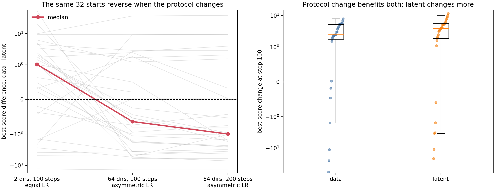

# QH 原参数空间大规模优化与磁面验证

**日期：2026-08-25** 
**分支：`codex/data-space-large-scale-validation`** 
**状态：全部远端作业结束；309 条优化轨迹完整；磁面、等 $s$ 诊断和汇总均已完成**

这轮实验回答两个问题：

1. Flow 已经给出同一组优质起点后，在 Flow 潜空间优化是否仍然比直接优化线圈 Fourier 系数更好？
2. 直接优化线圈系数得到的高分是否真的对应更低的标准磁面 QH，而不只是评分器内部数值提高？

这里的“潜空间”是 Flow 输入的高斯噪声坐标。每次评分前需要用 Flow 把它解码为线圈系数。“原参数空间”是同一组线圈 Fourier 系数逐坐标标准化后的坐标；优化过程中不再经过 Flow。两条路线共享 Flow 提供的起点，所以本实验原本想隔离**局部优化坐标**的作用；后续协议审计发现两边超参数和旧对照并未保持一致，因此它最终只比较了两套完整优化配置，没有完成纯坐标消融。

下文的 P10/P50/P90 分别表示第 10、50、90 百分位数，其中 P50 就是中位数。“best”表示 200 步中实际遇到的最高正式分数，不等同于声称已经收敛到全局最优。

> **2026-08-25 协议审计更正：**309 条数值本身没有算错，但它和先前 32 条实验不是同一个优化协议。方向数从 2 增到 64，潜空间学习率从 0.01 增到 0.02，步数从 100 增到 200，随机方向种子也换了。因此，309 条结果不能被解释为“大样本推翻了 32 条并证明潜空间坐标更优”。本文保留原始数值和物理标定，但撤回这一归因；局部优化坐标孰优目前仍未判定。

## 结论先行

本轮可以确认的结论分成两类。

1. **Flow 能稳定提供优质起点，这一点没有变化。**该结论来自独立的候选分布和 32 选 1 实验，不依赖本次坐标比较。
2. **在两套实际使用但超参数不同的 200 步协议下，潜空间版本更常进入 90--93 分区间。**潜空间在 201/309 条上得到更高 best，配对分差中位数为 $-0.997$。这是两套完整协议的真实性能差异，不是潜空间坐标本身的因果证据。
3. **原参数版本更快且低分尾部更少。**单条 200 步墙钟中位数由 1166.3 秒降到 825.6 秒，快 1.41 倍；达到 85 分的比例更高，但达到 90、92 分的比例更低。
4. **旧 32 条和新 309 条的反转主要由协议改变造成，而不是抽样偶然。**在完全相同的 32 个起点上，旧协议为原参数胜 22、潜空间胜 10；换成新协议后变为潜空间胜 21、原参数胜 11。方向数、学习率、步数和随机种子一起改变，现有数据不能拆开它们各自的贡献。
5. **两种路径都能把评分改进传递到独立标准磁面。**原参数空间的 96 条物理标定中，73 条固定探针面能严格首尾配对，其中 69 条改善；面 QH 首尾比中位数为 0.0789。体 QH 与面 QH 的 Spearman 为 0.935--0.942，GPU $\iota$ 与标准面 $\iota$ 的 Spearman/Pearson 为 0.979/0.993。

因此，当前最准确的定位是：**Flow 的初始化价值已被证明；潜空间和原参数空间作为局部优化坐标谁更好，仍需同协议、独立调参后再比较。**309 条结果只能说明“历史潜空间配置”和“本轮原参数配置”的成本与高分尾部不同，不能决定以后默认使用哪种坐标。

## 比较是怎样做的

309 条历史潜空间轨迹都从 32 个 Flow 随机样本中选出了一个正式评分最高的起点。本轮不重新筛选，而是直接读取这 309 个已保存线圈，将其变换到标准化原参数坐标后开始优化。

对每条轨迹，定义

$$
\Delta_i
=S^{\mathrm{best}}_{\mathrm{data},i}
-S^{\mathrm{best}}_{\mathrm{latent},i}.
$$

$\Delta_i>0$ 表示原参数空间更好，$\Delta_i<0$ 表示潜空间更好。

| 项目 | 潜空间历史轨迹 | 原参数空间本轮轨迹 |
|---|---:|---:|
| 物理起点 | 同一个 32 选 1 线圈 | 读取同一个线圈，不重筛 |
| 轨迹数 | 309 | 309 |
| 正式更新步数 | 200 | 200 |
| 每步方向数 | 64 个正交随机方向 | 64 个正交随机方向 |
| 差分 | 中心差分 | 中心差分 |
| 优化随机种子 | 历史保存值 | 逐条完全复用 |
| Adam | $\beta_1=0.7,\ \beta_2=0.999$ | 相同 |
| 差分半径 | 0.005 | 0.0025 |
| 学习率 | 0.02 | 0.01 |
| Flow 解码 | 每次需要，FP32 RK4-128 | 优化内环不需要 |

两类坐标的数值尺度不同，差分半径本来就可以不同；但学习率也不同，且没有在独立校准集上完成对称扫参。因此，这张表定义的是两套实际协议，不是只改变坐标的消融实验。动态库 SHA-256 均为 `7834a88d...`，Flow 检查点 SHA-256 为 `39a3293a...`。原参数空间实现提交为 `a80ca142...`。

把同一保存起点重新读入原参数路径后，初始分数差的 P10/P50/P90 为 $-0.0826/-0.00242/0.0441$。这说明两边起点在评分精度内一致。共同磁面样本中，27 条起点同时严格通过；其原参数/潜空间面 QH 比值中位数为 0.99967，也从独立物理量上确认了同起点。

## 309 条优化结果

| 指标 | 潜空间 | 原参数空间 |
|---|---:|---:|
| best 分数 P10 | 69.683 | 83.006 |
| best 分数 P50 | 90.263 | 89.122 |
| best 分数 P90 | 92.665 | 91.188 |
| 从起点到 best 的增益 P50 | 12.343 | 12.304 |
| best $\ge85$ | 230/309，74.4% | 259/309，83.8% |
| best $\ge90$ | 157/309，50.8% | 107/309，34.6% |
| best $\ge92$ | 71/309，23.0% | 1/309，0.3% |
| 200 步优化墙钟 P50 | 1166.3 s | 825.6 s |

这张表解释了为什么“平均值”和“中位配对差”看起来方向不同。潜空间存在一批明显失败或停在低分的轨迹，所以其 best P10 很低；原参数空间把其中一部分拉到了 80--90 分，形成 $\Delta_i$ 的长正尾。与此同时，在多数已经进入高分区的轨迹上，潜空间更容易继续推到 90--93 分。因此：

- 原参数空间 best 的平均值比潜空间高 0.538 分；
- 但逐条配对分差的中位数是 $-0.997$ 分；
- 潜空间胜出 201/309，双侧符号检验 $p=1.35\times10^{-7}$；
- 比较成对差值大小和符号的 Wilcoxon 配对秩检验给出 $p=0.0075$。

后两个检验说明：**在这两套固定协议之间**，“潜空间版本胜出次数更多”不是 309 次随机波动可以合理解释的。它们不能把差异归因到坐标，因为潜空间同时使用了不同学习率，旧 32 条还使用了不同方向数、步数和随机种子。

条件分层进一步否定了“一个坐标普遍支配另一个”的说法。$N_{\mathrm{FP}}=3$、3--5 根基本线圈的样本总体偏向原参数空间；多个 $N_{\mathrm{FP}}=4,5$ 组合偏向潜空间。小样本组合没有足够证据，本图主动去掉了少于 6 条轨迹的组。

耗时只统计 200 步优化，不把两边共享的 32 选 1 起点成本计入。原参数/潜空间耗时比的 P10/P50/P90 为 0.436/0.743/0.819。主要节省来自优化内环不再执行 Flow RK4 解码；它不是评分器自身变快。

## 反转诊断：不是样本偶然，而是协议变了

旧 32 条的完整记录仍在，因此可以把同一批轨迹 ID 放回 309 条结果，而不需要猜测样本分布。下表中分差始终定义为“原参数 best 减潜空间 best”。

| 同一批 32 个起点 | 原参数胜 | 潜空间胜 | 分差中位数 | 双侧符号检验 |
|---|---:|---:|---:|---:|
| 旧协议：2 方向、100 步、两边学习率均为 0.01 | 22 | 10 | $+1.031$ | $p=0.0501$ |
| 新协议的前 100 步：64 方向、潜空间/原参数学习率 0.02/0.01 | 12 | 20 | $-0.637$ | $p=0.215$ |
| 新协议完整 200 步 | 11 | 21 | $-0.997$ | $p=0.110$ |

旧协议的 $p=0.0501$ 只是临界证据，新协议在同一 32 条上的 $p=0.110$ 也不显著。因此，这张表既不能证明原参数空间更优，也不能证明潜空间更优；它证明的是小样本结论对优化协议敏感，不能被 309 条不同协议的数据直接覆盖。

这组结果直接排除了“309 条恰好抽到了一批偏潜空间的样本”这一解释：起点完全相同，反转仍然发生。进一步按旧 32 条的 $(N_{\mathrm{FP}},n_c)$ 组成，从新协议的 309 条结果中分层重采样 20000 次；原参数胜出数的 1%/50%/99% 分位为 6/11/16，没有一次达到旧实验的 22 胜，也没有一次得到不低于 $+1.031$ 的分差中位数。这里的 0/20000 是数值重采样结果，不应冒充严格的解析概率，但足以说明样本构成不是主要解释。

协议改变对两种坐标的收益并不相同。在相同 32 条上，把旧协议换成新协议的前 100 步后：

- 原参数 best 在 26/32 条上提高，中位提高 2.552 分；
- 潜空间 best 也在 26/32 条上提高，中位提高 3.950 分；
- 潜空间这一变化同时包含“方向数 2 增到 64”和“学习率 0.01 增到 0.02”，所以不能把多出的收益归因到某一个因素；
- 从 100 步继续到 200 步，原参数 best 额外提高的中位数为 0.295，潜空间为 0.628，进一步把分差向潜空间推了约 0.33 分。

实现审计没有发现能解释反转的代码错误：

1. 309 条逐 ID 合并完整，保存的历史潜空间 best 与本轮引用值最大误差为 0。
2. 同一起点重新读入原参数空间后的初始分差中位数仅为 $-0.00242$；旧 32 条上，新旧动态库的初始分数差绝对值最大为 0.0745、中位数为 0.00159。
3. 用历史潜空间 best 的独立重评分值替换在线记录后，同一 32 条仍是原参数胜 11、潜空间胜 21，分差中位数从 $-0.997$ 只变为 $-0.984$。
4. 从历史轨迹提交 `3f083339...` 到本轮实现 `a80ca142...`，优化循环的变化是增加原参数入口和相关记录；本地评分器/CUDA 源码没有变化。两个空间都调用相同的局部端点评分和正式中心评分，Adam 更新符号、矩和回退逻辑相同。

所以这里“搞错”的不是 309 条分数计算，而是**实验归因和报告措辞**：我们一次改变了方向数、潜空间学习率、总步数和随机方向，再把结果解释成坐标本身的效果。要得到可发表的坐标结论，下一次应先在独立校准子集上分别选定两边的学习率和差分半径，然后在未参与调参的同一批起点上固定方向数、步数和评分预算；每个起点还应重复若干随机方向种子，以免把低方向数估计的方差当作坐标差异。同时报告等步数和等墙钟两种口径。在这项对照完成前，不应根据 309 条结果更换默认优化坐标。

## 原参数优化是否传递到标准磁面

物理标定不是逐条人工找最大磁面。它从原参数 309 条轨迹中按 $(N_{\mathrm{FP}},n_c)$ 比例和 score 分位抽取 96 条，每条固定评估 step

$$
0,10,25,50,75,100,150,200,
$$

并额外加入不与上述阶段重合的精确 score-best。固定探针面以每条轨迹 step 0 时评分器给出的连续边界估计内层 $\rho=0.8$ 为基准，之后保持同一个 $s$ 目标；自适应边界面跟随每一步当前有效区域。这里不搜索严格最大磁面，目的是做可批量、统计上统一的标定。

计划内共有 768 个位形和 1536 张面；加上 score-best 后共有 854 个位形和 1708 张面。GPU 准备成功 759/768 个计划位形，9 个失败中 8 个停在 $\alpha$，1 个为未知准备错误。标准面求解得到 1506 张常规解，12 张被求解器拒绝，18 张因上游准备失败而缺失。最终 1302 张面通过全部独立验收。

“严格通过”要求 Simsopt LS/Newton 得到正则解，并同时通过独立稠密相对残差、法向场、环向绕行和非零法向检查。只得到求解器返回值而未过这些门的面不进入严格物理统计。

### 面 QH 的下降速度

| 固定探针面结果 | 数值 |
|---|---:|
| step 200 严格通过 | 84/96 |
| step 200 面 QH P50/P90 | $1.426\times10^{-5}$ / $1.736\times10^{-4}$ |
| step 200 面 QH $\le10^{-4}$ | 68/96 |
| step 200 面 QH $\le10^{-5}$ | 32/96 |
| 严格首尾都通过 | 73 条 |
| 其中面 QH 改善 | 69/73 |
| 首尾比 P50 | 0.0789，即降低约 12.7 倍 |
| 精确 score-best 严格通过 | 75 条 |
| score-best 面 QH P50 | $8.897\times10^{-6}$ |
| score-best 相对起点改善 | 73/75，中位降低约 27.5 倍 |

达到 $10^{-4}$ 的 77 条轨迹中，第一次达到该阈值的优化墙钟中位数为 0.780 分钟；达到 $10^{-5}$ 的 50 条中，中位数为 2.052 分钟。这是“优化走到该位形所需时间”，不包含事后 Simsopt 标定时间。

固定探针面的严格通过率为 650/768，即 84.6%；常规正则解覆盖 747/768，即 97.3%。自适应边界面的对应数字为 652/768 和 755/768。严格通过率低于常规解覆盖率，是因为这里主动保留了独立物理验收门，而不是把所有数值解都视作磁面。

### 体 QH 和 $\iota$ 是否仍然可信

体 QH 和面 QH 不是同一个定义，数值尺度不能要求一比一。这里关心的是排序关系：Spearman 衡量排序是否一致，log-Pearson 衡量取十进对数后是否接近线性。固定探针面 650 个严格样本的两者为 0.935/0.938；按整条轨迹而非单个点重采样得到的 Spearman 95% 区间为 $[0.913,0.948]$。自适应边界面 652 个样本为 0.942/0.943，区间为 $[0.925,0.954]$。这说明原参数优化中的体目标仍然稳定传递到了独立标准磁面。

在 1302 张严格通过面上，GPU $\alpha/\iota$ 联合拟合与 Simsopt 面值的结果为：

| 指标 | 结果 |
|---|---:|
| $|\iota_{\rm GPU}-\iota_{\rm face}|$ P50/P95 | 0.00378 / 0.02743 |
| 相对误差 P50/P95 | 0.292% / 2.20% |
| Spearman/Pearson | 0.979 / 0.993 |

$\psi$ 拟合也保持原来的精度尺度：原生训练 RMS P50/P95 为 $3.99\times10^{-4}/3.03\times10^{-3}$；独立方向误差 $L^2$ P50/P95 为 $1.16\times10^{-5}/7.78\times10^{-5}$。$\alpha$ 全体积拟合的 relative $L^2$ P50 仍为 0.0804，而法向误差底 P50 为 $1.87\times10^{-5}$。因此三维拟合的定位仍是稳定体代理和强磁面初值，不是机器精度 Boozer 解。

GPU 准备单个位形的 P50 为 208.5 秒，其中 source-$\psi$ 8.69 秒、$\alpha$ 119.9 秒、$\alpha+\nu$ 79.5 秒；CPU Simsopt 单面 P50 为 8.40 秒，GPU 独立验收单面 P50 为 1.17 秒。这是开发期高密度物理标定成本，不是每次原生 score 的成本，也不会进入优化内环。

### 等 $s$ 诊断没有给出更好的替代量

为了使体指标与面 QH 在径向位置上更接近，本轮还在同一批位形上计算了严格等 $s$ 面微分 QH 和自适应边界附近的窄壳层 QH。结果是：

| 面与体量的比较 | 严格样本数 | Spearman |
|---|---:|---:|
| 固定探针面 vs 全体积微分 QH | 650 | 0.935 |
| 固定探针面 vs 严格等 $s$ 面微分 QH | 621 | 0.813 |
| 自适应边界面 vs 全体积微分 QH | 652 | 0.942 |
| 自适应边界面 vs 外层窄壳层微分 QH | 652 | 0.954 |
| 自适应边界面 vs 严格等 $s$ 面微分 QH | 429 | 0.825 |

严格等 $s$ 面只有一层，没有径向平均，容易放大有限阶 $s$、$\nabla s$、$\mathrm d\psi/\mathrm ds$ 和求根误差。外层窄壳层保留大量体点平均，反而与自适应面最一致。因此这项诊断支持“需要时记录窄壳层元数据”，不支持用严格等 $s$ 单面量替换当前全体积 score。

## 跨方法面 QH 比较的限制

原计划写的是“重复同一批 96 条轨迹”，但实际准备脚本在原参数结果上重新执行了“按条件比例和 score 分位间隔抽样”。因为两种方法的最终 score 排序不同，重新抽样后两边各 96 条只有 36 个相同轨迹 ID；各有 60 条只出现在一边。

这是**实验配对设计错误**，不是评分器或物理求解错误。它不影响：

- 309 条 score 和耗时的严格配对；
- 原参数 96 条内部的面 QH、$\psi$、$\iota$ 和体/面相关性；
- 潜空间旧 96 条内部已经报告的物理标定。

但它使“旧 96 条潜空间 step 200 面 QH 中位数”和“新 96 条原参数中位数”不能直接比较。任何这样做出的倍数都无效。

共同轨迹给出的有限证据如下：

| 比较口径 | 可配对数 | 原参数胜 | 潜空间胜 | 原参数/潜空间面 QH 比 P50 | 双侧符号检验 |
|---|---:|---:|---:|---:|---:|
| step 0，双方严格通过 | 27 | 16 | 11 | 0.9997 | $p=0.442$ |
| step 200，双方严格通过 | 24 | 10 | 14 | 2.093 | $p=0.541$ |
| 各自八个固定阶段中的最低严格面 QH | 32 | 15 | 17 | 1.441 | $p=0.860$ |

step 0 的一致性很好，证明比较确实从同一个物理线圈出发。后两行没有统计显著性，且配对比值跨多个数量级。16 条在全部八个阶段都双方严格通过的轨迹上，潜空间后半段的几何中位面 QH 较低；这只能作为后续重做完整配对的提示，不能从 16 条样本升级为总体验证结论。

要补齐严格物理比较，不需要重跑 309 条优化。只需冻结旧潜空间的 96 个轨迹 ID，对其中当前未评估的 60 条原参数轨迹补做八阶段磁面标定，再使用完全相同的 96 个 ID、阶段和验收门逐条比较。

## 完整性和可复现材料

全部 309 条原参数轨迹完成，缺失和记录失败均为 0。作业队列已经为空。六个优化 worker 的 GPU 收尾均为 0% 利用率、2 MiB 显存，六个 zombie 文件均为 0 字节；GPU 准备和 GPU 验收的 12 个收尾文件也均为 0%/2 MiB。正式错误日志为空；equal-s launcher 唯一的非空 stderr 仅记录 `sbatch --test-only` 的预计启动时间，不是运行错误。

主要机器可读材料：

- [最终配对统计 JSON](assets/qh_data_space_large_validation_20260825/comparison_analysis/method_comparison_summary.json)
- [309 条逐轨迹配对 CSV](assets/qh_data_space_large_validation_20260825/comparison_analysis/paired_optimizer_trajectories.csv)
- [36 条共同轨迹逐面配对 CSV](assets/qh_data_space_large_validation_20260825/comparison_analysis/paired_common_face_records.csv)
- [原参数轨迹原始汇总](assets/qh_data_space_large_validation_20260825/optimizer_analysis/trajectory_summary.csv)
- [同一 32 条协议反转诊断 JSON](assets/qh_data_space_large_validation_20260825/protocol_diagnosis/summary.json)
- [同一 32 条逐轨迹协议对照 CSV](assets/qh_data_space_large_validation_20260825/protocol_diagnosis/same32_protocol_comparison.csv)
- [1708 张面完整记录](assets/qh_data_space_large_validation_20260825/face_analysis/surface_records.csv)
- [物理标定汇总 JSON](assets/qh_data_space_large_validation_20260825/face_analysis/summary.json)
- [等 $s$ 诊断汇总 JSON](assets/qh_data_space_large_validation_20260825/face_analysis/equal_s_summary.json)
- 可重复生成本文配对统计和图的脚本：`scripts/analyze_qh_data_space_large_validation.py`
- 可重复生成协议反转诊断和图的脚本：`scripts/analyze_qh_coordinate_protocol_reversal.py`

## 原技术报告修改计划

下面只列根据本轮实际证据必须修改的内容。暂不直接改 `reports/summary1/技术报告.md`，先由用户审阅本报告。

1. **摘要保持收紧后的 Flow 结论。**Flow 已证明能通过有限筛选稳定提供 QH 高质量起点；现有实验尚未证明潜空间或原参数空间是更好的局部优化坐标。
2. **第 4.2 节并列呈现 32 条和 309 条，而不是用后者覆盖前者。**明确写出两者协议不同，并引用本文的同 ID 反转图。309 条只作为两套实际配置的性能数据，不作为坐标因果结论。
3. **方法部分完整定义两套协议及混杂因素。**旧对照为 2 方向、100 步、两边 $\eta=0.01$；新对照为 64 方向、200 步、潜空间/原参数 $\eta=0.02/0.01$。两者差分半径也不同，但这可由坐标单位差异解释；学习率和预算差异必须被明确标为尚未拆分。
4. **暂不因本轮结果更换默认坐标或声称高分尾部来自潜空间。**可以报告历史潜空间配置达到 90--93 分更多、原参数配置快 1.41 倍且 85 分覆盖更高；但默认路线应等独立调参后的同协议对照再决定。
5. **第 4.3 节增加原参数空间的独立物理复核。**加入原参数 96 条的面 QH 下降、体/面 Spearman、$\iota$ 误差和 $\psi$ 误差，说明体诊断的物理有效性不依赖优化坐标。原潜空间 768 位形结果仍然有效，不需要删除。
6. **严禁把两套 96 条总体直接比较。**技术报告必须写明二者只有 36 条重合。若报告要回答“哪种坐标得到更低面 QH”，应先补评旧 96 个 ID 中缺失的 60 条原参数轨迹；完成前只能引用 36 条配对并给出“证据不足”的结论。
7. **增加等 $s$ 诊断的负结果。**简要报告外层窄壳层与自适应面相关性最高，而严格等 $s$ 单面受导数和求根误差影响，未优于全体积指标。它应作为辅助元数据，不替换默认 volume-QH score。
8. **更新结论和附录身份。**附录增加原参数实现提交 `a80ca142...`、score 动态库 `7834a88d...`、Flow 检查点 `39a3293a...`、309 条配对、协议反转诊断和 1708 张面证据索引；同时注明 309 条的坐标归因已撤回。

按这个计划修改后，原技术报告的核心叙事应当变成：**GPU 原生体评分器和有限差分 Adam 是可迁移的优化主体；Flow 已验证的作用是提供 QH 高质量起点。历史潜空间配置和本轮原参数配置表现不同，但局部优化坐标的独立作用仍未由同协议实验确定。**
