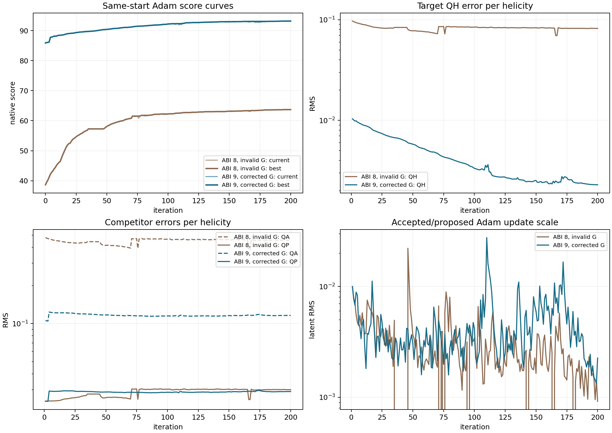
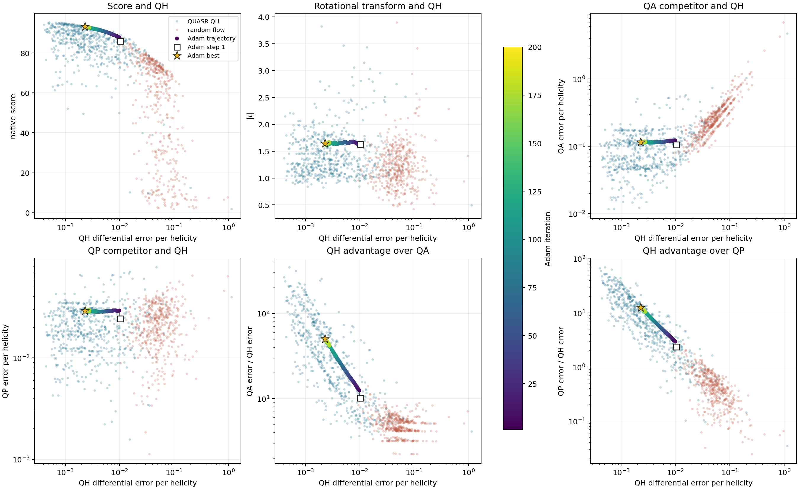
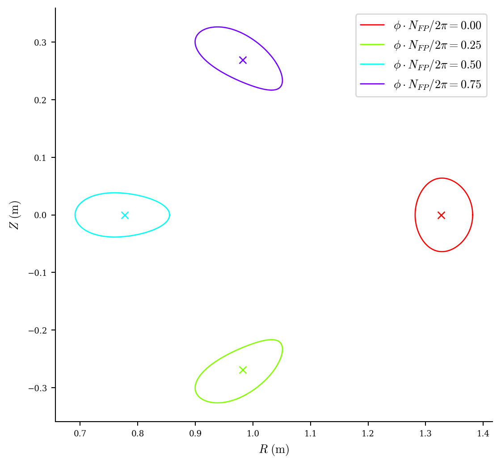
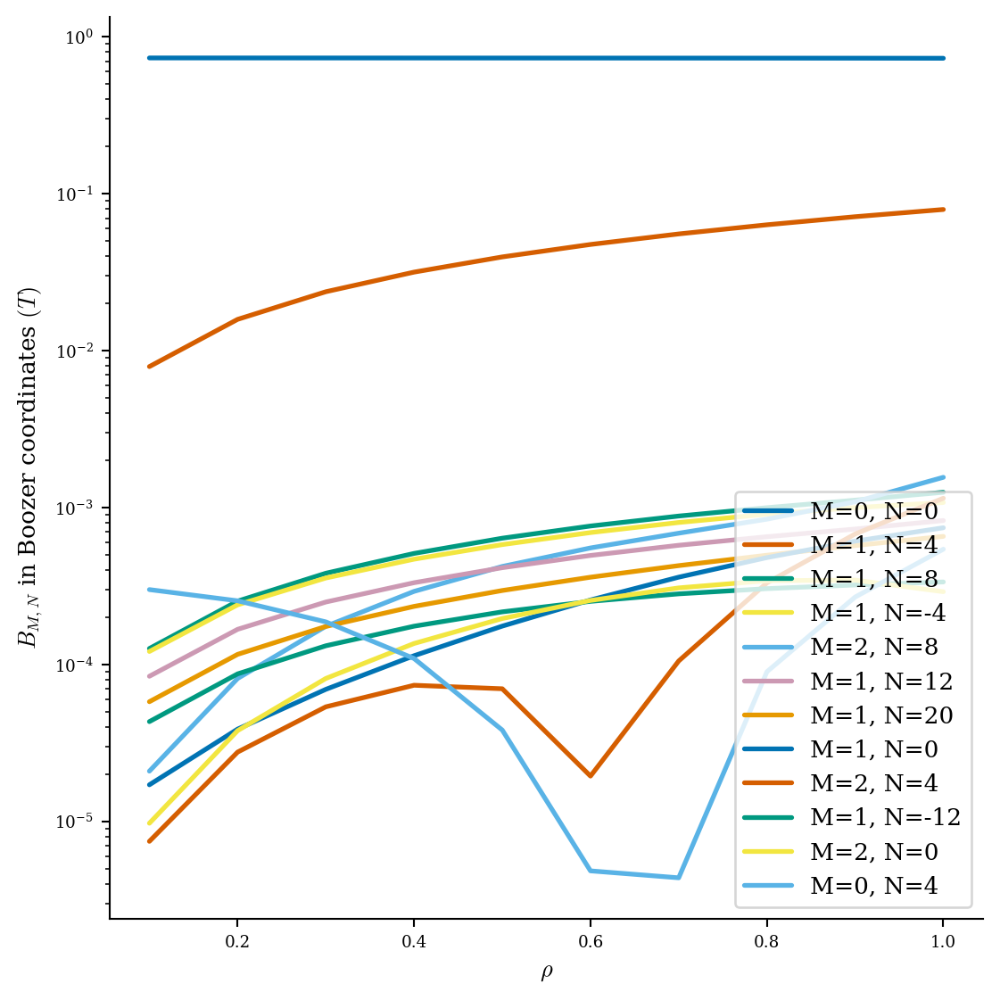
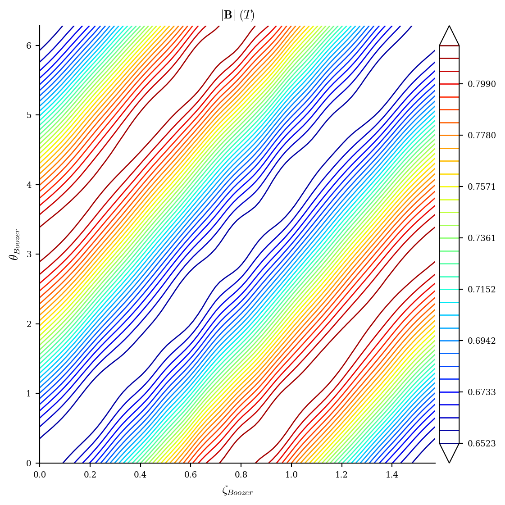
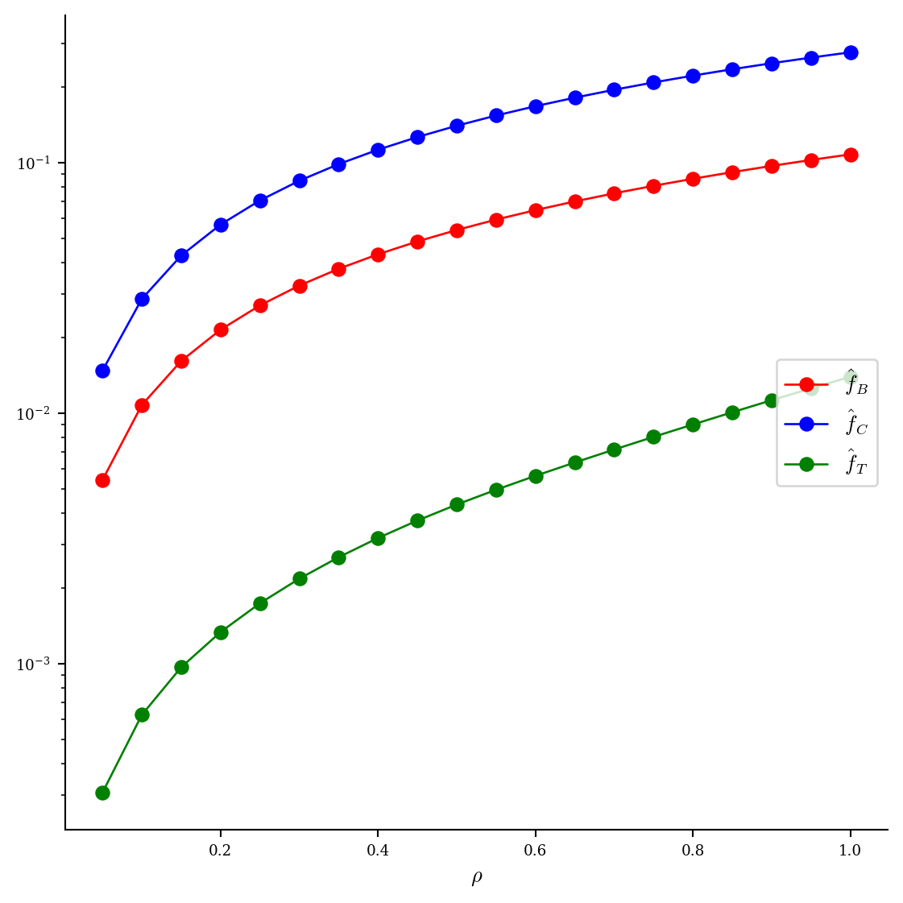
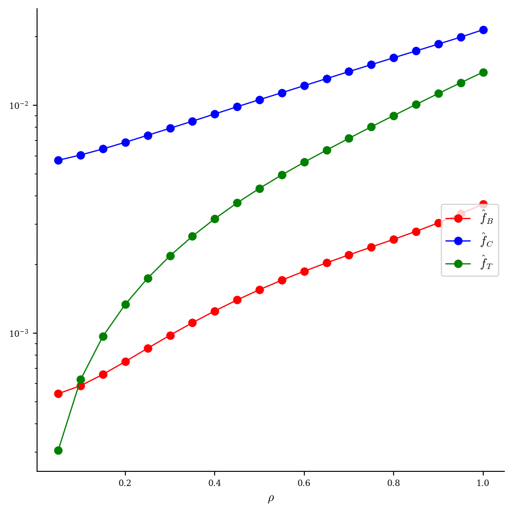
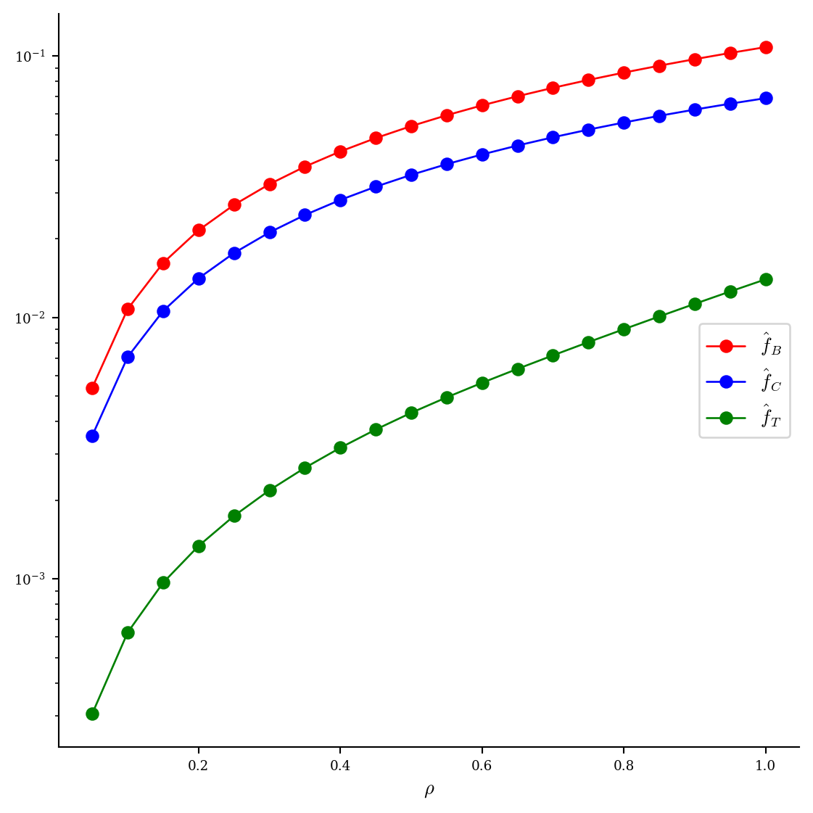
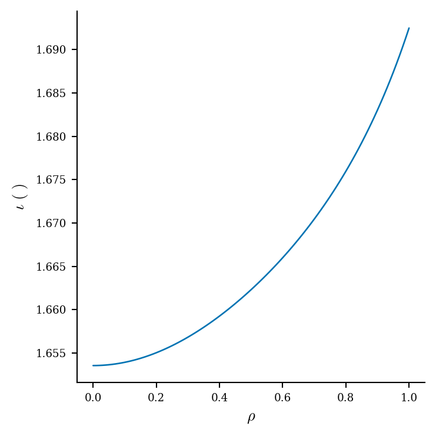

# QH 微分体积 QS 指标矛盾调查

日期：2026-08-02

## 1. 结论先行

当前看到的矛盾不是 QH 磁面本身造成的，主要是微分 QS 实现中的一个确定性单位约定错误：

1. 微分 QS 的 $f_C$ 公式结构正确。
2. Python 和 C++/CUDA 都把“整圈角坐标”约定下的 $G$，直接代入了使用弧度角坐标的 $f_C$ 公式，使 $G$ 恰好多了 $2\pi$。
3. 错误的 $G$ 会显著抬高 QA 和 QH 残差；QP 项不含 $G$，因而几乎不受影响。这正好解释了“QP 反而远低于 QH”的异常现象。
4. QA、QH、QP 当前保存的输出还使用了不一致的螺旋度归一化：QH 保存原始值，QA 的螺旋度范数为 1，QP 却已经除以 $N_{\mathrm{FP}}$。原始三列不能直接横向比较。
5. 对两个已经完成完整物理评估的高分 QH 样本作精确代数重算后，修正指标均恢复为明确的 QH 排序。归一化 QH 误差分别比 QP 低约 6.0 倍和 10.3 倍，比 QA 低约 24 倍和 41 倍。
6. 独立的 LS/Newton Boozer 面傅里叶诊断也显示 QH 误差比 QA/QP 低 26--94 倍，与修正后的微分指标定性一致。

因此，当前 QH/QA/QP 的异常相对大小已经有明确解释，不需要诉诸“显著 QH 的磁面恰好具有很差的体平均 QH”这种物理解释。

## 2. 当前指标究竟在算什么

代码使用的微分 QS 条件为

$$
f_C = (M\iota-N)(\mathbf B\times\nabla\psi)\cdot\nabla B
      -(MG+NI)\mathbf B\cdot\nabla B,
$$

并统计无量纲量 $f_C/B^3$ 的体积加权 RMS。真空区中 $I=0$。

这一公式和 DESC 的实现一致：DESC 也使用相同的两项结构。问题不在公式的符号组合，而在传入公式的 $G$ 属于哪一种角坐标约定。

本项目的体积链路明确使用：

- 几何环向角 $\phi$ 和磁面角 $\theta$ 均以弧度表示；
- $\psi$ 是环向磁通除以 $2\pi$，代码诊断名也是 `edge_psi_toroidal_per_radian`；
- 相位导数按 $m\theta-nN_{\mathrm{FP}}\phi$ 计算。

在弧度 Boozer 坐标中，协变表示为

$$
\mathbf B = I\nabla\theta + G\nabla\zeta + \cdots .
$$

对轴对称真空环向场，安培定律给出

$$
B_\zeta = \frac{\mu_0 I_{\mathrm{link}}}{2\pi R}.
$$

由于 $\nabla\zeta=\mathbf e_\zeta/R$，弧度约定下应当使用

$$
G_{\mathrm{rad}}=\frac{\mu_0 I_{\mathrm{link}}}{2\pi}.
$$

当前 Python 和 CUDA 实际使用的是

$$
G_{\mathrm{current}}=\mu_0 I_{\mathrm{link}}
                    =2\pi G_{\mathrm{rad}}.
$$

它对应的是把环向角归一化到 $[0,1)$ 的“整圈”坐标所使用的协变系数，不能直接代入弧度形式的微分公式。

相关实现位置：

- Python 的磁通标定和 $G$：[volume_qs.py](../stellarator_eval/volume_qs.py#L610)、[volume_qs.py](../stellarator_eval/volume_qs.py#L883)
- C++/CUDA 的 $G$ 和微分指标：[score_pipeline.cu](../gpu_backend/src/score_pipeline.cu#L2982)、[score_pipeline.cu](../gpu_backend/src/score_pipeline.cu#L3033)
- DESC 的同一公式与 $G=\langle B_\zeta\rangle$：[\_omnigenity.py](../../DESC/desc/compute/_omnigenity.py#L676)、[\_profiles.py](../../DESC/desc/compute/_profiles.py#L1855)

以 score 61.339 的样本为例，三个基准线圈电流为
$223824.45$、$304200.81$、$162663.09\ \mathrm A$，$N_{\mathrm{FP}}=4$。当前对称复制规则给出的链接电流为

$$
I_{\mathrm{link}}=2N_{\mathrm{FP}}\sum_k|I_k|
                 =5.525506875\times10^6\ \mathrm A.
$$

于是

$$
G_{\mathrm{current}}=6.9435567\ \mathrm{T\,m},\qquad
G_{\mathrm{rad}}=1.1051014\ \mathrm{T\,m}.
$$

两者严格相差 $2\pi$。

## 3. 为什么错误会表现为 QP 特别低

记

$$
x=\frac{(\mathbf B\times\nabla\psi)\cdot\nabla B}{B^3},
\qquad
y=\frac{G\mathbf B\cdot\nabla B}{B^3}.
$$

当前目标 QH 使用 $(M,N)=(1,N_{\mathrm{FP}})$，于是

$$
e_{\mathrm{QA}}=\iota x-y,
\qquad
e_{\mathrm{QH}}=(\iota-N_{\mathrm{FP}})x-y.
$$

而纯 QP 的 $(M,N)=(0,N_{\mathrm{FP}})$ 消去了 $G$ 项：

$$
e_{\mathrm{QP}}=-N_{\mathrm{FP}}x.
$$

所以 $G$ 多出 $2\pi$ 时，QA 和 QH 都被错误的 $y$ 项显著污染，QP 则不变。当前现象并不是 QP 在物理上胜过 QH，而是 QP 恰好绕开了出错的变量。

## 4. 还存在一个展示尺度问题

$f_C$ 对 $(M,N)$ 是线性的。如果把同一个螺旋度写成 $(kM,kN)$，原始 $f_C$ 也会乘以 $k$。因此不同模式的非零残差在比较前必须声明归一化。

当前 CUDA 输出混用了三种口径：

- `qs_global_error`：QH 原始 RMS，没有除以 $\sqrt{M^2+N^2}$；
- `qs_qa_global_error`：QA 原始 RMS，但 QA 的范数本来就是 1；
- `qs_qp_global_error`：已经除以 $N_{\mathrm{FP}}$，即单位螺旋度 QP 值。

评分内部后来把目标 QH 除以 $\sqrt{M^2+N^2}$，但保存给分析使用的三列仍不一致。这会进一步放大直观误判。

$\sqrt{M^2+N^2}$ 是当前评分选择的一种可声明的标度，不是唯一的坐标不变量。合理做法是同时输出：

$$
\epsilon_{\mathrm{raw}}=\operatorname{RMS}(f_C/B^3),
\qquad
\epsilon_{\mathrm{hel}}=rac{\epsilon_{\mathrm{raw}}}{\sqrt{M^2+N^2}},
$$

并且所有 QA/QH/QP 都遵循同一规则。精确 QS 时的零值不受归一化影响；有限误差的跨模式数值比较则必须使用统一口径。

## 5. 两个高分样本的精确重算

本次没有重新运行 GPU。当前生产配置令 $\iota$ 在体积内为常数，因此保存的 QA、QH、QP RMS 已经包含重算所需的全部二阶矩。

令旧 $G$ 为新 $G$ 的 $k=2\pi$ 倍，并令 $N=N_{\mathrm{FP}}$。由

$$
e_{\mathrm{QH}}^{\mathrm{old}}=e_{\mathrm{QA}}^{\mathrm{old}}-Nx
$$

可以精确恢复

$$
\left\langle e_{\mathrm{QA}}^{\mathrm{old}}x\right\rangle
=\frac{(\epsilon_{\mathrm{QA}}^{\mathrm{old}})^2
      +N^2\epsilon_{\mathrm{QP}}^2
      -(\epsilon_{\mathrm{QH}}^{\mathrm{old}})^2}{2N}.
$$

修正后的逐点误差为

$$
e_{\mathrm{QA}}^{\mathrm{new}}
=\frac{1}{k}e_{\mathrm{QA}}^{\mathrm{old}}
 +\left(1-\frac{1}{k}\right)\iota x,
$$

$$
e_{\mathrm{QH}}^{\mathrm{new}}
=\frac{1}{k}e_{\mathrm{QA}}^{\mathrm{old}}
 +\left[\left(1-\frac{1}{k}\right)\iota-N\right]x.
$$

对同一批采样点和权重取二阶矩即可得到精确的新 RMS：

| 样本 | 旧 QH 原始值 | 旧 QH/螺旋度 | 旧 QA | QP/螺旋度 | 修正 QA | 修正 QH 原始值 | 修正 QH/螺旋度 |
|---|---:|---:|---:|---:|---:|---:|---:|
| score 61.339 | 0.345847 | 0.083880 | 0.457984 | 0.029614 | 0.119169 | 0.020415 | 0.004951 |
| score 63.691 | 0.339298 | 0.082292 | 0.457505 | 0.030118 | 0.120479 | 0.012113 | 0.002938 |

修正后：

- score 61.339 样本的单位螺旋度 QH 比 QP 低 6.0 倍，比 QA 低 24.1 倍；
- score 63.691 样本的单位螺旋度 QH 比 QP 低 10.3 倍，比 QA 低 41.0 倍；
- 即使不做 QH 螺旋度归一化，两个样本的修正 QH 原始值也都已经低于 QP 的单位值。

这直接消除了用户指出的矛盾。

注意：这里只能精确重算保存了完整二阶统计的全局体积 RMS。边缘项没有保存对应的 QA/QP 二阶矩与协方差，因此不能从旧产物精确重构修正后的总 score；总 score 必须在修正代码后重新计算。

## 6. 与独立 Boozer 面结果交叉验证

完整评估中的 LS/Newton Boozer 面使用独立的面上傅里叶 QS 定义，不依赖这里的体积 $G$ 实现。两个样本均表现出明确的 QH 优势：

| 样本与选中面 | 面 QA 误差 | 面 QH 误差 | 面 QP 误差 | QH 相对 QA/QP |
|---|---:|---:|---:|---:|
| score 61.339，$s=0.64$ | $3.4830\times10^{-3}$ | $1.3327\times10^{-4}$ | $3.5146\times10^{-3}$ | 低 26.1/26.4 倍 |
| score 63.691，$s=0.36$ | $4.1134\times10^{-3}$ | $4.4102\times10^{-5}$ | $4.1245\times10^{-3}$ | 低 93.3/93.5 倍 |

证据文件：

- [score 61.339 标准面摘要](assets/qh_adam_topology_fixed_61p339_full_eval_20260801/candidates/s_0p64/standard_rho_1/summary.json)
- [score 63.691 标准面摘要](assets/qh_adam_low_momentum_63p691_full_eval_20260802/candidates/s_0p36/standard_rho_1/summary.json)

面傅里叶误差和体积微分 RMS 的定义、采样区域与归一化不同，所以绝对数值不应直接相等；但它们对“哪个对称模式明显占优”的判断应一致。修正后的微分指标满足这一要求，旧指标不满足。

## 7. 对已有结果的影响

### 7.1 已失效的部分

当前生产库及其历史语料中的以下量不能再按物理标定后的微分 QH 指标解释：

- 体积 QH、QA 数值及其相对 QP 的比较；
- 依赖该体积项的 volume-QS score 分量；
- 依赖 QA/QH/QP 相对关系的 QH 竞争门；
- 使用旧 score 进行的绝对阈值解释和不同版本之间的数值比较。

Python 与 C++/CUDA 使用了同一个错误公式常量，因此二者互相吻合不能构成独立验证。现有单元测试只验证了 $G$ 的符号和电流整体反号不变性，没有验证安培定律给出的绝对幅值，所以没有发现共享的 $2\pi$ 错误。

### 7.2 仍然有效的部分

- 已找到的线圈几何本身没有因此失效；
- 磁轴、$\psi$、磁面存在性、Poincare、LS/Newton、DESC 等不使用这项错误 $G$ 的独立结果仍然有效；
- 两个高分样本的完整评估明确证明它们确实具有 QH 磁面；
- 旧 score 和优化历史仍可作为“旧评分 ABI 下可复现的搜索记录”，但不能继续当作物理标定后的 QH 分数。

## 8. 建议的修正与验收顺序

本报告只完成调查，没有静默修改生产评分。建议下一步按以下顺序处理：

1. Python 和 C++/CUDA 同时改为 $G=\mu_0 I_{\mathrm{link}}/(2\pi)$。
2. 对 QA/QH/QP 统一输出原始 RMS 和单位螺旋度 RMS，字段名明确区分，禁止再混表。
3. 增加安培定律绝对量级测试：给定轴对称真空环向场，必须恢复 $G=\mu_0 I/(2\pi)$。
4. 增加与 DESC 的独立点对点 $f_C$ 对照；不能只用 Python 对 CUDA，因为两者容易共享同一约定错误。
5. 用固定样本集重新标定 volume-QS score、QH 竞争门和相关阈值，并重评两个完整评估样本及一批 QUASR QH/QA 对照。
6. 更新 score ABI、动态库哈希和语料版本；旧语料保留但显式标为旧定义，不能与修正分数混合训练或比较。

## 9. 最终判断

用户观察到的现象主要是代码单位约定错误，不是三种对称性天然具有不可比较的巨大尺度，也不是这些显著 QH 磁面在体平均意义下突然失去 QH。

更准确地说：

- **主要矛盾来源**：$G$ 多乘了 $2\pi$；
- **次要误导来源**：QA/QH/QP 输出归一化不一致；
- **修正后的物理结论**：两个已完整验证样本的微分体积指标都明确选择 QH，且独立 Boozer 面诊断给出相同排序；
- **工程结论**：当前生产 score 需要版本化修正和重新标定，不能只改一行常量后继续沿用旧阈值与旧语料。

## 10. 修复实施与数值恢复

本节记录调查之后实施的生产修复。它取代第 8 节中“尚未修改生产评分”的阶段性状态。

### 10.1 代码与评分 ABI

修复分支为 `qh-volume-qs-g-fix`，核心提交为 `7420e71`。修改包括：

1. Python 和 C++/CUDA 都改为

   $$
   G=\frac{\mu_0 I_{\mathrm{link}}}{2\pi}.
   $$

2. 原生评分 ABI 从 8 升到 9，避免新 Python 包装器误读旧动态库。
3. 新结果显式输出 `qs_vacuum_G`，并分别输出目标 QH、边缘 QH、QA、QP 的单位螺旋度误差；QP 还同时输出原始值。旧字段继续保留用于读取历史产物，但评分内部只消费明确的单位螺旋度字段。
4. Python 单元测试新增安培定律绝对量级检查，不再只检查 $G$ 的符号。
5. 完整本地测试为 128 项通过。远端 CUDA 13.0、`sm_120` Release 编译作业 `30990` 正常完成，动态库 SHA-256 为 `40dca7422995a91eab0a58285d9ced59a8e3be04a96b2b37686effbe6f1abff5`。

修正后的评分仍保留原有各组件、几何门和 $\iota$ 门；本轮只修复体积 QS 的物理约定及其诊断口径，没有借机调整软阈值来人为改善统计结果。

### 10.2 两个完整评估样本的 CUDA 回归

在 P107 四卡 smoke 作业中用 ABI 9 动态库重新评分两个已有完整物理评估的样本。该作业只用于数值正确性回归，不采信其性能计时；正式分布作业另行要求四卡连续三次通过空闲门。结果如下：

| 样本 | 修正 score | $G\ (\mathrm{T\,m})$ | QH 原始值 | QH/螺旋度 | QA/螺旋度 | QP/螺旋度 |
|---|---:|---:|---:|---:|---:|---:|
| 旧 score 61.339 样本 | 88.9615 | -1.105101375 | 0.020414899 | 0.004951340 | 0.119168541 | 0.029613844 |
| 旧 score 63.691 样本 | 90.9813 | -1.105101450 | 0.012112690 | 0.002937759 | 0.120479481 | 0.030117924 |

这里的 $G$ 符号由已标定环向磁通决定，绝对值与线圈电流根据安培定律独立计算的
$1.1051014\ \mathrm{T\,m}$ 一致。更关键的是，CUDA 直接重算得到的 QH/QA/QP 数值与第 5 节仅根据旧二阶矩作出的代数预测逐位吻合。这同时验证了：

- 找到的共享错误确实只有该 $2\pi$ 约定因子，而不是隐藏的采样或符号差异；
- Python 理论修正、CUDA 实现和历史产物的代数重构三者一致；
- 两个已知 QH 样本在修正评分下分别达到约 89 和 91 分，旧评分对它们的压低主要来自错误 $G$，不是磁面物理质量差。

### 10.3 旧采集任务的处理

旧 ABI 8 score 已不再具有当前物理含义。持续采集作业 `30594`（Students）和 `30859`（P107）已明确终止并由 Slurm 回收资源。后续不再自动启动采集任务，也不再汇报累计样本数。

历史语料仍保存完整的 $N_{\mathrm{FP}}$、基线圈数及每根线圈的
$x[33],y[33],z[33],I$，所以将来如确有需要，可以直接用 ABI 9 或后续评分库重新评分，不需要重新运行 flow matching。但旧标量诊断缺少边缘 QA/QP 二阶矩，不能只做表格换算得到精确新总分。

## 11. 修复后的 1024+1024 分数重新标定

### 11.1 实验口径

正式作业 `30994` 使用 ABI 9 动态库
`40dca7422995a91eab0a58285d9ced59a8e3be04a96b2b37686effbe6f1abff5`，在四张 RTX 5090 上运行八个原生评分 worker。启动前四卡连续三次满足利用率为 0、显存不超过 16 MiB 且无计算进程；结束后四卡均为 0% 利用率和 2 MiB 显存，没有遗留进程。

两组各包含 1024 个样本：

1. QUASR QH 组从 flow 数据的独立测试集无放回抽取；
2. 随机组从标准高斯潜变量出发，以 FP32 RK4-256 解码；
3. 随机组逐个复用 QUASR 组抽到的 $(N_{\mathrm{FP}},N_{\mathrm{coil}})$ 序列，因此两组的条件分布完全匹配；
4. 所有样本都进入相同的完整原生 CUDA 评分链路，失败状态没有被事先筛除。

### 11.2 分数与状态分布

| 统计量 | QUASR QH | 随机 flow |
|---|---:|---:|
| 样本数 | 1024 | 1024 |
| `status=ok` | 583 (56.93%) | 465 (45.41%) |
| 全体均值 | 48.019 | 24.087 |
| 全体中位数 | 75.520 | 0.372 |
| 全体 P75 | 87.357 | 60.390 |
| 全体 P90 | 92.316 | 74.573 |
| 全体 P95 | 93.667 | 76.947 |
| 全体最大值 | 95.262 | 87.362 |
| `status=ok` 中位数 | 86.428 | 64.547 |
| score $\ge 70$ | 548 (53.52%) | 190 (18.55%) |
| score $\ge 80$ | 443 (43.26%) | 17 (1.66%) |

完整状态计数为：

| 状态 | QUASR QH | 随机 flow |
|---|---:|---:|
| `ok` | 583 | 465 |
| `drift_rejected` | 318 | 213 |
| `no_surface` | 84 | 69 |
| `no_axis` | 9 | 265 |
| `flux_rejected` | 30 | 12 |

全体中位数的巨大差异同时包含可行性差异：失败样本会得到接近零的门控分数。只比较 `status=ok` 仍有清晰分离，QUASR 与随机组的中位数分别为 86.43 和 64.55。更严格的 score $\ge80$ 事件在 QUASR 中出现 443 次、随机组中仅 17 次；在本次条件匹配样本上，QUASR 的高分概率约富集 26.1 倍。

修正后的目标 QH 单位螺旋度误差也直接给出相同结论。`status=ok` 样本的中位数为

$$
\epsilon_{\mathrm{QH,hel}}^{\mathrm{QUASR}}=2.545\times10^{-3},
\qquad
\epsilon_{\mathrm{QH,hel}}^{\mathrm{random}}=4.918\times10^{-2}.
$$

即 QUASR 中位误差低约 19.3 倍。相比之下，两组 QP 单位螺旋度误差中位数分别为 $0.01956$ 和 $0.02209$；真正拉开两组的主要是修正后的 QH 目标项，而不是先前错误公式造成的 QP 假优势。

### 11.3 性能

| 阶段 | 墙钟时间 |
|---|---:|
| 1024 个随机样本 FP32 RK4-256 解码 | 17.00 s |
| 2050 个案例原生 CUDA 评分 | 2600.78 s |
| 脚本总时间 | 2629.24 s |
| Slurm 总时间 | 44 min 07 s |

八 worker 的评分吞吐为 $0.7882$ 样本/s，即均摊 $1.269$ 墙钟秒/样本。单次评分本身并不等于该均摊值：QUASR/随机组的调用中位数分别为 9.84/9.27 s，P99 为 19.72/19.12 s；八路并行把这些调用重叠起来。正式计时前后的 GPU 空闲检查均通过，所以该吞吐没有受其他 GPU 作业污染。

### 11.4 结论

这次重新标定证明修复后的 score 同时恢复了物理方向和统计区分度：高质量 QUASR QH 样本集中在 80--95 分，条件匹配的随机 flow 样本大多不可行或显著更低。两个已有完整物理评估的样本分别得到 88.9615 和 90.9813，也落在 QUASR 高质量区间。

旧 ABI 8 的绝对分数、阈值和优化曲线不能与本节数值直接比较。新分数仍只是快速代理，尤其 17 个随机样本也超过 80 分；因此优化所得最优样本仍必须经过独立的大磁面、面 QS、Poincare 和 DESC 完整评估，不能只凭原生 score 验收。

## 12. 修复目标下的同起点 200-step Adam

### 12.1 控制变量

正式作业 `31058` 从旧作业 `30662` 的同一个 `start_10` 潜变量出发。两者使用完全相同的 seed `20260804`、200 步、$eta=0.01$、$(\beta_1,\beta_2)=(0.5,0.999)$、扰动尺度 `0.005`、四个反向扰动方向、FP32 RK4-256、无效方向整步跳过和中心点三段回退。唯一变化是评分库由错误 $G$ 的 ABI 8 换为修复后的 ABI 9。

第一次提交 `31051` 因 Slurm 的逗号分隔环境变量把回退序列截断为 `[0.5]`，在第二步检查 manifest 后立即取消；它不进入任何数值比较。替代作业 `31058` 的 manifest 明确记录完整序列 `[0.5,0.25,0.125]`，并正常完成 `0:0`。

### 12.2 优化结果

| 指标 | ABI 8，错误 $G$ | ABI 9，修复 $G$ |
|---|---:|---:|
| 初始 score | 38.6590 | 85.8832 |
| 最优 score | 63.6915 | 93.1656 |
| 最优步 | 195 | 197 |
| 各自定义下的增益 | 25.0325 | 7.2823 |
| 最终 score | 63.6786 | 93.1602 |
| 实际更新/跳过 | 184/16 | 200/0 |
| 最大 current-to-best 回撤 | 0.7625 | 0.4084 |
| 200 步计算墙钟 | 5509.6 s | 5361.0 s |
| 平均每步 | 27.40 s | 26.65 s |

绝对分数和增益不能跨 ABI 直接判断优劣，因为目标函数本身变了。可直接比较的是控制变量、运行稳定性和对应物理分量。修复版 200 步内所有 $8\times200$ 个扰动端点均为 `ok`，没有脏端点导致的整步跳过，也没有中心回退；最佳点仍出现在第 197 步，最后十步 running-best 继续增加 `0.0525`，所以 200 步是预算截断，尚不能宣称严格收敛。

修复版最优点的原生分量为：

| 分量 | 分数/数值 |
|---|---:|
| axis | 97.9100 |
| psi | 98.5318 |
| surface | 97.8742 |
| coordinate | 89.4363 |
| volume QS | 94.2022 |
| iota | 100.0000 |
| coil | 65.3177 |
| $\iota$ | 1.64627 |
| QH 单位螺旋度误差 | $2.3003\times10^{-3}$ |
| QA 单位螺旋度误差 | $1.1588\times10^{-1}$ |
| QP 单位螺旋度误差 | $2.8994\times10^{-2}$ |

因此该点的体积微分 QH 误差分别比 QA 和 QP 低约 50.4 倍和 12.6 倍。优化过程中 $iota$ 始终维持在约 1.6，而不是向 $iota\approx0$ 的圆线圈退化。体 QH 单位螺旋度误差从第一步后的约 $1.04\times10^{-2}$ 持续下降到 $2.30\times10^{-3}$，说明修复后的目标确实沿着 QH 方向提供了稳定梯度。

四卡启动和结束时均为空闲状态；Slurm 总时间为 1 h 29 min 37 s。stderr 末尾存在 Python `resource_tracker` 对已被 worker 清理的 semaphore 再次 `sem_unlink` 的 warning，但作业退出码为 0、200 行 history 完整、四卡 postflight 均为 0% 和 2 MiB，未发现遗留进程或数值产物缺失。该 warning 记录为退出清理噪声，不作为优化失败。

### 12.3 `score-QH` 轨迹及二维诊断

下图把第 11 节中 1024 个 QUASR QH 样本、1024 个条件匹配随机 flow 样本与本次 200 步 Adam 轨迹放在相同坐标系中。只有 `status=ok` 的 583 个 QUASR 样本和 465 个随机样本具有可定义的体 QH 坐标，因此进入散点背景；其余 1000 个样本在 QH 计算之前已被 axis、surface、drift 或 flux 门槛拒绝，另有两个作业内部校验案例，不应伪造 QH 坐标后画入该图。完整 2048 个校准样本的失败比例仍由第 11 节状态分布图表示。

从轨迹和背景分布可得四个直接结论：

1. Adam 从第一步后的 $(\epsilon_{\mathrm{QH}},\mathrm{score})=(1.036\times10^{-2},86.025)$ 移动到最佳点 $(2.300\times10^{-3},93.166)$，在 `score-QH` 平面上是清楚的向左上移动，不是只靠其他分量抬高总分。
2. $|\iota|$ 全程约为 1.6，排除了此前发现的 $\iota\to0$ 圆线圈作弊机制。与此同时 QA 和 QP 误差分别从约 $0.106$、$0.0243$ 增至 $0.116$、$0.0290$，而 QH 误差下降约 4.5 倍；因此 QH 相对 QA/QP 的竞争优势在增强。
3. 在 583 个 `status=ok` QUASR 背景样本中，最佳点总分位于 P88.3，但 QH 误差按“数值越小越好”只约处于中位水平（其经验累积分位为 P47.5）。高总分来自多项性质共同良好，不能把 `93.17` 解读为 QUASR 中最小的一档 QH 误差。
4. 最佳点的 surface 分量位于 QUASR 可行样本 P96.7，而 coil 工程分量仅位于 P1.5。快速 score 找到了非常强的近轴/磁面与 QH 组合，但明显牺牲了线圈工程质量；这是后续完整物理评估和未来权重调整必须显式报告的代价。

六幅图现在都使用原始 history 中完整的 200 步轨迹，没有插值。后两幅分别画出 $\epsilon_{\mathrm{QA}}/\epsilon_{\mathrm{QH}}$ 和 $\epsilon_{\mathrm{QP}}/\epsilon_{\mathrm{QH}}$，可直接观察目标 QH 相对两个竞争对称性的优势从约 10.2、2.35 增至 50.4、12.6。历史文件没有逐步保存七个 score 分量，也没有逐步保存可重评分的潜变量或线圈参数，因此不能无损恢复 coil/surface 的移动轨迹；这里不再用“只有终点”的面板暗示存在该轨迹，工程分量只保留最终点相对校准背景的分位统计。

### 12.4 当前判断

修复后的 score 不仅重新标定了绝对尺度，也给出了比旧目标更连续的同起点优化轨迹。最优 `93.17` 位于第 11 节 QUASR 全体分布的 P90 与 P95 之间，属于数据集高分段；但它仍不是物理验收。下一节必须用该 `best.json` 重新选择样本自己的 source $a$、寻找尽量大的标准 LS/Newton 可行面，并报告面 QH、Poincare 和 DESC，才能判断高分是否对应实用的大 QH 磁面。

## 13. 修复版 score-93.166 样本的完整物理评估

### 13.1 固定输入与原生 score

完整评估使用作业 `31058` 的唯一 `best.json`，没有重新解码或改线圈。当前 ABI 9 原生 score 及分量为：

| 项目 | 数值 |
|---|---:|
| 总 score | 93.16556 |
| axis | 97.9100 |
| psi | 98.5318 |
| surface | 97.8742 |
| coordinate | 89.4363 |
| volume QS | 94.2022 |
| iota | 100.0000 |
| coil | 65.3177 |
| 体 QH 单位螺旋度误差 | $2.3003\times10^{-3}$ |

这再次说明 score 很高不代表线圈工程性质同样优秀：coil 分量只有 65.3，在第 11 节可行 QUASR 背景中约为 P1.5。

### 13.2 样本相关的 $a$ 与最大连续磁面

source $\psi$ 仍按固定流程并行测试 $a=0.04,0.05,0.06,0.08$，而不是复用旧样本参数。选择 $a=0.08$：其 $\psi$ 验证 RMS 为 $4.7166\times10^{-4}$，角度误差 P95 为 $6.5334\times10^{-5}$；廉价场线筛选在 $s=0.49$ 达到平均半径 $0.05647\,\mathrm m$，相邻 $s=0.64$ 首次失败。

第一次候选作业暴露了一个评估流程 bug：`s=0.49/0.64` 分别已有 209,413/181,980 个有效 GPU-ray 候选，均足够填满固定的 120,000 个训练点和 60,000 个验证点，却被额外的 95% 候选有效率门槛在 alpha 之前拒绝。提交 `07deab9` 将完整评估改为只硬性要求固定 180,000 点，同时继续记录有效比例；生产原生 score 的默认 95% 门槛没有变化，也没有启用 `legacy-cartesian` CPU 回退。修复后四个候选均在独立空闲 RTX 5090 上运行，前后均为 0% 利用率、2 MiB 显存。

| $s$ | 有效候选/225,792 | 标准 solver | 连续分支 | $|V|\,[\mathrm m^3]$ | 面 QH error |
|---:|---:|---|---|---:|---:|
| 0.24 | 225,792 (100.0%) | 通过 | 通过 | 0.0308050 | $2.231\times10^{-6}$ |
| 0.36 | 225,792 (100.0%) | 通过 | 通过 | 0.0469449 | $3.924\times10^{-6}$ |
| 0.49 | 209,413 (92.75%) | 通过 | **通过并选中** | **0.0639922** | **$6.524\times10^{-6}$** |
| 0.64 | 181,980 (80.60%) | 形式通过 | **内支跳转，拒绝** | 0.0614881 | $6.072\times10^{-6}$ |

`s=0.64` 不是由于初值误差阈值而被拒绝。它的最终 enclosed volume 比 `s=0.49` 更小，且最终 $\psi$ 均值从目标 0.64 塌到 0.463，明确跳回内支。由此 `s=0.49` 是本次已测的最大连续标准面，并已有相邻外侧失败点。

### 13.3 选中面与独立诊断

alpha+nu 初值在 97 点离网格上的相对残差为 $1.435\times10^{-2}$，normal-field P95 为 $6.344\times10^{-3}$。标准 LS/Newton 将它们降至 $2.651\times10^{-5}$ 和 $4.296\times10^{-5}$；最终 $\iota=1.68783$、$G=-6.94356\,\mathrm{T\,m}$。独立面 QS 为

$$
\epsilon_{\mathrm{QA}}=5.1400\times10^{-3},\qquad
\epsilon_{\mathrm{QH}}=6.5239\times10^{-6},\qquad
\epsilon_{\mathrm{QP}}=5.1787\times10^{-3}.
$$

面 QH 分别比 QA、QP 小约 788 和 794 倍。Poincare 的 8 条场线在四个截面均给出 25 次穿越且保持在所选边界内；直接 Boozer $|B|$ 等高线也呈清楚的 QH 斜条纹。

交互文件：[Boozer $|B|$ HTML](assets/qh_corrected_adam_93p166_full_eval_20260803/full/assets/boozer_b.html)，[三维线圈与磁面 HTML](assets/qh_corrected_adam_93p166_full_eval_20260803/full/assets/coils_surface.html)。静态三维图中的复杂线圈形状与偏低的 coil 分量一致，因此该样本是很强的物理 QH 解，但不是工程上已经成熟的线圈解。

### 13.4 CPU DESC 复核

DESC 明确运行在 JAX CPU，输入环向磁通为 $-4.91193\times10^{-3}\,\mathrm{Wb}$。初始和最终体均保持嵌套。归一化力误差变化为：

| 指标 | 初始 | 最终 |
|---|---:|---:|
| mean | 1.13010 | $2.3306\times10^{-3}$ |
| P95 | 1.96867 | $4.8506\times10^{-3}$ |
| max | 4.57123 | $1.7489\times10^{-2}$ |

优化器达到 50 步上限，返回 `success=false`、cost `0.0036663`；因此准确结论是“DESC 显著改善且保持嵌套”，不是“DESC 形式收敛”。以下逐张引用本次全部 8 张成功 DESC 图：

### 13.5 耗时、对比与结论

| 阶段 | 并行策略 | 墙钟 |
|---|---|---:|
| 四个 source $a$ | 4 卡并行 | 47 s |
| 四个 surface $s$ | 4 卡并行 | 3 min 25 s |
| Poincare、可视化与 CPU DESC | 16 CPU | 4 min 46 s |
| 最优样本完整评估总墙钟 | 分阶段串接 | 约 8 min 58 s |

选中候选内部，alpha 总耗时 85.68 s，其中 GPU flux calibration 0.56 s、体取点 44.52 s；nu 为 84.18 s；标准 LS/Newton 为 5.98/0.19 s。下游内部可视化 30.68 s、DESC 223.58 s，总计 279.01 s。没有任何慢速 alpha/nu CPU 回退。

与同一潜空间起点、旧 ABI 8 目标优化所得的 score-63.691 样本相比，新样本的最大连续面体积增加 30.2%，面 QH error 降低 85.2%（约 6.76 倍），DESC 最终 mean/P95 分别降低 14.5%/20.8%；但 DESC max 增加 17.9%，且线圈工程分量仍低。因此最终结论是：**修复后的体 QH score 确实把同一起点推向了更大、面 QH 显著更低且 DESC 可保持嵌套的解，物理代理方向得到完整链路验证；当前主要短板已经转为线圈工程几何，而不是 QH 磁面不存在。**

机器可读产物位于 [完整评估目录](assets/qh_corrected_adam_93p166_full_eval_20260803/)。选中 `boozer_standard.npz` 的 SHA-256 为 `794751c7dec47ce021d273cef4a6d700e06d71949c80683426b7b596d26e53a5`，DESC `equilibrium.h5` 的 SHA-256 为 `2b0993a7576498d95f9483e2794e83f3d21799beaa31cb28c4159707fe753c1a`。
