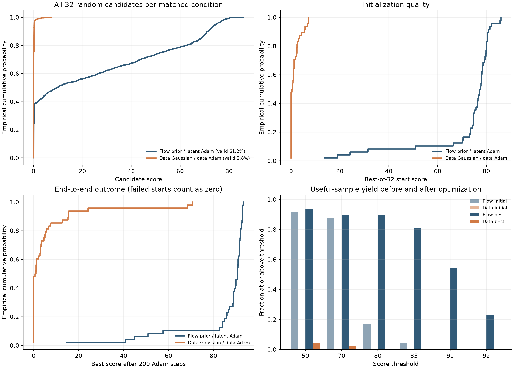
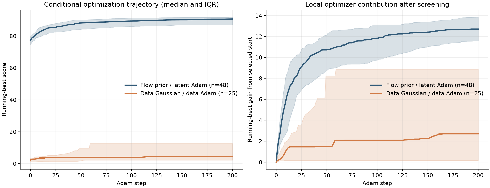
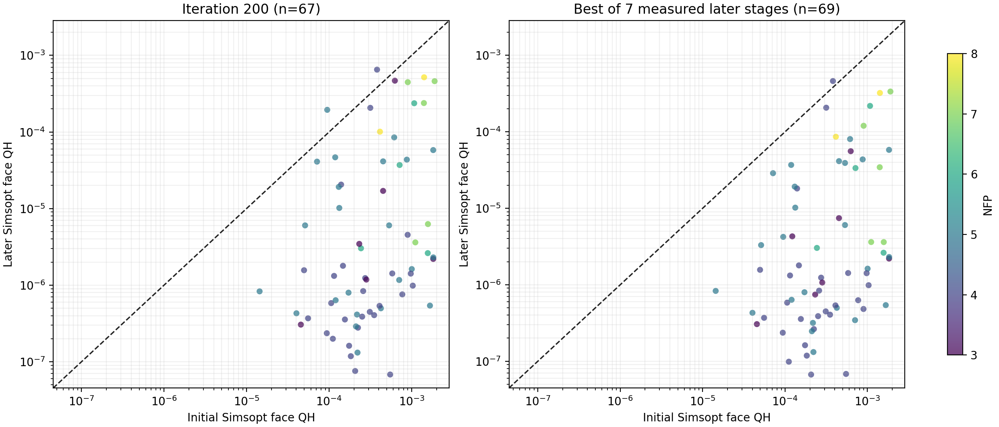

# Flow 到底在帮助初值，还是在帮助局部优化？

日期：2026-08-24
分支：`codex/data-prior-end-to-end-control`

> **废弃协议与归因更正（2026-08-28）：**本文保留 48 组 Flow 先验初始化实验及其原始数值。文中引用的 32 组同起点优化使用 2 方向、100 步和两边学习率 0.01；它没有复现当前 64 方向、200 步协议，也没有完成纯坐标消融。所有据此声称“隔离了优化坐标”或据此选择默认坐标的句子均已撤回。权威更正与同起点协议反转诊断见 `reports/qh_data_space_large_scale_validation_20260825.md`。

## 结论

现有结论收紧为：**Flow 提供很强的 QH 生成先验，并通过有限批量筛选稳定得到好初值。现有实验尚未判定 latent 空间与标准化线圈参数空间的纯坐标因果优劣。**

本次 1536 个 Flow 候选的分数中位数为 9.543，有效率为 61.2%。稳定收益来自“生成 32 个、按正式评分取最高”的有限筛选：48 组条件全部找到有效起点，起点分数中位数为 77.339，44/48 超过 50 分。仅保留各参数均值和方差的独立高斯先验丢失了参数间相关性；该对照在 48 组中有 23 组找不到有效起点，32 选 1 的起点分数中位数为 0.423。

**已撤回的历史归因：**32 组旧实验从同一个 Flow 生成线圈出发，记录到原参数空间 100 步增益中位数 8.664、latent 空间 7.676，原参数空间赢 22/32 组，latent 路径耗时为前者的 1.514 倍。该实验实际使用 2 方向和 100 步，不能隔离当前协议下的优化坐标。上述数值仅保留为废弃协议记录。

## 两个实验分别回答什么

“Flow 有用”可能包含两个完全不同的机制：

1. Flow 把标准高斯噪声变成更像 QUASR QH 数据的线圈，因此更容易产生可用起点。
2. 得到同一个起点以后，在 Flow 的 latent 坐标中更新，可能比直接更新线圈参数更容易。

同起点的 32 组实验只测第二点。本次 48 组端到端实验补测第一点，流程为：

$$
\begin{aligned}
\text{Flow 路径}:&\quad
32\text{ 个 }\boldsymbol z\sim\mathcal N(0,I)
\xrightarrow{\text{Flow}}
32\text{ 组线圈}
\xrightarrow{\text{取最高分}}
\text{latent Adam};\\
\text{原参数路径}:&\quad
32\text{ 个 }\boldsymbol q\sim\mathcal N(0,I)
\xrightarrow{\text{反标准化}}
32\text{ 组线圈}
\xrightarrow{\text{取最高分}}
\text{原参数 Adam}.
\end{aligned}
$$

$\boldsymbol q$ 是 Flow 训练时使用的逐坐标标准化参数。反标准化后仍执行既有的电流 $L_1$ 归一化和主导电流符号规范化。这个对照回答的是“只匹配每一维的边缘尺度是否已经足够”，而不是“所有不用 Flow 的先验都必然失败”；保留跨模态和跨线圈相关性的手工先验仍可能更强。

48 个条件从既有 309 条轨迹中固定种子、无放回均匀抽取，覆盖 $N_{\mathrm{FP}}=2\ldots6$、2--5 个基本线圈和 15 种组合。每对实验严格复用 $N_{\mathrm{FP}}$、线圈数、筛选随机种子和优化随机种子。两边都是 32 选 1、200 步、64 个正交随机方向、中心差分和 $\beta=(0.7,0.999)$。Flow 路径使用 $h=0.005$、学习率 0.02；原参数路径使用 $h=0.0025$、学习率 0.01。两个坐标的数值单位不同，所以使用各自已标定的稳定尺度，而不是强行令数值相同。

## 初值差异是决定性的

| 指标 | Flow 先验 | 独立原参数高斯 |
|---|---:|---:|
| 候选总数 | 1536 | 1536 |
| 正式评分返回 `ok` | 940（61.2%） | 43（2.8%） |
| 单个候选分数中位数 | 9.543 | 0.093 |
| 48 组中找不到有效起点 | 0 | 23 |
| 32 选 1 起点分数中位数 | 77.339 | 0.423 |
| 起点达到 50 分 | 44/48 | 0/48 |
| 200 步后最好分数中位数 | 90.677 | 0.754 |
| 200 步后达到 85 分 | 39/48 | 0/48 |
| 200 步后达到 90 分 | 26/48 | 0/48 |
| 200 步后最高分 | 93.369 | 70.793 |

48 组中，Flow 起点分数全部高于配对的原参数起点。配对差值中位数为 75.469，bootstrap 95% 区间为 $[73.559,76.733]$；双侧符号检验和 Wilcoxon 检验均为 $p=7.11\times10^{-15}$。优化后的最好分数仍是 Flow 路径 48/48 全胜，配对差值中位数为 86.880，95% 区间为 $[85.486,88.866]$。

这张图的左上角展示全部候选，而不是只展示每组最高分。它说明 Flow 的主要价值是把大量概率质量从“几乎必然不可用”的区域搬到“经常可用、偶尔已经很高分”的区域；32 选 1 再把这种概率优势放大成稳定的初始化优势。

## 后续 Adam 不能推翻上述归因

原参数先验找到有效起点的 25 组中，起点分数中位数为 2.269，200 步最好分数中位数为 4.535，增益中位数为 2.703。其中有两个罕见案例从约 7 分跃升到 68.343 和 70.793，说明原参数 Adam 并非原则上不能优化；问题是独立原参数高斯几乎从不落进这样的盆地。

Flow 路径在同一批 25 个条件上的起点和最终中位数分别为 77.944 和 90.928，增益中位数为 12.710。但这里两边起点质量相差巨大，不能把增益差异解释成 latent 坐标更优。判断坐标优劣必须使用前述同起点实验，而那个实验略微支持原参数空间。

因此，面向技术报告最稳妥的表述是：

> Flow 学到了独立边缘分布无法表达的线圈参数相关性。批量生成并经物理评分筛选后，它能可靠提供高质量 QH 初值。现有配对实验没有证明 latent 坐标能改善局部优化；相同起点下，直接在线圈标准化参数空间优化反而略好且更便宜。

本报告的有效范围是 Flow 初始化和有限筛选。局部 landscape 的平滑方向继续作为机制证据；优化坐标的总体结论由 2026-08-25 的 309 组完整配置比较更新。纯坐标结论仍需方向数、步数、评分预算和调参流程一致的受控消融。

## 运行与复现

- 正式源码提交：`a708f7b286a872931224825c542dc5e8f01daecd`。
- Flow 检查点 SHA-256：`39a3293a459e248a0d1ec062607a1a467128b14d8ca973aadd82e113532ab99f`。
- 评分库 SHA-256：`7834a88d5437ba9910c78bb0eb5483efc71134579624ee2cc74100297a5799a3`。
- P107 数组作业 `43810` 运行 worker 0--3，Students 数组作业 `43811` 运行 worker 4--5，汇总作业为 `43812`。
- 48/48 案例完成，缺失为 0。最长 worker 用时 10134.7 秒，即 2 小时 48 分 55 秒；六卡 worker 时间总和约 9.78 GPU 小时。
- 原参数分支单案例墙钟时间中位数为 669.0 秒，P95 为 1764.9 秒。没有有效起点的案例只完成筛选，因此明显更快。
- 六张卡运行前均为 0% 利用率和 2 MiB 显存占用；结束后为 0--1% 和 2 MiB。六份错误日志及六份僵尸进程记录均为空。
- 本次只重算原参数对照，Flow 结果复用同一评分库下既有的匹配轨迹；因此总作业墙钟时间不是两条路径重新并跑的速度对比。

原始统计见 [summary.json](assets/qh_data_prior_end_to_end_48_20260824/summary.json) 和 [case_metrics.csv](assets/qh_data_prior_end_to_end_48_20260824/case_metrics.csv)。本地验证使用显式仓库导入路径，`205` 项测试全部通过。

## 补充：旧 309 条 latent 轨迹的面 QH 从起点到后期怎样变化

已有批量 Simsopt 数据可检查旧 latent 轨迹是否降低了面 QH。历史面评估从 309 条轨迹中按 $(N_{\mathrm{FP}},N_{\mathrm{coils}})$ 比例和最终 score 分位抽取 96 条，对每条轨迹的同一个固定物理探针面评估迭代

$$
0,10,25,50,75,100,150,200.
$$

96 条中有 78 条的起点固定探针面通过严格验收。起点和第 200 步都通过的有 67 条，其中 65 条面 QH 下降；第 200 步面 QH 与起点之比的中位数为 0.00529，即典型下降约 189 倍。若在 7 个已测后续阶段中取面 QH 最低者，则有 69 条可配对，68 条下降，中位数比例仍为 0.00529。

虚线表示前后完全不变。左图是严格定义的第 200 步末点；右图是 7 个已测后续阶段中的最低面 QH。右图不能被称为每条轨迹的“精确 score-best 点”：旧实验没有专门评估各条轨迹保存的 score-best iteration，而且 score-best 也不保证恰好是面 QH 最低点。因此这张现成图只能证明旧优化路径通常会把真实面 QH 大幅压低，不能完成 latent 与原参数优化的最终对照。

新的大规模原参数实验将直接复用全部 309 个旧筛选胜者，跳过 32 选 1；在相同的 96 条分层轨迹和相同 8 个阶段上重做面评估，并额外评估每条轨迹的精确 score-best 快照。这样后续报告既能做阶段曲线的同口径比较，也能回答“起点到各自 score-best 的面 QH 变化”。本节数据与绘图统计保存在 `reports/assets/qh_flow_initialization_vs_optimization_control_20260824/`。
