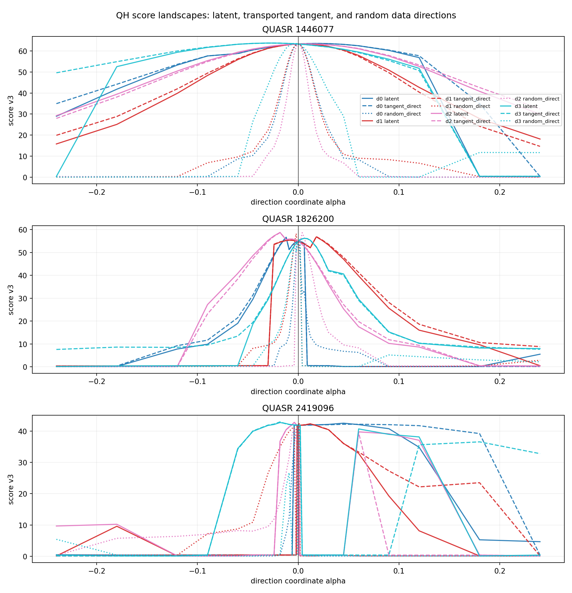
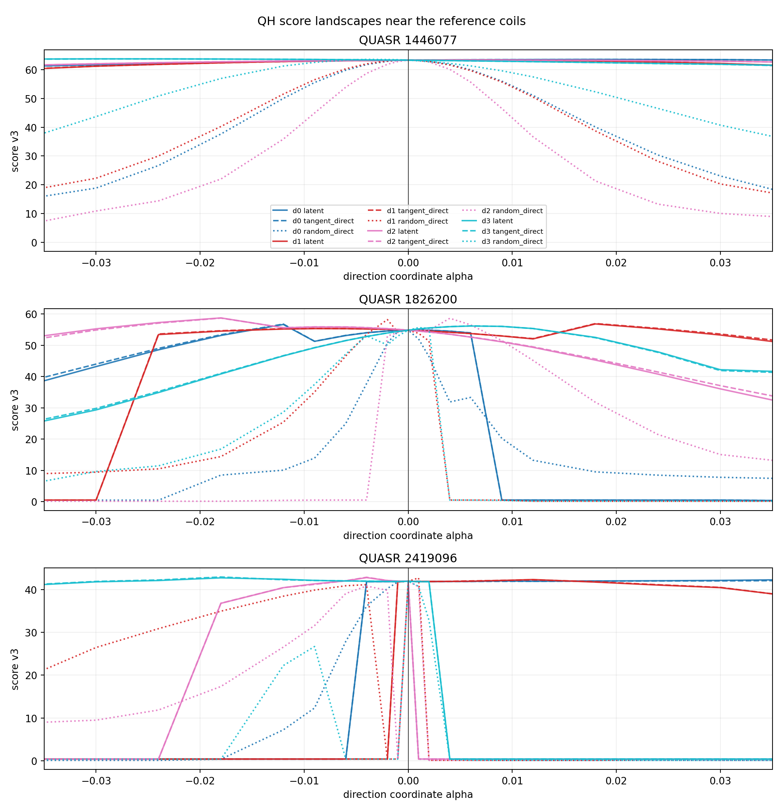
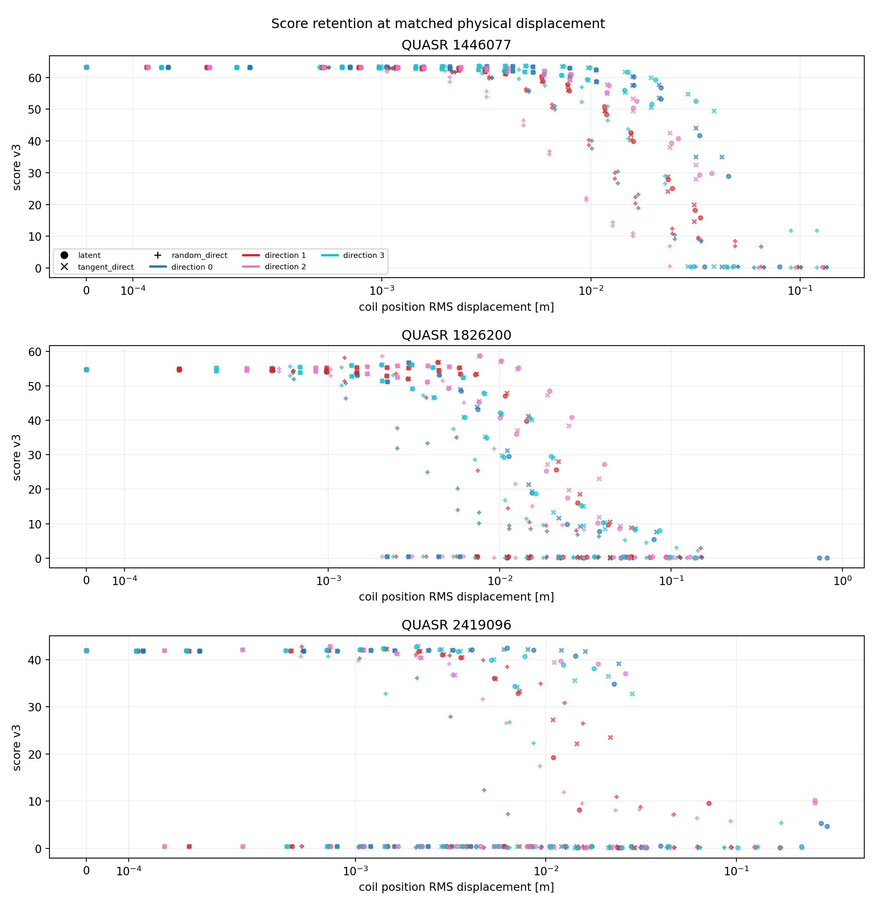

# Flow matching 噪声空间与原参数空间的 QH score landscape 对比

日期：2026-07-30

代码分支：`qh-flow-landscape`

正式实验：Slurm `29308`；独立分析：`29333`

## 1. 结论

本实验支持“flow matching 的噪声空间比原参数空间更容易做 CEM 优化”，而且可以更准确地说明优势来自哪里：

1. 对 3 个 QUASR 样本、每个样本 4 个随机方向，共 12 组对照，潜空间曲线下降 5 分的宽度在 12/12 组中都大于原参数空间独立随机方向。逐方向宽度比的中位数为 **10.69 倍**。
2. 换成真实线圈曲线的位置 RMS 位移后，潜空间下降 5 分的物理半径仍在 12/12 组中更大，逐方向比值中位数为 **3.87 倍**。因此差异不是两个坐标系单位不同造成的假象。
3. 潜空间曲线的加权二阶导 RMS 是原参数空间独立随机方向的中位 **0.233 倍**，12 组中有 11 组更平滑。
4. 但潜空间曲线与它自己的 Jacobian 像方向几乎完全等宽：下降 5 分的宽度比中位数为 **0.998**，二阶导 RMS 比为 **1.000**。

所以，当前证据不支持“flow 主要靠沿同一物理方向做非线性拉伸来拓宽盆地”。更准确的机制是：**flow 把噪声空间中的普通各向同性方向，映射成原参数空间中保持线圈相关结构的方向；原参数空间中的各向同性随机方向则很容易立即离开高分流形。** 这正是 diagonal CEM 在噪声空间更容易工作的原因。

**重要口径修正：** 本实验使用的 score v3 中存在一个全局电流反号不变性缺陷。它不影响“所有 landscape 点都在同一个规范化电流方向内比较”这一配对实验设计，但会改变绝对 QH score、QH/QA 竞争项和以固定分数下降定义的宽度。第 3.1 节给出根因和影响；在修复后重跑以前，本报告的结论应理解为对当前规范化 score landscape 的机制诊断，而不是最终物理评分器的定量标定。

## 2. 为什么需要三种路径

只比较任意两组随机方向会混合两个效应：方向本身不同，以及 flow 的非线性坐标变换。因此每个样本、每个随机潜方向都构造三条曲线。

设训练后的 flow ODE 从 $t=0$ 的噪声 $\boldsymbol z$ 映射到 $t=1$ 的标准化线圈参数 $\boldsymbol x$：

$$
\frac{\mathrm d\boldsymbol x_t}{\mathrm dt}
=v_\theta(\boldsymbol x_t,t,N_{\mathrm{FP}}),
\qquad
F(\boldsymbol z)=\boldsymbol x_1.
$$

对高分参考点 $\boldsymbol x_*$ 反向积分得到 $\boldsymbol z_*$。给定潜空间单位 RMS 随机方向 $\boldsymbol u$：

### 2.1 潜空间随机直线

$$
\boldsymbol x_{\mathrm{latent}}(a)=F(\boldsymbol z_*+a\boldsymbol u).
$$

这是 flow-prior CEM 实际探索的方向。

### 2.2 Jacobian 切线控制

$$
\boldsymbol x_{\mathrm{tangent}}(a)
=\boldsymbol x_*+aJ_F(\boldsymbol z_*)\boldsymbol u.
$$

$J_F\boldsymbol u$ 用 $h=0.01$ 的中心差分计算。这条控制曲线与潜空间曲线在 $a=0$ 具有相同的一阶物理方向，可以判断优势是否来自 flow 沿同一方向的非线性弯曲或拉伸。

### 2.3 原参数空间独立随机直线

$$
\boldsymbol x_{\mathrm{random}}(a)=\boldsymbol x_*+a\boldsymbol v,
$$

其中 $\boldsymbol v$ 是标准化线圈参数空间中的独立各向同性高斯方向，并缩放到

$$
\operatorname{RMS}(\boldsymbol v)
=\operatorname{RMS}(J_F\boldsymbol u).
$$

因此 $a$ 的局部标准化步长与切线控制一致。这条曲线对应原参数空间 diagonal CEM 的局部探索方式，是回答“哪个空间更容易优化”的主要对照。

## 3. 样本与坐标规范

使用物理加权 loss 训练得到的 30,000 step EMA checkpoint。模型权重和 ODE 状态在本实验中均为 FP32，关闭 autocast。

| QUASR ID | split | $N_{\mathrm{FP}}$ | 基线线圈数 | raw score | 模型规范化 score | RK4 重建 score |
| ---: | --- | ---: | ---: | ---: | ---: | ---: |
| 1446077 | train | 3 | 4 | 72.1851 | 63.2661 | 63.2690 |
| 1826200 | validation | 2 | 5 | 69.3816 | 54.8405 | 54.8326 |
| 2419096 | train | 4 | 3 | 62.9739 | 41.8675 | 41.9471 |

flow 数据管线先把每组线圈的电流 $L^1$ 范数缩放到该 $(N_{\mathrm{FP}},n_c)$ 训练组的中位数，再把最大绝对值电流的符号规范为正。三个样本的线圈几何在规范化前后只变化约 $10^{-8}$ m；本次三个样本还都发生了全局电流反号。因此 landscape 必须以模型实际表示的 `source_canonical` 为中心，不能错误地声称是围绕 raw score 72.19、69.38 和 62.97 展开。

前两例在模型坐标中仍是高分样本。第三例保留是因为它与此前 flow-prior CEM 的条件完全一致，即 $N_{\mathrm{FP}}=4$、3 根基线线圈；它的中心分数较低，因此跨样本结论应以 12 个方向的一致性而不是单个总体均值判断。

### 3.1 为什么电流反号会错误地改变 score

这不是合理的物理变化，而是当前微分 QS 实现中的符号 bug。对所有线圈电流同时乘以 $-c$，其中 $c>0$，有

$$
\boldsymbol B'=-c\boldsymbol B,
\qquad
\psi'=-c\psi,
\qquad
|\boldsymbol B'|=c|\boldsymbol B|.
$$

磁力线方程中的比例因子会约掉，所以磁轴、磁面形状和旋转变换 $\iota$ 应保持不变。三个样本的实际结果也正是如此：$\iota$ 的变化不超过 $3\times10^{-6}$，磁面漂移只在数值噪声范围变化。

当前评分器使用微分 QS 残差

$$
f_C=(M\iota-N)A-MGC,
$$

其中

$$
A=(\boldsymbol B\times\nabla\psi)\cdot\nabla|\boldsymbol B|,
\qquad
C=\boldsymbol B\cdot\nabla|\boldsymbol B|.
$$

正确的反号变换应满足

$$
A'=c^3A,
\qquad
C'=-c^2C,
\qquad
G'=-cG.
$$

因此 $f_C'=c^3f_C$，再除以 $|\boldsymbol B'|^3=c^3|\boldsymbol B|^3$ 后，无量纲 QS 残差严格不变。

但正式实验所用的原生实现在 `gpu_backend/src/score_pipeline.cu` 中按所有基线线圈电流绝对值之和构造

$$
G_{\mathrm{code}}=\mu_0\,2N_{\mathrm{FP}}\sum_k |I_k|,
$$

Python 参考路径 `stellarator_eval/volume_qs.py` 也使用同一写法。于是全局反号后代码仍令 $G'=+cG$，而 $C$ 已经反号，导致 $-MGC$ 与第一项之间的相对符号翻转。也就是说，代码实际把原来的“第一项减第二项”变成了“第一项加第二项”。

这个诊断有一个很强的内部交叉验证：QP 对应 $M=0$，其 $f_C=-NA$ 完全不含 $G$，所以三组样本的 QP error 在反号前后均保持不变；QA 和 QH 都含 $GC$，因而显著变化。

| QUASR ID | raw $\to$ canonical score | QH error | QA error | QP error |
| ---: | ---: | ---: | ---: | ---: |
| 1446077 | 72.19 $\to$ 63.27 | 0.0964 $\to$ 0.1331 | 0.1412 $\to$ 0.0883 | 0.014952 $\to$ 0.014952 |
| 1826200 | 69.38 $\to$ 54.84 | 0.0369 $\to$ 0.0489 | 0.0496 $\to$ 0.0362 | 0.006890 $\to$ 0.006890 |
| 2419096 | 62.97 $\to$ 41.87 | 0.3019 $\to$ 0.4188 | 0.4116 $\to$ 0.3091 | 0.027539 $\to$ 0.027539 |

总分变化比 QH error 本身更大，是因为 score v3 又用 QH 相对 QA/QP 的竞争优势构造 helicity gate。例如 ID 1446077 的 gate 前分数只从 72.19 降到 69.55，但 helicity factor 又从 1.000 降到 0.910，最终变成 63.27；ID 2419096 的 helicity factor 从 0.949 降到 0.659，最终差值达到 21.11 分。

正确修复不是删除电流规范化，而是让 $G$ 与有符号磁通坐标使用一致的方向。在当前坐标约定下，可用有符号边界环向磁通给 $|G|$ 附加符号，即

$$
G=\operatorname{sign}(\psi_{\mathrm{edge}})\,
\mu_0\,2N_{\mathrm{FP}}\sum_k |I_k|,
$$

或直接从磁场计算有符号协变 $G$。原生 C++/CUDA 和 Python 参考实现必须同时修改，并增加全局电流反号后所有无量纲物理诊断与总分不变的回归测试。

对本次实验的影响分两层：

1. raw 与 canonical 的 score 差异没有物理意义，不能用来评价 flow 的重建质量；闭环应只比较 canonical 与 reconstruction，这部分差异仍只有 $0.003$、$-0.008$ 和 $0.080$ 分。
2. 1,116 个 landscape 点全部从同一个 canonical 中心产生，且局部扰动没有跨越全局电流符号规范，因此潜空间、Jacobian 切线和原空间随机方向之间的配对关系仍有诊断价值。不过绝对 score 和阈值宽度来自含 bug 的 $f_C$，严格的最终定量结论需要修复评分器后重跑 1,092 个唯一 case。

## 4. 反向与正向追踪精度

训练使用直线 conditional flow matching 路径，正向为 $t:0\to1$，反向为 $t:1\to0$。本实验新增同一套可双向运行的 RK4 积分器，并用完全相同的步数做反向和正向闭环。

| RK4 步数/方向 | 位置 RMS 闭环误差范围 |
| ---: | ---: |
| 32 | $1.04\times10^{-5}$ 到 $3.33\times10^{-5}$ m |
| 64 | $2.60\times10^{-7}$ 到 $2.01\times10^{-6}$ m |
| 128 | $6.79\times10^{-8}$ 到 $1.13\times10^{-7}$ m |
| 256 | $2.26\times10^{-8}$ 到 $4.57\times10^{-8}$ m |

256 步时标准化 token RMS 闭环误差为 $9.11\times10^{-8}$ 到 $1.15\times10^{-7}$，已经进入 FP32 数值底噪。三个中心的重建 score 相对规范化参考分别变化 $+0.0029$、$-0.0079$ 和 $+0.0796$。因此后续 landscape 的宽度不是 ODE 反演误差制造的。

这个结果也说明 32 步 Heun/RK4 适合普通生成，但不适合当前这种对 $10^{-3}$ 级扰动敏感的局部诊断；高精度反演确有必要。

## 5. Landscape 结果

每个方向使用 31 个关于零对称的非均匀 $a$ 点。中心最小步长为 0.001，远端扩展到 $|a|=0.24$。全部 1,125 个逻辑点先按物理 token 哈希去重，最终只调用原生 C++/CUDA score 1,092 次。

中心区域放大后，原空间独立随机方向的窄盆地更清楚：

图中实线是潜空间路径，虚线是 Jacobian 切线控制，点线是原参数空间独立随机方向。主要现象在三个样本上相同：

- 实线与同色虚线大体重合，说明 $F(\boldsymbol z_*+a\boldsymbol u)$ 在当前尺度内主要沿 Jacobian 给出的方向前进。
- 点线的高分区域明显更窄，常在很小的 $|a|$ 下触发 score 突降或评分阶段失败。
- 参考点位于高分盆地内，但不必是每个方向上的严格局部极大值。特别是 ID 1826200 和 2419096 的若干潜方向存在更高分邻点，这与后续继续优化并不矛盾。

### 5.1 宽度

以中心 score 减少 5 分或 10 分的首次交点定义左右半宽。表中是 12 个方向的中位数；物理半径是交点处线圈位置 RMS 位移的左右平均。

| 路径 | 下降 5 分总宽度 | 下降 10 分总宽度 | 下降 5 分物理半径 | 下降 10 分物理半径 |
| --- | ---: | ---: | ---: | ---: |
| 潜空间 | 0.05908 | 0.07273 | 0.00722 m | 0.00938 m |
| Jacobian 切线 | 0.05979 | 0.07260 | 0.00729 m | 0.00950 m |
| 原参数空间随机 | 0.00721 | 0.00891 | 0.00219 m | 0.00271 m |

逐方向先求比值再取中位数，可避免不同样本自身尺度混合：

| 对照 | 下降 5 分宽度比 | 下降 10 分宽度比 | 下降 5 分物理半径比 | 潜空间更宽的方向 |
| --- | ---: | ---: | ---: | ---: |
| 潜空间 / Jacobian 切线 | 0.998 | 0.987 | 0.988 | 5/12 |
| 潜空间 / 原空间随机 | **10.69** | **10.12** | **3.87** | **12/12** |

这排除了“潜空间只因为坐标单位较小而显得更宽”。即使直接使用米作为横轴，优势仍然存在。

### 5.2 平滑性与可行率

score 包含磁轴、磁面筛选和 hard gate，本身不是处处可微函数。因此这里的“平滑”是采样曲线上的经验性质，使用非均匀网格加权二阶导 RMS 衡量，而不是宣称 score 具有数学上的全局光滑性。

| 对照 | 二阶导 RMS 比中位数 | 潜空间更平滑 |
| --- | ---: | ---: |
| 潜空间 / Jacobian 切线 | 1.000 | 6/12 |
| 潜空间 / 原空间随机 | **0.233** | **11/12** |

在完整 $|a|\le0.24$ 扫描范围内，潜空间、Jacobian 切线和原空间随机路径的 `status=ok` 比例分别为 74.73%、75.27% 和 52.42%。这再次表明潜方向和其原空间切线保持相同的可行结构，而独立原空间扰动更容易离开可评分区域。

下图直接以线圈位置 RMS 位移为横轴，用于排除坐标尺度差异：

## 6. 对 CEM 结果的解释

本实验把此前的经验观察变成了局部几何证据：

1. flow-prior CEM 并不是因为 ODE 求解本身把任意高分盆地做了巨大的径向放缩。
2. flow 学到的数据分布相关性更关键。一个普通的潜空间坐标方向对应多根线圈、不同 Fourier 阶数和电流之间的协同变化；原空间 diagonal CEM 的独立扰动则破坏这些相关性。
3. 因此 flow-prior CEM 的有效维度和病态程度都更低。即使仍使用对角协方差，它采样到的方向也更接近高质量线圈流形的切空间。
4. 下一步若继续提高优化能力，优先级应是噪声空间中的低秩或全协方差更新、natural-gradient 类更新，或利用 elite 估计局部子空间；不应回到原始 Fourier 参数上的独立高斯扰动。

还需要避免过度外推：本实验只有 3 个参考点和 12 个方向，足以验证当前 CEM 观察的机制，但不是对整个 QUASR QH 分布的统计定理。若要发表或系统比较优化器，应扩大到更多 $(N_{\mathrm{FP}},n_c)$ 分组并预先固定方向数与宽度定义。

## 7. 耗时与资源

正式作业使用 4 张空闲 RTX 5090、16 CPU。开始前四卡均无 compute PID、显存均为 2 MiB；结束后均为 2 MiB、0% utilization。评分进程结束后未留下 GPU 进程。

| 阶段 | 工作量 | 墙钟 |
| --- | ---: | ---: |
| RK4 反演、闭环、方向与 1,125 点生成 | 3 样本，256 步 FP32 RK4 | 25.70 s |
| 原生 score | 1,092 个唯一 case，4 卡 | 1,630.50 s |
| 独立汇总与绘图 | 只读已有 JSONL | 37 s |
| 有效总计算时间 | 不含开发期筛选和烟测 | 约 28 分 13 秒 |

四个评分 rank 分别耗时 1,610.34、1,621.29、1,627.36 和 1,630.50 秒，没有单卡长尾。折合：

$$
\frac{1630.50}{1092}=1.49\ \mathrm{s/case}
$$

这是四卡并行后的墙钟均摊；单 case 的 GPU 进程耗时均值约为 5.94 秒。flow 不是瓶颈，原生 score 占主体。

正式评分作业 `29308` 在 1,092 个 score 全部落盘后，尾部分析进程曾因一次 oneMKL 动态加载失败返回非零；四个 rank 文件均严格为 273 行，运行时文件和 GPU postflight 也完整。后续 `29333` 只读取这些结果，在 37 秒内成功生成 summary 和图片，没有重跑 score。

报告中的 landscape 图片后来仅从同一份 `landscape_rows.csv` 重新排版，以改善图例和中心区域可读性；数值、样本和评分结果均未改变，也没有重新调用 score。

## 8. 可复现产物

- [summary.json](assets/qh_flow_landscape_29308/summary.json)：基线、逐方向宽度、粗糙度、runtime 和哈希。
- [manifest.json](assets/qh_flow_landscape_29308/manifest.json)：样本、网格、方向种子、RK4、checkpoint 和去重计数。
- [landscape_rows.csv](assets/qh_flow_landscape_29308/landscape_rows.csv)：1,125 个逻辑点的 score、status 和物理位移。
- [gpu_preflight.csv](assets/qh_flow_landscape_29308/gpu_preflight.csv) / [gpu_postflight.csv](assets/qh_flow_landscape_29308/gpu_postflight.csv)：GPU 状态。
- [smoke_manifest.json](assets/qh_flow_landscape_29308/smoke_manifest.json)：32/64/128/256 步闭环收敛原始数据。

固定标识：

- checkpoint step：30,000；SHA-256：`39a3293a459e248a0d1ec062607a1a467128b14d8ca973aadd82e113532ab99f`
- 原生 score 库 SHA-256：`d2cfcab1923e0fd80a2ed5d31dbc8573a72a77e9bfb7cdd4d7e2847f4e18bdc9`
- 随机种子：`20260730`
- 核心实验代码提交：`fe67640`

## 9. 最终判断

本轮没有观察到预设的两个异常：高精度反向后的噪声可以正向还原高分样本，且潜空间相对原参数空间独立随机方向确实更宽、更平滑。

但机制比最初假设更具体：**噪声空间的优势不是把同一条物理方向显著拉平，而是把容易采样的各向同性方向对齐到原参数空间的高质量相关子空间。** 这足以解释为什么 flow-prior CEM 比原空间 diagonal CEM 更容易找到高 score 解，也给出了下一步优化器设计应继续留在噪声空间的直接依据。
