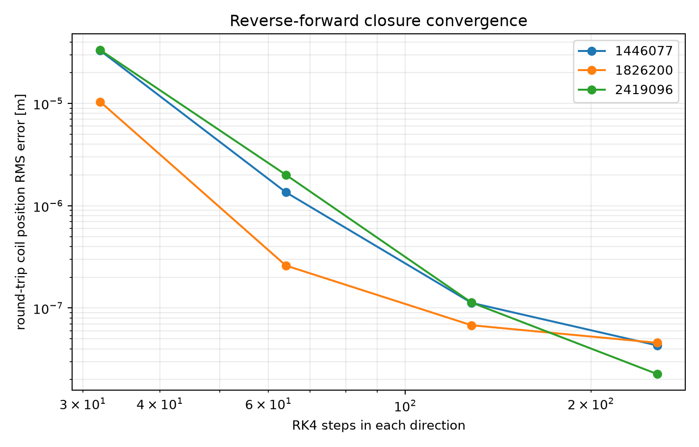
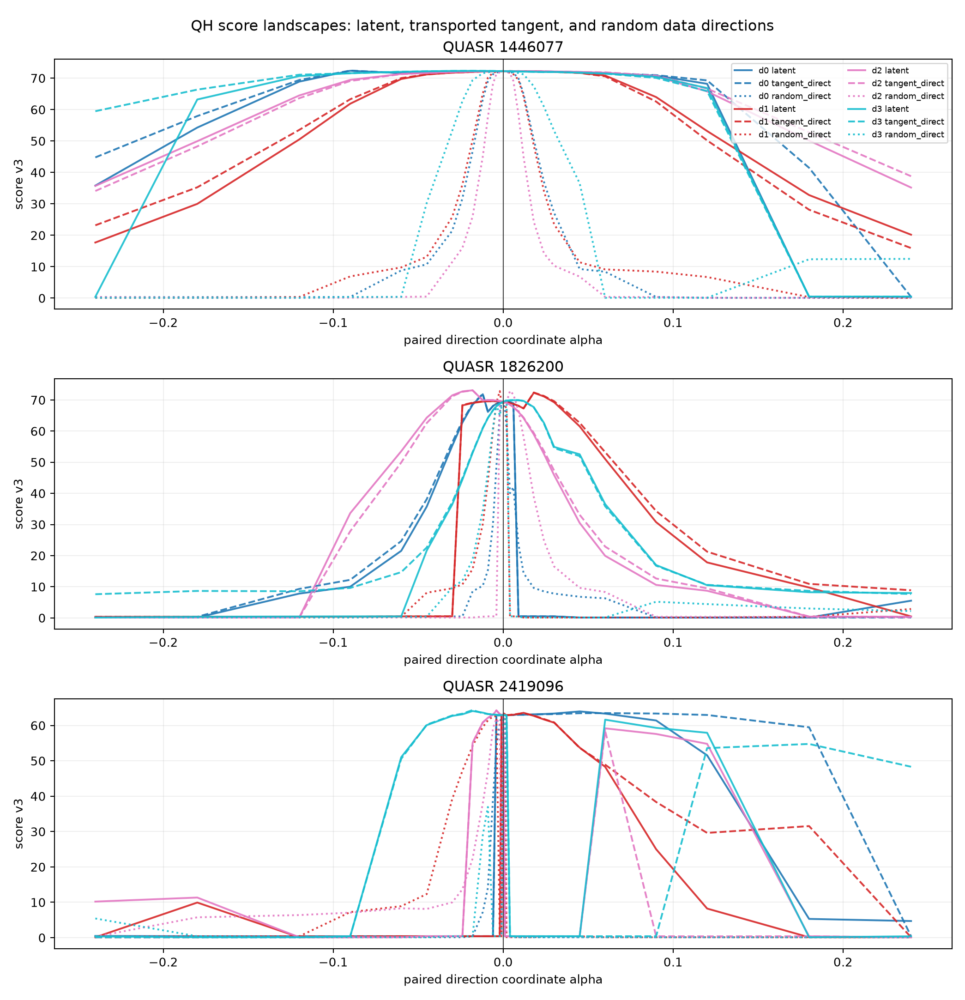
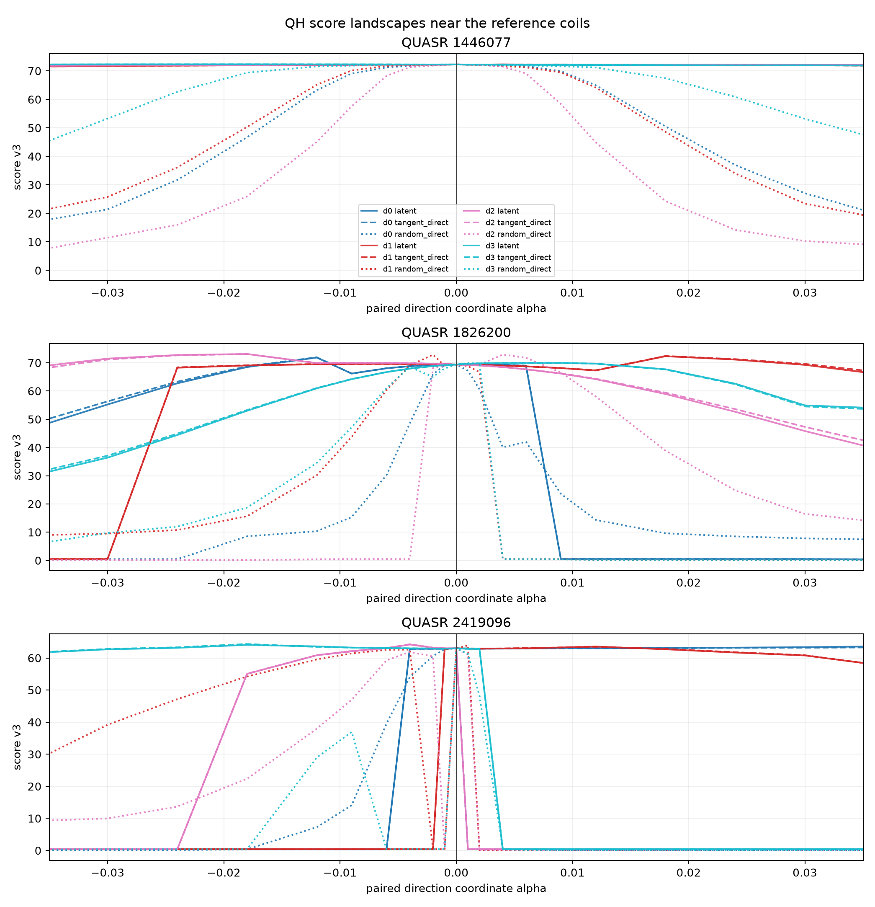
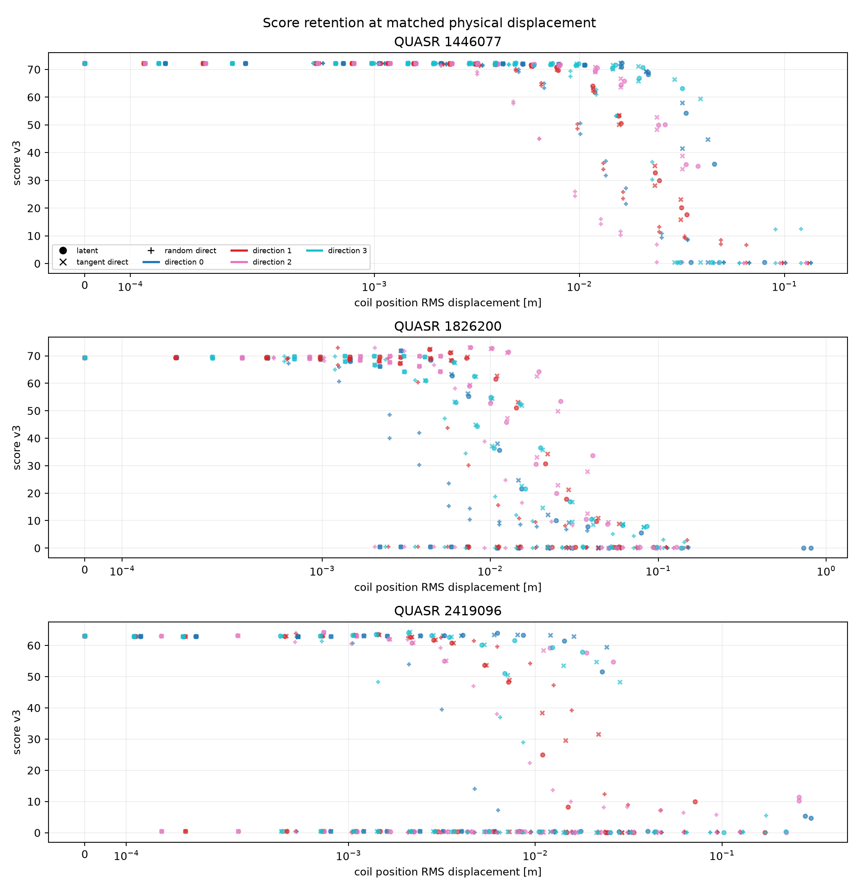

# Flow matching 噪声空间与原参数空间的 QH score landscape

> **2026-08-03 重要更正：** 本报告原正式作业 `29377` 修复了全局电流反号 bug，但仍使用
> $G=\mu_0I_{\rm link}$，而当前已验证的弧度坐标约定应为
> $G=\mu_0I_{\rm link}/(2\pi)$。因此旧作业的绝对 score、QH/QA 竞争关系、盆地宽度和粗糙度
> 数值均为 **superseded**，第 1、5、6、7 节不能再作为当前评分器下的结论。第 2 节的反号
> 不变性推导和第 3、4 节的 ODE/闭环方法仍有效。文末将追加固定 ABI-9 库后的完整重跑结果。

日期：2026-07-30

分支：`qh-flow-landscape`

修正后正式实验：Slurm `29377`；独立汇总：Slurm `29413`

> 旧实验 `29308` 使用了带全局电流反号 bug 的 score，其绝对分数、QH/QA 竞争项和宽度统计全部作废。本报告只使用修正后的结果。

## 1. 结论

本轮先修掉了一个确定的物理符号 bug，再完整重跑了 landscape。修正后的结论是：

1. **整体电流反号不再改变物理评分。** 三个样本的 QH error 变化仅为 $1.8\times10^{-9}$ 到 $3.4\times10^{-8}$，总分变化不超过 $0.013$。旧实现中 9 到 21 分的变化已经消失。
2. **flow 噪声空间仍明显比原参数空间的独立随机方向更容易优化。** 对 3 个高分 QH 样本、每个样本 4 个随机方向，共 12 组配对比较。下降 5 分的坐标宽度比中位数为 **10.49 倍**；换成真实线圈位置 RMS 位移后，物理半径比中位数仍为 **3.92 倍**。两项比较均为 **12/12** 个方向由噪声空间胜出。加权二阶导 RMS 比中位数为 **0.221**，12 个方向中有 11 个更平滑。
3. **优势主要来自 flow 学到的相关方向，而不是沿同一方向做强非线性拉伸。** 噪声路径和它在原空间的 Jacobian 切线几乎等宽：下降 5 分宽度比中位数为 $0.995$，物理半径比为 $0.988$。
4. **高精度反演足够可靠。** 256 步双向 RK4 后，线圈位置闭环 RMS 误差为 $2.26\times10^{-8}$ 到 $4.57\times10^{-8}$ m，QH error 重建差异不超过 $1.55\times10^{-7}$。

因此，先前“flow-prior CEM 比直接在 Fourier 参数上做 diagonal CEM 更容易”的观察，在修正评分 bug 后仍得到支持。更准确的机制解释是：flow 把噪声空间中的普通方向映射成了保持多线圈、多 Fourier 阶数和电流相关结构的方向。

## 2. 电流反号 bug

### 2.1 为什么整体反号不应改变结果

把所有线圈电流同时乘以 $-c$，其中 $c>0$，则

$$
\boldsymbol B'=-c\boldsymbol B,
\qquad
\psi'=-c\psi,
\qquad
|\boldsymbol B'|=c|\boldsymbol B|.
$$

磁力线的空间轨迹、磁面形状和旋转变换 $\iota$ 不变，只有磁场方向和有符号磁通方向反转。当前微分 QS 指标使用

$$
f_C=(M\iota-N)A-MGC,
$$

其中

$$
A=(\boldsymbol B\times\nabla\psi)\cdot\nabla|\boldsymbol B|,
\qquad
C=\boldsymbol B\cdot\nabla|\boldsymbol B|.
$$

反号并缩放后有

$$
A'=c^3A,
\qquad
C'=-c^2C.
$$

真空 Boozer 协变系数 $G$ 必须和有符号环向磁通使用同一方向约定，因此

$$
G'=-cG.
$$

于是

$$
f_C'=c^3f_C,
\qquad
\frac{f_C'}{|\boldsymbol B'|^3}
=\frac{f_C}{|\boldsymbol B|^3}.
$$

无量纲 QS residual 理论上严格不变。旧结果中仅改变电流符号就显著改变 QH score，确实只能是实现错误，不是物理效应。

### 2.2 代码错在哪里

旧的 C++/CUDA 和 Python 路径都使用

$$
G_{\rm old}=\mu_0\,2N_{\rm FP}\sum_k |I_k|,
$$

这会强制 $G>0$。全局反号后 $C$ 已变号，但 $G$ 没有变号，导致 $-MGC$ 和第一项的相对符号翻转。QH 和 QA 都含该项，因此误差会大幅变化；QP 的 $M=0$，不依赖 $G$，所以旧实验中 QP error 恰好几乎不变。这是对根因的独立交叉验证。

修正后的约定是

$$
G=\operatorname{sign}(\psi_{\rm edge})
\mu_0\,2N_{\rm FP}\sum_k |I_k|.
$$

具体修改：

- `gpu_backend/src/score_pipeline.cu` 把拟合得到的有符号边界环向磁通传入 QS 计算，用 `copysign` 给 $|G|$ 附加方向；零磁通或非有限磁通直接拒绝。
- `stellarator_eval/volume_qs.py` 使用相同约定，保证 Python 参考路径与原生评分器一致。
- `scripts/experiment_volume_qs_saved.py` 同步传入拟合后的有符号磁通。
- 新增代数回归测试，验证任意正缩放加全局反号后 $f_C/|B|^3$ 在 $2\times10^{-14}$ 容差内不变。

### 2.3 实际反号回归

`source_flipped` 只把每根线圈电流乘以 $-1$，不做几何修改，也不做电流幅值重标定。

| QUASR ID | raw score | 反号 score | $\Delta$ score | raw QH error | $\Delta$ QH error |
| ---: | ---: | ---: | ---: | ---: | ---: |
| 1446077 | 72.185063 | 72.197136 | $+1.21\times10^{-2}$ | 0.096379379 | $+2.50\times10^{-8}$ |
| 1826200 | 69.381612 | 69.381547 | $-6.47\times10^{-5}$ | 0.036869470 | $+1.84\times10^{-9}$ |
| 2419096 | 62.973940 | 62.979714 | $+5.77\times10^{-3}$ | 0.301914699 | $-3.36\times10^{-8}$ |

QH、QA、QP 的变化均已进入 FP32 数值噪声量级。总分最多还有 0.013 的变化，主要来自磁轴候选排序和 alpha 坐标质量分量的有限精度波动，不再是 QS 公式的符号错误。

flow 数据预处理还会把全组电流 $L^1$ 范数缩放到对应 $(N_{\rm FP},n_c)$ 训练组的中位数，并统一最大绝对值电流的符号。修正后，raw 到 canonical 的 QH error 差异也不超过 $2.02\times10^{-7}$，总分差异不超过 0.104：

| QUASR ID | raw | canonical | RK4 reconstruction | canonical 到 reconstruction |
| ---: | ---: | ---: | ---: | ---: |
| 1446077 | 72.185063 | 72.251193 | 72.254413 | $+0.003220$ |
| 1826200 | 69.381612 | 69.406160 | 69.396366 | $-0.009794$ |
| 2419096 | 62.973940 | 62.870741 | 62.985267 | $+0.114526$ |

这证明模型规范化中的电流反号和统一幅值缩放现在不会再伪造显著的绝对 score 差异。

## 3. Landscape 实验设计

使用物理加权 loss 训练得到的 30,000 step EMA checkpoint。模型权重和 ODE 状态均为 FP32，关闭 autocast。

三个样本覆盖不同条件：

| QUASR ID | split | $N_{\rm FP}$ | 基线线圈数 | canonical score |
| ---: | --- | ---: | ---: | ---: |
| 1446077 | train | 3 | 4 | 72.251193 |
| 1826200 | validation | 2 | 5 | 69.406160 |
| 2419096 | train | 4 | 3 | 62.870741 |

训练后的 flow ODE 从 $t=0$ 的噪声 $\boldsymbol z$ 映射到 $t=1$ 的标准化线圈参数 $\boldsymbol x$：

$$
\frac{\mathrm d\boldsymbol x_t}{\mathrm dt}
=v_\theta(\boldsymbol x_t,t,N_{\rm FP}),
\qquad
F(\boldsymbol z)=\boldsymbol x_1.
$$

对每个高分参考点 $\boldsymbol x_*$ 反向积分得到 $\boldsymbol z_*$。每个样本取 4 个潜空间单位 RMS 高斯方向 $\boldsymbol u$，并构造三条配对路径。

### 3.1 噪声空间路径

$$
\boldsymbol x_{\rm latent}(a)=F(\boldsymbol z_*+a\boldsymbol u).
$$

这是 flow-prior diagonal CEM 实际探索的局部方向。

### 3.2 Jacobian 切线控制

$$
\boldsymbol x_{\rm tangent}(a)
=\boldsymbol x_*+aJ_F(\boldsymbol z_*)\boldsymbol u.
$$

$J_F\boldsymbol u$ 用 $h=0.01$ 的中心差分计算。该路径与噪声路径在 $a=0$ 具有相同的一阶物理方向，用于判断优势是否只是 flow 沿同一方向产生非线性拉伸。

### 3.3 原参数空间独立随机路径

$$
\boldsymbol x_{\rm random}(a)=\boldsymbol x_*+a\boldsymbol v,
$$

其中 $\boldsymbol v$ 是原参数空间中的独立各向同性高斯方向，并缩放到

$$
\operatorname{RMS}(\boldsymbol v)
=\operatorname{RMS}(J_F\boldsymbol u).
$$

因此局部标准化步长与切线控制一致。该路径代表直接在原 Fourier 参数上做 diagonal CEM 时容易采到的方向。

每条路径使用 31 个关于零对称的非均匀 $a$ 点，最小非零步长为 0.001，最大 $|a|=0.24$。总计：

$$
3\ \text{samples}\times4\ \text{directions}
\times3\ \text{paths}\times31=1116
$$

个 landscape 逻辑点，再加 12 个 baseline，共 1128 点。中心点按物理 token 哈希去重后，实际调用 C++/CUDA score 1095 次。

## 4. 反向追踪精度

| 每个方向的 RK4 步数 | 线圈位置 RMS 闭环误差范围 |
| ---: | ---: |
| 32 | $1.04\times10^{-5}$ 到 $3.33\times10^{-5}$ m |
| 64 | $2.60\times10^{-7}$ 到 $2.01\times10^{-6}$ m |
| 128 | $6.79\times10^{-8}$ 到 $1.13\times10^{-7}$ m |
| 256 | $2.26\times10^{-8}$ 到 $4.57\times10^{-8}$ m |

正式实验使用 256 步。此时标准化 token RMS 闭环误差为 $9.11\times10^{-8}$ 到 $1.15\times10^{-7}$，已经接近 FP32 数值底噪。canonical 到 reconstruction 的 QH error 差异为 $3.39\times10^{-8}$、$3.39\times10^{-8}$ 和 $1.54\times10^{-7}$，远小于本实验用来定义盆地宽度的 5 分和 10 分变化。

## 5. 修正后的 Landscape

中心区域放大如下：

图中实线是噪声空间路径，虚线是 Jacobian 切线控制，点线是原参数空间独立随机方向。三个样本上都能看到：实线和同色虚线大体重合，而点线的高分区域明显更窄，并更容易触发磁轴、磁面或磁通质量拒绝。

### 5.1 盆地宽度

以中心 score 首次下降 5 分或 10 分的位置定义左右半宽。物理半径是在该交点处线圈曲线的位置 RMS 位移。

| 路径 | 下降 5 分总宽度中位数 | 下降 10 分总宽度中位数 | 下降 5 分物理半径中位数 | 下降 10 分物理半径中位数 |
| --- | ---: | ---: | ---: | ---: |
| 噪声空间 | 0.06015 | 0.07108 | 0.00831 m | 0.00993 m |
| Jacobian 切线 | 0.05968 | 0.07089 | 0.00868 m | 0.01052 m |
| 原参数空间随机 | 0.00720 | 0.00852 | 0.00219 m | 0.00259 m |

逐方向先求比值，再取中位数：

| 对照 | 下降 5 分宽度比 | 下降 10 分宽度比 | 下降 5 分物理半径比 | 下降 10 分物理半径比 | 噪声空间更宽 |
| --- | ---: | ---: | ---: | ---: | ---: |
| 噪声 / Jacobian 切线 | 0.995 | 0.996 | 0.988 | 0.981 | 3/12 |
| 噪声 / 原空间随机 | **10.49** | **9.69** | **3.92** | **3.84** | **12/12** |

换成米为横轴后优势仍存在，排除了“两个坐标系单位不同造成假宽度”的解释：

### 5.2 平滑度与可行率

score 含磁轴搜索、磁面筛选和 hard gate，本身不是处处可微。这里的平滑度是采样曲线上的经验统计，不是全局数学光滑性。使用非均匀网格加权二阶导 RMS：

| 对照 | 噪声/对照二阶导 RMS 比中位数 | 噪声空间更平滑 |
| --- | ---: | ---: |
| 噪声 / Jacobian 切线 | 1.001 | 5/12 |
| 噪声 / 原空间随机 | **0.221** | **11/12** |

整个 $|a|\le0.24$ 扫描范围内：

| 路径 | `status=ok` | 比例 |
| --- | ---: | ---: |
| 噪声空间 | 278 / 372 | 74.73% |
| Jacobian 切线 | 280 / 372 | 75.27% |
| 原参数空间随机 | 195 / 372 | 52.42% |

这进一步说明噪声方向和它的原空间切线保持相同的可行结构，而原空间独立扰动更容易离开可评分区域。

## 6. 对优化机制的判断

修正后的证据支持以下解释：

1. flow 并没有主要依靠 ODE 对同一物理方向做巨大的径向拉伸。若是这种机制，噪声路径应明显宽于 Jacobian 切线，但二者几乎等价。
2. flow 学到的数据相关性更关键。噪声空间的普通方向会同时协调多根线圈、低频和高频 Fourier 分量以及电流；原空间各维独立扰动会迅速破坏这些相关性。
3. 这正是 diagonal CEM 在 flow 噪声空间更容易工作的原因：它采到的方向更接近高质量线圈流形的切空间，局部盆地更宽，评分失败率更低。
4. 若继续改进优化器，优先考虑噪声空间中的低秩或全协方差更新、由 elite 样本估计局部子空间，而不是退回原 Fourier 参数上的独立高斯扰动。

本实验仍只有 3 个参考点和 12 个方向。它足以解释此前 CEM 观察到的机制，但还不是覆盖整个 QUASR QH 分布的统计定理。

## 7. 耗时与资源

正式评分使用 4 张运行前为空闲的 RTX 5090 和 16 CPU。GPU preflight 和 postflight 均显示四张卡为 2 MiB、0% utilization，任务结束后无遗留 GPU 进程。

| 阶段 | 工作量 | 墙钟时间 |
| --- | ---: | ---: |
| flow 反演、闭环、方向与 1128 点生成 | 3 样本，256 步 FP32 RK4 | 32.65 s |
| 原生 C++/CUDA score | 1095 个唯一 case，4 GPU | 1685.28 s |
| 独立纯 CPU 汇总与绘图 | 读取已有 JSONL | 10 s |
| 有效总时间 | 不含开发烟测 | 约 28 分 48 秒 |

四个评分 rank 分别处理 274、274、274 和 273 个 case，评分墙钟为 1684.33、1632.47、1620.43 和 1617.75 秒，没有明显单卡长尾。四卡并行后的平均墙钟摊销为

$$
\frac{1685.28}{1095}=1.54\ \mathrm{s/case}.
$$

四个 rank 的 GPU 进程时间之和除以 case 数约为 5.99 s/case。瓶颈仍是原生 score，flow 反演只占总墙钟约 1.9%。

正式作业 `29377` 已成功写完全部 1095 个 score 和 GPU postflight，但旧的尾部分析入口在导入 PyTorch 时触发 oneMKL 动态库错误，因此 Slurm 最终状态为 `FAILED 2:0`。评分无需重跑。代码随后改为惰性导入，`--analyze-only` 不再加载 PyTorch；独立作业 `29413` 在 10 秒内以 `COMPLETED 0:0` 生成全部统计和图片，标准错误为空。

## 8. 可复现产物

- [summary.json](assets/qh_flow_landscape_29377/summary.json)：baseline、逐方向宽度、粗糙度、状态和 runtime。
- [manifest.json](assets/qh_flow_landscape_29377/manifest.json)：样本、网格、方向种子、RK4 闭环、checkpoint 和去重计数。
- [landscape_rows.csv](assets/qh_flow_landscape_29377/landscape_rows.csv)：1128 个逻辑点的 score、status 和物理位移。
- [gpu_preflight.csv](assets/qh_flow_landscape_29377/gpu_preflight.csv) 与 [gpu_postflight.csv](assets/qh_flow_landscape_29377/gpu_postflight.csv)：正式实验前后的 GPU 状态。

固定标识：

- checkpoint step：30,000；SHA-256：`39a3293a459e248a0d1ec062607a1a467128b14d8ca973aadd82e113532ab99f`
- 修正后原生 score 库 SHA-256：`259fb02eee004f4c5ae1da9844ca3ad6256ece6fdd08ec14b7a90e63f987b126`
- 随机种子：`20260730`
- 评分符号修复提交：`517a041`
- 分析惰性导入修复提交：`aaec623`

## 9. 最终判断

旧报告中最可疑的现象确实是 bug：全局电流反号改变了 $G$ 与 $C$ 的相对符号，进而伪造 QH/QA error 和 helicity gate 的巨大变化。该问题已经在 C++/CUDA 与 Python 两条路径同时修正，并由代数测试、精确反号评分和 raw/canonical 规范化三层验证。

修复后重新跑出的 landscape 没有推翻核心结论，反而使解释更干净：**flow 噪声空间的盆地相对原参数空间独立随机方向显著更宽、更平滑、可行率更高；但相对同一物理方向的 Jacobian 切线并没有额外展宽。优势来自学到的相关子空间，而不是坐标单位或 ODE 数值误差。**
