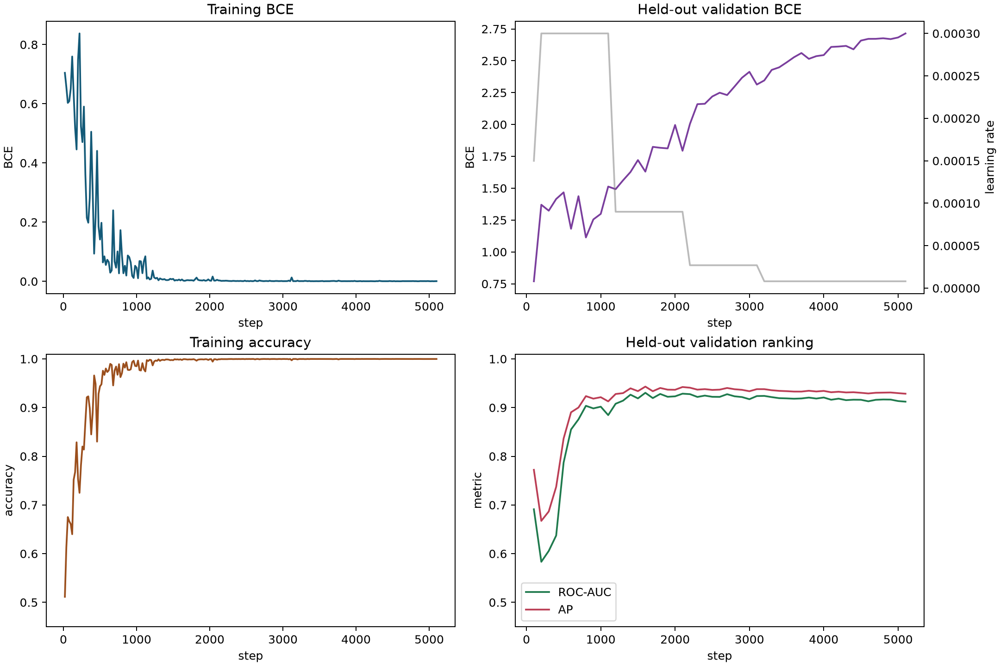
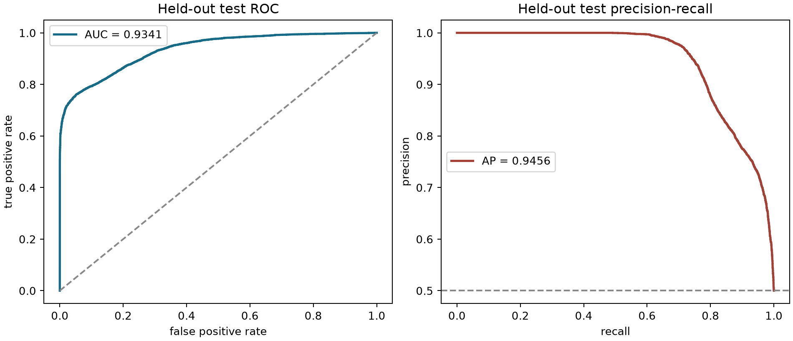
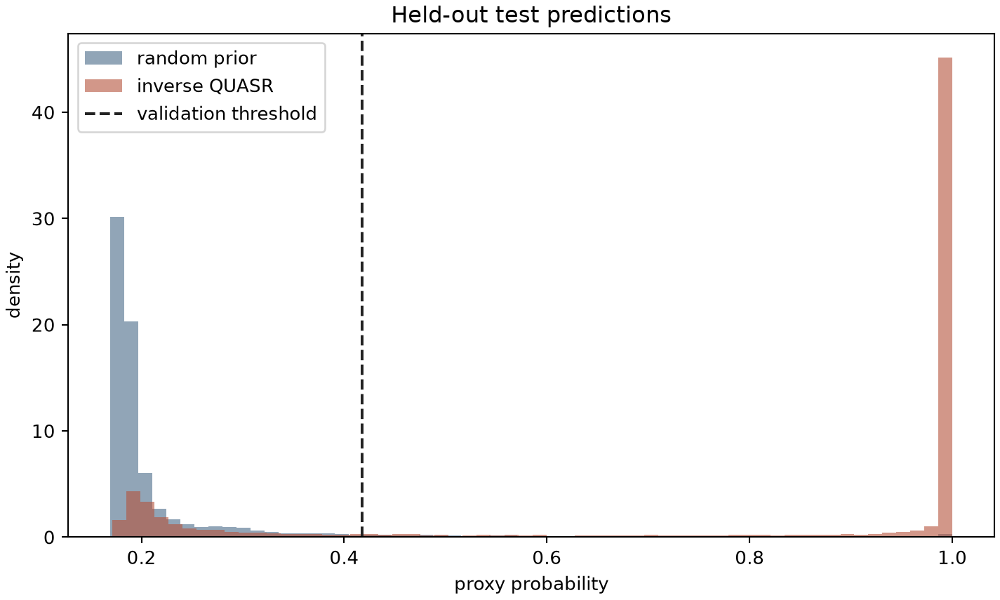
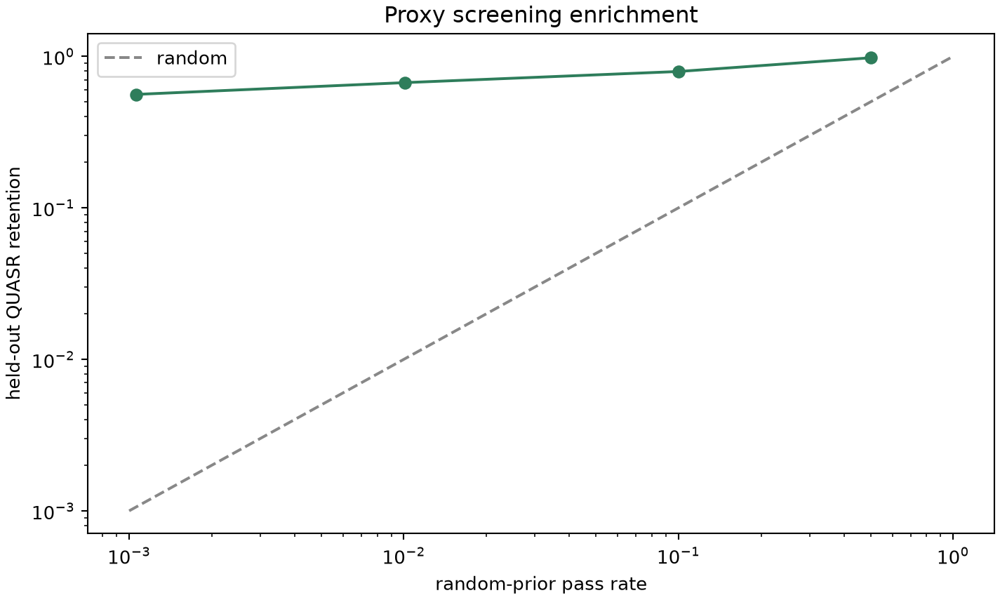
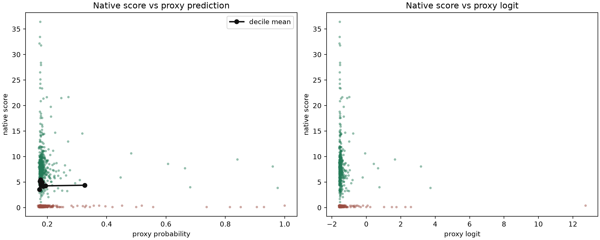
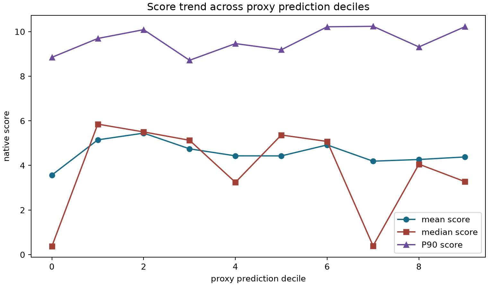

# QH flow 潜空间支持度代理实验报告

> 日期：2026-07-31 
> 分支：`qh-flow-latent-proxy` 
> 状态：反演、训练、FP32 留出测试已完成；原生 score 相关性结果见第 6 节

## 1. 结论摘要

实验回答了两个不同层次的问题。

第一，当前 flow 下，QUASR QH 样本的逆追踪潜变量与条件匹配的标准高斯潜变量**明显可分**。在完全未参与训练和模型选择的 17,016 个平衡测试样本上，小型 Transformer 得到：

| 指标 | 全测试集 | 目标条件 $N_{\mathrm{FP}}=4,n_c=3$ |
| --- | ---: | ---: |
| ROC-AUC | 0.93414 | 0.95097 |
| AP | 0.94555 | 0.95523 |
| accuracy | 0.85349 | 0.79663 |
| latent RMS 基线 AUC | 0.71343 | - |

因此，可分信号并不只是 $\|z\|_2$ 的简单半径偏移。模型确实捕捉到了更高维的潜空间结构。

第二，分类成功不等于它能连续预测物理 score。固定目标条件 $N_{\mathrm{FP}}=4,n_c=3$ 的独立原生 GPU score 交叉验证给出了明确负结果：全部、IID、分层和仅有效样本中的 Pearson/Spearman 相关系数都接近 0，高预测尾部也没有更高 score 或有效率。因此当前模型只能视为对 flow 分布失配的诊断分类器，**不能作为物理优质起点的预筛器**。

本实验的概率输出准确含义是

$$
D(z,c)\approx
\Pr(\text{样本来自逆追踪 QUASR}\mid z,c),
$$

其中 $c=(N_{\mathrm{FP}},n_c)$。它不是

$$
\Pr(\text{物理 score 很高}\mid z,c),
$$

也不能区分 QUASR 正类内部的优劣。

## 2. 数据与反演

### 2.1 标签构造

沿用 flow 训练时已经固定的 ID 划分：

| split | QUASR 正类数 | 在线高斯负类数 |
| --- | ---: | ---: |
| train | 153,747 | 每个 batch 1:1 在线生成 |
| validation | 8,500 | 8,500 |
| test | 8,508 | 8,508 |

正类按原条件逐条反演：

$$
z_+=F_c^{-1}(x),
$$

负类按完全相同的 $(N_{\mathrm{FP}},n_c)$ 条件配平：

$$
z_-\sim\mathcal N(0,I).
$$

模型只看到线圈 token 和 $N_{\mathrm{FP}}$，看不到 QUASR ID、split、文件来源或标签元数据。线圈数由 token 数自然给出。

### 2.2 数值路径

- flow checkpoint：step 30,000 EMA；SHA-256 为 `39a3293a459e248a0d1ec062607a1a467128b14d8ca973aadd82e113532ab99f`。
- ODE：FP32、RK4、256 步，从 $t=1$ 反向积分到 $t=0$。
- batch：每卡 4096；4 张 RTX 5090 按数据分片并行。
- 全部 170,755 个样本只反演一次，保存为按 split、$N_{\mathrm{FP}}$、线圈数和 rank 分片的 FP32 tensor。

完整反演用时 674.54 s，即 11 分 14.54 秒。四卡峰值显存均约 657 MB。

### 2.3 闭环精度

从各组固定抽取 2,902 个样本执行反向再正向闭环。结果为：

| 误差 | mean | P95 | max |
| --- | ---: | ---: | ---: |
| 标准化 token RMS | $1.19\times10^{-7}$ | $3.10\times10^{-7}$ | $1.93\times10^{-6}$ |
| 线圈位置 RMS | $5.14\times10^{-8}\,\mathrm m$ | $1.05\times10^{-7}\,\mathrm m$ | $1.30\times10^{-6}\,\mathrm m$ |

这个误差远小于先前已知会显著改变物理 score 的 $10^{-3}$ 量级扰动，因此正类标签没有被粗糙 ODE 反演破坏。

## 3. 代理模型与训练

### 3.1 模型

模型与 flow 主干使用相同风格，但显著缩小：

| 项目 | 配置 |
| --- | --- |
| token | 一根线圈一个 100 维 token |
| Transformer | 4 层，width 256，8 heads，SwiGLU hidden 704 |
| 归一化 | RMSNorm、PreNorm |
| attention | 非因果、无 RoPE、无位置编码 |
| 条件 | learned $N_{\mathrm{FP}}$ embedding 注入每个 block |
| 聚合 | token mean pooling，保证线圈排列不变性 |
| 参数量 | 3,768,321 |

无位置编码和 mean pooling 的排列不变性已由单元测试验证。

### 3.2 优化与收敛判据

- 4 卡 DDP；每卡每步 2048 正类和 2048 负类。
- BF16 仅用于训练前向；参数、优化器、BCE loss 和最终验证/测试均保留 FP32。
- AdamW，初始学习率 $3\times10^{-4}$，200 步 warmup，weight decay $10^{-3}$。
- 每 100 步完整检查 validation；平台期学习率乘 0.3，最多三次。
- checkpoint 只按 validation ROC-AUC 选择，test 不参与训练、停止、校准和阈值选择。

训练曲线如下。

最佳 validation AUC 出现在 step 1600。训练继续到 step 5100，三次降低学习率后仍未刷新最佳 AUC，最终以 `validation_plateau_after_final_lr_reduction` 停止。后半段训练准确率接近 100%，validation AUC 略降、未校准 BCE 上升，表明继续训练是在过拟合，不是训练不足。因此最终使用 step 1600 checkpoint。

训练计算本身用时 117.75 s，完整 Slurm 作业用时 134 s，单卡峰值显存约 1.74 GB。

## 4. FP32 校准与严格留出测试

### 4.1 为什么重新做 FP32 评估

最初训练作业把 validation/test 推理也放在 BF16 autocast 中。AUC 排序仍有效，但阈值附近的 logit 出现离散化，且未经校准的模型明显过度自信。最终结果改为：

1. 读取 step 1600 checkpoint，以 FP32 独立重算 validation 和 test logit；
2. 只用 validation 拟合保持单调的 Platt 变换

$$
p=\sigma(a\ell+b),\qquad a>0;
$$

3. 只用 validation 最大化 Youden's $J$ 选择分类阈值；
4. 冻结 $a,b$ 和阈值后一次性统计 test。

拟合得到 $a=0.77686$、$b=6.27731$，validation 阈值为 0.41778。校准保持排序不变，将 test log loss 从 1.61842 降至 0.34705，Brier score 为 0.10954，ECE 为 0.06803。

### 4.2 测试集混淆矩阵

测试集共 17,016 条，正负各 8,508 条：

|  | 预测随机高斯 | 预测逆追踪 QUASR |
| --- | ---: | ---: |
| 真实随机高斯 | TN = 8088 | FP = 420 |
| 真实逆追踪 QUASR | FN = 2073 | TP = 6435 |

对应 sensitivity 为 75.63%，specificity 为 95.06%，accuracy 为 85.35%。

### 4.3 筛选富集能力

将阈值改为固定随机先验通过率，可直接衡量预筛价值：

| 随机先验通过率 | 留出 QUASR 保留率 | 富集倍数 |
| ---: | ---: | ---: |
| 50% | 97.72% | 1.95 |
| 10% | 79.36% | 7.93 |
| 1% | 67.02% | 66.30 |
| 约 0.1% | 56.02% | 529.56 |

这说明模型很适合把极大的高斯候选池压缩成较小候选集。不过，这里的“保留率”仍针对逆追踪 QUASR 标签，不是直接针对高物理 score。

## 5. 条件差异与简单基线

33 个条件组的 macro AUC 为 0.97370；只统计总测试数不少于 100 的 20 个组，macro AUC 为 0.95794。目标组 $N_{\mathrm{FP}}=4,n_c=3$ 有 2,080 个平衡测试样本，AUC 为 0.95097。

全局 validation 阈值在目标组上较保守：

- TN/FP/FN/TP = 1032/8/415/625；
- sensitivity = 60.10%；
- specificity = 99.23%。

这反映不同条件组的概率基线仍有偏移。对固定条件做候选排序时，组内 AUC 才是更直接的指标；若未来要求跨条件比较绝对概率，应按条件做额外校准。

仅用每个潜变量的 RMS 大小作为一维分数，test AUC 为 0.71343，远低于 Transformer 的 0.93414。因而高准确率不能用“逆追踪样本只是整体半径不同”解释。

## 6. 与当前原生物理 score 的关系

本节使用修复电流反号问题后的原生 score 库，SHA-256 为 `0b7342db471788385931385c25ded8095c72cfb7fcea1e21376a0475dafaa427`。固定条件为 $N_{\mathrm{FP}}=4,n_c=3$。

实验先从标准高斯生成 131,072 个潜变量并批量预测，再选择两类互不重叠的样本：

- 768 个按预测排名均匀分层的样本，用于覆盖整个代理输出范围；
- 256 个独立 IID 随机样本，用于估计未经分层改变的先验总体关系。

选出的 1,024 个潜变量用 FP32 RK4-256 解码，再由四张 RTX 5090 并行运行完整原生 score。Pearson 和 Spearman 相关性分别对全部样本、分层样本、IID 样本和 `status=ok` 样本统计，避免把分层抽样造成的相关性误报成先验总体相关性。

### 6.1 总体结果

1,024 个样本的 score 分布为：

| count | mean | median | P90 | max |
| ---: | ---: | ---: | ---: | ---: |
| 1,024 | 4.552 | 4.464 | 9.459 | 36.394 |

状态分布为：

| `ok` | `no_axis` | `no_surface` | `drift_rejected` | `flux_rejected` |
| ---: | ---: | ---: | ---: | ---: |
| 559 | 189 | 60 | 211 | 5 |

代理预测与 score 的相关性如下：

| 子集 | 数量 | Pearson | Spearman |
| --- | ---: | ---: | ---: |
| 全部 | 1,024 | -0.0418 | -0.0161 |
| 独立 IID prior | 256 | -0.0205 | -0.0269 |
| 预测排名分层 | 768 | -0.0566 | -0.0120 |
| 仅 `status=ok` | 559 | -0.0271 | -0.0107 |

所有相关系数都在 0 附近，而且 Pearson 与只依赖排序的 Spearman 一致否定了单调关系。这不是由无效样本统一记低分造成的，因为只保留 `status=ok` 后结论不变。

十个预测分位的 mean score 只在 3.57 到 5.45 间无序波动，P90 也没有上升趋势。高概率尾部反而进一步排除了“只有最顶端才有用”的解释：

| proxy 概率门槛 | 样本数 | mean score | max score | `ok` 比例 |
| ---: | ---: | ---: | ---: | ---: |
| $p\ge0.2$ | 113 | 4.234 | 21.652 | 52.2% |
| $p\ge0.3$ | 29 | 2.832 | 14.510 | 34.5% |
| $p\ge0.5$ | 14 | 3.067 | 9.424 | 42.9% |
| $p\ge0.9$ | 5 | 2.498 | 8.050 | 40.0% |

整体 `ok` 比例为 54.6%，而 $p\ge0.9$ 的 5 个样本只有 40% 为 `ok`。样本数虽不足以精确估计极端尾部概率，但已经没有任何正向迹象；结合 256 个 IID 样本和 768 个全排名分层样本，当前代理不能用于提高真实 score。

### 6.2 为什么分类很好但 score 无关

这两个结果并不矛盾。平衡二分类的 Bayes 最优目标是

$$
D^*(z,c)=
\frac{p_{\mathrm{inv}}(z\mid c)}
{p_{\mathrm{inv}}(z\mid c)+p_0(z\mid c)}.
$$

它只要求识别“逆追踪 QUASR 分布”和“标准高斯分布”的密度差，不要求在 $p_0$ 内按物理质量排序。本实验还把全部 QUASR QH 样本统一标成正类，没有提供其内部 score 大小。因此模型可以很好地学到 flow 的覆盖误差、条件分布偏移或 QUASR 数据支持形状，却完全不知道哪些偏移对应大磁面、高 $|\iota|$ 和低 QS error。

更直接地说，本代理蒸馏的是“当前 flow 哪里不像它的训练数据”，而不是“当前 score 在哪里更高”。分类 AUC 0.934 证明前者存在，score 相关性接近 0 证明它没有自然转化为后者。

## 7. 速度

| 阶段 | 硬件 | 数量 | 墙钟时间 |
| --- | --- | ---: | ---: |
| QUASR 全量 FP32 RK4-256 反演 | 4 x RTX 5090 | 170,755 | 674.54 s |
| 代理训练至验证平台 | 4 x RTX 5090 | 5100 steps | 117.75 s 训练；134 s 作业 |
| 权威 FP32 validation+test 推理 | 1 x RTX 5090 | 34,016 | 1.82 s |
| 校准、指标和绘图在内的测试进程 | 1 x RTX 5090 | 34,016 | 5.96 s |
| 代理候选池推理 | 1 x RTX 5090 | 131,072 | 0.435 s |
| 选中样本 FP32 RK4-256 解码 | 1 x RTX 5090 | 1,024 | 10.65 s |
| 候选准备总计 | 1 x RTX 5090 | 131,072 中选 1,024 | 13.88 s |
| 1,024 个原生物理 score | 4 x RTX 5090 | 1,024 | 1299.89 s |

真正昂贵的一次性步骤是全量 flow 反演。代理训练和后续百万级候选预筛都很轻；实际在线筛选时不需要重复反演 QUASR 数据。

## 8. 结论边界与下一步

已经验证：

1. 当前有限精度 flow 的逆追踪 QUASR 分布与标准高斯先验存在强、可泛化的结构差异；
2. 小型代理显著超过随机猜测和 latent RMS 基线；
3. 在只保留很小比例随机先验时，代理仍能保留多数 held-out QUASR 潜变量；
4. FP32 RK4-256 反演闭环误差足够小，分类信号不是粗积分误差造成的。

尚未证明：

1. 代理概率不是连续物理 score；本实验已测得二者在当前目标条件下基本零相关；
2. 当前只训练了一个随机种子，尚未统计训练种子方差；
3. 尚未加入 round-trip 高斯负类控制，不能完全排除极微弱的共同数值路径特征；
4. 未做几何近重复样本审计，ID 级 split 已隔离，但不能排除 QUASR 内部高度近似线圈跨 split；
5. 不应直接对代理无限优化，否则可能产生针对分类器的对抗性捷径。

因此不应把当前代理接入 Adam/CEM 起点预筛。更可行的下一版应让标签与最终目标一致，例如：

1. 只把 QUASR 中当前原生 score 较高、完整评估可行的样本当正类，而不是把全部 QH 样本等价处理；
2. 在潜空间直接回归 score、有效磁面概率和关键分量，使用真实 score 的排序或分位损失；
3. 先用当前分类器表征初始化，再用少量真实 score 标签微调，但最终选择仍由独立原生 score 验证；
4. 对任何新代理继续保留 IID、全排名分层和极端高预测尾部三类交叉验证，避免只看人工标签 AUC。

## 9. 产物与复现入口

- 反演：`scripts/invert_qh_flow_latents.py`
- 训练：`scripts/train_qh_latent_proxy.py`
- FP32 权威评估：`scripts/evaluate_qh_latent_proxy.py`
- score 相关性：`scripts/evaluate_qh_latent_proxy_score.py`
- 反演 manifest：`reports/assets/qh_latent_proxy_inversion_29815/manifest.json`
- 训练监控：`reports/assets/qh_latent_proxy_training_29820/`
- FP32 测试原始摘要与预测：`reports/assets/qh_latent_proxy_eval_29822/`
- 原生 score 相关性摘要、逐样本结果和图：`reports/assets/qh_latent_proxy_score_29824/`

本地完整测试：84 passed。
