# QH Flow Matching 第一代模型实验报告

- 日期：2026-07-28
- 分支：`qh-flow-matching-rl`
- 实验代码提交：`3725cc9`
- 训练服务器：新服务器，Slurm 单节点 4 张 RTX 5090
- 正式训练作业：`28447`；收敛复核：`28494`、`28534`、`28539`
- 正式评测作业：`28461`（8k）、`28546`（45k）

## 1. 结论先行

本轮已经跑通“QUASR QH 线圈数据 -> 无条件 flow matching -> 生成线圈 -> 原生
C++/CUDA score”的第一代闭环。旧服务器只用于从只读 QUASR 源数据中提取线圈，训练和
评测全部在新服务器完成。

目前可以确认：

1. 全部 170,755 个 QH 样本均成功提取，0 失败；新旧两端的分片哈希一致，100 个随机样本
   与原始 JSON 逐 FP32 token 完全一致。
2. 首次 8,000 step 确实没有收敛。将学习率恢复为恒定 $10^{-4}$ 后，验证 loss 从 1.0174
   继续降到约 0.916；最佳可用 checkpoint 在 45,000 step，总更新步数是首轮的 5.6 倍。
3. 继续从 45k 最佳 EMA 分别用 $3\times10^{-5}$ 和 $10^{-5}$ 精调，验证 loss 都持续上升。
   因此 45k 是当前模型和目标下经过过拟合检验的收敛点，而不是人为截断点。
4. 同一批 2,048 样本重评后，完整成功率从 35.06% 升到 43.65%，成功样本 score 中位数
   从 48.34 升到 52.77，QS residual 中位数从 3.37 降到 2.11。欠训练确实是首轮结果偏差
   的重要原因。
5. 但第一代模型仍未复现训练数据的高质量尾部：最高 score 为 63.21，而 QUASR 成功 QH
   的中位数为 66.83；2,048 个生成样本中仍没有 good-QH。
6. 因此本轮没有启动拒绝采样再训练。当前 checkpoint 可用于诊断，但不适合作为“从生成
   elite 自举”的起点；直接取它的 top 样本回灌，训练目标反而低于原始 QH 数据。
7. QH 相对 QA/QP 的竞争优势尚未写入 reward。它仍然是下一代 reward 的必要部分，但眼下
   更优先的问题是让基础 flow 首先学回 QUASR QH 本身的联合分布。

## 2. 数据如何得到

### 2.1 只迁移需要的线圈数据

旧服务器上的源目录 `/data/zhouyebi/QUASR_08072024/` 全程只读。提取器直接解析 SIMSON
JSON 图，不依赖 Simsopt：

1. 从 metadata 选择所有 `helicity=1` 记录。
2. 在 SIMSON graph 中只选择直接使用 `CurveXYZFourier` 的基线线圈，排除由对称操作生成的
   `RotatedCurve` 副本。
3. 递归解析 `Current`/`ScaledCurrent`，将电流统一为 A。
4. 每个坐标保留 33 个 Fourier 系数，低阶曲线零填充到 16 阶。
5. 每个基线线圈写成一个 100 维 token：

$$
\boldsymbol c_j=
[\boldsymbol x_j^{(33)},\boldsymbol y_j^{(33)},
\boldsymbol z_j^{(33)},I_j]\in\mathbb R^{100}.
$$

最终数据只占 224,204,485 字节，共 44 个 NPZ 分片；没有复制完整的 80+ GB QUASR。
新服务器路径为：

`~/local_surface_evaluator_data/quasr_qh_flow_v1/`

### 2.2 数据规模

| 项目 | 数值 |
| --- | ---: |
| QH 总数 | 170,755 |
| 成功提取 | 170,755 |
| 失败 | 0 |
| 训练集 | 153,747 |
| 验证集 | 8,500 |
| 测试集 | 8,508 |
| $N_{\mathrm{FP}}$ 范围 | 2--8 |
| 每半周期基线线圈数 | 1--5 |
| 曲线阶数 | 全部为 16 |
| 分片数 | 44 |

训练/验证/测试按样本 ID 的稳定 BLAKE2 哈希做 90%/5%/5% 划分，和读取顺序无关。

### 2.3 数据交叉验证

- 旧端导出 manifest：170,755 成功、0 失败，16 worker 用时 101.83 秒。
- 对全部分片重算 SHA-256，并核对张量形状、FP32 类型、有限值、电流非零、ID 唯一性、
  分组计数和 split 计数。
- 从全部样本中固定随机抽取 100 个 ID，重新读取原始 JSON；紧凑数据和原始解析结果用
  `np.array_equal` 比较，100/100 完全一致。
- 新端 Slurm 校验作业 `28415` 再次重算全部哈希和计数，5 秒完成，状态 `COMPLETED 0:0`。

因此，当前训练结果不存在“传输损坏、线圈副本重复、电流缩放遗漏或 token 错位”这一类已知
数据问题。

## 3. 模型与训练目标

### 3.1 线圈集合表示

一个样本包含 $n_c$ 个线圈 token，形状为 $n_c\times100$。线圈顺序没有物理意义，因此：

- 不使用 RoPE 或任何位置编码；
- attention 非因果、全连接；
- 训练时随机置换 token 顺序；
- 单元测试验证模型对线圈置换等变。

电流先按 $(N_{\mathrm{FP}},n_c)$ 组固定总绝对电流：

$$
I_j\leftarrow I_j
\frac{I_{\mathrm{ref}}(N_{\mathrm{FP}},n_c)}{\sum_k|I_k|},
$$

其中 $I_{\mathrm{ref}}$ 是训练组的中位数。再把绝对值最大的电流固定为正，去掉整体电流符号
和尺度两条不必要的自由度。每个特征只用训练集统计量标准化，并裁剪到 $[-8,8]$。

### 3.2 网络

模型是 8 层、宽度 512、8 头、SwiGLU hidden 1408 的非因果 Transformer：

- 30,333,540 个参数；
- RMSNorm、PreNorm、SwiGLU；
- 无 RoPE、无因果 mask、无 dropout；
- 每个 block 注入 flow 时间 embedding 和 learned $N_{\mathrm{FP}}$ embedding；
- 除 $N_{\mathrm{FP}}$ 外，不输入 score、QS、$\iota$、线圈数或其他条件。

线圈数由噪声张量第一维自然给出，模型可以处理训练数据中出现过的
$(N_{\mathrm{FP}},n_c)$ 组合。

### 3.3 Rectified flow

对标准化数据 $\boldsymbol x_1$ 和同形状高斯噪声
$\boldsymbol x_0\sim\mathcal N(0,I)$，使用线性路径：

$$
\boldsymbol x_t=(1-t)\boldsymbol x_0+t\boldsymbol x_1,
\qquad t\sim\mathcal U(0,1),
$$

目标速度为：

$$
\boldsymbol v^*=\boldsymbol x_1-\boldsymbol x_0.
$$

训练目标是全部 token 和特征上的均方误差：

$$
\mathcal L_{\mathrm{FM}}=
\mathbb E\left[
\left\|\boldsymbol v_\theta(\boldsymbol x_t,t,N_{\mathrm{FP}})
-\boldsymbol v^*\right\|_2^2
\right].
$$

生成时从 $t=0$ 的高斯噪声出发，用 Heun 法积分到 $t=1$。训练监控用 16 步，正式评测
用 32 步。

## 4. GPU 实现与速度

### 4.1 正式配置

| 项目 | 配置 |
| --- | --- |
| GPU | 4 张 RTX 5090，单节点 |
| 并行 | PyTorch DDP/NCCL |
| 精度 | BF16 autocast，参数与 AdamW 状态为 FP32 |
| 每卡 batch | 8,192 |
| 全局 batch | 32,768 |
| optimizer | fused AdamW，$\beta=(0.9,0.95)$ |
| 学习率 | 500 step warmup 到 $2\times10^{-4}$，cosine 降到 $2\times10^{-5}$ |
| EMA | 0.9995 |
| gradient clip | 1.0 |
| 总 step | 8,000 |

训练累计抽取了

$$
8000\times32768=262,144,000
$$

个配置样本；这是有放回采样，并且每次重新采样 $t$、高斯噪声和线圈排列。

### 4.2 batch pilot

所有用于计时的作业在分配后先检查卡，起始均为 `2 MiB / 0%`。

| 每卡 batch | 稳定全局吞吐 | 峰值保留显存 | 判断 |
| ---: | ---: | ---: | --- |
| 1,024 | 约 15--21 万样本/s | 未单独记录 | GPU 未吃满 |
| 4,096 | 约 33--36 万样本/s | 6.28 GiB | 明显改善 |
| 8,192 | 约 35--38 万样本/s | 12.09 GiB | 接近吞吐平台，采用 |

继续增大 batch 的边际收益已经很小，因此没有为了追求显存占用继续扩大。

### 4.3 正式训练耗时

| 阶段 | 次数 | 总耗时 | 单次平均 |
| --- | ---: | ---: | ---: |
| 稳定训练吞吐中位数 | 369 个日志区间 | 352,667 样本/s | - |
| 验证 | 40 | 1.96 s | 0.049 s |
| 256 样本生成监控 | 32 | 98.28 s | 3.07 s |
| 32 样本原生 score | 4 | 110.03 s | 27.51 s |
| checkpoint | 8 | 5.73 s | 0.716 s |
| 训练进程总耗时 | 1 | 1003.23 s | 16 分 43 秒 |
| Slurm 作业总墙钟 | 1 | 1014 s | 16 分 54 秒 |

可见瓶颈不是 flow 训练或生成，而是 C++/CUDA 物理 score。训练本身没有不可控迭代；所有
循环长度固定，耗时分布稳定。

## 5. 训练结果

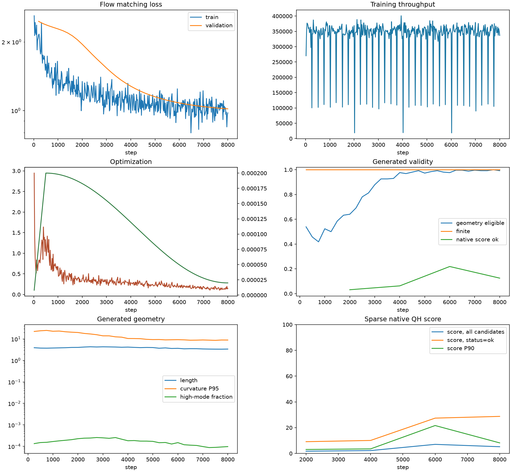

| step | 验证 loss | 几何合格率 | 曲率 P95 中位数 | score `ok` 率 | 全体均分 | `ok` 均分 |
| ---: | ---: | ---: | ---: | ---: | ---: | ---: |
| 2,000 | 1.953 | 64.1% | 19.99 | 3.1% | 1.72 | 9.11 |
| 4,000 | 1.278 | 97.7% | 10.50 | 6.3% | 2.21 | 10.07 |
| 6,000 | 1.080 | 97.7% | 9.26 | 21.9% | 7.04 | 27.40 |
| 8,000 | 1.017 | 99.2% | 8.91 | 12.5% | 5.20 | 28.74 |

这里每个 score 点只有 32 个样本，`ok` 率的波动很大，不能据此断言 step 6000 一定优于
step 8000。更可靠的信息是：验证 loss 持续下降，几何质量已稳定，真实 score 从几乎全失败
发展到稳定产生 `status=ok` 候选。第 6 节的 2,048 样本评测给出了最终比例。

训练产物位于新服务器：

- 目录：`~/local_surface_evaluator/runs/qh_flow_base_28447/`
- 最新 checkpoint：`checkpoint_latest.pt`，463 MiB
- 每 1,000 step checkpoint：`checkpoints/`
- 指标：`metrics.jsonl`
- 自动更新曲线：`monitor.png`
- 稀疏 score 原始结果：`score_monitor/`

## 6. 第一代独立评测

### 6.1 32 样本 smoke

作业 `28460` 使用独立随机种子，最终 EMA checkpoint 和 8 步 Heun：

| 指标 | 结果 |
| --- | ---: |
| 样本数 | 32 |
| 几何合格率 | 100% |
| `status=ok` | 14/32 = 43.75% |
| 全体 score 均值 | 19.11 |
| `ok` score 中位数 | 47.00 |
| `ok` score 最大值 | 57.24 |
| `ok` 平均 $|\iota|$ | 1.01 |
| `ok` 磁面逆纵横比中位数 | 0.0223 |
| 四卡 score 墙钟 | 约 31 s |
| 作业总墙钟 | 47 s |

这已经满足“第一代能生成一定比例完整可评分 QH”的定性目标，但还没有样本达到暂定的
`score >= 66.8` 好样本门槛。

### 6.2 2,048 样本正式统计

作业 `28461` 使用独立随机种子、最终 EMA checkpoint 和 32 步 Heun。四张卡在作业开始时
均为 `2 MiB / 0%`，因此计时没有混入其他任务的 GPU 负载。

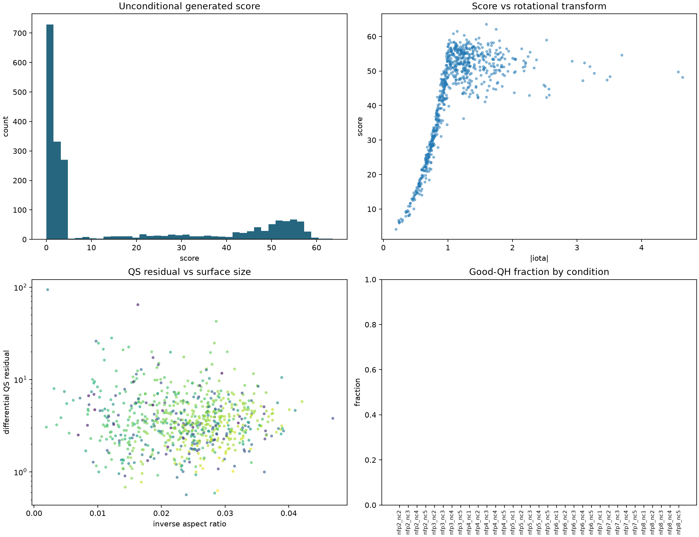

图中右下角没有柱子不是绘图失败，而是所有条件组的 good-QH 数量均为 0。

| 指标 | 生成样本结果 |
| --- | ---: |
| 总样本数 | 2,048 |
| 几何合格 | 2,034（99.32%） |
| `status=ok` | 718（35.06%） |
| 全体 score：均值 / 中位数 / P90 / 最大值 | 16.36 / 3.08 / 53.12 / 63.61 |
| `ok` score：均值 / 中位数 / P90 / 最大值 | 43.05 / 48.34 / 56.28 / 63.61 |
| `ok` 的 $|\iota|$：中位数 / P90 | 1.073 / 1.708 |
| `ok` 的 QS global error：中位数 / P90 | 3.370 / 7.413 |
| `ok` 的逆纵横比：中位数 / P90 | 0.02427 / 0.03295 |
| good-QH 数量 | 0 |

这里的 good-QH 定义为：

$$
S\ge 66.8,\qquad |\iota|\ge 1,\qquad
\frac{a}{R}\ge 0.02,\qquad f_{\mathrm{valid}}\ge 0.95.
$$

失败状态以 `no_axis` 为主，而不是廉价几何门：

| 状态 | 数量 | 占比 |
| --- | ---: | ---: |
| `ok` | 718 | 35.06% |
| `no_axis` | 715 | 34.91% |
| `no_surface` | 322 | 15.72% |
| `drift_rejected` | 257 | 12.55% |
| `flux_rejected` | 22 | 1.07% |
| `geometry_rejected` | 14 | 0.68% |

按条件组看，$N_{\mathrm{FP}}=4,5$ 的主流组通常有 38%--47% 的成功率，
$N_{\mathrm{FP}}=2$ 只有约 6%--14%。小样本条件组波动很大，当前不应把这些组间差异解释为
模型已经学到了可靠的条件规律。

### 6.3 与 QUASR 基准的交叉验证

此前用同一版原生 score 对 1,000 个 QUASR 验证样本评测，其中包含 500 个 QH；357 个 QH
完整成功。对这 357 个成功 QH 的 v2 score 统计如下：

| 指标 | Flow 生成 `ok` | QUASR QH `ok` |
| --- | ---: | ---: |
| 数量 | 718 / 2,048 | 357 / 500 |
| 成功率 | 35.06% | 71.40% |
| score P10 | 21.12 | 56.86 |
| score 中位数 | 48.34 | 66.83 |
| score P90 | 56.28 | 70.41 |
| score 最大值 | 63.61 | 74.01 |
| $|\iota|$ 中位数 | 1.073 | 1.346 |

生成结果不是只差一个门槛附近的小误差：它的最高分仍低于参考成功 QH 的中位数，成功率
也约减半。进一步看物理量：

- 生成成功样本的逆纵横比中位数为 0.02427，参考全集成功样本为 0.02151；磁面并不偏小。
- 生成成功样本的 QS global error 中位数为 3.370，参考全集成功样本为 0.1369，相差约
  25 倍。这是 score 明显偏低的主要直接原因。
- `no_axis` 占全部生成样本 34.9%，而参考 QH 只有 10.4%；线圈之间产生正确磁轴和磁面的
  联合关系也没有学好。

所以第一代模型已经学到“单根线圈大致长什么样”，但没有充分学到“多根线圈如何协同产生
QH 磁场”。廉价几何合格率 99.3% 与物理成功率 35.1% 的巨大差距也直接支持这个判断。

### 6.4 正式评测耗时

| 阶段 | 四卡墙钟 | 均摊到每个候选 |
| --- | ---: | ---: |
| 生成 2,048 个样本 | 约 7.8 s | 约 3.8 ms |
| 原生物理 score | 约 2,089 s | 约 1.02 s |
| 汇总与绘图 | 1.87 s | 小于 1 ms |
| 评测进程总计 | 2,100.98 s | 1.026 s |
| Slurm 作业总计 | 2,111 s | 1.031 s |

生成只占总耗时约 0.4%，score 是明确瓶颈。四个 rank 分别评了 511、506、510、507 个候选，
score 墙钟为 2,020--2,089 秒，负载较均衡且没有长尾挂起。

新服务器完整结果位于：

- `~/local_surface_evaluator/runs/qh_flow_eval_28461/summary.json`
- `~/local_surface_evaluator/runs/qh_flow_eval_28461/evaluation_summary.png`
- `~/local_surface_evaluator/runs/qh_flow_eval_28461/rank_*.jsonl`
- `~/local_surface_evaluator/runs/qh_flow_eval_28461/top_cases/`

## 7. 开发中发现并修复的问题

### 7.1 `torchrun` 不在计算节点 PATH

首个 pilot `28417` 在确认四卡空闲后立即退出，错误为 `torchrun: command not found`。
入口统一改为：

`python -m torch.distributed.run`

这不改变 DDP 语义，并消除了对用户脚本 PATH 的依赖。

### 7.2 训练内多进程 score 与 DDP 冲突

第一次正式训练 `28426` 在 step 2000 让 rank 0 创建四个额外 CUDA 评分子进程，而另外三个
rank 停在 NCCL barrier，形成等待。该作业被主动取消，没有留下进程。

修复后由四个现有 DDP rank 各自在本地 GPU 上评分索引 `rank::4` 的候选，再由 rank 0 汇总。
8 样本 smoke `28446` 在 7.67 秒内完成，正式训练的四次监控均正常退出。

### 7.3 原生库动态链接路径

PyTorch wheel 自带 CUDA 13 运行库，但原生 score 的 `libstellarator_gpu.so` 初次加载时找不到
`libcusolver.so.12`。Slurm 入口现在由 `torch.__file__` 动态推导
`nvidia/cu13/lib`，验证文件存在后加入 `LD_LIBRARY_PATH`，不硬编码 Python 小版本。

### 7.4 NCCL 设备绑定

`init_process_group` 和 barrier 现在都显式绑定 `LOCAL_RANK` 对应设备，消除了 PyTorch
“猜测 barrier device”的警告，也避免多节点扩展时潜在的 rank/device 错配。

## 8. 充分训练后还剩什么问题

第 10 节的收敛复核证明，8k 模型确实欠训练；因此上一版报告过早把无序集合的 flow
coupling 列为首要原因。45k 模型重评后，当前可以更准确地分解问题：

1. **欠训练解释了显著部分。** 成功率增加 8.59 个百分点，QS residual 中位数降低 37.4%，
   说明平均 flow matching 精度会真实转化为磁轴、磁面和 QH 质量。
2. **但欠训练不是全部原因。** 45k 模型已经在 $10^{-4}$ 下进入验证平台，并在
   $3\times10^{-5}$、$10^{-5}$ 两档独立精调中稳定过拟合；继续训练同一 30M 模型不再是
   合理解释。
3. **高质量尾部几乎没有改善。** `ok` score 中位数提高了 4.42，但最大值从 63.61 变为
   63.21，good-QH 仍为 0。平均误差变好，并没有学回 QUASR 的高精度尾部。
4. **几何门仍不是物理质量代理。** 45k 几何合格率为 99.46%，但物理成功率只有 43.65%；
   单根曲线平滑并不保证多线圈协同产生正确磁轴、磁面和 QH。

剩余原因尚未被单一实验锁定。无序 token 的随机直线 coupling 仍是合理假设：一个物理集合有
$n_c!$ 个等价排列，当前噪声和目标按索引配对，可能模糊跨线圈精细相关性。其他同样需要
对照的因素包括 30M 模型容量、每次只训练一个 $(N_{\mathrm{FP}},n_c)$ 组，以及平均 MSE 对
高 QH score 所需稀有高精度模式不够敏感。当前证据不能把其中任一个写成已确认根因。

## 9. 下一步建议

当前不应直接启动只使用生成 elite 的拒绝采样。建议按以下顺序推进：

1. **做集合 coupling 对照。** 对每个噪声集合与目标线圈集合做最小代价匹配，或采用
   minibatch OT flow matching；同时用确定性线圈规范排序做低成本基线。只有相同参数量和
   收敛标准下的验证 loss、物理 score 都改善，才能确认 coupling 是根因。
2. **做容量与采样对照。** 至少训练一档更大模型，并检查按条件组平衡采样是否改善低频组。
   每个模型都沿用本轮“恒定学习率到平台、EMA 提升后低学习率精调”的收敛流程。
3. **恢复基础分布后再加 reward。** 当生成 `ok` 率和 score 分位数接近 held-out QUASR QH
   后，再加入同一点集上的 $e_{\mathrm{QH}}$ 相对 $e_{\mathrm{QA}},e_{\mathrm{QP}}$ margin，冻结
   score 版本，然后做按 $(N_{\mathrm{FP}},n_c)$ 分组的拒绝采样。
4. **避免低质自举。** 若改进后的生成分布仍达不到参考中位数，第二代训练应把原始高质量
   QUASR QH 与生成 top 样本混合，而不是只保留当前生成 top；否则 replay 会把分布向更差的
   score 移动。

最终判断是：第一代工程链路和速度目标已验证，欠训练问题已修正，但“第一代生成结果中包含
一定比例较好 QH”这一物理验收标准仍未通过。下一步应通过受控实验定位表示、容量和训练目标
中的剩余限制，而不是继续堆同一模型的训练步数或立即扩大拒绝采样规模。

## 10. 收敛复核与重新评测

本节是在首轮报告完成后追加的收敛实验。它回答两个问题：8k 是否欠训练，以及充分训练后
第一代生成质量究竟达到什么水平。

### 10.1 为什么 8k 不能视为收敛

首轮余弦调度在 8k 已把学习率从峰值 $2\times10^{-4}$ 降到 $2\times10^{-5}$，但最后三个
验证点仍为：

| step | 学习率 | 验证 loss |
| ---: | ---: | ---: |
| 7,600 | $2.13\times10^{-5}$ | 1.02517 |
| 7,800 | $2.03\times10^{-5}$ | 1.02110 |
| 8,000 | $2.00\times10^{-5}$ | 1.01744 |

末段仍有清楚的下降斜率，学习率却已经接近调度下限，因此“8k 基本收敛”的旧判断不成立。
训练器随后增加了完整 checkpoint resume、恒定学习率、连续全局 step、EMA 提升精调和优化器
重置支持。

### 10.2 放开训练后的收敛过程

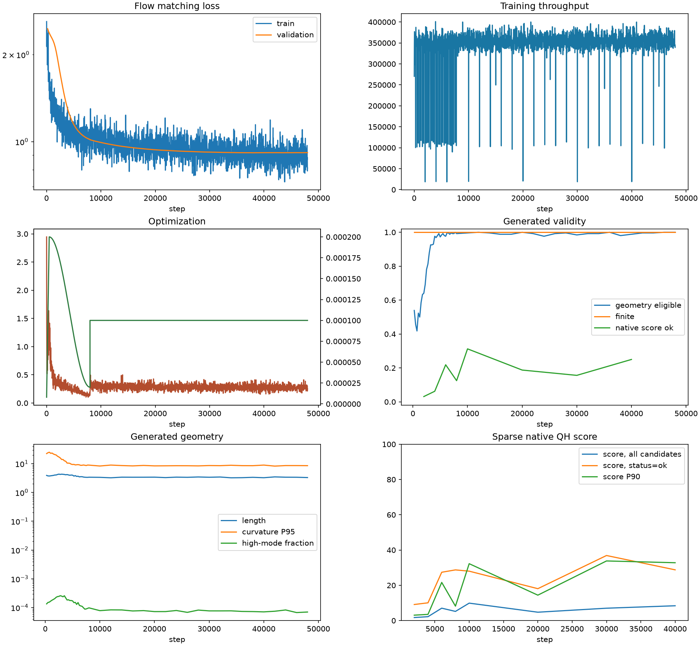

采用以下分阶段策略，而不是简单把首轮步数翻倍：

| 阶段 | 作业 | 起点与终点 | 学习率 | 验证结果 | 判断 |
| --- | --- | ---: | ---: | --- | --- |
| 首轮 | `28447` | 0→8k | cosine，峰值 $2\times10^{-4}$ | 1.01744，仍下降 | 明显欠训练 |
| 长程 | `28494` | 8k→46.5k | 恒定 $10^{-4}$ | 最低 0.91583@38k；45k 为 0.91621 | 约 38k 后平台 |
| 精调 A | `28534` | 45k→52k | 恒定 $3\times10^{-5}$ | 0.91621→0.92143 | 持续过拟合 |
| 精调 B | `28539` | 45k→52k | 恒定 $10^{-5}$ | 0.91621→0.91944 | 持续过拟合 |

长程阶段将验证 loss 相对 8k 降低约 10%。选中的 45k checkpoint 总更新数是首轮的 5.6 倍；
实验实际还额外执行了两条各 7k step 的独立精调轨迹。停止不是因为预算或预设 cosine 终点，
而是两档更低学习率都从同一最佳 EMA 出发并产生连续验证退化。

这两条轨迹也满足严格的训练/验证分叉：精调 A 的前后 100 个训练日志均值从 0.8951 降到
0.8912，验证却从 0.9162 升到 0.9214；精调 B 的训练均值从 0.8934 降到 0.8864，验证却升到
0.9194。因此这里的“过拟合”不是把小幅平台波动误判为退化。

这里有一个重要实现细节：直接恢复 checkpoint 时，训练权重是原始 model，而验证使用 EMA。
首次低学习率尝试发现 EMA 会被更噪的原始权重拉差。正式精调因此把 45k EMA 提升为新的
训练权重，同时重置 AdamW；即使这样，$3\times10^{-5}$ 和 $10^{-5}$ 仍分别过拟合。因此
当前停止点具有实质性的收敛证据。

最终使用的 checkpoint 为：

`~/local_surface_evaluator/runs/qh_flow_base_28494/checkpoints/step_00045000.pt`

### 10.3 45k 的 2,048 样本重新评测

作业 `28546` 使用与 8k 基线相同的随机种子、条件组分布、32 步 Heun 和原生 score。启动前
四张卡连续三次满足显存 2 MiB 且没有 compute process。该节点的 `utilization.gpu` 字段在
无进程时仍可能固定显示 100%，连续 40 秒诊断确认这是驱动计数异常，因此空闲门采用显存和
进程表，而不是该失真字段。

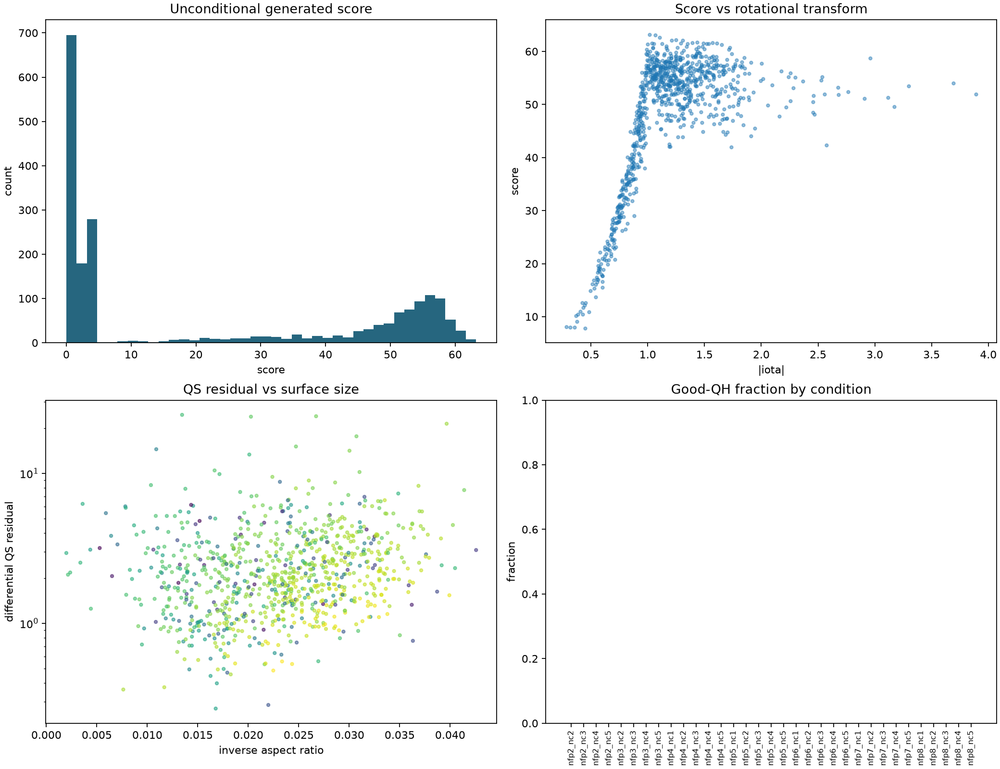

| 指标 | 8k 基线 | 45k 收敛模型 | 变化 |
| --- | ---: | ---: | ---: |
| 几何合格率 | 99.32% | 99.46% | +0.15 pp |
| `status=ok` | 35.06% | 43.65% | +8.59 pp |
| 全体 score 均值 | 16.36 | 22.09 | +35.0% |
| 全体 score P90 | 53.12 | 56.65 | +3.53 |
| `ok` score 均值 | 43.05 | 48.13 | +5.08 |
| `ok` score 中位数 | 48.34 | 52.77 | +4.42 |
| `ok` score P90 | 56.28 | 58.39 | +2.12 |
| `ok` score 最大值 | 63.61 | 63.21 | -0.40 |
| $|\iota|$ 中位数 | 1.073 | 1.155 | +0.082 |
| QS global error 中位数 | 3.370 | 2.108 | -37.4% |
| QS global error P90 | 7.413 | 4.678 | -36.9% |
| 逆纵横比中位数 | 0.02427 | 0.02345 | -3.4% |
| good-QH | 0 | 0 | 无变化 |

状态计数也整体改善：`no_surface` 从 322 降到 197，`no_axis` 从 715 降到 684，
`drift_rejected` 从 257 降到 232。物理成功数从 718 增加到 894。这证明 loss 改善不是只发生
在无关 Fourier 系数上，而是真实提高了磁轴、磁面和 QS 质量。

### 10.4 仍然没有达到 QUASR 水平

训练充分后，剩余差距仍然明确：

- QUASR 参考 QH 的完整成功率为 71.4%，45k 生成结果为 43.65%。
- QUASR 成功 QH 的 score 中位数为 66.83，45k 为 52.77；生成最大值 63.21 仍低于参考
  中位数。
- QUASR 成功 QH 的 $|\iota|$ 中位数为 1.346，45k 为 1.155。
- 参考集中全部成功样本的 QS residual 中位数为 0.1369，45k 为 2.108，仍相差约 15 倍；
  但比 8k 时约 25 倍的差距明显缩小。
- 磁面逆纵横比仍略大于参考值，因此剩余差距不能归因于只生成了过小磁面。

尤其值得注意的是，分布中段明显改善，但最大 score 没有提高。这说明当前平均 MSE 训练能把
普通样本推向更合理的物理区域，却仍没有复现高 QH score 所需的高精度联合尾部。

### 10.5 耗时与产物

| 项目 | 墙钟 |
| --- | ---: |
| 初始 0→8k 训练 | 16 分 54 秒 |
| $10^{-4}$ 长程阶段，运行至 46.5k | 1 小时 05 分 36 秒 |
| $3\times10^{-5}$ 过拟合确认 | 12 分 30 秒 |
| $10^{-5}$ 过拟合确认 | 11 分 49 秒 |
| 45k 模型 2,048 样本正式评测 | 36 分 41 秒 |

45k 评测中生成约 7.5 秒，物理 score 最慢 rank 为 2,175 秒，评测进程总计 2,187 秒。更高的
成功率意味着更多样本会走完整物理链路，因此它比 8k 评测略慢，但仍无失控长尾。

新服务器结果位于：

- `~/local_surface_evaluator/runs/qh_flow_base_28494/`
- `~/local_surface_evaluator/runs/qh_flow_eval_28546/summary.json`
- `~/local_surface_evaluator/runs/qh_flow_eval_28546/evaluation_summary.png`
- `~/local_surface_evaluator/runs/qh_flow_eval_28546/top_cases/`

收敛复核后的最终结论是：**8k 首代确实欠训练，而且欠训练解释了很大一部分中位质量差距；
但 45k 当前模型已经出现可重复的验证过拟合，高质量尾部仍未出现。继续训练同一个模型不是
下一步，下一步应比较集合 coupling、模型容量和更关注高精度尾部的训练目标。**

## 11. 评测批次最优样本的完整链路复核

此前作业 `28546` 只运行了 GPU 原生体 score，并导出了按总分排序的 top-case；没有对生成
样本运行旧的磁面、Simsopt Boozer LS/Newton、Poincare 和 DESC 全面验收。本节补做这一步。

### 11.1 样本选择与复核标准

从同一批 2,048 个生成样本中选两个不同候选：

| 选择标准 | candidate | $N_{\mathrm{FP}}$ | 基线圈数 | 原生 score | 原生体 QS residual | 原生 $\iota$ | 原生面逆纵横比 |
| --- | ---: | ---: | ---: | ---: | ---: | ---: | ---: |
| 总 score 最高 | 1439 | 4 | 2 | 63.2127 | 0.483207 | 1.01494 | 0.022477 |
| 体 QS residual 最低 | 567 | 3 | 4 | 40.0485 | 0.269510 | 0.821860 | 0.016772 |

两个候选都使用完全相同的离线流程：分别令 $a=0.05,0.08,0.12,0.16,0.20$，重新求磁轴和
$\psi$，扫描 16 个 $\psi$ level，对通过快速漂移筛选的面运行 Simsopt Boozer LS/Newton，
再按体积选择最大的收敛面。只有存在这样的边界时才运行 Poincare 和 DESC。DESC 使用该面
作为固定边界，零压强、零环向电流，$L=M=N=8$，最多 50 次迭代。

这里采用三层相互独立的判据：

1. Boozer LS/Newton 的代数残差只说明离散方程被求解；
2. Poincare 截面检查真空场线是否形成与候选边界一致的嵌套面；
3. DESC 必须同时满足坐标 nested、归一化 force residual 有限且显著下降。

因此 DESC 返回 `optimizer_success=True` 或 Boozer 残差很小，都不能单独算物理验收通过。

### 11.2 总 score 最高样本：形式 Boozer 面存在，独立物理复核失败

旧路径在 4 个 $a$ 值上返回了至少一个形式收敛的 Boozer 面；$a=0.20$ 没有返回有效面：

| $a$ | 最大接受 $\psi$ level | 体积 $\mathrm{m}^3$ | $\iota$ | 单面 QH error |
| ---: | ---: | ---: | ---: | ---: |
| 0.05 | 0.008 | $5.28999\times10^{-4}$ | 1.14244 | $9.20705\times10^{-4}$ |
| 0.08 | 0.12 | 0.0205045 | 0.945406 | $3.46157\times10^{-4}$ |
| 0.12 | 0.004 | 0.00151942 | 1.13918 | $1.62276\times10^{-4}$ |
| 0.16 | 0.002 | 0.00134385 | 1.13918 | $1.61457\times10^{-4}$ |
| 0.20 | 无 | 无 | 无 | 无 |

这里需要区分“$\psi$ 的局部微分误差”和“场线的长程约束误差”。它们在本例中相差很大：

| 指标 | 原生 score 路径 | 旧路径 $a=0.08$ |
| --- | ---: | ---: |
| $\psi$ train RMS | $3.6882\times10^{-4}$ | $4.8028\times10^{-4}$ |
| $|\mathbf B\cdot\nabla\psi|/(|\mathbf B||\nabla\psi|)$ mean | $1.3855\times10^{-5}$ | $2.8764\times10^{-5}$ |
| 同一角度误差 P95 | $6.0950\times10^{-5}$ | $1.2185\times10^{-4}$ |
| 同一角度误差 max | 未导出 | $5.3519\times10^{-4}$ |
| 选中面的单周期相对位移 P95 | 0.6529% | 0.9306% |
| 选中面的单周期绝对位移 P95 | 未导出 | $2.7429\times10^{-4}\ \mathrm m$ |

所以 $\psi$ 的随机点局部夹角并不大，量级是 $10^{-5}$--$10^{-4}$；真正放行候选的是过弱的
时间尺度门控。旧路径只要求单周期 P95 同时小于 $5\times10^{-4}\ \mathrm m$ 和平均半径的
30%，本例分别为 $2.74\times10^{-4}\ \mathrm m$ 和 0.93%，因此通过。原生体 score 使用更严的
5% 相对门，但 0.653% 仍会通过。两条路径都没有要求多周期内保持有界，也没有用最大值或
连续坏区约束剩余 5% 的点。

该候选的一周期几何角推进标准差为 0.464，但当前只记录、不参与门控。这个量不是严格的
Boozer $\iota$ 误差，不能单独作硬判据；不过它与 $\iota\simeq1$ 附近的强非均匀/共振敏感
映射一起，已经足以提示单周期法向位移不能代表长程拓扑。

独立 $a$ 扫描出现明显分支跳变，最终按体积选中 $a=0.08$、$\psi=0.12$。该面的 Boozer
初始残差为 165.19，LS 后为 $1.04\times10^{-13}$，Newton 在初值处即接受。形式解参数为

$$
V=0.0205045\ \mathrm{m}^3,\qquad
\iota=0.945406,\qquad
G=-6.86777.
$$

但三种单面误差分别为

$$
e_{\mathrm{QA}}=1.66445\times10^{-4},\qquad
e_{\mathrm{QH}}=3.46157\times10^{-4},\qquad
e_{\mathrm{QP}}=1.88557\times10^{-4}.
$$

目标 QH 反而是三者中最差的，$|B|$ 热力图也主要呈近水平条带，而非清晰的 QH 斜向条带。

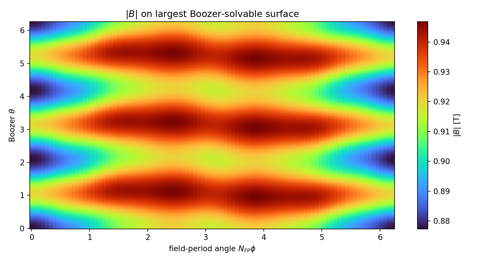

[打开交互式 $|B|$ 图](assets/qh_flow_full_eval_28546/highest_score/assets/boozer_b.html)

首次 Poincare 图还发现一个诊断脚本 bug：函数注释声称从面内播种，但默认
`edge_fraction=1.1`，使最外一条场线从候选面外 10% 出发。现已改为 0.95，并为每个初始
半径使用固定渐变色后重画。修正会减少最外侧离群点，但不改变结论：深色近轴轨迹相对稳定，
中外层绿色/黄色轨迹仍越过黑色边界，无法形成填满目标体积的嵌套环族。

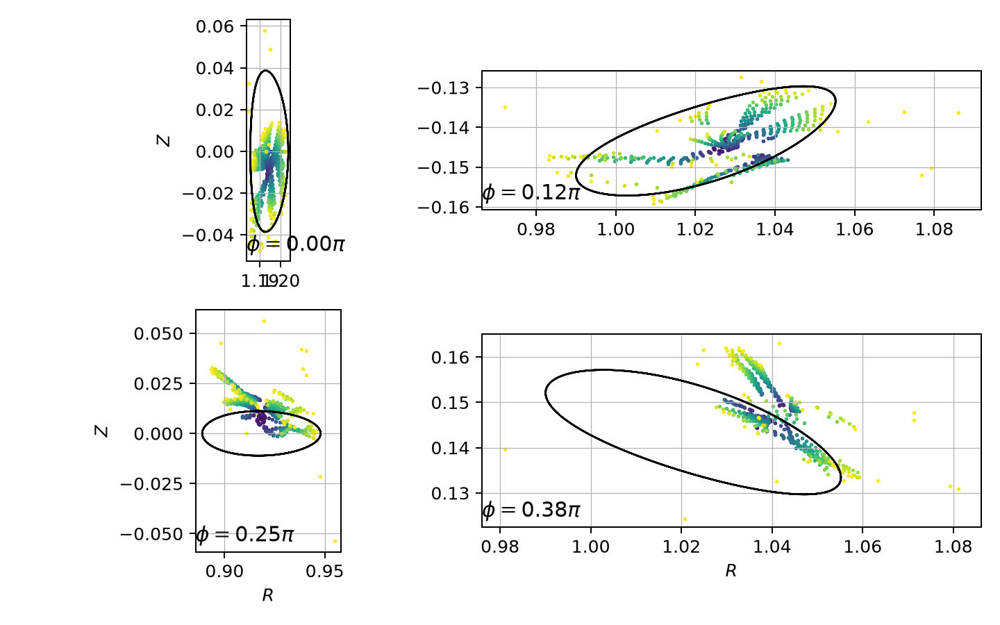

每条线的 145 个 hit 是 4 个环向截面的总数，对应约 36 个磁场周期，而不是 145 个周期。
0.93% 的单周期 P95 即使按不相关误差估算也会累积到约
$\sqrt{36}\times0.93\%=5.6\%$；若含系统漂移则可达约 $36\times0.93\%=33\%$。共振附近的
岛链或混沌层还会非线性放大这种误差，因此图上的厘米级展宽与单周期亚毫米误差并不矛盾。

另对保存的 Boozer 面做了离配点验证。原求解使用阶数 6 和 $13\times13$ 配点；同一残差在
错位和密网格上的结果为：

| 网格 | 配点偏移 | Boozer residual RMS/点 | 法向场正弦 P95 |
| --- | ---: | ---: | ---: |
| $13^2$ | 0 | $7.96\times10^{-15}$ | $1.93\times10^{-15}$ |
| $13^2$ | 0.371 | $7.05\times10^{-3}$ | $1.56\times10^{-3}$ |
| $49^2$ | 0.371 | $5.42\times10^{-3}$ | $1.32\times10^{-3}$ |
| $97^2$ | 0.371 | $5.42\times10^{-3}$ | $1.31\times10^{-3}$ |

因此 $10^{-13}$ 只描述求解配点，不能当作全表面误差。作为对照，先前 Poincare 明确嵌套的
CEM 样本在 $97^2$ 网格上的 Boozer residual RMS/点为 $1.24\times10^{-3}$，约为本候选的
1/4.4。不过该好样本的法向场 P95 为 $2.65\times10^{-3}$，反而略大；这说明单个密网格法向
统计也不能替代多周期拓扑检查。离网格残差可排除明显配点假精度，Poincare 才检查内部是否
存在可用的嵌套面族。

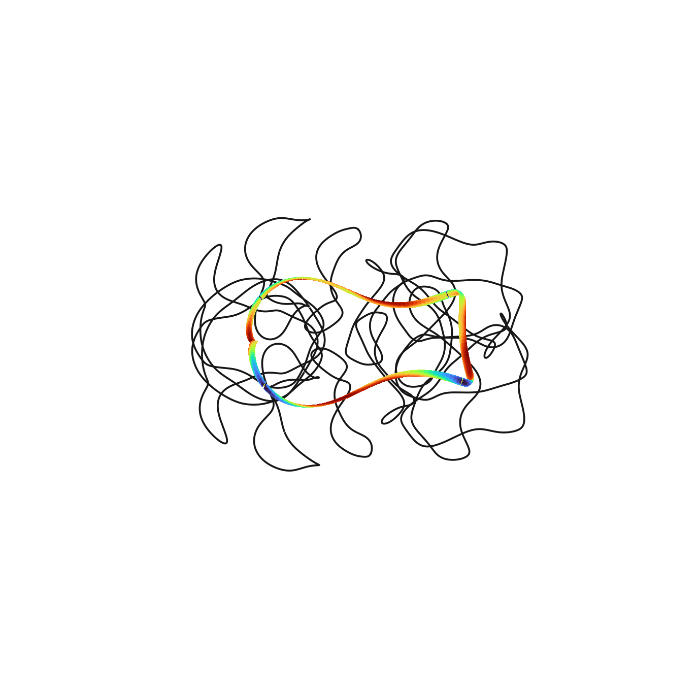

[打开可旋转的三维线圈与形式面](assets/qh_flow_full_eval_28546/highest_score/assets/coils_surface.html)

因此这里更准确的结论是：**$\psi$ 的局部微分拟合本身达到 $10^{-5}$--$10^{-4}$ 角误差，
但当前单周期门过松；随后 Boozer 的极低 residual 又只在配点上成立。两者都没有验证多周期
内部拓扑，所以不应仅凭这两个结果把候选送入 DESC。**

### 11.3 DESC：接口完成，但物理解发散

DESC 初始坐标被判定为 nested，但求解后变为非 nested。数值如下：

| DESC 指标 | 初态 | 末态 |
| --- | ---: | ---: |
| nested | 是 | **否** |
| 归一化 force mean | $1.022\times10^3$ | $1.210\times10^4$ |
| 归一化 force P95 | $9.396\times10^3$ | $6.761\times10^{-3}$ |
| 归一化 force max | $2.670\times10^4$ | $6.420\times10^7$ |
| 体平均原始 force | $2.610\times10^{13}$ | $-1.173\times10^{19}$ |

末态 P95 很小但 mean 和 max 爆炸，说明误差集中成少数灾难性离群点，而不是整体收敛。优化器
在 12 次迭代后因 `xtol` 返回成功，但 cost 仍为 $2.035\times10^{13}$，optimality 为
$1.339\times10^5$；$\iota(\rho)$ 也出现 $10^4$ 量级尖峰。该结果必须判为 DESC 失败。

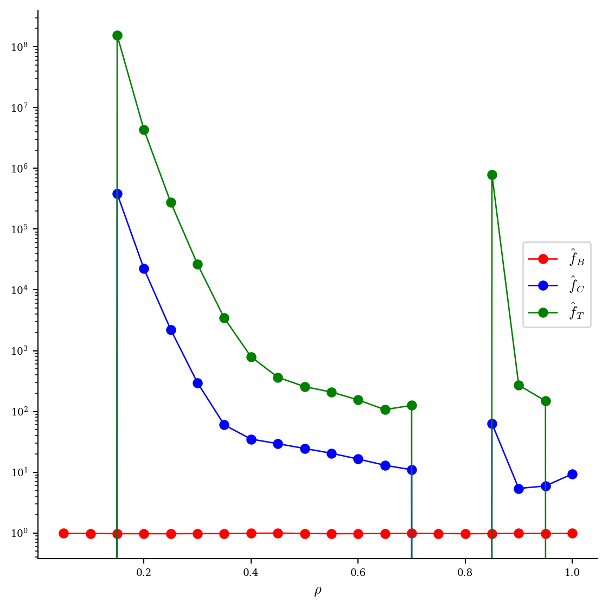

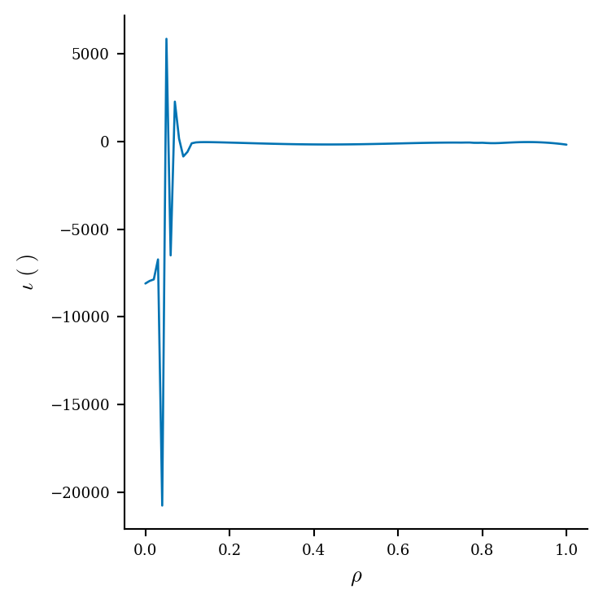

### 11.4 体 QS residual 最低样本：没有可供 DESC 使用的面

candidate 567 的原生体 QS residual 虽是整个 2,048 样本批次最低值，但完整旧路径在全部
5 个 $a$ 值上都没有得到 Boozer LS/Newton 收敛面：

| $a$ | 通过快速漂移筛选的 level 数 | Boozer 结果 |
| ---: | ---: | --- |
| 0.05 | 11/16 | 全部未收敛 |
| 0.08 | 9/16 | 全部未收敛 |
| 0.12 | 2/16 | 全部未收敛 |
| 0.16 | 0/16 | 未进入 Boozer |
| 0.20 | 0/16 | 未进入 Boozer |

这不是作业环境或超时失败：磁轴、$\psi$、漂移筛选和所有预定 Boozer 尝试都正常结束；程序
按设计以 `no_boozer_surface` 停止。由于没有合法固定边界，继续绘制单面 $|B|$ 或调用 DESC
只会制造无物理含义的结果，所以链路在此正确终止。

### 11.5 对当前首代模型和 score 的新增结论

这次复核比“good-QH 数量为 0”提供了更直接的证据：

1. **总分最高样本是假阳性。** 它能通过原生 score，也能让旧 Boozer 离散求解器返回极低
   residual，但 Poincare 和 DESC 都拒绝其全局物理有效性。
2. **单独按微分 QS residual 排序更不可靠。** 批次中该项最好的样本甚至不存在旧路径可解面。
3. **原生体指标仍适合快速筛选，不足以替代离线验收。** 当前批次最大 score 仅 63.21，低于
   QUASR 成功 QH 中位数 66.83 和当前 good-QH 阈值 66.8；本次失败与批量统计一致。
4. **下一版 reward 必须强化跨指标一致性。** 至少应让 QS 项依赖足够高的有效体积分数和稳定
   surface branch，并加入廉价的场线闭合/漂移一致性门，避免“局部微分误差小但无全局面”以及
   “离散 Boozer 残差小但实际轨迹不嵌套”两类作弊方式。

本节不是说原生微分 QS 定义本身错误，而是确认其适用边界：它在已有良好嵌套坐标的前提下
衡量局部 QH 偏差；当坐标或磁面存在性只由近似体拟合提供时，较小数值不构成全局存在性证明。

### 11.6 耗时与可复现产物

| 作业 | 结果 | 脚本内耗时 | Slurm 墙钟 |
| --- | --- | ---: | ---: |
| `28574`，总分最高 | 完成全部绘图和 DESC；物理失败 | 242.71 s | 4 分 47 秒 |
| `28575`，QS 最好 | 5 个尺度均无 Boozer 面 | 63.43 s | 1 分 08 秒 |

两个作业依次使用同一张空闲 RTX 5090，各占 16 个 CPU 核；第二个作业的非零退出码来自预期的
`no_boozer_surface`，不是基础设施错误。关键产物如下：

- [候选选择与原生指标](assets/qh_flow_full_eval_28546/selection_manifest.json)
- [总分最高候选输入](assets/qh_flow_full_eval_28546/cases/highest_score_id_001439.json)
- [QS 最好候选输入](assets/qh_flow_full_eval_28546/cases/best_qs_id_000567.json)
- [总分最高候选完整汇总](assets/qh_flow_full_eval_28546/highest_score/full_summary.json)
- [总分最高候选离网格 Boozer 复核](assets/qh_flow_full_eval_28546/highest_score/boozer_offgrid_validation.json)
- [已知嵌套 CEM 样本的离网格对照](assets/native_score_cem_validation/long_qh_cem/full_eval/boozer_offgrid_validation.json)
- [QS 最好候选失败汇总](assets/qh_flow_full_eval_28546/best_qs/full_summary.json)
- [DESC 原始汇总](assets/qh_flow_full_eval_28546/highest_score/desc/summary.json)
- [DESC 输入](assets/qh_flow_full_eval_28546/highest_score/desc/input.check)
- [DESC equilibrium，供失败复现](assets/qh_flow_full_eval_28546/highest_score/desc/equilibrium.h5)

远端完整目录为 `~/local_surface_evaluator/runs/qh_flow_full_eval_28546/`。本次最终验收结论是：
**此前没有做完整评估；现在已经补做。两个排序标准选出的最优候选都没有通过完整物理验收，
所以第一代 45k 模型仍未生成可确认的优质 QH 位形。**

## 12. 使用 score v3 重评同一批 2,048 个生成样本

本节记录 2026-07-29 的确定性重评。输入仍是作业 `28546` 保存的 2,048 个 flow 样本，
没有重新运行模型、重新采样噪声或改变线圈参数；唯一变化是把旧原生 score 替换为当前
ABI 8 / score v3。因此以下新旧差异可以直接归因于：

1. 16 个场周期的长期磁面漂移检查；
2. 同时计算 QH、QA、QP 微分残差；
3. 目标 QH 相对竞争 helicity 的门控。

### 12.1 结论先行

- **旧假阳性已经被明确压低。** candidate 1439 从 63.213 降到 9.725。
- **整批没有达到可接受 QH 水平的样本。** 新版最高分为 16.804，而 QUASR 成功 QH
  在 score v3 下的 P10 为 41.31；达到该 P10 的候选数为 0。
- **flow 仍比完全随机 CEM 更接近 QH 支持集。** 25 个候选的 QH 相对优势达到最低经验
  阈值 0.10，其中 20 个还同时满足 $|\iota|\ge1$ 和 $a/R\ge0.02$；但没有候选达到
  0.20，更没有达到经验好阈值 0.30。

所以回答“原 flow matching 样本里有没有 score 较好的”需要分两层：相对从零 CEM 的
最高 3.892，flow 的最高 16.804 确实更好；但相对 QUASR QH 分布，它仍然明显不合格，
当前批次中没有值得称为高质量 QH 的候选。

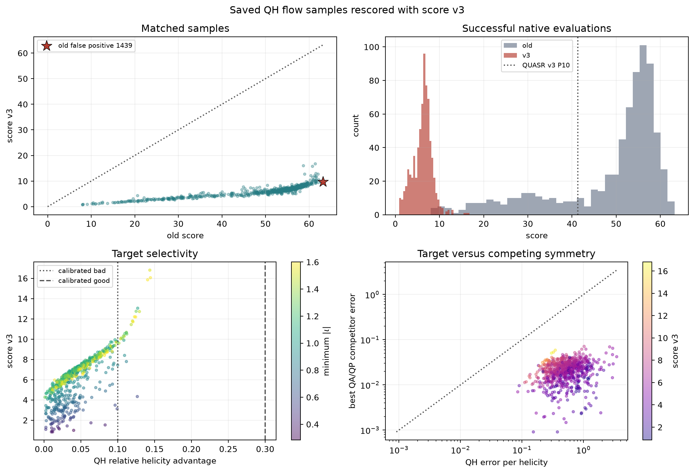

### 12.2 全批新旧分布

| 指标 | 旧 score | score v3 |
| --- | ---: | ---: |
| 全部 2,048 样本均值 | 22.093 | 2.309 |
| 全部样本中位数 | 3.512 | 0.350 |
| 全部样本 P90 | 56.648 | 7.251 |
| 全部样本最大值 | 63.213 | 16.804 |
| `status=ok` 数量 | 894 | 721 |
| `ok` 样本中位数 | 52.766 | 6.424 |
| `ok` 样本 P90 | 58.395 | 8.449 |
| `ok` 样本最大值 | 63.213 | 16.804 |

长期漂移检查将旧的 894 个 `ok` 样本中的 167 个改判为 `drift_rejected`，另有 6 个改判
为 `flux_rejected`。旧的 30 个 `flux_rejected` 中还有 24 个在更早的长期漂移阶段被拒绝。
这说明旧批次的高成功率中确实混入了一批“单周期看似稳定、长期不能维持磁面”的候选。

旧分数不低于 55 的候选共有 314 个。它们在 score v3 下的分布为：

| 分位 | 新分数 |
| --- | ---: |
| P10 | 6.320 |
| 中位数 | 7.521 |
| P90 | 9.357 |
| 最大值 | 16.804 |

因此压低不是只针对已经人工检查过的 candidate 1439，而是覆盖了整个旧高分尾部。

### 12.3 旧最高分假阳性

candidate 1439 在 score v3 下仍能通过 16 周期磁面检查，但目标 helicity 明确错误：

| 指标 | 数值 |
| --- | ---: |
| 旧 score | 63.2127 |
| score v3 | 9.7247 |
| helicity 门控前 score | 62.9920 |
| $|\iota|$ | 1.01494 |
| $a/R$ | 0.02248 |
| 单周期漂移 P95 | 0.00653 |
| 16 周期漂移 P95 | 0.00860 |
| 原始 QH 残差 | 0.48321 |
| 单位 helicity QH 残差 | 0.11719 |
| QA 残差 | 0.46348 |
| QP 残差 | 0.01168 |
| QH 相对优势 | 0.09063 |
| helicity 总门控因子 | 0.15438 |

这里使用的单位 helicity 归一化为

$$
e_{\mathrm{QH}}
=\frac{E_{\mathrm{QH}}}{\sqrt{1+N_{\mathrm{FP}}^2}}.
$$

对该 $N_{\mathrm{FP}}=4$ 样本，$e_{\mathrm{QH}}/E_{\mathrm{QP}}=10.03$。它不是因为
磁面长期漂移而被拒绝，而是因为同一体积内明显更接近 QP；新版 score 正确地把门控前
约 63 分压到 9.7 分。这与第 11 节旧路径 $|B|$ 热图和 Poincare/DESC 复核的结论一致。

### 12.4 score v3 最高样本

新版最高分变为 candidate 1191，条件为 $N_{\mathrm{FP}}=5$、3 个基线圈：

| 指标 | 数值 |
| --- | ---: |
| 旧 score | 61.4159 |
| score v3 | 16.8042 |
| helicity 门控前 score | 61.3999 |
| $|\iota|$ | 1.53498 |
| $a/R$ | 0.03992 |
| 体积 | $0.03369\,\mathrm{m}^3$ |
| 单周期漂移 P95 | $5.67\times10^{-5}$ |
| 16 周期漂移 P95 | $1.87\times10^{-4}$ |
| 原始 QH 残差 | 1.53577 |
| 单位 helicity QH 残差 | 0.30119 |
| QA 残差 | 1.35206 |
| QP 残差 | 0.05048 |
| QH 相对优势 | 0.14355 |
| helicity 总门控因子 | 0.27368 |

它的磁面大小、长期漂移和 $\iota$ 都明显可用，说明 flow 的确学到了比随机 CEM 更好的
几何和约束结构。但单位 QH 残差仍是 QP 残差的 5.97 倍，QH 相对优势低于 0.20，最终
分数也低于 QUASR P10 约 24.5 分。因此它最多是一个“有较好磁面但更偏 QP”的候选，
不是高质量 QH。没有必要对它再跑完整 DESC：目标 helicity 已在原生体诊断中明确失败。

### 12.5 计算与审计

四个 GPU worker 分别处理 512 个固定分片，其中 2,037 个几何合格样本进入原生评分。
各 rank 墙钟为 39.5--43.6 分钟；累计原生评分时间为 9,794.1 秒，即 2.72 GPU 小时。
按四卡批次墙钟计算，均摊约 1.28 秒/输入样本；按实际单卡调用计算，约 4.81 秒/几何合格
样本。

主作业 `28803` 的四个评分 worker 全部完成并写出 2,048 条结果，但在启动汇总 Python
时因计算节点继承的相对工作目录失效而退出码为 1。独立汇总作业 `28815` 改用绝对路径，
在 17 秒内成功完成；归一化展示修正后的最终汇总作业 `28817` 又在 11 秒内正常完成。
该包装问题没有重算或改变任何原生分数。

审计中还修复了一个纯展示错误：早期离线脚本把所有 QH 的单位 helicity 误差固定除以
$\sqrt2$，正确值应除以 $\sqrt{1+N_{\mathrm{FP}}^2}$。C++/CUDA score 从一开始就使用
实际的 $(M,N)=(1,N_{\mathrm{FP}})$，所以原生分数、helicity advantage 和本节所有排序
均未受影响；本节 JSON、图和第 31 节 CEM 审计图已经按正确归一化重新生成。

### 12.6 产物

- [完整新旧重评汇总](assets/qh_flow_score_v3_rescore_28803/summary.json)
- [新旧分数、目标选择性和竞争 helicity 对照图](assets/qh_flow_score_v3_rescore_28803/score_v3_comparison.png)
- [score v3 最高候选输入与诊断](assets/qh_flow_score_v3_rescore_28803/rank_001_id_001191.json)

## 13. 高质量 QH 线圈的几何噪声敏感性

本节记录 2026-07-29 的局部扰动实验。问题是：首代 flow 样本在 score v3 下普遍低分，
究竟是因为生成结果没有进入正确的宏观几何区域，还是因为它已经接近高质量 QH，
只是参数精度不足导致分数骤降？

### 13.1 结论先行

**低分不能归因于“任意微小误差都会摧毁 score”。** 对 3 个高质量 QUASR QH
样本中的 2 个，约 $0.6\,\mathrm{mm}$ 和 $1.7\,\mathrm{mm}$ 的线圈 RMS 几何扰动后，
score 中位数仍分别保留约 100% 和 98% 以上。第三个样本位于磁面门控的脆弱边界，
部分亚毫米扰动会直接变为 `drift_rejected`，但成功分支上的 QH 选择性没有突变。

当 RMS 位移增至约 $5.7\,\mathrm{mm}$ 时，三样本合并后的 score 中位保留率降到 51%；
约 $18.4\,\mathrm{mm}$ 时降到 14%。因此 score 的有效精度尺度确实在毫米到厘米之间，
但并非普遍要求纳米级或极端数值精度。

结合第 12 节中首代 flow 的最高分仅为 16.80、2,048 个样本没有一个达到 QUASR QH
的 P10 线 41.31，更合理的判断是：**首代生成分布尚未稳定进入高质量 QH 的几何邻域，
宏观或中尺度几何偏差是主要问题；毫米级精度和离散磁面门控是次要但真实的问题。**
这里的“宏观或中尺度”并不一定意味着肉眼可见的拓扑完全不同，也可能是多个 Fourier
模态共同形成的厘米级偏差。

### 13.2 实验定义

选择 3 个跨越不同 $N_{\mathrm{FP}}$、不同基线圈数的高分 QUASR QH 样本：

| QUASR ID | $N_{\mathrm{FP}}$ | 基线圈数 | score v3 | QH advantage | $|\iota|$ | $a/R$ |
| ---: | ---: | ---: | ---: | ---: | ---: | ---: |
| 1446077 | 3 | 4 | 72.185 | 0.329 | 1.770 | 0.01976 |
| 1826200 | 2 | 5 | 69.382 | 0.295 | 1.053 | 0.01271 |
| 2419096 | 4 | 3 | 62.974 | 0.273 | 1.869 | 0.02210 |

噪声尺度使用训练 checkpoint `step_00045000.pt` 中保存的 `CoilNormalizer` 标准差，
但只扰动每根线圈的 99 个几何 Fourier 系数，原始电流严格不变。对第 $i$ 根线圈、
第 $k$ 个几何系数，扰动为

$$
c'_{i,k}=c_{i,k}+\sigma s_k\epsilon_{i,k},
\qquad \epsilon_{i,k}\sim\mathcal N(0,1),
\qquad k=1,\ldots,99,
$$

其中 $s_k$ 是训练集该系数的标准差。扫描

$$
\sigma\in\{0.001,0.003,0.01,0.03,0.1,0.3,1.0\},
$$

每个尺度、每个源样本使用 12 个独立随机种子，共 252 个扰动样本；另加 3 个原始
基线和 3 个电流规范化对照，总计 258 次原生 C++/CUDA score v3 调用。

物理位移不是系数范数，而是每根线圈均匀取 128 个参数点后计算

$$
d_{\mathrm{RMS}}
=\left[
\frac{1}{N_cN_t}
\sum_{i=1}^{N_c}\sum_{j=1}^{N_t}
\left\|\mathbf r'_{i}(t_j)-\mathbf r_i(t_j)\right\|^2
\right]^{1/2}.
$$

因此下表中的毫米数可以直接解释为线圈中心线的实际几何误差。

### 13.3 合并结果

所有 score 统计都包含 `ok` 和被门控拒绝的样本；被拒绝样本保留其接近零的最终分数，
因为它们正是扰动导致物理链路失效的一部分，而不是应被删掉的异常值。

| $\sigma$ | 位移 RMS 中位数 | `ok` 比例 | score 中位数 | 相对原始 score 中位数 | 状态摘要 |
| ---: | ---: | ---: | ---: | ---: | --- |
| 0.001 | 0.580 mm | 86.1% | 69.51 | 0.999 | 31 ok，5 drift rejected |
| 0.003 | 1.744 mm | 83.3% | 68.09 | 0.983 | 30 ok，5 no axis，1 drift rejected |
| 0.01 | 5.743 mm | 72.2% | 36.31 | 0.514 | 26 ok，5 no axis，5 drift rejected |
| 0.03 | 18.401 mm | 66.7% | 9.49 | 0.135 | 24 ok，其余为 axis/flux/drift 拒绝 |
| 0.1 | 58.821 mm | 22.2% | 0.36 | 0.005 | 8 ok |
| 0.3 | 180.148 mm | 5.6% | 0.11 | 0.0016 | 2 ok |
| 1.0 | 586.399 mm | 0% | 0.09 | 0.0014 | 全部拒绝 |

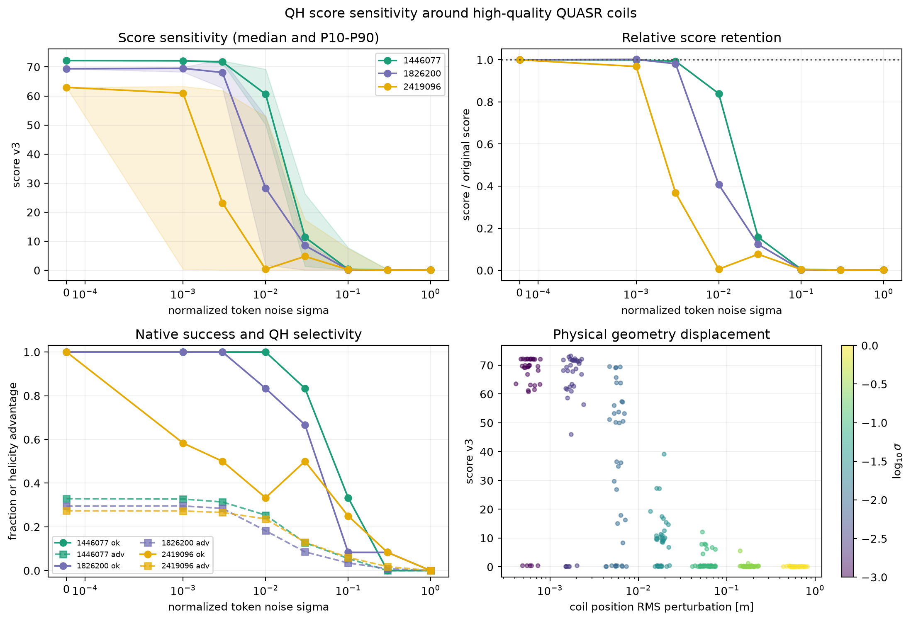

### 13.4 分样本差异与门控悬崖

三个样本的局部鲁棒性并不相同：

| ID | $\sigma=0.001$：ok / 保留率 | $\sigma=0.003$：ok / 保留率 | $\sigma=0.01$：ok / 保留率 |
| ---: | ---: | ---: | ---: |
| 1446077 | 12/12，0.999 | 12/12，0.994 | 12/12，0.840 |
| 1826200 | 12/12，1.002 | 12/12，0.981 | 10/12，0.408 |
| 2419096 | 7/12，0.968 | 6/12，0.368 | 4/12，0.006 |

ID 2419096 在 $\sigma=0.001$ 下失败的 5 个样本全部是 `drift_rejected`；通过样本的
QH advantage 中位数仍为 0.273，与原始值 0.273 基本一致。在 $\sigma=0.003$ 下，
5 个样本变为 `no_axis`，另 1 个为 `drift_rejected`。所以这里不是 QH residual 随小噪声
连续爆炸，而是磁轴或长程漂移分支跨过了离散门槛。

这说明 score v3 同时具有两类灵敏度：

1. 对稳健样本，QS 和几何分量会随毫米级误差连续退化；
2. 对靠近磁面稳定性边界的样本，亚毫米扰动也可能触发 `ok` 到拒绝态的分支跳变。

第二类现象不是应简单平滑掉的“数值噪声”，因为它对应可用磁面鲁棒性不足；但后续训练
不应只奖励刚好跨过门槛的高分点，还应奖励高分邻域的成功率或门控裕量。

### 13.5 额外发现：电流规范化与 helicity 约定不一致

第一轮实验曾直接调用训练用 `CoilNormalizer.transform/inverse` 构造零噪声中心。
三个样本的截断比例均为 0，线圈几何往返 RMS 误差仅为
$7.6\times10^{-9}$ 到 $2.5\times10^{-8}\,\mathrm m$；但归一化器还会按主导电流符号
统一翻转并缩放整组电流。结果固定使用目标 $(M,N)=(1,N_{\mathrm{FP}})$ 时，分数变为：

| ID | 原始 score | 电流规范化后 score | QH advantage：原始 $\to$ 规范化后 |
| ---: | ---: | ---: | ---: |
| 1446077 | 72.185 | 63.266 | 0.329 $\to$ 0.262 |
| 1826200 | 69.382 | 54.841 | 0.295 $\to$ 0.240 |
| 2419096 | 62.974 | 41.867 | 0.273 $\to$ 0.213 |

几何、磁面大小和 $|\iota|$ 基本不变，变化集中在 QH/QA 微分残差及 helicity 竞争项。
这不是本节几何噪声结论的一部分，因此第二轮已保持原始电流不变；但它揭示了 flow
训练表示与固定 QH 评分约定之间尚未解决的方向约定问题。首代 flow 生成时使用规范化
电流，而 QUASR 基准分数使用原始电流，二者目前并非严格同口径。这一效应能解释约
9 到 21 分的系统性损失，但规范化后的三个对照仍有 41.9 到 63.3 分，明显高于首代
flow 的 16.8 分，因此它不是全部低分的来源。

### 13.6 能回答什么，不能回答什么

本实验可以排除“高质量 QH 的 score 对所有微小几何误差都必然骤降”这一假设，并给出
局部有效精度尺度：稳健样本在约 2 mm 内基本保持，约 6 mm 开始显著退化，约 2 cm
通常已经严重失真。

它不能直接测量无条件 flow 样本离最近高质量 QH 流形有多远，因为无条件生成没有逐样本
真值配对，flow-matching loss 也不是最终几何重建误差。要进一步定量区分“厘米级参数
精度不足”和“完全错误的宏观模式”，下一步应把生成样本与高分 QUASR 子集做按
$N_{\mathrm{FP}}$、线圈数分组的最近邻和连续插值审计，并先修正电流/helicity 口径。

### 13.7 计算审计与产物

最终作业 `28864` 使用 4 张空闲 RTX 5090，Slurm 墙钟为 7 分 11 秒，最长 worker
墙钟 355.9 秒，258 次 score 累计 GPU 调用墙钟 1389.9 秒。四张卡在作业前后均为
0% 利用率、2 MiB 驱动占用；作业退出码为 0，258/258 条结果完整，结束后用户队列为空。

- [最终逐尺度与逐样本汇总](assets/qh_score_noise_sensitivity_28864/summary.json)
- [实验输入与随机种子清单](assets/qh_score_noise_sensitivity_28864/manifest.json)
- [第一轮电流规范化对照汇总](assets/qh_score_noise_sensitivity_28861/summary.json)
- [GPU 作业前状态](assets/qh_score_noise_sensitivity_28864/gpu_preflight.csv)
- [GPU 作业后状态](assets/qh_score_noise_sensitivity_28864/gpu_postflight.csv)

## 14. 按物理曲线误差重训 Flow Matching

本节记录 2026-07-29 在分支 `qh-flow-physical-loss` 上完成的重训。目标不是取消逐维
标准化，而是让标准化只负责提供适合 flow matching 的坐标系；训练损失则重新反映线圈
中心线的物理位移，避免高阶小幅 Fourier 系数在旧损失中获得不成比例的权重。

### 14.1 结论先行

1. 保留逐维标准化、改用 Parseval 曲线 $L^2$ 加权是有效的。相对旧的 45k 模型，
   2,048 个同口径样本的 score v3 均值提高 31.9%，P90 提高 18.7%，最大值提高 38.8%，
   `status=ok` 比例从 35.2% 提高到 40.9%。
2. 全局 batch 为 32,768 时，主学习率的有效区间是 $3\times10^{-4}$ 到
   $4\times10^{-4}$；$2\times10^{-4}$ 偏慢，$5\times10^{-4}$ 及以上明显变差。
3. 最佳 checkpoint 在约 30,000 步。继续使用 $3\times10^{-4}$ 时，留出验证集的物理
   几何项开始上升；从最佳 EMA 改用 $5\times10^{-5}$ 重置优化器后，该项同样明显上升。
   因此这里确实观察到了过拟合，不是再次用任意最大步数提前截断。
4. 新模型仍没有学回 QUASR QH 的高质量尾部。最高 score 从 16.80 提高到 23.32，
   但仍低于 QUASR 成功 QH 的 P10 约 41.31，更没有样本达到 66.8 的 good-QH 门槛。
5. 所以这次修改改善了无条件生成分布，但不足以把模型作为拒绝采样 RL 的可靠第一代起点。
   当前主要差距仍是 QH 相对 QA/QP 的 helicity 选择性，而不是线圈曲线是否有限、平滑或
   能否找到小磁面。

### 14.2 新损失的准确形式

对任一坐标分量，16 阶实 Fourier 曲线写成

$$
q(t)=a_0+\sum_{m=1}^{16}\left[a_m\cos(mt)+b_m\sin(mt)\right].
$$

若两条曲线的系数差为 $\Delta a_m,\Delta b_m$，Parseval 等式给出

$$
\frac{1}{2\pi}\int_0^{2\pi}|\Delta q(t)|^2\,\mathrm dt
=\Delta a_0^2+
\frac12\sum_{m=1}^{16}\left(\Delta a_m^2+\Delta b_m^2\right).
$$

训练坐标仍使用

$$
\widetilde c_k=\frac{c_k-\mu_k}{\sigma_k}.
$$

这使高阶小量系数的噪声初态与数据终态仍处在相近尺度，flow 的插值问题不会因原始量纲
跨度而病态。区别在于速度场误差不再对每个 $\widetilde c_k$ 等权。对 99 个几何维度定义

$$
p_k=
\begin{cases}
1, & k\text{ 是 }x,y,z\text{ 的常数项},\\
\frac12, & k\text{ 是正弦或余弦项},
\end{cases}
$$

以及均值为 1 的物理权重

$$
\widehat w_k=
\frac{99p_k\sigma_k^2}{\sum_{j=1}^{99}p_j\sigma_j^2}.
$$

最终几何权重保留 5% 的标准化坐标辅助项：

$$
w_k=0.95\widehat w_k+0.05,
\qquad k=1,\ldots,99,
$$

电流维度取 $w_{100}=1$。若一个 batch 中共有 $N_{\mathrm{tok}}$ 个线圈 token，优化目标为

$$
\mathcal L=
\frac{
\sum_{n=1}^{N_{\mathrm{tok}}}\sum_{k=1}^{100}
w_k\left(\widehat v_{n,k}-v_{n,k}\right)^2
}{
N_{\mathrm{tok}}\sum_{k=1}^{100}w_k
}.
$$

这样既保留了适合高斯 flow 初态的归一化坐标，又使几何主项等价于原始单位下的曲线平均
平方位移。代码还独立记录纯物理几何项、逐维标准化几何项和电流项，因此可以看出究竟是哪
一部分在改善或过拟合。

### 14.3 实现与正确性检查

- 模型结构不变：30,333,540 参数，8 层、宽度 512、8 头、SwiGLU hidden 1408，
  非因果、无位置编码，每个 token 是一根线圈。
- 训练仍为 4 卡 DDP、BF16 前向、FP32 损失归约、fused AdamW、EMA 0.9995。
- 每卡 batch 8,192，全局 batch 32,768；最终主训练使用恒定学习率，没有 cosine decay。
- Parseval 权重总质量、常数项与谐波的 $2:1$ 比例、加权归约和各审计分量都有单元测试。
- 训练日志分析会去重续训继承的验证点，并报告末段均值和每千步线性斜率，避免按单个最低点
  挑 checkpoint。
- Slurm 训练启动增加了仅限“尚未创建 metrics”的有界重试，解决计算节点上偶发的 oneMKL
  动态库加载失败；训练一旦真正开始，错误仍会立即退出，不会覆盖结果。

### 14.4 学习率选择与收敛

短试统一训练 3,000 步，warmup 500 步，此后恒定学习率：

| 学习率 | 最终验证总损失 | 物理几何损失 | 几何合格率 |
| ---: | ---: | ---: | ---: |
| $2\times10^{-4}$ | 1.1208 | 1.0721 | 75.0% |
| $3\times10^{-4}$ | **1.0959** | **1.0448** | **80.9%** |
| $4\times10^{-4}$ | 1.1007 | 1.0492 | 80.5% |
| $5\times10^{-4}$ | 1.1381 | 1.0877 | 80.1% |
| $6\times10^{-4}$ | 1.1550 | 1.1043 | 75.0% |
| $8\times10^{-4}$ | 1.1862 | 1.1356 | 69.5% |

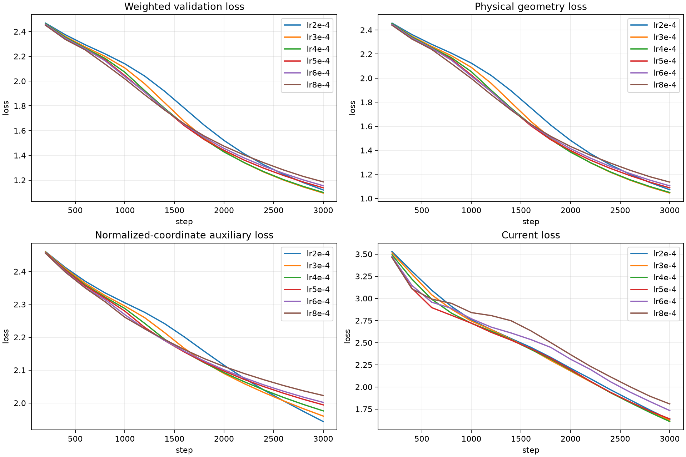

$3\times10^{-4}$ 和 $4\times10^{-4}$ 随后都延长到 30,000 步。最后 9,800 步的总损失
均值分别为 0.60328 和 0.60464；物理项均值分别为 0.57042 和 0.56876。两者已经非常接近，
但 $3\times10^{-4}$ 的标准化辅助项、固定采样几何合格率和开发 score 全体均值更好，
因此选择它继续做收敛检查。

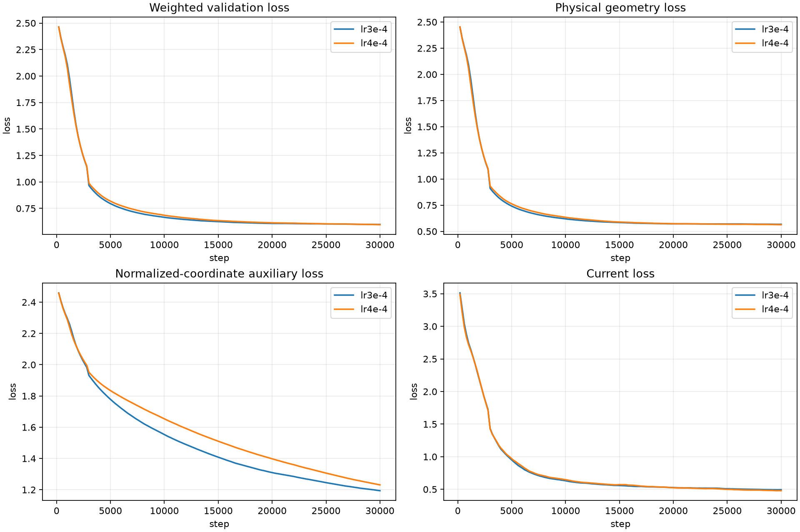

所选模型的最低总验证损失为 0.59801，出现在第 29,800 步；最低物理几何损失为
0.56767，也出现在第 29,800 步。继续训练到约 43,000 步后，最后 9,800 步斜率变为

$$
\frac{\Delta\mathcal L}{1000\ \mathrm{step}}=+3.66\times10^{-4},
\qquad
\frac{\Delta\mathcal L_{\mathrm{physical}}}{1000\ \mathrm{step}}
=+7.41\times10^{-4}.
$$

与此同时，标准化辅助项仍在下降。这正说明旧的逐维等权 loss 会掩盖低阶物理几何已经开始
过拟合。进一步从 30k EMA 以 $5\times10^{-5}$ 重置优化器，验证物理项在 40.6k 已升至
0.64585，末段斜率为每千步 $+7.69\times10^{-3}$。因此取消了更高的两个精调学习率，
最终 checkpoint 固定为 30,000 步。

### 14.5 2,048 样本正式评测

新旧两批均使用固定随机种子 20260729、相同条件组分布、32 步 Heun、4 卡分片和当前
ABI 8 / score v3。旧批次是第 12 节对 45k 旧模型保存样本的 v3 重评；新批次来自本节
30k 物理损失模型。

| 指标 | 旧逐维等权模型 | 新物理损失模型 | 相对变化 |
| --- | ---: | ---: | ---: |
| 几何合格率 | 99.46% | 99.51% | +0.05 个百分点 |
| `status=ok` | 721 / 2,048 | 838 / 2,048 | +16.2% |
| `status=ok` 比例 | 35.21% | 40.92% | +5.71 个百分点 |
| 全体 score 均值 | 2.309 | 3.045 | +31.9% |
| 全体 score 中位数 | 0.350 | 0.370 | +5.8% |
| 全体 score P90 | 7.251 | 8.607 | +18.7% |
| 全体最高 score | 16.804 | 23.320 | +38.8% |
| `ok` score 均值 | 6.162 | 7.112 | +15.4% |
| `ok` score 中位数 | 6.424 | 7.095 | +10.4% |
| `ok` score P90 | 8.449 | 9.973 | +18.0% |
| good-QH 数量 | 0 | 0 | 无变化 |

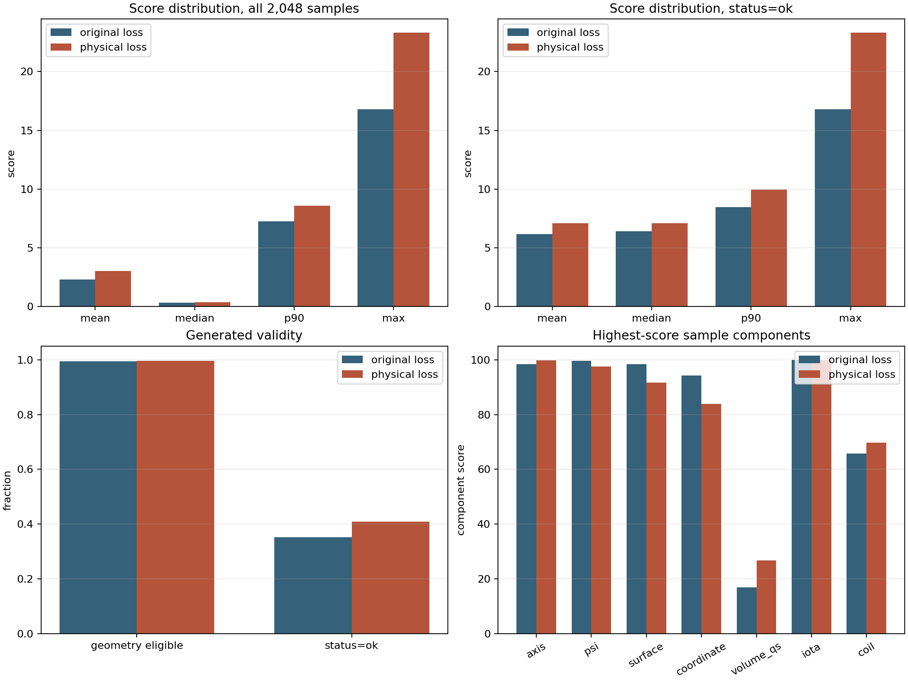

新模型把 `no_axis` 从 684 降到 574，把 `no_surface` 从 197 降到 146，同时 `ok` 增加
117 个。几何预筛通过率几乎不变，说明提升不是靠生成更多“仅仅平滑”的线圈，而是更多
线圈真正走过了磁轴、$\psi$、长期磁面和体 QS 全链路。

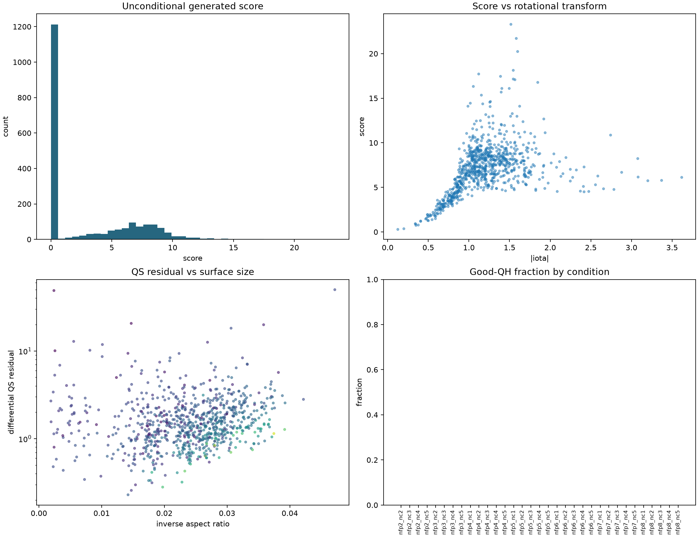

### 14.6 最高分样本与仍然存在的差距

最高分样本是 candidate 275，$N_{\mathrm{FP}}=4$，3 根基线圈：

| 指标 | 数值 |
| --- | ---: |
| score v3 | 23.3200 |
| $|\iota|$ | 1.5125 |
| $a/R$ | 0.02654 |
| 16 周期长期漂移 P95 | 0.00408 |
| $\psi$ 拟合相对 RMS | $1.82\times10^{-6}$ |
| QH 体残差 | 0.6331 |
| QA 体残差 | 0.5372 |
| QP 体残差 | 0.02977 |
| QH advantage | 0.1624 |
| QH helicity 总门控因子 | 0.3639 |

它的 axis、$\psi$、surface、coordinate、iota 和 coil 分量分别约为 99.8、97.6、91.7、
83.9、100 和 69.7，真正限制总分的是 volume-QS 分量 26.7 以及 QH 相对 QP 的门控。
也就是说，新 loss 确实更好地学到了可用宏观线圈与磁面，但还没有稳定学到目标 helicity。

因为最高分 23.32 仍显著低于 QUASR QH 的 P10 约 41.31，本节没有再对它运行 DESC。
原生 score v3 已经确认它有磁轴、低 $\psi$ 拟合误差、较大长期磁面和合格 $\iota$；此时
DESC 成败不会改变“生成分布仍未进入高质量 QH 区域”的结论。

### 14.7 耗时与资源审计

| 阶段 | 设置 | 墙钟 |
| --- | --- | ---: |
| 单个 3k 学习率短试 | 4 卡，global batch 32,768 | 4.8--5.4 分钟 |
| 所选训练链：0--3k | $3\times10^{-4}$ | 4.8 分钟 |
| 所选训练链：3k--15k | $3\times10^{-4}$ | 17.9 分钟 |
| 所选训练链：15k--30k，含 128 个开发 score | $3\times10^{-4}$ | 24.6 分钟 |
| 最终模型累计训练链 | 30,000 步 | 约 47.2 分钟 |
| 正式生成 2,048 个样本 | 4 卡，32 步 Heun | 最慢 rank 7.39 秒 |
| 正式原生 score | 2,038 个几何合格样本 | 最慢 rank 42.80 分钟 |
| 正式汇总与作图 | CPU | 2.09 秒 |
| 正式评测作业总墙钟 | Slurm 作业 `29016` | 43 分 15 秒 |

训练稳定吞吐约 40 万样本/秒，每卡峰值已分配显存约 9.15 GiB。正式评测按 4 卡作业墙钟
均摊为每个输入约 1.26 秒；按实际单卡原生调用累计时间除以 2,038 个合格样本，约为
4.95 GPU 秒/样本。这里生成只占约 7 秒，瓶颈仍完全在原生物理 score，而不在 flow。

作业 `29016` 的四个 rank 均精确写出 512 行，共 2,048 行；Slurm 退出码为 0。四张卡在
作业前后均为 0% 利用率、2 MiB 驱动占用，任务结束后用户队列为空。首次正式评测提交
`29013` 因 wrapper 预先创建严格输出目录而在 16 秒内失败，未生成任何样本；修复后保留
输出目录不可覆盖的保护，并改用 sidecar 保存 GPU 预检。

### 14.8 最终判断与下一步

本轮验证了用户提出的核心判断：逐维标准化可以保留，但 loss 应恢复低阶 Fourier 系数对
物理曲线位移的真实贡献。这个改动在留出验证集、磁轴/磁面成功率和 score 分布上都给出
一致改善，不是只让训练 loss 更好看。

但它也把下一步问题定位得更清楚：

1. 无条件模型仍主要学到“合理线圈 + 可用磁面”，没有学到足够强的 QH 相对竞争优势。
2. 第 13.5 节发现的电流规范化与固定 QH 方向约定问题仍未解决；它会造成系统性分数损失，
   但不足以解释新模型最高分仍只有 23.32。
3. 下一轮不应先做拒绝采样 RL。更合理的是先统一电流/helicity 约定，并把训练目标从纯
   无条件数据密度扩展为能显式保留高 QH-advantage 尾部的条件或加权生成目标。
4. 物理损失已经解决“尾部 Fourier 维度支配训练注意力”的问题；继续增大当前模型训练步数
   已被过拟合实验否定，单纯延长训练不是有效方向。

### 14.9 产物

- [学习率短试汇总](assets/qh_flow_physical_lr_sweep_20260729/summary.json)
- [30k 主学习率对比汇总](assets/qh_flow_physical_lr_longselect_20260729/summary.json)
- [收敛与过拟合审计](assets/qh_flow_physical_convergence_20260729/summary.json)
- [正式 2,048 样本汇总](assets/qh_flow_physical_eval_29016/summary.json)
- [新旧分布差异汇总](assets/qh_flow_physical_eval_29016/comparison_summary.json)
- [最高分样本完整输入与诊断](assets/qh_flow_physical_eval_29016/rank_001_id_000275.json)
- [正式评测运行清单](assets/qh_flow_physical_eval_29016/run_manifest.json)
- [正式评测 GPU 前状态](assets/qh_flow_physical_eval_29016/gpu_preflight.csv)
- [正式评测 GPU 后状态](assets/qh_flow_physical_eval_29016/gpu_postflight.csv)
