# QH flow 先验噪声 CEM 长跑验收

日期：2026-07-30

## 1. 结论先行

本轮验证的是：不直接在物理线圈参数或 PCA 坐标上做 CEM，而是在 QH flow matching 模型
的输入噪声上做 CEM。每个候选先经过固定 flow ODE 解码成线圈，再交给原生 C++/CUDA
score，elite 仍在输入噪声空间更新。

验收结论分为三层：

1. **搜索方法有效。** 首代最高分为 18.554，最终最高分为 50.586；上一轮从通用 PCA
   分布直接搜索 QH 的最高分仅为 3.892。新结果超过 score v3 的 QUASR QH P10=41.31，
   略低于参考中位数 51.44。flow 确实把 CEM 放进了包含 QH-like 样本的支持区域。
2. **最佳线圈确实存在真实嵌套磁面。** 正确的 $\alpha+\nu$ 路径在
   $s_{\rm edge}=0.25$ 上得到单调磁通标定、可逆坐标、三个半径都通过受保护 Newton，
   外层面离网格 residual 为 $3.79\times10^{-5}$；长时庞加莱显示规则嵌套面。
   这不是此前的 $\iota\simeq0$ 圆线圈退化。同一正确外层边界进入 DESC 后，初态和末态均
   保持嵌套，最终平均归一化力误差为 $1.16\times10^{-3}$。
3. **但它还不是高质量 QH。** native score 中单位 helicity 的 QH residual 为 0.0992，
   最强竞争模式 QP residual 为 0.02975，前者仍是后者的 3.34 倍。因此 50.586 应理解为
   “有较大磁面、$\iota\simeq2.2$、具有一定 QH 倾向的中等样本”，不能理解为接近 100 分
   的高精度 QH。

因此本轮的核心假设通过：**QH flow 是明显优于通用 PCA 高斯的 CEM 搜索先验。** 但一次
单种子对角 CEM 尚未把模型推入真正以 QH 为最优 helicity 的区域。

## 2. 实验定义

固定条件如下：

| 项目 | 设置 |
|---|---:|
| 目标 | QH |
| $N_{\rm FP}$ | 4 |
| 基线圈数 | 3 |
| CEM 变量 | $z\in\mathbb R^{3\times100}$ |
| 初始分布 | $z\sim\mathcal N(0,I)$ |
| flow checkpoint | 30,000 step EMA，物理加权 loss 版本 |
| flow 积分 | 32 步 Heun |
| 每代候选 / elite | 160 / 40 |
| CEM 平滑系数 | 0.55 |
| 资源 | 4 张 RTX 5090，16 CPU 核 |
| 停止方式 | 9 小时软时限，在完整代边界停止 |

对每个噪声候选只执行

$$
z\xrightarrow{\text{flow ODE}}\text{coil coefficients and currents}
\xrightarrow{\text{native score}}S,
$$

然后按 $S$ 选 elite。flow 模型权重、normalizer 和 score 二进制全程固定，没有在 CEM
中更新神经网络。

## 3. 作业完整性与吞吐

正式作业共运行 8 小时 59 分 11 秒，以退出码 0 正常结束；软时限触发时已经完成 144 代，
共评估 23,040 个候选。四张卡运行前后均为 0% 利用率和 2 MiB 显存占用，没有遗留 GPU
进程。

| 指标 | 结果 |
|---|---:|
| 完整代数 | 144 |
| 候选数 | 23,040 |
| 总墙钟 | 32,312.6 s |
| 四卡墙钟 / 候选 | 1.402 s |
| flow 解码累计 | 252.9 s |
| native score 累计 | 31,995.3 s |
| flow 解码占总时间 | 0.783% |

性能瓶颈明确在 native score，不在 flow 解码。把 CEM 变量放到 flow 前并没有显著增加
生产评分成本。

全体候选状态如下：

| 状态 | 数量 | 比例 |
|---|---:|---:|
| `ok` | 17,575 | 76.28% |
| `no_axis` | 4,154 | 18.03% |
| `drift_rejected` | 1,069 | 4.64% |
| `no_surface` | 192 | 0.83% |
| `flux_rejected` | 50 | 0.22% |

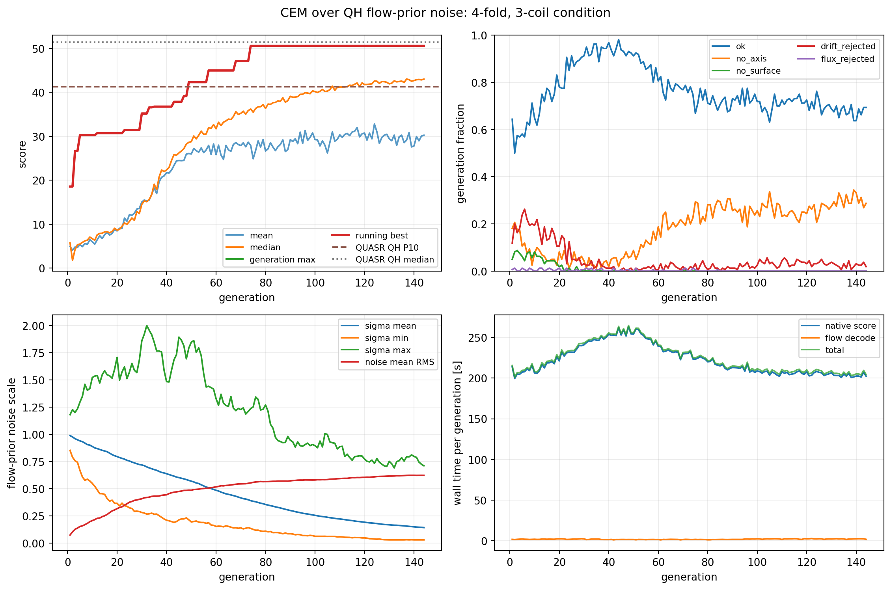

## 4. CEM 收敛行为

| 代数 | 当代均值 | 当代中位数 | running best | `ok` 比例 | 平均 $\sigma$ |
|---:|---:|---:|---:|---:|---:|
| 1 | 4.923 | 5.749 | 18.554 | 64.38% | 0.988 |
| 8 | 5.406 | 6.357 | 30.259 | 61.88% | 0.905 |
| 32 | 15.231 | 15.104 | 35.187 | 91.25% | 0.700 |
| 64 | 27.928 | 33.504 | 44.995 | 81.25% | 0.453 |
| 96 | 31.334 | 39.917 | 50.586 | 77.50% | 0.271 |
| 144 | 30.246 | 43.033 | 50.586 | 69.38% | 0.143 |

最高分在第 96 代附近已经达到显示精度下的平台，第 119 代出现保存的最终极值。后续中位数
继续提高，但 running best 不再改善。平均 $\sigma$ 从 0.988 收缩到 0.143；部分维度已经
达到最小值 0.03，另一些仍接近 0.71。因此分布明显收缩，但不是所有维度同时塌缩。

后期 `no_axis` 比例回升到约 30%，说明对角高斯在逼近当前高分盆地时仍沿少数高方差方向
频繁离开可行域。继续原样增加代数的收益预计较低；下一轮更适合改协方差表达或 elite
排序，而不只是延长运行。

## 5. 最佳 native score 样本

| 分项 | 分数 |
|---|---:|
| axis | 99.326 |
| psi | 96.514 |
| surface | 86.362 |
| coordinate | 82.316 |
| volume QS | 34.784 |
| iota | 100.000 |
| coil | 69.975 |
| **总分** | **50.586** |

主要诊断为：

| 物理量 | 数值 |
|---|---:|
| native surface level | 0.25 |
| 逆纵横比 | 0.02616 |
| 单周期漂移 P95 | 0.00602 |
| 长时漂移 P95 | 0.01134 |
| $\iota$ | 2.1983 |
| native QH global residual | 0.40905 |
| 单位 helicity $e_{\rm QH}$ | 0.09921 |
| QA residual | 0.29975 |
| QP residual | 0.02975 |
| $e_{\rm QH}/e_{\rm competitor}$ | 3.335 |
| QH advantage | 0.23068 |

score 的 QH 软门控已把它从非 QH 方向拉回很多，但 QP 误差仍更低。中间分数可以容纳这种
“有 QH 倾向但尚未胜过竞争模式”的样本；这与“分数接近 100 才应接近非常好”的设计目标
并不矛盾。

线圈工程项不是主要失败源：三条基线圈平均长度 3.58 m，曲率 P95 为
$7.39\,\mathrm{m}^{-1}$，最小线圈间距 92.7 mm，最小轴距 263.7 mm。不过三维形状仍较复杂，
不是简单圆线圈退化。

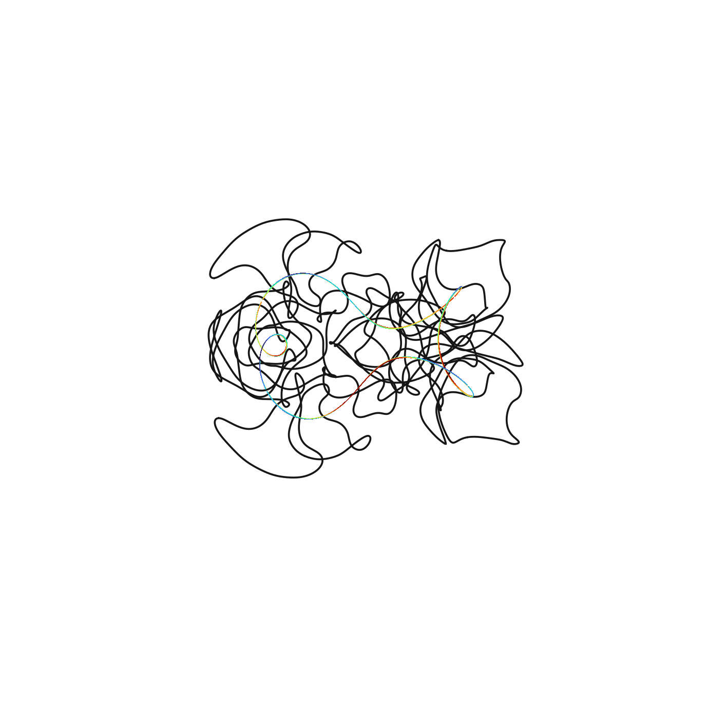

## 6. 正确的 $\alpha+\nu$ 物理复核

### 6.1 磁通标定与 $\alpha$

使用稳定版 $a=0.05$ 的 $\psi$ 拟合，在 $s_{\rm edge}=0.25$ 上重新标定真实环向磁通。
标定结果单调，relative RMS 为 $3.85\times10^{-6}$，不同环向截面的最大相对标准差为
0.00630。边界磁通为

$$
\Phi_{T,\rm edge}=-9.5639\times10^{-4}\ \mathrm{Wb}.
$$

$\alpha$ 使用 120,000 个训练点和 60,000 个错位验证点。四档阶数结果为：

| $L,M,N$ | 验证 relative $L^2$ | $\iota$ | $\min(1+\lambda_\theta)$ | 不可逆比例 |
|---|---:|---:|---:|---:|
| 6,6,6 | 0.21130 | 2.2503 | -0.1341 | $1.67\times10^{-4}$ |
| 8,8,8 | 0.16649 | 2.2285 | 0.1860 | 0 |
| 10,10,12 | 0.13722 | 2.2192 | -0.2696 | $1.00\times10^{-4}$ |
| 12,12,16 | **0.11683** | **2.2171** | **0.1671** | **0** |

最终选择 12 阶模型。训练误差 0.11494 与验证误差 0.11683 接近，没有明显过拟合；其 $\iota$
也与 native score 的 2.1983 一致。独立场线的直线拟合 RMS 从 0.4041 rad 降为 0.05468 rad，
改善 7.39 倍。

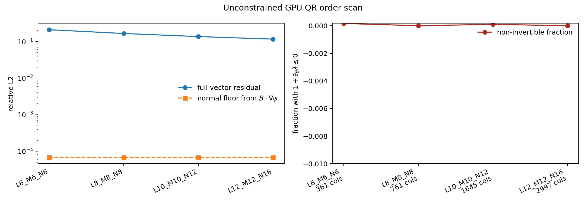

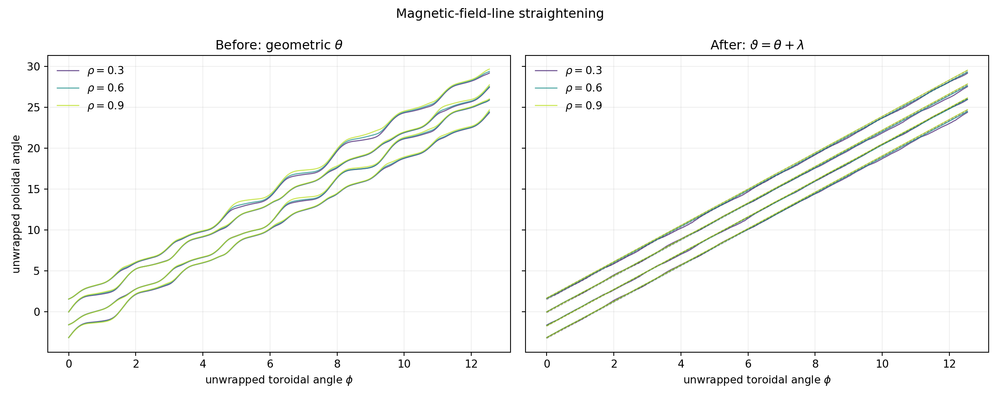

### 6.2 固定面 $\nu$ 修正

每个半径都在同一物理面上拟合环向修正 $\nu$，不优化面形；最终采用 12 阶。代表性结果为：

| $\rho$ | 平均小半径 / mm | $\nu$ 前 residual | $\nu$ 后 residual | 法向场 P95 |
|---:|---:|---:|---:|---:|
| 0.12 | 2.97 | 0.2062 | $1.24\times10^{-3}$ | $3.36\times10^{-4}$ |
| 0.50 | 12.44 | 0.2070 | $7.94\times10^{-4}$ | $3.77\times10^{-4}$ |
| 0.80 | 20.09 | 0.2084 | $6.56\times10^{-4}$ | $4.49\times10^{-4}$ |
| 1.00 | 25.29 | 0.2099 | $8.21\times10^{-3}$ | $1.91\times10^{-3}$ |

外层误差明显上升，但仍在受保护 Newton 的局部收敛域内。所有 $\nu$ 映射的 Jacobian 均
保持正值，没有环向折叠。

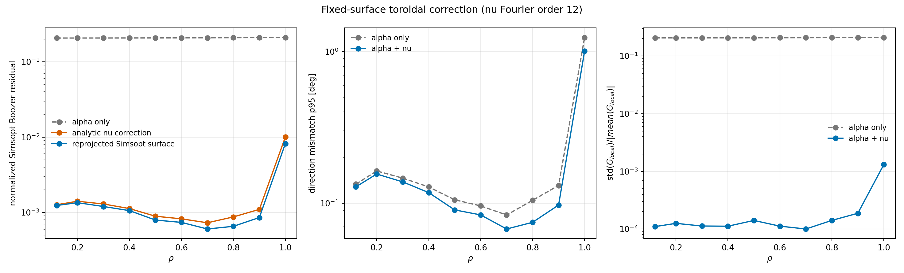

### 6.3 受保护 Newton 与长时庞加莱

三个半径都接受了 3 个完整 Newton 步；关键结果如下：

| $\rho$ | 初始离网格 residual | 最终离网格 residual | 法向场 P95 | 位移 P95 / 小半径 | 最终 $\iota$ |
|---:|---:|---:|---:|---:|---:|
| 0.50 | $7.94\times10^{-4}$ | $3.45\times10^{-5}$ | $4.51\times10^{-5}$ | 3.76% | 2.2016 |
| 0.80 | $6.56\times10^{-4}$ | $3.62\times10^{-5}$ | $4.66\times10^{-5}$ | 2.51% | 2.2150 |
| 1.00 | $8.21\times10^{-3}$ | $3.79\times10^{-5}$ | $4.83\times10^{-5}$ | 4.17% | 2.2282 |

外层最终有符号体积的绝对值为 $0.01402\,\mathrm{m}^3$，几何环向绕数为 1.00258。Newton
前后截面几乎重合，说明它在校正坐标/小残差，而不是跳到远处另一支解。

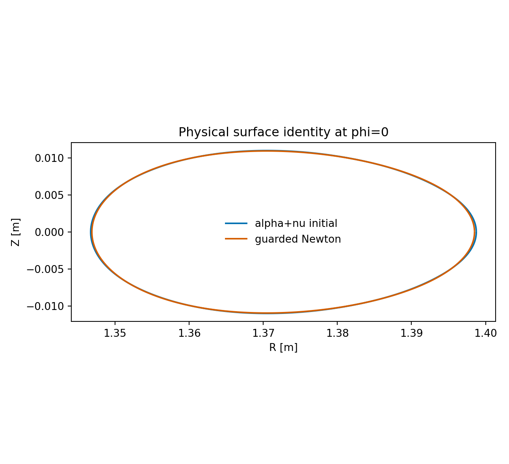

最终庞加莱使用 16 条场线、ODE 容差 $10^{-11}$，每条线在四个截面上得到 233--237 次命中。
点集形成连续、有序的嵌套环并由内向外铺满候选边界，没有旧路径图中的无序散点或明显岛链。

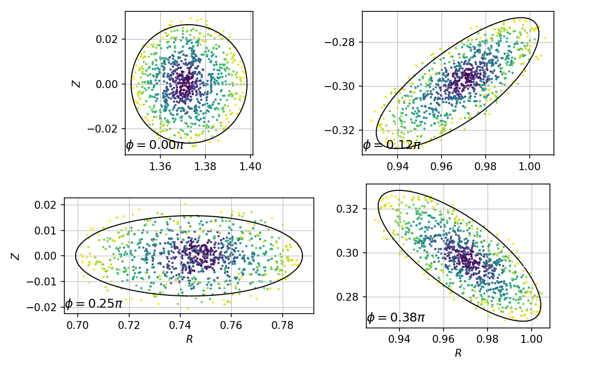

## 7. 为什么旧 LS/DESC 结果必须拒绝

为交叉验证，另行运行了旧稳定磁面、单面 LS/Newton 和 DESC 链路。该链路只在
$a=0.08,s=0.008$ 找到形式解，报告 residual $7.98\times10^{-14}$、QH error
$2.55\times10^{-5}$。但独立庞加莱点云完全不沿候选边界嵌套：

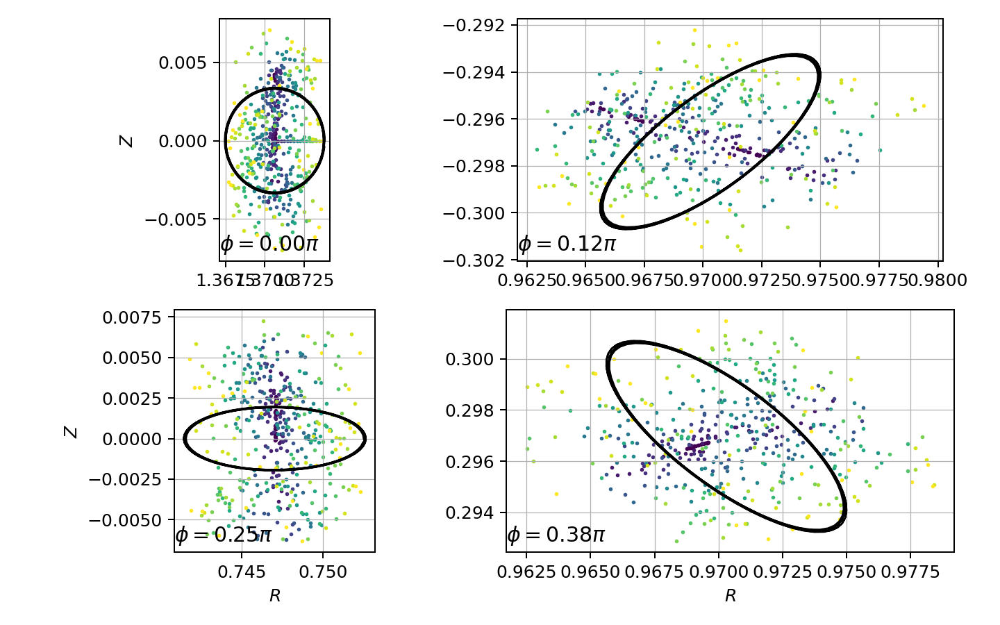

因此这些机器精度数字是配点内假精度。由该错误边界构造的 DESC 初态和末态都不嵌套；
归一化 force mean 从 $1.95\times10^{11}$ 变为 $1.18\times10^{13}$，最终 cost 为
$3.34\times10^{34}$。优化器的 `xtol` success 只表示步长停滞，不是物理收敛。

这只能说明旧边界必须拒绝，不能否定第 6 节已经独立验收的 $s=0.25$ 真空 Boozer 面。正确
边界的 DESC 结果见下一节。

## 8. 正确外层面的默认完整评估

本节所有图都来自受保护 Newton 后的 $\rho=1$ 外层面，不再使用旧 LS 面。保存面的参数为
$N_{\rm FP}=4$、谱阶 12、$\iota=2.22824$、$G=-6.94356$、$s=0.25$。

### 8.1 真空场 $|B|$ 与三维几何

在 $96\times192$ 个 Boozer 网格点上直接用真实 Biot--Savart 场计算：

| 量 | 数值 |
|---|---:|
| $|B|_{\min}$ | 0.64487 T |
| $\langle|B|\rangle$ | 0.68531 T |
| $|B|_{\max}$ | 0.73208 T |

热力图呈连续斜向带状结构，说明存在明确的 QH 倾向；带内仍有可见起伏，与 native score 中
“QH 尚未胜过最强竞争模式”的判断一致，而不是接近完美 QH。

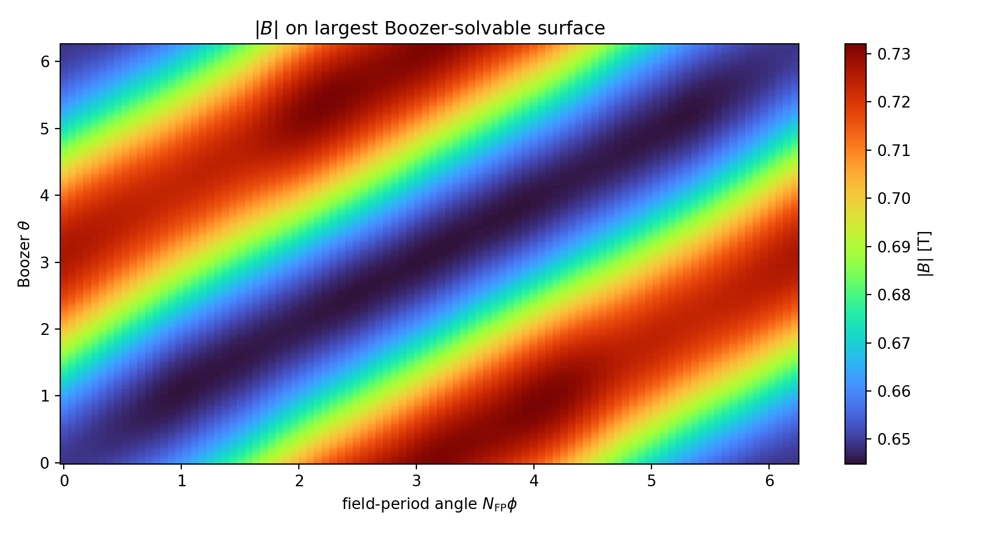

[交互式 $|B|$ 热力图](assets/qh_flow_prior_cem_29129/correct_full/assets/boozer_b.html)；
[完整四周期线圈和磁面 HTML](assets/qh_flow_prior_cem_29129/correct_full/assets/coils_surface.html)。
HTML 中曲面按四个周期连续拼接，周期边界只连接相邻周期，不再把每个周期各自错误封口。

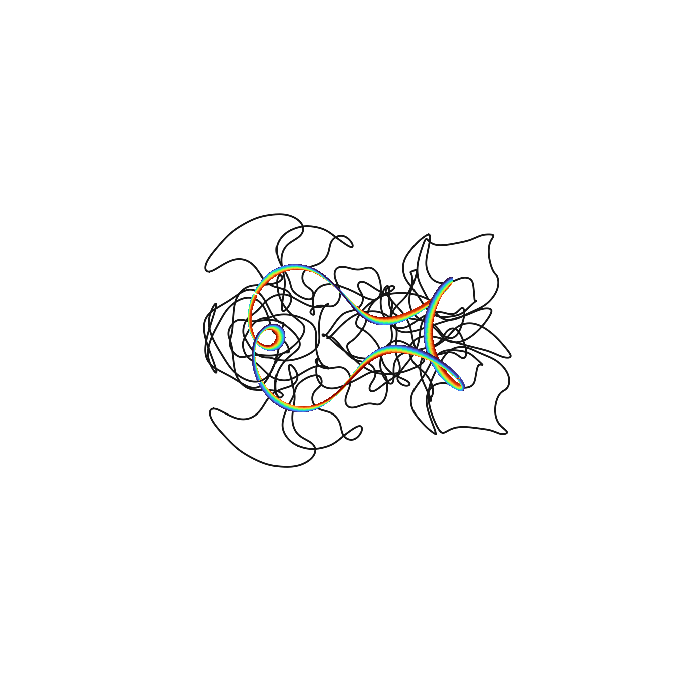

### 8.2 DESC 接口与物理结果

同一物理边界被转换为 12 阶 `SurfaceRZFourier`，并用真实线圈场积分得到

$$
\Phi_T=-9.49913\times10^{-4}\ \mathrm{Wb}.
$$

它与 $\alpha$ 步的标定值 $-9.56391\times10^{-4}\,\mathrm{Wb}$ 相差 0.68%，构成独立磁通
交叉验证。DESC 使用 $L=M=N=8$、零压强、零环向电流，共 856 个参数和 5346 个目标。

| DESC 指标 | 初态 | 100 次迭代后 |
|---|---:|---:|
| 嵌套 | true | true |
| 平均归一化力误差 | 1.1657 | $1.161\times10^{-3}$ |
| P95 归一化力误差 | 2.1195 | $2.720\times10^{-3}$ |
| 最大归一化力误差 | 4.0464 | $8.034\times10^{-3}$ |
| 总平方目标 | $1.500\times10^6$ | $6.417\times10^{-2}$ |

求解耗时 316.3 s，完整 DESC 阶段含初始化和出图共 458.3 s。优化器达到 100 次迭代上限，
所以 `optimizer_success=false`；它不是严格的最终收敛解。但末态保持嵌套，独立力统计比初态
降低约三个数量级，也比旧错误边界的 $10^{11}$ 量级改善约 14 个数量级，因此这是可信的
有限迭代平衡，而不是旧结果那种 `xtol` 假成功。

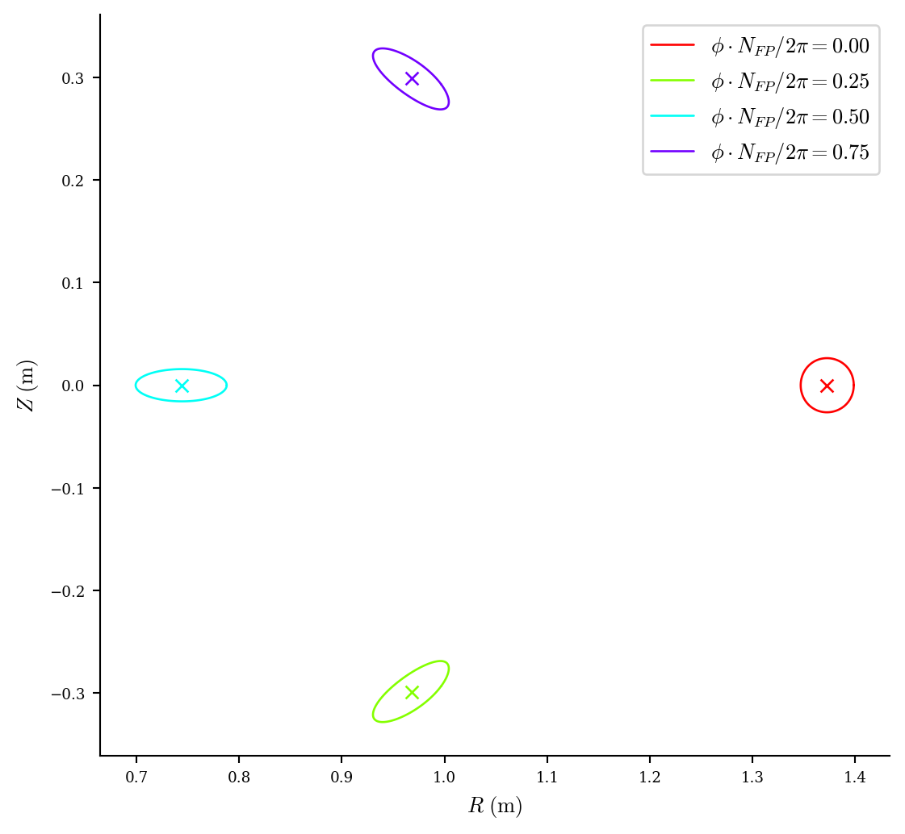

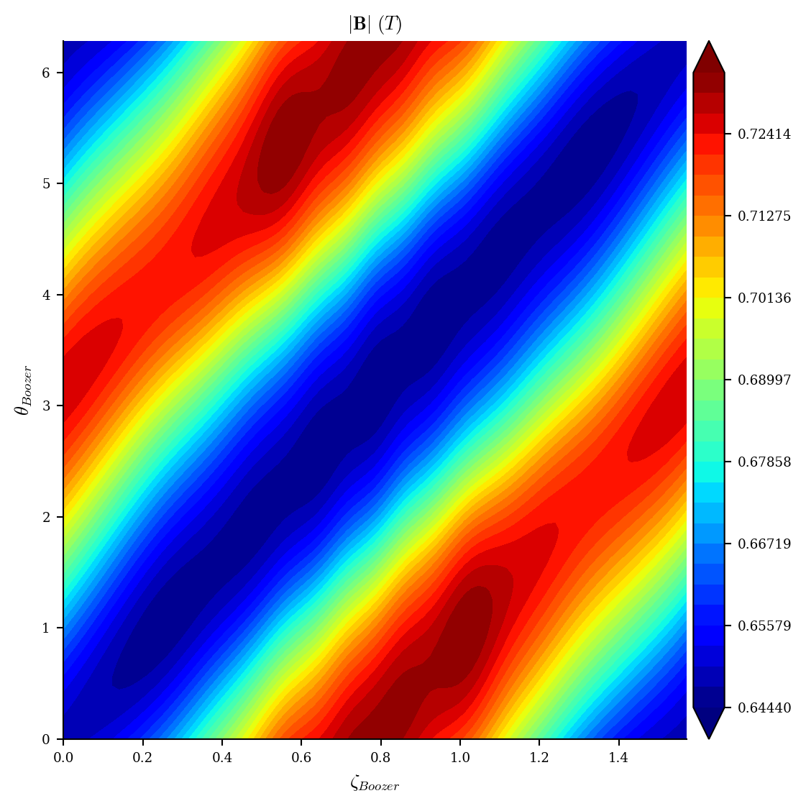

下图给出 DESC 中幅值最大的 $B_{M,N}$ Boozer 谱分量随 $\rho$ 的变化。主导的
$(M,N)=(0,0)$ 和 QH 目标分量 $(1,4)$ 清晰可见；$(1,4)$ 从内向外增大，而多个非目标模也在
$10^{-3}$ 到 $10^{-2}$ T 范围内增长，这与“有 QH 倾向但仍非高质量 QH”的结论一致。

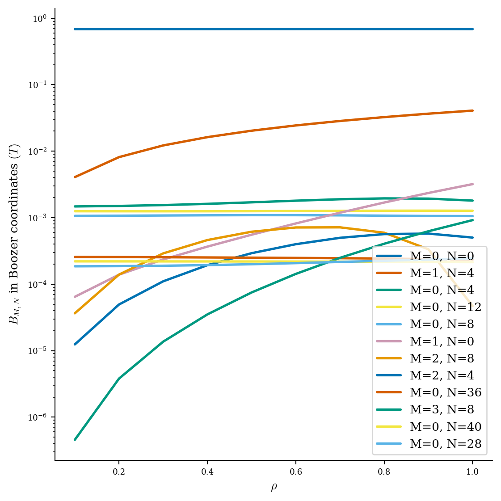

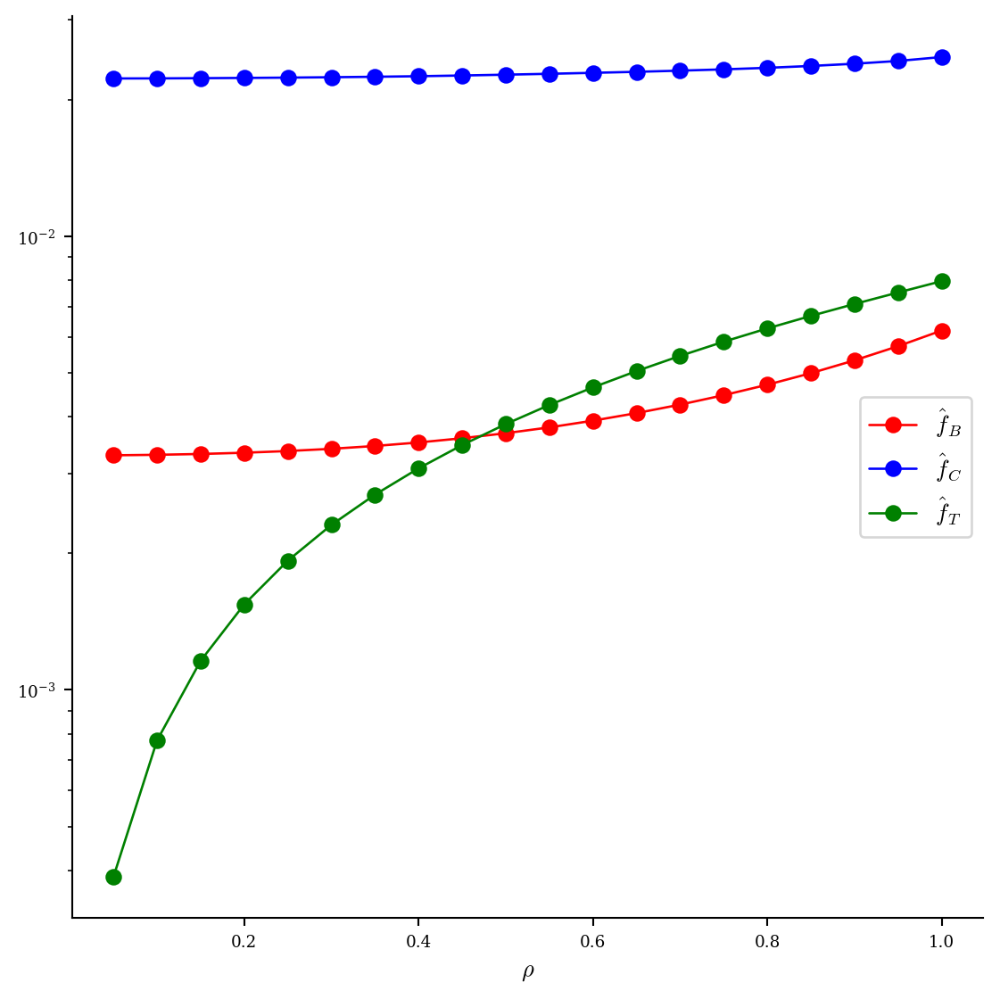

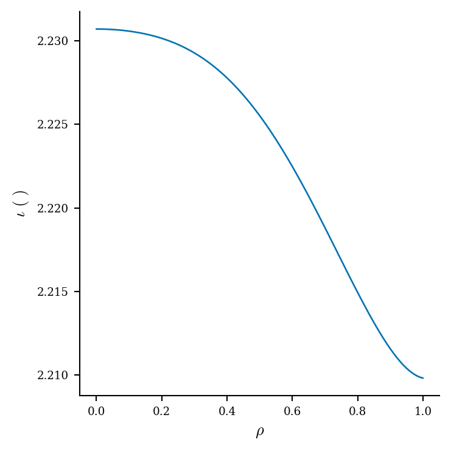

DESC 给出的 $\iota$ 从轴上约 2.231 平滑降至边界约 2.210，与真空 Boozer 外层值 2.228
一致到百分之一量级。完整产物包括 [DESC 输入](assets/qh_flow_prior_cem_29129/correct_full/desc/input.check)、
[equilibrium.h5](assets/qh_flow_prior_cem_29129/correct_full/desc/equilibrium.h5) 和
[DESC 原始摘要](assets/qh_flow_prior_cem_29129/correct_full/desc/summary.json)。

## 9. 为什么本轮 $\nu$ 诊断用了 542 秒

这里的 542.5 s 不是一次 $\nu$ 线性求解，而是开发期阶数扫描：10 个 $\rho$、每个半径 3 档
$\nu$ 阶数，共 30 个候选；每档都重建曲面并做离网格复核。`fit_toroidal_correction` 本身利用
均匀 Fourier 网格的正交性直接计算系数，不是大型非线性求解，也不是这段时间的主要来源。

为排查 SIMSOPT 的 CPU Biot--Savart 是否是瓶颈，另在空闲 RTX 5090 上对同一 3363 点网格
做了独立基准：

| 场评估实现 | 中位耗时 | 相对 CPU 加速 | 相对 CPU 场误差 |
|---|---:|---:|---:|
| SIMSOPT CPU | 62.85 ms | 1 | 0 |
| CUDA FP64 | 0.710 ms | 88.5 | $4.87\times10^{-16}$ |
| CUDA FP32 | 0.0896 ms | 701 | $1.24\times10^{-7}$ |

当前流程每个半径约做 6 次 CPU 场评估，总计约 60 次；按实测只占约 3.8 s。因此把场评估
迁到 GPU 虽然正确且可获得很高吞吐，但不能解释或单独消除 542 s。

代码路径中真正重复的重计算是 `SurfaceXYZTensorFourier.least_squares_fit`：每个半径先做一次
$\alpha$ 曲面谱投影，再为 3 档 $\nu$ 各做一次修正后曲面谱投影，总计 40 次 12 阶曲面拟合。
其间还重复构造同一网格、同一阶数的设计矩阵和分解。这是扣除场评估、GPU 等值面提取和小型
Fourier 投影后唯一仍与 542 s 匹配的主路径。分阶段计时代码已加入；远端登录节点随后出现
banner 超时，尚未回收该短 profiling 作业，因此本段不给出虚构的逐函数百分比。

建议的优化顺序为：

1. 生产模式固定已经选定的 $\nu$ 阶数，不再为每个半径重跑 4/8/12 三档，曲面重投影立即从
   30 次降到 10 次；阶数扫描只保留为离线开发检查。
2. 对固定网格、$N_{\rm FP}$ 和谱阶缓存曲面拟合设计矩阵及 QR 分解；每个半径只更新三列
   $X/Y/Z$ 右端并做回代。当前重复分解在数学上没有必要。
3. 将多个半径的 $X/Y/Z$ 右端合并成矩阵，用单次 GPU GEMM/QR 或混合精度求解。场评估可直接
   使用已验证的 FP32 CUDA 路径；曲面系数求解先保留 FP64 或 FP32 分解加 FP64 残差复核。
4. 只有在批量矩阵仍无法吃满单卡时，才按 $\rho$ 把开发期扫描分给多卡。对最终单样本链路，
   一张卡上的批量化通常比四进程重复初始化更合适。

另需区分：本次完整图形评估中的长时庞加莱单独耗时 285.1 s，它是严格验收图，不属于
$\nu$ 拟合，也不应进入最终 10 秒 score 路径。场评估原始基准见
[nu_field_profile.json](assets/qh_flow_prior_cem_29129/nu_field_profile.json)。

后续默认评估的冻结流程、资源分配、时间上限和产物契约见
[精简线圈评估流程](../docs/精简线圈评估流程.md)。

## 10. 总结与下一步

本轮已经回答实验的核心问题：

- flow-prior CEM 比通用 PCA 随机 CEM 更容易进入 QH-like 可行域；
- score=50.586 的最高分样本有真实、较大的嵌套磁面和 $\iota\simeq2.2$；
- 它没有利用 $\iota\to0$、小圆线圈或无磁面的旧作弊方式；
- 正确外层面已完成 $|B|$、三维 HTML、庞加莱和 DESC 默认完整评估；
- DESC 得到可信但受 100 次迭代上限约束的嵌套平衡；
- 该样本的 QH residual 仍高于 QP，尚未达到高质量 QH。

下一轮优化不宜简单延长同一对角 CEM。更有价值的方向是把 elite 选择改为分层目标：先保留
磁面、尺寸和 $\iota$ 的最低门槛，再主要按 QH 相对竞争优势排序；或者使用低秩/块协方差，
捕捉 300 维 flow 噪声中跨线圈、跨 Fourier 分量的相关方向。生产 score 仍保持当前严格
定义，搜索 merit 可以单独设计。

原始压缩审计见 [audit.json](assets/qh_flow_prior_cem_29129/audit.json)，最佳线圈见
[best.json](assets/qh_flow_prior_cem_29129/best.json)，交互式线圈/曲面图见
[coils_surface.html](assets/qh_flow_prior_cem_29129/full_eval/coils_surface.html)。
