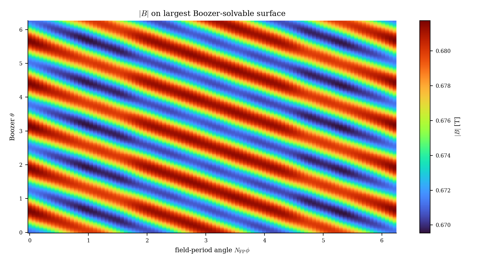
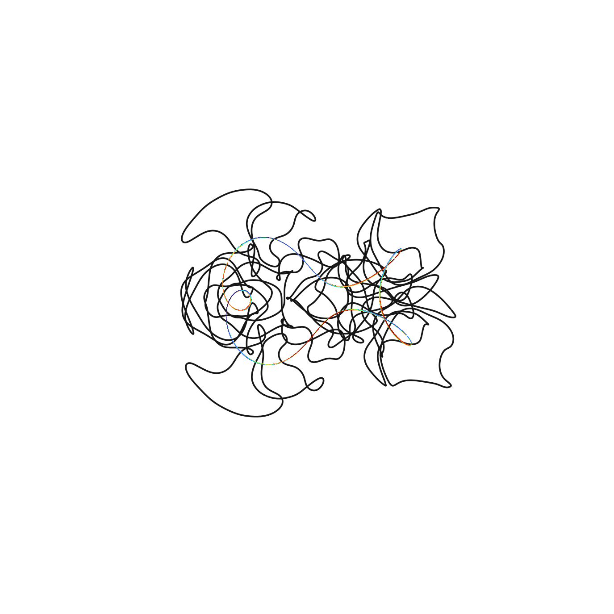
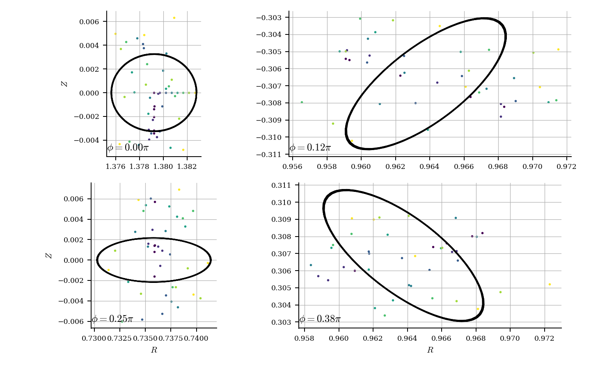
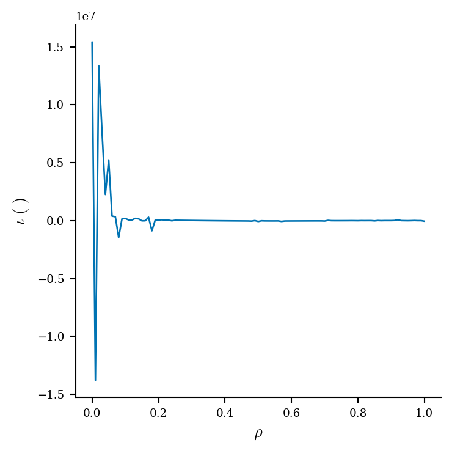
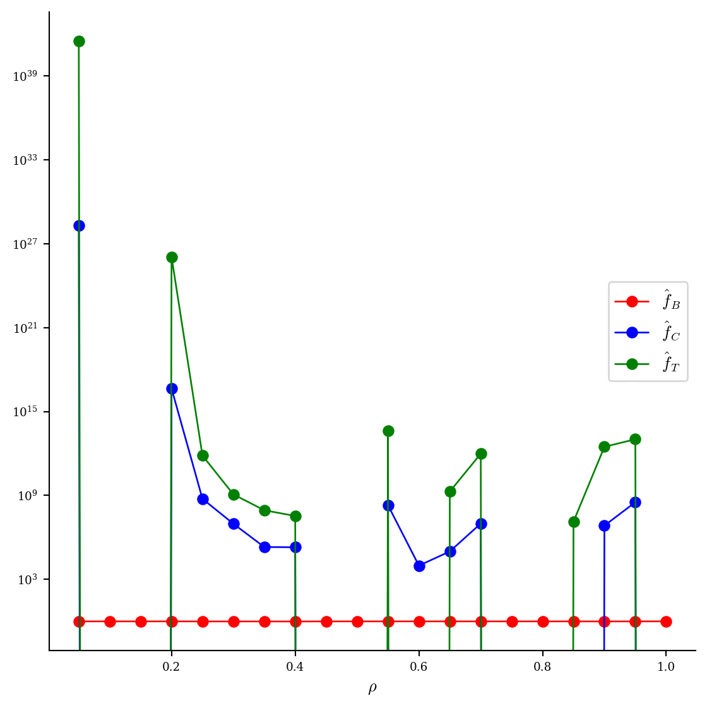

# Flow prior 潜空间零阶 Adam 中等实验报告

日期：2026-07-30  
分支：`qh-flow-zo-adam`

## 1. 结论先行

本轮回答了三个问题。

1. **RK4 不慢到不可接受，直接用即可。** 正式优化使用全 FP32、关闭 autocast 的 256 步 RK4。80 轮中每轮 11 个 flow 解码合计平均耗时 4.720 s，占每轮墙钟的 20.3%；原生 C++/CUDA score 平均占 18.519 s，即 79.7%。主瓶颈仍是 score，不是 ODE 积分。
2. **潜空间零阶 Adam 确实能稳定精修已有高分解。** 修正后的 native score 从 69.1136 提高到 70.5778，增加 1.4641 分。80 轮全部完成，所有 640 个梯度扰动端点均为 `ok`，最佳解出现在最后一轮，后 40 轮仍提高 0.3974 分。
3. **但 70.58 分的最佳样本没有通过独立物理验收。** 固定 LS/Newton 路径只找到很小的候选 Boozer 面；庞加莱点不沿候选边界形成嵌套曲线，DESC 初末均非嵌套且力残差爆炸。因此本轮证明的是“优化器能优化当前 score”，不是“当前 score 已足以保证实用 QH 线圈”。

这不是“从零搜索优于 CEM”的证据。本轮从已有 flow-prior CEM 最佳噪声启动，只验证局部一阶式黑箱优化是否可用。结论是：**优化算法可用且还未完全饱和，但目标函数与独立物理验收仍有明显缺口；在修正或解释该缺口前，不应提交 9 小时长跑。**

## 2. 本轮具体做了什么

固定 flow checkpoint、$N_{\rm FP}=4$ 和 3 根基线线圈。潜变量为

$$
z\in\mathbb R^{3\times100},
$$

flow 解码为

$$
x=F_\theta(z;N_{\rm FP},n_c),
$$

其中 $x$ 是包含 Fourier 系数和电流的物理线圈参数。优化目标始终是修正后的原生 QH score：

$$
S(z)=\operatorname{score}(F_\theta(z)).
$$

实现内容包括：

- FP32 RK4 flow 解码和自动步数校准；
- 4 个 QR 正交随机方向的 antithetic 零阶梯度；
- 最大化版本 Adam；
- 3 档 proposal 回溯；
- 潜变量先验软约束、硬截断和无效样本保护；
- 每轮状态、最佳样本、JSONL 历史和监控图原子保存；
- Slurm GPU 空闲预检、退出清理和 postflight 检查。

严格地说，score 不可微，因此这不是对 score 的反向传播。它是零阶黑箱梯度估计配合 Adam 更新，也可称为“一阶式黑箱优化”。

## 3. 为什么直接使用 256 步 RK4

### 3.1 已有绝对精度证据

前一轮 landscape 实验对真实高分 QUASR 样本做过 RK4 反向再正向闭环。256 步时线圈位置闭环 RMS 误差为

$$
2.26\times10^{-8}\ {\rm m}
\quad\text{到}\quad
4.57\times10^{-8}\ {\rm m},
$$

QH error 的重建差异不超过 $1.55\times10^{-7}$。这已经接近当前 FP32 模型和状态的数值底噪。

本轮不需要反向积分，但沿用相同的 FP32 RK4，可以避免把积分误差混入微小的正负扰动差。

### 3.2 本轮在线门控

正式优化前，在同一个中心、同一组 4 个正交方向和扰动 $c=0.01$ 上比较 64、128 和 256 步。每个候选步数都解码并评分中心及 8 个正负端点。以 256 步为局部参考，门控要求：

- 最大几何误差不超过实际扰动位移的 1%；
- 4 个方向导数的余弦不低于 0.98；
- 方向符号一致率为 100%；
- score 状态完全一致。

| RK4 步数 | 9 个 case 解码墙钟 | 几何误差 / 扰动位移 | 梯度余弦 | 符号一致率 | 通过 |
| ---: | ---: | ---: | ---: | ---: | --- |
| 64 | 1.100 s | 8.34% | 0.9629 | 100% | 否 |
| 128 | 1.280 s | 3.32% | 0.9858 | 100% | 否 |
| 256 | 2.532 s | 0 | 1.0000 | 100% | 是 |

128 步的梯度方向已经相当接近，但几何误差仍是本次真实扰动位移的 3.32%，没有达到预先固定的 1% 门槛。因此正式实验选择 256 步。

不再额外搜索 160、192 或 224 步，原因很直接：即使找到更便宜的合格点，每轮最多只节省约 1 s，而 score 每轮需要约 18.5 s。继续优化积分器不会改变总吞吐的主导项。

## 4. 零阶 Adam 的计算流程

### 4.1 梯度估计

每轮生成 $m=4$ 个相互正交、单位 RMS 的随机方向 $u_j$。对每个方向计算

$$
S_j^+=S(z+cu_j),
\qquad
S_j^-=S(z-cu_j),
$$

并构造

$$
\hat g(z)=\frac{1}{m}\sum_{j=1}^{m}
\frac{\operatorname{clip}(S_j^+-S_j^-,-15,15)}{2c}u_j.
$$

潜变量先验惩罚的梯度是解析计算的，不加入黑箱估计方差。本轮潜变量始终远离软约束，所以惩罚实际为 0。

### 4.2 Adam 与回溯

参数为 $\beta_1=0.9$、$\beta_2=0.99$。初始学习率为 0.003，单轮更新 RMS 上限为 0.0075。沿 Adam 方向同时评估 $1$、$1/2$ 和 $1/4$ 三档 proposal，选取有效且 merit 最好的候选。

每轮固定需要：

$$
2m+3=11
$$

次原生 score，其中 8 次用于梯度，3 次用于回溯。4 张 GPU 上每卡维持一个持久评分 worker；8 个 pair 端点分两批完成，3 个 proposal 再用一批完成。

80 轮选择 proposal 的次数为：整步 41 次、半步 24 次、四分之一步 15 次。回溯不是空设，后期确实多次抑制了整步过冲。

## 5. 优化结果

### 5.1 主结果

| 指标 | 起点或第 1 轮 | 第 80 轮 | 变化 |
| --- | ---: | ---: | ---: |
| native score | 69.1136 | **70.5778** | **+1.4641** |
| QH global error | 0.29776（第 1 轮） | **0.27158** | -8.79% |
| QA global error | 0.40971（第 1 轮） | **0.38767** | -5.38% |
| QP global error | 0.03003（第 1 轮） | **0.02969** | -1.15% |
| $\iota$ | 2.2662（第 1 轮） | **2.2927** | +0.0265 |
| 潜变量 RMS | 0.6933（第 1 轮） | **0.6968** | +0.0035 |
| 潜变量最大绝对值 | 2.3770（第 1 轮） | **2.4334** | +0.0564 |

这里 QH/QA/QP 的起始分量取第 1 个已接受状态，因为积分校准文件只持久化了初始总分，没有持久化初始完整 diagnostics。总分的起点 69.1136 是同一 256 步 RK4 和同一修正后评分器的校准中心，可直接比较。

每 10 轮的结果如下：

| 轮次 | score | QH global error |
| ---: | ---: | ---: |
| 10 | 69.7198 | 0.29150 |
| 20 | 69.9392 | 0.28624 |
| 30 | 70.0464 | 0.28346 |
| 40 | 70.1803 | 0.27969 |
| 50 | 70.2742 | 0.27755 |
| 60 | 70.3779 | 0.27545 |
| 70 | 70.4768 | 0.27368 |
| 80 | **70.5778** | **0.27158** |

前 40 轮提高 1.0667 分，后 40 轮仍提高 0.3974 分。增益在变慢，但最佳解位于最后一轮，不能说已经完全收敛。

### 5.2 稳定性

- 80/80 轮接受，640/640 个梯度端点状态为 `ok`。
- 当前 score 有 12 次小幅回落，最差单轮下降 0.0301 分；这是允许最多下降 0.1 分的信赖域策略。running best 不回退。
- 学习率从 0.00303 缓慢增到 0.00665，但平均更新 RMS 仅为 $8.74\times10^{-4}$，最大值 0.003，低于 0.0075 上限。
- 扰动从 0.0100 退火到 0.00857；最终梯度 RMS 为 0.884，仍有可测信号。
- 潜变量 RMS 始终约为 0.69，远低于 2.0 的软边界；没有通过离开 flow 训练分布来投机。

## 6. Native score 内部是否发生退化

仅看 native score 的最终 diagnostics，没有显示此前圆线圈、低 $\iota$ 或小磁面作弊模式。

| 物理量 | 第 80 轮最佳值 |
| --- | ---: |
| 磁轴残差 | $1.02\times10^{-8}$ |
| $\psi$ 训练 RMS | $7.85\times10^{-4}$ |
| $\psi$ 角度误差 P95 | $9.44\times10^{-5}$ |
| 稳定磁面数 | 10 |
| 长追踪完成周期 | 16 |
| 磁面漂移相对 P95 | 0.00823 |
| 单周期漂移相对 P95 | 0.00403 |
| 有效小半径 | 0.02629 m |
| 逆纵横比 | 0.02601 |
| 磁面体积 | 0.01379 $\mathrm{m}^3$ |
| $\iota$ | 2.2927 |
| QH edge error | 0.35888 |
| $\alpha$ 法向场相对 $L^2$ | $4.38\times10^{-5}$ |
| volume 有效点比例 | 100% |
| 线圈最小间距 | 0.09355 m |
| 线圈到磁轴最小距离 | 0.26072 m |
| 线圈曲率 P95 | 7.364 $\mathrm{m}^{-1}$ |
| 最大电流绝对值 | 305.8 kA |

关键 score 分项为：surface 87.91、coordinate 83.87、volume-QS 43.34、$\iota$ 100、coil 69.92。QH helicity advantage 为 0.3107，quality 为 1.0。磁面尺寸项仍为 0.9517，$\iota$ 门控为 1.0，因此本轮提升没有依靠缩掉磁面或把 $\iota$ 推向 0。

需要准确理解 QP error 数值较小这件事：最终评分并非只比较三个 residual 的绝对大小，还包含目标 QH 的 helicity advantage/quality 定义及 $\iota$ 门控。本轮 QH 和 QA 都下降，但 QH 相对 QA 的优势继续改善。因此在 **native score 自身定义内**，已知的低 $\iota$/小磁面门没有被绕过；下一节的独立评估仍表明这个定义遗漏了关键物理有效性。

## 7. 独立磁面、庞加莱和 DESC 验收

### 7.1 固定磁面搜索

按默认完整评估流程扫描 $a=0.05,0.08,0.12,0.16,0.20$。只有 $a=0.12$ 和 0.16 找到 LS/Newton 报告成功的面；按体积选择 $a=0.12$、$\psi_{\rm level}=0.004$ 的 6 阶面。

| 指标 | 选中面 |
| --- | ---: |
| 平均半径 | 0.00746 m |
| 半径范围 | 0.00485 到 0.01247 m |
| 体积 | $1.19\times10^{-3}\,\mathrm{m}^3$ |
| Boozer 路径 $\iota$ | -2.0583 |
| LS residual | $5.24\times10^{-14}$ |
| Newton 迭代 | 0 |
| 面上 QH error | $2.18\times10^{-5}$ |

这里的 $\iota$ 符号与 native score 使用的坐标方向约定相反，但绝对值也从 2.293 变成 2.058。更重要的是，这个面的体积只有 native 快速面诊断 0.01379 $\mathrm{m}^3$ 的约 8.6%，平均半径也远小于 native 给出的 0.02629 m。两条路径没有在“大且有效的磁面”上达成一致。

LS residual 极小不能单独证明面真实存在，因为 LS 方程可能落在错误分支或只满足离散参数化方程。庞加莱是对此的独立场线验收。

### 7.2 $|B|$ 与三维几何

候选面上的 $|B|$ 范围为 0.66954 到 0.68174 T，平均值 0.67556 T，图上存在清晰螺旋条纹。但由于下一节的庞加莱否决了该面，不能把这张热力图单独当作真实磁面上的 QH 证据。

交互产物：[Boozer $|B|$ HTML](assets/qh_flow_zo_adam_29465/full_eval/assets/boozer_b.html)；[完整线圈与磁面 HTML](assets/qh_flow_zo_adam_29465/full_eval/assets/coils_surface.html)。

### 7.3 庞加莱否决

8 条场线在 4 个环向截面的散点没有沿黑色候选边界形成嵌套闭合曲线。在 $\phi=0.12\pi$ 和 $0.38\pi$ 截面尤其明显：点云广泛散布于边界内外，而不是落在一族连续磁面上。因此这个 LS/Newton 面不能作为已验证真空磁面。

这也解释了为什么“LS residual 为 $10^{-14}$”与“物理面不成立”可以同时出现：前者只验收求解方程和离散表示，后者直接验收真实 Biot-Savart 场线。

### 7.4 DESC 失败

当前 CUDA-enabled JAX 环境不可用，GPU 入口按要求在预检阶段停止；最终 DESC 明确放到 Students 分区的 16 核纯 CPU 作业，不占 GPU。固定 $L=M=N=8$、最多 50 轮，实际 10 轮因 `xtol` 停止。

| DESC 指标 | 结果 |
| --- | ---: |
| 初始嵌套 | false |
| 最终嵌套 | false |
| 初始平均归一化力误差 | $5.55\times10^9$ |
| 最终平均归一化力误差 | $9.84\times10^9$ |
| 最终 P95 归一化力误差 | 585.9 |
| 最终最大归一化力误差 | $7.25\times10^{13}$ |
| 优化器 cost | $8.41\times10^{33}$ |
| 优化器状态 | `xtol` success，但物理失败 |

DESC 在初始坐标非嵌套后尝试自动修复，仍报告非嵌套。虽然优化器 API 返回 success，力残差完全不在可接受量级，所以生成的 equilibrium 和后续图都只能作为失败诊断。

$\iota(\rho)$ 达到 $10^7$ 量级尖峰，QH 分量跨越几十个数量级，直观确认该 DESC 输出没有物理意义。QA/QP、Boozer modes、DESC $|B|$ 和 boundary 图均保留在 [desc](assets/qh_flow_zo_adam_29465/full_eval/desc/) 目录，但不用于宣称结果成功。

原始产物：[full_summary.json](assets/qh_flow_zo_adam_29465/full_eval/full_summary.json)、[DESC summary](assets/qh_flow_zo_adam_29465/full_eval/desc/summary.json)、[选中 sweep summary](assets/qh_flow_zo_adam_29465/full_eval/sweep_a_0p12/summary.json)、[DESC input](assets/qh_flow_zo_adam_29465/full_eval/desc/input.check) 和 [equilibrium.h5](assets/qh_flow_zo_adam_29465/full_eval/desc/equilibrium.h5)。

## 8. 耗时与资源

正式中等实验使用 4 张运行前为空闲的 RTX 5090 和 16 CPU。

| 阶段 | 工作量 | 墙钟 |
| --- | ---: | ---: |
| RK4/score 在线校准与初始化 | 27 次 score | 约 70 s |
| 每轮 flow 解码 | 11 个 case | 平均 4.720 s |
| 每轮 native score | 11 个 case，4 卡三批 | 平均 18.519 s |
| 单轮总计 | 11 次 score | 平均 23.246 s |
| 单轮 P95 / 最大值 |  | 23.278 / 23.333 s |
| 80 轮优化 | 880 次 score | 1859.7 s |
| 完整程序 | 907 次 score | 1929.99 s |
| Slurm 作业 | 含启动和清理 | 32 min 22 s |

按完整程序墙钟除以 907 次逻辑 score，四卡并行下摊销为 2.128 s/case。单个 worker 的一次 score 约 6.1 s；通过 4 卡并行把 11 个 case 分三批完成。

GPU preflight 和 postflight 均为每卡 2 MiB、0% utilization。作业退出码为 0，结束后 Slurm 队列为空，没有遗留优化器或评分 worker 进程。

完整物理验收的可复现有效阶段另外耗时：5 个 $a$ 的固定面扫描合计约 96.4 s；保存面可视化和 8 线庞加莱 34.6 s；CPU DESC 与出图 158.0 s；保存面完整作业总计 226.8 s。GPU DESC 预检在 35 s 内确认环境不可用并停止，没有静默回退占卡。

## 9. 版本与可复现产物

flow checkpoint 为 30,000 step EMA，SHA-256：

`39a3293a459e248a0d1ec062607a1a467128b14d8ca973aadd82e113532ab99f`

本 worktree 新构建的 native 库 SHA-256 为：

`0b7342db471788385931385c25ded8095c72cfb7fcea1e21376a0475dafaa427`

它与先前 landscape worktree 的二进制哈希不同，但从修正 landscape 提交到本分支对 `gpu_backend` 和 Python QS 参考实现的源码 diff 为空，因此不是评分公式版本变化。构建路径和链接产物不同会改变二进制哈希；物理符号修正源码保持一致。

旧 flow-prior CEM 文件记录的 50.5862 分产生于全局电流反号 bug 修正前，不能和本轮曲线直接比较。同一个起点在修正后评分器、256 步 RK4 下重评分为 69.1136。本报告只用修正后的 69.1136 到 70.5778 做因果比较。

关键产物：

- [summary.json](assets/qh_flow_zo_adam_29465/summary.json)：最终汇总和完整 diagnostics；
- [integration_calibration.json](assets/qh_flow_zo_adam_29465/integration_calibration.json)：RK4 门控；
- [history.jsonl](assets/qh_flow_zo_adam_29465/history.jsonl)：逐轮原始记录；
- [best.json](assets/qh_flow_zo_adam_29465/best.json)：最佳物理线圈和潜变量；
- [progress.png](assets/qh_flow_zo_adam_29465/progress.png)：score、helicity、步长和有效率曲线；
- [gpu_preflight.csv](assets/qh_flow_zo_adam_29465/gpu_preflight.csv) 与 [gpu_postflight.csv](assets/qh_flow_zo_adam_29465/gpu_postflight.csv)：资源验收。

## 10. 当前判断与下一步

本轮满足“中等长度验证优化算法有效”的数值标准：总分和 QH 相关量持续改善；没有无效端点、先验逃逸、低 $\iota$ 或 native 磁面缩小；吞吐没有长尾；最佳解在最后一轮。

但它没有满足“高分对应可用 QH 线圈”的物理标准。独立面搜索只找到小面，庞加莱和 DESC 均失败。因此当前最重要的问题已经从优化器转回 score：native 快速磁面/体 QS 为什么会给出 70.58，而独立场线追踪否决候选面。

但仍有三条边界：

1. 这是单起点、单随机种子的局部精修，不证明从 flow 先验随机点启动时优于 CEM。
2. 尚未对修正后的起点做同口径庞加莱，因此不能断言物理失败是 Adam 新造成的，还是原 CEM 起点本来就存在。当前只能确认最终样本不合格。
3. 80 轮只覆盖 320 个随机方向投影。后半程仍有斜率，但在 score 有效性问题解决前，继续沿当前目标长跑没有意义。
4. 本轮的 3 档回溯使每步为 11 次 score。若以后恢复长跑且有效率长期保持 100%，可在后期切成单 proposal，把每轮降到 9 次 score。

因此下一步不应继续争论 RK4/Heun，也不应立即比较 9 小时 CEM/Adam。优先级应是：用同一最终线圈对齐 native 快速面、稳定 $\psi$ 等值面、LS/Newton 面和庞加莱起点，定位“快速面通过但真实场线不嵌套”的具体门槛；然后把廉价的场线闭合/漂移否决条件并入 score。只有高分样本稳定通过这一交叉验证后，才值得按相同 score 调用预算比较 CEM 与零阶 Adam。
