# Flow prior 潜空间零阶 Adam 中等实验报告

日期：2026-07-30  
分支：`qh-flow-zo-adam`

## 1. 结论先行

本轮回答了三个问题。

1. **RK4 不慢到不可接受，直接用即可。** 正式优化使用全 FP32、关闭 autocast 的 256 步 RK4。80 轮中每轮 11 个 flow 解码合计平均耗时 4.720 s，占每轮墙钟的 20.3%；原生 C++/CUDA score 平均占 18.519 s，即 79.7%。主瓶颈仍是 score，不是 ODE 积分。
2. **潜空间零阶 Adam 确实能稳定精修已有高分解。** 修正后的 native score 从 69.1136 提高到 70.5778，增加 1.4641 分。80 轮全部完成，所有 640 个梯度扰动端点均为 `ok`，最佳解出现在最后一轮，后 40 轮仍提高 0.3974 分。
3. **70.58 分的最佳样本通过了修正后的独立物理验收。** 正确的 $\psi\rightarrow\alpha\rightarrow\nu$ 路线找到体积 0.0286 $\mathrm{m}^3$、$\iota=2.383$ 的最大已测可行面；庞加莱呈有序嵌套，DESC 初末均嵌套且最终平均归一化力误差为 $3.26\times10^{-3}$。上一版失败来自误用旧的直接 LS/Newton 曲面，结论已撤回。

这不是“从零搜索优于 CEM”的证据。本轮从已有 flow-prior CEM 最佳噪声启动，只验证局部一阶式黑箱优化是否可用。结论是：**优化算法可用且还未完全饱和，单个最佳样本也通过当前全链路验收；下一步应以相同 score 调用预算做少量多种子 CEM/Adam 对照，而不是直接提交 9 小时长跑。**

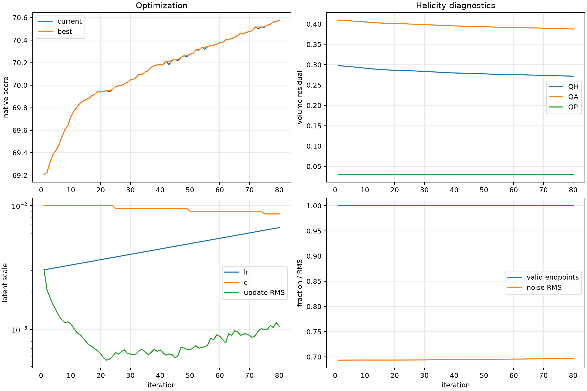

## 2. 本轮具体做了什么

固定 flow checkpoint、$N_{\rm FP}=4$ 和 3 根基线线圈。潜变量为

$$
z\in\mathbb R^{3\times100},
$$

flow 解码为

$$
x=F_\theta(z;N_{\rm FP},n_c),
$$

其中 $x$ 是包含 Fourier 系数和电流的物理线圈参数。优化目标始终是修正后的原生 QH score：

$$
S(z)=\operatorname{score}(F_\theta(z)).
$$

实现内容包括：

- FP32 RK4 flow 解码和自动步数校准；
- 4 个 QR 正交随机方向的 antithetic 零阶梯度；
- 最大化版本 Adam；
- 3 档 proposal 回溯；
- 潜变量先验软约束、硬截断和无效样本保护；
- 每轮状态、最佳样本、JSONL 历史和监控图原子保存；
- Slurm GPU 空闲预检、退出清理和 postflight 检查。

严格地说，score 不可微，因此这不是对 score 的反向传播。它是零阶黑箱梯度估计配合 Adam 更新，也可称为“一阶式黑箱优化”。

## 3. 为什么直接使用 256 步 RK4

### 3.1 已有绝对精度证据

前一轮 landscape 实验对真实高分 QUASR 样本做过 RK4 反向再正向闭环。256 步时线圈位置闭环 RMS 误差为

$$
2.26\times10^{-8}\ {\rm m}
\quad\text{到}\quad
4.57\times10^{-8}\ {\rm m},
$$

QH error 的重建差异不超过 $1.55\times10^{-7}$。这已经接近当前 FP32 模型和状态的数值底噪。

本轮不需要反向积分，但沿用相同的 FP32 RK4，可以避免把积分误差混入微小的正负扰动差。

### 3.2 本轮在线门控

正式优化前，在同一个中心、同一组 4 个正交方向和扰动 $c=0.01$ 上比较 64、128 和 256 步。每个候选步数都解码并评分中心及 8 个正负端点。以 256 步为局部参考，门控要求：

- 最大几何误差不超过实际扰动位移的 1%；
- 4 个方向导数的余弦不低于 0.98；
- 方向符号一致率为 100%；
- score 状态完全一致。

| RK4 步数 | 9 个 case 解码墙钟 | 几何误差 / 扰动位移 | 梯度余弦 | 符号一致率 | 通过 |
| ---: | ---: | ---: | ---: | ---: | --- |
| 64 | 1.100 s | 8.34% | 0.9629 | 100% | 否 |
| 128 | 1.280 s | 3.32% | 0.9858 | 100% | 否 |
| 256 | 2.532 s | 0 | 1.0000 | 100% | 是 |

128 步的梯度方向已经相当接近，但几何误差仍是本次真实扰动位移的 3.32%，没有达到预先固定的 1% 门槛。因此正式实验选择 256 步。

不再额外搜索 160、192 或 224 步，原因很直接：即使找到更便宜的合格点，每轮最多只节省约 1 s，而 score 每轮需要约 18.5 s。继续优化积分器不会改变总吞吐的主导项。

## 4. 零阶 Adam 的计算流程

### 4.1 梯度估计

每轮生成 $m=4$ 个相互正交、单位 RMS 的随机方向 $u_j$。对每个方向计算

$$
S_j^+=S(z+cu_j),
\qquad
S_j^-=S(z-cu_j),
$$

并构造

$$
\hat g(z)=\frac{1}{m}\sum_{j=1}^{m}
\frac{\operatorname{clip}(S_j^+-S_j^-,-15,15)}{2c}u_j.
$$

潜变量先验惩罚的梯度是解析计算的，不加入黑箱估计方差。本轮潜变量始终远离软约束，所以惩罚实际为 0。

### 4.2 Adam 与回溯

参数为 $\beta_1=0.9$、$\beta_2=0.99$。初始学习率为 0.003，单轮更新 RMS 上限为 0.0075。沿 Adam 方向同时评估 $1$、$1/2$ 和 $1/4$ 三档 proposal，选取有效且 merit 最好的候选。

每轮固定需要：

$$
2m+3=11
$$

次原生 score，其中 8 次用于梯度，3 次用于回溯。4 张 GPU 上每卡维持一个持久评分 worker；8 个 pair 端点分两批完成，3 个 proposal 再用一批完成。

80 轮选择 proposal 的次数为：整步 41 次、半步 24 次、四分之一步 15 次。回溯不是空设，后期确实多次抑制了整步过冲。

## 5. 优化结果

### 5.1 主结果

| 指标 | 起点或第 1 轮 | 第 80 轮 | 变化 |
| --- | ---: | ---: | ---: |
| native score | 69.1136 | **70.5778** | **+1.4641** |
| QH global error | 0.29776（第 1 轮） | **0.27158** | -8.79% |
| QA global error | 0.40971（第 1 轮） | **0.38767** | -5.38% |
| QP global error | 0.03003（第 1 轮） | **0.02969** | -1.15% |
| $\iota$ | 2.2662（第 1 轮） | **2.2927** | +0.0265 |
| 潜变量 RMS | 0.6933（第 1 轮） | **0.6968** | +0.0035 |
| 潜变量最大绝对值 | 2.3770（第 1 轮） | **2.4334** | +0.0564 |

这里 QH/QA/QP 的起始分量取第 1 个已接受状态，因为积分校准文件只持久化了初始总分，没有持久化初始完整 diagnostics。总分的起点 69.1136 是同一 256 步 RK4 和同一修正后评分器的校准中心，可直接比较。

每 10 轮的结果如下：

| 轮次 | score | QH global error |
| ---: | ---: | ---: |
| 10 | 69.7198 | 0.29150 |
| 20 | 69.9392 | 0.28624 |
| 30 | 70.0464 | 0.28346 |
| 40 | 70.1803 | 0.27969 |
| 50 | 70.2742 | 0.27755 |
| 60 | 70.3779 | 0.27545 |
| 70 | 70.4768 | 0.27368 |
| 80 | **70.5778** | **0.27158** |

前 40 轮提高 1.0667 分，后 40 轮仍提高 0.3974 分。增益在变慢，但最佳解位于最后一轮，不能说已经完全收敛。

### 5.2 稳定性

- 80/80 轮接受，640/640 个梯度端点状态为 `ok`。
- 当前 score 有 12 次小幅回落，最差单轮下降 0.0301 分；这是允许最多下降 0.1 分的信赖域策略。running best 不回退。
- 学习率从 0.00303 缓慢增到 0.00665，但平均更新 RMS 仅为 $8.74\times10^{-4}$，最大值 0.003，低于 0.0075 上限。
- 扰动从 0.0100 退火到 0.00857；最终梯度 RMS 为 0.884，仍有可测信号。
- 潜变量 RMS 始终约为 0.69，远低于 2.0 的软边界；没有通过离开 flow 训练分布来投机。

## 6. Native score 内部是否发生退化

仅看 native score 的最终 diagnostics，没有显示此前圆线圈、低 $\iota$ 或小磁面作弊模式。

| 物理量 | 第 80 轮最佳值 |
| --- | ---: |
| 磁轴残差 | $1.02\times10^{-8}$ |
| $\psi$ 训练 RMS | $7.85\times10^{-4}$ |
| $\psi$ 角度误差 P95 | $9.44\times10^{-5}$ |
| 稳定磁面数 | 10 |
| 长追踪完成周期 | 16 |
| 磁面漂移相对 P95 | 0.00823 |
| 单周期漂移相对 P95 | 0.00403 |
| 有效小半径 | 0.02629 m |
| 逆纵横比 | 0.02601 |
| 磁面体积 | 0.01379 $\mathrm{m}^3$ |
| $\iota$ | 2.2927 |
| QH edge error | 0.35888 |
| $\alpha$ 法向场相对 $L^2$ | $4.38\times10^{-5}$ |
| volume 有效点比例 | 100% |
| 线圈最小间距 | 0.09355 m |
| 线圈到磁轴最小距离 | 0.26072 m |
| 线圈曲率 P95 | 7.364 $\mathrm{m}^{-1}$ |
| 最大电流绝对值 | 305.8 kA |

关键 score 分项为：surface 87.91、coordinate 83.87、volume-QS 43.34、$\iota$ 100、coil 69.92。QH helicity advantage 为 0.3107，quality 为 1.0。磁面尺寸项仍为 0.9517，$\iota$ 门控为 1.0，因此本轮提升没有依靠缩掉磁面或把 $\iota$ 推向 0。

需要准确理解 QP error 数值较小这件事：最终评分并非只比较三个 residual 的绝对大小，还包含目标 QH 的 helicity advantage/quality 定义及 $\iota$ 门控。本轮 QH 和 QA 都下降，但 QH 相对 QA 的优势继续改善。因此在 **native score 自身定义内**，已知的低 $\iota$/小磁面门没有被绕过；下一节再用独立的 $\alpha+\nu$、庞加莱和 DESC 验收检查该高分是否对应真实磁面。

## 7. 正确的 $\alpha+\nu$ 磁面、庞加莱和 DESC 验收

### 7.1 流程纠错

上一版独立验收错误地走了旧的“点云曲面 $\rightarrow$ 直接 LS/Newton”路线，没有使用本项目已经验证的

$$
\psi\rightarrow\alpha\rightarrow\nu\rightarrow\text{受保护 Boozer 面}
$$

主链。因此上一版散乱庞加莱和失败 DESC 只能否定那张错误分支的小曲面，不能否定 $\psi$、候选线圈或 $\alpha+\nu$ 路线；据此作出的“最终样本物理失败”结论现已撤回。旧产物仅保留在 [invalid_old_ls_full_eval](assets/qh_flow_zo_adam_29465/invalid_old_ls_full_eval/) 供审计，以下所有结论均来自正确链路。

本次纠错并不只包含主链选错。完整实现与交付审计还发现：最初把 `a=0.05` 当成最终范围而没有向外找面；guarded Newton 缺少绝对 residual 门槛且失败面可能沿用可用文件名；GPU 空闲检查错误地观察整台节点而非 Slurm 可见卡；nu 诊断虽然申请 GPU，但场评估、傅里叶投影和曲面重建实际主要走 CPU；庞加莱边界截面没有闭合；正式运行与调试重提混杂；DESC 成功生成的诊断图没有全部进入报告。上述问题均已逐项写入《精简线圈评估流程》的错误复盘、硬门槛和自动交付检查，不能仅以“本次结果后来修正了”视为解决。

### 7.2 宽域 $\psi$ 与最大可行面

`psi.a` 是 $\psi$ 拟合的采样域半径，不是最终磁面小半径。复用稳定版已经计算的五个 $\psi$ 模型后，独立的拟合与 cheap field-line screen 为：

| $a$ | $\psi$ validation RMS | 角误差 P95 | 最大 screen 通过 $s$ | 该层平均/最大半径 |
| ---: | ---: | ---: | ---: | ---: |
| 0.05 | $8.16\times10^{-4}$ | $9.75\times10^{-5}$ | 0.36 | 0.0315 / 0.0376 m |
| **0.08** | **$8.40\times10^{-4}$** | **$1.73\times10^{-4}$** | **0.30** | **0.0466 / 0.0613 m** |
| 0.12 | $1.06\times10^{-3}$ | $3.61\times10^{-4}$ | 0.08 | 0.0352 / 0.0435 m |
| 0.16 | $1.90\times10^{-3}$ | $9.02\times10^{-4}$ | 0.02 | 0.0231 / 0.0269 m |
| 0.20 | $3.62\times10^{-3}$ | $2.91\times10^{-3}$ | 0.004 | 0.0129 / 0.0145 m |

因此选 `a=0.08` 的模型，并在 `s_edge=0.12,0.20,0.24,0.30` 上分别重新拟合固定阶 $(12,12,16)$ 的 $\alpha$、12 阶 $\nu$，而不是从一套外层拟合中截取内面。受保护 Newton 的统一结果为：

| $s_{\rm edge}$ | $|V|$ | $\iota$ | 离网格 relative $L^2$ | 法向场 P95 | $\psi$ 法向距离 P95 | Newton 位移 P95 / 门槛 | 判定 |
| ---: | ---: | ---: | ---: | ---: | ---: | ---: | --- |
| 0.12 | 0.01665 $\mathrm{m}^3$ | 2.3408 | $3.93\times10^{-5}$ | $5.27\times10^{-5}$ | 0.304 mm | 1.156 / 1.390 mm | 通过 |
| **0.20** | **0.02863 $\mathrm{m}^3$** | **2.3828** | **$4.42\times10^{-5}$** | **$5.71\times10^{-5}$** | **0.612 mm** | **1.463 / 1.817 mm** | **通过，最终选择** |
| 0.24 | 0.03467 $\mathrm{m}^3$ | 2.3954 | $1.69\times10^{-3}$ | $4.06\times10^{-4}$ | 0.681 mm | 1.952 / 2.004 mm | residual/法向场失败 |
| 0.30 | 0.04402 $\mathrm{m}^3$ | 2.4021 | $1.05\times10^{-2}$ | $6.20\times10^{-3}$ | 3.455 mm | 2.222 / 2.249 mm | residual/法向场失败 |

这给出了连续分支上清晰的“最大已测可行面” $s_{\rm edge}=0.20$，并由紧邻外层 $s=0.24$ 的失败限定边界；没有停在 `a=0.05` 的近轴微管。最终面的平均小半径约 0.0363 m，体积约为错误旧面 $1.19\times10^{-3}\,\mathrm{m}^3$ 的 24 倍。

绝对门槛随后固化进执行脚本并做了端到端烟测：$s=0.20$ 作业退出 0、全部检查为 true 且只生成 `boozer_guarded.npz`；$s=0.24$ 作业退出 3、residual/法向场检查为 false 且只生成 `boozer_rejected.npz`。失败候选不能再仅凭文件存在进入庞加莱或 DESC。

在最终面对应的体拟合中，磁通标定保持单调，截面磁通相对标准差最大值为 0.00564；$\alpha$ 验证 relative $L^2$ 为 0.1017，$1+\lambda_\theta$ 最小值为 0.203；$\nu$ 映射 Jacobian 最小值为 0.672。也就是说体拟合并非机器精度，但两个坐标变换均无折叠，受保护 Newton 最终把外层物理 residual 压到 $10^{-5}$ 量级。

### 7.3 正确庞加莱验收

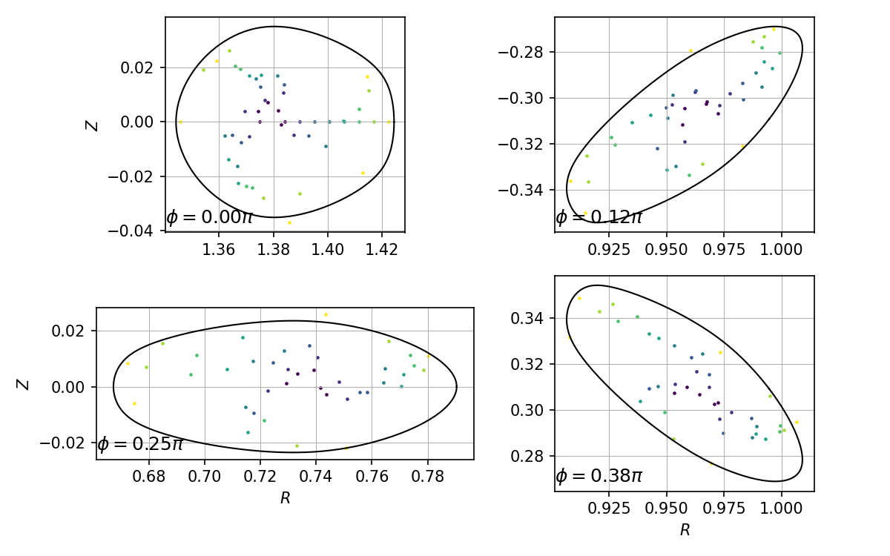

8 条场线在 4 个环向截面各有 21 个命中，按初始半径形成由内到外的有序嵌套层，且均位于候选边界内。启用同一个 `psi_model.npz` 后，最外线的相对 $s$ 漂移 P95 为 0.0456，所有命中的绝对 $s$ 漂移 P95 为 0.00624。$\psi$ 是有限精度近似不变量，但结果与其小角度误差一致；上一版那种跨区域散射确实来自错误曲面路径，而不是该线圈的真实场线结构。

### 7.4 $|B|$ 与三维几何

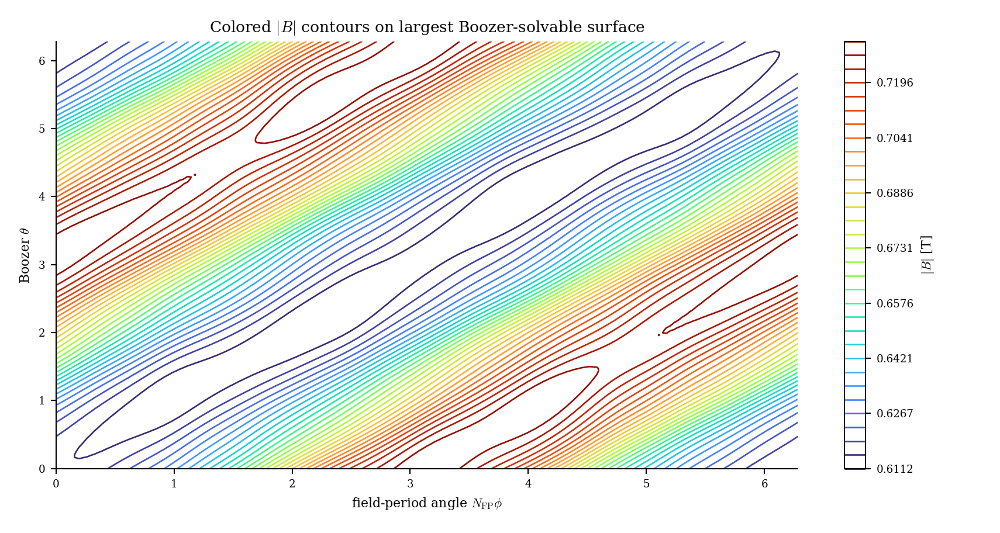

正确外层面上的 $|B|$ 范围为 0.61116 到 0.73122 T，平均值为 0.66729 T；白底彩色等高线呈连续 QH 螺旋条纹，线条颜色表示 $|B|$ 大小。

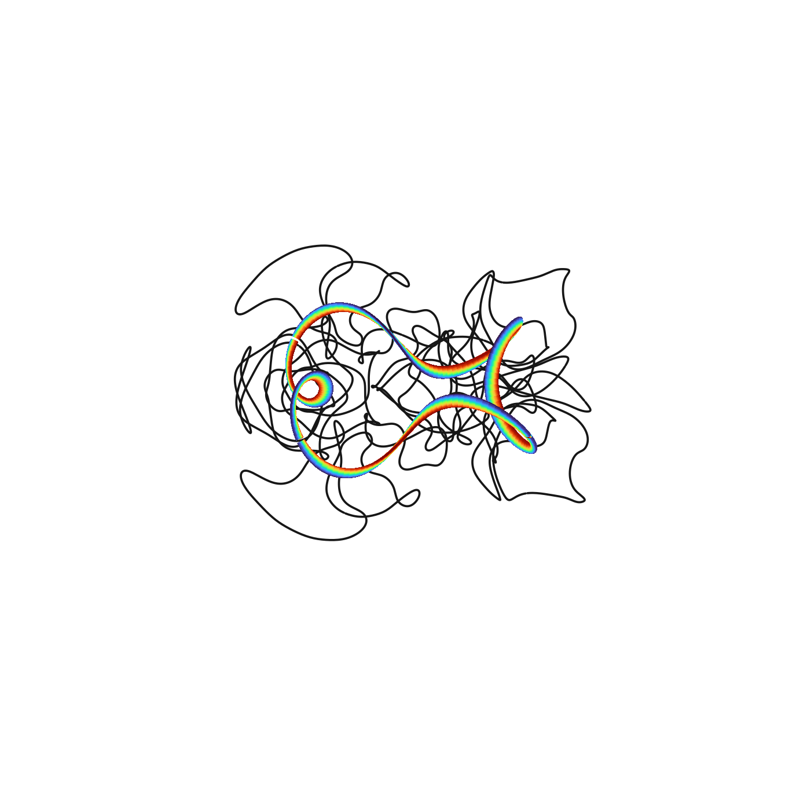

交互产物：[Boozer $|B|$ HTML](assets/qh_flow_zo_adam_29465/alpha_nu_correct/medium_best_29465_a0p08_s0p20_full/assets/boozer_b.html)；[完整线圈与磁面 HTML](assets/qh_flow_zo_adam_29465/alpha_nu_correct/medium_best_29465_a0p08_s0p20_full/assets/coils_surface.html)。

### 7.5 DESC 复核

DESC 使用同一个受保护外层面、真实 Biot--Savart 场积分得到的环向磁通 $-1.8495\times10^{-3}\,\mathrm{Wb}$、零压强和零环向电流。当前 CUDA-enabled JAX 不可用，因此明确放在 Students 的 16 核纯 CPU 作业，不占 GPU。

| DESC 指标 | 结果 |
| --- | ---: |
| 初始/最终嵌套 | true / true |
| 初始平均归一化力误差 | 0.94495 |
| 最终平均归一化力误差 | $3.26\times10^{-3}$ |
| 最终 P95 归一化力误差 | $8.15\times10^{-3}$ |
| 最终最大归一化力误差 | 0.0792 |
| 优化器 cost | 0.17461 |
| 停止原因 | 50 次迭代上限，optimizer success=false |

虽然优化器达到迭代上限，但最终保持嵌套，平均和 P95 力误差均低于默认 $10^{-2}$ 门槛；这是物理上可信但尚未做分辨率收敛的 DESC 复核，不应写成“优化器收敛”。

本次 DESC 作业成功生成 1 张初始诊断图和 7 张最终诊断图。以下逐张引用全部 8 张图，而不是只展示其中几张。

初始边界用于核对 $alpha+\nu$ 外层面进入 DESC 后是否保持原有几何；最终边界用于检查求解过程中是否出现折叠或异常漂移。

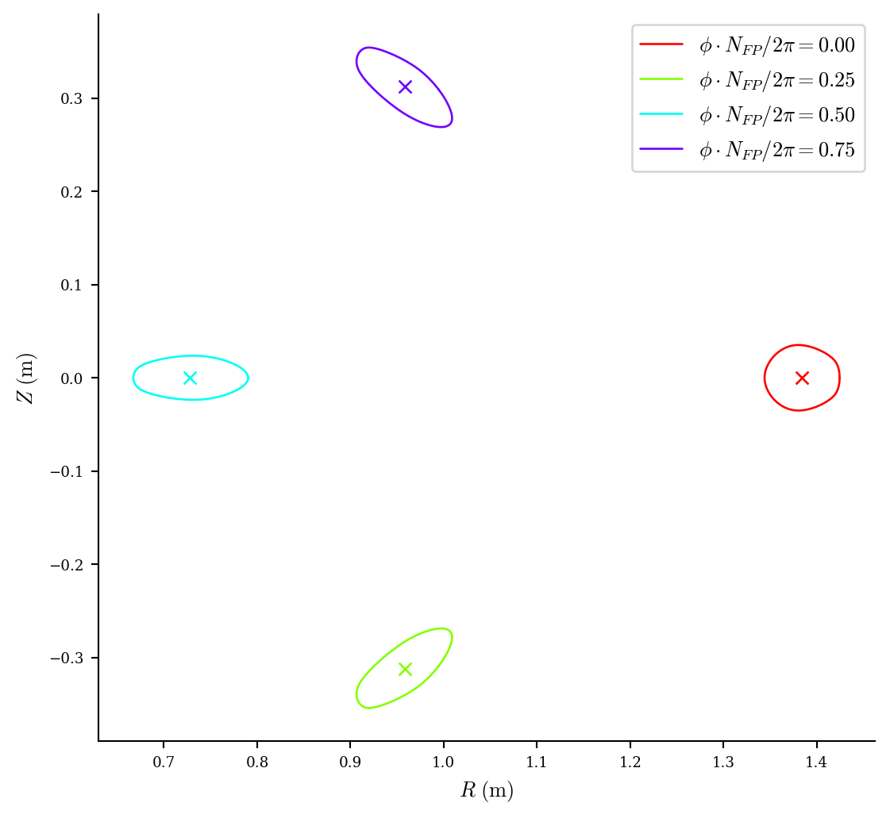

最终 $iota(\rho)$ 如下。

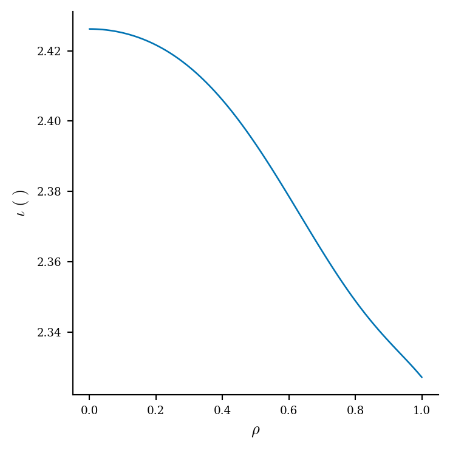

下面两张图分别给出最终平衡的 Boozer 坐标 $|B|$ 分布和 $B_{M,N}(\rho)$ 模谱。前者检查 QH 条纹是否连续，后者检查非目标模及其径向变化。

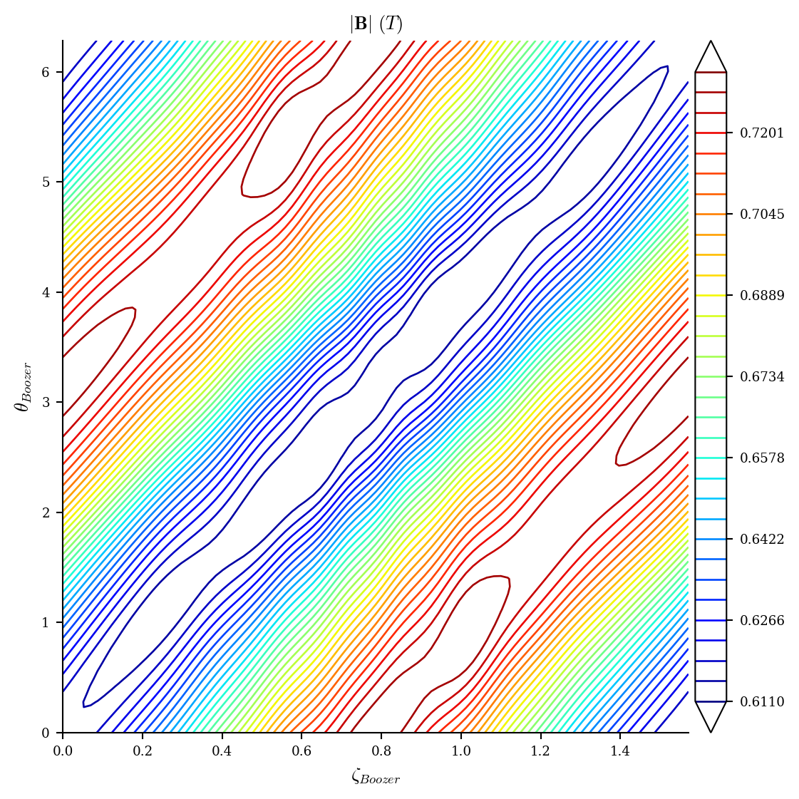

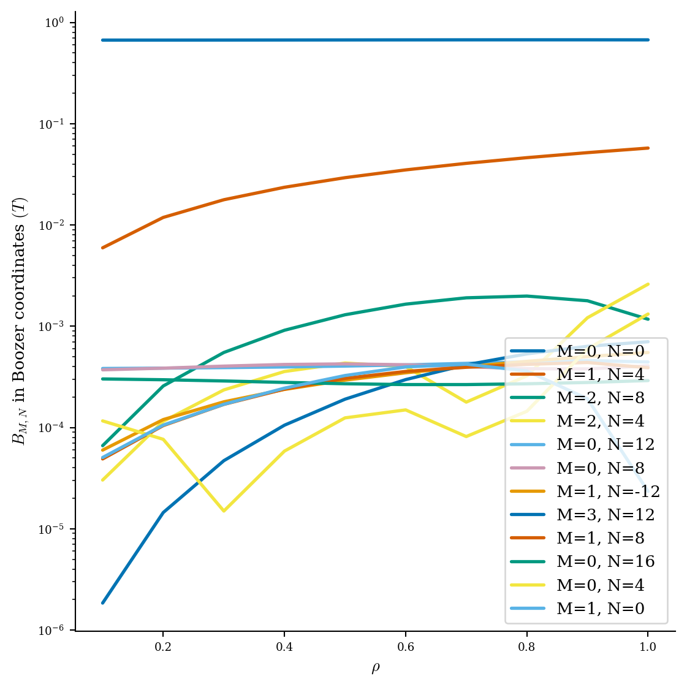

最后三张图使用同一个最终平衡，分别按 QA、目标 QH 和 QP helicity 分解 QS 误差随 $\rho$ 的变化。QH 是本任务的目标通道，QA/QP 同时保留用于识别错误对称性竞争。

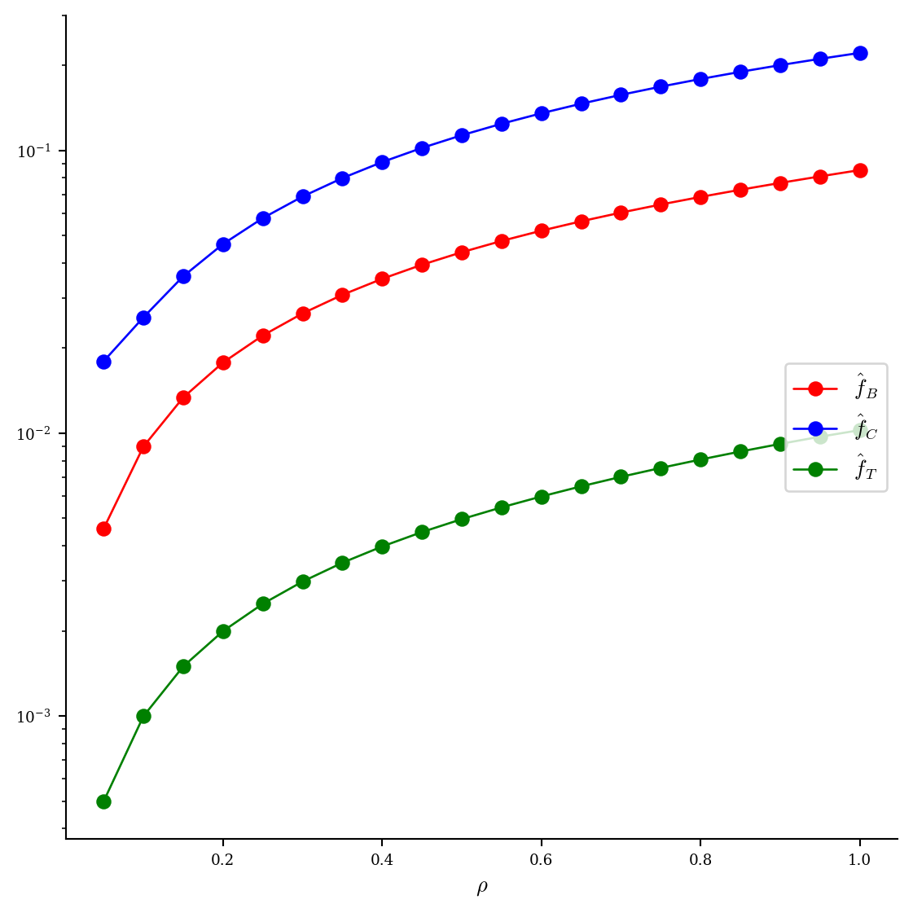

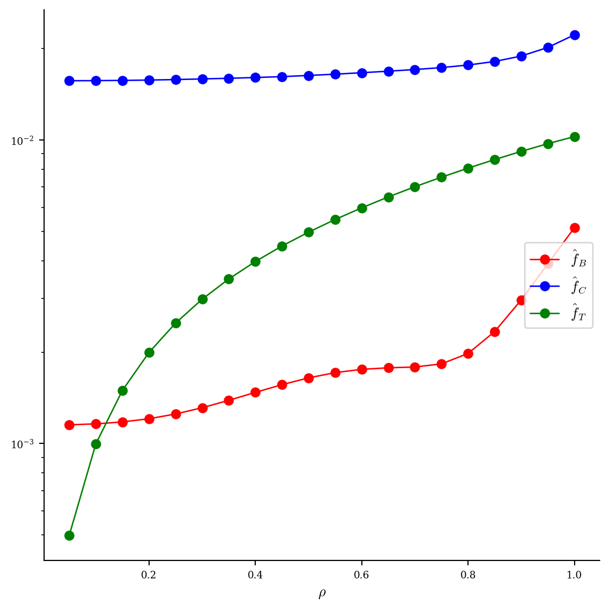

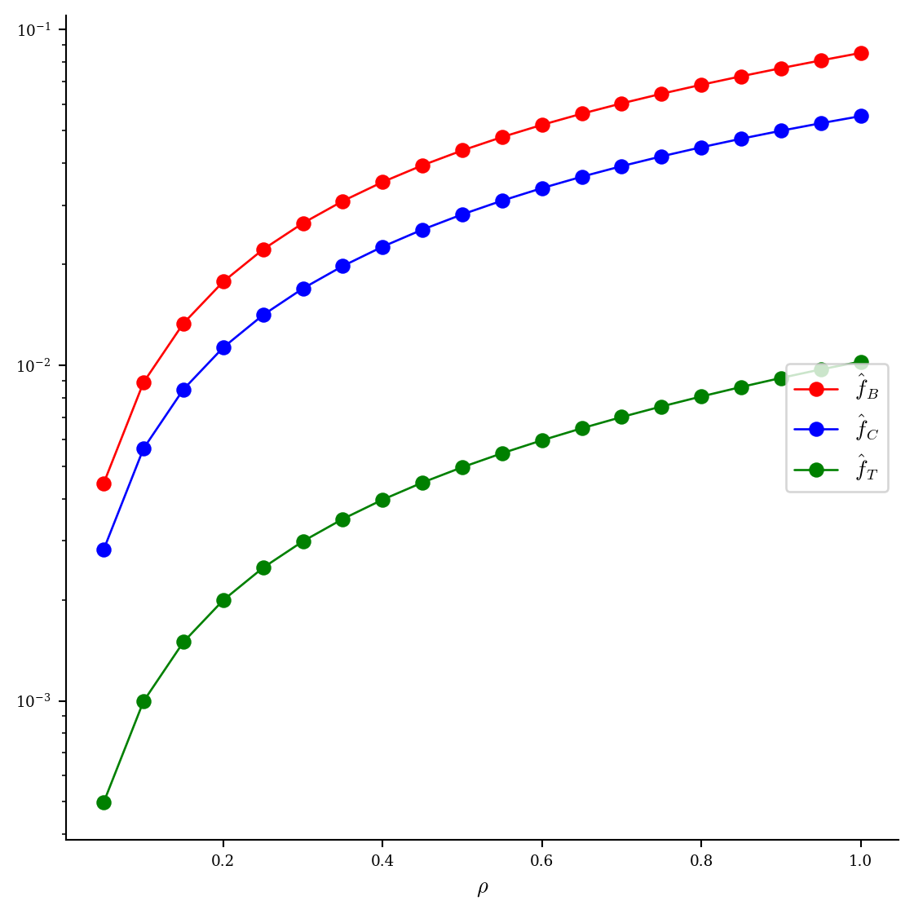

这 8 个引用已通过自动清单检查：DESC 核心 5 图（最终 boundary、Boozer $|B|$、$B_{M,N}(\rho)$、目标 QH、$\iota(\rho)$）齐全，且 `summary.json` 中所有成功生成的附加图也均已进入报告。

完整原始产物：[source $\psi$ summary](assets/qh_flow_zo_adam_29465/alpha_nu_correct/source_psi_a0p08/summary.json)、[$\psi$ model](assets/qh_flow_zo_adam_29465/alpha_nu_correct/source_psi_a0p08/psi_model.npz)、[full_summary.json](assets/qh_flow_zo_adam_29465/alpha_nu_correct/medium_best_29465_a0p08_s0p20_full/full_summary.json)、[DESC summary](assets/qh_flow_zo_adam_29465/alpha_nu_correct/medium_best_29465_a0p08_s0p20_full/desc/summary.json)、[受保护外层面 summary](assets/qh_flow_zo_adam_29465/alpha_nu_correct/medium_best_29465_a0p08_s0p20/guarded_rho_1/summary.json)、[$\alpha$ summary](assets/qh_flow_zo_adam_29465/alpha_nu_correct/medium_best_29465_a0p08_s0p20/alpha/summary.json)、[$\nu$ summary](assets/qh_flow_zo_adam_29465/alpha_nu_correct/medium_best_29465_a0p08_s0p20/alpha_nu/summary.json)、[DESC input](assets/qh_flow_zo_adam_29465/alpha_nu_correct/medium_best_29465_a0p08_s0p20_full/desc/input.check) 和 [equilibrium.h5](assets/qh_flow_zo_adam_29465/alpha_nu_correct/medium_best_29465_a0p08_s0p20_full/desc/equilibrium.h5)。最终 `boozer_guarded.npz` 的 SHA-256 为 `e278b25aaf0fe57142a0cd8cca6fc85b9cb709cdd06f4066bfbd2617b6f052f7`。

## 8. 耗时与资源

正式中等实验使用 4 张运行前为空闲的 RTX 5090 和 16 CPU。

| 阶段 | 工作量 | 墙钟 |
| --- | ---: | ---: |
| RK4/score 在线校准与初始化 | 27 次 score | 约 70 s |
| 每轮 flow 解码 | 11 个 case | 平均 4.720 s |
| 每轮 native score | 11 个 case，4 卡三批 | 平均 18.519 s |
| 单轮总计 | 11 次 score | 平均 23.246 s |
| 单轮 P95 / 最大值 |  | 23.278 / 23.333 s |
| 80 轮优化 | 880 次 score | 1859.7 s |
| 完整程序 | 907 次 score | 1929.99 s |
| Slurm 作业 | 含启动和清理 | 32 min 22 s |

按完整程序墙钟除以 907 次逻辑 score，四卡并行下摊销为 2.128 s/case。单个 worker 的一次 score 约 6.1 s；通过 4 卡并行把 11 个 case 分三批完成。

GPU preflight 和 postflight 均为每卡 2 MiB、0% utilization。作业退出码为 0，结束后 Slurm 队列为空，没有遗留优化器或评分 worker 进程。

修正后的物理验收计时与优化器本身分开。最终 `s=0.20` 单候选中，磁通标定 57.1 s，完整固定阶 $\alpha$ 147.1 s（其中 QR solve 7.03 s），三半径 $\nu$ 86.1 s；包含受保护 Newton、初始化和清理的 alpha+nu Slurm 墙钟为 5 min 11 s。开发阶段把 `s=0.12,0.20,0.24` 三个候选放在三张空闲 5090 上并行，三者在 5 min 10--20 s 内全部结束；`s=0.30` 的先导失败实验单独为 5 min 48 s。

本次原始 `s=0.20` 作业的 backend 审计如下。`gpu_preflight.csv` 和 `gpu_postflight.csv` 只能证明分配卡在作业边界空闲，不能证明中间算子使用了 GPU；下表结论来自实际调用代码和分阶段计时。

| 子阶段 | 本次实际 backend | 本次计时 | 判断 |
|---|---|---:|---|
| 磁通标定与 alpha 训练/验证场采样 | C++/CUDA | 磁通标定 57.1 s | GPU |
| alpha 设计矩阵与 QR | PyTorch CUDA FP64 `gels` | assemble 1.36 s，solve 7.03 s | GPU |
| nu 的 psi 等值面提取 | C++/CUDA | 外两层约 0.03 s/层 | GPU |
| nu 训练/验证场采样 | Simsopt Biot--Savart | 约 0.18 s/层 | CPU，原实现未接已有 CUDA 场接口 |
| nu 傅里叶正交投影 | NumPy | 约 0.11 s/层 | CPU，但不是当前瓶颈 |
| 每层 alpha 曲面拟合与 nu 修正面重建 | Simsopt/NumPy/SciPy | 约 7.6 s + 14.9 s/层 | CPU，是 86.1 s 的主要来源 |
| guarded Boozer Newton 与密集验收 | Simsopt | 未单独完整拆分 | CPU |
| DESC | JAX CPU，16 核 | 321.7 s | 显式 CPU 作业，没有占 GPU |

因此，不能把本次作业描述成“alpha+nu 全程 GPU”。修正后的生产脚本已把 alpha 的场采样与 QR、nu 的训练/验证场采样和 guarded 线搜索的密集场验收切到 C++/CUDA 或 PyTorch CUDA FP32，并在各级 summary 中强制记录 backend；需要空间导数的 Boozer Newton、Simsopt 曲面拟合以及仅约 0.11 s/层的小型 nu 正交投影仍显式保留在 CPU。alpha+nu 的任务是提供稳定初值，最终是否可用仍由 $10^{-4}$ 物理 residual 门控，因此没有理由为这部分高吞吐计算固定使用 FP64。不能再用“申请了 GPU”掩盖 CPU 执行。

生产默认改为 FP32 后，又在同一张空闲 RTX 5090 上用完整 12 万训练点、6 万验证点、三个 nu 半径和 `s=0.20` guarded 面做了端到端 smoke（Slurm job 29638），并与紧邻的全 GPU 场评估 FP64 smoke（job 29634）比较：

| 指标 | FP64 | FP32 | 差异 |
|---|---:|---:|---:|
| alpha QR solve | 6.931 s | 1.911 s | -72.4% |
| alpha 总时间 | 149.55 s | 148.03 s | -1.52 s |
| alpha 验证 relative $L^2$ | 0.101695870 | 0.101695875 | $5.10\times10^{-9}$ |
| $\min(1+\lambda_\theta)$ | 0.2031034 | 0.2031016 | $-1.75\times10^{-6}$ |
| nu 总时间 | 78.96 s | 77.79 s | -1.18 s |
| guarded final relative $L^2$ | $4.41968\times10^{-5}$ | $4.41974\times10^{-5}$ | $5.99\times10^{-10}$ |
| guarded 法向场 P95 | $5.71167\times10^{-5}$ | $5.71595\times10^{-5}$ | $4.28\times10^{-8}$ |
| guarded final $\iota$ | 2.382813686 | 2.382813685 | $5.20\times10^{-10}$ |
| 最终 surface dofs 最大绝对差 |  |  | $7.68\times10^{-11}$ |
| alpha+nu Slurm 墙钟 | 5 min 35 s | 5 min 00 s | -35 s |
| 绝对门槛判定 | PASS | PASS | 不变 |

FP32 没有改变可行面结论或坐标可逆性，且最终误差仍低于 $10^{-4}$ 门槛，因此作为初值链路的默认精度成立。QR 本身明显加速，但端到端只快 35 s，再次说明主要瓶颈是磁通标定和 CPU 曲面处理，而不是 QR。FP32 原始产物保存在 [fp32_smoke_s0p20](assets/qh_flow_zo_adam_29465/alpha_nu_correct/fp32_smoke_s0p20/)；其中 [alpha summary](assets/qh_flow_zo_adam_29465/alpha_nu_correct/fp32_smoke_s0p20/alpha/summary.json)、[nu summary](assets/qh_flow_zo_adam_29465/alpha_nu_correct/fp32_smoke_s0p20/alpha_nu/summary.json) 和 [guarded summary](assets/qh_flow_zo_adam_29465/alpha_nu_correct/fp32_smoke_s0p20/guarded_rho_1/summary.json) 均记录了逐阶段 backend 与精度。

正确外层面的庞加莱与静态/HTML 可视化耗时 33.0 s。CPU DESC 阶段为 321.7 s，含导入、预检和写盘的完整保存面作业为 407.6 s，即 6 min 48 s。生产情况下已知 `a=0.08` 和候选层后，alpha+nu 与完整下游串行约 12 min；仍在《精简线圈评估流程》的 15 min 硬上限内，但尚未达到 5--8 min 目标。当前瓶颈依次是 CPU DESC、磁通标定和曲面重参数化，不是 QR。

## 9. 版本与可复现产物

flow checkpoint 为 30,000 step EMA，SHA-256：

`39a3293a459e248a0d1ec062607a1a467128b14d8ca973aadd82e113532ab99f`

本 worktree 新构建的 native 库 SHA-256 为：

`0b7342db471788385931385c25ded8095c72cfb7fcea1e21376a0475dafaa427`

它与先前 landscape worktree 的二进制哈希不同，但从修正 landscape 提交到本分支对 `gpu_backend` 和 Python QS 参考实现的源码 diff 为空，因此不是评分公式版本变化。构建路径和链接产物不同会改变二进制哈希；物理符号修正源码保持一致。

旧 flow-prior CEM 文件记录的 50.5862 分产生于全局电流反号 bug 修正前，不能和本轮曲线直接比较。同一个起点在修正后评分器、256 步 RK4 下重评分为 69.1136。本报告只用修正后的 69.1136 到 70.5778 做因果比较。

关键产物：

- [summary.json](assets/qh_flow_zo_adam_29465/summary.json)：最终汇总和完整 diagnostics；
- [integration_calibration.json](assets/qh_flow_zo_adam_29465/integration_calibration.json)：RK4 门控；
- [history.jsonl](assets/qh_flow_zo_adam_29465/history.jsonl)：逐轮原始记录；
- [best.json](assets/qh_flow_zo_adam_29465/best.json)：最佳物理线圈和潜变量；
- [progress.png](assets/qh_flow_zo_adam_29465/progress.png)：score、helicity、步长和有效率曲线；
- [gpu_preflight.csv](assets/qh_flow_zo_adam_29465/gpu_preflight.csv) 与 [gpu_postflight.csv](assets/qh_flow_zo_adam_29465/gpu_postflight.csv)：资源验收。

## 10. 当前判断与下一步

本轮满足“中等长度验证优化算法有效”的数值标准：总分和 QH 相关量持续改善；没有无效端点、先验逃逸、低 $\iota$ 或 native 磁面缩小；吞吐没有长尾；最佳解在最后一轮。

修正后的独立物理验收也通过：沿 $\alpha+\nu$ 路线找到体积 0.0286 $\mathrm{m}^3$、$\iota=2.383$ 的外层面；庞加莱显示有序嵌套；DESC 初始和最终都嵌套，最终平均归一化力误差为 $3.26\times10^{-3}$。因此先前“70.58 分样本只有小面、真实场线和 DESC 均失败”的结论完全由评估路线错误造成，不能保留。

这次结果证明的是：在这个起点和 80 轮预算下，潜空间零阶 Adam 能继续提高 score，并得到至少通过当前全链路物理验收的 QH 候选。它仍不能证明该方法总体优于 CEM，也不能证明当前 score 已不存在其他作弊方向。

仍有四条边界：

1. 这是单起点、单随机种子的局部精修，不代表从 flow 先验随机点启动时的总体成功率。
2. 尚未按相同 score 调用次数与多个种子直接比较 CEM 和零阶 Adam。
3. DESC 达到 50 次迭代上限，虽然力误差已过默认门槛，但没有做分辨率或迭代收敛研究。
4. 三维线圈几何仍较复杂；现有 coil score 分项通过不等价于工程上已可制造，需要单独的工程约束审计。

下一步应在保持 RK4 256 步和当前 score 不变的前提下，先做少量多种子中等长度复现，比较 CEM 与零阶 Adam 达到同一物理验收门槛所需的 score 调用数。长跑前还应把“下游正式验收只能使用 $\alpha+\nu$ 受保护外层面”的路径检查固化到产物 hash，防止再次发生本报告纠正的流程错误。
