# QH 潜空间标准 Adam 作业验收报告

日期：2026-07-31

## 1. 验收结论

本轮交付只能判定为**部分验收**，不能判定为“多起点实验完成”。

| 对象 | 结论 | 原因 |
|---|---|---|
| `29708`，CEM 潜变量起点，标准 Adam 长跑 | 通过 | 正常退出，273 步完整，score 从 69.1228 提高到 71.7342 |
| `29709`，8 个不筛选随机起点 | 不通过 | 只完成 seed `2026073100`；启动第二个 seed 时 PyTorch/oneMKL 加载失败，后 7 个未运行 |
| 随机起点成功率结论 | 不可给出 | 计划样本数为 8，实际完整样本数为 1 |
| 新最高分线圈的完整物理验收 | 后续通过 | 见第 8 节；已完成大磁面、$\alpha+\nu$、guarded Boozer、庞加莱和 DESC 全套复核 |
| 资源清理 | 通过 | 两个作业退出后四张卡均为 2 MiB、0% 利用率，没有残留优化器或 score worker |

因此，本轮能支持的结论是：

1. 固定学习率 $\eta=0.003$ 的标准 Adam 能从已有高分 CEM 潜变量继续稳定提高 score。
2. 唯一完成的普通随机起点虽然从无效区域进入了可评估区域，但 120 步后仍只有 7.12 分，远未进入高分盆地。
3. 由于另外 7 个起点没有运行，当前数据不能回答“随机起点进入可优化高分盆地的概率是多少”。
4. 初次作业验收时，71.7342 还只是 native score 下的筛选结果；随后完成的独立物理验收见第 8 节。

## 2. 固定实验口径

两类作业使用同一套优化器：

$$
\hat g_t=\frac{1}{4}\sum_{j=1}^4
\frac{S(z_t+c u_j)-S(z_t-c u_j)}{2c}u_j,
\qquad c=0.01,
$$

随后按标准 Adam 做 score ascent：

$$
m_t=0.9m_{t-1}+0.1\hat g_t,
$$

$$
v_t=0.999v_{t-1}+0.001\hat g_t^2,
$$

$$
z_{t+1}=z_t+0.003\frac{\hat m_t}{\sqrt{\hat v_t}+10^{-8}}.
$$

没有 AdamW、权重衰减、学习率调度、先验惩罚、梯度差裁剪、更新裁剪、参数裁剪、proposal 搜索、回溯或 accept/reject。每步计算 8 个反向配对扰动端点和 1 个更新后中心，共 9 次逻辑 score；四张 RTX 5090 并行处理端点。flow 解码固定为 FP32、RK4 256 步。

关键版本：

- flow checkpoint：EMA step 30,000；SHA-256 为 `39a3293a459e248a0d1ec062607a1a467128b14d8ca973aadd82e113532ab99f`；
- 旧的错误 native score 动态库：`d2cfcab1923e0fd80a2ed5d31dbc8573a72a77e9bfb7cdd4d7e2847f4e18bdc9`，不是本轮使用版本；
- 本轮实际并已校验的 score 动态库：`0b7342db471788385931385c25ded8095c72cfb7fcea1e21376a0475dafaa427`；
- 目标：QH，$N_{\mathrm{FP}}=4$，3 个基本线圈；
- 潜变量形状：$3\times100$。

上面特意同时列出错误旧 hash 和正确 hash，是为了防止再次把旧二进制结果混入比较；本报告所有数值均来自正确 hash。

## 3. CEM 起点长跑：通过

### 3.1 主结果

Slurm 作业 `29708` 正常完成，退出码为 0。优化器在内部 6900 s 墙钟预算处停止，完成 273 步；Slurm 总墙钟为 1 h 55 min 23 s。

| 指标 | 数值 |
|---|---:|
| 初始 score | 69.1227768 |
| 最终 score | 71.7298662 |
| 最佳 score | 71.7342388 |
| 最佳步 | 271 |
| 总提升 | 2.6114620 |
| 平均每步墙钟 | 24.961 s |
| 逻辑 score 次数 | 2458 |
| 四卡并行后的逻辑样本均摊墙钟 | 2.800 s/sample |
| 初始潜变量 RMS | 约 0.693 |
| 最终潜变量 RMS | 0.69925 |
| 全程扰动端点有效率 | 100% |

轨迹没有依赖 accept/reject 维持单调：当前 score 会小幅下降，但历史最佳值持续提高。关键里程碑为：第 27 步超过 70 分，第 88 步超过旧混合优化器的 70.5778，第 142 步超过 71 分，第 192 步超过 71.5，第 234 步超过 71.7。

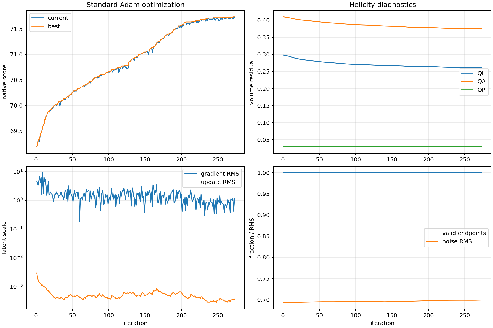

该图由原始 `history.jsonl` 原样重绘，仅把会误称 CEM 起点为 “random noise” 的通用标题改成 “Standard Adam optimization”；数据没有重算。

最后 23 步只把历史最佳值提高约 0.018 分，曲线已经明显变缓；但最佳点仍出现在第 271 步，距离结束只有两步。因此可以说“接近平台”，不能严格声称已经收敛。

### 3.2 最佳点的 score 分解

| 分量 | 分数 |
|---|---:|
| axis | 97.9041 |
| $\psi$ | 98.2240 |
| surface | 93.2654 |
| coordinate | 87.6079 |
| volume QS | 43.9567 |
| $\iota$ | 100.0000 |
| coil | 69.6535 |

该结果不是靠低 $\iota$、小磁面或无效点作弊：

| 诊断 | 数值 |
|---|---:|
| 磁轴残差 | $5.06\times10^{-9}$ |
| score 采用的 surface level | 0.25 |
| 逆纵横比 | 0.02560 |
| 估计磁面体积 | $0.01344\ \mathrm{m}^3$ |
| 一周期漂移 P95 | $9.51\times10^{-4}$ |
| 长程漂移 P95 | $1.20\times10^{-3}$ |
| $\iota$ | 2.30535 |
| QH 微分体 residual | 0.26173 |
| QA 微分体 residual | 0.37487 |
| QP 微分体 residual | 0.02911 |
| QH 相对 QA 优势量 | 0.31436 |

不过最弱分量仍然是 volume QS，只有 43.96 分。这说明 71.73 的总分来自轴、$\psi$、磁面、坐标和 $\iota$ 等多项共同较好，不等于 QH residual 已经很小。

### 3.3 与旧优化器的关系

旧的 80 步结果 70.5778 使用了 proposal 搜索、回溯、裁剪、先验惩罚和增长学习率，不能称为标准 Adam。本轮没有这些机制，却在第 88 步超过旧结果，并最终达到 71.7342。因此“标准 Adam 在高分 CEM 盆地里可以继续优化”已经得到直接验证。

这仍不能证明标准 Adam 总体优于 CEM：这里只有一个 CEM 起点，且没有按相同 score 调用次数做多种子比较。

## 4. 普通随机起点：只完成一个

seed `2026073100` 从标准高斯 flow prior 直接出发，没有做初始 score 筛选。

| 指标 | 数值 |
|---|---:|
| 初始 score | 0.3681156 |
| 最终 score | 7.1244335 |
| 最佳 score | 7.1249388 |
| 最佳步 | 119 |
| 总步数 | 120 |
| 总墙钟 | 2491.0 s |
| 平均每步墙钟 | 20.430 s |
| 首次 8 个端点全部有效 | 第 9 步 |

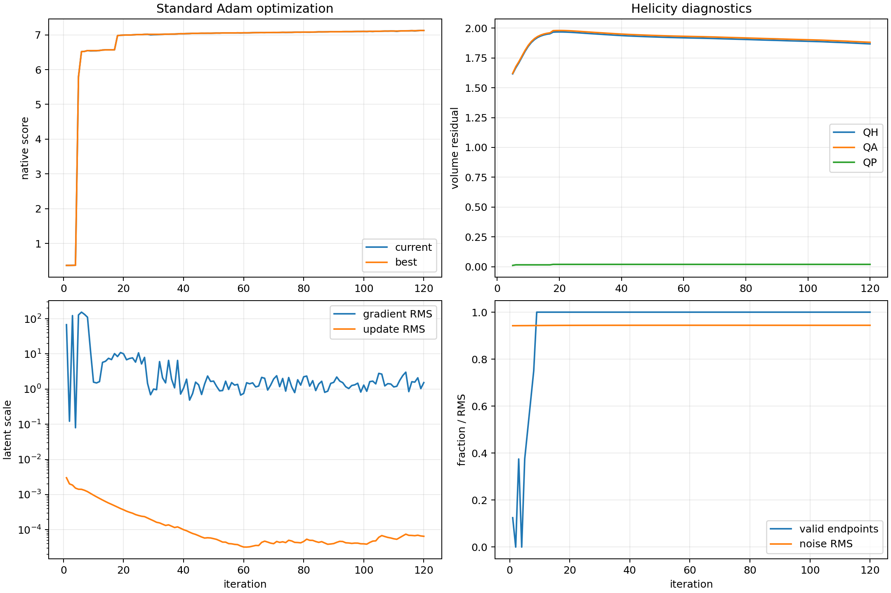

前 9 步主要是在把无效端点推入可评估区域；第 5 步 score 已超过 5，之后 100 多步只缓慢提高到 7.12。最佳点虽有良好的 axis、$\psi$、surface 和 $\iota$ 分量，但 QH residual 为 1.869，volume QS 分量只有 12.70，且 QH 相对 QA 的优势量仅 0.0406。它不是高质量 QH 候选。

这一条轨迹说明某些普通随机点可以被标准 Adam 修复为“可评估但低分”的样本；它既不能证明随机起点全都失败，也不能证明存在非零的高分成功率。

## 5. `29709` 失败定位

### 5.1 已确认的失败边界

1. seed `2026073100` 在 02:42:52 完整写出 120 步 summary，状态为 `ok`。
2. 约 11 秒后作业 stderr 记录：

   `Intel oneMKL FATAL ERROR: Cannot load .../torch/lib/libtorch_cpu.so.`

3. seed `2026073101` 的输出目录完全没有创建。
4. 优化器在模块第 12 行执行 `import torch`，而输出目录直到进入 `main()` 后才创建。因此第二个 seed 死在 PyTorch 初始化阶段，尚未解码 flow、尚未调用 native score，也没有进入 Adam。
5. Slurm 记录的峰值 RSS 约 3.68 GB，远低于申请的 128 GB；不是 OOM。
6. 作业结束后再次做动态依赖检查，没有发现 `libtorch_cpu.so` 的静态依赖缺失；四张 GPU 也已完全释放。

所以失败层级已经定位为：**同一个 Slurm 作业内串行启动第二个独立 PyTorch 运行时失败**。它不是随机起点本身的数值失败，也不是 score 拒绝该线圈。

### 5.2 代码层面的确定问题

`slurm_flow_prior_standard_adam_multistart.sh` 在一个作业里用 shell 循环依次启动 8 个完整 Python/PyTorch/CUDA/multiprocessing 进程，并启用 `set -e`。任意一次解释器启动失败都会立即终止整个多起点实验，且没有生成 batch summary 或逐 seed 失败记录。这种编排没有 seed 级故障隔离，是本次“一个环境错误毁掉后 7 个样本”的直接代码设计问题。

另外，成功的 `29708` 在退出时出现了 multiprocessing semaphore 的重复清理警告。`NativeScorePool.close()` 会停止 worker，但没有显式 `close()` 和 `join_thread()` 两个 multiprocessing queue。该 IPC 生命周期缺陷需要修复；它说明当前“反复启动和销毁完整运行时”的方式不够干净，但现有证据不足以证明它就是 oneMKL 加载失败的直接原因。

### 5.3 尚未证明的部分

当前依赖检查正常、内存充足，日志又只保留了 oneMKL 的顶层错误，没有底层 `dlopen` errno。若不做受控复现，无法在 oneMKL、网络文件系统瞬态、运行时反复初始化或 IPC 清理之间给出唯一因果解释。按用户要求，本次没有重跑，所以报告不伪造更深的根因结论。

后续正确的修复方向不是在原 shell 循环上简单重试，而是：

- 每个 seed 使用独立 Slurm array task，使 PyTorch/CUDA/multiprocessing 生命周期与作业生命周期一致；
- 每个 task 独立写 summary、退出码和 GPU pre/postflight；
- 汇总任务只读取已完成产物，不能因单个 task 失败丢失其它 seed；
- 修复 `NativeScorePool` queue 的显式关闭和 join；
- 支持只补缺失 seed，并严格禁止按初始 score 筛选。

这些是下一轮应实现和验证的内容，本轮没有执行补跑。

## 6. 完整物理验收状态（初次验收时）

本轮新最高分 `best.json` 的 SHA-256 为：

`92c8553821837e6c2723586f87ae7a04ef056cf0cdb39fd513c15f9b064a128c`

本节记录初次作业验收时的历史状态，现已被第 8 节的后续完整评估取代。当时尚缺少：

- 向外搜索得到的最大合理可行磁面；
- 独立 FP32 GPU $\alpha+\nu$ 初值；
- guarded Boozer residual 和庞加莱验证；
- 白底彩色 $|B|$ 等高线；
- 完整设备线圈加磁面 HTML；
- DESC boundary、Boozer modes、Boozer $|B|$、QH 分量和 $\iota(\rho)$。

不能用先前 70.5778 候选的完整评估替代，因为那不是同一组线圈。后续评估因此始终使用上述 SHA-256 对应的 71.7342 样本本身。

## 7. 原始产物

CEM 起点长跑：

- [summary.json](assets/qh_flow_standard_adam_acceptance_29708_29709/qh_flow_standard_adam_cem_2h_fixed/summary.json)
- [manifest.json](assets/qh_flow_standard_adam_acceptance_29708_29709/qh_flow_standard_adam_cem_2h_fixed/manifest.json)
- [history.jsonl](assets/qh_flow_standard_adam_acceptance_29708_29709/qh_flow_standard_adam_cem_2h_fixed/history.jsonl)
- [best.json](assets/qh_flow_standard_adam_acceptance_29708_29709/qh_flow_standard_adam_cem_2h_fixed/best.json)

唯一完成的随机起点：

- [summary.json](assets/qh_flow_standard_adam_acceptance_29708_29709/qh_flow_standard_adam_multistart_8x120_fixed/seed_2026073100/summary.json)
- [manifest.json](assets/qh_flow_standard_adam_acceptance_29708_29709/qh_flow_standard_adam_multistart_8x120_fixed/seed_2026073100/manifest.json)
- [history.jsonl](assets/qh_flow_standard_adam_acceptance_29708_29709/qh_flow_standard_adam_multistart_8x120_fixed/seed_2026073100/history.jsonl)
- [best.json](assets/qh_flow_standard_adam_acceptance_29708_29709/qh_flow_standard_adam_multistart_8x120_fixed/seed_2026073100/best.json)

作业日志：

- [29708 stdout](assets/qh_flow_standard_adam_acceptance_29708_29709/flow-adam-rnd-29708.out)
- [29708 stderr](assets/qh_flow_standard_adam_acceptance_29708_29709/flow-adam-rnd-29708.err)
- [29709 stdout](assets/qh_flow_standard_adam_acceptance_29708_29709/flow-adam-multi-29709.out)
- [29709 stderr](assets/qh_flow_standard_adam_acceptance_29708_29709/flow-adam-multi-29709.err)

最终判断：高分 CEM 盆地中的标准 Adam 有效；普通随机起点的总体成功率实验因 runner 故障未完成，不能验收，也不能下统计结论。

## 8. 71.7342 样本的完整物理验收（后续补充）

### 8.1 结论

对 `29708` 的最佳样本执行固定完整评估后，结论为：**通过当前物理验收门槛，但不是接近完美的 QH 位形**。

- 自适应向外搜索在 $s=0.30$ 找到最大已测通过面，紧邻外层 $s=0.36$ 明确失败；不是固定在近轴微管内。
- FP32 GPU $\alpha+\nu$ 给出了可逆初值，guarded Boozer 用 3 个受保护步把离网格相对残差降到 $4.63\times10^{-5}$。
- 庞加莱在 4 个环向截面上对 8 条场线各获得 21 个命中，点集有序且位于候选边界内。
- DESC 初始与最终体均嵌套；最终归一化力误差 mean/P95/max 为 $2.88\times10^{-3}$、$6.26\times10^{-3}$、$1.73\times10^{-2}$。
- DESC 优化器在 50 次迭代上限停止，`optimizer_success=false`，所以不能写成“优化器形式收敛”；但嵌套性和力误差门槛均通过。
- 直接面和 DESC 的 $|B|$ 都显示清楚的 QH 斜条纹，同时仍有可见非理想起伏；这与 native score 中只有 43.96 分的 volume-QS 分量一致。

这里的 $a=0.08$ 和以下 $s$ 扫描只适用于当前样本。$a$ 是本样本通过误差检查的 $\psi$ 拟合域，$s$ 是本样本向外搜索得到的层级；它们不是完整评估流程的固定常数，换一组线圈必须重新选择。

### 8.2 从 $\psi$ 到最大可行 Boozer 面

source $\psi$ 使用稳定主链、`a=0.08`、FP32 `fullgpu` QR：

| 指标 | 结果 |
|---|---:|
| 磁轴闭合残差 | $9.75\times10^{-9}$ |
| 磁轴拓扑 | elliptic |
| $\psi$ 训练 / 验证 RMS | $5.76\times10^{-4}$ / $5.81\times10^{-4}$ |
| $\psi$ 方向误差 P95 | $1.18\times10^{-4}$ |

外层搜索结果如下。体积列取绝对值；`relative L2` 和法向场 P95 均来自离网格 $97\times97$ 验证网格。

| $s$ | 判定 | $|V|$ ($\mathrm{m}^3$) | $\iota$ | relative $L^2$ | 法向场 P95 |
|---:|---|---:|---:|---:|---:|
| 0.12 | 通过 | 0.01646 | 2.3557 | $3.39\times10^{-5}$ | $4.94\times10^{-5}$ |
| 0.24 | 通过 | 0.03487 | 2.4195 | $4.14\times10^{-5}$ | $5.75\times10^{-5}$ |
| **0.30** | **通过并选中** | **0.04491** | **2.4626** | **$4.63\times10^{-5}$** | **$6.19\times10^{-5}$** |
| 0.36 | 拒绝 | 0.05423 | 2.4460 | $2.78\times10^{-2}$ | $1.15\times10^{-2}$ |

在选中面上，$\alpha$ 使用 120,000 个训练点、60,000 个验证点和 $(L,M,N)=(12,12,16)$。QR 本身为 `torch.linalg.lstsq(gels)` FP32 CUDA，耗时 0.80 s；验证 relative $L^2$ 为 0.08346，且 $\min(1+\lambda_\theta)=0.2301>0$，没有坐标折叠。

$\nu$ 使用 12 阶展开。修正前相对残差为 0.22896，修正后 Simsopt 离散残差为 0.006696；映射 Jacobian 范围为 0.6688--1.3782。随后 guarded Boozer 接受 3 步，将残差进一步降到 $4.63\times10^{-5}$，得到

$$
\iota=2.462595,\qquad G=-6.943557,\qquad |V|=0.044905\ \mathrm{m}^3.
$$

最终面相对 $\psi$ 等值面的线性化法向距离 P95 为 0.474 mm；相对 $\alpha+\nu$ 初始面的双向几何位移 P95 最大为 2.063 mm，低于本面 2.279 mm 的保护阈值。这说明 $\alpha+\nu$ 是有效初值，但在这个较大外层面上仍需要小规模 guarded 修正，不能把它与最终精确面混为一谈。

### 8.3 场线、$|B|$ 与三维几何

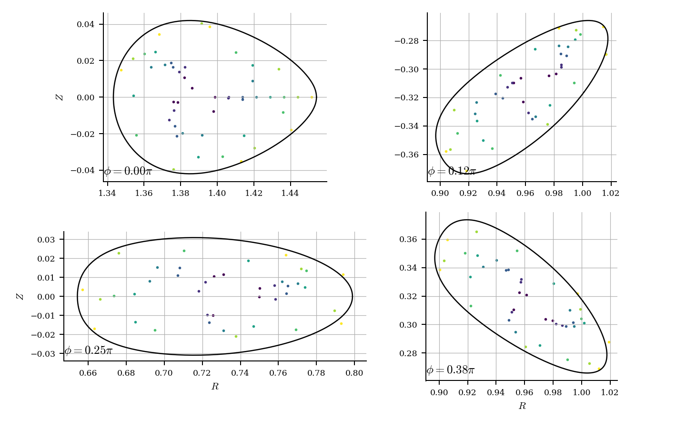

直接 Boozer 面上的 $|B|$ 范围为 0.58206--0.73471 T，平均值为 0.65512 T。图中线条颜色表示 $|B|$ 大小，不是热力图或填色等高线。

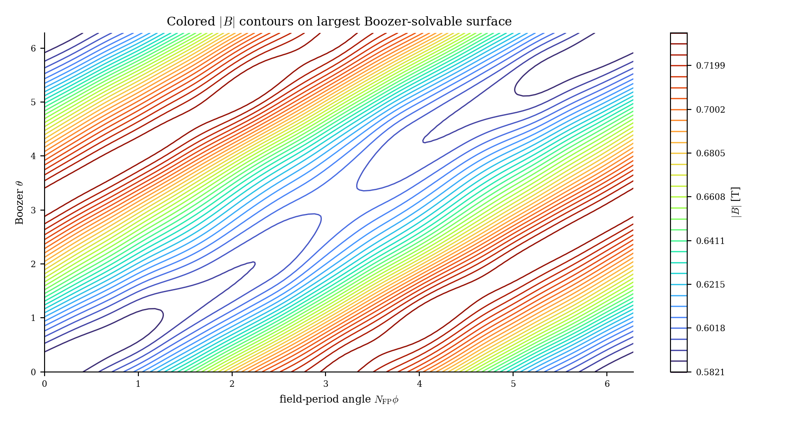

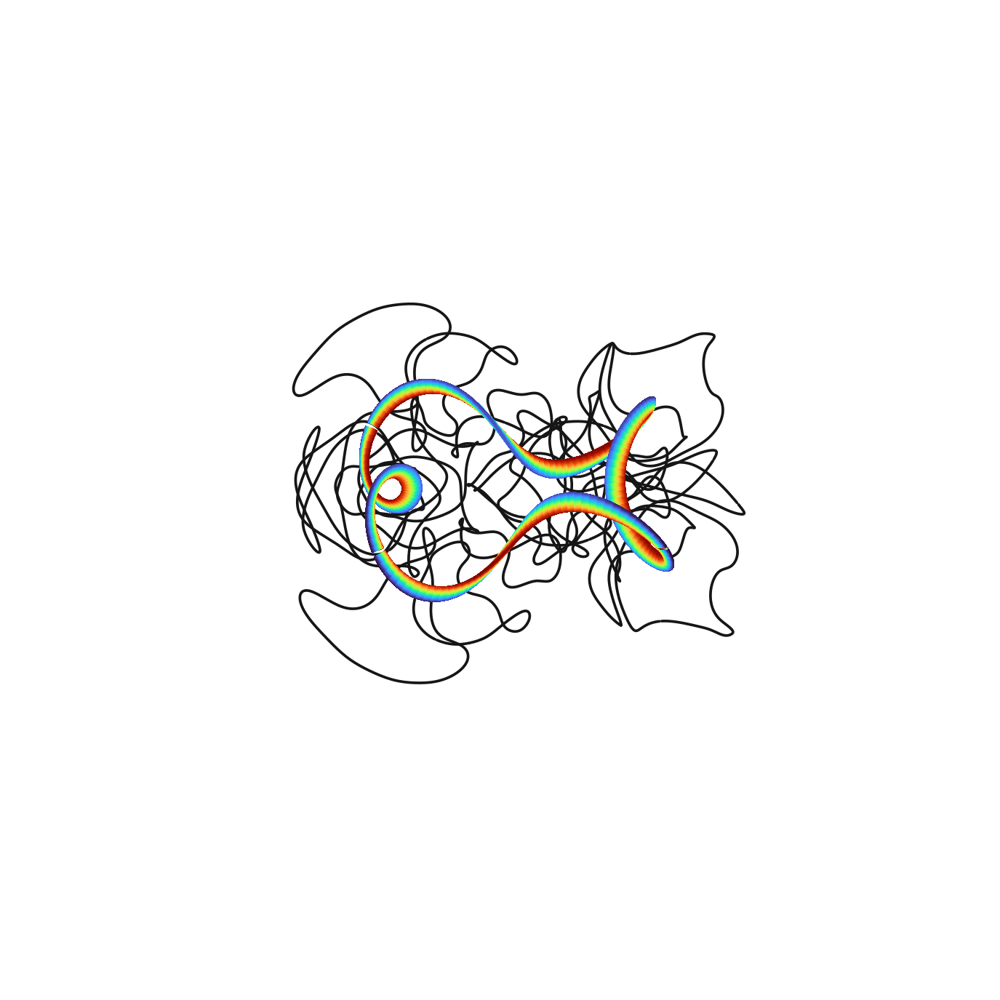

交互产物：[Boozer $|B|$ HTML](assets/qh_flow_standard_adam_71p734_full_eval/full/assets/boozer_b.html)；[完整设备线圈与磁面 HTML](assets/qh_flow_standard_adam_71p734_full_eval/full/assets/coils_surface.html)。

### 8.4 DESC 复核

DESC 使用真实 Biot--Savart 场积分得到的环向磁通 $-2.81461\times10^{-3}\,\mathrm{Wb}$。它与 $\alpha$ 标定的边界磁通 $-2.82895\times10^{-3}\,\mathrm{Wb}$ 相差约 0.51%，构成独立实现间的量级交叉检查。当前 DESC 环境只暴露 JAX CPU，因此该阶段明确走 16 核 CPU，没有伪称 GPU。

| DESC 指标 | 结果 |
|---|---:|
| 初始 / 最终嵌套 | true / true |
| 初始 mean / P95 / max 归一化力误差 | 1.0575 / 3.4856 / 41.3109 |
| 最终 mean / P95 / max 归一化力误差 | $2.88\times10^{-3}$ / $6.26\times10^{-3}$ / $1.73\times10^{-2}$ |
| optimizer cost / optimality | 0.06726 / 0.00493 |
| 迭代 / 函数评估 | 50 / 69 |
| optimizer success | false，达到迭代上限 |

以下逐张引用本次成功生成的全部 8 张 DESC 图。

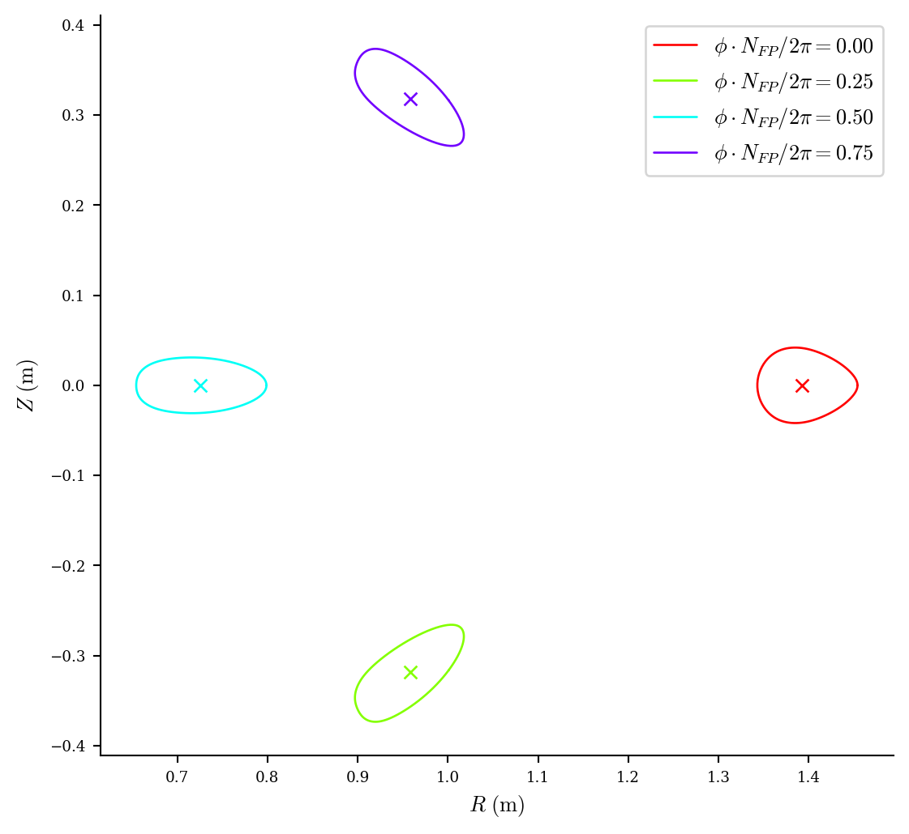

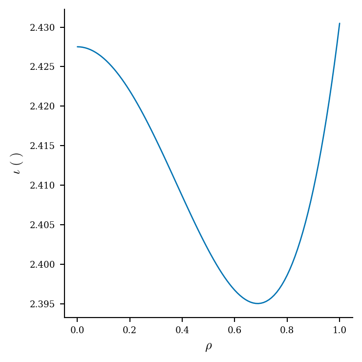

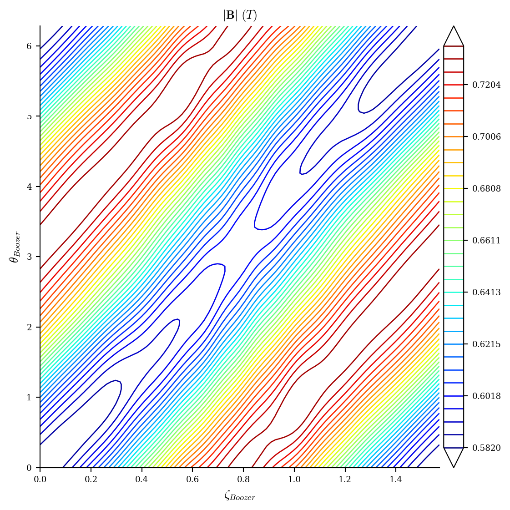

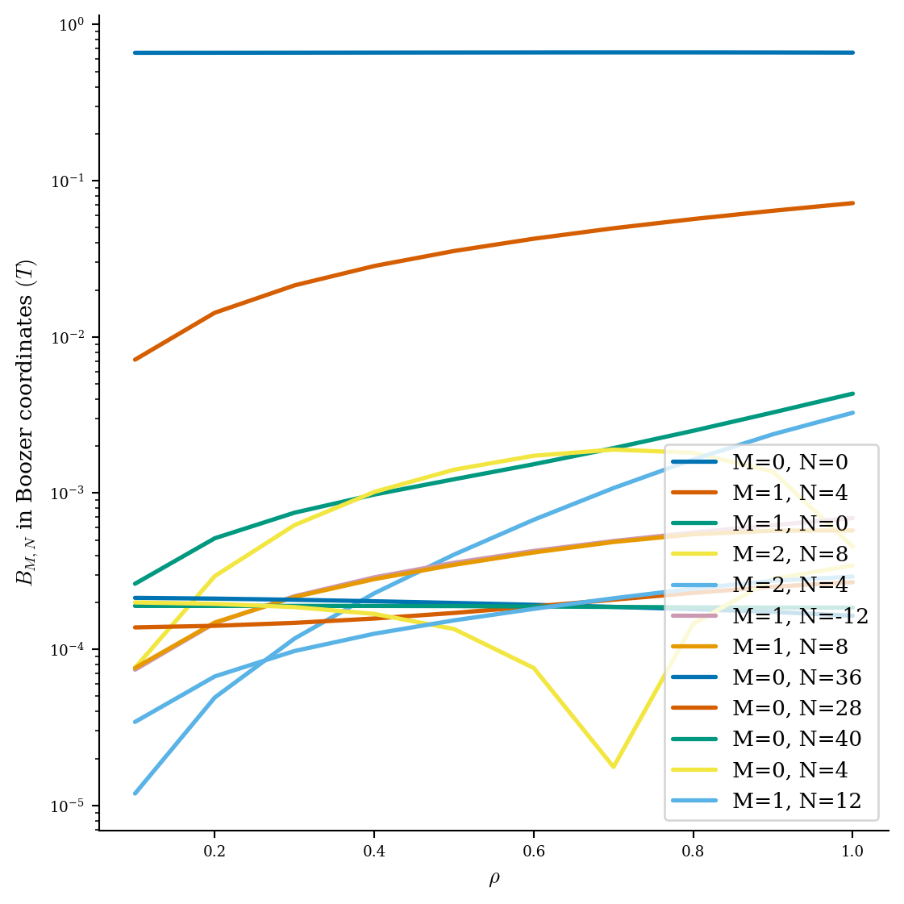

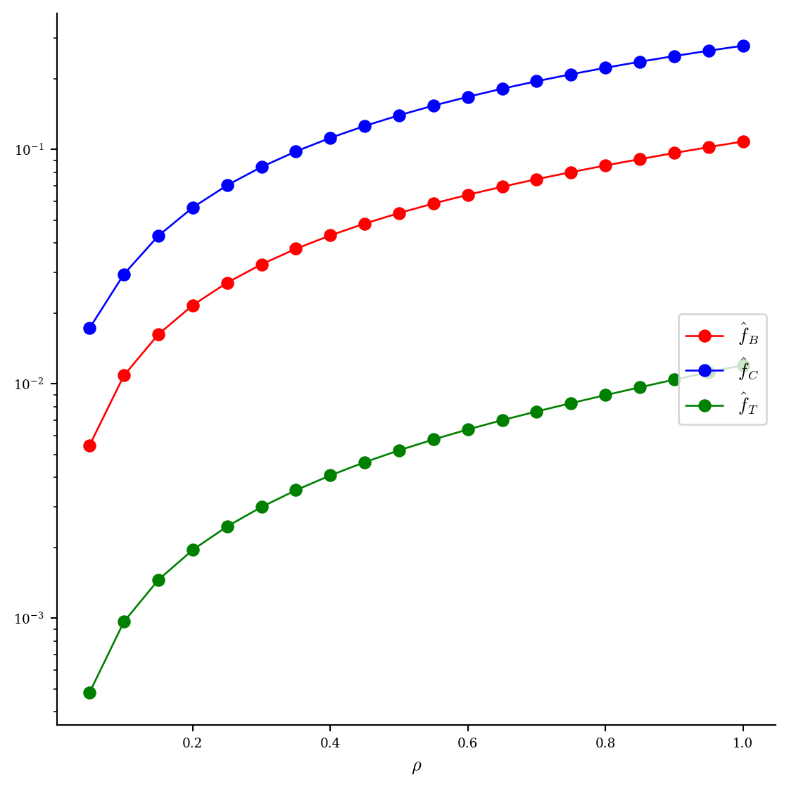

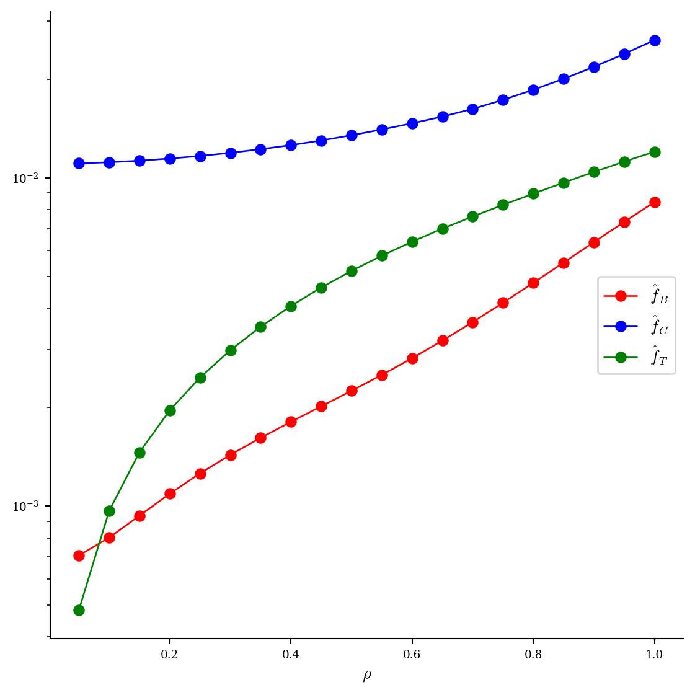

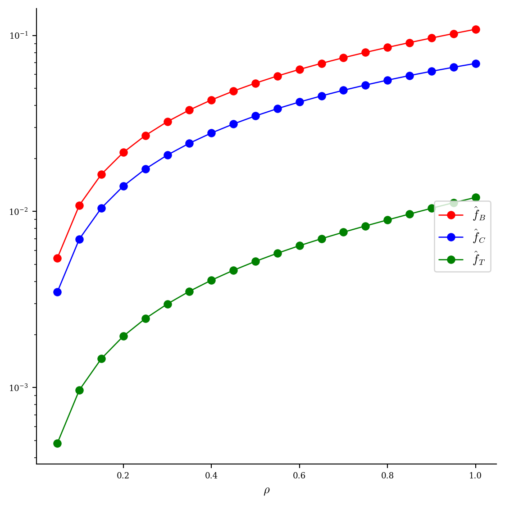

DESC 的 $\iota(\rho)$ 保持约 2.395--2.431，未出现低 $\iota$ 退化；QH 分量曲线显著低于 QA/QP 的对应误差，和 $|B|$ 的 QH 斜条纹相互支持。边界在求解前后只发生小量变化，未出现折叠或跨分支跳跃。

### 8.5 耗时、原始产物与执行说明

| 阶段 | 计算路径 | 墙钟 |
|---|---|---:|
| source 磁轴和 $\psi$ | 单卡 RTX 5090，FP32 fullgpu | 1 min 23 s |
| 选中 `s=0.30` 的 $\alpha+\nu+$ guarded | 单卡 RTX 5090；$\alpha/\nu$ 场评估 FP32 GPU | 3 min 56 s |
| 可视化和 CPU DESC | 16 CPU | 5 min 45 s |
| 已知本样本参数后的单路径合计 | 上述三段串行 | **11 min 04 s** |

选中候选内部，$\alpha$ 总耗时 147.31 s，其中磁通标定 76.44 s、QR 0.80 s；$\nu$ 总耗时 76.84 s。下游内部可视化 37.22 s、DESC 249.51 s。外层边界的首次发现还需要额外候选扫描，开发/发现阶段不应混入上述已知路径计时。

首次 source 作业的提交包装曾在 0 秒处因 `/bin/sh` 不支持 `set -o pipefail` 而失败；载荷显式交给 Bash 后正常完成，没有进入数值计算，也未污染正式产物。最终队列为空，所有候选和下游作业均已退出，没有遗留 worker。

原始结果：[source $\psi$ summary](assets/qh_flow_standard_adam_71p734_full_eval/source_psi_a0p08/summary.json)、[$\psi$ model](assets/qh_flow_standard_adam_71p734_full_eval/source_psi_a0p08/psi_model.npz)、[候选选择记录](assets/qh_flow_standard_adam_71p734_full_eval/selection.json)、[$\alpha$ summary](assets/qh_flow_standard_adam_71p734_full_eval/candidates/s_0p30/alpha/summary.json)、[$\nu$ summary](assets/qh_flow_standard_adam_71p734_full_eval/candidates/s_0p30/alpha_nu/summary.json)、[guarded summary](assets/qh_flow_standard_adam_71p734_full_eval/candidates/s_0p30/guarded_rho_1/summary.json)、[full summary](assets/qh_flow_standard_adam_71p734_full_eval/full/full_summary.json)、[DESC summary](assets/qh_flow_standard_adam_71p734_full_eval/full/desc/summary.json)、[DESC input](assets/qh_flow_standard_adam_71p734_full_eval/full/desc/input.check) 和 [equilibrium.h5](assets/qh_flow_standard_adam_71p734_full_eval/full/desc/equilibrium.h5)。

选中 `boozer_guarded.npz` 的 SHA-256 为 `8b0171a25de84532601bc02f10181a0381b3620bdeb9a6b624cfde2a82936c7c`；DESC `equilibrium.h5` 的 SHA-256 为 `8d16d0d935c34dcffd5b3fe0b628b16cd66aafd5e7be4a85911a0e0293b05515`。

补充后的最终判断：71.7342 不只是一个 native score 高分点，它对应真实、较大的嵌套 QH 磁面，并能给出物理上可信的零压零电流 DESC 平衡；但其 QH 误差仍明显非零、线圈几何也较复杂，因此应称为“通过当前链路验收的候选”，而不是工程上已经足够好的最终设计。
