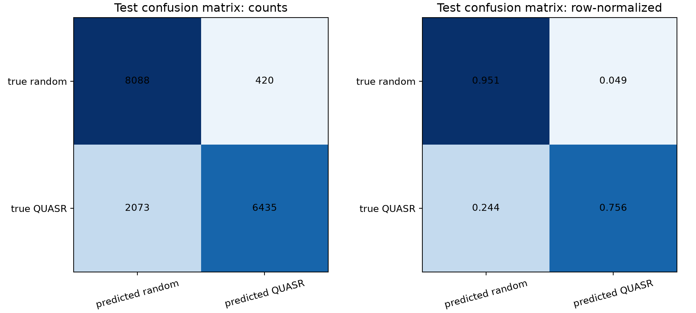
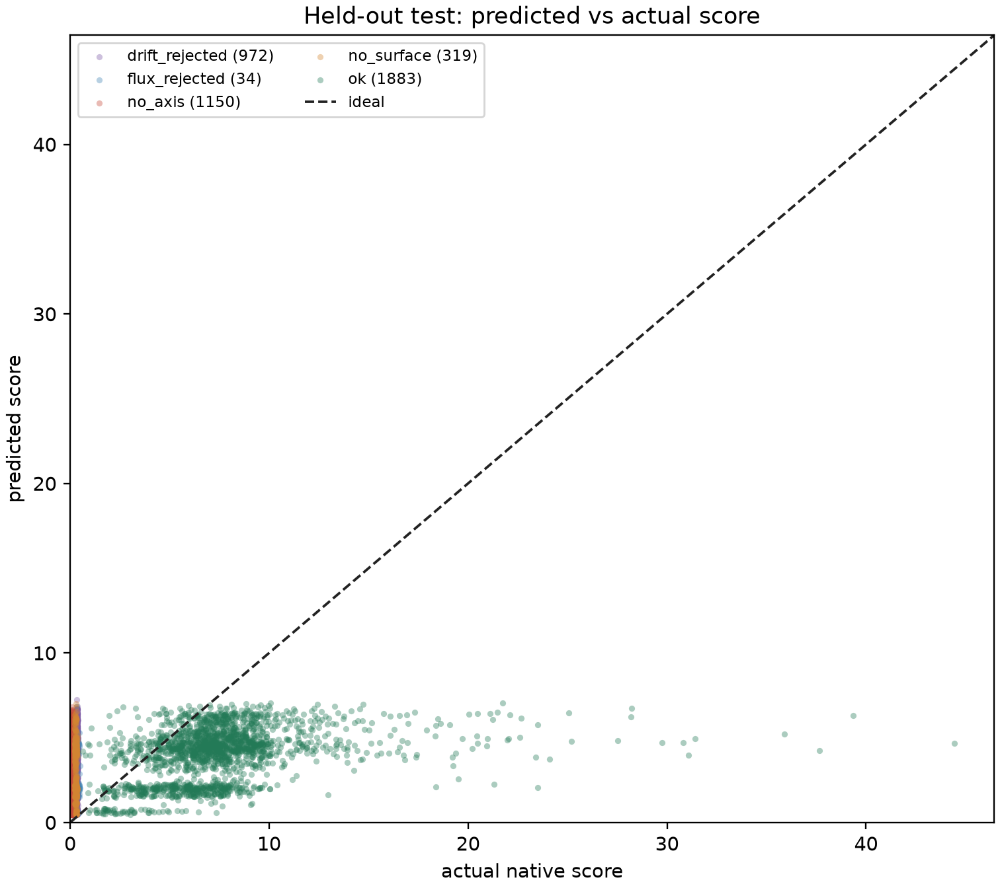

# QH 搜索后续方向可行性分析

**日期：** 2026-08-03  
**基线：** ABI-9 原生 score、FP32 RK4-256 flow、四方向潜空间 Adam

## 1. 结论摘要与优先级

当前系统的瓶颈已经不是“能否稳定算出一个分数”，而是每个潜空间 Adam step 需要 8 次完整 score，且 score 内部包含很多在相邻扰动间高度重复的物理计算。未来方向按预期收益、实现风险和验证难度排序如下。

| 优先级 | 方向 | 预期作用 | 难度 | 当前判断 |
|---:|---|---|---|---|
| 1 | 二级 Reflow | 把高斯先验搬到当前 flow 的有效数据潜区，提高随机起点质量 | 中 | 最值得先试，目标与已有逆追踪数据直接一致 |
| 2 | 固定可行分支的 QS 近似梯度 | 把每步 8 次黑箱 score 降为一次前向加一次 VJP | 高 | 潜在收益最大，但必须冻结离散拓扑分支并用真 score 接受 |
| 3 | 工程项解析梯度 | 低成本改善长度、曲率、间距与高阶模 | 低到中 | 容易实现，但高分阶段通常不是主瓶颈 |
| 4 | 多任务 proxy | 用于宽松预筛，不代替真 score | 中 | 现有实验给出负结论，只有改变标签和采样才值得重做 |
| 不优先 | 对磁轴/最大面离散选择做全链精确反传 | 获得形式上的端到端梯度 | 很高 | 不连续、开发代价大，且这些分量通常先饱和 |

最合理的中期架构不是把整个 score 强行改成可微，而是：用光滑、固定分支的局部目标提供方向；每一步仍用当前 ABI-9 黑箱 score 作可行性判定和最终接受。这保留了评分器的物理门控与鲁棒性，同时减少 SPSA 方差和评估次数。

## 2. Proxy：已有证据与可行边界

### 2.1 已完成的支持度分类代理

已有分类代理把逆追踪 QUASR 潜变量

$$
z_+=F^{-1}(x_{\rm QUASR})
$$

标为正类，把条件匹配的高斯先验

$$
z_-\sim\mathcal N(0,I)
$$

标为负类。独立测试集有 8508 个正类与 8508 个负类，得到 ROC-AUC 0.93414、AP 0.94555、accuracy 0.85349；混淆矩阵为 TN/FP/FN/TP = 8088/420/2073/6435。这证明有限精度 flow 的逆追踪分布与高斯先验存在强、非径向的结构差异。

但是，该模型预测的是

$$
D(z,c)\approx
\Pr(z\text{ 来自逆追踪 QUASR}\mid z,c),
$$

不是高物理 score 概率。在 1024 个独立真 score 样本上，proxy 概率与 score 的 Pearson/Spearman 仅为 $-0.0418/-0.0161$；只保留 `status=ok` 后仍为 $-0.0271/-0.0107$。因此它不能作为 Adam 起点筛选器。

### 2.2 已完成的连续 score 回归代理

冻结 43584 个旧 score 样本，按 34868/4358/4358 划分训练、验证和测试。充分训练并按验证集选 checkpoint 后，测试 RMSE 为 5.506，Pearson/Spearman 为 0.3971/0.3975。模型预测被明显压缩到低分区：测试集中有 34 个真实 score $>20$、7 个 $>30$，但没有预测值达到 20。真实 score $>20$ 子集内部的 Pearson/Spearman 为 $-0.073/-0.162$。

按 $(N_{\rm FP},n_c)$ 去除条件均值后，相关性只剩 0.112/0.107，说明总体约 0.40 的相关主要来自离散条件和粗可行性，而不是同一条件内的高质量几何排序。此实验还使用了 ABI-9 修复前的标签；旧样本虽保留完整线圈、可以重算，但在 proxy 已表现出明显尾部失败后，单纯重算并扩大相同 MSE 训练不是高优先级。

### 2.3 何时值得重做 proxy

只有同时改变以下三项，proxy 才有新的实验价值：

1. 标签必须使用 ABI-9 真 score，并额外预测 `status`、QH error、$\iota$、surface size 和 coil score，而不是让单个 MSE 头混合失败状态与连续质量。
2. 训练采样应按 score 分层，在高分尾部过采样；测试集仍保持真实先验分布，并按来源和优化轨迹分组，防止邻近 Adam step 泄漏。
3. 验收指标应是 top-$k$ 真 score 富集率、同条件内 ranking 和 score $>80$ 的 recall，而不是总体 MSE。

即便如此，proxy 最适合把百万级潜变量压缩到数千个真 score 候选。任何对 proxy 本身的无约束 Adam/CEM 都可能产生对抗样本，最终选择必须重新经过真 score。

## 3. Reflow：二级流对逆追踪潜分布建模

### 3.1 定义

记当前训练好的 flow 为

$$
x=F_1(z;c),\qquad c=(N_{\rm FP},n_c).
$$

把 QUASR 样本反向追踪得到

$$
z_1=F_1^{-1}(x_{\rm QUASR};c).
$$

再训练一个条件流 $F_2$，使

$$
z_1=F_2(z_0;c),\qquad z_0\sim\mathcal N(0,I).
$$

最终生成器是复合映射

$$
x=F_1(F_2(z_0;c);c).
$$

这不是对同一模型继续训练，也不是把第二级当分类器；它直接把容易采样的高斯先验运输到当前 $F_1$ 真实能还原 QUASR 的潜区。

### 3.2 为什么在当前项目中可行

如果 $F_1$ 是完美的概率流且训练分布严格匹配，$F_1^{-1}(x_{\rm data})$ 本应是标准高斯，此时 $F_2$ 退化为恒等映射，没有收益。实际分类 AUC 0.934 证明两者有明显可学习差异；同时 RK4-256 对 2902 个样本的反向--正向闭环位置 RMS 均值仅 $5.14\times10^{-8}\,\mathrm m$，因此二级训练目标不是由粗糙数值积分伪造的。

已有 170755 个 QH 样本的反向潜变量可一次批量生成；四卡 FP32 RK4-256 全量反演实测 674.54 秒。第二级模型可以沿用同样的 100 维 token、非因果注意力和条件注入，但可先用 4 层、width 256 的约 400 万参数模型验证；目标分布比原始线圈分布更接近高斯，未必需要 3000 万参数。

### 3.3 训练目标与必要控制

第一版可继续使用 rectified flow：

$$
z_t=(1-t)z_0+tz_1,\qquad v^*=z_1-z_0.
$$

潜变量各维原本接近同尺度，标准 MSE 是合理基线。若希望第二级更关注 $F_1$ 解码后的物理曲线，可以用 $F_1$ 局部 Jacobian 定义度量

$$
\|\delta z\|_{F_1}^2
=\delta z^T J_{F_1}^T W_xJ_{F_1}\delta z,
$$

但显式 Jacobian 不可取；可用随机 JVP 近似。由于这会显著增加训练成本，第一版不应加入。

数据划分必须沿用 QUASR ID 的 train/validation/test，不允许反演后重新随机打散。条件频率按 QUASR 分布采样；线圈 token 每 batch 随机置换以维持排列等变。训练期间监控二级 flow loss、闭环误差、$z_1$ 的矩统计和条件分组指标。

### 3.4 验收与风险

Reflow 的第一层验收不是 loss，而是复合生成的真 score：

- 对条件匹配的至少 2048 个测试样本比较 $F_1(z_0)$ 与 $F_1(F_2(z_0))$ 的 `ok` 率、score 分位数和 score $\ge80$ 比例；
- 报告 QH、$\iota$、surface、coil 分量，防止只把先验搬到大面但非 QH 的区域；
- 对 top 样本作完整 $\alpha+\nu$/Simsopt/DESC 评估；
- 检查 token 最近邻和几何多样性，防止二级流记忆训练集。

主要风险是 $F_2$ 只学习“像 QUASR”的密度，而 QUASR 内部并非都高分。因此预期收益首先是把随机 flow 的中位数和 `ok` 率推向数据集，而不是自动超过数据集上界。更进一步可以只对 ABI-9 高分 QUASR 与已验证 Adam 解训练加权 Reflow，但这会减小有效样本量并放大 mode collapse 风险。

综合判断：实现难度中等、一次训练成本低、已有强密度失配证据，是下一项最值得独立验证的生成方向。

## 4. 从黑箱 score 到近似梯度

### 4.1 目标与原则

当前四方向反向差分每步需要 8 次完整评分。若评分器能返回线圈 token 的近似梯度

$$
g_x\approx\frac{\partial S}{\partial x},
$$

则可以通过可微 RK4 解码器得到

$$
\frac{\partial S(F(z))}{\partial z}
=J_F(z)^Tg_x.
$$

目标不应是一次性让全部离散逻辑精确可微。评分器含磁轴候选切换、有效点 compaction、最大面选择、percentile、状态 gate 和 `min/max`，全局上本来就不光滑。合理方案是在一个已可行样本附近冻结分支，返回对连续物理量的局部 VJP；每步更新后仍调用真实 ABI-9 score 接受或回滚。

### 4.2 各分量的梯度可行性

| 分量/阶段 | 连续部分 | 不连续部分 | 难度 | 是否必要 |
|---|---|---|---|---|
| coil engineering | Fourier 曲线、导数、长度、曲率、高阶能量、电流 | 最小距离、P95、最近线段切换 | 低到中 | 易做，但高分时常非主导 |
| axis | 场线 ODE、固定点隐式解 | 候选发现、候选排序、椭圆拓扑切换 | 高 | 可行后通常饱和，可先冻结 |
| $s$ LS | 固定点设计矩阵、ridge QR | 轴变化、采样域变化、质量 gate | 中到高 | 影响所有下游，但不宜第一步做 |
| surface/$\psi$ | 射线根、磁通积分、四阶 LS | 最大水平选择、有效点 compact、单调 gate | 中到高 | 可冻结已选面后求局部梯度 |
| $\alpha,\iota$ LS | 固定体点的 ridge LS | 有效点集合、径向 bin 边界 | 中 | QS 梯度需要，标准隐式 LS 可处理 |
| volume QS | $B,\nabla B,\nabla\psi,\iota$ 与加权 RMS | edge bin、P95、竞争 helicity gate | 高 | 最关键，值得优先投入 |
| 总分 gate | smoothstep、$q_\downarrow$ 内部 | clip、min、状态、候选切换 | 低到高 | 用光滑内部目标，真分验收 |

### 4.3 线圈工程梯度

Fourier 曲线 $\boldsymbol r(t;c)$ 对系数线性，因此位置、切向量和高阶模能量的导数直接可得。长度

$$
L=\int|\boldsymbol r'(t)|\,dt
$$

和曲率

$$
\kappa=\frac{|\boldsymbol r'\times\boldsymbol r''|}{|\boldsymbol r'|^3}
$$

可解析微分或由 CUDA 自动微分式手写 VJP。线圈间最小距离可在当前最近点对固定时求局部梯度，也可用

$$
d_{\rm softmin}=-\tau\log\sum_j e^{-d_j/\tau}
$$

作优化内部代理。工程项计算负担小、验证简单，适合作为梯度 API 的第一阶段回归测试，但它不能单独替代 QS 方向。

### 4.4 磁轴的隐式梯度

固定当前磁轴候选后，$q^*$ 满足

$$
P(q^*,c)-q^*=0.
$$

对线圈参数 $c$ 微分：

$$
\left(I-\frac{\partial P}{\partial q}\right)
\frac{\partial q^*}{\partial c}
=\frac{\partial P}{\partial c}.
$$

左侧只有 $2\times2$，求解便宜；真正成本是计算场线 ODE 对线圈参数的 tangent 或 adjoint。候选出现/消失和椭圆拓扑越界无法用该公式穿透。因此磁轴梯度只在同一稳定固定点分支内成立。考虑到高分解 axis 分量通常已在 90--98，第一版应把轴作为常量，并在真 score 检测 branch change 后拒绝更新。

### 4.5 线性最小二乘的隐式 VJP

$s$ 与 $\alpha/\iota$ 都可写成带 ridge 的最小二乘

$$
c^*=\arg\min_c\|A(p)c-b(p)\|_2^2+\lambda\|Lc\|_2^2.
$$

正规方程为

$$
Hc^*=A^Tb,\qquad H=A^TA+\lambda L^TL.
$$

不应显式构造 $\partial c^*/\partial p$。给定下游伴随 $\bar c$，先解

$$
H^Tu=\bar c,
$$

再由 $u$ 与 LS residual 形成对 $A,b$ 的 VJP。数值实现可复用 QR 因子或以迭代法求伴随，不需要每个线圈参数单独求一次 LS。这使大参数量本身不是致命问题。

困难在于 $A$ 的每一行依赖 $\boldsymbol B$、磁轴、$\nabla s$、采样点位置和径向 bin 权重。可分两阶段：先冻结采样位置和轴，只穿透场值与 LS；待有限差分验证通过后，再加入射线根和轴的隐式依赖。

### 4.6 QS 梯度是关键

固定磁轴、$s$、$\psi$ 标定、体点和 $\iota$ 后，QH residual

$$
r_i=\frac{(\iota-N_{\rm FP})A_i-GC_i}{|\boldsymbol B_i|^3}
$$

及加权 RMS 对 $\boldsymbol B$、$\nabla\boldsymbol B$、$\nabla\psi$、$\iota$ 和 $G$ 都连续可微。标量 RMS 的 VJP 只需一次点级 CUDA 归约，不需要保存输出对所有线圈参数的完整 Jacobian。

直接依赖的主要难点是 Biot--Savart 对线圈 Fourier 系数的导数。$\boldsymbol B$ 已涉及线段位置与切向量，$\nabla\boldsymbol B$ 的参数导数进一步涉及核函数的混合二阶导数。三种实现选择为：

1. 手写解析 CUDA VJP：运行最快、内存最省，推导和回归测试工作量最大。
2. 在可微 CUDA/torch 扩展中重写场核：开发较快，但需确认编译、寄存器和显存开销。
3. 对线圈参数做方向导数 JVP，再与下游伴随配对：比当前逐分量有限差分好，但若方向数仍为 4，主要节省来自冻结前端和复用采样，而非得到完整梯度。

最务实的第一版是“冻结几何前端的 QS 局部代理”：一次真 score 保存轴、$s$ 系数、$\psi$ 系数、体点、$\iota$ 和当前分支；局部若干步只更新 $B,\nabla B$ 与 QS/coil 光滑项，每步用真 score 复核。若一次局部 VJP 的成本低于 8 次完整前向，且与中心差分方向余弦相似度稳定为正，就有明确吞吐收益。

### 4.7 可忽略与不可忽略的梯度

高分样本中 axis、$s$、surface 和 $\iota$ 往往已接近饱和，coil 也可通过少量解析项维持；实测优化的主要增益经常来自 volume-QS。因此在极值点附近可以忽略这些饱和分量的一阶变化，但不能移除它们的真 score gate。若局部代理提出一步使磁轴、磁通单调性或可行面消失，必须整步拒绝并重建前端。

反之，若当前样本尚在低分、拓扑经常变化，固定分支梯度没有意义，此时仍应使用 128 随机筛选和 SPSA/Adam。近似梯度方法的适用域是“已经可行、希望从 80 分向 90 分逼近”，不是从 `no_axis` 区跨越拓扑边界。

## 5. 建议实验路线

### 5.1 Reflow 最小实验

1. 冻结当前 30000-step flow 与 QUASR split，批量生成并保存所有 FP32 RK4-256 逆潜变量。
2. 训练约 400 万参数的条件二级 flow，直到验证 loss 明确触底或回升，不预设过短终点。
3. 对 2048 个条件匹配样本同时评测一级与复合 flow，使用 ABI-9 真 score 比较分布和高分富集。
4. 若 score $\ge80$ 比例有显著提升，再扩大模型；若只有支持度 proxy 概率改善而真 score 不变，则停止该方向。

预计实现与训练难度中等；单次全量逆追踪约 11 分钟，训练应小于现有 3000 万参数 flow 的 47 分钟。

### 5.2 梯度 API 分阶段实验

1. 为 coil engineering 写单样本标量 VJP，并用中心差分在随机 32 个方向上验证相对误差和方向余弦。
2. 固定一个 score $>85$ 的已验收样本，导出 score 前端 cache；实现只含固定点 volume-QS 的 CUDA VJP。
3. 比较解析/近似梯度与四方向 SPSA 在相同局部点的方向一致性、每步墙钟和 20 步真 score 增益。
4. 若 QS VJP 有效，再加入 $\alpha/\iota$ LS 伴随；最后才考虑 $s$ 和磁轴依赖。

验收门槛应同时满足：真 score 不下降的接受率不低于现有 Adam；20 步达到同等增益的总墙钟更短；完整评估的面 QH error 与可行体积不退化。不能只以光滑代理自身下降作为成功标准。

## 6. 最终建议

短期先做 Reflow，因为数据、可逆映射和闭环精度已经就绪，且无需修改复杂物理评分器。与之并行，设计一个只返回 scalar VJP 的 C++ 接口，从工程项和冻结前端的 volume-QS 开始；不要尝试一次性把磁轴搜索、最大面选择和所有 gate 改成全局可微。

Proxy 当前只证明“flow 未完美高斯化”，没有证明“能预测高 score”。在没有新的 ABI-9 高分分层数据和多任务标签前，不建议继续堆更大的 MSE 回归器。最终较有希望的组合是：Reflow 提升随机起点分布，真 score 做 128 候选筛选，局部 QS 近似梯度负责高分区快速爬升，ABI-9 全分数和完整 $\alpha+\nu$/DESC 支线负责接受与验收。
