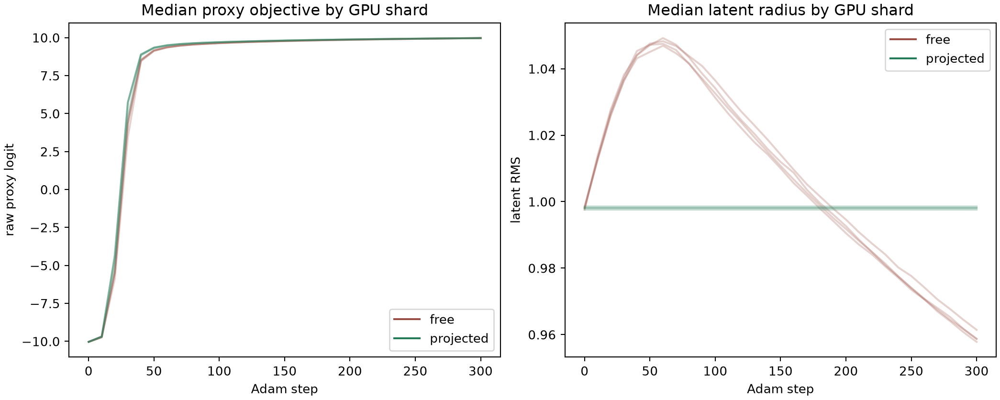
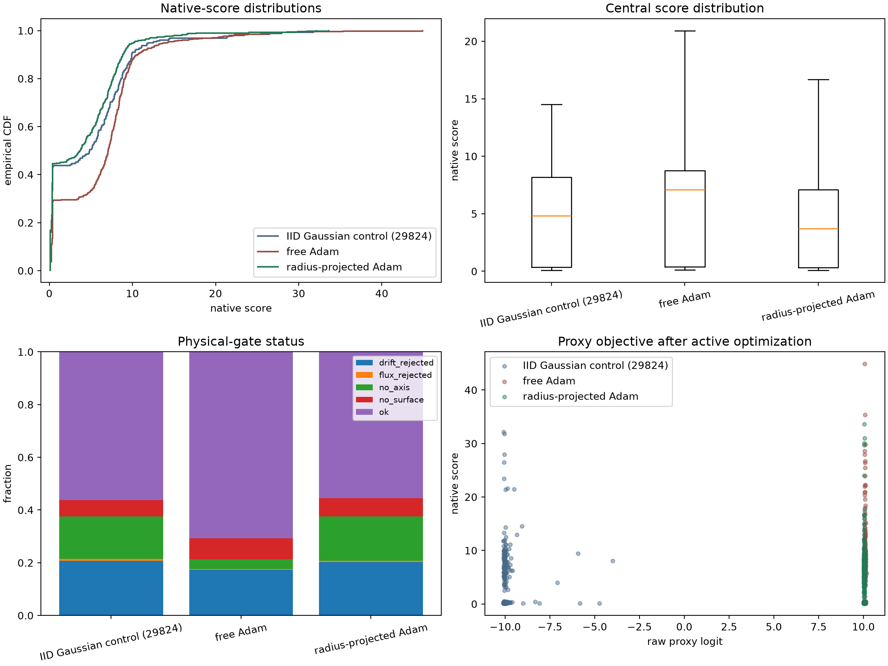

# QH 潜空间代理主动优化实验

日期：2026-07-31  
目标条件：QH，$N_{\mathrm{FP}}=4$，3 个基线线圈

## 1. 结论先行

这次实验回答的是：自然高斯采样中高 proxy 概率的样本太少，那么主动把 proxy 概率优化到极高后，真实 native score 是否会优于随机样本？

答案分成两部分：

1. **无约束 Adam 有中等幅度优势。** 512 个候选的 score 中位数为 7.078，对照为 4.837；`status=ok` 比例为 70.7%，对照为 56.3%。
2. **保持每个起点 RMS 的投影 Adam 没有优势。** 512 个候选的 score 中位数为 3.694，`status=ok` 比例为 55.5%，均未超过对照。

无约束 Adam 选中样本的 latent RMS 中位数从 IID 对照的 1.004 降到了 0.810。投影版本的中位数为 0.952，且没有 score 提升。因此目前最合理的解释不是“proxy 已经学会了通用物理质量”，而是：

> 无约束优化找到了一个低 latent 半径、较容易产生可行磁轴和磁面的分布方向；这个方向确实有筛选价值，但它位于标准高斯典型集之外，而且不能在候选内部继续按物理质量排序。

所以，本实验验证了**一种有限的生成分布富集效应**，没有推翻上一轮“自然 prior 内 proxy 与 score 基本零相关”的结论，也不足以把当前 proxy 当作通用物理 score 代理。

## 2. 实验设计

### 2.1 为什么使用精确梯度 Adam

proxy 是可微 Transformer，直接反向传播能得到精确梯度。对这个目标继续使用 CEM 或 SPSA 会丢弃已经可用的梯度信息，并增加模型前向次数。因此本轮用标准 Adam 直接最大化 raw proxy logit。

Platt 校准为

$$
p(z)=\sigma(a f(z)+b), \qquad a>0.
$$

所以最大化 raw logit $f(z)$ 与最大化校准概率严格等价。实际优化 raw logit 可以避免 $p\simeq1$ 后 sigmoid 梯度和显示精度饱和。

### 2.2 两种优化约束

从相同的 8192 个 IID 标准高斯起点出发，分别运行：

- **free Adam**：不限制 latent 范数；
- **radius-projected Adam**：每一步先去掉径向梯度，再把每个样本投影回它自己的初始 RMS。

共同设置：Adam 300 步，学习率 0.01，$\beta_1=0.9$，$\beta_2=0.999$。优化过程中完全不调用 native score。每种方法最终只按 raw proxy logit 取最高的 512 个样本。

随后统一使用 FP32 RK4-256 flow 解码，并用当前修复后的 C++/CUDA native score 评分。对照直接复用 job 29824 中 256 个 `iid_prior` 样本，因为两次实验的目标条件、flow checkpoint、积分方法和 score 二进制完全一致。

关键 SHA-256：

- proxy checkpoint：`69797be095b26678a918fee711dd478f61a3474c866ade129029563fa02ee8e4`；
- flow checkpoint：`39a3293a459e248a0d1ec062607a1a467128b14d8ca973aadd82e113532ab99f`；
- native score library：`0b7342db471788385931385c25ded8095c72cfb7fcea1e21376a0475dafaa427`。

## 3. Proxy 优化结果

8192 个起点的初始校准概率中位数为 0.1798。300 步后：

| 方法 | 全部 8192 个样本的概率中位数 | raw logit 中位数 | raw logit 最大值 | 全部样本 RMS 中位数 |
| --- | ---: | ---: | ---: | ---: |
| free Adam | 0.999999187 | 9.970 | 10.183 | 0.959 |
| projected Adam | 0.999999188 | 9.971 | 10.131 | 0.998 |

两种方法都在约 50 步进入高 logit 平台，300 步已充分收敛。继续增加 CEM 或 Adam 步数只会在极窄的 raw-logit 区间内优化分类器数值，不太可能产生新的物理信息。

最终入选的 top-512 分布与全体略有不同：

| 方法 | 入选 raw logit 中位数 | 入选概率中位数 | 入选 latent RMS 中位数 | 相对起点 L2 位移中位数 |
| --- | ---: | ---: | ---: | ---: |
| free Adam | 10.081 | 0.999999254 | 0.810 | 8.308 |
| projected Adam | 10.040 | 0.999999230 | 0.952 | 7.819 |

free Adam 的高预测尾部明显偏向低半径。projected Adam 虽然保持每个轨迹自己的半径，但 top-512 仍偏向初始半径较小的起点；它没有主动把半径推低到 0.81。

## 4. Native score 分布

### 4.1 主结果

| 样本组 | 数量 | mean | median | P90 | P95 | max | `status=ok` |
| --- | ---: | ---: | ---: | ---: | ---: | ---: | ---: |
| IID Gaussian，对照 29824 | 256 | 4.953 | 4.837 | 9.917 | 12.048 | 32.145 | 56.25% |
| free Adam top-512 | 512 | 6.407 | 7.078 | 10.576 | 13.959 | 44.891 | 70.70% |
| projected Adam top-512 | 512 | 4.142 | 3.694 | 8.835 | 10.108 | 33.624 | 55.47% |

free Adam 相对 IID 对照的 bootstrap 差值为：

| 指标 | 点估计 | 95% CI |
| --- | ---: | ---: |
| mean score | +1.454 | $[+0.627,+2.270]$ |
| median score | +2.435 | $[+1.211,+5.341]$ |
| `status=ok` 比例 | +14.48 个百分点 | $[+7.03,+21.68]$ 个百分点 |

Mann-Whitney 单侧检验的 rank-biserial effect size 为 0.231，$p=8.40\times10^{-8}$。潜变量多样性检查表明样本不是重复点，因此该差异不是由同一个解复制 512 次造成的。

projected Adam 的 mean score 相对对照为 -0.807，95% CI 为 $[-1.597,-0.043]$；`status=ok` 差值为 -0.75 个百分点，95% CI 跨过 0。它没有显示正向富集。

### 4.2 提升主要来自可行率，而不是高分尾部

| 样本组 | $S\ge5$ | $S\ge10$ | $S\ge20$ | $S\ge30$ |
| --- | ---: | ---: | ---: | ---: |
| IID 对照 | 49.61% | 8.98% | 3.13% | 0.78% |
| free Adam | 66.80% | 12.11% | 2.93% | 0.39% |
| projected Adam | 42.58% | 5.27% | 0.98% | 0.59% |

free Adam 明显增加了中等 score 和 `status=ok` 样本，但 $S\ge20$ 的比例没有增加。只看 `status=ok` 样本时：

- IID 对照 mean/median 为 8.606/7.779；
- free Adam 为 8.932/8.036；
- projected Adam 为 7.266/6.978。

free Adam 的 `no_axis` 比例从 IID 的 16.0% 降到 3.7%，而 projected Adam 为 16.8%。因此 free Adam 的主要收益是减少磁轴等物理门限失败，而不是把已经可行的样本大幅推向更高 QS 质量。

## 5. 是否真的是“预测越高，score 越高”

不是。进入极高概率尾部后，raw logit 与 score 的组内相关性仍接近 0：

| 样本组 | Pearson | Spearman |
| --- | ---: | ---: |
| IID 对照 | -0.0158 | -0.0269 |
| free Adam top-512 | -0.0078 | -0.0045 |
| projected Adam top-512 | 0.0422 | 0.0584 |

这说明 free Adam 的优势来自“优化后整体分布发生了有利变化”，而不是 top-512 内 logit 更大的样本物理 score 更高。把优化步数继续加长，或从 10.08 追到 10.10，不能作为提高真实 score 的可靠手段。

## 6. 多样性与低半径混杂

每组 512 个样本按 $10^{-4}$ 精度舍入后仍全部唯一：

| 方法 | 最近邻 RMS 距离中位数 | 两两 RMS 距离中位数 | 两两余弦相似度中位数 | 最大余弦相似度 |
| --- | ---: | ---: | ---: | ---: |
| free Adam | 1.002 | 1.140 | 0.0117 | 0.300 |
| projected Adam | 1.192 | 1.341 | 0.0060 | 0.308 |

多起点没有塌缩成少数模式。但 free Adam 的 RMS 中位数 0.810 对 300 维标准高斯而言已经明显离开典型半径，而 IID 对照为 1.004。由于 projected Adam 没有提升，现有数据不能区分：

1. proxy 的角向结构真的指向了更可行的线圈；
2. 仅仅把任意高斯方向缩到类似 0.81 的 RMS，就会通过 flow 生成更多可行样本。

要拆分这两个机制，需要增加一个**匹配 free Adam RMS 分布、但方向不经过 proxy 优化**的随机对照。这不是本轮用户要求的 IID 比较，因此本轮没有额外消耗 512 次 native score 去补做。

## 7. 速度与作业验收

| 阶段 | 资源 | 数量 | 时间 |
| --- | --- | ---: | ---: |
| 两种 Adam 优化、聚合及模型启动 | 4 x RTX 5090 | $2\times8192$ | 约 13.64 s |
| FP32 RK4-256 解码 | 1 x RTX 5090 | 1024 | 9.58 s |
| 候选准备总计 | 4 x RTX 5090 | 1024 | 23.22 s |
| current native score | 4 x RTX 5090 | 1024 | 1336.21 s |
| 最终统计、bootstrap 与绘图 | 4 CPU | 1024+256 | 24 s |

正式 job 29900 在 1024 条 score 已完整写出后，最后启动纯分析解释器时遇到失效的当前目录句柄，因此 Slurm 最终状态为 `FAILED 1:0`。这不影响 score 数据：`run_manifest.json` 已处于 `stage=complete`，三项 SHA 均匹配，`scored_cases.jsonl` 包含 1024 行。后处理修复为显式重新进入项目目录，并由 job 29914 独立完成，状态 `COMPLETED 0:0`。

job 29900 的 GPU postflight 显示四张卡均为 2 MiB、0% utilization，没有遗留 worker 或僵尸进程。

## 8. 最终判断

针对用户原问题，可以准确地说：

- **是的，主动优化得到的 free-Adam 高预测样本，相比 IID 随机抽样具有明确的总体 score 和可行率优势。**
- **但该优势不适用于保持半径的 projected-Adam 样本，而且极高预测值内部不能继续排序真实 score。**
- **当前最显著的可利用信号是低 latent 半径带来的可行率富集，不是高 QS 尾部富集。**

因此当前 proxy 可以作为一个待进一步归因的“生成分布变换器”，但还不能作为可靠的高质量样本筛选器。下一项最高价值的最小实验是 matched-RMS 随机方向对照；若它复现 free Adam 的收益，就应直接使用低半径先验而不是 proxy。若它明显更差，才说明 proxy 学到的角向结构提供了额外价值。

## 9. 复现入口与产物

- 多起点优化与候选准备：`scripts/optimize_qh_latent_proxy.py`
- 原生 score：`scripts/evaluate_qh_latent_proxy_score.py`
- 对照统计与多样性分析：`scripts/analyze_qh_latent_proxy_optimization.py`
- 四卡主作业：`scripts/slurm_qh_latent_proxy_optimize_score.sh`
- 可重启 CPU 后处理：`scripts/slurm_qh_latent_proxy_analyze.sh`
- 结果目录：`reports/assets/qh_latent_proxy_optimized_29900/`
- 远端完整目录：`~/local_surface_evaluator/runs/qh_latent_proxy_optimized_29900/`

本地完整测试：88 passed。
