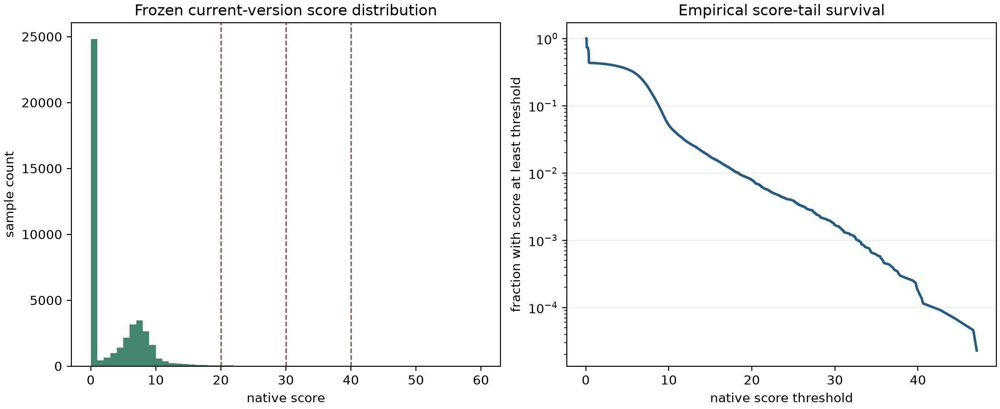
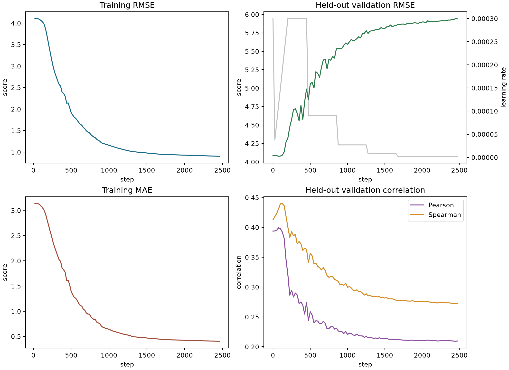
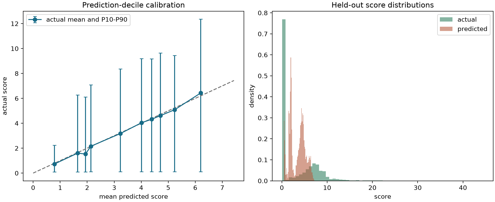

# QH 潜空间原生 Score 回归代理实验报告

**日期：** 2026-08-02  
**分支：** `qh-flow-score-regression-proxy`  
**数值实验代码：** `bf4264ab0785abea01abf50690738e5f65db3410`  
**现行 score 库 SHA-256：** `4bf7a12ea3dbdef9faf6de3ce4dc1840ecf48847ba795267500dd4179f730708`

## 1. 结论先行

本次实验已经完整跑通了“冻结现有 score 语料 -> 四卡训练潜空间回归器 -> 独立测试集评估”的链路，并且确认训练充分，不存在因为过早停止而低估模型能力的问题。

最终模型在独立测试集上的总体结果为：

| 指标 | 全局训练均值 | $(n_{fp},n_c)$ 条件均值 | 最终潜空间模型 |
|---|---:|---:|---:|
| RMSE | 4.3853 | 4.0467 | **4.0255** |
| MAE | 3.6375 | 3.1057 | **3.0882** |
| $R^2$ | 0.0000 | 0.1484 | **0.1573** |
| Pearson | 不适用 | 0.3854 | **0.3971** |
| Spearman | 不适用 | 0.3808 | **0.3975** |

潜空间模型确实学到了一点超出 $(n_{fp},n_c)$ 条件均值的信息，但提升很小。更重要的是，它没有学会高分尾部：

- 测试集含 34 个真实 score $>20$ 的样本和 7 个真实 score $>30$ 的样本；
- 模型预测范围只有 $[0.450,7.226]$；
- 预测 score $>10$、$>20$、$>30$、$>40$ 的样本数全部为 0；
- 真实 score 为 20--30、30--40、$geq40$ 时，平均预测分别只有 5.229、4.892、4.653。

因此，这个模型可以视为一个**很弱的总体排序信号**，不能视为可用的高 score 回归代理，更不能用预测值 20 或 30 作为筛选阈值。当前结果是有效的负结论，而不是待继续训练的未收敛模型。

## 2. 实验问题与实现

### 2.1 目标

每个样本的输入是 flow matching 潜空间中的线圈集合：每个线圈一个 100 维 token，不同线圈数用 mask 处理，并显式输入 $n_{fp}$ 和线圈数 $n_c$。监督目标是现行 C++/CUDA 原生评分器给出的 score：

$$
y = \frac{\mathrm{score}}{100}, \qquad y\in[0,1].
$$

模型输出经过 sigmoid：

$$
\hat y = \sigma(f_\theta(z,n_{fp},n_c)),
\qquad
\widehat{\mathrm{score}} = 100\hat y,
$$

训练损失严格按要求使用 MSE：

$$
\mathcal L(\theta)=\frac{1}{N}\sum_{i=1}^{N}(\hat y_i-y_i)^2.
$$

### 2.2 最终模型

主体沿用 flow matching 模型的非因果、无 RoPE、PreNorm Transformer 结构：

- 每个线圈是一个 100 维 token；
- 3 层、宽度 128、8 头、FFN 隐层 352；
- RMSNorm、SwishGLU、全连接注意力；
- 对有效线圈 token 做 masked mean pooling；
- $n_{fp}$ 和 $n_c$ 分别嵌入并相加后注入每个 Transformer block；
- 参数量 717,415。

最终版本把训练集中的 $(n_{fp},n_c)$ 条件均值写成显式 logit 基线：

$$
f_\theta(z,n_{fp},n_c)
=
\operatorname{logit}\!\left(\frac{\bar s_{n_{fp},n_c}}{100}\right)
+r_\theta(z,n_{fp},n_c).
$$

残差头初始化为 0，因此 step 0 精确等于条件均值基线。只有当潜变量残差在验证集上降低 MSE 时才会替换这个基线检查点。这避免了“模型训练了就必须选模型”的错误验收逻辑。

## 3. 冻结语料与 Score 分布

### 3.1 冻结规则

快照于 2026-08-02 12:14（北京时间）冻结。之后后台新增的样本不进入本次实验，保证三版模型使用完全相同的数据：

| 项目 | 数量 |
|---|---:|
| 扫描到的 metadata | 926 |
| 纳入的现行 score shard | 681 |
| 纳入样本 | **43,584** |
| 排除的旧版 score 样本 | 15,556 |
| 非法样本 | 0 |
| 训练 / 验证 / 测试 | 34,868 / 4,358 / 4,358 |

只纳入 score 库 SHA 为 `4bf7a12e...730708` 的样本，并逐 shard 校验 SHA-256。按 `status` 与 score 区间联合分层后，在每个层内按 sample ID 的确定性 SHA-256 顺序做 80%/10%/10% 划分。三个集合的 sample ID 无交集。

### 3.2 完整分布

这 43,584 个现行样本远多于早期只看 1,000 个样本的统计。其 score 分布为：

| 统计量 | 数值 |
|---|---:|
| 均值 / 标准差 | 3.3923 / 4.4228 |
| P10 / 中位数 / P90 | 0.1032 / 0.3695 / 8.7925 |
| P95 / P99 | 10.0732 / 18.3503 |
| 最小 / 最大 | 0.0863 / 47.0750 |

| score 区间 | 数量 | 占比 |
|---|---:|---:|
| $<2$ | 25,234 | 57.90% |
| $[2,5)$ | 3,050 | 7.00% |
| $[5,10)$ | 13,053 | 29.95% |
| $[10,20)$ | 1,904 | 4.37% |
| $[20,30)$ | 271 | 0.622% |
| $[30,40)$ | 65 | 0.149% |
| $\geq40$ | 7 | 0.016% |

尾部计数为：score $>10$ 有 2,247 个，$>20$ 有 343 个，$>30$ 有 72 个，$>40$ 有 7 个，$>50$ 为 0。

状态分布为：

| 状态 | 数量 | 占比 |
|---|---:|---:|
| `ok` | 18,841 | 43.23% |
| `no_axis` | 11,500 | 26.39% |
| `drift_rejected` | 9,719 | 22.30% |
| `no_surface` | 3,187 | 7.31% |
| `flux_rejected` | 337 | 0.77% |

这个分布直接解释了普通 MSE 的主要困难：99.21% 的样本低于 20，99.84% 的样本低于 30。条件均值附近的保守预测可以很好地降低总体 MSE，即使它完全错过真正有价值的高分尾部。

## 4. 训练与收敛检查

训练使用 4 张 RTX 5090、NCCL DDP、每卡 batch 2,048，总 batch 8,192。前向使用 BF16，sigmoid、MSE、验证和测试统计使用 FP32。AdamW 初始学习率为 $3\times10^{-4}$，平台期最多降学习率 4 次，每次乘 0.3。

停止规则不是预设一个很短的 epoch 数：只有在完成全部 4 次学习率降低后，验证损失仍持续高于历史最优点才停止；最大 40,000 step 只是保险上限。

三版受控实验如下：

| 作业 | 主要变化 | 参数量 | 最佳 / 最终 step | 测试 RMSE | Pearson | Spearman |
|---|---|---:|---:|---:|---:|---:|
| 30767 | 复用旧分类器结构，无显式 $n_c$ | 3,768,321 | 175 / 2,575 | 4.0891 | 0.3737 | 0.3810 |
| 30768 | 加入 $n_c$，缩小模型 | 717,313 | 225 / 2,625 | 4.0593 | 0.3784 | 0.3842 |
| 30769 | 条件均值基线 + 潜变量残差 | 717,415 | **75 / 2,475** | **4.0255** | **0.3971** | **0.3975** |

最终作业的训练曲线如下：

关键现象非常清楚：训练 RMSE 从约 4.1 持续降到约 0.9，但验证 RMSE 在 step 75 左右达到最低后持续升到约 5.94；Pearson 和 Spearman 也在早期达到峰值后持续下降。四次降低学习率都没有恢复验证性能。因此继续增加训练时长只会强化过拟合。

最终检查点 SHA-256 为：

`73a523acb34635fd95f630d44eab48c79d51917b05be8b435d2dfe9f5ed201e3`

## 5. 独立测试集总体表现

测试集从未参与模型选择。最终结果：

| 指标 | 数值 |
|---|---:|
| 样本数 | 4,358 |
| MSE / RMSE | 16.2046 / 4.0255 |
| MAE / bias | 3.0882 / +0.0591 |
| $R^2$ | 0.1573 |
| Pearson / Spearman | 0.3971 / 0.3975 |
| 真实均值 / 预测均值 | 3.3697 / 3.4288 |
| 预测最小 / 最大 | 0.4505 / 7.2265 |

散点图显示两件事：

1. 模型能粗略区分一部分低分失败样本和普通 `ok` 样本，所以总体相关系数不是 0。
2. 一旦真实 score 超过约 10，预测仍被压在约 2--7，出现严重的向均值收缩。

十分位均值表面上接近校准线，但每个十分位内部的 P10--P90 区间极宽；预测分布也远窄于真实分布。仅看十分位均值会高估模型的逐样本预测能力。

## 6. 高分尾部与分层结果

### 6.1 预测 score $>20$ 和 $>30$

这是本实验最重要的验收项，结果为空集：

| 预测阈值 | 样本数 |
|---|---:|
| $\widehat{\mathrm{score}}>10$ | 0 |
| $\widehat{\mathrm{score}}>20$ | 0 |
| $\widehat{\mathrm{score}}>30$ | 0 |
| $\widehat{\mathrm{score}}>40$ | 0 |

因此无法报告“预测 $>20$ 或 $>30$ 的样本实际有多好”，因为模型从未作出这种预测。这本身就是结论：当前 MSE 回归器没有可用的绝对高分刻度。

### 6.2 按真实 score 分层

| 真实 score 层 | 数量 | 平均真实值 | 平均预测值 | 层内 Pearson | 层内 Spearman |
|---|---:|---:|---:|---:|---:|
| $<2$ | 2,524 | 0.258 | 2.914 | 0.002 | 0.117 |
| 2--5 | 305 | 3.776 | 3.116 | 0.244 | 0.270 |
| 5--10 | 1,305 | 7.329 | 4.228 | 0.214 | 0.205 |
| 10--20 | 190 | 12.881 | 4.976 | -0.035 | 0.000 |
| 20--30 | 27 | 22.970 | 5.229 | 0.022 | -0.031 |
| 30--40 | 6 | 34.370 | 4.892 | 0.579 | 0.543 |
| $\geq40$ | 1 | 44.441 | 4.653 | 不适用 | 不适用 |

30--40 层只有 6 个样本，其相关系数不稳定，不能据此认为模型在极高分区有效。更有代表性的真实 score $>20$ 的 34 个样本中，预测与真实的 Pearson/Spearman 为 -0.073/-0.162。

### 6.3 只按预测排序

虽然绝对值失败，仍检查预测最高的一小部分是否富集高分样本：

| 预测排名 | 数量 | 实际均值 | 实际中位数 | 实际最大值 | 实际 $>20$ | 实际 $>30$ |
|---|---:|---:|---:|---:|---:|---:|
| 前 10% | 436 | 6.432 | 7.027 | 39.353 | 13 (2.98%) | 1 (0.23%) |
| 前 5% | 218 | 6.940 | 7.265 | 39.353 | 10 (4.59%) | 1 (0.46%) |
| 前 1% | 44 | 6.835 | 7.274 | 28.207 | 2 (4.55%) | 0 |
| 前 0.5% | 22 | 7.216 | 7.815 | 21.732 | 1 (4.55%) | 0 |

测试集总体实际均值为 3.370，score $>20$ 和 $>30$ 的比例分别为 0.780% 和 0.161%。所以前 5% 对 $>20$ 有约 5.9 倍富集，但对 $>30$ 只保留 1/7，且前 1% 一个 $>30$ 都没有。这个排序信号可以用于很宽松的预筛选研究，不能替代真实 score。

### 6.4 按评分状态分层

| 状态 | 数量 | 平均真实值 | 平均预测值 | Pearson | Spearman |
|---|---:|---:|---:|---:|---:|
| `no_axis` | 1,150 | 0.105 | 2.699 | 0.007 | 0.029 |
| `drift_rejected` | 972 | 0.357 | 3.157 | 0.143 | 0.145 |
| `no_surface` | 319 | 0.290 | 3.105 | -0.221 | -0.226 |
| `flux_rejected` | 34 | 0.433 | 2.665 | 0.008 | 0.083 |
| `ok` | 1,883 | 7.493 | 4.084 | 0.342 | 0.392 |

在去除 $(n_{fp},n_c)$ 条件均值后，模型残差与真实残差的 Pearson/Spearman 仅为 0.112/0.107。这说明总体约 0.40 的相关性主要来自容易学习的离散条件和粗粒度可行性，而不是对同一条件下高质量线圈几何的精细识别。

## 7. 为什么会这样

这不是单一的模型容量或训练时长问题，而是“极端不均衡长尾 + 普通 MSE”的自然结果。

对于给定输入，MSE 的最优预测是条件均值：

$$
f^*(x)=\mathbb E[y\mid x].
$$

当前训练集中 score $>20$ 只有 275 个，$>30$ 只有 58 个，而低于 2 的样本有 20,186 个。模型只要把大多数样本预测到条件均值附近，就能获得较低的总体 MSE；为了极少数高分样本输出 20--40，反而会因大量假高分预测受到更大的平方惩罚。最终产生的正是观测到的保守窄分布。

同时，score 包含 `no_axis`、`no_surface` 等拓扑门槛。潜空间到 score 不是一个处处平滑的简单函数：很小的几何变化可能跨过可行性边界，使 score 发生明显变化。717k 参数的模型已经能在 30 秒内把训练误差压得很低，但验证集迅速恶化，说明当前 43,584 个样本不足以支撑它学习这种细边界和稀疏高分尾部。

## 8. 后续最可能有效的方向

如果目标仍是“准确预测全部样本的条件均值”，当前结果已经接近本数据和损失定义下的合理上限；继续加大模型或延长训练没有证据支持。

如果真正目标是筛选 score $>20$ 或 $>30$ 的候选，下一步应改变训练问题，而不只是换学习率：

1. 保留连续 score 目标，但按 score 区间做训练重采样或加权 MSE，并在独立测试集按原始分布评估。权重必须由验证集选择，避免把模型变成无校准的高分分类器。
2. 使用两阶段模型：先预测 `ok`/可行性，再在 `ok` 样本中回归连续 score。当前 56.8% 训练样本在进入高质量回归前已经属于失败状态，单头 MSE 同时承担两种任务并不高效。
3. 直接训练 $P(\mathrm{score}>20\mid z)$ 和 $P(\mathrm{score}>30\mid z)$，并保留连续回归头作为辅助任务。这个目标与“快速筛高分起点”更一致。
4. 继续后台收集时优先增加真实高分样本。目前 $>30$ 只有 72 个全量样本，任何复杂模型的尾部估计方差都会很大。可以把 Adam/CEM 产生的高分样本作为额外训练来源，但必须按生成来源分组划分，防止近重复样本泄漏到测试集。

这些方向都需要新的受控实验。本报告不把当前模型包装成已经可用的高分 proxy。

## 9. 性能、产物与复现

| 作业 | Slurm 状态 | 总作业时间 | 训练进程内训练时间 |
|---|---|---:|---:|
| 30767 | `COMPLETED 0:0` | 2:55 | 32.13 s |
| 30768 | `COMPLETED 0:0` | 1:30 | 32.15 s |
| 30769 | `COMPLETED 0:0` | 1:40 | 30.35 s |

30767 还负责扫描、校验并冻结语料；30768 和 30769 复用同一个冻结数据集。最终作业的训练进程总时间为 47.87 s，其余时间来自 Slurm 启动、四进程初始化、数据加载和清理。

关键产物：

- 冻结数据 manifest：[`dataset_manifest.json`](assets/qh_score_regression_proxy_30767/dataset_manifest.json)
- 最终测试完整指标：[`evaluation_summary.json`](assets/qh_score_regression_proxy_30769/evaluation_summary.json)
- 最终逐样本预测：[`test_predictions.npz`](assets/qh_score_regression_proxy_30769/test_predictions.npz)
- 最终训练日志：[`metrics.jsonl`](assets/qh_score_regression_proxy_30769/metrics.jsonl)
- 最终运行参数：[`run_manifest.json`](assets/qh_score_regression_proxy_30769/run_manifest.json)
- 三版实验目录：`reports/assets/qh_score_regression_proxy_30767/`、`30768/`、`30769/`

本地完整测试结果为 `122 passed`。测试额外修复了校准图在大量相同预测值下可能产生空分箱的问题，并确认 step 0 条件均值基线是合法检查点。
