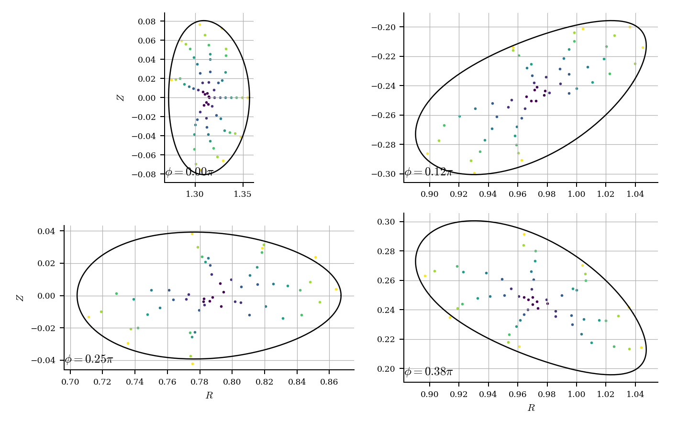
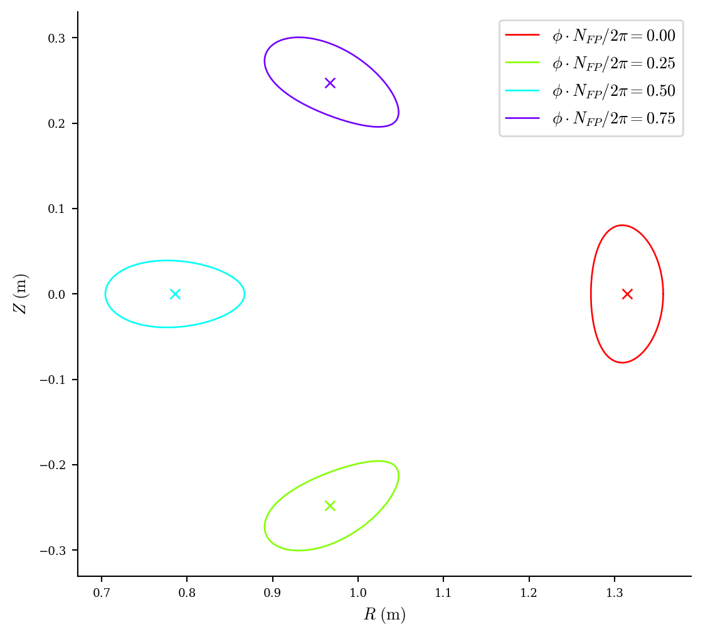
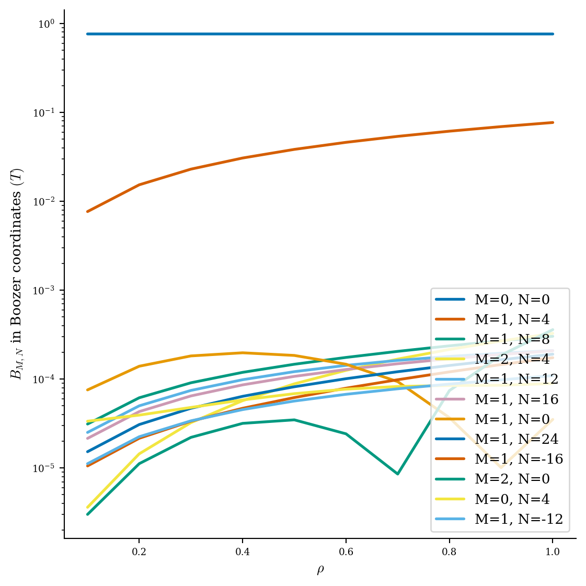
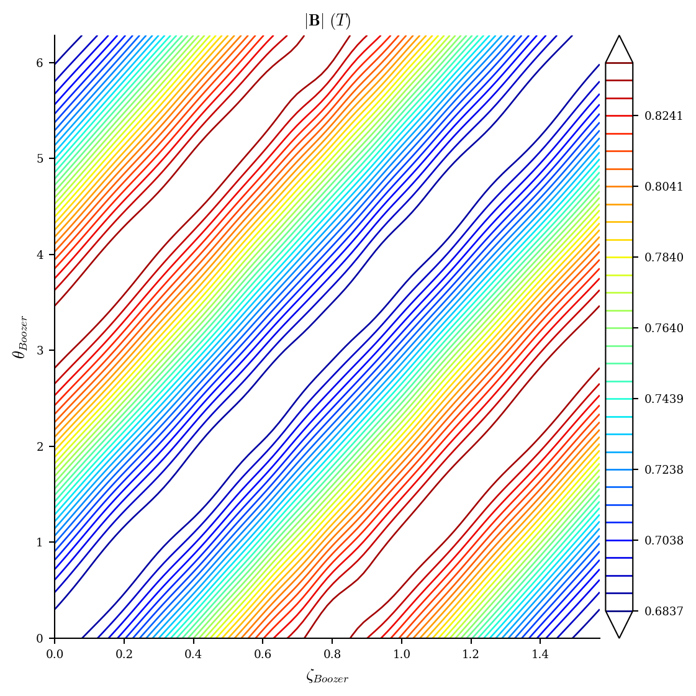
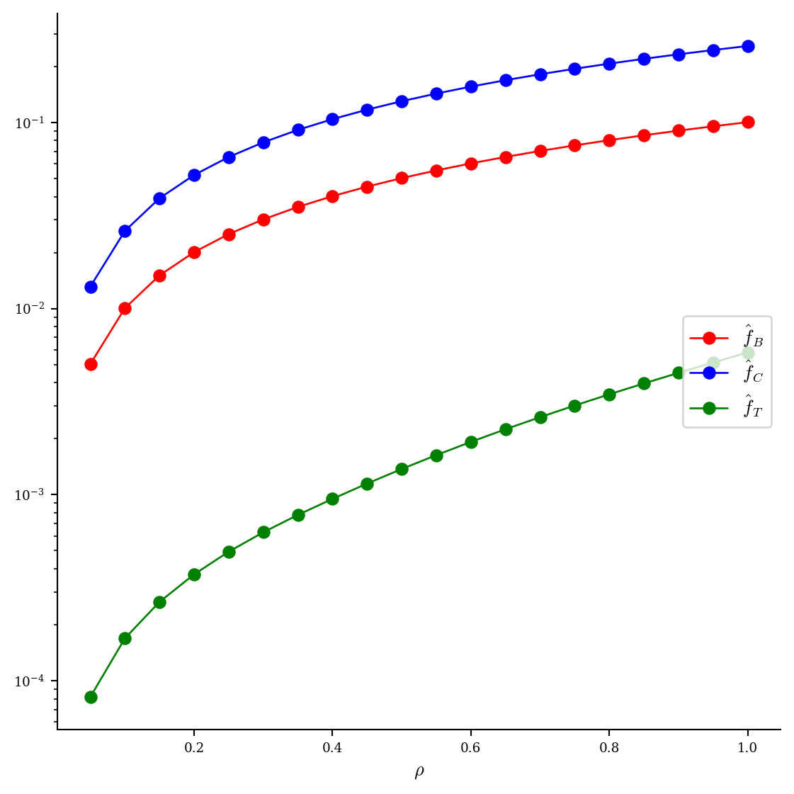
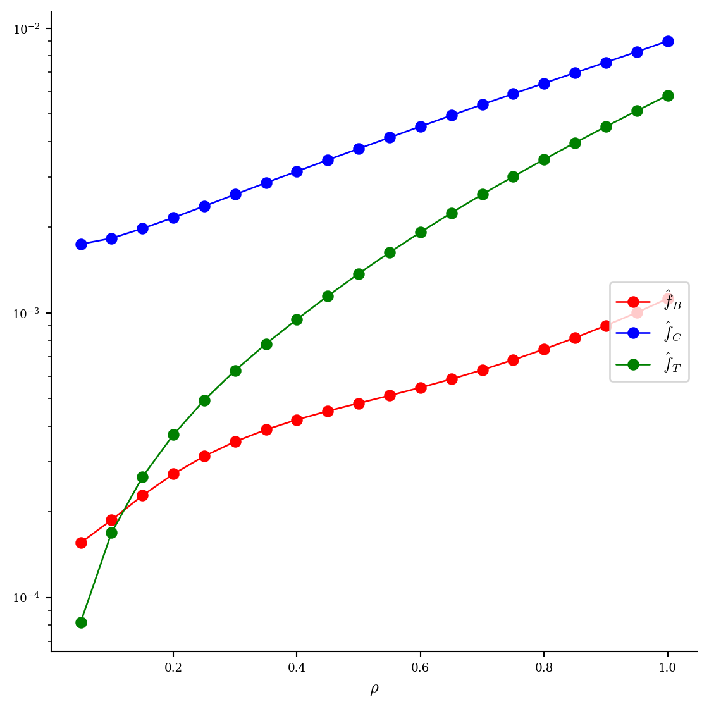
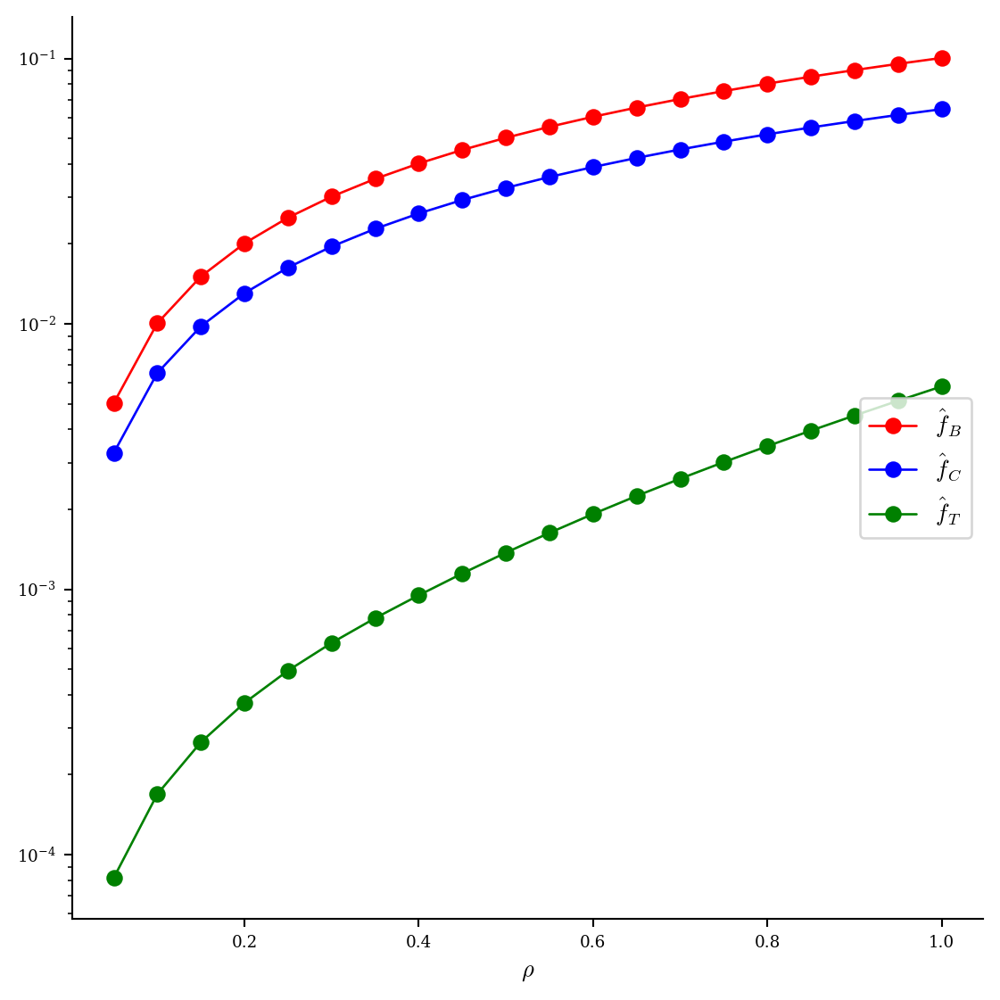
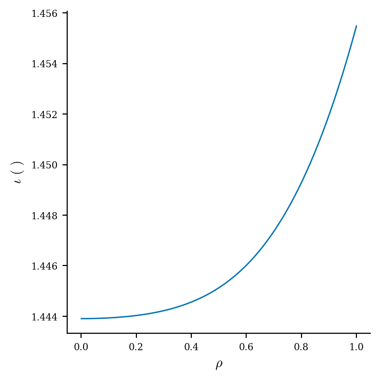

# 当前最小面 QH 样本的完整物理评估

日期：2026-08-19  
分支：`codex/trajectory-face-qs-calibration`  
代码提交：`2ff16a6a6c78d739f0712cf8c4d503ae485fe70d`

## 结论先行

在当前正式轨迹标定表的 1536 个磁面记录中，只统计通过标准 LS/Newton、稠密残差、法向场、正则性和分支检查的正有限值，最小面 QH 为

$$
\epsilon_{\mathrm{QH,face}}=6.687032119376034\times 10^{-8}.
$$

它来自样本 `p107_37034_3_000018_step0150`，即轨迹 `p107_37034_3_000018` 的第 150 步；条件为

$$
N_{\mathrm{FP}}=4,\qquad n_{\mathrm{coils}}=3.
$$

这里的 `n_coils=3` 是三个独立基线圈；应用恒星器对称性和四个场周期后，完整装置包含 24 条物理线圈。原始输入见 [input_case.json](assets/qh_min_face_qh_full_evaluation_20260819/input_case.json)，SHA-256 为 `6ee6f8e1f0290ec49093596a5f95b7f2aac98c61d51af3cad59410a771b7e8c1`。

本轮完整评估没有只画产生最小值的小固定探针面，而是重新为该样本搜索较大的可行磁面。最终选择 `a=0.08, s=0.49`：体积为 $0.06607\,\mathrm{m}^3$，面 QH 为 $5.171\times10^{-7}$，标准面稠密相对残差为 $1.603\times10^{-5}$。Poincare、直接 Boozer 等高线和 DESC 均支持它是嵌套且显著 QH 的大磁面。

## 创纪录的固定探针面

创纪录数值来自轨迹批量标定时的 `fixed_probe`，不是本轮最大面搜索的最终外层面：

| 指标 | 数值 |
|---|---:|
| 目标 $s$ | 0.2632853 |
| 体积 | $0.0135952\,\mathrm{m}^3$ |
| 逆纵横比 | 0.0244815 |
| 面 $\iota$ | 1.4417723 |
| 面 QA / QH / QP | $9.502\times10^{-4}$ / $6.687\times10^{-8}$ / $9.632\times10^{-4}$ |
| $\alpha+\nu$ 初始 Boozer 相对 $L_2$ | $3.805\times10^{-4}$ |
| 标准求解后稠密相对 $L_2$ | $7.571\times10^{-6}$ |
| 标准求解后法向场 P95 | $6.516\times10^{-6}$ |

这个值说明样本内部确实存在极高 QH 精度的磁面，但小面本身不能回答可用磁体积有多大，因此下面另做样本自适应外扩。

## 当前原生 score 复算

使用当前 ABI-10、三次 $\iota(\psi/\psi_{\mathrm{edge}})$ 的生产库重新评分，未复用标定表中的旧分数。生产库 SHA-256 为 `565c32073b145d97a1f2244705fb06e4b3458ce798cd74d0c97ee4e0129dc729`。

| 项目 | 数值 |
|---|---:|
| 状态 / 总分 | `ok` / 94.6368682 |
| axis | 94.8993 |
| psi | 98.8439 |
| surface | 97.0637 |
| coordinate | 89.9660 |
| volume QS | 97.5976 |
| iota | 100.0000 |
| coil | 69.6070 |
| 体 QH / helicity | $8.3062\times10^{-4}$ |
| 体 QA | $1.0793\times10^{-1}$ |
| 体 QP / helicity | $2.6970\times10^{-2}$ |
| score 内部所选 $\iota$ 范围 | 1.3540--1.4738 |
| 单次复算时间 | 4.587 s |

完整原始输出见 [result.jsonl](assets/qh_min_face_qh_full_evaluation_20260819/native_score/result.jsonl)。体微分 QH 与单个面的 QH 定义不同，只应比较排序和数量级趋势，不能直接相减。

## 大磁面搜索

先并行拟合四个样本专属源 $\psi$。四者都找到同一椭圆磁轴，闭合残差为 $2.79\times10^{-8}$：

| $a$ | $\psi$ 独立角度 $L_2$ | 角度 P95 | 廉价筛选最后通过 / 首个失败 |
|---:|---:|---:|---:|
| 0.04 | $6.87\times10^{-6}$ | $2.53\times10^{-5}$ | 0.36 / 0.49 |
| 0.05 | $8.86\times10^{-6}$ | $3.30\times10^{-5}$ | 0.36 / 0.49 |
| 0.06 | $1.12\times10^{-5}$ | $4.13\times10^{-5}$ | 0.36 / 0.49 |
| **0.08** | $1.78\times10^{-5}$ | $6.18\times10^{-5}$ | 0.36 / 0.49 |

`a=0.04` 的局部残差最低，但物理覆盖半径只有 `a=0.08` 的一半。后者误差仍为小量，因此选择 `a=0.08` 继续搜索，而不是固定使用微管。

随后使用 FP32 GPU 稠密 $\alpha+\nu$ 初值、标准 Simsopt LS/Newton 和 97x97 独立密网格验证：

| $s$ | $|V|$ [$\mathrm{m}^3$] | $\iota$ | 最终相对 $L_2$ | 法向场 P95 | 面 QH | 判定 |
|---:|---:|---:|---:|---:|---:|---|
| 0.24 | 0.032025 | 1.44673 | $1.02\times10^{-5}$ | $9.94\times10^{-6}$ | $1.77\times10^{-7}$ | 通过 |
| 0.36 | 0.048755 | 1.45139 | $1.29\times10^{-5}$ | $1.29\times10^{-5}$ | $3.19\times10^{-7}$ | 通过 |
| 0.42 | 0.057255 | 1.45382 | $1.44\times10^{-5}$ | $1.45\times10^{-5}$ | $4.09\times10^{-7}$ | 通过 |
| **0.49** | **0.066070** | **1.45637** | **$1.60\times10^{-5}$** | **$1.60\times10^{-5}$** | **$5.17\times10^{-7}$** | **最大通过面** |
| 0.56 | 0.056558 | 1.45362 | $1.43\times10^{-5}$ | $1.43\times10^{-5}$ | $4.01\times10^{-7}$ | 求解收敛，但体积反降，判为内支跳转 |
| 0.64 | -- | -- | -- | -- | -- | 仅 169938 个有效点，小于固定预算 180000 |

最终面从 $\alpha+\nu$ 初值的相对 $L_2=1.4845\times10^{-2}$ 收敛到 $1.6029\times10^{-5}$。其 QA/QH/QP 分别为

$$
4.6328\times10^{-3},\quad 5.1707\times10^{-7},\quad 4.6934\times10^{-3},
$$

QH 比 QA 和 QP 低约四个数量级。选择过程和全部分支检查见 [selection.json](assets/qh_min_face_qh_full_evaluation_20260819/selection.json)。

## 直接磁面诊断

最大通过面上的 $|B|$ 范围为 0.68371--0.83922 T。白底彩色等高线沿 QH 螺旋方向接近直线，只有小幅平滑弯曲：

[交互式 Boozer 等高线](assets/qh_min_face_qh_full_evaluation_20260819/full/assets/boozer_b.html)

Poincare 使用 8 条内部种子，每条均得到 29 个截面命中。所有点留在黑色候选边界内，截面随环向位置连续旋转，没有分支跳转或自交证据：

完整 24 条线圈和最大磁面的静态预览如下；HTML 可旋转检查周期拼接和遮挡：

[交互式完整装置](assets/qh_min_face_qh_full_evaluation_20260819/full/assets/coils_surface.html)

## DESC 验收

DESC 使用实际 Biot--Savart 场得到的环向磁通 $-5.47695\times10^{-3}\,\mathrm{Wb}$，边界为 `MPOL=12, NTOR=12`，内部平衡分辨率为 $L=M=N=8$。这是显式 CPU-P107 路径，不是 GPU 失败后的静默回退。

| 归一化力残差 | 初始 | 50 步后 |
|---|---:|---:|
| mean | 1.11959 | $5.9204\times10^{-4}$ |
| P95 | 1.76926 | $1.4649\times10^{-3}$ |
| max | 3.39903 | $3.7093\times10^{-3}$ |

初态和终态均通过 nested 检查，边界误差保持在机器精度附近。优化器因达到 50 步上限返回 `success=false`，最终 cost 为 $1.3250\times10^{-4}$、optimality 为 $1.2286\times10^{-4}$；因此准确表述是“DESC 保持嵌套并把力残差降低约三数量级”，不是“优化器严格收敛”。

以下逐张引用本轮实际生成的全部 8 张 DESC 图。

DESC 的 $\iota(\rho)$ 从约 1.444 平滑增加到 1.456，没有向 $\iota\approx0$ 的圆线圈退化。QH 剖面显著低于 QA/QP，和直接面上的等高线及面 QH 数值一致。

## 时间与复现产物

| 阶段 | 时间 | 说明 |
|---|---:|---|
| 当前 native score | 4.59 s | 独立全局磁轴入口 |
| 四个源 $\psi$ 候选 | 7.49 s 关键路径 | 4 GPU 并行 |
| 选中面的 $\alpha$ | 98.63 s | FP32 GPU 稠密拟合 |
| 选中面的 $\nu$ 与面初始化 | 84.26 s | GPU 场计算，CPU 谱投影/重参数化 |
| 选中面的 LS/Newton | 6.39 s | Simsopt CPU |
| 直接可视化 | 37.70 s | 含 Poincare 与 HTML |
| DESC 阶段 | 232.58 s | 显式 16 核 CPU-P107 |
| 下游作业总计 | 306.23 s | 可视化 + DESC |

若事先给定候选层，关键数值路径约为 8.45 分钟；本轮为了找到外侧失败点，额外运行了 `s=0.56/0.64` 的一轮并行外扩，增加约 3.2 分钟。

关键原始产物：

- [完整评估摘要](assets/qh_min_face_qh_full_evaluation_20260819/full/full_summary.json)
- [DESC 摘要](assets/qh_min_face_qh_full_evaluation_20260819/full/desc/summary.json)
- [DESC 输入](assets/qh_min_face_qh_full_evaluation_20260819/full/desc/input.check)
- [DESC 平衡文件](assets/qh_min_face_qh_full_evaluation_20260819/full/desc/equilibrium.h5)
- [最大面标准求解摘要](assets/qh_min_face_qh_full_evaluation_20260819/candidates/s_0p49/standard_rho_1/summary.json)
- [最大面 alpha 摘要](assets/qh_min_face_qh_full_evaluation_20260819/candidates/s_0p49/alpha/summary.json)
- [最大面 alpha+nu 摘要](assets/qh_min_face_qh_full_evaluation_20260819/candidates/s_0p49/alpha_nu/summary.json)

`equilibrium.h5` 的 SHA-256 为 `51e5e30d0d3fe17a059bd8aab9e2bf319b2cb2e6efb6c22b3149d63e025bd958`。所有数值和图来自本轮新建目录，没有续写或覆盖旧评估结果。
