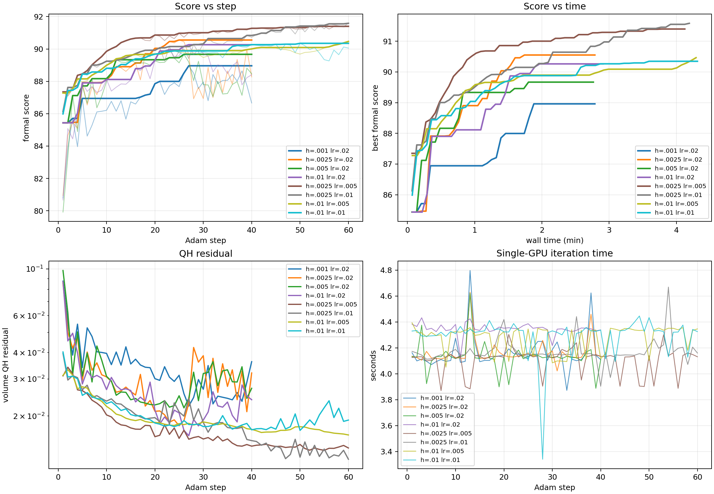
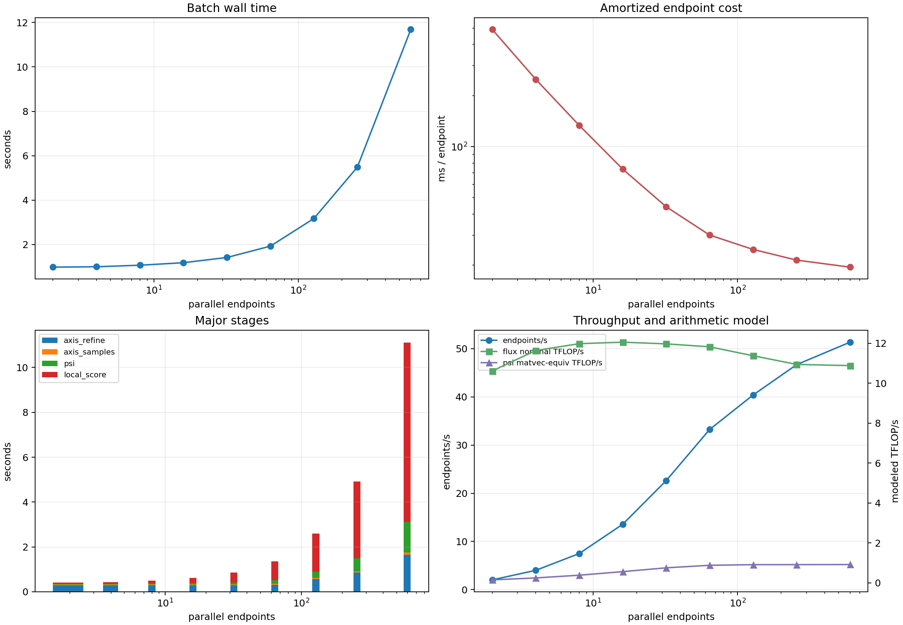
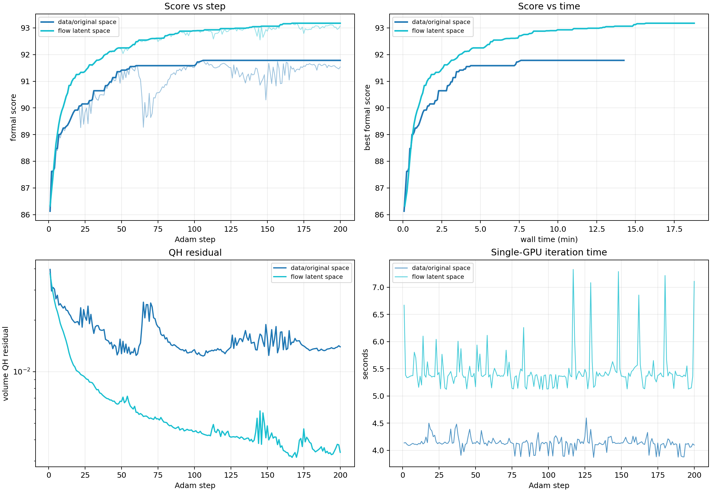

# QH 原空间直接优化与潜空间必要性实验

日期：2026-08-15
分支：`codex/original-space-optimization`

## 要回答的问题

现有主线先用 flow matching 把潜变量 $z$ 映射为线圈，再在 $z$ 上做有限差分 Adam。本实验只问一个问题：**从同一个已经较好的线圈出发，移除 flow 映射后，直接更新线圈参数是否也能达到相近的优化效果？**

若原空间在相同起点、相同 score、相同差分方向数和相近墙钟内也能达到潜空间约 93 分的水平，那么 flow 对这个局部优化任务不是必要条件；若原空间稳定停在明显更低的水平，或很容易破坏磁轴和磁面分支，则说明 flow 学到的相关坐标仍有实际价值。

## “原空间”在这里的准确含义

一个基线圈由 100 个数表示：99 个 Fourier 几何系数和一个电流。直接对带单位的原始数值使用同一个步长没有数学意义，因为米、不同频率系数和安培的尺度相差很大。因此本实验使用 flow 训练时固定的逐坐标标准化：

$$
q_j=\frac{x_j-\mu_j}{\sigma_j},\qquad
x_j=\mu_j+\sigma_j q_j.
$$

Adam 和有限差分直接作用于 $q$；每次评分前只做固定反标准化和既有的电流 $L_1$/符号规范化。这里没有 Transformer、ODE 或 RK4。换言之，优化变量仍是一一对应的线圈数据坐标，只用固定对角尺度解决量纲问题。这个尺度不会学习或混合不同线圈、不同 Fourier 模态，因此不能提供 flow 的非线性相关方向。

起点仍是历史上反复使用的 `start_10`：先用固定 checkpoint 做**一次** RK4-128 解码，得到同一个真实线圈；之后整个原空间优化不再调用 flow。报告必须核对这次坐标往返是否裁剪，以及线圈重建误差是否为可忽略小量。

## 实验设计

原空间和潜空间共同采用：

- 当前 ABI-10 query-batch score 与严格磁轴续接；
- 64 个每步重新抽取的正交随机方向，即 128 个中心差分端点；
- 局部端点省略不稳定的 coordinate 导数，但更新后的中心使用完整正式 score 验收；
- Adam $\beta_1=0.7,\beta_2=0.999$；
- 单个 run 只占一张 RTX 5090。

先对差分尺度 $h$ 做短跑标定。候选至少覆盖 `0.001, 0.0025, 0.005, 0.01`；若照搬潜空间的 $h=0.005$ 已稳定，则主要比较其前 20--50 步增益，选择没有无效端点、没有持续回撤且增益最大的尺度。随后对最合理的 $h$ 跑 200 步，并与仓库中同一 `start_10` 的潜空间 `K=64, h=0.005, lr=0.02` 200 步历史逐步比较。

如果所有 $h$ 都能估计方向但更新过弱或过强，再单独调整学习率；不允许同时改多个参数后把差异归因于“原空间”。核心判据是最佳正式 score、达到 90/92/93 的步数与墙钟、体 QH residual、无效端点/中心比例和回撤行为。

## 单卡并行吞吐实验

固定同一个起点和 $h=0.005$，将一次梯度中的并行端点数扫为

$$
N\in\{2,4,8,16,32,64,128,256,600\}.
$$

这些端点在一个 query-first C++/CUDA 调用中处理，不是 Python 循环。性能图同时展示 batch 墙钟、均摊每端点耗时、主要阶段和吞吐。

完整 score 包含追踪、矩阵自由 PCGLS、归约和分支判断，不存在一个无歧义的总 FLOP 数。报告中的 TFLOPS 因而分成两个明确的算法模型：

1. flux 阶段按每个 segment-point Biot--Savart 相互作用 28 个普通浮点操作估算，不给 `rsqrt` 虚构等价 FLOP；
2. $\psi$ PCGLS 按每轮一次 $Aq$ 和一次 $A^Tr$、FMA 计两次 FLOP，报告矩阵乘等价吞吐。

二者都不是 Nsight 硬件计数器，不能冒充整条 score 的精确硬件 TFLOPS；它们用于判断 batch 增大后算术单元是否更充分，而端到端判断仍以每端点毫秒数为准。

## 实验结果

所有数值使用空闲的单张 RTX 5090。代码快照为 `8a628f2`，score 动态库 SHA-256 为
`7834a88d5437ba9910c78bb0eb5483efc71134579624ee2cc74100297a5799a3`，flow checkpoint SHA-256 为
`39a3293a459e248a0d1ec062607a1a467128b14d8ca973aadd82e113532ab99f`。各作业分配前后都通过 GPU 空闲检查，已完成作业没有残留进程。

### 起点映射核验

`start_10` 经一次 RK4-128 解码后，转入数据坐标时没有任何坐标触发 $[-8,8]$ 裁剪；再反标准化回线圈的相对 RMS 误差为

$$
1.15\times10^{-15}.
$$

因此原空间实验和潜空间对照确实从同一个物理线圈出发，不是先换了一个近似线圈。当前正式 score 对原空间起点给出 `85.4355`；匹配潜空间 run 记录为 `85.5045`，二者相差 `0.0690`。逐项比较发现差异主要来自 axis 分量 `96.623` 对 `97.425`：两次 Newton 最终残差分别为 $4.86\times10^{-8}$ 和 $5.48\times10^{-9}$。物理线圈的最大绝对系数差只有 $4.66\times10^{-10}$，相对 L2 差仍为 $1.15\times10^{-15}$。这说明 axis 子分量会放大已经很小的最终迭代残差，不能把 `0.069` 的起点差解释成 flow 或原空间的优劣。

### 差分步长和学习率

首先固定潜空间实验沿用的 `lr=0.02`，每个 $h$ 跑 40 步：

| 数据空间 $h$ | 最佳 score | 最佳步 | 第 40 步 | 平均单步 |
|---:|---:|---:|---:|---:|
| 0.0010 | 88.9607 | 27 | 86.6608 | 4.162 s |
| 0.0025 | **90.5522** | 25 | 88.2722 | 4.163 s |
| 0.0050 | 89.6689 | 26 | 88.4670 | 4.131 s |
| 0.0100 | 90.2629 | 27 | 88.4040 | 4.347 s |

四条轨迹都能显著提高 score，所以原空间方向并非不可用；但 `lr=0.02` 都在约第 25 步后明显回撤。这说明潜空间的更新尺度不能原封不动地搬到数据空间。

随后保留表现最好的 $h=0.0025$ 和更平滑的 $h=0.01$，将学习率降到 `0.005/0.01`，每组跑 60 步：

| $h$ | 学习率 | 最佳 score | 最佳步 | 第 60 步 | 结论 |
|---:|---:|---:|---:|---:|---|
| 0.0025 | 0.005 | 91.3988 | 55 | 91.3893 | 稳定，但略慢 |
| 0.0025 | 0.010 | **91.5849** | **60** | **91.5849** | 末步仍刷新，选为正式配置 |
| 0.0100 | 0.005 | 90.4651 | 60 | 90.4651 | 稳定但方向过平滑 |
| 0.0100 | 0.010 | 90.3480 | 50 | 90.0554 | 后段轻微回撤 |

正式 200 步实验因此固定为 $h=0.0025$、`lr=0.01`、64 个正交方向和 Adam $\beta=(0.7,0.999)$。这不是事后无限扫参：两轮短跑分别只回答“差分尺度是否可用”和“更新尺度是否过大”。

### 单卡 batch 大小与均摊时间

下面是同一中心、相同 $h=0.005$、每个 batch 重复三次的中位数。`局部梯度时间`包括中心捕获、128 路各自的磁轴与 $s/\psi$ 更新，以及局部 surface/flux/$\alpha$/$\iota$/QS；不包括更新后中心的一次正式 score。

| 并行端点数 | 局部梯度时间 | 均摊每端点 | 端点吞吐 | flux 名义 TFLOP/s | $\psi$ matvec 等价 TFLOP/s |
|---:|---:|---:|---:|---:|---:|
| 2 | 0.981 s | 490.49 ms | 2.04/s | 10.61 | 0.15 |
| 16 | 1.180 s | 73.73 ms | 13.56/s | 12.06 | 0.56 |
| 64 | 1.926 s | 30.09 ms | 33.23/s | 11.82 | 0.88 |
| **128** | **3.170 s** | **24.77 ms** | **40.38/s** | **11.38** | **0.91** |
| 256 | 5.486 s | 21.43 ms | 46.67/s | 10.94 | 0.91 |
| 600 | 11.689 s | 19.48 ms | 51.33/s | 10.88 | 0.92 |

从 2 个端点扩大到 600 个端点，均摊成本下降 **25.18 倍**。当前优化使用的 128 端点已经获得大部分 batch 收益；继续扩到 600 只能把均摊时间再降低约 21%，却会按比例增加总墙钟。

这里的两个 TFLOPS 都是报告前面定义的算法模型，不是硬件计数器。flux 的名义吞吐在 8--64 端点达到约 12 TFLOP/s，之后略降；$\psi$ 的矩阵乘等价吞吐在 128 端点后饱和于约 0.92 TFLOP/s。完整 score 远低于 RTX 5090 的纯 FP32 峰值是合理的：主要工作包含 RK 追踪、分支判断、归约、`rsqrt`、矩阵自由基函数计算和大量 kernel 启动，并不是单个高运算密度 GEMM。性能判断应以端点/秒为主，不能用一个虚构的整链路 FLOP 数宣称利用率。

原空间正式短跑平均约 `4.13--4.29 s/step`。同一起点的历史潜空间 K64 200 步平均为 `5.50 s/step`；移除每步 RK4 flow 后，原空间每步当前约快 25%。最终是否值得放弃潜空间，仍要看下面的 200 步摸高，而不是只看单步速度。

### 200 步正式比较

为了不把历史运行的轴迭代残差当成参数化差异，此处重新运行了一条当前代码、当前动态库和同一类 RTX 5090 节点下的潜空间对照。两个 run 都使用 64 个方向、128 个中心差分端点和完整中心 score；不同之处只是参数化以及短跑标定后的 $h$/学习率。

| 方法 | $h$ / 学习率 | 起点 | 最佳 score | 最佳步 | 第 200 步 | 平均单步 | 总墙钟 |
|---|---:|---:|---:|---:|---:|---:|---:|
| 标准化原空间 | `0.0025 / 0.01` | 85.4355 | **91.7831** | 106 | 91.5345 | **4.133 s** | **14.28 min** |
| flow 潜空间 | `0.005 / 0.02` | 85.5045 | **93.1764** | 167 | 93.0739 | 5.455 s | 18.81 min |

原空间从起点提高了 `6.3476` 分，这已经明确否定了“不经 flow 就无法做局部优化”。但 flow 潜空间提高了 `7.6718` 分，最佳结果比原空间高 `1.3932` 分。在原空间 run 结束的同一墙钟 `856.5 s` 内，潜空间已到达 `93.0645`，仍比原空间的 `91.7831` 高 `1.2813` 分。因此这个优势不是用更长墙钟换来的。

| 首次到达 | 原空间 | flow 潜空间 |
|---:|---:|---:|
| 90 | 21 步 / 95.5 s | 10 步 / 59.7 s |
| 91 | 44 步 / 194.1 s | 16 步 / 93.3 s |
| 91.5 | 56 步 / 245.6 s | 27 步 / 154.9 s |
| 92 | 未到达 | 39 步 / 221.1 s |
| 93 | 未到达 | 136 步 / 764.1 s |

两条轨迹的 200 个正式中心全部为 `ok`，每步 128 个差分端点也全部为 `ok`，没有拒绝更新。所以差距不是原空间经常丢失磁轴或被安全门截断造成的；它来自两种坐标下有效搜索方向的差异。

### 物理分量和无历史复评

| 最佳样本 | volume QS 分量 | 体 QH residual | 每 helicity QH residual | surface 分量 | $\iota$ 范围 |
|---|---:|---:|---:|---:|---:|
| 原空间 | 92.7013 | $1.2355\times10^{-2}$ | $2.9965\times10^{-3}$ | **87.1105** | 1.3961--1.4906 |
| flow 潜空间 | **97.7495** | $3.1562\times10^{-3}$ | $7.6550\times10^{-4}$ | 81.5767 | 1.3458--1.4699 |

潜空间最佳样本的体 QH residual 是原空间的 `0.2555` 倍，即低约 **3.91 倍**。它的 surface 分量反而低 `5.53` 分，说明总分差异不是“潜空间只把所有容易项都提高了”，而是它找到了明显更强的 QH 改善方向。

为排除严格磁轴 continuation 对结果的影响，作业 `38468` 对两个 best 都做了一次无历史磁轴提示的独立复评，并显式使用与优化相同的连续磁面 score 设置：

| 最佳样本 | 在线 continuation score | 独立连续 score | 差值 |
|---|---:|---:|---:|
| 原空间 | 91.7831 | 91.7815 | -0.0017 |
| flow 潜空间 | 93.1764 | 93.1413 | -0.0351 |

两个独立复评都是 `ok`，而且保持原排序和约 1.36 分的差距。这证明结论不依赖优化器保存的磁轴历史。

## 结论

**flow 潜空间不是“能否优化”的必要条件，但它在当前优化器下仍是有实际价值的非线性预处理。**

从这一个反复使用的起点出发，标准化原空间可以稳定从 85.44 提到 91.78，因此 flow 不是突破 90 分或保持磁轴分支的机制前提。但在相同 200 步及相同墙钟两种口径下，潜空间都更高，并把真正关键的体 QH residual 再降低约 3.91 倍。对当前“高分 QH 摸高”任务，不应因为原空间单步快 25% 就删除 flow。

这个实验只比较了一个起点和一种固定对角标准化，所以它不能证明“任何原空间预处理都不可能追上 flow”。它能支持的准确判断是：对现有两种参数化和已标定的 Adam 配置，flow 不决定可优化性，但显著改善收敛速度和最终 QH 质量。
