# QH 随机起始分数与 Adam 可优化性实验报告

日期：2026-07-31  
条件：QH，$N_{\mathrm{FP}}=4$，3 根基线圈

## 1. 实验问题

本实验只研究一个问题：从 flow prior 的 IID 标准高斯潜变量出发时，起始 native score 的高低是否会影响后续标准 Adam 的优化效果。

这里的“随机起点”严格定义为

$$
z_0\sim\mathcal N(0,I),\qquad z_0\in\mathbb R^{3\times100}.
$$

本实验不使用 proxy 排序、proxy 优化、CEM、QUASR 反演样本或其他预筛选分布。这样得到的分数分布和 Adam 起点都属于同一个自然 flow prior，避免把“起始 score 的作用”与“起点生成方法不同”混在一起。

高分标准按本轮约定处理：优先把 $S\geq50$ 视为高分；若 4096 个新增 IID 样本中仍无 $S\geq50$，则把 $S\geq40$ 作为本实验可获得的高分层，同时把 $S\geq50$ 明确报告为空的极高分层，而不是事后降低标准并隐去这一事实。

## 2. 随机起点评分流程

每个随机潜变量经过完全相同的固定流程：

$$
z_0
\xrightarrow[256\ \text{steps}]{\text{FP32 RK4 flow}}
x
\xrightarrow{\text{normalizer}^{-1}}
\text{coil parameters}
\xrightarrow{\text{current native CUDA score}}
S.
$$

其中 flow checkpoint 固定为 30000 step EMA，SHA-256 为
`39a3293a459e248a0d1ec062607a1a467128b14d8ca973aadd82e113532ab99f`；native score 动态库固定为修复全局电流反号 bug 后的版本，SHA-256 为
`0b7342db471788385931385c25ded8095c72cfb7fcea1e21376a0475dafaa427`。

4096 个潜变量由单一 seed `20260805` 一次生成并保存。`case_id` 同时索引潜变量数组和 score 结果，后续起点面板要求 ID 为 $0,\ldots,4095$ 的一一映射并记录两个源文件的 SHA-256，防止高分记录与错误潜变量错配。

flow 解码在一张 RTX 5090 上批量执行。native score 使用四个持久 C++/CUDA worker，每张已分配 RTX 5090 对应一个 worker。Python 只负责批量调度和产物整理，不实现数值评分热路径。

## 3. Adam 实验定义

对选中的每个随机起点，目标函数都是

$$
S(z)=\operatorname{native\_score}\!\left(F_\theta(z)\right).
$$

每轮生成 $m=4$ 个相互正交且单位 RMS 的方向 $u_j$，使用扰动 $c=0.01$ 估计

$$
\hat g_t=
\frac{1}{4}\sum_{j=1}^{4}
\frac{S(z_t+c u_j)-S(z_t-c u_j)}{2c}u_j.
$$

随后执行最大化形式的标准 Adam：

$$
m_t=0.9m_{t-1}+0.1\hat g_t,
$$

$$
v_t=0.999v_{t-1}+0.001\hat g_t^2,
$$

$$
z_{t+1}=z_t+0.003\frac{\hat m_t}{\sqrt{\hat v_t}+10^{-8}}.
$$

没有权重衰减、学习率调度、梯度差截断、更新截断、参数截断、先验惩罚、proposal 搜索、回溯或 accept/reject。每轮固定评估 8 个正负扰动端点和 1 个更新后中心点。flow 解码仍为 FP32 RK4-256，score 仍为同一个修正后原生实现。

为减少随机梯度方向造成的混杂，所有分数层使用相同的方向随机种子，即共同随机数设计。每个分数层选择多个不同 IID 潜变量，以观察同一分数范围内部的几何差异。

## 4. 结果

### 4.1 4096 个 IID 起点的 native score 分布

| 指标 | 数值 |
| --- | ---: |
| 样本数 | 4096 |
| mean | 4.3412 |
| median | 3.4938 |
| P90 | 9.4202 |
| P95 | 11.7650 |
| P99 | 21.0310 |
| P99.5 | 25.2304 |
| max | **41.0501** |
| `status=ok` | 2149 / 4096，52.47% |
| `status=ok` 内 mean / median | 8.0551 / 7.5072 |

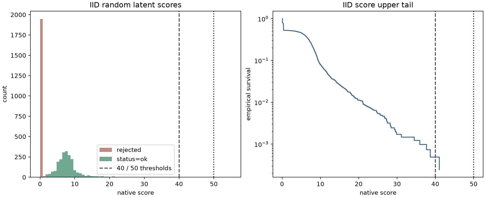

高分尾部计数为：

| 门槛 | 数量 | 占全部样本比例 |
| ---: | ---: | ---: |
| $S\geq10$ | 326 | 7.959% |
| $S\geq20$ | 45 | 1.099% |
| $S\geq30$ | 6 | 0.1465% |
| $S\geq40$ | 1 | 0.0244% |
| $S\geq50$ | **0** | **0%** |

这给出了比原来 256 样本更清楚的尾部结论：自然 flow prior 并非完全不能产生较好的样本，但 30 分以上已经很少，40 分以上在 4096 次中只出现一次，50 分以上没有出现。因此后续若要求“随机 Adam 有多大概率从高分盆地启动”，不能把 15 或 20 分重新命名为高分；本实验按约定以 40 分作为实际可获得的高分层，并把 50 分以上报告为空的极高分层。

失败状态由 842 个 `no_axis`、268 个 `no_surface`、819 个 `drift_rejected` 和 18 个 `flux_rejected` 组成。总体低分的一部分来自无法通过磁轴或磁面门控，而不是所有样本都在同一个可行物理区域内连续变化。因此 Adam 分析要同时报告全体轨迹和从 `status=ok` 起点出发的轨迹。

### 4.2 Adam 起点面板

在完整分布上选择了 12 个不同潜变量：

| 起点 | `case_id` | 记录 score | 初始状态 | latent RMS |
| ---: | ---: | ---: | --- | ---: |
| 0 | 1375 | 0.0908 | `no_axis` | 1.0905 |
| 1 | 3273 | 2.0157 | `ok` | 0.9875 |
| 2 | 1164 | 5.0042 | `ok` | 0.9908 |
| 3 | 2414 | 7.9996 | `ok` | 1.0126 |
| 4 | 568 | 9.9966 | `ok` | 1.0005 |
| 5 | 2683 | 11.9833 | `ok` | 1.0069 |
| 6 | 548 | 14.9835 | `ok` | 1.0093 |
| 7 | 2044 | 19.7630 | `ok` | 0.9853 |
| 8 | 1220 | 24.9121 | `ok` | 0.9618 |
| 9 | 3549 | 29.8723 | `ok` | 0.9518 |
| 10 | 2912 | 38.6943 | `ok` | 0.9538 |
| 11 | 132 | **41.0501** | `ok` | 0.9200 |

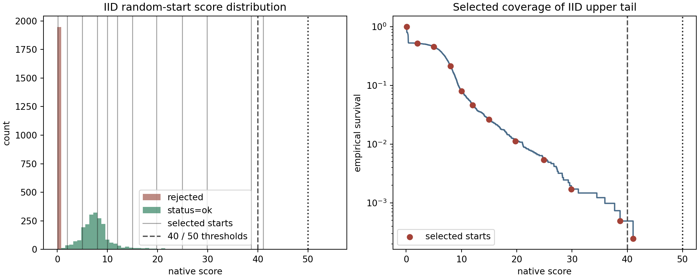

面板不是 12 个分数箱的频率抽样，而是为研究 score landscape 主动选取的连续覆盖。因此它可以回答“不同起始 score 下的中短程 Adam 轨迹有何差异”，不能用来重新估计自然先验中的成功概率；成功概率只能由上一节未重加权的 4096 样本统计给出。

### 4.3 随机池耗时与验收

| 阶段 | 资源 | 耗时 |
| --- | --- | ---: |
| 4096 个潜变量 FP32 RK4-256 解码 | 1 x RTX 5090 | 38.34 s |
| 4096 次 corrected native score | 4 x RTX 5090 | 5165.32 s |
| 合计核心计算 | 4 卡作业 | 5203.66 s，约 86.73 min |
| 平均每样本 score 墙钟摊销 | 4 卡 | 1.261 s |

四张卡的 preflight 与 postflight 均为 2 MiB、0% 利用率，说明计时没有与其他计算进程重叠，任务结束后也没有遗留 score worker。manifest 的 flow checkpoint 和 score 动态库哈希均与本报告第 2 节一致。

原始结果位于 [随机池目录](assets/qh_random_score_pool_29960/)，起点与映射位于 [Adam 面板目录](assets/qh_score_adam_start_panel_29960/)。`scored_cases.jsonl` 和 `random_latents.npz` 的 SHA-256 分别为 `49cccc0d7b6dcb8aa8a7f9e620f897817610278a2edac215aa77edcd02a9abb8` 与 `88bdeefab57f1d2f0320fb4cc339ae3a374eb25243b6ff2f70ccad614d16ea12`。

### 4.4 Adam 结果

Slurm 控制器恢复后，单步烟测 `29992` 先通过；正式数组 `29996` 完成起点 0--9，补充数组 `30025` 完成起点 10--11。12 个数组元素均为 `COMPLETED 0:0`，每条轨迹都严格执行 40 步。

| 起点 | 初始 score | 10 步最佳 | 20 步最佳 | 30 步最佳 | 40 步最佳 | 增益 | 总耗时 / s |
| ---: | ---: | ---: | ---: | ---: | ---: | ---: | ---: |
| 0 | 0.091 | 0.356 | 0.364 | 0.364 | 0.364 | 0.273 | 678.1 |
| 1 | 2.013 | 4.663 | 4.675 | 4.681 | 4.769 | 2.755 | 828.9 |
| 2 | 5.001 | 6.303 | 6.864 | 6.980 | 8.002 | 3.001 | 901.2 |
| 3 | 8.002 | 10.061 | 14.375 | 24.482 | **27.366** | **19.363** | 851.4 |
| 4 | 9.993 | 10.861 | 11.745 | 12.691 | 13.306 | 3.313 | 827.8 |
| 5 | 11.976 | 12.847 | 13.885 | 15.252 | 16.305 | 4.329 | 830.3 |
| 6 | 14.955 | 15.245 | 15.825 | 16.717 | 17.740 | 2.784 | 825.8 |
| 7 | 19.748 | 21.863 | 25.555 | 29.858 | **33.648** | **13.900** | 895.3 |
| 8 | 24.889 | 28.593 | 30.789 | 33.880 | **36.407** | **11.518** | 938.0 |
| 9 | 29.879 | 32.663 | 35.563 | 38.002 | **39.395** | **9.516** | 863.7 |
| 10 | 38.659 | 40.823 | 45.435 | 46.152 | **47.201** | **8.542** | 1044.2 |
| 11 | 41.053 | 42.580 | 43.828 | 44.650 | **45.241** | **4.188** | 856.6 |

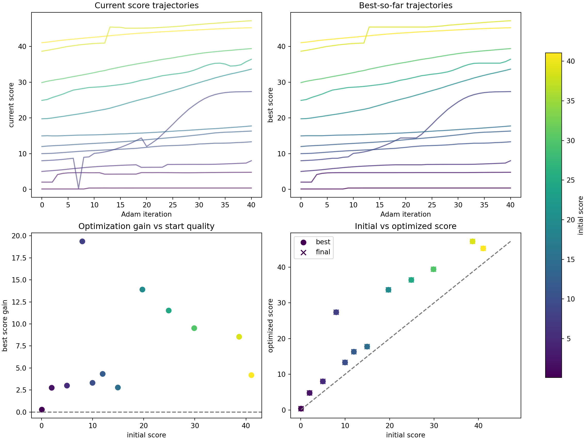

初始 score 与 40 步最佳 score 的 Pearson / Spearman 相关系数为 `0.940 / 0.951`。这个强相关主要说明较好的起点在相同预算后通常仍然较好；它不能直接说明高分点更容易优化，因为最佳 score 自身包含初始 score 这一基线。

更直接反映可优化难度的“最佳增益”与初始 score 的 Pearson / Spearman 相关系数只有 `0.249 / 0.517`。具体轨迹也显示明显的局部盆地差异：8.00 分起点获得了全组最大的 19.36 分增益，而相邻的 9.99、11.98、14.96 分起点只增加 2.78--4.33 分；19.75--29.88 分的三个起点则稳定增加 9.52--13.90 分。最高的 41.05 分起点最终只有 4.19 分增益，且低于 38.66 分起点的最终 47.20 分。

被拒绝的 0.091 分起点没有被 40 步 Adam 救回可用区域，最佳值仅 0.364。其余 11 个 `status=ok` 起点都提高了分数，但没有一条在 40 步内达到 50 分。除拒绝起点在第 12 步达到最佳外，其余 11 条轨迹都在第 40 步刷新最佳，因此这些结果是统一中短程预算下的响应，不是各起点的收敛上限。

12 条轨迹累计计算耗时为 10,341.3 s，平均每条 861.8 s（14.36 min）。高分样本通常进入 native score 的更多阶段，因此单条耗时在 678--1,044 s 之间变化。完整结果位于 [Adam sweep 目录](assets/qh_score_adam_start_sweep_29996/)；机器可读汇总为 [sweep_summary.json](assets/qh_score_adam_start_sweep_29996/sweep_summary.json)，逐轨迹压缩汇总为 [trajectory_summary.jsonl](assets/qh_score_adam_start_sweep_29996/trajectory_summary.jsonl)。

## 5. 结论与边界

4096 个无偏 IID 样本给出的自然先验结论不变：$S\geq40$ 约为 $2.4\times10^{-4}$ 的稀有事件，本轮没有观测到 $S\geq50$。因此随机抽样本身很难频繁提供极高分 Adam 起点。

对已经抽到的起点，初始 score 对固定预算后的绝对质量有很强预测力，但对可优化增益只有有限预测力。真正决定短程 Adam 能否大幅上升的是局部 landscape，而不是初始 score 一个标量。约 20--30 分的三个起点在本面板中都表现出良好、连续的上升，说明这一层是有价值的优化起点；但 8 分起点的异常大增益和 10--15 分层的平缓轨迹同时表明，不能仅凭 score 阈值推断盆地宽度。

本面板是为了覆盖 score 轴而主动选出的 12 个点，不是按自然先验频率抽取的独立重复试验。每个分层样本数很少，尤其 40 分以上只有一个，因此不能从 12 条轨迹估计“随机 Adam 成功率”，也不能把相关系数当作总体精确值。若后续目标是预测哪些随机起点值得投入长程 Adam，需要额外学习或测量局部平滑度、梯度一致性和可行域裕量，而不应只按初始 score 排序。

## 6. 当前最佳 47.2006 样本的完整物理评估

### 6.1 验收结论

12 条轨迹中最高分的 `start_10` 进一步通过了固定完整评估。结论是：**该样本确有较大、可守护求解的嵌套 QH 磁面，DESC 也把力误差降到小量；但 QH 起伏仍明显，和 47.20 的中等 score 一致。**

这次没有复用此前 71.7342 样本的 `a` 或 `s`。源 $\psi$ 并行测试了 `a=0.04,0.05,0.06,0.08`；四者的训练/验证误差均稳定，本样本实测选择 `a=0.08`，因为它在误差仍小的前提下覆盖了最大的通过半径：

| $a$ | $\psi$ 验证 RMS | 方向误差 P95 | 最大廉价筛选通过层 | 通过层平均半径 / m | 首个外层失败 |
| ---: | ---: | ---: | ---: | ---: | ---: |
| 0.04 | $6.79\times10^{-4}$ | $4.91\times10^{-5}$ | 0.49 | 0.02847 | 0.64 |
| 0.05 | $6.89\times10^{-4}$ | $6.06\times10^{-5}$ | 0.49 | 0.03557 | 0.64 |
| 0.06 | $7.02\times10^{-4}$ | $7.17\times10^{-5}$ | 0.49 | 0.04269 | 0.64 |
| **0.08** | **$7.38\times10^{-4}$** | **$9.59\times10^{-5}$** | **0.49** | **0.05716** | **0.64** |

磁轴闭合残差为 $4.52\times10^{-9}$。`a=0.08` 的误差虽略高于更小拟合域，但仍处于 $10^{-4}$ 方向误差量级，并把已验证物理半径扩展一倍，因此选择依据不是“误差最小即最好”，而是误差与有用体积的共同约束。

### 6.2 $\alpha+\nu+$ guarded 外扩

在选中的源 $\psi$ 上测试 `s=0.24,0.36,0.49,0.64`。`s=0.36` 是最大通过面，紧邻的 `s=0.49` 已被离网格残差和法向场门槛明确拒绝：

| $s$ | 判定 | $|V|$ / $\mathrm{m}^3$ | $\iota$ | 离网格 relative $L^2$ | 法向场 P95 | 相对 $\psi$ 面距离 P95 / mm |
| ---: | --- | ---: | ---: | ---: | ---: | ---: |
| 0.24 | 通过 | 0.03088 | 1.6890 | $2.58\times10^{-5}$ | $4.08\times10^{-5}$ | 0.135 |
| **0.36** | **通过并选中** | **0.04741** | **1.6971** | **$3.06\times10^{-5}$** | **$4.66\times10^{-5}$** | **0.185** |
| 0.49 | 拒绝 | 0.06353 | 1.6847 | $2.51\times10^{-2}$ | $1.64\times10^{-2}$ | 5.045 |
| 0.64 | 拒绝 | 0.05365 | 1.6431 | $1.27\times10^{-1}$ | $1.62\times10^{-1}$ | 47.395 |

选中层的 $\alpha$ 使用 120,000 个训练点、60,000 个验证点和 $(L,M,N)=(12,12,16)$。验证 relative $L^2$ 为 0.09652，$\min(1+\lambda_\theta)=0.2547>0$，拟合得到 $\iota=1.6781$。12 阶 $\nu$ 把表面 Simsopt relative $L^2$ 从 0.20148 降到 0.006801，映射 Jacobian 最小值为 0.6508。guarded 修正接受 5 步后得到

$$
\iota=1.697113,\qquad G=-6.943557,\qquad |V|=0.047414\ \mathrm{m}^3.
$$

最终面相对 $\psi$ 等值面的线性化法向距离 P95 为 0.185 mm；相对 $\alpha+\nu$ 初始面的双向位移 P95 为 1.787 mm，低于本面 2.353 mm 的保护阈值。

### 6.3 场线、$|B|$ 与线圈几何

8 条场线在四个环向截面上各取得 25 个命中，未越过候选边界；该采样没有显示逃逸或宏观磁岛。点数只够做验收级检查，不把这张稀疏图过度解释为高分辨率拓扑证明。

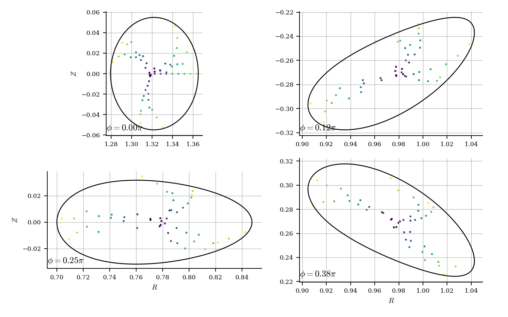

直接 Boozer 面上的 $|B|$ 范围为 0.65933--0.80806 T，平均值为 0.73579 T。白底彩色等高线显示清楚的 QH 斜条纹，但闭合畸变和非理想起伏仍明显；这与 native score 的 `volume_qs=34.39` 一致，并不是“高 score 被完整评估推翻”。

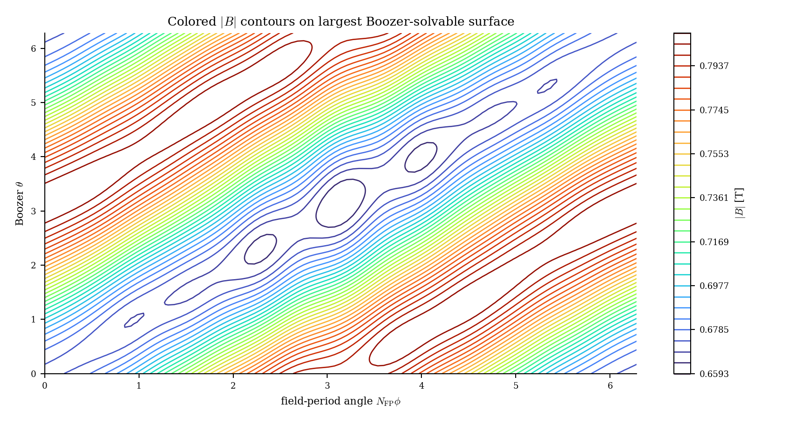

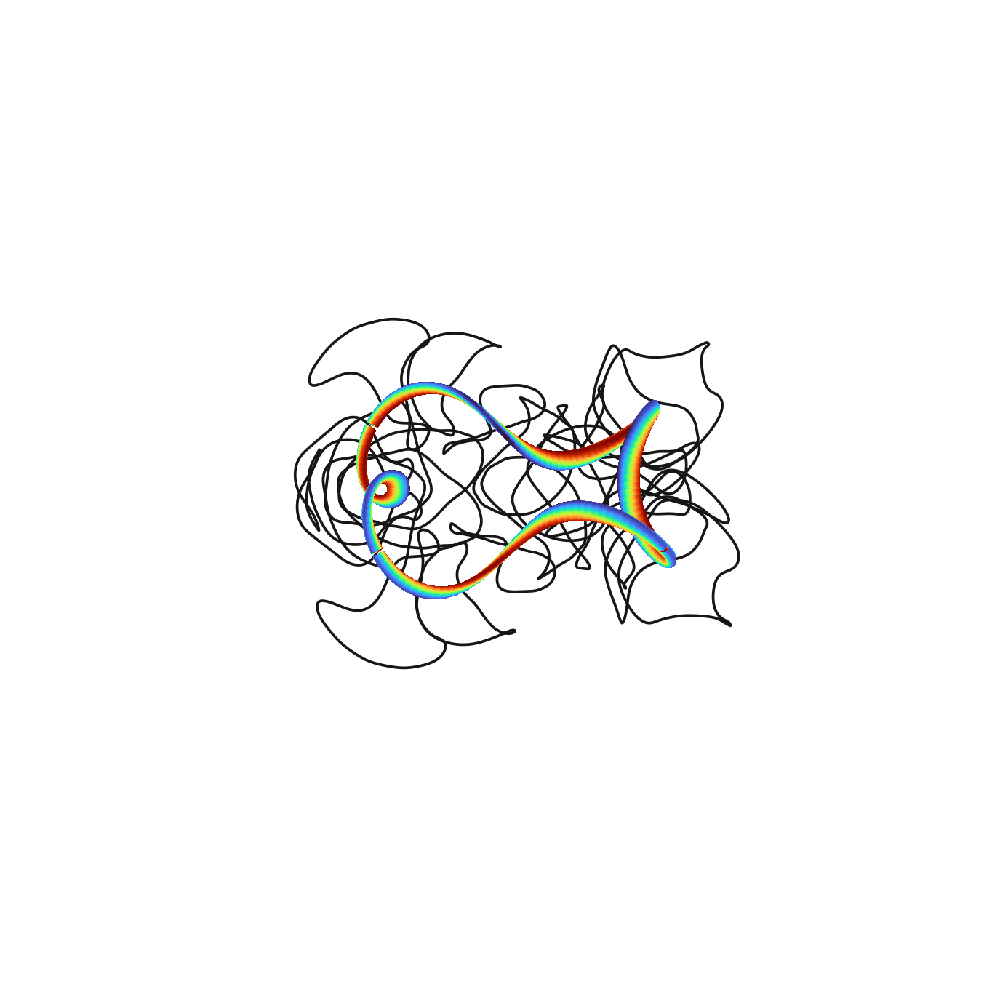

交互产物：[Boozer $|B|$ HTML](assets/qh_score_adam_start10_47p200_full_eval_20260731/full/assets/boozer_b.html)；[完整设备线圈与磁面 HTML](assets/qh_score_adam_start10_47p200_full_eval_20260731/full/assets/coils_surface.html)。

### 6.4 DESC 复核

DESC 使用真实 Biot--Savart 场积分得到的环向磁通 $-3.68289\times10^{-3}\,\mathrm{Wb}$；它与 $\alpha$ 标定的 $-3.70349\times10^{-3}\,\mathrm{Wb}$ 相差约 0.56%，构成独立实现间的量级交叉检查。当前 DESC 环境明确为 JAX CPU。

| DESC 指标 | 结果 |
| --- | ---: |
| 初始 / 最终嵌套 | true / true |
| 初始 mean / P95 / max 归一化力误差 | 1.092 / 2.121 / 5.456 |
| 最终 mean / P95 / max 归一化力误差 | $2.80\times10^{-3}$ / $6.75\times10^{-3}$ / $1.55\times10^{-2}$ |
| optimizer cost / optimality | 0.009141 / 0.002406 |
| 迭代 / 函数评估 | 50 / 57 |
| optimizer success | false，达到迭代上限 |

求解前后体均保持嵌套，最终力误差通过当前验收门槛；但优化器达到 50 步上限，因此只能写成“物理结果通过”，不能写成“优化器形式收敛”。以下逐张引用本次全部 8 张 DESC 图。

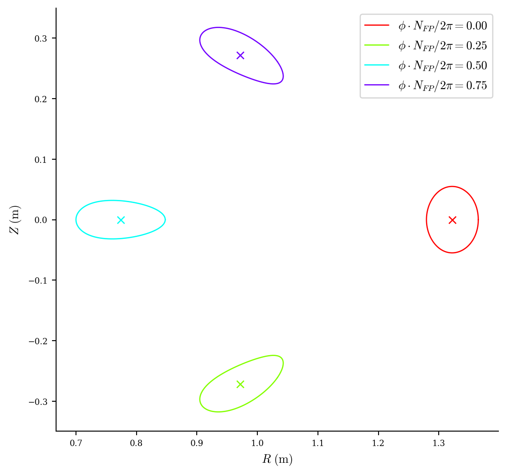

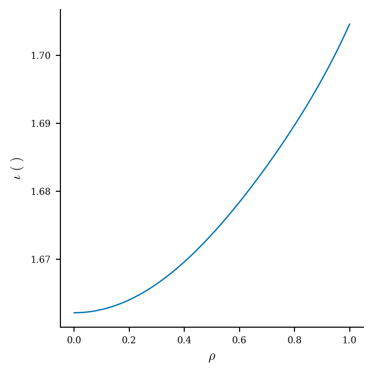

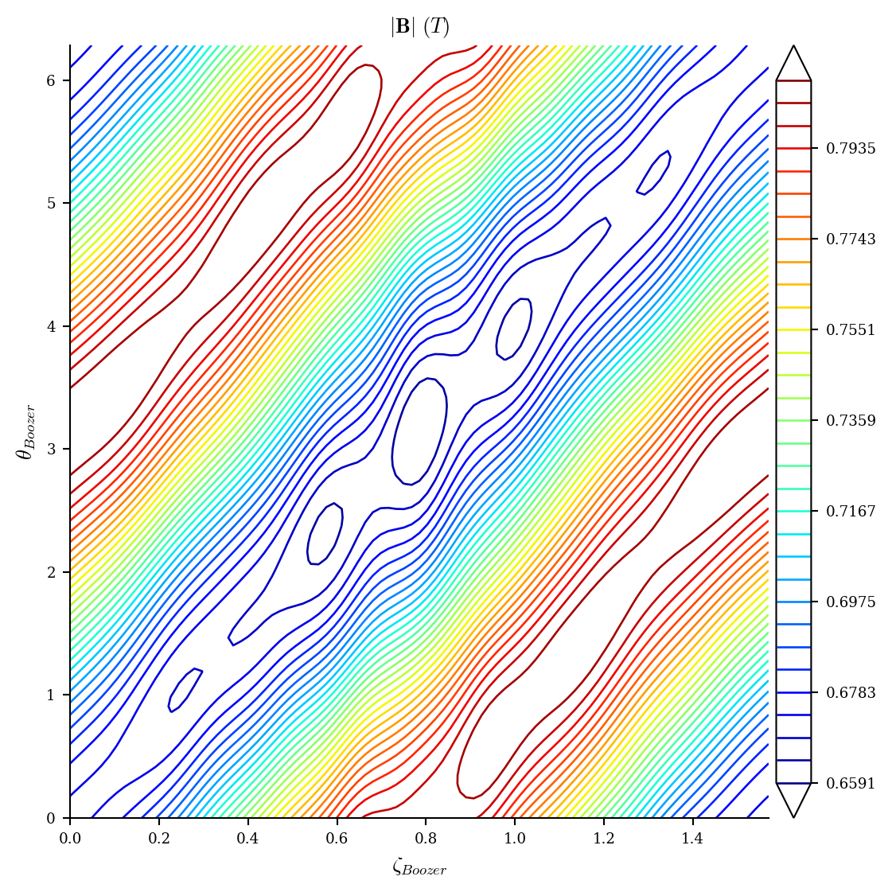

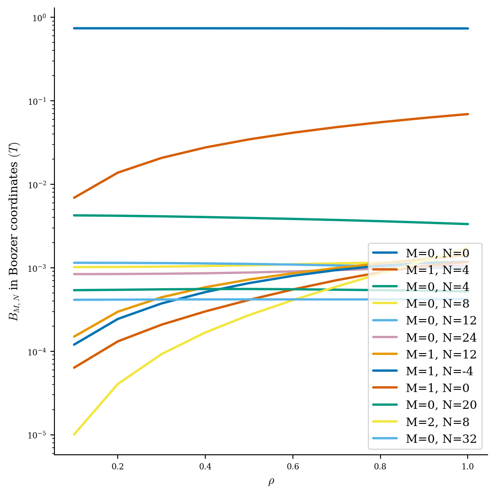

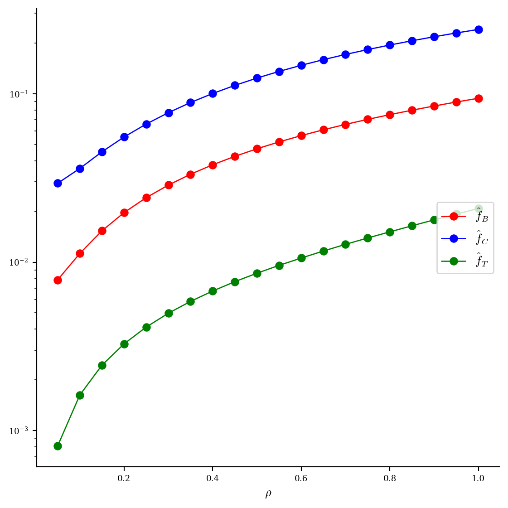

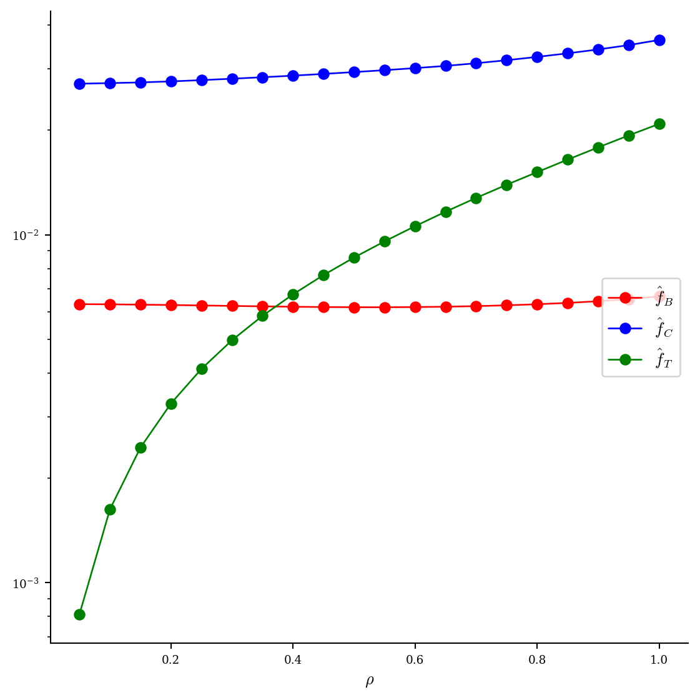

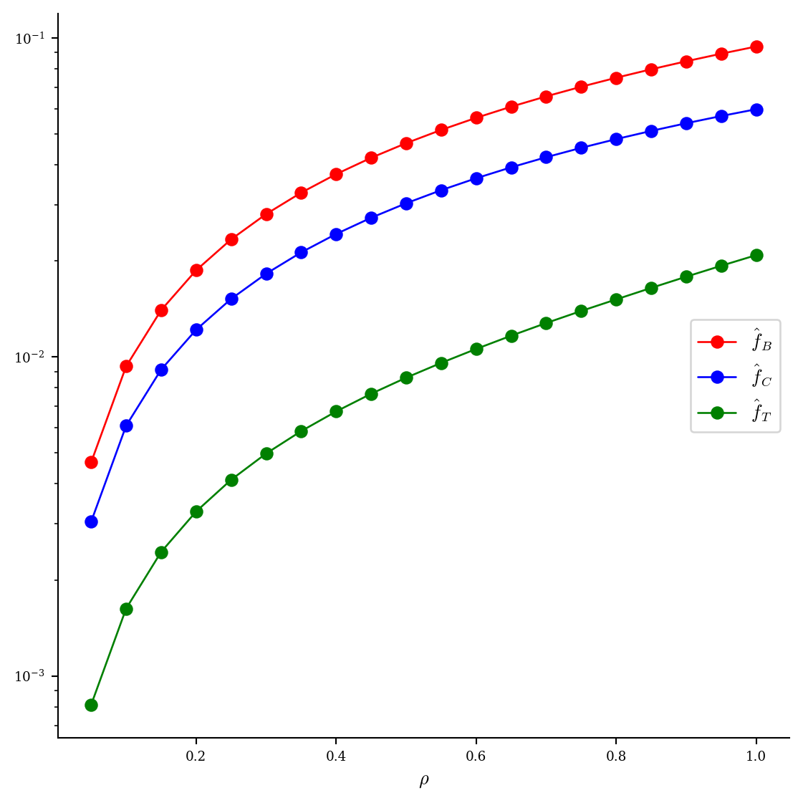

### 6.5 耗时和原始产物

| 阶段 | 资源 | 墙钟 |
| --- | --- | ---: |
| 4 个 source $\psi$ 候选 | 4 x RTX 5090 并行 | 1 min 15 s；单候选数值载荷约 9.8 s |
| 已知选中层的 $\alpha+\nu+$ guarded | 1 x RTX 5090，FP32 | 4 min 45 s |
| 稀疏外层边界发现 | 先 1 项、再 3 项并行 | 10 min 37 s |
| 可视化与 CPU DESC | 16 CPU | 5 min 40 s |
| 已知参数单路径 | source + 选中层 + 下游 | 约 **11 min 40 s** |

选中候选内部，$\alpha$ 总耗时 148.05 s，其中磁通标定 63.28 s、FP32 GPU QR 0.87 s；$\nu$ 总耗时 82.87 s。下游内部可视化 41.92 s、DESC 232.51 s，其中 DESC solve 为 142.38 s。

完整原始产物位于 [47.2006 完整评估目录](assets/qh_score_adam_start10_47p200_full_eval_20260731/)。选中 `boozer_guarded.npz` 的 SHA-256 为 `db0895246a74d93622763292292ee03d26e7ff0348e15f9bac02b54755af3965`，DESC `equilibrium.h5` 的 SHA-256 为 `399ddbb4afaeeaa5a497145c4ee74ea0587ef2a18ba5d2a9bc72d2ed64ecf7c7`。

## 7. $\eta=0.01$ 阶段最佳 58.1514 样本的完整评估

### 7.1 结论和 score 分解

该样本来自 `start_10` 的中断长轨迹，在第 52 步达到当前最佳 score 58.15137。这里先完成物理验收；后续 Adam 补跑尚在进行，因此 58.15137 不是 200 步最终上限。

完整评估结论为：**该线圈具有可由标准 LS/Newton 找到并经离网格验证的较大嵌套 QH 磁面；庞加莱和 DESC 都保持嵌套，DESC 最终力误差进入 $10^{-2}$ 量级。它明显优于普通随机样本，但面上仍有可见非 QH 起伏，不是接近完美的 QH 位形。**

当前 native score 及全部分量如下。所有分量均为 0--100 且越大越好。

| 项目 | 数值 |
| --- | ---: |
| total | **58.15137** |
| axis | 98.26035 |
| psi | 96.90558 |
| surface | 96.69667 |
| coordinate | 85.54687 |
| volume QS | 33.28596 |
| iota | 100.00000 |
| coil | 64.84444 |

native score 的体诊断给出 $\iota_{\min}=1.86671$、有效小半径约 0.03559 m、体积 0.02539 $\mathrm{m}^3$、体 QH residual 0.45172 和边缘 residual 0.59613。这里的体 residual 与后文单个标准 Boozer 面的面 QS error 使用不同统计定义和归一化，不能直接比较绝对数值；二者一致表明“QH 占优但仍有明显误差”。本次实际评估的输入已独立固化为 [evaluated_case.json](assets/qh_score_adam_eta001_58p151_full_eval_20260801/evaluated_case.json)，SHA-256 为 `e7a33bd80b660761d77b88f7308ac26720bceecc7d05fe71145b9a018d2ede18`；它不会被后续 `start_10` 续跑覆盖。

### 7.2 修正后的选面判据

本次源 $\psi$ 独立测试了 $a=0.04,0.05,0.06,0.08$，最终选择 $a=0.06$。其验证 RMS 为 $8.45\times10^{-4}$，方向误差 P95 为 $1.30\times10^{-4}$；廉价场线筛选通过到 $s=0.49$，对应平均小半径 0.04281 m，并在 $s=0.64$ 明确失败。选择依据仍是误差与物理覆盖范围的折中，不复用别的样本的 $a$ 或 $s$。

旧 `guarded` 求解器每次只允许一步 Newton，并要求中间残差单调、位移小且始终贴近初始 $\psi$ 面。它适合防止跳支，但不能判断磁面是否存在。本样本的 guard 对多个内层候选也给出拒绝；改用完整标准 LS/Newton 后，$s=0.24$ 和 0.36 均收敛并通过独立 $97\times97$ 网格检查。因此正式判据已改为：

1. 从 $\alpha+\nu$ 曲面开始，标准 LS 最多 100 步、完整 Newton 最多 30 步；
2. 最终独立网格 relative $L^2$ 和法向场 P95 均不高于 $10^{-4}$；
3. 环向绕行方向正确、曲面法向不退化；
4. 初始 $\psi$ 误差和最终位移只作跳支诊断，不作逐步硬门槛。

四个较大候选的结果如下：

| $s$ | 标准 LS/Newton | $|V|$ / $\mathrm{m}^3$ | $\iota$ | 离网格 relative $L^2$ | 法向场 P95 | 面 QH error |
| ---: | --- | ---: | ---: | ---: | ---: | ---: |
| 0.24 | 通过 | 0.01679 | 1.88299 | $2.77\times10^{-5}$ | $4.42\times10^{-5}$ | $7.44\times10^{-5}$ |
| **0.36** | **通过并选中** | **0.02623** | **1.89480** | **$3.06\times10^{-5}$** | **$4.99\times10^{-5}$** | **$1.675\times10^{-4}$** |
| 0.49 | 离网格拒绝 | 0.03767 | 1.98791 | $7.94\times10^{-4}$ | $1.19\times10^{-3}$ | 未采用 |
| 0.64 | 离网格拒绝 | 0.05028 | 1.99231 | $1.65\times10^{-3}$ | $2.91\times10^{-3}$ | 未采用 |

$s=0.49/0.64$ 在求解配点网格上也返回 `success=true` 且残差约 $10^{-13}$，但离网格误差高出门槛 8--29 倍，并分别偏离初始面约 0.33、0.50 个小半径。这是欠分辨配点伪解，说明最终标准不能简化成只看 Simsopt 的 `success`；有效定义是“LS/Newton 收敛并通过独立连续场近似检查”。

选中面的 QH error 为 $1.67508\times10^{-4}$；同一面上的 QA/QP error 分别为 $2.31213\times10^{-3}$ 和 $2.40960\times10^{-3}$，QH 比两个竞争对称性约低一个数量级。标准 LS 用时 7.06 s，随后 Newton 在第 0 步已满足精确方程；这说明 $\alpha+\nu$ 初值位于正确吸引域，但初值本身尚未达到最终离网格精度。

### 7.3 庞加莱、$|B|$ 和三维几何

8 条场线在四个截面上各得到 25 个命中，全部保持在选中边界内；图中没有宏观逃逸或明显磁岛散射。它仍是验收级稀疏追踪，不替代专门的高分辨拓扑研究。

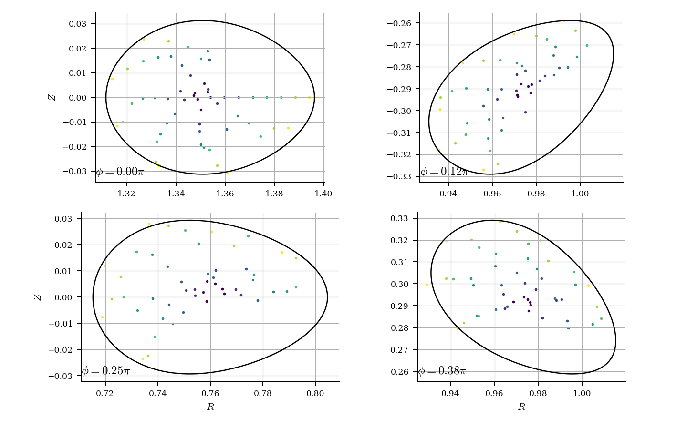

直接标准 Boozer 面上的 $|B|$ 为 0.63950--0.76461 T，平均 0.70192 T。白底彩色等高线呈稳定 QH 斜条纹，同时保留局部闭合畸变，和中等 `volume_qs` 分量一致。

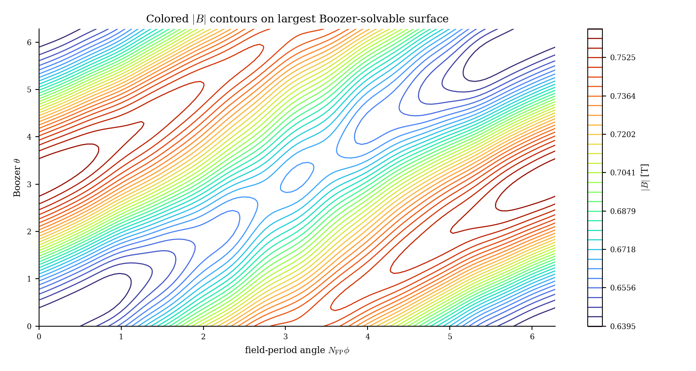

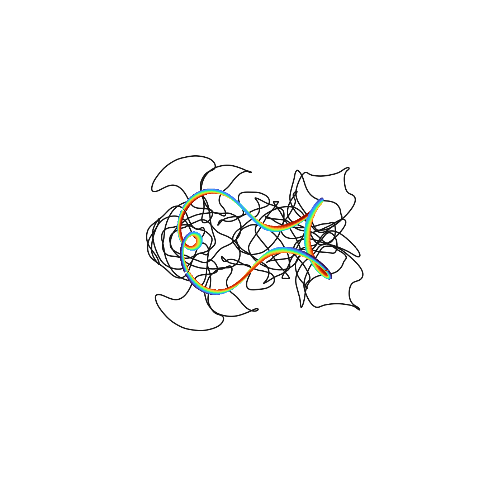

交互产物：[Boozer $|B|$ HTML](assets/qh_score_adam_eta001_58p151_full_eval_20260801/full_standard_s_0p36/assets/boozer_b.html)；[完整设备线圈与磁面 HTML](assets/qh_score_adam_eta001_58p151_full_eval_20260801/full_standard_s_0p36/assets/coils_surface.html)。

### 7.4 DESC 复核

DESC 使用环向磁通 $-1.86018\times10^{-3}\,\mathrm{Wb}$，当前明确走 16 CPU 路径。初始和最终体都保持嵌套。优化器达到 50 步上限而形式上 `success=false`，但最终归一化力误差已通过当前默认验收：

| DESC 指标 | 结果 |
| --- | ---: |
| 初始 / 最终嵌套 | true / true |
| 初始 mean / P95 / max 归一化力误差 | 0.9123 / 2.0203 / 4.2988 |
| 最终 mean / P95 / max 归一化力误差 | $3.04\times10^{-3}$ / $6.63\times10^{-3}$ / $1.31\times10^{-2}$ |
| optimizer cost / optimality | 0.06282 / 0.00622 |
| 迭代 / 函数评估 | 50 / 62 |
| optimizer success | false，达到迭代上限 |

以下逐张引用本次全部 8 张成功 DESC 图：

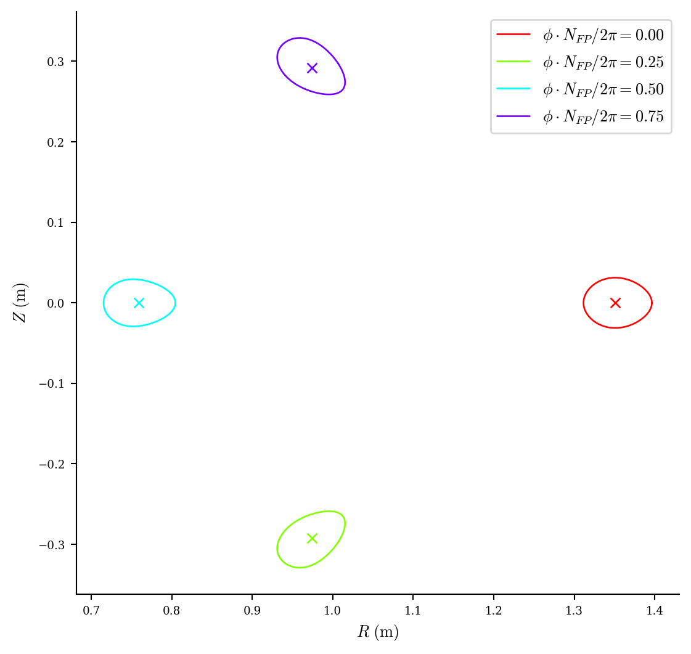

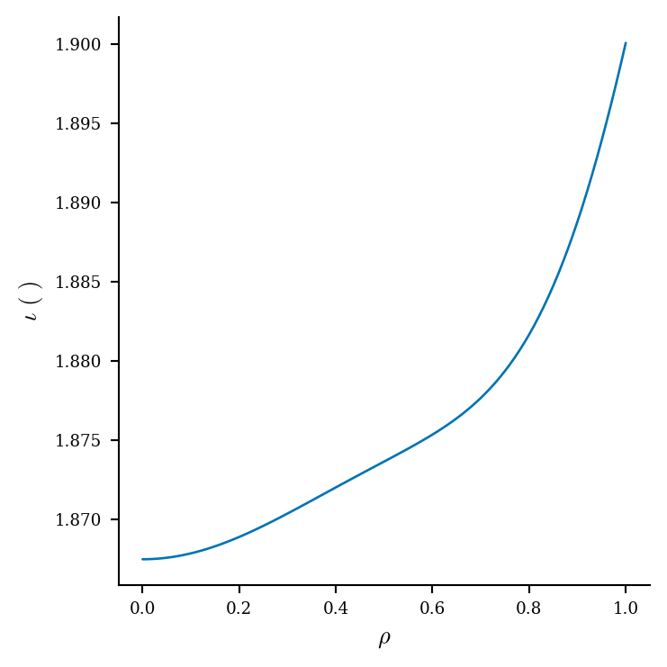

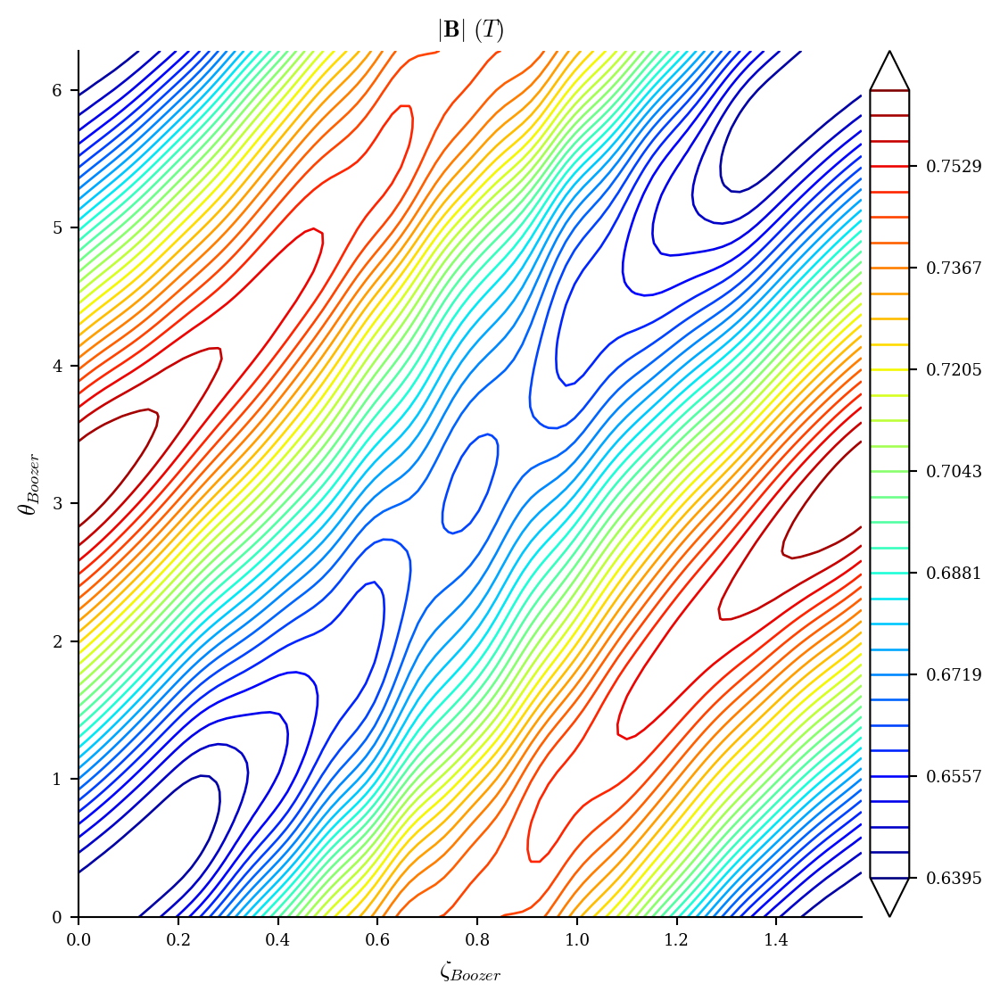

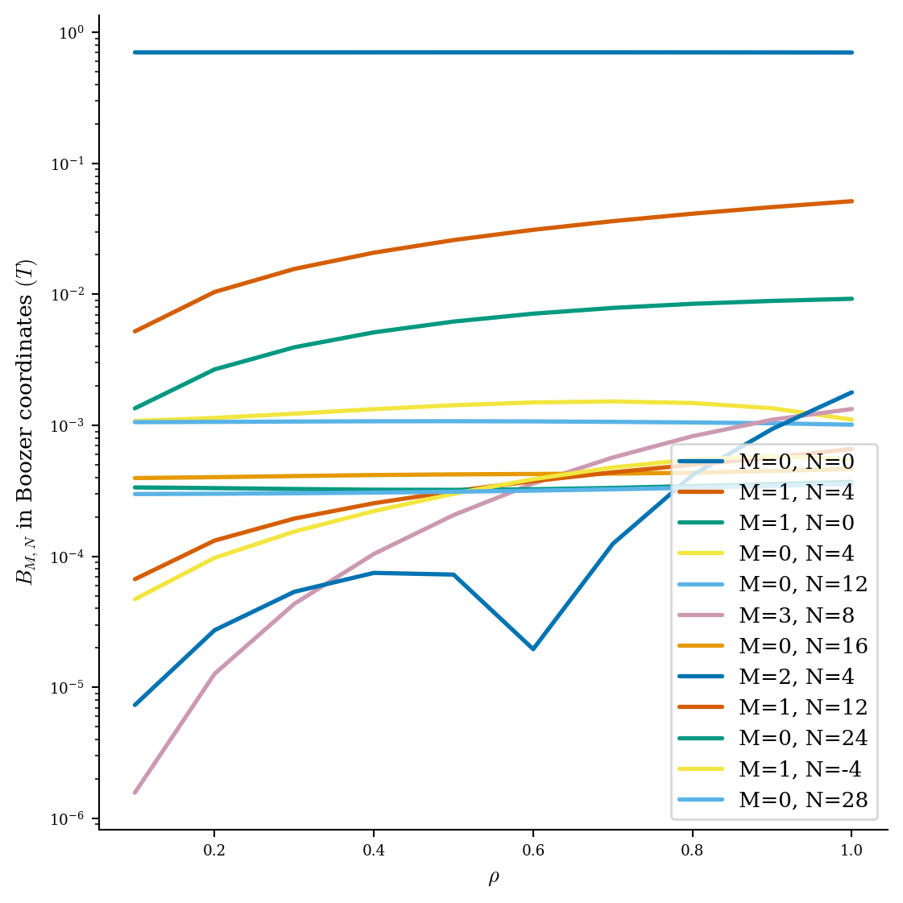

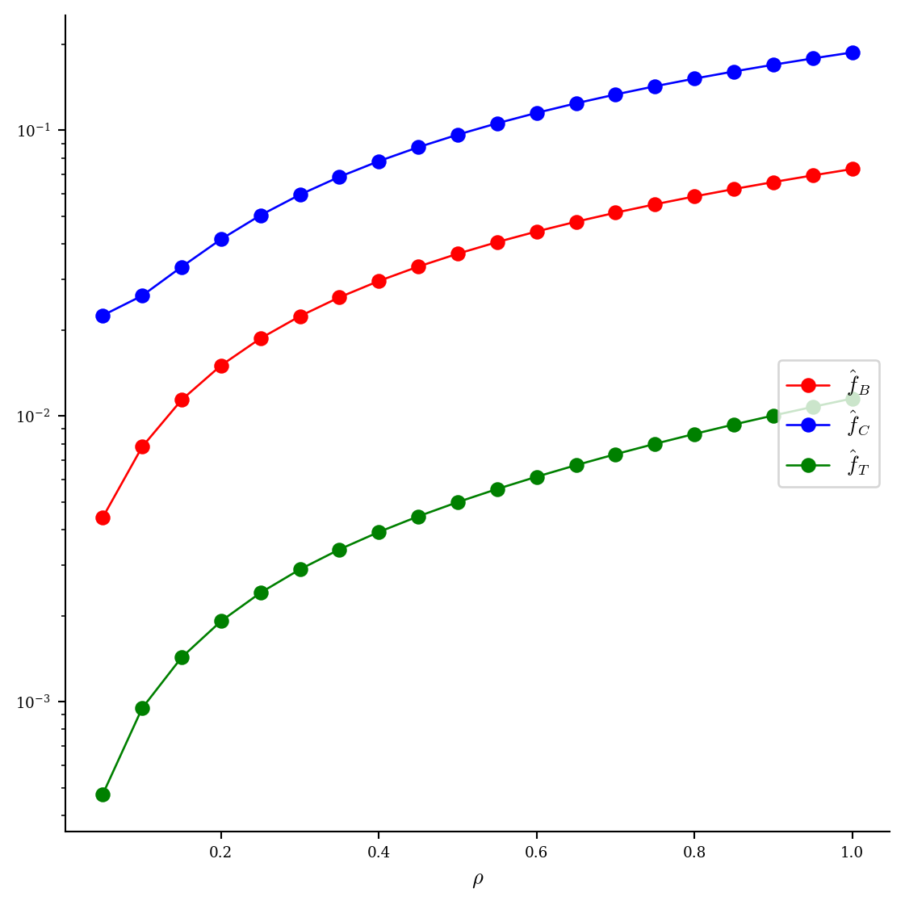

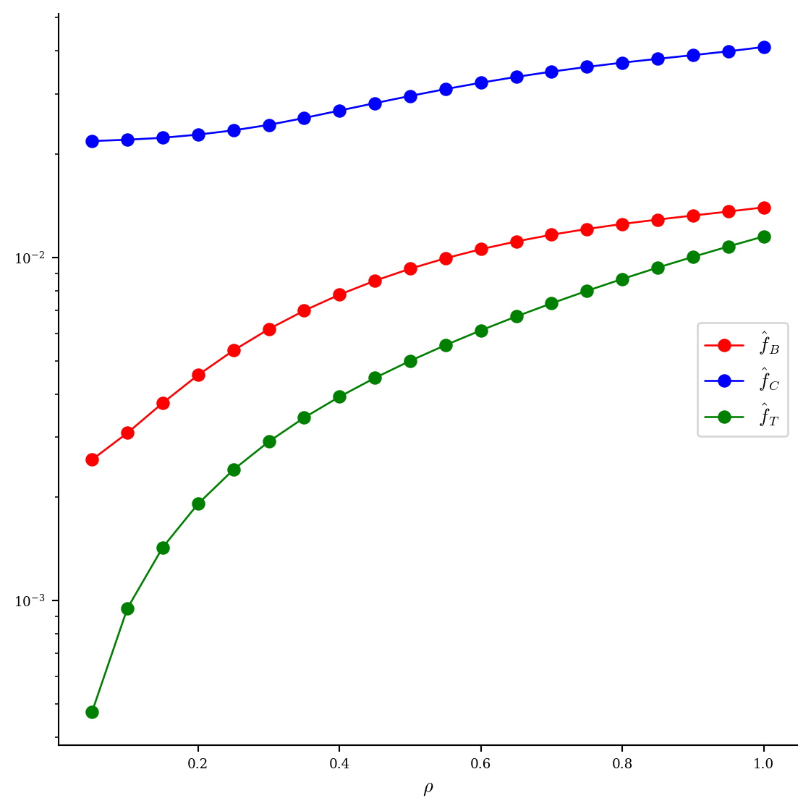

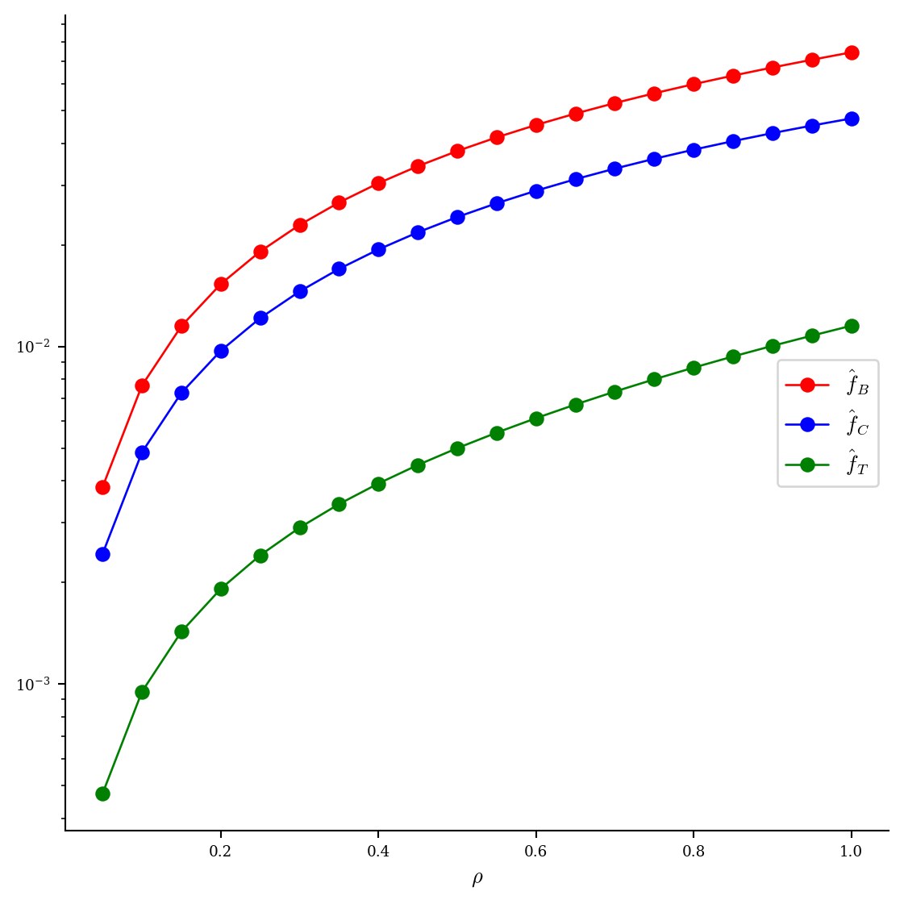

### 7.5 耗时和产物

| 阶段 | 资源 | 墙钟 |
| --- | --- | ---: |
| 4 个 source $\psi$ 候选 | 4 x RTX 5090 并行 | 1 min 17--20 s |
| 单候选 $\alpha$ | 1 x RTX 5090，FP32 | 166.0 s |
| 三半径 $\nu$ 和曲面重参数化 | 1 x RTX 5090 + CPU | 617.5 s |
| 4 个标准 LS/Newton 候选 | 4 x RTX 5090 并行 | 1 min 04--22 s |
| 可视化、庞加莱与 CPU DESC | 16 CPU | 5 min 40 s |

完整原始产物位于 [58.1514 完整评估目录](assets/qh_score_adam_eta001_58p151_full_eval_20260801/)。选中 `boozer_standard.npz` 的 SHA-256 为 `ac7fa3430e0ce3ed8ef3a44a4a655adb20b20067b30485e6941336d9d727f5f7`；DESC `equilibrium.h5` 的 SHA-256 为 `49bf4ebe5d17ca5ebde5c76a435433efd957c03858f7e6c39d264a7c7f43f6de`。下游内部可视化为 38.18 s、DESC 为 239.08 s，总计 330.40 s。

## 8. Adam 的 $\beta_1,\beta_2$ 与局部二阶阶段

### 8.1 当前更新式和时间尺度

当前 `start_10` 有 3 个基线线圈，因此潜变量维数为 $d=3\times100=300$。每一步只抽取 $k=4$ 个正交方向，在每个方向上计算一对中心差分：

$$
\widehat g_t=\frac{1}{k}\sum_{j=1}^{k}
\frac{f(x_t+h u_{t,j})-f(x_t-h u_{t,j})}{2h}u_{t,j},
\qquad h=0.01.
$$

随后使用没有权重衰减、裁剪或接受拒绝的标准 Adam：

$$
m_t=\beta_1m_{t-1}+(1-\beta_1)\widehat g_t,
\qquad
v_t=\beta_2v_{t-1}+(1-\beta_2)\widehat g_t^2,
$$

$$
x_{t+1}=x_t+\eta\frac{\widehat m_t}{\sqrt{\widehat v_t}+\epsilon}.
$$

目前使用 $(\beta_1,\beta_2)=(0.9,0.999)$。它们的典型记忆长度约为 $1/(1-\beta)$，分别是 10 步和 1000 步。对只有 40--200 步的黑箱优化而言，$\beta_2=0.999$ 在绝大部分时间内接近“保留全历史二阶尺度”，而不是快速适应当前局部盆地。由于每步只观测 4 个方向，$\beta_1$ 的平滑是必要的；不能仅凭更新变小便断言 $\beta_1=0.9$ 过于保守。

### 8.2 现有轨迹给出的直接证据

`start_10` 的长轨迹已经两次跨过 score 中的硬可行性边界，产生了远大于平滑区梯度的异常差分。

| 事件 | 扰动端点 | 方向差 | 梯度 RMS | 更新 RMS | 后果 |
| --- | --- | ---: | ---: | ---: | --- |
| 第 51 步 | 2/8 为 `drift_rejected` | 最大绝对值 57.86 | 1020.34 | 0.00651 | 污染一、二阶矩 |
| 第 88--93 步 | 全部 `ok` | 平滑 | 11.64--18.26 | 0.00081 降至 0.00067 | score 从 59.0125 升至 59.3632 |
| 第 94 步 | 2/8 为 `no_axis` | -58.24、-58.12 | 1028.54 | 0.00643 | 中心 score 立即降至 58.2751 |
| 第 95--100 步 | 全部 `ok` | 恢复正常 | 10.40--21.06 | 0.00580 降至 0.00350 | 中心 score 继续降至 56.6093 |

第 94 步尤其明确：到第 93 步时算法正在用小步稳定上升，但下一步因两个探针越过 `no_axis` 门槛，更新尺度放大约 9.6 倍并离开当前最佳点。到第 134 步，历史最佳仍为 59.3632，更新 RMS 已降到 $5.27\times10^{-4}$。这说明当前问题同时包含两部分：

1. $\beta_2=0.999$ 对异常二阶矩遗忘过慢。第 94 步异常在 40 步后的相对权重仍约为 $0.999^{40}=0.961$；若 $\beta_2=0.99$ 则为 0.669，若为 0.95 则为 0.129。
2. 单纯降低 $\beta_1$ 或 $\beta_2$ 不能保证更好。更短的记忆会更快忘掉异常，但也会让仅由 4 个方向得到的高方差梯度更直接地控制更新；跨硬门槛当步仍可能过冲。

因此，现有证据支持把 $\beta_2=0.999$ 视为偏保守候选，但尚不支持直接指定唯一的新值。$\beta_1=0.9$ 目前也没有“明显过大”的证据；$\beta_1=0.95$ 的约 20 步记忆反而很可能加重越过极值后的惯性。

### 8.3 决定 beta 的最小对照实验

后续应复用完全相同的 IID 起点、方向随机种子、$h=0.01$ 和 $\eta=0.01$，先比较四个有明确含义的配置：

| 配置 | 目的 |
| --- | --- |
| $(0.9,0.999)$ | 当前基线 |
| $(0.9,0.99)$ | 只缩短二阶矩记忆，隔离 $\beta_2$ 作用 |
| $(0.8,0.99)$ | 同时提高一阶矩响应速度 |
| $(0.5,0.99)$ | 检查低动量是否被四方向噪声破坏 |

证据不能只看最终中心值，而应同时比较前 10/20/40 步的历史最佳增益、达到最佳值的步数、从历史最佳回落的幅度、`ok` 扰动端点比例、硬门槛后更新 RMS 的放大倍数。起点至少覆盖低、中、高三种初始 score；另从第 93 步这类已知近极值快照重置动量做一组 20 步局部实验。这样才能区分“早期爬升快”与“极值附近不震荡”两个目标。若没有该对照，调整 beta 只是经验猜测。

### 8.4 为什么不做完整 Newton

潜变量有 300 维，完整对称 Hessian 有

$$
\frac{300\times301}{2}=45150
$$

个独立元素。仅坐标中心差分的一次完整梯度就需要 600 次 score，而当前一步只需 8 次；有限差分 Hessian、Newton--CG 的多次 Hessian 向量积或全空间 BFGS 所需的可靠梯度都不符合当前代价。更重要的是，score 包含 `no_axis`、`drift_rejected` 等硬门槛，跨门槛处并不存在可供 Newton 使用的平滑二阶模型。

### 8.5 可行的局部超线性方案

最实际的方案是“全空间 Adam 找盆地，固定低维子空间后做带信赖域的 BFGS”，并且局部阶段必须从已保存的历史最佳点重新开始，而不是从已经回落的当前点开始。

1. 在历史最佳点构造 $r=4$ 的固定正交子空间，优先包含最近的有效 Adam 位移和稳定差分方向，其余方向随机补齐。
2. 在该子空间内用 $2r=8$ 个中心差分端点求投影梯度，成本与当前每步相同。固定方向后，连续几步的梯度差才满足 BFGS 割线关系；当前每步更换随机四维子空间的梯度不适合直接积累 BFGS Hessian。
3. 使用阻尼 BFGS 或小型信赖域求步长；额外的线搜索候选可以并成一个 GPU 批次。只接受实际 score 提高的候选，失败则缩短信赖域。
4. 若子空间内停滞，再更换子空间；不构造 300 维 Hessian。

在 $r=4$ 时，显式局部二次模型只有 $1+r+r(r+1)/2=15$ 个系数，也可用约两个八点批次做线性最小二乘拟合，再解一个小型信赖域子问题。它比直接对 SPSA 梯度套全空间 L-BFGS 更可靠，因为后者的相邻梯度来自不同随机子空间，曲率对容易失真。

切换局部阶段前还需要一个可计算的平滑性门槛：历史最佳在最近若干 Adam 步中改善趋缓；所有 $x\pm h u_j$ 均为 `ok`；用 $h$ 与 $h/2$ 得到的方向导数符号和尺度基本一致；局部曲率在重采样时稳定。只有这些条件成立，子空间 BFGS 才可能表现出超线性收敛。若探针仍跨硬门槛，就应继续使用一阶方法或缩小 $h$ 和信赖域，不能声称已经进入 Newton 区域。

当前最有证据的改进顺序是：先做受控 beta 对照；再增加“从历史最佳点启动”的平滑性诊断；最后只在通过诊断的局部子空间切换 BFGS/二次信赖域。完整 Hessian 不应进入近期实现计划。

### 8.6 200 步完整轨迹对上述判断的修正

`start_10` 最终完成 200 步，score 从重新解码的 38.65902 提升到 **59.97998**，且第 200 步同时是最终点和历史最佳点。任务墙钟 4902.43 s（81.71 min），所有 GPU 在前后均为 2 MiB、0% 利用率。第 40 步已达到 55.41755，用时 1065.12 s；后续 160 步再增加 4.56242 分，却额外用时约 63.96 min，边际效率显著下降。

完整轨迹共出现 3 个含无效扰动端点的步骤：

| 步数 | 无效状态 | 无效端点 | 最大方向差绝对值 | 梯度 RMS | 更新 RMS |
| ---: | --- | ---: | ---: | ---: | ---: |
| 51 | `drift_rejected` | 2/8 | 57.86 | 1020.34 | 0.00651 |
| 94 | `no_axis` | 2/8 | 58.24 | 1028.54 | 0.00643 |
| 158 | `no_axis` | 1/8 | 59.49 | 743.72 | 0.00607 |

其余 197 步的扰动端点均为 `ok`，全程平均端点有效率高达 99.6875%。因此不能用“整体无效率很高”解释震荡；恰恰是极少数门槛跳变产生了重尾梯度。第 94 步之前，score 在第 88--93 步从 59.01250 平滑升至 59.36322；门槛冲击后到第 100 步降至 56.60930，直到第 155 步才超过旧峰值，恢复用了 61 步。第 158 步再次出现同类冲击。当前 beta 最终能够恢复，但恢复速度不足以称为合适的局部收敛器。

这使第 8.3 节的结论更精确：beta 对照仍有必要，但局部阶段必须同时处理重尾门槛探针。仅把 $\beta_2$ 从 0.999 改小可能加快异常记忆衰减，却不会阻止异常当步的约 0.006 RMS 跳跃。后续 BFGS 试验因此从已经保存的 59.97998 最佳点重新开始，固定子空间，并要求 $h$ 与 $h/2$ 的端点全部为 `ok` 且方向导数一致；一旦离开平滑区便缩小尺度或停止。

## 9. $η=0.01$ 的 11 组 IID 起点结果

用户在 `start_10` 完成后取消了尚未启动的 `start_11`，因此本节只汇报 starts 0--10；取消项运行时间为 0，不把它记作优化失败。此前因失效 cwd 失败的 `start_05` 已用固定根目录重跑，job `30455_5` 为 `COMPLETED 0:0`，四卡 postflight 均为 2 MiB、0%。

| start | 初始 score | $\eta=0.003$ 40 步最佳 | $\eta=0.01$ 40 步最佳 | $\eta=0.01$ 最终最佳 | 实际步数 |
| ---: | ---: | ---: | ---: | ---: | ---: |
| 0 | 0.0908 | 0.3642 | 0.3662 | 0.3662 | 40 |
| 1 | 2.0132 | 4.7686 | 4.7272 | 4.7272 | 40 |
| 2 | 5.0008 | 8.0018 | 9.4243 | 9.4243 | 40 |
| 3 | 8.0025 | 27.3658 | 30.0148 | 30.0148 | 40 |
| 4 | 9.9934 | 13.3064 | 15.3148 | 15.3148 | 40 |
| 5 | 11.9765 | 16.3051 | 25.5846 | 25.5846 | 40 |
| 6 | 14.9551 | 17.7396 | 28.6192 | 28.6192 | 40 |
| 7 | 19.7477 | 33.6481 | 40.9829 | 40.9829 | 40 |
| 8 | 24.8892 | 36.4071 | 46.7603 | 46.7603 | 40 |
| 9 | 29.8791 | 39.3949 | 43.0892 | 43.0892 | 40 |
| 10 | 38.6590 | 47.2006 | 55.4176 | **59.9800** | 200 |

在相同 11 个起点和前 40 步预算下，$\eta=0.003$ 的平均历史最佳增益为 7.209，$\eta=0.01$ 为 12.281；后者提高 5.073 分。除了 start 1 的差异很小且方向相反，$\eta=0.01$ 在中高分起点上普遍更好。不能据此把学习率继续无限增大：`start_10` 的三次门槛跳变已经表明，较大更新在高分区会放大偶发探针的破坏。

11 组的初始 score 与最终历史最佳 score 的 Pearson/Spearman 相关系数为 0.949/0.936；初始 score 与最佳增益则降为 0.700/0.636。高起点更可能到达高终点，但局部盆地仍显著影响增益。starts 3、7、8、10 分别提高 22.012、21.235、21.871、21.321 分；并不是只有最高起点才能被优化。

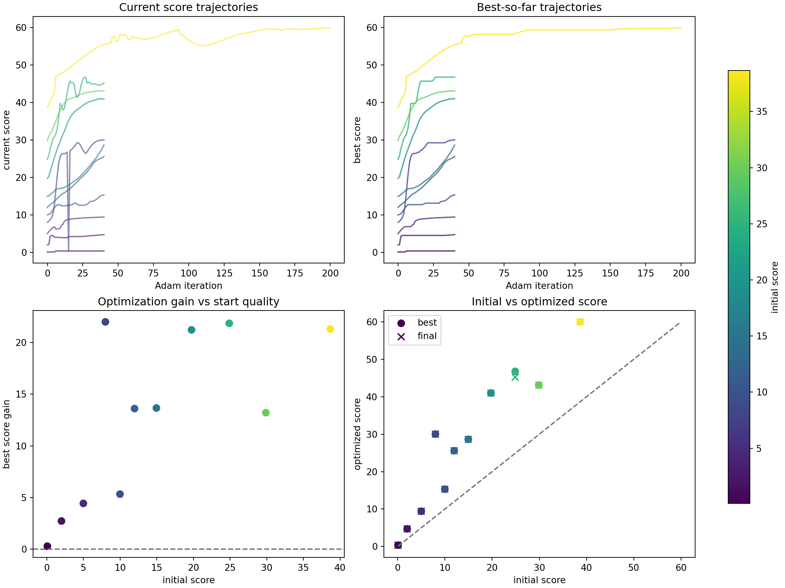

机器可读结果见 [sweep_summary.json](assets/qh_score_adam_eta001_start_sweep_20260731/sweep_summary.json) 和 [trajectory_summary.jsonl](assets/qh_score_adam_eta001_start_sweep_20260731/trajectory_summary.jsonl)。11 条轨迹累计墙钟 13474.66 s；其中 10 条为 40 步，`start_10` 为 200 步。下一阶段从历史最佳而非最终当前点启动固定低维子空间 BFGS，以直接检验局部超线性方法能否提高这些已达到 40 分以上的解。

## 10. 局部尺度校准与 BFGS、NCG、模式搜索对照

### 10.1 为什么不能直接指定 $h$ 和信赖半径

局部优化器在固定的 4 维 RMS 正交子空间中工作。若 $u_j$ 是第 $j$ 个方向，中心差分为

$$
g_j(h)=\frac{S(z+h u_j)-S(z-h u_j)}{2h}.
$$

这里 $h$ 是**估计梯度的采样半径**，不是实际更新步长。信赖半径 $\Delta$ 限制实际提议的 latent RMS 步长。二者可以不同，但若进入真正的局部收敛阶段，$h$ 与 $\Delta$ 应一起缩小，并且 $g(h)$ 与 $g(h/2)$ 必须保持方向和量级一致。

先前试运行使用的 $h=1.25\times10^{-3}$、$\Delta=5\times10^{-4}$ 组合不合理：梯度探针位于信赖域之外，而且其中一个探针已经得到 `60.13923`，明显高于中心的 `59.97998`，优化器却不允许直接走到该点。随后连续三次线搜索失败又把 $\Delta$ 缩到 $2\times10^{-5}$；这个下限比历史上有用的 Adam 更新小一个数量级，并无实验依据。

重新读取旧 landscape 和 Adam 原始历史后得到以下尺度证据：

| 证据 | 实测尺度或结果 |
| --- | ---: |
| 当前高分轨迹中，从 score $>55$ 出发且分数上升的 Adam 更新 RMS 中位数 / P75 / P90 | $7.13\times10^{-4}$ / $1.05\times10^{-3}$ / $1.24\times10^{-3}$ |
| score 69 到 71.73 的标准 Adam 最后 100 步更新 RMS 中位数 / P90 | $4.11\times10^{-4}$ / $5.99\times10^{-4}$ |
| 旧混合优化器 80 个接受步的平均 / 最大更新 RMS | $8.74\times10^{-4}$ / $3.00\times10^{-3}$ |
| 旧 landscape 在 $h=0.018/0.009$ 的三组 4 维梯度余弦 | 0.960 / 0.980 / 0.999 |
| 当前 59.98 点在 $h=0.0025/0.00125$ 的梯度余弦 | -0.219 |
| 当前点在 $h=0.00125/0.000625$ 的梯度余弦 | 0.844 |
| 当前点在 $h=0.000625/0.0003125$ 的梯度余弦 | -0.657 |

最后三行说明当前点附近不存在经三个连续尺度验证的渐近光滑区。$0.844$ 只是中间两个尺度的暂时一致；继续缩小 $h$ 后方向反转，而增大到约 $5\times10^{-3}$ 又开始碰到 native score 的硬门。旧 landscape 中约 $10^{-2}$ 的宽尺度方向信号更稳定，也与所有成功 Adam 实验固定使用 $c=0.01$ 一致，但当前 59.98 点离可行域边界太近，无法使用这么大的局部差分。

据此，本轮固定使用以下**有数据依据**的局部半径，而不是自由猜测：

- 初始信赖或轮询半径 $\Delta_0=1.25\times10^{-3}$：接近高分 Adam 成功更新的 P75，并覆盖已知的 60.13923 探针。
- 下限 $\Delta_{\min}=2\times10^{-4}$：接近历史最小有效更新 $2.35\times10^{-4}$ 和 Adam 第 200 步的 $2.74\times10^{-4}$。
- 上限 $\Delta_{\max}=3\times10^{-3}$：等于旧优化器实际最大更新；当前轨迹在约 $5$--$6\times10^{-3}$ 已出现硬门，不再允许原来的 $10^{-2}$ 上限。
- BFGS/NCG 暂用外层 $1.25\times10^{-3}$、实际导数 $h=6.25\times10^{-4}$。这只是可运行的启发式尺度，不是已验证的渐近导数。

### 10.2 三种方法的同起点短对照

三种方法使用同一个 score `59.9799763154` 起点、同一个固定 4 维子空间、FP32 RK4-256 flow 解码和同一 corrected native score。BFGS 使用阻尼正定逆 Hessian；NCG 使用 Polak--Ribiere+，方向不再上升或每 4 个接受步时重启；模式搜索直接比较 $z\pm\Delta u_j$，不使用梯度或 Hessian。

| 方法 | 最佳 score | 增益 | 接受步 | 墙钟 | 停止原因 |
| --- | ---: | ---: | ---: | ---: | --- |
| 阻尼 BFGS | **60.2558895** | **+0.2759132** | 7 | 244.2 s | 连续 3 次线搜索无改进 |
| 坐标模式搜索 | 60.1833348 | +0.2033585 | 2 | 126.6 s | 半径降到 $2\times10^{-4}$ |
| PRP+ NCG | 60.1037672 | +0.1237908 | 3 | 125.8 s | 半径降到 $2\times10^{-4}$ |
| 旧参数 BFGS | 59.9970928 | +0.0171165 | 2 | 119.0 s | 半径降到 $2\times10^{-5}$ |

模式搜索第一步直接接受 $1.25\times10^{-3}$ 探针，score 从 59.97998 到 60.13923；第四轮又以 $3.125\times10^{-4}$ 提高到 60.18333。这证明旧参数确实过度保守。NCG 的第二个 PRP+ 系数达到 11.60，表明不稳定梯度会被共轭记忆放大；虽然接受门保证实际 score 单调上升，但它不具备可信的局部共轭结构。

BFGS 的 7 个接受步 RMS 依次为

$$
3.125,\ 6.250,\ 7.8125,\ 4.8828,\ 4.8828,\ 9.7656,\ 6.1035
\quad (\times 10^{-4}).
$$

因此实际导数步长 $h=6.25\times10^{-4}$ 只在第一步是更新的 2 倍；后 6 步的 $h/\lVert\Delta z\rVert_{\rm RMS}$ 为 0.64 到 1.28，属于同一量级。真正的问题出现在最后三次拒绝：信赖半径从 $6.10\times10^{-4}$ 缩到 $2\times10^{-4}$，但 $h$ 仍固定为 $6.25\times10^{-4}$。所以最终状态只能解释为当前有限差分模型停滞，不能解释为局部最优或超线性收敛。

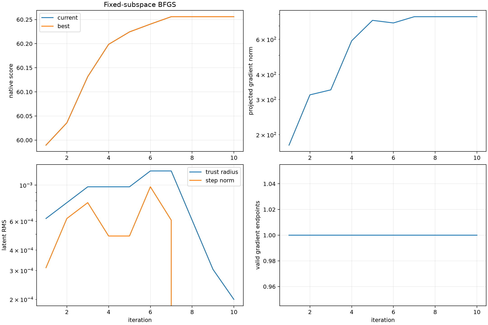

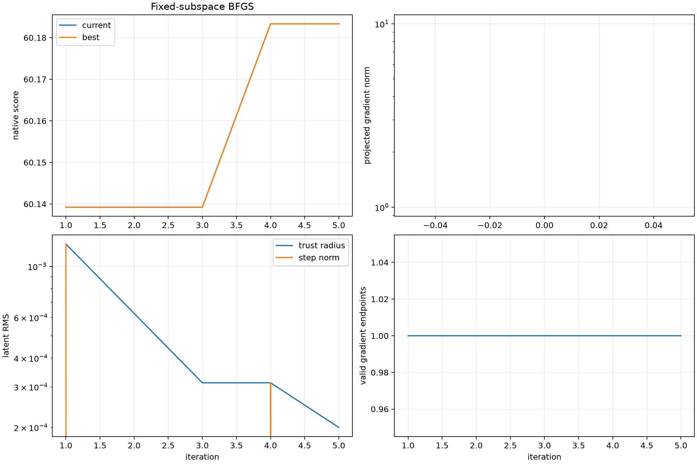

### 10.3 当前结论和后续对照

本轮证明了校准后的局部方法可以继续提高 score，但**没有证明超线性收敛**。BFGS 的梯度范数从约 177 增到 779，逆 Hessian 条件数多次达到 $10^5$--$10^6$；它现在应被称为“带真实分数接受门的启发式 quasi-Newton 上升”，不能称为已进入二阶收敛区。模式搜索虽然最终分数略低，却最符合当前非光滑黑箱的假设，而且只需约一半墙钟。

扩展实验会把校准后的 BFGS 和模式搜索应用到其余 5 个历史最佳 score $>40$ 端点，包括 $\eta=0.003$ 的 starts 10、11。同时从相同 59.98 起点清空动量，分别运行 12 步标准 Adam，$\eta=0.003$ 和 $0.01$；这个对照用于判断切换局部方法是否真的优于简单重启 Adam，而不是只与携带旧动量的轨迹比较。

### 10.4 其余 5 个 score $>40$ 端点

下表固定使用同一组尺度和 12 步上限。模式搜索与 BFGS 都从各自 Adam 历史最佳 latent 出发；子空间的前几个方向来自该轨迹保存的一阶矩、预条件一阶矩以及从初始点到最佳点的位移，因此不是重新随机选择一个有利子空间。

| 原轨迹与起点 | 初始 score | 模式搜索最佳 | 模式增益 | BFGS 最佳 | BFGS 增益 | 初始两尺度梯度余弦 |
| --- | ---: | ---: | ---: | ---: | ---: | ---: |
| $\eta=0.01$, start 7 | 40.98288 | **41.31186** | **+0.32898** | 41.28278 | +0.29991 | 0.896 |
| $\eta=0.01$, start 8 | 46.76025 | 46.76025 | 0 | 46.76025 | 0 | 0.629 |
| $\eta=0.01$, start 9 | 43.08922 | **43.25597** | **+0.16675** | 43.24954 | +0.16032 | 0.944 |
| $\eta=0.003$, start 10 | 47.20062 | 50.46794 | +3.26732 | **53.00973** | **+5.80911** | 0.998 |
| $\eta=0.003$, start 11 | 45.24132 | 46.41804 | +1.17672 | **46.99231** | **+1.75099** | 0.912 |

两种方法都是 4/5 个端点产生改进，且在同一个 start 8 上同时失败。对于已经用 $\eta=0.01$ 跑过 40 步的三个端点，局部增益只有 0 到 0.33，模式搜索与 BFGS 基本相当；对于只用 $\eta=0.003$ 跑过 40 步的两个端点，两种方法都能继续大幅上升，BFGS 明显更高。这主要证明后两条原轨迹提前结束，不能单独证明 BFGS 的超线性优势。

最显著的 $\eta=0.003$/start 10 中，模式搜索 12 个固定 $1.25\times10^{-3}$ 步全部接受并达到 50.46794；BFGS 的信赖半径在连续全步成功后增长到有历史依据的上限 $3\times10^{-3}$，12 步全部接受并达到 53.00973。其第 11 步梯度范数仍从约 196 跳到 2939，所以大幅 score 增益是真实的，二阶收敛解释仍然不成立。

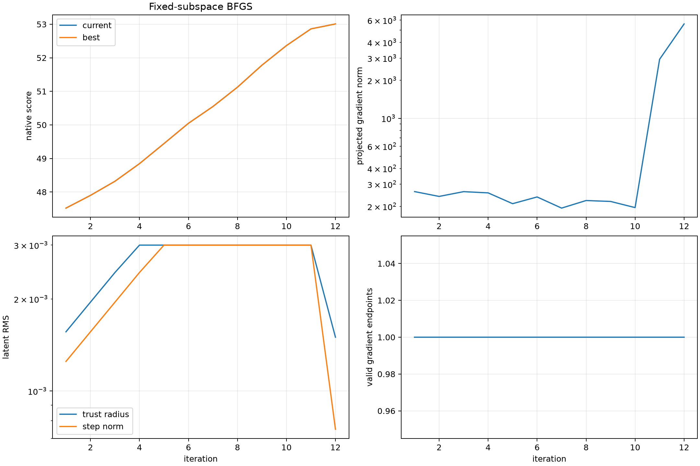

所有扩展结果的独立 [summary/history/artifacts](assets/qh_local_subspace_followup_20260801/qh_subspace_followup_20260801/) 已固定在报告目录。

### 10.5 清空动量后直接重启标准 Adam

为了避免把“切换算法”与“清空旧动量”混为一谈，本组从同一个 score `59.9799763154` latent 出发，不读取旧 `state_latest.npz`，令

$$
m_0=0,\qquad v_0=0,
$$

然后分别运行 12 步标准 Adam。它仍使用已经长期验证的 4 个正交反对称方向和 $c=0.01$，没有回溯、接受门、裁剪、学习率计划或其它启发式修改。

| 方法 | 历史最佳 | 增益 | 最佳步 | 到达最佳墙钟 | 12 步最终值 | 完整墙钟 |
| --- | ---: | ---: | ---: | ---: | ---: | ---: |
| 零动量 Adam, $\eta=0.01$ | **60.5642672** | **+0.5842909** | 2 | **57.6 s** | 59.0384841 | 316.2 s |
| 零动量 Adam, $\eta=0.003$ | 60.3312508 | +0.3512745 | 4 | 102.3 s | 59.6463478 | 301.9 s |
| 校准 BFGS | 60.2558895 | +0.2759132 | 7 | 216.6 s | 60.2558895 | 244.2 s |
| 模式搜索 | 60.1833348 | +0.2033585 | 4 | 108.0 s | 60.1833348 | 126.6 s |
| PRP+ NCG | 60.1037672 | +0.1237908 | 3 | 115.4 s | 60.1037672 | 125.8 s |

所以在这个已经跑过 200 步的相同起点上，最简单的零动量 Adam 重启在“最佳分数”和“到达最佳的时间”两项都胜出。$\eta=0.01$ 仅两步就超过其它方法；$\eta=0.003$ 也在第 4 步超过 BFGS。不能据此选择 Adam 的最终点：$\eta=0.01$ 第 3 步有 2/8 个 `no_axis` 探针，梯度 RMS 跳到 1056，之后 current score 持续下降；$\eta=0.003$ 第 5、6 步各有 1/8 个 `no_axis` 探针，最终也低于起点。两组的 running best 文件仍正确保留最佳点。

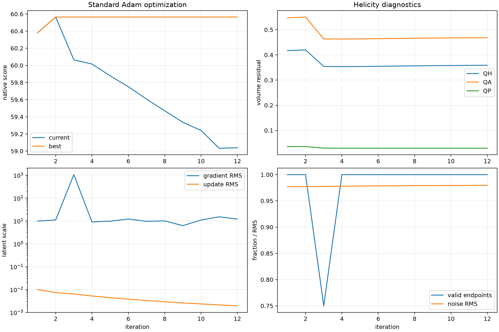

### 10.6 最终判断

1. $h$ 与信赖半径原先确实取错了组合；校准后 BFGS 从 `+0.0171` 提高到 `+0.2759`，说明参数错误有实际影响。
2. 当前 native score 在高分可行域边缘没有稳定的三尺度梯度，BFGS 和 NCG 不满足可声称超线性收敛的前提。NCG 也没有优于 BFGS 或模式搜索。
3. 模式搜索最稳健、便宜且不依赖假梯度；BFGS 在尚未充分优化且局部较平滑的端点上可沿固定子空间更快前进，但其优势不是普遍的。
4. 对当前 59.98 点，**清空动量并重启标准 Adam 是本轮最有效的短程策略**。$\eta=0.01$ 最快、最高，但必须保留 running best 或增加显式接受保护，不能采用其最终 current 点。
5. 因此下一步若继续研究局部阶段，不应优先增加更多 Hessian 技巧；更有证据的方向是比较“零动量 Adam + running-best/接受保护”与模式搜索的混合策略，并把 native score 的硬门状态从梯度估计中隔离。按本轮要求，到此不再增加起点或延长作业。

## 11. 脏梯度、`no_axis` 与 `drift_rejected` 的复核和修正

### 11.1 先给结论

本轮发现了一个真实的轴拓扑判定 bug，并已经修正；`drift_rejected` 则不是“磁轴消失”，也不是同一个 bug。

1. 原来的 `no_axis` 有假阴性。代码把“距离抛物边界至少 0.02”错误地当成了椭圆轴的存在条件，导致严格椭圆但接近边界的轴被报成 `no_axis`。
2. 修正后，旧轨迹的三个 `no_axis` 探针中两个恢复为完整 `ok`，相应方向差从约 58 分降到 `0.443` 和 `0.0336`；第三个变成更准确的 `drift_rejected`，不再声称没有轴。
3. 剩余三个 `drift_rejected` 探针都有闭合的严格椭圆轴，轴残差为 $10^{-9}$ 到 $10^{-8}$，$psi$ 方向误差 P95 为 $1.23\times10^{-4}$ 到 $1.38\times10^{-4}$。它们在 1--8 个周期内通过 5% 标准，到 16 周期才因累积漂移越界。
4. 曾尝试把高精度复核从最大的 6 个候选面扩展到全部候选面。三个端点仍全部失败，但审计墙钟从 81 s 增到 97 s。该改动不满足 score 固定低延迟的要求，已经撤销，未部署到生产库。
5. 最终生产版保持原来固定最多 6 个候选面的计算上限，只修正轴拓扑、补充零额外跟踪成本的失败诊断，并让 Adam 不再把无效端点的分数跳变当作梯度。

### 11.2 为什么原来的 `no_axis` 是代码 bug

设一周期 Poincare 映射在周期点处的二维雅可比矩阵为 $M$。在这里使用的近似保面积情形下，严格椭圆周期点的数学判据是

$$
\mu=\frac{|\operatorname{tr}M|}{\sqrt{\det M}}<2.
$$

旧实现把配置项 `axis_topology_margin=0.02` 直接减在存在性阈值上，实际要求

$$
\mu<2-0.02=1.98.
$$

这把数值安全余量和物理存在性混成了一件事。第 4 步 Adam 提议在 RK4-512 下有闭合残差 $1.366\times10^{-8}$、$\mu=1.980828<2$；只把 margin 从 0.020 改到 0.019，就从 `no_axis` 恢复成完整 score `60.796531`。96 网格、96 候选和 8 次 Newton 的加密搜索在 margin 仍为 0.020 时也无法改变状态，证明问题不是漏搜索，而是阈值定义错误。

修正后的逻辑为：

- `elliptic` 只按 $\mu<2$ 判定；
- 定义稳定余量 $d=2-\mu$；
- `axis_topology_margin=0.02` 只用于候选偏好和连续质量分量，不再决定轴是否存在；
- 当 $0<d<0.02$ 时，轴质量随 $d$ 连续下降，而不是在 $\mu=1.98$ 处突变成 `no_axis`。

同一个精确提议在修正后沿 Adam 更新比例 $\alpha=0$ 到 $1.25$ 全部为 `ok`；完整步 $\alpha=1$ 的 score 为 `60.758946`，在四张物理 GPU 上逐位一致。

### 11.3 旧脏梯度中到底有多少来自轴 bug

旧 200 步轨迹只有 5 个无效探针。精确重放的 latent RMS 和 update RMS 误差均为 0，因此下表不是近似重构。

| 步数与方向 | 旧状态 | 修正后状态 | 旧方向差 | 修正后方向差 | 结论 |
| --- | --- | --- | ---: | ---: | --- |
| 51, dir 2+ | `drift_rejected` | `drift_rejected` | -57.858 | -57.867 | 与轴 bug 无关 |
| 51, dir 0- | `drift_rejected` | `drift_rejected` | 57.562 | 57.573 | 与轴 bug 无关 |
| 94, dir 0+ | `no_axis` | `drift_rejected` | -58.243 | -57.973 | 轴假阴性修正，但仍未过长期漂移门 |
| 94, dir 2+ | `no_axis` | `ok`, 57.7851 | -58.119 | -0.443 | 方向毛刺基本消失，缩小 131 倍 |
| 158, dir 0- | `no_axis` | `ok`, 59.6424 | 59.494 | -0.0336 | 方向毛刺基本消失，缩小 1768 倍 |

因此轴 bug 直接制造了 5 个无效端点中的两个，并使第三个端点返回了错误的失败类别。它完全解释第 158 步的巨大梯度，也解释第 94 步两个坏方向中的一个；第 51 步和第 94 步剩余方向需要单独研究长期漂移。

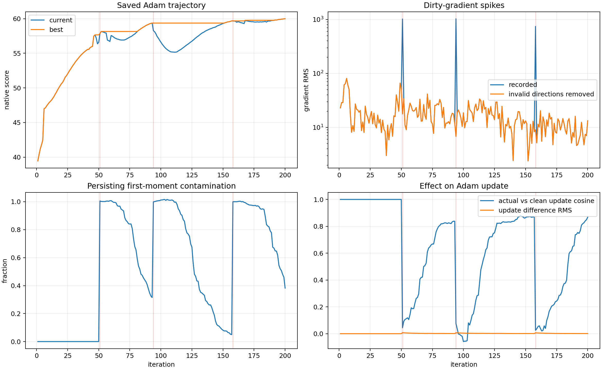

图中的有效方向重算表明，普通梯度 RMS 最大约 80.8，而三个门槛事件达到 744--1029。第 94 步污染后，实际更新与移除无效方向后的更新余弦有 21 步低于 0.5，最低为 -0.0588；旧峰值经过 61 步才恢复。降低 $\beta_1$ 只能缩短记忆，不能阻止污染当步的错误大更新。

### 11.4 `drift_rejected` 到底表示什么

它不是 `no_axis`，也不严格等于“没有磁面”。当前快速 score 的含义是：从拟合 $\psi$ 的等值线出发，在固定的 16 周期场线跟踪中，最大的 6 个一周期合格候选面都没有把 P95 相对漂移保持在 5% 内。

$$
D_k=\operatorname{P95}\left(
\frac{|\psi(R_k,Z_k,\phi_k)-s|}{|\nabla\psi|\,\bar r_s}
\right),
\qquad \max_{1\leq k\leq16}D_k\leq0.05.
$$

这里测的是“拟合 $\psi$ 等值线作为长期磁面种子的稳定性”。失败可能来自真实磁岛或输运，也可能来自 $\psi$ 只是近似第一积分而产生的系统累积误差；最终是否存在磁面仍应由完整 LS/Newton 和独立离网格检查决定。快速 score 故意使用更便宜、更保守、固定成本的筛选，不能把状态名解释成严格拓扑定理。

三个剩余端点的漂移随周期数如下：

| 端点 | 1 周期 | 2 周期 | 4 周期 | 8 周期 | 16 周期恢复所需漂移容差 |
| --- | ---: | ---: | ---: | ---: | ---: |
| step 51, dir 2+ | 0.319% | 0.588% | 1.309% | 3.515% | 5.070% |
| step 51, dir 0- | 0.388% | 0.720% | 1.590% | 4.102% | 7.063% |
| step 94, dir 0+ | 0.489% | 0.932% | 2.222% | 4.194% | 7.574% |

第一个只比 5% 门槛高 0.070 个百分点，后两个越界更明显；三者都不是一两个周期内突然发散。中心到坏探针的线段也连续保持高分：三个方向分别到 $\alpha=0.9375,0.75,0.9375$ 时仍有 `55.817,56.408,57.506` 分，只在跨过验收边界后降为拒绝分。

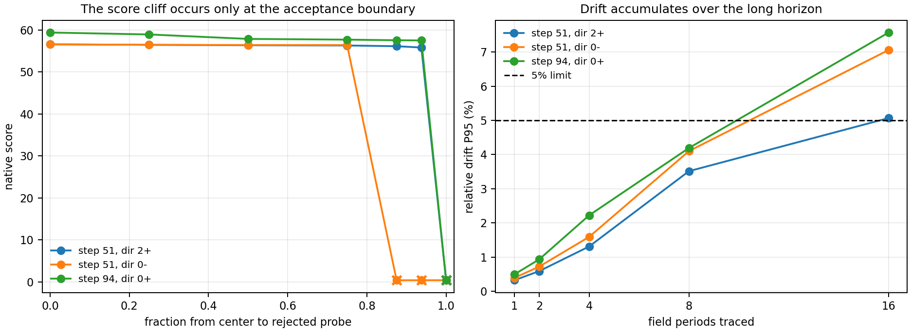

### 11.5 为什么没有把所有内层面都纳入生产 score

代码检查发现旧实现只高精度复核最大的 6 个一周期合格面。为排除“更内层其实可行”的可能性，诊断版本临时改成复核全部 9--10 个候选。结果是三个端点在 5% 标准下仍分别拒绝 9、9、10 个面，没有恢复任何一个 `ok`；但耗时出现可测增加：

| 版本 | 候选策略 | 同一端点审计墙钟 | 用途 |
| --- | --- | ---: | --- |
| 轴拓扑修正版 | 最大 6 个 | 81 s | 性能基线 |
| 临时全候选版 | 全部 9--10 个 | 97 s | 仅诊断，已撤销 |
| 最终有界版 | 最大 6 个 | 82 s | 生产版本 |

全候选版本 SHA-256 `15278af22326655eeb91473ff2b344c2ffc7b543c525f3d8ba5c211f90cd81f0` 及后续诊断构建 `53de3ff55954174fcc629b7c03de025f3819becc051aa491ac22565f22d080bd` 均不部署。它们引入小概率长尾，而本次又没有换来端点恢复。

最终版本恢复原来的 6 面上限，同时在不增加任何场线跟踪的前提下，令 `drift_rejected` 结果保留已计算候选中漂移最小者的 `surface_level`、一周期漂移、长期漂移和越界周期。最终三个失败端点现在可直接看到：一个在 $s=0.25$ 的第 12 周期达到 5.0695%；另两个最接近通过的已验证候选在第 6 周期达到 5.0629% 和 5.1991%。

### 11.6 优化器应怎样处理这种门槛

5% 长期漂移门是有意的物理验收条件，不应为了让有限差分看起来平滑而随意放宽。正确做法是把无效端点当作“该方向的导数不可观测”，而不是用约 0.4 分和约 58 分做中心差分：

- 任意正负探针非 `ok` 时，跳过整次梯度、Adam 一阶矩、二阶矩和参数更新；
- 所有端点均有效但某个方向差为明显离群值时，使用 median/MAD 比例做尺度自适应 winsorization，不设固定梯度上限；
- 更新后的中心若非 `ok`，只做固定次数的可行性回溯；仍失败则恢复参数、两阶动量和 Adam step 计数；
- `running best` 始终保留，不能用回落后的 current 点覆盖。

轴拓扑修正后，同一 `59.97998` 起点、$c=0.005$、$\eta=0.01$、$\beta_1=0.5$ 的 16 步短跑全部接受，从 `59.97998` 稳定提高到 `61.33896`，历史最佳也在第 16 步。它没有再次出现 `no_axis` 或长回撤。这个结果证明轴修正和可行性保护有效，但还不是长程 beta 最优性证明。

### 11.7 最终版本与产物

- 生产 CUDA 库 SHA-256：`4bf7a12ea3dbdef9faf6de3ce4dc1840ecf48847ba795267500dd4179f730708`。
- 旧生产库 `0b7342db...aa427` 已归档，不再作为新优化和新收集任务的默认库。
- 本地完整测试：113 passed。
- 最终端点审计 job `30589`：`COMPLETED 0:0`，82 s，精确轨迹重放误差为 0。
- 轴修正短跑 job `30569`：`COMPLETED 0:0`，16 步，`59.97998 -> 61.33896`。
- 机器可读审计：[最终有界端点结果](assets/qh_adam_dirty_gradient_20260801/bounded_final/dirty_endpoint_axis_audit.json) 和 [漂移阈值扫描](assets/qh_adam_dirty_gradient_20260801/drift_boundary/drift_boundary_scan.json)。

旧语料仍保留其原始库哈希，不能静默改写。新的后台收集从 jobs `30594`（Student 两卡）和 `30595`（P107 四卡、低优先级）开始使用新库；后续混合语料分析必须按记录的 score-library SHA 区分旧值和当前值。

## 12. 轴修正后 61.339 样本的完整物理评估

### 12.1 固定输入和当前 score

本节评估第 11.6 节 16 步短跑的历史最佳样本。输入已经冻结为
[evaluated_case.json](assets/qh_adam_topology_fixed_61p339_full_eval_20260801/evaluated_case.json)，SHA-256 为
`63de73980ad07d457e79c3eaa9b2ef34d731e36622d06dad7f06413afd531539`。短跑产物记录的
`61.3389633067` 来自中间库；不改输入、改用当前生产库
`4bf7a12ea3dbdef9faf6de3ce4dc1840ecf48847ba795267500dd4179f730708` 重算后为
**61.33896330666827**，状态 `ok`。二者在显示精度内一致。

| score 分量 | 数值 |
| --- | ---: |
| axis | 99.2312 |
| $\psi$ | 97.2853 |
| surface | 83.0218 |
| coordinate | 85.2201 |
| volume QS | 38.7846 |
| $\iota$ | 100.0000 |
| coil | 62.7895 |

native 诊断给出轴残差 $5.15\times10^{-9}$、$\psi$ 验证角误差 P95
$7.23\times10^{-5}$、$\iota=1.90479$、体 QH global/edge error
$0.34585/0.45782$。体 QS 是全体积微分统计，不等同于后文单个标准 Boozer 面上的面 QS error，
不能比较绝对尺度。线圈平均长度为 $3.6294\,\mathrm m$，曲率 P95/max 为
$7.854/14.406\,\mathrm m^{-1}$，最小线圈间距为 $0.03366\,\mathrm m$，最小轴线距离为
$0.21447\,\mathrm m$。

### 12.2 从源 $\psi$ 到最大已测标准面

源 $\psi$ 仍按样本自适应选择，不复用其它样本的半径。四个候选结果如下：

| $a$ [m] | validation RMS | 角误差 P95 | 廉价筛选最大通过 $s$ | 对应平均半径 [m] | 首个失败 $s$ |
| ---: | ---: | ---: | ---: | ---: | ---: |
| 0.04 | $6.753\times10^{-4}$ | $5.347\times10^{-5}$ | 0.64 | 0.03273 | 0.81 |
| 0.05 | $7.156\times10^{-4}$ | $7.430\times10^{-5}$ | 0.64 | 0.04080 | 0.81 |
| **0.06** | $8.039\times10^{-4}$ | $1.062\times10^{-4}$ | **0.64** | **0.04903** | **0.81** |
| 0.08 | $1.202\times10^{-3}$ | $2.641\times10^{-4}$ | 0.36 | 0.04931 | 0.49 |

$a=0.08$ 没有增加实际覆盖，反而显著恶化拟合，因此选 $a=0.06$。对
$s=0.24,0.36,0.49,0.64,0.81$ 分别运行完整 $\alpha+\nu$ 初值、标准 LS/Newton 和独立密网格检查：

| $s$ | 标准验收 | $|V|$ [$\mathrm{m^3}$] | $\iota$ | dense relative $L^2$ | normal $B$ P95 | 面 QH error |
| ---: | --- | ---: | ---: | ---: | ---: | ---: |
| 0.24 | 通过 | 0.01651 | 1.92454 | $2.17\times10^{-5}$ | $3.45\times10^{-5}$ | $8.48\times10^{-6}$ |
| 0.36 | 通过 | 0.02546 | 1.93157 | $2.34\times10^{-5}$ | $3.84\times10^{-5}$ | $2.35\times10^{-5}$ |
| 0.49 | 通过 | 0.03554 | 1.94060 | $2.56\times10^{-5}$ | $4.32\times10^{-5}$ | $6.99\times10^{-5}$ |
| **0.64** | **通过并选中** | **0.04123** | **1.94669** | **$2.72\times10^{-5}$** | **$4.63\times10^{-5}$** | **$1.33\times10^{-4}$** |
| 0.81 | 拒绝 | 0.01141 | 1.82613 | $1.13\times10^{-4}$ | $1.44\times10^{-4}$ | 未计算 |

$s=0.64$ 的初值到标准解有明显形变，距离 P95 约为平均半径的 34.1%，且标准面上的拟合
$s$ 均值变为 0.555；因此不能把它描述成“原 $\psi=0.64$ 等值面几乎不动”。但用户指定的最终存在性标准是
LS/Newton 是否能找到磁面，而不是初始等值面误差足够小。该面保持目标体积，标准线性最小二乘直接把
残差降到 $2.23\times10^{-13}$，Newton 在第 0 步即无需继续，随后通过独立 FP32 C++/CUDA
密网格残差、法向场、环向绕行和法向非退化检查。相邻更外层 $s=0.81$ 被同一固定标准拒绝，故
$s=0.64$ 是本次最大已测可行面，而不是严格数学最大面。

### 12.3 场线、Boozer 场强和三维几何

选中面的 8 条内侧种子在 Poincaré 截面中分别得到 23--25 个命中点，没有丢失整条场线：

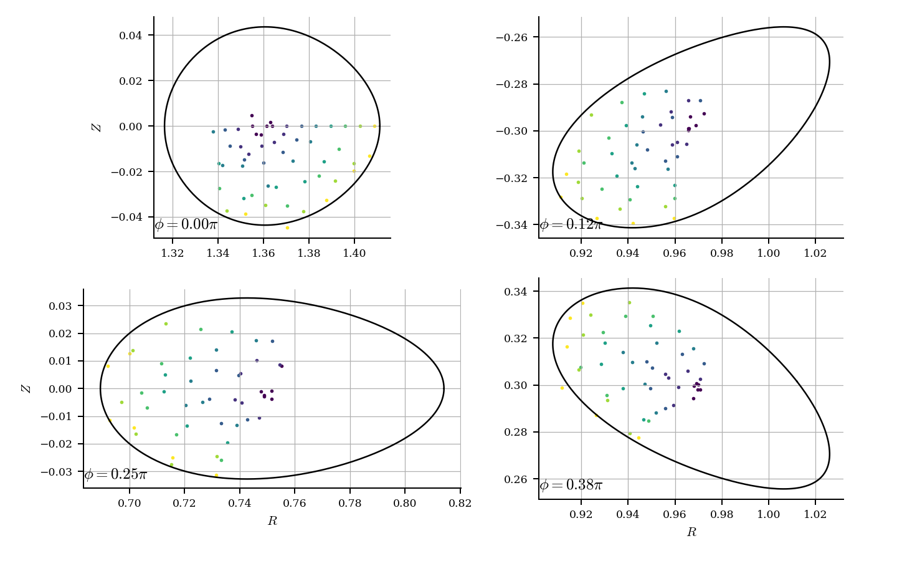

直接标准 Boozer 面上的 $|B|$ 范围为 $0.62489$--$0.76307\,\mathrm T$。下图使用白底彩色等高线，
颜色表示场强大小；[交互式 Boozer 图](assets/qh_adam_topology_fixed_61p339_full_eval_20260801/full_cpu_p107/assets/boozer_b.html)
保留原始可缩放数据。

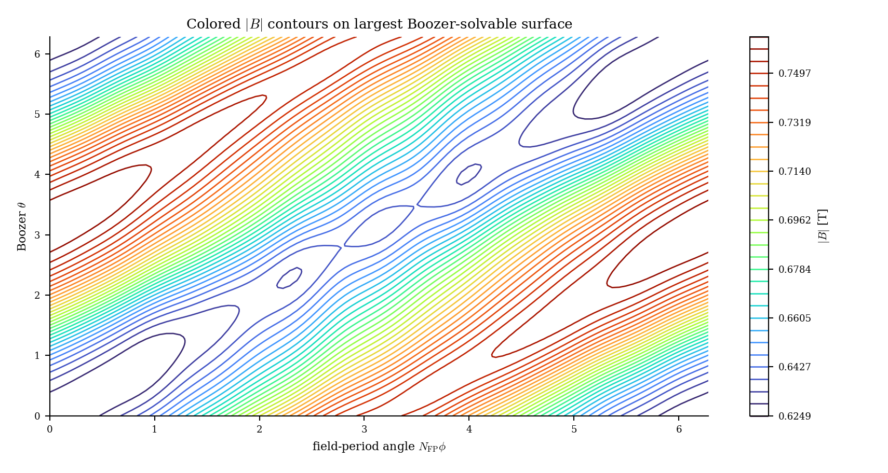

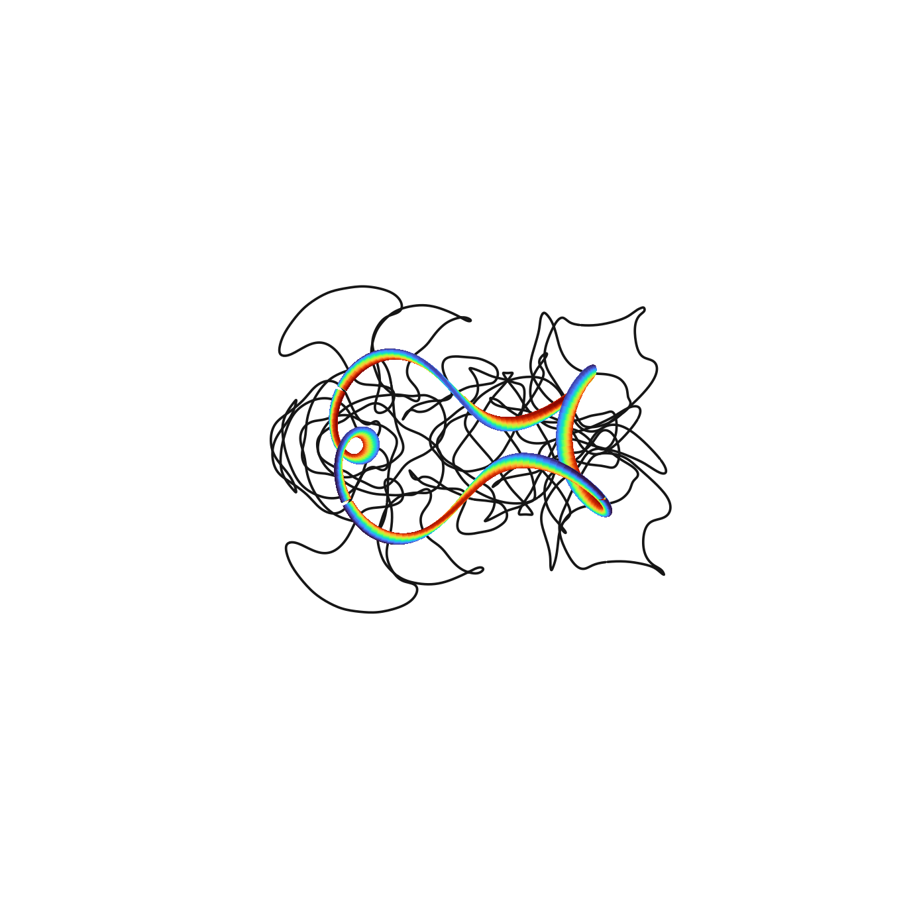

[三维线圈与完整对称磁面 HTML](assets/qh_adam_topology_fixed_61p339_full_eval_20260801/full_cpu_p107/assets/coils_surface.html)
包含全部场周期，未对每个周期的截面首尾做错误连线。

### 12.4 CPU DESC 复核

当前远端 JAX 只有 CPU backend。第一次 GPU 严格作业 `30642` 因 `--require-desc-gpu` 正确退出，
其 `full/` 目录不构成物理结果。正式作业 `30645` 使用 16 CPU，`COMPLETED 0:0`，总耗时
336.49 s，其中 DESC 251.67 s、可视化 41.81 s。旧提交脚本误申请了一张未使用 GPU；固定入口现已改为
`DESC_BACKEND=cpu-p107`，后续 CPU DESC 不再占 GPU。

初始 DESC 面嵌套，初始归一化力误差 mean/P95/max 为
$0.9099/2.566/6.827$。50 次 `lsq-exact` 后仍保持嵌套，独立终态统计降为

$$
\operatorname{mean}|F|=3.127\times10^{-3},\qquad
\operatorname{P95}|F|=6.993\times10^{-3},\qquad
\max|F|=1.647\times10^{-2}.
$$

优化器达到 50 次迭代上限，`success=false`、最终 cost 为 0.03331；因此结论是“DESC 明显改善且保持
嵌套”，不是“DESC 优化器已收敛”。以下逐张引用本次成功生成的全部 8 张 DESC 图。

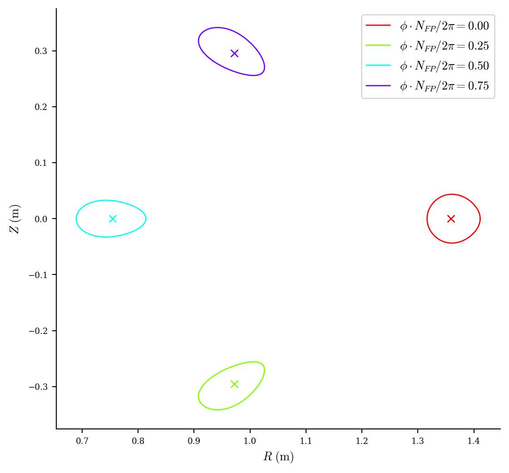

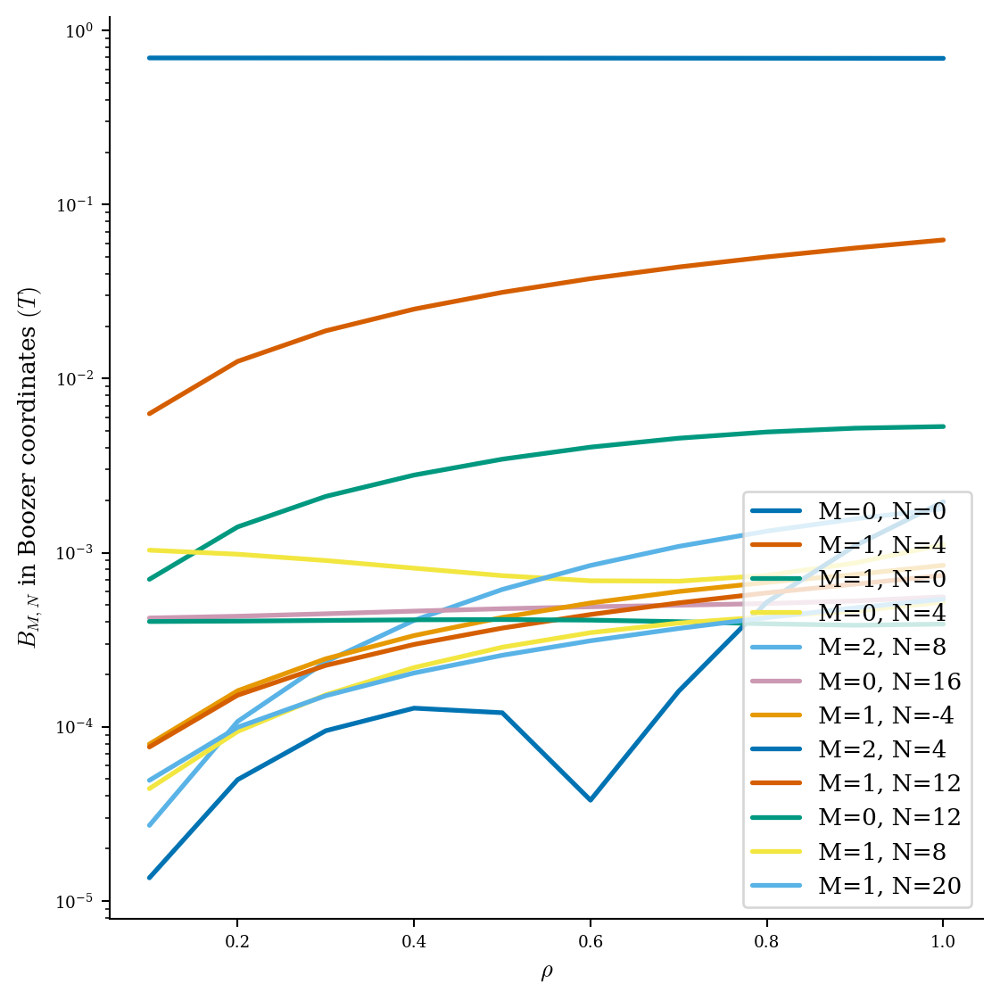

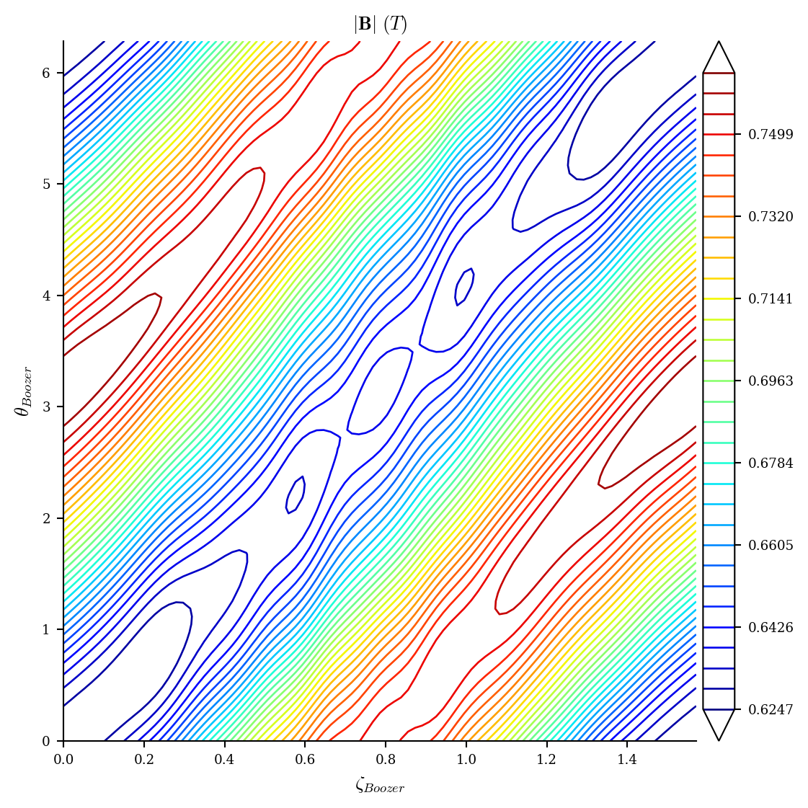

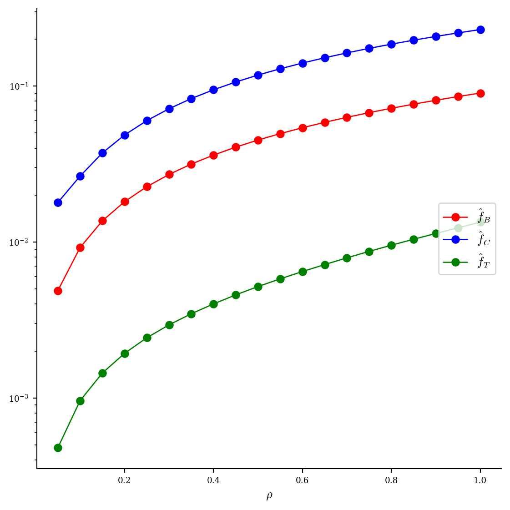

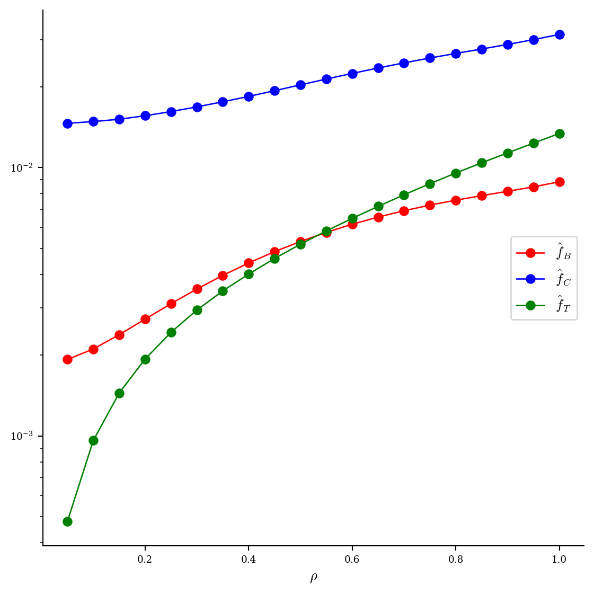

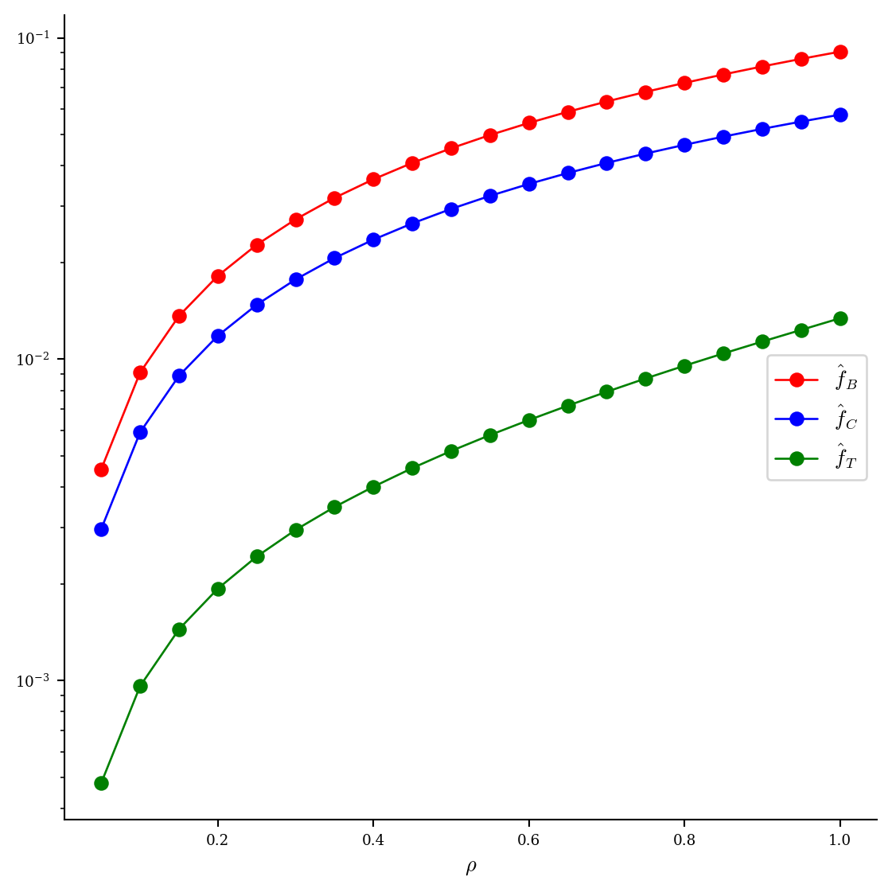

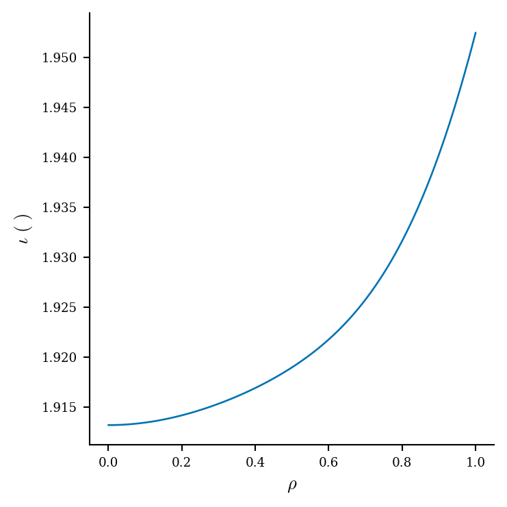

### 12.5 耗时、并行策略和已完成的优化

当前 native score 单样本耗时 10.00 s。主要热点为 axis search 4.41 s、surface screen 3.95 s、
flux 2.41 s 和 $\psi$ QR 0.96 s。代码审计确认：一次 score 只创建一次场对象；轴网格、候选有限差分、
一周期轨迹和通量点均批量进入 CUDA；通量标定已经是单次批量 device 路径。16 周期验证必须用上一周期
终点作为下一周期起点，不能简单把周期并行化。本轮没有发现可无风险删除的 CPU 回退或重复建场，因而
没有修改生产 score 的物理定义和固定成本。

完整评估入口此前错误默认 `SERIAL_CANDIDATES=1`，还让每个候选申请 16 CPU，导致候选互相阻塞。
现在默认每候选申请 1 GPU+4 CPU 并行提交，四卡节点同时跑四个候选；串行只保留为显式资源受限选项。
单候选正式作业本次为 4:37--5:52，五个候选的有效墙钟由最慢作业决定，而不是求和等待约 25 分钟。

旧 `s=0.36` alpha 路径中，总时间 140.22 s，单独通量标定占 54.87 s。新 `gpu-ray` 路径用同一
12 万训练点、6 万验证点运行，通量标定降至 0.56 s，alpha 总时间降至 107.35 s。最终标准面的结果为：

| 路径 | alpha $\iota$ | 标准面 $\iota$ | dense relative $L^2$ | normal $B$ P95 | 面 QH error |
| --- | ---: | ---: | ---: | ---: | ---: |
| 旧 Cartesian | 1.918877 | 1.931570 | $2.33567\times10^{-5}$ | $3.84344\times10^{-5}$ | $2.34561\times10^{-5}$ |
| 新 GPU-ray | 1.919758 | 1.931567 | $2.33558\times10^{-5}$ | $3.84353\times10^{-5}$ | $2.34468\times10^{-5}$ |

最终 $\iota$ 只差 $3.0\times10^{-6}$，三个物理误差均在 $10^{-9}$ 量级内一致，且两条路径都通过完整
标准验收，因此新默认值已获得同面数值交叉验证。新路径剩余的 `volume_sampling` 仍约 62.6 s，来自
1574 模拟合 $\psi$ 在 22.6 万射线候选上的基函数构造/评估；Horner 等价改写只让 alpha 从 107.35 s
变为 104.66 s，未产生超出波动的提速，不把它计为性能突破。该热点不属于 10 秒 native score 路径，
后续若继续优化，应实现并单独验证专用 GPU 多项式评估，而不是在正式验收过程中临时改内核。

### 12.6 验收结论和原始产物

该样本不是 native score 的假高分：它具有最大已测 $|V|=0.04123\,\mathrm{m^3}$ 的标准嵌套磁面，
$\iota=1.94669$，面 QH error 为 $1.33\times10^{-4}$，Poincaré 通过，DESC 也在保持嵌套的同时把
归一化力误差降到 $10^{-3}$--$10^{-2}$ 量级。它仍不是接近 100 分的极优解，主要限制与 native
volume-QS 分量 38.78 和线圈几何分量 62.79 一致。

选中标准面 SHA-256 为
`06420743e7f812ced6c7b5538f303e1976bdb5f373d6bb891f4fe30ea2a71df4`，DESC equilibrium SHA-256 为
`96e021104c225002a09170bbe587613ba386ae888e4e77b530a84193556add2e`。机器可读结果位于
[selection.json](assets/qh_adam_topology_fixed_61p339_full_eval_20260801/selection.json)、
[标准面 summary](assets/qh_adam_topology_fixed_61p339_full_eval_20260801/candidates/s_0p64/standard_rho_1/summary.json)、
[完整下游 summary](assets/qh_adam_topology_fixed_61p339_full_eval_20260801/full_cpu_p107/full_summary.json) 和
[DESC summary](assets/qh_adam_topology_fixed_61p339_full_eval_20260801/full_cpu_p107/desc/summary.json)。
