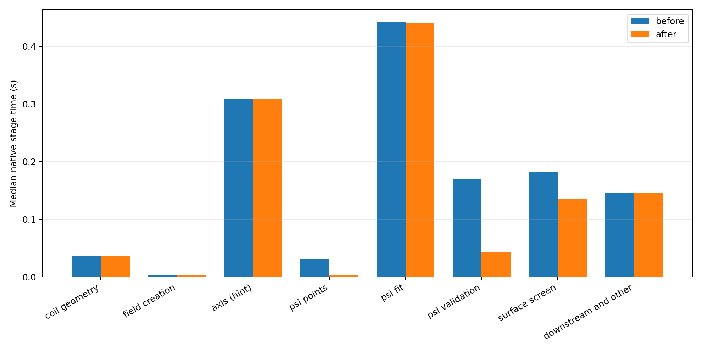
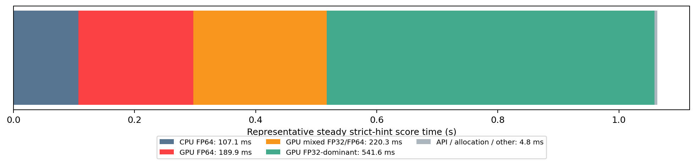
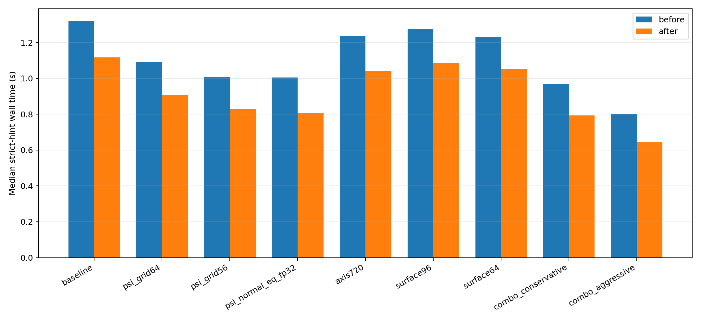
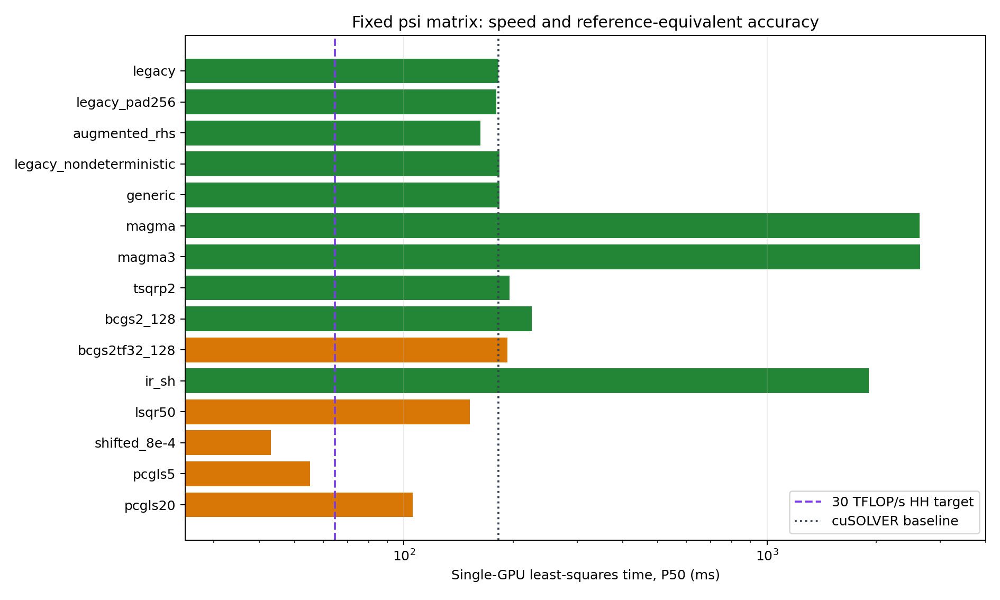
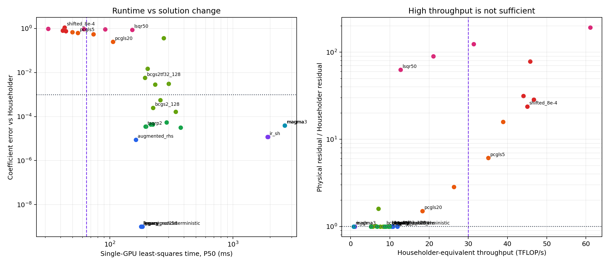
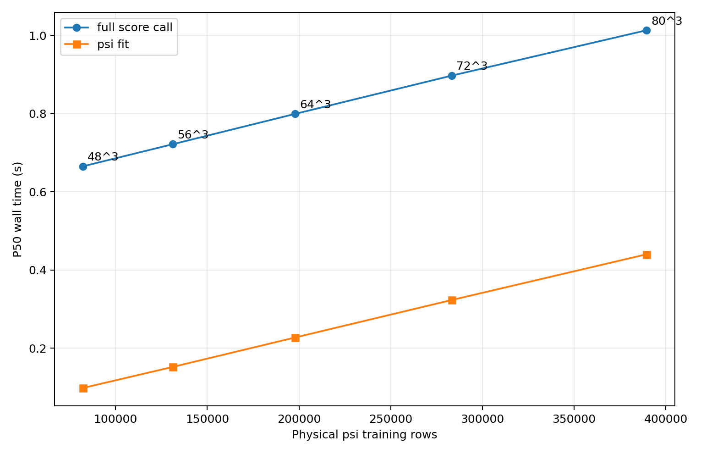
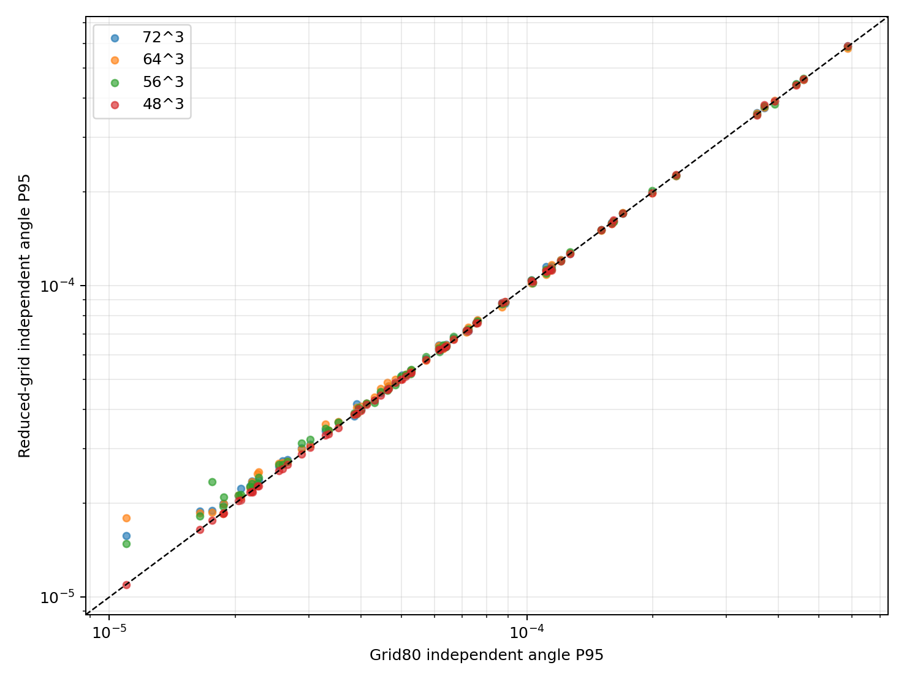
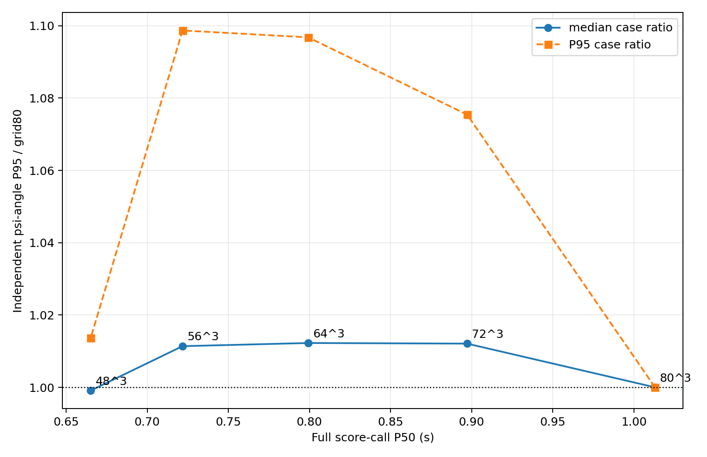
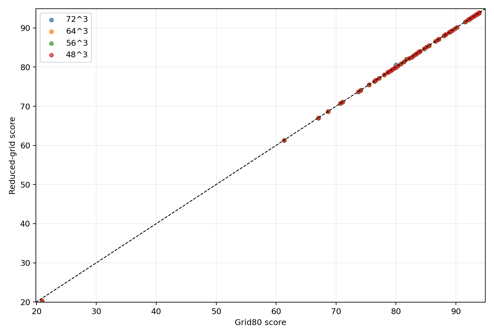

# 给定磁轴初值时的原生 score 性能剖析

日期：2026-08-10

分支：`codex/score-eval-compression`

对象：当前 C++/CUDA ABI-10 连续磁面 score

## 1. 先说结论

本轮只研究一种明确场景：**磁轴初值已经由上一个相邻线圈提供，评分器必须沿这条磁轴分支继续计算**。不包含独立样本的全局磁轴搜索，也不试图改变 score 的物理定义。

结论如下。

1. 历史上对 $69$ 个可用留出样本的严格磁轴续接测试得到过 $0.990\ \mathrm{s}$ 的中位数；这个结果仍是当前生产性能参考。本轮 $1.323\ \mathrm{s}$ 不是对它的替代测量，而是另一批 $8$ 个极高分样本在另一轮构建和调度环境下的结果。
2. 在本轮完全相同的样本和运行环境内，当前实现确实存在两处简单而明显的重复计算：同一个点反复计算相同环向三角函数，以及生成 $\psi$ 拟合点时反复插值同一环向位置的磁轴。去掉这两处重复后，中位单次耗时从 $1.323\ \mathrm{s}$ 降到 $1.117\ \mathrm{s}$，加速 $1.184$ 倍。
3. 这两处改动不改变公式、采样数、积分步数、求解器或数据精度。在 $8$ 个高质量 QUASR QH 样本、每个样本重复 $3$ 次的 $24$ 组配对结果中，score 最大差异为 $1.42\times10^{-14}$，各分量最大差异为 $2.84\times10^{-14}$，即只有 FP64 舍入顺序变化。
4. 本轮最大瓶颈是 $\psi$ 的稠密线性最小二乘：它已经使用 GPU FP32 QR，稳态约 $414\ \mathrm{ms}$。但历史原始记录中同样规模的 QR 通常约 $0.23\ \mathrm{s}$；本轮约 $0.44\ \mathrm{s}$ 的 QR 是尚未完成同机 A/B 定位的性能异常，不能当作算法固有成本。
5. 因此，“把整个评分器改成 FP32”并不是正确描述。主要 QR 已经是 FP32；磁轴和追踪则有意使用 FP64 状态或 FP64 最终核验来防止分支错误。后续是否进一步降精度，必须针对具体步骤验证。
6. 新增的 $69$ 样本配对实验单独扫描了 $\psi$ 拟合点数。把网格从 `80` 降到 `48` 后，实际训练点从 $389440$ 降到 $82176$，$\psi$ 拟合 P50 从 $0.440$ 降到 $0.098\ \mathrm{s}$，完整评分 P50 从 $1.013$ 降到 $0.665\ \mathrm{s}$。独立物理角度 P95 的中位比值为 $0.9991$，score Spearman 相关系数为 $0.99993$，最高一成样本完全重合。
7. 标准 QR 没有显式生成完整 $Q$，但单独执行 $Q^Tb$ 仍需约 $19.93\ \mathrm{ms}$。把 $b$ 作为 $A$ 的最后一列一起做 Householder QR 后，固定矩阵求解 P50 从 $181.93$ 降到 $162.43\ \mathrm{ms}$，加速 $1.120$ 倍，同时保持训练方程残差一致。
8. `48` 网格是当前最值得继续验收的候选，但本轮没有修改生产默认值。其异常好的误差保持是当前规则网格上的实测结果，不证明继续减点会单调变好；正式切换前还应检查优化轨迹邻域的局部排序和光滑性。

本轮没有实施复杂优化。除上述两处严格等价的去重外，其余内容均为分析和建议。

## 2. 测试口径

### 2.1 样本

从 QUASR QH 样本中选了 $8$ 个当前 ABI-10 score 为 `ok` 的高质量样本：score 范围为 $91.67$--$93.88$，覆盖 $N_{\mathrm{FP}}=3,4,5$，每个场周期包含 $3$--$5$ 根基线线圈。

样本 ID 为：`2426751`、`1739363`、`1292588`、`1737589`、`1259625`、`2405423`、`1701533`、`1548548`。

### 2.2 磁轴处理

每个样本的磁轴初值先用全局搜索独立找到，但该过程严格排除在计时之外。正式计时的每次调用都设置：

- 启用磁轴初值；
- 强制磁轴分支延续；
- 若评分器没有实际使用初值，则测试直接报错。

因此这里测到的是优化器相邻迭代真正需要的“已知磁轴分支评分”，不是独立样本冷启动。

### 2.3 设备与重复方式

- 设备：调度到的空闲 RTX 5090，计时前确认无其他 GPU 负载；
- 每个配置：$8$ 个样本，每个重复 $3$ 次，共 $24$ 次调用；
- 总耗时使用调用者墙钟和原生计时双重记录；
- 用 Nsight Systems 对一个代表样本作细粒度分段；
- 集群禁止普通用户读取 GPU 性能计数器，Nsight Compute 返回 `ERR_NVGPUCTRPERM`，因此本文不伪造基于硬件计数器的吞吐率。

### 2.4 与历史 $0.990\ \mathrm{s}$ 的口径核对

历史参考来自 `qh_score_fast_continuation_20260805` 的 $69$ 个 `legacy-ok` 留出样本，严格磁轴续接的总耗时 P50/P95 为 $0.990/1.254\ \mathrm{s}$。其阶段中位数为：$\psi$ 全阶段 $0.437\ \mathrm{s}$、磁轴 $0.249\ \mathrm{s}$、连续磁面 $0.161\ \mathrm{s}$；原始逐样本记录中的 FP32 QR 通常约为 $0.23\ \mathrm{s}$。

本轮去重前的 $8$ 个极高分样本得到 $1.323\ \mathrm{s}$，其中 FP32 QR 中位数为 $0.442\ \mathrm{s}$，磁轴为 $0.309\ \mathrm{s}$，连续磁面为 $0.181\ \mathrm{s}$。两轮的 ABI、默认矩阵规模、QR 方法、FP32 精度、CUDA 13 和 `sm_120` 构建目标一致，未发现能解释 QR 翻倍的评分器公式或默认参数变化。

因此，$1.323-0.990=0.333\ \mathrm{s}$ 的差距不能解释成“当前 score 比以前慢了 $0.333\ \mathrm{s}$”。其中约 $0.21\ \mathrm{s}$ 直接来自本轮固定规模 QR 的异常变慢；磁轴约多 $0.06\ \mathrm{s}$，其余差异较小且可能包含样本复杂度和运行节点差异。当前尚未在同一空闲 GPU 上完成“同一批输入、NVTX 开关、同一构建”的严格 A/B，所以不能进一步把 QR 变慢归因到某一个具体环境因素。

正确解读是：

- $0.990\ \mathrm{s}$ 仍是大样本历史生产参考；
- $1.323\to1.117\ \mathrm{s}$ 只证明两处去重在本轮内部带来稳定、严格等价的加速；
- $1.117\ \mathrm{s}$ 也不能宣称是去重后主线的最终生产中位数。若只作粗略算术投影，把本轮 QR 恢复到历史约 $0.23\ \mathrm{s}$，总耗时会落到约 $0.9\ \mathrm{s}$，但这不是实测值。

## 3. 当前准确流程和耗时

去重后的基线中位总耗时为 $1.117\ \mathrm{s}$，P95 为 $1.262\ \mathrm{s}$，最大值为 $1.264\ \mathrm{s}$。$24$ 次均为 `ok`，没有新增长尾。



| 阶段 | 去重前 P50 | 去重后 P50 | 主要计算位置与精度 | 判断 |
|---|---:|---:|---|---|
| 线圈几何量 | 35.64 ms | 35.64 ms | CPU FP64 | 不是首要瓶颈 |
| 磁场对象创建 | 2.76 ms | 2.90 ms | CUDA API/内存 | 很小 |
| 已知初值的磁轴延续 | 309.20 ms | 308.85 ms | GPU 混合精度 + FP64 核验 | 第二大瓶颈 |
| $\psi$ 点生成 | 31.00 ms | 2.37 ms | CPU FP64 | 重复磁轴插值已去掉 |
| $\psi$ 拟合 | 441.64 ms | 441.27 ms | GPU FP32 QR | 最大瓶颈 |
| $\psi$ 验证 | 170.69 ms | 43.64 ms | GPU FP32 磁场 + CPU FP64 多项式 | 重复三角函数已去掉 |
| 连续磁面筛选 | 181.27 ms | 136.30 ms | GPU 混合精度追踪 + CPU FP64 归约 | 同样受益于三角函数缓存 |
| 磁通、$\alpha$、QS 与其余工作 | 146.07 ms | 145.66 ms | 以 GPU FP32 为主 | 暂非首要目标 |

各行分别取中位数，所以它们的和不要求严格等于总耗时中位数。

## 4. FP32/FP64 到底用在哪里

下面是 Nsight Systems 对一个代表样本的稳态分解。它用于回答“真实使用了什么精度”，而不是误差分析。



| 类别 | 代表耗时 | 含义 |
|---|---:|---|
| CPU FP64 | 107.1 ms | 线圈几何、$\psi$ 多项式及梯度评估、磁面归约等 |
| GPU FP64 | 189.9 ms | 磁轴最终一周期核验，状态和磁场均为 FP64 |
| GPU 混合 FP32/FP64 | 220.3 ms | 磁场值用 FP32，轨道状态与积分累积用 FP64；包括磁轴细化、轴采样和磁面追踪 |
| GPU FP32 为主 | 541.6 ms | $\psi$ FP32 QR、$\psi$ 验证磁场、体采样与 $\alpha$/QS 主体；少量归约仍用 double |
| API、分配与未归类 | 4.8 ms | 图中分段未覆盖的小量 |

这里最重要的事实是：

- $\psi$ QR 调用的是 `cusolverDnSgeqrf`，矩阵和分解都是 FP32；求得的系数最后才转成 double 保存。
- 磁轴最终核验确实是 FP64。这不是无意的 CPU 回退，而是 GPU 上的双精度追踪。
- 磁面和磁轴细化不是纯 FP32：它们用 FP32 计算磁场，但保留 FP64 轨道状态，目的是抑制长积分中的漂移。
- $\psi$ 的 CPU 验证是 FP64；本轮去重只是避免重复调用 `sin`/`cos`，没有改为 FP32。

## 5. 本轮偏慢 QR 的实际算力利用率

先明确“矩阵构建”和“求解”的区别。`psi_fit_s` 包含从数据传入 GPU 到系数传回 CPU 的整段工作，但代表样本的稳态 Nsight 中位数如下：

| `psi_fit_s` 内部阶段 | 中位耗时 | 占 `fullgpu` 的近似比例 |
|---|---:|---:|
| 输入复制与分配 | 1.51 ms | 0.3% |
| 在 GPU 上构建设计矩阵和右端项 | 13.33 ms | 3.0% |
| QR 分支整体 | 414.38 ms | 93.3% |
| 拟合残差计算 | 2.42 ms | 0.5% |
| 系数复制回 CPU | 0.024 ms | 小于 0.1% |
| GPU 缓冲释放 | 12.61 ms | 2.8% |
| `fullgpu` 合计 | 444.22 ms | 100% |

这里的“QR 分支整体”包括把行主序矩阵转为 cuSOLVER 所需的列主序、列缩放、加入岭正则增广行、`cusolverDnSgeqrf` 分解、`cusolverDnSormqr` 计算 $Q^T b$，以及最后的 `cublasStrsv` 三角回代。Nsight 中 cuSOLVER 子范围覆盖了其中绝大多数 GPU 投影时间。因此结论很明确：**当前时间主要花在 GPU 上真正执行 QR 求解，不是花在构建设计矩阵。**

CPU 生成拟合点列表属于外层 `psi_points_s`，去重后在 $24$ 次基准中的中位数另为 $2.37\ \mathrm{ms}$，也不是瓶颈。

默认 $\psi$ 网格为 $80^3$。圆盘筛选后有 $389760$ 个物理采样点，正则增广后矩阵约为

$$
m=391334,\qquad n=1574.
$$

Householder QR 分解的主导运算量近似为

$$
F_{\mathrm{QR}}\approx 2mn^2-\frac{2}{3}n^3
=1.936\times10^{12}\ \mathrm{FLOP}.
$$

Nsight 的稳态 GPU 投影时间约为 $0.4140\ \mathrm{s}$，所以**本轮运行环境中**的算法级有效吞吐约为

$$
\frac{F_{\mathrm{QR}}}{t}=4.68\ \mathrm{TFLOP/s}.
$$

NVIDIA 公布的 RTX 5090 非 Tensor FP32 峰值为 $104.8\ \mathrm{TFLOP/s}$，FP64 比率为 FP32 的 $1/64$，即理论 FP64 峰值约 $1.64\ \mathrm{TFLOP/s}$。因此当前 QR 的算法级吞吐只相当于非 Tensor FP32 峰值的约 $4.46\%$。硬件规格来源：[NVIDIA RTX Blackwell GPU Architecture](https://images.nvidia.com/aem-dam/Solutions/geforce/blackwell/nvidia-rtx-blackwell-gpu-architecture.pdf)。

这不代表存在一个简单改动就能获得 $20$ 倍加速。该 QR 是高瘦矩阵的 Householder 分解，不是单次大 GEMM。剖析中一次 QR 范围内有约四千次 GPU 操作，大量时间花在带依赖的 panel、反射变换和许多不同尺寸的 GEMM 上。其并行效率天然低于理想的大方阵 GEMM。更重要的是，历史同规模 QR 通常约 $0.23\ \mathrm{s}$，所以这里的 $4.68\ \mathrm{TFLOP/s}$ 只描述本轮偏慢运行，不能作为当前实现的稳定吞吐结论。

由于 NCU 性能计数器权限不可用，本文不对追踪 kernel 编造 TFLOPS 数字。追踪 kernel 的单次耗时已经直接测得，而它们的准确 FLOP 数取决于线圈数、傅里叶阶数、积分步数和分支行为，单独给一个粗糙 TFLOPS 反而会误导判断。

## 6. 已保留的简单去重

本轮只改了两件事：

1. 在一个空间点上评估 $\psi$ 及其梯度时，每个环向模数的 $\sin(mN_{\mathrm{FP}}\phi)$ 和 $\cos(mN_{\mathrm{FP}}\phi)$ 只计算一次，而不是对所有多项式系数重复计算。
2. 生成规则 $R$-$Z$-$\phi$ 拟合点时，每个 $\phi$ 对应的磁轴位置只插值一次，而不是对每个 $R$-$Z$ 网格点重复插值。

二者都是循环不变量外提。它们不改变运算的数学定义，也不改变任何默认参数。配对结果表明数值只发生 FP64 舍入顺序量级的变化。

## 7. 只做过测量、尚未采用的参数试验

下图显示的是同一批 $8$ 个高分样本上的探索结果。橙色是去重后的速度。它不能直接作为生产参数验收。



| 试验配置 | P50 | 相对当前基线 | score 最大绝对变化 | 8 样本排序 |
|---|---:|---:|---:|---:|
| 当前基线 | 1.117 s | $1.00\times$ | $1.42\times10^{-14}$ | 1.000 |
| $\psi$ 网格 $64^3$ | 0.907 s | $1.23\times$ | 0.0489 | 0.976 |
| $\psi$ 网格 $56^3$ | 0.829 s | $1.35\times$ | 0.0714 | 0.976 |
| FP32 法方程 | 0.805 s | $1.39\times$ | 0.5238 | 0.905 |
| 磁轴步数 $960\to720$ | 1.040 s | $1.07\times$ | 0.0335 | 1.000 |
| 磁面角点 $256\to96$ | 1.087 s | $1.03\times$ | 0.0113 | 1.000 |
| 磁面角点 $256\to64$ | 1.051 s | $1.06\times$ | 0.0154 | 1.000 |
| 保守组合 | 0.793 s | $1.41\times$ | 0.0291 | 1.000 |
| 激进组合 | 0.644 s | $1.74\times$ | 0.0203 | 1.000 |

这里的“排序”是 Spearman 相关系数。只有 $8$ 个样本时，1.000 也不是充分证据。

FP32 法方程不应采用：它虽然快，但会平方条件数，已经造成明显更大的 score 偏移、排序下降，并出现 $1.465\ \mathrm{s}$ 的异常慢调用。它同时违反“数值稳定且无长尾”的目标。

## 8. 后续优化建议

### 8.1 最值得先验证：降低固定离散规模

这是收益最明确、实现最简单的方向，但它改变数值离散，所以不能直接改默认值。

建议用至少 $128$--$1024$ 个样本重新标定，且必须覆盖：

- 当前优化产生的极高分样本；
- 磁轴拓扑接近边界、磁面置信度接近门限的困难样本；
- 高分样本的微小扰动邻域，用来检查优化 landscape 是否产生新毛刺；
- `ok` 与各类拒绝状态交界处，用来检查 gate 是否翻转；
- P50、P95、最大耗时和状态一致率。

若这些检查通过，保守组合有现实机会把相邻迭代评分压到约 $0.8\ \mathrm{s}$。激进组合的 $0.64\ \mathrm{s}$ 更适合作为待验证上限，不应先入主线。

### 8.2 最大的复杂方向：重新组织 $\psi$ 最小二乘

当前 QR 占约 $0.44\ \mathrm{s}$，所以它决定了进一步大幅提速的上限。可研究：

- 针对高瘦矩阵的 TSQR 或分块 QR；
- 复用 cuSOLVER、cuBLAS handle、工作区和矩阵缓冲，减少分配及初始化；
- 检查 CUDA 13 的泛型 cuSOLVER QR 接口在该矩阵形状上是否更好；
- 在保留 QR 稳定性的前提下，研究是否能复用固定基底结构，避免每次重新形成全部设计矩阵。

这些都比循环去重复杂，可能涉及较大代码改动和新的数值风险。本轮不实现。尤其不建议用法方程替代 QR，也不建议未经标定启用 TF32/Tensor Core，因为 score 对 $\psi$ 拟合误差和 gate 边界敏感。

### 8.3 磁轴 FP64 核验：有收益，但风险比看起来大

严格磁轴初值下，磁轴仍耗时约 $309\ \mathrm{ms}$，其中 FP64 最终核验约 $190\ \mathrm{ms}$。RTX 5090 的 FP64 峰值只有约 $1.64\ \mathrm{TFLOP/s}$，这解释了它为何显眼。

减少积分步数从 $960$ 到 $720$ 在这 $8$ 个样本上保持排序且节省约 $77\ \mathrm{ms}$，值得扩大验证。直接把最终核验改为 FP32 则风险较大：一旦误判磁轴分支，score 的物理含义会整体失效，而不仅是出现小数值误差。因此优先研究自适应核验或经过严格标定的步数减少，不建议直接删掉 FP64 核验。

### 8.4 CPU FP64 的剩余空间

简单缓存后，CPU FP64 总量约 $107\ \mathrm{ms}$，其中 $\psi$ 验证归约约 $43\ \mathrm{ms}$、磁面归约约 $17\ \mathrm{ms}$、线圈几何约 $33\ \mathrm{ms}$。即使全部消除，总加速上限也有限。

这些循环可以进一步向 GPU 搬运或作 SIMD/并行化，但会引入数据搬运、归约顺序和维护成本。建议先做更大样本的离散规模标定和 QR 原型，再决定是否值得为几十毫秒重写这些代码。

### 8.5 资源复用

代表 profile 中 $\psi$ 清理约 $12.6\ \mathrm{ms}$，field/handle 创建也有数毫秒。把工作区、cuBLAS/cuSOLVER handle 和固定尺寸缓冲保存到评分上下文中，理论上能减少若干毫秒到几十毫秒，但不可能单独带来倍数级加速。它适合作为后期工程整理，而不是当前首要算法方向。

## 9. 建议的决策顺序

1. 保留本轮两处严格等价去重；它们已经用配对数据证明不改变 score。
2. 先在同一空闲 GPU、同一批输入上重测历史和当前构建，并作 NVTX 开关 A/B，定位 $0.23\to0.44\ \mathrm{s}$ 的 QR 性能差异。绝对性能结论以该测试为准。
3. 暂不修改生产离散参数。先对保守组合做大样本、门限邻域和优化轨迹标定。
4. 若保守组合通过，再决定是否将其作为优化器内部快速 score；独立验收仍可保留高精度默认配置。
5. 若仍需显著低于 $0.8\ \mathrm{s}$，优先做高瘦 QR/矩阵复用原型；不要走法方程。
6. 只有在上述收益仍不足时，再考虑改动磁轴 FP64 核验或将 CPU 归约搬到 GPU。

## 10. 复现材料

- 基准和分析脚本：`scripts/benchmark_score_eval_hinted.py`、`scripts/analyze_score_eval_compression.py`、`scripts/compare_score_eval_profiles.py`；
- Nsight 标记：`gpu_backend/src/nvtx_profile.h` 以及评分器中的分阶段范围；
- 去重前结果：`reports/assets/qh_score_eval_compression_20260810/before/`；
- 去重后结果：`reports/assets/qh_score_eval_compression_20260810/after/`；
- 配对汇总与图：`reports/assets/qh_score_eval_compression_20260810/comparison/`；
- 远端 Slurm 作业：数值与 profile `35664`、去重后复测 `35673`、统计导出 `35672`；
- NCU 作业 `35677` 因集群性能计数器权限被拒，未产生有效硬件计数器数据；
- 作业结束后 GPU 利用率为零，未遗留评分进程或僵尸进程。

## 11. 大规模高瘦 QR 的高性能路线调研

### 11.1 问题规模和 $30\ \mathrm{TFLOP/s}$ 的准确含义

当前增广后的 FP32 矩阵规模为

$$
m=391334,\qquad n=1574,\qquad \frac{m}{n}=248.6.
$$

矩阵本身约占 $2.29\ \mathrm{GiB}$。标准 Householder QR 的主导运算量为

$$
F_{\mathrm{HHQR}}
=2mn^2-\frac{2}{3}n^3
=1.936\times10^{12}\ \mathrm{FLOP}.
$$

所以 $30\ \mathrm{TFLOP/s}$ 对应的分解时间上限是

$$
t_{30}=\frac{F_{\mathrm{HHQR}}}{30\times10^{12}}
=64.55\ \mathrm{ms}.
$$

RTX 5090 的非 Tensor FP32 峰值为 $104.8\ \mathrm{TFLOP/s}$，因此目标相当于约 $28.6\%$ 的理论峰值。从硬件算力和该矩阵的计算强度看，这不是物理上不可能的目标；但它比本轮 $414\ \mathrm{ms}$ 快 $6.4$ 倍，也比历史完整 `psi_fit_s` 中位数 $229.6\ \mathrm{ms}$ 快至少 $3.6$ 倍，不能指望仅更换一个同后端 API 就自然达到。

不同算法的 FLOP 数不同。后续比较必须同时报告：

1. 墙钟时间；
2. 算法自身的实际 FLOP/s；
3. 统一采用 $F_{\mathrm{HHQR}}/t$ 的“Householder 等效吞吐”。

否则法方程或 CholeskyQR 可能因为少做或多做运算而得到误导性的 TFLOPS 数字。

### 11.2 成熟外部库逐项判断

| 路线 | 数值方法 | 接入成本 | 达到单卡 $30\ \mathrm{TFLOP/s}$ 的判断 | 主要问题 |
|---|---|---:|---|---|
| `cusolverDnXgeqrf` | 单卡 Householder QR | 很低 | 不乐观，但应先测 | 泛型 API 仍只支持 FP32 输入配 FP32 计算，没有官方证据表明它使用不同的高性能 QR 后端 |
| MAGMA 2.10 `magma_sgeqrf_gpu/3_gpu` | 块 Householder QR | 中 | 有测试价值，但不能预期必过 | 最新 MAGMA 支持 CUDA 13 和 `sm_120`，但当前 expert QR 仍只支持 CPU/GPU hybrid 模式，CPU panel 和 PCIe 传输可能限制上限 |
| NVIDIA `cuSOLVERMp Gels/Geqrf` | 多 GPU 分布式 Householder QR | 中高 | **最可能达到聚合 $30\ \mathrm{TFLOP/s}$** | 一进程一卡、NCCL 和二维块循环布局；占用多卡后可能降低优化器的单位 GPU 样本吞吐 |
| SLATE | 多 GPU CAQR/最小二乘 | 高 | 聚合性能可能好 | MPI/OpenMP、tile 数据布局和 CPU panel 调度都比 cuSOLVERMp 更重，不适合作为第一原型 |
| cuSolverDx | thread-block 内 QR/GELS | 不适用整矩阵 | 不能直接使用 | 面向批量小矩阵；本问题的 $n=1574$ 无法作为一个共享内存 QR 问题处理，只能用于自定义 TSQR 的小块 |

依据如下：

- NVIDIA 的 `cusolverDnXgeqrf` 文档列出的 FP32 组合仍是 `CUDA_R_32F` 输入和 `CUDA_R_32F` 计算，没有 TF32 或混合精度 QR 选项：[cuSOLVER 泛型 GEQRF](https://docs.nvidia.com/cuda/archive/11.0/cusolver/index.html#cusolverdn-t-geqrf)。
- MAGMA 2.10 明确支持 Blackwell `sm_120` 和 CUDA 13；其 QR 文档同时说明 `magma_sgeqrf_expert_gpu_work` 当前仅支持 `MagmaHybrid`：[MAGMA 2.10](https://icl.utk.edu/magma/)、[MAGMA SGEQRF](https://icl.utk.edu/projectsfiles/magma/doxygen/group__magma__geqrf.html)。
- cuSOLVERMp 提供直接的 FP32 `cusolverMpGels` 和 `cusolverMpGeqrf`，使用一进程一卡、NCCL 和二维块循环分布：[cuSOLVERMp 功能](https://docs.nvidia.com/cuda/cusolvermp/)、[cuSOLVERMp GELS API](https://docs.nvidia.com/cuda/cusolvermp/usage/functions.html#cusolvermpgels)。
- cuSolverDx 的 QR/GELS 是可嵌入 kernel 的批量小矩阵接口，而不是这类 $391334\times1574$ 全矩阵求解器：[cuSolverDx 功能](https://docs.nvidia.com/cuda/cusolverdx/get_started/functionality.html)。

### 11.3 Tensor Core 是否提供现成捷径

CUDA 13 的确增加了 BF16x9 模拟 FP32：一个 FP32 数被精确拆为三个 BF16 数，再用九项 BF16 Tensor Core 乘积模拟 FP32 乘法。NVIDIA 对计算密集型 GEMM 报告过最高约三倍加速；它与直接使用低精度 TF32 不同。[NVIDIA BF16x9 文档](https://docs.nvidia.com/cuda/cublas/index.html#bf16x9)

但是当前官方支持表只列计算能力 10.0 和 10.3，RTX 5090 使用的是 `sm_120`。因此不能把 BF16x9 当作本服务器上的可用方案，也不能据此承诺 cuSOLVER QR 自动获得 Tensor Core 加速。

直接在自定义 QR 更新中使用 TF32 Tensor Core 技术上可行，但这会改变舍入精度。当前 FP32 法方程已经造成最大约 $0.52$ 的 score 偏移和慢尾，所以 TF32 只能作为后续受控实验，不能成为第一替代方案。

### 11.4 为什么普通“小列数 TSQR”不能原样使用

近期针对 GPU 高瘦 QR 的研究表明，Q-less TSQR 在 $n\le64$ 时可把小 $R$ 块保存在共享内存中并显著超过 cuSOLVER；但同一研究也明确指出，列数超过 64 后共享内存方案不再可行，需要转向非 Q-less 的块 Gram-Schmidt、SVQB2 或其它分块算法。[Thies 与 Roehrig-Zoellner, 2026](https://arxiv.org/abs/2603.20889)

我们的 $n=1574$ 比该范围大约 $25$ 倍。这里不是“把一个小 TSQR kernel 的模板参数改大”就能解决，而是需要第二层列分块或完整 CAQR。

不过，可以构造一个仍然保持 Householder 稳定性的**行分块 TSQR 最小二乘**：

1. 把 $A$ 和 $b$ 按行分成 $k$ 块；
2. 每块独立调用成熟的 cuSOLVER/MAGMA QR，并同时计算 $Q_i^Tb_i$；
3. 只保留每块的 $R_i$ 和变换后的前 $n$ 个右端项；
4. 对堆叠的 $R_i$ 再做一次 QR；
5. 三角回代得到最终系数。

这不会形成 $A^TA$，不平方条件数，数值性质接近标准 Householder QR。取 $k=8$ 时，第二层 QR 的额外主导工作量约为原问题的 $kn/m\approx3.2\%$，代价不大；八个局部 QR 可以放入独立 stream，用并发覆盖当前 cuSOLVER 的 panel 串行和小 kernel 空洞。

它不是一个现成的单函数调用，但核心数值核仍全部来自成熟库。若 MAGMA 和 cuSOLVERMp 未达到目标，这是最值得实现的后备路线。

### 11.5 CholeskyQR2/SVQB2 为什么不是首选

CholeskyQR2 和 SVQB2 的主体是 GEMM，最容易得到超过 $30\ \mathrm{TFLOP/s}$ 的算力利用率。问题是它们先形成

$$
C=A^TA,
$$

会平方条件数。通常的 CholeskyQR2 只适合中等条件数矩阵，典型限制与 $\kappa(A)\lesssim\epsilon^{-1/2}$ 同量级。当前实现虽然做了列缩放和岭正则，但最坏条件数上界仍可能达到约 $4\times10^4$，而 FP32 的 $\epsilon^{-1/2}$ 只有约 $2.9\times10^3$。

更直接的项目证据是：现有 FP32 法方程已经改变 score 排序、最大偏移约 $0.52$，还引入了慢调用。CholeskyQR2、shifted CholeskyQR3 或 SVQB2 可能改善这一点，但必须先按实际矩阵条件数分层验证，不能作为“成熟且等价”的替换。

因此这类路线可作为性能上限实验，但不应排在 Householder 外部库和稳定 TSQR 前面。

### 11.6 推荐的实测顺序

第一阶段只冻结一份真实的 $A,b$，避免混入磁场和矩阵装配时间：

1. 当前 `cusolverDnSgeqrf`，同时复现历史约 $0.23\ \mathrm{s}$ 和本轮约 $0.44\ \mathrm{s}$ 的环境差异；
2. `cusolverDnXgeqrf`；
3. MAGMA 2.10 的 `sgeqrf_gpu`、`sgeqrf3_gpu + sgeqrs3_gpu`，扫描官方块大小附近的少量 $nb$；
4. cuSOLVERMp `Gels` 的 1、2、4 GPU 和少量块大小；
5. 若仍未达标，实现 $k=2,4,8,16$ 的行分块 Householder TSQR，局部 QR 继续调用 cuSOLVER。

每项必须分别记录：预热后 P50/P95、分解时间、完整最小二乘时间、GPU 数、每 GPU 吞吐、聚合吞吐、工作区大小和是否存在慢尾。

数值验收不能只比较一个系数向量，应包含：

- $\|Ax-b\|_2/\|b\|_2$；
- $\|A^T(Ax-b)\|_2$；
- 与当前 Householder 解的系数差异；
- 独立点上的 $\psi$、$\nabla\psi$ 和角度残差；
- 至少 $128$--$1024$ 个真实样本的 score 差异、排序和状态翻转；
- 代表优化轨迹邻域是否出现新毛刺。

### 11.7 可行性结论

1. **单卡 Householder QR 超过 $30\ \mathrm{TFLOP/s}$ 在硬件上可行，但成熟单卡库能否在本矩阵形状上达到，现阶段没有证据可以保证。** MAGMA 是最值得先试的成熟单卡替代；泛型 cuSOLVER API 更像低成本排除项。
2. **多卡聚合超过 $30\ \mathrm{TFLOP/s}$ 的可行性较高。** cuSOLVERMp 是最成熟的路线，但必须同时比较“每秒完成多少个 score”。若两张卡协作一次 QR 只比两张卡各算一个 score 略快，它不适合优化主线。
3. **在保持 Householder 级稳定性的前提下，最有希望的单卡技术路线是行分块并发 TSQR/CAQR。** 它需要中等程度的编排代码，但不需要手写底层 QR kernel。
4. **CholeskyQR2/SVQB2 最容易突破算力目标，却最可能违反当前数值可靠性要求。** 只有实际条件数和大样本 score 验收通过后才能考虑。
5. 若新 QR 分支达到 $64.5\ \mathrm{ms}$，本轮去重后 score 的粗略中位数可从 $1.117\ \mathrm{s}$ 降到约 $0.77\ \mathrm{s}$；按历史 $0.990\ \mathrm{s}$ 口径估算约为 $0.85\ \mathrm{s}$。这只是由阶段耗时相减得到的投影，最终必须用同机端到端基准确认。

## 12. 固定真实矩阵的单卡分解实验

### 12.1 为什么先把矩阵冻结下来

前面的 profile 已经确认，$\psi$ 拟合的主要时间不是花在构造矩阵，而是花在 FP32 QR。因此这一节不再反复执行线圈、磁轴、采点和矩阵构造，而是只回答一个问题：

第 11 节是实验前的路线调研，曾列出多卡 cuSOLVERMp 作为可能方向；本次任务随后明确限定为单卡速度，因此没有执行 cuSOLVERMp，也不把多卡聚合吞吐计入任何结果。以下表格、TFLOP/s 和结论全部是一张 RTX 5090 的结果。

> 对完全相同的一份真实 $A,b$，RTX 5090 单卡上有没有比当前 cuSOLVER Householder QR 快很多、同时又不破坏拟合精度的分解方法？

选用 QUASR QH 样本 `1739363`，其原始筛选 score 约为 $93.84$，$N_{\mathrm{FP}}=4$，有四组基本线圈。代码在列缩放和岭正则增广完成之后、调用 QR 之前，将**实际进入求解器的 FP32 矩阵和右端项原样写盘**。快照信息为：

$$
A\in\mathbb{R}^{391014\times1574},
\qquad
b\in\mathbb{R}^{391014}.
$$

其中前 $389440$ 行是物理拟合数据，最后 $1574$ 行是岭正则增广行。文件大小为 $2463400872$ 字节，SHA-256 为

```text
e8878c17a3d6b7c64f5459391c8d98cbc9eccb9b52410acc5c7d2ca90f3dd6b2
```

远端快照保存在：

```text
/home/scc/pb24511935/local_surface_evaluator_data/qr_bench_20260810/case_1739363_psi_qr_f32.bin
```

快照钩子仅在显式设置 `SGPU_PSI_QR_SNAPSHOT` 时启用；正常 score 路径不写盘，也不增加默认开销。前一节按分析规模估计的 $391334$ 行由本次真实快照修正为 $391014$ 行，后续 FLOP 和时间均以真实尺寸为准。

### 12.2 计时和误差口径

每种方法均在一张空闲 RTX 5090 上运行，先预热一次，再重复五次并报告 P50/P95。不同方法可以同时占用不同 GPU 加快实验，但每一条结果都只来自**单卡分解**，没有任何多卡协同。

`solve_ms` 包含分解、计算 $Q^Tb$ 和三角回代；恢复被分解矩阵所需的约 $3.23\ \mathrm{ms}$ 单独记录，不计入分解时间。当前 Householder QR 的统一参考 FLOP 数为

$$
F_{\mathrm{HH}}
=2mn^2-\frac{2}{3}n^3
=1.9348559\times10^{12}.
$$

因此报告中的“Householder 等效 TFLOP/s”为 $F_{\mathrm{HH}}/t$。它便于比较总时间，但不是所有算法真正执行的 FLOP/s。例如 LSQR 做的 FLOP 少得多，等效吞吐很高不代表 GPU 算力利用率高。对能可靠估算 FLOP 的方法，汇总表同时给出算法自身的估计 TFLOP/s。

误差没有只看系数，而是同时计算：

$$
e_x=\frac{\lVert x-x_{\mathrm{HH}}\rVert_2}{\lVert x_{\mathrm{HH}}\rVert_2},
$$

$$
r_{\mathrm{train}}
=\frac{\lVert A_{\mathrm{data}}x-b_{\mathrm{data}}\rVert_2}
{\lVert b_{\mathrm{data}}\rVert_2},
$$

以及全增广矩阵残差、反向误差和归一化法方程残差

$$
r_N
=\frac{\lVert A^T(Ax-b)\rVert_2}
{\lVert A\rVert_F\lVert Ax-b\rVert_2}.
$$

为了筛掉明显不可接入的方案，本节把以下条件同时满足称为“参考精度”：

$$
e_x\le10^{-3},\qquad
r_{\mathrm{train}}\le1.001r_{\mathrm{train,HH}},
$$

$$
r_{\mathrm{aug}}\le1.001r_{\mathrm{aug,HH}},
\qquad
r_N\le10^{-4}.
$$

这里的 $r_{\mathrm{train}}$ 只是原训练点上的**未归一化方程残差**，并不是
$|\boldsymbol B\cdot\nabla\psi|/(|\boldsymbol B||\nabla\psi|)$。它适合判断替代线性求解器有没有解错同一个矩阵问题，但不能独立证明求出的 $\psi$ 在新点上满足磁面物理条件。

因此这只是固定矩阵上的首轮门槛。即使某方法通过，正式替换前仍须在独立点上验证归一化物理角度，并在大量样本上验证 score、排序和状态不翻转；反过来，固定矩阵上已经明显失败的方法没有必要进入昂贵的大样本验收。

### 12.3 基线和主要结果

当前 `cusolverDnSgeqrf + Sormqr + Strsv` 的稳定 P50 为 $181.93\ \mathrm{ms}$，对应 $10.64$ Householder 等效 TFLOP/s。分解本身为 $161.92\ \mathrm{ms}$，$Q^Tb$ 为 $19.93\ \mathrm{ms}$，三角回代只有 $0.08\ \mathrm{ms}$。这说明瓶颈确实在 QR panel 和 trailing update，而不是回代。

| 方法 | P50 / ms | Householder 等效 TFLOP/s | 算法估计 TFLOP/s | $e_x$ | 训练方程残差/基线 | 参考精度 | 结论 |
|---|---:|---:|---:|---:|---:|---|---|
| cuSOLVER Householder | 181.93 | 10.64 | 10.64 | 0 | 1.0000 | 是 | 基线 |
| Householder，`lda` 对齐 256 | **179.64** | 10.77 | 10.77 | 0 | 1.0000 | 是 | 完全等价，但只快 $1.26\%$ |
| cuSOLVER 泛型 `Xgeqrf` | 183.55 | 10.54 | 10.54 | 0 | 1.0000 | 是 | 没有新后端收益 |
| cuSOLVER 非确定性模式 | 183.42 | 10.55 | 10.55 | 0 | 1.0000 | 是 | 反而略慢 |
| MAGMA 2.10 `sgeqrf_gpu` | 2632.07 | 0.74 | 0.74 | $3.95\times10^{-5}$ | 1.00000 | 是 | hybrid panel，约慢 $14.5$ 倍 |
| MAGMA 2.10 `sgeqrf3_gpu` | 2634.85 | 0.73 | 0.73 | $3.95\times10^{-5}$ | 1.00000 | 是 | 与普通 MAGMA 路径同样慢 |
| 打包两块 Householder TSQR | 195.16 | 9.91 | 9.97 | $3.49\times10^{-5}$ | 0.99998 | 是 | 精度好，但比基线慢 $7.3\%$ |
| 打包四块 Householder TSQR | 215.05 | 9.00 | 9.11 | $4.40\times10^{-5}$ | 1.00001 | 是 | 第二层归约和多 panel 成本更大 |
| 两遍 block GS，128 列块 | 224.60 | 8.61 | 未作可靠估算 | $2.50\times10^{-4}$ | 1.00002 | 是 | 精度可接受，但更慢 |
| TF32 两遍 block GS，128 列块 | 192.90 | 10.03 | 未作可靠估算 | $5.71\times10^{-3}$ | 1.00903 | 否 | 既未提速，也已偏离 |
| cuSOLVER 混合精度迭代改进 | 1906--1926 | 1.00--1.02 | 未作可靠估算 | $1.18\times10^{-5}$ | 0.99999 | 是 | 达到迭代上限，约慢十倍 |
| 移位法方程，$\lambda=8\times10^{-4}$ | **42.98** | **45.02** | **45.14** | 1.113 | 23.85 | 否 | 吞吐达到目标，但解不可用 |
| 预条件 CGLS，5 步 | **55.10** | **35.11** | **35.43** | 0.621 | 6.11 | 否 | 吞吐达到目标，但远未收敛 |
| 预条件 CGLS，20 步 | 105.87 | 18.28 | 18.79 | 0.248 | 1.509 | 否 | 越接近精度，速度优势越小 |
| LSQR，50 步 | 152.15 | 12.72 | **0.81** | 0.872 | 62.86 | 否 | 等效 TFLOP/s 具有误导性，收敛太慢 |

完整的 44 组有效结果、每次重复的原始时间和全部误差指标位于 `reports/assets/qh_psi_qr_benchmark_20260810/raw/` 与 `benchmark_summary.csv`。下图绿色表示达到本节“参考精度”，橙色表示没有达到。绿色并不自动代表值得接入，还必须显著快于基线。



速度和误差的关系更直接地显示在下图中。右图中位于 $30\ \mathrm{TFLOP/s}$ 右侧的点全部远离基线残差；靠近残差比 1 的点则全部低于 $30\ \mathrm{TFLOP/s}$。



### 12.4 为什么高 TFLOP/s 的结果仍然不能用

法方程路线确实把主要工作变成了大规模 `SGEMM/SYRK`，所以实际吞吐达到 $35$--$45\ \mathrm{TFLOP/s}$，证明 RTX 5090 对这份矩阵本身有足够算力。失败原因不是 GPU 没吃满，而是数值方法不适合这份矩阵。

未移位的 FP32 $A^TA$ 在 Cholesky 的第 579 个主元就失去正定性；TF32 更早在第 427 个主元失败。修复错误检查后，CholeskyQR2 同样在第一阶段第 579 个主元明确失败，旧的 `162.7 ms + NaN` 结果因此作废。只有把对角移位提高到约 $8\times10^{-4}$ 才能分解，但这时求解目标已经被明显改变，训练方程残差是 Householder 的 $23.85$ 倍。

预条件 CGLS 可以逐步修正这个偏差，但在 20 步时训练方程残差仍比基线高 $50.9\%$，耗时已经达到 $105.87\ \mathrm{ms}$。按当前收敛速度，继续迭代到 Householder 精度前很可能先丢掉速度优势。LSQR 则每步只做矩阵向量乘，实际只有约 $0.8\ \mathrm{TFLOP/s}$；50 步仍没有接近可用误差。

稳定方法的情况正好相反。Householder TSQR、两遍 block GS 和迭代改进可以维持残差，但单卡上多次 panel 分解、第二层 QR 或反复迭代的成本超过了原始一次 Householder QR。这里没有足够的独立工作去掩盖 $n=1574$ 的 panel 依赖。

MAGMA 2.10 的两种稳定 Householder 路径也没有解决这个问题。它们分别需要 $2632.07\ \mathrm{ms}$ 和 $2634.85\ \mathrm{ms}$，虽然系数误差只有约 $3.95\times10^{-5}$、训练方程残差与基线基本一致，但比 cuSOLVER 慢约 $14.5$ 倍。实测与 MAGMA 文档中的实现结构一致：当前 expert QR 使用 CPU/GPU hybrid panel，在本问题的单次低延迟目标下，CPU panel 和同步开销远大于收益。

### 12.5 当前接入判断

固定矩阵实验和 MAGMA 最终对照完成后，结论如下：

1. 可以把算术吞吐推到 $30\ \mathrm{TFLOP/s}$ 以上，但目前所有这类方案都严重破坏拟合结果；
2. 可以保持 Householder 级精度，但目前所有稳定替代方案都不比基线快；
3. 唯一完全等价的改进是 `lda` 对齐 256，分解只从 $181.93\ \mathrm{ms}$ 降到 $179.64\ \mathrm{ms}$，不足以抵消生产路径中改变矩阵布局和构造 kernel 的工程复杂度；
4. MAGMA 2.10 的成熟单卡 Householder 路径精度合格但慢约 $14.5$ 倍，也不是替代方案；
5. 因而没有任何方法满足“优化很多且误差可接受”的接入门槛。本轮**没有修改生产 score 求解器，也没有用不准确的快速解做端到端测速**。这避免了为了展示表面加速而把错误解接入主链路。

如果以后继续攻这一瓶颈，方向不应再是更换现成 QR API、法方程或增加普通 Krylov 迭代次数，而应是专门针对 $m\gg n\approx1574$ 的 GPU-resident CAQR/panel kernel，或从物理基底结构上减少列数。前者开发成本高，后者会改变拟合空间；两者都需要新的独立课题和大样本 score 验收。本轮已经把“成熟库和常见稳定替代能否低成本达到 $30\ \mathrm{TFLOP/s}$”这个问题回答清楚：在当前矩阵与 RTX 5090 单卡上，答案是否定的。

## 13. 判断标准、QR 冗余和拟合点数

这一节直接回答三个问题：前面到底用什么判定解的好坏，QR 有没有算不需要的东西，以及减少拟合点能否在不破坏物理结果的前提下提速。

### 13.1 最终判断不是“解前后有多近”

$\psi$ 的线性拟合可以写成

$$
\psi=\psi_0+\sum_j c_j f_j,
$$

其中 $\psi_0$ 是固定的轴附近基准项，$f_j$ 是待拟合的多项式-环向 Fourier 基函数。训练方程

$$
\boldsymbol B\cdot\nabla\psi\approx0
$$

在离散点上写成

$$
A\boldsymbol c\approx\boldsymbol b.
$$

固定矩阵 QR 实验中的

$$
r_{\mathrm{train}}
=\frac{\lVert A_{\mathrm{data}}\boldsymbol c-\boldsymbol b_{\mathrm{data}}\rVert_2}
{\lVert\boldsymbol b_{\mathrm{data}}\rVert_2}
$$

只回答“求解器有没有把这一个离散最小二乘问题解对”。它使用原训练点，分母也不是 $|\boldsymbol B||\nabla\psi|$，所以不能单独作为物理验收。

正式评分器还固定生成 $4000$ 个不参与拟合的体内验证点，并计算

$$
\epsilon_i
=\frac{|\boldsymbol B_i\cdot\nabla\psi_i|}
{|\boldsymbol B_i|\,|\nabla\psi_i|}.
$$

最终记录三个独立物理指标：

$$
\epsilon_{\mathrm{mean}}=\frac{1}{N}\sum_i\epsilon_i,
$$

$$
\epsilon_{\mathrm{P95}}=\operatorname{P95}(\epsilon_i),
$$

$$
\epsilon_{L^2}
=\sqrt{
\frac{\sum_i(\boldsymbol B_i\cdot\nabla\psi_i)^2}
{\sum_i(|\boldsymbol B_i|\,|\nabla\psi_i|)^2}
}.
$$

当前 score 的 `psi` 分量中，$58\%$ 权重来自 $\epsilon_{\mathrm{P95}}$，$32\%$ 来自 $\epsilon_{L^2}$，训练 RMS 只占 $10\%$。因此最终口径确实主要是提问中的归一化物理残差，而不是系数离某个参考解有多近。

系数距离只在“同一个 $A,b$，替换线性求解器”的固定矩阵实验中有用：如果系数突然相差一阶量，说明新求解器大概率解错了。点数一变，离散矩阵本来就不同，此时不再用系数距离作主判据，而是检查独立物理角度、下游量、最终 score 和排序。

### 13.2 QR 到底有没有多算

当前标准路径为：

1. `Sgeqrf` 把 $A$ 分解为 Householder 反射子和上三角 $R$；
2. `Sormqr` 把这些反射子应用到整列 $b$，得到 $Q^Tb$；
3. `Strsv` 解上三角方程。

它**没有显式形成或存储完整的 $Q$**，因此不存在一个可以直接删掉的巨大完整矩阵。但是第二步仍会再遍历 Householder 数据和整列 $b$。固定矩阵上，这一步的 P50 是 $19.93\ \mathrm{ms}$，约占标准求解的 $11\%$。

本轮实现了一个数学等价的融合版本：直接对增广矩阵

$$
[A\mid b]
$$

做一次 Householder QR。前 $n$ 次反射与只分解 $A$ 完全相同，并在更新尾部列时顺便得到 $Q^Tb$。最后一列自身的反射只从第 $n+1$ 行开始，不会改动已经得到的前 $n$ 个右端项，因此可以直接回代。

| 固定矩阵方法 | P50 / P95 | 分解 | 单独 $Q^Tb$ | 等效 TFLOP/s | 系数相对差 | 训练方程残差/基线 |
|---|---:|---:|---:|---:|---:|---:|
| 标准 `geqrf+ormqr+trsv` | 181.93 / 181.98 ms | 161.92 ms | 19.93 ms | 10.64 | 0 | 1.000000 |
| 增广右端项 QR | **162.43 / 162.49 ms** | 162.35 ms | 0 | **11.91** | $8.91\times10^{-6}$ | 0.999999 |


结论是：QR 确实有约 $20\ \mathrm{ms}$ 可以用简单方式融合掉，但主要的 $162\ \mathrm{ms}$ 仍是必要的 Householder 分解。固定快照只有 $A,b$，没有几何和磁场数据，所以这一实验能严格检查同一线性问题，却不能单独重算独立物理角度；生产接入仍需端到端样本验收。本轮没有因为单样本约 $12\%$ 的 QR 提升而直接改生产默认求解器。

### 13.3 减少点数的实验设计

样本不是前面仅有的 $8$ 个极高分案例，而是历史严格续接 holdout 中所有 `legacy.status=ok` 的 $69$ 个 QUASR 样本。每个配置重复两次，共运行 $69\times5\times2=690$ 次评分。执行顺序按样本和重复轮换，避免某个网格总在 GPU 热机前后出现。

五个配置只改变 $\psi$ 的 `n_r=n_z=n_phi`。以下内容全部不变：

- 同一线圈输入和同一磁轴初值；
- 强制使用磁轴分支续接，未使用初值就报错；
- 同一个 $1574$ 维基底、岭正则和 FP32 Householder QR；
- 同一组固定种子的 $4000$ 个独立验证点；
- 后续连续磁面、磁通、$\alpha/\iota$、体 QS 和 score 公式。

训练区域是圆环而不是立方体，因此 `80³` 只是配置简称。排除轴心小圆后，实际物理训练行数如下。

| 网格 | 训练行数 | $\psi$ 拟合 P50 | 完整评分 P50 / P95 | 完整评分加速 | 角度 P95 比值，中位 / P95 | score 中位差 / P95 绝对差 | Spearman |
|---:|---:|---:|---:|---:|---:|---:|---:|
| 80 | 389440 | 440.21 ms | 1.013 / 1.266 s | 1.000x | 1.000 / 1.000 | 0 / 0 | 1.000000 |
| 72 | 283392 | 323.46 ms | 0.897 / 1.146 s | 1.129x | 1.012 / 1.075 | -0.020 / 0.097 | 0.999854 |
| 64 | 197888 | 227.52 ms | 0.799 / 1.047 s | 1.268x | 1.012 / 1.097 | -0.021 / 0.076 | 0.999781 |
| 56 | 131264 | 152.30 ms | 0.722 / 0.969 s | 1.404x | 1.011 / 1.099 | -0.016 / 0.100 | 0.999854 |
| 48 | 82176 | **98.34 ms** | **0.665 / 0.913 s** | **1.523x** | **0.999 / 1.014** | **+0.001 / 0.080** | **0.999927** |

每档均有 $138/138$ 次 `ok`，没有状态翻转。`48` 网格的 $\psi$ 拟合加速为 $4.476$ 倍，但磁轴、磁面和 $\alpha$ 等阶段不随这里的点数缩放，所以完整评分只加速 $1.523$ 倍。



### 13.4 物理误差是否可控

以表现最好的 `48` 网格为例，独立验证点上的绝对量为：

| 独立物理指标 | `80` 网格 | `48` 网格 |
|---|---:|---:|
| 角度 P95 的跨样本中位数 | $5.2783\times10^{-5}$ | $5.2517\times10^{-5}$ |
| 角度 P95 的跨样本 P95 | $3.8315\times10^{-4}$ | $3.8798\times10^{-4}$ |
| 角度 $L^2$ 的跨样本中位数 | $1.1017\times10^{-5}$ | $1.1000\times10^{-5}$ |
| 角度 $L^2$ 的跨样本 P95 | $6.3889\times10^{-5}$ | $6.4128\times10^{-5}$ |

这些量与基线处于同一精度。散点图也显示 `48` 网格几乎贴在对角线上；`56/64/72` 在少数本来残差极小的样本上有可见偏移，但绝对量仍小。





最终 score 的排序同样稳定。`48` 网格与 `80` 网格的 Spearman 相关系数为 $0.999927$，最高 $10\%$ 的 $7$ 个样本完全相同；基线 score 不低于 $90$ 的 $18$ 个样本中，最大绝对偏移只有 $0.0223$。全体样本最大偏移为 $0.589$，来自一个基线约 $20.92$ 的低分样本，降为约 $20.33$，没有把低质量样本抬成高分样本。



不能把 `48` 的结果解释成“点越少反而越准”。规则网格改变后，离散积分误差、矩阵条件数和 FP32 QR 舍入会同时变化，当前 `48` 与 `80` 的误差可能恰好抵消。实验只支持以下有限结论：在这 $69$ 个样本、当前 1574 维基底和固定独立验证集上，`48` 是一个速度显著更快且物理误差可控的候选；它不支持继续外推到 `40`、`32`，也不证明任意新样本都会单调保持。

### 13.5 当前建议

1. **最终判断以独立物理角度为主，不以系数距离为主。** 系数距离和训练方程残差保留为同矩阵求解器的单元测试。
2. **`48` 网格值得进入优化轨迹邻域验收。** 它把本批单卡严格续接评分的 P50/P95 从 $1.013/1.266$ 降到 $0.665/0.913\ \mathrm{s}$，同时保持高分排序和独立角度。
3. **暂不直接改生产默认值。** 下一步只需在若干已保存 Adam 轨迹附近做小扰动配对，确认局部排序、毛刺和接受/拒绝决策没有改变；通过后再把 `48` 设为默认。
4. **增广右端项 QR 是独立的小改进。** 它在 `80` 网格固定矩阵上省约 $19.5\ \mathrm{ms}$，但点数降到 `48` 后可省部分也会随行数缩小，优先级低于点数调整，不能把两项固定矩阵加速简单相乘。
