# QH score 吞吐优化与连续磁面选择可行性报告

**日期：2026-08-05**

## 1. 结论先行

本轮不再研究黑箱梯度，而是直接降低一次正式 score 的成本，并让 score 关于小线圈扰动更连续。用户提出的两个方向都可行，而且正好对应当前两个最大瓶颈：

1. 当前磁面流程先在 13 个离散 $s$ level 中选候选，再对少数外层候选逐个做最多 16 周期追踪。它同时带来高成本、候选切换和硬拒绝。建议把 16 周期追踪移出生产 score，仅保留为开发期和完整评估期的审计标准；生产 score 用固定数量、确定性的体内分层点做 1--4 周期短追踪，构造连续的磁面置信度 $p(s)$。
2. 当前磁轴流程每次都从 $48\times48$ 全局网格开始，必要时再做 $64\times64$ fallback。对于同一个优化中心附近的差分端点和回退候选，这些全局扫描绝大部分是重复工作。建议为局部优化新增“磁轴分支 continuation”接口，直接从中心样本已经验证的磁轴进入局部固定点迭代；若不能继续同一分支，则返回 branch-lost，而不是悄悄切到另一根磁轴。

现有 1000 样本计时支持这个优先级。验证集上的总时间中位数为 3.280 s，磁轴搜索为 1.621 s，磁面筛选为 1.009 s；$\psi$ 点生成、拟合和验证合计约 0.433 s，$\alpha/\iota$ 与 QS 合计约 0.058 s。校准集也给出几乎相同的结果。代表性高分样本总耗时 7.236 s，其中磁轴约 2.17 s，磁面候选、长追踪与磁通标定约 4.52 s。

因此本轮不应优化 QR、十万体点或 flow，也不应重写已经稳定的线圈到 $\psi$ 主链。正确顺序是：**先把计时拆细，再做磁轴 warm start，随后做长追踪消融和连续 $p(s)$，最后才把新 score 接回优化器。**

本报告只做设计，没有创建分支、修改代码或提交实验。

## 2. 当前 score 的准确流程

### 2.1 磁轴

当前 gpu_backend/src/score_pipeline.cu 中的磁轴流程是：

1. 从线圈几何估计搜索区域。
2. 在 $48\times48$ 的 $(R,Z)$ 网格上，把每个点追踪一个场周期，计算 Poincare 映射残差。
3. 根据映射绕数和局部残差极小值选出最多 16 个候选。
4. 对候选做最多 6 轮带回退的二维 Newton 迭代。每轮需要有限差分 Jacobian和若干 trial trace。
5. 用 FP64 重新验证候选残差和椭圆拓扑。
6. 若没有足够稳健的候选且 $N_{\rm FP}\le7$，再执行 $64\times64$ 网格、最多 48 个候选的 fallback。
7. 选定磁轴后，另外追踪 240 个轴采样点，供后续 $\psi$ 使用。

1000 样本统计为：

| 指标 | 验证集 | 校准集 |
|---|---:|---:|
| 总时间中位数 | 3.280 s | 3.137 s |
| 总时间 P95 | 5.213 s | 6.038 s |
| 磁轴搜索中位数 | 1.621 s | 1.608 s |
| 磁轴搜索 P95 | 3.686 s | 4.753 s |
| 最慢总时间 | 7.547 s | 15.036 s |

校准集中两个超过 10 s 的长尾样本都是 no-axis，几乎全部时间消耗在全局磁轴搜索。这说明磁轴 continuation 不只是降低均值，也可能消除目前最明显的长尾。

### 2.2 磁面

当前默认使用 13 个离散 level：

$$
s\in\{0.001,0.002,0.004,0.008,0.02,0.04,0.08,0.16,0.25,0.36,0.49,0.64,0.81\}.
$$

每个 level 在 $\phi=0$ 截面取 256 个极角，通过拟合出的 $s(R,Z,\phi)$ 在射线上解根，随后执行：

1. 所有 $13\times256$ 个点一起做一次 mixed-precision 单周期追踪。
2. 计算终点到原 $s$ level 的近似法向距离，并除以该面的平均半径得到相对漂移。
3. 在单周期初筛通过的候选中，只取最大的最多 6 个，再做一次 FP64 单周期验证。
4. 按 $s$ 从大到小逐候选处理。每个候选最多连续追踪 16 周期，任一周期相对漂移超过 5% 时提前停止。
5. 第一个通过长追踪和磁通标定的候选成为最终边界；其余候选不再检查。

这套设计有三个问题：

- $s$ 只能在 13 个固定值间跳变，边界大小和后续体 QS 会随候选切换发生离散变化。
- 最多 16 周期乘以 256 条线、每周期 800 步，是高分样本上最重的表面成本。
- hard pass/fail 使很接近阈值的两个线圈得到完全不同的状态和下游 score，不适合作为局部优化目标。

现有 timing 还不够支持直接动刀。surface_screen_s 与下游候选循环中的长追踪存在累计或嵌套语义，flux_s 也包围候选循环；这些字段不能简单相加。第一项代码工作必须把它们改为互斥计时。

## 3. 连续磁面置信度 $p(s)$

### 3.1 一个周期到底能测量什么

令 $P$ 表示一个场周期的 Poincare 映射。对拟合 $s$ 的等值面，在 $\phi=0$ 上取

$$
x_0(s,\theta),\qquad s(x_0)=s.
$$

追踪一个周期后，当前实现已经在计算

$$
\Delta s(s,\theta)=s(Px_0)-s.
$$

直接使用 $|\Delta s|/s$ 在近轴处不稳定，因为 $s\sim\rho^2$，分母会过快趋近于零。更合理的是沿用当前已有的物理距离归一化：

$$
d(s,\theta)=
\frac{|\Delta s(s,\theta)|}
{\left|\nabla s(Px_0)\right|\,r_{\rm mean}(s)+\epsilon_\ell}.
$$

它近似表示“一周期法向漂移占该面半径的比例”，无量纲、跨不同面大小更可比，也与当前 5% 长追踪阈值有直接联系。为避免只看绝对值遗漏系统性缓慢漂移，还应保留 $\Delta s$ 的符号，并从同一批角点得到：

$$
\mu(s)=\mathbb E_\theta[\Delta s],\qquad
\sigma(s)=\sqrt{\mathbb E_\theta[(\Delta s-\mu)^2]}.
$$

若需要近似多周期风险，可以把 $H|\mu|$ 和 $\sqrt H\,\sigma$ 作为特征，而不是实际追踪 $H=16$ 次。这个近似必须用真实 16 周期结果校准，不能只凭公式宣布成立。

### 3.2 取点方式

生产 score 不应每次随机取点，否则会给局部优化额外注入噪声。建议使用固定 seed 的 Sobol 或分层低差异点，并让所有相邻线圈复用完全相同的 $(s,\theta)$ 节点，即 common random numbers。

第一版建议比较三档固定预算：

| 档位 | 径向层数 | 每层角点 | 总场线数 |
|---|---:|---:|---:|
| 小 | 16 | 128 | 2048 |
| 中 | 24 | 128 | 3072 |
| 大 | 32 | 128 | 4096 |

$s$ 近似等于 $\rho^2$，因此均匀采样 $s$ 本身已接近截面等面积采样。为同时分辨边界，可把径向节点设为“75% 均匀 $s$ + 25% 外侧加密”的确定性混合，但每个样本的节点数和位置规则必须固定。以下情况一律把该点置信度记为 0，而不是从统计中删除：

- 射线求根碰到最大半径 clamp；
- $s$ 或 $\nabla s$ 非有限；
- 场线追踪失败；
- 终点离开拟合有效域。

这样可以防止通过制造大量无效点来抬高平均置信度。

### 3.3 从漂移得到局部置信度

不能只对角点置信度做普通平均，否则少数坏扇区会被大量好点淹没。建议先对每个径向层构造尾部敏感的风险：

$$
D(s)=
\tau_\theta\log\left[
\frac{1}{N_\theta}
\sum_{\theta}
\exp\left(\frac{d(s,\theta)}{\tau_\theta}\right)
\right].
$$

这是最大漂移的平滑近似。然后定义局部置信度

$$
q(s)=\operatorname{sigmoid}
\left(\frac{d_0-D(s)}{\tau_d}\right).
$$

$d_0$ 是“开始不可信”的参考漂移，$\tau_d$ 控制过渡宽度。它们不能手工调到看起来舒服，而应只在校准集上拟合，使 $q(s)$ 预测该层是否能通过独立的长周期或 LS/Newton 验证。

单周期 $D(s)$、有符号 $\mu(s)$、RMS $\sigma(s)$、超过若干漂移阈值的角点比例和 ray-clamp 比例可以进入一个很小的单调 logistic/GAM 模型。这里不需要神经网络；模型应该只有少量参数、固定运算量，并强制“漂移越大，置信度不升高”。

### 3.4 从局部置信度得到“内侧整体仍可信”的 $p(s)$

物理上有价值的边界不仅要求该层局部表现好，还要求从轴到该层的内部整体可用。若外层偶然重新出现一个低漂移窗口，不应跳过中间坏区直接拿高分。

可将局部失败风险写成非负 hazard：

$$
h(s)=\operatorname{softplus}
\left(\frac{D(s)-d_0}{\tau_d}\right),
$$

并定义从轴向外的生存置信度

$$
p(s)=\exp\left[
-\frac{1}{\ell_s}\int_0^s h(u)\,du
\right].
$$

它天然满足

$$
0<p(s)\le1,\qquad \frac{dp}{ds}\le0.
$$

因此 $p(s)$ 的语义是“从磁轴到 $s$ 这一层仍没有遇到明显磁面破坏的置信度”，而不是孤立判断某一层。$\ell_s$ 只控制置信度随累计风险衰减的尺度，同样由校准集确定。

连续有效边界可以定义为生存函数对应的期望：

$$
s_{\rm eff}=\int_0^{s_{\max}}p(s)\,ds.
$$

如果 $p(s)$ 在真实边界附近近似从 1 降到 0，这个积分就近似真实边界；如果过渡较宽，它会自动给出保守的加权平均，而不会在两个离散 level 间跳变。

### 3.5 如何接回现有下游

建议分两版实现。

**第一版：连续边界、最小改动。**

用 $s_{\rm eff}$ 代替离散 selected_surface.level，然后只对这个连续 level 做一次现有磁通标定、体点生成、$\alpha/\iota$ 线性拟合和 QS 归约。这样可以复用几乎全部已验证的下游 C++/CUDA 代码，主要风险也容易定位。

surface 分量可改成

$$
S_{\rm surface}
=
w_{\rm size}\,Q_{\rm size}(V_{\rm eff})
+w_{\rm conf}\int_0^{s_{\max}}p(s)w(s)\,ds
+w_{\rm drift}\,Q_{\rm drift}(D),
$$

其中大小贡献达到有实用意义的逆纵横比后继续饱和，避免优化器只追求更大但边缘很差的区域。

**第二版：置信度加权体积分。**

若第一版仍因单个 $s_{\rm eff}$ 对下游产生明显敏感性，再让体点直接携带 $p(s_i)$ 权重：

$$
w_i^{\rm final}=w_i^{\rm volume}\,p(s_i).
$$

$\alpha/\iota$ LS、体 QS 和有效体积都用同一权重；边缘 QS 可用 $-p'(s)$ 构造集中在可信边界附近的连续权重。这一版理论上更一致，但会改变更多已验证物理代码，因此不应作为第一步。

### 3.6 16 周期追踪是否可以删除

可以把它从生产 score 删除，但不能未经验证就把它从项目中彻底删除。它目前承担的是“防止单周期看起来很好、长期却逐步漂走”的反作弊职责。

正确做法是：

1. 开发时把 16 周期结果作为离线标签，不计入生产耗时。
2. 对同一批面同时计算 1、2、4、8、16 周期结果，测量短周期对 16 周期的假阳性率。
3. 优先尝试 1 周期特征；若假阳性过高，再加入第 2 或第 4 周期。1、2、4 周期可以沿同一批场线连续传播并在中间读取特征，不需要重新初始化。
4. 最终生产配置选择满足高分假阳性约束的最短 horizon，而不是预先假定一定是 1 或 4。
5. 完整线圈评估仍保留长周期 Poincare、LS/Newton 与 DESC；生产 score 只负责快速筛选和优化。

一个周期在理论上具有较强依据：若 $s$ 是真实磁通函数，则对任意点都有 $s(Px)=s(x)$。但有限精度拟合、弱系统漂移、共振岛和混沌扩散可能在一个周期内只产生很小变化，所以短周期替代必须靠数据标定。预期结论是 16 周期过于保守且昂贵，但 1 周期是否足够目前仍是待验证问题。

## 4. 磁轴 warm start 与分支 continuation

### 4.1 为什么可行

磁轴在 $\phi=0$ 截面是一个固定点：

$$
F(R,Z)=P(R,Z)-(R,Z)=0.
$$

优化中的差分端点、Adam 候选和回退候选只在当前潜变量附近小幅移动。若磁轴分支没有切换，隐函数定理保证非退化固定点随线圈参数连续移动。因此中心样本的 $(R_{\rm axis},Z_{\rm axis})$ 是相邻样本极好的初值。

当前全局网格的作用是“从完全未知的线圈中找候选”，不是“每次局部评分都必须重新证明全空间没有别的磁轴”。把两种场景混为一谈造成了约 1.6--1.9 s 的重复成本和 no-axis 长尾。

### 4.2 新接口的语义必须明确

不能简单给现有 sgpu_score_coils 增加两个可选浮点数，然后让同一个线圈因不同历史 hint 得到不同分数。建议保留两个入口：

1. **standalone/global score**：用于随机样本、QUASR 批量评测和最终验收，保持当前全局磁轴搜索，结果与历史无关。
2. **local continuation score**：用于一个已建立中心的优化 session。输入中心的磁轴 branch token，只允许沿该分支继续；若 continuation 失败或明显跳支，返回 branch_lost，候选不得与同一差分中的另一端组成梯度。

branch token 至少保存：

- $\phi=0$ 的 $R,Z$；
- 已追踪的整根轴 $R(\phi),Z(\phi)$；
- 固定点 Jacobian 或 monodromy 的 $2\times2$ 信息；
- topology trace、det、ellipse aspect；
- 中心线圈哈希、$N_{\rm FP}$ 和评分器配置哈希。

所有同一步差分端点必须从同一个中心 token 出发；接受新中心后才更新 token。这样不会把两个不同磁轴分支的 score 混进同一局部优化步骤。

### 4.3 warm 路径

建议按下面的有界流程实现：

1. 在新线圈上，从旧 $(R,Z)$ 追踪一个周期，得到固定点残差。
2. 若残差已低于当前 $10^{-7}$ 容差，跳过全局网格和 Newton。
3. 否则先复用上一点的 $2\times2$ Jacobian 做预测步；再用当前场的一次四方向有限差分更新 Jacobian。
4. 最多做 2--3 轮带固定回退表的局部 Newton。禁止无界迭代。
5. 用现有 FP64 路径验证残差与椭圆拓扑，再追踪 240 个轴采样点。
6. 检查整根轴相对中心轴的距离、拓扑连续性和固定点残差。超出由实际优化轨迹标定的 branch gate 时返回 branch_lost。
7. 只有 standalone 模式可以回退到全局网格；局部差分端点不能在失败后静默改选另一候选。

前一中心的 Jacobian 只是加速初始猜测，不是可信结果。最终残差和拓扑仍由当前线圈重新计算，因此不会牺牲轴的物理判定。

### 4.4 进一步吞吐优化

单个 warm 轴只追踪 1--5 条线，GPU 并行度可能不高。第一版先实现单样本 continuation，因为省去 $48^2$ 或 $64^2$ 场线已经有很大收益。若 profiler 显示小 kernel launch 成为新瓶颈，再把同一步的多个差分端点组成 batch：

- 每个候选拥有不同线圈场，但共享固定迭代轮数；
- 同一轮同时执行所有候选的中心和四个 Jacobian 探针；
- 每张 GPU 一次处理其分配到的 2--4 个 score 候选。

这是第二阶段工程，不应在 warm start 正确性尚未验证前先做复杂融合。

## 5. 必须先补的细粒度计时

新分支第一项改动只增加计时，不改变数值路径。CPU 段用 steady clock；GPU 段用 CUDA event，并在计时边界做必要同步。所有字段必须互斥，另保留总墙钟检查：

$$
T_{\rm accounted}\approx\sum_k T_k\le T_{\rm wall}.
$$

### 5.1 磁轴计时点

| 编号 | 子步骤 |
|---|---|
| A1 | 搜索域构造 |
| A2 | $48\times48$ mixed 网格追踪 |
| A3 | CPU winding/local-min 候选提取 |
| A4 | 候选初次残差追踪 |
| A5 | Newton Jacobian 追踪 |
| A6 | Newton trial/backtracking 追踪 |
| A7 | FP64 候选复评 |
| A8 | FP64 topology Jacobian |
| A9 | $64\times64$ fallback 的 A2--A8 总计 |
| A10 | 最终 240 点轴追踪 |

warm 路径另记录 warm-hit、warm-fail、branch-lost、Newton 轮数、回退次数和是否进入 global fallback。

### 5.2 磁面计时点

| 编号 | 子步骤 |
|---|---|
| S1 | 射线多项式和所有 level 根求解 |
| S2 | mixed 单周期批量追踪 |
| S3 | 单周期 drift 归约 |
| S4 | 最多 6 个候选的 FP64 复追踪 |
| S5 | 每个候选、每个周期的长追踪 |
| S6 | 长追踪 drift 归约 |
| S7 | 每次 flux calibration |
| S8 | 候选排序和 CPU 控制流 |

连续版另记录每个 horizon 的追踪时间、$p(s)$ 特征计算、置信模型、$s_{\rm eff}$ 积分和唯一一次 flux calibration。

### 5.3 计时实验对象

不能只测随机数据，也不能只测一个高分样本。至少包括：

1. 256 个 QUASR QH 样本；
2. 256 个 flow 随机样本；
3. 当前 nfp4/nc3 优化轨迹的低分、中分、高分中心各若干；
4. 这些中心实际使用的 $\pm h$ 差分端点、Adam 候选和回退候选；
5. 已知 no-axis、drift-rejected、flux-rejected 边界样本。

正式计时必须在空闲 RTX 5090 上，报告均值、中位数、P90、P95、最大值和按 status 分层结果。开发调试时间不计入性能结果。

## 6. 正确性与防作弊验证

### 6.1 磁轴 continuation

对每个局部候选同时运行 warm 和现有 global 路径，比较：

- 是否找到同一磁轴分支；
- 固定点残差和椭圆拓扑；
- 整根轴的 RMS/最大距离；
- $\psi$、surface、$\alpha/\iota$、QS 和各 score 分量；
- 总 score 差；
- warm 命中率、branch-lost 率和加速比。

第一阶段只记录 warm 结果，不让它影响优化。只有当同分支样本在现有数值重复误差内一致，才切换成生产快路径。

局部模式的预期不是 100% 成功。若真实分支消失，正确行为就是 branch_lost 并拒绝该端点。危险行为是为了维持成功率而偷偷切换到另一根轴。

### 6.2 连续 $p(s)$

数据划分必须按线圈样本划分 calibration、validation、test，不能把同一线圈的不同 $s$ 层拆到不同集合。开发期标签分两级：

1. 便宜标签：当前 16 周期通过/失败和最大漂移；
2. 高价值标签：在代表性子集上运行完整大磁面 LS/Newton、Poincare 和必要的 DESC。

主要指标是：

- $p(s)$ 对 16 周期通过概率的校准曲线和 Brier/log-loss；
- $s_{\rm eff}$ 与旧最大通过 level 的偏差；
- 1/2/4 周期方案对 16 周期的假阳性率；
- 新 score 与完整磁面存在性、面 QS error 的排序相关性；
- top 1%、5%、10% 中“score 很高但完整评估失败”的比例；
- 相邻潜变量小扰动下 score 的跳变分布；
- 单次和批量吞吐、P95 和最大时间。

生产 score 最重要的失败标准是出现稳定作弊：优化器能够提高 $p(s)$ 或有效体积，但完整评估显示没有对应的大嵌套磁面。若出现这种情况，应先加强短期特征或把 horizon 从 1 增到 2/4，而不是恢复每个候选 16 周期。

## 7. 分阶段行动计划

### 阶段 0：建立新分支与冻结基线

用户批准开始后，从已合并当前稳定 score 的主线创建建议分支 score-fast-continuation。固定当前 score 二进制 SHA、flow checkpoint、代表样本和空闲 GPU 计时协议。黑箱梯度实验代码不作为本分支主体。

**难度：低。预计 0.5 天。**

### 阶段 1：互斥计时和基线剖面

增加 A1--A10、S1--S8 计时字段及分析脚本，在上述五类样本上运行。确认 16 周期、FP64 复追踪、Newton 还是 kernel launch 到底各占多少。

**难度：低到中。预计 1 天。**

### 阶段 2：磁轴 continuation

增加 branch token 和 local score API；先做 shadow A/B，再接到局部优化候选。standalone score 保持原样。目标是局部候选 warm 命中率高，轴搜索从秒级降到数百毫秒以内，并消除 global fallback 长尾。

**难度：中。预计 1--2 天。**

### 阶段 3：追踪 horizon 消融

在固定数据集上同时生成 1/2/4/8/16 周期标签，找出最短可靠 horizon，并分析假阳性来自系统漂移、岛链还是 $\psi$ 拟合误差。此阶段不改变生产 score。

**难度：中。预计 1 天计算与分析。**

### 阶段 4：连续 $p(s)$ 原型

实现固定低差异体内取点、短周期特征、单调置信模型、$p(s)$ 和 $s_{\rm eff}$。先采用“连续边界、唯一一次 flux calibration”的最小改动版本。模型参数只用 calibration 集确定，validation/test 只验收。

**难度：中到高。预计 2--4 天。**

### 阶段 5：接入 score 与优化验证

比较旧 score、新连续 score、去掉 warm start 的新 score和完整评估标签。确认区分梯度、反作弊和速度后，再从相同起点做短程 Adam/CEM A/B。优化曲线横轴同时报告 score 调用次数、GPU 秒和墙钟，不再只看 step。

**难度：中。预计 1--2 天。**

### 阶段 6：可选的置信度加权全体积

只有第一版仍受单一 $s_{\rm eff}$ 敏感性影响时，才把 $p(s)$ 权重贯穿 $\alpha/\iota$、体 QS 和 edge QS。该步骤改变物理统计口径，需要重新做 QUASR/随机样本标定，不应提前实施。

**难度：高。预计 3--5 天。**

## 8. 预期收益与停止条件

在没有细粒度计时前只能给出区间估计，不能承诺具体秒数。按现有数据，若 warm axis 把约 1.6 s 中位数降到 0.1--0.3 s，连续短追踪把约 1.0 s 中位数降到 0.2--0.5 s，则单样本中位数有希望从约 3.2 s 降到 0.8--1.4 s。代表性 7.2 s 高分样本的收益可能更大。真正的优化 step 还会受多候选四卡并行和 flow 解码影响，必须单独测量。

以下情况应停止并汇报，而不是继续堆复杂度：

1. 磁轴 warm start 经常收敛到不同分支，或需要频繁 global fallback 才维持成功率；
2. 1--4 周期特征无法把高分假阳性控制到可接受范围；
3. 连续 $p(s)$ 可以被优化器系统性抬高，但完整 LS/Newton 证明确实没有大磁面；
4. 新 score 虽更快，却显著降低对 QUASR 高质量样本和随机坏样本的区分度；
5. 为修复上述问题不得不恢复接近 16 周期的成本或引入有长尾的非线性求解。

总体判断是：**磁轴 continuation 是低风险、高确定性收益；连续 $p(s)$ 是更重要但需要标定的 score 重构。两者应分开实现和验收，避免速度收益与评分定义变化互相掩盖。**

## 9. 实际实现：从离散选面改成连续、有界的边界估计

本节以后记录已经完成的实现与实验，不再是计划。开发分支为 `score-fast-continuation`。新接口使用 ABI 10，但所有新功能都必须显式开启；旧调用的默认行为和旧 score 定义不变。

### 9.1 短追踪如何给出连续边界

实现仍在固定的归一化磁通节点 $s_j$ 上取样，但不再逐个挑选“通过/失败”的最大节点。对每个 $s_j$，在 $phi=0$ 截面均匀取 128 个极角点，一次送入 GPU，追踪一个场周期。每个点的无量纲漂移定义为

$$
d_{jk}=
\frac{|\psi(Px_{jk})-s_j|}
{|\nabla\psi(Px_{jk})|\,\bar r_j}.
$$

分子除以 $|\nabla\psi|$ 后近似为法向物理位移，再除以该层平均小半径 $\bar r_j$，因此不同尺寸的磁面可以使用同一尺度。单层风险不是不连续的最大值，而是平滑尾部统计量

$$
r_j=T\log\left(\frac{1}{N_\theta}
\sum_k\exp\frac{d_{jk}}{T}\right),
$$

然后通过 logistic 映射得到原始置信度，并乘上射线根没有撞到 $psi$ 拟合半径边界的平滑置信度。

近轴处有一个重要数值问题：$\bar r_j$ 很小，极小的绝对误差也会产生很大的相对漂移。早期原型使用“从内向外累计最大风险”，一个近轴噪声就会把所有外层全部否决。最终实现对原始置信度做按磁通区间 $\Delta s_j$ 加权的单调回归：

$$
\min_{q_1\ge q_2\ge\cdots\ge q_m}
\sum_j\Delta s_j(q_j-p_j)^2.
$$

这里 $q_j$ 随 $s$ 单调不增，但稳定外层能够纠正权重很小的近轴数值异常。该问题用线性的 pool-adjacent-violators 算法求解，只有约 9 个节点，不增加 GPU 追踪。

连续提议边界是置信度曲线下的面积：

$$
s_{\rm proposal}=\int_0^{s_{\max}}p(s)\,ds.
$$

这个提议不会被直接当成最终可用面。评分器先在该处运行已有的磁通可逆性标定；若失败，则只用旧节点获得一个确定可行的下界，再固定做 6 次二分，得到连续的最大可行边界 $s_{\rm edge}$。因此总工作量有严格上界，没有 Newton 或未知次数迭代。

连续模式的 surface 子分数定义为

$$
Q_{\rm surface}=0.65Q_{a/R}+0.35Q_{s_{\rm edge}},
$$

其中 $Q_{a/R}$ 奖励最终可用面的物理逆纵横比，$Q_{s_{\rm edge}}$ 是 $s_{\rm edge}/s_{\max}$ 的平滑饱和函数。旧定义中的 25% 长追踪漂移与 10% 离散合格面数量被这一个连续范围量替代。早期原型错误地在二分缩小边界后仍使用原提议边界的风险，造成高分段错序；该量已经从最终分数中删除。

生产候选最终选择一个周期、128 个极角点、每周期 400 个追踪步，即 `p1/t128/k400`。2 周期和更密的取点没有改善排序，只有额外耗时。

### 9.2 磁轴续接如何工作

独立样本仍使用全局磁轴搜索，保证 score 与历史无关。优化器则使用上一接受中心的 $(R_{\rm axis},Z_{\rm axis})$ 作为严格提示：

1. 只在提示附近执行有界局部固定点修正；
2. 把中心残差和四个 topology 有限差分点合成一次 5 点 FP64 追踪；
3. 重新检查固定点残差、椭圆拓扑和与提示的距离；
4. 成功后才继续拟合 $\psi$；失败直接返回 `branch_lost`。

严格模式禁止回退到全局搜索，也禁止静默选择另一根轴。同一步的 8 个 SPSA 端点都从同一个已接受中心轴出发；只有新中心被接受后才更新提示。这保证了局部加速不会把不同磁轴分支混入同一个梯度。

烟测中，同一个轴提示逐位复现旧 score `96.184742`；轴阶段从约 2.09 s 降到 0.206 s。故意给出域外提示时，评分器在 0.031 s 返回 `branch_lost`，没有进入全局回退。

## 10. 固定数据集验证

### 10.1 数据划分和修正过程

第一次 calibration 使用 128 个固定 QH 样本。它确认一个周期已经能把新旧体 QH 误差保持到 Spearman 0.998 以上，但发现 surface 子分数引用了错误边界。修正后，第一段 128 个 validation 样本又发现两个近轴相对误差传播问题，因此引入了上节的加权单调回归。

为避免用修正问题的样本自我验收，最终结果使用 validation 排序中的下一段固定 128 例，即 `sample_offset=128`。这 128 例没有参与公式或参数选择。旧路径状态分布为：69 个 `ok`、45 个 `drift_rejected`、8 个 `no_surface`、5 个 `flux_rejected` 和 1 个 `no_axis`。

### 10.2 高分排序是否保持

在 69 个旧路径确认为 `ok` 的样本上，结果如下。

| 指标 | 结果 |
|---|---:|
| 全部 69 例 score Spearman | 0.9730 |
| 旧 score $\ge80$ 的 Spearman | 0.9695 |
| 旧 score $\ge90$ 的 Spearman | 0.9390 |
| top 20% 集合重合率 | 92.3% |
| top 10% 集合重合率 | 100% |
| 新旧 $\log_{10}$(体 QH error) Spearman | 0.99978 |
| 旧 `ok` 被新法拒绝 | 0/69 |
| 磁轴位置最大差异 | 0 |

右上图中旧 score 接近 0、而新 score 位于 50--89 的竖列不是普通高分样本被打乱，而是旧路径被 16 周期硬门直接压低的样本。新路径共恢复 44 个旧硬拒绝；这些样本的新 score 最大值为 89.46，P95 为 88.49，没有进入旧 score $\ge90$ 的极高分段。因此当前证据支持：**新定义允许边界样本获得连续的中高分，但没有颠覆最重要的极高分排序。**

这不等价于证明 44 个样本都存在适合 DESC 的大磁面。旧 `drift_rejected` 中很多只是第 2--9 周期刚刚越过 5% 硬阈值，新法恢复它们是预期行为；完整 Poincare、LS/Newton 和 DESC 仍属于候选线圈的完整评估支线。当前反作弊证据是它们没有挤入 90 分以上尾部，后面的同起点优化用于进一步检查能否系统性利用这一放宽。

### 10.3 时间到底省在哪里

以下时间只比较同一批 69 个旧 `ok` holdout 样本。图中各阶段互不重叠。

| 模式 | 中位总耗时 | P95 总耗时 | 主要剩余瓶颈 |
|---|---:|---:|---|
| 旧全局 | 5.622 s | 8.519 s | surface 2.898 s，axis 2.101 s |
| 新连续面、全局轴 | 2.836 s | 4.012 s | axis 2.102 s |
| 新连续面、严格轴续接 | **0.990 s** | **1.254 s** | $\psi$ 0.437 s，axis 0.249 s |

连续短追踪把 surface 中位耗时从 2.898 s 降到 0.161 s；严格续接再把 axis 从 2.102 s 降到 0.249 s。最终相对配对旧路径的中位加速为 5.68 倍。独立黑箱调用因为必须全局找轴，中位仍为 2.836 s；约 1 s 的结果专指已经有中心轴的局部优化调用，二者不能混用。

## 11. 当前验收判断

截至 200 步优化完成前，已经可以接受以下结论：

1. 新 score 的单次工作量有固定上界，只包含 GPU 追踪、线性最小二乘和固定 6 次磁通二分，没有长周期选面或未知次数非线性求解。
2. 旧路径保持默认且可继续用于完整评估；新路径是显式 opt-in，没有覆盖原有磁面、LS/Newton 和 DESC 支线。
3. 在未参与调参的 holdout 上，极高分排序基本保持，体 QH 排序几乎不变。
4. 生产优化中的局部评分已经从数秒降到约 1 s；下一瓶颈是 $\psi$ 拟合，而不是 surface 或 axis。
5. 尚不能只凭语料 A/B 宣称新 score 不可被优化器利用。最终判断要结合下一节同起点 200 步轨迹、交叉复评分和新最优点的状态变化。

## 12. 同起点 200 步 SPSA/Adam 验收

### 12.1 实验设置

新旧实验都从 nfp=4、3 根线圈的同一个 `start_10` latent 出发，使用 seed `20260804`、4 个正交反向扰动方向、$h=0.005$、Adam $\eta=0.01$、$(\beta_1,\beta_2)=(0.5,0.999)$ 和 FP32 RK4-256 flow 解码。旧结果是 job `31058`；新结果是 job `32804`。两者唯一有意改变的是 score 的磁面路径，以及新实验在局部候选上启用了严格磁轴续接。

新实验仍保留已有的安全规则：只要任一正负端点不是 `ok`，整步梯度和动量更新都跳过；若新中心无效，则只尝试固定的 $0.5/0.25/0.125$ 回退。200 步中有 4 步因一个端点 `branch_lost` 而跳过，所有 200 个已记录中心都是 `ok`；两次完整中心提议越界都在 $0.5$ 回退后恢复。没有全局换轴、`no_surface` 或追踪长尾。

### 12.2 优化路径与耗时

| 指标 | 旧 score | 新连续 score |
|---|---:|---:|
| 初始 score | 85.8832 | 85.3999 |
| 本口径最优 score | 93.1656 | 91.8749 |
| 最优步 | 197 | 198 |
| 本口径最优增益 | 7.2823 | 6.4750 |
| 最终 score | 93.1602 | 91.8716 |
| 平均每步 | 26.655 s | **9.058 s** |
| 每步 P95 | 27.880 s | **9.964 s** |
| 200 步总墙钟 | 5363.1 s | **1862.6 s** |

两套 score 定义不同，不能用 `93.17-91.87` 解释成新方法损失了 1.3 分。右上图把两条曲线分别按自身观察到的总增益归一化，可以看到两者随步数的收敛进度接近；左下图则显示相同优化进度所需墙钟明显缩短。平均单步加速 2.94 倍，完整 200 步墙钟加速 2.88 倍。

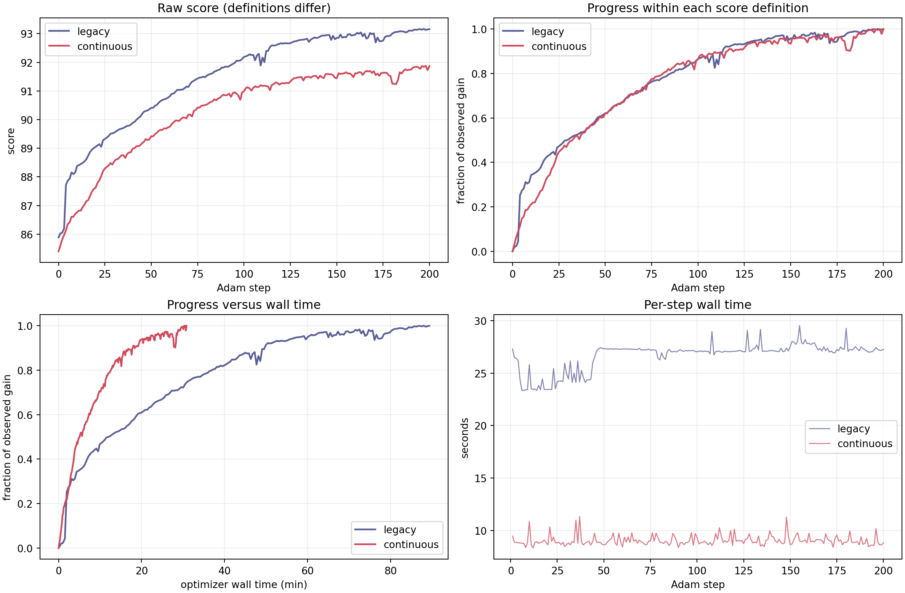

优化单步没有达到单 score 的 5.68 倍，是因为每步还包含两批 FP32 RK4-256 flow 解码、进程调度、轨迹落盘和可能的中心复评。新 score 降到约 1 s 后，这些固定开销占比上升。即便如此，总任务仍从约 89.4 分钟降到 31.0 分钟。

新曲线不是严格单调：负向相邻步有 61 次，旧曲线为 37 次；但新曲线最大单步下降为 0.262，旧曲线为 0.408。第 168 步后的连续回撤在第 198 步恢复并刷新最优。可以说离散 surface 门造成的大跳已经消失，不能说 SPSA 噪声本身已经消失。

### 12.3 同口径物理量

下面的轨迹直接画同名的 QH、QA、QP 和最小 $|\iota|$ 诊断，不比较不同定义的总 score。新轨迹最终 QH 误差低于旧轨迹，$|\iota|$ 始终远离 0；QA、QP 略高，反映优化确实在增强目标 QH 相对优势，而不是退化成低旋转变换的大圆线圈。

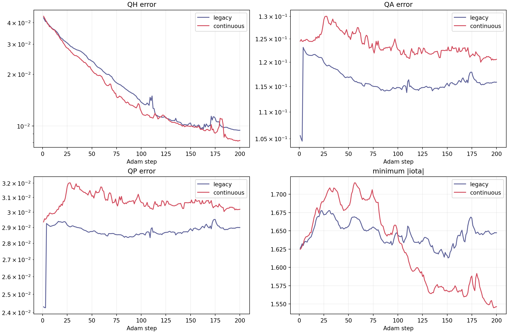

更严格的判断来自 job `32815` 的交叉复评。它不重新解码 latent，直接把两份固定线圈系数送入同一个 ABI-10 二进制，只切换旧/新 surface 模式。

| 固定线圈 | 旧 score | 新 score | 旧口径 QH error/helicity | 旧口径逆纵横比 | 旧口径 $\iota_{\min}$ |
|---|---:|---:|---:|---:|---:|
| 旧 job 31058 最优 | 93.1656 | 91.5188 | 0.0023003 | 0.02967 | 1.6463 |
| 新 job 32804 最优 | **93.3829** | **91.8742** | **0.0019044** | **0.02997** | 1.5446 |

两种 score 都把新最优排在旧最优之前。更重要的是，新最优在旧的 16 周期路径中仍为 `ok`，旧口径 QH 误差下降约 17.2%，物理磁面尺寸没有缩小。新连续路径还给出 $s_{\rm edge}=0.401$、逆纵横比 0.03169；旧最优对应 0.399 和 0.03131。由此可以排除“优化器只学会抬高新 surface 分量、但旧物理评价变差”这一作弊解释。

记录在优化轨迹中的严格续接分数与独立全局复评相差约 $6.1\times10^{-4}$ 分；对应轴位置只相差约 $10^{-9}$ m，QH error 差约 $7\times10^{-11}$。这是局部/全局固定点细化的数值路径差异，不影响上述排序或物理结论。

### 12.4 最终结论与边界

本轮目标已经达到：

1. 对已建立中心的优化评分，中位时间从约 5.6 s 降到 1.0 s；完整四方向 Adam 每步从 26.7 s 降到 9.1 s。
2. 未参与公式选择的 holdout 上，旧 score $\ge90$ 的排序 Spearman 为 0.939，top 10% 完全重合。
3. 新方法恢复了一批被旧 16 周期硬阈值压成低分的边界样本，但没有让它们进入 90 分以上极高分尾部。
4. 同起点优化不仅稳定完成，而且新最优在线圈不变的旧完整 score 下超过旧最优，QH 误差更低、磁面不更小。

因此，`p1/t128/k400 + 6 次磁通二分 + 加权单调置信度 + 严格轴续接` 可以作为后续局部 score 优化的生产候选。独立随机样本仍应使用全局轴入口；完整候选验收仍走保留的长追踪、LS/Newton、Poincare 和 DESC 支线。

新最优随后已经补做完整 alpha+$\nu$、LS/Newton、Poincare 和 DESC 验收，结果见第 13 节。当前优化器的剩余性能瓶颈是每个 score 约 0.44 s 的 $\psi$ 阶段和每步约 4.7 s 的两批 flow 解码；surface 与磁轴已不再是局部优化的主瓶颈，精确时间分解见第 14 节。

## 13. 新优化最优点的完整物理评估

本节补做标准完整评估。输入被冻结为 job `32804` 在第 198 步保存的 `best.json`，文件 SHA-256 为 `1b1d7892498a2e67f646c3bba62ab6e81e696e378315bdd29749c55a7c5ccef7`。本节没有重新解码 latent，避免 flow 数值差异改变被评估对象。

### 13.1 score 与完整评估不是同一个计算

固定线圈在独立全局复评分中的连续 score 为 91.87425；优化器当时记录的是 91.87486，两者相差 $6.1\times10^{-4}$ 分。该差异来自局部磁轴续接与独立全局磁轴细化的浮点路径，不影响结论。独立复评分的七个分量如下。

| 分量 | 分数 |
|---|---:|
| 磁轴 | 97.06895 |
| $\psi$ | 98.66117 |
| 连续磁面 | 82.24244 |
| 坐标 | 89.73324 |
| 体 QH | 94.90056 |
| $\iota$ | 100.00000 |
| 线圈工程 | 65.56791 |

score 主线给出的体平均微分误差为 QH/helicity $=1.98166\times10^{-3}$，同时 QA $=1.20562\times10^{-1}$、QP/helicity $=3.01850\times10^{-2}$。下面完整评估中的面 QS 是在最终单个 Boozer 面上用另一套定义计算的，不能直接拿绝对数值和体微分误差相减。

### 13.2 从样本专属 $\psi$ 到最大通过面

完整评估沿用固定入口 `evaluation/full_physical/` 的旧标准路线：样本专属 $\psi$ 拟合，GPU FP32 的 $\alpha+\nu$ 初值，受保护的诊断，再进入 Simsopt 的标准 LS/Newton，最后选择最大通过面并运行 Poincare、可视化和 CPU DESC。没有启用旧 Cartesian 点云路径，也没有把可在 GPU 上批量完成的步骤回退到 CPU。

首先并行拟合四个物理半径。四个拟合都在 $s=0.49$ 的便宜追踪筛选中通过，并在 $s=0.64$ 失败。选择 $a=0.08$ 不是因为它的拟合残差最小，而是因为它给出最大的实际覆盖半径，同时误差仍然很小；这里的 $a$ 是这个样本的结果，不是以后样本的固定默认值。

| $a$ | $\psi$ 训练 RMS | 验证 RMS | 验证角度 P95 | $s=0.49$ 平均/最大半径 | 单作业时间 |
|---:|---:|---:|---:|---:|---:|
| 0.04 | $3.729\times10^{-4}$ | $3.774\times10^{-4}$ | $2.669\times10^{-5}$ | 0.02823/0.03436 m | 12.40 s |
| 0.05 | $3.762\times10^{-4}$ | $3.809\times10^{-4}$ | $3.354\times10^{-5}$ | 0.03531/0.04297 m | 9.02 s |
| 0.06 | $3.830\times10^{-4}$ | $3.880\times10^{-4}$ | $4.079\times10^{-5}$ | 0.04243/0.05162 m | 9.00 s |
| 0.08 | $4.192\times10^{-4}$ | $4.288\times10^{-4}$ | $5.739\times10^{-5}$ | **0.05688/0.06920 m** | 9.01 s |

随后四个候选面也并行运行。$s=0.24,0.36,0.49$ 都在同一分支上通过标准 LS/Newton，体积单调增大；$s=0.64$ 在固定采样预算下只获得 176,583 个有效点，少于规定的 180,000 个，因此在 $\alpha$ 前停止。选择器已经修正为把这种“在标准求解前正常停止”的候选记作外层失败，不能再错误地报告为“上界仍开放”。

| $s$ | $|V|$ [$\mathrm{m}^3$] | $\iota$ | 稠密相对 $L_2$ | 法向误差 P95 | 面 QA | 面 QH | 面 QP |
|---:|---:|---:|---:|---:|---:|---:|---:|
| 0.24 | 0.03143 | 1.56768 | $1.801\times10^{-5}$ | $2.892\times10^{-5}$ | $2.433\times10^{-3}$ | $1.617\times10^{-6}$ | $2.456\times10^{-3}$ |
| 0.36 | 0.04786 | 1.57366 | $2.048\times10^{-5}$ | $3.315\times10^{-5}$ | $3.706\times10^{-3}$ | $2.675\times10^{-6}$ | $3.741\times10^{-3}$ |
| **0.49** | **0.06518** | **1.58013** | **$2.348\times10^{-5}$** | **$3.767\times10^{-5}$** | **$5.051\times10^{-3}$** | **$4.555\times10^{-6}$** | **$5.099\times10^{-3}$** |
| 0.64 | 未进入标准求解 | - | - | - | - | - | - |

最大面 $s=0.49$ 的 $\alpha$ 阶段使用 `gpu-ray` 均匀采样，候选有效率为 92.11%，最终固定使用 180,000 点；场评估、通量标定以及 $\alpha$ 设计矩阵/QR 都是 GPU FP32。$\alpha$ 总耗时 113.78 s，其中体采样 68.34 s、通量标定 0.58 s、一次批量场采样 0.003 s。$\nu$ 阶段总耗时 82.32 s；$\rho=1$ 的 $\nu$ 线性拟合使用 312 个模，拟合相对误差为 $5.84\times10^{-3}$，映射 Jacobian 范围为 $[0.616,1.338]$，没有坐标不可逆点。$\alpha+\nu$ 给标准求解的外层初值相对残差为 $1.467\times10^{-2}$；标准 LS 用 5.90 s 把稠密相对残差降到 $2.348\times10^{-5}$，随后的 Newton 只用 0.18 s 且在第 0 次迭代即满足要求。

### 13.3 磁面、Poincare 与直接 $|B|$

最大通过面的直接 $|B|$ 范围为 $0.66590$--$0.82974\ \mathrm{T}$。图采用约定的白底彩色等高线，而不是热力图。条纹沿 QH 方向近似平直，细小弯曲仍可见，与面 QH 为小量但非零一致。

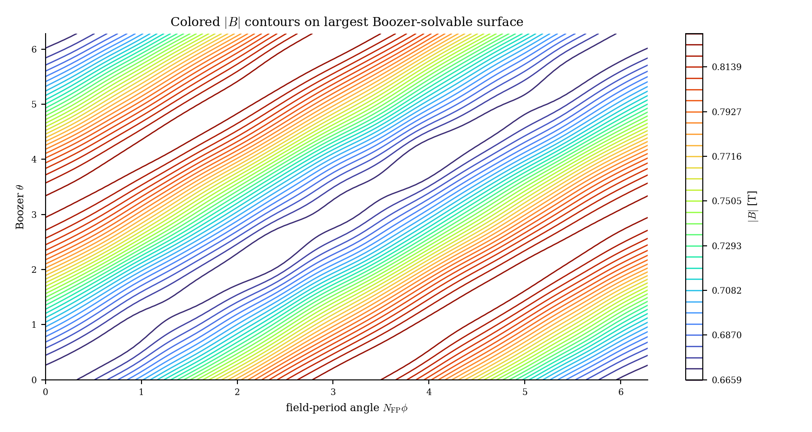

[交互式 $|B|$ 图](assets/qh_score_fast_continuation_20260805/adam_start10_200_32804/full_evaluation/full/assets/boozer_b.html)

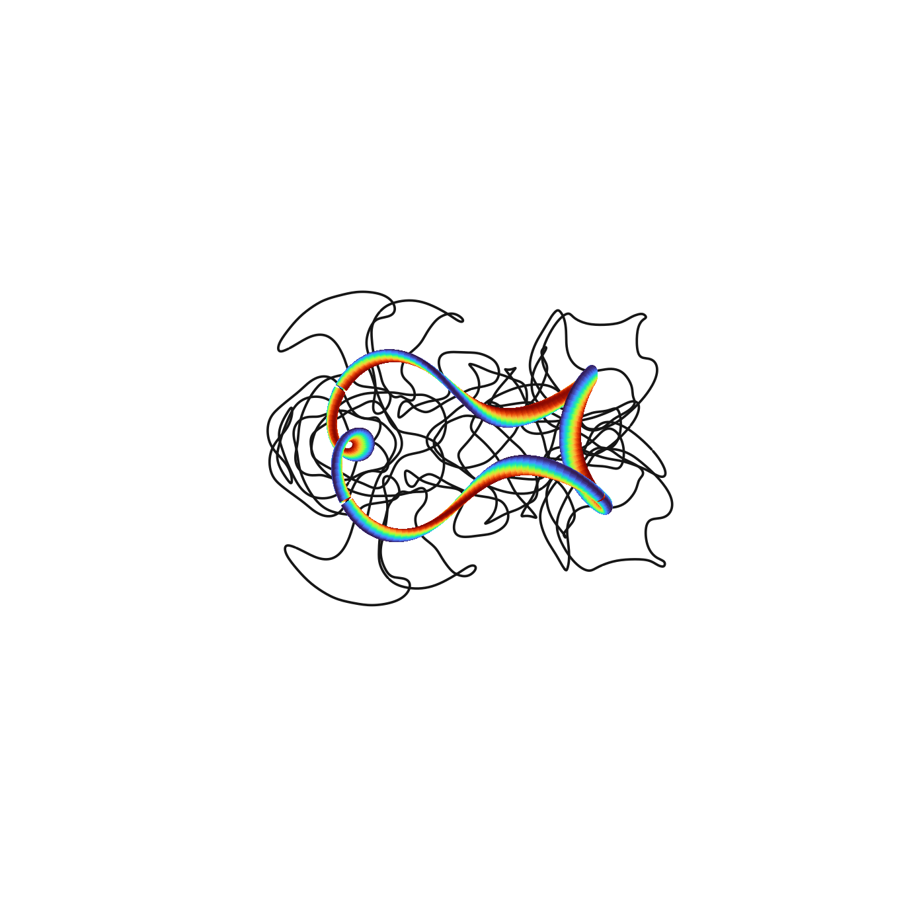

[完整三维线圈与磁面 HTML](assets/qh_score_fast_continuation_20260805/adam_start10_200_32804/full_evaluation/full/assets/coils_surface.html)

Poincare 使用八条位于候选边界内部的种子；四个截面的命中数均为 27--29，散点形成嵌套闭合层并留在黑色候选边界内，没有出现分支跳转或自交证据。

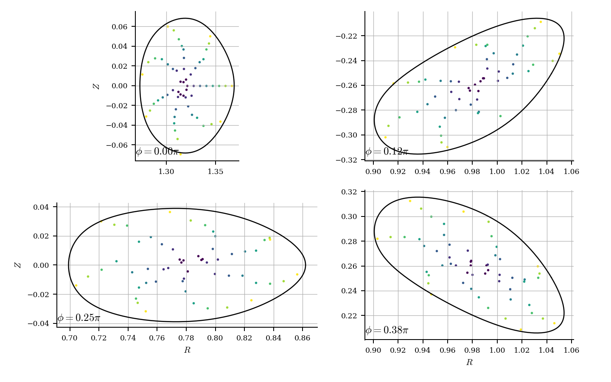

### 13.4 DESC 检查

DESC 使用实际 Biot--Savart 场计算出的环向磁通 $-5.20932\times10^{-3}\ \mathrm{Wb}$，边界阶数为 `MPOL=12, NTOR=12`，显式走 CPU。初始和平衡后的坐标都通过 nested 检查，边界固定不变。

| DESC 指标 | 初始 | 50 次迭代后 |
|---|---:|---:|
| 归一化力残差均值 | 1.08013 | $1.789\times10^{-3}$ |
| 归一化力残差 P95 | 2.02000 | $3.871\times10^{-3}$ |
| 归一化力残差最大值 | 6.00739 | $1.552\times10^{-2}$ |
| nested | true | true |

求解耗时 148.03 s，代价降到 $1.625\times10^{-3}$，最优性为 $1.643\times10^{-4}$。但优化器在默认 50 次迭代上限停止，返回 `success=false`；因此准确结论是“边界可保持嵌套，力残差降低约三数量级并进入小量”，不是“DESC 已按优化器判据严格收敛”。下列 8 张标准 DESC 图均生成成功。

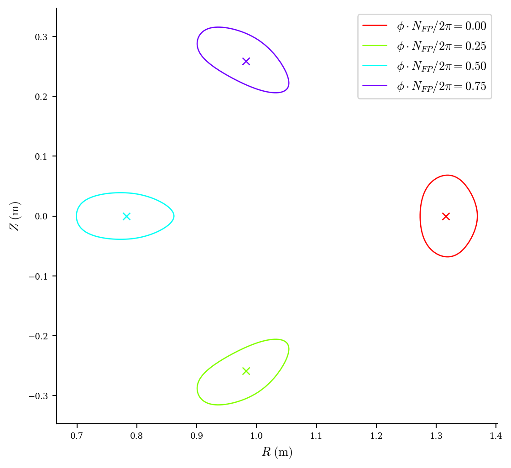

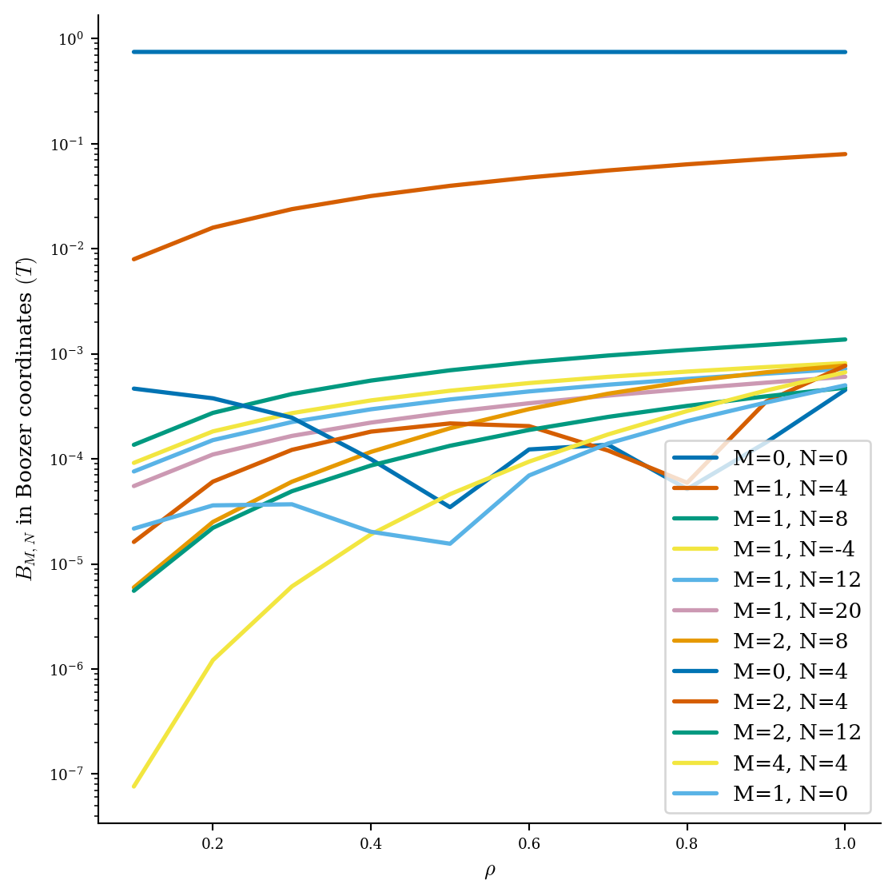

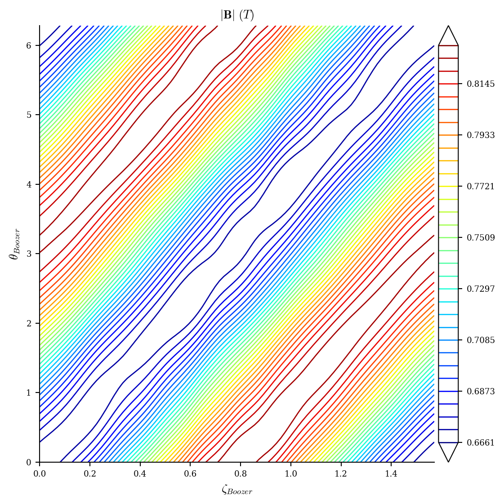

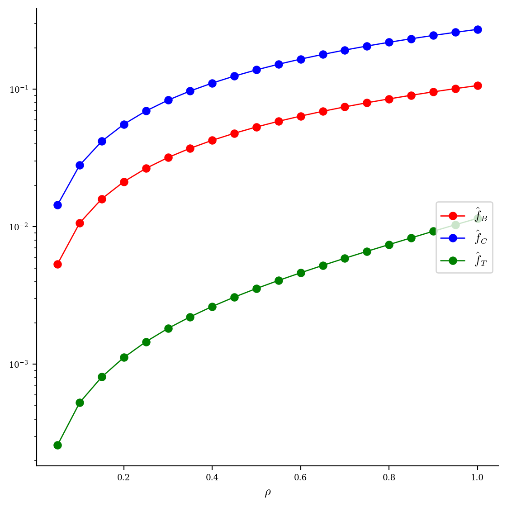

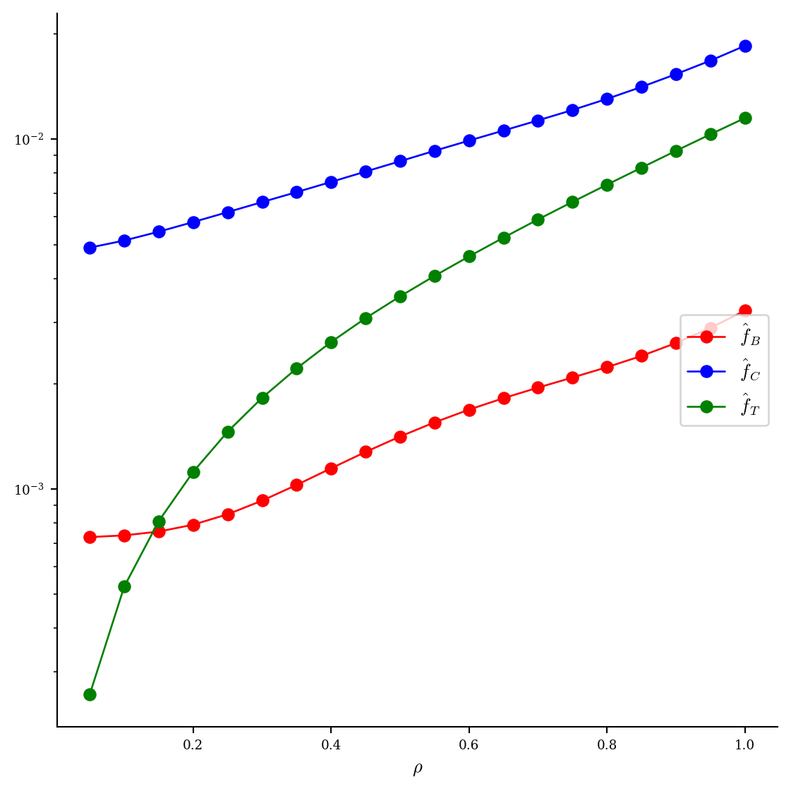

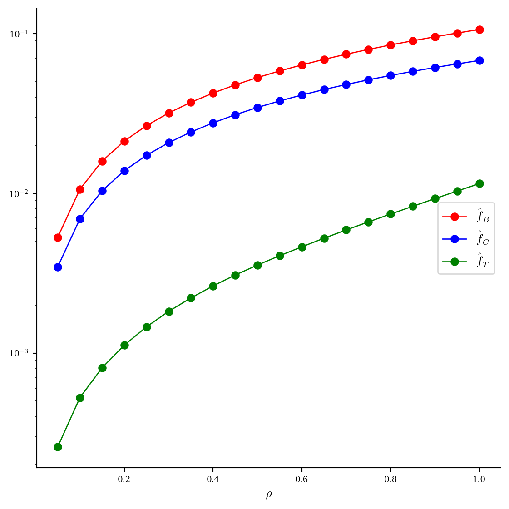

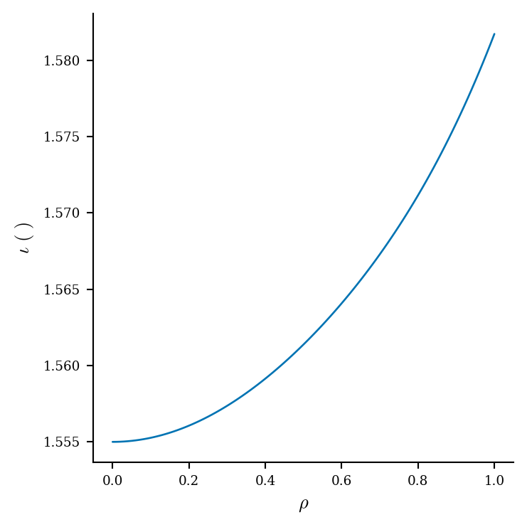

[DESC 输入](assets/qh_score_fast_continuation_20260805/adam_start10_200_32804/full_evaluation/full/desc/input.check_desc)；[DESC 平衡文件](assets/qh_score_fast_continuation_20260805/adam_start10_200_32804/full_evaluation/full/desc/equilibrium.h5)；[完整评估原始摘要](assets/qh_score_fast_continuation_20260805/adam_start10_200_32804/full_evaluation/full/full_summary.json)。

完整下游作业耗时 360.77 s，其中直接可视化 73.97 s、DESC 241.43 s；这是候选验收支线的成本，不属于每次优化 score。综合直接面、Poincare 和 DESC，这个 best 不是连续 surface score 的作弊点：它确实存在较大的嵌套面，面 QH 明显低于 QA/QP，并且能够给 DESC 提供可显著降低力残差的边界。

## 14. 200 步时间口径复核与 flow 批处理检查

### 14.1 `5363.1 s` 到底是什么时间

第 12 节的 `5363.1 s` 是旧 job `31058` 从优化器启动到写完摘要的**四卡作业墙钟时间**，即 1 h 29 min 23 s。它不是单卡时间，也不是四张卡的累计 GPU 秒。Slurm 记录的作业 elapsed 为 1 h 29 min 37 s，二者相差约 14 s，来自 Python 启动、环境初始化和 Slurm 收尾。因此“原版四卡花了一个小时出头”在量级上没有矛盾；更准确的说法是接近一个半小时。新版 job `32804` 同样是四卡作业，内部墙钟为 31 min 03 s。

下表从 200 条逐步日志重新求和，各项互不重叠。

| 200 步墙钟分解 | 旧 score | 新连续 score | 加速比 |
|---|---:|---:|---:|
| 8 个扰动端点的 flow 解码 | 505.35 s | 491.71 s | 1.03 倍 |
| 中心/提议点的 flow 解码 | 464.91 s | 455.98 s | 1.02 倍 |
| **flow 合计** | **970.26 s** | **947.70 s** | **1.02 倍** |
| 8 个扰动端点的原生 score | 2976.76 s | 583.26 s | 5.10 倍 |
| 中心/提议点的原生 score | 1382.61 s | 276.19 s | 5.01 倍 |
| **原生 score 合计** | **4359.38 s** | **859.45 s** | **5.07 倍** |
| 日志/簿记 | 1.29 s | 4.50 s | - |
| 启动与收尾 | 32.15 s | 50.94 s | - |
| **总墙钟** | **5363.07 s** | **1862.59 s** | **2.88 倍** |

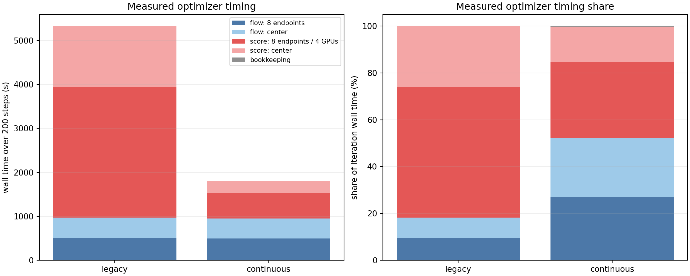

这个结果可以直接写成

$$
T_{\mathrm{old}}=970.26+4359.38+33.44=5363.07\ \mathrm{s},
$$

$$
T_{\mathrm{new}}=947.70+859.45+55.44=1862.59\ \mathrm{s}.
$$

旧版中原生 score 占逐步计算时间的 81.78%，flow 占 18.20%；新版中两者变成 47.44% 和 52.31%。所以“单次 score 快 5.07 倍、整段优化只快 2.88 倍”完全由实测时间解释，不需要用笼统的“还有固定开销”来猜。此前第 12.2 节只有定性解释而没有给 flow 占比，证据不充分，本节数据取代那段解释。

### 14.2 flow 是否真的整批运行

是。每一步先把 4 个正方向和 4 个负方向拼成形状为 `(8, 3, 100)` 的 FP32 数组，然后只调用一次 `decode_noise_rk4`。RK4-256 的每一个子步都让模型同时处理这 8 个样本；不存在 Python 循环逐个解码 8 次。解码完成后，8 个结果才交给四个常驻原生 score worker，每张卡处理两个 score。

实测批处理证据如下。

| 指标 | 旧 job | 新 job |
|---|---:|---:|
| batch=8 的平均 flow 墙钟 | 2.5268 s | 2.4586 s |
| batch=8 的均摊单样本时间 | 0.3158 s | 0.3073 s |
| batch=1 的中心解码时间 | 2.3245 s | 2.2799 s |
| batch=8 相对 batch=1 的单样本吞吐提升 | 7.36 倍 | 7.42 倍 |
| batch=8 吞吐 | 3.17 样本/s | 3.25 样本/s |
| 四卡 score 并行效率 | 96.56% | 95.39% |

也就是说，flow 虽然只驻留在一张 GPU 上，但 batch=8 的墙钟只比 batch=1 多约 0.18 s，已经获得接近理想的批量吞吐；把这 8 个小样本拆到四张卡会复制模型和 kernel launch，目前没有数据表明会更快。四张卡真正需要并行的原生 score 已达到约 95%--97% 的并行效率。

当前实现每步还有第二次 batch=1 中心解码。本步的 8 个端点和由它们决定的新中心确实不能事先放进同一批，因为新中心位置依赖端点 score 得到的 SPSA 梯度、Adam 更新以及可行性回退；但这不等于两次 flow 永远不能合并。可以做跨迭代流水：端点 score 得到提议中心 $z_{k+1}$ 后，立刻抽取下一步方向 $d_{k+1}$，把

$$
\left\{z_{k+1},z_{k+1}\pm h d_{k+1,1},\ldots,
z_{k+1}\pm h d_{k+1,4}\right\}
$$

组成 batch=9 一次解码。随后先评分中心；中心通过后，再使用该中心新得到的磁轴 hint 评分已经解码好的 8 个端点。这样能保持现有严格磁轴续接语义，同时把下一步的端点 flow 提前完成。若中心无效并触发回退，围绕错误提议中心的 8 个端点必须丢弃，再围绕实际接受的回退中心解码；若本步端点无效导致整步跳过，也不能复用预取方向。因此这是正常步骤上的确定性收益，而不是所有步骤都无条件省一次解码。job `32804` 只有 2 次完整中心提议需要回退、4 次端点分支失败，绝大多数步骤都可使用该流水。

按现有实测，batch=8 为 2.46 s、batch=1 为 2.28 s，batch=9 预计仍接近 2.5 s；正常步骤可从约 4.74 s 的两批 flow 降到约 2.5 s。这个估计还需要实际 benchmark，因为 FP32 GEMM 在 batch=1、8、9 时可能选用不同 kernel，必须核对同一 latent 的物理系数、score 和状态没有不可接受的变化。之前“依赖关系使两批不能合并”的表述过强，本段是修正后的结论。

### 14.3 RK4 步数能否降低

当前 job `32804` 使用的是 **FP32 RK4-256**。每个 RK4 步要调用速度场网络 4 次，因此单条离散 flow 一共执行 1024 次网络前向；步数是当前 flow 延迟近似线性增长的根源。

此前同步长正反重建实验已经给出可用证据。以真实优化探针尺度为参照，RK4-64 的最坏潜空间闭环误差占探针 RMS 的 1.51%，线圈曲线闭环误差占实际探针位移的 0.214%；RK4-128 分别为 0.327% 和 0.0566%。RK4-32 则高达 92.5% 和 14.0%，不应使用。因此：

1. 新开的、自始至终保持同一步数的 score 优化，优先试 **RK4-64**；它已有足够的自洽精度证据，而且最终每个物理线圈仍由真实 CUDA score 验收。
2. 从物理样本反追踪 latent，或希望更保守地保持正反闭环时，使用 **RK4-128**。
3. RK4-256 只在复现现有 artifact、继续现有 RK4-256 latent 轨迹或研究离散误差时保留。
4. 不能把当前保存的 RK4-256 latent 直接切到 RK4-64 后声称是原轨迹续跑，因为 $F_{64}$ 和 $F_{256}$ 是不同离散映射；若切换，必须把它当作新任务重新记录初始物理线圈和初始 score。

若耗时近似按步数缩放，只把 256 降到 64、仍保留两批 flow，200 步墙钟预计从 31 分钟降到约 19 分钟；再结合上述 batch=9 流水，预计约 17--18 分钟。它们是依据现有分解得到的预算，不是实测交付值。下一轮实现时应分别做“仅流水、仅 RK4-64、两者同时”的同种子 A/B，并把回退步骤的额外解码单独计时。

### 14.4 能否复用中心 score 做单边差分

可以，而且它比单纯把双边方向数从 4 减到 2 更值得优先验证。当前中心在上一步被接受时已经完成真实 score 评估，下一步没有必要为了构造差分再次评分中心。对第 $i$ 个正交随机方向 $d_i$，显式抽取随机符号 $\sigma_i\in\{-1,+1\}$，只计算一个端点

$$
x_i=x+\sigma_i h d_i,
$$

然后使用

$$
\widehat{g}
=\frac{1}{K}\sum_{i=1}^{K}
\frac{f(x+\sigma_i h d_i)-f(x)}{\sigma_i h}d_i.
$$

这里应保留 $K=4$，因此每步从 8 个端点评分降为 4 个，但仍然得到 4 个独立方向上的斜率。显式随机符号很重要：单边 Taylor 展开为

$$
\frac{f(x+\sigma h d)-f(x)}{\sigma h}
=\nabla f(x)^T d+\sigma\frac{h}{2}d^T H(x)d+O(h^2).
$$

与中心差分的 $O(h^2)$ 截断误差相比，单边差分每一步多出 $O(h)$ 的曲率污染；随机改变 $\sigma$ 可使该项跨方向和跨迭代不形成固定偏置。它不能消除单次估计的误差，但本任务只要求相关的搜索方向，而且每次更新后的中心仍会由真实 score 检查可行性、记录结果并维护 running best，所以增加方向覆盖可能比提高每个方向的局部精度更有价值。这里不能误解成现有优化器有单调 score 接受门：有效但降分的新中心仍可能成为当前状态。连续磁面 score 已去掉主要的离散跳变，也提高了这个方案成功的可能性。仍然存在的磁轴分支、可行性状态边界和较大曲率区域，决定了它不能只靠理论直接替换，必须做实测。

中心 score 的复用还有一个接口条件：基准 $f(x)$ 必须是当前 score 定义下、当前磁轴分支上的已接受结果；4 个端点则使用该中心返回的 axis hint。已有重复评分达到约 $10^{-13}$ 的一致性，说明普通数值噪声不是主要问题，但实现前仍应在若干优化阶段核对“旧的已接受中心结果”和“用自身 hint 重评中心”的状态及分数一致。

按 job `32804` 的计时，8 个端点的 score 墙钟为 583.26 s，占 200 步迭代墙钟的 32.2%。改成 4 个端点后，这一部分预计接近减半；但 batch=4 的 flow、中心 flow 和中心 score 不会随端点数减半，所以仅改单边差分时，总时间预计只从约 31 分钟降到约 26 分钟，而不是降到 15 分钟。若同时使用 batch=5 的跨迭代流水和 RK4-64，预算可进一步接近 12--13 分钟；这些仍是计时分解，不是实测结果。

最小验证不应直接长跑。先在同一批早期、中期和高分中心上一次性计算中心及双边端点，再离线比较三种估计：4 方向中心差分、4 方向随机符号单边差分、2 方向中心差分。在相同 4 端点预算下，比较它们与高成本参考方向的夹角，以及沿建议更新做固定小步后的真实 score 增量。只有 4 方向单边在多数阶段稳定优于 2 方向中心差分，才进入同起点优化 A/B；最终比较横轴应同时使用真实 score 调用数和墙钟，而不只看迭代步数。若它偶发失稳，再考虑低频中心差分校准，而不是一开始混入复杂策略。

## 15. 流水线、RK4 步数和差分方式的 200 步矩阵验收

### 15.1 实验到底比较了什么

本轮固定使用 job `32804` 的同一起点、随机种子 `20260804`、扰动尺度 $h=0.005$、Adam 学习率 $0.01$、$(\beta_1,\beta_2)=(0.5,0.999)$、连续磁面 score、严格磁轴续接和相同安全门，只改变两个量：flow 的 RK4 步数，以及有限差分的端点布置。三个端点布置分别是：

- **中心 4 方向**：4 个正交方向各算正负两个端点，每步通常需要 8 次端点评分。
- **单边 4 方向**：4 个正交方向各随机选择正端或负端，并复用已知中心分数，每步通常需要 4 次端点评分。
- **中心 2 方向**：2 个正交方向各算正负两个端点，每步通常也需要 4 次端点评分。

三种 RK4 步数为 256、128 和 64，共形成 9 个 200 步作业。每个作业独占一张 RTX 5090，六张卡并行跑不同作业；因此下表的单条耗时都是**单卡墙钟**，不能把它误写成四卡作业的单卡耗时。所有作业均启用跨迭代流水：正常情况下，一次 flow 同时解码新中心和下一步端点，中心通过后直接复用端点解码结果。

代码和 9 份 manifest 均明确记录 `gradient_source=score_finite_differences_only`。本轮没有调用 autograd/backward、flow VJP、评分器梯度或先前 G1--G4 黑箱梯度通路。

### 15.2 完整性和退出状态

9 个作业均写出 `status=ok`、`stop_reason=completed_iterations`，每个都有 200 条逐步记录。每条轨迹有 199 次流水线缓存命中，即除第一步外，后续每步都真正复用了前一步预取结果；因回退或跳步而浪费的预取端点为 0--8 个。远端队列已经清空，用户进程列表中没有优化器或评分器，9 份 GPU postflight 都是 0% 利用率、2 MiB 占用，因此没有遗留计算进程或占卡。

4 个作业 stderr 为空；另外 5 个作业在 Python 主程序已经正常写完结果后，出现 `multiprocessing` 清理 POSIX semaphore 时的 `FileNotFoundError`/`resource_tracker` 告警。日志中没有 CUDA、OOM、评分器或优化器异常，结果长度和 postflight 也正常，所以这些告警不使数值结果失效；但它说明 Python 多进程队列的退出清理还不是干净的，不能把本轮描述成“所有 stderr 均为空”。原始 stderr 已随验收资产冻结。

### 15.3 九条轨迹的结果

| RK4 步数 | 差分方式 | 初始分 | 最优分 | 增益 | 最优步 | 总墙钟 | 平均每步 | P95 每步 |
|---:|---|---:|---:|---:|---:|---:|---:|---:|
| 256 | 中心 4 方向 | 85.3999 | **91.9572** | 6.5573 | 199 | 50.43 min | 14.918 s | 15.754 s |
| 128 | 中心 4 方向 | 85.5016 | 91.8727 | 6.3711 | 198 | 45.66 min | 13.552 s | 14.139 s |
| 64 | 中心 4 方向 | 85.3531 | 91.5987 | 6.2456 | 199 | 44.29 min | 13.080 s | 13.684 s |
| 256 | 单边 4 方向 | 85.3999 | 90.7862 | 5.3863 | 191 | 31.10 min | 9.147 s | 9.713 s |
| 128 | 单边 4 方向 | 85.5016 | 91.0149 | 5.5133 | 200 | 27.64 min | 8.083 s | 8.842 s |
| 64 | 单边 4 方向 | 85.3531 | 90.5370 | 5.1840 | 198 | 25.49 min | 7.512 s | 7.854 s |
| 256 | 中心 2 方向 | 85.3999 | 91.6548 | 6.2549 | 198 | 30.70 min | 9.078 s | 9.499 s |
| 128 | 中心 2 方向 | 85.5016 | **91.7463** | 6.2447 | 200 | 27.63 min | 8.067 s | 8.607 s |
| 64 | 中心 2 方向 | 85.3531 | 91.4682 | 6.1151 | 199 | **25.34 min** | **7.444 s** | 8.056 s |

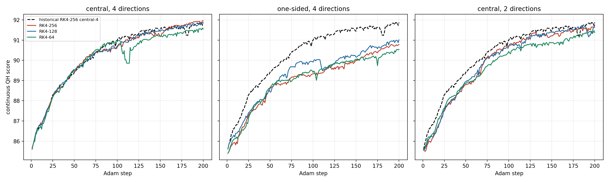

图中的黑色虚线是未做流水线的历史 job `32804`。三个面板使用相同纵轴，所以可以直接看出：中心 4 方向和中心 2 方向都保持了原先的主要上升过程；单边 4 方向虽然也稳定上升，但在大约第 50 步后系统性落后，而不是只在个别毛刺处变差。

### 15.4 流水线是否真的省掉了第二次 flow

最直接的对照是历史 job `32804` 与本轮 RK4-256/中心 4 方向。二者初始分完全相同，历史两批 flow 的 200 步累计耗时为 947.70 s，流水线版本为 498.12 s：

$$
\frac{947.70}{498.12}=1.90,
$$

也就是 flow 墙钟减少 47.4%。这与设计目标吻合：绝大多数步骤从“端点 batch 加中心 batch”变成一次 batch=9 解码。流水线版本 199 次命中缓存，只在一次无效端点导致跳步时浪费了 8 个预取端点。

流水线在精确算术中只是调度变化，但 FP32 网络对 batch=1 和 batch=9 会选用不同形状的 GEMM，中心解码不能保证逐位相同；这种微小差异会被 200 步迭代逐渐放大。因此验收标准应是优化行为一致，而不是每一步逐位复现。实际 score 曲线与历史曲线的 Pearson 相关系数为 0.9933，逐步 RMSE 为 0.1866 分，最大差为 0.5532 分；历史/流水线最优分分别为 91.8749/91.9572。它保持了同一个高分盆地和最终质量，没有发现流水线引入系统性退化。

本轮 RK4-256/中心 4 方向总墙钟反而是 3025.62 s，而历史四卡作业是 1862.59 s，不是流水线变慢。原因是本轮每个矩阵作业只分配一张 score GPU：原生 score 累计耗时为 2483.99 s；历史作业使用四张 score GPU，该部分只有 859.45 s。矩阵采用一作业一卡是为了让 6 个配置同时运行，不能用这两个总墙钟直接衡量流水线本身。

### 15.5 RK4 步数能降到多少

flow 耗时基本按 RK4 步数缩放。以中心 4 方向为例，256/128/64 步分别耗时 498.12/244.21/126.88 s；以中心 2 方向为例则为 443.86/234.13/121.72 s。说明降低 RK4 步数确实减少了网络前向，没有被 Python 调度抵消。三档使用的是同一个初始 latent，但不同离散 flow 映射解码出的初始线圈略有差别，所以表中的初始 score 相差约 0.15 分；这不是换了随机起点。

数值上，RK4-128 与 RK4-256 很接近。中心 4 方向的两条曲线相关系数为 0.9979，最优分只低 0.0844；中心 2 方向相关系数为 0.9973，最优分反而高 0.0916。RK4-64 仍保留整体上升形状，但中心 4 方向在约第 110 步出现一次明显回撤，曲线相关系数降到 0.9843，最优分比 RK4-256 低 0.3585。中心 2 方向的 RK4-64 更稳定，相关系数为 0.9965，最优分低 0.1866。

所以“64、128、256 几乎不影响优化”只在总体趋势层面成立，不能解释成逐条轨迹等价。**RK4-128 是目前证据更充分的稳妥默认值；RK4-64 是可以使用的极速候选，但不应声称完全无精度代价。**最终候选进入完整物理评估时仍应使用高精度固定链路重新解码和评分。

### 15.6 单边 4 方向没有通过替换验收

单边 4 方向和中心 2 方向每步都使用 4 个端点，所以它们是最公平的质量/成本比较。三个 RK4 步数下，中心 2 方向的最优分分别比单边 4 方向高 0.8685、0.7314 和 0.9311 分，而总耗时几乎一样。最快的也不是预期中的 RK4-64/单边 4 方向：它耗时 1529.27 s，RK4-64/中心 2 方向耗时 1520.27 s；9 s 差异没有实际意义，但后者最优分高 0.9311。

这说明在当前扰动尺度和盆地内，单边差分的 $O(h)$ 曲率偏差比“多覆盖两个方向”的收益更大。它可以保留为实验接口，但**不能替换正式优化器中的中心差分**。

中心 4 方向相对中心 2 方向仍有收益，但收益远小于评分次数翻倍：三个 RK4 步数下最优分分别高 0.3024、0.1264 和 0.1305。若目标是单次尽量摸高，可以保留中心 4 方向；若目标是单位 GPU 时间的搜索效率，中心 2 方向更合适。

### 15.7 真实墙钟下的推荐

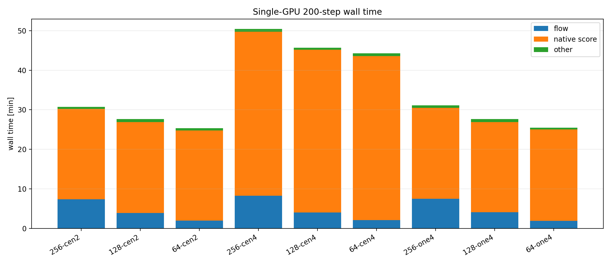

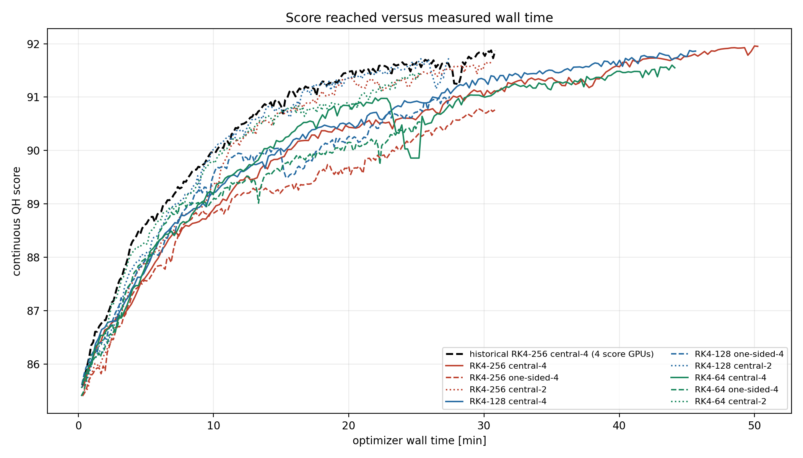

在 RK4-64/中心 2 方向中，flow 只占 121.72 s，原生 score 占 1365.37 s，已经重新变成主要瓶颈。它用一张 GPU 在 25.34 min 内达到 91.4682；历史 job `32804` 用四张 GPU 在 31.04 min 内达到 91.8749。RK4-128/中心 2 方向则用 27.63 min 达到 91.7463，是当前最合理的质量/速度折中。

本轮单种子验收支持以下决策：

1. **接受跨迭代 flow 流水线。**它把同配置 flow 耗时近乎减半，并保持历史优化结果。
2. **拒绝单边 4 方向作为默认方法。**它与中心 2 方向成本相同，但三个 RK4 档位都明显更差。
3. **推荐 RK4-128 + 中心 2 方向用于常规多起点搜索。**若只追求最快吞吐，可用 RK4-64 + 中心 2 方向；若单个起点需要尽量摸高，则用 RK4-128/256 + 中心 4 方向。
4. 本轮只有一个固定起点，因此它足以淘汰明显较差的单边方案并验证流水线，但还不足以把 RK4-128/中心 2 方向宣布为跨分布最终最优。下一次真正需要改生产默认值时，应在少量不同起点上复核，而不需要再跑完整 9 组矩阵。

原始 manifest、200 步 `history.jsonl`、best、GPU 前后状态、stderr 和分析表均保存在 [验收资产目录](assets/qh_score_fast_optimizer_matrix_20260806/)。

## 16. 600 步 Adam 一阶动量扫参验收

### 16.1 实验比较的是什么

本轮固定使用上一节选出的常规配置：FP32 RK4-128、跨迭代 flow 流水线、2 个正交随机方向的中心差分、连续磁面 score 和严格磁轴续接。三组实验使用同一个 latent 起点、随机种子 `20260804`、学习率 $\eta=0.01$、扰动尺度 $h=0.005$ 和 $\beta_2=0.999$，唯一改变的是一阶动量 $\beta_1=0.5,0.7,0.9$。每组运行 600 步，并使用两张 RTX 5090 并行计算原生 score。

每个 manifest 都记录了 `gpu_ids=[0,1]`、`flow_steps=128`、`directions=2`、`gradient_estimator=central` 和 `gradient_source=score_finite_differences_only`。因此这里没有混入此前已否定的 flow VJP、评分器梯度或 G1--G4 通路。

第一批 job `33032/33033/33034` 因 Slurm 的 `--export` 把逗号误当成变量分隔符，实际只传入一个 score GPU，已经取消且不进入分析。替代 job `33043` 又因分配到的 GPU 未通过空闲检查而在优化前退出。最终验收的有效作业是 `33042`、`33049` 和 `33044`，对应关系记录在 [accepted_jobs.tsv](assets/qh_score_fast_beta1_long_20260806/accepted_jobs.tsv)；原始提交记录也保留，但不能用其中已经被替代的 job `33043` 代表 $\beta_1=0.7$ 的有效结果。

### 16.2 完整性、分数和耗时

| $\beta_1$ | 实际 Adam 更新数 | 最终分 | 最优分 | 最优步 | 相对起点增益 | 总墙钟 | 平均每步 | P95 每步 |
|---:|---:|---:|---:|---:|---:|---:|---:|---:|
| 0.5 | 585 | 92.0338 | 92.1826 | 595 | 6.6810 | 55.23 min | 5.354 s | 5.811 s |
| **0.7** | **588** | **92.3203** | **92.3826** | **574** | **6.8810** | 55.63 min | 5.400 s | 5.874 s |
| 0.9 | 590 | 92.1876 | 92.3661 | 580 | 6.8645 | 53.92 min | 5.266 s | 5.502 s |

三组都写出了 600 条逐步记录，停止原因为完成预定迭代。$\beta_1=0.5/0.7/0.9$ 分别有 15/12/10 步遇到至少一个非 `ok` 扰动端点，优化器按既有保护规则跳过整步梯度、动量和参数更新；所有 600 个中心仍然有效，没有时间一致性拒绝，也没有无效中心被接受。每组有 599 次流水线缓存命中，说明跨迭代预取在完整长跑中持续生效。

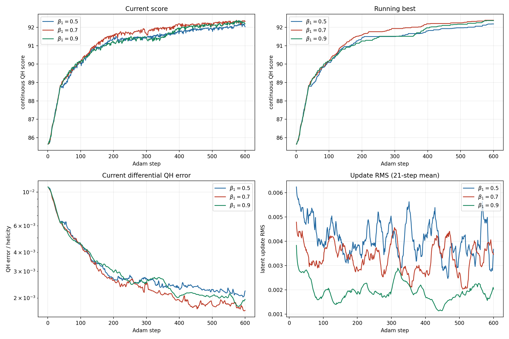

三组前约 100 步非常接近；$\beta_1=0.9$ 在第 100 步的 running best 略高，为 90.1584。从第 200 步开始，$\beta_1=0.7$ 在每个百步检查点都领先，running best 依次为 91.5707、91.9325、92.1901、92.2405 和 92.3826。最终 $\beta_1=0.7$ 比 $\beta_1=0.9$ 只高 0.0166 分，但比 $\beta_1=0.5$ 高 0.2000 分。因此准确结论是：**在这个固定起点和 600 步预算下，$\beta_1=0.7$ 最好；$\beta_1=0.9$ 几乎持平；$\beta_1=0.5$ 稍差。**

### 16.3 提分来自哪里

| $\beta_1$ | axis | psi | surface | coordinate | volume QS | iota | coil | QH error / helicity |
|---:|---:|---:|---:|---:|---:|---:|---:|---:|
| 0.5 | 97.364 | 99.050 | 83.549 | 90.884 | 94.883 | 100.000 | 65.586 | $1.986\times10^{-3}$ |
| **0.7** | 96.910 | **99.111** | 83.142 | **90.843** | **95.557** | 100.000 | 65.602 | $\mathbf{1.674\times10^{-3}}$ |
| 0.9 | 97.130 | 98.929 | 82.687 | 90.598 | 95.490 | 100.000 | **66.573** | $1.711\times10^{-3}$ |

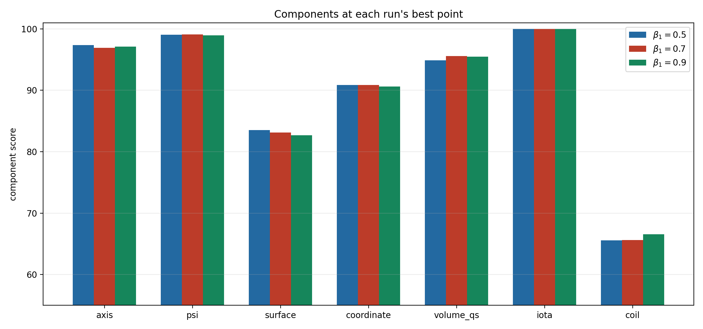

$\beta_1=0.7$ 的优势主要来自三组中最低的微分 QH 误差和最高的 volume-QS 分量，而不是靠牺牲旋转变换取巧；其最小 $\iota$ 为 1.5206，iota 分量满分。$\beta_1=0.9$ 的线圈工程分量高约 0.97 分，但 surface、psi、coordinate 和 QH 略差，综合分因此低 0.0166。$\beta_1=0.5$ 的 surface 分量最好，但 volume-QS 明显低约 0.67 分，最终总分最低。

这里展示的是原生连续 score 的分量，不是完整物理验收。三组最优样本本轮没有再运行 $\alpha+\nu$、LS/Newton 或 DESC，所以不能只凭本节宣布某个样本已经通过完整磁面和 MHD 平衡验收。

### 16.4 600 步是否收敛

不能。三个最优点分别出现在第 595、574 和 580 步，全部位于长跑末段。第 500 到 600 步，running best 仍分别增加 0.2106、0.1422 和 0.1992 分；对最后 100 个当前分数做线性拟合，折算到每 100 步的斜率也仍为正，分别约为 0.247、0.110 和 0.224 分。曲线已经显著变缓，但没有形成足以支持“600 步收敛”的平台。

因此本轮完成的是动量相对比较，不是该起点的最终摸高。若继续同一起点，三组都有进一步增益的可能；已有证据只支持优先继续 $\beta_1=0.7$，不支持宣称它已达到局部极值，也不支持从单个起点推出跨分布最优动量。

### 16.5 时间构成与最终判断

三组累计 flow 墙钟为 673--740 s，原生 score 墙钟为 2474--2494 s。前者约占总墙钟 21%--22%，后者约占 75%--77%；其余是初始化、日志和少量调度开销。也就是说，在 RK4-128、2 方向中心差分和双 score GPU 下，瓶颈已经明确回到原生 score，而不是 flow。平均每步为 5.27--5.40 s，P95 为 5.50--5.87 s，没有发现极端长尾。

本轮验收支持把 **$\beta_1=0.7$ 作为当前固定配置下的优先长跑参数**。不应仅凭 0.0166 分的单种子优势彻底淘汰 $\beta_1=0.9$，但没有证据支持继续把更小的 $\beta_1=0.5$ 作为质量优先选择。

需要注意，这个长跑的方向库大小为 2；上一节 200 步矩阵中的 $\beta_1=0.5$ 对照使用方向库大小 4。二者虽然起点和主要超参数相同，随机方向序列并不相同，因此不能把本节前 200 步误写成上一节轨迹的精确续跑，也不能用逐步差异判断实现回归。

分析脚本、完整 600 步历史、manifest、best、summary、GPU 前后状态和原始 stdout/stderr 均冻结在 [本轮验收资产目录](assets/qh_score_fast_beta1_long_20260806/)。有效 job 结束后，两张 GPU 的 postflight 均为 0% 利用率和 2 MiB 占用，远端队列和用户进程中没有残留优化器或评分器。$\beta_1=0.5$ 的 stderr 只在结果已经完整写出后出现 Python `multiprocessing` 的 semaphore 清理告警；另外两组 stderr 为空。该告警没有伴随 CUDA、数值或评分异常，不使结果失效，但退出清理问题仍被原样保留，不能描述成三组日志全部干净。

## 17. $\beta_1=0.7$ 最高分样本的完整物理评估

### 17.1 样本与验收结论

本节评估上一节三个 600 步长跑中的最高分样本，即 $\beta_1=0.7$ 在第 574 步取得的原生连续 score `92.3826396812`。输入为 [best.json](assets/qh_score_fast_beta1_long_20260806/runs/beta1_0p7/best.json)，SHA-256 为 `929835799be8f5ec0a75500bc9c52b9d9538659db4a93763d1ae0cdab98ecdd1`。该位型是 $N_{\mathrm{fp}}=4$、3 根独立基线圈的 QH 目标。

原生 score 的七个分量如下。这里的体 QH 误差是快速评分器在优化用体采样上的量，不是后文最终磁面上的 QS 误差。

| 分量 | 分数 |
|---|---:|
| 磁轴 | 96.9100 |
| $\psi$ | 99.1108 |
| 连续磁面 | 83.1418 |
| $\alpha,\iota$ 坐标 | 90.8427 |
| 体 QH | 95.5569 |
| $\iota$ | 100.0000 |
| 线圈工程 | 65.6024 |

快速评分器给出的 QH 体误差为 `0.00167432` 每个螺旋周期。完整评估的最终结论是：**这个高分并非只利用快速 score 的漏洞。它确实存在较大的嵌套磁面，标准 LS/Newton 能把该面收敛到 $10^{-5}$ 量级，面上 QH 误差为 $5.88\times10^{-6}$，且 DESC 求解后仍保持嵌套。** 唯一需要保留的限制是 DESC 在默认 50 次迭代上限停止，虽然力残差已经小于物理验收阈值，但优化器没有报告严格收敛。

### 17.2 样本自适应的 $a$ 与磁面选择

完整评估没有复用别的样本的 $a$ 或 $s$。首先独立测试四个源 $\psi$ 拟合半径：

| $a$ / m | $\psi$ 训练 RMS | $\psi$ 验证 RMS | 角度误差 P95 | 单次耗时 / s |
|---:|---:|---:|---:|---:|
| 0.04 | $2.286\times10^{-4}$ | $2.292\times10^{-4}$ | $1.752\times10^{-5}$ | 8.85 |
| 0.05 | $2.433\times10^{-4}$ | $2.445\times10^{-4}$ | $2.391\times10^{-5}$ | 8.85 |
| 0.06 | $2.637\times10^{-4}$ | $2.662\times10^{-4}$ | $3.121\times10^{-5}$ | 8.87 |
| 0.08 | $3.287\times10^{-4}$ | $3.367\times10^{-4}$ | $4.926\times10^{-5}$ | 8.87 |

较小的 $a$ 有更低的局部拟合误差，但覆盖不到同样大的磁面。`a=0.08` 在快速拓扑筛选中可稳定到 $s=0.49$，该面的平均小半径约为 `0.05694 m`，而 $s=0.64$ 首次失败，因此选择 `a=0.08`。这体现的是“在精度仍合格时优先覆盖更大磁面”，不是机械选择 RMS 最低的 $a$。

随后使用同一个 `a=0.08` 模型，并行运行 GPU FP32 $\alpha+\nu$ 和标准 LS/Newton 候选：

| $s$ | 标准 LS/Newton | $|V|$ / $\mathrm{m}^3$ | 结论 |
|---:|---|---:|---|
| 0.24 | 通过 | 0.0316513 | 内层有效面 |
| 0.36 | 通过 | 0.0481805 | 中层有效面 |
| 0.49 | 通过 | 0.0658637 | 选择的最大通过面 |
| 0.64 | 未进入标准求解 | - | 最近外层失败 |

三个通过面的体积严格递增，支持它们属于同一嵌套分支。$s=0.64$ 不是数值迭代长尾：GPU 等面积采样在 `225792` 个候选点中只得到 `176536` 个有效点，低于固定的 `180000` 点预算，因此按固定规则立即停止；没有退回旧的 Cartesian 或 CPU 预处理路径。完整的选择证据见 [selection.json](assets/qh_score_fast_beta1_0p7_best923826_full_eval_20260806/selection.json) 和 [作业验收表](assets/qh_score_fast_beta1_0p7_best923826_full_eval_20260806/accepted_jobs.tsv)。

### 17.3 从 $\psi$ 到标准 Boozer 面

选择的 $s=0.49$ 候选使用 $L=12,M=12,N=16$ 的 $\alpha$ 展开。等面积射线采样生成 `225792` 个候选点，其中 `210514` 个有效，固定取 `120000` 个训练点和 `60000` 个验证点。磁场与磁通评估均为 C++/CUDA FP32，设计矩阵与 QR 为 PyTorch CUDA FP32 `gels`。$\alpha$ 总耗时 `108.18 s`，其中体采样 `62.48 s`、磁通标定 `0.57 s`、训练/验证磁场采样约 `0.003 s`、QR 拟合约 `1.89 s`。坐标可逆性检查中 $1+\partial_\theta\lambda$ 的验证最小值为 `0.3506`，没有不可逆点。

需要说明一个诊断告警：$\alpha$ 标定摘要中的外边界残差使 `quality_ok=false`，所以不能写成所有 $\alpha$ 辅助诊断均通过；但是它没有越过坐标可逆性门槛，且后续独立的标准 LS/Newton 验证通过，因此最终磁面的物理验收不依赖该告警被忽略。

$\nu$ 在 $\rho=0.5,0.8,1$ 三层拟合，总耗时 `90.45 s`。表面提取和磁场评估走 C++/CUDA FP32；小型谱投影和 Simsopt 残差检查保留 CPU。外层 $\rho=1$ 的 $\nu$ 相对拟合误差为 `0.00348`，映射 Jacobian 范围为 `[0.6368,1.3425]`，没有跳过近共振模。经过 $\alpha+\nu$ 后，进入标准求解前的 Simsopt 相对残差为 `0.0120163`。

标准 LS 在 `4.85 s` 内把内部残差范数降到 $3.03\times10^{-13}$；Newton 在初始点即通过，耗时 `0.18 s`。独立的 $97\times97$ 稠密验证得到：

| 指标 | 初始 $\alpha+\nu$ | 标准 LS/Newton 后 |
|---|---:|---:|
| 相对 $L_2$ | 0.0120163 | $1.888\times10^{-5}$ |
| 点残差 P95 | 0.02810 | $3.644\times10^{-5}$ |
| 法向磁场正弦 P95 | 0.007630 | $3.195\times10^{-5}$ |
| $\iota$ | 1.52396 | 1.54967 |

最终面文件为 [boozer_standard.npz](assets/qh_score_fast_beta1_0p7_best923826_full_eval_20260806/candidates/s_0p49/standard_rho_1/boozer_standard.npz)，SHA-256 为 `2a4d9b68df0e04b197fc49a5bac0292d85684e5eeba0c21c35da1ad0c28c063f`。

### 17.4 直接物理诊断

最终面上 $|B|$ 的最小值、平均值和最大值分别为 `0.66283 T`、`0.74038 T` 和 `0.81929 T`。白底彩色等高线呈现清晰且接近直线的 QH 带状结构：

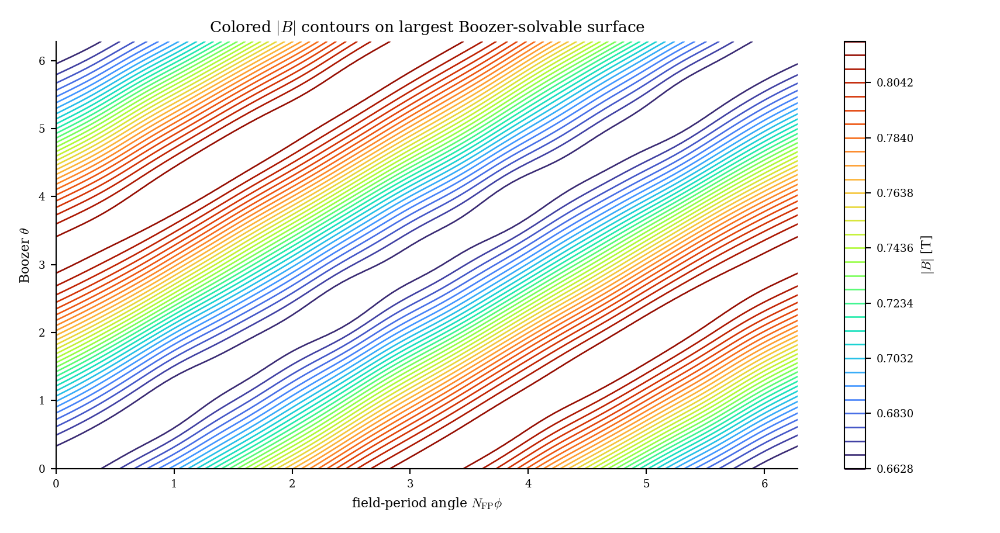

[交互式 Boozer $|B|$ 图](assets/qh_score_fast_beta1_0p7_best923826_full_eval_20260806/full/assets/boozer_b.html)

面 QS 误差采用同一最终面分别按 QA、QH 和 QP 模式计算：

| 对称模式 | 面 QS error |
|---|---:|
| QA $(1,0)$ | $4.8363\times10^{-3}$ |
| QH $(1,1)$ | $5.8840\times10^{-6}$ |
| QP $(0,1)$ | $4.9026\times10^{-3}$ |

QH 分量比 QA 和 QP 都低接近三个数量级，与 $|B|$ 等高线的直观表现一致。Poincare 的 8 条种子轨迹分别获得 `25--27` 个截面交点，点集均位于所选边界内，未见磁岛或自交分支：

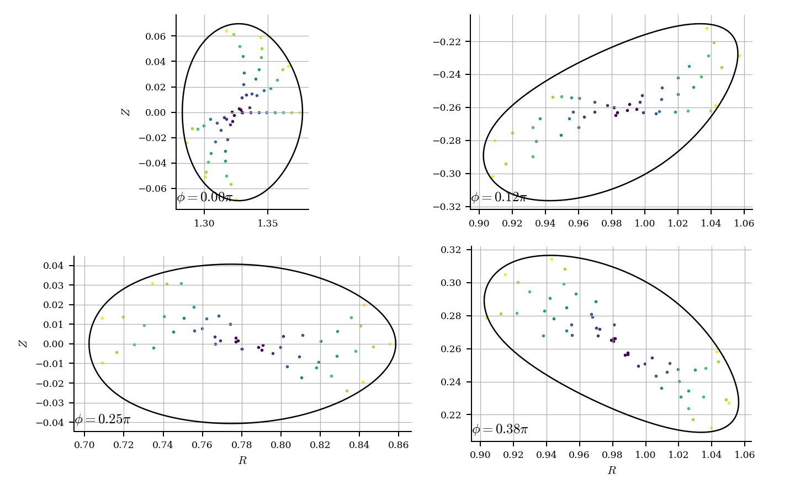

三维图包含 3 根基线圈按 $N_{\mathrm{fp}}=4$ 展开后的完整线圈组以及完整磁面：

[交互式完整线圈与磁面](assets/qh_score_fast_beta1_0p7_best923826_full_eval_20260806/full/assets/coils_surface.html)

### 17.5 DESC 结果

DESC 使用 `MPOL=12`、`NTOR=12` 的输入边界和 $L=M=N=8$ 的平衡表示。显式选择 CPU-P107 路径，因此日志中的 JAX CPU backend 是预期配置，不是未经允许的 GPU 失败后回退。初态和终态均通过嵌套检查。独立归一化力残差为：

| 阶段 | mean | P95 | max |
|---|---:|---:|---:|
| DESC 初值 | 1.1398 | 1.8478 | 4.0282 |
| DESC 终态 | $1.461\times10^{-3}$ | $2.945\times10^{-3}$ | $8.979\times10^{-3}$ |

求解本身耗时 `134.18 s`。优化器在第 50 次迭代触及默认上限，`success=false`，最终 cost 为 `0.00116936`、optimality 为 `7.93e-4`。因此正确表述是：**DESC 物理验收通过并大幅改善残差，但未达到优化器的严格终止条件。** 完整 DESC 阶段连同绘图耗时约 `214.89 s`；直接可视化耗时 `32.33 s`，整个下游作业耗时 `274.32 s`。

以下引用本次 DESC 实际生成的全部 8 张图，不省略任何输出：

初始边界：

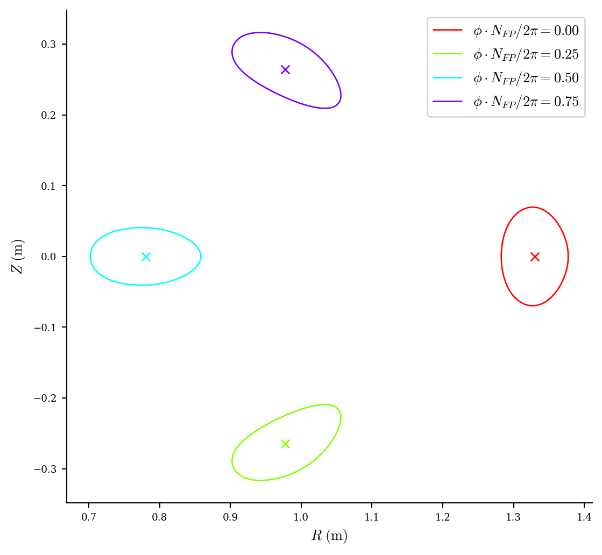

最终边界：

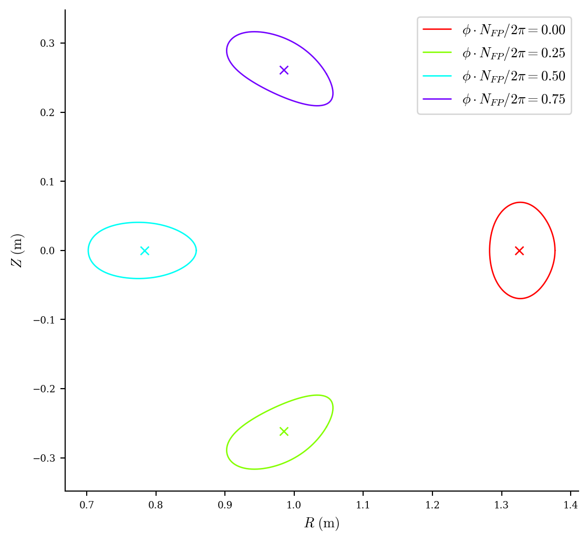

Boozer 谱模：

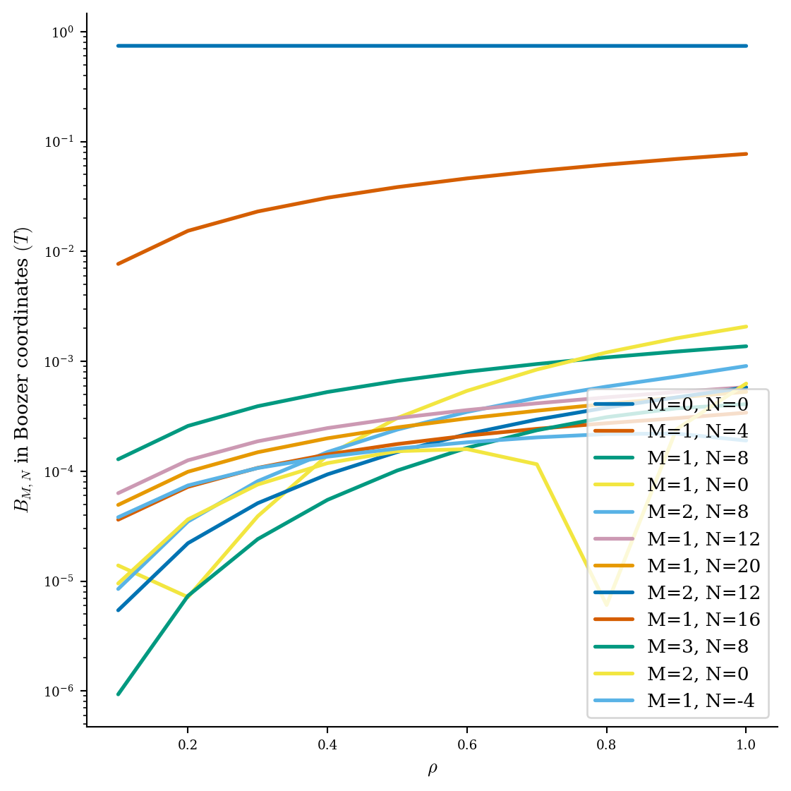

DESC 终态的白底彩色 $|B|$ 等高线：

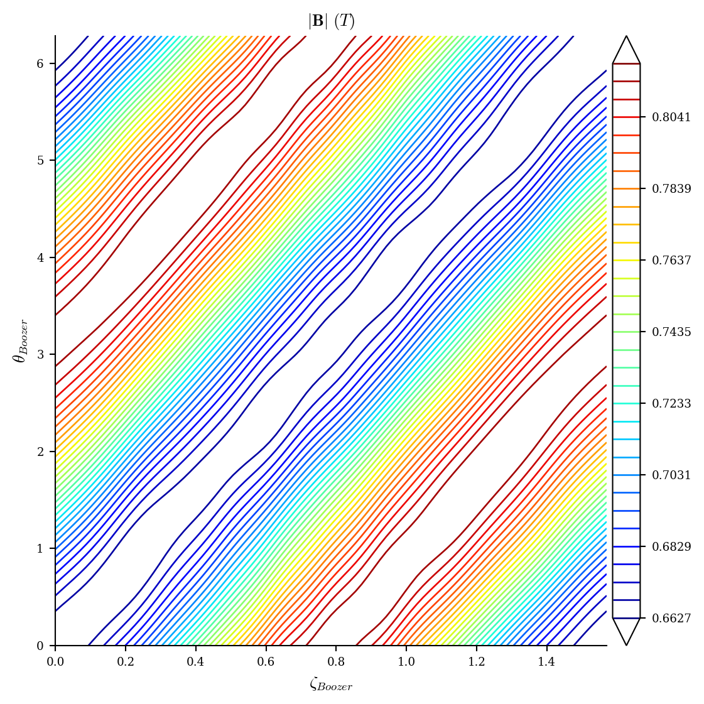

QA、QH 和 QP 分量随 $\rho$ 的变化：

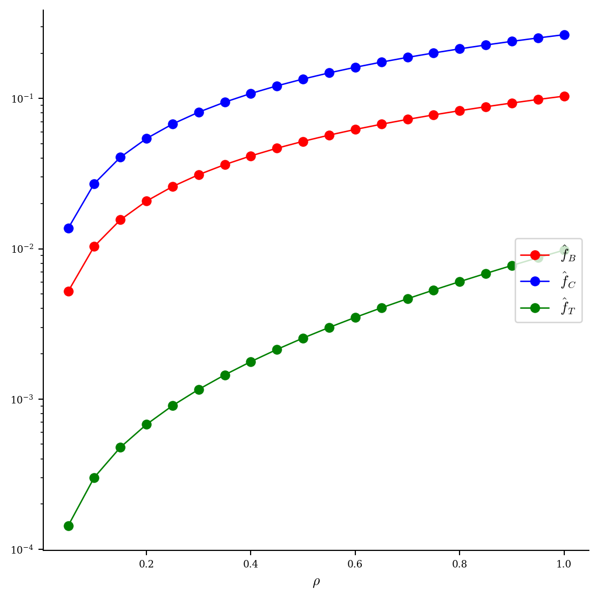

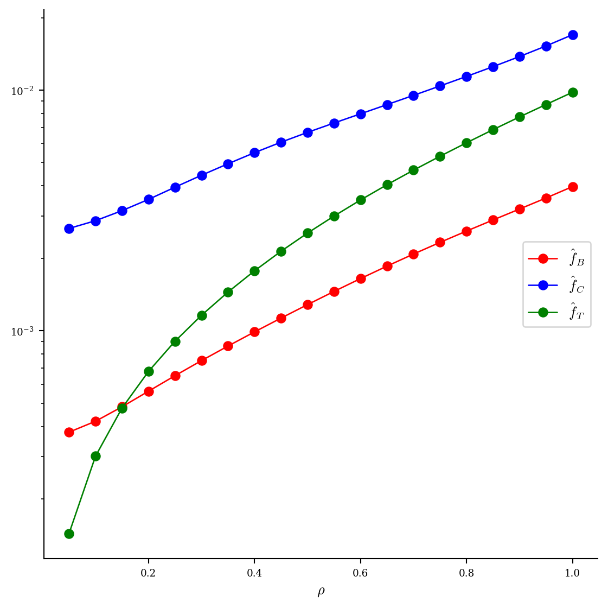

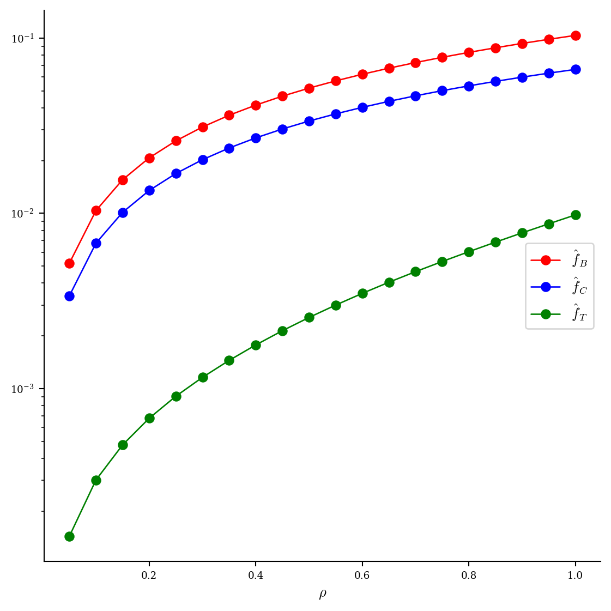

$\iota(\rho)$：

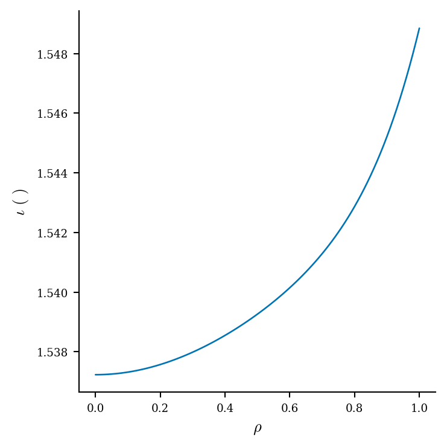

可复现入口包括 [完整评估摘要](assets/qh_score_fast_beta1_0p7_best923826_full_eval_20260806/full/full_summary.json)、[DESC 摘要](assets/qh_score_fast_beta1_0p7_best923826_full_eval_20260806/full/desc/summary.json)、[DESC 输入](assets/qh_score_fast_beta1_0p7_best923826_full_eval_20260806/full/desc/input.check) 和 [平衡文件](assets/qh_score_fast_beta1_0p7_best923826_full_eval_20260806/full/desc/equilibrium.h5)。平衡文件 SHA-256 为 `3427c36c0f60f569c8f03438237c37b97e6f2f22071659812b84b51896bffe5e`。

四个源 $\psi$ 候选和四个磁面候选均并行运行，因而不应把八个作业耗时相加。忽略排队时间后的关键路径约为 `8.9 s` 源 $\psi$、`203.7 s` 选择面上的 $\alpha+\nu+$ 标准求解，以及 `274.3 s` 下游可视化和 DESC，总计约 `8.1 min`。所有 GPU 作业结束后的利用率均为 0%、显存占用 2 MiB；验收时远端队列为空，没有遗留优化器、评分器或僵尸进程。

## 18. $\beta_1=0.7$ 从 600 步续跑到 2000 步

### 18.1 恢复过程与完整性

本轮继续第 16 节中 $\beta_1=0.7$ 的双卡作业。原始 600 步目录保持不变；完整状态被复制到新的续跑目录，再恢复当前 latent、历史最佳 latent、Adam 一阶与二阶矩、Adam step、两个随机数生成器状态和流水线预取端点。目标迭代数设为 2000，因此实际新增 1400 步，而不是重新运行一个独立的 1400 步实验。

首次恢复作业 `33163` 在进入第 601 步前被一致性门拒绝。原因不是状态文件损坏，而是原作业的中心评分使用上一中心的磁轴作为严格 continuation 提示，旧恢复代码却对同一线圈重新做全局磁轴搜索，得到 `92.35871`，与保存的 continuation 分数 `92.32032` 不同。修复后，恢复校验从 `trajectory/step_0600.json` 读取保存的磁轴提示，再重新评分；严格的分数一致性检查仍然保留。`33163` 没有写入新的迭代，不能作为优化结果。

替代作业 `33166` 正常恢复，摘要中的 `resumed_from_iteration=600`，恢复中心分数为 `92.32032490664346`，与第 600 步 history 一致。最终写出连续的 2000 条 history、2001 个远端轨迹点、`status=ok` 和 `stop_reason=completed_iterations`；stderr 为空。最佳样本 [best.json](assets/qh_score_fast_beta1_0p7_continue2000_20260807/best.json) 的 SHA-256 为 `80209737ed1dba9280b26893120d55a845c60d3d5da2a0855eff0794806c068d`。

### 18.2 分数增长和是否收敛

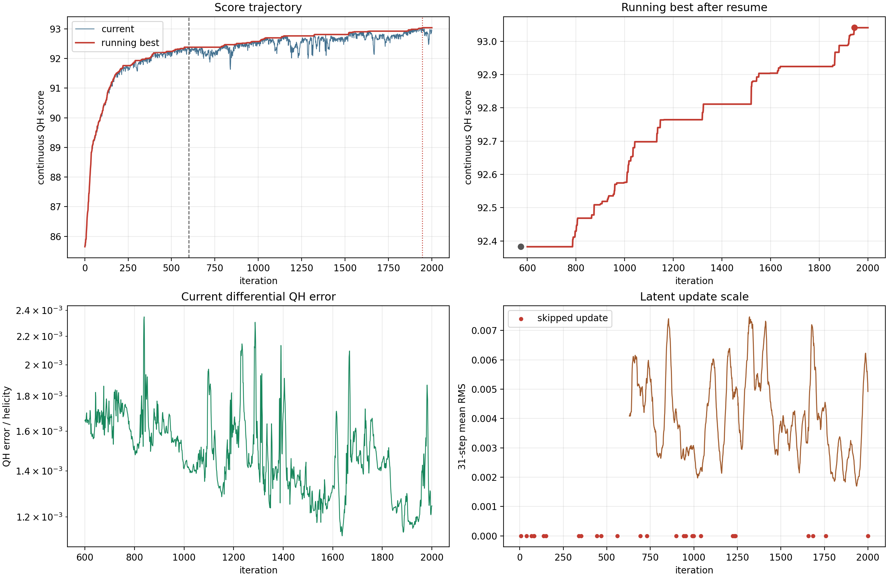

| 迭代步 | 当前 score | running best |
|---:|---:|---:|
| 600 | 92.3203 | 92.3826 |
| 800 | 92.4049 | 92.4294 |
| 1000 | 92.4922 | 92.5756 |
| 1200 | 92.2173 | 92.7644 |
| 1400 | 92.5199 | 92.8112 |
| 1600 | 92.8922 | 92.9042 |
| 1800 | 92.8213 | 92.9243 |
| 1900 | 92.9428 | 92.9875 |
| **1945** | **93.0409** | **93.0409** |
| 2000 | 92.9307 | 93.0409 |

第 600 步以后的 running best 共更新 62 次，从 `92.3826397` 提升到 `93.0409329`，增加 `0.6582933`。相对最初第 0 步的 `85.5016048`，总增益为 `7.5393281`。最终当前点比历史最佳低 `0.11020`，所以交付样本必须取第 1945 步的 `best.json`，不能取第 2000 步当前状态。

严格地说，2000 步仍未证明收敛。最后 400、200 和 100 步的 running-best 增益分别为 `0.13671`、`0.11663` 和 `0.05344`，而最佳点距离终点只有 55 步。另一方面，曲线已经从前期的快速增长变为长平台间偶尔抬升，新增 1400 步只比第 600 步再提高 `0.6583`。因此当前结论是：**该起点在当前方法下至少能达到 93.0409，且已进入明显的边际收益递减区；93.0409 是 2000 步预算内找到的上界，不是已证明的局部极值。**

### 18.3 提分来自哪些分量

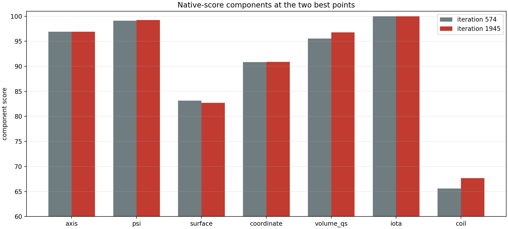

| 原生 score 分量 | 第 574 步最佳 | 第 1945 步最佳 | 变化 |
|---|---:|---:|---:|
| axis | 96.9100 | 96.9267 | +0.0166 |
| psi | 99.1108 | 99.2485 | +0.1378 |
| surface | 83.1418 | 82.6934 | -0.4484 |
| coordinate | 90.8427 | 90.8966 | +0.0538 |
| volume QS | 95.5569 | 96.7909 | +1.2339 |
| iota | 100.0000 | 100.0000 | 0 |
| coil | 65.6024 | 67.6532 | +2.0507 |

新的总分增益主要来自更低的体微分 QH 误差和更好的线圈工程性质，而不是靠缩小磁面或把 $\iota$ 推向零。快速评分器中的 QH 误差每螺旋周期从 $1.6743\times10^{-3}$ 降到 $1.1471\times10^{-3}$，下降约 31.5%；$\iota$ 从 1.5206 变为 1.4612，仍处于 QH 门控满分范围。连续磁面的逆纵横比从 0.032005 变为 0.032115，快速体积诊断从 $0.021446$ 变为 $0.021506\,\mathrm{m}^3$，基本持平。surface 分量反而下降 0.4484，说明优化并非所有物理代理量同时单调改善。

这仍然只是 C++/CUDA 连续原生 score 的分解，单靠本节不能推断最大标准 Boozer 面、面 QH error 或 DESC 残差。后续完整物理评估已经执行，独立结果见第 19 节。

### 18.4 鲁棒性和耗时

新增 1400 步中有 1385 步实际应用梯度更新；15 个非 `ok` 扰动端点触发了既定的整步跳过，5 个无效完整中心提案通过有限回退恢复。没有时间尺度离群拒绝，所有记录下来的中心都保持有效。流水线缓存命中 1399 次，没有出现恢复后吞吐退化。

新增部分墙钟为 `7909.26 s`，即 2 h 11 min 49 s，平均每个目标迭代 `5.649 s`；只统计迭代内部时，均值/P95/最大值为 `5.376/6.069/7.343 s`，没有极端长尾。新增 flow 与原生 score 墙钟分别为 `1702.63 s` 和 `5798.76 s`，约占新增总墙钟的 21.5% 和 73.3%，瓶颈仍是原生 score。作业结束后两张 RTX 5090 均为 0% 利用率、2 MiB 显存占用，验收时队列为空，也没有残留优化器或评分器进程。

机器可读证据位于 [本轮验收资产目录](assets/qh_score_fast_beta1_0p7_continue2000_20260807/)，包括完整 history、manifest、summary、状态文件、关键轨迹 600/1945/2000、GPU 前后状态、原始日志、[分析摘要](assets/qh_score_fast_beta1_0p7_continue2000_20260807/analysis/acceptance_summary.json) 和 [检查点表](assets/qh_score_fast_beta1_0p7_continue2000_20260807/analysis/checkpoints.csv)。本轮接受 `93.0409329` 作为当前 native-score 最高结果；其后续完整物理评估见第 19 节。

## 19. 2000 步 best 版本的完整物理评估

### 19.1 输入身份、score 分解和总判断

本节评估第 18 节中第 1945 步取得的历史最佳点，而不是第 2000 步的最终当前点。冻结输入为 [input_best.json](assets/qh_score_fast_beta1_0p7_best930409_full_eval_20260807/input_best.json)，SHA-256 为 `80209737ed1dba9280b26893120d55a845c60d3d5da2a0855eff0794806c068d`。它是 $N_{\mathrm{fp}}=4$、3 根独立基线圈的 QH 位型，原生连续 score 为 `93.0409329399`。

| 原生 score 分量 | 分数 |
|---|---:|
| 磁轴 | 96.9267 |
| $\psi$ | 99.2485 |
| 连续磁面 | 82.6934 |
| $\alpha,\iota$ 坐标 | 90.8966 |
| 体 QH | 96.7909 |
| $\iota$ | 100.0000 |
| 线圈工程 | 67.6532 |

快速评分器中的体 QH 误差为 $1.14705\times10^{-3}$ 每个螺旋周期，快速坐标拟合给出 $\iota=1.46118$。这两个量只属于优化用的稠密体采样，不等于后文标准磁面上的 QS error。

完整评估的总判断是：**该 best 版本通过了磁面和 QH 的物理验收。** 样本自适应流程找到三个体积单调增加的标准 Boozer 面，最大通过面为 $s=0.49$，体积为 $0.06723\,\mathrm{m}^3$；标准 LS/Newton 后的稠密相对残差为 $1.85\times10^{-5}$，面 QH error 为 $4.65\times10^{-6}$。Poincare 和两套 $|B|$ 等高线均支持嵌套且显著 QH。DESC 初态和终态都保持嵌套，并把独立归一化力残差均值从 `1.2013` 降到 $9.65\times10^{-4}$。限制仍然是 DESC 在 50 次迭代上限停止，故物理残差通过，但优化器没有严格收敛。

### 19.2 样本独立的 $a$ 与外层磁面选择

本轮没有沿用第 574 步样本的 $a$ 或 $s$。首先对当前线圈独立拟合四个源 $\psi$ 模型：

| $a$ / m | 训练 RMS | 验证 RMS | 角度误差 P95 | $s=0.49$ 平均半径 / m | 单作业耗时 / s |
|---:|---:|---:|---:|---:|---:|
| 0.04 | $1.8473\times10^{-4}$ | $1.8528\times10^{-4}$ | $1.5440\times10^{-5}$ | 0.02838 | 10.80 |
| 0.05 | $2.0126\times10^{-4}$ | $2.0306\times10^{-4}$ | $2.1136\times10^{-5}$ | 0.03559 | 9.55 |
| 0.06 | $2.2464\times10^{-4}$ | $2.2828\times10^{-4}$ | $2.7896\times10^{-5}$ | 0.04290 | 9.55 |
| 0.08 | $2.9615\times10^{-4}$ | $3.0600\times10^{-4}$ | $4.5138\times10^{-5}$ | 0.05788 | 9.56 |

四个模型的 $s=0.49$ 快速拓扑筛选均通过，但只有 `a=0.08` 能覆盖到平均半径 `0.05788 m`、最大半径 `0.07192 m` 的同一层面，同时保持 $\psi$ 验证误差在 $3.1\times10^{-4}$。其 $s=0.64$ 相对漂移已增至 `0.02530`，所以选择 `a=0.08`。这里仍是“精度合格前提下优先覆盖较大磁面”，不是把 $a$ 固定成项目规则。

随后四个 $s$ 候选并行走 GPU FP32 $\alpha+\nu$ 和标准 LS/Newton：

| $s$ | 标准结果 | $|V|$ / $\mathrm{m}^3$ | $\iota$ | 结论 |
|---:|---|---:|---:|---|
| 0.24 | 通过 | 0.0323746 | 1.48230 | 内层有效面 |
| 0.36 | 通过 | 0.0493338 | 1.48741 | 中层有效面 |
| 0.49 | 通过 | 0.0672290 | 1.49288 | 最大通过面 |
| 0.64 | 固定预算前停止 | - | - | 最近外层失败 |

前三个面体积严格递增，支持它们位于同一嵌套分支。$s=0.64$ 的 GPU 射线采样只获得 `173109` 个有效点，低于固定的 `180000` 点预算，立即失败而没有进入长迭代；没有回退到旧 Cartesian 或 CPU 预处理。作业身份、预期失败日志和完整选择结果分别见 [作业验收表](assets/qh_score_fast_beta1_0p7_best930409_full_eval_20260807/accepted_jobs.tsv)、[原始日志](assets/qh_score_fast_beta1_0p7_best930409_full_eval_20260807/job_logs/) 和 [selection.json](assets/qh_score_fast_beta1_0p7_best930409_full_eval_20260807/selection.json)。

### 19.3 从 $\psi$ 到标准 Boozer 面

选中的 $s=0.49$ 候选采用 $L=12,M=12,N=16$ 的联合 $\alpha,\iota$ 线性最小二乘。GPU 射线采样从 `225792` 个候选点中获得 `207046` 个有效点，固定使用 `120000` 个训练点和 `60000` 个验证点。磁场、磁通和坐标采样走 C++/CUDA FP32，设计矩阵和 QR 走 PyTorch CUDA FP32 `gels`。$\alpha$ 总耗时 `111.14 s`，其中体采样 `69.44 s`，实际 QR 求解 `0.66 s`。验证相对 $L_2$ 为 `0.09207`，$1+\partial_\theta\lambda$ 的最小值为 `0.3444`，不可逆点比例为 0，拟合 $\iota=1.45805$。

$\alpha$ 的磁通标定摘要仍有一个必须保留的告警：边界残差使 `quality_ok=false`。它没有造成标定多项式非单调，也没有越过坐标可逆性门；更重要的是，后续标准 LS/Newton 和独立稠密残差均通过。因此最终面不是通过忽略这个告警直接接受的，但也不能写成所有 $\alpha$ 辅助检查都通过。

$\nu$ 使用 12 阶、312 个模，在三层上均未跳过近共振模：

| $\rho$ | $\nu$ 拟合相对 $L_2$ | 映射 Jacobian | 修正后 Simsopt 相对 $L_2$ |
|---:|---:|---:|---:|
| 0.5 | $5.12\times10^{-4}$ | $[0.713,1.315]$ | $1.57\times10^{-3}$ |
| 0.8 | $5.06\times10^{-4}$ | $[0.686,1.336]$ | $1.39\times10^{-3}$ |
| 1.0 | $6.25\times10^{-3}$ | $[0.657,1.340]$ | $1.625\times10^{-2}$ |

$\nu$ 总耗时 `82.21 s`。外层比内层困难，但映射仍可逆。进入标准求解时，外层稠密相对 $L_2$ 为 `0.0162519`，法向磁场正弦 P95 为 `0.008845`。标准 LS 在 `5.78 s` 内把内部残差范数降到 $1.92\times10^{-13}$，Newton 在第 0 次迭代即通过，耗时 `0.18 s`。最终 $97\times97$ 独立稠密验证为：

| 指标 | $\alpha+\nu$ 初值 | 标准 LS/Newton 后 |
|---|---:|---:|
| 相对 $L_2$ | 0.0162519 | $1.8465\times10^{-5}$ |
| 点残差 P95 | 0.03536 | $3.7941\times10^{-5}$ |
| 法向磁场正弦 P95 | 0.008845 | $3.1005\times10^{-5}$ |
| $\iota$ | 1.45805 | 1.49288 |

最终面在源 $\psi$ 模型上的平均标号为 `0.48045`，目标为 `0.49`；线性化法向距离 P95 为 `0.765 mm`。这是当前 $\psi$ 标定与标准面之间仍可见的系统差异，但不改变标准求解和稠密物理残差通过的结论。最终面文件为 [boozer_standard.npz](assets/qh_score_fast_beta1_0p7_best930409_full_eval_20260807/candidates/s_0p49/standard_rho_1/boozer_standard.npz)，SHA-256 为 `4f4c4f522d8ec7b2d8d4b7de64421386b103af6afd734040e070fa6fc8fe43b6`。

### 19.4 直接物理诊断和面 QS

最终面上 $|B|$ 的最小值、平均值和最大值分别为 `0.67932 T`、`0.76080 T` 和 `0.84363 T`。白底彩色等高线呈现清晰的 QH 斜带，而不是只由数值指标推断 QH：

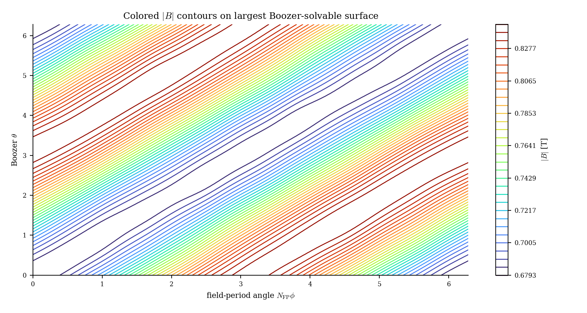

[交互式 Boozer $|B|$ 等高线](assets/qh_score_fast_beta1_0p7_best930409_full_eval_20260807/full/assets/boozer_b.html)

同一标准面上的三种面 QS error 为：

| 对称模式 | 面 QS error |
|---|---:|
| QA $(1,0)$ | $5.07334\times10^{-3}$ |
| QH $(1,1)$ | $4.65150\times10^{-6}$ |
| QP $(0,1)$ | $5.14409\times10^{-3}$ |

QH 分量分别比 QA 和 QP 小约 `1091` 倍和 `1106` 倍，与等高线直观一致。8 条 Poincare 种子轨迹各获得 29 个截面交点，点集位于所选边界内，未见自交面或明显磁岛：

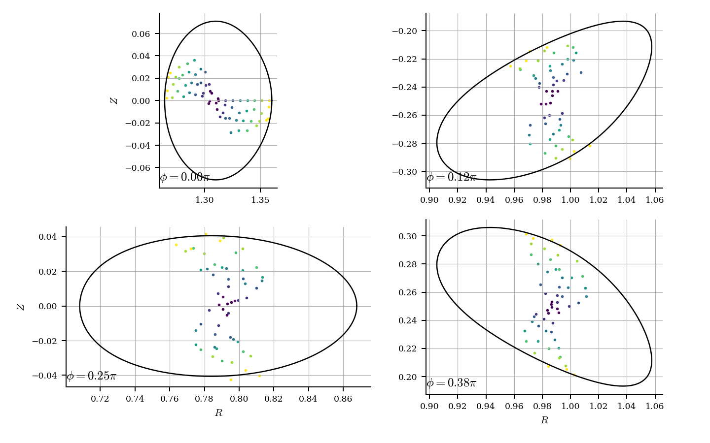

三维图包含 3 根独立基线圈按 $N_{\mathrm{fp}}=4$ 和恒星器对称展开后的完整 24 根线圈，以及选中的完整磁面：

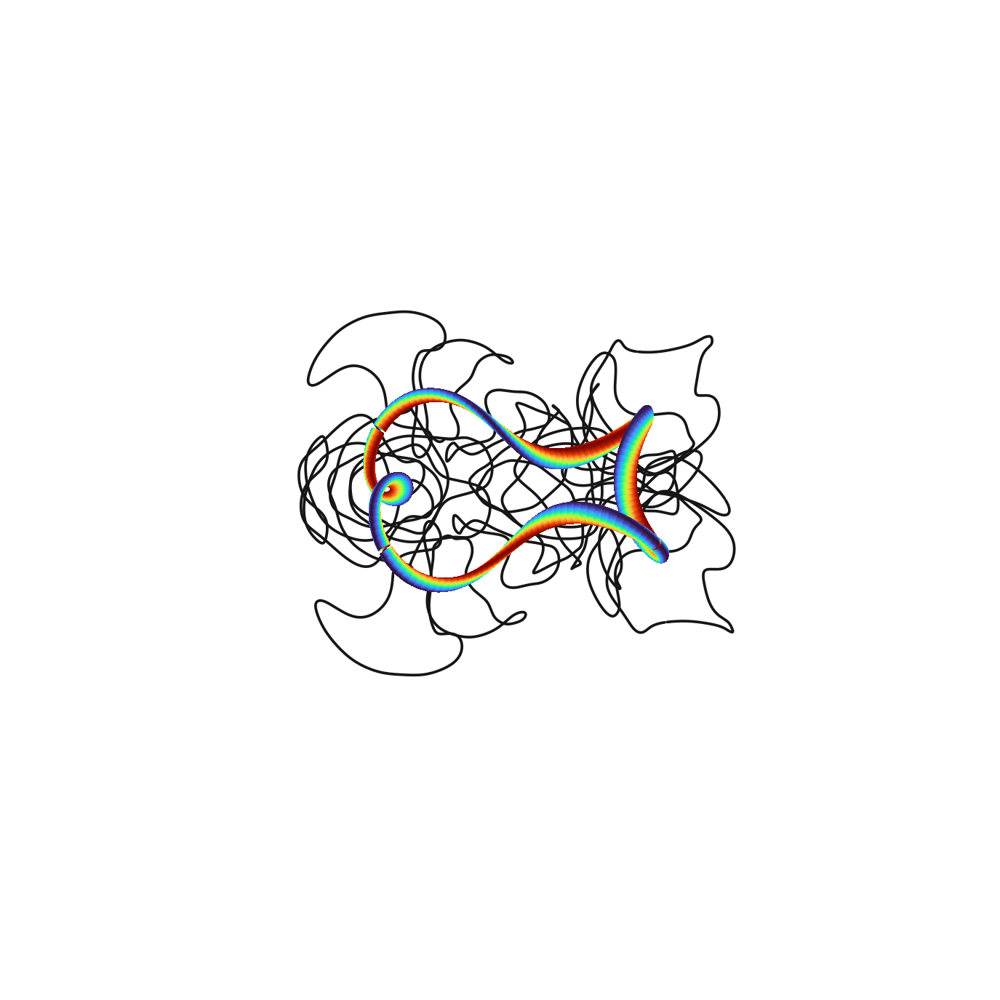

[交互式完整线圈与磁面](assets/qh_score_fast_beta1_0p7_best930409_full_eval_20260807/full/assets/coils_surface.html)

### 19.5 DESC 完整评估

DESC 显式运行在 CPU-P107，日志中的 JAX CPU backend 告警是预期配置，不是 GPU 路径失败后的擅自回退。输入边界使用 `MPOL=12`、`NTOR=12`，平衡内部使用 $L=M=N=8$。初态和终态均通过嵌套检查。独立归一化力残差如下：

| 阶段 | mean | P95 | max |
|---|---:|---:|---:|
| DESC 初值 | 1.20129 | 1.78499 | 3.50878 |
| DESC 终态 | $9.6463\times10^{-4}$ | $2.1057\times10^{-3}$ | $6.1461\times10^{-3}$ |

DESC 求解耗时 `146.05 s`，最终 cost 为 $3.3093\times10^{-4}$、optimality 为 $2.9783\times10^{-4}$。它在第 50 次迭代达到默认上限，`optimizer_success=false`。因此验收结论是“嵌套保持且物理残差下降约三个数量级”，不是“DESC 严格收敛”。

以下逐一引用本轮 DESC 实际生成的全部 8 张图。

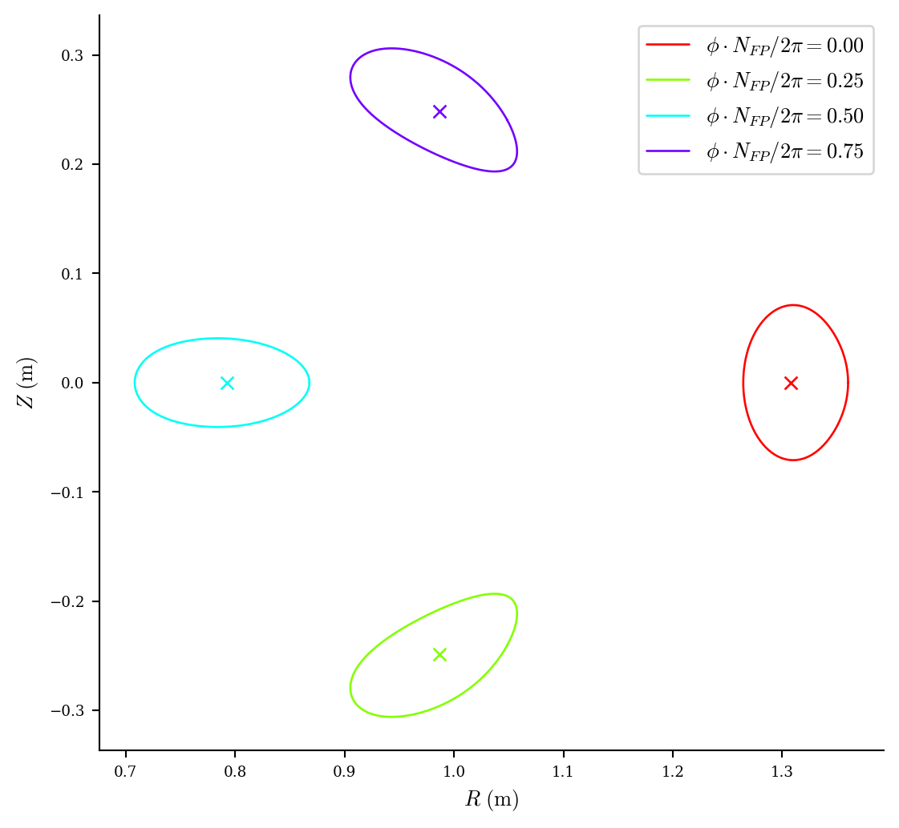

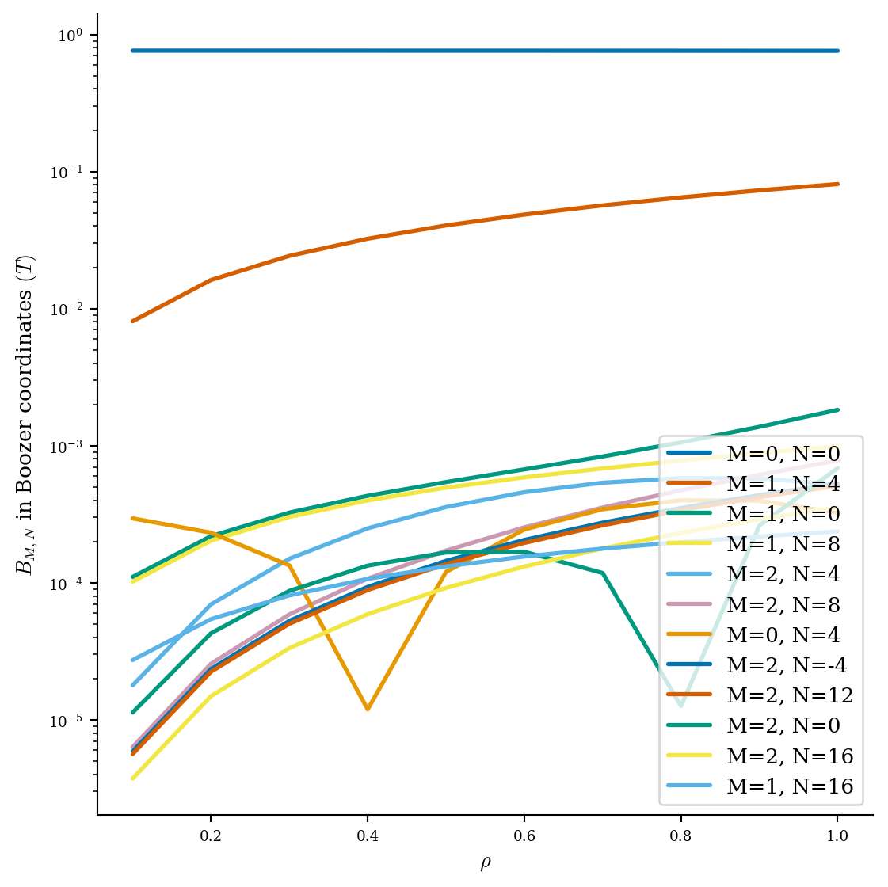

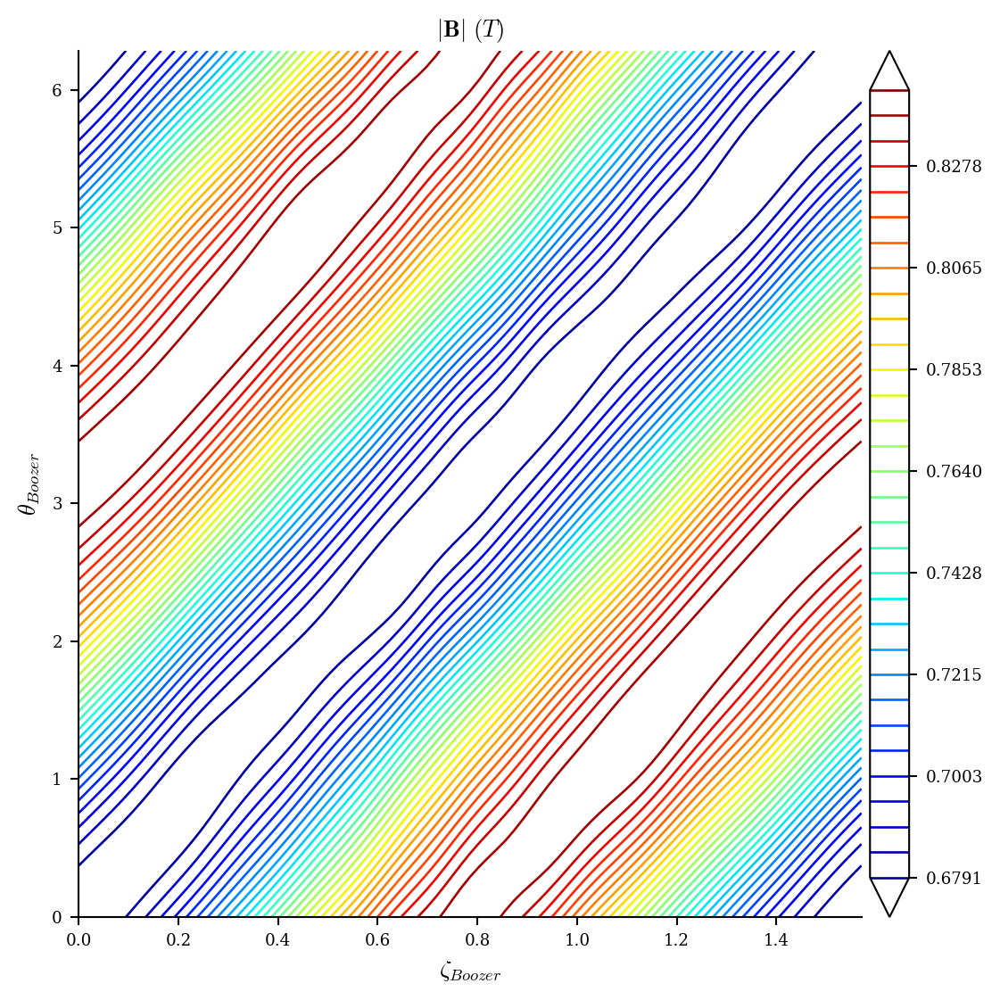

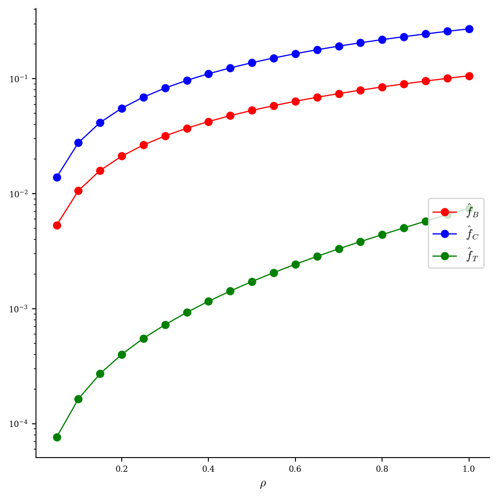

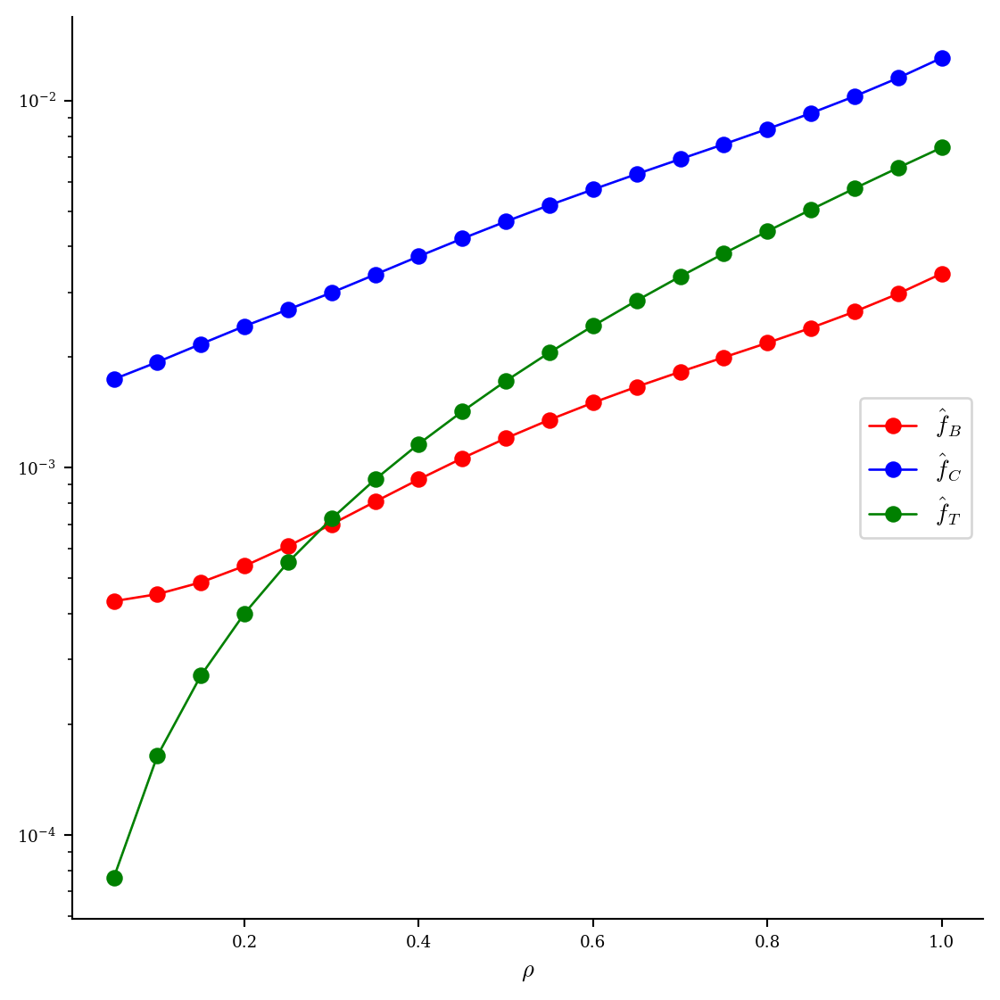

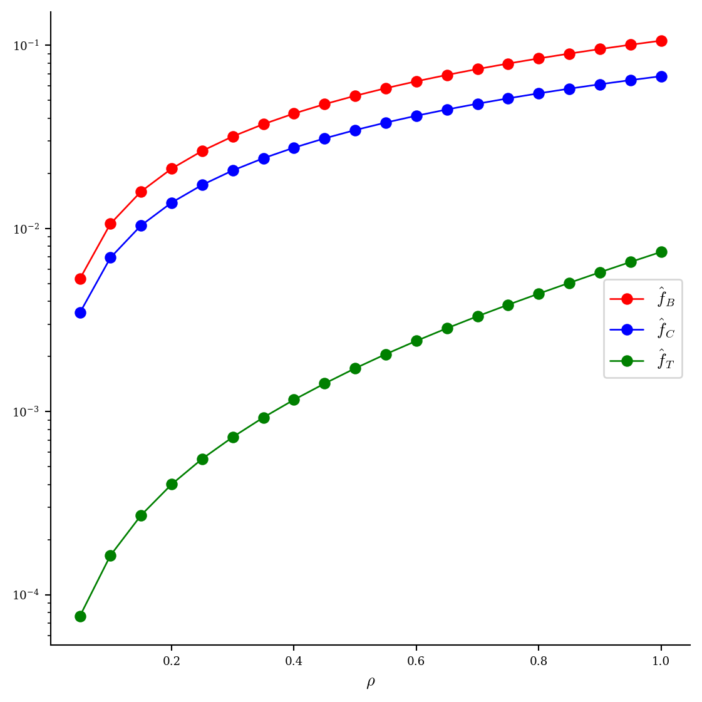

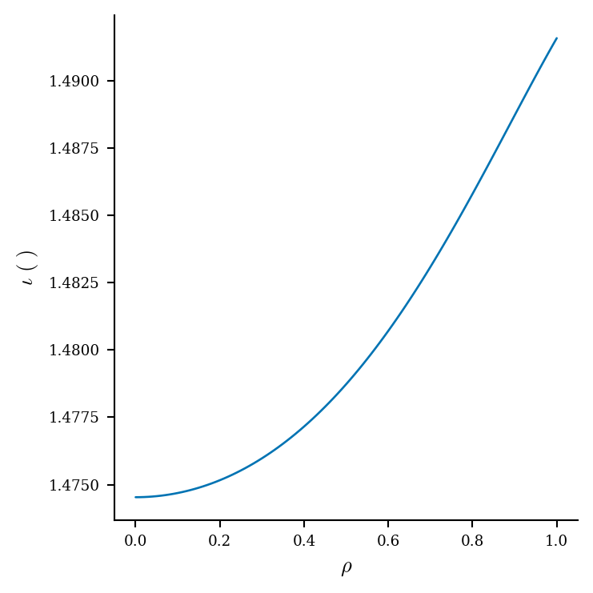

完整 DESC 摘要、输入和平衡文件分别为 [summary.json](assets/qh_score_fast_beta1_0p7_best930409_full_eval_20260807/full/desc/summary.json)、[input.check](assets/qh_score_fast_beta1_0p7_best930409_full_eval_20260807/full/desc/input.check) 和 [equilibrium.h5](assets/qh_score_fast_beta1_0p7_best930409_full_eval_20260807/full/desc/equilibrium.h5)。平衡文件 SHA-256 为 `b3c9e64d43d6db93686ff7514b331af8c634799f87c5060892fcf8c1bba3871c`。

### 19.6 相对第 574 步样本的实质提分与耗时

第 1945 步和第 574 步恰好都独立选择了 `a=0.08`、`s=0.49`，因此可以在相同磁面口径上比较；这不意味着以后固定使用这些参数。

| 最终物理量 | 第 574 步 | 第 1945 步 | 变化 |
|---|---:|---:|---:|
| 原生 score | 92.3826 | 93.0409 | +0.6583 |
| 最大通过面体积 / $\mathrm{m}^3$ | 0.0658637 | 0.0672290 | +2.07% |
| 面 QH error | $5.8840\times10^{-6}$ | $4.6515\times10^{-6}$ | 降低 20.95% |
| 标准面稠密相对 $L_2$ | $1.8883\times10^{-5}$ | $1.8465\times10^{-5}$ | 降低 2.21% |
| 法向磁场正弦 P95 | $3.1950\times10^{-5}$ | $3.1005\times10^{-5}$ | 降低 2.96% |
| DESC 终态力残差 mean | $1.461\times10^{-3}$ | $9.646\times10^{-4}$ | 降低 33.96% |
| 标准面 $\iota$ | 1.54967 | 1.49288 | 保持健康 QH 量级 |

因此新增 1400 步带来的 `0.6583` 分不是只有快速代理分数上涨：最大通过面略增大，面 QH error 下降约 21%，DESC 终态独立力残差也进一步下降。与此同时，$\iota$ 没有被推向 0，故不是早期圆线圈退化漏洞的重现。

| 关键阶段 | 耗时 / s | 主要后端 |
|---|---:|---|
| 选中源 $\psi$ 作业 | 9.56 | C++/CUDA FP32 QR |
| $\alpha$ | 111.14 | C++/CUDA + GPU FP32 QR |
| $\nu$ | 82.21 | GPU 表面/磁场 + 小型谱运算 |
| 标准 LS + Newton | 5.96 | Simsopt CPU |
| 直接可视化 | 31.56 | CPU-P107 下游作业 |
| DESC 阶段 | 227.54 | 显式 CPU-P107 |
| 下游作业总计 | 284.89 | 可视化 + DESC |

四个源 $\psi$ 和四个面候选均并行运行，不能把候选作业耗时相加。按选中路径的数值阶段相加，关键路径约为 `495 s`，即 `8.25 min`，不含排队和少量作业包装开销；其中 DESC 和 $\alpha+\nu$ 仍是完整评估的主要成本。所有 GPU 作业的 postflight 均为 0% 利用率、2 MiB 显存占用。验收时 Slurm 队列为空，未发现遗留优化器、评分器或求解进程。

本轮完整冻结资产位于 [交付目录](assets/qh_score_fast_beta1_0p7_best930409_full_eval_20260807/)，其中 [机器可读验收摘要](assets/qh_score_fast_beta1_0p7_best930409_full_eval_20260807/analysis/acceptance_summary.json)、[哈希清单](assets/qh_score_fast_beta1_0p7_best930409_full_eval_20260807/hashes.sha256)、作业日志、NPZ、H5、PNG 和 HTML 均已保留。第 1945 步 best 现在可以替代第 574 步，作为当前已完成全链路物理验收的最高分样本；advisor presentation 的冻结示例仍按既定要求保持第 574 步不变。

## 20. 从 2000 步续跑到 5000 步的验收

### 20.1 作业身份与总判断

作业 `33694` 在两张空闲 RTX 5090 上，把第 18 节的优化器从第 2000 步完整续跑到第 5000 步。恢复的不只是第 2000 步线圈，而是当前/历史最佳潜变量、Adam 一阶和二阶动量、Adam 步数、随机数状态以及已经预取的 flow 端点。恢复中心 score 为 `92.930731683037`，与第 2000 步保存值一致；因此这 3000 步属于同一条连续轨迹，不是从 best 点重新启动的另一轮优化。

作业正常写出连续的 5000 条 history 和 5001 个逐步轨迹文件，最终状态为 `status=ok`、`stop_reason=completed_iterations`，stderr 为空。第一次尝试作业 `33691` 没有进入优化：它分到的 `anode02` 中一张卡持续 100% 占用，被既有空闲卡安全门终止。该失败只作为调度审计保留，不属于本次数值结果；有效作业 `33694` 改在空闲的 `anode03` 上运行，GPU 启动前和结束后均为 0% 利用率、2 MiB 显存占用。

本轮的核心结果是：历史最佳从第 1945 步的 `93.0409329` 提升到第 4341 步的 `93.3672653`，增加 `0.3263324`。第 5000 步当前点只有 `93.0724656`，比历史最佳低 `0.2947997`，所以后续使用时必须取 [best.json](assets/qh_score_fast_beta1_0p7_continue5000_20260808/best.json)，不能取最终当前状态。best 文件的 SHA-256 为 `d4517e03d66913d958bfac88b42b7d56228a9717c4b445f5ac28f242b049cc29`。

### 20.2 提分轨迹与收敛判断

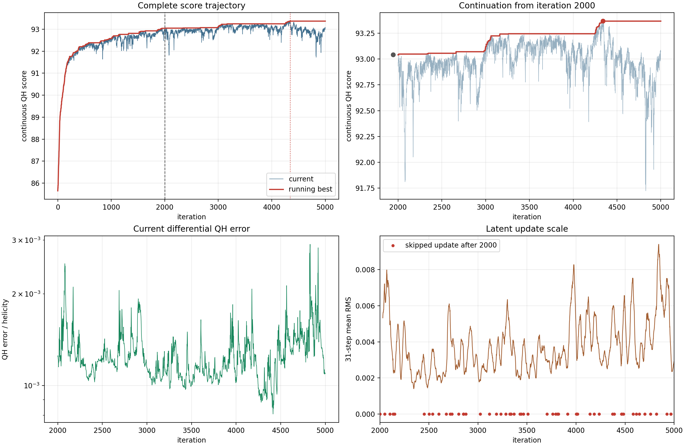

| 迭代步 | 当前 score | 截止该步的 best | 当前体 QH 误差/螺旋周期 | 当前 $\iota$ |
|---:|---:|---:|---:|---:|
| 2000 | 92.93073 | 93.04093 | $1.2456\times10^{-3}$ | 1.44653 |
| 2500 | 92.95869 | 93.05585 | $1.2306\times10^{-3}$ | 1.43731 |
| 3000 | 93.12018 | 93.12018 | $1.1454\times10^{-3}$ | 1.45322 |
| 3500 | 93.15387 | 93.24493 | $1.0037\times10^{-3}$ | 1.45878 |
| 4000 | 93.01052 | 93.24493 | $1.0487\times10^{-3}$ | 1.52334 |
| 4341 | **93.36727** | **93.36727** | $9.2915\times10^{-4}$ | 1.50557 |
| 4500 | 93.04811 | 93.36727 | $1.3080\times10^{-3}$ | 1.48505 |
| 5000 | 93.07247 | 93.36727 | $1.0960\times10^{-3}$ | 1.57029 |

新增区间一共刷新 running best 37 次。最后 1000 步仍取得 `0.12234` 的 best 增益，但第 4341 步之后连续 659 步没有再刷新；最后 100、200、400、500 和 659 步的 running-best 增益均为 0。与此同时，最后 200 步当前 score 的均值和标准差为 `92.71098 +/- 0.27074`，更新尺度也没有衰减到 0。这说明当前固定学习率 `0.01` 下已经进入明显的平台和随机游走区：可以说“5000 步预算内的边际收益已经很低”，但不能说梯度或参数在数学意义上严格收敛。继续原样增加步数仍可能偶然刷新 best，不过预期单位算力收益已经明显低于 2000 到 4341 步这一段。

### 20.3 新 best 的提分来源

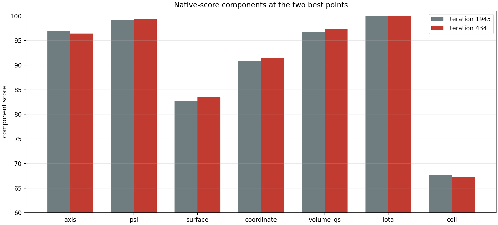

| 原生 score 分量 | 第 1945 步 best | 第 4341 步 best | 变化 |
|---|---:|---:|---:|
| axis | 96.9267 | 96.4238 | -0.5029 |
| $\psi$ | 99.2485 | 99.3950 | +0.1464 |
| surface | 82.6934 | 83.5658 | +0.8724 |
| coordinate | 90.8966 | 91.3978 | +0.5012 |
| volume QS | 96.7909 | 97.4069 | +0.6160 |
| $\iota$ | 100.0000 | 100.0000 | 0 |
| coil | 67.6532 | 67.2268 | -0.4264 |

新 best 的主要收益来自连续磁面、坐标拟合和体 QH，代价是磁轴和线圈工程分量略降。直接从 best 的完整快速诊断读取，目标 QH 误差每螺旋周期从 $1.14705\times10^{-3}$ 降到 $9.01409\times10^{-4}$，下降约 21.4%；$\iota$ 从 1.46118 升到 1.50557，没有向 0 退化。连续磁面的逆纵横比从 0.032115 增至 0.032509，快速体积从 $0.021506$ 增至 $0.021902\,\mathrm{m}^3$。因此这次提分不是通过缩小磁面、降低旋转变换或只改善线圈几何实现的。

这些数值仍属于 C++/CUDA 快速 score 的稠密体采样代理。它们支持第 4341 步值得进入完整评估，但不能替代样本自适应的 $\psi\rightarrow\alpha+\nu\rightarrow$ 标准 LS/Newton、面 QS error、Poincare 和 DESC 验收。

### 20.4 鲁棒性、吞吐和冻结产物

新增 3000 步中，2946 步实际应用了 Adam 更新，54 步因扰动端点无效或防护条件而跳过；12000 个扰动端点中有 56 个非 `ok`，占 0.47%。11 个无效完整中心提案通过有限回退恢复，只有 1 步触发跨步尺度离群保护，所有保存下来的中心仍为 `ok`。流水线缓存命中 2999/3000 次，没有因为恢复而退回重复 flow 解码。

| 新增区间指标 | 结果 |
|---|---:|
| 新增 3000 步墙钟时间 | 17051.62 s（4 h 44 min 12 s） |
| 平均每个目标迭代 | 5.684 s |
| 迭代内部均值 / P95 / 最大值 | 5.238 / 5.531 / 7.489 s |
| flow 墙钟累计 | 3393.92 s |
| 原生 score 墙钟累计 | 12313.69 s |
| 其余包装、序列化和同步 | 1344.00 s |

原生 score 仍占新增墙钟约 72.2%，flow 约占 19.9%；最大单步只比内部均值高约 43%，没有极端长尾。验收时 Slurm 队列为空，stderr 为 0 字节，未遗留优化器或评分器进程。

机器可读证据位于 [本轮冻结资产目录](assets/qh_score_fast_beta1_0p7_continue5000_20260808/)，包括完整 history、manifest、summary、恢复事件、最终优化状态、关键轨迹 1945/2000/4341/5000、GPU 前后状态、原始日志、[验收摘要](assets/qh_score_fast_beta1_0p7_continue5000_20260808/analysis/acceptance_summary.json) 和 [检查点表](assets/qh_score_fast_beta1_0p7_continue5000_20260808/analysis/checkpoints.csv)。本轮接受 `93.3672653` 作为新的 native-score 最高结果；它尚未进行第 19 节标准的完整物理评估。
