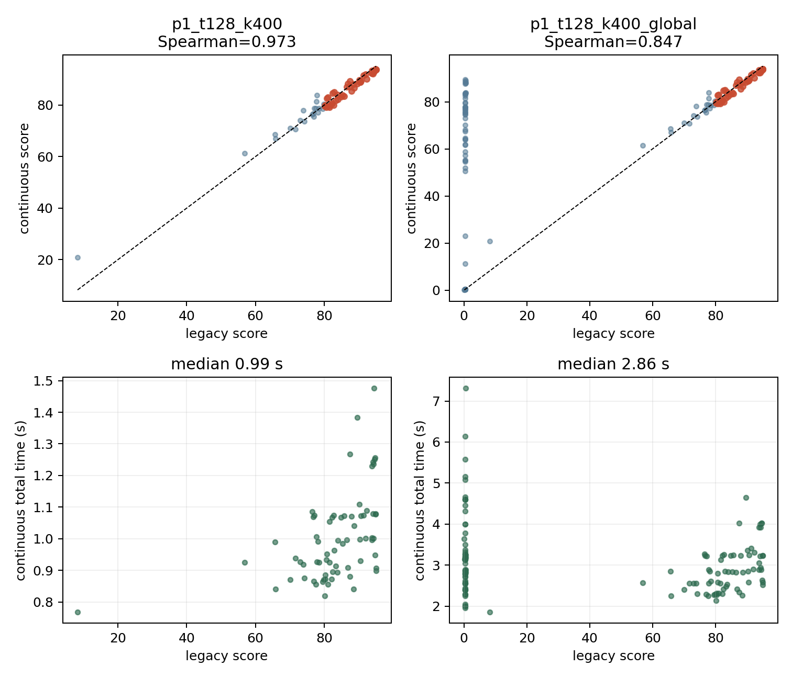
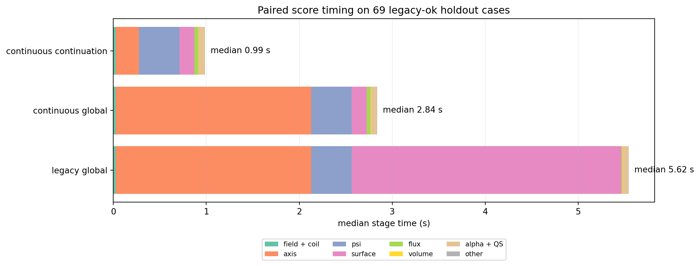

# QH score 吞吐优化与连续磁面选择可行性报告

**日期：2026-08-05**

## 1. 结论先行

本轮不再研究黑箱梯度，而是直接降低一次正式 score 的成本，并让 score 关于小线圈扰动更连续。用户提出的两个方向都可行，而且正好对应当前两个最大瓶颈：

1. 当前磁面流程先在 13 个离散 $s$ level 中选候选，再对少数外层候选逐个做最多 16 周期追踪。它同时带来高成本、候选切换和硬拒绝。建议把 16 周期追踪移出生产 score，仅保留为开发期和完整评估期的审计标准；生产 score 用固定数量、确定性的体内分层点做 1--4 周期短追踪，构造连续的磁面置信度 $p(s)$。
2. 当前磁轴流程每次都从 $48\times48$ 全局网格开始，必要时再做 $64\times64$ fallback。对于同一个优化中心附近的差分端点和回退候选，这些全局扫描绝大部分是重复工作。建议为局部优化新增“磁轴分支 continuation”接口，直接从中心样本已经验证的磁轴进入局部固定点迭代；若不能继续同一分支，则返回 branch-lost，而不是悄悄切到另一根磁轴。

现有 1000 样本计时支持这个优先级。验证集上的总时间中位数为 3.280 s，磁轴搜索为 1.621 s，磁面筛选为 1.009 s；$\psi$ 点生成、拟合和验证合计约 0.433 s，$\alpha/\iota$ 与 QS 合计约 0.058 s。校准集也给出几乎相同的结果。代表性高分样本总耗时 7.236 s，其中磁轴约 2.17 s，磁面候选、长追踪与磁通标定约 4.52 s。

因此本轮不应优化 QR、十万体点或 flow，也不应重写已经稳定的线圈到 $\psi$ 主链。正确顺序是：**先把计时拆细，再做磁轴 warm start，随后做长追踪消融和连续 $p(s)$，最后才把新 score 接回优化器。**

本报告只做设计，没有创建分支、修改代码或提交实验。

## 2. 当前 score 的准确流程

### 2.1 磁轴

当前 gpu_backend/src/score_pipeline.cu 中的磁轴流程是：

1. 从线圈几何估计搜索区域。
2. 在 $48\times48$ 的 $(R,Z)$ 网格上，把每个点追踪一个场周期，计算 Poincare 映射残差。
3. 根据映射绕数和局部残差极小值选出最多 16 个候选。
4. 对候选做最多 6 轮带回退的二维 Newton 迭代。每轮需要有限差分 Jacobian和若干 trial trace。
5. 用 FP64 重新验证候选残差和椭圆拓扑。
6. 若没有足够稳健的候选且 $N_{\rm FP}\le7$，再执行 $64\times64$ 网格、最多 48 个候选的 fallback。
7. 选定磁轴后，另外追踪 240 个轴采样点，供后续 $\psi$ 使用。

1000 样本统计为：

| 指标 | 验证集 | 校准集 |
|---|---:|---:|
| 总时间中位数 | 3.280 s | 3.137 s |
| 总时间 P95 | 5.213 s | 6.038 s |
| 磁轴搜索中位数 | 1.621 s | 1.608 s |
| 磁轴搜索 P95 | 3.686 s | 4.753 s |
| 最慢总时间 | 7.547 s | 15.036 s |

校准集中两个超过 10 s 的长尾样本都是 no-axis，几乎全部时间消耗在全局磁轴搜索。这说明磁轴 continuation 不只是降低均值，也可能消除目前最明显的长尾。

### 2.2 磁面

当前默认使用 13 个离散 level：

$$
s\in\{0.001,0.002,0.004,0.008,0.02,0.04,0.08,0.16,0.25,0.36,0.49,0.64,0.81\}.
$$

每个 level 在 $\phi=0$ 截面取 256 个极角，通过拟合出的 $s(R,Z,\phi)$ 在射线上解根，随后执行：

1. 所有 $13\times256$ 个点一起做一次 mixed-precision 单周期追踪。
2. 计算终点到原 $s$ level 的近似法向距离，并除以该面的平均半径得到相对漂移。
3. 在单周期初筛通过的候选中，只取最大的最多 6 个，再做一次 FP64 单周期验证。
4. 按 $s$ 从大到小逐候选处理。每个候选最多连续追踪 16 周期，任一周期相对漂移超过 5% 时提前停止。
5. 第一个通过长追踪和磁通标定的候选成为最终边界；其余候选不再检查。

这套设计有三个问题：

- $s$ 只能在 13 个固定值间跳变，边界大小和后续体 QS 会随候选切换发生离散变化。
- 最多 16 周期乘以 256 条线、每周期 800 步，是高分样本上最重的表面成本。
- hard pass/fail 使很接近阈值的两个线圈得到完全不同的状态和下游 score，不适合作为局部优化目标。

现有 timing 还不够支持直接动刀。surface_screen_s 与下游候选循环中的长追踪存在累计或嵌套语义，flux_s 也包围候选循环；这些字段不能简单相加。第一项代码工作必须把它们改为互斥计时。

## 3. 连续磁面置信度 $p(s)$

### 3.1 一个周期到底能测量什么

令 $P$ 表示一个场周期的 Poincare 映射。对拟合 $s$ 的等值面，在 $\phi=0$ 上取

$$
x_0(s,\theta),\qquad s(x_0)=s.
$$

追踪一个周期后，当前实现已经在计算

$$
\Delta s(s,\theta)=s(Px_0)-s.
$$

直接使用 $|\Delta s|/s$ 在近轴处不稳定，因为 $s\sim\rho^2$，分母会过快趋近于零。更合理的是沿用当前已有的物理距离归一化：

$$
d(s,\theta)=
\frac{|\Delta s(s,\theta)|}
{\left|\nabla s(Px_0)\right|\,r_{\rm mean}(s)+\epsilon_\ell}.
$$

它近似表示“一周期法向漂移占该面半径的比例”，无量纲、跨不同面大小更可比，也与当前 5% 长追踪阈值有直接联系。为避免只看绝对值遗漏系统性缓慢漂移，还应保留 $\Delta s$ 的符号，并从同一批角点得到：

$$
\mu(s)=\mathbb E_\theta[\Delta s],\qquad
\sigma(s)=\sqrt{\mathbb E_\theta[(\Delta s-\mu)^2]}.
$$

若需要近似多周期风险，可以把 $H|\mu|$ 和 $\sqrt H\,\sigma$ 作为特征，而不是实际追踪 $H=16$ 次。这个近似必须用真实 16 周期结果校准，不能只凭公式宣布成立。

### 3.2 取点方式

生产 score 不应每次随机取点，否则会给局部优化额外注入噪声。建议使用固定 seed 的 Sobol 或分层低差异点，并让所有相邻线圈复用完全相同的 $(s,\theta)$ 节点，即 common random numbers。

第一版建议比较三档固定预算：

| 档位 | 径向层数 | 每层角点 | 总场线数 |
|---|---:|---:|---:|
| 小 | 16 | 128 | 2048 |
| 中 | 24 | 128 | 3072 |
| 大 | 32 | 128 | 4096 |

$s$ 近似等于 $\rho^2$，因此均匀采样 $s$ 本身已接近截面等面积采样。为同时分辨边界，可把径向节点设为“75% 均匀 $s$ + 25% 外侧加密”的确定性混合，但每个样本的节点数和位置规则必须固定。以下情况一律把该点置信度记为 0，而不是从统计中删除：

- 射线求根碰到最大半径 clamp；
- $s$ 或 $\nabla s$ 非有限；
- 场线追踪失败；
- 终点离开拟合有效域。

这样可以防止通过制造大量无效点来抬高平均置信度。

### 3.3 从漂移得到局部置信度

不能只对角点置信度做普通平均，否则少数坏扇区会被大量好点淹没。建议先对每个径向层构造尾部敏感的风险：

$$
D(s)=
\tau_\theta\log\left[
\frac{1}{N_\theta}
\sum_{\theta}
\exp\left(\frac{d(s,\theta)}{\tau_\theta}\right)
\right].
$$

这是最大漂移的平滑近似。然后定义局部置信度

$$
q(s)=\operatorname{sigmoid}
\left(\frac{d_0-D(s)}{\tau_d}\right).
$$

$d_0$ 是“开始不可信”的参考漂移，$\tau_d$ 控制过渡宽度。它们不能手工调到看起来舒服，而应只在校准集上拟合，使 $q(s)$ 预测该层是否能通过独立的长周期或 LS/Newton 验证。

单周期 $D(s)$、有符号 $\mu(s)$、RMS $\sigma(s)$、超过若干漂移阈值的角点比例和 ray-clamp 比例可以进入一个很小的单调 logistic/GAM 模型。这里不需要神经网络；模型应该只有少量参数、固定运算量，并强制“漂移越大，置信度不升高”。

### 3.4 从局部置信度得到“内侧整体仍可信”的 $p(s)$

物理上有价值的边界不仅要求该层局部表现好，还要求从轴到该层的内部整体可用。若外层偶然重新出现一个低漂移窗口，不应跳过中间坏区直接拿高分。

可将局部失败风险写成非负 hazard：

$$
h(s)=\operatorname{softplus}
\left(\frac{D(s)-d_0}{\tau_d}\right),
$$

并定义从轴向外的生存置信度

$$
p(s)=\exp\left[
-\frac{1}{\ell_s}\int_0^s h(u)\,du
\right].
$$

它天然满足

$$
0<p(s)\le1,\qquad \frac{dp}{ds}\le0.
$$

因此 $p(s)$ 的语义是“从磁轴到 $s$ 这一层仍没有遇到明显磁面破坏的置信度”，而不是孤立判断某一层。$\ell_s$ 只控制置信度随累计风险衰减的尺度，同样由校准集确定。

连续有效边界可以定义为生存函数对应的期望：

$$
s_{\rm eff}=\int_0^{s_{\max}}p(s)\,ds.
$$

如果 $p(s)$ 在真实边界附近近似从 1 降到 0，这个积分就近似真实边界；如果过渡较宽，它会自动给出保守的加权平均，而不会在两个离散 level 间跳变。

### 3.5 如何接回现有下游

建议分两版实现。

**第一版：连续边界、最小改动。**

用 $s_{\rm eff}$ 代替离散 selected_surface.level，然后只对这个连续 level 做一次现有磁通标定、体点生成、$\alpha/\iota$ 线性拟合和 QS 归约。这样可以复用几乎全部已验证的下游 C++/CUDA 代码，主要风险也容易定位。

surface 分量可改成

$$
S_{\rm surface}
=
w_{\rm size}\,Q_{\rm size}(V_{\rm eff})
+w_{\rm conf}\int_0^{s_{\max}}p(s)w(s)\,ds
+w_{\rm drift}\,Q_{\rm drift}(D),
$$

其中大小贡献达到有实用意义的逆纵横比后继续饱和，避免优化器只追求更大但边缘很差的区域。

**第二版：置信度加权体积分。**

若第一版仍因单个 $s_{\rm eff}$ 对下游产生明显敏感性，再让体点直接携带 $p(s_i)$ 权重：

$$
w_i^{\rm final}=w_i^{\rm volume}\,p(s_i).
$$

$\alpha/\iota$ LS、体 QS 和有效体积都用同一权重；边缘 QS 可用 $-p'(s)$ 构造集中在可信边界附近的连续权重。这一版理论上更一致，但会改变更多已验证物理代码，因此不应作为第一步。

### 3.6 16 周期追踪是否可以删除

可以把它从生产 score 删除，但不能未经验证就把它从项目中彻底删除。它目前承担的是“防止单周期看起来很好、长期却逐步漂走”的反作弊职责。

正确做法是：

1. 开发时把 16 周期结果作为离线标签，不计入生产耗时。
2. 对同一批面同时计算 1、2、4、8、16 周期结果，测量短周期对 16 周期的假阳性率。
3. 优先尝试 1 周期特征；若假阳性过高，再加入第 2 或第 4 周期。1、2、4 周期可以沿同一批场线连续传播并在中间读取特征，不需要重新初始化。
4. 最终生产配置选择满足高分假阳性约束的最短 horizon，而不是预先假定一定是 1 或 4。
5. 完整线圈评估仍保留长周期 Poincare、LS/Newton 与 DESC；生产 score 只负责快速筛选和优化。

一个周期在理论上具有较强依据：若 $s$ 是真实磁通函数，则对任意点都有 $s(Px)=s(x)$。但有限精度拟合、弱系统漂移、共振岛和混沌扩散可能在一个周期内只产生很小变化，所以短周期替代必须靠数据标定。预期结论是 16 周期过于保守且昂贵，但 1 周期是否足够目前仍是待验证问题。

## 4. 磁轴 warm start 与分支 continuation

### 4.1 为什么可行

磁轴在 $\phi=0$ 截面是一个固定点：

$$
F(R,Z)=P(R,Z)-(R,Z)=0.
$$

优化中的差分端点、Adam 候选和回退候选只在当前潜变量附近小幅移动。若磁轴分支没有切换，隐函数定理保证非退化固定点随线圈参数连续移动。因此中心样本的 $(R_{\rm axis},Z_{\rm axis})$ 是相邻样本极好的初值。

当前全局网格的作用是“从完全未知的线圈中找候选”，不是“每次局部评分都必须重新证明全空间没有别的磁轴”。把两种场景混为一谈造成了约 1.6--1.9 s 的重复成本和 no-axis 长尾。

### 4.2 新接口的语义必须明确

不能简单给现有 sgpu_score_coils 增加两个可选浮点数，然后让同一个线圈因不同历史 hint 得到不同分数。建议保留两个入口：

1. **standalone/global score**：用于随机样本、QUASR 批量评测和最终验收，保持当前全局磁轴搜索，结果与历史无关。
2. **local continuation score**：用于一个已建立中心的优化 session。输入中心的磁轴 branch token，只允许沿该分支继续；若 continuation 失败或明显跳支，返回 branch_lost，候选不得与同一差分中的另一端组成梯度。

branch token 至少保存：

- $\phi=0$ 的 $R,Z$；
- 已追踪的整根轴 $R(\phi),Z(\phi)$；
- 固定点 Jacobian 或 monodromy 的 $2\times2$ 信息；
- topology trace、det、ellipse aspect；
- 中心线圈哈希、$N_{\rm FP}$ 和评分器配置哈希。

所有同一步差分端点必须从同一个中心 token 出发；接受新中心后才更新 token。这样不会把两个不同磁轴分支的 score 混进同一局部优化步骤。

### 4.3 warm 路径

建议按下面的有界流程实现：

1. 在新线圈上，从旧 $(R,Z)$ 追踪一个周期，得到固定点残差。
2. 若残差已低于当前 $10^{-7}$ 容差，跳过全局网格和 Newton。
3. 否则先复用上一点的 $2\times2$ Jacobian 做预测步；再用当前场的一次四方向有限差分更新 Jacobian。
4. 最多做 2--3 轮带固定回退表的局部 Newton。禁止无界迭代。
5. 用现有 FP64 路径验证残差与椭圆拓扑，再追踪 240 个轴采样点。
6. 检查整根轴相对中心轴的距离、拓扑连续性和固定点残差。超出由实际优化轨迹标定的 branch gate 时返回 branch_lost。
7. 只有 standalone 模式可以回退到全局网格；局部差分端点不能在失败后静默改选另一候选。

前一中心的 Jacobian 只是加速初始猜测，不是可信结果。最终残差和拓扑仍由当前线圈重新计算，因此不会牺牲轴的物理判定。

### 4.4 进一步吞吐优化

单个 warm 轴只追踪 1--5 条线，GPU 并行度可能不高。第一版先实现单样本 continuation，因为省去 $48^2$ 或 $64^2$ 场线已经有很大收益。若 profiler 显示小 kernel launch 成为新瓶颈，再把同一步的多个差分端点组成 batch：

- 每个候选拥有不同线圈场，但共享固定迭代轮数；
- 同一轮同时执行所有候选的中心和四个 Jacobian 探针；
- 每张 GPU 一次处理其分配到的 2--4 个 score 候选。

这是第二阶段工程，不应在 warm start 正确性尚未验证前先做复杂融合。

## 5. 必须先补的细粒度计时

新分支第一项改动只增加计时，不改变数值路径。CPU 段用 steady clock；GPU 段用 CUDA event，并在计时边界做必要同步。所有字段必须互斥，另保留总墙钟检查：

$$
T_{\rm accounted}\approx\sum_k T_k\le T_{\rm wall}.
$$

### 5.1 磁轴计时点

| 编号 | 子步骤 |
|---|---|
| A1 | 搜索域构造 |
| A2 | $48\times48$ mixed 网格追踪 |
| A3 | CPU winding/local-min 候选提取 |
| A4 | 候选初次残差追踪 |
| A5 | Newton Jacobian 追踪 |
| A6 | Newton trial/backtracking 追踪 |
| A7 | FP64 候选复评 |
| A8 | FP64 topology Jacobian |
| A9 | $64\times64$ fallback 的 A2--A8 总计 |
| A10 | 最终 240 点轴追踪 |

warm 路径另记录 warm-hit、warm-fail、branch-lost、Newton 轮数、回退次数和是否进入 global fallback。

### 5.2 磁面计时点

| 编号 | 子步骤 |
|---|---|
| S1 | 射线多项式和所有 level 根求解 |
| S2 | mixed 单周期批量追踪 |
| S3 | 单周期 drift 归约 |
| S4 | 最多 6 个候选的 FP64 复追踪 |
| S5 | 每个候选、每个周期的长追踪 |
| S6 | 长追踪 drift 归约 |
| S7 | 每次 flux calibration |
| S8 | 候选排序和 CPU 控制流 |

连续版另记录每个 horizon 的追踪时间、$p(s)$ 特征计算、置信模型、$s_{\rm eff}$ 积分和唯一一次 flux calibration。

### 5.3 计时实验对象

不能只测随机数据，也不能只测一个高分样本。至少包括：

1. 256 个 QUASR QH 样本；
2. 256 个 flow 随机样本；
3. 当前 nfp4/nc3 优化轨迹的低分、中分、高分中心各若干；
4. 这些中心实际使用的 $\pm h$ 差分端点、Adam 候选和回退候选；
5. 已知 no-axis、drift-rejected、flux-rejected 边界样本。

正式计时必须在空闲 RTX 5090 上，报告均值、中位数、P90、P95、最大值和按 status 分层结果。开发调试时间不计入性能结果。

## 6. 正确性与防作弊验证

### 6.1 磁轴 continuation

对每个局部候选同时运行 warm 和现有 global 路径，比较：

- 是否找到同一磁轴分支；
- 固定点残差和椭圆拓扑；
- 整根轴的 RMS/最大距离；
- $\psi$、surface、$\alpha/\iota$、QS 和各 score 分量；
- 总 score 差；
- warm 命中率、branch-lost 率和加速比。

第一阶段只记录 warm 结果，不让它影响优化。只有当同分支样本在现有数值重复误差内一致，才切换成生产快路径。

局部模式的预期不是 100% 成功。若真实分支消失，正确行为就是 branch_lost 并拒绝该端点。危险行为是为了维持成功率而偷偷切换到另一根轴。

### 6.2 连续 $p(s)$

数据划分必须按线圈样本划分 calibration、validation、test，不能把同一线圈的不同 $s$ 层拆到不同集合。开发期标签分两级：

1. 便宜标签：当前 16 周期通过/失败和最大漂移；
2. 高价值标签：在代表性子集上运行完整大磁面 LS/Newton、Poincare 和必要的 DESC。

主要指标是：

- $p(s)$ 对 16 周期通过概率的校准曲线和 Brier/log-loss；
- $s_{\rm eff}$ 与旧最大通过 level 的偏差；
- 1/2/4 周期方案对 16 周期的假阳性率；
- 新 score 与完整磁面存在性、面 QS error 的排序相关性；
- top 1%、5%、10% 中“score 很高但完整评估失败”的比例；
- 相邻潜变量小扰动下 score 的跳变分布；
- 单次和批量吞吐、P95 和最大时间。

生产 score 最重要的失败标准是出现稳定作弊：优化器能够提高 $p(s)$ 或有效体积，但完整评估显示没有对应的大嵌套磁面。若出现这种情况，应先加强短期特征或把 horizon 从 1 增到 2/4，而不是恢复每个候选 16 周期。

## 7. 分阶段行动计划

### 阶段 0：建立新分支与冻结基线

用户批准开始后，从已合并当前稳定 score 的主线创建建议分支 score-fast-continuation。固定当前 score 二进制 SHA、flow checkpoint、代表样本和空闲 GPU 计时协议。黑箱梯度实验代码不作为本分支主体。

**难度：低。预计 0.5 天。**

### 阶段 1：互斥计时和基线剖面

增加 A1--A10、S1--S8 计时字段及分析脚本，在上述五类样本上运行。确认 16 周期、FP64 复追踪、Newton 还是 kernel launch 到底各占多少。

**难度：低到中。预计 1 天。**

### 阶段 2：磁轴 continuation

增加 branch token 和 local score API；先做 shadow A/B，再接到局部优化候选。standalone score 保持原样。目标是局部候选 warm 命中率高，轴搜索从秒级降到数百毫秒以内，并消除 global fallback 长尾。

**难度：中。预计 1--2 天。**

### 阶段 3：追踪 horizon 消融

在固定数据集上同时生成 1/2/4/8/16 周期标签，找出最短可靠 horizon，并分析假阳性来自系统漂移、岛链还是 $\psi$ 拟合误差。此阶段不改变生产 score。

**难度：中。预计 1 天计算与分析。**

### 阶段 4：连续 $p(s)$ 原型

实现固定低差异体内取点、短周期特征、单调置信模型、$p(s)$ 和 $s_{\rm eff}$。先采用“连续边界、唯一一次 flux calibration”的最小改动版本。模型参数只用 calibration 集确定，validation/test 只验收。

**难度：中到高。预计 2--4 天。**

### 阶段 5：接入 score 与优化验证

比较旧 score、新连续 score、去掉 warm start 的新 score和完整评估标签。确认区分梯度、反作弊和速度后，再从相同起点做短程 Adam/CEM A/B。优化曲线横轴同时报告 score 调用次数、GPU 秒和墙钟，不再只看 step。

**难度：中。预计 1--2 天。**

### 阶段 6：可选的置信度加权全体积

只有第一版仍受单一 $s_{\rm eff}$ 敏感性影响时，才把 $p(s)$ 权重贯穿 $\alpha/\iota$、体 QS 和 edge QS。该步骤改变物理统计口径，需要重新做 QUASR/随机样本标定，不应提前实施。

**难度：高。预计 3--5 天。**

## 8. 预期收益与停止条件

在没有细粒度计时前只能给出区间估计，不能承诺具体秒数。按现有数据，若 warm axis 把约 1.6 s 中位数降到 0.1--0.3 s，连续短追踪把约 1.0 s 中位数降到 0.2--0.5 s，则单样本中位数有希望从约 3.2 s 降到 0.8--1.4 s。代表性 7.2 s 高分样本的收益可能更大。真正的优化 step 还会受多候选四卡并行和 flow 解码影响，必须单独测量。

以下情况应停止并汇报，而不是继续堆复杂度：

1. 磁轴 warm start 经常收敛到不同分支，或需要频繁 global fallback 才维持成功率；
2. 1--4 周期特征无法把高分假阳性控制到可接受范围；
3. 连续 $p(s)$ 可以被优化器系统性抬高，但完整 LS/Newton 证明确实没有大磁面；
4. 新 score 虽更快，却显著降低对 QUASR 高质量样本和随机坏样本的区分度；
5. 为修复上述问题不得不恢复接近 16 周期的成本或引入有长尾的非线性求解。

总体判断是：**磁轴 continuation 是低风险、高确定性收益；连续 $p(s)$ 是更重要但需要标定的 score 重构。两者应分开实现和验收，避免速度收益与评分定义变化互相掩盖。**

## 9. 实际实现：从离散选面改成连续、有界的边界估计

本节以后记录已经完成的实现与实验，不再是计划。开发分支为 `score-fast-continuation`。新接口使用 ABI 10，但所有新功能都必须显式开启；旧调用的默认行为和旧 score 定义不变。

### 9.1 短追踪如何给出连续边界

实现仍在固定的归一化磁通节点 $s_j$ 上取样，但不再逐个挑选“通过/失败”的最大节点。对每个 $s_j$，在 $phi=0$ 截面均匀取 128 个极角点，一次送入 GPU，追踪一个场周期。每个点的无量纲漂移定义为

$$
d_{jk}=
\frac{|\psi(Px_{jk})-s_j|}
{|\nabla\psi(Px_{jk})|\,\bar r_j}.
$$

分子除以 $|\nabla\psi|$ 后近似为法向物理位移，再除以该层平均小半径 $\bar r_j$，因此不同尺寸的磁面可以使用同一尺度。单层风险不是不连续的最大值，而是平滑尾部统计量

$$
r_j=T\log\left(\frac{1}{N_\theta}
\sum_k\exp\frac{d_{jk}}{T}\right),
$$

然后通过 logistic 映射得到原始置信度，并乘上射线根没有撞到 $psi$ 拟合半径边界的平滑置信度。

近轴处有一个重要数值问题：$\bar r_j$ 很小，极小的绝对误差也会产生很大的相对漂移。早期原型使用“从内向外累计最大风险”，一个近轴噪声就会把所有外层全部否决。最终实现对原始置信度做按磁通区间 $\Delta s_j$ 加权的单调回归：

$$
\min_{q_1\ge q_2\ge\cdots\ge q_m}
\sum_j\Delta s_j(q_j-p_j)^2.
$$

这里 $q_j$ 随 $s$ 单调不增，但稳定外层能够纠正权重很小的近轴数值异常。该问题用线性的 pool-adjacent-violators 算法求解，只有约 9 个节点，不增加 GPU 追踪。

连续提议边界是置信度曲线下的面积：

$$
s_{\rm proposal}=\int_0^{s_{\max}}p(s)\,ds.
$$

这个提议不会被直接当成最终可用面。评分器先在该处运行已有的磁通可逆性标定；若失败，则只用旧节点获得一个确定可行的下界，再固定做 6 次二分，得到连续的最大可行边界 $s_{\rm edge}$。因此总工作量有严格上界，没有 Newton 或未知次数迭代。

连续模式的 surface 子分数定义为

$$
Q_{\rm surface}=0.65Q_{a/R}+0.35Q_{s_{\rm edge}},
$$

其中 $Q_{a/R}$ 奖励最终可用面的物理逆纵横比，$Q_{s_{\rm edge}}$ 是 $s_{\rm edge}/s_{\max}$ 的平滑饱和函数。旧定义中的 25% 长追踪漂移与 10% 离散合格面数量被这一个连续范围量替代。早期原型错误地在二分缩小边界后仍使用原提议边界的风险，造成高分段错序；该量已经从最终分数中删除。

生产候选最终选择一个周期、128 个极角点、每周期 400 个追踪步，即 `p1/t128/k400`。2 周期和更密的取点没有改善排序，只有额外耗时。

### 9.2 磁轴续接如何工作

独立样本仍使用全局磁轴搜索，保证 score 与历史无关。优化器则使用上一接受中心的 $(R_{\rm axis},Z_{\rm axis})$ 作为严格提示：

1. 只在提示附近执行有界局部固定点修正；
2. 把中心残差和四个 topology 有限差分点合成一次 5 点 FP64 追踪；
3. 重新检查固定点残差、椭圆拓扑和与提示的距离；
4. 成功后才继续拟合 $\psi$；失败直接返回 `branch_lost`。

严格模式禁止回退到全局搜索，也禁止静默选择另一根轴。同一步的 8 个 SPSA 端点都从同一个已接受中心轴出发；只有新中心被接受后才更新提示。这保证了局部加速不会把不同磁轴分支混入同一个梯度。

烟测中，同一个轴提示逐位复现旧 score `96.184742`；轴阶段从约 2.09 s 降到 0.206 s。故意给出域外提示时，评分器在 0.031 s 返回 `branch_lost`，没有进入全局回退。

## 10. 固定数据集验证

### 10.1 数据划分和修正过程

第一次 calibration 使用 128 个固定 QH 样本。它确认一个周期已经能把新旧体 QH 误差保持到 Spearman 0.998 以上，但发现 surface 子分数引用了错误边界。修正后，第一段 128 个 validation 样本又发现两个近轴相对误差传播问题，因此引入了上节的加权单调回归。

为避免用修正问题的样本自我验收，最终结果使用 validation 排序中的下一段固定 128 例，即 `sample_offset=128`。这 128 例没有参与公式或参数选择。旧路径状态分布为：69 个 `ok`、45 个 `drift_rejected`、8 个 `no_surface`、5 个 `flux_rejected` 和 1 个 `no_axis`。

### 10.2 高分排序是否保持

在 69 个旧路径确认为 `ok` 的样本上，结果如下。

| 指标 | 结果 |
|---|---:|
| 全部 69 例 score Spearman | 0.9730 |
| 旧 score $\ge80$ 的 Spearman | 0.9695 |
| 旧 score $\ge90$ 的 Spearman | 0.9390 |
| top 20% 集合重合率 | 92.3% |
| top 10% 集合重合率 | 100% |
| 新旧 $\log_{10}$(体 QH error) Spearman | 0.99978 |
| 旧 `ok` 被新法拒绝 | 0/69 |
| 磁轴位置最大差异 | 0 |

右上图中旧 score 接近 0、而新 score 位于 50--89 的竖列不是普通高分样本被打乱，而是旧路径被 16 周期硬门直接压低的样本。新路径共恢复 44 个旧硬拒绝；这些样本的新 score 最大值为 89.46，P95 为 88.49，没有进入旧 score $\ge90$ 的极高分段。因此当前证据支持：**新定义允许边界样本获得连续的中高分，但没有颠覆最重要的极高分排序。**

这不等价于证明 44 个样本都存在适合 DESC 的大磁面。旧 `drift_rejected` 中很多只是第 2--9 周期刚刚越过 5% 硬阈值，新法恢复它们是预期行为；完整 Poincare、LS/Newton 和 DESC 仍属于候选线圈的完整评估支线。当前反作弊证据是它们没有挤入 90 分以上尾部，后面的同起点优化用于进一步检查能否系统性利用这一放宽。

### 10.3 时间到底省在哪里

以下时间只比较同一批 69 个旧 `ok` holdout 样本。图中各阶段互不重叠。

| 模式 | 中位总耗时 | P95 总耗时 | 主要剩余瓶颈 |
|---|---:|---:|---|
| 旧全局 | 5.622 s | 8.519 s | surface 2.898 s，axis 2.101 s |
| 新连续面、全局轴 | 2.836 s | 4.012 s | axis 2.102 s |
| 新连续面、严格轴续接 | **0.990 s** | **1.254 s** | $\psi$ 0.437 s，axis 0.249 s |

连续短追踪把 surface 中位耗时从 2.898 s 降到 0.161 s；严格续接再把 axis 从 2.102 s 降到 0.249 s。最终相对配对旧路径的中位加速为 5.68 倍。独立黑箱调用因为必须全局找轴，中位仍为 2.836 s；约 1 s 的结果专指已经有中心轴的局部优化调用，二者不能混用。

## 11. 当前验收判断

截至 200 步优化完成前，已经可以接受以下结论：

1. 新 score 的单次工作量有固定上界，只包含 GPU 追踪、线性最小二乘和固定 6 次磁通二分，没有长周期选面或未知次数非线性求解。
2. 旧路径保持默认且可继续用于完整评估；新路径是显式 opt-in，没有覆盖原有磁面、LS/Newton 和 DESC 支线。
3. 在未参与调参的 holdout 上，极高分排序基本保持，体 QH 排序几乎不变。
4. 生产优化中的局部评分已经从数秒降到约 1 s；下一瓶颈是 $\psi$ 拟合，而不是 surface 或 axis。
5. 尚不能只凭语料 A/B 宣称新 score 不可被优化器利用。最终判断要结合下一节同起点 200 步轨迹、交叉复评分和新最优点的状态变化。
