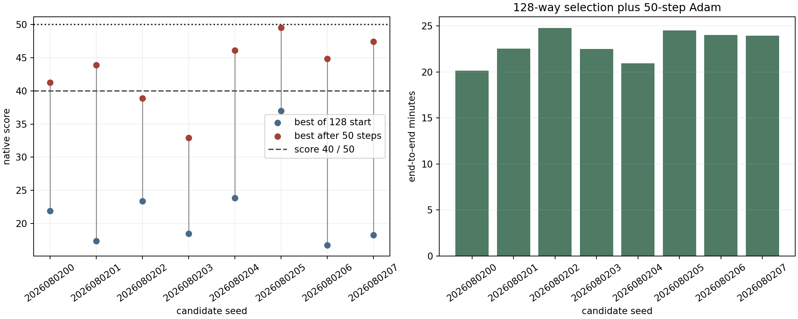

# 128 候选筛选 + 50-step Adam 多种子实验报告

- 日期：2026-08-02
- 分支：`qh-flow-screened-adam`
- 远端结果：`~/local_surface_evaluator/runs/qh_screened_start_adam_20260802_nfp4_nc3`

## 1. 结论

本实验检验了一个简单的两阶段策略：每组先从 flow prior 独立采样 128 个潜变量，全部走当前 C++/CUDA 原生 score，取最高分者，再从该点运行 50 轮修正版零阶 Adam。

在固定的 `nfp=4, n_coils=3` 条件下，8 个独立种子的结果为：

- 最高分达到 40 的有 6/8 组，命中率为 75%。
- 没有一组达到 50；最高结果为 `49.5427`。
- 最高分的中位数为 `44.3686`，均值为 `43.1026`。
- 相对真实 Adam 初值，最高分增益的中位数为 `20.7762`，均值为 `20.9796`。

因此，这个策略明显优于直接从单个随机点开始，能够以较高概率进入 40 分区，但还不能称为“稳定突破 40”，也没有突破 50 分关卡。由于首轮结果尚未达到用户设定的“效果不错后再扩展组合”的条件，本次没有继续测试其他 `(nfp,n_coils)`。

## 2. 固定实验协议

每个种子严格执行相同流程：

1. 从标准高斯分布采样 128 个形状为 `(3,100)` 的潜变量。
2. 在 GPU 上使用 FP32、RK4-256 批量通过 flow matching 模型解码。
3. 使用 4 张 RTX 5090 并行运行原生 C++/CUDA score，选择 128 个候选中分数最高者。
4. 将其潜变量单独重解码、重评分，作为 Adam 的真实初值。
5. 运行 50 轮零阶 Adam，每轮使用 4 个正交反对称方向。
6. 保存 running best；本实验不做磁面、alpha/nu 或 DESC 完整评估。

Adam 参数固定为：

| 参数 | 值 |
|---|---:|
| 学习率 | `0.01` |
| `beta1` | `0.5` |
| `beta2` | `0.999` |
| 有限差分扰动 | `0.005` |
| 每轮方向数 | `4` |
| flow 解码 | FP32 RK4-256 |

鲁棒策略沿用先前修正版：任一方向端点不是 `status=ok` 时，整轮不更新参数和 Adam 动量；所有端点有效时仅对明显离群的方向差分做 median/MAD 自适应缩尾；更新中心无效时回滚参数、动量和 Adam step，并尝试固定比例的可行性回溯。

固定数值依赖为：

- flow checkpoint SHA-256：`39a3293a459e248a0d1ec062607a1a467128b14d8ca973aadd82e113532ab99f`
- native score library SHA-256：`4bf7a12ea3dbdef9faf6de3ce4dc1840ecf48847ba795267500dd4179f730708`

## 3. 逐组结果

“筛选分”是 128 样本批量 FP32 解码时的记录；“Adam 初值”是选中潜变量单样本重解码后的实际评分。二者最大绝对差为 `0.0595`，属于不同 GPU GEMM 批形状产生的 FP32 解码差异。优化增益一律以 Adam 初值计算。

| 候选种子 | 筛选分 | Adam 初值 | 50 步内最高分 | 增益 | 有效 Adam step | 筛选耗时 / s | 端到端 / min |
|---:|---:|---:|---:|---:|---:|---:|---:|
| 2026080200 | 21.987 | 21.929 | 41.238 | 19.309 | 50 | 175.0 | 20.13 |
| 2026080201 | 17.345 | 17.366 | 43.874 | 26.507 | 50 | 172.8 | 22.53 |
| 2026080202 | 23.360 | 23.374 | 38.900 | 15.525 | 50 | 169.6 | 24.77 |
| 2026080203 | 18.555 | 18.496 | 32.907 | 14.412 | 25 | 176.5 | 22.50 |
| 2026080204 | 23.862 | 23.842 | 46.085 | 22.243 | 50 | 175.9 | 20.95 |
| 2026080205 | 36.919 | 36.968 | 49.543 | 12.575 | 50 | 175.3 | 24.53 |
| 2026080206 | 16.767 | 16.759 | 44.864 | 28.104 | 50 | 182.4 | 24.02 |
| 2026080207 | 18.235 | 18.250 | 47.411 | 29.161 | 50 | 199.2 | 23.93 |

第四组是主要失败模式：50 轮中只有 25 轮获得完整有效的反对称端点，其余轮次按鲁棒策略跳过，最高分停在 `32.9074`。第三组完成了全部 50 次更新，但在 40 分以下收敛。其余 6 组均突破 40。

值得注意的是，最高起点 `36.9681` 的增益反而最小，而两个约 17 至 18 分的起点分别获得 `28.1044` 和 `29.1609` 的增益。128 候选中的起始 score 有帮助，但它仍不是局部盆地可优化性的充分指标。

## 4. 耗时与运行验收

候选生成、解码、128 次原生评分和最高分选择平均耗时 `178.35 s`，中位数 `175.61 s`。Adam 进程平均耗时 `1196.91 s`。完整的“开始生成 128 个候选到 50-step Adam 结束”平均耗时为 `1375.26 s`，即 `22.92 min`；中位数为 `23.23 min`，范围为 `20.13--24.77 min`。

Slurm 作业为 `30788_0` 和 `30790_[1-7]`。后七组均以 `0:0` 完成。首组的 50-step 数值任务也完整完成，但最初收尾断言错误地要求批量筛选分和单样本重评分在 `1e-4` 内相同，因此作业外壳退出 `1:0`；其完整优化结果未受影响，修正后直接从已有产物恢复摘要，没有重跑或篡改数值结果。首组端到端时间由相邻产物时间戳恢复为 `1208 s`，与 Slurm 总时长 `1213 s` 相差 5 秒的作业启动/收尾开销。

所有 8 组的 GPU postflight 最大显存占用均为 `2 MiB`，利用率为 `0--1%`，没有遗留计算进程。代码入口为：

- `scripts/slurm_qh_screened_start_adam.sh`
- `scripts/select_qh_screened_adam_start.py`
- `scripts/summarize_qh_screened_start_adam.py`
- `scripts/analyze_qh_screened_start_adam.py`

聚合原始数据见 `reports/assets/qh_screened_start_adam_20260802/multiseed_summary.json`，每个种子的选择摘要、实验摘要和 Adam 进度图也保存在同一目录下。

## 5. 判断与下一步

本实验回答了当前问题：128 选 1 能把随机起点的质量提高到“不太优但不小”的范围，接 50-step Adam 后有 75% 的样本进入 40 分区；但是 40 分并不稳定，50 分在 8 组中一次也没有达到。

如果下一步仍以突破 50 为目标，比立即换 `(nfp,n_coils)` 更直接的对照是保留相同 128 候选协议，把 50 步延长到 100 或 150 步，并继续保留 running best。理由是本轮 6 个成功轨迹中有 5 个最高分出现在第 50 步，最高的 `49.5427` 也仍在上升，说明 50 步对部分盆地是人为截断；但第四组的大量无效端点说明单纯延长并不能修复所有失败盆地。

本次按要求没有运行任何完整物理评估。
