# 两基线线圈 QH 潜空间 Adam 条件实验报告

> 日期：2026-08-03
>
> 分支：`qh-small-condition-adam`
>
> 条件：两根基线线圈；分别考察 $N_{\mathrm{FP}}=4$ 与 $N_{\mathrm{FP}}=6$
>
> 目标：从 128 个随机 flow 潜变量中选择最佳起点，再运行 200 步 Adam，并保存每一步的完整线圈。第 1--9 节是四周期实验及其完整物理评估；第 10 节是六周期条件下对修复版优化器的快速评分实验；第 11 节补充六周期最优解的完整物理评估。

## 1. 结论先行

本次实验成功完成。128 个随机起点中的最佳 corrected native score 为 $78.8386$；重新单点评分为 $78.8418$。200 步 Adam 在第 184 步达到最佳分数

$$
S_{\max}=85.7731,
$$

相对起点提高 $6.9313$ 分，最终一步为 $85.1066$。最优点不是 $\iota\simeq0$ 的退化圆线圈：其快速评分给出的 $\iota=1.47284$，体平均 QH 单位螺旋度误差为 $1.3675\times10^{-2}$，并且 QH 分别优于 QA、QP 约 $9.59$ 倍和 $2.17$ 倍。

完整评估找到了连续分支上的大磁面 $s=0.49$，体积为 $0.0671413\,\mathrm{m}^3$。该面的独立面 QS 误差为

$$
\epsilon_{\mathrm{QA}}=5.4361\times10^{-3},\qquad
\epsilon_{\mathrm{QH}}=4.6577\times10^{-5},\qquad
\epsilon_{\mathrm{QP}}=5.4660\times10^{-3}.
$$

因此 QH 面误差比 QA、QP 分别低约 117 倍。Poincare 检查通过；DESC 初始和最终都保持嵌套，平均归一化力残差从 $1.6651$ 降到 $3.9577\times10^{-3}$。DESC 在 50 步上限处返回 `success=false`，准确含义是“达到迭代上限但显著改善且保持嵌套”，不是发散。

较少的基线线圈确实明显提高了线圈工程分量：相较此前 $N_{\mathrm{FP}}=4$、三基线线圈的 score-93.166 解，coil score 从 $65.318$ 提高到 $72.799$，但体 QH 和面 QH 均变差约 6--7 倍，总分降低到 $85.773$。这说明两基线线圈能给出更规整且物理有效的 QH 解，但当前单次实验没有同时维持三线圈解的 QH 精度。

## 2. 为什么选择 $N_{\mathrm{FP}}=4$、两根基线线圈

用户要求尝试更小的 $N_{\mathrm{FP}}$ 或线圈数。本次只改变线圈数，将熟悉条件从三根基线线圈降到两根，同时保留 $N_{\mathrm{FP}}=4$。这不是随意选择：corrected 1024-QUASR 标定中，该条件共有 102 个样本，`status=ok` 比例为 74.5%；可行样本的 score 中位数/最大值为 $84.943/94.464$，coil score 中位数/最大值为 $70.145/77.712$。它既有较高可行率，也明确展示了比三基线线圈更好的工程分量上限。

这组实验只能回答“两基线线圈的一次 128+200 优化能做到什么”，不能据此声称它是所有 $N_{\mathrm{FP}}$ 和线圈数中的全局最优条件。

## 3. 优化流程与可复现设置

### 3.1 起点筛选

1. 固定 $N_{\mathrm{FP}}=4$、两根基线线圈，采样 128 个独立标准高斯潜变量，形状为 $2\times100$。
2. 使用训练完成的 flow matching 模型，以 FP32、RK4-256 正向解码为线圈系数和电流。
3. 全部候选进入 ABI-9 C++/CUDA corrected score 链路，按总 score 选择最佳起点，不做人工预筛。
4. 候选 seed 为 `2026080320`；63 个 `ok`、30 个 `drift_rejected`、28 个 `no_axis`、7 个 `no_surface`。

128 个起点的总分均值、中位数、P90、P95 和最大值分别为 $23.3530$、$0.3876$、$73.4833$、$75.8912$ 和 $78.8386$。低中位数来自失败样本的门控低分，不代表可行样本的条件分布。

### 3.2 200 步 Adam

优化器从筛选出的潜变量开始，Adam 动量清零。设置为：

| 参数 | 数值 |
|---|---:|
| optimizer seed | `2026180320` |
| 步数 | 200 |
| 学习率 $\eta$ | 0.01，常数 |
| $(\beta_1,\beta_2)$ | $(0.5,0.999)$ |
| SPSA 扰动尺度 | 0.005 |
| 每步反向扰动方向 | 4 |
| flow 解码 | FP32 RK4-256 |
| 无效方向策略 | 整步跳过 |
| 中心无效回退 | $0.5,0.25,0.125$ |
| flow checkpoint SHA-256 | `39a3293a459e248a0d1ec062607a1a467128b14d8ca973aadd82e113532ab99f` |
| ABI-9 CUDA 库 SHA-256 | `40dca7422995a91eab0a58285d9ced59a8e3be04a96b2b37686effbe6f1abff5` |

200 轮中实际应用 199 次更新。最佳点在第 184 步；从该最佳点估计第 185 步梯度时出现一次明确的脏梯度事件。四个方向差值为 $-1.4236,-2.4929,-0.2096,13.1736$，最后一个方向贡献了方向差平方和约 95.5%，使梯度 RMS 从第 184 步的 15.71 突增到 337.11。该步更新 RMS 为 0.04218，约为此前 20 步中位数的 18.3 倍，score 一步从 85.7731 回撤到 84.7042。污染还通过一阶动量延续到随后两步；第 200 步虽恢复到 85.1066，仍比最佳点低 0.6664。因此交付和完整评估使用最佳 checkpoint，而不是机械使用第 200 步。

旧方向过滤器只在同一步的四个方向内计算中位数/MAD。第 185 步的自适应阈值被当步整体偏大的差值抬到 15.666，使 13.174 没有被识别为离群；所有扰动端点和更新后中心又都是 `status=ok`，而中心回退只处理无效状态，不处理“有效但 score 大幅下降”，所以该步及其 Adam 动量被完整保留。仅凭保存的数据不能区分异常端点是评分毛刺还是目标函数真实的局部陡崖，但对有限差分优化器而言，它都不是可靠的局部梯度。该缺口已经由第 9 节的跨步滚动尺度 guard 修复。

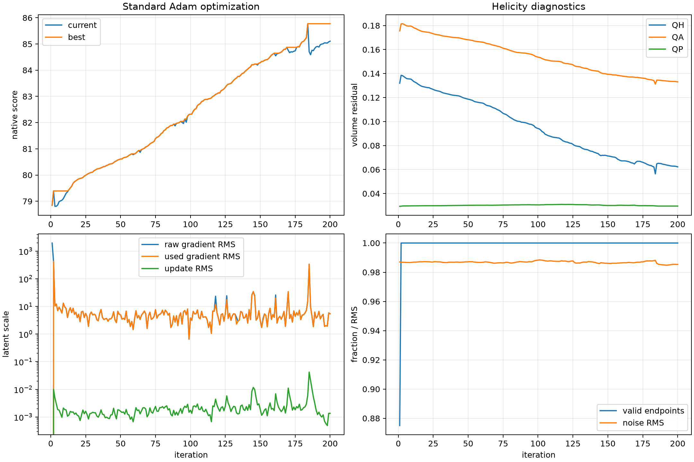

### 3.3 每一步线圈的保存方式

逐步产物位于 [trajectory 目录](assets/qh_small_condition_adam_nfp4_nc2_20260803/adam/trajectory/)，从 `step_0000.json` 到 `step_0200.json` 共 201 个原子写入的 JSON。每个文件都包含：

- 当前完整潜变量；
- 两根基线线圈各自的 $x[33]$、$y[33]$、$z[33]$ 傅里叶系数；
- 每根线圈的电流，单位为 A；
- ABI-9 的总 score、全部七个分量、物理诊断和阶段耗时；
- 当前 Adam 的简化状态及迭代编号。

因此后续即使 flow 模型或 score 配比改变，也能从任意一步的真实线圈重新评分或进行完整评估，不需要从折线图反推数据。另有 [best.json](assets/qh_small_condition_adam_nfp4_nc2_20260803/adam/best.json)、[history.jsonl](assets/qh_small_condition_adam_nfp4_nc2_20260803/adam/history.jsonl) 和 [candidate pool](assets/qh_small_condition_adam_nfp4_nc2_20260803/candidate_pool/) 保存最佳点、优化器历史与全部 128 个候选。

## 4. 快速 score 结果

| 指标 | 起点 | 最佳点 |
|---|---:|---:|
| native score | 78.8418 | **85.7731** |
| QH/单位螺旋度 | $3.2007\times10^{-2}$ | **$1.3675\times10^{-2}$** |
| QA/单位螺旋度 | $1.7554\times10^{-1}$ | $1.3121\times10^{-1}$ |
| QP/单位螺旋度 | $2.9375\times10^{-2}$ | $2.9722\times10^{-2}$ |
| $\iota$ | 1.3572 | **1.4728** |
| coil score | 73.1652 | 72.7989 |

最优点的完整 score 分量为：

| 分量 | 数值 |
|---|---:|
| axis | 93.4353 |
| psi | 97.5314 |
| surface | 97.2352 |
| coordinate | 87.5985 |
| volume QS | 77.0693 |
| iota | 100.0000 |
| coil | 72.7989 |

QH 误差下降约 57.3%，而 coil score 在总分最佳点仅下降 0.37 分。也就是说，这一轮提分主要来自物理质量改善，不是用明显恶化线圈工程性质换来的。coil score 始终处在同条件 QUASR 的主体范围内。

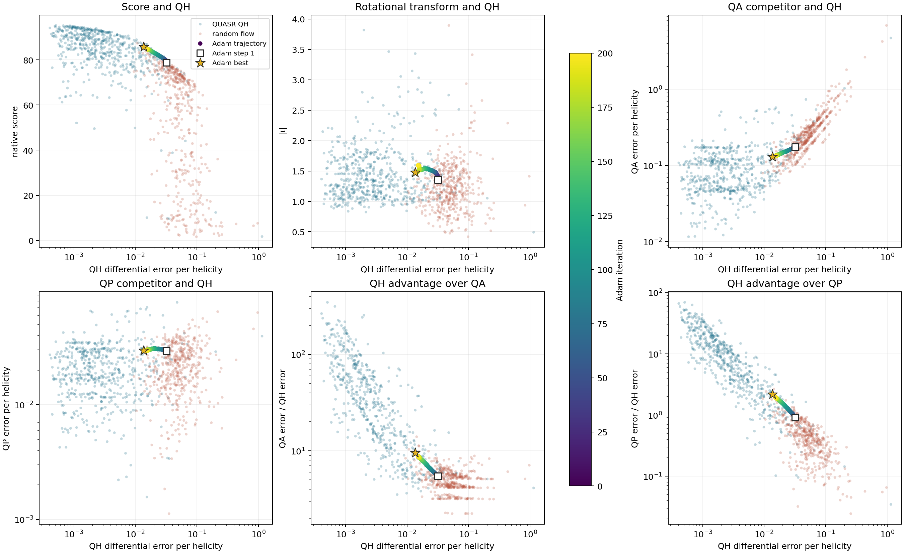

下图是本次额外要求的真实“线圈工程 score--QH”轨迹。背景只高亮与实验完全相同的 $(N_{\mathrm{FP}},N_{\mathrm{coil}})=(4,2)$ 条件；轨迹中每个点都来自对应 `step_NNNN.json`，不是用首尾点插值。


## 5. 完整物理评估

### 5.1 source $\psi$ 与大磁面选择

完整评估重新针对当前样本并行测试 $a=0.04,0.05,0.06,0.08$，没有复用旧样本的 $a$ 或 $s$。最终选择 $a=0.08$：使用 389,440 个训练点、1,574 个模态和 GPU FP32 QR，$\psi$ 训练/验证 RMS 为 $6.8624\times10^{-4}/6.8279\times10^{-4}$，验证角度误差 P95 为 $1.1660\times10^{-4}$。该 source 在廉价筛选的 $s=0.36$ 处平均半径已达 $0.04798\,\mathrm m$，物理覆盖最大。

随后使用相同的 GPU alpha+nu 初值和标准 LS/Newton，沿 $s$ 逐层检查连续分支：

| $s$ | 标准求解 | 连续分支 | $|V|\,[\mathrm m^3]$ |
|---:|---|---|---:|
| 0.12 | 通过 | 通过 | 0.0157512 |
| 0.20 | 通过 | 通过 | 0.0266989 |
| 0.24 | 通过 | 通过 | 0.0322901 |
| 0.30 | 通过 | 通过 | 0.0408206 |
| 0.36 | 通过 | 通过 | 0.0495330 |
| 0.49 | 通过 | **通过并选中** | **0.0671413** |
| 0.64 | 形式通过 | **内分支跳变，拒绝** | 0.0531968 |

$s=0.64$ 的 Newton 本身收敛，但体积比 $s=0.49$ 更小，最终拟合的平均 $s$ 也回落到约 0.383，而不是目标 0.64，因此这是明确的内分支跳变，不能冒充更大的外层面。

该外层最初因固定 180,000 点预算只生成 166,595 个有效 GPU-ray 候选而在 alpha 前停止。调查确认旧代码把候选 oversampling 固定为 1.25，`grid_xy` 只属于禁用的 legacy Cartesian 后端，不能控制 GPU-ray 密度。修复后新增独立的 `ray_candidate_oversampling`，默认仍为旧值 1.25；只在这个边缘外层候选上设为 1.6，得到 214,256 个有效候选，同时训练/验证点数、FP32 求解和下游算法不变。该改动仅修复候选点不足，最终仍由分支连续性把 $s=0.64$ 拒绝。

### 5.2 选中面的精度与 QS

$s=0.49$ 标准面使用 $\iota=1.5270221$、$G=-6.8677638\,\mathrm{T\,m}$。LS 残差为 $2.77\times10^{-13}$，Newton 在第 0 步即满足阈值。独立 $97\times97$ 离网格验证为：

| 指标 | 数值 |
|---|---:|
| 相对 $L_2$ 残差 | $3.8360\times10^{-5}$ |
| 点相对误差 P95 | $8.0563\times10^{-5}$ |
| 方向正弦 $L_2$ | $3.5688\times10^{-5}$ |
| 法向场正弦 P95 | $5.7532\times10^{-5}$ |

这里的 LS/Newton 残差是 Boozer 面方程误差；面 QS error 是独立的 $|B|$ 对称性诊断，两者不能混为同一数值。选中面的面 QH 误差为 $4.6577\times10^{-5}$，比 QA/QP 分别低约 117 和 117 倍。

Poincare 的 8 条内部场线在四个截面分别取得 19--21 个交点，全部保持在所选边界内。真空面上的 $|B|$ 范围为 $0.66783$--$0.85436\,\mathrm T$，平均 $0.76191\,\mathrm T$。

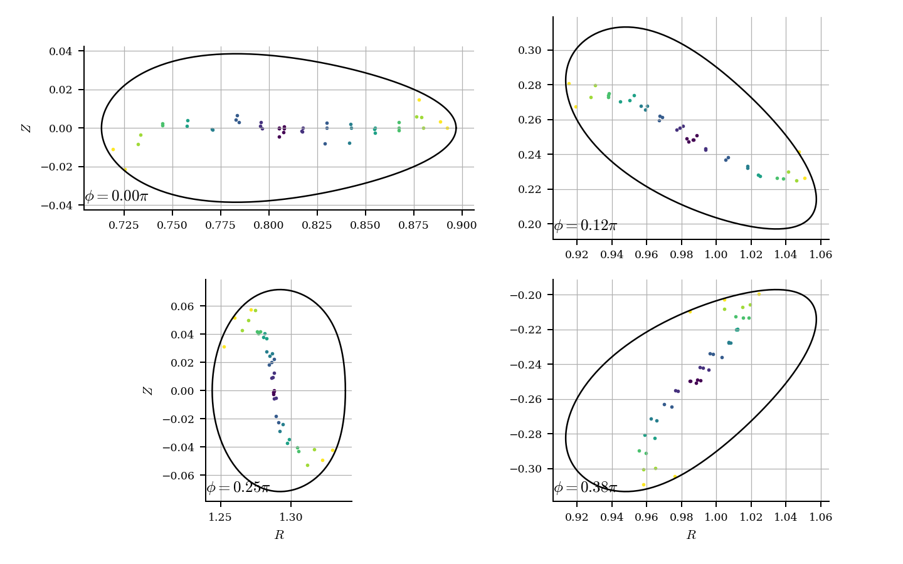

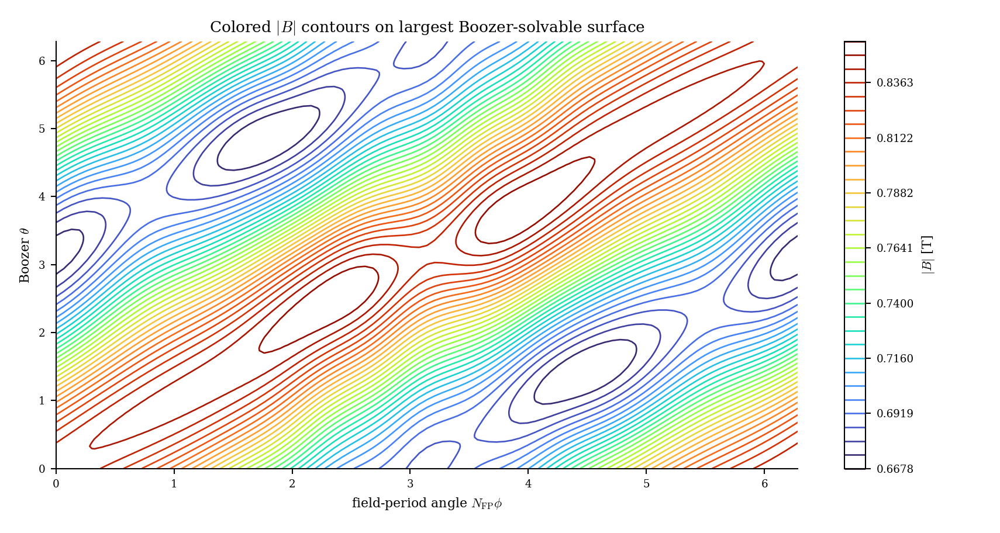

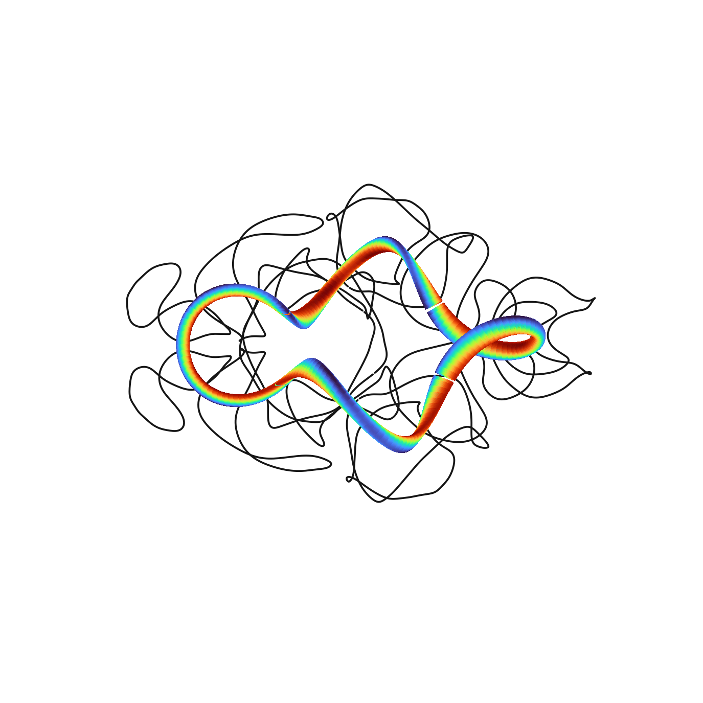

交互产物：[Boozer $|B|$ HTML](assets/qh_small_condition_adam_nfp4_nc2_20260803/full/assets/boozer_b.html)，[全部线圈与大磁面 HTML](assets/qh_small_condition_adam_nfp4_nc2_20260803/full/assets/coils_surface.html)。交互三维图按一个闭合场周期采样并旋转复制，不额外镜像磁面，因此不存在周期首尾被错误连接的问题。

### 5.3 DESC 复核

DESC 使用 CPU，这是允许的完整评估例外；alpha+nu、场计算和可大批量并行的原生链路均未回退到 legacy CPU。输入环向磁通为 $-5.66019\times10^{-3}\,\mathrm{Wb}$，初始和最终都通过嵌套检查。

| 归一化力残差 | 初始 | 最终 |
|---|---:|---:|
| mean | 1.66513 | $3.95768\times10^{-3}$ |
| P95 | 2.78130 | $8.63701\times10^{-3}$ |
| max | 5.34823 | $2.49390\times10^{-2}$ |

50 步后 cost 为 $4.8444\times10^{-3}$、optimality 为 $5.6350\times10^{-4}$。由于命中迭代上限，报告保留 `success=false`，但残差降低、嵌套性和所有图均是有效的物理诊断证据。


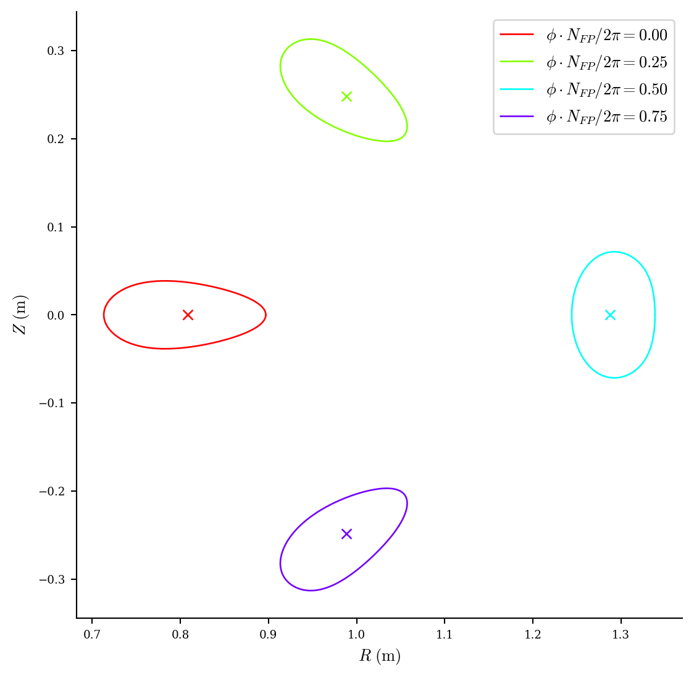

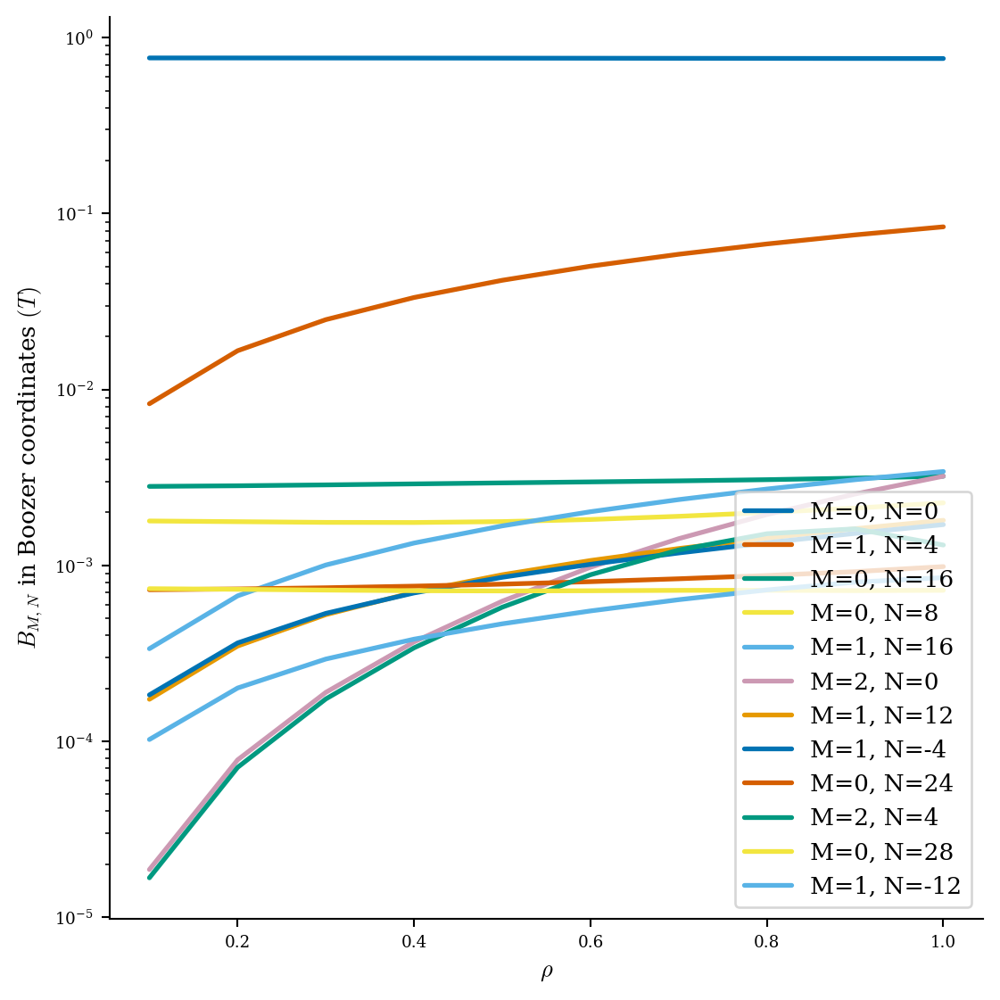

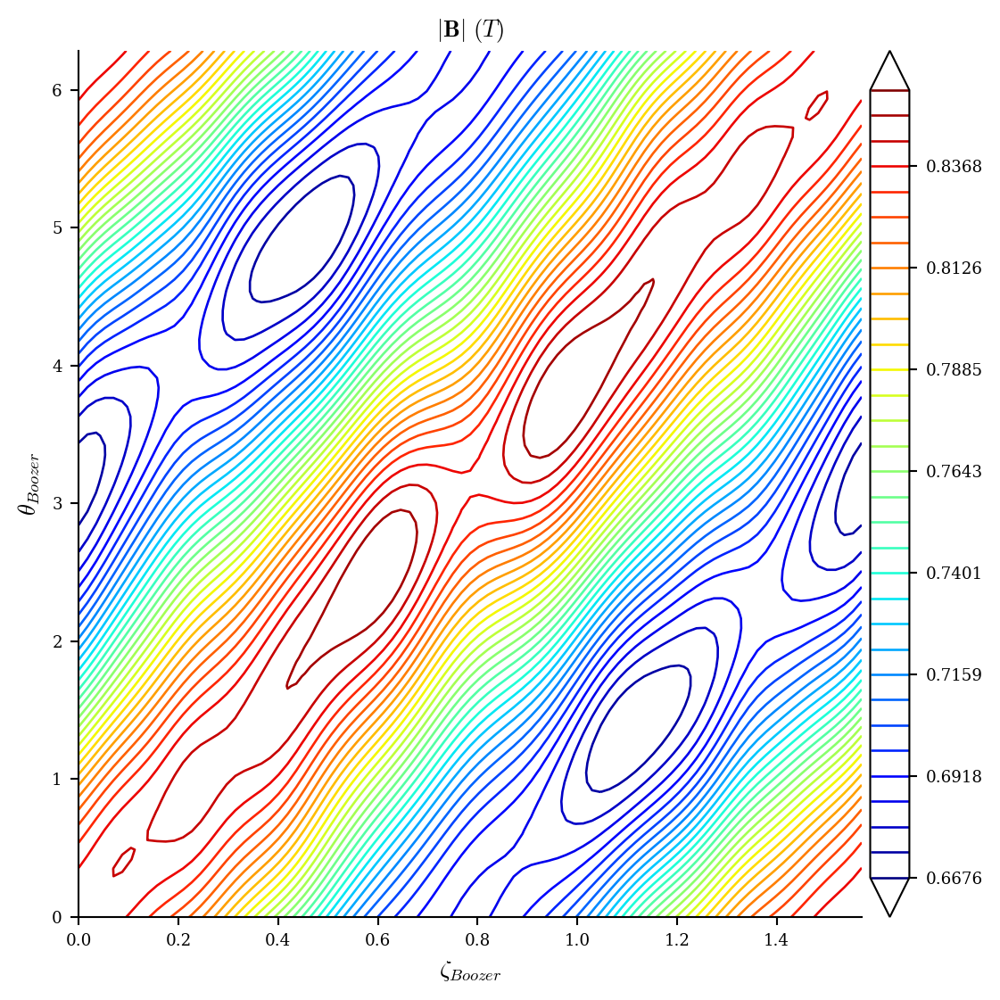

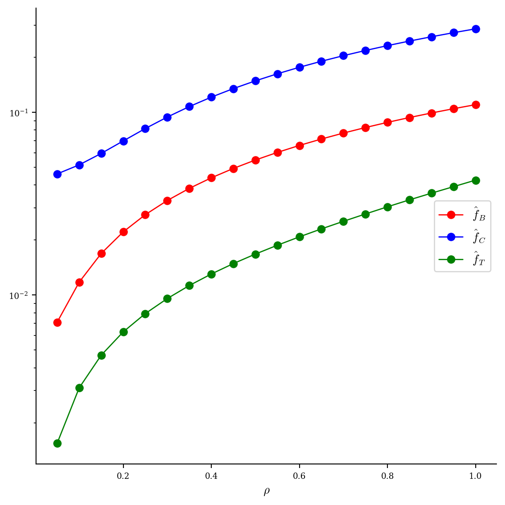

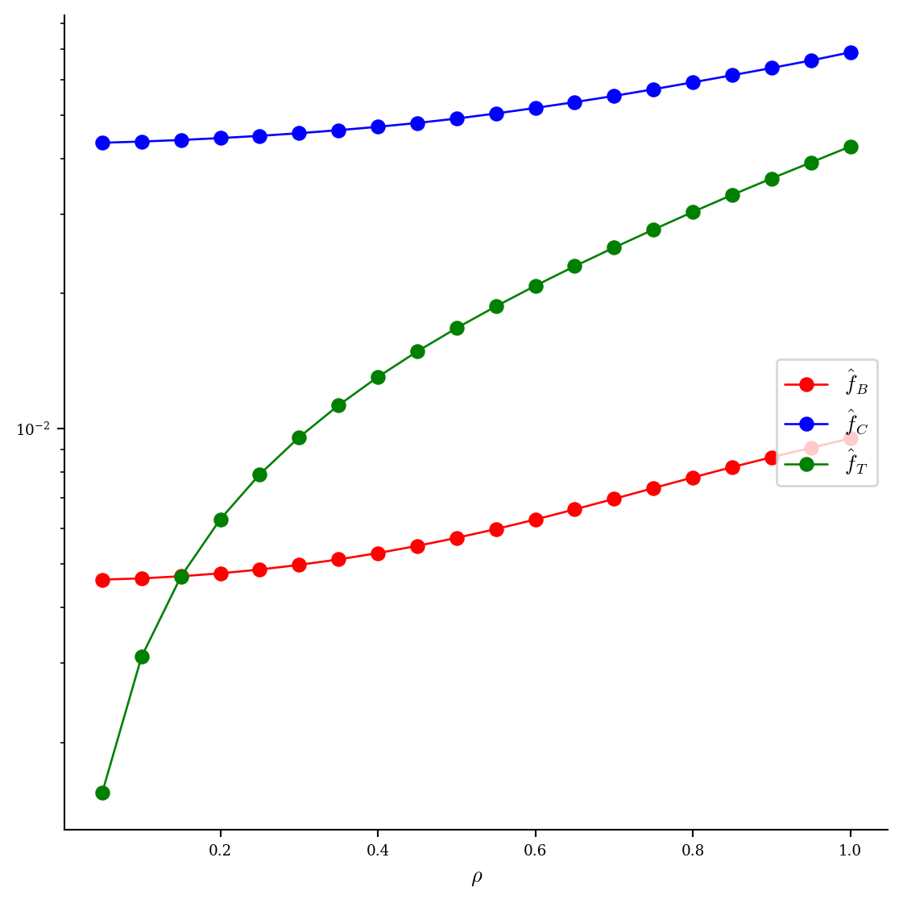

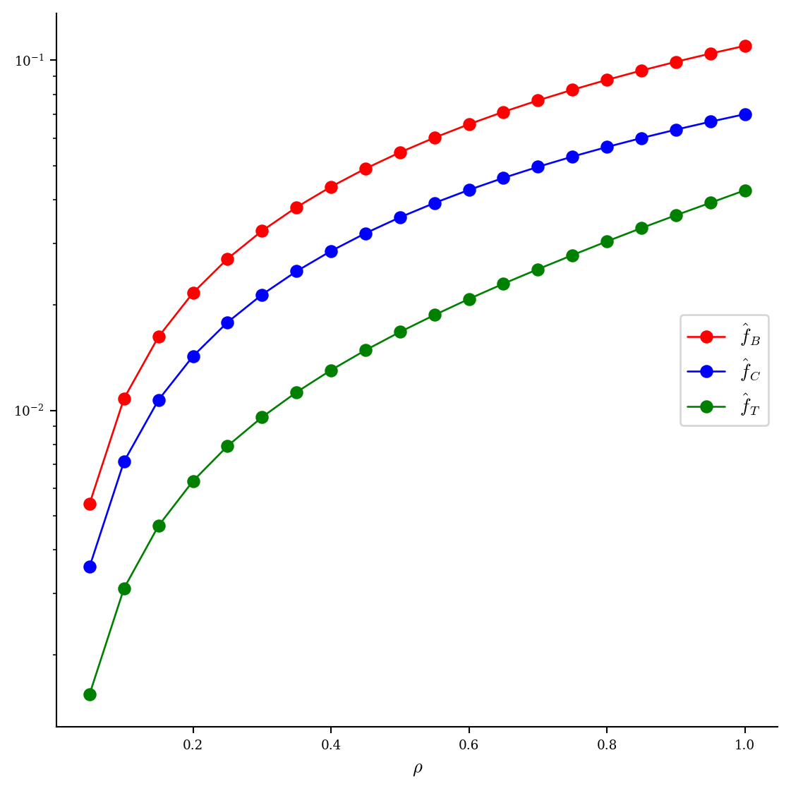

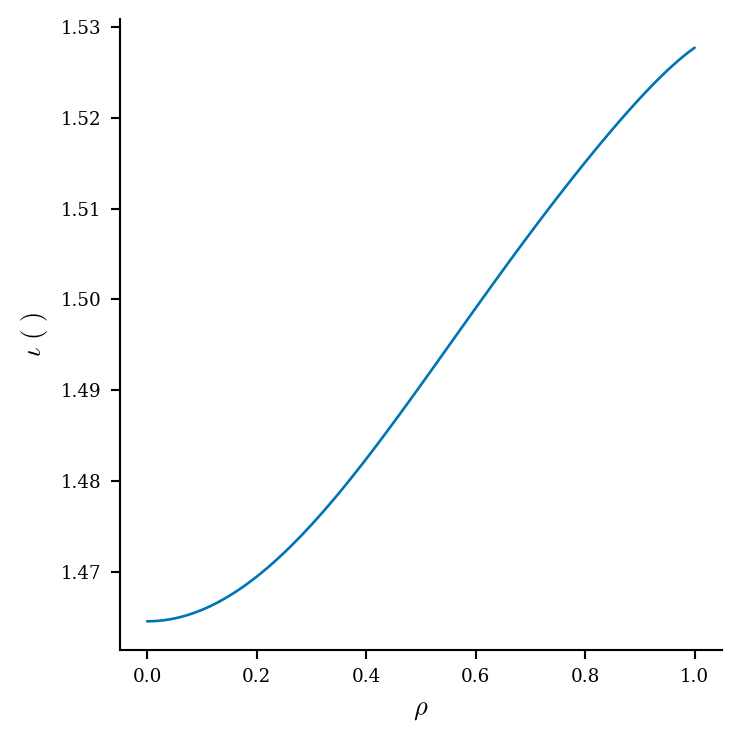

## 6. 耗时

| 阶段 | 资源与并行方式 | 墙钟时间 |
|---|---|---:|
| 128 个 flow 起点解码与筛选 | 4 卡，8 个 score worker | 138.72 s |
| 200 步 Adam | 4 卡，每步 4 个反向方向 | 3460.78 s |
| 优化全程 | 4 卡 | **3599.50 s（59 min 59.5 s）** |
| 四个 source $a$ | 4 卡并行作业 | 9--12 s/作业；$a=0.08$ 内部 4.24 s |
| 每个 alpha+nu+LS/Newton 面候选 | 独占 1 卡，候选间并行 | 约 3 min/候选 |
| Poincare、可视化与 CPU DESC | 16 CPU | 315.68 s |
| 其中可视化 | CPU/GPU 原生结果读取 | 22.27 s |
| 其中 DESC | CPU | 255.19 s |

正式优化前四张卡连续空闲检查通过；结束后四卡均为 0% 利用率、2 MiB 显存且无计算进程。作业退出码为 0。末尾只有 Python 对已清理 semaphore 的重复清理 warning，不影响 200 条历史和 201 个逐步产物。

## 7. 与三基线线圈结果比较

比较对象是此前相同 $N_{\mathrm{FP}}=4$、三基线线圈、corrected ABI-9 下的 200 步最佳解；两者都经过完整评估。

| 指标 | 3 基线线圈 | 本次 2 基线线圈 | 变化 |
|---|---:|---:|---:|
| native score | 93.1656 | 85.7731 | $-7.3925$ |
| coil score | 65.3177 | **72.7989** | **$+7.4812$** |
| 体 QH/单位螺旋度 | $2.3003\times10^{-3}$ | $1.3675\times10^{-2}$ | 约 5.95 倍高 |
| 最大连续面体积 $\mathrm m^3$ | 0.0639922 | **0.0671413** | **$+4.92\%$** |
| 面 QH error | $6.5239\times10^{-6}$ | $4.6577\times10^{-5}$ | 约 7.14 倍高 |
| DESC 最终 force mean | $2.3306\times10^{-3}$ | $3.9577\times10^{-3}$ | 约 1.70 倍高 |

本次较小线圈条件的优势很明确：工程分量提高 7.48 分，并且得到的连续磁面略大。代价也同样明确：QH 精度和 DESC 最终残差均不如三线圈解。它不是失败或 score 作弊，因为独立面 QS、Poincare 和 DESC 都验证了真实 QH 磁面；但它也没有证明“减少线圈数会提高总 score”。更准确的结论是，当前目标中两线圈条件位于更好的工程性质、较弱的 QH 精度这一 Pareto 方向。

## 8. 产物与校验

完整机器可读产物位于 [本次资产目录](assets/qh_small_condition_adam_nfp4_nc2_20260803/)。关键文件：

- 最佳线圈：[adam/best.json](assets/qh_small_condition_adam_nfp4_nc2_20260803/adam/best.json)
- 每步完整线圈：[adam/trajectory](assets/qh_small_condition_adam_nfp4_nc2_20260803/adam/trajectory/)
- 优化摘要：[experiment_summary.json](assets/qh_small_condition_adam_nfp4_nc2_20260803/experiment_summary.json)
- 大磁面选择：[selection.json](assets/qh_small_condition_adam_nfp4_nc2_20260803/selection.json)
- 完整评估摘要：[full_summary.json](assets/qh_small_condition_adam_nfp4_nc2_20260803/full/full_summary.json)
- DESC 摘要：[desc/summary.json](assets/qh_small_condition_adam_nfp4_nc2_20260803/full/desc/summary.json)

选中 `boozer_standard.npz` 的 SHA-256 为 `8b1f4b3e43918f7a6d6f0c187a23ac669fcd4fbdf79be7696c5f0cf246854eed`；DESC `equilibrium.h5` 的 SHA-256 为 `3b89c6b3056966128ecaff4684a53af41431c8b2bef1810b547af9d0665655e0`。

## 9. 第 185 步脏梯度的修复

### 9.1 根因边界

第 185 步不是 `no_axis`、`drift_rejected` 或评分返回非有限值造成的。正确的异常反向端点为 85.3298124 与 72.1562425，差值 13.17357；它在同一步四个方向内尚未超过被整体抬高的 15.666 阈值，但使梯度 RMS 达到 337.109，是此前 20 个已接受步中位数的 67.1 倍。拟议更新 RMS 为 0.042175，是局部中位数的 18.3 倍。问题因此不是某个固定轴边界，而是“所有端点状态合法时，旧规则没有跨时间尺度判断”。

### 9.2 自适应时间尺度 guard

修复后的优化器分别维护最近 20 个已接受步的梯度 RMS 和实际更新 RMS。历史不足 20 步时不启用；之后对任一尺度 $x$ 定义

$$
L_x=\max\left(
8\,\operatorname{median}(x),
\operatorname{median}(x)+8\times1.4826\,\operatorname{MAD}(x)
\right).
$$

若当前梯度 RMS 或拟议更新 RMS 超过对应 $L_x$，该步在中心解码和评分之前拒绝。拒绝时潜变量、Adam step、一阶矩和二阶矩全部保持不变；异常值也不进入后续历史。阈值只依赖近期接受步的相对尺度，没有跨样本固定绝对上限。

因果回放保留了第 184 步的真实最优更新，并在第 185 步给出

$$
337.109>39.320,
\qquad
0.042175>0.017850,
$$

因此在两个尺度上同时拒绝该步。它还把第 170 步识别为边缘梯度离群点；该步原本造成小幅 score 回撤。旧实现中的第 186 步会因被污染动量产生异常更新，但修复后第 185 步从未写入动量，因此不会出现该继发污染。

实现位于 `scripts/optimize_flow_prior_standard_adam.py`，策略名为 `rolling_accepted_step_median_mad_v1`，默认启用，只能用显式参数关闭。单元测试覆盖 warmup、尺度不变性、MAD 分支、ratio fallback、命令行默认值和关闭开关；本地完整测试为 `134 passed`。远端四卡烟测作业 `31223` 验证了新 schema、退出和进程清理，但其 8 个随机候选没有 `status=ok`，因此只作为控制流证据。第 10 节的正式实验用于验证该 guard 在真实可优化轨迹上不会误拒正常梯度。

## 10. $N_{\mathrm{FP}}=6$、两基线线圈实验

### 10.1 协议与候选分布

本实验只把条件改为 $N_{\mathrm{FP}}=6,n_c=2$；其余协议与四周期实验一致：128 个独立高斯潜变量、FP32 RK4-256 解码、corrected ABI-9 原生评分、四个正交反向差分方向、$c=0.005$，以及 $\eta=0.01$、$(\beta_1,\beta_2)=(0.5,0.999)$ 的 200 步 Adam。候选 seed 为 `2026080360`，优化 seed 为 `2026180360`。checkpoint 与 CUDA 库 SHA-256 分别为

```text
39a3293a459e248a0d1ec062607a1a467128b14d8ca973aadd82e113532ab99f
40dca7422995a91eab0a58285d9ced59a8e3be04a96b2b37686effbe6f1abff5
```

128 个候选的状态为：38 个 `ok`、33 个 `drift_rejected`、40 个 `no_axis`、16 个 `no_surface` 和 1 个 `flux_rejected`。总分均值、中位数、P90、P95、最大值分别为 12.3292、0.3258、49.8104、69.8811、74.4333；选择 case 108，并在单点评分时得到 74.4358，两种批处理方式的差异仅为 0.00257。

### 10.2 优化结果

200 步全部完成；199 次更新被实际应用，唯一未应用的一步是时间尺度 guard 主动拒绝。最终一步同时是全程最佳点：

$$
S: 74.4358\longrightarrow 83.4689,
\qquad \Delta S=9.0330.
$$

| 指标 | 起点 | 第 200 步最佳点 | 变化 |
|---|---:|---:|---:|
| QH error/单位螺旋度 | $3.8116\times10^{-2}$ | $1.0283\times10^{-2}$ | $-73.0\%$ |
| QA error/单位螺旋度 | $2.7293\times10^{-1}$ | $1.5512\times10^{-1}$ | $-43.2\%$ |
| QP error/单位螺旋度 | $2.5153\times10^{-2}$ | $2.3546\times10^{-2}$ | $-6.4\%$ |
| $|\iota|$ | 2.0951 | 2.0843 | 基本不变 |
| coil score | 58.5193 | 60.0925 | $+1.5732$ |
| 有效逆纵横比 | 0.025306 | 0.025126 | $-0.7\%$ |

七个 score 分量的变化为：

| 分量 | 起点 | 最佳点 |
|---|---:|---:|
| axis | 92.2509 | 91.9733 |
| psi | 98.1796 | 97.8274 |
| surface | 91.0668 | 86.8690 |
| coordinate | 81.5534 | 79.0812 |
| volume QS | 55.8315 | **78.7771** |
| iota | 100.0000 | 100.0000 |
| coil | 58.5193 | 60.0925 |

提分几乎全部由 volume-QS 改善驱动，同时 coil 略有改善；axis、psi、surface 和 coordinate 反而小幅下降。起点的 QP error 低于 QH error，因此尚不是有竞争优势的 QH；末点的 QP/QH error 比达到 2.29、QA/QH 达到 15.08，才形成明确的 QH 优势。$\iota$ 始终约为 2.1，磁面尺寸基本不变，排除了低 $\iota$ 或单纯放大磁面的退化提分。

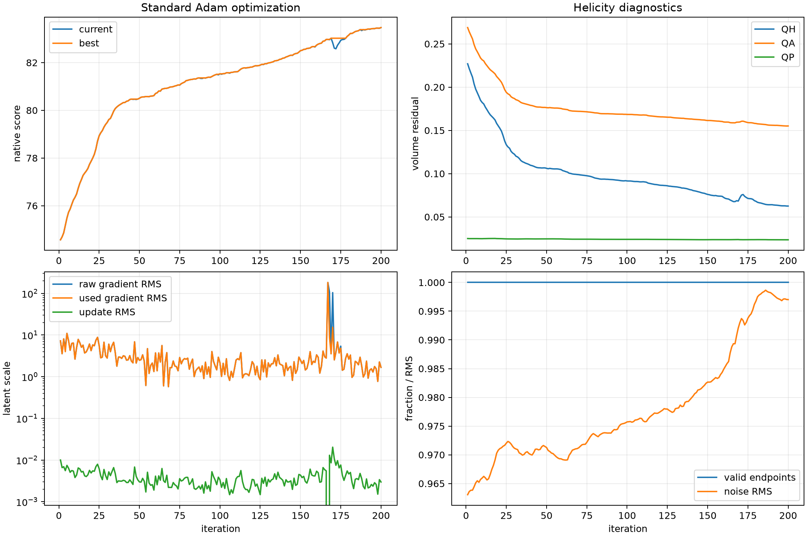


下图显示 coil score 在前约 60 步先下降到约 56，随后恢复并超过起点；因此总分上升不是把 coil 分量固定不变后的单目标曲线，而是真实多分量折中。

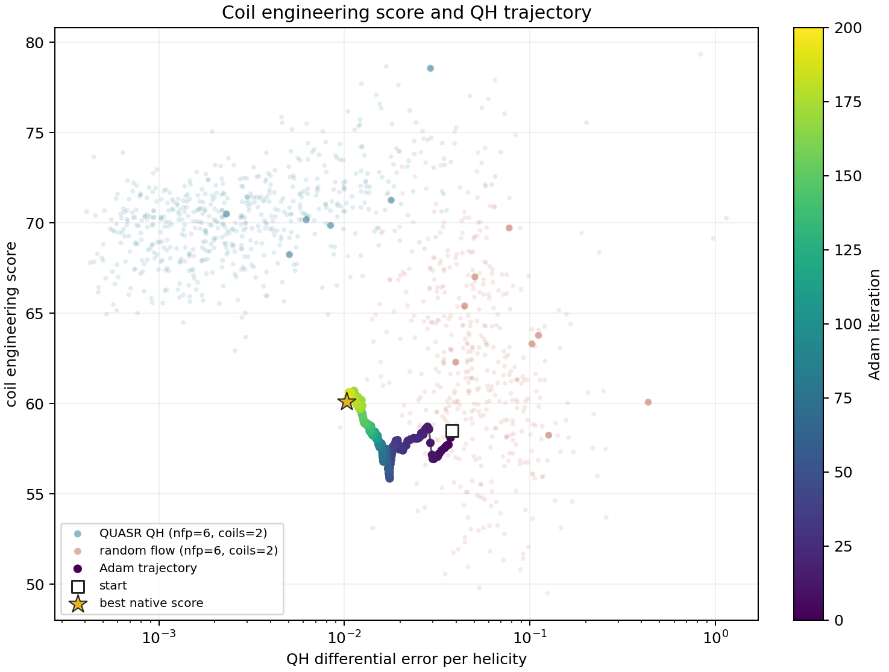

### 10.3 时间尺度 guard 的在线验证

第 167 步出现了旧规则最难处理的模式：四个反向差分中三个差值约为 $\pm4.22$，同一步的中位数随之被整体抬高，方向内阈值达到 33.72，不能识别异常。拟议梯度和更新尺度为

$$
g_{\rm RMS}=182.669>18.464,
\qquad
\Delta z_{\rm RMS}=0.05473>0.03326.
$$

跨步 guard 因而在中心解码前拒绝整步，潜变量、Adam step 和两阶动量均保持不变。该步只耗时 12.80 秒，低于普通步约 20.18 秒。第 168、170 和 175 步则各有单方向异常，方向内 winsorization 生效；其中第 170 步把差值 4.169 截到 0.605，中心只回撤 0.188 分，并在第 179 步前恢复并刷新最优。全程最大 drawdown 为 0.442 分，最终点仍是最佳点。

因此此次正式轨迹同时验证了两层规则的分工：单方向异常由同一步过滤器处理，多方向共同异常由跨步尺度 guard 处理。新 guard 不是只对旧历史量身定制，也没有在 199 个正常更新中产生系统性误拒。

### 10.4 耗时、比较与证据边界

| 阶段 | 墙钟时间 |
|---|---:|
| 128 起点解码与评分 | 163.54 s |
| 200 步 Adam | 4069.21 s |
| 端到端 | **4232.75 s（70 min 32.8 s）** |
| 普通 Adam 步均值 | 20.18 s |

四张 RTX 5090 在正式计时前后均为 0% 利用率、2 MiB 显存且无计算进程；Slurm `31227_0` 以 `COMPLETED 0:0` 结束。相较四周期两线圈解，本次 QH error 更低（0.01028 对 0.01368），但 coil、surface 和 coordinate 分量明显更差，总分因此低 2.30 分。当前 corrected 标定集中完全匹配 $(N_{\mathrm{FP}},n_c)=(6,2)$ 的 `ok` 样本只有 6 个，不能据此作精确条件分位数结论。

第 10 节形成时尚未运行 $\alpha+\nu$/Simsopt/DESC 完整评估，所以它只验证修复后优化器和快速 score；第 11 节给出后来完成的独立物理验收。完整机器可读资产位于 [六周期实验目录](assets/qh_small_condition_adam_nfp6_nc2_20260803/)；其中 [best.json](assets/qh_small_condition_adam_nfp6_nc2_20260803/adam/best.json)、[history.jsonl](assets/qh_small_condition_adam_nfp6_nc2_20260803/adam/history.jsonl) 和 [trajectory](assets/qh_small_condition_adam_nfp6_nc2_20260803/adam/trajectory/) 可直接支持后续重评分或完整评估。最佳文件 SHA-256 为 `59c1efd068ecdf0e339f882b1a055c55c86e35ea75ba5aa26cbe1d321ddc4f0`。

## 11. $N_{\mathrm{FP}}=6$ 最优解的完整物理评估

### 11.1 结论与证据边界

本节评估第 10 节 200 步 Adam 的最佳/最终样本。原生 corrected ABI-9 score 为 $83.4689$，七个分量如下：

| 分量 | 数值 |
|---|---:|
| axis | 91.9733 |
| $\psi$ | 97.8274 |
| surface | 86.8690 |
| coordinate | 79.0812 |
| volume QS | 78.7771 |
| iota | 100.0000 |
| coil | 60.0925 |

完整评估在同一连续分支上找到 $s=0.36$ 的标准 Boozer 面，体积为

$$
|V|=0.0625544\,\mathrm{m}^3,
$$

并用 $s=0.49$ 的标准拒绝和 $s=0.64$ 的坐标不可逆作为外侧失败证据。选中面通过独立 $97\times97$ 离网格残差、Poincare 和 DESC 三层检查；DESC 从初始到最终均保持嵌套。因此，第 10 节的高分不是只在快速 score 中成立的假阳性。

但本次也明确暴露出初值链路的局限。$s=0.36$ 的 $\alpha+\nu$ 初值在密网格上的相对残差仍为 $8.36\times10^{-2}$，法向场 P95 为 $8.18\times10^{-2}$；随后标准 Simsopt LS 将相对残差降至 $4.08\times10^{-5}$。所以准确结论是“$\alpha+\nu$ 提供了能被标准 LS 稳定接管的初值”，而不是“只靠 $\alpha+\nu$ 已经直接得到高精度 Boozer 面”。

### 11.2 source $\psi$ 与最大连续面

针对当前样本重新并行拟合 $a=0.04,0.05,0.06,0.08$，没有复用四周期样本的 $a$ 或 $s$。各拟合都使用约 38.9 万训练点、1,574 个模态和 GPU FP32 QR：

| $a$ | 训练 RMS | 验证 RMS | 验证角度 P95 |
|---:|---:|---:|---:|
| 0.04 | $4.4955\times10^{-4}$ | $4.5491\times10^{-4}$ | $5.9858\times10^{-5}$ |
| 0.05 | $4.9787\times10^{-4}$ | $5.0580\times10^{-4}$ | $7.4891\times10^{-5}$ |
| 0.06 | $6.1676\times10^{-4}$ | $6.3539\times10^{-4}$ | $9.5980\times10^{-5}$ |
| 0.08 | $1.0977\times10^{-3}$ | $1.1602\times10^{-3}$ | $1.9009\times10^{-4}$ |

选择 $a=0.08$ 是为了获得最大的物理覆盖；误差虽高于小半径拟合，但仍是小量。廉价场线筛选在 $s=0.16$ 开始触及 $a=0.08$ 的径向盒边界，因此它只作候选提示，不替代后续标准验收。完整 $\alpha+\nu$ 与 LS/Newton 搜索为：

| 目标 $s$ | 标准验收 | $|V|\,[\mathrm{m}^3]$ | 最终平均 $s$ | 说明 |
|---:|---|---:|---:|---|
| 0.12 | 通过 | 0.0223719 | 0.1189 | 连续分支 |
| 0.16 | 通过 | 0.0301591 | 0.1586 | 连续分支 |
| 0.20 | 通过 | 0.0376739 | 0.1960 | 连续分支 |
| 0.24 | 通过 | 0.0445591 | 0.2296 | 连续分支 |
| 0.30 | 通过 | 0.0542376 | 0.2761 | 连续分支 |
| 0.36 | **通过并选中** | **0.0625544** | 0.3163 | 最大连续标准面 |
| 0.49 | 拒绝 | 0.0675350 | 0.0408 | 错误分支；密网格验收失败 |
| 0.64 | 未进入标准求解 | -- | -- | 环向映射最小 Jacobian $-0.08353$ |

$s=0.49/0.64$ 首次各只生成 160,480/126,576 个有效 GPU-ray 点，少于固定的 180,000 点预算。复测只把 GPU-ray 候选过采样从 1.25 提高到 2.0，训练/验证点数、FP32 求解和下游算法不变，也没有回退到 legacy Cartesian CPU。复测后 $s=0.49$ 的标准解虽形式收敛，但 $\iota$ 跳到 0.9169、平均 $s$ 坍回 0.0408，密网格相对残差和法向场 P95 分别为 $1.84\times10^{-3}$ 和 $2.45\times10^{-3}$，故明确拒绝；$s=0.64$ 则在 $\nu$ 坐标可逆性检查处更早失败。

### 11.3 选中 Boozer 面

$s=0.36$ 标准面使用

$$
\iota=2.3003895,
\qquad
G=-8.2743328\,\mathrm{T\,m}.
$$

LS 残差为 $6.01\times10^{-13}$，Newton 在第 0 步即满足阈值。独立 $97\times97$ 离网格验证为：

| 指标 | 数值 |
|---|---:|
| 相对 $L_2$ 残差 | $4.0804\times10^{-5}$ |
| 点相对误差 P95 | $8.8608\times10^{-5}$ |
| 法向场正弦 P95 | $5.3022\times10^{-5}$ |

选中面的独立面 QS error 为

$$
\epsilon_{\mathrm{QA}}=6.1462\times10^{-3},\qquad
\epsilon_{\mathrm{QH}}=2.3357\times10^{-4},\qquad
\epsilon_{\mathrm{QP}}=6.5015\times10^{-3}.
$$

因此 QH 面误差比 QA、QP 分别低约 26.3 和 27.8 倍，具有明确的 QH 竞争优势。快速 score 的体 QH 单位螺旋度误差为 $1.0283\times10^{-2}$，约为外层面 QH error 的 44 倍；两者分别是体微分统计和单面 $|B|$ 谱误差，定义与权重不同，不能把这个倍数解释为代码不一致，但它们对“目标对称性是 QH”的判断一致。

8 条内部场线在四个截面上均取得 29 个交点，并保持在黑色候选边界内。真空面上的 $|B|$ 范围为 $0.80095$--$1.03159\,\mathrm T$，平均 $0.90720\,\mathrm T$。

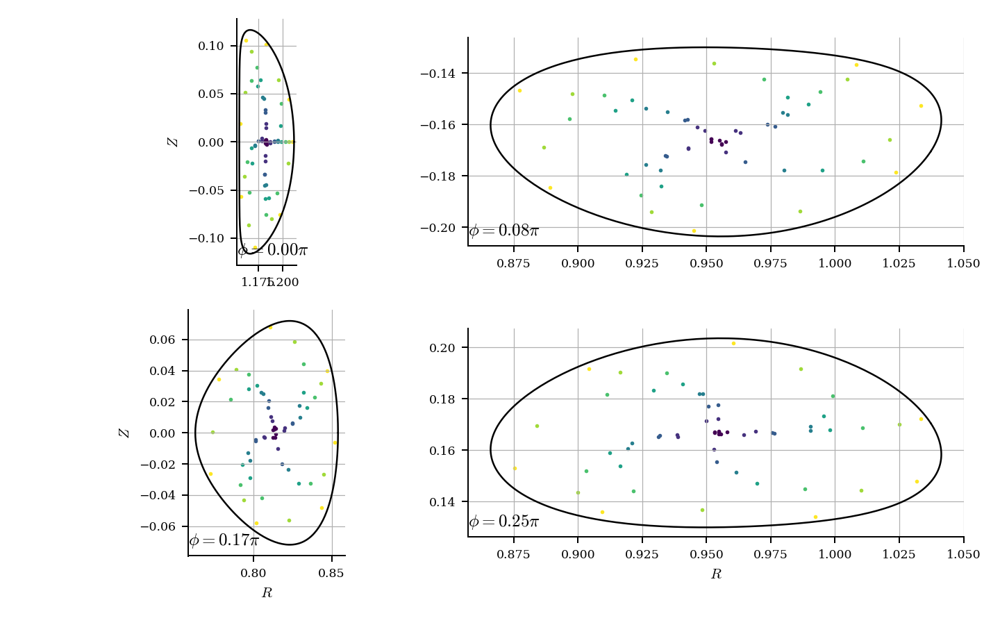

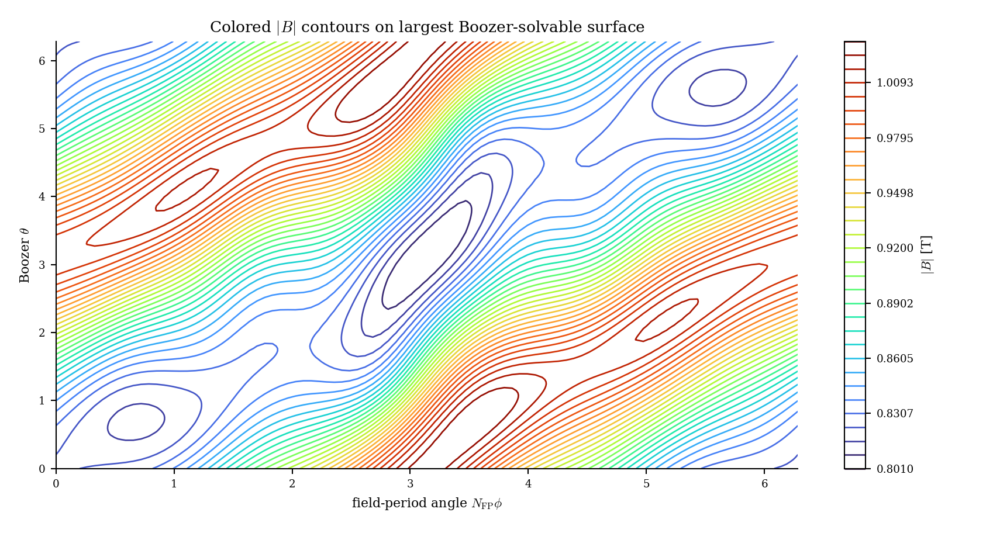

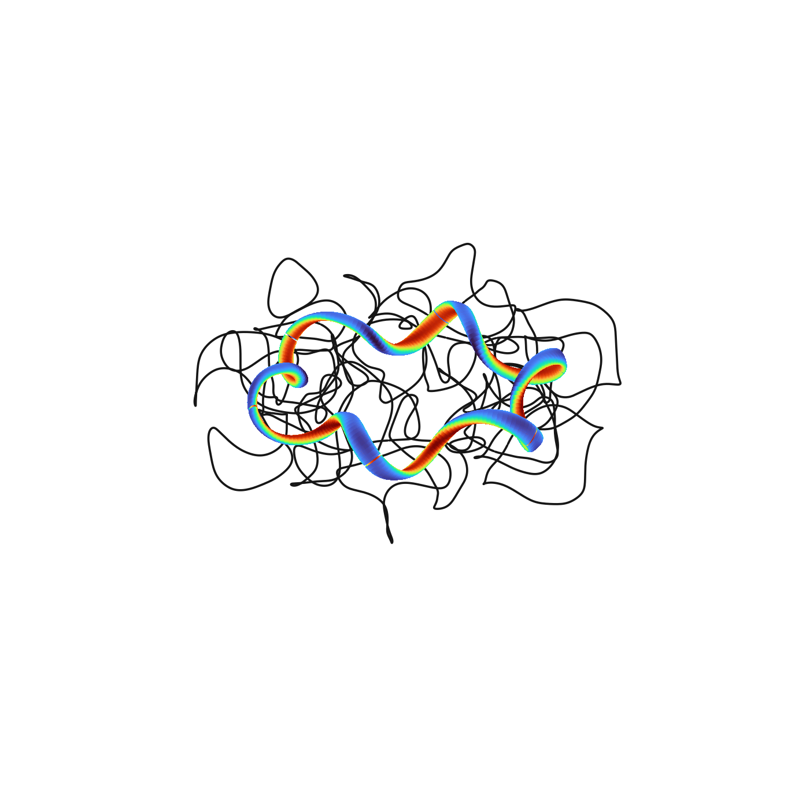

交互产物：[Boozer $|B|$ HTML](assets/qh_small_condition_adam_nfp6_nc2_20260803/full/assets/boozer_b.html)，[全部线圈与大磁面 HTML](assets/qh_small_condition_adam_nfp6_nc2_20260803/full/assets/coils_surface.html)。

### 11.4 DESC 复核

DESC 使用允许的 16 CPU 路径；原生场计算、$\psi$、$\alpha$ 和候选采样均未回退到慢速 legacy CPU。输入环向磁通为 $-6.16179\times10^{-3}\,\mathrm{Wb}$，初始与最终均通过嵌套检查。

| 归一化力残差 | 初始 | 最终 |
|---|---:|---:|
| mean | 1.02814 | $1.09736\times10^{-3}$ |
| P95 | 2.24897 | $2.61703\times10^{-3}$ |
| max | 157.661 | $1.04420\times10^{-2}$ |

DESC 在 50 步后以 `xtol` 正常收敛，`optimizer_success=true`，cost 为 $1.86165\times10^{-4}$，optimality 为 $1.0690\times10^{-8}$。边界是固定输入，因此初末边界图几乎重合是预期行为；内部平衡、Boozer 模态、QS 与 $\iota(\rho)$ 则来自求解后的平衡。

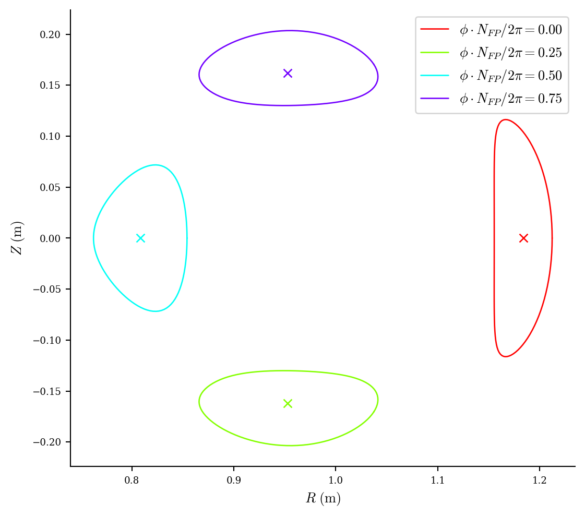

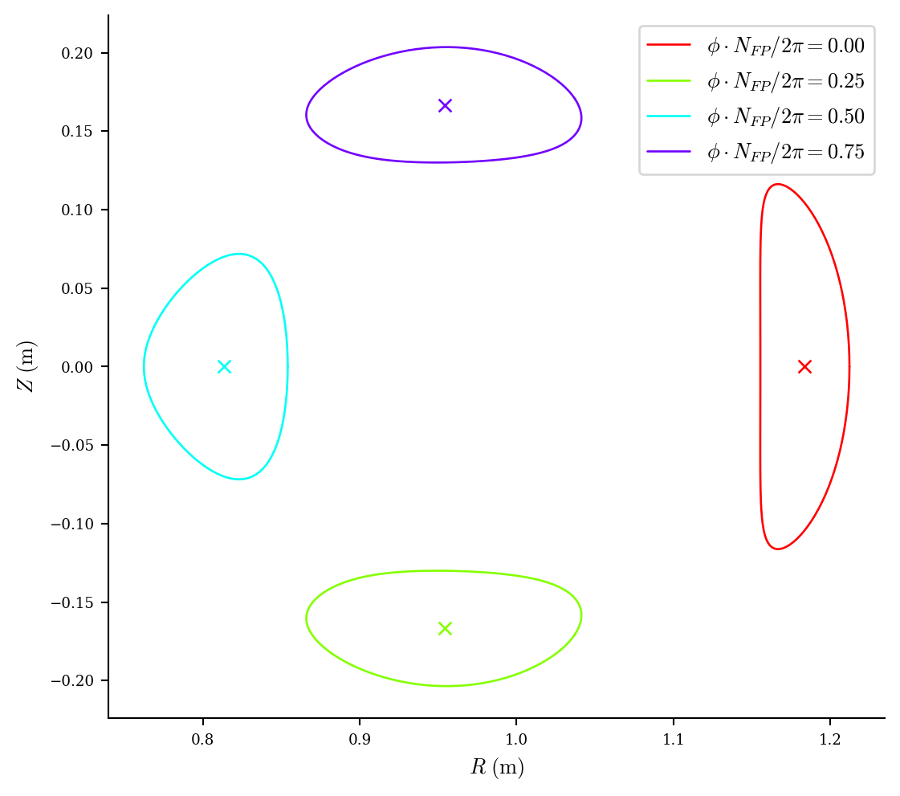

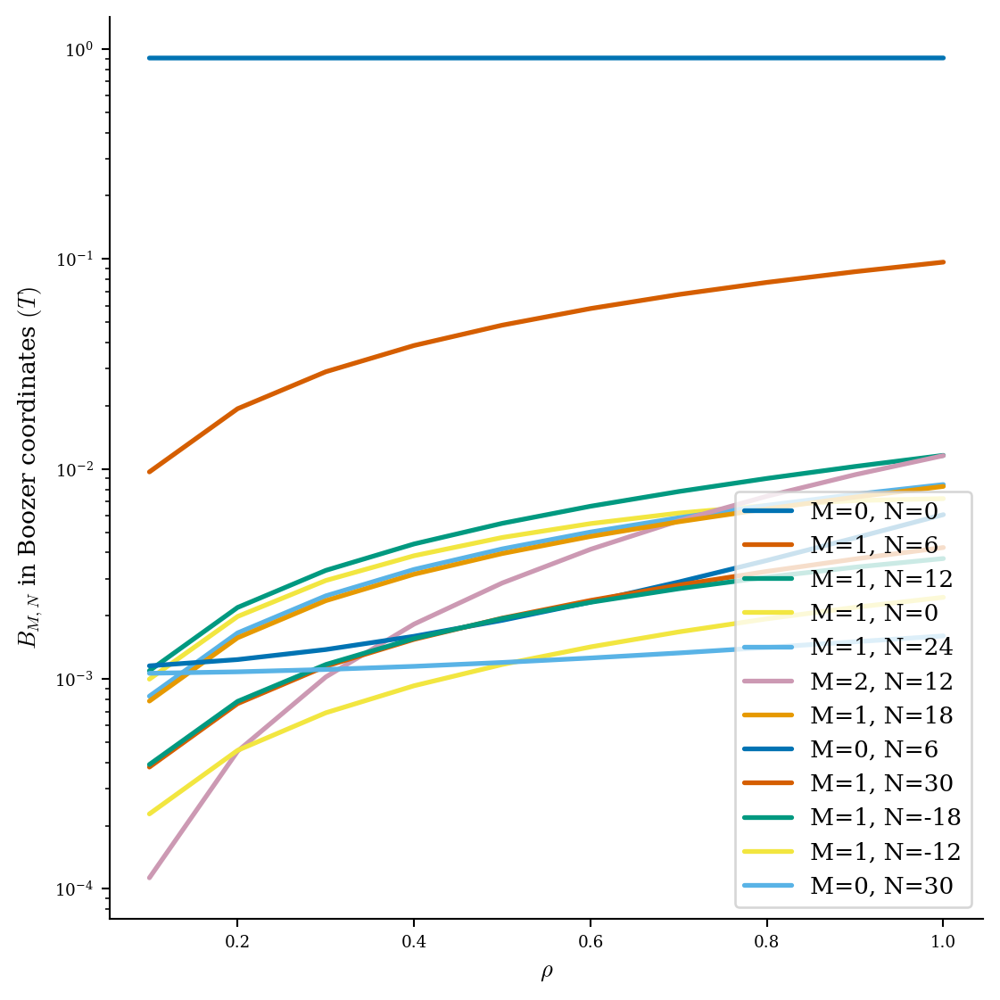

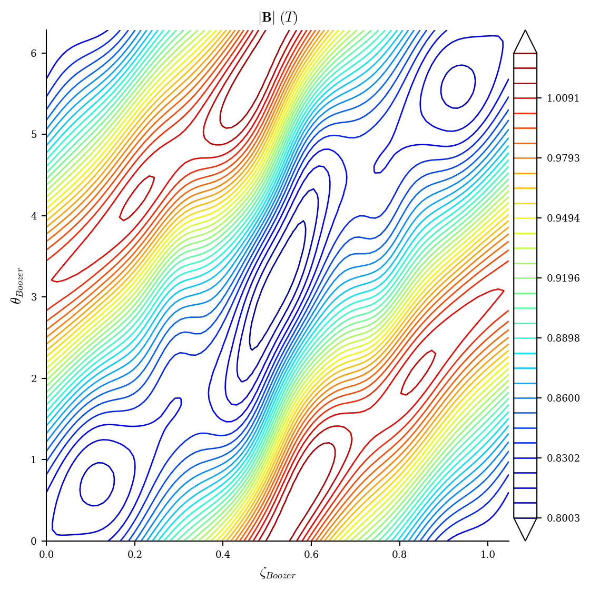

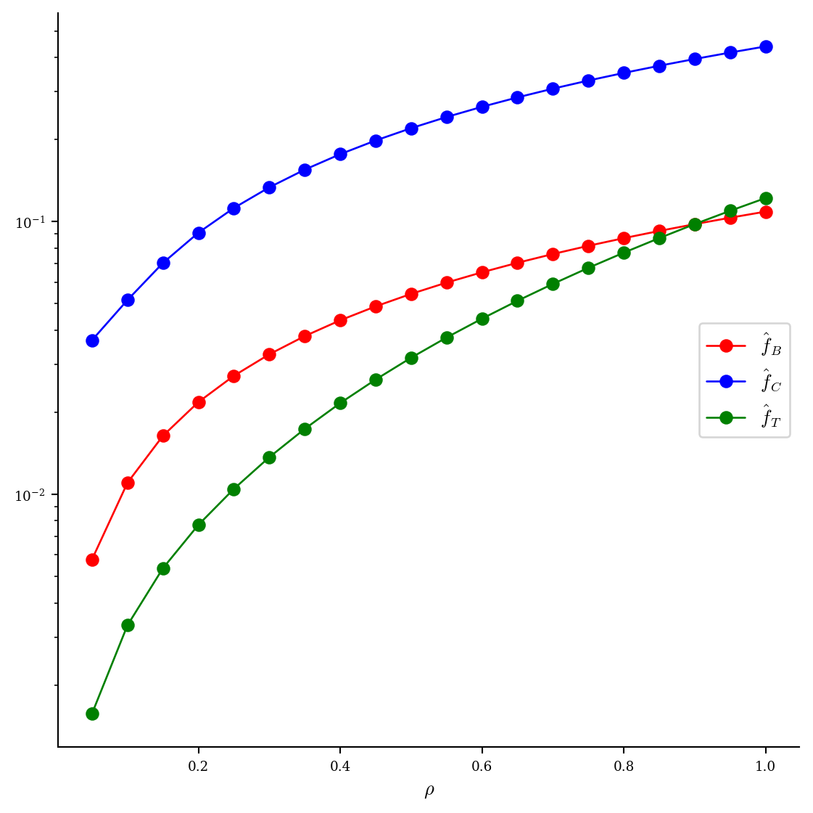

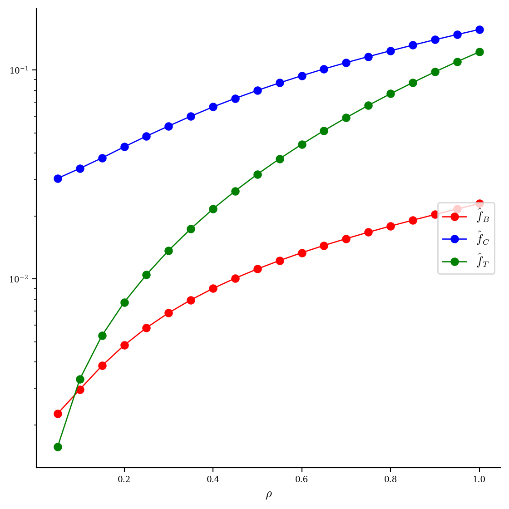

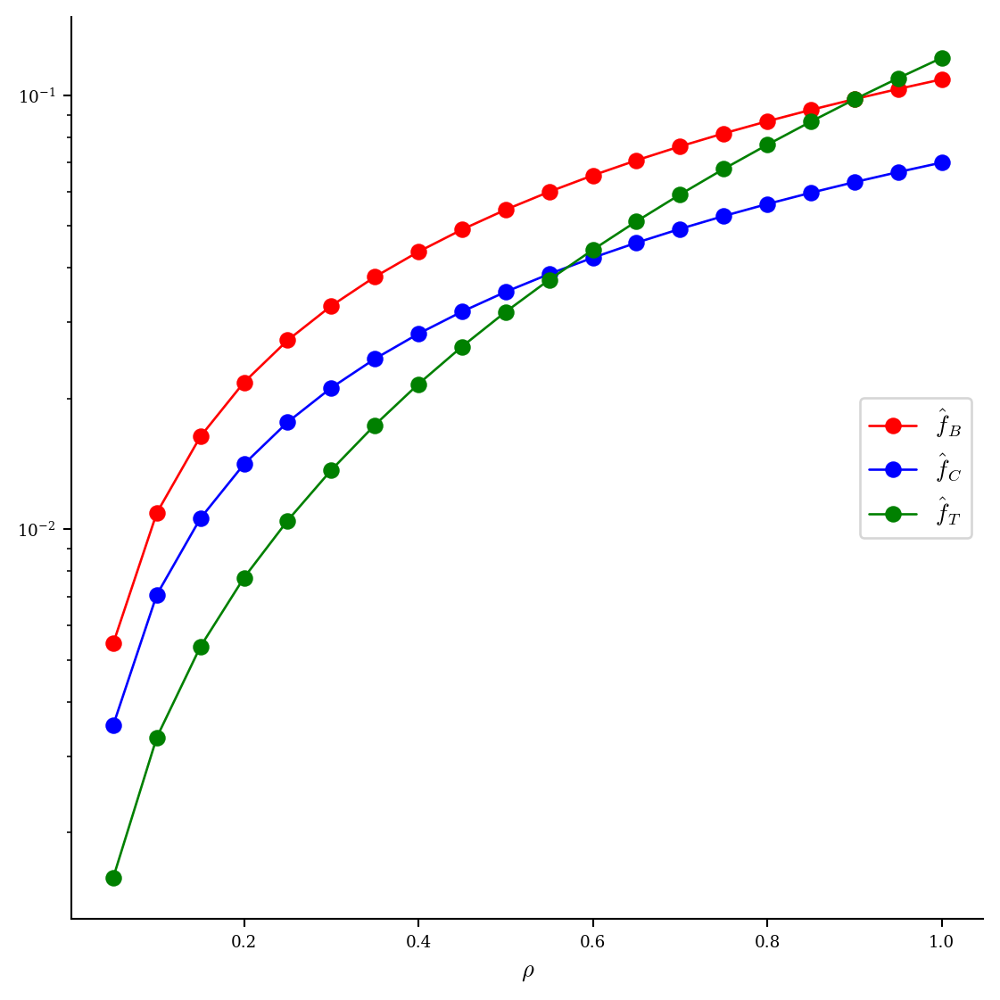

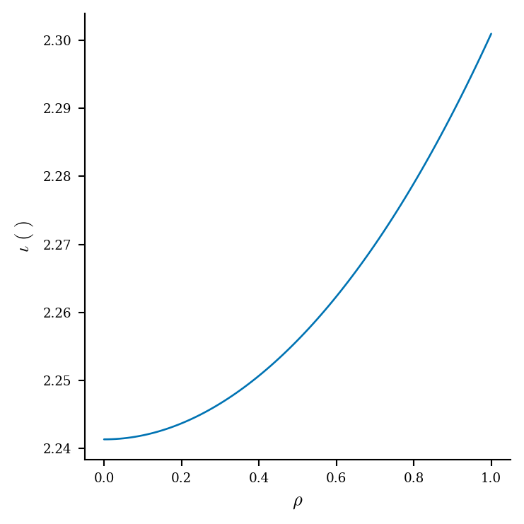

### 11.5 耗时与产物

| 阶段 | 资源与实现 | 墙钟时间 |
|---|---|---:|
| 单个 source $\psi$ 作业 | 1 张 RTX 5090；FP32 GPU QR | 27--28 s；核心数值 5.1--5.2 s |
| $s=0.36$ 的 $\alpha$ | 1 张 RTX 5090；120k/60k 点，FP32 GPU LS | 103.69 s |
| $s=0.36$ 的 $\nu$ 与曲面重参数化 | GPU FP32 场评估；CPU 正交投影/谱面拟合 | 81.68 s |
| 标准 LS/Newton | Simsopt CPU；GPU FP32 密网格验收 | 6.99 s |
| 单个完整面候选作业 | 1 张 RTX 5090 | 约 4.1--4.5 min |
| Poincare、可视化与 DESC 下游 | 16 CPU | 315.96 s |
| 其中可视化 | Poincare、PNG、HTML | 57.68 s |
| 其中 DESC | CPU | 209.49 s；核心 solve 128.50 s |

候选间使用四张 RTX 5090 并行；记录的 GPU 前后检查均为 0% 利用率、2 MiB 显存且无计算进程。下游作业 `31302` 以 `COMPLETED 0:0` 结束，总墙钟 5 分 26 秒。

机器可读产物位于 [六周期资产目录](assets/qh_small_condition_adam_nfp6_nc2_20260803/)；关键文件包括 [selection.json](assets/qh_small_condition_adam_nfp6_nc2_20260803/selection.json)、[选中面](assets/qh_small_condition_adam_nfp6_nc2_20260803/s_0p36_boozer_standard.npz)、[完整评估摘要](assets/qh_small_condition_adam_nfp6_nc2_20260803/full/full_summary.json) 和 [DESC 摘要](assets/qh_small_condition_adam_nfp6_nc2_20260803/full/desc/summary.json)。选中面的 SHA-256 为 `b0239e29c3b8cd73d89b8e355811a7878dce6b908a74f3c0f4c93cb1e50e9886`；DESC `equilibrium.h5` 的 SHA-256 为 `557168e9c14dcdc204599146389cd52edec203928fccfc07dfcaa0b97091d957`。

## 12. 继承动量续跑至 400 步及最终验收

### 12.1 续跑是否真的继承了 Adam 状态

是。job `31330` 没有把第 200 步样本当成新起点重新运行 Adam，而是从不可变副本恢复了当前潜变量、历史最佳潜变量、FP64 一阶矩和二阶矩、Adam bias-correction step 199、随机数状态、时间尺度 guard 历史，以及前 200 行轨迹。原始 200 步目录保持不变。作业以 `COMPLETED 0:0` 在 1 小时 8 分 54 秒后结束，step 400 同时是最终点和全程最佳点：

$$
S_{200}=83.4688735,
\qquad
S_{400}=86.1233491,
\qquad
\Delta S=2.6544756.
$$

续跑的 200 轮中有 184 次实际更新；全 400 轮累计 383 次更新、17 次完整跳过。第 390 步的梯度 RMS 突增至 176.743，被滚动时间尺度 guard 在写入参数和两阶动量前拒绝；第 396 步只有 87.5% 有效差分端点，因此整步跳过。两者都没有污染后续状态。

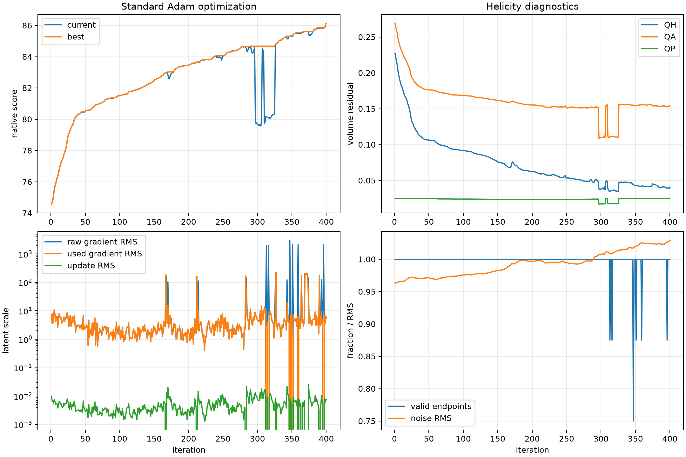

曲线没有显示饱和。step 200--400 的最佳值提高 2.6545 分，最后 50、20、10 步的 running-best 仍分别提高约 0.780、0.560、0.280 分，且最佳点落在最后一步。因此，本次验证了“可精确续跑并继续提分”，但没有证明 400 步已经收敛。

### 12.2 提分来自哪里

| score 分量 | step 200 | step 400 | 变化 |
|---|---:|---:|---:|
| axis | 91.9733 | 92.1695 | +0.1962 |
| $\psi$ | 97.8274 | 98.3943 | +0.5669 |
| surface | 86.8690 | 88.3709 | +1.5020 |
| coordinate | 79.0812 | 80.4714 | +1.3902 |
| volume QS | 78.7771 | 83.6851 | +4.9080 |
| iota | 100.0000 | 100.0000 | 0 |
| coil | 60.0925 | 62.9373 | +2.8449 |

原生体 QH error/单位螺旋度从 $1.02832\times10^{-2}$ 降到 $6.57843\times10^{-3}$，改善 36.0%；QA 基本不变，QP 略升。提分没有通过降低 $\iota$ 或单纯放大快速评分面作弊：原生评分中的 $|\iota|$ 仍约为 2，且 selected effective minor radius 反而从 0.02454 m 小幅降到 0.02389 m。主要收益来自 QH、线圈工程性质和坐标/磁面稳定性同时改善。

需要记录一个真实的非光滑来源。step 297 和 step 310 附近的 current score 分别从约 84.57、84.30 突然掉到约 79.75、79.71，不是脏梯度，而是原生评分器离散选择的 `surface_level` 从 0.16 切换到 0.08；恢复到 0.16 后分数也恢复。小面上的 QH raw error 数值更小，但 surface/size 分量明显更差。这个离散分支切换解释了局部大回撤，也说明 running-best 保护仍然必要。

### 12.3 重新标定 $\psi$ 与寻找最大连续面

完整评估没有复用 step 200 的固定 $a$ 或 $s$。针对 step 400 样本并行拟合四个 source 尺度，均使用 1,574 个模态和约 38.9 万点的 FP32 GPU QR：

| $a$ | 训练 RMS | 验证 RMS | 验证角度 P95 | 核心流程时间 |
|---:|---:|---:|---:|---:|
| 0.04 | $3.3092\times10^{-4}$ | $3.3580\times10^{-4}$ | $4.7858\times10^{-5}$ | 18.41 s |
| 0.05 | $3.5285\times10^{-4}$ | $3.5898\times10^{-4}$ | $6.0686\times10^{-5}$ | 18.40 s |
| 0.06 | $4.0451\times10^{-4}$ | $4.1625\times10^{-4}$ | $7.4374\times10^{-5}$ | 18.39 s |
| 0.08 | $6.4798\times10^{-4}$ | $6.8323\times10^{-4}$ | $1.2609\times10^{-4}$ | 18.41 s |

选择 $a=0.08$ 是为了最大物理覆盖；它的验证误差仍是小量。随后在四张 5090 上并行运行 FP32 GPU $\alpha+\nu$ 初值和标准 Simsopt LS/Newton，得到：

| 目标 $s$ | 标准验收 | $|V|\,[\mathrm{m}^3]$ | 拟合后平均 $s$ | $\iota$ | 稠密相对残差 | 面 QH error |
|---:|---|---:|---:|---:|---:|---:|
| 0.12 | 通过 | 0.0209709 | 0.11899 | 2.09661 | $4.32\times10^{-6}$ | $3.46\times10^{-5}$ |
| 0.20 | 通过 | 0.0352575 | 0.19732 | 2.10239 | $7.43\times10^{-6}$ | $6.57\times10^{-5}$ |
| 0.30 | 通过 | 0.0507919 | 0.28079 | 2.10892 | $1.18\times10^{-5}$ | $1.07\times10^{-4}$ |
| 0.36 | 通过 | 0.0588090 | 0.32397 | 2.11238 | $1.44\times10^{-5}$ | $1.31\times10^{-4}$ |
| 0.42 | 通过 | 0.0658156 | 0.36261 | 2.11545 | $1.70\times10^{-5}$ | $1.54\times10^{-4}$ |
| 0.49 | **通过并选中** | **0.0723990** | **0.40056** | **2.11837** | $1.96\times10^{-5}$ | $1.77\times10^{-4}$ |
| 0.56 | 失败 | -- | -- | -- | -- | $\nu$ 映射最小 Jacobian $-0.07924$ |
| 0.64 | 失败 | -- | -- | -- | -- | $\nu$ 映射最小 Jacobian $-0.14037$ |

体积和 $\iota$ 从 $s=0.12$ 到 0.49 连续单调变化，没有 step 200 的外层错误分支跳转。`s=0.49` 是名义目标；标准面上的平均 $\psi$ 标签为 0.4006，因此报告同时给出两者，不能把 0.49 当成拟合后每一点的真实标签。`s=0.56` 是最近测试的外侧失败边界。

外层初值本身仍不精确。`s=0.49` 的 $\alpha+\nu$ 初始相对残差和法向场 P95 分别为 0.1312 和 0.1339，标准 LS/Newton 才把它们降到 $1.96\times10^{-5}$ 和 $2.69\times10^{-5}$。所以本次更大的可行面证明的是“$\alpha+\nu$ 能把标准求解送到正确吸引域”，不是“外层 $\alpha+\nu$ 已单独给出高精度 Boozer 面”。

### 12.4 为什么 QH 指标明显占优，但 $|B|$ 仍不够直

选中面上的独立面误差为

$$
\epsilon_{\mathrm{QA}}=8.3676\times10^{-3},\qquad
\epsilon_{\mathrm{QH}}=1.7702\times10^{-4},\qquad
\epsilon_{\mathrm{QP}}=8.6257\times10^{-3}.
$$

这些量是面积加权的相对**平方**误差。换成更符合视觉直觉的 RMS 幅度，三者分别约为 9.15%、1.33% 和 9.29%。因此 QH 只比 QA/QP 好约 6.9--7.0 倍，而不是好几十倍；1.33% 的非 QH 幅度仍足以在极值和鞍点附近形成明显弯曲或闭合小轮廓。另一方面，QA/QP 把主导的 QH 螺旋变化本身也视为误差，所以它们自然明显更大。这就是“相对类别优势明显”和“绝对图像仍不够理想”同时成立的原因。

本指标衡量的是对称性，不是 $|B|$ 调制深度。step 400 真空面上的 $|B|$ 为 0.80981--1.09930 T，均值 0.93482 T；较大的主导 QH 调制完全可以与较小的非 QH 谱误差共存。与 step 200 相比，面 QH 平方误差从 $2.3357\times10^{-4}$ 降至 $1.7702\times10^{-4}$，改善 24.2%，对应幅度 RMS 从 1.53% 降到 1.33%。这是可测但不可能让图形彻底变直的有限改善。

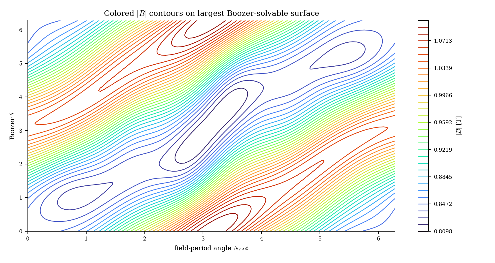

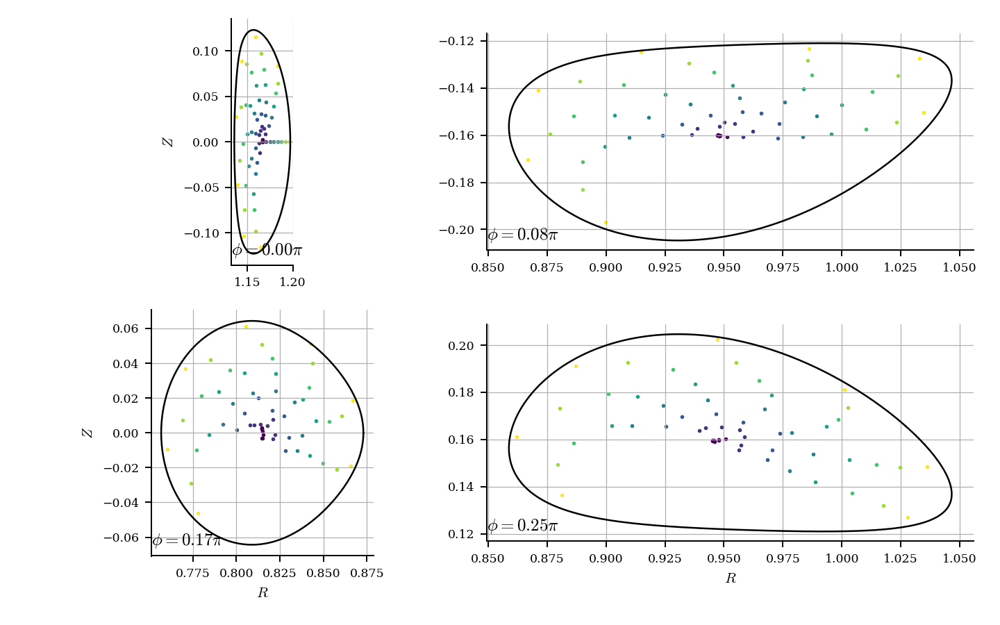

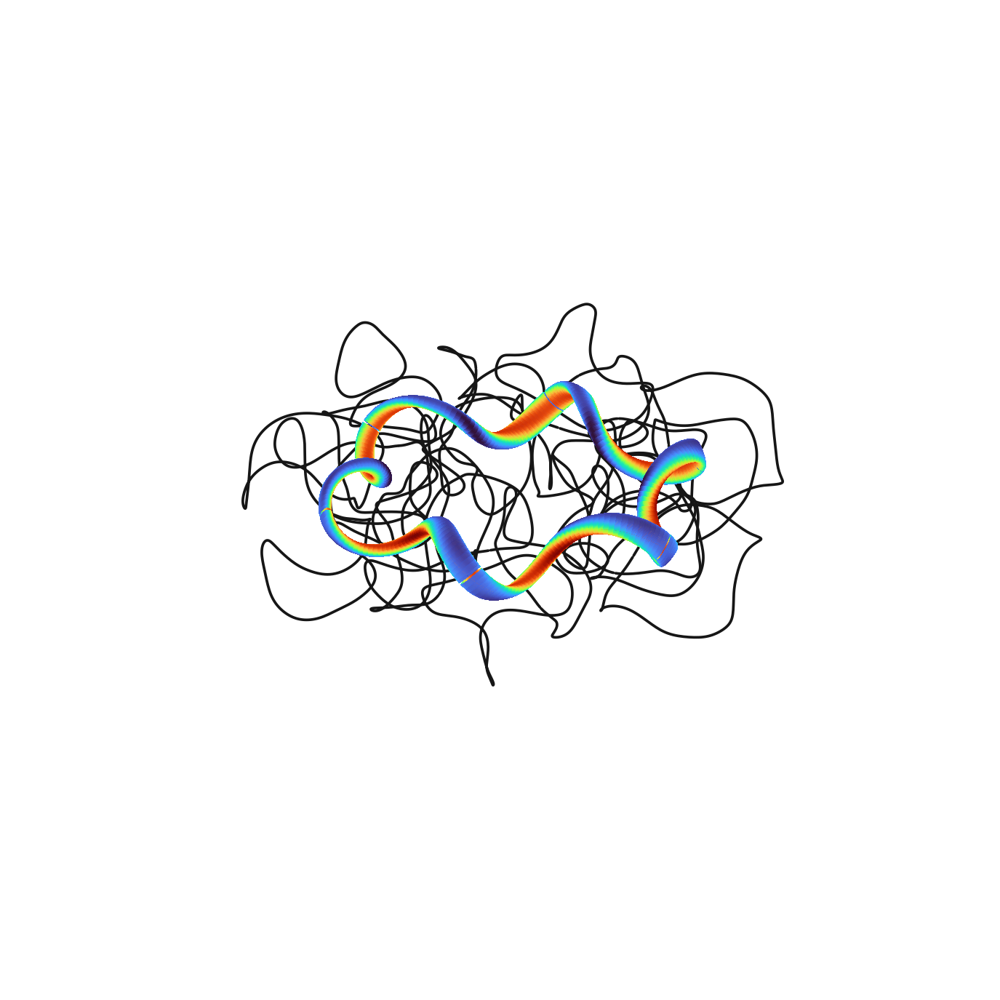

交互产物：[Boozer $|B|$ HTML](assets/qh_small_condition_adam_nfp6_nc2_continue400_20260803/full_eval/selected_s0p49_full/assets/boozer_b.html)，[全部线圈与磁面 HTML](assets/qh_small_condition_adam_nfp6_nc2_continue400_20260803/full_eval/selected_s0p49_full/assets/coils_surface.html)。

8 条内部场线在四个截面均得到 29 个交点，全部保持在候选边界内。相较 step 200，最大连续面体积从 0.0625544 增至 $0.0723990\,\mathrm{m}^3$，提高 15.7%；因此续跑的收益不仅存在于快速 score，也体现在更大的独立可行磁面和更低的面 QH error。

### 12.5 DESC 复核

DESC 使用允许的 CPU 路径，初始和最终都通过嵌套检查。求解器在 27 次迭代后以 `xtol` 成功收敛，cost 为 $3.3203\times10^{-5}$，optimality 为 $1.6197\times10^{-8}$。归一化力残差为：

| 归一化力残差 | 初始 | 最终 |
|---|---:|---:|
| mean | 1.03490 | $6.8506\times10^{-4}$ |
| P95 | 2.33249 | $1.5589\times10^{-3}$ |
| max | 272.860 | $8.3121\times10^{-3}$ |

这比 step 200 DESC 的最终 mean/P95/max `1.0974e-3/2.6170e-3/1.0442e-2` 均进一步降低。输入环向磁通为 $-7.52764\times10^{-3}\,\mathrm{Wb}$。

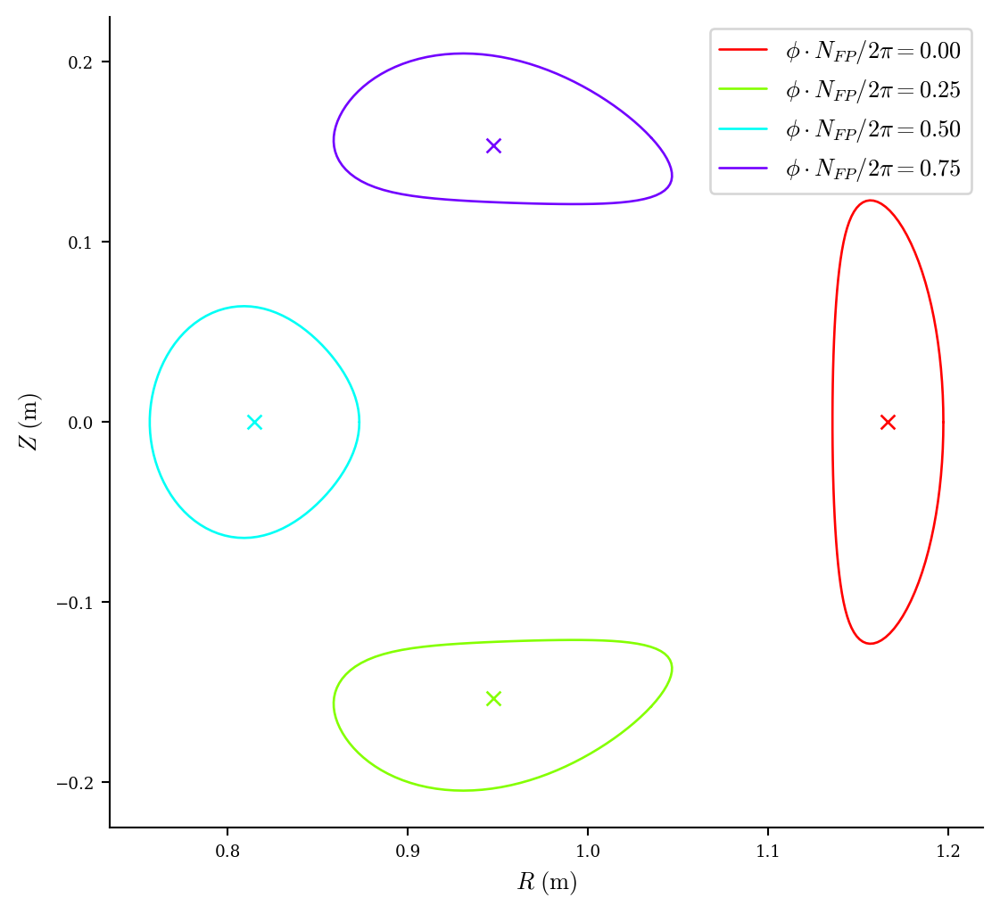

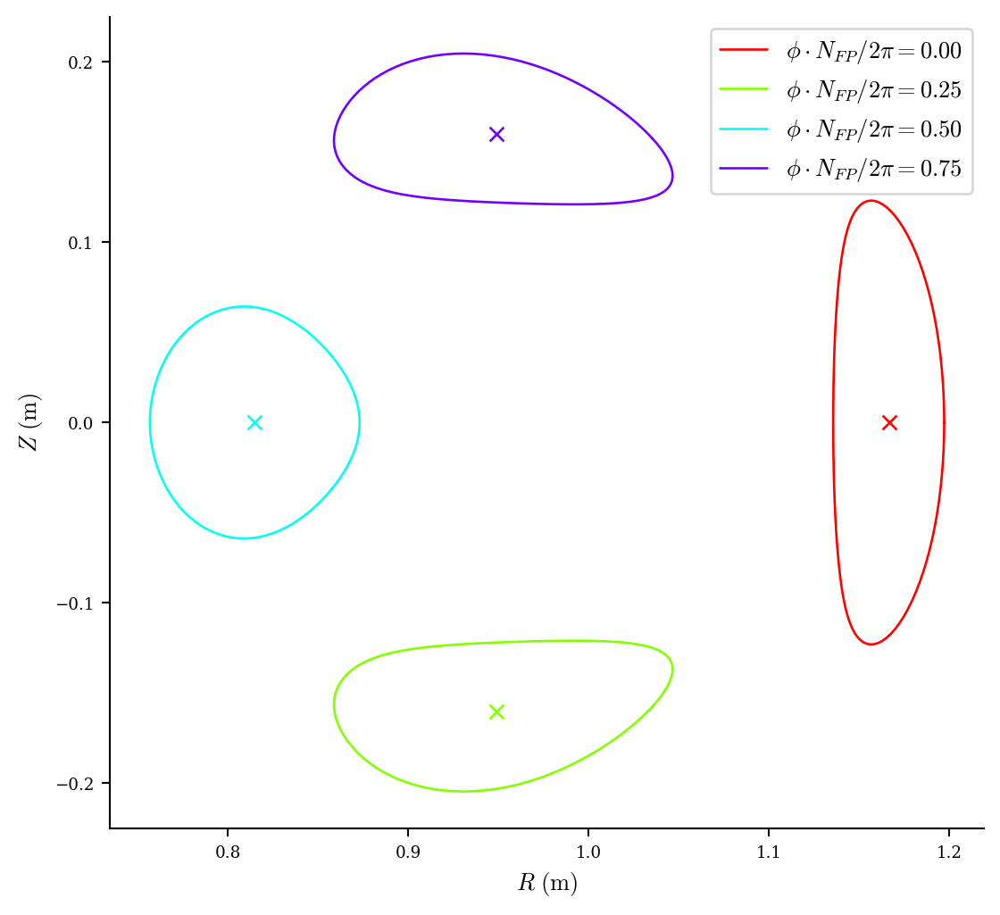

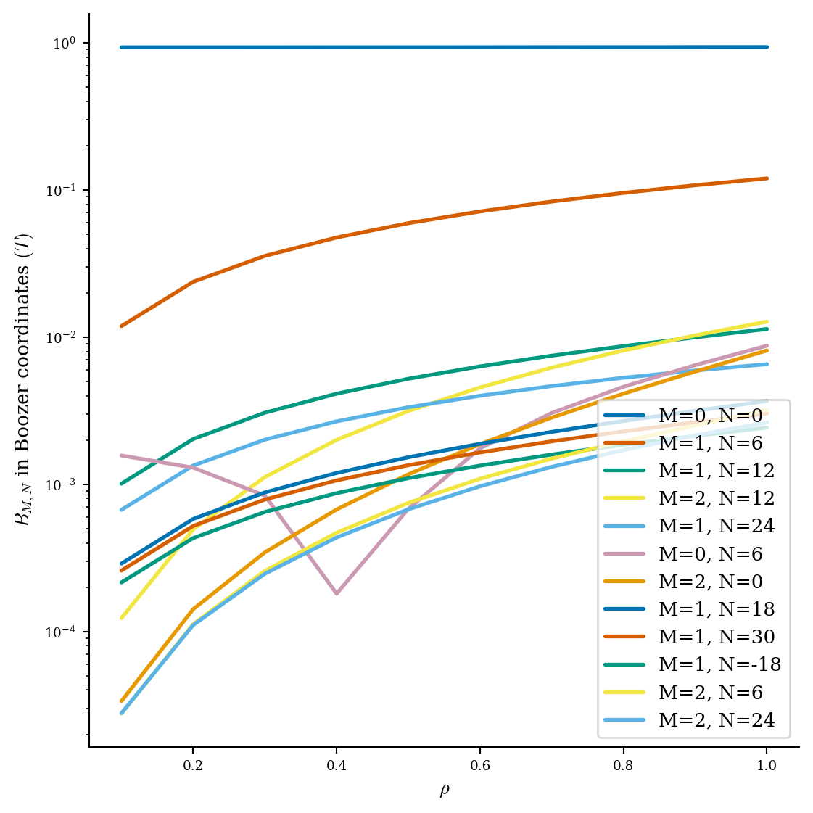

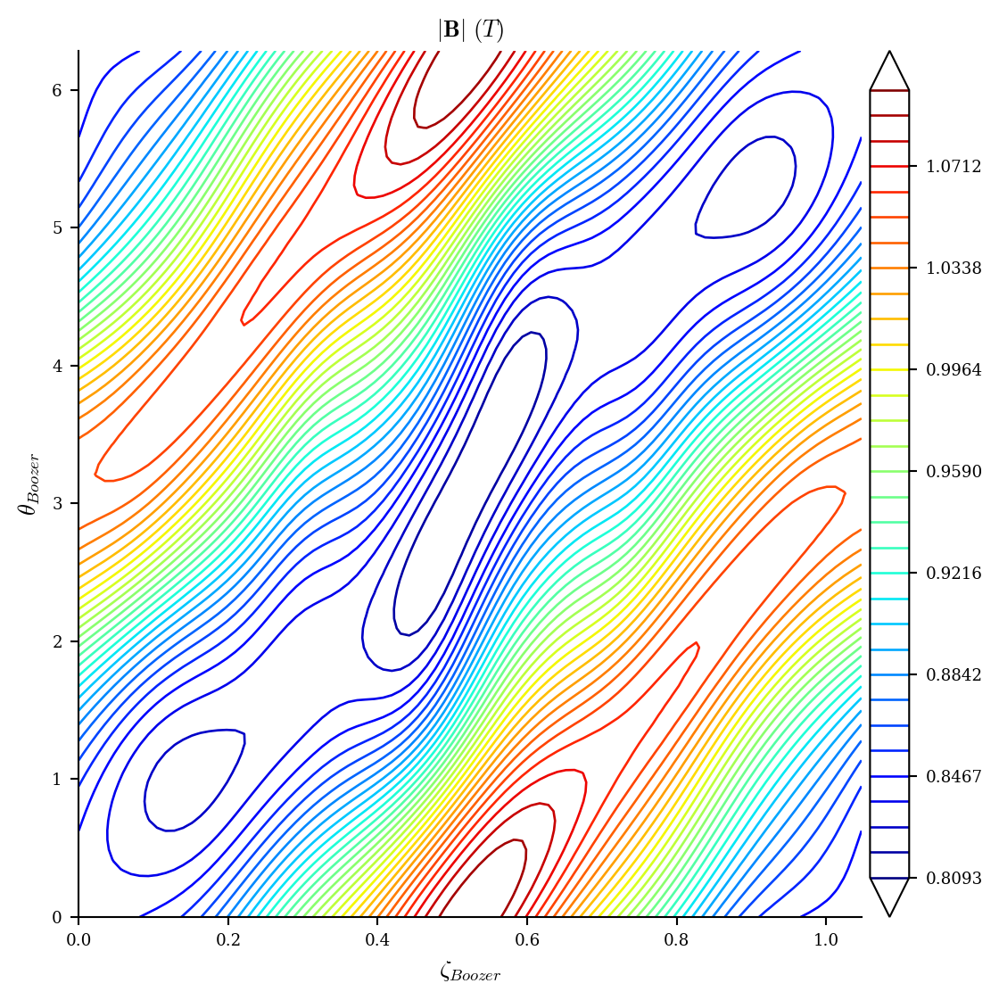

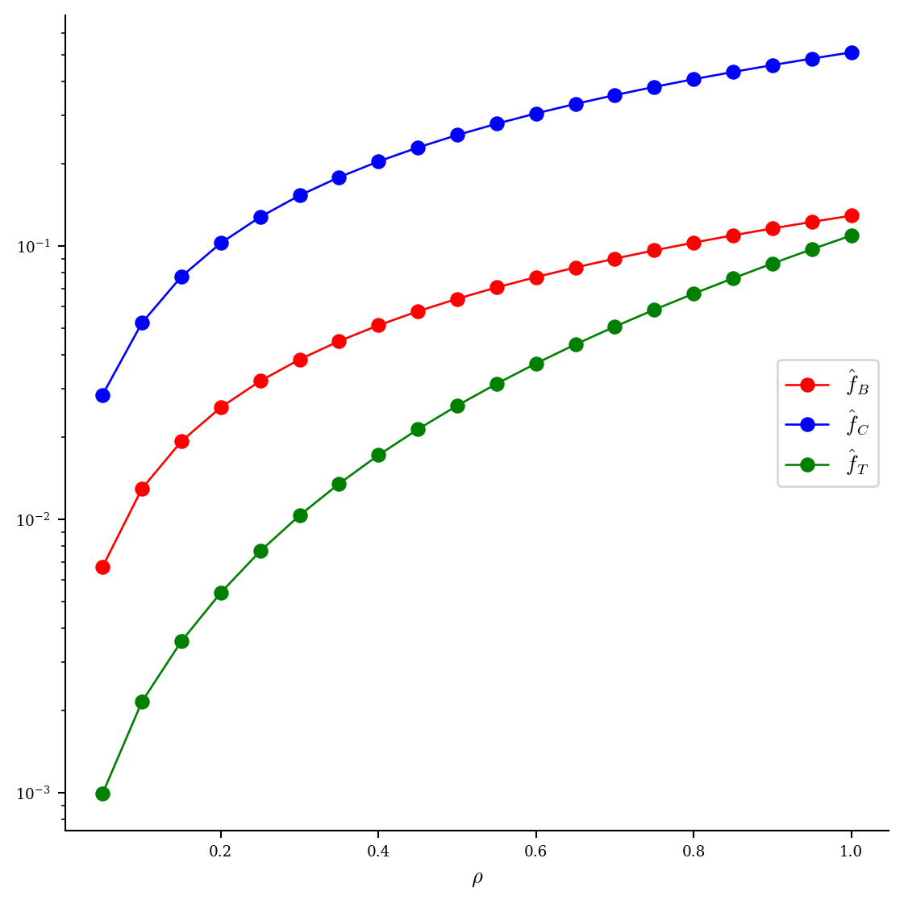

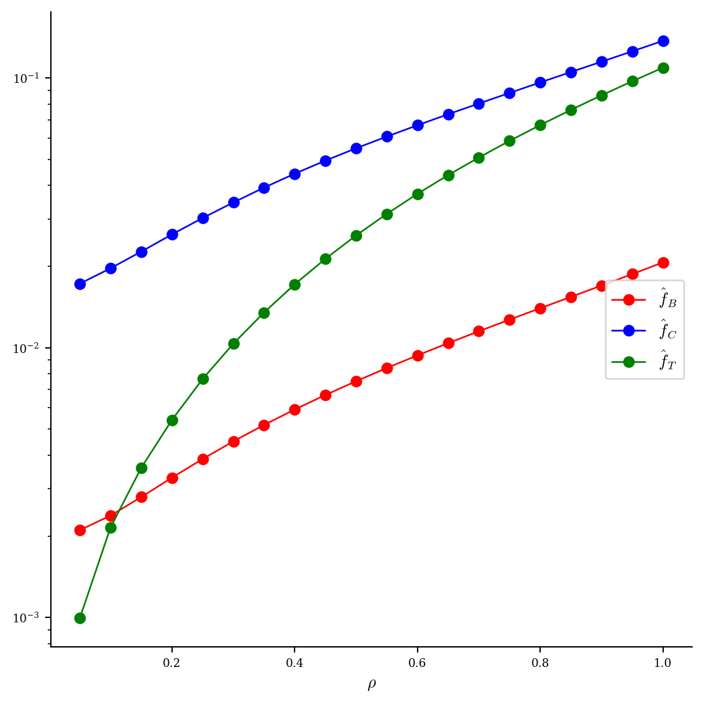

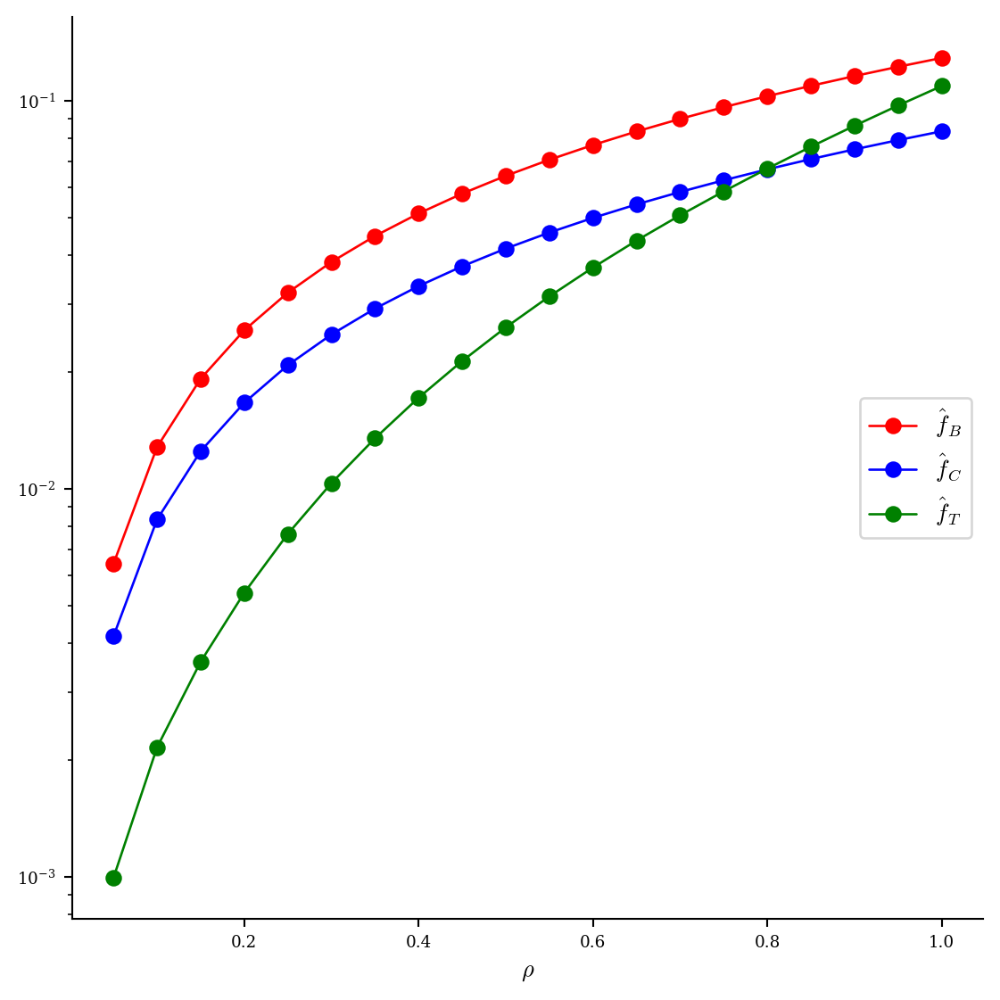

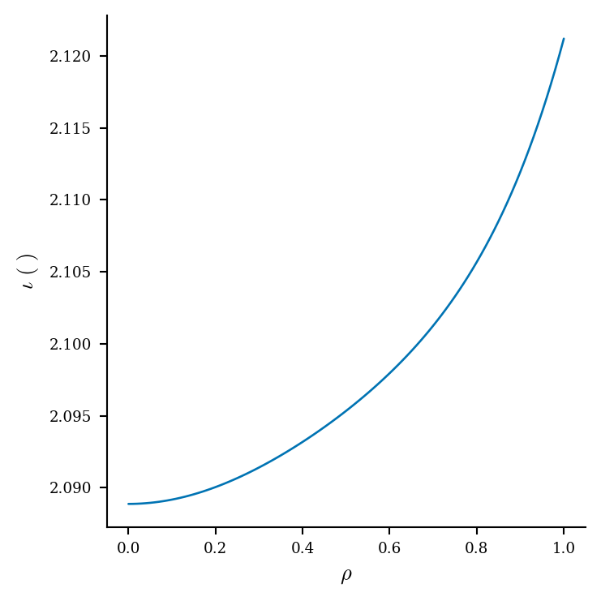

### 12.6 耗时、复现产物与最终判断

| 阶段 | 资源与实现 | 墙钟时间 |
|---|---|---:|
| step 200--400 续跑 | 4 张 RTX 5090，继承完整 Adam 状态 | 1 h 08 min 54 s |
| 单个 source $\psi$ 核心流程 | 1 张 RTX 5090，FP32 GPU QR | 18.4 s |
| 四个 source $\psi$ Slurm 作业 | 4 张 RTX 5090 并行 | 1 min 06 s |
| 单个 $\alpha+\nu$ 与标准面候选 | 1 张 RTX 5090 + 4 CPU | 10 min 58 s--16 min 27 s |
| 最终固定面可视化 | 1 张 RTX 5090 + 16 CPU | 62.0 s |
| DESC | 16 CPU | 236.9 s；核心 solve 67.1 s |
| 最终固定面全评估 job `31382` | 1 张 RTX 5090 + 16 CPU | **5 min 51 s** |

$\alpha$ 的 120k/60k 点拟合使用 FP32 GPU QR；$\nu$ 的场评估使用 FP32 C++/CUDA，只有低维正交投影和谱面拟合留在 CPU。没有启用 legacy Cartesian CPU 点云回退。所有相关 Slurm 作业都已结束；最终 GPU 前后检查均为 0% 利用率、2 MiB，用户进程列表中没有本任务遗留计算进程或僵尸进程。

机器可读证据位于 [step 400 资产目录](assets/qh_small_condition_adam_nfp6_nc2_continue400_20260803/)。关键文件包括 [优化摘要](assets/qh_small_condition_adam_nfp6_nc2_continue400_20260803/adam/summary.json)、[完整 401 点轨迹](assets/qh_small_condition_adam_nfp6_nc2_continue400_20260803/adam/trajectory/)、[选中标准面](assets/qh_small_condition_adam_nfp6_nc2_continue400_20260803/full_eval/candidates/s_0p49/standard_rho_1/boozer_standard.npz)、[完整评估摘要](assets/qh_small_condition_adam_nfp6_nc2_continue400_20260803/full_eval/selected_s0p49_full/full_summary.json) 和 [DESC 摘要](assets/qh_small_condition_adam_nfp6_nc2_continue400_20260803/full_eval/selected_s0p49_full/desc/summary.json)。选中面的 SHA-256 为 `3d9b9de26cab4f01e8bd0c3d550b87b72c59fa6a778893947c3af6515e0f451a`，DESC `equilibrium.h5` 的 SHA-256 为 `859a2a308c516c7a30b69eab602a4405770572ffbb31610ed8918250f25ffe3b`。

最终结论：续跑有效且没有出现低 $\iota$、缩面或脏梯度作弊；原生体 QH、独立外层面 QH、最大连续体积和 DESC 残差四项都得到改善。但 step 400 仍未收敛，`|B|` 中也仍有清楚可见的非 QH 结构，因此它是比 step 200 更好的有效 QH 位形，而不是已经接近理想 QH 的终点。
