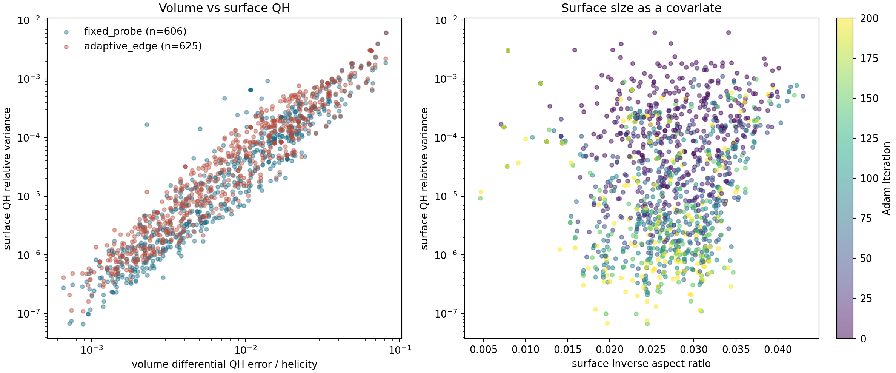
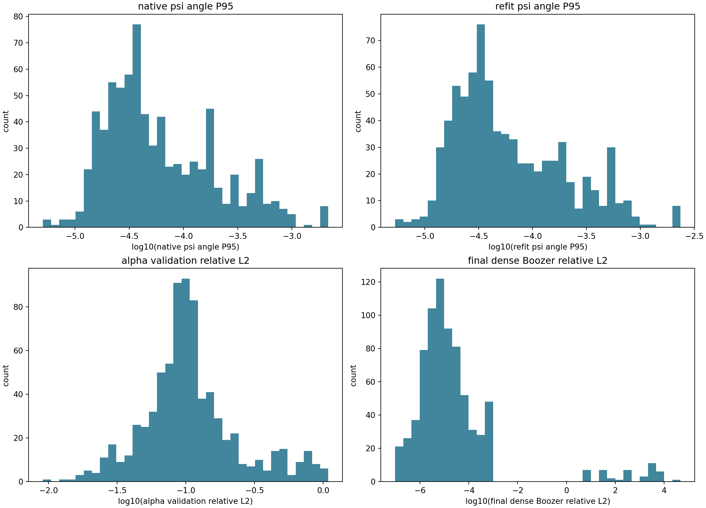
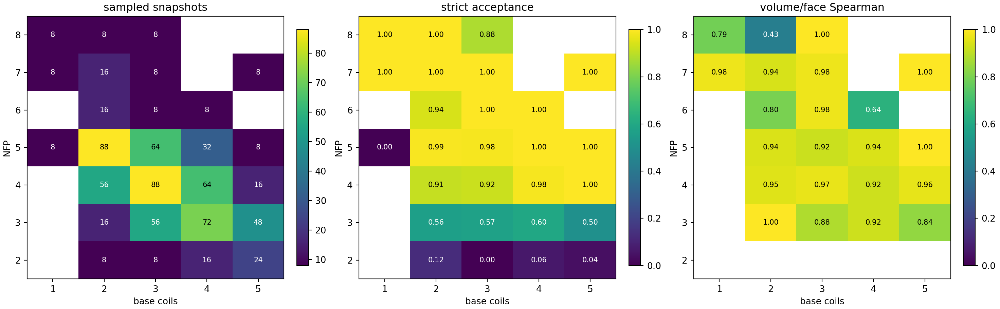
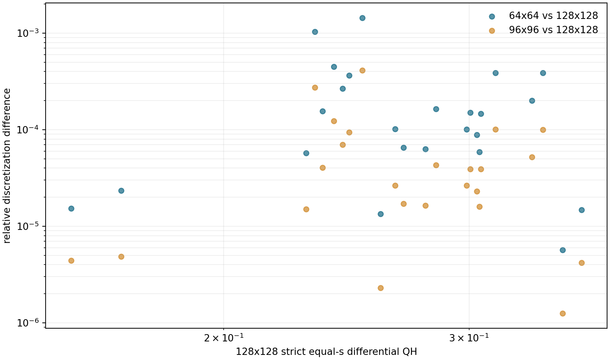
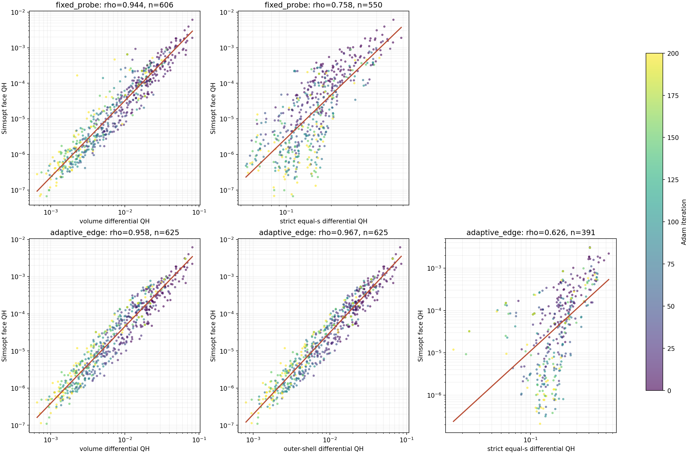
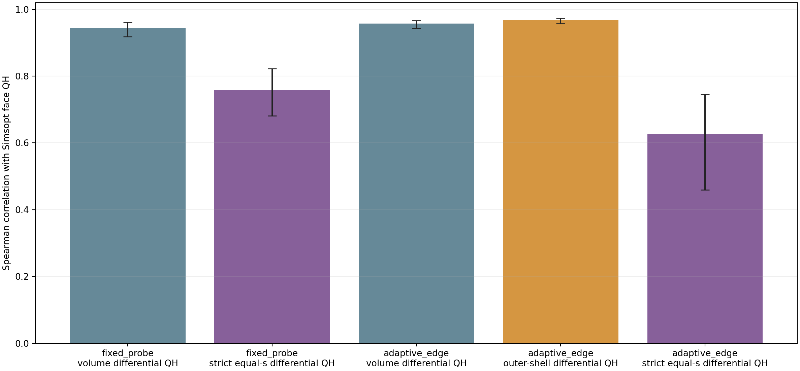

# 轨迹体 QS 与面 QS 的批量标定

日期：2026-08-19
分支：`codex/trajectory-face-qs-calibration`

## 研究问题

当前原生 C++/CUDA score 使用体内微分 QH 误差作为快速优化目标。它已经能在几秒内稳定评估一个位形，但真正的磁面验收仍由 Simsopt 的标准 LS/Newton 决定，并在收敛面上计算面 QH 误差。本实验要定量回答：

1. 快速体 QH 与标准面 QH 是否具有稳定的排序相关性，相关性在哪个误差区间开始饱和或失真；
2. Adam 优化过程中，固定物理区域上的面 QH 随真实优化墙钟时间下降多快；
3. 原生 score 给出的 $\psi$ 拟合误差是否始终足够小，面求解失败是否主要由 $\psi$ 质量解释；
4. GPU 体坐标拟合给出的 $\iota$ 与标准面求解得到的 $\iota$ 相差多少；
5. 对不同 $N_{\mathrm{FP}}$、基线圈数和优化阶段，以上结论是否仍成立。

这里不运行 DESC，也不逐样本搜索严格最大磁面。目标是形成可批量、可复现的统计证据，而不是重复数百次完整线圈验收。

## 数据与抽样

数据源是已经验收的 309 条 QH 轨迹：每条包含 32 选 1 起点、200 个正式 Adam 中心和完整体 QS、$\psi$、$\iota$ 诊断。原始轨迹固定使用 ABI-10 score 动态库 SHA-256 `7834a88d...`。

正式协议计划按 $(N_{\mathrm{FP}},N_{\mathrm{coils}})$ 经验频率分层抽取 96 条轨迹，并在每条轨迹的第

$$
0,\ 10,\ 25,\ 50,\ 75,\ 100,\ 150,\ 200
$$

步取中心，共 768 个位形。每个阶段约有 96 个统计样本，不需要重跑优化，也不把 791 万个省略 coordinate 项的局部端点误当成正式 score。

每个位形测两个面：

- **固定探针面**：每条轨迹以第 0 步 soft boundary 的 $\rho=0.8$ 内层为基准，后续阶段保持同一个 $s$ 目标。它用于判断同一物理区域随优化如何改善。
- **自适应边界面**：使用该阶段 score 给出的 `surface_effective_level`。它用于判断体 QS 与当前有效区域边界面 QS 的关系。

两者都会记录最终实际体积、有效小半径和逆长宽比。相关性分析除总体结果外，还会按面尺寸分层，避免“不同样本实际测了不同大小的面”成为伪相关来源。

## 计算流程

每个稀疏快照执行：

$$
\text{stored coil center}
\rightarrow \text{source }\psi
\rightarrow (\alpha,\iota(\rho))
\rightarrow \nu
\rightarrow \text{standard Simsopt LS/Newton}
\rightarrow \text{independent dense validation}.
$$

具体约束如下：

1. source $\psi$ 复用生产方法，固定 `a=0.05 m` 和 `48^3` 物理拟合网格；保存训练 RMS、独立角度 L2/P95 和该阶段原生 score 已记录的同类指标。
2. $\alpha$ 使用 120000 个训练点、60000 个验证点、FP32 GPU QR 和三次 $\iota(\rho)$；$\nu$ 与面谱均使用现有 12 阶实现。
3. Simsopt LS/Newton 是明确允许的 CPU 阶段。GPU 准备完成后，P107 的 16 个 CPU 核与 Students 的 24 个 CPU 核按“一核一面”并行，不让一个 Python 进程独占几十个空闲核心。
4. 最终验收在与求解网格错开的 $97\times97$ 网格上执行。必须同时满足 Newton 收敛、稠密相对残差、法向场误差、绕轴方向和非退化法向量要求。
5. 面 QS 沿用项目既有面积加权定义：

$$
\epsilon_{\mathrm{face}}^{M,N}
=
\frac{\left\langle |\partial_\phi\boldsymbol x\times\partial_\theta\boldsymbol x|
\left(|B|-\Pi_{M,N}|B|\right)^2\right\rangle}
{\left\langle |\partial_\phi\boldsymbol x\times\partial_\theta\boldsymbol x|
\left(\Pi_{M,N}|B|\right)^2\right\rangle}.
$$

这里报告的是相对方差，不再额外开平方；因此数值口径与既有完整评估中的 $10^{-6}$ 量级面 QH 完全一致。

## 统计口径

主图和表至少包括：

- 面 QH 对体 QH 的 log-log 散点、Spearman、log-Pearson 与按轨迹聚类 bootstrap 置信区间；
- 面 QH 随优化步数和真实墙钟分钟的中位数/P10/P90，以及达到 $10^{-3}$、$10^{-4}$、$10^{-5}$ 的比例和首次时间；
- $\psi$ 训练误差、独立角度 L2/P95、alpha 验证残差的分布；
- GPU $\iota(\rho)$ 对最终面 $\iota$ 的散点、绝对误差和相对误差分布；
- 两类面的成功率、失败类型和实际逆长宽比分布；
- 按 $N_{\mathrm{FP}}$、线圈数、优化阶段和面尺寸分层的相关性及成功率。

重复阶段属于同一条优化轨迹，不能当作完全独立样本。因此置信区间以轨迹为 cluster 重采样；总体散点只用于展示，不用普通逐点 bootstrap 夸大样本量。

## 当前进度

- 已从当前已验收提交直接创建独立分支，没有使用 worktree。
- 已确认 309 条远端轨迹完整存在，当前 Slurm 队列无本项目作业。
- 已冻结上述稀疏抽样和双探针协议；正在实现 GPU 准备、40 核 Simsopt 求面、GPU 离网格验收和统计出图的三段式批处理。

正式数值结果、图和作业耗时将在批量作业完成后追加到本报告。

## Pilot 基础设施核验

首个 6 轨迹、18 快照 pilot 越过了调度链，但 18 个快照全部在进入磁轴搜索时立即失败。共同错误为实验误用了旧的 `build_mixed/libstellarator_gpu.so`；当前 Python 绑定要求 `sgpu_trace_axis_samples`，该旧库没有导出此符号。因此这轮 pilot 没有执行 source $\psi$、$\alpha+\nu$ 或面求解，其失败率和单案例时间都不具有物理意义。

修正方式是为当前分支单独构建 CUDA 动态库，并在每个 GPU shard 开始时一次性检查所需 ABI 符号。ABI 不匹配现在会让整个 shard 直接失败，而不会再被记成一批样本的物理失败。统计器也已允许在零验收面时输出空结果和明确状态，避免错误处理本身掩盖首个根因。修正后的 pilot 将使用新的实验目录重新提交；旧 pilot 保留为基础设施反例，不进入正式统计。

第二轮 pilot 验证了新动态库和 source $\psi$ 链路，但暴露了准备脚本的 CLI 参数错误：alpha 程序接受的是 Torch 设备字符串 `--device cuda`，不是整数 GPU 参数 `--gpu-device 0`。18 个案例因此都在 alpha 的参数解析阶段退出，仍未进入 alpha 拟合或面求解。这一轮同样只作为接口核验，不进入物理统计；代表案例的 source $\psi$ 已成功产出，墙钟时间约为 4.8--9.6 秒。

第三轮 pilot 首次跑通了完整链路。18 个快照中 16 个完成 GPU 准备；两个失败来自同一条轨迹的第 100、200 步，其固定探针面比当时的自适应有效区更外，1.25 倍候选只产生 169964 个有效体点，低于固定的 180000 点预算。正式运行将候选过采样提高到 1.5，但不降低训练/验证点数。成功案例中，代表性的 GPU 准备耗时为 source $\psi$ 8.9 秒、alpha 100.2 秒、$\nu$ 59.5 秒，总计 168.7 秒。

16 个快照的 32 个面全部完成标准 CPU LS/Newton，单面约 4.8--8.1 秒；其中 30 个通过严格离网格验收。剩余两个面也在标准求解网格上收敛到约 $10^{-12}$，但 $97\times97$ 网格的法向场 P95 分别为 $1.36\times10^{-4}$ 和 $2.13\times10^{-4}$，略高于 $10^{-4}$ 门槛。正式报告同时给出“求解且规则”和“严格离网格验收”两种统计口径，主结论优先使用后者。

虽然 pilot 只有 6 条轨迹，其结果已验证统计口径具有信号：严格固定探针面的体/面 QH Spearman 为 0.979，log-log Pearson 为 0.940；自适应边界面分别为 0.936 和 0.973。固定面 QH 的中位数从第 0 步的 $1.11\times10^{-3}$ 降到第 100 步的 $8.61\times10^{-5}$，第 200 步为 $1.01\times10^{-4}$。这不是正式结论，因为样本过少且所选条件偏向稀有组，但证明了体 QS 与面 QS 的比较并非被数值噪声淹没。

GPU alpha 初值与最终面 $\iota$ 的绝对差中位数为 $7.41\times10^{-4}$，P95 为 $3.91\times10^{-3}$。source $\psi$ 独立角度 L2 的中位数为 $9.28\times10^{-6}$、P95 为 $8.49\times10^{-5}$；角度 P95 的中位数为 $3.41\times10^{-5}$、P95 为 $2.19\times10^{-4}$。完整准备、CPU 面求解和 GPU 离网格验收的单项 P50 分别为 147.3 秒、7.0 秒和 1.16 秒，因此正式批量的主瓶颈明确是 GPU 上的 dense alpha 与 $\nu$ 准备，而不是 Simsopt CPU 求面。

## 正式批量作业

正式实验使用 96 条条件分层轨迹、每条 8 个阶段，共 768 个快照和 1536 个待测面。提交链为：选择 `39468`，GPU 准备 `39470`/`39472`，CPU 求面 `39474`/`39476`，GPU 离网格验收 `39478`/`39480`，分析 `39482`。六张 RTX 5090 的启动预检均为空闲。按 pilot P50 和每卡 128 个快照估计，GPU 准备约需 5.5--6.5 小时，后续 CPU 与 GPU 验收约十余分钟；总墙钟预计约 6--7 小时。

正式作业启动后的六个首批快照全部准备成功，单案例耗时为 158.4--161.1 秒。按每卡 128 个快照线性估算，GPU 准备约为 5.7 小时；当前没有发现新的接口、ABI、采样数量或显存问题。

## 正式验收结论

正式批处理已经结束。96 条轨迹、每条 8 个阶段共 768 个位形均进入流水线，得到 1536 个面记录。最重要的结论如下。

1. **体 QH 是有效的面 QH 排序代理。**固定探针面上，严格验收样本的 Spearman 为 0.944，按轨迹聚类 bootstrap 的 95% 区间为 $[0.918,0.961]$；自适应边界面为 0.958，区间为 $[0.943,0.967]$。这已经不是“偶尔方向一致”，而是稳定的强排序关系。
2. **当前优化确实在快速压低面 QH。**固定探针面的严格验收中位数从第 0 步的 $3.66\times10^{-4}$ 降到第 200 步的 $1.79\times10^{-6}$，改善约 205 倍。只比较首尾都严格通过的同一批 67 条轨迹，65 条改善，中位改善仍为 189 倍，因此不是验收样本在不同阶段变化造成的假象。
3. **三维体拟合仍不是机器精度的 Boozer 解。**source $\psi$ 的独立法向误差很小，但 $\alpha$ 全体积向量拟合的 relative L2 中位数仍为 9.9%。它经过 $\nu$ 后给出的面初值已经足够好，使固定探针面初始 Boozer 残差中位数达到 $7.58\times10^{-4}$；标准 Simsopt 求解后进一步达到 $5.65\times10^{-6}$。所以当前方法的正确定位是“稳定且有物理意义的体代理与强初值”，不是 Simsopt 的等精度替代品。

## 体 QH 和面 QH 到底有多接近

两个量的数值不能直接相减或要求一比一相等：体指标是固定体积点上的微分 QH 误差，面指标是标准磁面上 $|B|$ 非目标螺旋模的相对方差。正式数据给出的固定探针面经验关系为

$$
\log_{10}\epsilon_{\mathrm{face}}^{\mathrm{QH}}
=2.148\log_{10}\epsilon_{\mathrm{volume}}^{\mathrm{QH}}-0.193,
$$

其 log 残差标准差为 0.344 decade，约等于一倍标准差内相差因子 2.21。自适应面拟合斜率为 2.066，残差标准差为 0.290 decade。接近 2 的斜率解释了为什么体 QH 和面 QH 的绝对尺度相差很大，但排序仍很稳定。

| 面口径 | 严格通过/总数 | Spearman | log-Pearson | Spearman 95% CI | 逆长宽比 P50/P95 |
|---|---:|---:|---:|---:|---:|
| 固定探针面 | 606/768 | 0.944 | 0.948 | $[0.918,0.961]$ | 0.0246 / 0.0312 |
| 自适应边界面 | 625/768 | 0.958 | 0.960 | $[0.943,0.967]$ | 0.0310 / 0.0375 |

按固定探针面的实际逆长宽比分成三个等数量区间后，体/面 Spearman 分别为 0.942、0.933、0.957。这说明强相关性不是“面越小越容易、同时两个误差都越小”这一尺寸混杂单独制造的。即使只看面 QH 小于 $10^{-6}$ 的 94 个点，受限范围内 Spearman 仍为 0.693，没有看到在 $10^{-6}$ 附近突然完全失真的证据；但在极窄高质量区间内，体指标不应被当作精确的面内排序器。

## 面 QH 被压低的速度

下表中的阈值比例都以每阶段完整的 96 条轨迹为分母。没有严格通过离网格验收的面按“未达到阈值”处理，避免只在成功面中计算而夸大比例。

| Adam 步数 | 墙钟 P50/min | 严格通过 | 面 QH P50 | 全部轨迹中 $\le10^{-4}$ | 全部轨迹中 $\le10^{-5}$ |
|---:|---:|---:|---:|---:|---:|
| 0 | 0.00 | 78/96 | $3.66\times10^{-4}$ | 9.4% | 0.0% |
| 10 | 1.00 | 71/96 | $6.21\times10^{-5}$ | 43.8% | 9.4% |
| 25 | 2.51 | 77/96 | $2.25\times10^{-5}$ | 58.3% | 29.2% |
| 50 | 4.87 | 76/96 | $6.56\times10^{-6}$ | 64.6% | 41.7% |
| 75 | 7.27 | 74/96 | $4.62\times10^{-6}$ | 63.5% | 43.8% |
| 100 | 9.69 | 77/96 | $3.71\times10^{-6}$ | 66.7% | 49.0% |
| 150 | 14.39 | 76/96 | $2.95\times10^{-6}$ | 66.7% | 51.0% |
| 200 | 19.02 | 77/96 | $1.79\times10^{-6}$ | 66.7% | 52.1% |

达到阈值的首次时间只能定位到本实验的 8 个稀疏检查点，因此是“首次观测到”的粗粒度时间，不是连续监测的精确首次穿越时间：

- 84/96 条轨迹至少一次严格达到 $10^{-3}$；其中首次时间中位数为 0 分钟，说明大部分起点本来就在这个量级。
- 72/96 条至少一次达到 $10^{-4}$；在这些轨迹中，首次时间中位数为 1.15 分钟。
- 54/96 条至少一次达到 $10^{-5}$；在这些轨迹中，首次时间中位数为 2.99 分钟，P90 为 12.33 分钟。

首尾配对进一步给出更保守的证据。67 条首尾都严格通过的轨迹中，面 QH 的终点/起点比值 P50 为 0.00529，65/67 改善；若使用“求解且规则”而不要求两个稠密阈值的口径，则 89 条配对轨迹中 84 条改善，中位比值为 0.0107。

## 从 $\psi$ 到标准磁面的精度差距

source $\psi$ 与原生 score 内记录的 $\psi$ 诊断几乎一致，说明批量重拟合没有改变问题：

| 指标 | P50 | P95 | 最大值 |
|---|---:|---:|---:|
| 原生 $\psi$ 独立角度 L2 | $1.36\times10^{-5}$ | $1.29\times10^{-4}$ | $5.04\times10^{-4}$ |
| 重拟合 $\psi$ 独立角度 L2 | $1.32\times10^{-5}$ | $1.30\times10^{-4}$ | $5.27\times10^{-4}$ |
| 重拟合 $\psi$ 独立角度 P95 | $4.35\times10^{-5}$ | $5.66\times10^{-4}$ | $2.37\times10^{-3}$ |
| $\|B_\perp\|/\|B\|$，即 $\psi$ 给出的法向下限 | $2.26\times10^{-5}$ | $2.31\times10^{-4}$ | $8.61\times10^{-4}$ |

$\alpha$ 的全向量 validation relative L2 为 P50 0.099、P95 0.602。它远大于上表中的法向下限，说明当前主要误差不是 $\psi$ 已经坏掉，而是有限阶三维 $\alpha/\iota$ 展开对切向磁场的近似仍不够精确。尽管如此，$\alpha+\nu$ 给出的几何初值已经显著接近目标面：

| 面口径 | 求解前 Boozer L2 P50/P95 | 严格通过后 L2 P50/P95 | 严格通过后法向场 P95 的 P50/P95 |
|---|---:|---:|---:|
| 固定探针面 | $7.58\times10^{-4}$ / $4.89\times10^{-2}$ | $5.65\times10^{-6}$ / $5.13\times10^{-5}$ | $6.53\times10^{-6}$ / $6.13\times10^{-5}$ |
| 自适应边界面 | $3.73\times10^{-3}$ / $1.37\times10^{-2}$ | $7.29\times10^{-6}$ / $5.74\times10^{-5}$ | $9.02\times10^{-6}$ / $6.26\times10^{-5}$ |

因此，“三维拟合离 Simsopt 多远”的定量答案是：典型固定面初始 residual 约为 $7.6\times10^{-4}$，标准面求解后约为 $5.7\times10^{-6}$，中位数上仍相差约 134 倍；但该初值已使 93.9% 的固定面达到“求解且规则”口径。

## $\iota$ 是否可信

固定探针面上，GPU $\alpha$ 拟合给出的 $\iota$ 与最终面 $\iota$ 的 Spearman/Pearson 为 0.991/0.996；绝对误差 P50/P95 为 0.00225/0.0466，相对误差 P50/P95 为 0.157%/2.65%。这说明在固定物理区域上，GPU $\iota$ 通常已经是很好的初值。

自适应面较差：Spearman/Pearson 为 0.948/0.949，相对误差 P50/P95 为 0.414%/12.5%。最大离群点来自少数 `surface_effective_level` 在优化中坍缩到很靠轴的位置的案例；例如一个自适应目标的 $s$ 只有 0.01595，GPU 初值 $\iota=0.0042$，而标准面求解得到 1.416。它们显著拉高混合统计的尾部，但不改变固定探针面的结论。后续若要把 GPU $\iota$ 当作定量物理输出，应使用固定且受支持的径向区间，并对过小自适应边界单独设置信任门，而不是直接接受所有 $\rho=1$ 外推值。

## 成功率和失败到底代表什么

- GPU 准备成功 766/768，成功率 99.74%。一个失败是固定 180000 点预算下只得到 148800 个有效体点；另一个低分起点在独立 source-$\psi$ 重放时得到 `has_axis=false`。没有降低点数或复用历史轴去掩盖这两个失败。
- 766 个已准备位形对应 1532 个面，其中 CPU Simsopt 返回 `ok` 1488 个，44 个被求解器拒绝。
- 1441/1532 个已准备面满足“求解收敛、绕轴正确、法向非退化且面 QH 有限”的较宽口径，比例 94.1%。
- 最终严格通过 1231/1532 个已准备面，比例 80.4%；若把两个准备失败对应的四个面也放进总分母，则为 1231/1536，即 80.1%。
- 严格检查的失败计数为：求解未收敛 44、稠密 relative L2 未过 278、法向场 P95 未过 297、绕轴检查未过 91、法向退化 0。各项可以同时失败，不能相加解释为独立案例数。

301 个 `validation_rejected` 不等于 301 个“物理上绝对没有磁面”。其中不少面已经在标准网格上求解并保持规则，只是没有通过本实验刻意保守的 $97\times97$ 离网格阈值。正式相关性主结论使用严格口径；“方法能否给标准求解提供可用初值”则同时报告较宽口径。

按条件看，$N_{\mathrm{FP}}=4,5$ 的主要样本格子固定面严格通过率大多为 91%--100%，且有足够样本的格子体/面 Spearman 多为 0.92--0.97；$N_{\mathrm{FP}}=3$ 约为 50%--60%。本批 $N_{\mathrm{FP}}=2$ 的低分轨迹几乎都未通过固定面严格验收。只有一条轨迹、8 个阶段的稀疏格子不能据此比较不同条件优劣。

## 耗时和批处理效率

| 阶段 | 单位 | P50/s | P95/s | 说明 |
|---|---|---:|---:|---|
| source $\psi$ | 每个位形 | 9.51 | 19.42 | GPU，固定 $48^3$ 拟合网格 |
| $\alpha/\iota$ | 每个位形 | 110.15 | 116.38 | GPU，120k 训练点、60k 验证点 |
| $\alpha+\nu$ | 每个位形 | 72.92 | 78.80 | GPU，生成两个面初值 |
| GPU 准备总计 | 每个位形 | 193.76 | 205.49 | 上述三段及少量 I/O |
| Simsopt LS/Newton | 每个面 | 7.85 | 83.17 | CPU；存在长尾，40 核按面并行 |
| 离网格验收与面 QS | 每个面 | 1.16 | 1.25 | GPU，$97\times97$ 网格 |

六张 RTX 5090 从 12:05 左右开始准备，到 18:55 左右结束，准备墙钟约 6 小时 49 分；40 个 CPU worker 在约 15 分钟内完成 1532 个面；六卡验收约 5 分 40 秒。正式流水线总墙钟约 7 小时 10 分。主瓶颈是每个位形都重新做的 dense $\alpha$ 与 $\nu$，两者的 P50 合计约 183 秒；Simsopt 单面虽有 180.7 秒最大长尾，但批量并行后不是总墙钟瓶颈。

本实验的目标是一次性建立统计标定，不是把面 QS 放进每个 Adam step。对于后续轨迹研究，可继续采用稀疏阶段抽样和批量流水线，无需逐个位形人工调试或搜索最大面。

## 结论边界

这批数据足以支持“当前体 QH score 能稳定推动真实面 QH 下降，并具有很强的跨样本排序能力”。它不能支持以下更强结论：

- 不能说 $\alpha$ 已经给出机器精度的完整 Boozer 坐标；全体积残差明确没有达到这一点。
- 不能说每个 score 高的位形都必然有大磁面；本实验只测固定探针面和当前自适应面，没有搜索最大可行面。
- 不能用本批面成功率代表所有 QUASR QH 样本；样本来自已经运行过优化的 309 条轨迹，并按条件和 score 分位抽取。
- 不能把 8 个稀疏阶段给出的首次时间当作连续精确首次命中时间。
- 本实验没有运行 DESC；它衡量的是体拟合、Simsopt 标准面和面 QH 之间的误差链条。

可复现数据位于 `reports/assets/qh_trajectory_face_qs_calibration_20260819/`：`experiment_manifest.json` 固定抽样，`surface_records.csv` 保存全部 1536 个面，`summary.json` 保存汇总与聚类置信区间。最终 `summary.json` SHA-256 为 `f8462084d6d8adcac2b4a397e095f1b279cc656171dc70cec084f08733c49fff`。

## 补充实验：同一径向区域上的 GPU QH 与标准面 QH

上面的正式实验比较了“整个有效体积内的微分 QH”与“某一张标准磁面上的面 QH”。这已经能回答体指标能否指导优化，但还没有排除一个更直接的问题：如果只在标准面附近计算 GPU 微分 QH，它和该标准面 QH 的关系是否更紧密？本节补做三种口径的并列比较：

1. **全体积微分 QH**：原生 score 使用的整个有效体积 RMS。
2. **外层壳层微分 QH**：只保留原生 100000 点体采样中 $\rho\geq0.908$ 的点，再做带物理体积权重的 RMS。它不是一张严格的面，但覆盖了自适应边界面附近的一小段径向区域。
3. **严格等 $s$ 面微分 QH**：在三维拟合得到的 $s(R,Z,\phi)$ 上逐射线求解 $s=s_0$，构造一张单面，并用真实面积元做 RMS。

三种 GPU 口径都使用与生产 score 相同的 QH 微分量：

$$
q_{\mathrm{QH}}
=
\frac{\left(\iota-N_{\mathrm{FP}}\right)
(\boldsymbol B\times\nabla\psi)\cdot\nabla|B|
-G\,\boldsymbol B\cdot\nabla|B|}
{\sqrt{1+N_{\mathrm{FP}}^2}\,|B|^3}.
$$

其中 $G$、$\iota$ 和 $\nabla\psi$ 均来自该位形已经保存的 GPU $\psi\rightarrow\alpha/\iota$ 路径。外层壳层使用

$$
\epsilon_{\mathrm{shell}}
=
\sqrt{\frac{\sum_{\rho_i\geq0.908} w_iq_i^2}
{\sum_{\rho_i\geq0.908}w_i}},
$$

而严格等 $s$ 面使用

$$
\epsilon_{s_0}
=
\sqrt{\frac{\int_{s=s_0}q_{\mathrm{QH}}^2\,\mathrm dA}
{\int_{s=s_0}\mathrm dA}}.
$$

最后的 Simsopt 面 QH 仍是前文定义的 $|B|$ 非目标模相对方差。因此微分量是 RMS，而面 QH 是方差，两者仍不应期待数值上一比一相等；本实验关注排序相关性和 log 尺度散布。

### 数值实现和网格核验

严格等 $s$ 面在一个场周期内使用均匀的 $(\phi,\theta)$ 网格。每条从磁轴出发的射线都在 source-$s$ 拟合域内求 $s=s_0$，随后用周期中心差分计算

$$
\left|\frac{\partial\boldsymbol x}{\partial\theta}
\times
\frac{\partial\boldsymbol x}{\partial\phi}\right|
$$

作为面积权重；$\boldsymbol B$ 和 $\nabla\boldsymbol B$ 由当前 CUDA 场计算器以 FP32 批量求值。面积权重实现另用解析圆环面积做了单元测试。

先在跨 $N_{\mathrm{FP}}$、线圈数和优化阶段的 12 个位形、24 张面上比较 $64\times64$、$96\times96$ 和 $128\times128$。以 $128\times128$ 为参考，结果为：

| 网格 | 相对差 P50 | 相对差 P95 | 最大相对差 |
|---:|---:|---:|---:|
| $64\times64$ | 0.0124% | 0.0943% | 0.1445% |
| $96\times96$ | 0.00327% | 0.0250% | 0.0412% |

$64\times64$ 的最大离散化差已经低于 0.15%，远小于跨位形的物理散布，正式 768 位形批量因此采用该网格。

### 相关性结果

正式批量沿用前文完全相同的 768 个位形。766 个已有完整 GPU 准备结果，两个准备失败保持原状态，没有补算或降低门槛。下表只统计原 Simsopt 面已经严格验收的样本；严格等 $s$ 面还额外要求所有射线满足

$$
\max|s(R,Z,\phi)-s_0|\leq10^{-8},
$$

以排除射线在 source-$s$ 域内找不到根、被截到半径边界的情况。

| 目标面 | GPU 指标 | 有效样本 | Spearman | log-Pearson | 轨迹聚类 95% CI | log 残差标准差/decade |
|---|---|---:|---:|---:|---:|---:|
| 固定探针面 | 全体积微分 QH | 606 | 0.944 | 0.948 | $[0.918,0.961]$ | 0.344 |
| 固定探针面 | 严格等 $s$ 面微分 QH | 550 | 0.758 | 0.759 | $[0.681,0.822]$ | 0.703 |
| 自适应边界面 | 全体积微分 QH | 625 | 0.958 | 0.960 | $[0.943,0.967]$ | 0.290 |
| 自适应边界面 | **外层壳层微分 QH** | **625** | **0.967** | **0.967** | **$[0.958,0.974]$** | **0.262** |
| 自适应边界面 | 严格等 $s$ 面微分 QH | 391 | 0.626 | 0.515 | $[0.459,0.745]$ | 0.850 |

结果支持用户提出的核心判断：**与标准面处于同一外层径向区域的 GPU 指标，确实比整个体积平均更接近该面 QH。**在自适应边界面上，Spearman 从 0.958 提高到 0.967，log 残差从 0.290 降到 0.262 decade。提升不大但稳定，且使用的是完全相同的 625 个严格验收面，不是样本筛选造成的。

固定探针面没有填写壳层结果，是因为原生记录只保存了一层与当前自适应有效边界对齐的外层壳层；把它硬配给固定探针面会重新引入径向错位，不能算公平的“同一区域”比较。

### 为什么严格单面反而较差

这个结果不是“越接近标准面越差”的物理矛盾，而是暴露了三维拟合面直接取导数时的两个数值限制。

第一，source-$s$ 拟合域的半径固定为 $a=0.05$。在全部 766 个已准备位形中，固定探针面只有 588 张能在所有射线上以 $10^{-8}$ 精度闭合，覆盖率 76.8%；自适应边界面只有 508 张，覆盖率 66.3%。其余目标面在部分角度超出该拟合域，求根只能落到半径边界。若不加这个求根门，固定面相关性会从 0.758 被污染到 0.672；因此“求出一组点”不能被当作“确实得到严格等 $s$ 面”。

第二，$q_{\mathrm{QH}}$ 同时依赖 $\nabla s$、$\mathrm d\psi/\mathrm ds$、$\iota$ 和 $\nabla|B|$。单张面没有径向平均，有限阶 $s$ 拟合中的局部导数误差和少量角向尖峰都会直接进入 RMS。外层壳层则在 100000 个均匀体点中跨一个窄径向区间平均，对这些局部误差更鲁棒。数据也支持这一解释：对自适应面的严格等 $s$ 样本再要求面积加权法向误差 RMS 不超过 $3\times10^{-5}$，样本数为 273，Spearman 提高到 0.828；放宽到 $10^{-4}$ 时为 0.744。它随 source 面质量改善而明显变好，但仍没有超过壳层指标。

因此后续应采用以下结论边界：

- 原生全体积微分 QH 仍是稳定的优化指标。
- 若要解释某张外层标准面，优先报告与该面径向位置对齐的**窄壳层微分 QH**；本批数据中它是相关性最高、覆盖率不下降的桥梁指标。
- 从有限域三维 $s$ 拟合直接抽出的严格单面微分 QH 只适合作为诊断量，必须同时报告求根闭合和法向误差，不能替代壳层或 Simsopt 面 QH。
- 本补充实验没有修改生产 score。它说明了怎样更准确地解释现有体指标，而不是为优化主线引入一个覆盖率更低的新目标。

### 批处理耗时和可复现文件

四张空闲 RTX 5090 各处理 192 个位形，每个位形同时计算固定探针和自适应边界两张面。四个 shard 的墙钟分别为 309.4、310.4、311.7 和 312.4 秒，即正式批量约 5.2 分钟；单面计算时间 P50 约 0.77 秒、P95 约 0.79 秒。每张卡运行前利用率均为 0，运行后利用率仍为 0、显存占用 2 MiB，队列中没有遗留项目作业。

正式批量作业为 `40236`，最终带求根门的分析作业为 `40247`；网格核验作业为 `40223`--`40231`。实现入口为 `scripts/evaluate_qh_equal_s_surface_qs_gpu.py`，批量与分析入口为 `scripts/run_qh_equal_s_surface_qs_shard.py` 和 `scripts/analyze_qh_equal_s_surface_qs.py`。

全部结果保存在 `reports/assets/qh_trajectory_face_qs_calibration_20260819/`：

- `equal_s_surface_records.csv`：1536 张面的逐面数据；
- `equal_s_summary.json`：求根门、质量分层、相关性与聚类置信区间；
- `equal_s_grid_convergence.json`：24 张面的网格收敛数据；
- `equal_s_qs_shard_*_summary.json`：四卡分片状态和逐位形耗时；
- `equal_s_qs_preflight_*.csv`、`equal_s_qs_postflight_*.csv`：GPU 空闲与收尾证据。

最终 `equal_s_summary.json`、`equal_s_surface_records.csv` 和 `equal_s_grid_convergence.json` 的 SHA-256 分别为 `3bbb75a17d663db900b45222b57f5581d4e2cd918a9164197afc7cb9b3d3bab5`、`0d0a026c4563e36de6c8970be134943c5b77f2f88f526f66e5e3a42bf2958b50` 和 `33f001ede8d61e8a0df7d62e6525c9504bf32d422d10c2e27344ac6001c401e1`。
