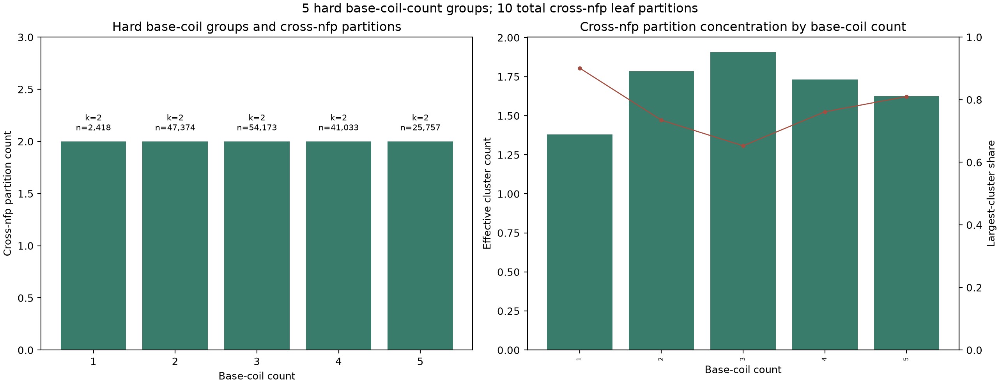
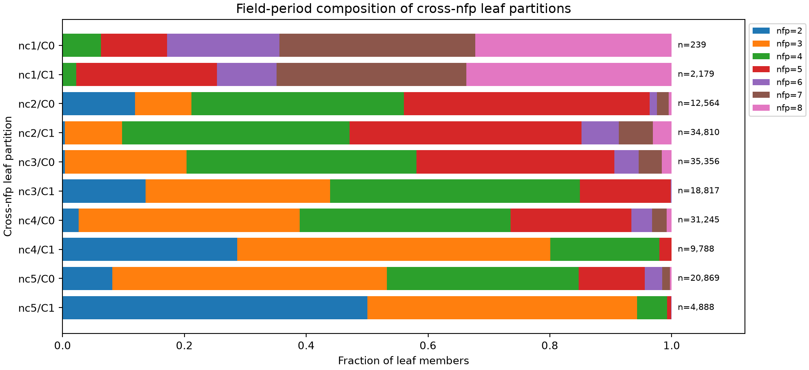
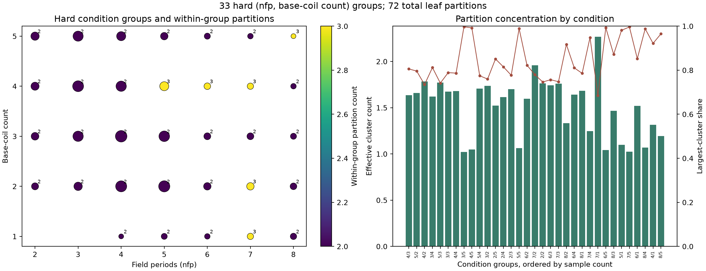

# QUASR QH 几何结构图谱与跨 `nfp` 聚类

- 完成时间：2026-08-29（Asia/Shanghai）
- 数据集：170,755 个 QUASR QH 位型，清单 SHA-256
  `3e73f3cb5a25b3168f88f8f8486705fc6453696637b5fab2046cc7cb30d451ac`
- 严格图谱代码：`bf3e6b1ac29e81d91da19e59bdc50675a2faade0`
- 跨 `nfp` 图谱代码：`1946e1329242ef8b7d171991621c5b14a34b0f07`
- 输入分片哈希：全部通过验证

## 结论

QUASR QH 几何分布适合用两层分辨率描述：

1. 粗粒度跨 `nfp` 图谱以五种 `n_coils` 为硬边界，每种线圈数选出
   2 个主要几何分区，共 10 个叶簇。不同 `n_coils` 的样本始终隔离。
2. 10 个粗粒度叶簇全部包含多个 `nfp`。每个叶簇覆盖 5--7 种场周期，
   簇标签与 `nfp` 的样本加权归一化互信息为 `0.0932`。几何类型具有
   明确的跨场周期复现。
3. 条件分辨图谱先划分 33 个 `(nfp,n_coils)` 硬组，再在每组内划分
   2--3 个几何分区，共 72 个叶簇。该图谱保留场周期相关的局部变化和
   稀有尾部。
4. 条件分辨图谱的样本加权主簇占比为 `81.28%`，有效簇数为 `1.599`。
   跨 `nfp` 图谱的对应值为 `72.89%` 和 `1.781`。QUASR 的样本质量集中
   在少数主要几何域内。
5. 所有硬组的六位小数标准化描述符重复率均为 0。肉眼观察到的重复感
   对应高密度近邻和主簇集中，样本仍保留连续几何差异。

跨 `nfp` 的 10 个叶簇适合作为未来样本的粗粒度新颖性基线；条件分辨的
72 个叶簇适合作为同一 `(nfp,n_coils)` 内的精细定位基线。

## 双图谱定义

| 图谱 | 硬边界 | 允许共享叶簇的范围 | 拟合抽样 | 硬组数 | 叶簇数 |
|:---|:---|:---|:---|---:|---:|
| 条件分辨 | `(nfp,n_coils)` | 固定 `nfp` 与固定 `n_coils` | 每组均匀抽样，最多 5,000 | 33 | 72 |
| 跨 `nfp` | `n_coils` | 固定 `n_coils` 下的全部 `nfp` | 各 `nfp` 平衡抽样，最多 10,000 | 5 | 10 |

两套图谱都使用完整 170,755 个样本进行最终归类。拟合抽样只用于 PCA 和
聚类中心估计。

## 跨 `nfp` 图谱

### 分区质量

| `n_coils` | 样本数 | 簇大小 | 主簇占比 | 有效簇数 | silhouette | 重启 ARI | 簇/`nfp` NMI | 两簇覆盖的 `nfp` 数 |
|---:|---:|:---|---:|---:|---:|---:|---:|:---|
| 1 | 2,418 | 239 / 2,179 | 90.12% | 1.381 | 0.542 | 1.000 | 0.0125 | 5 / 5 |
| 2 | 47,374 | 12,564 / 34,810 | 73.48% | 1.783 | 0.321 | 0.999 | 0.0515 | 7 / 7 |
| 3 | 54,173 | 35,356 / 18,817 | 65.26% | 1.907 | 0.316 | 1.000 | 0.0882 | 7 / 5 |
| 4 | 41,033 | 31,245 / 9,788 | 76.15% | 1.732 | 0.365 | 1.000 | 0.1250 | 7 / 5 |
| 5 | 25,757 | 20,869 / 4,888 | 81.02% | 1.626 | 0.448 | 0.991 | 0.1377 | 7 / 5 |

五组重启 ARI 均达到 `0.991`，两分结构具有良好的初始化稳定性。`n_coils=4`
的 `k=3` 选择分数为 `0.3700`，`k=2` 为 `0.3654`；第三簇只占拟合样本的
`0.31%`。近优规则选择较小的 `k=2`，将该尾部保留在粗粒度主簇中。

候选集合从 `k=2` 开始。10 个叶簇是一套稳定、实用的粗粒度索引；自然
分支数的进一步确认需要加入单簇模型、密度模型和重采样层次检验。

图 1：左图给出五种线圈数的组内分区数；右图给出有效簇数与主簇占比。

### 场周期组成

10 个叶簇都含有多种场周期。`n_coils=1` 在 QUASR 中覆盖 `nfp=4..8`，
两个叶簇都覆盖全部 5 种。`n_coils=2` 的两个叶簇都覆盖 `nfp=2..8`。
`n_coils=3..5` 各有一个叶簇覆盖全部 7 种场周期，另一个叶簇覆盖 5 种。

图 2：每条横柱表示一个粗粒度叶簇，颜色给出完整样本归类后的 `nfp`
比例。拟合阶段采用 `nfp` 平衡抽样，图中的成员数量保留 QUASR 原始频率。

各 `n_coils` 代表几何图：

- [`n_coils=1`](assets/quasr_qh_structure_cross_nfp_20260829/galleries/nc1_representatives.png)
- [`n_coils=2`](assets/quasr_qh_structure_cross_nfp_20260829/galleries/nc2_representatives.png)
- [`n_coils=3`](assets/quasr_qh_structure_cross_nfp_20260829/galleries/nc3_representatives.png)
- [`n_coils=4`](assets/quasr_qh_structure_cross_nfp_20260829/galleries/nc4_representatives.png)
- [`n_coils=5`](assets/quasr_qh_structure_cross_nfp_20260829/galleries/nc5_representatives.png)

每幅代表图显示叶簇 medoid 的基本线圈集合、medoid 所属 `nfp`、QUASR ID
和叶簇成员数。

## 条件分辨图谱

### 分层计数

| `n_coils` | `(nfp,n_coils)` 硬组数 | 样本数 | 叶簇数 | 组内 `k` |
|---:|---:|---:|---:|:---|
| 1 | 5 | 2,418 | 11 | 2--3 |
| 2 | 7 | 47,374 | 15 | 2--3 |
| 3 | 7 | 54,173 | 14 | 2 |
| 4 | 7 | 41,033 | 17 | 2--3 |
| 5 | 7 | 25,757 | 15 | 2--3 |
| 合计 | 33 | 170,755 | 72 | 2--3 |

27 个硬组选择 `k=2`，6 个硬组选择 `k=3`。72 个叶分区中有 13 个低于
所在硬组样本数的 5%，其中 4 个为单样本叶。条件分辨图谱将这些尾部保留
为异常结构索引。59 个叶分区达到所在硬组 5% 的描述性权重阈值。

图 3：每个点表示一个 `(nfp,n_coils)` 硬组，点旁数字和颜色均表示该硬组
内部的叶簇数。图题明确给出 33 个硬组和 72 个全局叶簇。

### 低置信尾部分区

| 硬组 | 样本数 | 簇大小 | 重启 ARI | 解释 |
|:---|---:|:---|---:|:---|
| `nfp3_nc5` | 11,572 | 11,537 / 35 | 0.021 | 35 个样本的尾部对初始化敏感 |
| `nfp6_nc4` | 1,062 | 861 / 2 / 199 | 0.721 | 2 个样本形成微小尾部 |
| `nfp8_nc4` | 248 | 245 / 3 | 0.493 | 小样本硬组中的 3 样本尾部 |
| `nfp8_nc5` | 57 | 55 / 1 / 1 | 0.782 | 两个单样本尾部 |

这些叶分区携带低置信标签，适合异常检索和后续重采样。条件分辨图谱的
完整 33 组指标、候选 `k`、medoid、半径分位数和成员文件均保存在结果资产
中。

## 描述符与聚类方法

每个基本线圈使用以下几何与相对电流描述符：

- 线圈中心的柱坐标半径与高度、曲线长度、回转半径；
- 柱坐标半径和高度的 5%、25%、50%、75%、95% 分位数；
- 速度变异系数与曲率的 50%、90%、99% 分位数；
- 1--16 阶横向与纵向 Fourier 能量比例；
- 归一化有符号电流与绝对电流；
- 线圈中心之间的三维距离、平面距离、环向夹角和高度差。

描述符对基本线圈排列、整体环向旋转和曲线参数反向保持不变；采样分位数
对网格对齐的参数相移保持不变，谱能量对连续参数相移保持不变。每个硬组
使用中位数和 Gaussian-equivalent IQR 做稳健缩放，再用 PCA 和确定性多起点
`k-means++/Lloyd` 建立分区。

候选 `k` 为 `2,3,4,5,6,8,10,12`。选择分数等于近似 silhouette 与初始化
稳定性的组合；分数进入最优值 5% 或 `0.005` 容差的候选中，选择最小 `k`。

跨 `nfp` 图谱的 `n_coils=2..5` 都达到 24 维 PCA 上限，保留方差为
`72.5%--77.6%`；`n_coils=1` 使用 20 维并保留 `95.2%`。条件分辨图谱有
26 个硬组达到 24 维上限。PCA 图谱聚焦主要几何差异，细粒度高维差异可在
后续表示学习或更高维密度模型中继续检验。

## 新颖性判定接口

未来候选先按 `n_coils` 选择对应的跨 `nfp` 模型，再按候选的
`(nfp,n_coils)` 选择条件分辨模型。两套 `novelty_reference.json` 保存相同的
描述符顺序、稳健缩放参数、PCA 变换、聚类中心和每簇成员半径分位数。

建议使用三类标签：

1. **QUASR 核心域**：跨 `nfp` 距离和条件分辨距离均位于对应叶簇的 95%
   成员半径内。
2. **跨场周期复现**：跨 `nfp` 距离位于 99% 成员半径内，条件分辨距离越过
   99% 成员半径。该标签表示熟悉几何在新场周期条件下的延伸。
3. **全局几何新颖候选**：跨 `nfp` 距离越过 99% 成员半径，同时相对完整
   atlas 的最近邻距离越过对应硬组的 99% 分位数。多个独立样本形成稳定局部
   群后，再建立新叶簇。

几何新颖性、原生分数、Adam200 可优化性和完整物理验证是四个独立维度。
未来搜索应同时记录四类证据。

## 复现资产

| 资产 | SHA-256 |
|:---|:---|
| 条件分辨 `atlas_summary.json` | `cb3635310f73632f9418208fa3eb10c5d51385f9f963e7d677f95786b57b0012` |
| 条件分辨 `novelty_reference.json` | `f43017d6a924988209dc5e2e5bf0b7a1a977c9e00966733e1f92eaeb9369cb60` |
| 跨 `nfp` `atlas_summary.json` | `49404ae2346f504bac4e086fa10eba2dab71591e5f5ac8fc8a3740241e34024c` |
| 跨 `nfp` `novelty_reference.json` | `45919941d16d24712b63a98706f6328583ad4b354c601d7c5699d3f9c7dc879b` |

- 条件分辨 Slurm 作业 `46913`：73.68 秒，45 个输出文件，stderr 为空。
- 跨 `nfp` Slurm 作业 `46927`：52.50 秒，15 个输出文件，stderr 为空。
- 每个结果目录包含完整成员归类、PCA 坐标、中心距离、最近邻距离、medoid、
  图表和可复用新颖性模型。

## 六卡随机统计状态

状态快照：2026-08-29 00:25（Asia/Shanghai）。正式运行
`qh_data_gaussian_global_formal_10h_v2_20260828` 的目标为 46,167 个独立
标准化数据空间高斯样本。

| worker | Slurm 作业 | 已保存 / 目标 | 单样本评分时间 | 按实测速率预测总时长 |
|---:|:---|---:|---:|---:|
| 0 | `46898_0` | 560 / 7,359 | 4.576 s | 9.35 h |
| 1 | `46898_1` | 552 / 7,623 | 4.614 s | 9.77 h |
| 2 | `46898_2` | 568 / 7,689 | 4.547 s | 9.71 h |
| 3 | `46905_3` | 520 / 7,722 | 4.480 s | 9.61 h |
| 4 | `46901_0` | 576 / 7,854 | 4.481 s | 9.78 h |
| 5 | `46901_1` | 568 / 7,920 | 4.539 s | 9.99 h |

六个 worker 均处于 `RUNNING`，合计保存 3,344 / 46,167（7.24%）。六个进程
都通过 `94.6254147736` 的冻结样本参考门禁。快照状态计数为：
`no_axis=2,364`、`no_surface=766`、`drift_rejected=132`、
`flux_rejected=7`、`ok=75`。完整尾部概率和分层 Adam200 可优化比例将在正式
样本完成后计算；该快照只用于验证运行健康度和时长预测。
