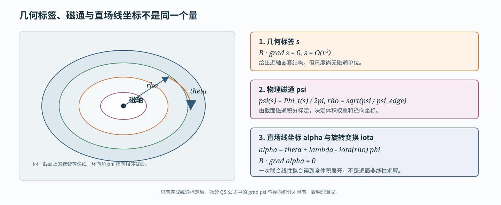

# 从 Fourier 线圈到体 QH 诊断与潜空间优化

**技术报告草案，2026-08-24**

本文记录当前 QH 主流程的物理定义、数值实现、优化实验和独立验收结果。报告中的“快速评分”是固定预算的筛选与优化目标；“完整评估”是 Simsopt 磁面求解和 DESC 平衡计算。两者用途不同，不能用前者替代后者。

## 1. 研究问题、设计目标与贡献

直接把标准磁面求解或 MHD 平衡求解放进大规模线圈优化内环，会遇到两个实际问题。第一，单次计算昂贵；第二，非线性迭代可能失败或出现很长的耗时尾部，因而难以稳定批量运行。本项目采用分层路线：先用定长磁力线追踪和线性最小二乘构造三维体物理代理，快速筛选和优化大量线圈；再只对少数候选运行标准磁面与平衡验收。

本文聚焦准螺旋对称中的 QH，即目标螺旋模取 $(M,N)=(1,N_{\rm FP})$。主要工作可以概括为三点：

1. 实现一条 C++/CUDA 原生链路，从 Fourier 线圈计算磁轴、几何磁面标签、物理磁通、直场线坐标、旋转变换和体 QA/QH/QP 指标；高维求解均为固定规模线性最小二乘，不含未知次数的高维非线性迭代。
2. 把执行方式区分为独立评估、严格续接评估和近邻批量代理。前两者给出正式评分；第三种只为小邻域内的大批量差分端点提供近似方向，并要求更新后的中心重新做正式评估。
3. 用可逆 Flow Matching 模型重参数化线圈空间，再用中心差分和 Adam 优化。309 条中程轨迹表明该流程可以稳定把大量样本推向高分段；标准磁面实验进一步确认快速体 QH 与面 QH 具有强排序相关性。

本文不声称三维体拟合已经达到机器精度 Boozer 坐标，也不声称 score 是唯一正确的线圈价值函数。项目返回可解释的物理元数据，并保留默认 score；用户可以在同一组元数据上定义自己的评分策略。

## 2. 从线圈到可解释体诊断量

**输入和磁场。** 每根基本线圈用一个 100 维 token 表示：$x,y,z$ 三个方向各 33 个实 Fourier 系数，再加一个电流。输入还包括基本线圈数 $n_c$ 和场周期数 $N_{\rm FP}$；完整线圈组由场周期旋转和恒星器对称生成。线圈离散为 256 段，Biot--Savart 磁场 $\boldsymbol B$、空间梯度 $\nabla\boldsymbol B$ 以及长度、曲率、线圈间距等工程量均由 CUDA 计算。

**磁轴。** 在一个场周期的 $R$--$Z$ 截面上定义 Poincare 映射

$$
P(R,Z)=\left(R(2\pi/N_{\rm FP}),Z(2\pi/N_{\rm FP})\right).
$$

磁轴截面是 $P(q)-q=0$ 的椭圆固定点。独立评估先在 $48\times48$ 网格上批量追踪候选，无可靠候选时在允许的 $N_{\rm FP}$ 范围内使用有界的 $64\times64$ fallback；候选再经过最多 6 次阻尼 Newton 精修。若 $J_P$ 是 Poincare 映射的 Jacobian，椭圆性使用

$$
\frac{|\operatorname{tr}J_P|}{\sqrt{\det J_P}}<2
$$

判断。严格续接评估则从上一接受中心的轴位置开始，只允许在给定距离内修正同一分支；失败返回 `branch_lost`，不回退到全局搜索，也不静默切换磁轴。最终沿轴保存 240 个样本及其周期插值。

**几何磁面标签 $s$。** 令

$$
X=\frac{R-R_0(\phi)}{a},\qquad
Y=\frac{Z-Z_0(\phi)}{a},
$$

其中快速评分的源拟合半径为 $a=0.05\,\mathrm m$。这个数只定义当前局部体模型的采样区域，不是所有线圈完整评估时应复用的最大磁面半径。几何标签写成

$$
s(X,Y,\phi)=X^2+\sum_k c_k\Phi_k(X,Y,\phi).
$$

$\Phi_k$ 包含所有总次数 $2\le a'+b'\le10$ 的 $X^{a'}Y^{b'}$，并与 $0\le m\le12$ 的 $\cos(mN_{\rm FP}\phi)$ 和 $\sin(mN_{\rm FP}\phi)$ 组合；$m=0$ 只保留余弦项，已经固定为 1 的 $X^2$ 常数模从未知量中删除。该基底不含常数项和一次项，因此轴附近 $s=O(r^2)$。

理想不变量满足

$$
\boldsymbol B\cdot\nabla s=0.
$$

它对 $c_k$ 线性，所以当前生产配置在 $48^3$ 网格上构造带 $10^{-6}$ 谱正则的过定线性系统，并用 FP32 cuSOLVER QR 求解。另在 4000 个独立点上报告

$$
\epsilon_s=\frac{\boldsymbol B\cdot\nabla s}
{|\boldsymbol B|\,|\nabla s|}
$$

的 $L^2$、均值和 P95。$s$ 是方便求解的几何标签，不是物理磁通。

**连续可用范围和磁通标定。** 快速评分在固定径向层上沿极角求 $s$ 的射线根，把每层 128 个点一起追踪一个场周期。第 $j$ 层第 $k$ 个角点的无量纲法向漂移为

$$
d_{jk}=\frac{|s(Px_{jk})-s_j|}
{|\nabla s(Px_{jk})|\,\bar r_j}.
$$

每层使用平滑尾部风险而不是硬最大值，再经 logistic 函数得到置信度。置信度沿半径做加权单调回归，其曲线面积给出连续边界提议；磁通可逆性只做固定 6 次二分，因此运行时间有严格上界。当前预算是一个周期、128 个极角点和每周期 400 个追踪步，不再在快速 score 中运行 16 周期长追踪。

在多个 $s$ 层和环向截面上积分环向磁通，并拟合零截距四次多项式

$$
\psi(s)=\frac{\Phi_t(s)}{2\pi}=\sum_{j=1}^{4}a_js^j,
\qquad
\rho=\sqrt{\frac{\psi(s)}{\psi(s_{\rm edge})}}.
$$

接受条件约束截面间磁通差异、边界残差和 $\psi'(s)$ 的单调性。至此，几何标签被标定为微分 QS 公式需要的物理磁通。

**$\alpha$ 与 $\iota$ 的联合拟合。** 定义直场线角

$$
\alpha=\theta+\lambda(\rho,\theta,\phi)-\iota(\rho)\phi,
\qquad
\boldsymbol B\cdot\nabla\alpha=0.
$$

$\lambda$ 使用最高径向、极向和环向阶数均为 12 的 Zernike--Fourier 展开；常数 gauge 被删除。旋转变换是磁面函数，当前写成

$$
\iota(\rho)=\sum_{p=0}^{3}\iota_p\rho^{2p}.
$$

把有限精度 $s$ 带来的法向磁场分量投影掉后，$\lambda$ 系数和四个 $\iota_p$ 仍可在同一个线性系统中联合求解。默认生成 100000 个近似等体积点，分层选取 30000 点拟合，并用 FP32 QR 求解。结果是整个受支持体积内的近直场线坐标，不是只针对一个磁面拟合的角度。

**体微分 QS。** 给定 $\psi$、$\iota$、$\boldsymbol B$ 和 $\nabla\boldsymbol B$，定义

$$
A=(\boldsymbol B\times\nabla\psi)\cdot\nabla|\boldsymbol B|,
\qquad
C=\boldsymbol B\cdot\nabla|\boldsymbol B|,
$$

$$
f_C=(M\iota-N)A-MGC.
$$

这里 $G=\mu_0I_{\rm link}/(2\pi)$，符号与边界磁通约定一致。对螺旋模 $(M,N)$ 报告

$$
E_{M,N}=\frac{1}{\sqrt{M^2+N^2}}
\sqrt{\frac{\sum_iw_i(f_{C,i}/|\boldsymbol B_i|^3)^2}{\sum_iw_i}}.
$$

QA、QH、QP 分别取 $(1,0)$、$(1,N_{\rm FP})$、$(0,N_{\rm FP})$。采样密度和柱坐标 Jacobian 已进入 $w_i$；达到固定有效点预算后，有效点数量本身不会通过改变分母来“作弊”。快速分支不需要显式求 $\nu$。

一次正式评估返回的内容不只是总分：

| 类别 | 主要字段 | 含义 |
|---|---|---|
| 直接计算量 | 轴位置和拓扑、线圈长度/曲率/间距、电流、磁通、QA/QH/QP | 可直接解释或进一步构造 score |
| 拟合诊断量 | $\epsilon_s$、磁通截面差、边界残差、$\alpha$ 相对残差、$\iota(\rho)$ | 说明三维近似在哪一步损失精度 |
| 经验代理 | 连续面置信度、有效边界、surface/coordinate/volume-QS 分量 | 为稳定筛选设计，不是标准磁面真值 |
| 状态和耗时 | 失败阶段、`branch_lost`、逐阶段 GPU/CPU 时间、配置回读 | 用于审计、性能分析和拒绝不可信结果 |

默认分数包含 axis、psi、surface、coordinate、volume-QS、iota 和 coil 七项，权重为 $(10,10,10,10,42,10,8)$。QH 还乘低 $|\iota|$ 和错误螺旋度的门函数，避免圆线圈、微小磁面和“三种 QS 都很差”等退化方式。接口同时保留 `native_score` 和用户策略生成的 `score`，因此自定义权重不会覆盖原始证据。

## 3. 三种执行方式与潜空间优化

三种执行方式的差别不在“是否批处理”，而在允许复用什么，以及结果能否当成正式分数。

| 方式 | 输入 | 重新计算 | 允许复用 | 输出用途 |
|---|---|---|---|---|
| 独立评估 | 线圈和 $N_{\rm FP}$ | 全局磁轴及全部下游量 | 无历史状态 | 数据集评分、最终无历史复评 |
| 严格续接评估 | 线圈、上一接受中心的轴状态 | 同分支轴修正及全部下游量 | 只复用轴初值 | 优化中心和正式差分端点 |
| 近邻批量代理 | 正式中心、中心线圈和一批近邻候选 | 每个候选的局部轴、warm-$s$、局部 $\alpha/\iota$/QS | 中心 QR 结构、局部面分支；coordinate 分量继承，coil 局部线性化 | 大批量方向估计和局部排序 |

前两种由 `Evaluator` 暴露，并输出同一个结构化 `EvaluationResult`。严格续接固定使用 mode 2：保留混合精度拓扑检查，删除重复的五线 FP64 replay。第三种位于 `stellarator_eval.experimental`，明确输出 `neighborhood_proxy`，且代理结果不能再作为下一批代理的中心。任何被接受的新中心都必须重新运行正式评估。

**Flow Matching 的角色。** 模型学习从标准高斯噪声 $z$ 到线圈 token $x$ 的常微分方程映射

$$
\frac{dx_t}{dt}=v_\vartheta(x_t,t,N_{\rm FP}),
\qquad x_0=z,\quad x_1=x.
$$

网络是 8 层非因果 Transformer：宽度 512、8 个注意力头、SwiGLU 前馈层、PreNorm 和 RMSNorm，不使用 RoPE；一个 token 对应一根基本线圈，$N_{\rm FP}$ 通过条件嵌入注入。训练覆盖全部 170755 个 QUASR QH 样本以及其经验联合 $(N_{\rm FP},n_c)$ 分布。各坐标先标准化，但损失恢复 Fourier/Parseval 曲线距离的物理权重，避免高频尾项因方差小而主导训练。

当前优化使用 FP32 RK4-128 解码。Flow 不是高质量线圈的直接生成器，而是可逆的非线性坐标变换：实验关注的是在 $z$ 空间是否更容易搜索，而不是随机 $z$ 是否天然高分。

**有限差分 Adam。** 当前正式默认在潜空间取两个新鲜正交方向 $u_1,u_2$，以 $h=0.005$ 做中心差分

$$
g_t=\frac{1}{2}sum_{j=1}^{2}
\frac{S(z_t+hu_j)-S(z_t-hu_j)}{2h}u_j,
$$

再用学习率 $0.01$、$(\beta_1,\beta_2)=(0.7,0.999)$ 的 Adam 更新。端点和下一中心在一个 Flow batch 中流水解码；端点必须沿当前中心磁轴严格续接。任一端点无效则整步不更新；新中心无效时有限回退并完整回滚；历史最佳点与当前点分开保存。

大规模 309 轨迹实验使用了更高吞吐的研究配置：每步 64 个正交方向、128 个中心差分端点由近邻批量代理求方向，但每个中心仍走正式评分。它验证的是第三种执行方式支持大规模优化的能力，不应被误写成当前两方向正式评分默认值。

## 4. 优化是否有效

**309 条固定预算轨迹。** 每条轨迹先按 QUASR QH 训练集的联合条件分布抽取 $(N_{\rm FP},n_c)$，独立生成并评分 32 个 Flow 样本，选择其中最高分作为起点，再运行 200 步 Adam。共得到 9888 个随机候选、309 个起点、61800 个正式中心和约 791 万个局部代理端点。最后把每条历史最佳线圈在不提供磁轴历史的条件下独立重评分。

| 样本组 | 数量 | `ok` 率 | 分数 P50 | 分数 P95 | 最大值 |
|---|---:|---:|---:|---:|---:|
| 随机 Flow 候选 | 9888 | 61.0% | 9.847 | 74.147 | 86.627 |
| 32 选 1 起点 | 309 | 100% | 75.996 | 82.699 | 86.627 |
| Adam 最优点，独立重评分 | 309 | 99.7% | 90.214 | 92.908 | 93.521 |
| QUASR QH 对照 | 1024 | 84.3% | 66.696 | 92.522 | 94.349 |

Adam 最优点中 50.8% 达到 90 分，23.0% 达到 92 分；QUASR 对照对应比例为 12.9% 和 7.03%。优化把大量样本推入 90--93 的高分带，但没有超过 QUASR 的最优尾部，因此不能表述为“生成了比数据集所有样本更好的分布”。

独立重评分与在线历史最佳的 Pearson/Spearman 为 0.9988/0.99988。157 个在线分数不低于 90 的样本全部在独立入口保持 `ok`，分数中位差为 $-0.0109$。这说明严格磁轴续接没有制造虚假的高分尾部。

体 QH 误差中位数从起点的 $3.23\times10^{-2}$ 降到 $2.98\times10^{-3}$，约改善 10.8 倍；surface、coordinate 和 volume-QS 分量同时提高。代价是 coil 分量中位数为 66.03，低于 QUASR 的 70.19，说明默认权重仍允许用部分工程质量换取更强 QH。200 步也通常没有收敛：57.6% 的最优点出现在最后 25 步，故该数据是中程优化轨迹，不是局部极值集合。

**Flow 是否必要。** 在一个匹配起点、相同正式中心 score 和相同 64 方向局部估计器下，标准化原空间 200 步达到 91.783，Flow 潜空间达到 93.176；在原空间结束的同一墙钟时刻，潜空间已经达到 93.065。潜空间最优点的体 QH 是原空间的 0.2555 倍。这个实验说明原空间也可优化，Flow 不是“存在梯度”的必要条件；但对该起点，Flow 明显改善了高分阶段的方向质量。由于单起点不足以支持普遍结论，当前分支另设计了跨条件、跨优化阶段的配对短跑，最终版只在同版结果回收后给出多起点结论。

## 5. 体代理的精度、物理验收与速度

**批量标定设计。** 从 96 条轨迹各取 8 个阶段，得到 768 个位形；每个位形求固定探针面和自适应边界面，共 1536 个标准面。GPU 准备成功 766/768，标准 LS/Newton 加独立稠密检查最终严格通过 1231/1536。失败样本保留在成功率中，没有通过降低点数或复用历史轴掩盖。

快速体指标和面 QH 不是同一个数：前者是体积点上的微分 RMS，后者是标准磁面上 $|B|$ 非目标螺旋模的相对方差。因此评价重点是排序和 log 尺度关系，而不是要求二者数值相等。

| 比较 | 严格样本数 | Spearman | 轨迹聚类 95% 区间 |
|---|---:|---:|---:|
| 全体积微分 QH vs 固定探针面 QH | 606 | 0.944 | $[0.918,0.961]$ |
| 全体积微分 QH vs 自适应边界面 QH | 625 | 0.958 | $[0.943,0.967]$ |
| 外层壳层微分 QH vs 自适应边界面 QH | 625 | 0.967 | $[0.958,0.974]$ |

外层壳层与面处于更接近的径向区域，所以相关性最高。这个结果支持把体 QH 用作优化排序代理，但不支持用它替代单个标准面的精确 QH。

固定探针面 QH 中位数从第 0 步的 $3.66\times10^{-4}$ 降到第 200 步的 $1.79\times10^{-6}$。只比较首尾都严格通过的 67 条轨迹，65 条改善，中位改善为 189 倍。这证明快速体目标的优化改进能传递到标准面，而不是仅把代理本身压低。

**各物理量的准确性边界。** 下表给出当前可以定量支持的口径。

| 量 | 参考或独立检查 | 结果 | 正确解释 |
|---|---|---|---|
| source $\psi$ | 独立体点上的法向角误差 | $L^2$ P50/P95 为 $1.325\times10^{-5}/1.297\times10^{-4}$ | 几何不变量通常准确，少数尾部需拒绝 |
| $\alpha$ 全体积向量 | 留出点相对 $L^2$ | P50/P95 为 0.099/0.602 | 有限阶三维拟合不是机器精度 Boozer 解 |
| GPU $\iota$ | 固定标准面 $\iota$ | Spearman/Pearson 为 0.991/0.996；相对误差 P50/P95 为 0.157%/2.65% | 在受支持固定径向区间内可作定量初值 |
| $\alpha+\nu$ 面初值 | 标准 Boozer 方程残差 | 初值 P50 $7.58\times10^{-4}$，求解后 $5.65\times10^{-6}$ | 是强初值，不是最终面证书 |
| 体 QH | Simsopt 面 QH | Spearman 0.944--0.967 | 适合排序和优化，不要求一比一数值对应 |
| 线圈工程量 | Fourier 曲线直接求值 | 无额外代理层 | 数值精度由离散和 FP64 归约控制 |

**代表性完整评估。** 在上述 1536 个面中，最小严格面 QH 为 $6.687\times10^{-8}$。对该线圈重新向外搜索后，选择了样本自身的 $a=0.08,s=0.49$ 大面；这些数只属于该样本。该面体积为 $0.06607\,\mathrm{m}^3$，$\iota=1.45637$，稠密相对残差为 $1.603\times10^{-5}$，面 QA/QH/QP 为 $9.50\times10^{-4}/5.17\times10^{-7}/9.51\times10^{-4}$。当前独立 native score 为 94.6369。

DESC 初态和终态均保持嵌套，$\iota(\rho)$ 从约 1.444 平滑增至 1.456。求解达到 50 步上限而非严格收敛，但归一化力残差降低约三个数量级；因此准确结论是“物理验收通过且 DESC 显著改进”，不是“DESC 已严格收敛”。全部 8 张 DESC 图和机器可读结果见[该样本完整评估报告](../qh_min_face_qh_full_evaluation_20260819.md)。

**速度。** 当前历史基线在单张空闲 RTX 5090 上，连续磁面 score 的独立评估 P50/P95 为 2.836/4.012 s；给定严格轴提示后为 0.990/1.254 s。随后 $48^3$ 网格和 mode 2 去重进一步降低了严格入口耗时，但这些数字来自不同实验快照，不能拼成一张“同版本最终表”。本分支已经冻结同一代码、同一批端点和同类空闲 RTX 5090 的三模式 benchmark：正式独立/严格入口报告 P50/P95 和阶段耗时，近邻代理报告 batch size 2--128 的单候选均摊时间、状态一致率和对严格入口的局部 Spearman。结果回收前，此处不填写推测值。

309 轨迹使用的研究配置平均每条占用 1436.5 GPU 秒，其中 32 候选筛选 P50 为 117.6 s，200 步 Adam P50 为 1166.3 s，单步 P50 为 5.65 s。单步中位耗时约由局部代理 3.15 s、下一批 Flow 解码 1.28 s、更新中心正式 score 0.97 s 构成；六张卡实测产能为 355.3 条/天。

## 6. 结论、限制与复现边界

当前证据支持以下结论：固定预算 C++/CUDA 路线能从 Fourier 线圈稳定地产生磁轴、$s/\psi$、$\alpha/\iota$、体 QA/QH/QP 和工程诊断；体 QH 对标准面 QH 具有强排序相关性，并能有效指导大规模优化；Flow 潜空间在已验证起点上比简单标准化原空间更容易继续压低高分阶段的 QH。项目因而适合用作大量线圈的筛选与优化前端。

边界同样明确。QH Flow 的训练分布覆盖 QUASR QH 的 $N_{\rm FP}=2\ldots8$ 和 1--5 根基本线圈，不能自动外推到 QA、不同参数化或远离训练分布的线圈。连续磁面置信度只是固定预算代理；高 score、很小的 $\psi$ 残差或很直的体坐标都不能单独证明存在大嵌套磁面。最终候选仍需样本自适应地搜索 $a$ 和 $s$，运行标准 Simsopt LS/Newton、稠密残差与 Poincare 检查，并在需要时运行 DESC。

**项目接口。** `stellarator_eval.Evaluator` 默认加载当前生产配置，支持独立和严格续接两种正式模式；输入由 `CoilSet` 固定 Fourier 系数、电流单位和 $N_{\rm FP}$。`EvaluationResult` 同时保存状态、原生分数、用户策略分数、七个分量、全部诊断、配置回读和逐阶段耗时，并可导出 `stellarator-native-evaluation-v1` JSON。近邻批量代理单独位于 `stellarator_eval.experimental.NeighborhoodEvaluator`，防止用户误把代理输出当成正式结果。

**默认 score 的精确形式。** 对误差型量使用

$$
q_\downarrow(x;s,p)=\frac{1}{1+(x/s)^p},
$$

尺寸型量用平滑饱和函数。设七个归一化分量为 $q_k$，权重为 $w_k$，则门控前分数为

$$
S_0=100\frac{\sum_kw_kq_k}{\sum_kw_k}.
$$

令 $q_\iota$ 为按 $\min|\iota|$ 构造的分量，令

$$
h=\frac{\min(E_{\rm QA},E_{\rm QP})}
{E_{\rm QH}+\min(E_{\rm QA},E_{\rm QP})}
$$

表示 QH 相对竞争优势。最终分数为 $S=S_0g_\iota(q_\iota)g_h(h)$，两个门函数都保留 0.1 的探索下限。体 QH 分量内部还乘面尺寸和 $\iota$ 因子；尺寸在逆纵横比 0.03 后饱和。用户自定义策略可以改动这些映射，但必须保留原始元数据和 `native_score`，才能在未来调整 score 时重算而不重复昂贵物理评估。

**可复现证据。** 本报告的批量优化数据、标准面标定、代表性完整评估和 Flow/原空间单起点比较分别冻结在：

- [309 条轨迹验收](../qh_adam_trajectory_dataset_pilot_acceptance_20260813.md)；
- [768 位形、1536 面标定](../qh_trajectory_face_qs_calibration_20260819.md)；
- [最小面 QH 样本完整评估](../qh_min_face_qh_full_evaluation_20260819.md)；
- [Flow 潜空间与标准化原空间比较](../qh_original_space_optimization_20260815.md)。

所有性能结论必须同时记录 Git commit、原生动态库哈希、Flow checkpoint 哈希、GPU 型号、配置回读和输入清单。不同 ABI、不同电流符号约定、常数/三次 $\iota$ 或离散/连续磁面选择得到的绝对分数不得混合比较。
