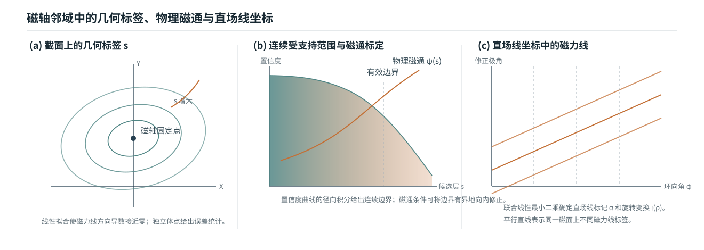

# GPU 原生三维体诊断驱动的准螺旋对称线圈优化

**技术报告，2026-08-24**

## 摘要

本文研究一个面向大规模线圈搜索的问题：如何在固定且可预测的计算预算内，从 Fourier 线圈直接得到具有物理含义的三维体诊断，并据此优化准螺旋对称（quasi-helical symmetry，QH）位形。方法首先在 CUDA 上计算磁场和椭圆磁轴，随后依次拟合几何磁面标签 $s$、标定物理磁通 $\psi(s)$、联合拟合直场线标记 $\alpha$ 与旋转变换 $\iota(\rho)$，最后计算体积内的微分 QA、QH 和 QP 误差。高维求解采用固定规模线性最小二乘，磁力线追踪和边界修正均有显式步数上限。

评估器提供三种执行模式。独立评估从线圈开始全局搜索磁轴；严格续接评估从上一正式中心的磁轴出发，并完整重算其余物理量；近邻批量代理利用正式中心保存的线性系统信息，同时评价大量有限差分端点。结构化输出保存磁轴、拟合误差、有效体积、$\iota$、QA/QH/QP、线圈工程量、状态和逐阶段耗时。默认总分只是这些元数据上的一组有界映射，用户策略可直接读取同一组原始量。

QH 优化采用一个 3033 万参数的非因果 Transformer Flow Matching 模型作为可逆坐标变换。每条实验轨迹从 32 个随机潜变量中选取最高有效起点，再运行 200 步有限差分 Adam；每步使用 64 个正交随机方向和 128 个对称端点。309 条轨迹的独立复评中位数由起点的 75.996 提高到 90.214，体 QH 误差中位数降低 10.8 倍。进一步对 768 个优化位形和 1536 个标准磁面进行标定：体 QH 与面 QH 的 Spearman 相关系数为 0.944--0.967，GPU $\iota$ 与标准面 $\iota$ 的 Spearman/Pearson 相关系数为 0.991/0.996。结果表明，这条固定预算体诊断路线能够作为 QH 线圈筛选与优化的高吞吐前端；标准磁面求解和 DESC 继续承担少量候选的最终物理验收。

**关键词：** 恒星器线圈；准螺旋对称；直场线坐标；微分 QS；Flow Matching；无梯度优化；CUDA

## 1. 研究问题与贡献

### 1.1 问题定义

设一个位形由 $n_c$ 根基本线圈和 $N_{\mathrm{FP}}$ 个场周期定义。第 $j$ 根基本线圈的三个笛卡尔坐标各使用 33 个实 Fourier 系数，另有一个电流，因此一根线圈对应一个 100 维 token。完整输入可写为

$$
\mathcal C=\{\boldsymbol c_j^x,\boldsymbol c_j^y,\boldsymbol c_j^z,I_j\}_{j=1}^{n_c},
\qquad N_{\mathrm{FP}}.
$$

本文聚焦目标螺旋模 $(M,N)=(1,N_{\mathrm{FP}})$ 的 QH 线圈。算法需要从 $\mathcal C$ 稳定地产生两类输出：

1. 可解释的物理元数据，包括磁轴、近似磁面质量、物理磁通、旋转变换、体 QA/QH/QP 误差和线圈工程量；
2. 由这些元数据构造的标量目标，用于大规模筛选和迭代优化。

传统标准磁面求解和 MHD 平衡求解含有高维非线性迭代，单次成本高且运行时间存在长尾。本工作的设计目标是把优化内环限定为固定预算追踪、固定规模线性最小二乘和批量张量计算，再把标准磁面与平衡求解放到候选验收阶段。

### 1.2 主要贡献

本文贡献集中在三个相互衔接的层次。

第一，建立了一条 C++/CUDA 原生三维体计算链路。该链路从线圈直接得到磁轴、$s$、$\psi$、$\alpha$、$\iota$ 和微分 QS，并为每一步提供独立误差量和状态码。

第二，针对不同调用场景定义独立评估、严格续接评估和近邻批量代理。三种模式共享相同的物理依赖关系，同时具有明确的复用范围与输出口径。

第三，将 QH Flow Matching 模型用作线圈参数空间的可逆重参数化，并构建 64 方向有限差分 Adam。309 条跨场周期数和线圈数的轨迹、标准磁面标定以及完整 DESC 个例共同检验了优化效果和物理可信度。

图 1 中上半部分是固定预算体计算。其输出同时进入两个分支：优化主线把元数据映射成标量目标；验收支线进一步拟合环向修正 $\nu$，并运行 Simsopt 磁面求解、稠密检验、Poincare 追踪和 DESC。两条分支共享相同的 $s/\psi$ 与 $\alpha/\iota$ 前端。

## 2. 方法

### 2.1 线圈参数化与磁场

每个坐标分量使用 16 阶实 Fourier 展开。以 $x$ 为例，

$$
x_j(t)=c_{j,0}^{x}+\sum_{m=1}^{16}
\left(c_{j,2m-1}^{x}\sin mt+c_{j,2m}^{x}\cos mt\right),
\qquad 0\le t<2\pi.
$$

$y_j(t)$ 和 $z_j(t)$ 采用同一约定。场周期旋转与恒星器对称生成完整线圈组。每根线圈离散为 256 段，CUDA 内核按 Biot--Savart 定律计算磁场 $\boldsymbol B$ 与空间梯度 $\nabla\boldsymbol B$，并由同一 Fourier 曲线计算长度、曲率、线圈间最小距离、线圈到磁轴最小距离和高模能量比例。

### 2.2 椭圆磁轴

在环向角 $\phi=0$ 的 $R$--$Z$ 截面上定义一个场周期 Poincare 映射

$$
P(R,Z)=\left(R\!\left(\frac{2\pi}{N_{\mathrm{FP}}}\right),
Z\!\left(\frac{2\pi}{N_{\mathrm{FP}}}\right)\right).
$$

磁轴截面位置 $q_0=(R_0,Z_0)$ 满足

$$
P(q_0)-q_0=0.
$$

独立评估首先在 $48\times48$ 网格上批量追踪固定点候选；当 $N_{\mathrm{FP}}\le7$ 且主网格未给出可接受候选时，使用 $64\times64$ 有界补充网格。候选经过最多 6 次阻尼 Newton 精修。每周期追踪 960 步，最终保存 240 个磁轴样本用于后续环向插值。

令 $J_P$ 为 Poincare 映射在固定点处的 Jacobian。当前实现要求

$$
\det J_P>0,
\qquad
\frac{|\operatorname{tr}J_P|}{\sqrt{\det J_P}}<2,
$$

以选择椭圆固定点。严格续接评估从上一正式中心的 $(R_0,Z_0)$ 开始局部修正，并限制轴位移；拓扑或位移条件失败时返回 `branch_lost`。这个规则使连续优化轨迹始终对应同一磁轴分支。

### 2.3 几何磁面标签 $s$

沿磁轴定义局部无量纲坐标

$$
X=\frac{R-R_0(\phi)}{a},
\qquad
Y=\frac{Z-Z_0(\phi)}{a},
\qquad a=0.05\ \mathrm m.
$$

快速评估中的 $a$ 是体拟合采样半径。完整评估会针对每个样本重新选择源拟合半径和外层磁面。

几何标签写为

$$
s(X,Y,\phi)=X^2+
\sum_{p,q,m,\sigma}c_{pqm\sigma}
X^pY^qT_{m\sigma}(\phi),
$$

其中

$$
T_{m,c}(\phi)=\cos(mN_{\mathrm{FP}}\phi),
\qquad
T_{m,s}(\phi)=\sin(mN_{\mathrm{FP}}\phi).
$$

基函数包含 $2\le p+q\le10$ 和 $0\le m\le12$；$m=0$ 仅保留余弦项。常数项和一次项被移除，固定的 $X^2$ 常数环向模从未知向量中删除。该构造保证轴附近 $s=O(r^2)$，同时覆盖当前截断阶数内完整的二维多项式与环向 Fourier 组合。

理想磁面标签沿磁力线保持常数：

$$
\boldsymbol B\cdot\nabla s=0.
$$

上式对系数 $c_{pqm\sigma}$ 线性。生产配置在 $48^3$ 网格上构造过定系统，加入 $10^{-6}$ 正则项后使用 FP32 cuSOLVER QR 求解。另取 4000 个独立点统计归一化方向误差

$$
\epsilon_s=
\frac{\boldsymbol B\cdot\nabla s}
{|\boldsymbol B|\,|\nabla s|},
$$

并返回均值、$L^2$ 和 P95。$s$ 是由磁场拟合得到的几何标签，下一步通过环向磁通把它标定为物理磁通。

### 2.4 连续受支持范围与物理磁通

当前边界候选层为

$$
\{0.001,0.002,0.004,0.008,0.02,0.04,0.08,
0.16,0.25,0.36,0.49,0.64,0.81\}.
$$

每层在一个截面上求 128 个射线根，并把这些点追踪一个场周期，每周期使用 400 步。第 $j$ 层第 $k$ 个起点的无量纲漂移定义为

$$
d_{jk}=
\frac{|s(\boldsymbol x_{jk}^{\mathrm{end}})-s_j|}
{|\nabla s(\boldsymbol x_{jk}^{\mathrm{end}})|\,\bar r_j},
$$

其中 $\bar r_j$ 是该层的平均物理半径。每层先用温度 $0.005$ 的平滑尾部统计聚合 $d_{jk}$，再通过中心 $0.05$、温度 $0.0125$ 的 logistic 映射得到置信度。置信度沿半径执行加权单调回归；置信度曲线的径向积分定义连续有效层 `surface_effective_level`。该量随局部磁面支持范围连续变化，消除了离散最大稳定层带来的目标跳变。

在候选边界内使用 11 个径向层、8 个环向截面、每截面 256 个极角点和 24 点径向求积计算环向磁通。令 $\Phi_t(s)$ 为环向磁通，物理磁通定义为

$$
\psi(s)=\frac{\Phi_t(s)}{2\pi}
=\sum_{j=1}^{4}a_js^j,
\qquad
\rho=\sqrt{\frac{\psi(s)}{\psi(s_{\mathrm{edge}})}}.
$$

四次多项式固定零截距。验收量包括拟合相对 RMS、边界残差、边界处截面相对标准差，以及 $\psi'(s)$ 的最小值和最大值。磁通条件需要缩小边界时，程序执行最多 6 次二分修正。

图 2(a) 表示磁轴截面附近的 $s$ 等值线；图 2(b) 同时画出随候选层下降的磁面置信度和单调增长的物理磁通，虚线位置表示连续有效边界；图 2(c) 表示角度修正后同一磁面上的磁力线成为斜率由 $\iota$ 决定的平行直线。

### 2.5 直场线标记 $\alpha$ 与旋转变换 $\iota$

令 $\theta=\operatorname{atan2}(Y,X)$，$u=\rho^2$。直场线标记写为

$$
\alpha(\rho,\theta,\phi)
=\theta+\lambda(\rho,\theta,\phi)-\iota(u)\phi,
\qquad
\boldsymbol B\cdot\nabla\alpha=0.
$$

周期修正 $\lambda$ 使用实 Zernike--Fourier 基底

$$
\lambda=
\sum_{l,m,n,\sigma}d_{lmn\sigma}
R_l^m(\rho)\,T_{mn\sigma}(\theta,\phi),
$$

其中 $0\le m\le l\le12$、$l-m$ 为偶数、$|n|\le12$，$T_{mn\sigma}$ 表示 $m\theta-nN_{\mathrm{FP}}\phi$ 的正弦或余弦。$m=n=0$ 的规范自由度被移除。旋转变换采用三次磁通函数

$$
\iota(u)=\iota_0+\iota_1u+\iota_2u^2+\iota_3u^3.
$$

程序在近似等物理体积的 100000 个点上计算场量，并从 10 个径向层中分层选择 30000 点建立联合线性系统。有限 $s$ 拟合误差产生的法向磁场分量先从直场线方程中投影出去，随后同时求解 $d_{lmn\sigma}$ 与四个 $\iota_p$。默认求解器为 FP32 QR，正则系数为 $10^{-7}$。返回量包括留出点上的 `alpha_relative_l2`、投影前法向场相对量 `alpha_normal_B_relative_l2`、$\iota$ 的最小值和最大值，以及线性系统列数。

这一步产生整个受支持体积内的近直场线坐标。完整评估支线继续拟合环向修正 $\nu$，把体坐标转换成 Simsopt 磁面求解所需的近 Boozer 初值。

### 2.6 微分 QS 与线圈工程量

给定 $\psi$、$\iota$、$\boldsymbol B$ 和 $\nabla\boldsymbol B$，定义

$$
A=(\boldsymbol B\times\nabla\psi)\cdot\nabla|\boldsymbol B|,
\qquad
C=\boldsymbol B\cdot\nabla|\boldsymbol B|,
$$

$$
f_C=(M\iota-N)A-MGC.
$$

真空环向场系数 $G$ 的绝对值按完整对称线圈组的链接电流计算，

$$
|G|=2\times10^{-7}
\left(2N_{\mathrm{FP}}\sum_{j=1}^{n_c}|I_j|\right),
$$

其符号由边界磁通方向确定。目标螺旋模的体误差为

$$
E_{M,N}=\frac{1}{\sqrt{M^2+N^2}}
\sqrt{
\frac{\sum_iw_i\left(f_{C,i}/|\boldsymbol B_i|^3\right)^2}
{\sum_iw_i}
}.
$$

权重 $w_i$ 包含物理体积测度与柱坐标 Jacobian。程序同时返回全体积、外层径向区域和绝对值 P95，并报告权重的有效样本比例。QA、QH 和 QP 分别使用

$$
(M,N)=(1,0),\qquad(1,N_{\mathrm{FP}}),\qquad(0,N_{\mathrm{FP}}).
$$

除 QS 外，评估器直接返回线圈长度均值、曲率 P95、最大曲率、线圈间最小距离、线圈到轴最小距离、高模能量比例和最大电流绝对值。这些量与物理诊断一起构成默认分数的输入。

### 2.7 默认分数

默认分数把原始元数据映射到 0--100。误差型量使用下降映射

$$
q_{\downarrow}(x;s,p)=\frac{1}{1+(x/s)^p},
$$

最小距离型量使用

$$
q_{\uparrow}(x;s,p)=\frac{1}{1+(s/x)^p},
$$

尺寸型量使用在给定尺度处饱和的三次平滑阶跃。七个分量依次为 `axis`、`psi`、`surface`、`coordinate`、`volume_qs`、`iota` 和 `coil`，权重为

$$
(10,10,10,10,42,10,8).
$$

`volume_qs` 占主要权重，并由目标 QH 残差、有效尺寸和 $\iota$ 共同决定。QH 总分进一步乘两个因子：一个随最小 $|\iota|$ 增长，另一个衡量 QH 相对 QA/QP 的竞争优势。尺寸项在逆纵横比 0.03 附近进入饱和区，因此扩大已经足够大的磁面只带来有限增益。完整公式和全部尺度列于附录 B。

结构化接口同时保存 `native_score` 和用户策略产生的 `score`。用户可在磁轴质量、有效体积、QS、$\iota$ 与线圈工程约束之间选择另一组映射，并保留原始元数据供后续重算。

### 2.8 三种评估模式

图 3 按物理阶段比较三种模式。蓝绿色表示正式重算；橙色表示当前候选的近邻迭代近似；灰色表示从中心继承或一阶近似。

**独立评估。** 输入只有线圈和 $N_{\mathrm{FP}}$。程序全局搜索磁轴，并完整计算所有下游量。该模式用于数据集评分、随机起点筛选和最终无历史复评。

**严格续接评估。** 输入增加上一正式中心的磁轴位置。程序只接受给定距离内的同分支局部修正，随后完整重算 $s$、连续边界、$\psi$、$\alpha/\iota$、体 QS 和工程量。该模式用于优化中心的正式评分。其结果与独立评估具有相同物理口径，差异仅来自磁轴定位方式。

**近邻批量代理。** 输入是一个正式中心和一批邻近候选。中心先正式重放一次并保存 $s$ 与 $\alpha/\iota$ 线性系统的三角因子。每个候选从中心轴批量 Newton 精修；$s$ 和 $\alpha/\iota$ 各执行 4 步预条件迭代；候选沿用中心选择的边界层，并在该层重新标定磁通和计算体 QS。坐标分量继承中心，线圈工程分量使用中心的一阶近似。该模式输出局部排序和方向导数代理。每个接受后的新中心进入严格续接评估，成为下一批端点的正式锚点。

三种模式的逐字段可信度见第 4.4 节，完整 JSON 契约见附录 A。

### 2.9 Flow Matching 重参数化

Flow Matching 学习从标准高斯潜变量 $\boldsymbol z$ 到标准化线圈 token $\boldsymbol x$ 的常微分方程：

$$
\frac{d\boldsymbol x_t}{dt}
=v_\vartheta(\boldsymbol x_t,t,N_{\mathrm{FP}}),
\qquad
\boldsymbol x_0=\boldsymbol z,
\quad
\boldsymbol x_1=\boldsymbol x.
$$

速度网络是 30333540 参数的非因果 Transformer：8 层、宽度 512、8 个注意力头、SwiGLU 中间宽度 1408、PreNorm 与 RMSNorm。模型不使用位置旋转编码；一个 token 对应一根基本线圈，线圈掩码支持 1--5 根基本线圈，$N_{\mathrm{FP}}$ 通过条件嵌入注入每层。

训练集含 170755 个 QUASR QH 样本，覆盖 $N_{\mathrm{FP}}=2,\ldots,8$。输入采用逐坐标标准化以匹配高斯初始尺度；训练损失随后恢复 Fourier/Parseval 曲线距离对应的物理权重，使低阶几何模保持主导作用。本文使用 EMA step 30000 的检查点，优化时采用 FP32 RK4-128。Flow 在本方法中的作用是可逆坐标变换：它把相关的线圈形变组织成潜空间方向，从而改变搜索景观。

### 2.10 64 方向有限差分 Adam

每条轨迹先按 QUASR QH 训练集中的 $(N_{\mathrm{FP}},n_c)$ 联合经验分布抽取条件，再生成 32 个高斯潜变量。每个潜变量经过 FP32 RK4-128 解码和独立评估，最高有效分数成为优化起点。

在第 $t$ 步，从当前潜变量 $\boldsymbol z_t$ 生成 $K=64$ 个两两正交的随机方向 $\boldsymbol u_k$。以 $h=0.005$ 构造 128 个端点，并计算

$$
\widehat{\boldsymbol g}_t=
\frac{1}{K}\sum_{k=1}^{K}
\frac{S(\boldsymbol z_t+h\boldsymbol u_k)-
S(\boldsymbol z_t-h\boldsymbol u_k)}{2h}
\boldsymbol u_k.
$$

端点由 Flow 整批解码，再由近邻批量代理整批评价。Adam 参数为

$$
\eta=0.02,
\qquad
(\beta_1,\beta_2)=(0.7,0.999).
$$

端点状态完整有效且梯度尺度通过滚动中位数/MAD 检查时，程序生成候选更新；新中心随后执行严格续接评估。中心失效会触发有界回退与状态回滚。当前点、历史最佳点、Adam 两个矩、方向随机数状态和预取端点状态分别保存，从而支持精确续跑。

## 3. 实验设计

### 3.1 数据、实现版本与硬件

优化有效性实验使用 309 条独立轨迹。每条包含 32 个随机起点和 200 个 Adam 更新，共计 9888 个随机 Flow 样本、62109 个正式中心、3955200 个正交方向和 7910400 个近邻端点。对照组从 QUASR QH 测试集无放回抽取 1024 个样本，并在同一 ABI 10 定义下独立评分。

物理标定实验从 96 条轨迹各取 8 个优化阶段，组成 768 个位形；每个位形计算固定探针面和自适应边界面，共 1536 个标准面。标准面由 Simsopt LS/Newton 求解，并使用独立稠密残差、法向场、正则性和嵌套性检查。

性能实验使用当前报告分支、同一动态库、同一批端点和单张空闲 RTX 5090。独立与严格续接模式各重复正式评分；近邻模式测试 batch size 2、8、32、64 和 128。每次作业在启动前检查显存、GPU 利用率和计算进程，完成后保存 GPU 与进程清理记录。

数值口径固定为 ABI 10、$48^3$ 的 $s$ 拟合网格、三次 $\iota(u)$、连续边界模式、一个场周期边界追踪、128 个边界角点和每周期 400 步。附录 C 记录代码、动态库和 Flow 检查点身份。

### 3.2 评价指标

优化效果使用正式 `native_score`、`status=ok` 比例、体 QH 误差、分数组成和独立重评分一致性。分布比较同时报告中位数、P95、高分阈值比例和上尾生存曲线。

物理可信度按量选择参考：$s$ 使用独立体点方向误差；$\iota$ 使用标准磁面值；体 QH 使用标准面上 $|B|$ 的非目标 Fourier 模相对方差；近 Boozer 初值使用标准磁面方程残差。相关性以 Spearman 为主要排序指标，Pearson 用于量值线性关系；误差分布报告 P50/P95。

性能使用宿主墙钟时间与原生阶段计时。正式模式报告单次 P50/P95；近邻模式同时报告整批延迟和单候选均摊延迟，并给出代理相对严格续接的状态一致率和分数相关性。

## 4. 实验结果

### 4.1 309 条轨迹的优化效果

图 5 含四个相互补充的面板。左上是四组样本的密度直方图：随机 Flow 样本在零分附近有明显失败峰，32 选 1 把起点集中到 65--85 分，Adam 最优点进一步集中到 90--93 分。右上是上尾生存曲线，直接显示任意阈值以上的样本比例；Adam 在 85--92 分区间显著高于 QUASR 对照，QUASR 保留更高的最优尾部。左下逐轨迹比较起点与在线最优点，绝大多数点位于对角线上方。右下比较在线续接最优分和无历史独立重评分，数据紧贴对角线，说明高分尾部可由全局轴搜索复现。

| 样本组 | 数量 | `ok` 率 | 分数 P50 | 分数 P95 | 最大值 |
|---|---:|---:|---:|---:|---:|
| 随机 Flow 候选 | 9888 | 61.0% | 9.847 | 74.147 | 86.627 |
| 每条轨迹 32 选 1 起点 | 309 | 100% | 75.996 | 82.699 | 86.627 |
| Adam 最优点，独立重评分 | 309 | 99.7% | 90.214 | 92.908 | 93.521 |
| QUASR QH 对照 | 1024 | 84.3% | 66.696 | 92.522 | 94.349 |

Adam 最优点中 50.8% 达到 90 分，23.0% 达到 92 分；QUASR 对照的对应比例为 12.9% 和 7.03%。在线最优与独立重评分的 Pearson/Spearman 相关系数为 0.9988/0.99988。157 个在线分数达到 90 的样本全部在独立模式下保持 `ok`，分数中位差为 $-0.0109$。

图 6 左上给出 309 条在线分数的中位数、四分位带和 P10--P90 带。前 25 步贡献主要增益，之后中位数持续缓慢提高。右上统计每条轨迹首次达到历史最优的步数；43.7% 的最优点位于最后 10 步，57.6% 位于最后 25 步，说明 200 步代表中程预算。左下是最优点相对起点的增益分布，中位增益为 12.416；96.4% 的独立重评分结果保持正增益。右下按基本线圈数统计整条轨迹墙钟，成本随线圈数增加，主要来自 Biot--Savart 场计算和 Flow token 数增加。

在 `status=ok` 样本上，体 QH 误差中位数由起点的 $3.23\times10^{-2}$ 降至最优点的 $2.98\times10^{-3}$，改善 10.8 倍。`surface`、`coordinate` 和 `volume_qs` 分量同步提高。`coil` 分量中位数由起点 63.62 提高到 66.03，仍低于 QUASR 对照的 70.19；默认权重因此体现出 QH、有效体积和工程质量之间的可见折中。

### 4.2 Flow 重参数化对搜索景观的作用

Flow 的作用通过两类证据检验。第一类是在已知 QH 样本附近沿潜空间方向、Flow Jacobian 对应的原空间切向和独立原空间随机方向扫描正式分数。当前 ABI 10 的紧凑重跑使用相同的连续边界和三次 $\iota$ 配置；其结果将在本节同版本图中报告。扫描关注三个量：达到固定分数下降的物理扰动宽度、有效状态比例和离散曲线粗糙度。

第二类是配对优化。实验从 8 条轨迹的第 1、50、150 和 200 步选取跨条件中心，在完全相同的初始线圈上分别使用 Flow 潜空间和标准化原参数空间运行 100 步。两侧均采用两个正交随机方向、中心差分、相同正式中心评分和相同 Adam 参数；该缩减协议用于隔离参数化差异，其方向数与第 2.10 节的大规模 64 方向配置分开解释。

<!-- SUMMARY1_FLOW_RESULTS -->

已有的单起点 200 步对照提供补充证据：标准化原空间达到 91.783，Flow 潜空间达到 93.176；在原空间结束的同一墙钟时刻，潜空间已达到 93.065，潜空间最优点的体 QH 为原空间的 0.2555 倍。多起点配对结果用于判断该差异在不同优化阶段是否稳定出现。

### 4.3 体诊断相对标准磁面的准确性

768 个位形中，GPU 体准备成功 766 个；1536 个目标面中，1231 个通过标准 LS/Newton 与独立稠密验收。失败面保留在成功率统计中。下表汇总各个拟合量的直接证据。

| 体诊断量 | 参考量或独立检验 | 样本口径 | 结果 |
|---|---|---:|---|
| $s$ | 独立体点上的 $|\epsilon_s|$ | 766 位形 | $L^2$ P50/P95：$1.325\times10^{-5}/1.297\times10^{-4}$ |
| $\alpha$ | 留出点直场线方程相对 $L^2$ | 766 位形 | P50/P95：0.099/0.602 |
| GPU $\iota$ | Simsopt 标准面 $\iota$ | 1231 面 | Spearman/Pearson：0.991/0.996；相对误差 P50/P95：0.157%/2.65% |
| $\alpha+\nu$ 初值 | 标准 Boozer 方程残差 | 严格通过面 | 初值 P50：$7.58\times10^{-4}$；求解后 P50：$5.65\times10^{-6}$ |
| 体 QH | 固定探针面 QH | 606 面 | Spearman：0.944，轨迹聚类 95% 区间 $[0.918,0.961]$ |
| 体 QH | 自适应边界面 QH | 625 面 | Spearman：0.958，区间 $[0.943,0.967]$ |
| 外层壳层 QH | 自适应边界面 QH | 625 面 | Spearman：0.967，区间 $[0.958,0.974]$ |

图 7 左图在双对数坐标中比较全体积微分 QH 与两类标准面 QH。点云跨越约五个数量级并保持清晰单调关系，说明体指标具备跨优化阶段的排序分辨率。固定探针面整体略低于自适应边界面，反映径向位置差异。右图把面 QH 对逆纵横比作图，并以 Adam 步数着色；在相近尺寸下，后期样本系统性向更低面 QH 移动，表明相关性主要来自 QS 改善，而非磁面缩小。

图 8 左图显示 GPU 与 Simsopt 的 $\iota$ 大多数沿单位斜线分布，少量离群点集中在标准面求解较弱或拟合尾部较大的样本。中图给出绝对误差分布，右图给出相对误差的十进对数分布；主体集中在 $10^{-3}$ 附近。该结果支持在受支持体积内把三次 $\iota(u)$ 用作定量优化元数据和标准面初值。

固定探针面 QH 的中位数从第 0 步的 $3.66\times10^{-4}$ 降至第 200 步的 $1.79\times10^{-6}$。首尾都严格通过的 67 条轨迹中，65 条改善，中位改善倍数为 189。体目标上的优化因此传递到了独立标准磁面。

### 4.4 三种模式的元数据可信度

表 1 把“正式值”“局部代理”和“缺失”按物理组分开。正式值表示当前候选完成该阶段的标准生产计算；局部代理表示量仍随候选重算，但采用中心分支和固定迭代次数；缺失字段在 JSON 中写为 `null`。

| 元数据组 | 独立评估 | 严格续接评估 | 近邻批量代理 | 解释与使用范围 |
|---|---|---|---|---|
| 磁轴位置、闭合残差、拓扑迹和行列式 | 正式值：全局候选搜索与精修 | 正式值：同分支精修，越界返回 `branch_lost` | 局部代理：批量 Newton；候选数固定为 1 | 独立模式适合跨样本比较；续接和批量模式描述中心附近同一轴分支 |
| 轴截面椭圆长宽比 | 正式值 | 正式值 | 继承中心 | 批量端点的 `axis` 分量主要反映残差与拓扑变化 |
| $s$ 训练 RMS、独立角误差 | 正式 QR 与 4000 点独立检验 | 正式 QR 与独立检验 | 4 步预条件迭代；P95 由直方图近似，均值缺失 | 批量值适合端点排序；正式中心用于误差报告 |
| 连续边界、体积、逆纵横比、置信度 | 正式连续筛选 | 正式连续筛选 | 固定中心边界层；64 角点单周期漂移；连续置信度字段缺失 | 批量模式保持局部分支，无法评价候选是否产生更大的新边界 |
| $\psi(s)$、边界磁通、截面差和单调性 | 正式标定 | 正式标定 | 在固定边界层逐候选重标定 | 批量磁通量反映当前局部候选；边界搜索由正式中心承担 |
| $\alpha$ 法向场相对量 | 正式联合 QR | 正式联合 QR | 4 步预条件迭代后逐候选计算 | 局部代理可监控法向污染变化 |
| $\alpha$ 留出点相对误差与 `coordinate` 分量 | 正式值 | 正式值 | 继承中心 | 批量梯度中该项贡献固定为零 |
| $\iota_{\min},\iota_{\max}$ | 正式三次磁通函数 | 正式三次磁通函数 | 4 步联合迭代后逐候选计算 | 批量值是局部代理；接受中心由正式 QR 核验 |
| 体 QA/QH/QP、边缘误差和 P95 | 正式十万点统计 | 正式十万点统计 | 在批量体积点上逐候选重算 | 适合局部方向估计；跨样本发布值采用正式模式 |
| 体积有效比例与权重有效比例 | 正式采样统计 | 正式采样统计 | 可用候选数按局部网格记录；`volume_valid_fraction` 固定为 1 | 批量模式的有效比例不表示全局几何可行率 |
| 线圈工程原始量 | 正式直接计算 | 正式直接计算 | 原始字段缺失；`coil` 分量为中心一阶近似 | 工程约束的发布值来自正式中心 |
| 七个分量与总分 | 正式默认映射 | 正式默认映射 | 局部代理映射 | 批量分数用于相邻端点的相对比较；中心分数用于轨迹和样本间比较 |
| 状态、阶段和逐阶段耗时 | 正式记录 | 正式记录 | 代理阶段记录与整批墙钟 | 状态名称一致；阶段耗时的计算图不同，需按模式解释 |

独立与严格续接的正式结果在 309 条轨迹高分段表现出近乎一致的排序。近邻模式的定量一致性与 batch size 一起在第 4.5 节报告。

### 4.5 三种模式的速度与批量吞吐

<!-- SUMMARY1_EVALUATOR_RESULTS -->

正式模式的主要差别发生在磁轴阶段：独立模式需要全局网格追踪，严格续接模式只精修一个给定分支。两者后续均执行两次 FP32 QR。近邻批量代理首先为中心执行一次正式重放，随后将同一阶段的大量候选组织成 query-major CUDA 批次；随着 batch size 增大，中心捕获和 kernel launch 成本被更多候选均摊。

### 4.6 代表性候选的完整物理验收

在 1536 个标定面中，记录到的最小严格面 QH 为 $6.687\times10^{-8}$。对该线圈执行样本自适应向外搜索后，选择 $a=0.08$、$s=0.49$ 的较大磁面。该面体积为 $0.06607\,\mathrm{m}^3$，$\iota=1.45637$，独立稠密相对残差为 $1.603\times10^{-5}$，面 QA/QH/QP 为

$$
9.50\times10^{-4},\qquad
5.17\times10^{-7},\qquad
9.51\times10^{-4}.
$$

该线圈在当前独立原生评估下得分 94.6369。

图 10 中等高线沿 QH 螺旋方向近似平直，QA 与 QP 误差比 QH 高约三个数量级。Poincare 截面和稠密残差同时确认该边界对应嵌套磁面。DESC 初态和终态保持嵌套，$\iota(\rho)$ 从约 1.444 平滑增至 1.456；50 步内归一化力残差降低约三个数量级，求解在步数上限处停止。完整的 8 张 DESC 图、交互式三维 HTML 和机器可读结果见[代表性样本完整评估报告](../qh_min_face_qh_full_evaluation_20260819.md)。

## 5. 结论

本文建立了一条从 Fourier 线圈到 QH 优化目标的固定预算 GPU 路线。磁轴、$s/\psi$、$\alpha/\iota$、体 QA/QH/QP 和工程量形成一组结构化物理元数据；独立、严格续接和近邻批量三种执行模式分别服务于跨样本评分、连续优化中心和大量差分端点。

309 条轨迹显示，64 方向有限差分 Adam 能把从 Flow 分布筛出的中等质量起点稳定推入 90--93 分区间，并把体 QH 误差中位数降低约一个数量级。768 位形和 1536 标准面的标定进一步表明，体 QH 保持对面 QH 的强排序关系，GPU $\iota$ 与标准面值高度一致，$\alpha+\nu$ 能提供低残差标准磁面初值。代表性候选在较大磁面上呈现清晰 QH $|B|$ 结构，并通过 Simsopt、Poincare 与 DESC 的分层验收。

当前证据覆盖 QUASR QH 的 $N_{\mathrm{FP}}=2,\ldots,8$ 和 1--5 根基本线圈。快速体指标的职责是筛选、排序和优化；标准磁面与平衡计算给出最终验收。未来工作可围绕两点展开：一是把结构化元数据接口稳定发布，使用户策略直接定义分数组合；二是在保持正式中心核验的前提下，提高近邻批量代理的吞吐与局部精度。

## 附录 A. 结构化 JSON 的完整字段

### A.1 顶层结构

`EvaluationResult.to_dict()` 返回 `stellarator-native-evaluation-v1`。原生层中不可用的非有限值在 JSON 文件中转换为 `null`。

| 字段 | 类型 | 含义 |
|---|---|---|
| `schema` | string | 固定为 `stellarator-native-evaluation-v1` |
| `status` | string | `ok`、`no_axis`、`no_surface`、`drift_rejected`、`flux_rejected`、`alpha_failed`、`branch_lost` 或 `internal_error` |
| `score` | number | 当前 `ScorePolicy` 产生的用户分数 |
| `native_score` | number | C++/CUDA 默认分数 |
| `score_policy` | string | 分数策略名称 |
| `mode` | string | `independent`、`strict_continuation` 或 `neighborhood_proxy` |
| `target_helicity` | `[M,N]` | 目标螺旋模 |
| `input` | object | `nfp`、`n_base_coils`、`n_coefficients` 和 `current_unit="A"` |
| `requested_config` | object | Python 生产封装与调用者显式提交的覆盖项；完整原生默认值由运行清单另行记录 |
| `components` | object | 七个 0--100 分量，见 A.2 |
| `diagnostics` | object | 所有原生诊断字段，见 A.3--A.9 |
| `timing` | object | 32 个逐阶段计时，见 A.10 |

### A.2 分数组成

| 字段 | 含义 |
|---|---|
| `axis` | 磁轴闭合、椭圆稳定裕度和截面长宽比 |
| `psi` | $s$ 的独立方向误差与训练残差 |
| `surface` | 连续有效层和磁面尺寸 |
| `coordinate` | 磁通一致性、法向场与 $\alpha$ 留出误差 |
| `volume_qs` | 目标体 QS，经尺寸和 $\iota$ 因子修正 |
| `iota` | QH 目标下最小 $|\iota|$ 的有界映射 |
| `coil` | 长度、曲率、间距、高模能量和电流的工程组合 |

### A.3 执行状态与磁轴字段

| 字段 | 含义 |
|---|---|
| `abi_version` | 原生结果 ABI，当前为 10 |
| `struct_size` | 原生结果结构体字节数 |
| `status` | 原生整数状态码；顶层 `status` 提供对应字符串 |
| `stage_completed` | 0--8，依次表示未开始、磁场、磁轴、$s$、边界、磁通、$\alpha$、QS、完成 |
| `device_id` | CUDA 设备编号 |
| `flux_attempt_count` | 磁通边界尝试次数 |
| `score` | 原生总分；与顶层 `native_score` 相同 |
| `error_message` | 原生错误信息；成功时为空字符串 |
| `axis_R`, `axis_Z` | $\phi=0$ 截面的磁轴坐标，单位 m |
| `axis_residual` | 一个场周期后的固定点闭合残差，单位 m |
| `axis_topology_trace` | Poincare Jacobian 的迹 |
| `axis_topology_det` | Poincare Jacobian 的行列式 |
| `axis_ellipse_aspect` | 磁轴截面局部椭圆长宽比 |
| `axis_candidate_count` | 进入精修或记录的磁轴候选数 |
| `axis_used_hint` | 本次轴搜索是否使用给定初值 |
| `axis_hint_distance` | 精修轴相对给定初值的截面距离，单位 m |

### A.4 $s$、边界与磁通字段

| 字段 | 含义 |
|---|---|
| `psi_train_rms` | $\boldsymbol B\cdot\nabla s=0$ 训练系统 RMS |
| `psi_angle_mean` | 独立点 $|\epsilon_s|$ 均值 |
| `psi_angle_p95` | 独立点 $|\epsilon_s|$ 的 P95 |
| `psi_angle_l2` | 独立点 $\epsilon_s$ 的 $L^2$ |
| `surface_level` | 磁通条件修正后采用的边界层 $s_{\mathrm{edge}}$ |
| `surface_drift_relative_p95` | 选定边界的相对漂移 P95 |
| `surface_one_period_drift_relative_p95` | 一个场周期的相对漂移 P95 |
| `surface_effective_minor_radius` | 选定区域的有效小半径，单位 m |
| `surface_inverse_aspect_ratio` | 有效小半径与主半径之比 |
| `surface_volume` | 选定区域体积，单位 $\mathrm m^3$ |
| `surface_confidence_mean` | 候选层置信度均值 |
| `surface_confidence_edge` | 有效边界处置信度 |
| `surface_effective_level` | 置信度曲线径向积分得到的连续层 |
| `surface_confidence_risk` | 有效边界处平滑尾部漂移风险 |
| `stable_surface_count` | 记录为稳定的离散候选层数 |
| `surface_long_trace_periods_completed` | 完成的长追踪周期数；连续生产模式通常为 1 |
| `surface_long_trace_rejected_count` | 长追踪拒绝层数 |
| `flux_edge` | 边界环向磁通除以 $2\pi$ |
| `flux_fit_relative_rms` | $\psi(s)$ 多项式拟合相对 RMS |
| `flux_section_relative_std_edge` | 边界磁通在环向截面间的相对标准差 |
| `flux_boundary_residual_max` | 边界磁通拟合最大绝对残差 |
| `flux_derivative_min`, `flux_derivative_max` | 支持区间内 $d\psi/ds$ 的最小值和最大值 |

### A.5 直场线坐标与旋转变换字段

| 字段 | 含义 |
|---|---|
| `alpha_relative_l2` | 留出点直场线方程的相对 $L^2$ |
| `alpha_normal_B_relative_l2` | $s$ 误差对应法向磁场的相对 $L^2$ |
| `iota_min`, `iota_max` | $\rho\in[\rho_{\min},1]$ 上三次 $\iota(\rho^2)$ 的范围 |
| `alpha_column_count` | 联合 $\alpha/\iota$ 线性系统列数 |

### A.6 QS 与采样统计字段

| 字段 | 含义 |
|---|---|
| `qs_global_error` | 目标 $(M,N)$ 的全体积原始微分 QS RMS |
| `qs_edge_error` | 目标 $(M,N)$ 的外层区域微分 QS RMS |
| `qs_qa_global_error` | QA 的全体积原始误差 |
| `qs_qp_global_error` | 按 QP 螺旋模范数归一化后的全体积误差 |
| `qs_vacuum_G` | 真空环向场系数 $G$ |
| `qs_target_global_error_per_helicity` | 目标误差除以 $\sqrt{M^2+N^2}$ |
| `qs_target_edge_error_per_helicity` | 目标外层误差除以 $\sqrt{M^2+N^2}$ |
| `qs_qa_global_error_per_helicity` | QA 的单位螺旋模误差 |
| `qs_qp_global_error_raw` | QP 归一化前的原始误差 |
| `qs_qp_global_error_per_helicity` | QP 误差除以 $|N_{\mathrm{FP}}|$ |
| `qs_abs_p95` | 目标局部微分 QS 绝对值 P95 |
| `qs_abs_p95_per_helicity` | P95 除以目标螺旋模范数 |
| `volume_valid_fraction` | 进入体统计的有效点比例 |
| `volume_weight_effective_fraction` | 全体积权重的有效样本比例 |
| `edge_weight_effective_fraction` | 外层权重的有效样本比例 |
| `volume_candidate_count` | 体积点生成前的候选数 |
| `volume_available_count` | 几何筛选后可用点数 |
| `volume_point_count` | 实际进入体 QS 统计的点数 |

### A.7 默认分数内部字段

| 字段 | 含义 |
|---|---|
| `score_surface_size` | 由逆纵横比得到的饱和尺寸因子 |
| `score_iota` | 最小 $|\iota|$ 映射后的 0--1 因子 |
| `score_qs_residual` | 全体积与外层目标 QS 的混合因子 |
| `score_volume_qs_size_factor` | 体 QS 分量的尺寸乘子 |
| `score_volume_qs_iota_factor` | 体 QS 分量的 $\iota$ 乘子 |
| `score_before_qh_iota_gate` | 七分量加权平均后的 0--100 分数 |
| `score_qh_total_iota_factor` | QH 总分的低 $|\iota|$ 门因子 |
| `score_qh_helicity_advantage` | QH 相对 QA/QP 的竞争优势 |
| `score_qh_helicity_quality` | 竞争优势经线性与平滑窗口混合后的质量因子 |
| `score_qh_total_helicity_factor` | QH 总分的螺旋竞争门因子 |

### A.8 线圈工程字段

| 字段 | 含义 |
|---|---|
| `coil_length_mean` | 基本线圈长度均值，单位 m |
| `coil_curvature_p95` | 曲率 P95，单位 $\mathrm m^{-1}$ |
| `coil_curvature_max` | 最大曲率，单位 $\mathrm m^{-1}$ |
| `coil_min_intercoil_distance` | 完整对称线圈组最小线圈间距，单位 m |
| `coil_min_axis_distance` | 线圈到磁轴最小距离，单位 m |
| `coil_high_mode_energy_fraction` | 高频 Fourier 几何能量比例 |
| `coil_current_abs_max_a` | 基本线圈最大电流绝对值，单位 A |

### A.9 计数与状态辅助字段

| 字段 | 含义 |
|---|---|
| `surface_long_trace_periods_completed` | 已完成的边界追踪周期数 |
| `surface_long_trace_rejected_count` | 因长追踪条件拒绝的层数 |
| `stable_surface_count` | 稳定候选层数量 |
| `axis_candidate_count` | 磁轴候选数量 |
| `volume_candidate_count`, `volume_available_count`, `volume_point_count` | 体积采样三个阶段的点数 |
| `alpha_column_count` | 联合坐标拟合未知量数量 |

这些字段在前述物理类别中已经解释，本表集中给出所有离散计数。原生结构中没有另一个隐藏计数字段。

### A.10 逐阶段计时字段

| 字段 | 计时范围 |
|---|---|
| `total_s` | 原生评估总时间 |
| `field_create_s` | 线圈磁场对象建立 |
| `coil_geometry_s` | 线圈工程量计算 |
| `axis_search_s` | 磁轴总搜索 |
| `axis_trace_s` | 磁轴整周追踪与采样 |
| `psi_points_s` | $s$ 拟合点与矩阵数据准备 |
| `psi_fit_s` | $s$ 线性最小二乘求解 |
| `psi_validate_s` | $s$ 独立点检验 |
| `surface_screen_s` | 磁面候选筛选总计 |
| `flux_s` | 磁通阶段总计 |
| `volume_points_s` | 体积点生成与筛选 |
| `field_volume_s` | 体积点磁场与梯度计算 |
| `alpha_assemble_s` | $\alpha/\iota$ 线性系统构造 |
| `alpha_solve_s` | $\alpha/\iota$ 求解 |
| `qs_metrics_s` | QA/QH/QP 统计 |
| `score_s` | 七分量与总分映射 |
| `axis_domain_s` | 磁轴搜索域准备 |
| `axis_primary_grid_trace_s` | 主网格批量追踪 |
| `axis_fallback_grid_trace_s` | 补充网格批量追踪 |
| `axis_candidate_extract_s` | 固定点候选提取 |
| `axis_candidate_refine_s` | 候选 Newton 精修 |
| `axis_fp64_verify_s` | 可选 FP64 五线核验；生产续接 mode 2 为零 |
| `axis_topology_s` | 轴拓扑追踪与判定 |
| `surface_ray_roots_s` | 候选层射线根求解 |
| `surface_mixed_trace_s` | 混合精度边界追踪 |
| `surface_mixed_reduce_s` | 混合精度漂移归约 |
| `surface_fp64_trace_s` | 可选 FP64 边界追踪 |
| `surface_fp64_reduce_s` | 可选 FP64 漂移归约 |
| `surface_long_trace_s` | 多周期边界追踪；当前连续模式为固定短周期预算 |
| `surface_long_reduce_s` | 多周期漂移归约 |
| `flux_calibration_s` | $\psi(s)$ 积分、拟合与边界修正 |
| `surface_confidence_s` | 置信度、单调回归和连续边界积分 |

## 附录 B. 默认分数的精确映射

### B.1 七个分量

令 $Q_d(x;s,p)=q_{\downarrow}(x;s,p)$，$Q_u(x;s,p)=q_{\uparrow}(x;s,p)$，$Q_s(x;s)$ 为在 $x=s$ 达到 1 的三次平滑饱和函数。各分量先在 0--1 内计算。

磁轴分量为

$$
q_{\mathrm{axis}}=
0.70Q_d(r_{\mathrm{axis}};10^{-5},0.8)
+0.20Q_s(\Delta_{\mathrm{elliptic}};0.02)
+0.10Q_d(\max(A_{\mathrm{ellipse}}-1,0);1,1.2).
$$

$s$ 拟合分量为

$$
q_{\psi}=0.58Q_d(\epsilon_{s,95};0.003,1.1)
+0.32Q_d(\epsilon_{s,2};0.001,1.1)
+0.10Q_d(r_{\mathrm{train}};0.005,1).
$$

连续边界分量为

$$
q_{\mathrm{surface}}=
0.65Q_s(A^{-1};0.03)
+0.35Q_s(s_{\mathrm{edge}};0.81).
$$

磁通一致性先定义

$$
q_{\mathrm{flux}}=
0.75Q_d(\sigma_{\Phi};0.01,1)
+0.25Q_d(r_{\Phi,\max};2\times10^{-6},1),
$$

坐标分量为

$$
q_{\mathrm{coordinate}}=
0.35q_{\mathrm{flux}}
+0.35Q_d(r_{B_n};10^{-4},1)
+0.20Q_d(r_{\alpha};0.25,1)
+0.10.
$$

QH 目标下的 $\iota$ 分量为

$$
q_{\iota}=
\left[\operatorname{clip}_{[0,1]}
\left(\frac{\min_{\rho}|\iota(\rho)|}{1.0}\right)\right]^2.
$$

令 $E_g$ 与 $E_e$ 分别为单位螺旋模的全体积和外层目标误差，

$$
q_r=0.80Q_d(E_g;0.05,0.9)+0.20Q_d(E_e;0.07,0.9),
$$

$$
q_{\mathrm{volume\_qs}}=
q_r\,[0.65+0.35Q_s(A^{-1};0.03)]
[0.50+0.50q_{\iota}].
$$

线圈工程分量为

$$
\begin{aligned}
q_{\mathrm{coil}}={}&0.16Q_d(L_{\mathrm{mean}};7,1.4)
+0.20Q_d(\kappa_{95};10,1.3)\\
&+0.12Q_d(\kappa_{\max};35,1.2)
+0.20Q_u(d_{cc};0.08,1.1)\\
&+0.12Q_u(d_{ca};0.20,1.2)
+0.13Q_d(e_{\mathrm{high}};0.05,1)\\
&+0.07Q_d(I_{\max};2\times10^6,1).
\end{aligned}
$$

### B.2 QH 总分门函数

七分量加权平均为

$$
S_0=100\frac{10q_{\mathrm{axis}}+10q_{\psi}+10q_{\mathrm{surface}}
+10q_{\mathrm{coordinate}}+42q_{\mathrm{volume\_qs}}
+10q_{\iota}+8q_{\mathrm{coil}}}{100}.
$$

低 $|\iota|$ 门为

$$
g_{\iota}=0.10+0.90q_{\iota}.
$$

令 $E_t$ 为目标 QH 单位螺旋模误差，$E_c=\min(E_{\mathrm{QA}},E_{\mathrm{QP}})$，竞争优势为

$$
h=\frac{E_c}{E_t+E_c}.
$$

定义 $x=\operatorname{clip}_{[0,1]}((h-0.10)/0.20)$，$W(x)=x^2(3-2x)$，则

$$
q_h=0.20\operatorname{clip}_{[0,1]}\left(\frac{h}{0.30}\right)+0.80W(x),
$$

$$
g_h=0.10+0.90q_h,
\qquad
S=S_0g_{\iota}g_h.
$$

QA 或其他非 QH 目标下，这两个 QH 专用门因子取 1。

## 附录 C. 复现身份与证据索引

| 项目 | 当前报告口径 |
|---|---|
| 报告分支 | `codex/summary1-project-report-qh` |
| 原生评分 ABI | 10 |
| 生产 Python 覆盖 | `iota_degree=3`；连续边界；1 周期、128 角点、400 步；6 次磁通二分 |
| Flow 检查点 | EMA step 30000，SHA-256 `39a3293a459e248a0d1ec062607a1a467128b14d8ca973aadd82e113532ab99f` |
| Flow 结构 | 30333540 参数，8 层，宽度 512，8 头，SwiGLU 1408 |
| 309 轨迹动态库 | SHA-256 `7834a88d5437ba9910c78bb0eb5483efc71134579624ee2cc74100297a5799a3` |
| 309 轨迹协议 | 32 个独立起点；200 步；64 方向；$h=0.005$；$\eta=0.02$；$\beta_1=0.7$；$\beta_2=0.999$；FP32 RK4-128 |

主要机器可读证据与完整说明位于：

- [309 条轨迹验收](../qh_adam_trajectory_dataset_pilot_acceptance_20260813.md)
- [768 位形与 1536 标准面标定](../qh_trajectory_face_qs_calibration_20260819.md)
- [代表性最小面 QH 样本完整评估](../qh_min_face_qh_full_evaluation_20260819.md)
- [Flow 潜空间与标准化原空间单起点比较](../qh_original_space_optimization_20260815.md)

性能结果同时保存代码提交、动态库哈希、输入清单、GPU 型号、预检与收尾记录。运行清单负责记录完整原生默认配置；JSON 的 `requested_config` 记录生产封装和调用者显式提交的覆盖项。
