# GPU 原生三维体诊断驱动的准螺旋对称线圈优化

**技术报告，2026-08-25**

## 摘要

本文研究一个面向大规模线圈搜索的问题：如何在固定且可预测的计算预算内，从 Fourier 线圈直接得到具有物理含义的三维体诊断，并据此优化准螺旋对称（quasi-helical symmetry，QH）位形。方法首先在 CUDA 上计算磁场和椭圆磁轴，随后依次拟合几何磁面标签 $s$、标定物理磁通 $\psi(s)$、联合拟合直场线标记 $\alpha$ 与旋转变换 $\iota(\rho)$，最后计算体积内的微分 QA、QH 和 QP 误差。高维求解采用固定规模线性最小二乘，磁力线追踪和边界修正均有显式步数上限。

评估器提供三种执行模式。独立评估从线圈开始全局搜索磁轴；严格续接评估从上一正式中心的磁轴出发，并完整重算其余物理量；近邻批量代理利用正式中心保存的线性系统信息，同时评价大量有限差分端点。结构化输出保存磁轴、拟合误差、有效体积、$\iota$、QA/QH/QP、线圈工程量、状态和逐阶段耗时。默认总分只是这些元数据上的一组有界映射，用户策略可直接读取同一组原始量。

QH 优化采用一个 3033 万参数的非因果 Transformer Flow Matching 模型。它同时提供训练分布先验和可逆搜索坐标。三组相互独立的实验给出其作用边界：48 组条件上的有限筛选表明，Flow 能稳定提供可优化起点；局部景观扫描表明，潜空间随机方向对应更宽、更平滑的相关线圈形变；309 个同起点、同随机方向种子的 200 步配对优化中，潜空间以 201:108 胜出，最佳分数中位数为 90.263，对照的标准化原参数空间为 89.122。原参数优化本身仍然可行且快 1.41 倍；本文采用高分产出率更高的潜空间作为主方法，并保留原参数优化作为快速基线。对其中 96 条轨迹的 768 个优化位形和 1536 个标准磁面的标定显示，体 QH 与面 QH 的 Spearman 相关系数为 0.944--0.967；例如自适应边界面满足经验关系 $E_{\mathrm{face}}\approx0.615E_{\mathrm{vol}}^{2.066}$，对数残差标准差为 0.290 个十进数量级。固定探针面 QH 的阶段中位数从 $3.66\times10^{-4}$ 降至约 4.87 分钟时的 $6.56\times10^{-6}$，并在约 19.0 分钟时达到 $1.79\times10^{-6}$。固定探针面上，GPU $\iota$ 与标准面 $\iota$ 的 Spearman/Pearson 相关系数为 0.991/0.996。结果表明，这条固定预算体诊断路线能够作为 QH 线圈筛选与优化的高吞吐前端；标准磁面求解和 DESC 继续承担少量候选的最终物理验收。

**关键词：** 恒星器线圈；准螺旋对称；直场线坐标；微分 QS；Flow Matching；无梯度优化；CUDA

## 1. 研究问题与贡献

### 1.1 问题定义

设一个位形由 $n_c$ 根基本线圈和 $N_{\mathrm{FP}}$ 个场周期定义。第 $j$ 根基本线圈的三个笛卡尔坐标各使用 33 个实 Fourier 系数，另有一个电流，因此一根线圈对应一个 100 维 token。完整输入可写为

$$
\mathcal C=\{\boldsymbol c_j^x,\boldsymbol c_j^y,\boldsymbol c_j^z,I_j\}_{j=1}^{n_c},
\qquad N_{\mathrm{FP}}.
$$

本文聚焦目标螺旋模 $(M,N)=(1,N_{\mathrm{FP}})$ 的 QH 线圈。算法需要从 $\mathcal C$ 稳定地产生两类输出：

1. 可解释的物理元数据，包括磁轴、近似磁面质量、物理磁通、旋转变换、体 QA/QH/QP 误差和线圈工程量；
2. 由这些元数据构造的标量目标，用于大规模筛选和迭代优化。

传统标准磁面求解和 MHD 平衡求解含有高维非线性迭代，单次成本高且运行时间存在长尾。本工作的设计目标是把优化内环限定为固定预算追踪、固定规模线性最小二乘和批量张量计算，再把标准磁面与平衡求解放到候选验收阶段。

### 1.2 主要贡献

本文贡献集中在三个相互衔接的层次。

第一，建立了一条 C++/CUDA 原生三维体计算链路。该链路从线圈直接得到磁轴、$s$、$\psi$、$\alpha$、$\iota$ 和微分 QS，并为各阶段提供单独的误差量和状态码。

第二，针对不同调用场景定义独立评估、严格续接评估和近邻批量代理。三种模式共享相同的物理依赖关系，同时具有明确的复用范围与输出口径。

第三，将 QH Flow Matching 模型同时用作有限筛选先验和可逆搜索坐标，并构建 64 方向有限差分 Adam。本文分别用局部景观、309 组同起点配对优化和 48 组起点筛选检验这两个作用，再用标准磁面标定与完整 DESC 个例检验优化结果的物理可信度。

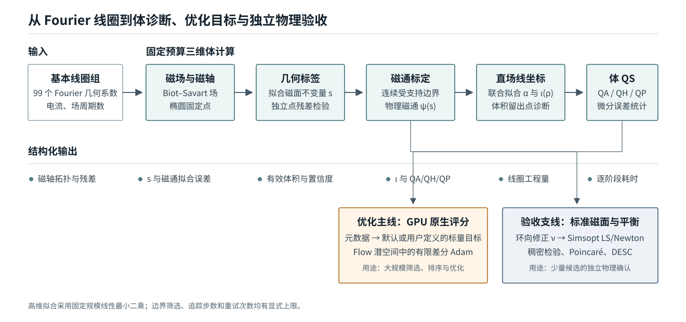

图 1 中上半部分是固定预算体计算。其输出同时进入两个分支：优化主线把元数据映射成标量目标；验收支线进一步拟合环向修正 $\nu$，并运行 Simsopt 中的非线性最小二乘/Newton 磁面求解、稠密检验、Poincare 追踪和 DESC 磁流体平衡求解。两条分支共享相同的 $s/\psi$ 与 $\alpha/\iota$ 前端。

## 2. 方法

### 2.1 线圈参数化与磁场

每个坐标分量使用 16 阶实 Fourier 展开。以 $x$ 为例，

$$
x_j(t)=c_{j,0}^{x}+\sum_{m=1}^{16}
\left(c_{j,2m-1}^{x}\sin mt+c_{j,2m}^{x}\cos mt\right),
\qquad 0\le t<2\pi.
$$

$y_j(t)$ 和 $z_j(t)$ 采用同一约定，因此每根基本线圈由 99 个几何系数和一个电流描述。程序通过场周期旋转和恒星器对称生成实际参与 Biot--Savart 积分的完整线圈组。每根完整线圈被离散为 256 个直线电流元；对任意一批空间点，CUDA 内核一次返回磁场 $\boldsymbol B$ 及其空间梯度 $\nabla\boldsymbol B$。后续的磁轴追踪、$s$ 与 $\alpha$ 拟合以及微分 QS 计算都只通过这两个场量依赖线圈。

### 2.2 椭圆磁轴

在环向角 $\phi=0$ 的 $R$--$Z$ 截面上定义一个场周期 Poincare 映射

$$
P(R,Z)=\left(R\!\left(\frac{2\pi}{N_{\mathrm{FP}}}\right),
Z\!\left(\frac{2\pi}{N_{\mathrm{FP}}}\right)\right).
$$

磁轴截面位置 $q_0=(R_0,Z_0)$ 满足

$$
P(q_0)-q_0=0.
$$

独立评估首先在 $48\times48$ 网格上批量追踪固定点候选；当 $N_{\mathrm{FP}}\le7$ 且主网格未给出可接受候选时，使用 $64\times64$ 有界补充网格。候选经过最多 6 次阻尼 Newton 精修。每周期追踪 960 步，最终保存 240 个磁轴样本用于后续环向插值。

令 $J_P$ 为 Poincare 映射在固定点处的 Jacobian。当前实现要求

$$
\det J_P>0,
\qquad
\frac{|\operatorname{tr}J_P|}{\sqrt{\det J_P}}<2,
$$

以选择椭圆固定点。严格续接评估从上一正式中心的 $(R_0,Z_0)$ 开始局部修正，并限制轴位移；拓扑或位移条件失败时返回 `branch_lost`。这个规则使连续优化轨迹始终对应同一磁轴分支。

### 2.3 几何磁面标签 $s$

沿磁轴定义局部无量纲坐标

$$
X=\frac{R-R_0(\phi)}{a},
\qquad
Y=\frac{Z-Z_0(\phi)}{a},
\qquad a=0.05\ \mathrm m.
$$

快速评估中的 $a$ 是体拟合采样半径。完整评估会针对每个样本重新选择源拟合半径和外层磁面。

几何标签写为

$$
s(X,Y,\phi)=X^2+
\sum_{p,q,m,\sigma}c_{pqm\sigma}
X^pY^qT_{m\sigma}(\phi),
$$

其中

$$
T_{m,c}(\phi)=\cos(mN_{\mathrm{FP}}\phi),
\qquad
T_{m,s}(\phi)=\sin(mN_{\mathrm{FP}}\phi).
$$

基函数包含 $2\le p+q\le10$ 和 $0\le m\le12$；$m=0$ 仅保留余弦项。常数项和一次项被移除，固定的 $X^2$ 常数环向模从未知向量中删除。该构造保证轴附近 $s=O(r^2)$，同时覆盖当前截断阶数内完整的二维多项式与环向 Fourier 组合。

理想磁面标签沿磁力线保持常数：

$$
\boldsymbol B\cdot\nabla s=0.
$$

上式对系数 $c_{pqm\sigma}$ 线性。生产配置在 $48^3$ 网格上构造过定系统，加入 $10^{-6}$ 正则项后使用 32 位浮点（FP32）cuSOLVER QR 分解求解。另取 4000 个独立点统计归一化方向误差

$$
\epsilon_s=
\frac{\boldsymbol B\cdot\nabla s}
{|\boldsymbol B|\,|\nabla s|},
$$

并返回均值、$L^2$ 和 P95。$s$ 是由磁场拟合得到的几何标签，下一步通过环向磁通把它标定为物理磁通。

### 2.4 连续受支持范围与物理磁通

当前边界候选层为

$$
\{0.001,0.002,0.004,0.008,0.02,0.04,0.08,
0.16,0.25,0.36,0.49,0.64,0.81\}.
$$

边界选择分为“逐层测量”和“把各层合成连续范围”两步。对每个候选值 $s_j$，程序先在 $\phi=0$ 截面沿 128 个极角方向求解 $s(\boldsymbol x)=s_j$，再把每个起点沿磁场追踪一个场周期；每条轨迹固定使用 400 步。第 $j$ 层第 $k$ 条轨迹的相对法向漂移定义为

$$
d_{jk}=
\frac{|s(\boldsymbol x_{jk}^{\mathrm{end}})-s_j|}
{|\nabla s(\boldsymbol x_{jk}^{\mathrm{end}})|\,\bar r_j},
$$

其中 $\bar r_j$ 是这一层 128 个起点相对磁轴的平均半径。分子给出追踪终点相对目标标签的偏差；除以 $|\nabla s|$ 后得到一阶法向距离，再除以 $\bar r_j$ 消除磁面尺寸的影响。因此，$d_{jk}=0.05$ 表示一周期后的法向偏离约为该层平均半径的 5%。

接下来把第 $j$ 层的 128 个漂移压缩成一个风险值。令 $d_j^{\max}=\max_k d_{jk}$，程序使用

$$
r_j=d_j^{\max}+\tau\log\left[
\frac{1}{128}\sum_{k=1}^{128}
\exp\left(\frac{d_{jk}-d_j^{\max}}{\tau}\right)
\right],
\qquad \tau=0.005.
$$

$r_j$ 重点响应漂移最大的角区，同时随每个输入连续变化。它通过 Logistic 映射变成这一层的漂移置信度，

$$
p_j^{\mathrm{drift}}=\frac{1}{1+\exp[(r_j-0.05)/0.0125]}
$$

相对漂移风险低于 5% 时，$p_j^{\mathrm{drift}}$ 逐渐接近 1；风险越过 5% 后，置信度平滑下降。程序再乘一个径向支持因子：射线根接近 $s$ 拟合所覆盖的最大半径时，该因子开始下降。两者的乘积给出该层置信度 $p_j$。最后用加权单调回归得到由轴向外单调不增的 $p(s)$，使外层的偶然低漂移值服从内外层的整体支持关系。

连续受支持范围由置信度曲线下面积定义，

$$
s_{\mathrm{eff}}=\int_0^{s_{\max}}p(s)\,ds,
$$

数值上在候选层之间作梯形积分。于是，每个候选层先得到一个置信度，所有置信度再合成一个连续的范围指标；当某一层的漂移略有变化时，$s_{\mathrm{eff}}$ 也平滑变化。

接着需要把几何标签 $s$ 标定为有物理量纲的环向磁通。程序先以 $s_{\mathrm{eff}}$ 为拟议边界，在内部取 11 个径向层和 8 个环向截面；每个截面使用 256 个极角点和 24 点径向求积。令 $\Phi_t(s)$ 为由磁场积分得到的环向磁通，定义

$$
\psi(s)=\frac{\Phi_t(s)}{2\pi}
=\sum_{j=1}^{4}a_js^j,
\qquad
\rho=\sqrt{\frac{\psi(s)}{\psi(s_{\mathrm{edge}})}}.
$$

四次多项式固定零截距。边界验收同时检查三项量：积分边界残差不超过 $2\times10^{-6}$，边界磁通在 8 个环向截面间的相对标准差不超过 2%，并且 $\psi'(s)$ 在区间内保持同号。若 $s_{\mathrm{eff}}$ 未通过，程序向内找到最近的通过层，再在通过层与外侧未通过层之间执行最多 6 次二分；每个二分点都重新积分并检查这三项量。

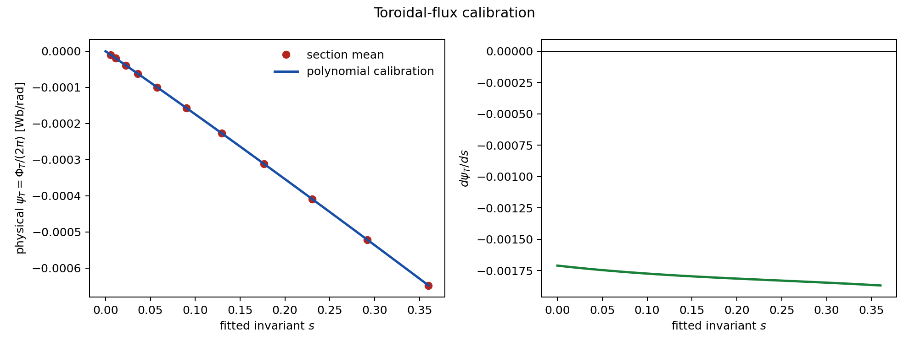

图 2 展示的是连续范围确定之后的磁通标定阶段。该样本的拟合相对 RMS 为 $3.60\times10^{-6}$，8 个环向截面的最大相对标准差为 $1.25\times10^{-3}$，且 $d\psi/ds$ 在整个区间保持同号。

### 2.5 直场线标记 $\alpha$ 与旋转变换 $\iota$

在嵌套磁面上，Clebsch 表示的目标是

$$
\boldsymbol B=\nabla\psi\times\nabla\alpha.
$$

它同时给出 $\boldsymbol B\cdot\nabla\psi=0$ 和 $\boldsymbol B\cdot\nabla\alpha=0$。令 $\theta=\operatorname{atan2}(Y,X)$、$u=\rho^2=\psi/\psi_{\mathrm{edge}}$，直场线标记写为

$$
\alpha(\rho,\theta,\phi)
=\theta+\lambda(\rho,\theta,\phi)-\iota(u)\phi,
\qquad
\boldsymbol B\cdot\nabla\alpha=0.
$$

周期修正 $\lambda$ 使用实 Zernike--Fourier 基底

$$
\lambda=
\sum_{l,m,n,\sigma}d_{lmn\sigma}
R_l^m(\rho)\,T_{mn\sigma}(\theta,\phi),
$$

其中 $0\le m\le l\le12$、$l-m$ 为偶数、$|n|\le12$，$T_{mn\sigma}$ 表示 $m\theta-nN_{\mathrm{FP}}\phi$ 的正弦或余弦。$m=n=0$ 的规范自由度被移除。旋转变换采用三次磁通函数

$$
\iota(u)=\iota_0+\iota_1u+\iota_2u^2+\iota_3u^3.
$$

评分支线使用上述向量关系的切向标量形式。先从磁场中扣除由有限 $s$ 拟合误差产生的法向分量，

$$
\boldsymbol B_t=\boldsymbol B-
\frac{\boldsymbol B\cdot\nabla s}{|\nabla s|^2}\nabla s.
$$

由于 $u$ 是 $s$ 的函数，$\boldsymbol B_t\cdot\nabla u=0$，所以每个采样点提供一条线性方程

$$
\boldsymbol B_t\cdot\nabla\lambda
-\iota(u)\,\boldsymbol B_t\cdot\nabla\phi
=-\boldsymbol B_t\cdot\nabla\theta.
$$

程序在近似等物理体积的 100000 个点上计算场量，并从 10 个径向层中分层选择 30000 点，同时求解 $d_{lmn\sigma}$ 与四个 $\iota_p$。默认求解器为 FP32 QR，正则系数为 $10^{-7}$。原生字段 `alpha_relative_l2` 是这 30000 条标量方程去掉正则行后的加权相对 $L^2$ 残差；`alpha_normal_B_relative_l2` 记录投影掉的法向磁场相对量。

完整评估支线直接以 $\boldsymbol B=\nabla\psi\times\nabla\alpha$ 的三个笛卡尔分量建矩阵。该支线使用 120000 个训练点和 60000 个互不重叠的验证点，以 FP32 QR 联合求解同一组 $\lambda$ 与三次 $\iota(u)$。随后拟合环向修正 $\nu$，把三维体坐标转换成 Simsopt 标准磁面求解所需的近 Boozer 初值。第 4.3 节分别报告向量 Clebsch 留出误差、$\iota$ 误差和标准磁面初始残差。

### 2.6 微分 QS 与线圈工程量

给定 $\psi$、$\iota$、$\boldsymbol B$ 和 $\nabla\boldsymbol B$，定义

$$
A=(\boldsymbol B\times\nabla\psi)\cdot\nabla|\boldsymbol B|,
\qquad
C=\boldsymbol B\cdot\nabla|\boldsymbol B|,
$$

$$
f_C=(M\iota-N)A-MGC.
$$

真空环向场系数 $G$ 的绝对值按完整对称线圈组的链接电流计算，

$$
|G|=2\times10^{-7}
\left(2N_{\mathrm{FP}}\sum_{j=1}^{n_c}|I_j|\right),
$$

其符号由边界磁通方向确定。目标螺旋模的体误差为

$$
E_{M,N}=\frac{1}{\sqrt{M^2+N^2}}
\sqrt{
\frac{\sum_iw_i\left(f_{C,i}/|\boldsymbol B_i|^3\right)^2}
{\sum_iw_i}
}.
$$

权重 $w_i$ 包含物理体积测度与柱坐标 Jacobian。程序同时返回全体积、外层径向区域和绝对值 P95，并报告权重的有效样本比例。准轴对称（quasi-axisymmetry，QA）、准螺旋对称（QH）和准极向对称（quasi-poloidal symmetry，QP）分别使用

$$
(M,N)=(1,0),\qquad(1,N_{\mathrm{FP}}),\qquad(0,N_{\mathrm{FP}}).
$$

评估器还计算线圈长度均值、曲率 P95、最大曲率、线圈间最小距离、线圈到设备旋转轴的最小柱半径、高阶 Fourier 模能量比例和最大电流绝对值。设备旋转轴在本文中定义为圆柱坐标的 $z$ 轴；高阶能量统计 $m\ge9$ 的几何系数。这些量经过有界映射合成 `coil` 分量，用于控制线圈长度、弯曲、间距、高频振荡和电流尺度。

### 2.7 默认分数

默认分数把原始元数据映射到 0--100。误差型量使用下降映射

$$
q_{\downarrow}(x;s,p)=\frac{1}{1+(x/s)^p},
$$

最小距离型量使用

$$
q_{\uparrow}(x;s,p)=\frac{1}{1+(s/x)^p},
$$

尺寸型量使用在给定尺度处饱和的三次平滑阶跃。七个分量依次为 `axis`、`psi`、`surface`、`coordinate`、`volume_qs`、`iota` 和 `coil`，权重为

$$
(10,10,10,10,42,10,8).
$$

`volume_qs` 占主要权重，并由目标 QH 残差、有效尺寸和 $\iota$ 共同决定。QH 总分进一步乘两个因子：一个随最小 $|\iota|$ 增长，另一个衡量 QH 相对 QA/QP 的竞争优势。尺寸项在逆纵横比 0.03 附近进入饱和区，因此扩大已经足够大的磁面只带来有限增益。完整公式和全部尺度列于附录 B。

结构化接口同时保存 `native_score` 和用户策略产生的 `score`。用户可在磁轴质量、有效体积、QS、$\iota$ 与线圈工程约束之间选择另一组映射，并保留原始元数据供后续重算。

### 2.8 三种评估模式

图 3 按物理阶段比较三种模式。蓝绿色表示正式重算；橙色表示当前候选的近邻迭代近似；灰色表示从中心继承或一阶近似。

**独立评估。** 输入只有线圈和 $N_{\mathrm{FP}}$。程序全局搜索磁轴，并完整计算所有下游量。该模式用于数据集评分、随机起点筛选和最终无历史复评。

**严格续接评估。** 输入增加上一正式中心的磁轴位置。程序只接受给定距离内的同分支局部修正，随后完整重算 $s$、连续边界、$\psi$、$\alpha/\iota$、体 QS 和工程量。该模式用于优化中心的正式评分。其结果与独立评估具有相同物理口径，差异仅来自磁轴定位方式。

**近邻批量代理。** 输入是一个正式中心 $\boldsymbol x_0$ 和一批邻近候选。中心先正式重放一次，并保存 $s$ 与 $\alpha/\iota$ 线性系统的三角因子。每个候选从中心磁轴开始批量 Newton 精修，随后对 $s$ 和 $\alpha/\iota$ 各执行 4 步预条件迭代。

边界代理固定中心正式选出的标签值 $s_{\mathrm{edge}}^{(0)}$。对候选 $\boldsymbol x$，程序使用候选自己的新拟合函数 $s_{\boldsymbol x}(\boldsymbol r)$，重新求解

$$
s_{\boldsymbol x}(\boldsymbol r)=s_{\mathrm{edge}}^{(0)},
$$

并在这条新等值线上重算单周期漂移、磁通、体积与体 QS。固定的是标签数值，几何边界点会随候选变化。连续向外搜索由每个接受中心的严格续接评估执行。

线圈工程部分先在中心精确计算已经合成的 0--100 分量 $C_{\mathrm{coil}}$ 及其解析梯度，然后使用一阶 Taylor 代理

$$
C_{\mathrm{coil}}(\boldsymbol x)
\approx C_{\mathrm{coil}}(\boldsymbol x_0)
+\nabla C_{\mathrm{coil}}(\boldsymbol x_0)^{\mathsf T}
(\boldsymbol x-\boldsymbol x_0).
$$

坐标分量继承中心值。该模式输出一批端点的局部排序；接受后的新中心进入严格续接评估，并成为下一批端点的正式锚点。近邻总分和线圈一阶代理的实测偏差见第 4.5 节。

三种模式的逐字段可信度见第 4.4 节，完整 JSON 契约见附录 A。

### 2.9 Flow Matching 重参数化

Flow Matching 学习从标准高斯潜变量 $\boldsymbol z$ 到标准化线圈 token $\boldsymbol x$ 的常微分方程：

$$
\frac{d\boldsymbol x_t}{dt}
=v_\vartheta(\boldsymbol x_t,t,N_{\mathrm{FP}}),
\qquad
\boldsymbol x_0=\boldsymbol z,
\quad
\boldsymbol x_1=\boldsymbol x.
$$

速度网络是 30333540 参数的非因果 Transformer：8 层、宽度 512、8 个注意力头、SwiGLU 中间宽度 1408、PreNorm 与 RMSNorm。模型不使用位置旋转编码；一个 token 对应一根基本线圈，线圈掩码支持 1--5 根基本线圈，$N_{\mathrm{FP}}$ 通过条件嵌入注入每层。

训练集含 170755 个 QUASR QH 线圈数据样本，覆盖 $N_{\mathrm{FP}}=2,\ldots,8$。输入采用逐坐标标准化以匹配高斯初始尺度；训练损失随后按 Parseval 等式恢复 Fourier 系数对应的曲线积分距离权重，使低阶几何模保持主导作用。本文使用指数滑动平均（exponential moving average，EMA）第 30000 步的检查点，优化时采用 FP32 RK4-128。Flow 在本方法中承担两个作用：从高斯噪声生成符合 QH 数据相关结构的候选先验，以及把相关线圈形变组织成潜空间搜索方向。第 4.2 节用独立实验分别测量这两个作用。

### 2.10 64 方向有限差分 Adam

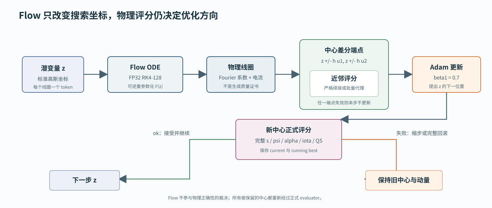

每条轨迹先按 QUASR QH 训练集中的 $(N_{\mathrm{FP}},n_c)$ 联合经验分布抽取条件，再生成 32 个高斯潜变量。每个潜变量经过 FP32 RK4-128 解码和独立评估，最高有效分数成为优化起点。

在第 $t$ 步，从当前潜变量 $\boldsymbol z_t$ 生成 $K=64$ 个两两正交的随机方向 $\boldsymbol u_k$。以 $h=0.005$ 构造 128 个端点，并计算

$$
\widehat{\boldsymbol g}_t=
\frac{1}{K}\sum_{k=1}^{K}
\frac{S(\boldsymbol z_t+h\boldsymbol u_k)-
S(\boldsymbol z_t-h\boldsymbol u_k)}{2h}
\boldsymbol u_k.
$$

端点由 Flow 整批解码，再由近邻批量代理整批评价。Adam 参数为

$$
\eta=0.02,
\qquad
(\beta_1,\beta_2)=(0.7,0.999).
$$

端点状态完整有效，且梯度尺度通过滚动中位数与中位绝对偏差（median absolute deviation，MAD）检查时，程序生成候选更新；新中心随后执行严格续接评估。中心失效会触发有界回退与状态回滚。当前点、历史最佳点、Adam 两个矩、方向随机数状态和预取端点状态分别保存，从而支持精确续跑。

## 3. 实验设计

### 3.1 数据、实现版本与硬件

优化有效性实验使用 309 条独立轨迹。每条包含 32 个随机起点和 200 个 Adam 更新，共计 9888 个随机 Flow 样本、62109 个正式中心、3955200 个正交方向和 7910400 个近邻端点。对照组从 QUASR QH 测试集无放回抽取 1024 个样本，并用同一原生评分实现独立评分。

Flow 作用实验分成三个部分。局部景观实验在 3 个 QUASR QH 中心各取 4 个方向；配对优化实验复用上述 309 条轨迹的同一解码起点和方向随机种子，在潜空间与标准化原参数空间各运行 200 步；起点实验覆盖 48 组 $(N_{\mathrm{FP}},n_c)$ 条件，每组分别从 Flow 先验和逐坐标独立高斯对照中评价 32 个候选。配对优化两侧使用相同评分器、方向数和 Adam 动量，有限差分半径与学习率按各自坐标尺度设置；实验结果表示两套完整优化配置的配对性能。

物理标定实验从 96 条轨迹各取 8 个优化阶段，组成 768 个位形；每个位形计算固定探针面和自适应边界面，共 1536 个标准面。标准面由 Simsopt LS/Newton 求解，并使用独立稠密残差、法向场、正则性和嵌套性检查。

性能实验使用当前报告分支、同一动态库、同一批端点和单张空闲 RTX 5090。独立与严格续接模式各重复正式评分；近邻模式测试 batch size 2、8、32、64 和 128。每次作业在启动前检查显存、GPU 利用率和计算进程，完成后保存 GPU 与进程清理记录。

数值口径固定为 $48^3$ 的 $s$ 拟合网格、三次 $\iota(u)$、连续边界模式、一个场周期边界追踪、128 个边界角点和每周期 400 步。附录 C 记录代码、动态库和 Flow 检查点身份。

### 3.2 评价指标

优化效果使用正式 `native_score`、`status=ok` 比例、体 QH 误差、分数组成和独立重评分一致性。分布比较同时报告中位数、高分阈值比例和上尾生存曲线。配对比较额外报告逐样本胜负、配对差中位数的样本自助法区间、符号检验和 Wilcoxon 配对检验。下文用 P50 表示中位数，用 P95 表示第 95 百分位数。

物理可信度按量选择参考：$s$ 使用独立体点方向误差；$\iota$ 使用标准磁面值；体 QH 使用标准面上 $|B|$ 相对目标螺旋角投影的归一化均方误差；近 Boozer 初值使用标准磁面方程残差。Spearman 秩相关系数衡量排序一致性，Pearson 相关系数衡量近似线性关系；误差分布报告 P50/P95。

性能使用宿主墙钟时间与原生阶段计时。正式模式报告单次 P50/P95；近邻模式同时报告整批延迟和单候选均摊延迟，并给出代理相对严格续接的状态一致率和分数相关性。

## 4. 实验结果

### 4.1 309 条轨迹的优化效果

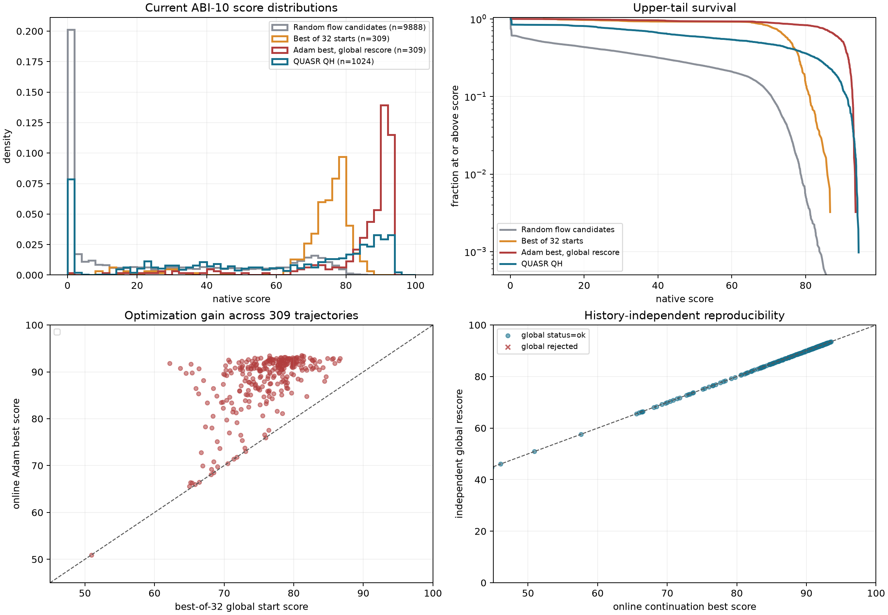

图 5 含四个相互补充的面板。左上是四组样本的密度直方图：随机 Flow 样本在零分附近有明显失败峰，32 选 1 把起点集中到 65--85 分，Adam 最优点进一步集中到 90--93 分。右上是上尾生存曲线，直接显示任意阈值以上的样本比例；Adam 在 85--92 分区间显著高于 QUASR 对照，QUASR 保留更高的最优尾部。左下逐轨迹比较起点与在线最优点，绝大多数点位于对角线上方。右下比较在线续接最优分和无历史独立重评分，数据紧贴对角线，说明高分尾部可由全局轴搜索复现。

| 样本组 | 数量 | `ok` 率 | 分数 P50 | 分数 P95 | 最大值 |
|---|---:|---:|---:|---:|---:|
| 随机 Flow 候选 | 9888 | 61.0% | 9.847 | 74.147 | 86.627 |
| 每条轨迹 32 选 1 起点 | 309 | 100% | 75.996 | 82.699 | 86.627 |
| Adam 最优点，独立重评分 | 309 | 99.7% | 90.214 | 92.908 | 93.521 |
| QUASR QH 对照 | 1024 | 84.3% | 66.696 | 92.522 | 94.349 |

Adam 最优点中 50.8% 达到 90 分，23.0% 达到 92 分；QUASR 对照的对应比例为 12.9% 和 7.03%。在线最优与独立重评分的 Pearson/Spearman 相关系数为 0.9988/0.99988。157 个在线分数达到 90 的样本全部在独立模式下保持 `ok`，分数中位差为 $-0.0109$。

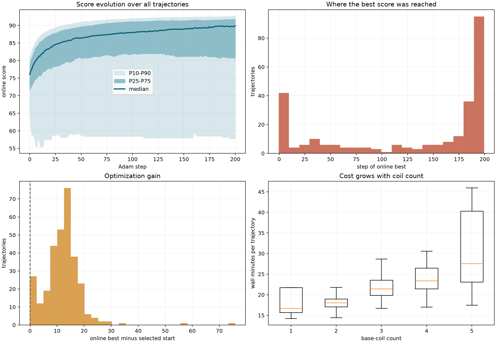

图 6 左上给出 309 条在线分数的中位数、四分位带和 P10--P90 带。前 25 步贡献主要增益，之后中位数持续缓慢提高。右上统计每条轨迹首次达到历史最优的步数；43.7% 的最优点位于最后 10 步，57.6% 位于最后 25 步，说明 200 步代表中程预算。左下是最优点相对起点的增益分布，中位增益为 12.416；96.4% 的独立重评分结果保持正增益。右下按基本线圈数统计整条轨迹墙钟，成本随线圈数增加，主要来自 Biot--Savart 场计算和 Flow token 数增加。

在 `status=ok` 样本上，体 QH 误差中位数由起点的 $3.23\times10^{-2}$ 降至最优点的 $2.98\times10^{-3}$，改善 10.8 倍。`surface`、`coordinate` 和 `volume_qs` 分量同步提高。`coil` 分量中位数由起点 63.62 提高到 66.03，仍低于 QUASR 对照的 70.19；默认权重因此体现出 QH、有效体积和工程质量之间的可见折中。

### 4.2 Flow 的三项作用证据

Flow 的贡献分成三个可独立测量的问题：局部搜索景观、同起点优化结果和有限预算起点质量。下面依次给出三项证据。

**局部景观。** 设 Flow 解码映射为 $F$，中心潜变量为 $\boldsymbol z_0$，潜空间单位方向为 $\boldsymbol u$。该方向在原参数空间的局部传输切向用中心差分近似：

$$
\boldsymbol v
=\frac{F(\boldsymbol z_0+\delta\boldsymbol u)-F(\boldsymbol z_0-\delta\boldsymbol u)}{2\delta},
\qquad \delta=0.01.
$$

实验选择 3 个 QUASR QH 中心，覆盖 $(N_{\mathrm{FP}},n_c)=(3,4),(2,5),(4,3)$；每个中心取 4 个方向。每个方向比较三条路径：潜空间曲线、同一方向传输后的原参数局部切线，以及具有相同线圈位置 RMS 尺度的独立原参数随机方向。每条路径扫描 31 个双侧位置，共执行 1095 次独立评分。反演再正演采用 FP32 RK4-256，三个中心的线圈位置 RMS 闭合误差为 $2.26\times10^{-8}$--$4.57\times10^{-8}\,\mathrm m$。

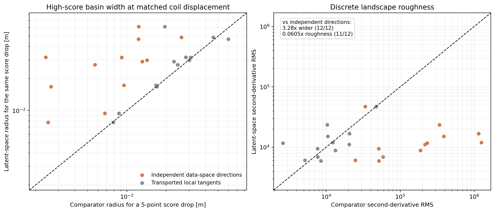

| 对照方向 | 潜空间/对照：下降 5 分物理半径 | 下降 10 分物理半径 | 潜空间/对照：二阶粗糙度 |
|---|---:|---:|---:|
| Flow 传输切向 | 1.047 | 1.153 | 0.984 |
| 独立原参数随机方向 | 3.281 | 3.010 | 0.0605 |

图 7 中，独立原参数随机方向对应的橙色点在左图 12/12 位于对角线以上，在右图 11/12 位于对角线下方。匹配线圈位置 RMS 后，潜空间的下降 5 分半径是独立随机方向的 3.281 倍，二阶粗糙度为其 0.0605 倍。灰色传输切向点接近对角线，表明 Flow 在中心处的 Jacobian 已经解释了大部分景观改善：随机潜方向被映射成训练数据中相关联的线圈形变。下降 10 分的部分曲线在扫描边界处仍高于阈值，表中的 1.153 因而表示两种路径在当前扫描范围内具有相近宽度。

**同起点配对优化。** 这一实验复用 309 条主实验轨迹的全部起点。潜空间分支从保存的潜变量出发；原参数分支从同一个 Flow 解码线圈的逐坐标标准化 token 出发。重新读入后，原参数起始分减潜空间记录值的 P50 为 $-0.00242$，两侧从同一物理线圈开始。两侧使用相同的 200 步预算、64 个正交方向、方向随机种子、中心差分、$\beta_1=0.7$、$\beta_2=0.999$ 和同一评分器。两个坐标按各自尺度取参数：潜空间使用 $h=0.005,\eta=0.02$，原参数空间使用 $h=0.0025,\eta=0.01$。该配对实验测量两套完整配置在相同起点和随机方向种子下的优化结果。

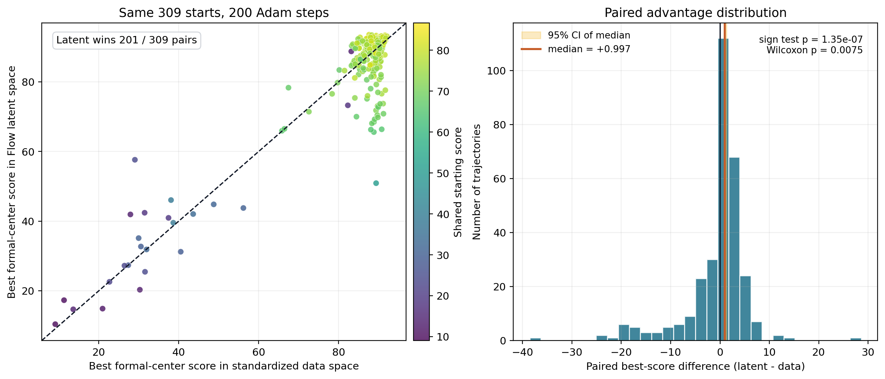

| 成对指标 | Flow 潜空间 | 标准化原参数空间 |
|---|---:|---:|
| 在线正式中心最佳分 P50 | 90.263 | 89.122 |
| 相对共同起点的增益 P50 | 12.343 | 12.304 |
| 逐轨迹胜出数 | 201/309 | 108/309 |
| 最佳分数 $\ge85$ | 230/309（74.4%） | 259/309（83.8%） |
| 最佳分数 $\ge90$ | 157/309（50.8%） | 107/309（34.6%） |
| 最佳分数 $\ge92$ | 71/309（23.0%） | 1/309（0.32%） |
| 200 步墙钟 P50 | 1166.3 s | 825.6 s |

潜空间在线正式中心最佳分减原参数对应值的中位数为 $0.997$，95% 区间为 $[0.799,1.312]$；双侧符号检验和 Wilcoxon 配对检验的 $p$ 值分别为 $1.35\times10^{-7}$ 和 0.00750。潜空间在 201/309 的逐轨迹比较中胜出，并把 92 分以上结果的比例从 0.32% 提高到 23.0%，形成本文关心的高质量尾部。原参数空间快 1.41 倍，在 85 分阈值上覆盖更多样本；少数低分起点还产生了较大的修复增益，使其最佳分算术均值为 84.412，略高于潜空间的 83.874。中位数、逐轨迹胜负和 90--92 分高分比例共同支持潜空间作为高分搜索的主配置，原参数空间则提供更快的中等质量基线。

**有限预算起点。** 这一实验隔离测量 Flow 先验。实验覆盖 $N_{\mathrm{FP}}=2,\ldots,6$、$n_c=2,\ldots,5$ 的 15 种组合和 48 组条件，每组评价 32 个候选。Flow 候选由标准高斯潜变量解码；对照候选在标准化原参数的每个坐标独立采样标准高斯，再反标准化成线圈。两者具有相同的逐坐标边缘尺度，对照中的 Fourier 系数和不同线圈彼此独立。

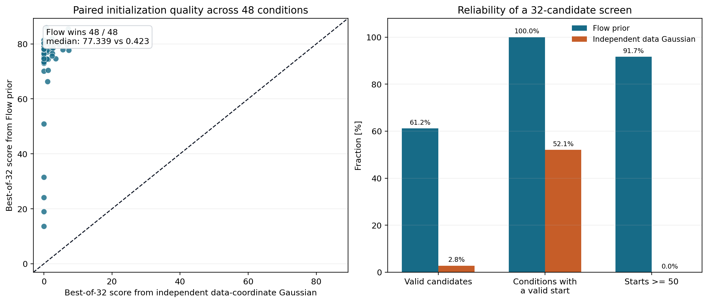

1536 个 Flow 候选中 61.2% 有效，独立原参数高斯的有效率为 2.80%。32 选 1 后，Flow 在 48/48 组条件中找到有效起点，对照在 25/48 组中找到；起始分数 P50 分别为 77.339 和 0.423，且 Flow 在 48/48 的逐条件比较中更高。Flow 起点有 44/48 超过 50 分，对照为 0/48。固定 32 次评分时，训练先验保留的跨 Fourier 系数和跨线圈相关结构稳定地产生了可优化起点。

三项证据形成一条连续论证：训练先验把有限筛选稳定带入有效区域；Flow 的局部 Jacobian 把随机潜方向组织成相关线圈形变；309 组配对优化显示，这种坐标结构进一步转化成 90--92 分高分尾部优势。本文据此采用潜空间作为主搜索坐标，并把更快的原参数优化保留为基线。

### 4.3 体诊断相对标准磁面的准确性

物理标定从 96 条优化轨迹各取第 0、10、25、50、75、100、150 和 200 步，共得到 768 个位形。每个位形测量两个目标面：固定探针面把该轨迹第 0 步软边界的 $\rho=0.8$ 内层标签保持到后续阶段，用于比较同一径向区域；自适应边界面使用当前位形正式评估得到的 `surface_effective_level`。GPU 体准备成功 766 个位形；1536 个目标面中，1231 个通过 Simsopt LS/Newton、$97\times97$ 独立稠密残差、法向场、正则性和环向绕行检查。

下面先明确表中四类误差。$s$ 的逐点方向误差仍采用第 2.3 节的定义，

$$
\epsilon_s(\boldsymbol x)=
\frac{\boldsymbol B\cdot\nabla s}
{|\boldsymbol B|\,|\nabla s|},
\qquad
\|\epsilon_s\|_{2,N}=
\sqrt{\frac{1}{N}\sum_{i=1}^{N}\epsilon_s(\boldsymbol x_i)^2}.
$$

这里每个位形使用 $N=4000$ 个独立体点，表中 P50/P95 是 766 个位形各自 $\|\epsilon_s\|_{2,N}$ 的分布。完整评估支线的向量 Clebsch 误差为

$$
\epsilon_\alpha=
\frac{\left\|\boldsymbol B-
\nabla\psi\times\nabla\alpha\right\|_{2,N}}
{\|\boldsymbol B\|_{2,N}},
$$

其中 $N=60000$，这些验证点与 120000 个拟合点互不重叠。

对参数化标准面 $\boldsymbol x(\phi,\theta)$，令

$$
\boldsymbol t=\partial_\phi\boldsymbol x+\iota\,\partial_\theta\boldsymbol x.
$$

Simsopt 使用的 Boozer 面方程为 $G\boldsymbol B=|\boldsymbol B|^2\boldsymbol t$。本文报告的相对 $L^2$ 残差是

$$
\epsilon_{\mathrm{Boozer}}=
\frac{
\left\|\left(G\boldsymbol B-|\boldsymbol B|^2\boldsymbol t\right)/|\boldsymbol B|\right\|_2}
{|G|\sqrt{N}}.
$$

标准面 QH 则先把 $|B|$ 面积加权投影到螺旋角 $\alpha_{M,N}=M\theta-N\zeta$ 的 64 个区间。记该投影为 $P_{M,N}|B|$，面误差定义为归一化均方量

$$
E_{\mathrm{face}}=
\frac{\left\langle\left(|B|-P_{M,N}|B|\right)^2\right\rangle_A}
{\left\langle\left(P_{M,N}|B|\right)^2\right\rangle_A}.
$$

| 体诊断量 | 独立参考与样本口径 | 结果 |
|---|---|---|
| $s$ | 766 位形，每个位形 4000 个独立体点上的 $\|\epsilon_s\|_{2,N}$ | P50/P95：$1.325\times10^{-5}/1.297\times10^{-4}$ |
| 向量 $\alpha$ | 766 位形，每个位形 60000 个留出点上的 $\epsilon_\alpha$ | P50/P95：0.099/0.602；法向误差下限 P50/P95：$2.264\times10^{-5}/2.310\times10^{-4}$ |
| GPU $\iota$，固定探针面 | 606 个严格通过面，以最终 Simsopt $\iota$ 为参考 | Spearman/Pearson：0.991/0.996；相对误差 P50/P95：0.157%/2.65% |
| GPU $\iota$，自适应边界面 | 625 个严格通过面，以最终 Simsopt $\iota$ 为参考 | Spearman/Pearson：0.948/0.949；相对误差 P50/P95：0.414%/12.48% |
| $\alpha+\nu$，固定探针面 | 606 个严格通过面，标准求解前后 $\epsilon_{\mathrm{Boozer}}$ | 初值 P50/P95：$6.492\times10^{-4}/1.129\times10^{-2}$；求解后：$5.652\times10^{-6}/5.132\times10^{-5}$ |
| $\alpha+\nu$，自适应边界面 | 625 个严格通过面，标准求解前后 $\epsilon_{\mathrm{Boozer}}$ | 初值 P50/P95：$3.614\times10^{-3}/8.912\times10^{-3}$；求解后：$7.292\times10^{-6}/5.744\times10^{-5}$ |
| 体 QH | 606 个固定探针面 | Spearman：0.944，轨迹聚类 95% 区间 $[0.918,0.961]$ |
| 体 QH | 625 个自适应边界面 | Spearman：0.958，区间 $[0.943,0.967]$ |
| 外层壳层 QH | 同一批 625 个自适应边界面 | Spearman：0.967，区间 $[0.958,0.974]$ |

混合两个面口径的全部 1231 个严格通过面后，GPU $\iota$ 与标准面值的 Spearman/Pearson 为 0.969/0.971，相对误差 P50/P95 为 0.283%/5.09%。固定探针面的尾部更窄，因为它始终比较同一条轨迹中受支持的内层区域；自适应面包含少数边界向轴附近收缩的位形。

向量 $\alpha$ 的全体积留出误差中位数为 9.9%，明显高于 $s$ 法向误差给出的数值下限。经过 $\nu$ 修正并截取单个目标面后，固定探针面的初始 Boozer 残差中位数达到 $6.49\times10^{-4}$，随后由标准 LS/Newton 降至 $5.65\times10^{-6}$。这组数据定量给出了三维体拟合与标准磁面解之间的剩余精度差。

为量化体 QH 和标准面 QH 的数值关系，在严格通过的标准面上对十进对数执行普通最小二乘：

$$
\log_{10}E_{\mathrm{face}}
=a\log_{10}E_{\mathrm{vol}}+b.
$$

固定探针面得到

$$
\log_{10}E_{\mathrm{face,fixed}}
=2.148\log_{10}E_{\mathrm{vol}}-0.193,
\qquad
E_{\mathrm{face,fixed}}\approx0.642E_{\mathrm{vol}}^{2.148},
$$

自适应边界面得到

$$
\log_{10}E_{\mathrm{face,edge}}
=2.066\log_{10}E_{\mathrm{vol}}-0.211,
\qquad
E_{\mathrm{face,edge}}\approx0.615E_{\mathrm{vol}}^{2.066}.
$$

两条拟合的对数残差标准差分别为 0.344 和 0.290 个十进数量级，对应约 2.21 倍和 1.95 倍的单标准差乘性散布。第 2.6 节的 $E_{\mathrm{vol}}$ 是残差幅度的加权 RMS，而 $E_{\mathrm{face}}$ 是投影后残差的归一化均方量；当两者反映同一个小扰动幅度时，平方关系会自然产生接近 2 的指数。径向平均范围和面投影口径进一步贡献了拟合截距与条件散布。

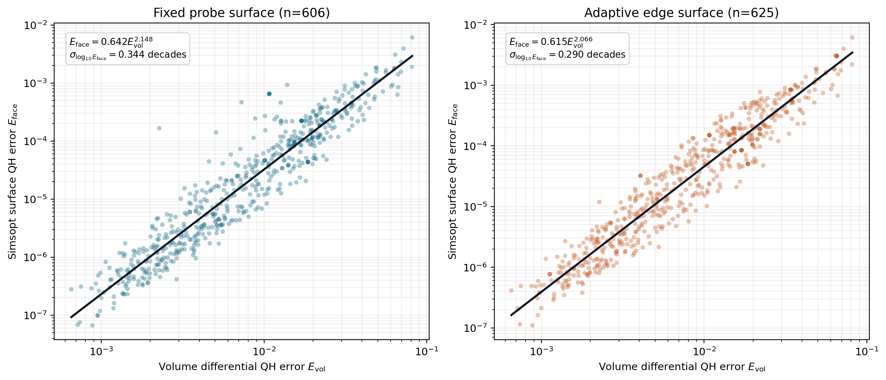

图 10 的点云跨越约五个数量级并沿拟合线保持清晰单调关系。0.944--0.958 的 Spearman 相关支持体指标在优化内环中的排序作用；经验幂律把两种数值口径连接起来，标准磁面求解继续给出候选的最终面误差。

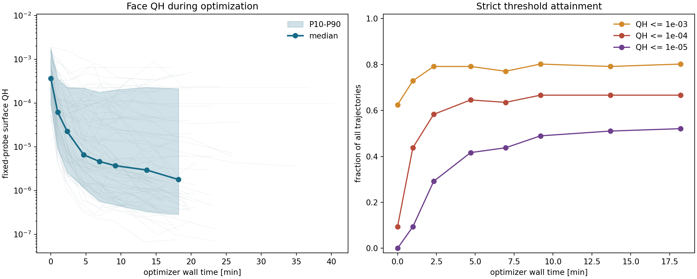

图 11(a) 使用 96 条轨迹的 8 个稀疏阶段。各阶段有 71--78 个固定探针面严格通过；其 QH 中位数从第 0 步的 $3.66\times10^{-4}$ 降至第 50 步、墙钟 P50 为 4.87 分钟时的 $6.56\times10^{-6}$，第 200 步、19.0 分钟时为 $1.79\times10^{-6}$。首尾都严格通过的同一批 67 条轨迹中，65 条改善，末值/初值的中位数为 0.00529，即改善 189 倍。阶段中位数给出典型速度，配对首尾统计确认下降趋势来自同一批轨迹。

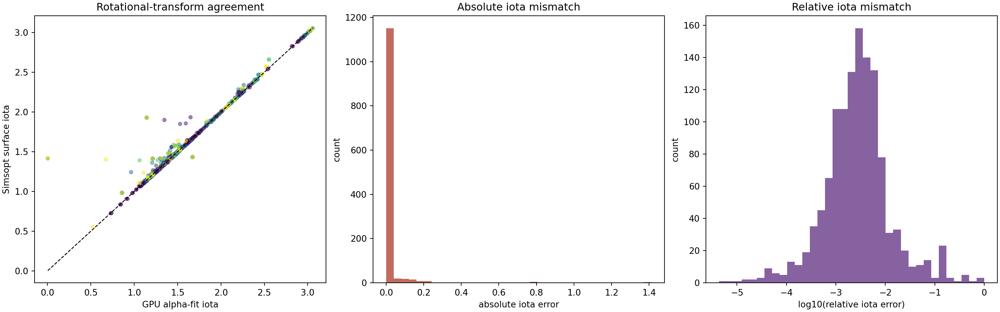

图 11(b) 的散点主体紧贴单位斜线。表中的分口径统计进一步显示，固定探针面的误差分布较窄，自适应面中的少量近轴边界形成较宽尾部。该结果支持把受支持径向区间内的三次 $\iota(u)$ 作为定量优化元数据和标准磁面初值。

### 4.4 三种模式的元数据可信度

表 1 把“正式值”“局部代理”和“缺失”按物理组分开。正式值表示当前候选完成该阶段的标准生产计算；局部代理表示量仍随候选重算，但采用中心分支和固定迭代次数；缺失字段在 JSON 中写为 `null`。

| 元数据组 | 独立评估 | 严格续接评估 | 近邻批量代理 | 解释与使用范围 |
|---|---|---|---|---|
| 磁轴位置、闭合残差、拓扑迹和行列式 | 正式值：全局候选搜索与精修 | 正式值：同分支精修，越界返回 `branch_lost` | 局部代理：批量 Newton；候选数固定为 1 | 独立模式适合跨样本比较；续接和批量模式描述中心附近同一轴分支 |
| 轴截面椭圆长宽比 | 正式值 | 正式值 | 继承中心 | 批量端点的 `axis` 分量主要反映残差与拓扑变化 |
| $s$ 训练 RMS、独立角误差 | 正式 QR 与 4000 点独立检验 | 正式 QR 与独立检验 | 4 步预条件迭代；P95 由直方图近似，均值缺失 | 批量值适合端点排序；正式中心用于误差报告 |
| 连续边界、体积、逆纵横比、置信度 | 正式连续筛选 | 正式连续筛选 | 复用中心标签值 $s_{\mathrm{edge}}^{(0)}$；候选以自己的 $s(\boldsymbol x)$ 重求 64 角点并测单周期漂移 | 代理保持同一径向标签，接受中心再执行连续向外搜索 |
| $\psi(s)$、边界磁通、截面差和单调性 | 正式标定 | 正式标定 | 在候选自己的 $s=s_{\mathrm{edge}}^{(0)}$ 等值线内逐个重标定 | 磁通、体积和 QS 随当前候选变化 |
| $\alpha$ 法向场相对量 | 正式联合 QR | 正式联合 QR | 4 步预条件迭代后逐候选计算 | 局部代理可监控法向污染变化 |
| $\alpha$ 拟合方程相对残差与 `coordinate` 分量 | 正式值 | 正式值 | 继承中心 | 批量梯度中该项贡献固定为零；该残差是拟合自洽量 |
| $\iota_{\min},\iota_{\max}$ | 正式三次磁通函数 | 正式三次磁通函数 | 4 步联合迭代后逐候选计算 | 批量值是局部代理；接受中心由正式 QR 核验 |
| 体 QA/QH/QP、边缘误差和 P95 | 正式十万点统计 | 正式十万点统计 | 在批量体积点上逐候选重算 | 适合局部方向估计；跨样本发布值采用正式模式 |
| 体积有效比例与权重有效比例 | 正式采样统计 | 正式采样统计 | 可用候选数按局部网格记录；`volume_valid_fraction` 固定为 1 | 批量模式的有效比例不表示全局几何可行率 |
| 线圈长度、曲率、间距、高阶能量和电流 | 由当前线圈正式计算 | 由当前线圈正式计算 | 对中心的完整 `coil` 分量作一阶 Taylor 展开 | 近邻偏差见第 4.5 节；接受中心精确重算全部工程量 |
| 七个分量与总分 | 正式默认映射 | 正式默认映射 | 局部代理映射 | 批量分数用于相邻端点的相对比较；中心分数用于轨迹和样本间比较 |
| 状态、阶段和逐阶段耗时 | 正式记录 | 正式记录 | 代理阶段记录与整批墙钟 | 状态名称一致；阶段耗时的计算图不同，需按模式解释 |

独立与严格续接的正式结果在 309 条轨迹高分段表现出近乎一致的排序。近邻模式的定量一致性与 batch size 一起在第 4.5 节报告。

### 4.5 三种模式的速度与批量吞吐

统一 benchmark 使用 12 个跨优化阶段中心，并在其邻域保存 88 个候选。独立评估和严格续接各执行 176 次；近邻代理对 batch size 2、8、32、64 和 128 各执行 22 批。所有数据来自同一动态库、同一单张空闲 RTX 5090 和同一生产配置。

| 正式模式 | 调用数 | `ok` | 墙钟 P50 | 墙钟 P95 | 平均墙钟 |
|---|---:|---:|---:|---:|---:|
| 独立评估 | 176 | 160 | 2.848 s | 4.652 s | 2.798 s |
| 严格续接 | 176 | 160 | 0.845 s | 1.152 s | 0.849 s |

严格续接的中位延迟为独立评估的 $1/3.37$。两种正式模式在 88 个成对候选上的状态一致率为 98.86%；80 个共同 `ok` 候选的分数 Spearman 相关系数为 0.99878，平均绝对差为 0.0464。唯一状态分歧来自同一端点在全局轴搜索下返回 `no_axis`、在严格同分支规则下返回 `branch_lost`；二者都拒绝该端点。

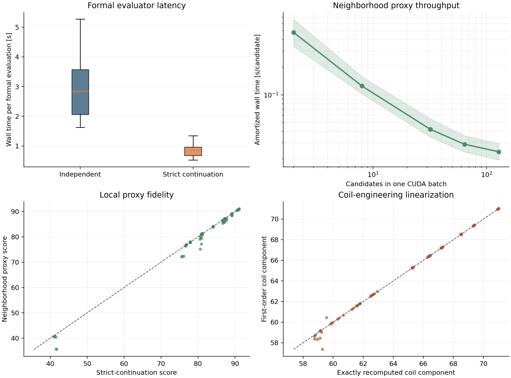

| batch size | 整批 P50 | 整批 P95 | 单候选 P50 | 单候选 P95 |
|---:|---:|---:|---:|---:|
| 2 | 0.961 s | 1.360 s | 0.4805 s | 0.6798 s |
| 8 | 0.999 s | 1.479 s | 0.1249 s | 0.1848 s |
| 32 | 1.347 s | 1.977 s | 0.04210 s | 0.06178 s |
| 64 | 1.851 s | 2.692 s | 0.02893 s | 0.04206 s |
| 128 | 3.069 s | 4.460 s | 0.02397 s | 0.03485 s |

整批时间包含一次正式中心捕获和全部候选的局部更新。batch size 从 2 增至 128 时，整批 P50 增长 3.19 倍，单候选 P50 降低 20.0 倍。batch size 128 的均摊时间相对严格续接降低 35.2 倍，相对独立评估降低 118.8 倍。88 个代理候选在该局部测试中全部返回 `ok`；与严格续接共同 `ok` 的 80 个候选分数 Spearman 为 0.98514，平均绝对差为 0.746。全体状态一致率为 90.91%，差异来自代理固定中心边界和固定迭代预算对正式失败端点的漏拒绝。优化循环因此只使用代理估计邻域方向，每个接受后的中心仍由严格续接正式核验。

同一批 80 个共同 `ok` 候选还提供了线圈工程分量的一阶近似误差。代理与精确重算的 Spearman 为 0.99693，代理减精确值的平均偏差为 $-0.0439$ 个分量点，绝对误差 P50/P95 为 0.00385/0.4338，最大值为 1.923。`coil` 在总分中的名义权重为 8%，因此 P95 分量误差对应的直接总分贡献为 0.0347 分；公共 QH 乘子还会把这一贡献同步缩小。图 12 右下显示，主体点紧贴单位斜线，误差集中在少量局部端点。

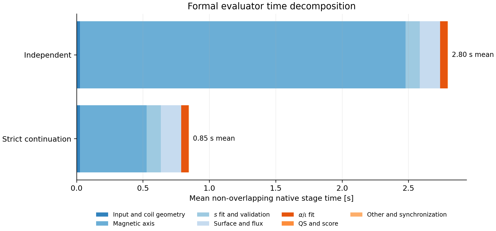

图 13 使用互斥顶层阶段，避免把 `axis_search` 与其内部网格追踪、候选精修重复相加。独立评估平均 2.797 秒，其中磁轴定位与追踪占 87.7%；严格续接平均 0.847 秒，磁轴阶段降至 0.501 秒，占 59.2%。严格续接中的 $s$ 拟合与独立检验、连续边界与磁通、$\alpha/\iota$ 联合拟合分别占 12.8%、18.0% 和 6.61%。体 QS 归约与分数组合只占约 0.09%，当前正式评估的主要成本来自确定并验证几何坐标，而非最终 QS 公式。

正式模式的主要差别发生在磁轴阶段：独立模式需要全局网格追踪，严格续接模式只精修一个给定分支。两者后续均执行两次 FP32 QR。近邻批量代理首先为中心执行一次正式重放，随后把候选作为批次主维度组织同一阶段的 CUDA 计算；随着批次大小增大，中心捕获和 GPU 内核启动成本被更多候选均摊。

### 4.6 代表性候选的完整物理验收

在 1536 个标定面中，记录到的最小严格面 QH 为 $6.687\times10^{-8}$。对该线圈执行样本自适应向外搜索后，选择 $a=0.08$、$s=0.49$ 的较大磁面。该面体积为 $0.06607\,\mathrm{m}^3$，$\iota=1.45637$，独立稠密相对残差为 $1.603\times10^{-5}$，面 QA/QH/QP 为

$$
9.50\times10^{-4},\qquad
5.17\times10^{-7},\qquad
9.51\times10^{-4}.
$$

该线圈在当前独立原生评估下得分 94.6369。

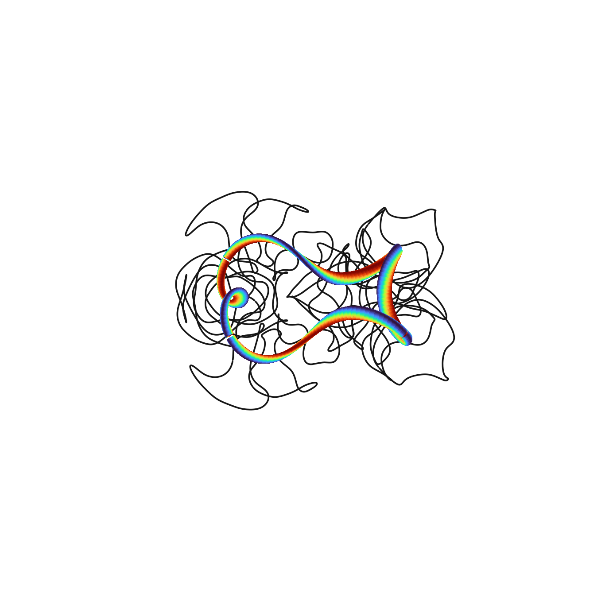

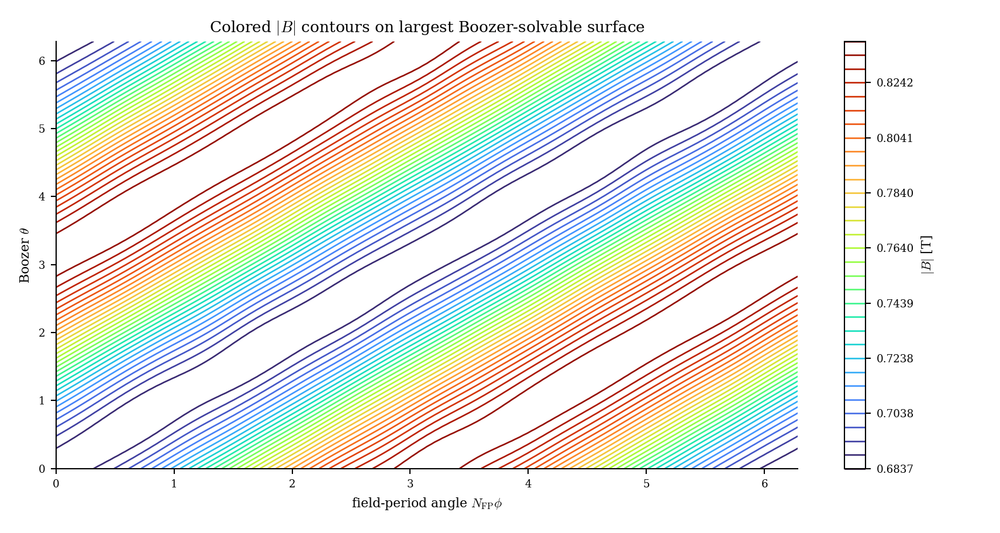

图 15 中等高线沿 QH 螺旋方向近似平直，QA 与 QP 误差比 QH 高约三个数量级。Poincare 截面和稠密残差同时确认该边界对应嵌套磁面。DESC 初态和终态保持嵌套，$\iota(\rho)$ 从约 1.444 平滑增至 1.456；50 步内归一化力残差降低约三个数量级，求解在步数上限处停止。完整的 8 张 DESC 图、交互式三维 HTML 和机器可读结果见[代表性样本完整评估报告](../qh_min_face_qh_full_evaluation_20260819.md)。

## 5. 结论

本文建立了一条从 Fourier 线圈到 QH 优化目标的固定预算 GPU 路线。磁轴、$s/\psi$、$\alpha/\iota$、体 QA/QH/QP 和工程量形成一组结构化物理元数据；独立、严格续接和近邻批量三种执行模式分别服务于跨样本评分、连续优化中心和大量差分端点。

Flow 的作用由三项相互衔接的证据支持。48 组条件的有限筛选说明训练先验能稳定提供有效且高质量的起点；局部景观实验说明随机潜方向对应更宽、更平滑的相关线圈形变；309 个同起点配对实验中，潜空间在 201 个样本上得到更高最佳分，并显著提高 90--92 分高分尾部的比例。本文因此采用潜空间作为高分搜索的主方法，并把墙钟更低、85 分覆盖更广的标准化原参数优化作为快速基线。两种坐标各自使用匹配其尺度的有限差分半径和学习率，配对结果对应两套端到端配置的性能。

309 条主轨迹进一步显示，64 方向有限差分 Adam 能把从 Flow 分布筛出的中等质量起点稳定推入 90--93 分区间，并把体 QH 误差中位数降低约一个数量级。768 位形和 1536 标准面的标定表明，体 QH 保持对面 QH 的强排序关系；自适应边界面的经验标定为 $E_{\mathrm{face}}\approx0.615E_{\mathrm{vol}}^{2.066}$，其对数残差标准差为 0.290 个十进数量级。GPU $\iota$ 与标准面值高度一致，$\alpha+\nu$ 能提供低残差标准磁面初值。代表性候选在较大磁面上呈现清晰 QH $|B|$ 结构，并通过 Simsopt、Poincare 与 DESC 的分层验收。

当前证据覆盖 QUASR QH 的 $N_{\mathrm{FP}}=2,\ldots,8$ 和 1--5 根基本线圈。快速体指标的职责是筛选、排序和优化；标准磁面与平衡计算给出最终验收。未来工作可围绕两点展开：一是把结构化元数据接口稳定发布，使用户策略直接定义分数组合；二是在保持正式中心核验的前提下，提高近邻批量代理的吞吐与局部精度。

## 附录 A. 结构化 JSON 的完整字段

### A.1 顶层结构

`EvaluationResult.to_dict()` 返回 `stellarator-native-evaluation-v1`。原生层中不可用的非有限值在 JSON 文件中转换为 `null`。

| 字段 | 类型 | 含义 |
|---|---|---|
| `schema` | string | 固定为 `stellarator-native-evaluation-v1` |
| `status` | string | `ok`、`no_axis`、`no_surface`、`drift_rejected`、`flux_rejected`、`alpha_failed`、`branch_lost` 或 `internal_error` |
| `score` | number | 当前 `ScorePolicy` 产生的用户分数 |
| `native_score` | number | C++/CUDA 默认分数 |
| `score_policy` | string | 分数策略名称 |
| `mode` | string | `independent`、`strict_continuation` 或 `neighborhood_proxy` |
| `target_helicity` | `[M,N]` | 目标螺旋模 |
| `input` | object | `nfp`、`n_base_coils`、`n_coefficients` 和 `current_unit="A"` |
| `requested_config` | object | Python 生产封装与调用者显式提交的覆盖项；完整原生默认值由运行清单另行记录 |
| `components` | object | 七个 0--100 分量，见 A.2 |
| `diagnostics` | object | 所有原生诊断字段，见 A.3--A.9 |
| `timing` | object | 32 个逐阶段计时，见 A.10 |

### A.2 分数组成

| 字段 | 含义 |
|---|---|
| `axis` | 磁轴闭合、椭圆稳定裕度和截面长宽比 |
| `psi` | $s$ 的独立方向误差与训练残差 |
| `surface` | 连续有效层和磁面尺寸 |
| `coordinate` | 磁通一致性、法向场与 $\alpha$ 拟合方程残差 |
| `volume_qs` | 目标体 QS，经尺寸和 $\iota$ 因子修正 |
| `iota` | QH 目标下最小 $|\iota|$ 的有界映射 |
| `coil` | 长度、曲率、间距、高模能量和电流的工程组合 |

### A.3 执行状态与磁轴字段

| 字段 | 含义 |
|---|---|
| `abi_version` | 二进制结果结构的版本号，用于检查 Python 与 C++ 是否按同一结构解释内存；当前为 10 |
| `struct_size` | 原生结果结构体字节数 |
| `status` | 原生整数状态码；顶层 `status` 提供对应字符串 |
| `stage_completed` | 0--8，依次表示未开始、磁场、磁轴、$s$、边界、磁通、$\alpha$、QS、完成 |
| `device_id` | CUDA 设备编号 |
| `flux_attempt_count` | 磁通边界尝试次数 |
| `score` | 原生总分；与顶层 `native_score` 相同 |
| `error_message` | 原生错误信息；成功时为空字符串 |
| `axis_R`, `axis_Z` | $\phi=0$ 截面的磁轴坐标，单位 m |
| `axis_residual` | 一个场周期后的固定点闭合残差，单位 m |
| `axis_topology_trace` | Poincare Jacobian 的迹 |
| `axis_topology_det` | Poincare Jacobian 的行列式 |
| `axis_ellipse_aspect` | 磁轴截面局部椭圆长宽比 |
| `axis_candidate_count` | 进入精修或记录的磁轴候选数 |
| `axis_used_hint` | 本次轴搜索是否使用给定初值 |
| `axis_hint_distance` | 精修轴相对给定初值的截面距离，单位 m |

### A.4 $s$、边界与磁通字段

| 字段 | 含义 |
|---|---|
| `psi_train_rms` | $\boldsymbol B\cdot\nabla s=0$ 训练系统 RMS |
| `psi_angle_mean` | 独立点 $|\epsilon_s|$ 均值 |
| `psi_angle_p95` | 独立点 $|\epsilon_s|$ 的 P95 |
| `psi_angle_l2` | 独立点 $\epsilon_s$ 的 $L^2$ |
| `surface_level` | 磁通条件修正后采用的边界层 $s_{\mathrm{edge}}$ |
| `surface_drift_relative_p95` | 选定边界的相对漂移 P95 |
| `surface_one_period_drift_relative_p95` | 一个场周期的相对漂移 P95 |
| `surface_effective_minor_radius` | 选定区域的有效小半径，单位 m |
| `surface_inverse_aspect_ratio` | 有效小半径与主半径之比 |
| `surface_volume` | 选定区域体积，单位 $\mathrm m^3$ |
| `surface_confidence_mean` | 候选层置信度均值 |
| `surface_confidence_edge` | 有效边界处置信度 |
| `surface_effective_level` | 置信度曲线径向积分得到的连续层 |
| `surface_confidence_risk` | 有效边界处平滑尾部漂移风险 |
| `stable_surface_count` | 记录为稳定的离散候选层数 |
| `surface_long_trace_periods_completed` | 完成的长追踪周期数；连续生产模式通常为 1 |
| `surface_long_trace_rejected_count` | 长追踪拒绝层数 |
| `flux_edge` | 边界环向磁通除以 $2\pi$ |
| `flux_fit_relative_rms` | $\psi(s)$ 多项式拟合相对 RMS |
| `flux_section_relative_std_edge` | 边界磁通在环向截面间的相对标准差 |
| `flux_boundary_residual_max` | 边界磁通拟合最大绝对残差 |
| `flux_derivative_min`, `flux_derivative_max` | 支持区间内 $d\psi/ds$ 的最小值和最大值 |

### A.5 直场线坐标与旋转变换字段

| 字段 | 含义 |
|---|---|
| `alpha_relative_l2` | 30000 条物理拟合方程去掉正则行后的相对 $L^2$；属于拟合自洽量 |
| `alpha_normal_B_relative_l2` | $s$ 误差对应法向磁场的相对 $L^2$ |
| `iota_min`, `iota_max` | $\rho\in[\rho_{\min},1]$ 上三次 $\iota(\rho^2)$ 的范围 |
| `alpha_column_count` | 联合 $\alpha/\iota$ 线性系统列数 |

### A.6 QS 与采样统计字段

| 字段 | 含义 |
|---|---|
| `qs_global_error` | 目标 $(M,N)$ 的全体积原始微分 QS RMS |
| `qs_edge_error` | 目标 $(M,N)$ 的外层区域微分 QS RMS |
| `qs_qa_global_error` | QA 的全体积原始误差 |
| `qs_qp_global_error` | 按 QP 螺旋模范数归一化后的全体积误差 |
| `qs_vacuum_G` | 真空环向场系数 $G$ |
| `qs_target_global_error_per_helicity` | 目标误差除以 $\sqrt{M^2+N^2}$ |
| `qs_target_edge_error_per_helicity` | 目标外层误差除以 $\sqrt{M^2+N^2}$ |
| `qs_qa_global_error_per_helicity` | QA 的单位螺旋模误差 |
| `qs_qp_global_error_raw` | QP 归一化前的原始误差 |
| `qs_qp_global_error_per_helicity` | QP 误差除以 $|N_{\mathrm{FP}}|$ |
| `qs_abs_p95` | 目标局部微分 QS 绝对值 P95 |
| `qs_abs_p95_per_helicity` | P95 除以目标螺旋模范数 |
| `volume_valid_fraction` | 进入体统计的有效点比例 |
| `volume_weight_effective_fraction` | 全体积权重的有效样本比例 |
| `edge_weight_effective_fraction` | 外层权重的有效样本比例 |
| `volume_candidate_count` | 体积点生成前的候选数 |
| `volume_available_count` | 几何筛选后可用点数 |
| `volume_point_count` | 实际进入体 QS 统计的点数 |

### A.7 默认分数内部字段

| 字段 | 含义 |
|---|---|
| `score_surface_size` | 由逆纵横比得到的饱和尺寸因子 |
| `score_iota` | 最小 $|\iota|$ 映射后的 0--1 因子 |
| `score_qs_residual` | 全体积与外层目标 QS 的混合因子 |
| `score_volume_qs_size_factor` | 体 QS 分量的尺寸乘子 |
| `score_volume_qs_iota_factor` | 体 QS 分量的 $\iota$ 乘子 |
| `score_before_qh_iota_gate` | 七分量加权平均后的 0--100 分数 |
| `score_qh_total_iota_factor` | QH 总分的低 $|\iota|$ 门因子 |
| `score_qh_helicity_advantage` | QH 相对 QA/QP 的竞争优势 |
| `score_qh_helicity_quality` | 竞争优势经线性与平滑窗口混合后的质量因子 |
| `score_qh_total_helicity_factor` | QH 总分的螺旋竞争门因子 |

### A.8 线圈工程字段

| 字段 | 含义 |
|---|---|
| `coil_length_mean` | 基本线圈长度均值，单位 m |
| `coil_curvature_p95` | 曲率 P95，单位 $\mathrm m^{-1}$ |
| `coil_curvature_max` | 最大曲率，单位 $\mathrm m^{-1}$ |
| `coil_min_intercoil_distance` | 完整对称线圈组最小线圈间距，单位 m |
| `coil_min_axis_distance` | 线圈点到设备旋转轴（$z$ 轴）的最小柱半径，单位 m |
| `coil_high_mode_energy_fraction` | $m\ge\lfloor0.6m_{\max}\rfloor=9$ 的 Fourier 几何能量占比 |
| `coil_current_abs_max_a` | 基本线圈最大电流绝对值，单位 A |

### A.9 计数与状态辅助字段

| 字段 | 含义 |
|---|---|
| `surface_long_trace_periods_completed` | 已完成的边界追踪周期数 |
| `surface_long_trace_rejected_count` | 因长追踪条件拒绝的层数 |
| `stable_surface_count` | 稳定候选层数量 |
| `axis_candidate_count` | 磁轴候选数量 |
| `volume_candidate_count`, `volume_available_count`, `volume_point_count` | 体积采样三个阶段的点数 |
| `alpha_column_count` | 联合坐标拟合未知量数量 |

这些字段在前述物理类别中已经解释，本表集中给出所有离散计数；原生结构的离散计数字段到此完整列出。

### A.10 逐阶段计时字段

| 字段 | 计时范围 |
|---|---|
| `total_s` | 原生评估总时间 |
| `field_create_s` | 线圈磁场对象建立 |
| `coil_geometry_s` | 线圈工程量计算 |
| `axis_search_s` | 磁轴总搜索 |
| `axis_trace_s` | 磁轴整周追踪与采样 |
| `psi_points_s` | $s$ 拟合点与矩阵数据准备 |
| `psi_fit_s` | $s$ 线性最小二乘求解 |
| `psi_validate_s` | $s$ 独立点检验 |
| `surface_screen_s` | 磁面候选筛选总计 |
| `flux_s` | 磁通阶段总计 |
| `volume_points_s` | 体积点生成与筛选 |
| `field_volume_s` | 体积点磁场与梯度计算 |
| `alpha_assemble_s` | $\alpha/\iota$ 线性系统构造 |
| `alpha_solve_s` | $\alpha/\iota$ 求解 |
| `qs_metrics_s` | QA/QH/QP 统计 |
| `score_s` | 七分量与总分映射 |
| `axis_domain_s` | 磁轴搜索域准备 |
| `axis_primary_grid_trace_s` | 主网格批量追踪 |
| `axis_fallback_grid_trace_s` | 补充网格批量追踪 |
| `axis_candidate_extract_s` | 固定点候选提取 |
| `axis_candidate_refine_s` | 候选 Newton 精修 |
| `axis_fp64_verify_s` | 可选 FP64 五线核验；生产续接 mode 2 为零 |
| `axis_topology_s` | 轴拓扑追踪与判定 |
| `surface_ray_roots_s` | 候选层射线根求解 |
| `surface_mixed_trace_s` | 混合精度边界追踪 |
| `surface_mixed_reduce_s` | 混合精度漂移归约 |
| `surface_fp64_trace_s` | 可选 FP64 边界追踪 |
| `surface_fp64_reduce_s` | 可选 FP64 漂移归约 |
| `surface_long_trace_s` | 多周期边界追踪；当前连续模式为固定短周期预算 |
| `surface_long_reduce_s` | 多周期漂移归约 |
| `flux_calibration_s` | $\psi(s)$ 积分、拟合与边界修正 |
| `surface_confidence_s` | 置信度、单调回归和连续边界积分 |

## 附录 B. 默认分数的精确映射

### B.1 七个分量

先定义默认分数使用的三个有界映射。第四个参数 $b$ 是输入非有限、尺度无效，或上升型映射的输入非正时采用的回退值：

$$
Q_d(x;s,p,b)=
\begin{cases}
\displaystyle\frac{1}{1+[\max(x,0)/s]^p},&x\ \text{有限且}\ s>0,\\
b,&\text{其余情况},
\end{cases}
$$

$$
Q_u(x;s,p,b)=
\begin{cases}
\displaystyle\frac{1}{1+(s/x)^p},&x\ \text{有限且}\ x>0,\ s>0,\\
b,&\text{其余情况},
\end{cases}
$$

$$
Q_s(x;s,b)=
\begin{cases}
W\!\left(\operatorname{clip}_{[0,1]}(x/s)\right),&x\ \text{有限且}\ x>0,\ s>0,\\
b,&\text{其余情况},
\end{cases}
\qquad W(y)=y^2(3-2y).
$$

各分量先在 0--1 内计算。下面未另作说明的下降型和饱和型物理残差使用 $b=0$。

磁轴分量为

$$
q_{\mathrm{axis}}=
0.70Q_d(r_{\mathrm{axis}};10^{-5},0.8,0)
+0.20q_{\mathrm{topology}}
+0.10Q_d(\max(A_{\mathrm{ellipse}}-1,0);1,1.2,0.8),
$$

其中

$$
\Delta_{\mathrm{elliptic}}
=2-\frac{|\operatorname{tr}J|}{\sqrt{\det J}},
\qquad
q_{\mathrm{topology}}=
\begin{cases}
0.1,&\text{候选轴未通过椭圆判定},\\
Q_s(\Delta_{\mathrm{elliptic}};0.02,0),&\text{候选轴通过椭圆判定}.
\end{cases}
$$

$s$ 拟合分量为

$$
q_{\psi}=0.58Q_d(\epsilon_{s,95};0.003,1.1,0)
+0.32Q_d(\epsilon_{s,2};0.001,1.1,0)
+0.10Q_d(r_{\mathrm{train}};0.005,1,0.45).
$$

连续边界分量为

$$
q_{\mathrm{surface}}=
0.65Q_s(A^{-1};0.03,0)
+0.35Q_s(s_{\mathrm{edge}};0.81,0).
$$

$A^{-1}$ 表示该边界的逆纵横比；$s_{\mathrm{edge}}$ 优先取磁通标定后选中的连续边界层，若该值非有限则取连续置信度积分给出的有效层。

磁通一致性先定义

$$
q_{\mathrm{flux}}=
0.75Q_d(\sigma_{\Phi};0.01,1,0)
+0.25Q_d(r_{\Phi,\max};2\times10^{-6},1,0),
$$

坐标分量为

$$
q_{\mathrm{coordinate}}=
0.35q_{\mathrm{flux}}
+0.35Q_d(r_{B_n};10^{-4},1,0)
+0.20Q_d(r_{\alpha};0.25,1,0)
+0.10.
$$

QH 目标下，程序在 $u_j=\rho_{\min}^2+j(1-\rho_{\min}^2)/256$ 上计算三次多项式 $\iota(u_j)$，其中 $\rho_{\min}=0.08$。令 $\iota_{\min}$ 和 $\iota_{\max}$ 为这 257 个值的最小值与最大值，并定义

$$
\iota_*=\begin{cases}
0,&\iota_{\min}\le0\le\iota_{\max},\\
\min(|\iota_{\min}|,|\iota_{\max}|),&\text{其余情况}.
\end{cases}
$$

$\iota$ 分量为

$$
q_{\iota}=
\left[\operatorname{clip}_{[0,1]}
\left(\frac{\iota_*}{1.0}\right)\right]^2.
$$

令 $E_g$ 与 $E_e$ 分别为单位螺旋模的全体积和外层目标误差，

$$
q_g=Q_d(E_g;0.05,0.9,0),
\qquad
q_e=Q_d(E_e;0.07,0.9,q_g),
\qquad
q_r=0.80q_g+0.20q_e,
$$

$$
q_{\mathrm{volume\_qs}}=
q_r\,[0.65+0.35Q_s(A^{-1};0.03,0)]
[0.50+0.50q_{\iota}].
$$

线圈工程分量为

$$
\begin{aligned}
q_{\mathrm{coil}}={}&0.16Q_d(L_{\mathrm{mean}};7,1.4,0.6)
+0.20Q_d(\kappa_{95};10,1.3,0.5)\\
&+0.12Q_d(\kappa_{\max};35,1.2,0.5)
+0.20Q_u(d_{cc};0.08,1.1,0.45)\\
&+0.12Q_u(d_{cz};0.20,1.2,0.45)
+0.13Q_d(e_{\mathrm{high}};0.05,1,0.7)\\
&+0.07Q_d(I_{\max};2\times10^6,1,0.7).
\end{aligned}
$$

$d_{cz}$ 是线圈离散点到设备旋转轴的最小柱半径；$e_{\mathrm{high}}$ 是 $m\ge9$ 的 Fourier 系数能量占比。

### B.2 QH 总分门函数

七分量加权平均为

$$
S_0=100\frac{10q_{\mathrm{axis}}+10q_{\psi}+10q_{\mathrm{surface}}
+10q_{\mathrm{coordinate}}+42q_{\mathrm{volume\_qs}}
+10q_{\iota}+8q_{\mathrm{coil}}}{100}.
$$

低 $|\iota|$ 门为

$$
g_{\iota}=0.10+0.90q_{\iota}.
$$

令 $E_t$ 为目标 QH 单位螺旋模误差，$E_c=\min(E_{\mathrm{QA}},E_{\mathrm{QP}})$，竞争优势为

$$
h=\operatorname{clip}_{[0,1]}\left(
\frac{E_c}{\max(E_t+E_c,10^{-300})}
\right).
$$

定义 $x=\operatorname{clip}_{[0,1]}((h-0.10)/0.20)$，$W(x)=x^2(3-2x)$，则

$$
q_h=0.20\operatorname{clip}_{[0,1]}\left(\frac{h}{0.30}\right)+0.80W(x),
$$

$$
g_h=0.10+0.90q_h,
\qquad
S=S_0g_{\iota}g_h.
$$

QA 或其他非 QH 目标下，这两个 QH 专用门因子取 1。

### B.3 早停状态的确定值

`no_axis`、`no_surface`、`drift_rejected`、`flux_rejected`、`alpha_failed` 和 `branch_lost` 仍进入同一总分映射。若计算在 $\alpha/\iota$ 阶段前结束，程序令

$$
q_{\mathrm{coordinate}}=0.08,
\qquad
q_{\iota}=0.04.
$$

若计算在体 QS 阶段前结束，程序令 $q_{\mathrm{volume\_qs}}=0.04$。已经完成的前序分量保留实际值；尚未形成的其余分量保持初始化值。`internal_error` 直接返回错误状态，不执行总分收尾。

## 附录 C. 复现身份与证据索引

| 项目 | 当前报告口径 |
|---|---|
| 报告修订分支 | `codex/data-space-large-scale-validation` |
| 二进制结果结构版本 | 10；仅用于校验 Python/C++ 接口一致性 |
| 生产 Python 覆盖 | `iota_degree=3`；连续边界；1 周期、128 角点、400 步；6 次磁通二分 |
| Flow 检查点 | EMA step 30000，SHA-256 `39a3293a459e248a0d1ec062607a1a467128b14d8ca973aadd82e113532ab99f` |
| Flow 结构 | 30333540 参数，8 层，宽度 512，8 头，SwiGLU 1408 |
| 当期三模式与 landscape 动态库 | SHA-256 `50877cdb7afa79433b2c337ac02953ac288b772a5c0cfc4658ec688a1d1791f5` |
| 当期 landscape 协议 | 3 个中心、每中心 4 个方向、3 类路径、31 个双侧位置；1095 个去重评分；FP32 RK4-256 |
| 309 轨迹动态库 | SHA-256 `7834a88d5437ba9910c78bb0eb5483efc71134579624ee2cc74100297a5799a3` |
| 309 轨迹协议 | 32 个独立起点；200 步；64 方向；$h=0.005$；$\eta=0.02$；$\beta_1=0.7$；$\beta_2=0.999$；FP32 RK4-128 |
| 309 组原参数实现 | 提交 `a80ca142`；复用同一解码起点和方向种子；200 步；64 方向；$h=0.0025$；$\eta=0.01$；$\beta_1=0.7$；$\beta_2=0.999$ |
| 48 组起点协议 | 15 种 $(N_{\mathrm{FP}},n_c)$ 组合；每组 Flow 与独立逐坐标高斯各 32 个候选；同一评分动态库 |

主要机器可读证据与完整说明位于：

- [309 条轨迹验收](../qh_adam_trajectory_dataset_pilot_acceptance_20260813.md)
- [768 位形与 1536 标准面标定](../qh_trajectory_face_qs_calibration_20260819.md)
- [代表性最小面 QH 样本完整评估](../qh_min_face_qh_full_evaluation_20260819.md)
- [309 组同起点完整配置比较与协议审计](../qh_data_space_large_scale_validation_20260825.md)
- [48 组 Flow 先验与独立原参数高斯对照](../qh_flow_initialization_vs_optimization_control_20260824.md)
- [当期三模式 benchmark 汇总](assets/evaluator_modes_current_20260824/analysis/summary.json)
- [309 组逐轨迹配对优化汇总](../assets/qh_data_space_large_validation_20260825/comparison_analysis/method_comparison_summary.json)
- [48 组起点对照汇总](../assets/qh_data_prior_end_to_end_48_20260824/summary.json)
- [当期 landscape 汇总](assets/landscape_current_20260824/summary.json)

性能结果同时保存代码提交、动态库哈希、输入清单、GPU 型号、预检与收尾记录。运行清单负责记录完整原生默认配置；JSON 的 `requested_config` 记录生产封装和调用者显式提交的覆盖项。
